                 

### 设计独特的人生乐章：创造个人生活的节奏

在快节奏的现代生活中，许多人发现自己被工作、家庭和其他责任所压垮，很难找到属于自己的时间与空间。正如软件工程师在设计复杂的系统时需要考虑架构与模块化，人生的设计同样需要精心的规划与平衡。本文旨在探讨如何通过逻辑清晰、结构紧凑的方式，设计并维护个人生活的节奏，从而创造一个既充实又和谐的人生乐章。

#### 关键词：
- 生活方式设计
- 个人生活节奏
- 工作与生活平衡
- 时间管理
- 心理健康

#### 摘要：
本文将深入探讨个人生活的节奏设计。首先，我们将分析人生节奏的概念与重要性，以及影响人生节奏的关键因素。接着，本文将介绍自我认知在人生节奏设计中的核心作用，并提供一系列工具与方法来帮助读者认识自己的节奏。然后，我们将讨论如何在工作中保持高效，同时提升生活质量，实现工作与生活的平衡。此外，本文还将探讨时间管理、健康生活方式对人生节奏的影响，并给出具体的方法与策略。最后，我们将探讨如何面对压力与挑战，调整并优化人生节奏，实现生命的意义与价值。

### 输出markdown格式的文章：

```markdown
# 设计独特的人生乐章：创造个人生活的节奏

## 第一部分：人生节奏的起源与理解

### 第1章：人生节奏的概念与重要性

#### 1.1 人生节奏的定义

人生节奏指的是一个人在日常生活中所遵循的规律和节奏。它包括工作、休息、娱乐、学习和休息等多个方面。人生节奏的设计和质量直接影响到个人的生活质量和工作效率。

#### 1.2 人生节奏的重要性

良好的生活节奏有助于提高生活质量，促进身心健康，增强工作效率，以及实现个人目标。一个有序且充满活力的人生节奏，是个人幸福与成功的基石。

#### 1.3 影响人生节奏的因素

- 个人性格
- 社会环境
- 工作性质
- 家庭责任
- 个人价值观

### 第2章：自我认知与人生节奏

#### 2.1 自我认知的重要性

自我认知是人生节奏设计的核心。只有了解自己的性格、兴趣、价值观和生活方式，才能设计出适合自己的人生节奏。

#### 2.2 认识自己的节奏

- 自我反思
- 日记记录
- 调查问卷
- 专业咨询

#### 2.3 自我认知的方法与工具

- 时间日志
- 兴趣爱好调查
- 性格测评工具
- 心理健康评估

## 第二部分：设计个人生活节奏

### 第3章：工作与生活平衡

#### 3.1 工作效率的提升

- 设定明确的目标
- 学会优先处理任务
- 避免拖延
- 保持良好的工作环境

#### 3.2 生活质量的提升

- 充足的休息与睡眠
- 合理的饮食
- 适度的锻炼
- 积极的社交活动

#### 3.3 工作与生活的平衡策略

- 时间管理技巧
- 工作生活分离
- 定期休假
- 保持积极心态

### 第4章：时间管理与人生节奏

#### 4.1 时间管理的重要性

时间管理是保持良好生活节奏的关键。合理的时间分配能够提高工作效率，减少压力，增加个人自由时间。

#### 4.2 时间管理的方法与技巧

- 制定日程表
- 使用时间跟踪工具
- 学会拒绝
- 保持专注

#### 4.3 建立个人时间表

- 工作时间与休息时间的规划
- 重要任务与次要任务的分配
- 假期与休闲活动的安排

### 第5章：健康与人生节奏

#### 5.1 身体健康的重要性

身体健康是人生的基础。良好的身体健康有助于保持良好的精神状态，提高生活质量。

#### 5.2 心理健康的维护

- 保持积极的心态
- 学会放松
- 建立支持系统
- 寻求专业帮助

#### 5.3 健康生活方式的建立

- 均衡饮食
- 定期锻炼
- 良好的睡眠习惯
- 保持社交活动

### 第三部分：调整与优化人生节奏

#### 第6章：面对压力与挑战

#### 6.1 压力的来源

- 工作压力
- 生活压力
- 心理压力

#### 6.2 应对压力的方法

- 认知行为疗法
- 放松技巧
- 健康生活方式
- 寻求支持

#### 6.3 挑战与成长

- 接受挑战
- 从错误中学习
- 培养适应能力

### 第7章：人生节奏的调整与优化

#### 7.1 节奏调整的原则

- 适应变化
- 保持灵活性
- 持续反思

#### 7.2 适应环境的变化

- 调整工作内容
- 调整生活习惯
- 调整社交圈

#### 7.3 不断优化人生节奏

- 定期评估
- 目标调整
- 方法优化

### 第8章：生命的意义与价值

#### 8.1 生命的意义

- 个人价值观的实现
- 对他人的帮助
- 社会贡献

#### 8.2 个人价值的实现

- 职业发展
- 继续教育
- 社交网络

#### 8.3 帮助他人，成就自我

- 志愿服务
- 培养下一代
- 社区参与

## 附录

### 附录1：实用工具与资源推荐

- 时间管理工具
- 心理健康应用
- 健康生活方式指南

### 附录2：人生节奏测试题

- 自我认知问卷
- 时间管理评估
- 健康生活方式评估

### 附录3：参考文献与推荐阅读

- 相关书籍
- 学术文章
- 优秀博客

---

### 作者信息：

作者：AI天才研究院/AI Genius Institute & 禅与计算机程序设计艺术 /Zen And The Art of Computer Programming
```

### Mermaid 流程图：

```mermaid
graph TD
A[自我认知] --> B{人生节奏的定义}
B --> C[工作与生活平衡]
C --> D[时间管理与健康]
D --> E[面对压力与挑战]
E --> F[人生节奏的调整与优化]
F --> G[生命的意义与价值]
```



### Python源代码：

```python
# 计算生命意义
def calculate_life_meaning(hours_worked, hours_recreation, hours_health):
    work_ratio = hours_worked / (hours_worked + hours_recreation + hours_health)
    health_ratio = hours_health / (hours_worked + hours_recreation + hours_health)
    meaning = work_ratio * 0.6 + health_ratio * 0.4
    return meaning

# 示例
meanings = [calculate_life_meaning(8, 4, 4) for i in range(5)]
print(meanings)
```

### 数学模型：

$$
\text{人生节奏平衡模型} = \frac{\text{工作效率} + \text{生活质量} + \text{健康水平}}{3}
$$

### 数学公式 & 详细讲解 & 举例说明：

#### 例子：一个人的工作时间、娱乐时间和健康时间的比例是 40%、30% 和 30%，计算其人生节奏平衡模型。

$$
\text{人生节奏平衡模型} = \frac{0.4 + 0.3 + 0.3}{3} = 0.4
$$

### 项目实战：

#### 代码实际案例：时间管理工具的实现

1. 开发环境搭建
2. 源代码详细实现
3. 代码解读与分析

---

以上为《设计独特的人生乐章：创造个人生活的节奏》的完整目录大纲。总字数控制在2000字以内。目录大纲的结构清晰，内容全面，涵盖了人生节奏的核心概念、设计原则、实施方法以及调整策略。同时，附录部分提供了实用工具和资源，便于读者实践和应用。通过Mermaid流程图、Python源代码、数学模型和项目实战等元素，增强了读者对人生节奏设计的理解和掌握。

### 注意事项：
- 在撰写文章时，确保每个小节的内容都具体详细，避免泛泛而谈。
- 使用Python源代码和数学模型时要确保代码正确，公式无误。
- 附录部分应提供有价值的工具和资源，帮助读者进一步学习和实践。
- 文章末尾应包括最佳实践建议和拓展阅读，以引导读者深入探索。

### 拓展阅读：
- 《深度工作》（Deep Work）作者：Cal Newport
- 《时间管理的艺术》（The Time Management Matrix）作者：Leslie G. Combs
- 《生命的智慧》（The Wisdom of Life）作者：Henry David Thoreau
- 《积极心理学》（Positive Psychology）作者：Martin Seligman

### 结束语：
设计独特的人生乐章，创造个人生活的节奏，不仅是一种生活方式的选择，更是一种对生命质量的追求。通过本文的探讨，希望读者能够找到属于自己的节奏，享受更加充实、和谐的人生。让我们一步步地分析和实践，共同谱写属于自己的生活乐章。作者：AI天才研究院/AI Genius Institute & 禅与计算机程序设计艺术/Zen And The Art of Computer Programming。

