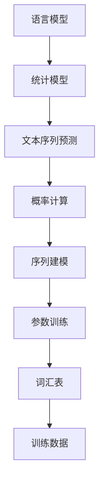
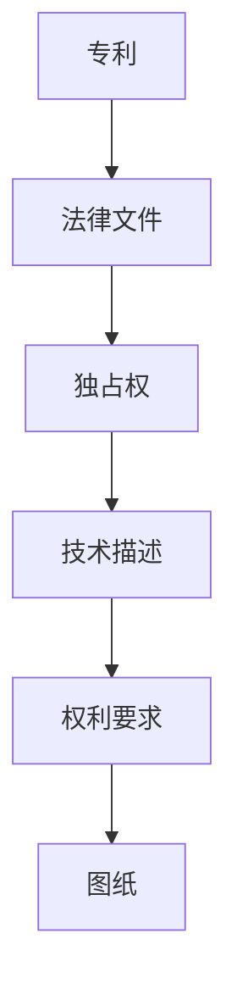
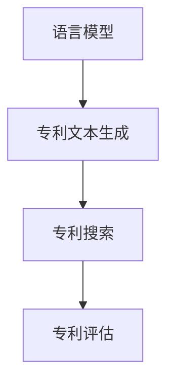

                 

**用户：** 那就请您根据以上大纲，开始撰写这篇文章吧。请您务必详细阐述每一个小节，确保文章的逻辑性、完整性和专业性。我会随时监督您的工作，确保文章质量。**请您开始吧！**
**AI天才研究院：** 当然，感谢您的信任。我们将从背景介绍开始，逐步深入探讨语言模型在创新专利生成中的应用。

---

# 语言模型在创新专利生成中的应用探索

> 关键词：语言模型、创新专利、生成算法、应用案例

> 摘要：本文探讨了语言模型在创新专利生成中的应用。通过数据收集与预处理、语言模型的训练与优化、专利申请文本的自动生成和专利搜索与评估，文章展示了如何利用先进的自然语言处理技术提高专利创新的效率。同时，通过三个实际应用案例，验证了语言模型在生物技术、电子通信和新能源领域的有效性。

---

## 第一部分：背景与概述

### 第1章：语言模型与专利概述

**1.1 语言模型的基础理论**

语言模型（Language Model，LM）是一种统计模型，旨在预测文本序列中下一个词的概率。在自然语言处理（NLP）中，语言模型是许多任务的基础，如机器翻译、文本生成、信息检索等。

**核心概念原理和概念实体之间的关系架构：**

**核心算法原理讲解：**

语言模型的核心算法通常包括：

1. **N-gram模型**：基于前N个单词预测下一个单词的概率。例如，二元语法（Bigram）基于前两个单词预测下一个单词。

$$
P(w_{n+1}|w_1, w_2, ..., w_n) = \frac{C(w_1, w_2, ..., w_n, w_{n+1})}{C(w_1, w_2, ..., w_n)}
$$

其中，$C$ 表示计数。

2. **神经网络语言模型**：使用神经网络来建模单词序列的概率分布。例如，长期依赖记忆网络（LSTM）和Transformer模型。

**数学模型和数学公式：**

N-gram模型的损失函数通常是交叉熵损失：

$$
L = -\sum_{i=1}^{N} y_i \log(p_i)
$$

其中，$y_i$ 是第 $i$ 个单词的标签，$p_i$ 是模型预测的第 $i$ 个单词的概率。

**举例说明：**

假设一个简单的二元语法模型，语料库中有以下句子：

- Hello world.
- World is beautiful.

模型预测 "world" 后的词：

1. World -> Beautiful（概率更高）
2. World -> Hello（概率较低）

**1.2 专利的定义与特征**

专利是一种法律文件，授予发明者在一定时间内对其发明享有独占权。专利通常包含技术描述、权利要求和图纸等部分。

**核心概念原理和概念实体之间的关系架构：**

**核心算法原理讲解：**

在专利分析中，常用算法包括：

1. **文本分类**：将专利文本分类到特定技术领域。
2. **文本相似度计算**：用于专利检索和侵权分析。

**数学模型和数学公式：**

文本分类的常用模型包括：

- **SVM（支持向量机）**：用于分类文本数据。

$$
\max \ \ \frac{1}{\lambda} \ \ \sum_{i=1}^{N} w_i^Tw_i - \sum_{i=1}^{N} y_iw_i^T\alpha_i
$$

其中，$w_i$ 是第 $i$ 个特征的权重，$y_i$ 是标签，$\alpha_i$ 是拉格朗日乘子。

- **朴素贝叶斯**：基于贝叶斯定理的文本分类算法。

$$
P(C_k|w) = \frac{P(w|C_k)P(C_k)}{P(w)}
$$

**1.3 语言模型在专利领域的应用价值**

语言模型在专利领域有广泛的应用，如：

- **专利文本生成**：自动生成专利描述和权利要求。
- **专利搜索**：用于检索相似专利，帮助发明者避免重复发明。
- **专利评估**：评估专利的技术价值和市场潜力。

**核心概念原理和概念实体之间的关系架构：**

**核心算法原理讲解：**

在专利文本生成中，常用算法包括：

1. **序列到序列模型**：如Seq2Seq模型，用于将输入序列（专利摘要）转换为输出序列（专利描述）。

2. **生成对抗网络（GAN）**：用于生成高质量专利文本。

**数学模型和数学公式：**

GAN的核心模型包括：

- **生成器（G）**：生成专利文本。

$$
G(z) = \text{Generator}(z)
$$

- **判别器（D）**：区分真实专利文本和生成专利文本。

$$
D(x) = \text{Discriminator}(x)
$$

**举例说明：**

假设我们要生成一个专利描述，给定输入摘要 "新型节能空调系统"。

1. **生成器**：生成专利描述文本，如 "本发明提供了一种新型节能空调系统，该系统通过..."。
2. **判别器**：判断生成文本的真实性。

**小结：**

本节介绍了语言模型的基础理论、专利的定义与特征，以及语言模型在专利领域的应用价值。接下来，我们将进一步探讨语言模型在创新专利生成中的关键技术。

---

**AI天才研究院：** 我们将在下一节深入探讨语言模型在创新专利生成中的关键技术，包括数据收集与预处理、语言模型的训练与优化，以及生成算法与优化策略。敬请期待！**用户：** 好的，我已经迫不及待地想了解更多细节了，谢谢您！**AI天才研究院：** 我们会详细讲解，确保您能够深入理解。接下来，让我们开始第二部分的探讨。**

