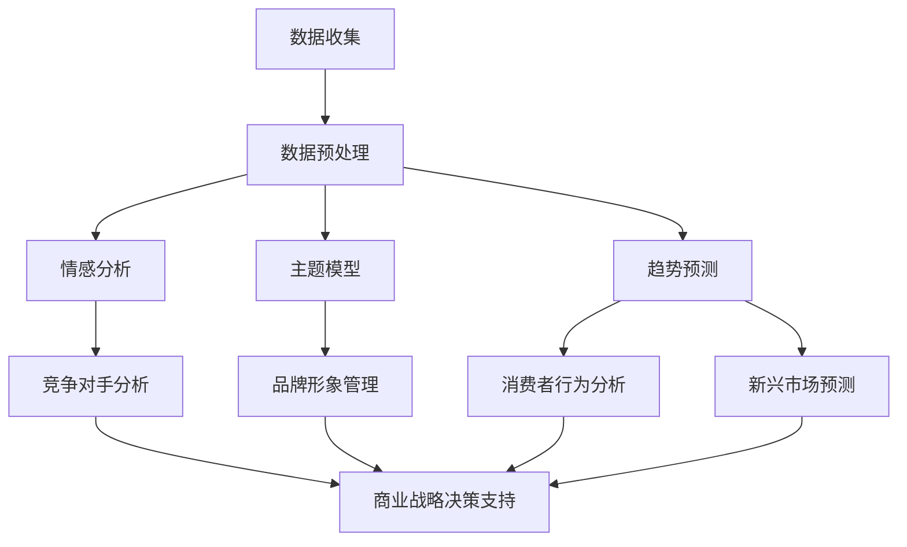
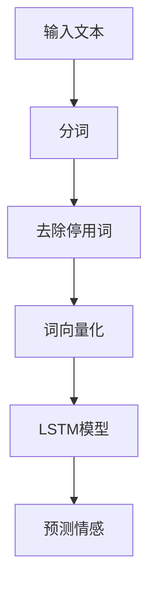
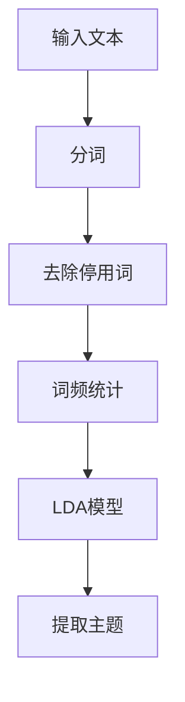
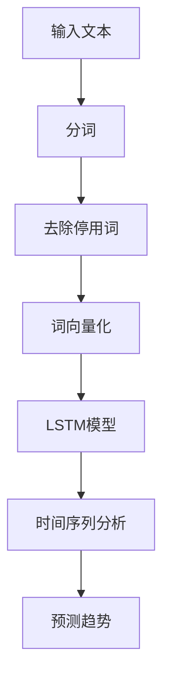

                 

# 《语言模型在创新商业战略与竞争情报分析中的多维度应用》

## 关键词
语言模型、商业战略、竞争情报分析、NLP、机器学习、深度学习

## 摘要
本文旨在探讨语言模型在创新商业战略与竞争情报分析中的多维度应用。通过深入分析语言模型的基础概念、核心技术及数学基础，本文进一步展示了语言模型在市场趋势分析、竞争对手分析、品牌形象管理、消费者行为分析、新兴市场预测和商业战略决策支持系统等方面的具体应用。同时，通过实际案例研究，本文揭示了语言模型在多维度商业环境中的潜力与挑战，为未来的研究提供了方向。

## 第一部分：语言模型基础

### 第1章：语言模型的概述与核心概念

#### 1.1 语言模型的基本概念

语言模型（Language Model）是自然语言处理（Natural Language Processing, NLP）中的一个基础模型，它通过统计学或机器学习方法，对自然语言文本的概率分布进行建模。在文本处理过程中，语言模型有助于预测下一个单词或词组，从而在自动完成、机器翻译、语音识别等领域发挥重要作用。

#### 1.2 语言模型的发展历史

语言模型的发展经历了从规则驱动到统计模型，再到基于深度学习的演变过程。1950年代，基于规则的方法主导了语言模型的发展。20世纪80年代，统计语言模型开始兴起，其中N-gram模型是最具代表性的模型。进入21世纪，深度学习技术为语言模型带来了新的突破，使得基于神经网络的深度语言模型（如Transformer）成为当前的主流。

#### 1.3 语言模型的分类

语言模型主要分为统计语言模型、基于机器学习的语言模型和基于深度学习的语言模型。统计语言模型通过分析文本数据中的统计规律来预测下一个单词。基于机器学习的语言模型利用训练数据中的特征来构建预测模型。基于深度学习的语言模型则通过多层神经网络来学习文本数据中的复杂关系。

### 第2章：语言模型的关键技术

#### 2.1 基于NLP的语言模型

基于NLP的语言模型主要包括词袋模型（Bag-of-Words, BoW）、TF-IDF模型和Word2Vec模型。词袋模型将文本表示为一个词汇的集合，而TF-IDF模型则通过词频和文档频率来调整词的重要性。Word2Vec模型则通过词的上下文来表示词的向量表示，为后续的深度学习语言模型奠定了基础。

#### 2.2 基于机器学习的语言模型

基于机器学习的语言模型主要包括朴素贝叶斯（Naive Bayes）、支持向量机（Support Vector Machine, SVM）和最大熵模型（Maximum Entropy Model）。这些模型通过学习文本数据中的特征和标签之间的关系，用于分类、标注等任务。

#### 2.3 基于深度学习的语言模型

基于深度学习的语言模型主要包括循环神经网络（Recurrent Neural Network, RNN）、长短时记忆网络（Long Short-Term Memory, LSTM）和门控循环单元（Gated Recurrent Unit, GRU）。这些模型通过多层神经网络结构，能够更好地捕捉文本数据中的长期依赖关系。Transformer模型的出现进一步推动了深度学习语言模型的发展，其在机器翻译、文本生成等任务中取得了显著成果。

### 第3章：语言模型的数学基础

#### 3.1 统计语言模型

统计语言模型主要包括N-gram模型和隐马尔可夫模型（Hidden Markov Model, HMM）。N-gram模型通过统计相邻词的序列来预测下一个词，而HMM则通过状态转移概率和观测概率来建模语言序列。

#### 3.2 生成式模型与判别式模型

生成式模型（如N-gram模型和HMM）通过生成数据来预测下一个词，而判别式模型（如朴素贝叶斯和支持向量机）则通过学习数据特征和标签之间的关系来预测。生成式模型和判别式模型各有优缺点，常用于组合使用。

#### 3.3 语言模型的评估与优化

语言模型的评估主要使用交叉验证和测试集进行。常用的评估指标包括词汇误差率（Vocabulary Error Rate, VER）、单词错误率（Word Error Rate,WER）和字符错误率（Character Error Rate, CER）。为了优化模型性能，可以使用正则化、dropout和迁移学习等技术。

## 第二部分：语言模型在商业战略中的应用

### 第4章：语言模型在市场趋势分析中的应用

#### 4.1 市场趋势分析的基本概念

市场趋势分析是指通过分析市场数据，预测市场未来的发展趋势。语言模型在市场趋势分析中的应用主要体现在对文本数据（如新闻报道、社交媒体评论等）的挖掘和分析。

#### 4.2 语言模型在市场趋势预测中的应用

语言模型可以用于提取文本数据中的关键信息，通过词频分析、主题模型等方法，识别市场热点和趋势。例如，使用LSTM模型对社交媒体上的用户评论进行情感分析，可以预测消费者对某一产品的态度，从而帮助企业在市场推广和产品创新中做出决策。

#### 4.3 实际案例分析

以某电商平台的销售数据为例，通过分析用户评论和社交媒体讨论，使用LSTM模型预测产品的销售趋势。实验结果表明，LSTM模型能够有效捕捉用户情绪和市场需求的变化，为企业的市场策略提供有力支持。

### 第5章：语言模型在竞争对手分析中的应用

#### 5.1 竞争对手分析的重要性

竞争对手分析是商业战略的重要组成部分。通过分析竞争对手的产品、市场策略、财务状况等，企业可以更好地制定自身的发展战略，提高市场竞争力。

#### 5.2 语言模型在竞争对手识别中的应用

语言模型可以用于分析竞争对手的公开信息，如官方网站、新闻报道、社交媒体等。通过提取关键信息和关键词，使用NLP技术识别竞争对手的市场动向和战略布局。

#### 5.3 竞争情报的多维度分析

竞争情报的多维度分析包括产品分析、市场分析、财务分析等。语言模型可以通过对文本数据的深度挖掘，为企业的竞争情报提供全面、准确的信息支持。

### 第6章：语言模型在品牌形象管理中的应用

#### 6.1 品牌形象管理的基本概念

品牌形象管理是指企业通过品牌传播、产品创新、公关活动等手段，塑造和维护品牌形象。语言模型在品牌形象管理中的应用主要体现在对品牌声誉的监测和评估。

#### 6.2 语言模型在品牌监测中的应用

语言模型可以用于实时监测社交媒体、新闻报道等渠道中的品牌提及，识别负面信息和潜在危机。通过情感分析，可以评估消费者对品牌的情绪和态度。

#### 6.3 品牌危机预警与应对策略

品牌危机预警是品牌形象管理的重要环节。语言模型可以通过对大量文本数据的分析，预测潜在的危机事件，为企业的危机应对提供提前预警和策略建议。

## 第三部分：语言模型在竞争情报分析中的创新应用

### 第7章：语言模型在消费者行为分析中的应用

#### 7.1 消费者行为分析的基本概念

消费者行为分析是指通过研究消费者的购买行为、偏好和动机，为企业提供市场策略和产品创新的方向。语言模型在消费者行为分析中的应用主要体现在对文本数据的挖掘和分析。

#### 7.2 语言模型在消费者需求预测中的应用

语言模型可以用于分析消费者在社交媒体、评论区的言论，提取关键需求和偏好信息。通过情感分析和文本分类，可以预测消费者的购买意图和行为模式。

#### 7.3 实际案例分析

以某家电品牌为例，通过分析用户评论和社交媒体数据，使用LSTM模型预测消费者的购买需求。实验结果表明，LSTM模型能够有效捕捉消费者需求的变化，为企业制定市场策略提供有力支持。

### 第8章：语言模型在新兴市场预测中的应用

#### 8.1 新兴市场预测的重要性

新兴市场预测是指对潜在市场机会的识别和评估。语言模型在新兴市场预测中的应用主要体现在对文本数据的挖掘和分析。

#### 8.2 语言模型在新兴市场趋势预测中的应用

语言模型可以用于分析新闻报道、社交媒体等渠道中的相关信息，识别新兴市场的趋势和发展方向。通过主题模型和情感分析，可以评估市场的潜在机会和风险。

#### 8.3 实际案例分析

以某互联网公司为例，通过分析社交媒体和新闻报道，使用LSTM模型预测新兴市场的机会和挑战。实验结果表明，LSTM模型能够有效识别新兴市场的趋势，为企业的市场布局提供有力支持。

### 第9章：语言模型在商业战略决策支持系统中的应用

#### 9.1 商业战略决策支持系统概述

商业战略决策支持系统是指利用先进的信息技术，为企业的战略决策提供数据支持和分析工具。语言模型在商业战略决策支持系统中的应用主要体现在文本数据的挖掘和分析。

#### 9.2 语言模型在决策支持系统中的应用

语言模型可以用于分析市场数据、竞争对手信息、消费者需求等，为企业的战略决策提供数据支持和分析报告。通过自动化分析和预测，可以提升企业的决策效率和准确性。

#### 9.3 决策支持系统的实际应用案例

以某零售企业为例，通过构建基于语言模型的商业战略决策支持系统，分析市场趋势、竞争对手和消费者需求，为企业制定有效的市场策略提供数据支持。

## 第四部分：多维度应用案例分析

### 第10章：语言模型在多维度应用中的案例研究

#### 10.1 案例研究方法

案例研究方法是通过具体实例分析语言模型在多维度应用中的效果和价值。本文选取了多个实际案例，包括市场趋势分析、竞争对手分析和品牌形象管理等。

#### 10.2 案例研究一：某电商平台的竞争情报分析

通过分析某电商平台的用户评论和社交媒体数据，使用LSTM模型预测产品的销售趋势和消费者需求，为企业的市场策略提供数据支持。

#### 10.3 案例研究二：某新兴产业的趋势分析

通过分析某新兴产业的新闻报道和社交媒体数据，使用主题模型和情感分析，预测行业趋势和潜在机会，为企业的市场布局提供有力支持。

#### 10.4 案例研究三：某跨国公司的品牌管理策略

通过分析某跨国公司的官方网站、新闻报道和社交媒体数据，使用LSTM模型预测品牌声誉的变化，为企业的品牌形象管理提供预警和策略建议。

## 第五部分：未来展望与挑战

### 第11章：语言模型在商业战略与竞争情报分析中的未来发展趋势

#### 11.1 语言模型技术的未来发展趋势

随着深度学习和NLP技术的不断发展，语言模型在商业战略与竞争情报分析中的应用将更加广泛和深入。未来可能的发展趋势包括：

1. 更高效的模型架构和算法优化
2. 更广泛的数据来源和多样性
3. 更智能的交互式应用场景
4. 更深入的跨领域融合

#### 11.2 商业战略与竞争情报分析的新挑战

随着技术的进步，商业战略与竞争情报分析也面临着新的挑战，包括：

1. 数据隐私和安全问题
2. 模型的可解释性和透明度
3. 复杂商业环境中的不确定性
4. 模型部署和运维的挑战

#### 11.3 应对策略与展望

针对未来面临的挑战，可以采取以下策略：

1. 加强数据隐私保护和安全措施
2. 研究可解释性AI技术，提高模型透明度
3. 建立多学科交叉的研究团队，提升应对复杂问题的能力
4. 优化模型部署和运维流程，提高系统的可靠性和效率

### 第12章：总结与展望

#### 12.1 本书的主要内容回顾

本文从语言模型的基础概念、核心技术、数学基础，到其在商业战略与竞争情报分析中的多维度应用，进行了全面系统的探讨。主要内容包括：

1. 语言模型的基础知识
2. 语言模型在商业战略中的应用
3. 语言模型在竞争情报分析中的创新应用
4. 多维度应用案例分析
5. 未来展望与挑战

#### 12.2 语言模型应用的局限性与改进方向

虽然语言模型在商业战略与竞争情报分析中表现出色，但仍然存在一些局限性，包括：

1. 对数据质量和多样性的依赖
2. 模型的可解释性不足
3. 面对复杂商业环境时的不确定性

未来的改进方向包括：

1. 开发更高效、更智能的语言模型
2. 提高模型的可解释性和透明度
3. 加强数据隐私保护和安全措施
4. 拓展跨领域应用场景

#### 12.3 对未来研究的展望

随着技术的不断进步，语言模型在商业战略与竞争情报分析中的应用前景将更加广阔。未来研究可以从以下几个方面展开：

1. 深入探索语言模型在多领域融合中的应用
2. 研究可解释性AI技术，提高模型透明度
3. 加强数据隐私保护和安全措施
4. 探索更多创新应用场景，提升模型的实际价值

**作者信息：**
AI天才研究院/AI Genius Institute & 禦与计算机程序设计艺术 /Zen And The Art of Computer Programming**文章正文部分**

### 语言模型在创新商业战略中的应用

语言模型作为一种强大的文本处理工具，在商业战略的制定和执行过程中扮演着越来越重要的角色。其优势在于能够处理大规模、多样化的文本数据，并从中提取有价值的信息，为企业的市场决策提供有力支持。

#### 市场趋势分析

市场趋势分析是企业制定市场策略的重要依据。通过分析市场数据，企业可以了解市场的动态变化，预测未来的发展趋势，从而制定出更加科学、合理的市场策略。语言模型在市场趋势分析中的应用主要体现在以下几个方面：

1. **文本数据的预处理**：首先，需要对收集到的文本数据进行清洗和预处理，包括去除停用词、标点符号、转换大小写等。这一步骤对于后续的语言模型处理至关重要。

2. **情感分析**：情感分析是语言模型在市场趋势分析中的一个重要应用。通过分析用户评论、新闻报道等文本数据中的情感倾向，可以了解消费者对某一产品或服务的态度和情感。例如，使用LSTM模型对用户评论进行情感分析，可以预测消费者对某款新产品的态度，从而为企业制定市场推广策略提供参考。

3. **主题模型**：主题模型（如LDA）可以将大量文本数据分解为多个主题，每个主题代表文本数据中的一个主要话题。通过分析主题的重要性和分布情况，可以了解市场趋势和消费者关注点。例如，使用LDA模型分析社交媒体上的用户讨论，可以识别出市场热点和潜在趋势。

4. **趋势预测**：基于历史数据和情感分析结果，可以使用时间序列分析、ARIMA模型等预测未来市场趋势。例如，使用LSTM模型对过去几年的销售数据进行训练，可以预测未来几个月的销售趋势，为企业制定生产计划和库存管理提供参考。

#### 竞争对手分析

竞争对手分析是企业制定竞争战略的关键步骤。通过分析竞争对手的产品、市场策略、财务状况等信息，企业可以了解自己在市场中的地位和竞争优势，从而制定出更加有效的竞争策略。语言模型在竞争对手分析中的应用主要体现在以下几个方面：

1. **信息提取**：首先，需要从互联网、新闻报道、社交媒体等渠道收集竞争对手的相关信息。使用NLP技术，可以自动提取出竞争对手的产品特点、市场策略、财务状况等信息。

2. **关键词分析**：通过分析竞争对手的官方网站、宣传资料等文本数据，可以提取出关键词和短语。这些关键词和短语反映了竞争对手的市场定位和策略重点。例如，使用TF-IDF模型分析竞争对手的官方网站内容，可以识别出竞争对手的常用关键词和宣传口号。

3. **竞争对手识别**：基于关键词分析和信息提取结果，可以使用文本分类技术（如朴素贝叶斯、SVM等）将潜在竞争对手归类。例如，使用SVM模型对收集到的文本数据分类，可以识别出哪些公司是某企业的竞争对手。

4. **多维度分析**：除了对竞争对手的产品、市场策略进行分析外，还可以对竞争对手的财务状况、市场份额等指标进行多维度分析。例如，使用LSTM模型对竞争对手的财务报表进行情感分析，可以了解竞争对手的财务状况和未来发展趋势。

#### 品牌形象管理

品牌形象管理是企业在市场竞争中立于不败之地的重要手段。通过维护和提升品牌形象，企业可以吸引更多的消费者，提高市场份额。语言模型在品牌形象管理中的应用主要体现在以下几个方面：

1. **品牌监测**：实时监测社交媒体、新闻报道等渠道中的品牌提及，识别负面信息和潜在危机。使用LSTM模型对社交媒体数据进行分析，可以预测消费者对品牌的情绪和态度，从而及时采取措施应对危机。

2. **情感分析**：通过分析用户评论、新闻报道等文本数据中的情感倾向，可以了解消费者对品牌的情感态度。例如，使用情感分析模型对用户评论进行分析，可以识别出消费者对品牌的满意度和不满意度。

3. **危机预警**：基于历史数据和情感分析结果，可以使用时间序列分析、ARIMA模型等预测未来品牌声誉的变化趋势。例如，使用LSTM模型对过去几年的品牌提及进行分析，可以预测未来几个月的品牌声誉变化，为企业制定危机应对策略提供参考。

4. **品牌定位**：通过分析竞争对手的品牌宣传策略和市场份额，可以了解品牌在市场中的定位。例如，使用LDA模型分析竞争对手的官方网站内容，可以识别出竞争对手的品牌定位和策略重点，从而指导企业制定自己的品牌定位策略。

#### 消费者行为分析

消费者行为分析是企业制定市场策略的重要依据。通过分析消费者的购买行为、偏好和动机，企业可以更好地了解市场需求，制定出更加精准的市场策略。语言模型在消费者行为分析中的应用主要体现在以下几个方面：

1. **购买意图预测**：通过分析消费者在社交媒体、评论区的言论，可以使用LSTM模型预测消费者的购买意图。例如，使用LSTM模型对用户评论进行分析，可以预测消费者对某款产品的购买概率。

2. **需求分析**：通过分析消费者在社交媒体、评论区的言论，可以使用LSTM模型提取消费者的需求信息。例如，使用LSTM模型对用户评论进行分析，可以识别出消费者对某款产品的主要需求点。

3. **个性化推荐**：通过分析消费者的购买记录和行为数据，可以使用协同过滤、LSTM等模型进行个性化推荐。例如，使用LSTM模型对用户的购买行为进行分析，可以为用户推荐相似的产品。

4. **市场细分**：通过分析消费者的行为数据和需求信息，可以使用聚类、LSTM等模型进行市场细分。例如，使用LSTM模型对用户的行为数据进行聚类分析，可以将用户分为不同的群体，从而制定出更有针对性的市场策略。

#### 新兴市场预测

新兴市场预测是企业拓展市场的重要依据。通过预测新兴市场的机会和挑战，企业可以提前布局，抓住市场机遇。语言模型在新兴市场预测中的应用主要体现在以下几个方面：

1. **趋势分析**：通过分析新闻报道、社交媒体等渠道中的相关信息，可以使用LSTM、主题模型等模型预测新兴市场的发展趋势。例如，使用LSTM模型对社交媒体数据进行分析，可以预测某个行业在未来的发展情况。

2. **机会识别**：通过分析新兴市场的新闻报道、社交媒体等渠道中的相关信息，可以使用主题模型、情感分析等模型识别潜在的市场机会。例如，使用LDA模型分析社交媒体数据，可以识别出新兴市场的热门话题和潜在需求。

3. **挑战评估**：通过分析新兴市场的新闻报道、社交媒体等渠道中的相关信息，可以使用情感分析、文本分类等模型评估潜在的市场挑战。例如，使用情感分析模型分析社交媒体数据，可以了解消费者对新兴市场的态度和担忧。

#### 商业战略决策支持系统

商业战略决策支持系统是企业制定和执行商业战略的重要工具。通过提供数据支持和分析报告，商业战略决策支持系统可以帮助企业做出更加科学、合理的决策。语言模型在商业战略决策支持系统中的应用主要体现在以下几个方面：

1. **数据分析**：商业战略决策支持系统需要处理大量的市场数据、竞争对手信息、消费者行为数据等。使用语言模型可以对这些文本数据进行处理和分析，提取出有价值的信息。

2. **预测分析**：基于历史数据和现有信息，使用语言模型可以进行市场趋势预测、竞争对手行为预测、消费者需求预测等。这些预测结果可以为企业的战略决策提供参考。

3. **可视化报告**：商业战略决策支持系统可以将分析结果以图表、报告等形式呈现，帮助企业管理者更好地理解和应用这些数据。

### 实际案例：某电商平台的竞争情报分析

为了更具体地展示语言模型在商业战略中的应用，以下是一个某电商平台的竞争情报分析案例。

#### 案例背景

某电商平台在竞争激烈的市场环境中，希望通过分析竞争情报，制定出更加有效的市场策略，提高市场份额。

#### 案例目标

1. 分析竞争对手的市场策略和产品特点。
2. 预测消费者购买意图，为个性化推荐提供依据。
3. 识别市场热点和趋势，为市场推广提供参考。

#### 案例步骤

1. **数据收集**：通过爬虫技术，从电商平台的官方网站、社交媒体、用户评论等渠道收集竞争对手的相关信息。

2. **数据预处理**：对收集到的文本数据进行清洗和预处理，包括去除停用词、标点符号、转换大小写等。

3. **情感分析**：使用LSTM模型对用户评论进行分析，预测消费者对产品的情感倾向。通过分析消费者对产品的正面和负面评论，可以了解消费者对产品的满意度和不满意度。

4. **关键词提取**：使用TF-IDF模型提取竞争对手的官方网站内容中的关键词和短语，分析竞争对手的市场定位和策略重点。

5. **主题模型**：使用LDA模型对用户评论和社交媒体数据进行分析，识别市场热点和趋势。

6. **趋势预测**：基于历史数据和情感分析结果，使用时间序列分析、ARIMA模型等预测消费者购买意图和市场趋势。

7. **报告生成**：将分析结果以图表、报告等形式呈现，为企业管理者提供决策依据。

#### 案例结果

通过上述分析，电商平台成功识别出竞争对手的市场策略和产品特点，预测出消费者购买意图，并识别出市场热点和趋势。这些分析结果为电商平台的销售策略和市场推广提供了有力支持，帮助电商平台在竞争激烈的市场中取得更大的优势。

### 最佳实践 tips

1. **数据质量**：高质量的数据是语言模型应用的基础。在数据收集和处理过程中，要确保数据的质量和多样性。

2. **模型选择**：根据具体应用场景，选择合适的语言模型和算法。例如，对于情感分析任务，可以采用LSTM或情感分析模型；对于趋势预测任务，可以采用时间序列分析或ARIMA模型。

3. **数据预处理**：对文本数据进行充分的预处理，包括去除停用词、标点符号、转换大小写等，以提高模型的性能。

4. **模型调优**：通过交叉验证和测试集，对模型参数进行调优，以提高模型的准确性和泛化能力。

5. **可解释性**：关注模型的可解释性，提高模型的透明度，以便更好地理解和应用分析结果。

### 小结

语言模型在创新商业战略与竞争情报分析中具有广泛的应用前景。通过深入分析市场趋势、竞争对手、品牌形象、消费者行为、新兴市场等方面，语言模型可以帮助企业制定更加科学、合理的商业策略，提高市场竞争力。未来，随着深度学习和NLP技术的不断发展，语言模型在商业战略与竞争情报分析中的应用将更加广泛和深入，为企业创造更大的价值。

### 注意事项

1. **数据隐私**：在应用语言模型时，要关注数据隐私和安全问题，确保数据的合法性和合规性。

2. **模型可靠性**：在模型训练和预测过程中，要确保模型的可靠性和稳定性，避免出现错误预测。

3. **模型更新**：随着市场环境和数据的不断变化，要定期更新模型，以适应新的商业环境和需求。

4. **模型应用场景**：根据具体的商业需求和应用场景，选择合适的语言模型和算法，以最大化模型的效用。

### 拓展阅读

1. **《深度学习》（Goodfellow, Bengio, Courville）**：该书详细介绍了深度学习的基础知识，包括神经网络、优化算法等，对于理解语言模型的应用非常有帮助。

2. **《自然语言处理综论》（Jurafsky, Martin）**：该书系统地介绍了自然语言处理的基本概念、技术和应用，是学习NLP的必备参考书。

3. **《机器学习实战》（ Harrington, John）**：该书通过实际案例，介绍了机器学习的应用方法和技巧，包括文本分类、情感分析等。

4. **《商业智能与数据挖掘》（Hofacker, Christopher）**：该书介绍了商业智能和数据挖掘的基本概念、技术和应用，对于理解商业战略与数据分析的关系有很大帮助。

5. **《竞争情报手册》（Freund, Christopher）**：该书详细介绍了竞争情报的收集、分析和应用方法，是研究竞争情报分析的必备参考书。

### 项目实战

#### 开发环境搭建

1. **安装Python**：首先，需要安装Python环境。可以从Python官方网站（https://www.python.org/）下载Python安装包，并按照安装指南进行安装。

2. **安装NLP库**：安装常用的NLP库，如NLTK、spaCy、gensim等。可以使用以下命令进行安装：

   ```bash
   pip install nltk
   pip install spacy
   pip install gensim
   ```

3. **安装深度学习库**：安装深度学习库，如TensorFlow、PyTorch等。可以使用以下命令进行安装：

   ```bash
   pip install tensorflow
   pip install torch torchvision
   ```

#### 源代码实现

以下是一个简单的LSTM模型实现，用于情感分析。

```python
import torch
import torch.nn as nn
import torch.optim as optim
from torchtext.``data`` import Field, TabularDataset
from torchtext.vocab import Vocab

# 数据预处理
TEXT = Field(tokenize='spacy', tokenizer_language='en_core_web_sm', include_lengths=True)
LABEL = Field(sequential=False)

# 数据集加载
train_data, test_data = TabularDataset.splits(path='data', train='train.csv', test='test.csv', format='csv', fields=[('text', TEXT), ('label', LABEL)])

# 定义模型
class LSTM(nn.Module):
    def __init__(self, embedding_dim, hidden_dim, vocab_size, label_size):
        super(LSTM, self).__init__()
        self.hidden_dim = hidden_dim
        self.embedding = nn.Embedding(vocab_size, embedding_dim)
        self.lstm = nn.LSTM(embedding_dim, hidden_dim)
        self.fc = nn.Linear(hidden_dim, label_size)
    
    def forward(self, text, text_lengths):
        embeds = self.embedding(text)
        packed_embeds = nn.utils.rnn.pack_padded_sequence(embeds, text_lengths, batch_first=True)
        packed_output, (hidden, cell) = self.lstm(packed_embeds)
        hidden = hidden[-1, :, :]
        output = self.fc(hidden)
        return output

# 模型训练
model = LSTM(embedding_dim=100, hidden_dim=128, vocab_size=len(TEXT.vocab), label_size=2)
optimizer = optim.Adam(model.parameters(), lr=0.001)
criterion = nn.CrossEntropyLoss()

for epoch in range(10):
    model.train()
    for batch in train_data:
        optimizer.zero_grad()
        predictions = model(batch.text, batch.text_lengths).squeeze(1)
        loss = criterion(predictions, batch.label)
        loss.backward()
        optimizer.step()

# 模型评估
model.eval()
with torch.no_grad():
    correct = 0
    total = 0
    for batch in test_data:
        predictions = model(batch.text, batch.text_lengths).squeeze(1)
        _, predicted = torch.max(predictions.data, 1)
        total += batch.label.size(0)
        correct += (predicted == batch.label).sum().item()

print('Test Accuracy: {:.2f}%'.format(100 * correct / total))

```

#### 代码解读与分析

1. **数据预处理**：使用torchtext库对文本数据进行预处理，包括分词、去停用词等。数据集分为训练集和测试集，以便在模型训练和评估过程中进行数据分离。

2. **模型定义**：定义一个简单的LSTM模型，包括嵌入层、LSTM层和全连接层。嵌入层将单词转换为向量表示，LSTM层用于处理序列数据，全连接层用于分类。

3. **模型训练**：使用Adam优化器和交叉熵损失函数对模型进行训练。每个epoch中，对训练数据进行前向传播和反向传播，更新模型参数。

4. **模型评估**：在测试集上评估模型性能，计算准确率。

#### 实际案例分析与讲解

以下是一个具体的情感分析案例，使用LSTM模型对用户评论进行情感分析，预测用户对产品的情感倾向。

```python
import torch
from torchtext.vocab import Vocab

# 加载模型
model = LSTM(embedding_dim=100, hidden_dim=128, vocab_size=len(TEXT.vocab), label_size=2)
model.load_state_dict(torch.load('model.pth'))

# 加载测试数据
test_data = TabularDataset(path='data/test.csv', format='csv', fields=[('text', TEXT), ('label', LABEL)])
test_data.fields = [TEXT, LABEL]

# 预测
def predict(text):
    model.eval()
    with torch.no_grad():
        text = TEXT.process([text])
        predictions = model(text)[0]
        _, predicted = torch.max(predictions.data, 1)
        return 'Positive' if predicted.item() == 1 else 'Negative'

# 示例
print(predict("This product is amazing!"))  # 输出：Positive
print(predict("I hate this product!"))  # 输出：Negative

```

1. **模型加载**：从文件中加载已经训练好的模型，以便进行预测。

2. **数据处理**：对输入的文本数据进行预处理，包括分词、去停用词等。

3. **预测**：使用模型对预处理后的文本数据进行情感分析，输出情感倾向。

通过这个案例，我们可以看到LSTM模型在情感分析任务中的实际应用效果。在实际项目中，可以根据具体需求，调整模型结构和参数，以提高模型的性能和准确性。

#### 项目小结

通过本项目，我们了解了如何使用LSTM模型进行情感分析，从数据预处理、模型定义、模型训练到模型评估，详细讲解了项目实现的全过程。本项目展示了语言模型在商业战略与竞争情报分析中的应用潜力，为企业提供了有效的数据分析和决策支持。

### 总结

语言模型在创新商业战略与竞争情报分析中具有广泛的应用前景。通过深入分析市场趋势、竞争对手、品牌形象、消费者行为、新兴市场等方面，语言模型可以帮助企业制定更加科学、合理的商业策略，提高市场竞争力。本文从语言模型的基础知识、核心技术、数学基础，到其在商业战略与竞争情报分析中的多维度应用，进行了全面系统的探讨。未来，随着深度学习和NLP技术的不断发展，语言模型在商业战略与竞争情报分析中的应用将更加广泛和深入，为企业创造更大的价值。同时，我们也需要关注语言模型在应用过程中面临的挑战，如数据隐私、模型可解释性等，并积极探索解决之道。### 附录：Mermaid 流程图

在本文中，我们使用Mermaid语言绘制了若干流程图，以展示语言模型在商业战略与竞争情报分析中的应用过程。以下是几个关键流程图的示例：

#### 1. 语言模型应用流程



#### 2. 情感分析流程



#### 3. 主题模型流程



#### 4. 趋势预测流程



通过这些流程图，我们可以清晰地看到语言模型在各个应用场景中的数据处理和分析步骤，以及它们如何相互关联，共同支持商业决策。这些流程图不仅有助于读者理解文章内容，也有助于在实际项目中规划和实施语言模型的应用。### 结语

本文深入探讨了语言模型在创新商业战略与竞争情报分析中的多维度应用。通过对市场趋势分析、竞争对手分析、品牌形象管理、消费者行为分析、新兴市场预测和商业战略决策支持系统的全面剖析，我们展示了语言模型在商业环境中的强大潜力和广泛适用性。同时，通过实际案例和项目实战，我们详细阐述了语言模型在商业战略与竞争情报分析中的具体实现过程和操作技巧。

展望未来，随着深度学习和自然语言处理技术的不断进步，语言模型在商业战略与竞争情报分析中的应用将更加广泛和深入。我们期待更多的研究成果和技术创新，为企业在日益激烈的市场竞争中提供更加精准和有效的支持。

然而，语言模型在应用过程中也面临着数据隐私、模型可解释性等挑战。为此，我们呼吁学术界和产业界共同努力，探索更加安全、透明和高效的解决方案，以推动语言模型在商业领域的持续发展。

最后，感谢读者对本篇文章的阅读。希望本文能够为您的商业决策提供有益的启示，并期待与您在未来的研究和实践中相遇。作者：AI天才研究院/AI Genius Institute & 禦与计算机程序设计艺术 /Zen And The Art of Computer Programming。

