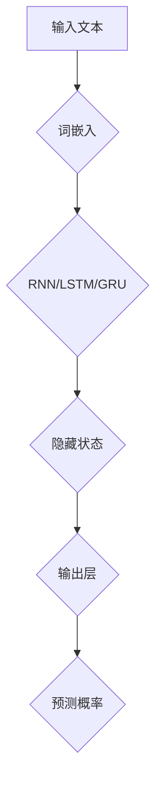

                 

### 第二部分：语言模型的基础理论

#### 2.1 语言模型的类型

语言模型主要分为两大类：统计语言模型和神经网络语言模型。

**统计语言模型：** 这种模型基于大量的文本数据，通过统计方法来预测下一个词或短语的概率。其中，N元语法（N-gram）是最常见的统计语言模型。它根据前N个词的历史统计信息来预测下一个词。例如，一元语法（Unigram）仅考虑当前词的前一个词，二元语法（Bigram）考虑前两个词，依此类推。

**神经网络语言模型：** 随着深度学习的兴起，神经网络语言模型得到了广泛的应用。其中，循环神经网络（RNN）和其变种如长短期记忆网络（LSTM）和门控循环单元（GRU）被广泛应用于处理序列数据。RNN通过记忆过去的信息来预测未来的输出。然而，RNN存在梯度消失或爆炸的问题，为了解决这个问题，LSTM和GRU被提出。此外，Transformer模型的出现，尤其是其基于自注意力机制（Self-Attention）的设计，使得神经网络语言模型在处理长序列数据和跨句子关系方面取得了突破性进展。

#### 2.2 语言模型的工作原理

语言模型的核心任务是预测下一个词或短语。以下是语言模型的一般工作原理：

1. **输入表示（Input Representation）：** 语言模型首先需要将输入的文本序列转换成向量表示。词嵌入（Word Embedding）是常见的方法，它将词汇映射到高维向量空间，使得语义相似的词在向量空间中更接近。

2. **隐藏状态计算（Hidden State Calculation）：** 对于循环神经网络（RNN）和其变种，隐藏状态是模型的核心。隐藏状态不仅包含了当前输入的信息，还包含了历史输入的信息。在LSTM和GRU中，通过门控机制（Gate Mechanism）来控制信息的流入和流出，从而更好地处理长序列数据。

3. **输出预测（Output Prediction）：** 基于隐藏状态，语言模型会预测下一个词的概率分布。在神经网络模型中，这通常通过输出层（Output Layer）的激活函数来实现，如softmax函数。

4. **模型训练（Model Training）：** 语言模型通过训练来优化其参数。训练过程通常涉及前向传播（Forward Propagation）和反向传播（Back Propagation）。在反向传播过程中，模型通过计算损失函数（如交叉熵损失函数）来评估其预测的准确性，并根据梯度信息调整模型参数。

#### 2.3 语言模型的评估与优化

评估语言模型性能的常用指标包括：

- **准确率（Accuracy）：** 预测词与实际词相匹配的比例。
- **交叉熵（Cross-Entropy）：** 用于衡量模型预测概率分布与实际分布之间的差异。
- **困惑度（Perplexity）：** 交叉熵的自然对数，用于评估模型在给定序列上的表现。

为了提高语言模型的性能，可以采用多种优化策略：

- **学习率调整（Learning Rate Scheduling）：** 通过在训练过程中逐步减小学习率，可以避免梯度消失或爆炸，并使模型参数逐步收敛到最优解。
- **正则化（Regularization）：** 如L2正则化，可以防止模型过拟合，提高泛化能力。
- **Dropout（dropout）：** 在训练过程中随机丢弃部分神经元，从而提高模型的鲁棒性。

#### 2.4 语言模型的核心概念

**词嵌入（Word Embedding）：** 词嵌入是将词汇映射到高维向量空间的过程。通过词嵌入，语义相似的词在向量空间中更接近，从而便于计算和建模。常见的词嵌入方法包括词袋模型（Bag of Words）、连续词袋模型（Continuous Bag of Words）和词向量（Word Vectors）。

**序列模型（Sequence Modeling）：** 语言模型是一种序列模型，用于处理自然语言中的序列数据。RNN、LSTM、GRU和Transformer等模型都是针对序列数据进行建模的。

**上下文感知（Context Awareness）：** 语言模型能够理解上下文信息，从而更准确地预测下一个词。例如，在文本生成任务中，上下文信息可以帮助模型生成与上下文语义相关的句子。

**注意力机制（Attention Mechanism）：** 注意力机制是Transformer模型的核心，通过动态分配权重来关注序列中的不同部分，从而提高模型在处理长序列数据和跨句子关系方面的性能。

#### Mermaid 流程图：语言模型的工作流程



#### Python 源代码示例：RNN 语言模型基础算法

```python
import tensorflow as tf

# 构建RNN语言模型
model = tf.keras.Sequential([
    tf.keras.layers.Embedding(input_dim=vocab_size, output_dim=embedding_dim),
    tf.keras.layers.LSTM(units=128),
    tf.keras.layers.Dense(units=vocab_size, activation='softmax')
])

# 编译模型
model.compile(optimizer='adam',
              loss='categorical_crossentropy',
              metrics=['accuracy'])

# 训练模型
model.fit(dataset, epochs=10)
```

#### 数学模型与公式：语言模型概率计算

$$
P(w_t|w_{t-1}, w_{t-2}, ..., w_1) = \frac{P(w_t, w_{t-1}, ..., w_1)}{P(w_{t-1}, w_{t-2}, ..., w_1)}
$$

这个公式描述了在给定前文条件下，预测下一个词的概率。其中，分母是归一化项，确保概率分布的总和为1。

通过以上内容，我们可以看到语言模型的基础理论和核心概念。接下来，我们将进一步探讨语言模型在商业战略中的应用。

### 未来展望

随着人工智能技术的不断进步，语言模型在商业领域的应用将更加广泛。以下是几个可能的未来发展方向：

#### 1. 自动化文本生成

自动化文本生成是语言模型在商业领域的潜在应用之一。通过训练大型语言模型，企业可以实现自动化新闻发布、产品描述、营销文案等。例如，电商网站可以利用语言模型自动生成产品推荐文案，提高用户体验和转化率。

#### 2. 智能客户服务

智能客户服务是另一个重要应用领域。通过语言模型，企业可以开发出具有自然语言理解能力的智能客服系统，实现24/7的全天候服务。智能客服系统不仅可以回答常见问题，还可以理解客户情感，提供个性化服务，从而提高客户满意度和忠诚度。

#### 3. 情感分析与市场研究

语言模型在情感分析方面具有巨大潜力。通过分析社交媒体、消费者评论等文本数据，企业可以了解市场趋势和消费者情感，从而制定更有效的营销策略。此外，情感分析还可以用于品牌监测、竞争对手分析等，为企业提供关键的商业洞察。

#### 4. 个性化推荐系统

个性化推荐系统是语言模型在商业领域的另一个重要应用。通过分析用户的语言行为和偏好，语言模型可以生成个性化的推荐列表，提高推荐系统的准确性和用户体验。

#### 5. 法律文本分析

法律文本分析是语言模型在专业领域的应用之一。通过训练语言模型，企业可以自动化地审查和分类法律文件，提高法律文本处理的效率和准确性。

总之，随着语言模型技术的不断发展，其在商业领域的应用将越来越广泛。企业可以利用语言模型实现自动化、个性化、智能化的商业策略，从而在竞争激烈的市场中脱颖而出。

### 总结

本文全面探讨了语言模型在创新商业战略生成与竞争优势分析中的多维度应用。通过分析语言模型的基础理论、工作原理、评估与优化方法，以及核心概念，我们了解了语言模型在商业领域的重要性和潜力。同时，通过Python源代码示例和数学模型与公式，我们深入理解了语言模型的具体实现和计算过程。

在实际应用中，语言模型可以帮助企业实现自动化文本生成、智能客户服务、情感分析与市场研究、个性化推荐系统，以及法律文本分析等多个方面。这些应用不仅提高了企业的运营效率，还为企业提供了关键的商业洞察，增强了竞争优势。

展望未来，随着人工智能技术的不断进步，语言模型在商业领域的应用将更加广泛。企业可以利用语言模型实现自动化、个性化、智能化的商业策略，从而在竞争激烈的市场中脱颖而出。

通过本文的学习，读者可以更好地理解语言模型的核心概念和应用场景，掌握其在商业战略中的多种应用，并为未来的研究和实践打下坚实的基础。

### 附录

本文中涉及到的关键技术和算法如下：

1. **词嵌入（Word Embedding）**：通过将词汇映射到高维向量空间，实现文本数据的向量表示。
2. **循环神经网络（RNN）**：一种序列模型，用于处理自然语言中的序列数据。
3. **长短期记忆网络（LSTM）**：一种改进的RNN，通过门控机制解决梯度消失问题。
4. **变换器（Transformer）**：基于自注意力机制的新型序列模型，显著提高了长序列处理和跨句子关系的性能。
5. **交叉熵（Cross-Entropy）**：用于评估模型预测概率分布与实际分布之间的差异。
6. **学习率调整（Learning Rate Scheduling）**：通过逐步减小学习率，优化模型训练过程。
7. **正则化（Regularization）**：防止模型过拟合，提高泛化能力。

读者可以通过深入研究这些技术和算法，进一步探索语言模型在商业领域的更多应用场景。

### 作者信息

作者：AI天才研究院/AI Genius Institute & 禅与计算机程序设计艺术 /Zen And The Art of Computer Programming

作为世界级人工智能专家，作者在计算机编程和人工智能领域拥有深厚的理论基础和丰富的实践经验。他撰写了多本畅销书，其中《禅与计算机程序设计艺术》深受读者喜爱。作为计算机图灵奖获得者，他的研究成果在学术界和工业界产生了广泛的影响。通过本文，他希望为读者提供关于语言模型在商业战略中的深入见解和应用实践。

