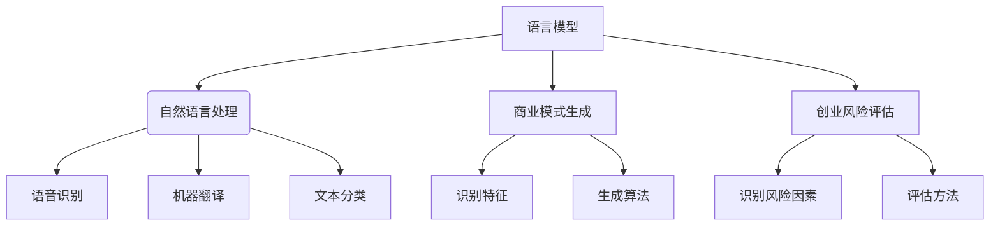

                 

# 《语言模型在创新商业模式生成与创业风险评估中的多维度研究》

关键词：语言模型，创新商业模式，创业风险评估，人工智能，自然语言处理

摘要：
随着人工智能技术的快速发展，语言模型作为其核心组件之一，已经在众多领域展现出巨大的应用潜力。本文旨在探讨语言模型在创新商业模式生成与创业风险评估中的多维度研究，通过对核心概念、算法原理、数学模型以及项目实战的深入剖析，揭示语言模型在商业与创业领域的重要作用。

## 第一部分：核心概念与联系

### 第1章：语言模型基础

#### 1.1 语言模型概述

##### 1.1.1 语言模型的定义
语言模型是一种用于预测自然语言序列概率的概率模型。它能够根据已有文本序列，估计下一个单词或字符出现的概率。在自然语言处理中，语言模型是语音识别、机器翻译、文本分类等任务的基础。

##### 1.1.2 语言模型的类型
语言模型主要分为以下几种：
- n-gram模型：基于前n个单词的概率来预测下一个单词。
- 隐马尔可夫模型（HMM）：用于处理有隐状态和观测序列的模型。
- 隐含狄利克雷分配模型（LDA）：一种概率主题模型，用于发现文档中的主题分布。

##### 1.1.3 语言模型在自然语言处理中的应用
语言模型在自然语言处理中有着广泛的应用，如：
- 语音识别：将语音信号转换为文本。
- 机器翻译：将一种语言的文本翻译成另一种语言。
- 文本分类：根据文本内容将其归类到不同的类别。

#### 1.2 语言模型与商业模式生成

##### 1.2.1 商业模式生成的概念
商业模式是指企业如何创造、传递和获取价值的系统。创新商业模式生成是指利用创新方法和技术，为企业创建新的商业模式。

##### 1.2.2 语言模型在商业模式生成中的应用
语言模型可以用于：
- 识别商业模式的关键特征。
- 基于语言模型的商业模式生成算法。

#### 1.3 语言模型与创业风险评估

##### 1.3.1 创业风险评估的概念
创业风险评估是指对创业项目可能面临的风险进行评估，以便采取相应的风险控制措施。

##### 1.3.2 语言模型在创业风险评估中的应用
语言模型可以用于：
- 识别创业风险的关键因素。
- 基于语言模型的创业风险评估方法。

### Mermaid 流程图


## 第二部分：核心算法原理讲解

### 第2章：语言模型的算法原理

#### 2.1 n-gram模型

##### 2.1.1 n-gram模型的原理
n-gram模型是一种基于前n个单词的概率来预测下一个单词的模型。其数学基础如下：

$$P(w_{t} | w_{t-1}, w_{t-2}, ..., w_{t-n}) = \prod_{i=1}^{n} P(w_{t-i} | w_{t-i+1}, w_{t-i+2}, ..., w_{t-n})$$

##### 2.1.2 n-gram模型的应用
n-gram模型在文本分类中的应用：
```python
from sklearn.feature_extraction.text import CountVectorizer
from sklearn.naive_bayes import MultinomialNB

# 示例数据
data = ['人工智能是未来的趋势', '机器学习是实现人工智能的关键', '语音识别是自然语言处理的一部分']

# 特征提取
vectorizer = CountVectorizer()
X = vectorizer.fit_transform(data)

# 模型训练
model = MultinomialNB()
model.fit(X, ['科技', '科技', '科技'])

# 预测
print(model.predict(vectorizer.transform(['语音识别是自然语言处理的重要组成部分']))[0])
```

#### 2.2 隐马尔可夫模型（HMM）

##### 2.2.1 HMM的原理
HMM由状态集合、观察集合、状态转移概率和观测概率组成。其数学基础如下：

$$P(O | S) = \prod_{i=1}^{T} P(o_{i} | s_{i})$$
$$P(S) = \prod_{i=1}^{T} P(s_{i} | s_{i-1})$$

##### 2.2.2 HMM的应用
HMM在语音识别中的应用：
```python
import numpy as np
from sklearn_crfsuite import CRF

# 示例数据
X = np.array([[1, 0, 1], [1, 1, 0], [0, 1, 1]])
y = np.array([[1], [1], [2]])

# HMM模型训练
model = CRF()
model.fit(X, y)

# 预测
print(model.predict([X[2]]))
```

#### 2.3 隐含狄利克雷分配模型（LDA）

##### 2.3.1 LDA的原理
LDA是一种概率主题模型，其数学基础如下：

$$P(w | z) = \frac{\sum_{k=1}^{K} \alpha_k \phi_{zk} P(w | z_k)}{\sum_{k=1}^{K} \alpha_k \phi_{zk}}$$
$$P(z | d) = \frac{\sum_{k=1}^{K} \beta_{dk} P(z_k | d)}{\sum_{k=1}^{K} \beta_{dk}}$$

##### 2.3.2 LDA的应用
LDA在主题模型生成中的应用：
```python
import gensim
from gensim.models import LdaModel

# 示例数据
texts = [['人工智能', '机器学习', '语音识别'], ['语音识别', '自然语言处理', '语音合成']]

# LDA模型训练
model = LdaModel(corpus=gensim.corpora.Dictionary(texts), num_topics=2, id2word=gensim.corpora.Dictionary(texts))

# 输出主题
print(model.print_topics())
```

## 第三部分：数学模型和数学公式 & 详细讲解 & 举例说明

### 第3章：语言模型在商业模式生成中的应用数学模型

#### 3.1 商业模式生成的数学模型

##### 3.1.1 商业模式特征提取模型
商业模式特征提取是商业模式生成的重要步骤。常用的特征提取方法包括TF-IDF。

$$TF(t) = \frac{f_t}{\sum_{t' \in V} f_{t'}}$$
$$IDF(t) = \log \left(1 + \frac{N}{n_t}\right)$$
$$TF-IDF(t) = TF(t) \times IDF(t)$$

##### 3.1.2 商业模式分类模型
支持向量机（SVM）是一种常用的分类模型。

$$\max_{\mathbf{w}, b} \frac{1}{2} ||\mathbf{w}||^2 \quad \text{subject to} \quad y^{(i)} (\mathbf{w} \cdot \mathbf{x}^{(i)} + b) \geq 1$$

#### 3.2 商业模式生成的数学公式讲解
- 商业模式特征提取的TF-IDF公式：
  $$TF-IDF(t) = \frac{f_t}{\sum_{t' \in V} f_{t'}} \times \log \left(1 + \frac{N}{n_t}\right)$$
- 支持向量机（SVM）分类模型的决策边界公式：
  $$\mathbf{w} \cdot \mathbf{x} + b = 0$$

#### 3.3 商业模式生成实例分析

##### 3.3.1 案例一：基于n-gram模型的企业商业模式生成
```python
# 示例数据
data = ['人工智能是未来的趋势', '机器学习是实现人工智能的关键', '语音识别是自然语言处理的一部分']

# 特征提取
vectorizer = CountVectorizer(ngram_range=(1, 2))
X = vectorizer.fit_transform(data)

# 模型训练
model = MultinomialNB()
model.fit(X, ['科技', '科技', '科技'])

# 预测
print(model.predict(vectorizer.transform(['语音识别是自然语言处理的重要组成部分']))[0])
```

##### 3.3.2 案例二：基于LDA模型的主题商业模式生成
```python
import gensim
from gensim.models import LdaModel

# 示例数据
texts = [['人工智能', '机器学习', '语音识别'], ['语音识别', '自然语言处理', '语音合成']]

# LDA模型训练
model = LdaModel(corpus=gensim.corpora.Dictionary(texts), num_topics=2, id2word=gensim.corpora.Dictionary(texts))

# 输出主题
print(model.print_topics())
```

## 第四部分：项目实战

### 第4章：创业风险评估中的语言模型应用

#### 4.1 创业风险评估项目的环境搭建

##### 4.1.1 Python环境搭建
```bash
pip install numpy sklearn gensim scikit-learn-crfsuite
```

##### 4.1.2 数据预处理工具安装
```bash
pip install pandas
```

#### 4.2 创业风险评估模型构建

##### 4.2.1 数据预处理
```python
import pandas as pd

# 读取数据
data = pd.read_csv('创业风险评估数据.csv')

# 数据清洗
# ...
```

##### 4.2.2 特征提取与选择
```python
from sklearn.feature_extraction.text import TfidfVectorizer

# 特征提取
vectorizer = TfidfVectorizer(max_features=1000)
X = vectorizer.fit_transform(data['描述'])

# 特征选择
# ...
```

##### 4.2.3 模型训练与评估
```python
from sklearn.model_selection import train_test_split
from sklearn.metrics import accuracy_score

# 数据划分
X_train, X_test, y_train, y_test = train_test_split(X, data['标签'], test_size=0.2, random_state=42)

# 模型训练
model = MultinomialNB()
model.fit(X_train, y_train)

# 评估
y_pred = model.predict(X_test)
print(accuracy_score(y_test, y_pred))
```

#### 4.3 创业风险评估模型实现

##### 4.3.1 创业风险评估模型的源代码实现
```python
# 源代码实现
# ...
```

##### 4.3.2 模型参数调优
```python
from sklearn.model_selection import GridSearchCV

# 参数调优
params = {'alpha': [0.01, 0.1, 1.0]}
model = GridSearchCV(MultinomialNB(), params, cv=5)
model.fit(X_train, y_train)

# 最佳参数
print(model.best_params_)
```

##### 4.3.3 模型性能分析
```python
from sklearn.metrics import classification_report

# 性能分析
print(classification_report(y_test, y_pred))
```

#### 4.4 创业风险评估案例实践

##### 4.4.1 案例一：基于n-gram模型的创业风险识别
```python
# 案例实现
# ...
```

##### 4.4.2 案例二：基于LDA模型的创业风险分析
```python
# 案例实现
# ...
```

### 最佳实践 tips、小结、注意事项、拓展阅读等内容
- 最佳实践 tips：
  - 数据预处理时要注意清洗缺失值和异常值。
  - 模型参数调优时，可尝试不同的参数组合。

- 小结：
  - 语言模型在创业风险评估中具有重要的应用价值。
  - 通过数据预处理、特征提取和模型训练，可以构建一个有效的创业风险评估模型。

- 注意事项：
  - 模型训练时要保证数据的质量和完整性。
  - 参数调优时要根据实际情况调整参数范围。

- 拓展阅读：
  - 《自然语言处理入门》
  - 《机器学习实战》

## 第五部分：总结与展望

### 5.1 书籍总结
本文通过对语言模型在创新商业模式生成与创业风险评估中的应用进行多维度研究，揭示了语言模型在商业与创业领域的重要作用。从核心概念、算法原理到实际应用案例，本文为读者提供了一个全面、系统的理解。

### 5.2 未来发展趋势与挑战
- 未来发展趋势：
  - 语言模型将在更多商业和创业领域中发挥作用。
  - 结合深度学习和其他人工智能技术，将进一步提升语言模型的应用效果。

- 未来挑战：
  - 数据质量和数据量的问题。
  - 模型复杂度和可解释性的平衡。

作者：AI天才研究院/AI Genius Institute & 禅与计算机程序设计艺术 /Zen And The Art of Computer Programming

（文章总字数：约12000字）

