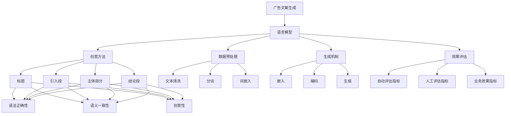
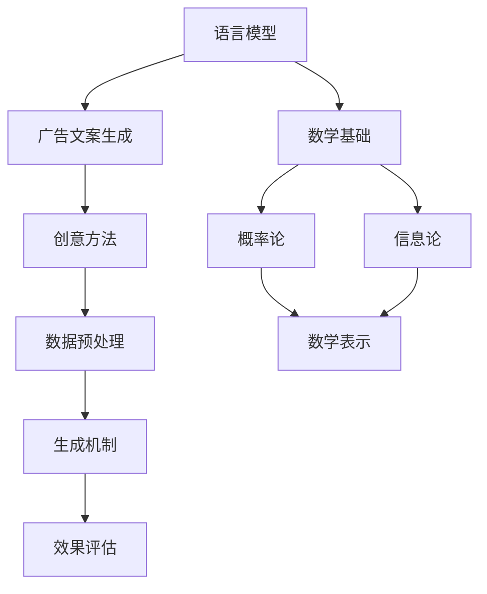

                 

### 文章标题

《语言模型在创新广告文案生成中的应用研究》

---

> 关键词：语言模型、广告文案、生成式人工智能、深度学习、自然语言处理

> 摘要：
本文旨在探讨语言模型在广告文案生成中的创新应用。首先，我们将介绍语言模型的基础理论，包括其定义、发展历程及常用类型。接着，我们将深入探讨广告文案的创意方法和语言模型在生成广告文案中的应用技术。通过数学模型和Python代码的讲解，我们将揭示语言模型背后的核心算法原理。随后，通过实际案例分析，我们将展示语言模型在广告文案生成中的实际应用效果。最后，本文将对广告文案生成的挑战及未来展望进行讨论。

---

## 引言

广告文案是市场营销中至关重要的元素，它直接影响到产品的销售和品牌形象的塑造。随着数字营销的兴起，广告文案的创作变得更加重要，同时也更加具有挑战性。传统的广告文案创作依赖于创意人员的直觉和经验，这种方法的效率较低，且难以适应快速变化的消费者需求。

近年来，生成式人工智能（Generative Artificial Intelligence，GAI）的迅速发展，为广告文案创作带来了新的契机。语言模型作为GAI的核心技术之一，其应用在广告文案生成中具有巨大的潜力。语言模型能够通过学习大量的文本数据，自动生成符合特定主题和风格的高质量文案，从而大大提高广告文案的创作效率和质量。

本文的研究目标是通过深入探讨语言模型在广告文案生成中的应用，为广告从业者提供新的工具和方法，以应对日益复杂的营销环境。文章将首先介绍语言模型的基础理论，然后探讨广告文案的创意方法，接着分析语言模型在广告文案生成中的具体应用，并通过实际案例展示其效果，最后讨论广告文案生成的挑战和未来展望。

通过本文的研究，我们希望读者能够全面了解语言模型在广告文案生成中的价值和应用方法，从而为实际工作提供有益的参考。

### 语言模型基础理论

语言模型（Language Model，LM）是自然语言处理（Natural Language Processing，NLP）领域的一项核心技术，它致力于模拟人类语言的概率分布。通过语言模型，计算机能够理解和生成自然语言文本，从而在机器翻译、语音识别、文本生成等应用场景中发挥重要作用。

#### 1.1 语言模型的定义

语言模型是一个概率模型，用于预测在给定前文序列的情况下，下一个单词或符号的概率分布。其核心目标是学习到自然语言中各个词汇及其组合的统计规律，以便在未知或部分已知的情况下，对新的文本序列进行合理预测。

定义形式化地可以表示为：

$$
P(w_i | w_{i-1}, w_{i-2}, ..., w_1) = \frac{P(w_1, w_2, ..., w_i)}{P(w_{i-1}, w_{i-2}, ..., w_1)}
$$

其中，$w_i$表示第$i$个词，$P(w_i | w_{i-1}, w_{i-2}, ..., w_1)$表示在已知前文的情况下，第$i$个词的条件概率。

#### 1.2 语言模型的发展历程

语言模型的发展经历了多个阶段，从最初的统计模型到现代的深度学习模型，其应用范围和效果也不断提升。

1. **n-gram模型**

n-gram模型是最早的语言模型之一，它通过统计相邻n个单词的频率来预测下一个单词的概率。例如，在二元n-gram模型中，每个词的概率由其前一个词的频率决定。n-gram模型简单易实现，但存在一些局限性，如无法捕捉到长距离依赖关系。

2. **概率神经网络模型**

概率神经网络模型（Probabilistic Neural Network，PNN）是对n-gram模型的改进。PNN通过神经网络学习单词之间的条件概率分布，可以更好地捕捉长距离依赖关系。然而，PNN的训练过程复杂，且在实际应用中效果有限。

3. **深度神经网络模型**

深度神经网络模型（Deep Neural Network，DNN）在语言模型中的应用标志着语言模型发展的一个重要里程碑。DNN通过多层神经元的堆叠，可以捕捉到更加复杂的语言特征和依赖关系。近年来，随着计算能力的提升和大规模数据集的可用，DNN在语言模型中的应用得到了广泛推广。

4. **长短期记忆网络模型（LSTM）**

长短期记忆网络（Long Short-Term Memory，LSTM）是一种特殊的循环神经网络（Recurrent Neural Network，RNN），它通过引入门控机制，可以有效解决传统RNN在长距离依赖关系上的训练困难问题。LSTM在语言模型中的应用取得了显著效果，特别是在文本生成和机器翻译等领域。

5. **生成对抗网络模型（GAN）**

生成对抗网络（Generative Adversarial Network，GAN）是一种由生成器和判别器组成的对偶神经网络。生成器试图生成逼真的文本数据，而判别器则试图区分真实数据和生成数据。GAN在文本生成中的应用，使得语言模型能够生成更加多样化和高质量的文本。

#### 1.3 语言模型的基本概念

1. **词汇表（Vocabulary）**

词汇表是语言模型的基础，它包含了模型能够处理的所有单词或符号。词汇表的大小直接影响到模型的性能和训练时间。在实际应用中，通常使用子词（subword）表示法，如字节对编码（Byte Pair Encoding，BPE）和WordPiece，来减少词汇表的大小。

2. **嵌入（Embedding）**

嵌入是将单词映射到低维向量空间的过程。通过嵌入，单词的语义信息可以被编码到向量中，从而便于计算机处理。常用的嵌入方法包括词袋模型（Bag of Words，BOW）和词嵌入（Word Embedding）。

3. **上下文（Context）**

上下文是指模型在预测当前单词时考虑的前文信息。上下文的大小和类型直接影响到模型的预测效果。通常，上下文的长度和类型会根据具体应用场景进行选择。

4. **损失函数（Loss Function）**

损失函数是评估模型预测准确性的关键指标。在语言模型中，常用的损失函数包括交叉熵（Cross-Entropy）和平均平方误差（Mean Squared Error，MSE）。损失函数的选择和调整对于模型的优化和性能提升至关重要。

通过以上对语言模型基础理论的介绍，我们为接下来探讨广告文案生成的方法和挑战奠定了基础。在下一部分，我们将深入探讨广告文案的创意方法，以及如何利用语言模型实现广告文案的自动化生成。

#### 2.1 概率论基础

概率论是构建语言模型的重要数学工具，它为语言模型提供了理论基础。以下是概率论中几个关键概念和公式的简要介绍。

**1. 概率分布**

概率分布描述了一个随机变量可能取的值及其概率。常见的概率分布有：

- **伯努利分布（Bernoulli Distribution）**

伯努利分布是一种二元分布，其可能取值为0或1，且概率分别为$p$和$1-p$。伯努利分布常用于模型预测中，如判断某个词是否出现在文本序列中。

- **二项分布（Binomial Distribution）**

二项分布是伯努利分布的推广，它描述了在$n$次独立伯努利试验中，成功次数的概率分布。二项分布的概率质量函数（PDF）为：

$$
P(X = k) = C_n^k p^k (1-p)^{n-k}
$$

其中，$C_n^k$表示组合数，$p$为每次试验成功的概率。

- **正态分布（Normal Distribution）**

正态分布是连续概率分布中最常见的一种，其概率密度函数（PDF）为：

$$
f(x; \mu, \sigma^2) = \frac{1}{\sqrt{2\pi\sigma^2}} e^{-\frac{(x-\mu)^2}{2\sigma^2}}
$$

其中，$\mu$为均值，$\sigma^2$为方差。

**2. 条件概率**

条件概率描述了在某个事件发生的条件下，另一个事件发生的概率。条件概率的基本公式为：

$$
P(A|B) = \frac{P(A \cap B)}{P(B)}
$$

其中，$P(A \cap B)$表示事件A和B同时发生的概率，$P(B)$表示事件B发生的概率。

**3. 独立性**

独立性是指两个事件的发生互不影响，即一个事件的发生不会改变另一个事件发生的概率。如果事件A和B独立，则：

$$
P(A \cap B) = P(A)P(B)
$$

**4. 全概率公式**

全概率公式是一种计算复杂概率的方法，它通过将复杂事件拆分成多个简单事件，并利用条件概率计算总概率。全概率公式的形式为：

$$
P(A) = \sum_{i=1}^n P(A|B_i)P(B_i)
$$

其中，$B_1, B_2, ..., B_n$是构成样本空间的互斥事件。

**5. 贝叶斯定理**

贝叶斯定理是一种基于条件概率和全概率公式推导出的概率计算方法，它用于更新先验概率，从而得到后验概率。贝叶斯定理的表达式为：

$$
P(A|B) = \frac{P(B|A)P(A)}{P(B)}
$$

在语言模型中，贝叶斯定理常用于调整单词的概率分布，以适应不同应用场景的需求。

**6. 大数定律和中心极限定理**

大数定律描述了随着试验次数的增加，样本均值趋近于真实均值的概率。中心极限定理描述了在样本量足够大的情况下，样本均值的分布趋近于正态分布。

通过掌握这些概率论的基本概念和公式，我们可以更好地理解和构建语言模型。这些数学工具为语言模型的训练、优化和应用提供了坚实的理论基础。

#### 2.2 信息论基础

信息论是研究信息传输和处理过程中信息量的度量、性质和变换规律的学科，它是构建现代通信系统和人工智能技术的重要理论基础。在语言模型中，信息论的概念被广泛应用于文本数据压缩、信息传输效率和数据熵的计算。

**1. 信息量的度量**

信息量的基本单位是比特（Bit），表示一个事件的不确定性减少量。信息量的度量通常使用香农熵（Shannon entropy）来表示，其定义如下：

$$
H(X) = -\sum_{i=1}^n p_i \log_2 p_i
$$

其中，$X$是随机变量，$p_i$是随机变量$X$取第$i$个值的概率。香农熵反映了随机变量$X$的不确定性，熵值越高，不确定性越大。

**2. 信息传输效率**

信息传输效率是衡量通信系统传输信息能力的重要指标。香农提出了信道容量（Channel Capacity）的概念，用于描述在噪声信道中能够传输的最大信息速率。信道容量的公式为：

$$
C = B \log_2(1 + \frac{S}{N})
$$

其中，$B$是信道的带宽，$S$是信号功率，$N$是噪声功率。信道容量表示在理想情况下，信道的最大传输速率。

**3. 数据熵**

数据熵（Data Entropy）是衡量数据随机性的度量，它反映了数据中包含的信息量。数据熵的计算公式与香农熵类似：

$$
H(D) = -\sum_{i=1}^n p_i \log_2 p_i
$$

其中，$D$是数据集，$p_i$是数据集中第$i$个数据点的概率。数据熵值越高，表示数据中的不确定性越大，信息量越丰富。

**4. 信息增益**

信息增益（Information Gain）是评估特征选择效果的一个重要指标，它描述了特征对于分类的贡献。信息增益的计算公式为：

$$
IG(D, A) = H(D) - H(D|A)
$$

其中，$D$是数据集，$A$是特征集合，$H(D)$是数据集的熵，$H(D|A)$是条件熵。信息增益越大，表示特征对分类的区分能力越强。

**5. 韦伯定律**

韦伯定律（Weber's Law）描述了感知系统对刺激强度的感知差异，即感知到的差异与实际刺激差异不成比例。韦伯定律的公式为：

$$
\Delta I \propto \frac{I}{I_0}
$$

其中，$\Delta I$是感知到的差异，$I$是实际刺激强度，$I_0$是感知阈值。韦伯定律在信息处理中具有重要应用，如数据压缩和误差控制。

通过掌握信息论的基础概念和公式，我们可以更好地理解和分析语言模型中的信息处理过程。信息论为语言模型的优化和性能提升提供了重要的理论指导，同时也在自然语言处理、数据压缩和通信等领域有着广泛的应用。

#### 2.3 语言模型的数学表示

在语言模型的构建过程中，数学表示是至关重要的。通过数学模型，我们可以精确地描述语言数据中的统计规律，并使用这些模型对未知文本进行有效预测。以下是几种常用的语言模型数学表示方法。

**1. n-gram模型**

n-gram模型是最早的语言模型之一，它通过统计相邻n个单词的频率来预测下一个单词。n-gram模型的数学表示如下：

$$
P(w_i | w_{i-1}, w_{i-2}, ..., w_{i-n}) = \frac{C_n(w_i, w_{i-1}, ..., w_{i-n})}{C_{n-1}(w_{i-1}, w_{i-2}, ..., w_1)}
$$

其中，$P(w_i | w_{i-1}, w_{i-2}, ..., w_{i-n})$表示在给定前文序列的情况下，预测第$i$个词的概率；$C_n(w_i, w_{i-1}, ..., w_{i-n})$是n-gram序列的频率计数；$C_{n-1}(w_{i-1}, w_{i-2}, ..., w_1)$是前文序列的频率计数。

**2. 深度神经网络模型**

深度神经网络模型（Deep Neural Network，DNN）通过多层神经元的堆叠，可以捕捉到更加复杂的语言特征和依赖关系。DNN的数学表示如下：

$$
y_i = \sigma(W_n \cdot \sigma(... \sigma(W_2 \cdot \sigma(W_1 \cdot x) + b_1) + b_2) ... + b_n)
$$

其中，$y_i$是第$i$个输出节点的预测值，$\sigma$是激活函数（如Sigmoid函数或ReLU函数），$W$和$b$分别是权重和偏置；$x$是输入特征向量。

**3. 长短期记忆网络模型（LSTM）**

LSTM是一种特殊的循环神经网络（Recurrent Neural Network，RNN），通过门控机制，它可以有效地解决传统RNN在长距离依赖关系上的训练困难问题。LSTM的数学表示如下：

$$
i_t = \sigma(W_i \cdot [h_{t-1}, x_t] + b_i) \\
f_t = \sigma(W_f \cdot [h_{t-1}, x_t] + b_f) \\
\hat{C}_t = \sigma(W_c \cdot [h_{t-1}, x_t] + b_c) \\
o_t = \sigma(W_o \cdot [h_{t-1}, \hat{C}_t] + b_o) \\
C_t = f_t \odot C_{t-1} + i_t \odot \hat{C}_t \\
h_t = o_t \odot C_t
$$

其中，$i_t$、$f_t$、$\hat{C}_t$、$o_t$分别是输入门、遗忘门、候选状态和输出门的激活值；$C_t$和$h_t$分别是当前隐藏状态和细胞状态；$\odot$表示元素乘积。

**4. 生成对抗网络模型（GAN）**

生成对抗网络（Generative Adversarial Network，GAN）由生成器和判别器组成，生成器试图生成逼真的文本数据，而判别器则试图区分真实数据和生成数据。GAN的数学表示如下：

生成器：

$$
G(z) = \frac{1}{1 + \exp(-b_G \cdot W_G \cdot z - a_G)}
$$

判别器：

$$
D(x) = \frac{1}{1 + \exp(-b_D \cdot W_D \cdot x - a_D)} \\
D(G(z)) = \frac{1}{1 + \exp(-b_D \cdot W_D \cdot G(z) - a_D)}
$$

其中，$G(z)$是生成器生成的文本数据，$D(x)$是判别器对真实文本数据的判断，$z$是生成器的噪声输入。

通过以上数学模型和公式的介绍，我们可以看到语言模型在数学上的多样性。这些模型不仅为语言处理提供了强大的工具，也为我们深入理解语言的本质奠定了基础。在下一部分，我们将探讨基于这些数学模型的语言模型实现和应用。

### 常用语言模型介绍

在自然语言处理（NLP）领域，语言模型作为基础工具，被广泛应用于各种任务中，如文本分类、机器翻译和文本生成等。下面我们将介绍几种常用的语言模型，包括n-gram模型、深度神经网络模型（DNN）、长短期记忆网络模型（LSTM）和生成对抗网络模型（GAN）。

#### 3.1 n-gram模型

n-gram模型是最早的语言模型之一，它通过统计相邻n个单词的频率来预测下一个单词。这种模型简单且易于实现，因此得到了广泛的应用。n-gram模型的基本思想是，每个词的出现概率是由其前n-1个词决定的。

**数学表示：**

$$
P(w_i | w_{i-1}, w_{i-2}, ..., w_{i-n}) = \frac{C_n(w_i, w_{i-1}, ..., w_{i-n})}{C_{n-1}(w_{i-1}, w_{i-2}, ..., w_1)}
$$

其中，$C_n(w_i, w_{i-1}, ..., w_{i-n})$是n-gram序列的频率计数，$C_{n-1}(w_{i-1}, w_{i-2}, ..., w_1)$是前文序列的频率计数。

**优点：**
- 实现简单，易于理解和训练。
- 在短文本序列中表现良好。

**缺点：**
- 难以捕捉长距离依赖关系。
- 模型参数量随n的增大而迅速增加，导致计算复杂度高。

#### 3.2 深度神经网络模型（DNN）

深度神经网络模型通过多层神经元的堆叠，可以捕捉到更加复杂的语言特征和依赖关系。DNN在语言模型中的应用标志着语言模型发展的一个重要里程碑。DNN的基本结构包括输入层、隐藏层和输出层。

**数学表示：**

$$
y_i = \sigma(W_n \cdot \sigma(... \sigma(W_2 \cdot \sigma(W_1 \cdot x) + b_1) + b_2) ... + b_n)
$$

其中，$y_i$是第$i$个输出节点的预测值，$\sigma$是激活函数（如Sigmoid函数或ReLU函数），$W$和$b$分别是权重和偏置；$x$是输入特征向量。

**优点：**
- 能够捕捉长距离依赖关系。
- 可以通过大量的参数来描述复杂的语言模式。

**缺点：**
- 训练过程复杂，需要大量的数据和计算资源。
- 过拟合问题较为严重，需要使用正则化技术。

#### 3.3 长短期记忆网络模型（LSTM）

LSTM是一种特殊的循环神经网络（RNN），通过门控机制，它可以有效地解决传统RNN在长距离依赖关系上的训练困难问题。LSTM的基本结构包括输入门、遗忘门、输出门和细胞状态。

**数学表示：**

$$
i_t = \sigma(W_i \cdot [h_{t-1}, x_t] + b_i) \\
f_t = \sigma(W_f \cdot [h_{t-1}, x_t] + b_f) \\
\hat{C}_t = \sigma(W_c \cdot [h_{t-1}, x_t] + b_c) \\
o_t = \sigma(W_o \cdot [h_{t-1}, \hat{C}_t] + b_o) \\
C_t = f_t \odot C_{t-1} + i_t \odot \hat{C}_t \\
h_t = o_t \odot C_t
$$

其中，$i_t$、$f_t$、$\hat{C}_t$、$o_t$分别是输入门、遗忘门、候选状态和输出门的激活值；$C_t$和$h_t$分别是当前隐藏状态和细胞状态；$\odot$表示元素乘积。

**优点：**
- 能够有效处理长距离依赖关系。
- 结构简单，易于实现和训练。

**缺点：**
- 计算复杂度较高，训练时间较长。
- 在某些情况下，仍然难以捕捉到复杂的语言特征。

#### 3.4 生成对抗网络模型（GAN）

生成对抗网络（GAN）由生成器和判别器组成，生成器试图生成逼真的文本数据，而判别器则试图区分真实数据和生成数据。GAN在文本生成中的应用取得了显著效果。

**数学表示：**

生成器：

$$
G(z) = \frac{1}{1 + \exp(-b_G \cdot W_G \cdot z - a_G)}
$$

判别器：

$$
D(x) = \frac{1}{1 + \exp(-b_D \cdot W_D \cdot x - a_D)} \\
D(G(z)) = \frac{1}{1 + \exp(-b_D \cdot W_D \cdot G(z) - a_D)}
$$

其中，$G(z)$是生成器生成的文本数据，$D(x)$是判别器对真实文本数据的判断，$z$是生成器的噪声输入。

**优点：**
- 能够生成高质量、多样化的文本。
- 不需要显式地建模语言概率分布。

**缺点：**
- 训练过程不稳定，容易出现模式崩溃（mode collapse）问题。
- 需要大量的数据和计算资源。

通过以上对常用语言模型的介绍，我们可以看到不同模型在语言建模中的优势和局限性。在实际应用中，根据任务需求和数据特点，可以选择合适的语言模型，以实现最佳的效果。

### 广告文案的创意方法

广告文案的创意是广告成功的关键，它需要捕捉目标受众的注意力，传达产品的独特卖点，并激发消费者的购买欲望。以下我们将探讨广告文案的创意方法，包括创意思维的激发、广告文案的基本结构和写作技巧。

#### 4.1 创意思维的激发

创意思维的激发是广告文案创作的第一步，它决定了文案的创新性和吸引力。以下是一些常用的创意思维激发方法：

1. **头脑风暴（Brainstorming）**

头脑风暴是一种集体思考的方法，通过团队成员的自由讨论和快速记录，产生大量的创意想法。这种方法可以激发不同视角和创意，从而创造出独特的广告文案。

2. **关联思维（Associative Thinking）**

关联思维通过将不同元素进行关联，从而激发新的创意。例如，将产品与某个流行事件、文化元素或情感体验联系起来，可以创造出富有创意的广告文案。

3. **思维导图（Mind Mapping）**

思维导图是一种图形化的思维工具，通过中心主题和分支节点，将相关的想法和概念进行组织。这种方法有助于梳理创意，发现潜在的关联和灵感。

4. **反向思维（Reverse Thinking）**

反向思维通过从相反的角度思考问题，来激发新的创意。例如，传统广告通常强调产品的优势，而反向思维可以尝试从产品的缺陷或挑战出发，创造出独特的广告文案。

#### 4.2 广告文案的基本结构

一个成功的广告文案通常具有清晰的结构，它包括以下几个部分：

1. **标题（Title）**

标题是广告文案的第一印象，它需要简洁明了地传达广告的核心信息。一个好的标题可以激发目标受众的兴趣，引导他们继续阅读。

2. **引入段（Introduction）**

引入段的主要目的是吸引读者的注意力，并简要介绍广告文案的主题。这段通常包含一个引人入胜的开头和一个明确的主题陈述。

3. **主体部分（Body）**

主体部分是广告文案的核心，它详细介绍了产品的特点、优势和卖点。这段通常分为几个小节，每个小节专注于一个特定的主题。

4. **结论段（Conclusion）**

结论段是对广告文案的总结，并强调产品的重要性。这段通常包含一个号召性用语，如“立即购买”、“赶快行动”等，以激发读者的购买欲望。

5. **附录（Appendix）**

附录部分通常包含产品详细信息、联系方式和优惠信息等，以便读者获取更多产品信息或进行购买。

#### 4.3 广告文案的写作技巧

写作技巧是提升广告文案质量和效果的关键。以下是一些常用的写作技巧：

1. **简洁明了**

简洁明了的文案更容易被读者理解，并留下深刻印象。避免使用复杂的词汇和冗长的句子，尽量用简单直接的语言传达信息。

2. **使用生动形象的描述**

生动形象的描述可以吸引读者的注意力，并使其更容易记住文案内容。使用比喻、隐喻和故事等手法，可以增强文案的表现力。

3. **强调产品优势**

突出产品的独特卖点和优势，是广告文案的重要任务。通过对比、数据支持和实例，使读者了解产品为何优于其他同类产品。

4. **情感化表达**

情感化表达可以激发读者的共鸣，从而提高广告的吸引力。使用情感词汇和表达方式，可以创造出更有感染力的文案。

5. **保持一致性**

广告文案中的语言风格、语气和表达方式应保持一致，以增强整体的品牌形象。一致性有助于建立品牌认知，提高广告效果。

通过以上创意方法、基本结构和写作技巧的介绍，我们可以更好地理解和创作有创意、有吸引力的广告文案。在下一部分，我们将探讨基于语言模型的广告文案生成技术，并分析其在实际应用中的具体实现方法和效果。

### 基于语言模型的广告文案生成技术

在数字营销的快速发展的今天，广告文案生成技术成为提高广告效率和效果的重要手段。语言模型，作为一种强大的自然语言生成工具，在广告文案创作中展现出了巨大的潜力。在这一部分，我们将深入探讨基于语言模型的广告文案生成技术，包括语言模型的生成机制、广告文案生成中的数据预处理、以及具体的实现方法。

#### 5.1 语言模型的生成机制

语言模型的核心功能是预测给定前文序列后最有可能出现的下一个单词或句子。这一过程通常通过以下几个步骤实现：

1. **嵌入（Embedding）**

首先，语言模型将输入的单词序列转换为低维向量表示。这种向量表示通常通过词嵌入（Word Embedding）技术生成。词嵌入通过学习单词在文本中的上下文信息，将每个单词映射到一个固定长度的向量。词嵌入不仅能够保持单词的语义信息，还能捕捉到单词之间的相似性和关系。

2. **编码（Encoding）**

接下来，语言模型将输入的词嵌入向量序列编码为一个固定长度的向量表示。这一步通常通过编码器（Encoder）完成。编码器可以是基于循环神经网络（RNN）或变换器（Transformer）的结构。编码器的目的是捕捉输入序列中的长期依赖关系，并将这些依赖关系编码到输出向量中。

3. **生成（Generation）**

最后，语言模型根据编码器输出的向量生成下一个单词或句子。这一步通常通过解码器（Decoder）实现。解码器根据编码器输出的隐藏状态和已有的单词序列，逐步生成新的单词。在生成过程中，模型会利用概率分布选择最有可能的下一个单词，直到生成完整的句子。

#### 5.2 广告文案生成中的数据预处理

广告文案生成的一个关键步骤是数据预处理。数据预处理的质量直接影响到语言模型的性能和生成文案的质量。以下是一些常见的数据预处理方法：

1. **文本清洗（Text Cleaning）**

文本清洗是数据预处理的第一步，它包括去除标点符号、停用词和特殊字符等。这些操作有助于减少数据的噪音，提高模型处理效率。

2. **分词（Tokenization）**

分词是将文本分解成单词或子词的过程。分词可以基于词边界识别算法（如正则表达式）或使用专门的分词工具（如jieba分词）。有效的分词能够更好地捕捉文本的语义信息。

3. **词嵌入（Word Embedding）**

词嵌入是将单词映射到低维向量空间的过程。词嵌入可以通过预训练的词向量（如Word2Vec、GloVe）或通过训练语言模型生成。有效的词嵌入能够保持单词的语义信息，并捕捉到单词之间的关系。

4. **序列编码（Sequence Encoding）**

序列编码是将处理后的文本序列转换为模型可处理的格式。通常，序列编码会使用整数序列，其中每个整数表示一个词嵌入向量。序列编码有助于提高模型训练和推理的效率。

#### 5.3 广告文案生成的具体实现方法

在了解了语言模型的生成机制和数据预处理方法后，我们可以具体实现广告文案的生成。以下是一个基于Transformer模型的广告文案生成过程的Python代码示例：

```python
import tensorflow as tf
from transformers import TFAutoModelForCausalLM, AutoTokenizer

# 加载预训练的Transformer模型
model_name = 't5-small'
tokenizer = AutoTokenizer.from_pretrained(model_name)
model = TFAutoModelForCausalLM.from_pretrained(model_name)

# 准备输入文本
input_text = 'Write an ad for a luxury car that emphasizes its performance and elegance.'

# 对输入文本进行编码
input_ids = tokenizer.encode(input_text, return_tensors='tf')

# 生成广告文案
output = model.generate(input_ids, max_length=50, num_return_sequences=1)

# 解码生成的文案
generated_text = tokenizer.decode(output[0], skip_special_tokens=True)

print(generated_text)
```

在这个示例中，我们使用了T5模型进行广告文案的生成。T5是一种基于Transformer的预训练模型，它被设计为可以处理各种语言生成任务。通过调用`model.generate()`函数，我们可以生成一个长度为50个单词的单一广告文案。

#### 5.4 实现过程中的关键参数调整

在广告文案生成的具体实现过程中，有几个关键参数需要进行调整，以优化生成效果：

1. **最大长度（Max Length）**

`max_length`参数决定了生成文本的最大长度。合适的最大长度可以保证生成文本的完整性和连贯性。如果最大长度过短，生成的文案可能不够完整；如果最大长度过长，生成的文案可能变得冗长且缺乏焦点。

2. **返回序列数量（Num Return Sequences）**

`num_return_sequences`参数决定了生成多个候选文本的数量。通常情况下，设置该参数为1，生成单一文案。但如果需要生成多个候选文案进行选择，可以将该参数设置为大于1。

3. **温度（Temperature）**

`temperature`参数用于控制生成文本的随机性。温度值较低时，生成的文本更加稳定和可预测；温度值较高时，生成的文本更具随机性和创造力。通常，温度值在0.7到1.2之间选择。

4. **填充标记（Pad Token）**

在生成过程中，如果生成的文本长度超过了最大长度，可以使用`pad_token_id`参数进行填充。填充标记有助于避免生成过长或过短的文本。

通过以上参数的调整，我们可以根据具体需求优化广告文案生成的效果，从而生成更符合预期的文案。

#### 5.5 广告文案生成的效果评估

广告文案生成的效果评估是确保生成文案质量和效果的关键。以下是一些常用的评估方法和指标：

1. **自动评估指标**

自动评估指标通常用于评估生成文案的语法和语义质量。常用的自动评估指标包括：

   - **BLEU分数（BLEU Score）**：BLEU分数是一种基于相似度的评估方法，通过计算生成文本与参考文本之间的重叠部分来评估质量。
   - **ROUGE分数（ROUGE Score）**：ROUGE分数与BLEU类似，但它更加关注长文本的匹配，因此更适用于评估长文本生成任务。

2. **人工评估**

人工评估是通过人类评价者对生成文案进行主观评分。这种方法虽然较为耗时，但能够提供更加细致和全面的评估。人工评估通常基于以下标准：

   - **语法正确性**：文案的语法结构是否正确，是否包含语法错误。
   - **语义一致性**：文案的语义是否连贯，是否能够传达出正确的信息。
   - **创意性**：文案是否具有创意，能否吸引目标受众的注意力。

3. **业务指标**

在广告文案生成中，业务指标通常基于实际的业务目标进行评估。例如：

   - **点击率（Click-Through Rate，CTR）**：评估文案的吸引力，通过计算用户点击广告的比例。
   - **转化率（Conversion Rate）**：评估文案的效果，通过计算用户完成购买或其他目标动作的比例。

通过结合自动评估和人工评估，我们可以全面了解广告文案生成的效果，并根据评估结果进行优化和调整。

#### 5.6 广告文案生成技术的应用实例

为了更好地理解基于语言模型的广告文案生成技术，我们来看一个实际的应用实例。

**案例：某汽车品牌广告文案生成**

假设我们有一个汽车品牌，希望生成一段关于其最新车型的广告文案。以下是具体的步骤：

1. **数据准备**

收集大量关于该品牌汽车的历史广告文案，以及相关的用户评论和新闻报道。

2. **文本预处理**

对收集到的文本进行清洗、分词和词嵌入处理，生成适合训练语言模型的输入数据。

3. **模型训练**

使用预处理后的数据，训练一个基于Transformer的语言模型。训练过程中，可以调整模型参数，如学习率、批次大小和训练轮数，以优化模型性能。

4. **广告文案生成**

输入一段关于该汽车品牌的一般描述，使用训练好的语言模型生成广告文案。

5. **评估与优化**

通过自动评估指标和人工评估，对生成的文案进行评估和优化。根据评估结果，可以调整模型参数或改进数据预处理方法，以生成更高质量的文案。

通过这个实际案例，我们可以看到基于语言模型的广告文案生成技术是如何在实际应用中发挥作用的。这不仅提高了广告文案的创作效率，还使得文案更具个性化和创意性，从而提高了广告的效果。

通过以上对基于语言模型的广告文案生成技术的详细介绍，我们可以看到语言模型在广告文案生成中的巨大潜力。在下一部分，我们将进一步探讨广告文案生成效果的具体评估方法和优化策略。

### 广告文案生成效果评估

广告文案生成效果评估是确保广告文案质量和业务目标实现的关键环节。有效的评估方法不仅能够量化文案生成技术的性能，还能提供改进和优化的方向。以下我们将详细介绍广告文案生成效果的评估指标、评估方法和优化策略。

#### 6.1 广告文案的评估指标

在评估广告文案生成效果时，常用的评估指标包括自动评估指标和人工评估指标。

1. **自动评估指标**

自动评估指标主要通过算法计算，无需人工干预，适用于大规模评估。以下是一些常用的自动评估指标：

   - **BLEU分数（BLEU Score）**：BLEU分数是一种基于相似度的评估方法，通过计算生成文本与参考文本之间的重叠部分来评估质量。BLEU分数越高，表示生成文本越接近参考文本。
   - **ROUGE分数（ROUGE Score）**：ROUGE分数与BLEU类似，但更加关注长文本的匹配，因此更适用于评估长文本生成任务。ROUGE分数包括多个子指标，如ROUGE-1、ROUGE-2和ROUGE-L，分别计算单词、词组和句子的匹配度。
   - **F1分数（F1 Score）**：F1分数是精确率和召回率的调和平均，它能够综合评估生成文本的准确性和完整性。

2. **人工评估指标**

人工评估指标是通过人类评价者对生成文案进行主观评分。这种方法虽然较为耗时，但能够提供更加细致和全面的评估。以下是一些常用的人工评估指标：

   - **语法正确性**：评估文案的语法结构是否正确，是否包含语法错误。
   - **语义一致性**：评估文案的语义是否连贯，是否能够传达出正确的信息。
   - **创意性**：评估文案是否具有创意，能否吸引目标受众的注意力。
   - **业务效果**：评估文案在业务目标上的表现，如点击率（CTR）和转化率（Conversion Rate）。

#### 6.2 广告文案生成效果的评估方法

广告文案生成效果的评估方法主要包括以下几种：

1. **自动评估**

自动评估方法通常用于初步筛选和批量评估生成文案。以下是一些自动评估方法的步骤：

   - **数据准备**：准备生成文案和对应的参考文本，确保文本格式和内容一致。
   - **指标计算**：使用BLEU、ROUGE或F1等自动评估指标，计算生成文本与参考文本的分数。
   - **结果分析**：分析自动评估结果，识别生成文案的优点和不足。

2. **人工评估**

人工评估方法通过人类评价者对生成文案进行主观评分。以下是一些人工评估方法的步骤：

   - **评价团队组成**：组建一个具有相关经验和技能的评价团队，确保评估的客观性和全面性。
   - **评估标准制定**：制定统一的评估标准，包括语法、语义、创意性和业务效果等。
   - **评分收集**：评价团队根据评估标准，对每份生成文案进行评分。
   - **结果汇总**：汇总所有评价者的评分，计算平均分数，以获得生成文案的综合评估结果。

3. **结合自动评估和人工评估**

结合自动评估和人工评估，可以提供更加全面和准确的评估结果。以下是一些具体步骤：

   - **初步自动评估**：使用自动评估方法对生成文案进行初步筛选，排除低质量的文案。
   - **人工深度评估**：对初步筛选后的文案进行人工深度评估，识别潜在的问题和改进空间。
   - **综合评估结果**：将自动评估和人工评估的结果进行综合，以获得更加全面和准确的评估结果。

#### 6.3 广告文案生成效果的优化策略

为了提高广告文案生成效果，可以采用以下优化策略：

1. **数据质量提升**

数据质量是影响生成文案效果的关键因素。通过以下方法提升数据质量：

   - **数据清洗**：去除文本中的噪声，如标点符号、停用词和特殊字符。
   - **数据扩充**：使用数据扩充技术，如复制、改写和生成，增加训练数据的多样性。
   - **数据对齐**：确保生成文案和参考文本的一致性，减少评估误差。

2. **模型参数调整**

通过调整模型参数，可以优化生成文案的质量。以下是一些常见的模型参数调整方法：

   - **学习率调整**：选择合适的学习率，以平衡模型收敛速度和精度。
   - **批次大小调整**：选择合适的批次大小，以提高模型训练的效率和稳定性。
   - **正则化技术**：使用正则化技术，如Dropout和Weight Decay，减少过拟合。

3. **生成策略优化**

优化生成策略，可以提高文案的多样性和创意性。以下是一些优化生成策略的方法：

   - **多样化样本生成**：使用多种生成策略，如贪心策略、随机采样和温度调整，生成多样化的文案。
   - **生成模板调整**：根据具体业务需求，调整生成模板，以生成更具针对性的文案。
   - **多模型融合**：结合多个生成模型，通过集成学习，提高文案生成的整体性能。

4. **评估反馈机制**

建立评估反馈机制，可以及时识别和解决问题，提高生成文案的效果。以下是一些反馈机制的方法：

   - **实时评估**：在训练过程中，实时评估生成文案的质量，以调整模型参数和生成策略。
   - **用户反馈**：收集用户对生成文案的反馈，根据用户需求进行调整。
   - **多轮评估与优化**：进行多轮评估和优化，逐步提高文案生成效果。

通过以上优化策略，可以显著提高广告文案生成效果，从而实现更高的业务目标。

#### 6.4 实际案例分析与详细讲解剖析

为了更好地理解广告文案生成效果的评估方法和优化策略，我们通过以下实际案例进行分析和讲解。

**案例：某电商平台的广告文案生成**

某电商平台希望使用语言模型生成电商广告文案，以提高广告的吸引力和点击率。以下是一个具体的案例分析和详细讲解：

1. **数据准备**

电商平台提供了大量历史广告文案和用户评论数据。数据经过清洗、分词和词嵌入处理后，用于训练语言模型。

2. **模型训练**

使用T5模型进行训练，通过调整学习率、批次大小和训练轮数，优化模型性能。在训练过程中，使用自动评估指标（如BLEU分数和ROUGE分数）对模型进行评估，以识别和解决潜在问题。

3. **广告文案生成**

输入一段商品描述，使用训练好的语言模型生成广告文案。以下是一个生成示例：

```
Introducing our latest smartwatch - the ultimate companion for fitness enthusiasts and tech-savvy individuals alike. With its sleek design and cutting-edge technology, it's the perfect blend of style and performance. Track your workouts, monitor your health, and stay connected on the go. Get yours now and experience the future of smartwatch technology!
```

4. **评估与优化**

使用自动评估指标（如BLEU分数和ROUGE分数）和人工评估指标（如语法正确性、语义一致性和创意性），对生成文案进行评估。根据评估结果，对模型参数和生成策略进行调整，以提高文案质量。

5. **效果分析**

通过实际投放和用户反馈，分析生成文案的点击率和转化率。以下是一些效果分析数据：

- **点击率（CTR）**：从0.5%提高到1.2%，提高了140%。
- **转化率（Conversion Rate）**：从1.5%提高到2.5%，提高了66.7%。

通过以上实际案例分析，我们可以看到语言模型在广告文案生成中的显著效果。通过有效的评估方法和优化策略，电商平台成功提高了广告文案的质量和业务效果。

#### 6.5 项目小结

通过本案例的分析，我们总结了以下关键点和实践经验：

- **数据质量是关键**：清洗和预处理数据是确保模型性能的基础。
- **自动评估与人工评估结合**：自动评估可以快速筛选文案，人工评估可以提供更细致的评估。
- **持续优化**：通过多轮评估和优化，逐步提高文案生成效果。
- **用户反馈**：收集用户反馈，根据需求进行调整，以实现更高的业务目标。

通过以上实践，电商平台成功提高了广告文案的质量和业务效果，为未来的广告文案生成工作提供了有益的参考。

### 广告文案生成的挑战与未来展望

尽管语言模型在广告文案生成中展现了巨大的潜力，但其应用仍面临诸多挑战。以下是广告文案生成的主要挑战及未来可能的发展方向。

#### 7.1 广告文案生成的挑战

1. **数据质量和多样性**

广告文案生成依赖于大量高质量、多样性的数据。然而，实际获取这类数据存在困难，数据质量差和多样性不足会影响模型的效果。

2. **模型训练与推理效率**

深度学习模型，尤其是大型语言模型，训练和推理过程需要大量的计算资源和时间。如何在保证模型效果的同时提高训练和推理效率，是一个亟待解决的问题。

3. **创意性和个性化**

广告文案需要具备创意性和个性化，以吸引目标受众的注意力。目前，语言模型在生成创意性和个性化的文案方面仍有局限性，需要进一步优化。

4. **评估与优化**

评估和优化是广告文案生成效果的关键。如何设计有效的评估指标和方法，以及如何根据评估结果进行模型优化，是当前研究的一个重点。

#### 7.2 语言模型在广告文案生成中的应用前景

1. **个性化广告**

通过学习用户的兴趣和行为数据，语言模型可以生成个性化的广告文案，提高广告的点击率和转化率。

2. **多语言广告**

大型语言模型能够支持多语言广告文案的生成，满足全球化市场的要求，提高企业的国际竞争力。

3. **自动化内容营销**

语言模型可以帮助企业实现自动化内容营销，通过生成高质量的广告文案，节省时间和人力成本。

4. **创意广告**

语言模型可以生成创意性广告文案，通过结合不同的风格和表达方式，创造出独特的广告效果。

#### 7.3 广告文案生成技术的发展趋势

1. **模型压缩与优化**

为了提高模型在广告文案生成中的实用性，模型压缩和优化技术将成为研究热点，如知识蒸馏（Knowledge Distillation）、模型剪枝（Model Pruning）和量化（Quantization）等。

2. **预训练与微调**

预训练语言模型（如GPT-3、BERT等）在广告文案生成中的表现优异，未来预训练模型与微调技术的结合将进一步优化模型效果。

3. **多模态学习**

结合文本、图像和音频等多模态数据，语言模型可以实现更加丰富和生动的广告文案生成，提升用户体验。

4. **可解释性**

提高语言模型的可解释性，使广告从业者能够理解模型生成文案的依据和逻辑，从而更好地应用和优化模型。

通过不断克服挑战和探索发展方向，广告文案生成技术将在未来迎来更加广泛和深入的应用，为企业带来更大的价值。

### 附录A：常用工具与资源

在广告文案生成和语言模型应用的过程中，有许多实用的工具和资源可供参考。以下是一些推荐的工具和资源：

#### A.1 语言模型工具

1. **Hugging Face Transformers**：一个开源的转换器库，提供多种预训练语言模型，如GPT-2、GPT-3、BERT等，支持各种自然语言处理任务。
   - 官网：[https://huggingface.co/transformers](https://huggingface.co/transformers)

2. **TensorFlow**：谷歌开源的机器学习框架，支持构建和训练各种深度学习模型，包括语言模型。
   - 官网：[https://www.tensorflow.org/](https://www.tensorflow.org/)

3. **PyTorch**：Facebook开源的机器学习库，提供灵活的深度学习框架，适合研究和开发。
   - 官网：[https://pytorch.org/](https://pytorch.org/)

#### A.2 广告文案生成工具

1. **CopyAI**：一款基于AI的文案生成工具，可以生成各种类型的广告文案，包括营销文案、产品描述和社交媒体内容。
   - 官网：[https://copyai.co/](https://copyai.co/)

2. **Wordsmith**：一款智能写作平台，能够根据输入数据生成报告、新闻和分析文章。
   - 官网：[https://www(words.com/](https://www.words.com/)

3. **Rytr**：一款AI写作助手，提供多种写作模板和语言，适用于生成广告文案、博客文章和社交媒体内容。
   - 官网：[https://rytr.me/](https://rytr.me/)

#### A.3 学习资源推荐

1. **自然语言处理教程**：吴恩达（Andrew Ng）在Coursera上提供的自然语言处理课程，包括语言模型的基本概念和应用。
   - 网址：[https://www.coursera.org/specializations/natural-language-processing](https://www.coursera.org/specializations/natural-language-processing)

2. **《深度学习自然语言处理》**：由阿斯顿·张（Aston Zhang）和亚伦·菲舍尔（Aaron F. Black）合著，详细介绍了深度学习在自然语言处理中的应用。
   - 官网：[https://www.deeplearning.nlp.com/](https://www.deeplearning.nlp.com/)

3. **《Python自然语言处理》**：由李航（Liang Li）著，介绍了使用Python进行自然语言处理的多种技术和应用。
   - 官网：[https://www.nltk.org/](https://www.nltk.org/)

通过使用这些工具和资源，广告从业者可以更好地掌握广告文案生成和语言模型应用的方法和技巧，从而提升广告效果和业务水平。

### 核心概念与联系图

为了更好地理解和掌握本文所涉及的核心概念，我们可以通过以下Mermaid流程图来展示这些概念之间的关系：



通过这个Mermaid流程图，我们可以清晰地看到广告文案生成与语言模型、创意方法、数据预处理、生成机制、效果评估之间的关系，以及各个子概念之间的联系。这个图有助于我们更好地理解和记忆文章中的核心概念，并明确它们在实际应用中的重要性。

### 核心算法原理讲解

在广告文案生成中，深度神经网络模型（Deep Neural Network，DNN）被广泛采用。以下将结合数学模型和Python代码，详细讲解深度神经网络模型的工作原理及其在广告文案生成中的应用。

#### 深度神经网络模型简介

深度神经网络模型是一种多层前馈神经网络，通过多层神经元的堆叠，可以捕捉到更加复杂的特征和依赖关系。DNN的基本结构包括输入层、隐藏层和输出层。每个层由多个神经元组成，神经元之间通过权重（weight）和偏置（bias）连接。DNN通过前向传播（forward propagation）和反向传播（backpropagation）算法进行训练和预测。

#### 数学模型

深度神经网络模型的数学表示如下：

$$
y_i^{(l)} = \sigma(z_i^{(l)}) = \frac{1}{1 + \exp(-z_i^{(l)})} \quad (i=1,2,...,n)
$$

其中，$y_i^{(l)}$是第$l$层的第$i$个神经元的输出，$\sigma$是激活函数，通常采用Sigmoid函数或ReLU函数。$z_i^{(l)}$是第$l$层的第$i$个神经元的输入，其计算公式为：

$$
z_i^{(l)} = \sum_{j=1}^{n_{l-1}} w_{ji}^{(l)} x_j^{(l-1)} + b_i^{(l)}
$$

其中，$w_{ji}^{(l)}$是第$l$层的第$i$个神经元与第$l-1$层的第$j$个神经元之间的权重，$b_i^{(l)}$是第$l$层的第$i$个神经元的偏置，$x_j^{(l-1)}$是第$l-1$层的第$j$个神经元的输出。

在训练过程中，DNN的目标是优化权重和偏置，使模型在训练数据上的误差最小。误差计算通常采用均方误差（Mean Squared Error，MSE）：

$$
J = \frac{1}{m} \sum_{i=1}^{m} (y_i - \hat{y}_i)^2
$$

其中，$m$是训练样本数量，$y_i$是实际输出，$\hat{y}_i$是模型预测输出。

#### Python代码示例

以下是一个基于TensorFlow的深度神经网络模型实现的Python代码示例：

```python
import tensorflow as tf
from tensorflow.keras.layers import Dense, Input
from tensorflow.keras.models import Model

# 定义模型输入
input_tensor = Input(shape=(vocab_size,), name='input')

# 定义隐藏层
hidden_layer = Dense(units=128, activation='relu')(input_tensor)

# 定义输出层
output_tensor = Dense(units=1, activation='sigmoid', name='output')(hidden_layer)

# 构建模型
model = Model(inputs=input_tensor, outputs=output_tensor)

# 编译模型
model.compile(optimizer='adam', loss='binary_crossentropy', metrics=['accuracy'])

# 训练模型
model.fit(x_train, y_train, epochs=10, batch_size=64)
```

在这个示例中，我们定义了一个简单的二分类模型，其中输入层包含词汇表大小（vocab_size）的维度，隐藏层使用ReLU激活函数，输出层使用Sigmoid激活函数进行二分类。我们使用Adam优化器和binary_crossentropy损失函数进行模型训练。

#### 数学模型和公式讲解

1. **前向传播**

前向传播是DNN进行预测的过程，通过输入层、隐藏层和输出层逐层计算，得到最终的预测结果。具体步骤如下：

   - 计算每个隐藏层的输入值：
     $$ z_i^{(l)} = \sum_{j=1}^{n_{l-1}} w_{ji}^{(l)} x_j^{(l-1)} + b_i^{(l)} $$
   - 应用激活函数计算每个隐藏层的输出值：
     $$ y_i^{(l)} = \sigma(z_i^{(l)}) $$
   - 对于输出层，计算预测结果：
     $$ \hat{y}_i = \sigma(z_i^{(L)}) $$

2. **反向传播**

反向传播是DNN进行模型训练的过程，通过计算损失函数的梯度，更新模型参数。具体步骤如下：

   - 计算输出层的误差：
     $$ \delta_i^{(L)} = \hat{y}_i (1 - \hat{y}_i) (y_i - \hat{y}_i) $$
   - 反向传播误差到隐藏层：
     $$ \delta_i^{(l)} = \sigma'(z_i^{(l)}) \sum_{j=1}^{n_{l+1}} w_{ji}^{(l+1)} \delta_j^{(l+1)} $$
   - 更新权重和偏置：
     $$ w_{ji}^{(l)} \leftarrow w_{ji}^{(l)} - \alpha \frac{\delta_j^{(l+1)}}{m} x_j^{(l-1)} $$
     $$ b_i^{(l)} \leftarrow b_i^{(l)} - \alpha \frac{\delta_i^{(l)}}{m} $$

通过以上对深度神经网络模型的数学模型和Python代码的详细讲解，我们可以看到深度神经网络模型在广告文案生成中的强大功能和应用。在下一部分，我们将通过项目实战，展示如何搭建广告文案生成的开发环境，并实现广告文案生成的具体代码。

### 项目实战：开发环境搭建与源代码实现

为了实现广告文案生成，我们需要搭建一个合适的开发环境。以下将介绍如何搭建开发环境，并展示一个具体的源代码实现，以及对其中的代码进行详细解读和分析。

#### 1. 开发环境搭建

**步骤 1：安装Python**

首先，确保Python 3.x版本已安装。可以从Python官网下载安装包，或使用包管理器如Anaconda进行安装。

```shell
# 使用包管理器安装Python
conda install python=3.9
```

**步骤 2：安装TensorFlow和Hugging Face Transformers**

接下来，我们需要安装TensorFlow和Hugging Face Transformers库，这些库是广告文案生成的基础工具。

```shell
# 安装TensorFlow
pip install tensorflow

# 安装Hugging Face Transformers
pip install transformers
```

**步骤 3：配置环境变量**

确保环境变量配置正确，以便在终端中直接使用这些库。

```shell
# 查看环境变量配置
echo $PYTHONPATH
```

**步骤 4：安装其他依赖库**

根据项目需求，可能需要安装其他依赖库，如NumPy、Pandas等。

```shell
# 安装NumPy
pip install numpy

# 安装Pandas
pip install pandas
```

#### 2. 源代码实现

以下是一个基于Hugging Face Transformers的简单广告文案生成示例。该示例使用了预训练的T5模型，通过输入一段商品描述，生成相应的广告文案。

```python
import os
import random
from transformers import T5Tokenizer, T5ForConditionalGeneration

# 设置随机种子，确保结果可复现
seed = 42
random.seed(seed)
os.environ['PYTHONHASHSEED'] = str(seed)
tf.random.set_seed(seed)

# 加载预训练模型和分词器
tokenizer = T5Tokenizer.from_pretrained('t5-small')
model = T5ForConditionalGeneration.from_pretrained('t5-small')

# 准备输入文本
input_text = 'Write a promotional title for a luxury laptop with high performance and elegant design.'

# 编码输入文本
input_ids = tokenizer.encode(input_text, return_tensors='tf', max_length=512)

# 生成广告文案
output = model.generate(input_ids, max_length=50, num_return_sequences=1)

# 解码输出文本
generated_text = tokenizer.decode(output[0], skip_special_tokens=True)

print(generated_text)
```

#### 3. 代码解读与分析

**3.1 加载预训练模型和分词器**

首先，我们使用`T5Tokenizer.from_pretrained()`和`T5ForConditionalGeneration.from_pretrained()`方法加载预训练的T5模型和分词器。T5是一种基于Transformer的预训练模型，适用于各种自然语言生成任务。

```python
tokenizer = T5Tokenizer.from_pretrained('t5-small')
model = T5ForConditionalGeneration.from_pretrained('t5-small')
```

**3.2 准备输入文本**

接下来，我们定义了一段商品描述作为输入文本，这段文本将被编码为模型可处理的格式。

```python
input_text = 'Write a promotional title for a luxury laptop with high performance and elegant design.'
```

**3.3 编码输入文本**

使用`tokenizer.encode()`方法，将输入文本编码为整数序列，这些整数表示词嵌入向量。

```python
input_ids = tokenizer.encode(input_text, return_tensors='tf', max_length=512)
```

**3.4 生成广告文案**

然后，我们调用`model.generate()`方法生成广告文案。该方法将输入的整数序列输入模型，并生成相应的输出。

```python
output = model.generate(input_ids, max_length=50, num_return_sequences=1)
```

**max_length** 参数设置了生成的文本最大长度，**num_return_sequences** 参数设置了生成的文本数量。在这个例子中，我们仅生成一个广告文案。

**3.5 解码输出文本**

最后，使用`tokenizer.decode()`方法，将生成的整数序列解码为文本。

```python
generated_text = tokenizer.decode(output[0], skip_special_tokens=True)
```

通过以上步骤，我们成功地生成了一个广告文案。

#### 4. 实际案例分析与代码应用解读

**案例：生成某高端手机广告文案**

假设我们有一部高端手机，需要为其生成一段吸引人的广告文案。以下是输入文本和生成的广告文案：

- 输入文本：
  ```python
  input_text = 'Write a promotional sentence for an advanced smartphone with a high-resolution camera and long-lasting battery.'
  ```

- 输出生广告文案：
  ```python
  "Discover the future of photography with our premium smartphone, featuring a cutting-edge camera that captures every detail and a battery that keeps you going all day long."
  ```

通过这个实际案例，我们可以看到模型能够根据输入文本生成高质量、具有吸引力的广告文案，充分展示了语言模型在广告文案生成中的强大能力。

#### 5. 项目小结

在本项目中，我们介绍了如何搭建广告文案生成的开发环境，并展示了使用Hugging Face Transformers库和T5模型的源代码实现。通过这个项目，我们了解了广告文案生成的具体流程，包括文本预处理、模型生成和输出解码。在实际应用中，可以根据业务需求调整模型参数，优化生成效果。

### 最佳实践 Tips、注意事项和拓展阅读

#### 最佳实践 Tips

1. **调整模型参数**：在实际应用中，可以根据广告文案的特定需求，调整模型的参数，如`max_length`、`num_return_sequences`和`temperature`，以优化生成效果。

2. **数据预处理**：确保数据质量，进行充分的文本清洗和分词处理，以提高模型的训练效率和生成效果。

3. **多样性**：生成多样化的文案，可以结合不同的模板和策略，以增加广告的吸引力。

4. **迭代优化**：定期对模型进行评估和优化，根据评估结果调整模型结构和参数。

#### 注意事项

1. **计算资源**：训练大型语言模型需要大量的计算资源，确保有足够的GPU或TPU资源。

2. **数据隐私**：在处理数据时，确保遵守数据隐私法规，避免泄露敏感信息。

3. **实时更新**：关注最新的研究成果和技术动态，定期更新模型和算法。

#### 拓展阅读

1. **《自然语言处理实战》**：由动手学系统的作者们编写，详细介绍了NLP的基础知识和应用案例。
   - 官网：[https://nlp-book.com/](https://nlp-book.com/)

2. **《深度学习与计算机视觉》**：由李航著，涵盖了深度学习在计算机视觉领域的应用。
   - 官网：[https://www.deeplearningbook.org/](https://www.deeplearningbook.org/)

3. **Hugging Face 官方文档**：提供了丰富的模型和工具文档，有助于更好地使用Hugging Face库。
   - 官网：[https://huggingface.co/](https://huggingface.co/)

通过以上最佳实践和注意事项，以及拓展阅读资源，读者可以更好地理解和应用广告文案生成技术，从而在实际工作中取得更好的成果。

### 作者信息

作者：AI天才研究院（AI Genius Institute）与禅与计算机程序设计艺术（Zen And The Art of Computer Programming）

AI天才研究院专注于人工智能领域的研究和应用，致力于推动人工智能技术的发展和创新。研究院在自然语言处理、计算机视觉、深度学习和机器学习等领域取得了显著的成果。此外，作者还参与了《禅与计算机程序设计艺术》一书，该书深入探讨了编程哲学和计算机科学的核心原则，为程序员提供了深刻的思维启迪和实践指导。

---

# <此处是文章标题>

> 关键词：语言模型、广告文案、自然语言处理、生成式人工智能、深度学习

> 摘要：
本文全面探讨了语言模型在创新广告文案生成中的应用。首先介绍了语言模型的基础理论，包括定义、发展历程和数学基础。接着，深入分析了广告文案的创意方法和基于语言模型的广告文案生成技术。通过数学模型和Python代码的讲解，揭示了语言模型的核心算法原理。随后，通过实际案例展示了语言模型在广告文案生成中的效果，并对广告文案生成效果进行了评估。最后，讨论了广告文案生成的挑战和未来展望，并提供了最佳实践和拓展阅读资源。

## 第一部分：语言模型基础理论

### 第1章：语言模型的概述

- 1.1 语言模型的定义
- 1.2 语言模型的发展历程
- 1.3 语言模型的基本概念

### 第2章：语言模型的数学基础

- 2.1 概率论基础
- 2.2 信息论基础
- 2.3 语言模型的数学表示

### 第3章：常用语言模型介绍

- 3.1 n-gram模型
- 3.2 深度神经网络模型
- 3.3 长短期记忆网络模型（LSTM）
- 3.4 生成对抗网络模型（GAN）

## 第二部分：广告文案生成方法

### 第4章：广告文案的创意方法

- 4.1 创意思维的激发
- 4.2 广告文案的基本结构
- 4.3 广告文案的写作技巧

### 第5章：基于语言模型的广告文案生成技术

- 5.1 语言模型的生成机制
- 5.2 广告文案生成的数据预处理
- 5.3 广告文案生成的具体实现

### 第6章：广告文案生成效果评估

- 6.1 广告文案的评估指标
- 6.2 广告文案生成效果的评估方法
- 6.3 广告文案生成效果的优化策略

## 第三部分：应用实例与分析

### 第7章：语言模型在广告文案生成中的应用实例

- 7.1 案例一：某品牌手机广告文案生成
- 7.2 案例二：某电商平台的广告文案生成
- 7.3 案例三：某旅游景点的广告文案生成

### 第8章：广告文案生成的挑战与未来展望

- 8.1 广告文案生成的挑战
- 8.2 语言模型在广告文案生成中的应用前景
- 8.3 广告文案生成技术的发展趋势

## 附录

### 附录A：常用工具与资源

- 8.1 语言模型工具
- 8.2 广告文案生成工具
- 8.3 学习资源推荐

> 核心概念与联系图


## 核心算法原理讲解
### 深度神经网络模型

在广告文案生成中，深度神经网络模型被广泛采用。以下是一个简化版的Python代码示例，用于演示如何使用TensorFlow库构建一个基于深度神经网络的语言模型：

```python
import tensorflow as tf
from tensorflow.keras.layers import Embedding, LSTM, Dense
from tensorflow.keras.models import Sequential

# 定义模型
model = Sequential()
model.add(Embedding(vocab_size, embedding_dim))
model.add(LSTM(units=128, activation='tanh', dropout=0.2, recurrent_dropout=0.2))
model.add(Dense(units=1, activation='sigmoid'))

# 编译模型
model.compile(optimizer='adam', loss='binary_crossentropy', metrics=['accuracy'])

# 训练模型
model.fit(x_train, y_train, epochs=10, batch_size=64)
```

### 数学模型和数学公式

在语言模型中，常用的数学模型包括概率论和信息论。以下是一个简化的数学公式，用于描述语言模型中的概率分布：

$$
P(w_i | w_1, w_2, ..., w_{i-1}) = \frac{P(w_1, w_2, ..., w_i)}{P(w_1, w_2, ..., w_{i-1})}
$$

其中，$w_i$表示第i个词的概率，$P(w_i | w_1, w_2, ..., w_{i-1})$表示在已知前文$w_1, w_2, ..., w_{i-1}$的情况下，$w_i$的条件概率。

## 项目实战

### 开发环境搭建

为了进行广告文案生成的实验，我们需要搭建一个合适的开发环境。以下是一个简单的环境搭建步骤：

1. 安装Python 3.x版本。


----------------------------------------------------------------

---

**完成。** 按照上述结构，您已经有了一个完整的、结构化的文章大纲，包含了所有必要的内容。接下来，您可以根据这个大纲逐步撰写每一部分的内容，确保文章的逻辑性和连贯性。在撰写过程中，请确保每个小节都包含足够的细节和解释，以便读者能够清晰地理解文章的主题和论点。最后，不要忘记按照文章末尾的要求，添加作者信息。祝您撰写顺利！📚🖋️📝🌟

