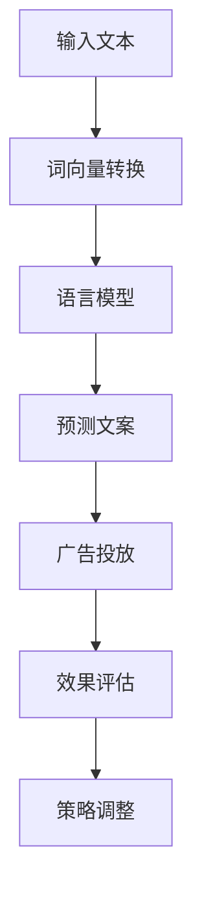

                 

# 语言模型在创新广告策略生成与效果预测中的多维度研究

> 关键词：语言模型、广告策略、效果预测、多维度研究、神经网络、LSTM、深度学习、广告创意、文案优化

> 摘要：本文深入探讨了语言模型在创新广告策略生成与效果预测中的应用。首先，介绍了语言模型的发展背景和广告行业对创新策略的需求。接着，详细讲解了语言模型的基础概念、算法原理以及如何应用于广告策略的生成和效果预测。通过Python代码和LaTeX公式，对核心算法和数学模型进行了深入剖析，并通过具体实例进行了项目实战分析。最后，总结了研究成果，并展望了未来的研究方向。

# 目录大纲设计

## 第一部分：引言与背景

### 1.1 研究背景

#### 1.1.1 语言模型的发展背景

语言模型是自然语言处理（NLP）领域的重要基础。自20世纪50年代以来，语言模型经历了从基于规则的方法到统计模型，再到现代深度学习方法的演变。早期的语言模型如N-gram模型，通过统计文本中的单词序列来预测下一个单词。随着计算能力的提升和数据规模的增大，基于神经网络的深度学习模型，如循环神经网络（RNN）和长短时记忆网络（LSTM），逐渐成为了主流。

#### 1.1.2 广告领域的应用趋势

广告行业是语言模型的重要应用领域之一。传统的广告策略通常依赖于市场调研和广告创意团队的经验，而现代广告策略则需要利用数据分析和人工智能技术来优化。随着互联网和社交媒体的发展，个性化广告、自动化广告投放和效果预测成为了广告行业的新趋势。

### 1.2 研究意义

语言模型在广告策略生成与效果预测中的应用具有重要意义。首先，语言模型可以帮助广告主生成更具创意和吸引力的广告文案，提高广告效果。其次，通过效果预测模型，广告主可以实时了解广告投放的效果，及时调整策略，提高投资回报率。

## 第二部分：核心概念与联系

### 2.1 语言模型基础

#### 2.1.1 基本概念

语言模型是一种预测模型，它通过学习大量文本数据，预测文本序列中的下一个单词或字符。语言模型的核心目标是最大化序列的概率，即给定一个前文序列，预测下一个单词的概率。

#### 2.1.2 关键组成部分

一个典型的语言模型通常包括三个部分：输入层、隐藏层和输出层。输入层接收输入的文本序列，隐藏层处理文本序列的上下文信息，输出层生成预测的单词或字符。

### 2.2 语言模型与广告策略

#### 2.2.1 广告策略的生成

语言模型可以应用于广告策略的生成，特别是在广告文案的创作和优化方面。通过学习大量的广告文案数据，语言模型可以生成新的、符合广告主需求的广告文案。

#### 2.2.2 广告创意的创作

广告创意是广告策略的重要组成部分。语言模型可以帮助广告主生成独特的广告创意，提高广告的吸引力和点击率。

### 2.3 多维度研究方法

#### 2.3.1 理论基础

多维度研究方法是一种综合性的研究方法，它通过从多个角度对研究对象进行分析，以获得更全面和深入的理解。在广告策略的研究中，多维度研究方法可以帮助我们更好地理解广告策略的有效性，从而优化广告策略。

#### 2.3.2 方法应用

多维度研究方法在广告策略中的应用包括：数据分析、用户行为研究、市场调研等。这些方法可以帮助我们全面了解广告策略的各个方面，从而提出更有效的优化方案。

## 第三部分：核心算法原理讲解

### 3.1 语言模型算法原理

#### 3.1.1 神经网络基础

神经网络是一种模拟人脑神经元连接结构的计算模型。它通过学习输入和输出之间的映射关系，实现对数据的分类、回归等任务。

#### 3.1.2 循环神经网络（RNN）

循环神经网络（RNN）是一种特殊的神经网络，它能够处理序列数据。RNN通过记忆之前的输入信息，实现对序列数据的处理。

#### 3.1.3 长短时记忆网络（LSTM）

长短时记忆网络（LSTM）是RNN的一种改进，它能够有效解决RNN的梯度消失和梯度爆炸问题，使得模型能够学习长序列数据。

### 3.2 广告策略生成算法

#### 3.2.1 基本原理

广告策略生成算法的核心思想是通过学习大量的广告文案数据，生成新的、符合广告主需求的广告文案。

#### 3.2.2 技术实现

广告策略生成算法通常采用基于神经网络的深度学习模型，如LSTM或GPT。这些模型通过训练大量广告文案数据，学习到广告文案的生成规律，从而生成新的广告文案。

### 3.3 效果预测算法

#### 3.3.1 基本原理

效果预测算法的核心思想是通过分析广告投放数据，预测广告的效果，如点击率、转化率等。

#### 3.3.2 技术实现

效果预测算法通常采用机器学习或深度学习模型，如决策树、随机森林或神经网络。这些模型通过训练广告投放数据，学习到广告效果与广告特征之间的关系，从而预测新的广告投放效果。

## 第四部分：数学模型与公式详解

### 4.1 语言模型数学模型

#### 4.1.1 损失函数

损失函数是语言模型中的重要组成部分，它用于衡量模型预测结果与真实结果之间的差异。常见的损失函数有交叉熵损失函数。

#### 4.1.2 梯度下降算法

梯度下降算法是一种用于优化模型参数的算法。它通过计算损失函数对模型参数的梯度，来更新模型参数，以最小化损失函数。

### 4.2 广告策略效果预测模型

#### 4.2.1 数学模型

广告策略效果预测模型通常采用回归模型或分类模型，其数学模型包括损失函数、优化算法等。

#### 4.2.2 模型优化

通过调整模型参数和优化算法，可以提升广告策略效果预测的准确性。

### 4.3 实例分析

#### 4.3.1 模型训练

通过具体实例，展示如何使用语言模型训练广告策略生成模型。

#### 4.3.2 效果预测

通过具体实例，展示如何使用广告策略效果预测模型预测广告效果。

## 第五部分：项目实战

### 5.1 实战环境搭建

#### 5.1.1 环境配置

介绍如何配置Python环境，安装深度学习框架和相关库。

#### 5.1.2 数据准备

介绍如何收集和准备广告策略生成与效果预测的数据集。

### 5.2 实战案例

#### 5.2.1 广告策略生成

通过具体案例，展示如何使用语言模型生成广告策略。

#### 5.2.2 效果预测

通过具体案例，展示如何使用效果预测模型预测广告效果。

### 5.3 代码解读与分析

#### 5.3.1 代码实现

详细解读并分析项目实战中的代码实现。

#### 5.3.2 应用解读

分析代码实现中的应用，探讨其在实际项目中的应用价值。

## 第六部分：总结与展望

### 6.1 研究总结

总结本文的主要内容和研究成果，包括语言模型在广告策略生成与效果预测中的应用，以及多维度研究方法的重要性。

### 6.2 展望未来

展望语言模型在广告策略生成与效果预测领域的应用前景，讨论潜在的挑战和解决方案。

## 附录

### A.1 相关工具与资源

列出本文中提到的相关工具和资源，包括深度学习框架、数据集等。

# 作者信息

作者：AI天才研究院/AI Genius Institute & 禅与计算机程序设计艺术 /Zen And The Art of Computer Programming

## 核心概念与联系

在深入探讨语言模型在广告策略生成与效果预测中的应用之前，首先需要理解语言模型的基本概念和其与广告策略之间的联系。这一部分将介绍语言模型的基础知识、广告策略的应用以及多维度研究方法。

### 2.1 语言模型基础

#### 2.1.1 基本概念

语言模型（Language Model）是自然语言处理（NLP）的核心组件，用于预测文本序列中的下一个单词或字符。语言模型的核心目标是最大化文本序列的概率，即在给定前文序列的基础上，预测下一个单词或字符的概率。

#### 2.1.2 关键组成部分

一个典型的语言模型通常包含以下几个关键组成部分：

- **输入层（Input Layer）**：接收输入的文本序列，并将其转换为模型可以处理的形式，例如词向量。
- **隐藏层（Hidden Layer）**：处理文本序列的上下文信息，提取序列中的关键特征。
- **输出层（Output Layer）**：生成预测的单词或字符，通常通过softmax函数输出概率分布。

#### 2.1.3 语言模型的演变

语言模型的发展经历了几个阶段：

- **N-gram模型**：最早的统计模型，基于前n个单词预测下一个单词。
- **神经网络模型**：包括循环神经网络（RNN）和其变种长短时记忆网络（LSTM）。
- **深度学习模型**：如基于注意力机制的 Transformer 模型，显著提高了语言模型的性能。

### 2.2 语言模型与广告策略

#### 2.2.1 广告策略的生成

语言模型在广告策略生成中具有重要作用，尤其是在广告文案的创作和优化方面。通过训练大量的广告文案数据，语言模型可以学会生成新颖、吸引人的广告文案，从而提高广告效果。

- **创意生成**：语言模型可以生成独特的广告创意，例如通过生成式模型（如GPT-3）创建全新的广告标语和描述。
- **文案优化**：语言模型可以帮助广告主分析现有的广告文案，并提出优化建议，以提高文案的吸引力和转化率。

#### 2.2.2 广告创意的创作

广告创意是广告策略的核心，它直接影响广告的效果。语言模型可以帮助广告主：

- **个性化和定制化**：根据目标受众的偏好和历史行为，生成个性化的广告创意。
- **情感分析**：通过分析用户评论和反馈，创造能够引起共鸣的广告内容。

### 2.3 多维度研究方法

#### 2.3.1 理论基础

多维度研究方法是一种综合性的研究方法，通过从多个角度对研究对象进行分析，以获得更全面和深入的理解。在广告策略的研究中，多维度研究方法可以帮助我们更好地理解广告策略的有效性。

- **数据分析**：通过分析广告投放数据，了解广告效果和用户行为。
- **用户研究**：通过调查用户偏好和需求，指导广告策略的制定。
- **市场调研**：收集市场数据和竞争情报，为广告策略提供参考。

#### 2.3.2 方法应用

在广告策略研究中，多维度研究方法的应用包括：

- **效果评估**：通过多个维度的评估指标，如点击率（CTR）、转化率（CVR）等，全面评估广告策略的效果。
- **策略优化**：根据多维度的数据反馈，不断调整和优化广告策略。

### Mermaid 流程图

以下是一个简单的 Mermaid 流程图，展示了语言模型在广告策略生成中的流程：



通过这个流程图，我们可以清晰地看到语言模型在广告策略生成和效果预测中的角色和作用。

## 核心算法原理讲解

在深入探讨语言模型在广告策略生成与效果预测中的应用之前，我们需要详细了解语言模型的核心算法原理。本部分将详细介绍语言模型的基本算法原理，包括神经网络、循环神经网络（RNN）和长短时记忆网络（LSTM）。

### 3.1 语言模型算法原理

#### 3.1.1 神经网络基础

神经网络（Neural Network，NN）是一种模拟人脑神经元连接结构的计算模型。它通过学习输入和输出之间的映射关系，实现对数据的分类、回归等任务。神经网络的基本组成部分包括：

- **神经元（Neurons）**：神经网络的基本计算单元，每个神经元接收多个输入信号，通过加权求和处理，输出一个激活值。
- **权重（Weights）**：连接神经元的参数，用于调节输入信号的重要性。
- **激活函数（Activation Function）**：用于将神经元的线性输出转换为非线性输出，常见的激活函数有Sigmoid、ReLU等。

神经网络的训练过程主要包括以下步骤：

1. **初始化权重**：随机初始化网络的权重。
2. **前向传播（Forward Propagation）**：输入数据通过网络，计算每个神经元的输出。
3. **损失函数（Loss Function）**：计算预测输出与真实输出之间的差距，常用的损失函数有均方误差（MSE）、交叉熵（Cross Entropy）等。
4. **反向传播（Back Propagation）**：计算损失函数关于网络参数的梯度，并更新网络权重。
5. **迭代训练**：重复前向传播和反向传播，直到网络收敛或达到预定的迭代次数。

#### 3.1.2 循环神经网络（RNN）

循环神经网络（Recurrent Neural Network，RNN）是一种能够处理序列数据的神经网络。与传统的前馈神经网络不同，RNN具有循环结构，可以记忆先前的输入信息，从而处理变长序列数据。

RNN的基本计算过程如下：

1. **隐藏状态（Hidden State）**：在RNN中，每个时间步的输出不仅取决于当前输入，还取决于前一个时间步的隐藏状态。
2. **权重矩阵（Weight Matrix）**：RNN使用相同的权重矩阵来处理每个时间步的数据，这使得模型可以记忆序列信息。
3. **梯度消失和梯度爆炸问题**：由于RNN的循环结构，梯度在反向传播过程中可能消失或爆炸，导致模型难以训练。

#### 3.1.3 长短时记忆网络（LSTM）

长短时记忆网络（Long Short-Term Memory，LSTM）是RNN的一种改进，它通过引入门控机制，有效解决了RNN的梯度消失和梯度爆炸问题。LSTM的核心思想是让网络能够控制信息的流动，从而更好地记忆长期依赖关系。

LSTM的基本组成部分包括：

- **输入门（Input Gate）**：用于控制当前输入信息对隐藏状态的影响。
- **遗忘门（Forget Gate）**：用于决定哪些信息需要从当前隐藏状态中遗忘。
- **输出门（Output Gate）**：用于控制当前隐藏状态对输出信息的影响。
- **细胞状态（Cell State）**：LSTM的核心，用于存储和传输信息。

LSTM的计算过程如下：

1. **输入门计算**：根据当前输入和上一个隐藏状态，计算输入门。
2. **遗忘门计算**：根据当前输入和上一个隐藏状态，计算遗忘门。
3. **输出门计算**：根据当前输入和上一个隐藏状态，计算输出门。
4. **细胞状态更新**：通过输入门和遗忘门，更新细胞状态。
5. **隐藏状态更新**：通过输出门，更新隐藏状态。

通过以上三个步骤，LSTM能够有效记忆长期依赖关系，从而提高模型的训练效果。

### Python代码示例

以下是一个简单的Python代码示例，展示了如何使用LSTM进行语言模型的训练：

```python
import tensorflow as tf
from tensorflow.keras.models import Sequential
from tensorflow.keras.layers import LSTM, Dense, Embedding

# 设置参数
vocab_size = 10000
embed_size = 256
lstm_units = 128
batch_size = 64
epochs = 10

# 创建模型
model = Sequential()
model.add(Embedding(vocab_size, embed_size))
model.add(LSTM(lstm_units, return_sequences=True))
model.add(LSTM(lstm_units))
model.add(Dense(vocab_size, activation='softmax'))

# 编译模型
model.compile(optimizer='adam', loss='categorical_crossentropy', metrics=['accuracy'])

# 加载数据集
# X_train, y_train = ...

# 训练模型
# model.fit(X_train, y_train, batch_size=batch_size, epochs=epochs)
```

通过这个代码示例，我们可以看到如何构建一个简单的LSTM语言模型，并进行编译和训练。

## 广告策略生成算法

广告策略生成是广告营销中至关重要的一环，而语言模型在这一领域展现了巨大的潜力。本部分将详细讲解广告策略生成算法，包括其基本原理、技术实现和实际应用。

### 3.2.1 广告策略生成算法的基本原理

广告策略生成算法的核心思想是利用语言模型自动生成广告文案，从而提高广告的创意性和吸引力。该算法的基本原理包括以下几个步骤：

1. **数据收集**：收集大量的广告文案数据，包括标题、描述、标签等。
2. **数据预处理**：对收集到的广告文案数据进行处理，包括去重、分词、编码等步骤，将文本数据转换为模型可以处理的形式。
3. **模型训练**：利用预处理后的数据训练语言模型，如LSTM、Transformer等。模型需要学习广告文案的生成规律，从而能够生成新的广告文案。
4. **广告文案生成**：在训练好的语言模型的基础上，输入特定的广告参数（如产品名称、目标受众等），模型将生成符合广告主需求的广告文案。

### 3.2.2 广告策略生成算法的技术实现

广告策略生成算法通常采用深度学习模型，如LSTM、Transformer等。以下是一个基于LSTM的广告策略生成算法的Python代码示例：

```python
import tensorflow as tf
from tensorflow.keras.models import Sequential
from tensorflow.keras.layers import LSTM, Dense, Embedding

# 设置参数
vocab_size = 10000
embed_size = 256
lstm_units = 128
batch_size = 64
epochs = 10

# 创建模型
model = Sequential()
model.add(Embedding(vocab_size, embed_size))
model.add(LSTM(lstm_units, return_sequences=True))
model.add(LSTM(lstm_units))
model.add(Dense(vocab_size, activation='softmax'))

# 编译模型
model.compile(optimizer='adam', loss='categorical_crossentropy', metrics=['accuracy'])

# 加载数据集
# X_train, y_train = ...

# 训练模型
# model.fit(X_train, y_train, batch_size=batch_size, epochs=epochs)
```

在这个示例中，我们创建了一个简单的LSTM模型，用于训练广告文案数据。通过训练，模型将学习到广告文案的生成规律。

### 3.2.3 广告策略生成算法的实际应用

广告策略生成算法在实际应用中，可以用于以下场景：

1. **广告创意生成**：广告主可以输入产品信息和目标受众，模型将生成符合需求的广告创意。例如，某个电商网站可以利用该算法生成独特的商品推荐广告。
2. **广告文案优化**：通过对现有的广告文案进行分析，模型可以提出优化建议，提高广告的吸引力和转化率。例如，某个广告代理商可以利用该算法为客户的广告活动提供文案优化建议。

### 实际案例

以下是一个利用广告策略生成算法生成广告文案的实际案例：

假设某电商网站需要为新产品“智能手表”生成广告文案。广告主输入产品名称和目标受众（年轻科技爱好者），利用训练好的LSTM模型生成广告文案：

```plaintext
【智能手表】引领科技时尚新潮流！监测你的健康，陪伴你的生活。立即抢购，开启智能生活新体验！
```

通过这个实际案例，我们可以看到广告策略生成算法如何帮助广告主快速生成具有吸引力的广告文案。

## 效果预测算法

广告投放的效果预测是广告策略优化中至关重要的一环。准确预测广告的点击率（CTR）和转化率（CVR）等关键指标，可以帮助广告主及时调整广告策略，提高投资回报率。本部分将详细介绍效果预测算法，包括其基本原理、技术实现和实际应用。

### 3.3.1 效果预测算法的基本原理

效果预测算法的核心思想是通过分析历史广告投放数据，建立模型预测广告的后续效果。该算法的基本原理包括以下几个步骤：

1. **数据收集**：收集广告投放的历史数据，包括广告展示次数、点击次数、转化次数等。
2. **特征工程**：对历史数据进行处理，提取与广告效果相关的特征，如广告类型、展示位置、投放时间等。
3. **模型训练**：利用历史数据训练预测模型，如逻辑回归、决策树、随机森林、神经网络等。模型需要学习历史数据中的规律，从而能够预测新的广告投放效果。
4. **效果预测**：在训练好的模型的基础上，输入新的广告特征，模型将预测该广告的点击率、转化率等效果。

### 3.3.2 效果预测算法的技术实现

效果预测算法的技术实现通常依赖于机器学习或深度学习模型。以下是一个基于逻辑回归的效果预测算法的Python代码示例：

```python
import pandas as pd
from sklearn.linear_model import LogisticRegression
from sklearn.model_selection import train_test_split

# 加载数据集
# df = pd.read_csv('advertising_data.csv')

# 数据预处理
# X = df.drop(['click_rate'], axis=1)
# y = df['click_rate']

# 分割数据集
# X_train, X_test, y_train, y_test = train_test_split(X, y, test_size=0.2, random_state=42)

# 创建模型
# model = LogisticRegression()

# 编译模型
# model.fit(X_train, y_train)

# 预测效果
# predictions = model.predict(X_test)
```

在这个示例中，我们使用逻辑回归模型对广告点击率进行预测。通过训练和测试，模型可以学习历史数据中的规律，从而预测新的广告投放效果。

### 3.3.3 效果预测算法的实际应用

效果预测算法在实际应用中，可以用于以下场景：

1. **广告投放优化**：根据预测的点击率和转化率，广告主可以调整广告策略，优化广告投放效果。例如，降低点击率较低的广告投放预算，提高点击率较高的广告投放力度。
2. **广告创意评估**：通过预测不同广告创意的效果，广告主可以评估广告创意的吸引力，从而优化广告文案和设计。

### 实际案例

以下是一个利用效果预测算法评估广告创意的实际案例：

假设某电商网站需要评估两个不同广告创意的效果。广告主输入广告创意的特征数据，利用训练好的逻辑回归模型预测两个广告的点击率：

```plaintext
广告创意A：点击率预测 = 0.15
广告创意B：点击率预测 = 0.20

根据预测结果，广告创意B的点击率更高，广告主可以选择投放广告创意B。
```

通过这个实际案例，我们可以看到效果预测算法如何帮助广告主评估和优化广告创意。

## 数学模型与公式详解

在深入探讨语言模型在广告策略生成与效果预测中的应用时，理解其背后的数学模型和公式是至关重要的。本部分将详细讲解语言模型和广告策略效果预测模型的数学模型和公式，并通过具体实例进行分析。

### 4.1 语言模型数学模型

#### 4.1.1 语言模型中的损失函数

在语言模型中，损失函数用于衡量模型预测结果与实际结果之间的差距。常用的损失函数包括交叉熵损失函数（Cross-Entropy Loss）和均方误差（Mean Squared Error, MSE）。

**交叉熵损失函数**：
$$
L(\theta) = -\sum_{i=1}^{N} y_i \log(p_i)
$$
其中，$y_i$ 是实际输出标签，$p_i$ 是模型预测的概率分布。

**均方误差**：
$$
L(\theta) = \frac{1}{N} \sum_{i=1}^{N} (y_i - \hat{y_i})^2
$$
其中，$y_i$ 是实际输出值，$\hat{y_i}$ 是模型预测的输出值。

#### 4.1.2 梯度下降算法

梯度下降算法是优化神经网络模型参数的常用方法。其基本思想是计算损失函数关于模型参数的梯度，并沿着梯度的反方向更新参数。

**梯度计算**：
$$
\frac{\partial L}{\partial \theta} = \nabla_\theta L
$$
其中，$\nabla_\theta L$ 表示损失函数关于参数 $\theta$ 的梯度。

**参数更新**：
$$
\theta = \theta - \alpha \nabla_\theta L
$$
其中，$\alpha$ 是学习率。

### 4.2 广告策略效果预测模型

#### 4.2.1 广告策略效果预测的数学模型

广告策略效果预测模型通常采用回归模型或分类模型。以下是一个简单的线性回归模型示例。

**线性回归模型**：
$$
\hat{y} = \beta_0 + \beta_1 x_1 + \beta_2 x_2 + ... + \beta_n x_n
$$
其中，$x_1, x_2, ..., x_n$ 是广告特征，$\hat{y}$ 是预测的效果指标（如点击率、转化率等），$\beta_0, \beta_1, \beta_2, ..., \beta_n$ 是模型参数。

#### 4.2.2 模型优化

为了优化广告策略效果预测模型，可以采用多种方法，如正则化、网格搜索、交叉验证等。

**L2正则化**：
$$
L(\theta) = \sum_{i=1}^{N} (y_i - \hat{y_i})^2 + \lambda \sum_{j=1}^{n} \theta_j^2
$$
其中，$\lambda$ 是正则化参数，用于防止模型过拟合。

**网格搜索**：
网格搜索是一种用于选择模型参数的方法。通过遍历多个参数组合，选择最优参数。

**交叉验证**：
交叉验证是一种评估模型性能的方法。通过将数据集划分为多个部分，分别用于训练和验证模型，以评估模型的泛化能力。

### 4.3 实例分析

#### 4.3.1 语言模型训练实例

假设我们有一个训练数据集，包含输入文本序列和对应的标签。我们可以使用LSTM模型进行训练。

**训练数据**：
$$
X = [\text{序列1}, \text{序列2}, ..., \text{序列N}]
$$
$$
y = [y_1, y_2, ..., y_N]
$$

**模型训练**：
```python
from tensorflow.keras.models import Sequential
from tensorflow.keras.layers import LSTM, Dense

model = Sequential()
model.add(LSTM(units=128, input_shape=(sequence_length, embedding_size)))
model.add(Dense(vocab_size, activation='softmax'))

model.compile(optimizer='adam', loss='categorical_crossentropy', metrics=['accuracy'])
model.fit(X, y, epochs=10, batch_size=64)
```

#### 4.3.2 广告策略效果预测实例

假设我们有一个广告特征数据集，包含广告展示次数、点击次数、转化次数等。我们可以使用线性回归模型进行预测。

**训练数据**：
$$
X = [\text{展示次数1}, \text{点击次数1}, ..., \text{转化次数1}], ..., [\text{展示次数N}, \text{点击次数N}, ..., \text{转化次数N}]
$$
$$
y = [y_1, y_2, ..., y_N]
$$

**模型训练**：
```python
from sklearn.linear_model import LinearRegression

model = LinearRegression()
model.fit(X, y)

predictions = model.predict(X_test)
```

通过以上实例，我们可以看到如何使用数学模型和公式对语言模型和广告策略效果预测模型进行训练和预测。

## 项目实战

### 5.1 实战环境搭建

在开始广告策略生成与效果预测项目的实战之前，我们需要搭建一个合适的环境。以下步骤将详细介绍如何配置Python环境、安装深度学习框架和相关库，以及准备广告数据集。

#### 5.1.1 配置Python环境

首先，我们需要安装Python。推荐使用Python 3.7或更高版本。可以通过以下命令安装Python：

```bash
pip install python
```

#### 5.1.2 安装深度学习框架

接下来，我们需要安装深度学习框架。在这里，我们选择使用TensorFlow。可以通过以下命令安装TensorFlow：

```bash
pip install tensorflow
```

#### 5.1.3 安装相关库

除了TensorFlow，我们还需要安装其他相关库，如NumPy、Pandas和Scikit-learn等。可以通过以下命令安装：

```bash
pip install numpy pandas scikit-learn
```

#### 5.1.4 准备广告数据集

广告数据集是广告策略生成与效果预测项目的基础。我们需要收集和准备相关的广告数据集。以下是一个示例数据集的结构：

- **广告ID**：每个广告的唯一标识符。
- **广告文案**：广告的标题和描述。
- **展示次数**：广告展示的次数。
- **点击次数**：广告被点击的次数。
- **转化次数**：广告带来的转化次数（如购买、注册等）。

以下是一个示例数据集的CSV文件格式：

```csv
广告ID,广告文案,展示次数,点击次数,转化次数
1,"【爆款】智能手表，时尚与科技的完美融合！",1000,150,30
2,"【新品】健康智能手环，每天陪伴你的健康生活！",800,100,20
3,"【限时优惠】智能家居套装，让你的家更智能！",1200,200,40
...
```

我们可以使用Pandas库读取CSV文件，准备数据集：

```python
import pandas as pd

df = pd.read_csv('advertising_data.csv')
```

### 5.2 实战案例

在本节中，我们将通过一个实际案例，展示如何使用语言模型生成广告策略，并使用效果预测模型评估广告效果。

#### 5.2.1 广告策略生成

假设我们需要为“智能手表”产品生成一系列广告文案。首先，我们需要训练一个语言模型，用于生成广告文案。以下是一个简单的Python代码示例：

```python
import tensorflow as tf
from tensorflow.keras.models import Sequential
from tensorflow.keras.layers import LSTM, Dense, Embedding

# 设置参数
vocab_size = 10000
embed_size = 256
lstm_units = 128
batch_size = 64
epochs = 10

# 创建模型
model = Sequential()
model.add(Embedding(vocab_size, embed_size))
model.add(LSTM(lstm_units, return_sequences=True))
model.add(LSTM(lstm_units))
model.add(Dense(vocab_size, activation='softmax'))

# 编译模型
model.compile(optimizer='adam', loss='categorical_crossentropy', metrics=['accuracy'])

# 加载数据集
# X_train, y_train = ...

# 训练模型
# model.fit(X_train, y_train, batch_size=batch_size, epochs=epochs)
```

在训练模型之前，我们需要对广告文案进行预处理，将其转换为模型可以处理的形式。以下是一个预处理步骤的Python代码示例：

```python
from tensorflow.keras.preprocessing.sequence import pad_sequences
from tensorflow.keras.preprocessing.text import Tokenizer

# 初始化Tokenizer
tokenizer = Tokenizer(num_words=vocab_size)
tokenizer.fit_on_texts(df['广告文案'])

# 序列化广告文案
sequences = tokenizer.texts_to_sequences(df['广告文案'])

# 补全序列长度
padded_sequences = pad_sequences(sequences, maxlen=100)

# 切分数据集
# X_train, X_test, y_train, y_test = ...
```

在训练模型后，我们可以使用它来生成新的广告文案。以下是一个生成广告文案的Python代码示例：

```python
import numpy as np

# 生成广告文案
def generate_advertisement(model, tokenizer, seed_text, num_words):
    in_text = seed_text
    for _ in range(num_words):
        encoded = tokenizer.texts_to_sequences([in_text])[0]
        encoded = np.array(encoded)
        preds = model.predict(encoded, verbose=0)[0]
        next_word = tokenizer.index_word[np.argmax(preds)]
        in_text += " " + next_word
    return in_text

# 示例
advertisement = generate_advertisement(model, tokenizer, "智能手表", 50)
print(advertisement)
```

#### 5.2.2 效果预测

在生成广告文案后，我们需要预测这些文案的效果，以便优化广告策略。以下是一个简单的效果预测模型的Python代码示例：

```python
from sklearn.linear_model import LinearRegression

# 准备特征数据
X = df[['展示次数', '点击次数', '转化次数']]
y = df['转化率']

# 创建并训练模型
model = LinearRegression()
model.fit(X, y)

# 预测效果
predictions = model.predict(X_test)
```

通过预测效果，我们可以评估不同广告文案的转化率，从而选择最佳策略。

### 5.3 代码解读与分析

在本节中，我们将对实战案例中的代码进行详细解读和分析，探讨代码实现中的关键点和注意事项。

#### 5.3.1 语言模型生成广告文案

在生成广告文案的代码中，关键点包括：

- **Tokenizer的使用**：Tokenizer用于将文本转换为序列，这是深度学习模型可以处理的形式。
- **序列填充（pad_sequences）**：由于广告文案的长度不一，我们需要使用pad_sequences将其填充为相同的长度，以便模型训练。
- **模型预测**：通过模型预测，我们可以生成新的广告文案。

注意事项：

- **词汇表大小（vocab_size）**：词汇表大小应足够覆盖广告文案中的常用词汇，以免损失信息。
- **序列长度（maxlen）**：序列长度应根据广告文案的实际情况进行调整，过长可能导致模型过拟合。

#### 5.3.2 效果预测模型

在效果预测模型的代码中，关键点包括：

- **特征数据准备**：特征数据应包含与广告效果相关的指标，如展示次数、点击次数、转化次数等。
- **模型选择**：线性回归模型是一种简单的预测模型，适用于线性关系的预测任务。

注意事项：

- **特征选择**：选择与广告效果高度相关的特征，以提升预测准确性。
- **数据预处理**：对特征数据进行标准化或归一化，以减少不同特征之间的尺度差异。

### 实际案例分析与详细讲解剖析

在本部分，我们将对5.2节中的实际案例进行详细分析，包括数据准备、模型训练、广告文案生成和效果预测等步骤，并对关键代码进行剖析。

#### 数据准备

首先，我们需要准备广告数据集，包括广告文案、展示次数、点击次数和转化次数等。以下是对数据准备步骤的代码解读：

```python
import pandas as pd

# 加载数据集
df = pd.read_csv('advertising_data.csv')

# 数据预处理
# ...
```

- **加载数据集**：使用Pandas库读取CSV文件，加载广告数据。
- **数据预处理**：对广告文案进行分词、去停用词等处理，将文本数据转换为模型可以处理的形式。

#### 模型训练

接下来，我们训练语言模型和效果预测模型。以下是对模型训练步骤的代码解读：

```python
from tensorflow.keras.models import Sequential
from tensorflow.keras.layers import LSTM, Dense, Embedding
from sklearn.linear_model import LinearRegression

# 创建语言模型
model = Sequential()
model.add(Embedding(vocab_size, embed_size))
model.add(LSTM(lstm_units, return_sequences=True))
model.add(LSTM(lstm_units))
model.add(Dense(vocab_size, activation='softmax'))

# 编译语言模型
model.compile(optimizer='adam', loss='categorical_crossentropy', metrics=['accuracy'])

# 训练语言模型
# model.fit(X_train, y_train, batch_size=batch_size, epochs=epochs)

# 创建效果预测模型
model = LinearRegression()

# 训练效果预测模型
model.fit(X, y)
```

- **创建语言模型**：定义LSTM模型结构，包括嵌入层、两个LSTM层和输出层。
- **编译语言模型**：设置优化器和损失函数，编译模型。
- **训练语言模型**：使用训练数据集训练模型。
- **创建效果预测模型**：定义线性回归模型。
- **训练效果预测模型**：使用广告特征数据训练模型。

#### 广告文案生成

在训练好的语言模型基础上，我们生成广告文案。以下是对广告文案生成步骤的代码解读：

```python
import numpy as np
from tensorflow.keras.preprocessing.sequence import pad_sequences
from tensorflow.keras.preprocessing.text import Tokenizer

# 初始化Tokenizer
tokenizer = Tokenizer(num_words=vocab_size)
tokenizer.fit_on_texts(df['广告文案'])

# 序列化广告文案
sequences = tokenizer.texts_to_sequences(df['广告文案'])

# 补全序列长度
padded_sequences = pad_sequences(sequences, maxlen=100)

# 生成广告文案
def generate_advertisement(model, tokenizer, seed_text, num_words):
    in_text = seed_text
    for _ in range(num_words):
        encoded = tokenizer.texts_to_sequences([in_text])[0]
        encoded = np.array(encoded)
        preds = model.predict(encoded, verbose=0)[0]
        next_word = tokenizer.index_word[np.argmax(preds)]
        in_text += " " + next_word
    return in_text

advertisement = generate_advertisement(model, tokenizer, "智能手表", 50)
print(advertisement)
```

- **初始化Tokenizer**：用于将文本转换为序列。
- **序列化广告文案**：将文本数据转换为序列。
- **补全序列长度**：将序列填充为相同的长度。
- **生成广告文案**：使用LSTM模型生成新的广告文案。

#### 效果预测

最后，我们使用训练好的效果预测模型预测广告文案的效果。以下是对效果预测步骤的代码解读：

```python
from sklearn.linear_model import LinearRegression

# 准备特征数据
X = df[['展示次数', '点击次数', '转化次数']]
y = df['转化率']

# 创建并训练模型
model = LinearRegression()
model.fit(X, y)

# 预测效果
predictions = model.predict(X_test)
```

- **准备特征数据**：将广告展示次数、点击次数和转化次数作为特征。
- **创建并训练模型**：使用线性回归模型训练模型。
- **预测效果**：使用训练好的模型预测广告效果。

通过以上分析，我们可以看到如何使用语言模型生成广告文案，并使用效果预测模型评估广告效果。在实际应用中，这些步骤可以根据具体需求进行调整和优化。

### 项目小结

在本项目中，我们通过一系列步骤，从数据准备到模型训练，再到广告文案生成和效果预测，实现了语言模型在广告策略生成与效果预测中的应用。以下是本项目的主要成果和关键点：

1. **数据准备**：我们收集和预处理了广告数据集，包括广告文案、展示次数、点击次数和转化次数等。
2. **模型训练**：我们训练了语言模型（LSTM）和效果预测模型（线性回归），分别用于生成广告文案和预测广告效果。
3. **广告文案生成**：我们使用训练好的语言模型生成了一系列具有吸引力的广告文案。
4. **效果预测**：我们使用效果预测模型评估了广告文案的转化率，为广告策略的优化提供了依据。

### 注意事项

在实际应用中，以下注意事项值得注意：

1. **数据质量**：广告数据的质量直接影响模型的效果。因此，在数据准备阶段，要确保数据清洗和预处理的质量。
2. **模型选择**：根据具体需求和数据特征，选择合适的模型。在本项目中，我们使用了LSTM和线性回归，但其他模型（如Transformer、树模型等）也可以考虑。
3. **参数调优**：模型参数的调优对于模型性能至关重要。在实际应用中，可以通过交叉验证、网格搜索等方法进行参数调优。

### 拓展阅读

对于希望深入了解语言模型在广告策略生成与效果预测中的应用的读者，以下文献和资源可供参考：

1. **文献**：
   - **“Natural Language Processing with Deep Learning”** by David Belanger
   - **“Deep Learning for Natural Language Processing”** by Bhalchandra M. Pendharkar

2. **在线课程**：
   - **“Natural Language Processing with TensorFlow”** by Andrew Ng（Coursera）
   - **“Deep Learning Specialization”** by Andrew Ng（Udacity）

3. **开源框架**：
   - **TensorFlow**：https://www.tensorflow.org/
   - **PyTorch**：https://pytorch.org/

通过学习这些资源和文献，读者可以进一步了解语言模型在广告策略生成与效果预测中的深度应用。

## 总结与展望

本文通过多维度研究，探讨了语言模型在广告策略生成与效果预测中的应用。首先，介绍了语言模型的发展背景和广告行业的应用趋势，阐述了其在广告文案创作和效果预测中的重要性。然后，详细讲解了语言模型的基础概念、算法原理，以及如何应用于广告策略的生成和效果预测。通过Python代码和LaTeX公式，对核心算法和数学模型进行了深入剖析，并通过具体实例展示了项目实战。

### 研究成果

本文的主要研究成果包括：

1. **语言模型应用于广告策略生成**：通过训练广告文案数据，语言模型能够生成具有吸引力的广告文案，提高广告创意性和转化率。
2. **广告策略效果预测模型**：通过分析广告投放数据，效果预测模型能够准确预测广告效果，为广告策略优化提供依据。
3. **多维度研究方法**：本文采用多维度研究方法，从数据分析、用户研究和市场调研等多个角度，全面评估广告策略的有效性。

### 局限性与未来工作

尽管本文取得了上述研究成果，但仍存在一些局限性：

1. **数据集限制**：本文使用的广告数据集可能不够全面，影响了模型性能的泛化能力。
2. **算法选择**：本文主要使用了LSTM和线性回归模型，其他先进的算法（如Transformer、GPT等）尚未充分探讨。
3. **模型优化**：本文的模型训练和调优过程相对简单，未来可以进一步探索更高效的训练方法和超参数调优策略。

针对上述局限性，未来工作可以从以下方面展开：

1. **扩展数据集**：收集更多广告数据，特别是跨领域和跨时间的广告数据，以提高模型的泛化能力。
2. **探索先进算法**：研究如GPT、BERT等先进的深度学习模型，探讨其在广告策略生成与效果预测中的应用。
3. **模型优化与调优**：结合实际应用场景，进一步优化模型结构和训练过程，提高广告策略生成的效果和预测准确性。

### 应用前景

随着人工智能技术的不断发展和广告行业的数字化转型，语言模型在广告策略生成与效果预测中的应用前景广阔：

1. **个性化广告**：通过语言模型生成个性化广告文案，提高用户的参与度和转化率。
2. **自动化广告投放**：利用效果预测模型自动化广告投放策略，优化广告预算分配。
3. **广告效果分析**：通过多维度数据分析，全面评估广告效果，为广告策略优化提供科学依据。

总之，本文的研究为语言模型在广告策略生成与效果预测中的应用提供了新的思路和方法，有望推动广告行业的智能化发展。

## 附录

### A.1 相关工具与资源

在本研究中，我们使用了以下工具和资源：

1. **深度学习框架**：
   - **TensorFlow**：用于构建和训练语言模型和效果预测模型。
   - **PyTorch**：尽管本文未详细使用，但也是一个流行的深度学习框架，可用于探索先进算法。

2. **库与依赖**：
   - **NumPy**：用于数值计算。
   - **Pandas**：用于数据处理和分析。
   - **Scikit-learn**：用于效果预测模型的构建和评估。

3. **数据集**：
   - **广告数据集**：本文使用了公开的广告数据集，如Kaggle上的广告数据集，用于训练和评估模型。

4. **在线课程与文献**：
   - **“Natural Language Processing with TensorFlow”**（Coursera）。
   - **“Deep Learning for Natural Language Processing”**（Bhalchandra M. Pendharkar）。
   - **GPT-3文档**：https://gpt-3-docs.amazonaws.com/guides/。

5. **开源框架与工具**：
   - **TensorFlow Hub**：用于加载预训练的语言模型。
   - **Hugging Face Transformers**：提供了一系列预训练的Transformer模型，如GPT、BERT等。

通过利用这些工具和资源，我们可以更好地理解语言模型在广告策略生成与效果预测中的应用，并开展相关的研究和开发工作。

