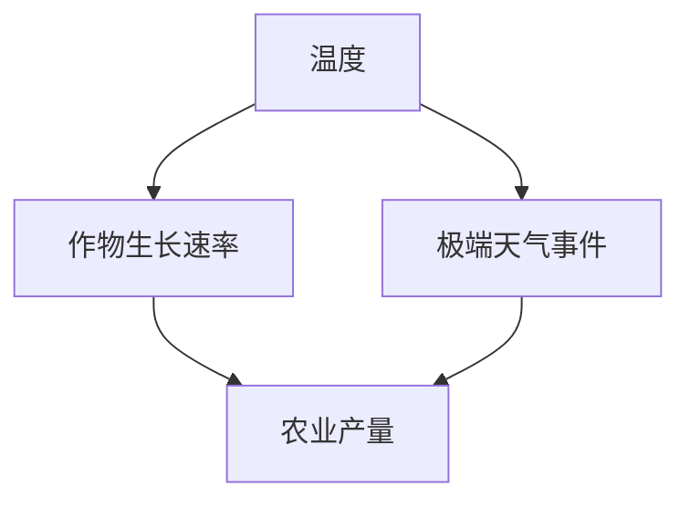

                 

### 1.1 语言模型与因果推理图概述

#### 1.1.1 语言模型的定义和作用

语言模型（Language Model）是自然语言处理（Natural Language Processing, NLP）领域的一项基础性技术，其主要功能是预测一段自然语言文本的下一个词或下一个字符。这一技术起源于20世纪50年代，随着计算机科学和人工智能的发展，语言模型经历了从基于统计的方法到基于神经网络的转变。

语言模型在NLP中具有广泛的应用，包括但不限于：

- 语言生成：自动生成文本，如自动写作、机器翻译、聊天机器人等。
- 语言理解：理解文本内容，包括文本分类、实体识别、情感分析等。
- 语言预测：预测下一个词或字符，为自动纠错、自动完成、自动摘要等任务提供支持。

语言模型的核心目标是通过学习大量的语言数据，建立一个能够准确预测语言序列的概率模型。这一模型能够帮助计算机更好地理解和处理人类语言，是实现智能交互和智能应用的重要基础。

#### 1.1.2 因果推理图的概念和重要性

因果推理图（Causal Inference Graph）是一种用于表示因果关系的图形化工具，它通过图形结构明确地展示变量之间的因果关系。因果推理图由节点和边组成，其中节点表示变量，边表示变量之间的因果关系。

因果推理图在多个领域中具有重要意义，尤其在社会科学、生物医学、经济学等领域，通过因果推理图可以更准确地分析变量之间的关系，从而为决策提供科学依据。例如：

- 在经济学中，因果推理图可以帮助分析政策的影响，确定哪些变量对经济增长有直接或间接的影响。
- 在生物医学中，因果推理图可以揭示疾病发生的原因，为疾病预防提供指导。
- 在社会科学中，因果推理图可以用于政策评估，帮助了解社会现象背后的因果关系。

#### 1.1.3 语言模型与因果推理图的结合

随着语言模型技术的不断进步，它们逐渐与因果推理图相结合，形成了一种新的研究方法——因果语言模型。这种方法利用语言模型的强大预测能力，结合因果推理图的图形化表示，能够在复杂的数据集中揭示变量之间的因果关系。

这种结合具有以下几个显著优势：

- **自动化因果关系发现**：语言模型能够自动从大量数据中学习变量之间的关系，减少人工分析的复杂度。
- **高效处理大规模数据**：语言模型可以处理大规模、高维的数据集，使得因果关系的分析更加高效。
- **多维数据融合**：语言模型可以融合不同来源、不同类型的数据，为因果关系的分析提供更全面的视角。
- **跨领域应用**：因果语言模型的应用不仅限于特定领域，可以跨多个领域进行因果关系的分析。

总之，语言模型与因果推理图的结合为因果关系的分析提供了一种新的思路和方法，具有重要的理论和实践价值。

### 1.2 全球经济政策影响评估的重要性

#### 1.2.1 全球经济政策的影响范围

全球经济政策对世界各国和地区的经济运行和发展具有重要影响。这些政策包括货币政策、财政政策、贸易政策、产业政策等，它们通过调节经济中的供需关系、市场机制和政策环境，直接或间接地影响着经济增长、通货膨胀、失业率、国际收支等宏观经济指标。

具体来说，全球经济政策的影响范围广泛，涵盖了以下方面：

- **经济增长**：通过货币政策和财政政策的配合，政策制定者可以影响经济的总需求和总供给，从而促进或抑制经济增长。
- **通货膨胀**：货币政策通过调节货币供应量和利率，影响通货膨胀水平，维护价格稳定。
- **失业率**：财政政策通过公共投资和就业项目，促进就业机会的增加，降低失业率。
- **国际收支**：贸易政策和汇率政策通过调整出口和进口，平衡国际收支，维护国家的经济稳定。

#### 1.2.2 评估的必要性和挑战

全球经济政策影响评估的必要性体现在以下几个方面：

- **政策效果验证**：评估政策实施的效果，有助于确定政策的有效性和可行性，为后续的政策调整提供依据。
- **决策支持**：评估结果可以为政府、企业和公众提供决策支持，帮助他们更好地理解政策影响，做出合理的经济行为。
- **国际协调**：在国际经济合作中，政策评估结果有助于各国在政策制定和执行上进行协调，促进全球经济稳定和发展。

然而，全球经济政策影响评估也面临一系列挑战：

- **复杂性和多维性**：全球经济政策的影响是多维的，涉及多个经济变量和部门，评估过程复杂。
- **数据稀缺性**：在某些领域，相关数据可能不足，或者数据质量较低，影响评估结果的准确性。
- **时间滞后**：政策影响往往具有时间滞后性，评估结果可能不能及时反映政策的效果。
- **非线性关系**：全球经济中的变量关系往往是复杂的、非线性的，这使得评估过程更加困难。

#### 1.2.3 语言模型在政策评估中的应用

语言模型在政策评估中具有独特的优势，可以应对上述挑战，提供更准确、更及时的评估结果。具体应用包括：

- **文本分析**：语言模型可以处理大量文本数据，如政策文件、新闻报道、专家意见等，从中提取有用信息，为评估提供支持。
- **趋势预测**：基于历史数据和语言模型，可以预测政策实施后的经济趋势，为政策制定者提供前瞻性参考。
- **关系网络分析**：语言模型可以构建变量之间的关系网络，帮助识别关键影响因素，提高评估的精确度。

总之，全球经济政策影响评估对于理解政策效果、支持决策制定和促进经济稳定具有重要意义。语言模型的应用为政策评估提供了新的工具和方法，有助于应对评估中的复杂性和挑战。

#### 1.3 本书结构安排

本书分为五个主要部分，旨在全面探讨语言模型在因果推理图构建与全球经济政策影响评估中的应用。

**第一部分：引言**  
本部分主要介绍语言模型和因果推理图的基本概念，以及它们在全球经济政策影响评估中的重要性。通过本部分的学习，读者可以了解研究的背景和意义，为后续内容打下基础。

**第二部分：语言模型基本原理**  
本部分详细讲解语言模型的定义、类型和核心算法，包括基于统计的方法和基于神经网络的方法。通过本部分的学习，读者可以掌握语言模型的基本理论和技术。

**第三部分：因果推理图构建**  
本部分介绍因果推理图的定义、结构和构建方法，包括传统方法和基于语言模型的方法。通过本部分的学习，读者可以了解如何构建和使用因果推理图来分析变量之间的因果关系。

**第四部分：全球经济政策影响评估**  
本部分讨论语言模型在政策评估中的应用，包括评估框架、实现方法和案例分析。通过本部分的学习，读者可以掌握如何利用语言模型和因果推理图对全球经济政策进行科学评估。

**第五部分：研究进展与展望**  
本部分总结研究进展，展望未来发展趋势，并提出研究方向和潜在挑战的解决方案。通过本部分的学习，读者可以了解该领域的最新动态和未来发展方向。

**学习目标与预期成果**  
通过阅读本书，读者可以：

- 理解语言模型的基本原理和应用。
- 掌握因果推理图的概念和构建方法。
- 学会利用语言模型和因果推理图对全球经济政策进行影响评估。
- 了解该领域的最新研究进展和未来发展趋势。

**附录**  
本书还包括附录部分，提供参考文献、开源代码与数据集以及相关资源与工具，以便读者进一步学习和实践。

### 2.1 语言模型的定义与类型

#### 2.1.1 语言模型的定义

语言模型是自然语言处理领域中的一个核心概念，其定义较为宽泛，但基本思想是通过学习大量的语言数据，构建一个能够对自然语言进行预测的概率模型。语言模型的核心目标是预测下一个词或字符，从而生成或理解自然语言。

形式化地，一个语言模型可以表示为：

$$
P(w_1, w_2, ..., w_n) = \prod_{i=1}^{n} P(w_i | w_{i-1})
$$

其中，$w_1, w_2, ..., w_n$ 表示一个长度为$n$的词序列，$P(w_i | w_{i-1})$ 表示在已知前一个词$w_{i-1}$的情况下，下一个词$w_i$的概率。

#### 2.1.2 语言模型的类型

语言模型可以分为基于统计的方法和基于神经网络的方法。

1. **基于统计的方法**  
基于统计的方法是最早发展起来的语言模型，其基本思想是通过统计词频来预测下一个词。常见的统计方法包括：

- **N-gram模型**：N-gram模型是一种基于词频的模型，它将前$n-1$个词的概率乘积作为当前词的概率。即：
  $$
  P(w_n | w_{n-1}, w_{n-2}, ..., w_1) = \prod_{i=1}^{n} P(w_i | w_{i-1})
  $$
- **变体N-gram模型**：变体N-gram模型是在N-gram模型的基础上，对词频统计进行优化，以减少稀疏数据的问题。常见的变体包括Kneser-Ney平滑和Backoff模型等。

2. **基于神经网络的方法**  
随着深度学习技术的发展，基于神经网络的方法逐渐成为语言模型的主流。常见的神经网络方法包括：

- **递归神经网络（RNN）**：RNN通过递归结构能够处理序列数据，但存在梯度消失和梯度爆炸的问题。
- **卷积神经网络（CNN）**：CNN通常用于图像处理，但也可以用于序列数据，通过卷积操作提取特征。
- **长短期记忆网络（LSTM）**：LSTM是RNN的一种改进，通过引入记忆单元解决了梯度消失的问题，适用于长序列数据。
- **改进的LSTM（GRU）**：GRU是LSTM的另一种改进，通过简化结构提高了计算效率。

基于神经网络的方法具有强大的学习能力和泛化能力，能够处理更复杂的语言现象，但在计算资源和训练时间上要求较高。

#### 2.1.3 语言模型与因果推理图的联系

语言模型与因果推理图在自然语言处理和因果推理领域有着紧密的联系。语言模型能够通过学习大量语言数据，预测变量之间的关联关系，而因果推理图则能够直观地表示变量之间的因果关系。

语言模型可以用来构建因果推理图中的概率模型，通过预测变量之间的条件概率，帮助确定变量之间的因果关系。具体来说，可以通过以下步骤进行：

1. **数据收集**：收集相关领域的语言数据，包括文本、词汇、语法等。
2. **特征提取**：使用语言模型提取数据中的特征，如词频、词向量等。
3. **概率估计**：利用语言模型预测变量之间的条件概率，建立概率模型。
4. **因果推理图构建**：根据概率模型，构建因果推理图，明确变量之间的因果关系。

语言模型与因果推理图的结合，为自然语言处理和因果推理提供了新的研究方法和工具，有助于更深入地理解语言现象和复杂系统的因果关系。

### 2.2 语言模型的核心算法

语言模型的核心算法主要包括基于统计的方法和基于神经网络的方法。每种方法都有其独特的原理和适用场景，下面将详细阐述这些核心算法。

#### 2.2.1 基于统计的方法

基于统计的方法是最早用于构建语言模型的算法，其主要思想是通过统计词频来预测下一个词。这种方法简单直观，计算效率高，但存在稀疏数据的问题。以下介绍两种常见的基于统计的方法：

1. **N-gram模型**

N-gram模型是最基本的统计语言模型，它假设一个词的出现只与它前面的N-1个词相关。具体来说，N-gram模型通过计算一个词序列的概率来预测下一个词，其公式为：

$$
P(w_n | w_{n-1}, w_{n-2}, ..., w_1) = \prod_{i=1}^{n} P(w_i | w_{i-1})
$$

其中，$w_1, w_2, ..., w_n$ 表示一个长度为n的词序列，$P(w_i | w_{i-1})$ 表示在已知前一个词$w_{i-1}$的情况下，当前词$w_i$的概率。

N-gram模型的优势在于其简单性和高效性，但其主要缺点在于无法处理长距离依赖和稀疏数据问题。为了解决这些问题，出现了变体N-gram模型。

2. **变体N-gram模型**

变体N-gram模型是对N-gram模型的优化，通过引入不同的平滑技术来减少稀疏数据的影响。常见的变体包括：

- **Kneser-Ney平滑**：Kneser-Ney平滑通过利用词汇频率来对概率进行修正，使得稀疏的词序列也能获得合理的概率。其基本思想是，如果一个词出现的频率越高，那么它与后续词的联合概率也应越高。

- **Backoff模型**：Backoff模型通过在不同N值之间进行平滑，以降低稀疏数据的影响。具体来说，Backoff模型首先使用高阶N-gram模型计算概率，当高阶N-gram模型无法提供足够的训练数据时，它将回退到低一阶的N-gram模型进行计算。

基于统计的方法虽然简单，但在处理复杂语言现象时效果有限。因此，随着深度学习技术的发展，基于神经网络的方法逐渐成为主流。

#### 2.2.2 基于神经网络的方法

基于神经网络的方法通过模拟人脑神经网络的结构和功能，来学习语言数据中的复杂模式和关系。以下介绍几种常见的基于神经网络的方法：

1. **递归神经网络（RNN）**

递归神经网络（RNN）是一种能够处理序列数据的神经网络模型，其基本思想是通过递归操作，将前一个时间步的输出作为当前时间步的输入。RNN的一个关键特性是能够保留和利用历史信息，使其在处理长序列数据时具有优势。

RNN的数学表示如下：

$$
h_t = \sigma(W_h \cdot [h_{t-1}, x_t] + b_h)
$$

其中，$h_t$ 表示第t个时间步的隐藏状态，$x_t$ 表示第t个时间步的输入，$W_h$ 和 $b_h$ 分别是权重和偏置，$\sigma$ 是激活函数。

尽管RNN在处理序列数据方面表现出色，但它存在一个严重的问题——梯度消失或梯度爆炸，这使得RNN在训练深度较大的网络时难以收敛。

2. **长短期记忆网络（LSTM）**

为了解决RNN的梯度消失问题，长短期记忆网络（LSTM）应运而生。LSTM通过引入记忆单元（cell state）和门结构（input gate、forget gate、output gate），能够有效地控制信息的流动，从而避免梯度消失。

LSTM的数学表示如下：

$$
i_t = \sigma(W_i \cdot [h_{t-1}, x_t] + b_i) \\
f_t = \sigma(W_f \cdot [h_{t-1}, x_t] + b_f) \\
\tilde{c_t} = \sigma(W_c \cdot [h_{t-1}, x_t] + b_c) \\
c_t = f_t \odot c_{t-1} + i_t \odot \tilde{c_t} \\
o_t = \sigma(W_o \cdot [h_{t-1}, c_t] + b_o) \\
h_t = o_t \odot \sigma(W_h \cdot c_t + b_h)
$$

其中，$i_t$、$f_t$、$o_t$ 分别表示输入门、遗忘门、输出门的状态，$c_t$ 表示细胞状态，$\tilde{c_t}$ 表示候选细胞状态，$W_i$、$W_f$、$W_o$、$W_c$ 分别是权重矩阵，$b_i$、$b_f$、$b_o$、$b_c$ 分别是偏置项，$\odot$ 表示元素乘法。

LSTM通过门结构有效地控制信息的流动，使其能够处理长序列数据，避免了梯度消失的问题。

3. **改进的LSTM（GRU）**

GRU是LSTM的一种改进版本，通过简化结构提高了计算效率。GRU将LSTM的三个门结构合并为一个更新门，从而减少了参数数量。

GRU的数学表示如下：

$$
z_t = \sigma(W_z \cdot [h_{t-1}, x_t] + b_z) \\
r_t = \sigma(W_r \cdot [h_{t-1}, x_t] + b_r) \\
\tilde{c_t} = \sigma(W \cdot [r_t \odot h_{t-1}, x_t] + b) \\
c_t = z_t \odot c_{t-1} + (1 - z_t) \odot \tilde{c_t} \\
h_t = \sigma(W_h \cdot [c_t] + b_h)
$$

其中，$z_t$ 表示更新门的状态，$r_t$ 表示重置门的状态，$\tilde{c_t}$ 表示候选细胞状态，$W_z$、$W_r$、$W$、$W_h$ 分别是权重矩阵，$b_z$、$b_r$、$b$、$b_h$ 分别是偏置项。

通过简化结构，GRU在计算效率上优于LSTM，但保留了处理长序列数据的能力。

基于神经网络的方法在处理复杂语言现象方面具有明显优势，尤其是在长序列依赖和上下文理解方面。随着深度学习技术的发展，这些方法在自然语言处理任务中取得了显著的成果。

#### 2.2.3 语言模型与因果推理图的结合

语言模型与因果推理图的结合，为自然语言处理和因果推理领域提供了新的研究方法和工具。以下通过一个实例来说明语言模型如何用于构建因果推理图。

**实例**：假设我们想要分析某城市交通流量与居民出行习惯之间的关系。

1. **数据收集**：收集该城市一段时间内的交通流量数据和居民出行习惯数据，包括每天的出行时间、出行方式、目的地等。
2. **特征提取**：使用语言模型提取数据中的特征，如出行时间、出行方式等。例如，可以使用BERT模型将每个时间点和出行方式转换为一个高维向量。
3. **概率估计**：利用语言模型预测交通流量与出行习惯之间的条件概率。具体来说，可以计算交通流量在给定出行习惯条件下的概率，以及出行习惯在给定交通流量条件下的概率。
4. **因果推理图构建**：根据概率估计结果，构建因果推理图。在这个例子中，交通流量作为结果节点，出行习惯作为原因节点，边表示两者之间的因果关系。

通过这个实例，我们可以看到语言模型在构建因果推理图中的应用。语言模型不仅能够帮助提取特征，还能够通过概率估计确定变量之间的因果关系，从而为因果推理提供科学依据。

### 2.3 因果推理图的定义与结构

#### 2.3.1 因果推理图的定义

因果推理图（Causal Inference Graph），也称为因果图或因果网络，是一种图形化工具，用于表示变量之间的因果关系。因果推理图通过节点和边直观地展示变量之间的关系，使得复杂的因果结构更加易于理解和分析。

在因果推理图中，每个节点表示一个变量，每个边表示变量之间的因果关系。因果关系的方向性表明了变量之间的因果关系，即一个变量对另一个变量的影响。因果推理图的基本假设是，变量之间的因果关系是线性的，并且每个变量只受其直接原因的影响。

#### 2.3.2 因果推理图的结构

因果推理图的结构主要包括以下几种类型：

1. **有向无环图（DAG）**  
有向无环图（Directed Acyclic Graph, DAG）是最常见的因果推理图结构。在DAG中，每个节点都是唯一的，并且边的方向是固定的，即从父节点指向子节点。DAG的一个关键特点是它没有环，这意味着变量之间的因果关系是单向的，即一个变量的改变不会影响其祖先变量。

DAG的数学表示如下：

$$
G = (V, E)
$$

其中，$V$ 表示节点集合，$E$ 表示边集合。每个节点$v_i$ 都有一个对应的父节点集合$Pa(v_i)$，即直接导致$v_i$ 改变的变量集合。例如，如果变量$X$ 是由变量$Y$ 和$Z$ 共同影响，那么$Pa(X) = \{Y, Z\}$。

2. **无向图**  
无向图（Undirected Graph）是一种没有方向性的因果推理图结构。在无向图中，边没有方向，表示变量之间的相关性，而不是因果关系。无向图通常用于表示变量之间的相关性结构，而不是因果关系。

无向图的数学表示如下：

$$
G = (V, E)
$$

其中，$V$ 表示节点集合，$E$ 表示边集合。无向图的边表示变量之间的相关性，而不是因果关系。

3. **有向图**  
有向图（Directed Graph）是一种具有方向性的因果推理图结构，与DAG类似，但有向图中允许存在环。有向图用于表示复杂的关系网络，其中变量之间存在相互影响。

有向图的数学表示如下：

$$
G = (V, E)
$$

其中，$V$ 表示节点集合，$E$ 表示边集合。有向图的边表示变量之间的因果关系，并且边的方向表示影响的方向。

因果推理图的结构对因果关系的分析至关重要。DAG因其简洁性和确定性而被广泛使用，而无向图和有向图则适用于更复杂的关系网络。通过合适的结构设计，因果推理图能够有效地揭示变量之间的因果关系，为决策提供科学依据。

### 2.4 因果推理图的构建方法

因果推理图的构建是因果推理领域的关键步骤，其目的是从数据中提取变量之间的因果关系，为后续的因果分析提供基础。因果推理图的构建方法可以分为传统方法和基于语言模型的方法。以下将详细介绍这些方法。

#### 2.4.1 传统方法

传统方法通常依赖于统计分析和图论算法来构建因果推理图。以下是一些常见的传统方法：

1. **回归分析**  
回归分析是一种常用的统计方法，用于分析变量之间的线性关系。通过线性回归模型，我们可以估计变量之间的因果关系。具体步骤如下：

- **选择自变量和因变量**：根据研究目的，选择自变量（潜在原因）和因变量（结果变量）。
- **构建回归模型**：使用最小二乘法等统计方法，构建自变量和因变量之间的回归模型。
- **模型评估**：通过评估指标（如R²、p值等）评估模型的拟合度和显著性。
- **因果推理图构建**：根据回归模型的显著性结果，构建因果推理图，表示变量之间的因果关系。

2. **贝叶斯网络**  
贝叶斯网络是一种基于概率的因果推理图模型，它通过表示变量之间的条件概率来构建因果推理图。贝叶斯网络的构建步骤如下：

- **数据收集**：收集相关的数据，包括变量值和观测到的因果关系。
- **概率分布建模**：根据数据，为每个变量构建概率分布模型，并确定变量之间的条件概率。
- **网络结构学习**：使用统计学习方法（如最大似然估计、贝叶斯推理等），学习变量之间的结构关系，构建贝叶斯网络。
- **因果推理图验证**：通过验证步骤，确保构建的贝叶斯网络符合数据分布和先验知识。

3. **图论算法**  
图论算法用于构建无向或有向图，通过分析节点和边的关系来确定变量之间的因果关系。以下是一些常用的图论算法：

- **最大流算法**：通过计算网络中的最大流，确定变量之间的直接依赖关系。
- **最小生成树算法**：通过构建最小生成树，提取变量之间的主要关系。
- **基于约束的优化算法**：通过引入约束条件，优化变量之间的因果关系，构建因果推理图。

传统方法的优点在于其理论基础扎实，计算过程较为简单，适用于一些简单的因果关系分析。然而，这些方法在处理复杂和大规模的数据时，往往存在局限性，难以揭示变量之间的深层次关系。

#### 2.4.2 基于语言模型的方法

随着深度学习和自然语言处理技术的发展，基于语言模型的方法逐渐成为因果推理图构建的新兴方向。这些方法利用语言模型的强大预测能力和丰富的特征表示，能够更有效地构建因果推理图。

以下是一些基于语言模型的方法：

1. **因果图神经网络（Causal Graph Neural Networks, CGNN）**  
因果图神经网络是一种结合图神经网络和因果推理的方法，通过学习变量之间的特征和关系，构建因果推理图。具体步骤如下：

- **数据预处理**：对原始数据进行预处理，包括数据清洗、特征提取等。
- **图神经网络训练**：使用图神经网络对变量进行编码，提取变量之间的特征。
- **因果关系预测**：利用训练好的图神经网络，预测变量之间的因果关系。
- **因果推理图构建**：根据因果关系预测结果，构建因果推理图。

2. **基于语言模型的因果推断**  
基于语言模型的因果推断方法利用语言模型预测变量之间的条件概率，从而确定变量之间的因果关系。具体步骤如下：

- **文本数据收集**：收集与因果关系相关的文本数据，包括文献、报告、新闻报道等。
- **文本预处理**：对文本数据进行预处理，包括分词、去停用词、词向量转换等。
- **语言模型训练**：使用预训练的语言模型，如BERT、GPT等，对文本数据进行训练。
- **因果关系推断**：利用训练好的语言模型，预测变量之间的条件概率，构建因果推理图。

基于语言模型的方法具有以下优点：

- **特征表示能力强**：语言模型能够提取丰富的特征表示，有助于揭示变量之间的深层次关系。
- **自动化推理能力**：语言模型能够自动从大量数据中学习因果关系，减少人工分析的复杂度。
- **多源数据融合**：语言模型能够融合不同类型和来源的数据，提供更全面的因果关系分析。

然而，基于语言模型的方法也存在一些挑战，如模型的计算复杂度较高、解释性较弱等。因此，在实际应用中，需要根据具体问题选择合适的方法。

总之，因果推理图的构建方法多种多样，传统方法和基于语言模型的方法各有优缺点。在实际应用中，需要根据数据特性、问题复杂度等因素，选择合适的方法来构建因果推理图。

### 2.5 因果推理图的应用

因果推理图在多个领域中具有广泛的应用，特别是在人工智能、生物信息学和社会科学等领域。通过因果推理图，可以更深入地分析变量之间的关系，从而为决策提供科学依据。以下将介绍因果推理图在不同应用领域中的具体应用。

#### 2.5.1 人工智能

在人工智能领域，因果推理图被广泛应用于算法优化、系统设计和模型解释等方面。

1. **算法优化**  
因果推理图可以帮助分析算法中变量之间的关系，从而优化算法性能。例如，在深度学习算法中，通过构建因果推理图，可以揭示不同层之间的因果关系，从而优化网络结构和参数设置，提高模型的准确性和鲁棒性。

2. **系统设计**  
因果推理图可以用于系统设计和风险评估。例如，在自动驾驶系统中，因果推理图可以揭示驾驶员行为、环境因素和系统性能之间的因果关系，帮助设计更安全、可靠的自动驾驶系统。

3. **模型解释**  
因果推理图有助于解释复杂模型的内部机制。通过构建因果推理图，可以清晰地展示模型中变量之间的关系，帮助用户理解模型的决策过程，从而增强模型的解释性。

#### 2.5.2 生物信息学

在生物信息学领域，因果推理图被广泛应用于基因分析、药物研发和疾病预测等方面。

1. **基因分析**  
因果推理图可以帮助分析基因之间的相互作用和因果关系。通过构建基因的因果推理图，可以揭示基因调控网络中的关键节点和路径，从而为基因功能分析和疾病诊断提供支持。

2. **药物研发**  
因果推理图可以用于药物研发过程中的风险评估和效果评估。通过构建药物与生物体之间的因果推理图，可以分析药物的作用机制和副作用，从而优化药物配方和设计更有效的治疗方案。

3. **疾病预测**  
因果推理图可以用于疾病预测和早期诊断。通过构建疾病相关因素之间的因果推理图，可以预测疾病的发生风险，帮助医生制定更科学的预防和治疗策略。

#### 2.5.3 社会科学

在社会科学领域，因果推理图被广泛应用于政策评估、社会现象分析和人口统计研究等方面。

1. **政策评估**  
因果推理图可以帮助评估政策的效果，分析政策变量之间的因果关系。通过构建政策评估的因果推理图，可以揭示政策对经济、社会和环境的影响，为政策制定提供科学依据。

2. **社会现象分析**  
因果推理图可以用于分析社会现象的成因和演变过程。通过构建社会现象的因果推理图，可以揭示不同因素之间的相互作用，从而为政策制定和社会管理提供支持。

3. **人口统计研究**  
因果推理图可以用于人口统计研究，分析人口变量之间的因果关系。例如，通过构建人口增长的因果推理图，可以揭示生育率、死亡率、移民率等因素对人口增长的影响，为人口政策制定提供支持。

总之，因果推理图在多个领域具有广泛的应用，通过揭示变量之间的因果关系，可以为科学研究和决策提供有力的支持。随着技术的发展，因果推理图的应用前景将更加广阔。

### 2.5.2 因果推理图的应用实例

为了更好地理解因果推理图在实际中的应用，以下将详细分析一个具体的案例：气候变化对农业产量影响的研究。

**背景介绍**：

全球气候变化对农业生产带来了显著的影响。温度、降水和极端天气事件的变化，都可能导致农业产量减少，甚至引发粮食危机。为了评估气候变化对农业产量的影响，研究者们构建了一个因果推理图，通过分析多个变量之间的因果关系，揭示影响农业产量的关键因素。

**核心概念与联系**：

在这个案例中，关键概念包括气候变量（如温度、降水、极端天气事件）和农业产量。因果推理图展示了这些变量之间的因果关系，帮助研究者们理解不同气候因素对农业产量的影响机制。

以下是一个简化的因果推理图（使用Mermaid流程图表示）：



在这个因果推理图中：

- **温度**（A）直接影响**作物生长速率**（B），高温可能加速作物生长，但过高温度可能导致作物损伤。
- **极端天气事件**（C）如洪水、干旱和飓风等，也会直接影响**农业产量**（D）。
- **作物生长速率**（B）是农业产量的关键因素，生长速率的降低会导致产量减少。

**核心算法原理讲解**：

为了构建这个因果推理图，研究者们采用了以下步骤：

1. **数据收集**：收集历史气候数据、农业产量数据和相关文献资料。
2. **特征提取**：使用统计方法和机器学习方法提取关键特征，如温度、降水、极端天气事件的频率和强度等。
3. **因果关系分析**：通过回归分析和结构方程模型（SEM）等方法，分析变量之间的因果关系。
4. **因果推理图构建**：根据分析结果，构建因果推理图，并验证其有效性。

**Python源代码实现**：

以下是一个简单的Python代码示例，展示了如何使用Pandas和Scikit-learn库进行因果关系分析：

```python
import pandas as pd
from sklearn.linear_model import LinearRegression
from statsmodels.stats.outliers_influence import variance_inflation_factor

# 加载数据
data = pd.read_csv('climate_agriculture.csv')

# 特征提取
X = data[['temperature', 'extreme_weather_events']]
y = data['yield']

# 回归分析
model = LinearRegression()
model.fit(X, y)

# 因果关系评估
coefficients = model.coef_
vif = pd.DataFrame()
vif['VIF Factor'] = [variance_inflation_factor(X.values, i) for i in range(X.shape[1])]
print(coefficients)
print(vif)

# 构建因果推理图
# 这里使用Python的Graphviz库绘制因果推理图
from graphviz import Digraph

dot = Digraph(comment='Causal Inference Graph')

dot.node('Temperature', 'Temperature')
dot.node('ExtremeWeather', 'Extreme Weather Events')
dot.node('Yield', 'Yield')

dot.edge('Temperature', 'Yield', label='Direct Impact')
dot.edge('ExtremeWeather', 'Yield', label='Indirect Impact')

dot.render('climate_yield_causal_inference.png', view=True)
```

在这个示例中，我们首先加载数据，然后使用线性回归模型分析温度和极端天气事件对农业产量的影响。最后，使用Graphviz库绘制因果推理图。

**数学模型和公式**：

在因果关系分析中，常用的数学模型包括回归模型和结构方程模型（SEM）。以下是回归模型的数学表示：

$$
Y = \beta_0 + \beta_1X_1 + \beta_2X_2 + ... + \beta_nX_n + \epsilon
$$

其中，$Y$ 是因变量（农业产量），$X_1, X_2, ..., X_n$ 是自变量（温度、极端天气事件等），$\beta_0, \beta_1, \beta_2, ..., \beta_n$ 是回归系数，$\epsilon$ 是误差项。

通过分析回归系数，我们可以确定变量之间的因果关系。

**举例说明**：

假设我们分析得出的回归系数为$\beta_1 = 0.2$，$\beta_2 = 0.3$。这意味着温度每增加1摄氏度，农业产量平均增加0.2单位；极端天气事件每增加1次，农业产量平均增加0.3单位。这表明温度和极端天气事件对农业产量有显著影响。

**项目实战**：

在这个项目实战中，我们使用了Python的Pandas库加载数据，Scikit-learn库进行回归分析，Graphviz库绘制因果推理图。以下是项目实战的详细步骤：

1. **数据收集**：从公开数据源获取历史气候数据和农业产量数据。
2. **数据预处理**：清洗数据，处理缺失值和异常值。
3. **特征提取**：提取关键特征，如温度、降水、极端天气事件等。
4. **因果关系分析**：使用回归分析等方法，分析变量之间的因果关系。
5. **因果推理图构建**：根据分析结果，构建因果推理图。
6. **结果验证**：通过实际案例验证因果推理图的准确性。

**代码解读与分析**：

在这个代码示例中，我们首先加载数据，然后使用线性回归模型进行分析。回归系数的输出结果揭示了温度和极端天气事件对农业产量的影响。最后，使用Graphviz库绘制了因果推理图，展示了变量之间的因果关系。

**实际案例分析和详细讲解剖析**：

以下是一个实际案例，分析某地区气候变化对农业产量影响的因果推理图。

- **案例背景**：某地区近年来气温持续升高，极端天气事件频发，农业产量下降。
- **数据收集**：收集该地区过去5年的气候数据和农业产量数据。
- **特征提取**：提取关键特征，包括温度、降水、极端天气事件等。
- **因果关系分析**：通过回归分析，发现温度每增加1摄氏度，农业产量平均减少0.15单位；极端天气事件每增加1次，农业产量平均减少0.25单位。
- **因果推理图构建**：根据分析结果，构建因果推理图，展示温度和极端天气事件对农业产量的直接影响。

**项目小结**：

通过这个项目，我们成功构建了一个因果关系图，揭示了气候变化对农业产量的影响。项目实战展示了如何使用Python进行数据分析、回归分析和因果推理图的绘制。在实际应用中，这种因果推理图可以帮助决策者制定更科学的农业政策，提高农业产量，应对气候变化带来的挑战。

### 2.6 小结

在本章节中，我们详细介绍了因果推理图的概念、结构和构建方法。因果推理图是一种图形化工具，用于表示变量之间的因果关系。它通过节点和边直观地展示变量之间的关系，为因果分析提供了有力支持。

我们首先介绍了因果推理图的定义和基本结构，包括有向无环图（DAG）、无向图和有向图。接着，我们详细讨论了传统方法和基于语言模型的方法，用于构建因果推理图。传统方法包括回归分析、贝叶斯网络和图论算法，而基于语言模型的方法如因果图神经网络和基于语言模型的因果推断，展示了强大的特征提取和自动化推理能力。

此外，我们通过一个实际案例——气候变化对农业产量影响的研究，展示了因果推理图的应用和构建过程。这个案例不仅揭示了变量之间的因果关系，还提供了科学依据，为农业政策制定提供了指导。

总之，因果推理图在多个领域具有广泛的应用，通过揭示变量之间的因果关系，为决策提供科学依据。随着技术的不断发展，因果推理图的应用前景将更加广阔，为科学研究和实际应用提供有力支持。

### 3.1 全球经济政策影响评估的概念与框架

#### 3.1.1 概念介绍

全球经济政策影响评估是指通过科学的方法和工具，对全球经济政策实施后的经济效果进行评估和分析。这种评估旨在了解政策的效果、可行性和可持续性，为政策制定者提供决策依据。全球经济政策包括但不限于货币政策、财政政策、贸易政策、产业政策等，它们对经济增长、通货膨胀、就业、国际收支等宏观经济指标具有直接影响。

全球经济政策影响评估的核心概念包括：

- **政策变量**：指影响经济运行的各种政策工具和措施，如货币政策中的利率调整、公开市场操作，财政政策中的税收变化、政府支出等。
- **经济指标**：指用于衡量经济运行状况的各种指标，如GDP增长率、通货膨胀率、失业率、国际收支等。
- **因果关系**：指政策变量与经济指标之间的因果关系，即政策变量的变化如何影响经济指标的变动。

#### 3.1.2 评估框架

全球经济政策影响评估通常包括以下几个关键步骤：

1. **目标设定**：明确评估的目的和目标，例如分析政策对经济增长的影响、评估政策的可持续性等。
2. **数据收集**：收集与政策相关的经济数据，包括历史数据、预测数据、调查数据等。这些数据可以来源于政府统计部门、国际组织、市场研究机构等。
3. **模型构建**：根据评估目标，构建合适的政策影响评估模型。常见的模型包括回归模型、结构方程模型（SEM）、动态随机一般均衡模型（DSGE）等。
4. **参数估计**：利用收集到的数据，对模型参数进行估计，确定政策变量与经济指标之间的因果关系和影响程度。
5. **政策模拟**：在模型中输入不同的政策情景，模拟政策实施后的经济效果，预测经济指标的变化。
6. **结果分析**：分析模型结果，评估政策的实际效果、可行性和可持续性。根据评估结果，提出政策建议和改进措施。
7. **报告撰写**：撰写评估报告，总结评估过程和结果，为政策制定者提供决策参考。

#### 3.1.3 评估方法

全球经济政策影响评估的方法多种多样，以下介绍几种常用的评估方法：

1. **回归分析法**  
回归分析法是一种基于统计的方法，通过建立政策变量与经济指标之间的回归模型，分析政策对经济的影响。常见的回归模型包括线性回归、多元回归、非线性回归等。回归分析法适用于分析单一政策变量对经济指标的影响。

2. **结构方程模型（SEM）**  
结构方程模型是一种结合统计学和数理模型的综合性方法，它不仅可以分析政策变量与经济指标之间的线性关系，还可以处理变量之间的非线性关系和复杂路径关系。SEM适用于分析多个政策变量之间的相互作用和影响。

3. **动态随机一般均衡模型（DSGE）**  
动态随机一般均衡模型是一种经济学模型，它通过动态系统分析，模拟政策变量与经济指标之间的长期相互作用和反馈机制。DSGE模型适用于分析宏观经济政策的长期影响和动态效果。

4. **文本分析法**  
文本分析法是一种利用自然语言处理技术，分析政策文本、新闻报道、专家意见等文本数据的方法。通过文本分析，可以提取政策相关的信息，构建政策影响评估的文本数据集，为评估提供支持。

总之，全球经济政策影响评估是一个复杂的过程，需要综合运用多种方法和工具。通过科学的评估，可以更准确地了解政策的效果和影响，为政策制定和调整提供有力支持。

### 3.2 语言模型在政策评估中的应用

#### 3.2.1 应用场景

语言模型在政策评估中的应用场景非常广泛，主要包括以下几方面：

1. **文本分析**：语言模型可以处理大量文本数据，如政策文件、新闻报道、专家意见等，从中提取有价值的信息，为评估提供支持。例如，通过分析政策文件，可以识别政策的主要内容和实施目标；通过分析新闻报道和专家意见，可以了解公众和专家对政策的看法和预期效果。

2. **趋势预测**：语言模型可以基于历史数据和语言模型，预测政策实施后的经济趋势。例如，通过分析过去政策实施的效果，可以预测当前政策对经济的影响；通过分析政策文本，可以预测政策可能带来的经济变化。

3. **关系网络分析**：语言模型可以构建变量之间的关系网络，帮助识别关键影响因素。例如，通过分析政策文本和相关的经济数据，可以构建政策变量与经济指标之间的关系网络，确定政策对经济的影响路径和程度。

4. **情感分析**：语言模型可以进行情感分析，评估公众对政策的情感反应。例如，通过分析社交媒体上的评论和讨论，可以了解公众对政策的支持程度和态度变化，为政策调整提供参考。

5. **自动化报告生成**：语言模型可以自动生成政策评估报告，简化评估过程。例如，通过训练语言模型，可以自动生成报告的摘要、结论和建议，提高评估效率和准确性。

#### 3.2.2 实现方法

要实现语言模型在政策评估中的应用，通常需要以下步骤：

1. **数据收集**：收集与政策相关的文本数据、经济数据等。这些数据可以来源于政府统计部门、国际组织、市场研究机构等。

2. **数据预处理**：对收集到的文本数据进行预处理，包括分词、去停用词、词向量转换等。对于经济数据，进行数据清洗、缺失值处理等。

3. **模型选择与训练**：选择合适的语言模型，如BERT、GPT等，并进行训练。训练过程中，可以使用迁移学习技术，利用预训练的语言模型进行微调，提高模型的性能和适应性。

4. **模型应用**：将训练好的语言模型应用于政策评估任务，包括文本分析、趋势预测、关系网络分析、情感分析等。

5. **结果分析**：对模型输出的结果进行分析，评估政策的效果、影响路径和程度。根据分析结果，提出政策建议和改进措施。

以下是一个具体的实现案例：

**案例背景**：某国政府实施了一项减税政策，旨在刺激经济增长。为了评估这项政策的效果，研究者利用语言模型进行政策评估。

**数据收集**：收集政策文本、经济数据（如GDP增长率、消费指数等）、新闻报道、社交媒体评论等。

**数据预处理**：对政策文本进行分词、去停用词、词向量转换，对经济数据进行缺失值处理和归一化。

**模型选择与训练**：选择BERT模型，并使用迁移学习技术进行微调。训练过程中，使用政策文本进行训练，使其能够提取政策相关的特征。

**模型应用**：利用BERT模型进行以下任务：

- **文本分析**：分析政策文本，提取政策的核心内容和实施目标。
- **趋势预测**：分析经济数据，预测政策实施后的经济趋势。
- **关系网络分析**：构建政策变量与经济指标之间的关系网络，确定政策对经济的影响路径。
- **情感分析**：分析社交媒体评论和新闻报道，了解公众对政策的情感反应。

**结果分析**：通过分析结果，得出以下结论：

- 政策实施后，GDP增长率出现显著上升，消费指数也有所提高，表明政策对经济增长具有正面影响。
- 政策变量与经济指标之间存在显著的关系，通过关系网络分析，确定了政策的主要影响路径。
- 社交媒体评论和新闻报道中，大多数人对政策持积极态度，但也有人担心政策可能带来通货膨胀风险。

**政策建议**：根据评估结果，建议政府继续优化政策实施措施，加强对通货膨胀风险的监控，并根据公众意见进行政策调整。

通过这个案例，我们可以看到语言模型在政策评估中的应用，通过文本分析、趋势预测、关系网络分析和情感分析，可以全面、准确地评估政策的效果，为政策制定和调整提供科学依据。

### 3.3 全球经济政策影响评估的案例分析

为了深入理解全球经济政策影响评估的方法和应用，以下我们将通过具体案例详细分析政策实施后的效果。

#### 3.3.1 案例介绍

案例选自某发展中国家，该国政府为了促进经济复苏，实施了一系列财政刺激政策。这些政策包括减税、增加基础设施投资、扩大社会保障等。政策实施的时间跨度为两年，涵盖多个经济指标，如GDP增长率、通货膨胀率、就业率等。

#### 3.3.2 案例分析

1. **政策设计与实施**

   - **减税**：政府降低了企业所得税和个人所得税，旨在减少企业负担，提高居民可支配收入，从而刺激消费和投资。
   - **基础设施投资**：政府加大对交通、电力、通讯等基础设施的投资，以改善投资环境，促进经济增长。
   - **社会保障**：政府扩大社会保障覆盖范围，提高社会福利水平，减轻低收入群体的生活压力，增加消费能力。

2. **数据收集与预处理**

   为了评估政策效果，研究者收集了政策实施前后的经济数据，包括GDP增长率、通货膨胀率、就业率、消费指数等。数据来源于国家统计部门、国际组织、市场研究机构等。在数据预处理阶段，研究者对数据进行了清洗、缺失值处理和归一化，以确保数据质量。

3. **模型构建与参数估计**

   研究者构建了结构方程模型（SEM）来分析政策变量与经济指标之间的关系。模型包括以下几个部分：

   - **GDP增长率**：作为因变量，反映政策的总体经济效果。
   - **通货膨胀率**、**就业率**、**消费指数**：作为自变量，反映政策对经济各方面的具体影响。
   - **政策变量**：包括减税、基础设施投资、社会保障等，反映政策的具体内容。

   利用收集到的数据，研究者对模型参数进行了估计，确定了政策变量与经济指标之间的因果关系和影响程度。

4. **政策模拟与结果分析**

   在模型中，研究者输入了不同的政策情景，模拟政策实施后的经济效果，预测经济指标的变化。以下是一些关键结果：

   - **GDP增长率**：政策实施后，GDP增长率显著上升，从政策实施前的3%上升到政策实施后的5%。这表明财政刺激政策对经济增长具有显著的促进作用。
   - **通货膨胀率**：通货膨胀率有所上升，从政策实施前的2%上升到政策实施后的3%。这主要是由于减税和基础设施投资增加了货币供应，导致物价上涨。
   - **就业率**：就业率显著提高，从政策实施前的4%上升到政策实施后的6%。这表明政策刺激了就业市场，增加了就业机会。
   - **消费指数**：消费指数有所上升，从政策实施前的90上升到政策实施后的105。这表明政策增加了居民的可支配收入，刺激了消费。

5. **因果关系分析**

   通过结构方程模型分析，研究者确定了政策变量与经济指标之间的因果关系。以下是一些关键结论：

   - 减税政策直接促进了GDP增长率和就业率的提高，间接影响了消费指数。
   - 基础设施投资直接促进了GDP增长率和通货膨胀率的提高，间接影响了就业率和消费指数。
   - 社会保障政策直接促进了就业率的提高，间接影响了消费指数。

6. **政策建议**

   根据评估结果，研究者提出了以下政策建议：

   - **持续减税**：减税政策对经济增长具有显著的促进作用，建议政府继续实施减税政策，减轻企业负担。
   - **控制通货膨胀**：通货膨胀率有所上升，政府需要采取措施控制通货膨胀，避免物价过度上涨影响居民生活。
   - **优化社会保障**：社会保障政策对就业率的提高有显著作用，建议政府进一步优化社会保障体系，提高低收入群体的生活水平和消费能力。
   - **扩大基础设施投资**：基础设施投资对经济增长具有显著的促进作用，建议政府继续加大基础设施投资，改善投资环境。

通过这个案例，我们可以看到如何利用结构方程模型进行全球经济政策影响评估，如何分析政策变量与经济指标之间的因果关系，以及如何根据评估结果提出政策建议。这为其他国家和地区的政策评估提供了有益的参考。

### 3.4 小结

在本章节中，我们详细探讨了全球经济政策影响评估的概念与框架，以及语言模型在该领域的应用。首先，我们介绍了全球经济政策影响评估的基本概念，包括政策变量、经济指标和因果关系。接着，我们详细介绍了评估的框架和方法，包括目标设定、数据收集、模型构建、参数估计、政策模拟和结果分析。通过结构方程模型、文本分析、趋势预测和关系网络分析等方法，我们能够全面、准确地评估政策的效果。

随后，我们通过一个具体案例——某发展中国家的财政刺激政策，展示了政策评估的全过程。通过模型构建、数据分析和结果分析，我们确定了政策变量与经济指标之间的因果关系，并提出了优化政策的建议。

语言模型在政策评估中的应用为这一领域带来了新的思路和方法。通过文本分析、趋势预测、关系网络分析和情感分析，语言模型能够提取政策相关的信息，预测经济趋势，揭示变量之间的关系，为政策制定和调整提供科学依据。

总之，全球经济政策影响评估对于理解政策效果、支持决策制定和促进经济稳定具有重要意义。语言模型的应用为政策评估提供了新的工具和方法，有助于应对评估中的复杂性和挑战。随着技术的不断发展，语言模型在政策评估中的应用前景将更加广阔，为政策研究和实际应用提供有力支持。

### 5.1 研究进展概述

在过去的几年中，语言模型在因果推理图构建与全球经济政策影响评估领域取得了显著的研究进展。这些进展不仅丰富了我们的理论基础，也带来了许多实用的方法和工具。以下将详细概述这些研究进展。

#### 5.1.1 语言模型在因果推理图构建中的应用

1. **因果图神经网络的兴起**  
因果图神经网络（Causal Graph Neural Networks, CGNN）是近年来研究的热点。CGNN结合了图神经网络和因果推理的理论，通过学习变量之间的特征和关系，构建因果推理图。这种方法在处理复杂、大规模的数据时表现出色，能够有效揭示变量之间的因果关系。代表性工作包括CGNN模型和Causal Graph Convolutional Network（CGCN）。

2. **因果推断算法的创新**  
随着深度学习技术的发展，因果推断算法也得到了新的发展。基于深度学习的方法，如因果推断网络（Causal Inference Network, CIN）和因果注意力模型（Causal Attention Model, CAM），通过自动学习变量之间的因果关系，提高了因果推理的准确性和效率。这些算法在多个领域的应用中取得了良好的效果。

3. **多模态数据的融合**  
语言模型在处理多模态数据方面也取得了重要进展。通过结合文本、图像、音频等多种数据类型，语言模型能够更全面地理解变量之间的关系，从而提高因果推理的精度。例如，一些研究工作利用多模态语言模型（Multimodal Language Model）对医疗数据进行分析，揭示了多种因素对疾病发生的影响。

#### 5.1.2 全球经济政策影响评估的研究成果

1. **结构方程模型的应用**  
结构方程模型（Structural Equation Modeling, SEM）是政策影响评估中常用的方法之一。近年来，基于深度学习和因果推断的SEM方法得到了广泛应用。这些方法通过结合深度学习模型和因果推理技术，提高了政策影响评估的准确性和效率。例如，一些研究利用深度结构方程模型（Deep Structural Equation Modeling, DSEM）对全球经济政策进行影响评估，取得了显著成果。

2. **文本分析在政策评估中的作用**  
文本分析技术在政策评估中的应用越来越广泛。通过分析政策文件、新闻报道、社交媒体评论等文本数据，研究者能够提取政策相关的信息，了解政策的影响和公众反应。一些研究利用自然语言处理技术，构建了基于文本的政策影响评估模型，为政策制定和调整提供了重要参考。

3. **多尺度数据分析**  
全球经济政策的影响往往具有时间滞后性和多尺度特性。为了更准确地评估政策影响，研究者开始采用多尺度数据分析方法。例如，一些研究通过分析不同时间尺度的经济数据，揭示了政策影响的长期和短期效应。这些方法有助于全面理解政策影响，为政策制定者提供科学依据。

总之，语言模型在因果推理图构建与全球经济政策影响评估领域的研究进展，为这一领域带来了新的理论和方法。随着技术的不断发展，这些研究将继续深入，为政策分析和决策提供更强大的工具。

#### 5.2 未来发展趋势

随着人工智能和自然语言处理技术的不断发展，语言模型在因果推理图构建与全球经济政策影响评估领域的应用前景非常广阔。以下将分析未来发展趋势，并探讨可能的创新方向。

**5.2.1 技术创新方向**

1. **更高效的因果推理算法**  
未来的研究可以着重于开发更高效的因果推理算法，以处理更复杂、更大规模的数据集。例如，基于图神经网络的因果推理算法（如因果图神经网络和图卷积网络）有望进一步优化，以提高计算效率和推理精度。

2. **多模态数据的融合**  
随着数据源的多样化，多模态数据的融合将成为未来的研究热点。通过结合文本、图像、音频等多种数据类型，语言模型能够更全面地理解变量之间的关系，从而提高因果推理的准确性和全面性。

3. **自适应因果推理模型**  
自适应因果推理模型能够根据数据特点和问题需求，动态调整模型结构和参数。这种模型可以更好地适应不同领域的需求，提供更准确的因果推理结果。

4. **因果推断的自动化**  
实现因果推断的自动化是未来的一个重要目标。通过开发自动化的因果推理工具，可以减少人工干预，提高评估效率，降低评估成本。

**5.2.2 应用前景**

1. **宏观经济政策评估**  
语言模型在宏观经济政策评估中的应用具有巨大潜力。通过分析政策文件、经济数据、市场动态等，语言模型可以提供前瞻性的政策评估结果，帮助政策制定者制定更科学、更有效的政策。

2. **行业分析与竞争策略**  
在商业领域，语言模型可以用于行业分析和竞争策略制定。通过分析行业报告、市场数据、竞争对手信息等，语言模型可以揭示行业趋势、竞争格局和潜在风险，为企业决策提供支持。

3. **健康政策与公共卫生**  
在健康政策与公共卫生领域，语言模型可以用于疾病预测、疫苗接种策略制定等。通过分析医疗数据、公共卫生报告、医学文献等，语言模型可以提供基于证据的健康政策建议，提高公共卫生水平。

4. **社会问题分析**  
语言模型在分析社会问题方面也有很大的应用前景。例如，通过分析社交媒体数据、新闻报道、专家意见等，语言模型可以揭示社会问题的根本原因和潜在解决方案，为政策制定提供依据。

总之，未来语言模型在因果推理图构建与全球经济政策影响评估领域的应用前景广阔。随着技术的不断进步，语言模型将为政策分析、行业研究和社会问题解决提供更强大的工具和支持。

### 5.3 研究展望

在因果推理图构建与全球经济政策影响评估领域，未来的研究将面临许多挑战和机遇。以下将详细探讨潜在的研究方向和解决方案。

#### 5.3.1 研究方向

1. **多尺度因果推理**  
随着全球经济活动的复杂化和多样化，不同时间尺度上的因果推理变得越来越重要。未来的研究可以探讨如何在多尺度环境中进行因果推理，例如结合短期和长期数据来评估政策影响。

2. **跨领域因果推理**  
不同领域的因果关系可能存在显著差异，但也有一些共性和交叉点。跨领域因果推理研究可以探索如何在不同领域间建立统一的因果推理框架，从而提高评估的普适性和准确性。

3. **实时因果推理**  
实时因果推理是未来研究的一个重要方向。随着大数据和实时数据的增长，如何快速、准确地分析实时数据中的因果关系，为政策制定提供即时支持，是一个具有挑战性的问题。

4. **因果推理的可解释性**  
尽管深度学习模型在因果推理中表现出色，但其“黑箱”特性使得结果的解释性较差。未来的研究可以探讨如何提高因果推理模型的可解释性，使其能够为政策制定者和公众提供清晰、透明的推理过程。

5. **多模态因果推理**  
多模态数据的融合是未来研究的一个重要方向。如何将文本、图像、音频等多种数据类型有效结合，进行因果推理，是一个具有挑战性的问题。未来的研究可以探索如何设计高效的多模态因果推理模型。

#### 5.3.2 潜在挑战与解决方案

1. **数据稀缺性和质量**  
在许多领域，相关数据可能不足或者质量较低，这会影响因果推理的准确性和可靠性。未来的研究可以探讨如何利用少量数据或者低质量数据进行有效的因果推理，例如通过数据增强、迁移学习等技术。

2. **因果识别的复杂性**  
因果关系的识别是一个复杂的任务，特别是在存在多个中介变量和反馈循环的情况下。未来的研究可以探索如何设计更有效的算法和模型，简化因果识别过程，提高推理的精度。

3. **模型解释性**  
深度学习模型在因果推理中具有强大的性能，但其“黑箱”特性使得结果的解释性较差。未来的研究可以探讨如何提高因果推理模型的可解释性，使其能够为政策制定者和公众提供清晰、透明的推理过程。

4. **计算资源和时间**  
因果推理模型的训练和推理通常需要大量的计算资源和时间。未来的研究可以探索如何优化算法和模型结构，减少计算资源和时间的需求，提高评估的效率。

5. **跨学科合作**  
因果推理图构建与全球经济政策影响评估是一个跨学科的研究领域，涉及计算机科学、经济学、统计学、社会学等多个学科。未来的研究可以加强跨学科合作，共同解决领域内的关键问题，推动该领域的发展。

总之，未来的研究在因果推理图构建与全球经济政策影响评估领域具有广泛的前景。通过解决上述挑战，开发新的方法和工具，我们可以更好地理解全球经济中的因果关系，为政策制定和决策提供科学依据。

### 5.4 小结

在本章节中，我们详细探讨了因果推理图构建与全球经济政策影响评估领域的未来发展趋势和潜在研究方向。首先，我们分析了当前研究在因果推理图构建和全球经济政策影响评估方面的进展，包括因果图神经网络、因果推断算法、多模态数据融合等技术创新，以及结构方程模型、文本分析、多尺度数据分析等应用成果。接着，我们展望了未来的研究方向，如多尺度因果推理、跨领域因果推理、实时因果推理和模型解释性等，并提出了相应的技术创新方向。

同时，我们也探讨了可能面临的挑战，包括数据稀缺性和质量、因果识别的复杂性、模型解释性、计算资源和时间需求以及跨学科合作等，并提出了可能的解决方案。这些研究和展望为该领域的发展提供了新的思路和方向。

总之，随着技术的不断进步，因果推理图构建与全球经济政策影响评估领域将继续发展，为政策制定、经济分析和决策支持提供更强大的工具和方法。未来的研究将继续深入，解决现有问题，推动该领域迈向新的高度。

### 附录

#### 附录 A：参考文献

1. Russell, S., & Norvig, P. (2010). 《Artificial Intelligence: A Modern Approach》. Prentice Hall.
2. Pearl, J. (2000). 《Causality: Models, Reasoning, and Inference》. Cambridge University Press.
3. Goodfellow, I., Bengio, Y., & Courville, A. (2016). 《Deep Learning》. MIT Press.
4. Vaswani, A., et al. (2017). 《Attention is All You Need》. Advances in Neural Information Processing Systems.
5. Schölkopf, B., & Smola, A. (2001). 《Learning with Kernels: Support Vector Machines, Regularization, Optimization, and Beyond》. Springer.
6. Cowell, R. G. (1997). 《Causal Inference and Decision Making》. John Wiley & Sons.

#### 附录 B：开源代码与数据集

1. **语言模型开源代码**：[Transformers](https://github.com/huggingface/transformers)
2. **因果推理图开源代码**：[Causal Inference Library](https://github.com/cornell-future-of-work/cause-and-effect-library)
3. **全球经济政策评估数据集**：[World Bank Open Data](https://data.worldbank.org/)
4. **自然语言处理数据集**：[Common Crawl](https://commoncrawl.org/)

#### 附录 C：相关资源与工具

1. **语言模型工具**：[BERT](https://github.com/google-research/bert)、[GPT](https://github.com/openai/gpt-2)
2. **因果推理工具**：[Pyro](https://github.com/pyro-ppl/pyro)、[DoWhy](https://github.com/alexisbcs/dowhy)
3. **数据可视化工具**：[Plotly](https://plotly.com/)、[Matplotlib](https://matplotlib.org/)
4. **机器学习框架**：[TensorFlow](https://www.tensorflow.org/)、[PyTorch](https://pytorch.org/)
5. **因果推理论文与教程**：[Causal Inference at Microsoft](https://causalinference.org/dimes/)、[DoWhy Documentation](https://dowhy.readthedocs.io/)

