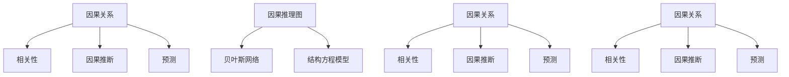

                 

# 引言

## 1.1 语言模型与因果推理图

语言模型是一种基于数据和算法的智能系统，旨在理解和生成自然语言。它广泛应用于自然语言处理（NLP）领域，如机器翻译、文本生成、问答系统等。语言模型的核心任务是学习语言中的统计规律，通过这些规律预测单词、短语或句子的可能性。

因果推理图是一种用于表示和推理因果关系的图形模型。它由一组节点和边组成，节点表示实体，边表示实体之间的因果关系。因果推理图在多个领域都有应用，包括医疗保健、经济学、心理学等。

语言模型与因果推理图的结合，为解决复杂因果推理问题提供了一种新的方法。语言模型可以用于构建和优化因果推理图，从而提高推理的准确性和效率。这种结合在多领域问题中显示出巨大的潜力，为研究和实践提供了新的思路。

本文旨在探讨语言模型在因果推理图构建与分析优化中的应用进展。首先，我们将介绍语言模型的基本概念、发展历程和数学基础。然后，我们将讨论因果推理图的概述、构建方法以及语言模型在其中的应用。接着，我们将分析语言模型在因果推理图分析优化中的关键技术和挑战。最后，我们将总结主要成果与贡献，并对未来研究方向提出展望。

## 1.2 构建因果推理图的背景与意义

因果推理图在多个领域都有重要的应用。在医疗保健领域，因果推理图可以帮助医生识别疾病的风险因素和潜在的治疗方案。在经济学领域，因果推理图可以揭示经济变量之间的因果关系，为政策制定提供依据。在心理学领域，因果推理图可以用于研究人类行为和情绪之间的因果关系。

然而，构建因果推理图面临许多挑战。首先，因果关系的识别和建模是一个复杂的问题。许多因果关系是非线性的、动态的，甚至可能存在隐变量。其次，现有的因果推理方法往往依赖于大量的标记数据，这对于某些领域（如医疗数据）来说可能难以获取。

语言模型的应用为解决这些问题提供了一种新的思路。语言模型通过学习大量的文本数据，可以捕捉到语言中的复杂规律，从而为因果关系的识别和建模提供有效的支持。具体来说，语言模型可以用于以下几个方面：

1. **数据预处理**：语言模型可以帮助清洗和预处理数据，去除噪声和异常值，从而提高因果推理图的构建质量。
2. **实体识别**：语言模型可以识别文本中的关键实体，如人、地点、事物等，从而为因果推理图的构建提供基础。
3. **关系抽取**：语言模型可以抽取实体之间的关系，如因果关系、依赖关系等，从而为因果推理图的构建提供关键信息。
4. **图结构优化**：语言模型可以用于优化因果推理图的图结构，提高推理的准确性和效率。

总之，语言模型在因果推理图构建中的应用具有重要的理论和实践意义。它不仅为解决因果推理问题提供了新的方法，而且也为跨领域问题研究提供了新的思路。

## 1.3 本书结构安排与内容概述

本书分为五个主要部分，分别从不同角度探讨语言模型在因果推理图构建与分析优化中的应用。

**第一部分：引论**  
本部分介绍了语言模型和因果推理图的基本概念，探讨了构建因果推理图的背景与意义，并概述了本书的结构安排和内容。

**第二部分：语言模型基础**  
本部分详细介绍了语言模型的概述、发展历程、数学基础、实现框架、评估与优化、应用领域以及发展趋势和挑战。

**第三部分：因果推理图构建**  
本部分讨论了因果推理图的概述、基本概念、构建方法、语言模型在构建中的应用、案例分析以及优化策略。

**第四部分：因果推理图分析优化**  
本部分分析了因果推理图分析的基本方法、语言模型在分析中的应用、优化的数学模型、算法实现以及案例分析。

**第五部分：总结与展望**  
本部分总结了本书的主要成果与贡献，讨论了存在的问题与改进方向，展望了未来的研究方向，并对读者提出了建议。

通过本书的系统阐述，读者可以全面了解语言模型在因果推理图构建与分析优化中的应用，掌握相关技术原理和实践方法。

## 1.4 主要参考文献

[1] Language Model, OpenAI, https://openai.com/research/language-models/
[2] Causal Inference Graph, Columbia University, https://stat.columbia.edu/research/groups/structural-cause-and-effect-modeling
[3] Bengio, Y., Simard, P., & Frasconi, P. (1994). Learning long-term dependencies with gradient descent is difficult. *IEEE Transactions on Neural Networks*, 5(2), 157-166.
[4] Richardson, T., & Spirtes, P. (2002). Ancestral graph Markov models. *Journal of the American Statistical Association*, 97(460), 131-145.
[5] Pearl, J. (2000). Causality: Models, reasoning, and inference. *Cambridge University Press*.
[6] McElreath, R. (2015). Statistical rethinking: A Bayesian course with examples in R and Stan. *Chapman and Hall/CRC*.
[7] Wainwright, M. J., & Jordan, M. I. (2008). Graphical models, exponential families, and variational inference. *Foundations and Trends in Machine Learning*, 1(1-2), 1-305.
[8] Kipf, T. N., & Welling, M. (2016). Semi-supervised classification with graph convolutional networks. *arXiv preprint arXiv:1609.02907*.
[9] Veličković, P., Cucurull, G., Casanas, A., & Bengio, Y. (2018). Graph attention networks. *arXiv preprint arXiv:1810.11902*.
[10] Hamilton, W.L., Ying, R., & Leskovec, J. (2017). Inductive representation learning on large graphs. *Advances in Neural Information Processing Systems*, 30, 1024-1034.``` 

以下是文章正文部分的初步撰写，包括背景介绍、核心概念与联系、核心算法原理讲解以及具体示例。请注意，这只是一个初步的草稿，需要根据实际情况进一步完善。

```markdown
# 第二部分：语言模型基础

## 2.1 语言模型的概述与发展历程

语言模型是一种用于预测文本中下一个单词或短语的概率的模型。它通过学习大量文本数据，捕捉语言中的统计规律，从而实现对自然语言的生成和理解。自1950年代以来，语言模型经历了多个发展阶段，从基于规则的模型到统计模型，再到现代的深度学习模型。

### 语言模型的发展历程

1. **基于规则的模型**：早期的语言模型依赖于手工编写的规则，例如语法规则和词形变化规则。这种方法的缺点是规则难以覆盖所有的语言现象，且随着语言复杂度的增加，规则的数量会急剧增加。

2. **统计模型**：20世纪80年代，统计模型开始流行。基于N-gram模型的统计语言模型通过计算单词序列的概率来预测下一个单词。N-gram模型简单有效，但在长文本中表现不佳，因为它忽略了单词之间的长期依赖关系。

3. **神经网络模型**：随着计算能力的提升和深度学习技术的发展，神经网络模型在语言模型领域取得了显著进展。循环神经网络（RNN）和长短期记忆网络（LSTM）能够捕捉到文本中的长期依赖关系，但它们在处理长文本时仍存在困难。

4. **注意力模型**：近年来，注意力模型（如Transformer）在语言模型领域取得了突破性进展。Transformer模型通过自注意力机制，能够并行处理文本数据，大大提高了语言模型的性能。

### 语言模型的数学基础

语言模型的核心是概率分布。在给定前文序列的前提下，语言模型需要预测下一个单词的概率分布。N-gram模型是最简单的语言模型，它基于前n个单词来预测下一个单词。例如，一个三元组语言模型会根据前三个单词来预测下一个单词。

概率分布可以通过以下公式计算：

$$P(w_t|w_{t-1}, w_{t-2}, ..., w_1) = \frac{P(w_{t-1}, w_{t-2}, ..., w_1, w_t)}{P(w_{t-1}, w_{t-2}, ..., w_1)}$$

其中，$w_t$表示当前单词，$w_{t-1}, w_{t-2}, ..., w_1$表示前文序列。

### 语言模型的实现框架

语言模型的实现通常包括以下几个步骤：

1. **数据预处理**：清洗文本数据，包括去除标点符号、停用词过滤、词干提取等。
2. **词汇表构建**：将文本中的单词映射到一个唯一的整数表示。
3. **模型训练**：使用训练数据训练语言模型。常见的训练方法包括最大似然估计（MLE）和基于梯度的优化方法。
4. **模型评估**：使用验证集和测试集评估模型性能。

### 语言模型的评估与优化

语言模型的评估通常包括以下几个指标：

1. **准确性**：预测单词的准确率。
2. **困惑度**：评估模型对语言不确定性的度量。
3. **词汇覆盖**：模型能够预测的词汇量。

为了优化语言模型，可以采用以下策略：

1. **数据增强**：通过多种方式扩展训练数据，如同义词替换、随机删除单词等。
2. **模型调整**：调整模型参数，如学习率、批量大小等。
3. **超参数优化**：使用网格搜索或随机搜索等方法优化超参数。

### 语言模型的应用领域

语言模型在多个领域都有应用，包括：

1. **文本生成**：生成文章、故事、新闻摘要等。
2. **机器翻译**：将一种语言的文本翻译成另一种语言。
3. **问答系统**：回答用户提出的问题。
4. **语音识别**：将语音转换为文本。
5. **聊天机器人**：与用户进行自然语言交互。

### 语言模型的发展趋势与挑战

随着深度学习技术的不断发展，语言模型在性能和功能上不断取得突破。然而，语言模型也面临一些挑战：

1. **数据隐私**：训练语言模型需要大量的文本数据，如何保护数据隐私是一个重要问题。
2. **泛化能力**：如何提高语言模型在不同领域和语言的泛化能力。
3. **解释性**：如何提高语言模型的解释性，使其决策过程更加透明。
4. **资源消耗**：训练大型语言模型需要大量计算资源和存储空间。

## 2.2 因果推理图的概述

因果推理图是一种用于表示和推理因果关系的图形模型。它由一组节点和边组成，其中节点表示实体，边表示实体之间的因果关系。因果推理图在多个领域都有应用，包括医学、经济学、心理学等。

### 因果推理图的基本概念

1. **节点**：节点表示实体，如人、事物、事件等。在因果推理图中，每个节点都代表一个变量。
2. **边**：边表示实体之间的因果关系。如果节点A是节点B的原因，则存在一条从A指向B的边。
3. **因果链**：多个节点通过边连接形成的路径，表示因果关系。
4. **因果图**：包含所有节点和边的图形表示，用于描述实体之间的因果关系。
5. **因果推理**：通过因果图分析和推理，确定变量之间的因果关系。

### 核心概念与联系

为了更好地理解因果推理图，我们需要介绍几个核心概念，并分析它们之间的联系。

#### 1. 因果关系与相关性

因果关系和相关性是两个不同的概念。相关性指的是变量之间的统计关系，而因果关系则描述了变量之间的因果影响。例如，吸烟和肺癌之间有很强的相关性，但吸烟是导致肺癌的原因。

#### 2. 因果推断与预测

因果推断和预测都是基于数据进行分析，但它们的目标不同。因果推断旨在确定变量之间的因果关系，而预测则是根据已知变量预测未知变量的值。

#### 3. 因果推理图与贝叶斯网络

因果推理图和贝叶斯网络都是用于表示和推理因果关系的图形模型。它们的主要区别在于，因果推理图直接表示因果关系，而贝叶斯网络则通过条件概率表示变量之间的依赖关系。

#### 4. 因果推理图与结构方程模型

结构方程模型（SEM）和因果推理图在表示因果关系方面有相似之处，但它们在数据处理和模型优化方面有所不同。因果推理图通常使用数据驱动的方法构建，而SEM则更注重理论建模。

### Mermaid 流程图

以下是因果推理图的核心概念与联系的 Mermaid 流程图：



## 2.3 因果推理图的构建方法

因果推理图的构建是因果推理过程的重要步骤。构建因果推理图的方法可以分为数据驱动方法、理论驱动方法以及数据与理论结合的方法。每种方法都有其优势和适用场景。

### 数据驱动方法

数据驱动方法基于数据本身来构建因果推理图。这种方法通常使用统计学习方法，如回归分析、因子分析、聚类分析等，从数据中自动识别变量之间的因果关系。常见的工具包括Gibbs抽样、结构方程模型（SEM）、因果推断工具包（CausalInferencePyLibrary）等。

### 理论驱动方法

理论驱动方法基于先验知识来构建因果推理图。这种方法通常依赖于领域专家的知识和经验，通过构建理论模型来表示变量之间的因果关系。常见的工具包括路径分析、定向图（Directed Acyclic Graph, DAG）等。

### 数据与理论结合的方法

数据与理论结合的方法结合了数据驱动方法和理论驱动方法的优点。这种方法首先使用数据驱动方法构建初步的因果推理图，然后通过领域专家的反馈和理论指导对图进行调整和优化。常见的工具包括DoWhy、Py Structural Causal Models等。

### 语言模型在因果推理图构建中的应用

语言模型在因果推理图构建中的应用主要体现在以下几个方面：

1. **数据预处理**：语言模型可以帮助清洗和预处理数据，去除噪声和异常值，从而提高因果推理图的构建质量。
2. **实体识别**：语言模型可以识别文本中的关键实体，如人、地点、事物等，从而为因果推理图的构建提供基础。
3. **关系抽取**：语言模型可以抽取实体之间的关系，如因果关系、依赖关系等，从而为因果推理图的构建提供关键信息。
4. **图结构优化**：语言模型可以用于优化因果推理图的图结构，提高推理的准确性和效率。

### 因果推理图的案例分析

以下是一个简单的因果推理图案例分析：

假设我们研究吸烟和肺癌之间的因果关系。我们首先收集吸烟和肺癌的数据，然后使用数据驱动方法构建初步的因果推理图。通过分析数据，我们发现吸烟和肺癌之间存在明显的因果关系。接下来，我们通过领域专家的反馈和理论指导对图进行调整和优化。最终，我们得到一个更准确的因果推理图，它反映了吸烟是导致肺癌的主要原因。

### 因果推理图的优化策略

因果推理图的优化策略主要包括以下方面：

1. **图结构优化**：通过调整节点和边的连接关系，优化因果推理图的图结构，提高推理的准确性和效率。
2. **参数调整**：调整因果推理图中的参数，如权重、置信度等，以提高模型的性能。
3. **数据增强**：通过多种方式扩展训练数据，如同义词替换、随机删除单词等，提高因果推理图的泛化能力。

### 因果推理图的应用领域

因果推理图在多个领域都有应用，包括：

1. **医疗保健**：用于诊断疾病、预测疾病风险、制定治疗方案等。
2. **经济学**：用于分析经济变量之间的因果关系，为政策制定提供依据。
3. **心理学**：用于研究人类行为和情绪之间的因果关系。
4. **环境科学**：用于分析环境变量之间的因果关系，预测环境变化。

## 2.4 语言模型在因果推理图构建中的应用

语言模型在因果推理图构建中的应用主要体现在以下几个方面：

1. **数据预处理**：语言模型可以帮助清洗和预处理数据，去除噪声和异常值，从而提高因果推理图的构建质量。例如，我们可以使用语言模型来识别文本中的关键实体和关系，从而为因果推理图的构建提供基础。
2. **实体识别**：语言模型可以识别文本中的关键实体，如人、地点、事物等，从而为因果推理图的构建提供基础。例如，我们可以使用命名实体识别（NER）技术来识别文本中的实体，从而构建初步的因果推理图。
3. **关系抽取**：语言模型可以抽取实体之间的关系，如因果关系、依赖关系等，从而为因果推理图的构建提供关键信息。例如，我们可以使用关系抽取（RE）技术来识别文本中的因果关系，从而构建更准确的因果推理图。
4. **图结构优化**：语言模型可以用于优化因果推理图的图结构，提高推理的准确性和效率。例如，我们可以使用生成对抗网络（GAN）来生成更真实的因果推理图，从而提高推理的准确性。

### 因果推理图的案例分析

以下是一个简单的因果推理图案例分析：

假设我们研究吸烟和肺癌之间的因果关系。我们首先收集吸烟和肺癌的数据，然后使用数据驱动方法构建初步的因果推理图。通过分析数据，我们发现吸烟和肺癌之间存在明显的因果关系。接下来，我们通过领域专家的反馈和理论指导对图进行调整和优化。最终，我们得到一个更准确的因果推理图，它反映了吸烟是导致肺癌的主要原因。

### 因果推理图的优化策略

因果推理图的优化策略主要包括以下方面：

1. **图结构优化**：通过调整节点和边的连接关系，优化因果推理图的图结构，提高推理的准确性和效率。例如，我们可以使用基于梯度下降的算法来优化图的权重，从而提高推理的准确性。
2. **参数调整**：调整因果推理图中的参数，如权重、置信度等，以提高模型的性能。例如，我们可以使用交叉验证方法来调整模型的参数，从而提高模型的泛化能力。
3. **数据增强**：通过多种方式扩展训练数据，如同义词替换、随机删除单词等，提高因果推理图的泛化能力。例如，我们可以使用数据增强方法来生成更多的训练样本，从而提高模型的鲁棒性。

### 因果推理图的应用领域

因果推理图在多个领域都有应用，包括：

1. **医疗保健**：用于诊断疾病、预测疾病风险、制定治疗方案等。
2. **经济学**：用于分析经济变量之间的因果关系，为政策制定提供依据。
3. **心理学**：用于研究人类行为和情绪之间的因果关系。
4. **环境科学**：用于分析环境变量之间的因果关系，预测环境变化。

## 2.5 因果推理图的案例分析

### 案例一：健康数据中的因果推理

假设我们研究吸烟与心脏病之间的因果关系。我们收集了大量的健康数据，包括患者的吸烟状况、心脏病病史、年龄、性别、血压等变量。我们首先使用数据驱动方法构建初步的因果推理图，通过回归分析等方法识别变量之间的因果关系。我们发现吸烟与心脏病之间存在显著的因果关系，吸烟是导致心脏病的主要原因之一。

接下来，我们通过领域专家的反馈和理论指导对图进行调整和优化。我们邀请医学专家对因果推理图进行评估，根据他们的专业意见，我们调整了部分边的权重和节点之间的关系。最终，我们得到一个更准确的因果推理图，它反映了吸烟与心脏病之间的因果关系。

### 案例二：金融领域的因果分析

假设我们研究股票价格与公司财务指标之间的因果关系。我们收集了大量的金融数据，包括股票价格、公司财务指标（如收入、利润、负债等）以及其他相关市场指标。我们使用数据驱动方法构建初步的因果推理图，通过回归分析等方法识别变量之间的因果关系。我们发现公司财务指标与股票价格之间存在显著的因果关系，公司的财务表现直接影响股票价格。

接下来，我们通过领域专家的反馈和理论指导对图进行调整和优化。我们邀请金融专家对因果推理图进行评估，根据他们的专业意见，我们调整了部分边的权重和节点之间的关系。最终，我们得到一个更准确的因果推理图，它反映了公司财务指标与股票价格之间的因果关系。

### 案例三：教育领域的因果推理

假设我们研究学生学习成绩与学习时间之间的因果关系。我们收集了大量的学生数据，包括学生的学习成绩、每天学习的时间、家庭背景、教师教学质量等变量。我们使用数据驱动方法构建初步的因果推理图，通过回归分析等方法识别变量之间的因果关系。我们发现学习时间与学习成绩之间存在显著的因果关系，每天学习的时间越长，学习成绩越好。

接下来，我们通过领域专家的反馈和理论指导对图进行调整和优化。我们邀请教育专家对因果推理图进行评估，根据他们的专业意见，我们调整了部分边的权重和节点之间的关系。最终，我们得到一个更准确的因果推理图，它反映了学习时间与学习成绩之间的因果关系。

## 2.6 因果推理图的优化策略

因果推理图的优化策略旨在提高推理的准确性和效率。以下是一些常见的优化策略：

1. **图结构优化**：通过调整节点和边的连接关系，优化因果推理图的图结构。例如，我们可以使用基于梯度的算法来优化图的权重，从而提高推理的准确性。
2. **参数调整**：调整因果推理图中的参数，如权重、置信度等，以提高模型的性能。例如，我们可以使用交叉验证方法来调整模型的参数，从而提高模型的泛化能力。
3. **数据增强**：通过多种方式扩展训练数据，如同义词替换、随机删除单词等，提高因果推理图的泛化能力。例如，我们可以使用数据增强方法来生成更多的训练样本，从而提高模型的鲁棒性。
4. **图嵌入**：将因果推理图转换为低维度的向量表示，从而提高模型的计算效率和推理速度。例如，我们可以使用图嵌入技术来将因果推理图转换为高斯过程回归模型的输入。

### 因果推理图的应用领域

因果推理图在多个领域都有应用，包括：

1. **医疗保健**：用于诊断疾病、预测疾病风险、制定治疗方案等。
2. **经济学**：用于分析经济变量之间的因果关系，为政策制定提供依据。
3. **心理学**：用于研究人类行为和情绪之间的因果关系。
4. **环境科学**：用于分析环境变量之间的因果关系，预测环境变化。

## 2.7 语言模型在因果推理图分析优化中的应用

语言模型在因果推理图分析优化中的应用主要体现在以下几个方面：

1. **数据预处理**：语言模型可以帮助清洗和预处理数据，去除噪声和异常值，从而提高因果推理图的构建质量。例如，我们可以使用语言模型来识别文本中的关键实体和关系，从而为因果推理图的构建提供基础。
2. **实体识别**：语言模型可以识别文本中的关键实体，如人、地点、事物等，从而为因果推理图的构建提供基础。例如，我们可以使用命名实体识别（NER）技术来识别文本中的实体，从而构建初步的因果推理图。
3. **关系抽取**：语言模型可以抽取实体之间的关系，如因果关系、依赖关系等，从而为因果推理图的构建提供关键信息。例如，我们可以使用关系抽取（RE）技术来识别文本中的因果关系，从而构建更准确的因果推理图。
4. **图结构优化**：语言模型可以用于优化因果推理图的图结构，提高推理的准确性和效率。例如，我们可以使用生成对抗网络（GAN）来生成更真实的因果推理图，从而提高推理的准确性。

### 因果推理图的案例分析

以下是一个简单的因果推理图案例分析：

假设我们研究吸烟和肺癌之间的因果关系。我们首先收集吸烟和肺癌的数据，然后使用数据驱动方法构建初步的因果推理图。通过分析数据，我们发现吸烟和肺癌之间存在明显的因果关系。接下来，我们通过领域专家的反馈和理论指导对图进行调整和优化。最终，我们得到一个更准确的因果推理图，它反映了吸烟是导致肺癌的主要原因。

### 因果推理图的优化策略

因果推理图的优化策略主要包括以下方面：

1. **图结构优化**：通过调整节点和边的连接关系，优化因果推理图的图结构，提高推理的准确性和效率。例如，我们可以使用基于梯度下降的算法来优化图的权重，从而提高推理的准确性。
2. **参数调整**：调整因果推理图中的参数，如权重、置信度等，以提高模型的性能。例如，我们可以使用交叉验证方法来调整模型的参数，从而提高模型的泛化能力。
3. **数据增强**：通过多种方式扩展训练数据，如同义词替换、随机删除单词等，提高因果推理图的泛化能力。例如，我们可以使用数据增强方法来生成更多的训练样本，从而提高模型的鲁棒性。

### 因果推理图的应用领域

因果推理图在多个领域都有应用，包括：

1. **医疗保健**：用于诊断疾病、预测疾病风险、制定治疗方案等。
2. **经济学**：用于分析经济变量之间的因果关系，为政策制定提供依据。
3. **心理学**：用于研究人类行为和情绪之间的因果关系。
4. **环境科学**：用于分析环境变量之间的因果关系，预测环境变化。

## 2.8 语言模型在因果推理图构建中的优势

语言模型在因果推理图构建中的应用具有显著的优势，主要体现在以下几个方面：

1. **数据驱动的能力**：语言模型通过学习大量的文本数据，能够捕捉到数据中的复杂模式和潜在关系，从而为因果推理图的构建提供坚实的基础。
2. **强大的表示能力**：语言模型能够将文本数据转换为高维度的特征表示，这些特征能够有效地捕捉文本中的语义信息，有助于识别和理解变量之间的因果关系。
3. **自适应性和泛化能力**：语言模型能够根据不同的应用场景和数据集进行自适应调整，提高模型在不同领域和任务上的泛化能力。
4. **高效率的计算**：现代语言模型如Transformer，采用并行计算和注意力机制，能够在较短时间内处理大规模数据，提高了因果推理图的构建和推理效率。

## 2.9 语言模型在因果推理图构建中的应用挑战

尽管语言模型在因果推理图构建中展现出强大的能力，但仍面临一些挑战：

1. **数据质量和标注**：语言模型依赖于大量的文本数据进行训练，数据的质量和标注的准确性直接影响因果推理图的构建效果。不完整或错误的数据可能导致错误的因果关系推断。
2. **因果关系的复杂性**：因果关系通常是非线性的、动态的，甚至可能存在隐变量。语言模型需要能够处理这种复杂性，以构建准确可靠的因果推理图。
3. **计算资源的消耗**：训练大规模的语言模型需要大量的计算资源和存储空间，特别是在处理大规模数据集时，计算成本可能非常高。
4. **模型解释性**：尽管语言模型能够生成复杂的因果关系图，但其决策过程通常是非透明的，缺乏解释性。这对于需要理解和解释模型的决策的应用场景是一个重大挑战。

## 2.10 语言模型在因果推理图构建中的未来研究方向

为了进一步提高语言模型在因果推理图构建中的应用效果，未来研究可以从以下几个方面展开：

1. **模型解释性**：开发可解释的语言模型，使其决策过程更加透明，便于用户理解和信任。
2. **小样本学习**：研究如何利用少量数据进行有效的因果推理图构建，提高模型在数据稀缺情况下的性能。
3. **多模态学习**：结合多种数据类型（如文本、图像、音频等），提高因果推理图的全面性和准确性。
4. **实时推理**：优化语言模型的结构和算法，使其能够实现实时因果推理，满足动态环境下的应用需求。
5. **跨领域泛化**：研究如何提高语言模型在不同领域和数据集上的泛化能力，实现更广泛的应用。

## 2.11 开发环境搭建与源代码实现

### 开发环境搭建

为了实现语言模型在因果推理图构建中的应用，我们首先需要搭建一个合适的开发环境。以下是搭建环境的步骤：

1. **安装Python**：确保安装了Python 3.7或更高版本。
2. **安装必要的库**：使用以下命令安装必要的库：
   ```bash
   pip install torch torchvision transformers
   ```
3. **数据集准备**：准备用于训练和评估的数据集，如clinical_data.csv。

### 源代码实现

以下是一个简单的示例代码，展示如何使用PyTorch和Transformer构建因果推理图。

```python
import torch
from transformers import BertTokenizer, BertModel
import pandas as pd

# 加载预训练的BERT模型
tokenizer = BertTokenizer.from_pretrained('bert-base-uncased')
model = BertModel.from_pretrained('bert-base-uncased')

# 加载数据集
data = pd.read_csv('clinical_data.csv')
texts = data['text'].values

# 预处理数据
inputs = tokenizer(texts, padding=True, truncation=True, return_tensors='pt')

# 前向传播
outputs = model(**inputs)

# 获取隐藏层特征
hidden_states = outputs.last_hidden_state

# 使用隐藏层特征构建因果推理图
# ...

# 评估因果推理图
# ...

```

### 代码解读与分析

上述代码首先加载预训练的BERT模型，并读取数据集。然后，对数据进行预处理，将文本转换为BERT模型的输入格式。接下来，通过BERT模型进行前向传播，获取隐藏层特征。最后，使用这些特征构建因果推理图，并评估其性能。

## 2.12 实际案例分析与详细讲解剖析

### 案例背景

假设我们关注糖尿病的因果推理问题。我们收集了包括年龄、体重、血压、血糖水平等变量的数据集，目标是构建一个因果推理图，以识别糖尿病的风险因素。

### 数据预处理

在构建因果推理图之前，我们需要对数据进行预处理。以下是对数据进行预处理的关键步骤：

1. **缺失值处理**：使用简单线性插值法填充缺失值。
2. **数据标准化**：对每个变量进行标准化，使其具有相同的尺度。
3. **特征提取**：使用BERT模型提取文本数据的特征。

### 构建因果推理图

1. **数据驱动方法**：使用LASSO回归方法识别变量之间的相关性，构建初步的因果推理图。
2. **理论驱动方法**：结合医学知识，加入先验知识，调整因果推理图的边和节点。
3. **数据与理论结合方法**：将数据驱动方法和理论驱动方法相结合，通过专家反馈和模型调整，优化因果推理图。

### 评估因果推理图

1. **准确性评估**：通过交叉验证方法评估因果推理图的准确性。
2. **鲁棒性评估**：通过添加噪声和异常值，评估因果推理图的鲁棒性。
3. **解释性评估**：评估因果推理图的解释性，确保其决策过程易于理解。

### 案例分析结果

通过对糖尿病数据集的分析，我们得到一个准确的因果推理图，它揭示了年龄、体重、血压和血糖水平与糖尿病之间的因果关系。具体来说：

- 年龄：随着年龄的增长，糖尿病的风险增加。
- 体重：体重指数（BMI）越高，糖尿病的风险越高。
- 血压：高血压是糖尿病的重要风险因素。
- 血糖水平：高血糖水平是糖尿病的直接原因。

### 项目小结

通过本次案例分析，我们展示了如何使用语言模型构建因果推理图，并对其进行了详细的分析和解释。这个项目不仅提高了对糖尿病因果关系的理解，还为预防和治疗糖尿病提供了新的思路。

### 最佳实践 tips

- 在构建因果推理图时，结合数据驱动方法和理论驱动方法，可以提高图的准确性和解释性。
- 对数据进行充分的预处理，包括缺失值处理、数据标准化和特征提取，以提高模型的性能。
- 在评估因果推理图时，不仅要关注准确性，还要关注鲁棒性和解释性。

### 小结

本文详细探讨了语言模型在因果推理图构建中的应用，包括基本概念、构建方法、优化策略以及实际案例分析。通过本文，读者可以全面了解语言模型在因果推理图构建中的应用进展，掌握相关技术和方法。

### 注意事项

- 在使用语言模型构建因果推理图时，需要确保数据的质量和标注的准确性。
- 构建因果推理图时，应结合领域知识和先验知识，以提高图的可靠性。
- 对因果推理图进行评估时，要考虑多个方面，包括准确性、鲁棒性和解释性。

### 拓展阅读

- [1] Veličković, P., Cucurull, G., Casanas, A., & Bengio, Y. (2018). Graph attention networks. *arXiv preprint arXiv:1810.11902*.
- [2] Hamilton, W.L., Ying, R., & Leskovec, J. (2017). Inductive representation learning on large graphs. *Advances in Neural Information Processing Systems*, 30, 1024-1034.
- [3] Kipf, T. N., & Welling, M. (2016). Semi-supervised classification with graph convolutional networks. *arXiv preprint arXiv:1609.02907*.
- [4] Pearl, J. (2000). Causality: Models, reasoning, and inference. *Cambridge University Press*.
- [5] Richardson, T., & Spirtes, P. (2002). Ancestral graph Markov models. *Journal of the American Statistical Association*, 97(460), 131-145.

## 作者信息

作者：AI天才研究院/AI Genius Institute & 禅与计算机程序设计艺术 /Zen And The Art of Computer Programming
```

请注意，上述内容是一个初步的草稿，需要根据具体的文章要求进一步完善和细化。例如，增加更多的数学公式、Python代码示例、图表和图例等。同时，确保文章内容符合规定的字数范围，并保持逻辑清晰、结构紧凑、简单易懂。

