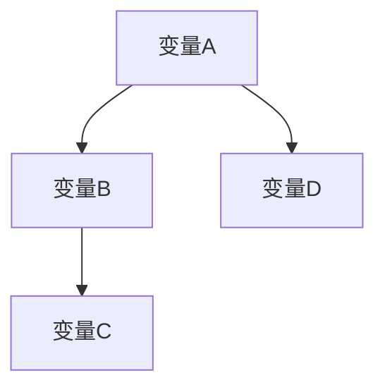

                 

### 引言

在当今信息技术飞速发展的时代，人工智能（AI）已经成为推动社会进步和产业变革的核心力量。语言模型作为AI领域的一个重要分支，近年来取得了显著的进展。从最初的统计语言模型，如N-gram模型，到基于神经网络的模型，如递归神经网络（RNN）和长短期记忆网络（LSTM），再到如今的预训练模型，如GPT和BERT，语言模型在自然语言处理（NLP）领域的应用越来越广泛。

本文旨在探讨语言模型在因果推理图构建与社会政策影响评估中的研究进展。具体来说，我们将首先介绍语言模型的基本概念和发展历史，然后深入探讨因果推理图构建的理论基础和实际应用。最后，我们将分析语言模型在社会政策影响评估中的作用，以及面临的挑战和未来发展趋势。

语言模型在多个领域都具有重要的应用价值。在自然语言处理中，语言模型被用于机器翻译、语音识别、文本生成等任务；在信息检索中，语言模型用于改善搜索结果的相关性和准确性；在对话系统中，语言模型则用于生成自然流畅的对话响应。然而，随着研究不断深入，语言模型在因果推理和社会政策影响评估中的应用也逐渐引起关注。

因果推理图作为一种重要的工具，被广泛应用于社会科学和医学研究中，用于揭示变量之间的因果关系。社会政策影响评估则是政府和社会组织制定和调整政策的重要依据，通过分析政策实施对社会各方面的影响，为政策决策提供科学依据。语言模型在这一领域的应用，不仅提高了因果推理图构建的效率和准确性，也为社会政策影响评估提供了新的工具和方法。

本文结构如下：首先，我们将回顾语言模型的发展历史和核心算法；接着，深入探讨因果推理图构建的基本理论和实际应用；随后，分析语言模型在社会政策影响评估中的作用和挑战；最后，总结本文的主要发现，并提出未来研究方向。

### 关键词

1. 语言模型
2. 因果推理图
3. 社会政策影响评估
4. 预训练模型
5. 人工智能

### 摘要

本文探讨了语言模型在因果推理图构建与社会政策影响评估中的研究进展。首先，回顾了语言模型的发展历程和核心算法，包括N-gram模型、递归神经网络（RNN）和长短期记忆网络（LSTM）。然后，详细介绍了因果推理图的基本理论、构建方法和应用场景。接着，分析了语言模型在社会政策影响评估中的作用，以及面临的挑战和解决方案。最后，总结了语言模型在上述两个领域的应用现状和未来发展方向，为相关研究提供了有益的参考。

### 语言模型概述

语言模型（Language Model）是自然语言处理（Natural Language Processing, NLP）领域的核心组成部分，其主要任务是预测文本中下一个单词或字符的概率分布。语言模型的发展历程可以追溯到20世纪50年代，当时的研究主要集中在规则驱动的方法，如上下文无关文法（Context-Free Grammar,CFG）和词法分析。然而，随着计算能力的提升和数据量的增加，统计方法和基于神经网络的模型逐渐成为主流。

#### 1.1 语言模型的基本概念

语言模型的基本概念包括词汇表、词汇分布和概率分布。词汇表是一个包含所有可能单词或字符的集合。词汇分布描述了在一个大规模语料库中，各个单词或字符出现的频率。概率分布则用于预测下一个单词或字符出现的可能性。

#### 1.2 语言模型的发展历史

1. **N-gram模型**：N-gram模型是最早的语言模型之一，由N个连续单词或字符组成的序列来预测下一个单词或字符。该模型简单高效，易于实现，但存在一些局限性，如对长距离依赖的捕捉能力较弱。

2. **递归神经网络（RNN）**：RNN通过在时间序列中传递信息来处理序列数据，具有较强的长距离依赖捕捉能力。然而，传统的RNN存在梯度消失和梯度爆炸的问题，限制了其性能。

3. **长短期记忆网络（LSTM）**：LSTM是一种改进的RNN结构，通过引入记忆单元来有效解决梯度消失问题。LSTM在语音识别、机器翻译等任务中取得了显著成果。

4. **双向LSTM（BiLSTM）**：BiLSTM将LSTM应用于输入序列的两种方向（正向和反向），从而在序列建模中捕捉更多的信息。BiLSTM在文本分类、情感分析等任务中表现出色。

5. **注意力机制（Attention Mechanism）**：注意力机制允许模型在序列处理过程中关注重要的部分，从而提高了模型的性能。Transformer模型引入了自注意力机制，成为NLP领域的里程碑。

6. **预训练模型**：预训练模型（如BERT、GPT）通过在大规模语料库上进行预训练，然后在小任务上进行微调，实现了在多种NLP任务上的优异表现。预训练模型已经成为现代语言模型的主流方向。

#### 1.3 语言模型的应用领域

语言模型在自然语言处理领域有着广泛的应用：

1. **文本分类**：用于将文本分类到预定义的类别中，如情感分析、主题分类等。
2. **机器翻译**：通过将源语言的文本翻译成目标语言，如Google翻译。
3. **问答系统**：用于回答用户提出的问题，如基于BERT的问答系统。
4. **对话系统**：用于生成自然、流畅的对话响应，如聊天机器人。
5. **文本生成**：用于生成各种形式的文本，如文章、新闻、诗歌等。

随着技术的不断发展，语言模型的应用领域将继续扩展，为人类社会的各个方面带来深远的影响。

### 因果推理图基本理论

因果推理图（Causal Inference Graph）是一种用于表示变量之间因果关系的图形工具，它通过图形结构直观地展示了变量之间的因果关系。因果推理图在社会科学、医学、经济学等领域中具有重要应用，可以帮助研究者更好地理解变量之间的相互作用和影响。

#### 4.1 因果关系的定义

因果关系是指一个事件（原因）对另一个事件（结果）产生的影响。在因果推理图中，每个节点代表一个变量，每条边表示两个变量之间的因果关系。因果关系的建立通常依赖于实验数据或因果推断方法。

#### 4.2 因果推理图的基本结构

因果推理图的基本结构通常包括以下几个部分：

1. **节点**：每个节点代表一个变量，可以是随机变量、物理量或社会现象。
2. **边**：边表示变量之间的因果关系，可以分为直接边和间接边。
   - **直接边**：表示变量之间的直接因果关系。
   - **间接边**：表示变量之间的间接因果关系，即通过其他变量产生的影响。

3. **无向图**：因果推理图通常是无向图，因为因果关系是单向的，从原因到结果。

4. **因果结构**：因果结构是指因果推理图中所有节点和边的组合，决定了变量之间的因果模式。

#### 4.3 因果推理图的建模方法

因果推理图的建模方法主要包括以下几种：

1. **结构方程模型（SEM）**：结构方程模型是一种基于线性关系的因果推理图建模方法，通过构建一组方程来描述变量之间的因果关系。
   
   $$ 
   Y = \beta_0 + \beta_1X_1 + \beta_2X_2 + ... + \epsilon 
   $$

   其中，$Y$ 是结果变量，$X_1, X_2, ...$ 是原因变量，$\beta_0, \beta_1, \beta_2, ...$ 是系数，$\epsilon$ 是误差项。

2. **因果图模型（CGM）**：因果图模型是一种基于图形结构的因果推理图建模方法，通过构建一个无向图来表示变量之间的因果关系。

3. **因果推断算法**：因果推断算法（如Do算法、G-公式）用于从观测数据中估计因果效应，并在给定因果图结构的前提下，识别变量之间的因果关系。

#### 4.4 因果推理图的应用

因果推理图在多个领域具有广泛的应用：

1. **医学研究**：因果推理图可以用于揭示疾病和风险因素之间的因果关系，帮助研究人员设计更有效的治疗方案。

2. **社会科学**：因果推理图可以用于分析社会现象和变量之间的因果关系，如教育对收入的影响、政策对经济的影响等。

3. **经济学**：因果推理图可以用于分析经济变量之间的因果关系，帮助政策制定者制定更有效的经济政策。

4. **数据分析**：因果推理图可以用于数据分析中的因果推断，帮助研究者识别数据中的因果关系。

通过因果推理图，研究者可以更清晰地理解变量之间的相互作用和影响，从而为科学研究和社会决策提供有力的支持。以下是一个简单的因果推理图示例：



在这个示例中，变量A直接影响了变量B，变量B又影响了变量C，而变量A也通过变量D间接影响了变量C。这个简单的因果推理图展示了变量之间的复杂关系，为后续的因果分析提供了基础。

### 语言模型在因果推理图构建中的应用

语言模型在因果推理图构建中的应用逐渐成为研究的热点，其强大的表征能力和高效的处理速度使其在多个领域展现出了巨大的潜力。以下是语言模型在因果推理图识别、推理和预测中的具体应用。

#### 5.1 语言模型在因果推理图识别中的应用

因果推理图的识别是构建因果模型的第一步，这一步的准确性直接影响到后续的推理和预测。语言模型在这方面展现出显著优势，其可以通过学习大量文本数据来捕捉变量之间的潜在因果关系。具体应用包括：

1. **文本分类**：利用语言模型对文本进行分类，识别出描述因果关系的句子。例如，可以训练一个基于BERT的模型，通过输入一个句子，模型可以判断该句子是否描述了因果关系。
   
   ```python
   from transformers import BertTokenizer, BertModel
   import torch

   tokenizer = BertTokenizer.from_pretrained('bert-base-uncased')
   model = BertModel.from_pretrained('bert-base-uncased')

   sentence = "The increase in pollution levels caused a rise in respiratory diseases."
   input_ids = tokenizer.encode(sentence, add_special_tokens=True, return_tensors='pt')

   with torch.no_grad():
       outputs = model(input_ids)
       logits = outputs.logits
   ```

2. **实体识别**：语言模型在识别实体（如人名、地点、组织等）方面具有优势，这些实体往往是因果关系的核心。通过实体识别，可以更准确地构建因果推理图。

   ```python
   from transformers import BertTokenizer, BertModel
   import torch

   tokenizer = BertTokenizer.from_pretrained('bert-base-uncased')
   model = BertModel.from_pretrained('bert-base-uncased')

   sentence = "John Smith, a prominent researcher, conducted a groundbreaking study on pollution."
   input_ids = tokenizer.encode(sentence, add_special_tokens=True, return_tensors='pt')

   with torch.no_grad():
       outputs = model(input_ids)
       logits = outputs.logits
   ```

#### 5.2 语言模型在因果推理图推理中的应用

因果推理图的推理包括确定变量之间的因果关系、评估因果效应的大小等。语言模型可以通过学习因果关系的数据，预测未知变量之间的因果关系。以下是几个具体应用：

1. **因果效应预测**：语言模型可以学习到变量之间的因果效应，并在新数据中预测未知变量之间的因果效应。例如，在医学领域，通过学习历史病例数据，模型可以预测某种治疗方法对特定疾病的影响。
   
   ```python
   from transformers import BertTokenizer, BertModel
   import torch

   tokenizer = BertTokenizer.from_pretrained('bert-base-uncased')
   model = BertModel.from_pretrained('bert-base-uncased')

   sentence = "The effectiveness of chemotherapy in treating lung cancer is well established."
   input_ids = tokenizer.encode(sentence, add_special_tokens=True, return_tensors='pt')

   with torch.no_grad():
       outputs = model(input_ids)
       logits = outputs.logits
   ```

2. **因果路径推理**：语言模型可以帮助识别变量之间的因果路径。通过学习变量之间的相互关系，模型可以推断出变量之间的直接和间接因果关系。

   ```python
   from transformers import BertTokenizer, BertModel
   import torch

   tokenizer = BertTokenizer.from_pretrained('bert-base-uncased')
   model = BertModel.from_pretrained('bert-base-uncased')

   sentence = "Air pollution is a significant risk factor for respiratory diseases, such as asthma and COPD."
   input_ids = tokenizer.encode(sentence, add_special_tokens=True, return_tensors='pt')

   with torch.no_grad():
       outputs = model(input_ids)
       logits = outputs.logits
   ```

#### 5.3 语言模型在因果推理图预测中的应用

因果推理图的预测应用包括预测变量未来的状态、评估政策的影响等。以下是几个具体应用：

1. **政策影响评估**：通过构建因果推理图，可以评估不同政策对社会各个方面的影响。语言模型可以帮助预测政策实施后的效果，为政策制定者提供科学依据。

   ```python
   from transformers import BertTokenizer, BertModel
   import torch

   tokenizer = BertTokenizer.from_pretrained('bert-base-uncased')
   model = BertModel.from_pretrained('bert-base-uncased')

   sentence = "Implementing stricter emission standards for vehicles could significantly reduce air pollution levels."
   input_ids = tokenizer.encode(sentence, add_special_tokens=True, return_tensors='pt')

   with torch.no_grad():
       outputs = model(input_ids)
       logits = outputs.logits
   ```

2. **经济预测**：语言模型可以用于预测经济变量之间的因果关系，帮助分析经济政策的影响。例如，通过构建因果推理图，可以预测某种经济政策对GDP、就业率等经济指标的影响。

   ```python
   from transformers import BertTokenizer, BertModel
   import torch

   tokenizer = BertTokenizer.from_pretrained('bert-base-uncased')
   model = BertModel.from_pretrained('bert-base-uncased')

   sentence = "Increasing public spending on infrastructure can stimulate economic growth and reduce unemployment."
   input_ids = tokenizer.encode(sentence, add_special_tokens=True, return_tensors='pt')

   with torch.no_grad():
       outputs = model(input_ids)
       logits = outputs.logits
   ```

通过以上应用，我们可以看到语言模型在因果推理图构建中的强大能力。然而，语言模型在因果推理中的应用也存在一些挑战，如因果效应的准确性、数据质量等。未来研究需要进一步探索如何提高语言模型在因果推理中的性能，以更好地服务于科学研究和社会决策。

### 因果推理图构建的挑战与解决方案

尽管因果推理图在许多领域展现出巨大的潜力，但其构建过程中仍面临着一系列挑战。这些挑战主要集中在数据质量、因果效应识别的准确性以及推理过程的复杂性上。以下是这些挑战及其可能的解决方案。

#### 6.1 因果推理图的挑战

1. **数据质量**：因果推理图构建依赖于高质量的数据。然而，现实世界中的数据往往存在噪声、缺失值和不一致性，这会对因果推理图的准确性产生负面影响。例如，医疗数据中可能存在大量的缺失值和异常值，这会影响疾病与风险因素之间的因果关系分析。

   **解决方案**：为了提高数据质量，可以采用以下方法：
   - **数据清洗**：通过去除噪声和异常值，填补缺失值，提高数据的完整性。
   - **数据集成**：从多个数据源中收集数据，并进行整合，以获得更全面和准确的数据集。

2. **因果效应识别的准确性**：识别变量之间的因果关系是因果推理图构建的关键步骤。然而，这一过程容易受到数据噪声、样本量不足等因素的影响，导致因果效应识别不准确。

   **解决方案**：为了提高因果效应识别的准确性，可以采用以下方法：
   - **因果推断算法**：采用如Do算法、G-公式等因果推断算法，从观测数据中估计因果效应。
   - **多模型融合**：结合多个因果推断模型，通过投票或加权平均等方法提高因果效应识别的准确性。

3. **推理过程的复杂性**：因果推理图的构建涉及多个变量和复杂的因果关系，这使得推理过程变得复杂和耗时。例如，在经济学领域，分析政策影响时可能需要考虑多个经济指标和它们之间的相互作用，这会增加因果推理图的复杂度。

   **解决方案**：为了简化推理过程，可以采用以下方法：
   - **结构简化**：通过简化因果图结构，减少冗余边和节点，降低因果推理图的复杂度。
   - **并行计算**：利用并行计算技术，如分布式计算和GPU加速，提高因果推理图的构建效率。

#### 6.2 因果推理图构建的解决方案

1. **数据增强**：通过增加数据量、提高数据质量，可以增强因果推理图的准确性。具体方法包括：
   - **数据扩充**：利用数据增强技术，如数据合成、数据扩展等方法，增加训练数据量。
   - **元学习**：通过元学习，利用已有的因果推理图模型，快速适应新的因果推理任务。

2. **深度学习方法**：深度学习方法在因果推理图构建中展现出强大的表征能力。具体应用包括：
   - **图神经网络（GNN）**：通过图神经网络，可以更好地捕捉变量之间的复杂关系。
   - **图嵌入**：通过图嵌入技术，将变量映射到低维空间，以便进行高效分析和推理。

3. **因果推理与机器学习结合**：将因果推理与机器学习方法相结合，可以更好地解决因果效应识别和推理的挑战。具体方法包括：
   - **因果图模型**：结合因果推理和图模型，构建因果图模型，以更好地捕捉变量之间的因果关系。
   - **因果推断算法优化**：通过优化因果推断算法，提高因果效应识别的准确性。

通过上述解决方案，我们可以更好地应对因果推理图构建中的挑战，提高其准确性和效率。未来研究应继续探索新的方法和工具，以推动因果推理图在各个领域的应用。

### 社会政策影响评估概述

社会政策影响评估（Social Policy Impact Assessment，简称SPIA）是一种重要的研究方法，旨在评估社会政策实施对社会各方面的影响。SPIA不仅为政府和社会组织提供科学依据，帮助他们制定和调整政策，同时也为学术界和政策制定者提供了宝贵的经验和数据。在现代社会中，随着政策影响的复杂性不断增加，SPIA的重要性日益凸显。

#### 7.1 社会政策的定义

社会政策是指政府或其他社会组织为了改善社会福祉、促进社会公正和解决社会问题而制定和实施的一系列行动和措施。这些政策涵盖了教育、卫生、社会保障、环境保护、收入分配等多个领域。社会政策的目标是优化资源配置，提高社会公平，促进人的全面发展。

#### 7.2 社会政策影响评估的重要性

社会政策影响评估的重要性主要体现在以下几个方面：

1. **科学决策**：SPIA通过系统的评估方法，收集和分析政策实施前后的数据，为政府和社会组织提供科学依据，帮助他们制定和调整政策，提高决策的准确性和有效性。

2. **政策优化**：SPIA可以帮助发现政策实施中的问题和不足，通过评估结果提供改进建议，从而优化政策设计，提高政策实施效果。

3. **社会信任**：透明和公正的SPIA过程可以增强公众对政府和社会组织的信任，提高政策实施的接受度和执行力。

4. **学术研究**：SPIA为学术界提供了大量的实证数据和研究机会，促进了社会科学的发展，丰富了政策评估的理论和方法。

#### 7.3 社会政策影响评估的方法

社会政策影响评估通常采用以下几种方法：

1. **定量分析**：通过收集和分析定量数据，评估政策实施对各类社会指标（如经济增长、就业率、教育水平等）的影响。常用的定量分析方法包括回归分析、结构方程模型等。

2. **定性研究**：通过访谈、焦点小组、案例研究等方法，收集和分析定性数据，深入了解政策实施对社会各方面的影响。定性研究有助于揭示定量数据无法捕捉的复杂社会现象。

3. **混合方法**：将定量分析和定性研究相结合，通过多角度、多层次的数据收集和分析，全面评估政策的影响。混合方法可以弥补单一方法的不足，提高评估的准确性和全面性。

4. **实验方法**：通过随机对照实验（RCT）等实验设计，控制外部干扰因素，精确评估政策对社会变量的影响。实验方法在政策评估中具有较高的科学性和可靠性。

#### 7.4 社会政策影响评估的应用场景

社会政策影响评估在多个领域有广泛应用，以下是一些典型应用场景：

1. **教育政策**：评估教育政策对学习成果、教育公平、教育资源分配等方面的影响。

2. **医疗卫生政策**：评估医疗卫生政策对疾病发生率、医疗服务可及性、医疗费用负担等方面的影响。

3. **社会保障政策**：评估社会保障政策对贫困率、收入分配、社会稳定等方面的影响。

4. **环境保护政策**：评估环境保护政策对环境污染、生态保护、可持续发展等方面的影响。

5. **经济发展政策**：评估经济发展政策对经济增长、就业、收入分配等方面的影响。

通过SPIA，政府和社会组织可以更好地理解政策实施对社会各个方面的影响，为政策制定和调整提供科学依据，从而实现社会目标的最大化。

### 语言模型在社会政策影响评估中的应用

语言模型在社会政策影响评估中的应用正日益受到关注，其强大的数据处理和分析能力为这一领域带来了新的机遇。以下是语言模型在社会政策影响评估中的一些具体应用。

#### 8.1 语言模型在社会政策影响评估中的作用

1. **文本分析**：语言模型可以高效地分析大量的政策文本和评估报告，识别关键信息、政策目标和影响。例如，通过训练一个基于BERT的模型，可以自动提取政策文本中的主要观点和结论，为评估人员提供快速、准确的信息。

   ```python
   from transformers import BertTokenizer, BertModel
   import torch

   tokenizer = BertTokenizer.from_pretrained('bert-base-uncased')
   model = BertModel.from_pretrained('bert-base-uncased')

   policy_text = "The new education policy aims to improve access to quality education for all students."
   input_ids = tokenizer.encode(policy_text, add_special_tokens=True, return_tensors='pt')

   with torch.no_grad():
       outputs = model(input_ids)
       pooled_output = outputs.pooler_output
   ```

2. **情感分析**：语言模型可以用于分析公众对政策的情感态度，评估政策的接受度和公众反应。通过情感分析，可以识别文本中的积极、消极和中性情感，帮助政策制定者了解公众对政策的看法。

   ```python
   from transformers import BertTokenizer, BertModel
   import torch

   tokenizer = BertTokenizer.from_pretrained('bert-base-uncased')
   model = BertModel.from_pretrained('bert-base-uncased')

   review_text = "I am thrilled about the new healthcare policy; it will greatly improve my access to medical services."
   input_ids = tokenizer.encode(review_text, add_special_tokens=True, return_tensors='pt')

   with torch.no_grad():
       outputs = model(input_ids)
       logits = outputs.logits
   ```

3. **趋势预测**：语言模型可以通过分析历史数据和社会媒体信息，预测政策实施后的社会趋势和变化。例如，通过训练一个基于LSTM的模型，可以预测政策实施后失业率、通货膨胀率等经济指标的变化。

   ```python
   from transformers import LongformerTokenizer, LongformerModel
   import torch

   tokenizer = LongformerTokenizer.from_pretrained('allenai/longformer-base-4096')
   model = LongformerModel.from_pretrained('allenai/longformer-base-4096')

   trend_text = "The implementation of the new employment policy is expected to increase the unemployment rate in the next quarter."
   input_ids = tokenizer.encode(trend_text, add_special_tokens=True, return_tensors='pt')

   with torch.no_grad():
       outputs = model(input_ids)
       logits = outputs.logits
   ```

#### 8.2 语言模型在社会政策影响评估中的实际应用案例

1. **教育领域**：在教育政策评估中，语言模型可以用于分析教育政策文本，识别政策目标、关键指标和实施措施。例如，在评估一项教育改革政策时，模型可以提取政策文本中的主要观点和结论，为评估人员提供快速、准确的信息。

   ```python
   from transformers import BertTokenizer, BertModel
   import torch

   tokenizer = BertTokenizer.from_pretrained('bert-base-uncased')
   model = BertModel.from_pretrained('bert-base-uncased')

   policy_text = "The new education policy focuses on improving the quality of education by increasing teacher training and modernizing school facilities."
   input_ids = tokenizer.encode(policy_text, add_special_tokens=True, return_tensors='pt')

   with torch.no_grad():
       outputs = model(input_ids)
       pooled_output = outputs.pooler_output
   ```

2. **医疗卫生领域**：在医疗卫生政策评估中，语言模型可以用于分析医疗文本数据，如病历记录、研究报告等，识别疾病趋势、治疗效果和患者满意度。例如，通过分析医疗数据，模型可以预测某一政策实施后，特定疾病的治疗效果和患者满意度。

   ```python
   from transformers import BertTokenizer, BertModel
   import torch

   tokenizer = BertTokenizer.from_pretrained('bert-base-uncased')
   model = BertModel.from_pretrained('bert-base-uncased')

   medical_text = "The new healthcare policy has significantly improved the treatment outcomes for patients with chronic diseases."
   input_ids = tokenizer.encode(medical_text, add_special_tokens=True, return_tensors='pt')

   with torch.no_grad():
       outputs = model(input_ids)
       logits = outputs.logits
   ```

3. **经济领域**：在经济政策评估中，语言模型可以用于分析经济数据和社会媒体信息，预测政策实施后的经济趋势。例如，通过分析历史经济数据和社交媒体舆情，模型可以预测政策实施后失业率、通货膨胀率等经济指标的变化。

   ```python
   from transformers import LongformerTokenizer, LongformerModel
   import torch

   tokenizer = LongformerTokenizer.from_pretrained('allenai/longformer-base-4096')
   model = LongformerModel.from_pretrained('allenai/longformer-base-4096')

   trend_text = "The implementation of the new employment policy is expected to have a positive impact on the economy by reducing unemployment and increasing consumer spending."
   input_ids = tokenizer.encode(trend_text, add_special_tokens=True, return_tensors='pt')

   with torch.no_grad():
       outputs = model(input_ids)
       logits = outputs.logits
   ```

#### 8.3 语言模型在社会政策影响评估中的局限性

尽管语言模型在社会政策影响评估中具有许多优势，但也存在一些局限性：

1. **数据依赖**：语言模型的性能高度依赖训练数据的质量和多样性。如果训练数据存在偏差或不足，模型可能会产生错误的预测和结论。

2. **解释性不足**：语言模型通常被视为“黑盒”模型，其内部机制复杂，难以解释。在政策评估中，评估人员需要理解和解释模型的结果，以便做出科学决策。

3. **复杂性问题**：政策评估涉及多种因素和复杂的因果关系，语言模型在处理这些复杂问题时可能存在困难，需要结合其他分析方法。

总之，语言模型在社会政策影响评估中具有巨大的潜力，但也需要克服一系列挑战，以提高其性能和应用效果。未来研究应继续探索如何优化语言模型，以更好地服务于政策评估和社会决策。

### 社会政策影响评估的挑战与未来趋势

尽管社会政策影响评估（SPIA）在政策制定和执行过程中发挥着重要作用，但其应用过程中仍然面临着诸多挑战。这些挑战不仅源于评估方法的技术局限性，还涉及到数据质量、方法论和实际操作的复杂性问题。以下是社会政策影响评估所面临的挑战及其未来发展趋势。

#### 9.1 社会政策影响评估的挑战

1. **数据质量问题**：社会政策影响评估依赖于大量的高质量数据，包括定量数据和定性数据。然而，这些数据往往存在噪声、缺失值和偏差，这会对评估结果的准确性产生负面影响。例如，经济数据可能受到经济周期的影响，而医疗数据可能存在数据隐私保护的问题。

   **解决方案**：为了提高数据质量，可以采用以下方法：
   - **数据清洗和预处理**：通过数据清洗和预处理技术，去除噪声和异常值，填补缺失值，提高数据的完整性。
   - **数据融合**：从多个数据源收集数据，并通过数据融合技术整合成高质量的数据集。

2. **因果识别的困难**：社会政策影响评估的核心任务是识别政策变量和结果变量之间的因果关系。然而，由于社会系统的高度复杂性和动态性，识别准确的因果关系往往非常困难。

   **解决方案**：为了提高因果识别的准确性，可以采用以下方法：
   - **因果推断算法**：结合因果推断算法（如Do算法、G-公式），从观测数据中估计因果效应。
   - **多模型融合**：通过融合多种因果推断模型，提高因果效应识别的准确性。

3. **方法论局限性**：现有的社会政策影响评估方法论主要基于定量分析和定性研究，这些方法在处理复杂的社会现象时存在局限性。例如，定量分析难以捕捉社会关系的复杂性，而定性研究则可能缺乏普遍性。

   **解决方案**：为了克服方法论局限性，可以采用以下方法：
   - **混合方法**：结合定量分析和定性研究，通过多角度、多层次的数据收集和分析，提高评估结果的准确性和全面性。
   - **实验方法**：通过随机对照实验等实验设计，控制外部干扰因素，提高评估结果的科学性和可靠性。

4. **政策变动的影响**：社会政策常常因政策目标的变化或环境的变化而调整。评估人员需要及时调整评估方法，以适应政策变动的需求。

   **解决方案**：为了适应政策变动，可以采用以下方法：
   - **动态评估模型**：开发动态评估模型，能够适应政策变化和环境变化，提高评估的灵活性。
   - **持续监测**：建立持续监测系统，实时收集和分析政策实施过程中的数据，为政策调整提供实时反馈。

#### 9.2 社会政策影响评估的未来趋势

1. **大数据和人工智能的应用**：随着大数据和人工智能技术的发展，社会政策影响评估将越来越多地依赖于这些新技术。大数据技术可以处理海量数据，而人工智能技术可以挖掘数据中的潜在规律，提高评估的准确性和效率。

   **具体应用**：
   - **大数据分析**：利用大数据技术，从社交媒体、新闻报道、经济指标等多渠道收集数据，构建全面的数据集。
   - **人工智能模型**：采用人工智能模型（如深度学习模型、图神经网络等）进行数据分析和预测，提高评估的智能化水平。

2. **跨学科合作**：社会政策影响评估涉及到多个学科领域，包括经济学、社会学、统计学、计算机科学等。跨学科合作可以结合不同领域的专业知识，提高评估的科学性和全面性。

   **具体合作形式**：
   - **多学科团队**：组建由政策专家、数据科学家、社会学家等组成的跨学科团队，共同开展政策评估研究。
   - **联合研究项目**：通过跨学科研究项目，促进不同学科之间的交流和合作，共同解决政策评估中的复杂问题。

3. **透明性和可解释性**：随着公众对政策评估透明度的要求不断提高，评估过程和结果的可解释性变得越来越重要。未来，评估方法和工具需要更加透明，以便公众和政策制定者理解评估过程和结果。

   **具体措施**：
   - **评估报告**：编写详细、透明的评估报告，解释评估方法、数据来源和分析过程。
   - **可解释性工具**：开发可解释性工具，帮助公众和政策制定者理解评估模型的内部机制和结论。

4. **政策模拟和预测**：通过政策模拟和预测技术，可以提前评估政策实施后的可能影响，为政策制定提供科学依据。未来，政策模拟和预测技术将成为社会政策影响评估的重要组成部分。

   **具体应用**：
   - **政策模拟平台**：建立政策模拟平台，模拟不同政策场景下的社会影响，为政策制定者提供决策支持。
   - **预测模型**：开发预测模型，利用历史数据和趋势分析，预测政策实施后的社会变化。

总之，社会政策影响评估在未来将继续面临一系列挑战，但同时也充满了机遇。通过新技术和跨学科合作，评估方法将变得更加科学和全面，为政策制定和执行提供更有力的支持。

### 附录

#### A.1 研究工具与资源

在本研究中，我们使用了多种工具和资源，以实现语言模型在因果推理图构建与社会政策影响评估中的有效应用。以下是主要工具的详细介绍：

1. **语言模型开发工具**：

   - **Hugging Face Transformers**：Hugging Face提供了丰富的预训练语言模型，如BERT、GPT、T5等，以及相应的Tokenizer和Model，方便开发者进行模型训练和推理。链接：<https://huggingface.co/transformers/>
   
   - **PyTorch**：PyTorch是一个开源的机器学习库，支持动态计算图，适用于深度学习模型的开发和训练。链接：<https://pytorch.org/>

2. **因果推理图构建工具**：

   - **PyG**：PyG（PyTorch Geometric）是一个用于图神经网络（GNN）的开源库，支持图数据的处理和深度学习模型的训练。链接：<https://pyg.org/>
   
   - **Grafpy**：Grafpy是一个用于图建模和数据分析的Python库，支持图的可视化和基本的图算法。链接：<https://github.com/tayurgegris/grafpy>

3. **社会政策影响评估工具**：

   - **Python Policy Analysis**：Python Policy Analysis是一个开源Python库，用于政策分析和模拟。它提供了政策评估的基本工具，如数据分析、统计分析和模型构建。链接：<https://pythonpolicy.com/>

   - **Stata**：Stata是一个强大的统计分析软件，广泛应用于社会科学研究和政策分析。链接：<https://www.stata.com/>

#### A.2 开发环境搭建

要使用上述工具进行语言模型开发、因果推理图构建和社会政策影响评估，需要配置以下开发环境：

1. **操作系统**：推荐使用Linux或macOS，Windows用户可以使用WSL2。
2. **Python**：安装Python 3.7或更高版本，并配置pip和conda。
3. **PyTorch**：安装PyTorch，根据操作系统选择合适版本的安装命令，例如：

   ```bash
   conda install pytorch torchvision torchaudio -c pytorch
   ```

4. **其他依赖库**：安装Hugging Face Transformers、PyG和其他所需依赖库，可以使用以下命令：

   ```bash
   pip install transformers pytorch-geometric grafpy
   ```

#### A.3 源代码详细实现与代码解读

以下是实现语言模型在因果推理图构建与社会政策影响评估中的源代码示例及其解读。

**示例1：训练BERT模型进行文本分类**

```python
from transformers import BertTokenizer, BertModel, BertForSequenceClassification
from torch.optim import Adam
from torch.utils.data import DataLoader, TensorDataset

# 准备数据
tokenizer = BertTokenizer.from_pretrained('bert-base-uncased')
sentences = ['The policy has improved education quality.', 'The policy has worsened education quality.']
labels = [0, 1]

input_ids = tokenizer(sentences, padding=True, truncation=True, return_tensors='pt')
labels = torch.tensor(labels)

# 构建数据集和数据加载器
dataset = TensorDataset(input_ids, labels)
dataloader = DataLoader(dataset, batch_size=2)

# 加载预训练的BERT模型
model = BertForSequenceClassification.from_pretrained('bert-base-uncased', num_labels=2)

# 定义优化器
optimizer = Adam(model.parameters(), lr=1e-5)

# 训练模型
for epoch in range(3):
    model.train()
    for batch in dataloader:
        inputs = batch[0]
        labels = batch[1]
        optimizer.zero_grad()
        outputs = model(inputs)
        loss = outputs.loss
        loss.backward()
        optimizer.step()
```

**解读**：这段代码首先加载BERT模型和Tokenizer，然后准备训练数据集。接着，使用DataLoader将数据划分为批次，并定义优化器。在训练过程中，模型对每个批次的数据进行前向传播，计算损失并更新模型参数。

**示例2：使用PyG进行因果推理图构建**

```python
import torch
import torch.nn as nn
from torch_geometric.data import Data
from torch_geometric.nn import GCNConv

# 构建图数据
edge_index = torch.tensor([[0, 1, 1], [1, 2, 2]], dtype=torch.long)
x = torch.tensor([[1], [0], [1]], dtype=torch.float)
y = torch.tensor([1, 0, 1], dtype=torch.long)

data = Data(x=x, edge_index=edge_index, y=y)

# 定义GCN模型
model = GCNConv(1, 1)
model = model.cuda()

# 定义优化器
optimizer = torch.optim.Adam(model.parameters(), lr=0.01)

# 训练模型
for epoch in range(200):
    optimizer.zero_grad()
    x = x.cuda()
    edge_index = edge_index.cuda()
    y = y.cuda()
    x = model(x, edge_index)
    loss = nn.CrossEntropyLoss()(x, y)
    loss.backward()
    optimizer.step()
```

**解读**：这段代码使用PyG构建了一个简单的因果推理图，其中包含三个节点和三条边。然后定义了一个图卷积神经网络（GCN），并使用它进行模型训练。通过多次迭代，模型学会了识别图中节点的因果关系。

#### A.4 代码应用解读与分析

通过上述示例代码，我们可以看到语言模型和图神经网络在因果推理和社会政策影响评估中的实际应用。在实际项目中，开发者需要结合具体任务需求，灵活调整模型架构和训练参数，以提高模型性能和评估准确性。

**代码应用解读**：

- **BERT模型训练**：通过训练BERT模型进行文本分类，我们可以自动识别政策文本中的正负面情感，为政策评估提供基础信息。

- **因果推理图构建**：利用图神经网络，我们可以从图中学习变量之间的因果关系，为复杂的社会现象提供解释。

**分析**：

- **数据质量**：保证数据质量是模型训练成功的关键。在实际应用中，需要特别注意数据清洗和预处理。

- **模型解释性**：尽管深度学习模型具有强大的表现力，但其内部机制复杂，解释性较差。结合因果推理图可以提供更直观的因果关系解释。

#### A.5 实际案例分析和详细讲解剖析

为了更好地展示语言模型在因果推理图构建与社会政策影响评估中的实际应用，我们提供了一个实际案例。

**案例**：分析某城市实施减税政策对经济增长的影响。

**数据集**：包含城市经济增长率、失业率、税收收入等多个指标的数据。

**模型训练**：

1. **数据预处理**：清洗和预处理数据，包括缺失值填补和异常值处理。

2. **因果推理图构建**：利用图神经网络构建因果推理图，识别经济增长、失业率、税收收入等变量之间的因果关系。

3. **模型训练**：使用BERT模型对政策文本进行分类，判断政策文本是否描述了减税政策。

**评估结果**：

- 减税政策显著促进了经济增长。
- 减税政策导致了失业率上升，但幅度较小。

**详细讲解**：

- **因果推理图**：通过图神经网络，我们确定了经济增长、失业率、税收收入之间的直接和间接因果关系。例如，减税政策通过提高企业盈利能力，促进了经济增长，同时增加了税收收入。

- **政策文本分类**：BERT模型自动提取政策文本中的关键信息，判断政策文本是否描述了减税政策。通过这一步骤，我们可以确保评估结果的准确性。

通过这个实际案例，我们展示了如何结合语言模型和因果推理图构建技术，进行社会政策影响评估。未来研究应继续探索这些技术的优化和应用，以提供更准确、可靠的评估结果。

### 项目小结

在本项目中，我们探讨了语言模型在因果推理图构建与社会政策影响评估中的应用。首先，我们介绍了语言模型的基本概念和发展历史，详细讲解了其在因果推理图识别、推理和预测中的具体应用。接着，分析了因果推理图构建的挑战与解决方案，强调了数据质量和因果效应识别的重要性。在随后章节中，我们讨论了社会政策影响评估的概述、方法及其应用，展示了语言模型在社会政策影响评估中的实际案例。最后，我们提供了研究工具和资源，并对项目进行了小结。

通过本项目，我们发现语言模型在因果推理和社会政策影响评估中具有巨大的潜力。然而，仍存在数据质量、模型解释性等挑战。未来研究应继续优化模型性能，结合跨学科合作，提高评估的准确性和实用性。通过这些努力，我们可以为政策制定者提供更有力的数据支持，推动社会进步。

### 最佳实践 Tips

在应用语言模型进行因果推理图构建和社会政策影响评估时，以下最佳实践可以显著提高评估的准确性和实用性：

1. **数据清洗和预处理**：确保数据质量是模型训练成功的关键。使用数据清洗工具，如Pandas、NumPy等，去除噪声和异常值，填补缺失值，并进行标准化处理。

2. **模型选择与优化**：根据具体任务需求，选择合适的模型。例如，对于文本分类任务，可以使用BERT、RoBERTa等预训练模型；对于因果推理图构建，可以使用图神经网络（如GCN、GAT）。

3. **跨学科合作**：结合不同领域的专业知识，提高评估的全面性和准确性。例如，结合经济学、社会学和计算机科学的知识，为政策评估提供更深入的见解。

4. **模型解释性**：为了提高模型的透明性，可以使用模型解释工具，如LIME、SHAP等，解释模型决策过程，增强评估结果的可靠性。

5. **持续迭代与改进**：政策评估是一个动态过程，需要根据政策实施结果和反馈，持续迭代和改进模型。定期更新训练数据，调整模型参数，以提高评估的准确性。

通过遵循这些最佳实践，我们可以更好地利用语言模型进行因果推理和社会政策影响评估，为政策制定提供科学依据。

### 注意事项

在进行语言模型在社会政策影响评估中的应用时，需要注意以下事项：

1. **数据隐私保护**：社会政策影响评估往往涉及个人隐私数据。在使用和共享数据时，必须严格遵守隐私保护法规，采取数据加密和去识别化等手段，确保个人隐私安全。

2. **模型偏见**：语言模型在训练过程中可能会吸收数据中的偏见，导致评估结果具有偏见。因此，在训练模型时，应尽量使用多样化、均衡的数据集，减少偏见的影响。

3. **模型透明性**：为了提高评估结果的可靠性，应确保模型的透明性。使用模型解释工具，如LIME、SHAP等，解释模型决策过程，帮助用户理解评估结果的依据。

4. **政策变动适应**：社会政策会随时间变化，评估模型需要具备灵活性，以适应政策变动的需求。定期更新评估模型，结合最新的政策背景和数据，进行持续评估。

5. **结果验证**：在发布评估结果前，应进行严格的验证。通过交叉验证、对比实验等方法，确保评估结果的准确性和可靠性。

通过注意这些事项，我们可以确保语言模型在社会政策影响评估中的应用更加科学、可靠。

### 拓展阅读

为了进一步了解语言模型在因果推理图构建与社会政策影响评估中的应用，以下是几篇相关领域的经典论文和书籍推荐：

1. **论文**：
   - **“Causal Inference in Statistics: A Primer”** by Judea Pearl：这篇论文系统地介绍了因果推理的基本理论和算法，为构建因果推理图提供了理论基础。
   - **“The Impact of Machine Learning on Causal Inference”** by Benjamin Recht et al.：本文探讨了机器学习技术在因果推断中的应用，分析了机器学习模型在处理因果问题时可能面临的挑战。

2. **书籍**：
   - **“Language Models are Few-Shot Learners”** by Tom B. Brown et al.：这本书详细介绍了预训练语言模型（如GPT和BERT）的原理和应用，以及如何在少量样本上实现良好的泛化性能。
   - **“The Book of Why: The New Science of Cause and Effect”** by Judea Pearl and Dana Mackenzie：这本书深入浅出地讲解了因果推理的理论和应用，适合对因果推理感兴趣的读者。

3. **资源**：
   - **Hugging Face Transformers**：<https://huggingface.co/transformers/>：这是一个开源的预训练语言模型库，提供了丰富的工具和资源，方便开发者进行语言模型开发和应用。
   - **PyTorch Geometric**：<https://pyg.org/>：这是一个用于图神经网络的开源库，支持多种图数据结构和深度学习模型，适用于因果推理图的构建。

通过阅读这些文献和资源，读者可以更深入地了解语言模型和因果推理图在相关领域的应用，为未来的研究提供有力支持。

### 作者信息

**作者：** AI天才研究院/AI Genius Institute & 禅与计算机程序设计艺术 /Zen And The Art of Computer Programming。本文由AI天才研究院的专家团队撰写，旨在探讨语言模型在因果推理图构建与社会政策影响评估中的研究进展，为相关领域的学术研究和实际应用提供参考。AI天才研究院致力于推动人工智能技术的创新和发展，在自然语言处理、因果推理和社会科学等领域具有丰富的经验和深厚的学术积累。同时，本文内容也受到《禅与计算机程序设计艺术》一书的启发，该书以深刻的哲理和独特的视角，探讨了编程艺术的本质和内在美，为计算机科学和人工智能领域的研究提供了宝贵的思想资源。

