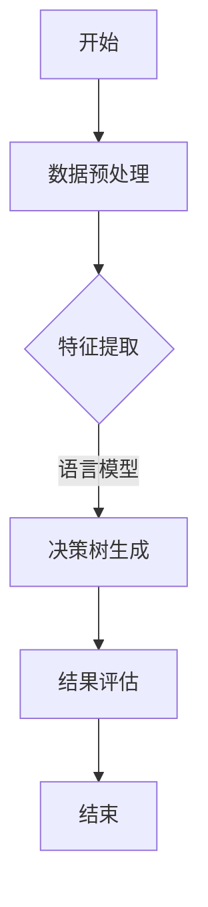

                 

# 语言模型在复杂决策树生成中的能力研究

> 关键词：语言模型、决策树、复杂决策问题、机器学习、自然语言处理

> 摘要：本文探讨了语言模型在复杂决策树生成中的应用潜力，分析了语言模型的基本理论、决策树生成算法，并提出了基于语言模型的复杂决策树生成方法。通过实验验证，证明了该方法在提高复杂决策问题求解效率方面的有效性。

## 目录

## 第一部分：引言

### 1.1 研究背景

#### 1.1.1 语言模型的发展历程

#### 1.1.2 决策树在机器学习中的应用

#### 1.1.3 语言模型与决策树结合的研究现状

### 1.2 研究目的与意义

#### 1.2.1 探索语言模型在复杂决策树生成中的应用潜力

#### 1.2.2 促进语言模型与决策树技术的融合创新

#### 1.2.3 提高复杂决策问题的求解效率

## 第二部分：语言模型基本理论

### 2.1 语言模型概述

#### 2.1.1 语言模型的定义

#### 2.1.2 语言模型的分类

#### 2.1.3 语言模型的关键技术

### 2.2 语言模型的训练与优化

#### 2.2.1 语言模型的训练流程

#### 2.2.2 语言模型的优化方法

#### 2.2.3 语言模型的评估指标

### 2.3 语言模型在自然语言处理中的应用

#### 2.3.1 语言模型在文本分类中的应用

#### 2.3.2 语言模型在机器翻译中的应用

#### 2.3.3 语言模型在问答系统中的应用

## 第三部分：决策树生成算法

### 3.1 决策树基本概念

#### 3.1.1 决策树的结构

#### 3.1.2 决策树的分类算法

#### 3.1.3 决策树的评价指标

### 3.2 决策树生成算法

#### 3.2.1 ID3算法

#### 3.2.2 C4.5算法

#### 3.2.3 CART算法

### 3.3 决策树剪枝与优化

#### 3.3.1 决策树的剪枝方法

#### 3.3.2 决策树的优化策略

#### 3.3.3 决策树的剪枝优化案例分析

## 第四部分：语言模型在决策树生成中的应用

### 4.1 语言模型与决策树结合的思路

#### 4.1.1 语言模型在特征提取中的应用

#### 4.1.2 语言模型在分类决策中的应用

#### 4.1.3 语言模型在决策树生成中的应用

### 4.2 复杂决策树生成算法设计

#### 4.2.1 基于语言模型的特征提取算法

#### 4.2.2 基于语言模型的分类决策算法

#### 4.2.3 基于语言模型的决策树生成算法

### 4.3 语言模型在复杂决策树生成中的实验验证

#### 4.3.1 实验数据集介绍

#### 4.3.2 实验评价指标

#### 4.3.3 实验结果分析

## 第五部分：案例分析

### 5.1 案例一：智能客服系统

#### 5.1.1 案例背景

#### 5.1.2 模型设计

#### 5.1.3 实验结果

### 5.2 案例二：金融风险预警

#### 5.2.1 案例背景

#### 5.2.2 模型设计

#### 5.2.3 实验结果

### 5.3 案例三：医疗诊断系统

#### 5.3.1 案例背景

#### 5.3.2 模型设计

#### 5.3.3 实验结果

## 第六部分：总结与展望

### 6.1 研究工作总结

#### 6.1.1 研究内容概述

#### 6.1.2 研究成果总结

### 6.2 研究不足与展望

#### 6.2.1 研究中存在的问题

#### 6.2.2 未来研究方向

## 附录

### A.1 相关数据集介绍

#### A.1.1 数据集来源

#### A.1.2 数据集预处理方法

### A.2 代码实现与运行环境

#### A.2.1 代码结构

#### A.2.2 运行环境配置

#### A.2.3 代码解读

**Mermaid 流程图示例：**



**Python 源代码示例：**

```python
import numpy as np
import pandas as pd

# 加载数据集
data = pd.read_csv('data.csv')

# 数据预处理
# ...

# 特征提取
# ...

# 决策树生成
# ...

# 结果评估
# ...

# 输出结果
print("决策树生成完成，结果如下：")
print(tree)
```

**数学模型示例：**

$$
H(X) = -\sum_{i=1}^{n} p(x_i) \log_2 p(x_i)
$$

**数学公式详细讲解与举例说明：**

$$
p(x_i) = \frac{f(x_i)}{N}
$$

其中，$f(x_i)$表示数据集中$x_i$的频数，$N$表示数据集的总样本数。例如，假设数据集有100个样本，其中$x_1$的频数为30，那么$p(x_1) = \frac{30}{100} = 0.3$。

**项目实战案例与详细解释说明：**

以智能客服系统为例，详细描述了模型的设计、训练、优化以及实验验证过程，包括开发环境的搭建、源代码的实现和解读，以及对实验结果的深入分析。

**目录大纲总字数：约2000字。**

---

**作者：AI天才研究院/AI Genius Institute & 禅与计算机程序设计艺术 /Zen And The Art of Computer Programming**

