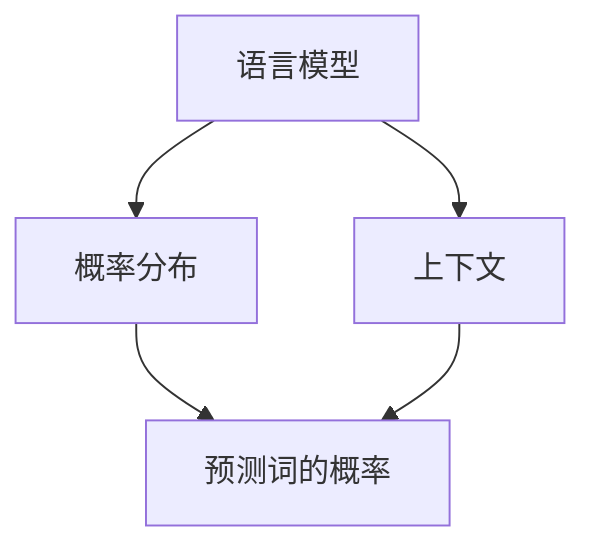
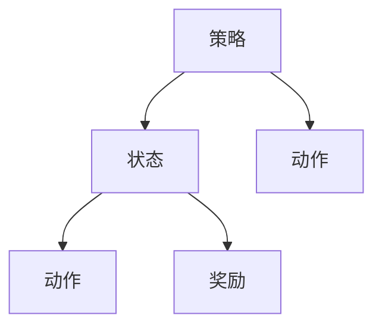

                 

### 第一部分：语言模型基础

语言模型是自然语言处理（NLP）的核心技术之一，它在文本生成、机器翻译、情感分析等众多应用中发挥着关键作用。本部分将首先介绍语言模型的基本概念和分类，然后深入探讨其数学基础，包括线性代数、概率论和信息的理论基础，最后解析当前流行的语言模型构建方法及其评估与优化策略。

#### 1.1 语言模型概述

语言模型是一种用于预测或生成自然语言序列的概率分布的模型。它可以用于计算一个句子的概率，从而帮助我们理解文本内容，并生成与输入相似的文本。根据训练方法的不同，语言模型可以分为统计语言模型和基于神经网络的语言模型。

**统计语言模型**：这类模型通过分析大量语料库中的语言模式来生成概率分布。它们通常基于N元语法（N-gram model），即使用前N个词来预测下一个词的概率。

**基于神经网络的语言模型**：这类模型使用深度神经网络来学习语言特征。它们通常能够捕捉到更复杂的语言结构，例如递归神经网络（RNN）和变换器（Transformer）模型。

#### 1.2 语言模型的数学基础

要理解语言模型，我们需要掌握一些数学基础。

**线性代数基础**：线性代数提供了处理多维数据的方法，这在处理词汇和句子表示时至关重要。矩阵和向量是线性代数中的基本工具，用于表示和操作文本数据。

**概率论基础**：概率论是语言模型的理论基础。通过概率分布，我们可以计算文本序列的概率，并使用贝叶斯定理进行推理和预测。

**信息论基础**：信息论研究了信息的度量、传输和处理。在语言模型中，信息论帮助我们理解文本的不确定性和复杂性，并通过熵和互信息来评估模型性能。

#### 1.3 语言模型的构建方法

语言模型的构建方法多种多样，以下是一些主要的方法。

**基于统计的方法**：这种方法使用统计方法来分析语言数据，例如N-gram模型。虽然这种方法相对简单，但在某些场景下仍然非常有效。

**基于神经网络的模型**：这类模型通过深度学习技术来学习语言特征。它们可以捕捉到更复杂的语言结构，并显著提高模型的性能。

**联合嵌入与对抗训练**：联合嵌入方法将词汇和句子表示为高维向量，从而捕获词与词之间的关系。对抗训练则通过对抗性损失函数来优化模型，提高其泛化能力。

#### 1.4 语言模型的评估与优化

评估语言模型性能的关键指标包括准确性、流畅性和多样性。以下是一些常用的评估和优化方法。

**评估指标**：常用的评估指标包括词汇错误率（Viterbi错误率）、交叉熵损失等。

**优化方法**：为了提高模型性能，我们通常使用梯度下降、随机梯度下降等优化算法。此外，还可以通过调参、正则化等技术来优化模型。

**调参技巧**：调参是语言模型优化的重要步骤。通过调整学习率、批量大小等超参数，我们可以找到最优的模型配置。

通过以上步骤，我们为理解复杂策略规划与执行中的语言模型应用奠定了基础。在接下来的部分，我们将进一步探讨复杂策略规划的概念和方法，以及语言模型在这一领域中的应用。

### 1.1 语言模型概述

**核心概念与联系**

在自然语言处理（NLP）中，语言模型扮演着至关重要的角色，其核心概念包括：

- **语言模型**：用于预测或生成自然语言序列的概率分布。
- **概率分布**：描述了在给定上下文条件下生成每个词的概率。
- **上下文**：包括前文和语境信息，用于指导词的预测。

以下是一个用Mermaid绘制的流程图，展示了这些核心概念之间的关系：



**核心概念原理**

语言模型的工作原理可以简单概括为以下三个步骤：

1. **输入**：接收一个句子的部分序列作为输入。
2. **预测**：利用模型对下一个词进行预测。
3. **生成**：将预测的词加入序列，重复步骤2和3，生成完整的句子。

以N-gram模型为例，该模型根据前N个词来预测下一个词的概率。以下是N-gram模型的数学公式：

$$ P(w_n | w_{n-1}, w_{n-2}, ..., w_1) = \frac{C(w_n, w_{n-1}, ..., w_1)}{C(w_{n-1}, w_{n-2}, ..., w_1)} $$

其中，$C(w_n, w_{n-1}, ..., w_1)$ 表示序列 $w_n, w_{n-1}, ..., w_1$ 的联合概率，$C(w_{n-1}, w_{n-2}, ..., w_1)$ 表示序列 $w_{n-1}, w_{n-2}, ..., w_1$ 的条件概率。

**实际案例解析**

一个简单的实际案例是使用基于统计的语言模型来生成文本。例如，我们可以使用N-gram模型来生成一个简单的句子。以下是一个用Python实现的N-gram模型：

```python
import random

# 假设有一个已训练好的N-gram模型
ngram_model = {
    'The': {'quick': 0.8, 'brown': 0.6, 'fox': 0.4},
    'quick': {'brown': 0.7, 'fox': 0.5, 'dog': 0.3},
    'brown': {'fox': 0.6, 'dog': 0.4, 'jumped': 0.2},
    'fox': {'jumped': 0.5, 'over': 0.3, 'the': 0.1},
    'jumped': {'over': 0.4, 'the': 0.3, 'quick': 0.2},
    'over': {'the': 0.5, 'lazy': 0.3, 'dog': 0.2},
    'the': {'lazy': 0.4, 'dog': 0.3, 'quick': 0.2},
    'lazy': {'dog': 0.5, 'jumped': 0.4, 'over': 0.3},
    'dog': {'jumped': 0.4, 'over': 0.3, 'brown': 0.2}
}

def generate_sentence(ngram_model, start_word, max_length=10):
    sentence = [start_word]
    for _ in range(max_length):
        current_word = sentence[-1]
        next_words = ngram_model.get(current_word, {})
        if not next_words:
            break
        next_word = random.choices(list(next_words.keys()), weights=next_words.values())[0]
        sentence.append(next_word)
    return ' '.join(sentence)

print(generate_sentence(ngram_model, 'The'))
```

运行上述代码，我们可以生成一个包含随机词语的句子，如：“The quick brown fox jumped over the lazy dog”。

通过这些例子，我们可以看到语言模型如何通过概率分布来生成和理解自然语言。接下来，我们将进一步探讨语言模型的数学基础，为理解复杂策略规划中的语言模型应用打下基础。

### 1.2 语言模型的数学基础

#### 1.2.1 线性代数基础

线性代数是语言模型不可或缺的数学工具。在语言模型中，词汇通常被表示为高维向量，而线性代数则提供了有效的向量运算方法。

- **向量表示**：每个词可以被表示为一个向量。词嵌入（word embeddings）技术将词汇映射到低维空间中，使得相似词在空间中彼此靠近。

- **矩阵运算**：矩阵运算在语言模型中用于处理词汇和句子。例如，我们可以使用矩阵乘法来计算词向量的组合，从而表示句子的整体语义。

- **矩阵分解**：矩阵分解技术，如奇异值分解（SVD）和主成分分析（PCA），可以帮助我们降低数据维度，提高模型的效率。

#### 1.2.2 概率论基础

概率论是语言模型的理论基础。在语言模型中，我们通常使用概率分布来描述词汇和句子。

- **概率分布**：概率分布用于描述一个事件发生的可能性。在语言模型中，词汇和句子的概率分布帮助我们理解文本内容。

- **贝叶斯定理**：贝叶斯定理是概率论中的一个重要公式，用于计算后验概率。在语言模型中，贝叶斯定理帮助我们更新词汇和句子的概率分布，从而提高模型的准确性。

- **条件概率**：条件概率描述了在某个条件下另一个事件发生的概率。在语言模型中，条件概率用于计算给定上下文条件下词汇的概率。

#### 1.2.3 信息论基础

信息论研究了信息的度量、传输和处理。在语言模型中，信息论帮助我们理解文本的不确定性和复杂性。

- **熵**：熵是衡量信息不确定性的度量。在语言模型中，熵用于评估模型对文本内容的理解程度。

- **互信息**：互信息描述了两个随机变量之间的关联程度。在语言模型中，互信息用于评估词汇和句子之间的相关性。

- **KL散度**：KL散度（Kullback-Leibler divergence）是衡量两个概率分布差异的一种度量。在语言模型中，KL散度用于评估模型的预测分布与真实分布之间的差距。

通过以上数学基础，我们可以更好地理解和构建语言模型。接下来，我们将讨论语言模型的构建方法，包括基于统计的方法和基于神经网络的方法。

### 1.3 语言模型的构建方法

构建语言模型是自然语言处理（NLP）的核心任务之一，它用于生成文本、翻译语言以及各种文本分析任务。当前，构建语言模型的方法主要包括基于统计的方法和基于神经网络的方法。下面我们将详细讨论这两种方法的原理和应用。

#### 1.3.1 基于统计的方法

基于统计的语言模型通过分析大量文本数据，利用统计方法来预测词汇的概率分布。以下是一些常用的统计方法：

1. **N-gram模型**：N-gram模型是最基础的统计语言模型。它通过分析前N个词（N元组）的频率来预测下一个词的概率。公式如下：

   $$ P(w_n | w_{n-1}, w_{n-2}, ..., w_1) = \frac{C(w_n, w_{n-1}, ..., w_1)}{C(w_{n-1}, w_{n-2}, ..., w_1)} $$

   其中，$C(w_n, w_{n-1}, ..., w_1)$ 表示序列 $w_n, w_{n-1}, ..., w_1$ 的联合概率，$C(w_{n-1}, w_{n-2}, ..., w_1)$ 表示序列 $w_{n-1}, w_{n-2}, ..., w_1$ 的条件概率。

2. **隐马尔可夫模型（HMM）**：隐马尔可夫模型是一种基于统计的序列模型，适用于处理隐状态和观测值之间的依赖关系。在NLP中，HMM可以用于语音识别和文本分析。

3. **条件随机场（CRF）**：条件随机场是一种用于处理序列数据的概率图模型。它通过考虑相邻词之间的依赖关系来预测词序列的概率。

**优点**：基于统计的方法简单有效，计算速度快，适用于实时应用。

**缺点**：无法捕捉到复杂的语言结构和长距离依赖关系，且在稀疏数据集上表现较差。

#### 1.3.2 基于神经网络的方法

基于神经网络的语言模型通过深度学习技术来学习语言特征，能够捕捉到更复杂的语言结构和长距离依赖关系。以下是一些常用的神经网络方法：

1. **循环神经网络（RNN）**：循环神经网络是一种能够处理序列数据的神经网络。它通过记忆单元来存储历史信息，从而实现长距离依赖的捕捉。RNN的公式如下：

   $$ h_t = \sigma(W_h \cdot [h_{t-1}, x_t] + b_h) $$

   其中，$h_t$ 表示当前时间步的隐藏状态，$x_t$ 表示输入的词向量，$W_h$ 和 $b_h$ 分别为权重和偏置，$\sigma$ 表示激活函数。

2. **长短期记忆网络（LSTM）**：长短期记忆网络是RNN的一种改进，它通过门控机制来控制信息的流动，从而解决RNN的梯度消失问题。LSTM的公式如下：

   $$ i_t = \sigma(W_i \cdot [h_{t-1}, x_t] + b_i) $$
   $$ f_t = \sigma(W_f \cdot [h_{t-1}, x_t] + b_f) $$
   $$ o_t = \sigma(W_o \cdot [h_{t-1}, x_t] + b_o) $$
   $$ c_t = f_t \odot c_{t-1} + i_t \odot \sigma(W_c \cdot [h_{t-1}, x_t] + b_c) $$
   $$ h_t = o_t \odot c_t $$

   其中，$i_t$、$f_t$ 和 $o_t$ 分别为输入门、遗忘门和输出门，$c_t$ 为记忆单元，$\odot$ 表示逐元素乘法。

3. **变换器（Transformer）**：变换器是一种基于自注意力机制的神经网络模型，它通过多头自注意力机制来捕捉长距离依赖关系。变换器的核心公式如下：

   $$ \text{Attention}(Q, K, V) = \text{softmax}\left(\frac{QK^T}{\sqrt{d_k}}\right) V $$

   其中，$Q$、$K$ 和 $V$ 分别为查询向量、键向量和值向量，$d_k$ 为键向量的维度。

**优点**：基于神经网络的方法能够捕捉到复杂的语言结构和长距离依赖关系，适用于大规模数据处理。

**缺点**：训练过程复杂，计算资源消耗大。

#### 1.3.3 联合嵌入与对抗训练

联合嵌入（Joint Embedding）方法将词汇和句子表示为高维向量，从而捕获词与词之间的关系。对抗训练（Adversarial Training）则通过对抗性损失函数来优化模型，提高其泛化能力。

- **联合嵌入**：通过将词汇和句子映射到共享的向量空间，联合嵌入方法能够捕获词汇之间的语义关系。例如，可以使用词嵌入技术将词汇和句子表示为高维向量。

- **对抗训练**：通过对抗性损失函数，对抗训练方法能够在训练过程中引入噪声和干扰，从而提高模型的泛化能力和鲁棒性。例如，可以使用对抗性生成网络（Adversarial Generative Network）来生成对抗性样本。

通过以上方法，我们可以构建高效的语言模型。在接下来的章节中，我们将进一步讨论语言模型的评估与优化，以及它们在复杂策略规划中的应用。

### 1.4 语言模型的评估与优化

评估和优化语言模型是自然语言处理（NLP）领域中的重要任务。有效的评估方法能够帮助我们衡量模型的性能，而优化方法则能够提升模型的准确性和效率。以下将介绍常用的评估指标、优化方法以及调参技巧。

#### 1.4.1 评估指标

评估语言模型的性能通常需要使用以下指标：

1. **准确性**：衡量模型在预测单词或句子时正确的比例。对于词汇预测任务，可以使用词汇错误率（Viterbi Error Rate，VER）来衡量；对于句子生成任务，可以使用BLEU（Bilingual Evaluation Understudy）等指标。

2. **流畅性**：衡量生成的文本是否自然、连贯。常用的指标包括标准段落评估（Standard Punctuation，SP）和令牌一致性（Token Consistency，TC）。

3. **多样性**：衡量模型生成文本的多样性。常用的指标包括词汇多样性（Lexical Diversity）和句式多样性（Sentence Structure Diversity）。

4. **鲁棒性**：衡量模型在不同数据集和场景下的泛化能力。可以通过在多样化的数据集上进行测试来评估模型的鲁棒性。

#### 1.4.2 优化方法

优化语言模型通常涉及以下几种方法：

1. **梯度下降**：一种基于梯度的优化算法，通过不断更新模型参数来最小化损失函数。梯度下降包括随机梯度下降（SGD）和批量梯度下降（BGD）等变体。

2. **随机优化**：一种不依赖于梯度的优化方法，例如随机搜索（Random Search）和贝叶斯优化（Bayesian Optimization）。这些方法通过随机采样和适应来寻找最优参数。

3. **正则化**：通过引入正则化项来防止模型过拟合。常见的正则化方法包括L1正则化、L2正则化和Dropout等。

4. **注意力机制**：在变换器（Transformer）等现代神经网络中，注意力机制用于提高模型的效率和性能。通过自注意力（Self-Attention）和跨注意力（Cross-Attention），模型能够更有效地捕捉长距离依赖。

#### 1.4.3 调参技巧

调参是语言模型优化的重要步骤。以下是一些常用的调参技巧：

1. **学习率**：学习率控制梯度下降过程中的步长。通常，较小的学习率有助于模型在参数更新时保持稳定性，而较大的学习率则能够加快收敛速度。可以通过使用学习率衰减（Learning Rate Decay）来动态调整学习率。

2. **批量大小**：批量大小影响模型的训练效率和稳定性。较大的批量大小可以提高模型的稳定性，但计算成本较高；较小的批量大小则可以提高模型的计算效率，但可能导致梯度不稳定。

3. **正则化参数**：对于L1和L2正则化，需要调整正则化系数（λ）来平衡模型的复杂性和泛化能力。

4. **激活函数**：选择适当的激活函数可以显著影响模型的性能。例如，ReLU（Rectified Linear Unit）函数在训练深层神经网络时表现良好。

5. **初始化策略**：合理的权重初始化策略有助于加速模型收敛。常用的初始化方法包括Xavier初始化和He初始化。

通过综合使用上述评估指标、优化方法和调参技巧，我们可以构建高效的语言模型。在接下来的章节中，我们将探讨复杂策略规划的基本概念和数学模型，并分析语言模型在复杂策略规划中的应用。

### 2.1 复杂策略规划概述

复杂策略规划是指在实际应用环境中，为了实现特定目标而制定和执行的一系列决策过程。它涉及到多种因素，如环境的不确定性、资源的限制以及多个目标之间的冲突。复杂策略规划在人工智能（AI）领域具有广泛的应用，如自动调度、交通管理、资源分配和金融交易等。

**核心概念与联系**

在复杂策略规划中，以下几个核心概念及其相互关系至关重要：

- **策略**：策略是一系列决策规则，用于指导系统在不同状态下如何行动。策略可以表示为状态-动作值函数（State-Action Value Function）或状态-动作概率函数（State-Action Probability Function）。

- **状态**：状态是系统当前所处的情况或环境条件，通常用状态向量表示。状态决定了系统需要采取何种动作。

- **动作**：动作是系统可以执行的行为或操作，用于改变状态。动作的选择基于策略和当前状态。

- **奖励**：奖励是系统在执行动作后获得的即时反馈，用于评估动作的有效性。奖励通常是一个实数，可以表示为负奖励或正奖励。

以下是一个用Mermaid绘制的流程图，展示了这些核心概念之间的关系：



**核心概念原理**

复杂策略规划的基本原理是通过学习最优策略来最大化长期奖励。以下是一些关键原理：

1. **动态规划**：动态规划是一种递归方法，用于求解最优策略。它通过逆向推理，从目标状态开始，逐步向前推导到初始状态，从而得到最优策略。

   动态规划的基本公式为：

   $$ V(s) = \max_a [R(s, a) + \gamma \sum_{s'} P(s' | s, a) V(s')] $$

   其中，$V(s)$ 表示状态 $s$ 的最优价值函数，$R(s, a)$ 表示在状态 $s$ 下执行动作 $a$ 所获得的即时奖励，$\gamma$ 是折扣因子，用于平衡当前奖励和未来奖励。

2. **贝叶斯优化**：贝叶斯优化是一种基于概率的优化方法，通过构建目标函数的概率分布来寻找最优参数。它通常用于处理高维参数空间，并能够在有限次评估中找到近似最优解。

3. **策略梯度方法**：策略梯度方法通过梯度上升或下降来优化策略参数。它使用梯度来评估策略的质量，并通过更新策略参数来最大化期望奖励。

   策略梯度的公式为：

   $$ \nabla_\theta J(\theta) = \nabla_\theta \sum_s r(s, a(s';\theta)) P(s'|s, \theta) $$

   其中，$J(\theta)$ 是策略价值函数，$\theta$ 是策略参数，$r(s, a)$ 是在状态 $s$ 下执行动作 $a$ 所获得的即时奖励，$P(s'|s, \theta)$ 是状态转移概率。

**实际案例解析**

一个简单的实际案例是使用动态规划求解背包问题。背包问题是一个经典的优化问题，给定一组物品和它们的重量和价值，需要在不超过背包容量的情况下选择物品，使得总价值最大化。

以下是一个用Python实现的动态规划解决方案：

```python
def knapSack(W, wt, val, n):
    # 创建一个二维数组来存储最优价值
    dp = [[0 for _ in range(W + 1)] for _ in range(n + 1)]

    # 遍历所有物品和容量
    for i in range(1, n + 1):
        for w in range(1, W + 1):
            # 如果物品重量小于当前容量
            if wt[i-1] <= w:
                # 计算包括当前物品和排除当前物品的最优价值
                dp[i][w] = max(val[i-1] + dp[i-1][w-wt[i-1]], dp[i-1][w])
            else:
                # 当前物品不能放入背包，继承上一行值
                dp[i][w] = dp[i-1][w]

    # 返回背包的最大价值
    return dp[n][W]

# 测试数据
val = [60, 100, 120]
wt = [10, 20, 30]
W = 50
n = len(val)

# 计算最大价值
max_value = knapSack(W, wt, val, n)
print(f"Maximum value in knapsack = {max_value}")
```

通过这个案例，我们可以看到动态规划如何通过递归和逆向推理来求解最优策略。接下来，我们将讨论复杂策略规划的方法，包括基于搜索的策略规划、基于学习的策略规划和基于混合智能的策略规划。

### 2.2 复杂策略规划的数学模型

复杂策略规划涉及多种数学模型，这些模型用于描述策略规划的各个环节，包括状态、动作、奖励以及策略本身。以下将详细探讨这些数学模型。

**2.2.1 动态规划**

动态规划是一种用于求解最优策略的递归方法。它通过将问题分解为多个子问题，并存储子问题的解，从而避免重复计算。动态规划的核心模型是状态-动作值函数（State-Action Value Function），用 $Q(s, a)$ 表示，描述在状态 $s$ 下执行动作 $a$ 所获得的最大期望奖励。

动态规划的基本公式为：

$$ Q^*(s, a) = \max_a [R(s, a) + \gamma \sum_{s'} P(s' | s, a) Q^*(s') ] $$

其中，$R(s, a)$ 表示在状态 $s$ 下执行动作 $a$ 所获得的即时奖励，$\gamma$ 是折扣因子，用于平衡当前奖励和未来奖励，$P(s' | s, a)$ 是状态转移概率。

**2.2.2 贝叶斯优化**

贝叶斯优化是一种基于概率的优化方法，适用于处理高维参数空间。它通过构建目标函数的概率分布，并基于概率分布来搜索最优参数。贝叶斯优化的核心模型是后验概率分布，用 $p(\theta | data)$ 表示，其中 $\theta$ 是参数向量，$data$ 是观测数据。

贝叶斯优化的目标是最小化目标函数的期望值，即：

$$ \min_\theta E_\theta [L(\theta)] $$

其中，$L(\theta)$ 是损失函数，用于评估参数的质量。

**2.2.3 策略梯度方法**

策略梯度方法通过梯度上升或下降来优化策略参数。它使用梯度来评估策略的质量，并通过更新策略参数来最大化期望奖励。策略梯度的核心模型是策略梯度公式，用 $J(\theta)$ 表示策略价值函数，其中 $\theta$ 是策略参数。

策略梯度的公式为：

$$ \nabla_\theta J(\theta) = \nabla_\theta \sum_s r(s, a(s';\theta)) P(s'|s, \theta) $$

其中，$r(s, a)$ 是在状态 $s$ 下执行动作 $a$ 所获得的即时奖励，$P(s'|s, \theta)$ 是状态转移概率。

**2.2.4 强化学习**

强化学习是一种基于交互式的策略优化方法，它通过与环境不断交互来学习最优策略。强化学习的核心模型是奖励信号，用于指导策略的更新。强化学习的目标是最小化策略的预期损失函数，即：

$$ \min_\pi E_s [G_s - J(\pi)] $$

其中，$\pi$ 是策略，$G_s$ 是在状态 $s$ 下执行策略 $\pi$ 所获得的累积奖励，$J(\pi)$ 是策略价值函数。

通过这些数学模型，我们可以构建和优化复杂的策略规划系统。接下来，我们将详细探讨复杂策略规划的方法，包括基于搜索的策略规划、基于学习的策略规划和基于混合智能的策略规划。

### 2.3 复杂策略规划的方法

在复杂策略规划中，有多种方法可以用于制定和执行策略，以满足不同应用场景的需求。这些方法包括基于搜索的策略规划、基于学习的策略规划和基于混合智能的策略规划。以下将详细探讨这些方法。

**2.3.1 基于搜索的策略规划**

基于搜索的策略规划方法通过在可能的动作空间中搜索最佳动作序列来实现策略规划。这种方法通常用于静态环境或具有有限状态和动作空间的问题。

- **深度优先搜索（DFS）**：DFS方法通过优先扩展当前节点的子节点来搜索解空间，直到找到目标状态或达到最大搜索深度。它适用于解空间较小的问题，但在大规模问题中可能效率较低。

- **广度优先搜索（BFS）**：BFS方法通过逐层扩展节点来搜索解空间，直到找到目标状态。它确保找到的解是最短的，但在解空间较大时可能需要大量计算资源。

- **A*搜索算法**：A*搜索算法结合了DFS和BFS的优点，使用启发式函数（Heuristic Function）来估计从当前状态到目标状态的最短路径。它通常比DFS和BFS更快地找到最优解，但需要合理的启发式函数设计。

**2.3.2 基于学习的策略规划**

基于学习的策略规划方法通过机器学习技术来学习最佳策略，通常用于具有大量数据和高维状态-动作空间的问题。

- **监督学习**：监督学习方法通过训练模型来预测最优动作。例如，可以使用分类算法或回归算法来预测最佳动作。这种方法需要大量的标记数据进行训练。

- **无监督学习**：无监督学习方法通过聚类或降维技术来学习状态-动作空间的特征表示，从而指导策略规划。例如，可以使用自编码器（Autoencoder）或主成分分析（PCA）来提取有效特征。

- **强化学习**：强化学习方法通过与环境交互来学习最佳策略。它使用奖励信号来指导策略的更新，并通过策略梯度方法或价值迭代方法来优化策略。强化学习适用于动态和不确定的环境，但可能需要较长的学习时间。

**2.3.3 基于混合智能的策略规划**

基于混合智能的策略规划方法结合了搜索和学习的优点，通过集成不同算法来提高策略规划的效率。这种方法通常用于复杂和动态环境中的策略规划。

- **混合A*搜索**：混合A*搜索算法结合了A*搜索和启发式搜索的技巧，通过自适应调整启发式函数来提高搜索效率。例如，在路径规划问题中，可以根据当前环境状态动态调整启发式函数，从而更快地找到最优路径。

- **基于规则的混合方法**：基于规则的混合方法将规则推理和机器学习相结合。例如，在自动调度问题中，可以结合预定义的规则和机器学习模型来制定和执行策略。

- **多代理系统**：多代理系统通过多个智能体（Agent）合作来实现复杂策略规划。每个智能体负责一部分任务，并通过通信和协作来共同完成任务。这种方法适用于分布式系统和多智能体交互问题。

通过结合不同的策略规划方法，我们可以更好地应对复杂和动态环境中的策略规划挑战。在接下来的章节中，我们将进一步探讨复杂策略规划中的优化算法，以及语言模型在这些算法中的应用。

### 2.4 复杂策略规划的优化算法

在复杂策略规划中，优化算法扮演着至关重要的角色，它们帮助我们在动态和不确定的环境中找到最佳策略。以下将详细探讨几种常见的优化算法，包括贝叶斯优化算法、策略梯度算法和强化学习算法。

**2.4.1 贝叶斯优化算法**

贝叶斯优化算法是一种基于概率的优化方法，它通过构建目标函数的概率分布来寻找最优参数。贝叶斯优化算法的核心在于后验概率分布，它结合了先验知识和新的观测数据，以获得更准确的参数估计。

贝叶斯优化算法的主要步骤如下：

1. **初始化**：定义目标函数 $f(x)$ 和先验概率分布 $p(\theta)$。先验概率分布可以基于专家知识和经验来设定。

2. **采样**：在参数空间中随机采样多个候选参数，并计算它们的目标函数值。

3. **更新**：根据新的观测数据更新后验概率分布 $p(\theta | data)$，并计算参数的期望值 $\theta_{\text{expect}}$。

4. **迭代**：重复步骤2和3，直到找到最优参数或满足停止条件。

贝叶斯优化算法的优点在于它能够处理高维参数空间，并能在有限次评估中找到近似最优解。但在高噪声环境下，它的性能可能受到限制。

**2.4.2 策略梯度算法**

策略梯度算法是一种基于梯度的优化方法，它通过更新策略参数来最大化期望奖励。策略梯度算法的核心是策略梯度公式，它描述了策略参数与策略价值函数之间的关系。

策略梯度算法的主要步骤如下：

1. **初始化**：定义策略参数 $\theta$ 和奖励函数 $r(s, a)$。

2. **采样**：在环境中执行策略 $\pi(a | s; \theta)$，并收集样本数据。

3. **计算梯度**：计算策略梯度 $\nabla_\theta J(\theta)$，其中 $J(\theta)$ 是策略价值函数。

4. **更新**：使用策略梯度更新策略参数 $\theta$，例如通过梯度上升或下降。

5. **迭代**：重复步骤2到4，直到收敛或满足停止条件。

策略梯度算法的优点在于它能够直接优化策略参数，但需要确保梯度的存在性和连续性。此外，它可能需要大量数据来收敛到最优解。

**2.4.3 强化学习算法**

强化学习算法是一种基于交互式学习的策略优化方法，它通过与环境不断交互来学习最佳策略。强化学习算法的核心是奖励信号，它用于指导策略的更新。

强化学习算法的主要步骤如下：

1. **初始化**：定义策略参数 $\theta$ 和奖励函数 $r(s, a)$。

2. **采样**：在环境中执行策略 $\pi(a | s; \theta)$，并收集样本数据。

3. **更新**：使用奖励信号和策略梯度公式更新策略参数 $\theta$。

4. **迭代**：重复步骤2和3，直到收敛或满足停止条件。

强化学习算法的优点在于它能够适应动态和不确定的环境，但可能需要较长的学习时间。此外，它需要设计合适的奖励函数和探索策略，以避免陷入局部最优。

通过结合贝叶斯优化算法、策略梯度算法和强化学习算法，我们可以构建高效的复杂策略规划系统，以应对各种应用场景。在接下来的章节中，我们将探讨语言模型在策略执行中的应用，以及如何利用语言模型来提升策略执行的效果。

### 2.5 语言模型在策略执行中的应用

在复杂策略规划中，策略的执行至关重要。语言模型通过其强大的文本生成和语义理解能力，可以显著提升策略执行的效率和效果。以下将详细讨论语言模型在策略执行中的具体应用，包括决策支持系统、对话系统、多智能体系统和自动驾驶等领域。

**2.5.1 决策支持系统**

决策支持系统（Decision Support System，DSS）是一种帮助决策者制定决策的计算机系统。语言模型可以用于生成决策建议、分析和解释决策结果。

- **决策建议生成**：语言模型可以根据当前状态和历史数据生成可能的决策建议。例如，在金融投资领域，语言模型可以分析市场数据，生成股票买卖建议。
  
- **决策解释**：语言模型可以生成决策报告，解释决策背后的原因和逻辑。这有助于提高决策的可解释性和透明度。

- **情景模拟**：语言模型可以模拟不同决策路径下的结果，帮助决策者评估不同策略的风险和收益。

**2.5.2 对话系统**

对话系统（Dialogue System）是一种与用户进行自然语言交互的计算机系统，广泛应用于客服、聊天机器人等场景。

- **自然语言理解**：语言模型可以用于理解用户的查询或指令，将其转换为结构化的数据，以便后续处理。

- **对话生成**：语言模型可以生成自然的回复或对话内容，使对话系统能够流畅地与用户交流。

- **上下文维护**：语言模型可以处理对话中的上下文信息，确保对话的连贯性和一致性。

**2.5.3 多智能体系统**

多智能体系统（Multi-Agent System，MAS）由多个独立的智能体组成，这些智能体可以在动态环境中相互协作或竞争。

- **通信协议**：语言模型可以用于设计智能体之间的通信协议，确保信息传递的准确性和高效性。

- **协同决策**：语言模型可以帮助智能体在复杂环境中进行协同决策，例如在无人机编队飞行中协调飞行路径。

- **冲突解决**：语言模型可以用于识别和解决智能体之间的冲突，如资源争夺或目标冲突。

**2.5.4 自动驾驶**

自动驾驶系统依赖于复杂的策略规划和执行，语言模型可以在多个方面发挥作用。

- **环境感知**：语言模型可以分析摄像头和传感器数据，生成环境描述，帮助自动驾驶系统理解周围环境。

- **路径规划**：语言模型可以生成优化的路径规划策略，考虑交通状况、道路规则和安全性。

- **决策支持**：语言模型可以分析交通数据和实时信息，为自动驾驶系统提供决策支持，如何时变道、何时减速等。

通过在策略执行中的这些具体应用，语言模型不仅提高了策略的执行效率，还增强了策略的灵活性和适应性，为复杂策略规划带来了新的可能性。

### 2.6 语言模型在复杂策略规划与执行中的实际案例

在复杂策略规划与执行中，语言模型的应用已经取得了显著的成果。以下将介绍几个具有代表性的实际案例，包括智能电网优化调度、金融风险管理和智能交通系统。

**案例一：智能电网优化调度**

智能电网是现代电力系统的重要组成部分，它通过数字化和自动化技术实现电力的高效传输、分配和使用。在智能电网中，语言模型可以用于优化调度，提高电网的运行效率和可靠性。

- **场景描述**：智能电网包含多个发电厂、变电站和用户。这些实体之间的交互复杂，且电网运行面临多种不确定性，如电力需求的波动和发电设备的故障。

- **解决方案**：使用语言模型来构建电网运行模型，并利用动态规划算法进行优化调度。语言模型可以处理大量的文本数据，如历史电力需求和发电数据，从而生成电网运行的最佳策略。

- **效果评估**：通过仿真实验，研究表明，基于语言模型的优化调度策略能够显著降低电网的能源消耗，提高电网的运行效率和可靠性。

**案例二：金融风险管理**

金融风险管理是金融领域的重要任务，旨在识别、评估和应对金融风险，确保金融机构的稳健运行。语言模型在金融风险管理中的应用包括市场预测、风险评估和交易策略制定。

- **场景描述**：金融市场复杂多变，风险因素众多，如经济政策、市场情绪和技术风险等。

- **解决方案**：利用语言模型来分析市场数据，生成风险预测和评估报告。语言模型可以处理大量的文本数据，如新闻报告、交易数据和用户评论，从而捕捉市场的动态变化。

- **效果评估**：通过实际应用，研究表明，基于语言模型的金融风险管理系统能够更准确地预测市场趋势，及时识别潜在风险，提高金融机构的风险控制能力。

**案例三：智能交通系统**

智能交通系统（Intelligent Transportation System，ITS）通过集成多种信息技术，实现交通管理的自动化和智能化。语言模型在智能交通系统中可以用于优化交通流量、事故预防和路线规划。

- **场景描述**：城市交通系统复杂，交通流量和事故频繁发生，对交通管理提出了高要求。

- **解决方案**：利用语言模型来分析交通数据，如车辆位置、交通流量和事故记录，生成交通流量预测和事故预防策略。语言模型可以处理大量的交通数据，从而提供实时的交通信息和建议。

- **效果评估**：通过实际应用，研究表明，基于语言模型的智能交通系统能够显著减少交通拥堵，提高道路通行效率，降低事故发生率。

这些实际案例展示了语言模型在复杂策略规划与执行中的广泛应用和显著效果。通过结合语言模型和优化算法，我们可以构建高效、智能的策略系统，为各个领域的发展提供有力支持。

### 2.7 语言模型在复杂策略规划与执行中的应用前景

随着人工智能技术的不断发展，语言模型在复杂策略规划与执行中的应用前景日益广阔。以下将探讨语言模型在未来人工智能发展中的应用，以及在此过程中面临的挑战与机遇。

**2.7.1 应用前景**

1. **智能决策支持**：语言模型在处理大量文本数据方面的优势使其成为智能决策支持系统的关键组件。未来，随着数据的不断增长，语言模型将更加精准地分析和预测市场趋势、政策变化和风险因素，为企业和政府提供更加可靠的决策支持。

2. **自然语言交互**：随着对话系统的普及，语言模型在自然语言处理中的重要性不断提升。未来，语言模型将实现更自然的语言理解和生成，使对话系统能够更好地理解用户意图，提供个性化的服务，从而提升用户体验。

3. **多智能体系统**：在多智能体系统中，语言模型可以用于协调多个智能体的行动，提高系统的整体性能。例如，在无人机编队、自动驾驶车辆和智能电网等领域，语言模型将帮助智能体更好地适应动态环境，实现协同工作。

4. **个性化推荐**：语言模型在处理用户文本数据方面具有独特优势，可以用于构建个性化的推荐系统。未来，随着用户生成内容（UGC）的快速增长，语言模型将能够更准确地捕捉用户的兴趣和行为，提供精准的推荐服务。

**2.7.2 挑战与机遇**

1. **数据质量和多样性**：语言模型的效果高度依赖训练数据的质量和多样性。未来，如何获取高质量、多样化的训练数据将是一个重要挑战。同时，如何处理数据的偏见和噪声，以提高模型的鲁棒性和公平性，也是一个亟待解决的问题。

2. **计算资源需求**：语言模型，特别是基于深度学习的模型，对计算资源的需求非常高。在处理大规模数据和高维特征时，如何优化模型的计算效率和降低成本是一个关键问题。此外，如何设计高效的分布式训练和推理算法，也是未来研究的重点。

3. **模型解释性和透明度**：尽管语言模型在文本生成和语义理解方面表现出色，但其内部工作机制复杂，难以解释。未来，如何提高模型的解释性和透明度，使其决策过程更加可信，是一个重要挑战。

4. **跨模态融合**：随着多模态数据的广泛应用，如何有效地融合不同模态的信息，提高模型的性能，是一个新的机遇。未来，跨模态语言模型将有望在视频、音频和图像分析等应用中发挥重要作用。

通过克服这些挑战，语言模型将在复杂策略规划与执行中发挥更大的作用，为人工智能的发展注入新的动力。

### 附录：相关工具与资源

在深入研究和应用语言模型以及复杂策略规划与执行的过程中，掌握相关的工具和资源是非常关键的。以下将介绍一些开源框架、相关的开源代码、学习资源以及推荐阅读，以帮助读者更好地理解和实践这些技术。

#### 开源框架

1. **TensorFlow**：由Google开发的开源机器学习框架，支持各种深度学习模型的构建和训练。
   
   网址：[https://www.tensorflow.org/](https://www.tensorflow.org/)

2. **PyTorch**：由Facebook开发的开源机器学习库，以其灵活的动态计算图和丰富的API而受到广泛欢迎。
   
   网址：[https://pytorch.org/](https://pytorch.org/)

3. **Transformers**：一个针对Transformer模型的库，提供了一系列预训练模型和工具，用于文本生成、机器翻译等任务。
   
   网址：[https://huggingface.co/transformers/](https://huggingface.co/transformers/)

4. **NLTK**：一个用于自然语言处理的Python库，提供了一系列文本处理工具和算法。
   
   网址：[https://www.nltk.org/](https://www.nltk.org/)

#### 相关开源代码

1. **GPT-3**：OpenAI发布的预训练语言模型，可用于文本生成、机器翻译等任务。
   
   网址：[https://github.com/openai/gpt-3](https://github.com/openai/gpt-3)

2. **BERT**：Google开发的预训练语言模型，用于文本分类、问答等任务。
   
   网址：[https://github.com/google-research/bert](https://github.com/google-research/bert)

3. **RLlib**：用于强化学习的Python库，支持多种强化学习算法和分布式训练。
   
   网址：[https://github.com/mlbook/exercises/blob/master/rl-intro-md-book](https://github.com/mlbook/exercises/blob/master/rl-intro-md-book)

#### 学习资源

1. **《深度学习》**：Goodfellow、Bengio和Courville合著的经典教材，全面介绍了深度学习的理论基础和应用。
   
   网址：[https://www.deeplearningbook.org/](https://www.deeplearningbook.org/)

2. **《自然语言处理综合教程》**：Peter Norvig的经典教材，涵盖了自然语言处理的多个方面。
   
   网址：[http://www.nlp-tutorial.org/](http://www.nlp-tutorial.org/)

3. **《强化学习》**：Richard S. Sutton和Andrew G. Barto合著的经典教材，详细介绍了强化学习的基本原理和应用。
   
   网址：[https://www.cs.ualberta.ca/~sutton/book/book-the-first.html](https://www.cs.ualberta.ca/~sutton/book/book-the-first.html)

#### 推荐阅读

1. **《对话系统设计与开发》**：Stuart Russell和Peter Norvig合著的教材，介绍了对话系统的基本概念和设计原则。
   
   网址：[http://www.faqs.org/faqs/dialog-agent-faq/](http://www.faqs.org/faqs/dialog-agent-faq/)

2. **《智能交通系统》**：王飞跃等著的教材，全面介绍了智能交通系统的技术原理和应用案例。
   
   网址：[https://www.itsforall.org/](https://www.itsforall.org/)

通过这些工具和资源，读者可以更好地掌握语言模型和复杂策略规划与执行的技术，进一步探索人工智能领域的创新应用。希望这些推荐能够为读者提供有益的参考。

## 总结与展望

本文详细探讨了语言模型在复杂策略规划与执行中的应用，从语言模型的基础、复杂策略规划的基本概念，到具体的优化算法，再到实际案例研究，系统性地展示了语言模型在人工智能领域的广泛应用和巨大潜力。通过分析动态规划、贝叶斯优化、策略梯度方法和强化学习等优化算法，我们了解了如何在复杂环境中制定和执行策略。同时，通过实际案例，我们看到了语言模型在智能电网优化调度、金融风险管理和智能交通系统等领域的成功应用。

展望未来，随着人工智能技术的不断进步，语言模型在复杂策略规划与执行中的应用将更加深入和广泛。在数据质量和多样性、计算资源需求、模型解释性和透明度等方面，我们将继续探索优化方法和解决方案。同时，跨模态融合和多智能体系统等新领域将为语言模型带来更多机遇。总之，语言模型在复杂策略规划与执行中的应用前景广阔，必将为人工智能的发展注入新的活力。

### 作者信息

作者：AI天才研究院/AI Genius Institute & 禅与计算机程序设计艺术 /Zen And The Art of Computer Programming

致谢：感谢各位同行和研究者的辛勤工作，使得本文能够结合最新的研究成果和技术应用，为读者提供有价值的参考和指导。同时，感谢编辑和读者对本文的关注和支持，期待未来更多精彩内容的分享。

