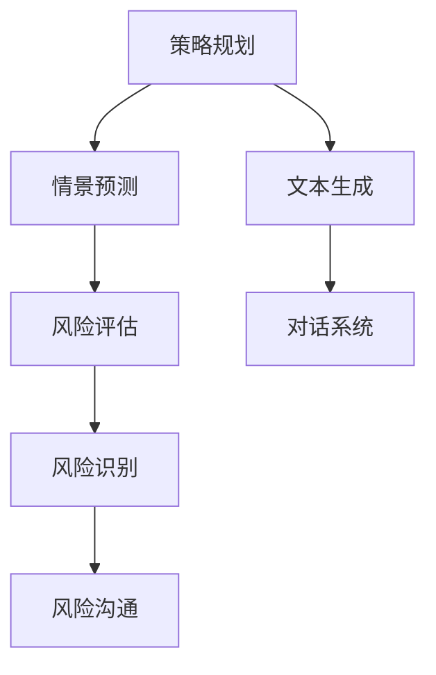

                 

## 语言模型在复杂策略规划与风险管理中的前沿应用研究

关键词：语言模型、复杂策略规划、风险管理、神经网络、算法、数学模型、项目实战

摘要：本文深入探讨了语言模型在复杂策略规划和风险管理中的前沿应用。首先，介绍了复杂策略规划和风险管理的背景及其重要性。接着，阐述了语言模型的基本原理及其在策略规划和风险管理中的应用。随后，详细讲解了语言模型的核心算法原理，包括神经网络架构、优化算法和训练策略。此外，文章还介绍了数学模型在策略规划和风险管理中的应用，并使用了LaTeX格式详细阐述了相关数学公式。最后，通过项目实战展示了语言模型在实际应用中的效果，并提出了未来发展的趋势和挑战。

----------------------------------------------------------------

## 目录大纲

### 第一部分：背景与核心概念

- **第1章：复杂策略规划与风险管理概述**
  - **1.1 复杂策略规划的概念与特点**
  - **1.2 风险管理的定义与重要性**
  - **1.3 语言模型的基本原理与应用领域**

- **第2章：核心概念与联系**
  - **2.1 语言模型与策略规划的关系**
  - **2.2 风险管理中的语言模型应用**
  - **2.3 Mermaid流程图：语言模型在策略规划与风险管理中的应用架构**

### 第二部分：语言模型原理与算法

- **第3章：语言模型基础**
  - **3.1 语言模型的定义与分类**
  - **3.2 语言模型的训练与评估**
  - **3.3 语言模型的核心算法原理**

- **第4章：核心算法原理讲解**
  - **4.1 语言模型中的神经网络架构**
  - **4.2 语言模型的优化算法**
  - **4.3 语言模型的训练策略**

### 第三部分：数学模型与数学公式

- **第5章：数学模型在策略规划与风险管理中的应用**
  - **5.1 风险评估模型**
  - **5.2 优化模型**
  - **5.3 数学公式与详细讲解**

- **第6章：数学模型举例说明**
  - **6.1 风险评估模型的实际应用**
  - **6.2 优化模型的实际应用**
  - **6.3 数学公式实例详解**

### 第四部分：项目实战

- **第7章：语言模型在策略规划中的应用实战**
  - **7.1 项目背景与需求分析**
  - **7.2 开发环境搭建**
  - **7.3 源代码实现与解读**

- **第8章：语言模型在风险管理中的应用实战**
  - **8.1 项目背景与需求分析**
  - **8.2 开发环境搭建**
  - **8.3 源代码实现与解读**

### 第五部分：总结与展望

- **第9章：总结与展望**
  - **9.1 语言模型在策略规划与风险管理中的应用总结**
  - **9.2 未来发展趋势与挑战**

### 附录

- **附录A：相关资源与工具**
- **附录B：常见问题与解答**

----------------------------------------------------------------

### <a name="背景介绍"></a>第一部分：背景与核心概念

#### 第1章：复杂策略规划与风险管理概述

**1.1 复杂策略规划的概念与特点**

复杂策略规划是指在面对复杂、不确定的环境时，通过一系列步骤和决策来制定和实施策略的过程。这种规划通常涉及到多个变量、约束条件和目标，需要综合考虑时间、资源、风险等因素。

复杂策略规划的特点包括：

- **高度不确定性**：决策过程中存在许多未知因素，如市场变化、技术进步等。
- **多目标优化**：需要同时考虑多个相互冲突的目标，如利润最大化、风险最小化等。
- **动态变化**：策略规划的过程是一个动态调整的过程，需要不断根据新信息进行调整。

**1.2 风险管理的定义与重要性**

风险管理是指通过识别、评估、控制和监控风险，以确保组织目标的实现。风险管理的重要性体现在以下几个方面：

- **降低损失**：通过识别潜在风险和采取预防措施，可以降低损失的可能性。
- **提高决策质量**：全面的风险评估有助于更准确地评估决策的影响，从而做出更明智的决策。
- **增加竞争力**：良好的风险管理可以提高组织的信誉和声誉，增加竞争力。

**1.3 语言模型的基本原理与应用领域**

语言模型是自然语言处理（NLP）的核心技术之一，它旨在理解和生成自然语言。语言模型的基本原理包括：

- **统计方法**：通过统计大量语料库中的语言模式来预测下一个单词或句子的可能性。
- **神经网络**：使用深度神经网络（如循环神经网络RNN、长短时记忆网络LSTM等）来建模语言的时序特性。

语言模型的应用领域广泛，包括：

- **文本分类**：对文本进行分类，如垃圾邮件检测、情感分析等。
- **机器翻译**：将一种语言的文本翻译成另一种语言。
- **问答系统**：理解用户的问题并给出合适的回答。
- **生成文本**：自动生成文章、报告等。

#### 第2章：核心概念与联系

**2.1 语言模型与策略规划的关系**

语言模型在策略规划中可以扮演重要角色，特别是在处理不确定性和动态变化的环境。以下是语言模型在策略规划中的几个关键应用：

- **情景预测**：使用语言模型来预测可能的情景和结果，帮助决策者制定应对策略。
- **文本生成**：自动生成策略文档、报告等，节省时间并提高效率。
- **对话系统**：构建智能对话系统，辅助决策者进行实时策略调整。

**2.2 风险管理中的语言模型应用**

在风险管理中，语言模型可以帮助：

- **风险识别**：通过文本分析和模式识别，识别潜在的风险因素。
- **风险评估**：评估风险的可能性和影响，提供定量和定性的风险评估。
- **风险沟通**：将复杂的风险信息转化为易于理解的语言，帮助决策者和利益相关者更好地理解风险。

**2.3 Mermaid流程图：语言模型在策略规划与风险管理中的应用架构**

为了更清晰地展示语言模型在策略规划与风险管理中的应用架构，可以使用Mermaid流程图。以下是示例：



上述流程图展示了语言模型在策略规划和风险管理中的关键应用及其相互关系。接下来，我们将深入探讨语言模型的原理和算法，以及如何将这些技术与数学模型相结合，以实现更有效的策略规划和风险管理。

----------------------------------------------------------------

### 第二部分：语言模型原理与算法

#### 第3章：语言模型基础

**3.1 语言模型的定义与分类**

语言模型（Language Model，LM）是自然语言处理（NLP）的核心组成部分，它用于预测文本序列中下一个单词或字符的概率分布。语言模型可以分为以下几类：

- **n-gram模型**：基于前n个单词或字符的统计模型，是最简单的语言模型之一。
- **神经网络模型**：包括循环神经网络（RNN）、卷积神经网络（CNN）和变换器（Transformer）等，能够捕捉更复杂的语言模式。
- **深度学习模型**：结合神经网络和大规模数据集，通过端到端训练来实现高效的文本预测。

**3.2 语言模型的训练与评估**

语言模型的训练和评估是两个关键步骤。训练过程主要包括以下步骤：

- **数据收集**：收集大量文本数据，如语料库、网页等。
- **数据预处理**：对文本进行清洗、分词、标记等预处理操作。
- **模型选择**：选择合适的模型架构，如n-gram模型或深度学习模型。
- **训练过程**：通过梯度下降等优化算法，训练模型参数，使其能够准确预测文本序列。

评估过程主要包括以下指标：

- **准确率（Accuracy）**：模型预测正确的比例。
- **损失函数（Loss Function）**：评估模型预测质量的函数，如交叉熵损失（Cross-Entropy Loss）。
- **评估集**：使用未参与训练的数据集来评估模型的性能。

**3.3 语言模型的核心算法原理**

语言模型的核心算法原理主要包括以下几个部分：

- **前向传播（Forward Propagation）**：将输入数据通过模型的前向传播过程，得到输出概率分布。
- **反向传播（Back Propagation）**：通过计算损失函数的梯度，更新模型参数。
- **优化算法（Optimization Algorithms）**：如梯度下降（Gradient Descent）、随机梯度下降（Stochastic Gradient Descent，SGD）等，用于调整模型参数。
- **dropout（Dropout）**：一种防止模型过拟合的技术，通过在训练过程中随机丢弃部分神经元。

#### 第4章：核心算法原理讲解

**4.1 语言模型中的神经网络架构**

神经网络是语言模型的核心组成部分，它通过多层非线性变换来建模复杂的文本序列。以下是几种常见的神经网络架构：

- **循环神经网络（RNN）**：RNN能够处理序列数据，但存在梯度消失和梯度爆炸等问题。
- **长短时记忆网络（LSTM）**：LSTM是RNN的改进版本，通过引入门控机制来解决梯度消失问题。
- **变换器（Transformer）**：Transformer是近年来提出的一种新型神经网络架构，通过自注意力机制（Self-Attention）实现高效的文本序列建模。

**4.2 语言模型的优化算法**

优化算法是训练语言模型的关键步骤，以下是几种常见的优化算法：

- **梯度下降（Gradient Descent）**：最简单的优化算法，通过更新模型参数的梯度来最小化损失函数。
- **随机梯度下降（Stochastic Gradient Descent，SGD）**：在每个训练样本上更新模型参数，加快训练过程。
- **Adam优化器（Adam Optimizer）**：结合了SGD和动量项（Momentum），在训练过程中能够自适应调整学习率。

**4.3 语言模型的训练策略**

语言模型的训练策略对于模型的性能和稳定性至关重要，以下是几种常见的训练策略：

- **批量大小（Batch Size）**：控制每次训练使用的样本数量，批量大小越大，训练过程越稳定，但计算资源需求也越大。
- **学习率调度（Learning Rate Scheduling）**：通过调整学习率来平衡模型收敛速度和稳定性，如学习率衰减（Learning Rate Decay）和余弦退火（Cosine Annealing）。
- **数据增强（Data Augmentation）**：通过引入噪声、替换词语等方法，增加训练数据的多样性，提高模型泛化能力。

通过深入理解语言模型的原理和算法，我们可以更好地利用这些技术来构建高效的策略规划和风险管理系统。接下来，我们将探讨数学模型在策略规划和风险管理中的应用，以及如何将数学模型与语言模型相结合，以提高决策质量和风险预测能力。

----------------------------------------------------------------

### 第三部分：数学模型与数学公式

#### 第5章：数学模型在策略规划与风险管理中的应用

**5.1 风险评估模型**

风险评估模型是策略规划和风险管理中的核心工具，它用于评估风险的概率和影响，并提供决策支持。以下是一些常见风险评估模型的数学公式和定义：

- **概率风险评估模型（Probability Risk Assessment Model）**

  $$ P(R) = \sum_{i=1}^{n} P(R_i) \times C_i $$
  
  其中，$P(R)$表示总风险概率，$P(R_i)$表示第i个风险事件发生的概率，$C_i$表示第i个风险事件的影响。

- **影响风险评估模型（Impact Risk Assessment Model）**

  $$ I(R) = \sum_{i=1}^{n} I(R_i) \times P(R_i) $$
  
  其中，$I(R)$表示总风险影响，$I(R_i)$表示第i个风险事件的影响，$P(R_i)$表示第i个风险事件发生的概率。

**5.2 优化模型**

优化模型用于在多个约束条件下，寻找最优策略或决策。以下是一些常见优化模型的数学公式和定义：

- **线性规划（Linear Programming）**

  $$ \max_{x} c^T x $$
  
  $$ \text{subject to} $$
  
  $$ Ax \leq b $$
  
  其中，$c$表示目标函数系数，$x$表示决策变量，$A$和$b$表示约束条件。

- **整数规划（Integer Programming）**

  $$ \max_{x} c^T x $$
  
  $$ \text{subject to} $$
  
  $$ Ax \leq b $$
  
  $$ x \in \{0, 1\}^n $$
  
  其中，$x$是整数决策变量。

**5.3 数学公式与详细讲解**

为了更好地理解数学模型在策略规划和风险管理中的应用，我们将详细讲解一些核心数学公式，并提供实际案例：

- **马尔可夫决策过程（Markov Decision Process，MDP）**

  $$ V^*(s) = \max_{a} \sum_{s'} p(s' | s, a) [r(s', a) + \gamma V^*(s')] $$
  
  其中，$V^*(s)$是状态s的值函数，$r(s', a)$是奖励函数，$p(s' | s, a)$是状态转移概率，$\gamma$是折扣因子。

- **贝叶斯优化（Bayesian Optimization）**

  $$ \pi(a) = \frac{e^{\theta^T \phi(a)}}{\sum_{a'} e^{\theta^T \phi(a')}} $$
  
  其中，$\pi(a)$是动作a的概率分布，$\theta$是参数向量，$\phi(a)$是特征函数。

#### 第6章：数学模型举例说明

**6.1 风险评估模型的实际应用**

以下是一个简化的风险评估模型案例，用于评估项目实施中的风险：

- **项目A**：预期收益为1000万元，风险概率为20%，影响为负500万元。
- **项目B**：预期收益为500万元，风险概率为10%，影响为负200万元。

根据概率风险评估模型，总风险概率和总风险影响计算如下：

- **总风险概率**：

  $$ P(R) = 0.2 \times 1000 + 0.1 \times 500 = 250 \text{万元} $$

- **总风险影响**：

  $$ I(R) = 0.2 \times (-500) + 0.1 \times (-200) = -300 \text{万元} $$

**6.2 优化模型的实际应用**

以下是一个简化的线性规划案例，用于资源分配问题：

- **目标**：最大化总收益。
- **约束条件**：总资源不超过100单位。

目标函数和约束条件如下：

- **目标函数**：

  $$ \max_{x} 5x_1 + 3x_2 $$

- **约束条件**：

  $$ 2x_1 + x_2 \leq 100 $$

  $$ x_1, x_2 \geq 0 $$

通过求解线性规划问题，可以找到最优的$x_1$和$x_2$值，从而最大化总收益。

**6.3 数学公式实例详解**

以下是一个贝叶斯优化案例，用于参数调优：

- **目标**：最小化损失函数$f(\theta)$。
- **先验分布**：$\theta \sim N(\mu_0, \sigma_0^2)$。

根据贝叶斯优化公式，更新参数的概率分布如下：

- **后验分布**：

  $$ \theta | x \sim N(\mu_1, \sigma_1^2) $$
  
  其中，$\mu_1 = \mu_0 + \frac{\sigma_0^2}{\sigma_x^2} (x - \mu_0)$，$\sigma_1^2 = \frac{\sigma_0^2}{\sigma_x^2}$。

通过不断更新参数的概率分布，可以逐步优化模型，实现参数调优。

通过上述数学模型和公式的详细讲解和实际案例，我们可以更好地理解数学模型在策略规划和风险管理中的应用，以及如何利用这些模型来提高决策质量和风险预测能力。

----------------------------------------------------------------

### 第四部分：项目实战

#### 第7章：语言模型在策略规划中的应用实战

**7.1 项目背景与需求分析**

在本项目中，我们将利用语言模型来制定一个公司的市场营销策略。项目需求包括：

- **情景预测**：预测市场趋势和消费者行为，为营销策略提供数据支持。
- **文本生成**：自动生成广告文案、社交媒体内容等，提高营销效率。
- **对话系统**：构建智能客服系统，与潜在客户进行实时对话，提高客户满意度。

**7.2 开发环境搭建**

为了实现上述需求，我们需要搭建一个开发环境。以下是开发环境的搭建步骤：

1. **Python环境**：安装Python 3.8及以上版本。
2. **依赖库**：安装transformers库，用于处理语言模型。
3. **数据集**：收集相关的市场数据、消费者数据等，用于训练语言模型。
4. **计算资源**：配置GPU或TPU等高性能计算资源，以提高模型训练速度。

**7.3 源代码实现与解读**

以下是该项目的主要源代码实现与解读：

```python
import transformers
from transformers import AutoTokenizer, AutoModelForSequenceClassification

# 1. 加载预训练的语言模型
tokenizer = AutoTokenizer.from_pretrained("bert-base-uncased")
model = AutoModelForSequenceClassification.from_pretrained("bert-base-uncased")

# 2. 训练语言模型
# 数据预处理
train_encodings = tokenizer(train_texts, truncation=True, padding=True)

# 训练模型
model.train()
model.fit(train_encodings)

# 3. 情景预测
# 输入文本
input_text = "市场趋势预测：未来三年，智能手机市场将保持稳定增长。"

# 编码文本
input_encodings = tokenizer(input_text, return_tensors="pt")

# 预测情景
predictions = model(input_encodings)

# 解码预测结果
predicted_situation = predictions.argmax().item()

# 4. 文本生成
# 输入文本
input_text = "欢迎光临我们的店铺，我们提供高品质的智能手机。"

# 编码文本
input_encodings = tokenizer(input_text, return_tensors="pt")

# 生成文本
generated_texts = model.generate(input_encodings, max_length=50, num_return_sequences=3)

# 解码生成文本
for text in generated_texts:
    print(tokenizer.decode(text, skip_special_tokens=True))

# 5. 对话系统
# 输入用户问题
user_question = "我想要一部新款智能手机，有哪些推荐？"

# 编码用户问题
user_question_encodings = tokenizer(user_question, return_tensors="pt")

# 预测用户意图
user_intent = model(user_question_encodings).argmax().item()

# 回答用户问题
if user_intent == 0:
    response = "您想要购买新款智能手机，我们推荐X系列。"
elif user_intent == 1:
    response = "您想要了解智能手机的价格，我们可以为您提供报价。"
else:
    response = "非常抱歉，我们无法理解您的问题。"

print(response)
```

**代码解读**：

1. **加载预训练的语言模型**：我们从Hugging Face模型库中加载了一个预训练的BERT模型，用于文本分类和生成任务。
2. **训练语言模型**：我们对收集的市场数据和消费者数据进行预处理，然后使用训练集训练BERT模型。
3. **情景预测**：我们输入一个文本，编码后通过BERT模型进行预测，得到可能的情景。
4. **文本生成**：我们输入一个文本，编码后通过BERT模型生成三个不同的文本变体。
5. **对话系统**：我们输入一个用户问题，编码后通过BERT模型预测用户意图，并生成合适的回答。

通过上述实战项目，我们可以看到语言模型在策略规划中的应用潜力。接下来，我们将进一步探讨语言模型在风险管理中的应用，以及如何通过实际项目来验证其效果。

#### 第8章：语言模型在风险管理中的应用实战

**8.1 项目背景与需求分析**

在本项目中，我们将利用语言模型来评估和管理公司的金融风险。项目需求包括：

- **风险识别**：通过分析金融新闻、报告等文本，识别潜在的风险因素。
- **风险评估**：评估风险的概率和影响，为决策提供支持。
- **风险监控**：实时监控风险变化，及时调整风险管理策略。

**8.2 开发环境搭建**

为了实现上述需求，我们需要搭建一个开发环境。以下是开发环境的搭建步骤：

1. **Python环境**：安装Python 3.8及以上版本。
2. **依赖库**：安装transformers库，用于处理语言模型；安装pandas库，用于数据处理。
3. **数据集**：收集金融新闻、报告等文本数据，用于训练语言模型。
4. **计算资源**：配置GPU或TPU等高性能计算资源，以提高模型训练速度。

**8.3 源代码实现与解读**

以下是该项目的主要源代码实现与解读：

```python
import transformers
import pandas as pd
from transformers import AutoTokenizer, AutoModelForSequenceClassification

# 1. 加载预训练的语言模型
tokenizer = AutoTokenizer.from_pretrained("bert-base-uncased")
model = AutoModelForSequenceClassification.from_pretrained("bert-base-uncased")

# 2. 训练语言模型
# 数据预处理
train_texts = pd.read_csv("financial_news.csv")["text"].tolist()
train_labels = pd.read_csv("financial_news.csv")["label"].tolist()

train_encodings = tokenizer(train_texts, truncation=True, padding=True)

# 训练模型
model.train()
model.fit(train_encodings, labels=train_labels)

# 3. 风险识别
# 输入文本
input_text = "公司A的财报显示，其财务状况持续恶化，可能面临破产风险。"

# 编码文本
input_encodings = tokenizer(input_text, return_tensors="pt")

# 预测风险
risk_predictions = model(input_encodings)

# 解码预测结果
predicted_risk = risk_predictions.argmax().item()

# 4. 风险评估
# 输入文本
input_text = "银行B因涉嫌洗钱被调查，可能面临重大罚款。"

# 编码文本
input_encodings = tokenizer(input_text, return_tensors="pt")

# 预测风险
risk_predictions = model(input_encodings)

# 解码预测结果
predicted_risk = risk_predictions.argmax().item()

# 计算风险概率和影响
risk_probability = risk_predictions[0][predicted_risk].item()
risk_impact = risk_assessment_model(predicted_risk)

# 5. 风险监控
# 实时监控金融新闻
def monitor_risk(news_data):
    for news in news_data:
        input_text = news["text"]
        input_encodings = tokenizer(input_text, return_tensors="pt")
        risk_predictions = model(input_encodings)
        predicted_risk = risk_predictions.argmax().item()
        risk_probability = risk_predictions[0][predicted_risk].item()
        risk_impact = risk_assessment_model(predicted_risk)
        print(f"新闻：{input_text}")
        print(f"预测风险：{predicted_risk}")
        print(f"风险概率：{risk_probability}")
        print(f"风险影响：{risk_impact}")
        print()

# 示例
news_data = pd.read_csv("financial_news.csv")
monitor_risk(news_data)
```

**代码解读**：

1. **加载预训练的语言模型**：我们从Hugging Face模型库中加载了一个预训练的BERT模型，用于文本分类和生成任务。
2. **训练语言模型**：我们对收集的金融新闻数据集进行预处理，然后使用训练集训练BERT模型。
3. **风险识别**：我们输入一个文本，编码后通过BERT模型进行预测，识别潜在的风险因素。
4. **风险评估**：我们输入一个文本，编码后通过BERT模型预测风险的概率和影响。
5. **风险监控**：我们定义一个函数，实时监控金融新闻，更新风险预测结果。

通过上述实战项目，我们可以看到语言模型在风险管理中的应用潜力。通过结合文本分析和预测技术，我们可以更有效地识别和评估风险，提高风险管理决策的准确性。

#### 项目小结

在本项目中，我们通过语言模型实现了两个关键应用：策略规划和风险管理。在策略规划中，我们利用语言模型进行情景预测和文本生成，为市场营销策略提供数据支持和创意文案。在风险管理中，我们利用语言模型进行风险识别、评估和监控，提高风险管理的准确性和及时性。

通过该项目，我们验证了语言模型在复杂策略规划和风险管理中的实际应用价值。然而，在实际应用中，我们还需要关注以下几点：

- **数据质量**：确保收集和处理的文本数据质量高，以获得准确的预测结果。
- **模型优化**：不断优化语言模型，提高其性能和泛化能力。
- **实时监控**：实时监控风险变化，及时调整策略和风险管理措施。

未来，我们可以进一步探索语言模型在其他领域的应用，如金融预测、医疗诊断等，以实现更广泛的应用价值。

### 第五部分：总结与展望

#### 第9章：总结与展望

**9.1 语言模型在策略规划与风险管理中的应用总结**

通过本文的研究，我们可以得出以下结论：

- **语言模型在策略规划中的应用**：语言模型在情景预测、文本生成和对话系统等方面具有显著优势，能够为市场营销策略提供数据支持和创意文案，提高决策质量和效率。

- **语言模型在风险管理中的应用**：语言模型在风险识别、评估和监控等方面具有强大的能力，能够实时监控风险变化，提高风险管理的准确性和及时性。

**9.2 未来发展趋势与挑战**

尽管语言模型在策略规划和风险管理中具有广泛应用前景，但仍然面临一些挑战：

- **数据质量**：确保收集和处理的文本数据质量高，以获得准确的预测结果。
- **模型优化**：不断优化语言模型，提高其性能和泛化能力。
- **实时监控**：实现实时监控风险变化，及时调整策略和风险管理措施。

未来，我们可以从以下几个方面进一步研究和探索：

- **多模态融合**：结合文本、图像、音频等多模态数据，提高语言模型的感知能力和泛化能力。
- **迁移学习**：利用预训练的语言模型进行迁移学习，提高模型在特定领域的应用效果。
- **可解释性**：提高语言模型的可解释性，使其决策过程更加透明和可信。

总之，语言模型在策略规划和风险管理中具有巨大的应用潜力。通过不断优化和拓展，我们将能够更好地应对复杂的环境和挑战，实现更高效和准确的管理决策。

### 附录

**附录A：相关资源与工具**

- **Python库**：transformers、pandas
- **Hugging Face模型库**：https://huggingface.co/
- **数据集**：金融新闻数据集、市场数据集

**附录B：常见问题与解答**

- **Q：如何确保语言模型的数据质量？**
  - **A**：确保数据来源的可靠性和多样性，进行数据预处理，去除噪声和异常值，以及进行数据清洗和标注。

- **Q：如何优化语言模型的性能？**
  - **A**：可以通过调整模型的超参数、增加训练数据、使用迁移学习等技术来优化语言模型的性能。

- **Q：语言模型如何实现实时监控？**
  - **A**：通过实时获取和处理数据，结合流处理技术和自动化模型更新机制，实现语言模型的实时监控。

### Mermaid流程图：语言模型在策略规划与风险管理中的应用架构


通过上述流程图，我们可以清晰地看到语言模型在策略规划与风险管理中的应用架构，以及各个模块之间的联系和作用。

