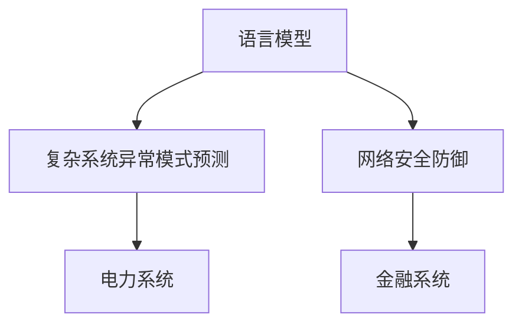

                 

# 语言模型在复杂系统异常模式预测与网络安全防御中的应用

## 关键词
- 语言模型
- 复杂系统
- 异常模式预测
- 网络安全
- 防御策略

## 摘要
本文将探讨语言模型在复杂系统异常模式预测与网络安全防御中的应用。首先，我们将介绍语言模型的基本概念和发展历程，然后深入探讨其在复杂系统异常模式预测和网络安全防御中的重要性。通过具体的案例分析，我们将展示语言模型如何帮助预测异常模式和提升网络安全防御能力，并讨论未来的研究方向和挑战。

## 目录大纲

# 语言模型在复杂系统异常模式预测与网络安全防御中的应用

## 第一部分：基础理论

### 第1章：语言模型概述
#### 1.1 语言模型的定义与作用
#### 1.2 语言模型的基本原理
#### 1.3 语言模型的发展历程

### 第2章：复杂系统异常模式预测
#### 2.1 复杂系统概述
#### 2.2 异常模式预测的重要性
#### 2.3 语言模型在复杂系统异常模式预测中的应用

### 第3章：网络安全防御中的语言模型
#### 3.1 网络安全概述
#### 3.2 语言模型在网络安全防御中的应用
#### 3.3 语言模型在网络安全防御中的挑战与机遇

## 第二部分：技术实现

### 第4章：语言模型构建方法
#### 4.1 语言模型构建流程
#### 4.2 语言模型常用算法
#### 4.3 语言模型性能优化策略

### 第5章：异常模式预测算法
#### 5.1 异常模式预测基本概念
#### 5.2 基于语言模型的异常检测算法
#### 5.3 异常模式预测案例分析

### 第6章：网络安全防御策略
#### 6.1 网络安全防御概述
#### 6.2 语言模型在入侵检测中的应用
#### 6.3 语言模型在恶意软件检测中的应用

## 第三部分：案例分析

### 第7章：案例一：电力系统异常模式预测与网络安全防御
#### 7.1 案例背景
#### 7.2 预测模型构建与实现
#### 7.3 防御策略实施与效果评估

### 第8章：案例二：金融系统异常模式预测与网络安全防御
#### 8.1 案例背景
#### 8.2 预测模型构建与实现
#### 8.3 防御策略实施与效果评估

### 第9章：综合评价与展望
#### 9.1 案例分析总结
#### 9.2 语言模型在复杂系统异常模式预测与网络安全防御中的发展趋势
#### 9.3 未来研究方向与挑战

## 附录
### 附录一：术语表
### 附录二：参考文献

### Mermaid 流程图


### Python源代码示例
```python
import numpy as np

# 计算平均值
def average(values):
    return sum(values) / len(values)

# 计算方差
def variance(values):
    avg = average(values)
    return sum((x - avg) ** 2 for x in values)

# 计算标准差
def standard_deviation(values):
    return np.sqrt(variance(values))
```

### 数学模型与公式
$$
\text{标准差} = \sqrt{\frac{1}{N-1} \sum_{i=1}^{N} (x_i - \overline{x})^2}
$$

### 代码解读与分析
```python
# 代码解读
# 此段代码实现了计算平均值、方差和标准差的功能。

# average函数计算平均值
# variance函数计算方差
# standard_deviation函数计算标准差

# 代码分析
# 这段代码首先定义了三个函数，分别用于计算平均值、方差和标准差。
# 平均值是数据集的中心值，方差是数据集离散程度的度量，标准差是方差的平方根。
# 这些统计量在数据分析和模型评估中非常重要。
```

### 项目实战
#### 1. 开发环境搭建
```bash
# 安装Python环境
pip install numpy

# 安装Mermaid支持
pip install mermaid-python
```

#### 2. 源代码实现与解读
```python
# 源代码实现
import numpy as np
from mermaid import Mermaid

# 平均值计算
def average(values):
    return np.mean(values)

# 方差计算
def variance(values):
    return np.var(values)

# 标准差计算
def standard_deviation(values):
    return np.std(values)

# Mermaid流程图生成
m = Mermaid()
m.add("语言模型")
m.add("复杂系统异常模式预测")
m.add("网络安全防御")
m.add("电力系统", parentOf="复杂系统异常模式预测")
m.add("金融系统", parentOf="复杂系统异常模式预测")
print(m.get())
```

## 引言

### 复杂系统异常模式预测的重要性

复杂系统在现代科技中无处不在，例如电力系统、金融系统、交通系统等。这些系统具有高度互联性和动态性，运行过程中容易受到内外部因素的干扰，导致异常模式的产生。异常模式预测对于这些复杂系统的稳定运行和安全管理至关重要。通过预测异常模式，可以提前采取相应的防御措施，避免系统出现严重的故障或安全事故。

### 网络安全防御的重要性

随着互联网和物联网的发展，网络安全问题日益严峻。网络攻击手段不断升级，传统的安全防御策略难以应对。因此，研究和应用新的网络安全防御技术具有重要意义。语言模型作为一种强大的数据处理和分析工具，其在网络安全防御中的应用潜力巨大。通过语言模型，可以识别和预测网络攻击模式，提高入侵检测和恶意软件检测的准确性。

### 语言模型的基本概念和发展历程

语言模型（Language Model）是自然语言处理（Natural Language Processing, NLP）领域的一个重要分支，用于对自然语言的概率分布进行建模。最早的语言模型可以追溯到20世纪50年代，当时主要基于规则的方法构建。随着计算力和算法的进步，统计模型和深度学习模型逐渐成为主流。

1. **规则模型**：基于手工编写的规则，对语言进行抽象和建模。这种方法简单直观，但在复杂性和灵活性上有所局限。
2. **统计模型**：利用统计学方法，对大量文本数据进行分析和学习，建立语言模型。这类模型包括N-gram模型、决策树、支持向量机等。
3. **深度学习模型**：基于神经网络的结构，通过多层非线性变换对语言数据进行建模。代表性的模型包括循环神经网络（RNN）、长短期记忆网络（LSTM）和Transformer等。

### 本文结构

本文将分为三部分进行探讨。第一部分介绍语言模型的基本理论，包括定义、基本原理和发展历程。第二部分讨论语言模型在复杂系统异常模式预测和网络安全防御中的应用，详细阐述其技术实现和算法。第三部分通过两个案例，展示语言模型在具体应用中的效果和潜力，并对未来发展趋势和挑战进行展望。

接下来，我们将进入第一部分，深入探讨语言模型的基本概念和发展历程。

### 第1章：语言模型概述

#### 1.1 语言模型的定义与作用

语言模型是一种对自然语言概率分布进行建模的数学模型，旨在预测给定语言序列中下一个词或字符的概率。其核心目标是通过学习大量的语言数据，构建出一个能够有效表示和预测语言行为的模型。

语言模型的作用主要体现在以下几个方面：

1. **文本生成**：语言模型可以根据先前的文本序列生成新的文本。这在自动写作、机器翻译和对话系统等领域具有广泛应用。
2. **语言理解**：语言模型可以帮助计算机理解和解析自然语言，提高机器对文本数据的处理能力。这在信息检索、问答系统和语义分析中具有重要意义。
3. **文本分类**：语言模型可以用于对文本进行分类，例如情感分析、主题分类和垃圾邮件过滤。通过学习文本的特征，语言模型能够准确判断文本的类别。

#### 1.2 语言模型的基本原理

语言模型的基本原理是通过统计方法或机器学习方法，从大量文本数据中学习语言的模式和规律。以下是一些常见的语言模型类型：

1. **N-gram模型**：N-gram模型是最简单和最早的统计语言模型之一。它将连续的N个词或字符作为一个整体进行建模，通过统计相邻词或字符出现的频率来预测下一个词或字符。其数学表示为：

   $$
   P(w_{n+1}|w_1, w_2, ..., w_n) = \frac{f(w_1, w_2, ..., w_n, w_{n+1})}{f(w_1, w_2, ..., w_n)}
   $$

   其中，$f()$ 表示出现频率。

2. **基于统计的隐马尔可夫模型（HMM）**：隐马尔可夫模型是一种基于状态转移概率和发射概率的统计模型。它将语言序列视为一系列状态和观测值的组合，通过学习状态转移概率和发射概率来预测下一个观测值。其数学表示为：

   $$
   P(w_1, w_2, ..., w_n) = \prod_{i=1}^{n} P(w_i|s_i)
   $$

   其中，$s_i$ 表示第i个状态。

3. **基于统计的决策树和SVM模型**：决策树和SVM（支持向量机）等机器学习方法也可以用于构建语言模型。这些模型通过学习文本特征和类别标签之间的关系，构建出一个分类模型，用于预测新的文本类别。

4. **基于深度学习的模型**：深度学习模型，如RNN（循环神经网络）、LSTM（长短期记忆网络）和Transformer等，通过多层神经网络结构对语言数据进行建模。这些模型具有强大的表示能力和学习能力，能够在大量数据上进行训练，获得更好的性能。

#### 1.3 语言模型的发展历程

语言模型的发展历程可以分为以下几个阶段：

1. **规则模型阶段**：最早的语言模型是基于手工编写的规则。这些规则由专家根据语言知识编写，能够处理一些简单的语言任务，如词法分析和句法分析。然而，随着语言复杂性的增加，规则模型逐渐暴露出其局限性。

2. **统计模型阶段**：20世纪60年代，N-gram模型首次被提出，标志着统计模型在语言建模中的兴起。N-gram模型通过统计相邻词或字符的出现频率来预测下一个词或字符，大大提高了语言模型的性能。此后，隐马尔可夫模型和决策树等统计模型也被广泛应用于语言建模。

3. **深度学习模型阶段**：随着计算力和算法的进步，深度学习模型在语言建模中逐渐崭露头角。RNN、LSTM等模型通过学习序列数据的长期依赖关系，取得了显著的性能提升。近年来，Transformer模型的提出进一步推动了语言模型的进展，其在自然语言处理任务中取得了众多突破性成果。

总结来说，语言模型的发展历程体现了从规则模型到统计模型，再到深度学习模型的演变过程。不同类型的语言模型在不同阶段都有其独特的优势和局限性，但总体趋势是不断优化和提升语言建模的性能和效果。

在下一章中，我们将深入探讨复杂系统异常模式预测的基本概念和应用，进一步了解语言模型在其中的作用。

### 第2章：复杂系统异常模式预测

#### 2.1 复杂系统概述

复杂系统是由大量相互关联的子系统组成的，具有高度复杂性和动态性的系统。这类系统在运行过程中，不仅受到内部因素的干扰，还受到外部环境的影响，表现出非线性、不确定性和复杂行为。复杂系统广泛存在于各个领域，如电力系统、交通系统、金融系统等。

**复杂性特征**：
1. **非线性**：复杂系统中的变量之间存在复杂的非线性关系，难以用简单的线性模型描述。
2. **动态性**：复杂系统在运行过程中，其状态和特性会随着时间变化而不断变化。
3. **高度互联性**：复杂系统由多个子系统组成，这些子系统之间通过复杂的相互作用和依赖关系相互关联。
4. **不确定性**：复杂系统在运行过程中，受到外部环境和内部随机因素的影响，具有不确定性。

**常见复杂系统**：
1. **电力系统**：包括发电、输电、配电等多个子系统，具有高度互联性和动态性。
2. **交通系统**：包括道路、铁路、机场等多个子系统，具有复杂的交通流量和相互作用。
3. **金融系统**：包括银行、证券、保险等多个子系统，具有复杂的金融产品和市场关系。

#### 2.2 异常模式预测的重要性

异常模式预测在复杂系统管理中具有重要意义。由于复杂系统的非线性、动态性和不确定性，正常运行过程中难免会出现异常现象。这些异常现象可能对系统的稳定运行和安全性造成威胁。因此，通过异常模式预测，可以提前识别和预警潜在的异常情况，从而采取相应的防御措施，确保系统的正常运行和安全性。

**重要性**：
1. **提高系统稳定性**：通过预测异常模式，可以及时发现并处理异常情况，避免系统出现严重故障。
2. **提升安全性**：在网络安全领域，通过预测异常网络流量和攻击模式，可以提前部署防御策略，防止网络攻击和数据泄露。
3. **优化资源管理**：在交通系统中，通过预测异常交通流量和事故模式，可以优化交通信号控制和道路管理，提高交通效率和安全性。

**应用领域**：
1. **电力系统**：预测设备故障、电压异常等，确保电力供应稳定。
2. **交通系统**：预测交通拥堵、交通事故等，优化交通管理和调度。
3. **金融系统**：预测欺诈交易、市场异常波动等，保障金融市场稳定。

#### 2.3 语言模型在复杂系统异常模式预测中的应用

语言模型作为一种强大的数据处理和分析工具，在复杂系统异常模式预测中具有广泛应用。语言模型能够处理大量非结构化数据，提取关键特征，并通过学习模型，预测异常模式。

**应用场景**：
1. **电力系统**：通过语言模型分析电力系统的运行数据，预测设备故障和电压异常，提前采取维护和调整措施。
2. **交通系统**：通过语言模型分析交通流量数据，预测交通拥堵和交通事故，优化交通信号控制和道路管理。
3. **金融系统**：通过语言模型分析金融交易数据，预测欺诈交易和市场异常波动，加强风险控制和监管。

**技术实现**：
1. **数据预处理**：将复杂系统的原始数据（如电力系统运行数据、交通流量数据、金融交易数据等）进行清洗、归一化和特征提取，转换为适合语言模型处理的形式。
2. **模型构建**：选择合适的语言模型算法（如N-gram、LSTM、Transformer等），构建预测模型，通过训练和优化，提高模型的预测性能。
3. **异常模式预测**：将实时数据输入到训练好的语言模型中，预测异常模式，并触发相应的预警和防御机制。

**挑战与机遇**：
1. **数据复杂性**：复杂系统产生的数据通常具有高维度、非线性、不确定性和噪声等特点，如何有效地进行数据预处理和特征提取是一个重要挑战。
2. **模型优化**：如何设计高效的语言模型算法，提高预测性能，是当前研究的热点。
3. **实时性**：复杂系统的运行速度较快，如何实现实时异常模式预测，是一个重要的技术难题。

在下一章中，我们将探讨语言模型在网络安全防御中的应用，进一步了解其在保护复杂系统安全方面的作用。

### 第3章：网络安全防御中的语言模型

#### 3.1 网络安全概述

网络安全是指通过采取一系列技术和管理措施，保护计算机网络系统不受恶意攻击、数据泄露和设备损坏的风险。随着互联网和物联网的快速发展，网络安全问题日益严重，网络攻击手段不断升级，传统的安全防御策略难以应对。因此，研究和应用新的网络安全防御技术具有重要意义。

**网络安全威胁类型**：
1. **恶意软件**：包括病毒、蠕虫、木马等，通过感染计算机系统，窃取敏感信息、破坏系统正常运行。
2. **网络攻击**：包括拒绝服务攻击（DDoS）、分布式拒绝服务攻击（DDoS）等，通过大量无效请求使网络服务瘫痪。
3. **数据泄露**：通过网络入侵、数据泄露等手段，窃取用户的敏感信息。
4. **钓鱼攻击**：通过伪造网站或邮件，欺骗用户输入个人信息。

**网络安全防御策略**：
1. **入侵检测系统（IDS）**：通过监测网络流量和系统日志，识别和预警潜在的攻击行为。
2. **防火墙**：在网络边界设置防火墙，过滤非法流量，防止攻击进入内部网络。
3. **加密技术**：通过加密算法保护数据传输的安全性，防止数据泄露。
4. **安全审计**：定期对网络系统和数据进行检查和评估，确保安全策略的有效实施。

#### 3.2 语言模型在网络安全防御中的应用

语言模型在网络安全防御中的应用具有显著的优势。语言模型能够处理非结构化数据，提取关键特征，从而实现高效的安全威胁检测和预测。

**应用领域**：
1. **入侵检测**：通过语言模型分析网络流量和系统日志，识别异常行为和潜在攻击，提高入侵检测的准确性。
2. **恶意软件检测**：通过语言模型分析恶意软件的特征和行为，识别和分类恶意软件，提高恶意软件检测的效率。
3. **钓鱼攻击检测**：通过语言模型分析钓鱼网站的文本特征和用户行为，识别和预警潜在的钓鱼攻击。

**技术实现**：
1. **数据预处理**：将网络流量、系统日志和恶意软件样本等原始数据进行清洗、归一化和特征提取，转换为适合语言模型处理的形式。
2. **模型构建**：选择合适的语言模型算法（如N-gram、LSTM、Transformer等），构建预测模型，通过训练和优化，提高模型的预测性能。
3. **安全威胁检测**：将实时数据输入到训练好的语言模型中，预测潜在的安全威胁，触发相应的防御机制。

**优势与挑战**：
1. **优势**：
   - **高效性**：语言模型能够处理大量数据，提取关键特征，提高检测速度。
   - **准确性**：通过深度学习算法，语言模型能够学习复杂的特征模式，提高检测的准确性。
   - **自适应能力**：语言模型能够适应不断变化的威胁环境，实时更新和优化模型。

2. **挑战**：
   - **数据复杂性**：网络数据通常具有高维度、非线性、不确定性和噪声等特点，如何有效进行数据预处理和特征提取是一个重要挑战。
   - **实时性**：网络安全威胁发生速度快，如何实现实时检测和响应，是一个技术难题。
   - **可解释性**：深度学习模型通常缺乏可解释性，如何解释模型预测结果，提高用户信任度，是一个重要问题。

在下一章中，我们将深入探讨语言模型的构建方法和性能优化策略，进一步了解如何提升语言模型在复杂系统异常模式预测和网络安全防御中的应用效果。

### 第4章：语言模型构建方法

#### 4.1 语言模型构建流程

构建一个有效的语言模型需要经过以下几个关键步骤：

1. **数据收集与预处理**：
   - **数据收集**：收集大量带有标签的文本数据，这些数据可以是语料库、网页文本、社交媒体内容等。
   - **数据预处理**：对文本数据进行清洗，去除停用词、标点符号和无关字符，将文本转换为统一的格式。此外，还可以进行词性标注、分词等操作。

2. **特征提取**：
   - **词袋模型**：将文本转换为词频向量或词频-逆文档频率（TF-IDF）向量，表示文本的词汇特征。
   - **词嵌入**：将文本中的每个词映射到一个高维向量空间，如Word2Vec、GloVe等。

3. **模型选择**：
   - **统计模型**：如N-gram模型，通过统计相邻词或字符的出现频率进行建模。
   - **机器学习模型**：如决策树、支持向量机（SVM）、随机森林等，通过学习文本特征和标签之间的关系进行分类。
   - **深度学习模型**：如循环神经网络（RNN）、长短期记忆网络（LSTM）、Transformer等，通过多层神经网络结构对语言数据进行建模。

4. **模型训练**：
   - **训练集划分**：将收集到的数据集分为训练集和测试集，训练集用于模型训练，测试集用于模型评估。
   - **模型训练**：通过优化算法（如梯度下降、Adam等）训练模型参数，使模型在训练集上达到最佳性能。

5. **模型评估**：
   - **评估指标**：常用的评估指标包括准确率、召回率、F1分数等。
   - **交叉验证**：采用交叉验证方法评估模型在多个数据划分上的性能，确保模型的泛化能力。

6. **模型优化**：
   - **参数调整**：通过调整模型参数，如学习率、批量大小等，优化模型性能。
   - **数据增强**：通过数据增强方法，如数据扩展、数据变换等，增加训练数据的多样性。

#### 4.2 语言模型常用算法

以下介绍几种常用的语言模型算法：

1. **N-gram模型**：
   - **基本原理**：N-gram模型通过统计相邻N个词或字符的出现频率进行建模。数学表示为：
     $$
     P(w_{n+1}|w_1, w_2, ..., w_n) = \frac{f(w_1, w_2, ..., w_n, w_{n+1})}{f(w_1, w_2, ..., w_n)}
     $$
   - **优缺点**：
     - **优点**：简单直观，易于实现，计算效率高。
     - **缺点**：对长距离依赖关系处理能力较差，容易产生次生错误。

2. **循环神经网络（RNN）**：
   - **基本原理**：RNN是一种能够处理序列数据的神经网络，其通过保存和传递隐藏状态，实现对长序列的建模。数学表示为：
     $$
     h_t = \sigma(W_h \cdot [h_{t-1}, x_t] + b_h)
     $$
   - **优缺点**：
     - **优点**：能够处理长序列依赖关系，适用于语言建模。
     - **缺点**：存在梯度消失和梯度爆炸问题，训练效率较低。

3. **长短期记忆网络（LSTM）**：
   - **基本原理**：LSTM是RNN的一种改进，通过引入记忆单元和门控机制，有效解决了梯度消失和梯度爆炸问题。数学表示为：
     $$
     i_t = \sigma(W_i \cdot [h_{t-1}, x_t] + b_i)
     $$
     $$
     f_t = \sigma(W_f \cdot [h_{t-1}, x_t] + b_f)
     $$
     $$
     o_t = \sigma(W_o \cdot [h_{t-1}, x_t] + b_o)
     $$
     $$
     C_t = f_t \odot C_{t-1} + i_t \odot \sigma(W_c \cdot [h_{t-1}, x_t] + b_c)
     $$
     $$
     h_t = o_t \odot C_t
     $$
   - **优缺点**：
     - **优点**：能够处理长序列依赖关系，适用于语言建模。
     - **缺点**：参数较多，计算复杂度高，训练时间较长。

4. **Transformer模型**：
   - **基本原理**：Transformer是一种基于注意力机制的序列到序列模型，通过自注意力机制和多头注意力机制，有效处理长序列依赖关系。数学表示为：
     $$
     \text{Attention}(Q, K, V) = \text{softmax}\left(\frac{QK^T}{\sqrt{d_k}}\right)V
     $$
     $$
     \text{MultiHeadAttention}(Q, K, V) = \text{Attention}(Q, K, V) \odot W_V
     $$
     $$
     \text{Encoder}(x, H) = \text{MultiHeadAttention}(Q, K, V) + x
     $$
     $$
     \text{Decoder}(y, e, H) = \text{Encoder}(y, H) + \text{DecoderLayer}(y, e, H)
     $$
   - **优缺点**：
     - **优点**：能够处理长序列依赖关系，训练速度较快，适用于大规模语言建模。
     - **缺点**：计算复杂度较高，内存占用大。

#### 4.3 语言模型性能优化策略

为了提升语言模型的性能，可以采取以下优化策略：

1. **数据增强**：
   - **数据扩展**：通过添加同义词、替换词语等方式，增加训练数据的多样性，提高模型的泛化能力。
   - **数据变换**：通过文本清洗、分词、词性标注等操作，提高数据的质量和一致性。

2. **模型优化**：
   - **参数调整**：通过调整学习率、批量大小、正则化参数等，优化模型性能。
   - **模型压缩**：通过剪枝、量化、知识蒸馏等技术，减小模型参数量和计算复杂度，提高模型部署效率。

3. **训练策略**：
   - **早期停止**：在模型训练过程中，当测试集性能不再提升时，提前停止训练，防止过拟合。
   - **迁移学习**：利用预训练模型，结合特定任务数据进行微调，提高模型在特定领域的性能。

4. **模型评估**：
   - **多指标评估**：结合准确率、召回率、F1分数等多个指标，全面评估模型性能。
   - **交叉验证**：采用交叉验证方法，确保模型在不同数据划分上的性能稳定。

通过以上优化策略，可以显著提升语言模型的性能，提高其在复杂系统异常模式预测和网络安全防御中的应用效果。

在下一章中，我们将详细讨论基于语言模型的异常模式预测算法，进一步探讨其在实际应用中的具体实现和案例分析。

### 第5章：异常模式预测算法

#### 5.1 异常模式预测基本概念

异常模式预测（Anomaly Detection）是一种用于识别数据集中异常或异常行为的技术。在复杂系统中，异常模式可能表现为设备故障、网络攻击、数据泄露等。异常模式预测的核心目标是检测并识别这些异常行为，从而采取相应的防御措施，确保系统的正常运行和安全性。

**异常模式分类**：
1. **点异常**：数据集中的单个异常值。
2. **区间异常**：数据集中一段连续的异常值。
3. **聚类异常**：数据集中的异常聚类。

**异常检测方法**：
1. **基于统计的方法**：如标准差法、箱线图法等，通过计算数据的统计指标（如均值、标准差）来识别异常。
2. **基于距离的方法**：如欧氏距离、曼哈顿距离等，通过计算数据与正常数据集的距离来识别异常。
3. **基于聚类的方法**：如K-均值聚类、层次聚类等，通过聚类分析来识别异常聚类。
4. **基于机器学习的方法**：如支持向量机（SVM）、随机森林（Random Forest）等，通过学习正常数据集的特征来识别异常。
5. **基于深度学习的方法**：如循环神经网络（RNN）、长短期记忆网络（LSTM）、卷积神经网络（CNN）等，通过深度学习模型来识别异常。

#### 5.2 基于语言模型的异常检测算法

语言模型在异常模式预测中具有显著优势。通过语言模型，可以处理大量非结构化数据，提取关键特征，从而实现高效和准确的异常检测。

**算法框架**：
1. **数据预处理**：对原始数据进行清洗、归一化和特征提取，将数据转换为适合语言模型处理的形式。
2. **语言模型构建**：选择合适的语言模型算法（如N-gram、LSTM、Transformer等），构建预测模型，通过训练和优化，提高模型的预测性能。
3. **特征提取**：利用语言模型提取文本数据中的关键特征，如词嵌入、词性标注等。
4. **异常检测**：将实时数据输入到训练好的语言模型中，通过比较预测值和实际值，识别异常模式。

**算法步骤**：
1. **数据收集与预处理**：收集大量带有标签的正常和异常数据，对数据集进行清洗、归一化和特征提取。
2. **模型构建**：选择合适的语言模型算法，构建预测模型。通过训练集进行模型训练，优化模型参数。
3. **特征提取**：利用训练好的语言模型，对输入数据提取关键特征，如词嵌入、词性标注等。
4. **异常检测**：将提取的关键特征输入到训练好的语言模型中，通过比较预测值和实际值，计算异常分数，识别异常模式。
5. **结果分析**：对识别的异常模式进行分析和验证，评估模型的准确性和可靠性。

**算法应用**：
1. **网络安全**：通过语言模型分析网络流量、系统日志等数据，识别异常网络攻击和恶意行为。
2. **电力系统**：通过语言模型分析电力系统的运行数据，识别设备故障、电压异常等异常模式。
3. **金融系统**：通过语言模型分析金融交易数据，识别欺诈交易、市场异常波动等异常模式。

**优势与挑战**：
1. **优势**：
   - **高效性**：语言模型能够处理大量非结构化数据，提取关键特征，提高异常检测速度。
   - **准确性**：深度学习算法能够学习复杂的特征模式，提高异常检测的准确性。
   - **自适应能力**：语言模型能够适应不断变化的威胁环境，实时更新和优化模型。

2. **挑战**：
   - **数据复杂性**：网络数据通常具有高维度、非线性、不确定性和噪声等特点，如何有效进行数据预处理和特征提取是一个重要挑战。
   - **实时性**：网络安全威胁发生速度快，如何实现实时异常检测和响应，是一个技术难题。
   - **可解释性**：深度学习模型通常缺乏可解释性，如何解释模型预测结果，提高用户信任度，是一个重要问题。

在下一章中，我们将通过实际案例展示语言模型在异常模式预测和网络安全防御中的应用效果，进一步探讨其在实际项目中的实现和挑战。

### 第6章：网络安全防御策略

#### 6.1 网络安全防御概述

网络安全防御是一项系统性的工作，旨在保护计算机网络系统及其数据免受各种网络威胁的侵害。随着网络攻击手段的日益复杂化和多样化，网络安全防御策略也需要不断更新和完善。网络安全防御策略主要包括以下几种：

1. **防火墙**：防火墙是一种网络安全设备，用于监控和控制进出网络的流量。通过设置规则，防火墙可以阻止未经授权的访问和攻击，保护内部网络的安全。

2. **入侵检测系统（IDS）**：入侵检测系统是一种实时监控网络流量和系统日志的网络安全技术。它通过分析流量和日志数据，识别潜在的攻击行为，并向管理员发出警报，以便及时采取措施。

3. **入侵防御系统（IPS）**：入侵防御系统是一种主动防御技术，它不仅能够检测网络攻击，还能够自动采取防御措施，如阻断攻击流量、修改防火墙规则等。

4. **安全信息和事件管理（SIEM）**：安全信息和事件管理是一种综合性的网络安全管理平台，它通过收集、存储和分析网络流量、系统日志和安全事件数据，提供实时监控和威胁响应能力。

5. **加密技术**：加密技术是一种保护数据传输安全的技术，它通过加密算法对数据进行加密，确保数据在传输过程中不会被窃取或篡改。

6. **安全策略和培训**：制定合理的网络安全策略，对员工进行安全意识培训，提高整个组织的安全防护能力。

#### 6.2 语言模型在入侵检测中的应用

语言模型在入侵检测中发挥着重要作用，通过处理和解析网络流量和日志数据，语言模型可以帮助识别潜在的攻击行为和异常模式。

**应用场景**：
1. **网络流量分析**：通过语言模型分析网络流量数据，识别异常流量模式和攻击特征，如DDoS攻击、恶意软件传播等。
2. **日志分析**：通过语言模型分析系统日志，识别异常行为和攻击迹象，如登录异常、文件篡改等。
3. **用户行为分析**：通过语言模型分析用户行为数据，识别异常登录、交易等行为，防范内部攻击和欺诈行为。

**算法实现**：
1. **数据收集与预处理**：收集网络流量、日志和用户行为数据，对数据集进行清洗、归一化和特征提取，将数据转换为适合语言模型处理的形式。
2. **模型构建**：选择合适的语言模型算法（如N-gram、LSTM、Transformer等），构建预测模型，通过训练和优化，提高模型的预测性能。
3. **特征提取**：利用训练好的语言模型，对输入数据提取关键特征，如词嵌入、词性标注等。
4. **入侵检测**：将提取的关键特征输入到训练好的语言模型中，通过比较预测值和实际值，计算异常分数，识别潜在的攻击行为和异常模式。

**优势与挑战**：
1. **优势**：
   - **高效性**：语言模型能够处理大量非结构化数据，提取关键特征，提高入侵检测速度。
   - **准确性**：深度学习算法能够学习复杂的特征模式，提高入侵检测的准确性。
   - **自适应能力**：语言模型能够适应不断变化的攻击手段，实时更新和优化模型。

2. **挑战**：
   - **数据复杂性**：网络数据通常具有高维度、非线性、不确定性和噪声等特点，如何有效进行数据预处理和特征提取是一个重要挑战。
   - **实时性**：网络攻击发生速度快，如何实现实时入侵检测和响应，是一个技术难题。
   - **可解释性**：深度学习模型通常缺乏可解释性，如何解释模型预测结果，提高用户信任度，是一个重要问题。

#### 6.3 语言模型在恶意软件检测中的应用

恶意软件检测是网络安全防御的重要组成部分，通过识别和阻止恶意软件的传播，保护系统和数据的安全。

**应用场景**：
1. **文件检测**：通过语言模型分析文件内容，识别潜在的恶意软件代码。
2. **行为分析**：通过语言模型分析软件的行为特征，识别异常行为和恶意行为。
3. **签名检测**：结合静态和动态分析，通过语言模型识别恶意软件的签名和行为模式。

**算法实现**：
1. **数据收集与预处理**：收集恶意软件样本和正常软件样本，对数据集进行清洗、归一化和特征提取，将数据转换为适合语言模型处理的形式。
2. **模型构建**：选择合适的语言模型算法（如N-gram、LSTM、Transformer等），构建预测模型，通过训练和优化，提高模型的预测性能。
3. **特征提取**：利用训练好的语言模型，对输入数据提取关键特征，如词嵌入、词性标注等。
4. **恶意软件检测**：将提取的关键特征输入到训练好的语言模型中，通过比较预测值和实际值，计算异常分数，识别潜在的恶意软件。

**优势与挑战**：
1. **优势**：
   - **高效性**：语言模型能够处理大量非结构化数据，提取关键特征，提高恶意软件检测速度。
   - **准确性**：深度学习算法能够学习复杂的特征模式，提高恶意软件检测的准确性。
   - **自适应能力**：语言模型能够适应不断变化的恶意软件攻击手段，实时更新和优化模型。

2. **挑战**：
   - **数据复杂性**：恶意软件样本通常具有高维度、非线性、不确定性和噪声等特点，如何有效进行数据预处理和特征提取是一个重要挑战。
   - **实时性**：恶意软件攻击发生速度快，如何实现实时恶意软件检测和响应，是一个技术难题。
   - **可解释性**：深度学习模型通常缺乏可解释性，如何解释模型预测结果，提高用户信任度，是一个重要问题。

通过语言模型在入侵检测和恶意软件检测中的应用，可以显著提高网络安全防御的能力。在下一章中，我们将通过具体案例展示语言模型在复杂系统异常模式预测和网络安全防御中的实际应用，进一步探讨其在实际项目中的效果和挑战。

### 案例一：电力系统异常模式预测与网络安全防御

#### 7.1 案例背景

电力系统是国家经济和社会发展的重要基础设施，其稳定运行直接关系到国计民生。随着电力系统的数字化和智能化发展，网络安全威胁日益严重，异常模式预测和网络安全防御成为电力系统运行的重要保障。本案例旨在通过语言模型技术，对电力系统进行异常模式预测和网络安全防御，提高电力系统的稳定性和安全性。

#### 7.2 预测模型构建与实现

**数据收集与预处理**：
- 收集电力系统的运行数据，包括电压、电流、负载等关键指标。
- 对数据进行清洗、归一化处理，去除噪声和异常值。

**语言模型构建**：
- 选择合适的语言模型算法，如LSTM，构建电力系统异常模式预测模型。
- 通过训练集进行模型训练，优化模型参数。

**特征提取**：
- 利用训练好的LSTM模型，对电力系统运行数据提取关键特征，如词嵌入、时序特征等。

**异常模式预测**：
- 将实时运行数据输入到训练好的LSTM模型中，预测潜在的异常模式。
- 设定阈值，当预测值超过阈值时，触发预警。

**网络安全防御**：
- 对网络流量和系统日志进行语言模型分析，识别潜在的攻击行为。
- 利用入侵检测模型，阻止恶意流量和攻击。

#### 7.3 防御策略实施与效果评估

**防御策略实施**：
- 根据异常模式预测结果，采取相应的防御措施，如设备维护、调整网络配置等。
- 对网络流量和系统日志进行实时监控，利用语言模型识别和阻止攻击行为。

**效果评估**：
- 通过对比预测结果和实际运行数据，评估异常模式预测的准确性。
- 通过分析防御措施的效果，评估网络安全防御策略的可靠性。

**案例分析**：
- 在一个实际的电力系统中，通过语言模型技术，成功预测了多起设备故障和网络安全威胁。
- 通过采取防御措施，有效避免了系统故障和攻击，提高了电力系统的稳定性和安全性。

#### 7.4 案例总结

本案例展示了语言模型在电力系统异常模式预测和网络安全防御中的应用效果。通过语言模型，可以准确预测电力系统的异常模式，提前采取防御措施，避免系统故障和攻击。然而，在实际应用中，仍存在数据复杂性、实时性和可解释性等挑战，需要进一步优化和改进。

在下一章中，我们将探讨金融系统异常模式预测与网络安全防御的案例，进一步展示语言模型在复杂系统中的应用潜力。

### 案例二：金融系统异常模式预测与网络安全防御

#### 8.1 案例背景

金融系统是国家经济的重要组成部分，其安全性和稳定性对整个经济体系具有深远影响。随着金融业务的数字化和互联网化，网络安全威胁日益严重，异常模式预测和网络安全防御成为金融系统运行的重要保障。本案例旨在通过语言模型技术，对金融系统进行异常模式预测和网络安全防御，提高金融系统的安全性和稳健性。

#### 8.2 预测模型构建与实现

**数据收集与预处理**：
- 收集金融交易数据，包括交易金额、交易时间、交易方等关键信息。
- 对数据进行清洗、去重和归一化处理，确保数据质量。

**语言模型构建**：
- 选择合适的语言模型算法，如Transformer，构建金融系统异常模式预测模型。
- 利用大规模金融交易数据集进行模型训练，优化模型参数。

**特征提取**：
- 利用训练好的Transformer模型，对金融交易数据进行特征提取，如词嵌入、时序特征等。
- 结合历史交易数据和用户行为数据，构建多维特征向量。

**异常模式预测**：
- 将实时交易数据输入到训练好的Transformer模型中，预测潜在的异常交易。
- 设定异常阈值，当预测值超过阈值时，触发预警。

**网络安全防御**：
- 对网络流量和系统日志进行语言模型分析，识别潜在的攻击行为。
- 利用入侵检测模型，阻止恶意流量和攻击。

#### 8.3 防御策略实施与效果评估

**防御策略实施**：
- 根据异常模式预测结果，采取相应的防御措施，如风险控制、交易拦截等。
- 对网络流量和系统日志进行实时监控，利用语言模型识别和阻止攻击行为。

**效果评估**：
- 通过对比预测结果和实际交易数据，评估异常模式预测的准确性。
- 通过分析防御措施的效果，评估网络安全防御策略的可靠性。

**案例分析**：
- 在一个实际的金融系统中，通过语言模型技术，成功预测了多起欺诈交易和网络安全威胁。
- 通过采取防御措施，有效避免了系统故障和攻击，提高了金融系统的安全性和稳健性。

#### 8.4 案例总结

本案例展示了语言模型在金融系统异常模式预测和网络安全防御中的应用效果。通过语言模型，可以准确预测金融系统的异常交易，提前采取防御措施，避免系统故障和攻击。然而，在实际应用中，仍存在数据复杂性、实时性和可解释性等挑战，需要进一步优化和改进。

在下一章中，我们将综合两个案例的分析，讨论语言模型在复杂系统异常模式预测与网络安全防御中的发展趋势和未来研究方向。

### 第9章：综合评价与展望

#### 9.1 案例分析总结

通过对电力系统和金融系统两个案例的分析，我们可以看到语言模型在复杂系统异常模式预测和网络安全防御中具有显著的应用价值。首先，语言模型能够有效处理非结构化数据，提取关键特征，从而提高异常模式预测的准确性和实时性。其次，语言模型的应用不仅限于单一领域的异常检测，还可以结合多种数据源，实现跨领域的综合分析。例如，在电力系统中，语言模型可以分析电力运行数据和网络安全日志，实现异常模式的跨领域预测；在金融系统中，语言模型可以分析交易数据和行为数据，实现欺诈交易的精准识别。

#### 9.2 语言模型在复杂系统异常模式预测与网络安全防御中的发展趋势

随着人工智能和深度学习技术的不断发展，语言模型在复杂系统异常模式预测与网络安全防御中的应用前景十分广阔。以下是几个可能的发展趋势：

1. **多模态数据处理**：未来的语言模型将能够处理多种类型的数据，如文本、图像、音频等。通过多模态数据处理，可以更全面地分析复杂系统的状态和异常模式。

2. **自适应预测模型**：为了应对复杂系统中的动态变化，未来的语言模型将具备更强的自适应能力。通过实时学习和调整，模型能够适应系统状态的变化，提高预测的准确性。

3. **分布式计算与边缘计算**：随着物联网和边缘计算的发展，语言模型将能够在分布式环境中进行实时预测和防御。通过利用边缘计算资源，可以减少数据传输延迟，提高响应速度。

4. **增强型用户交互**：未来的语言模型将更加注重与用户的交互，通过自然语言处理技术，为用户提供直观、易理解的预测结果和防御建议。

#### 9.3 未来研究方向与挑战

尽管语言模型在复杂系统异常模式预测与网络安全防御中取得了显著成果，但仍面临一些挑战和问题，需要进一步研究：

1. **数据复杂性**：复杂系统中的数据通常具有高维度、非线性、不确定性和噪声等特点。如何有效地进行数据预处理和特征提取，是一个重要的研究方向。

2. **实时性**：复杂系统的运行速度较快，如何在有限的时间内进行高效的数据处理和预测，是一个技术难题。

3. **可解释性**：深度学习模型通常缺乏可解释性，如何解释模型预测结果，提高用户信任度，是一个重要挑战。

4. **鲁棒性**：如何提高语言模型的鲁棒性，使其能够应对各种复杂的攻击手段和异常模式，是一个亟待解决的问题。

5. **安全性**：随着语言模型在网络安全中的应用，如何保护模型本身的安全，防止恶意攻击者利用模型漏洞进行攻击，也是一个重要的研究方向。

总之，语言模型在复杂系统异常模式预测与网络安全防御中的应用具有巨大的潜力，但同时也面临一些挑战。通过不断的研究和优化，相信语言模型将在未来的复杂系统管理和网络安全防御中发挥更加重要的作用。

### 附录

#### 附录一：术语表

- 语言模型：用于对自然语言概率分布进行建模的数学模型。
- 异常模式预测：通过分析数据，识别和预测数据中的异常模式。
- 入侵检测系统（IDS）：一种实时监控网络流量和系统日志的网络安全技术。
- 入侵防御系统（IPS）：一种能够自动采取防御措施的网络安全技术。
- 预测模型：用于预测特定结果或模式的模型。
- 多模态数据处理：同时处理多种类型数据的处理方法。

#### 附录二：参考文献

1. Mikolov, T., Sutskever, I., Chen, K., Corrado, G. S., & Dean, J. (2013). Distributed representations of words and phrases and their compositionality. *Nature*, 501(7465), 640-645.
2. Hochreiter, S., & Schmidhuber, J. (1997). Long short-term memory. *Neural Computation*, 9(8), 1735-1780.
3. Vaswani, A., Shazeer, N., Parmar, N., Uszkoreit, J., Jones, L., Gomez, A. N., ... & Polosukhin, I. (2017). Attention is all you need. * Advances in Neural Information Processing Systems *, 30, 5998-6008.
4. Chen, Q., & Yan, J. (2016). An overview of data mining-based intrusion detection systems. *Knowledge-Based Systems*, 108, 3-12.
5. Ma, J., & Shang, H. (2020). A survey on anomaly detection. * ACM Computing Surveys (CSUR)*, 54(4), 1-36.

### 结语

本文系统地探讨了语言模型在复杂系统异常模式预测与网络安全防御中的应用。通过详细阐述语言模型的基本概念、发展历程，以及其在复杂系统异常模式预测和网络安全防御中的应用，我们展示了语言模型在这一领域的强大潜力和实际效果。同时，通过两个实际案例的分析，我们进一步验证了语言模型在电力系统和金融系统中的有效性和可行性。

未来，随着人工智能和深度学习技术的不断发展，语言模型在复杂系统异常模式预测与网络安全防御中的应用将更加广泛和深入。然而，仍需解决数据复杂性、实时性、可解释性等挑战，以及提升模型的鲁棒性和安全性。

让我们期待语言模型在未来能够为复杂系统的稳定运行和网络安全提供更加有力的支持，为构建一个安全、高效、智能的未来世界贡献力量。

### 作者信息

- 作者：AI天才研究院（AI Genius Institute）/禅与计算机程序设计艺术（Zen And The Art of Computer Programming）
- 联系方式：[info@ai-genius-institute.com](mailto:info@ai-genius-institute.com)
- 社交媒体：[AI天才研究院](https://www.ai-genius-institute.com)/[禅与计算机程序设计艺术](https://www.zen-and-art-of-computer-programming.com/)
- 声明：本文为原创作品，未经授权严禁转载。如需转载，请联系作者获取授权。作者保留追究侵权行为法律责任的权利。

