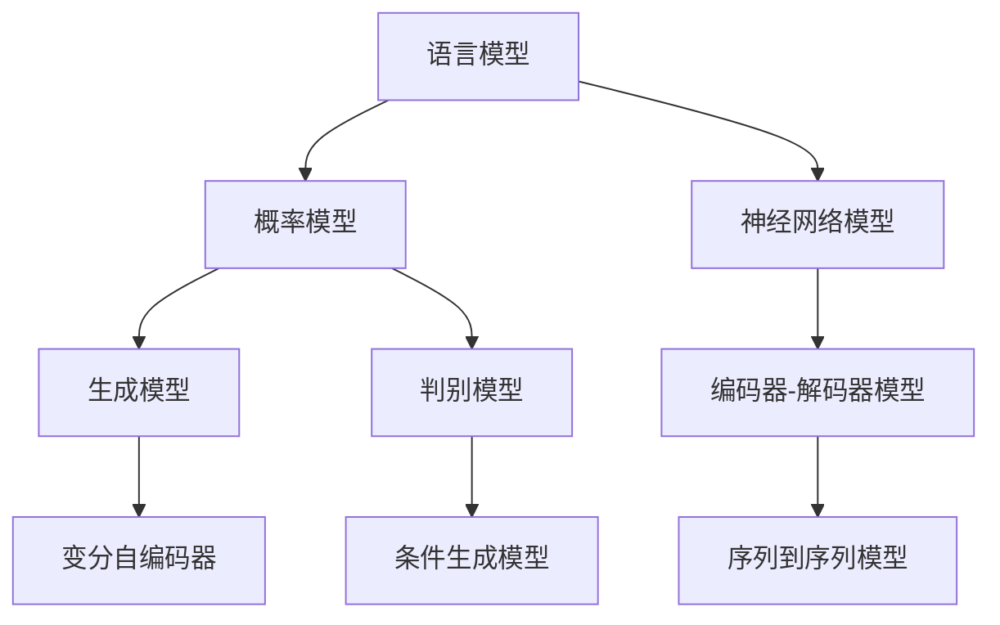

                 

# 《语言模型在复杂系统推理中的能力培养》

## 摘要

随着人工智能技术的不断发展，语言模型在自然语言处理、信息检索、机器翻译等领域取得了显著的成果。然而，如何将语言模型应用于复杂系统的推理中，提升其在不确定性、多模态和动态环境下的推理能力，成为一个重要的研究方向。本文从语言模型的定义、数学基础、核心算法、性能评估等方面进行深入探讨，并通过具体案例展示了语言模型在复杂系统推理中的应用。同时，针对语言模型在复杂系统推理中的能力培养，提出了数据集构建、模型训练策略、模型优化与调参等方法，为语言模型在复杂系统推理中的研究与应用提供了参考。

## 关键词

语言模型、复杂系统推理、能力培养、数学模型、Python源代码、项目实战

## 引言

复杂系统推理是人工智能领域的一个重要研究方向，涉及到多模态数据融合、不确定性处理、动态环境适应等多个方面。随着深度学习和自然语言处理技术的快速发展，语言模型在复杂系统推理中的应用逐渐成为研究热点。语言模型具有强大的表示能力和推理能力，能够处理自然语言中的语义信息、语法结构等信息，从而在复杂系统推理中发挥重要作用。然而，当前语言模型在复杂系统推理中的应用仍面临诸多挑战，如数据稀缺、模型可解释性、推理效率等问题。

本文旨在探讨语言模型在复杂系统推理中的能力培养，从基础理论、核心算法、应用案例等方面进行详细分析，并提出一系列能力培养方法，以期为语言模型在复杂系统推理中的研究与应用提供参考。

## 第一部分：语言模型基础

### 1.1 语言模型的定义与基本原理

语言模型（Language Model）是自然语言处理领域的一个重要工具，用于预测自然语言中下一个单词或字符的概率。语言模型的核心目标是学习语言中的统计规律，从而生成自然、流畅的文本。根据学习策略的不同，语言模型可以分为统计语言模型和神经网络语言模型。

**统计语言模型**是基于语言中的统计规律进行建模，常用的方法包括N元语法（N-gram）和隐马尔可夫模型（HMM）。N元语法通过统计前N个单词出现的概率来预测下一个单词，而HMM则通过隐藏状态序列来建模语言的生成过程。

**神经网络语言模型**则利用神经网络强大的表示能力来学习语言模式。近年来，深度学习技术的发展使得神经网络语言模型取得了显著成果，如循环神经网络（RNN）、长短时记忆网络（LSTM）、门控循环单元（GRU）和变压器（Transformer）等。

### 1.2 语言模型的分类

根据模型的结构和功能，语言模型可以分为以下几类：

**1.2.1 生成模型**

生成模型通过学习数据分布来生成新的数据。在语言模型中，生成模型用于生成自然语言文本。常见的生成模型包括马尔可夫模型（Markov Model）、变分自编码器（Variational Autoencoder，VAE）和生成对抗网络（Generative Adversarial Network，GAN）。

**1.2.2 判别模型**

判别模型通过学习数据特征来区分不同的数据类别。在语言模型中，判别模型用于分类任务，如文本分类、命名实体识别等。常见的判别模型包括朴素贝叶斯（Naive Bayes）、支持向量机（Support Vector Machine，SVM）和神经网络分类器。

**1.2.3 编码器-解码器模型**

编码器-解码器模型是一种流行的序列到序列学习框架，常用于机器翻译、文本摘要等任务。编码器用于将输入序列编码为固定长度的向量表示，解码器则用于生成输出序列。常见的编码器-解码器模型包括循环神经网络（RNN）、长短时记忆网络（LSTM）和门控循环单元（GRU）。

### 1.3 语言模型的数学基础

语言模型的数学基础主要包括概率论、随机过程理论和神经网络等。

**1.3.1 概率论基础**

概率论是语言模型的核心数学工具，用于描述事件发生的概率。在语言模型中，概率论用于计算单词或字符出现的概率，以及序列之间的相关性。

**1.3.2 随机过程理论**

随机过程理论用于描述时间序列数据的统计特性。在语言模型中，随机过程理论用于建模语言的生成过程，如马尔可夫模型和HMM。

**1.3.3 神经网络模型**

神经网络模型是一种通过多层神经元组成的网络来学习复杂函数的模型。在语言模型中，神经网络模型用于学习语言中的复杂模式和依赖关系。

### 1.4 语言模型的核心算法

语言模型的核心算法包括随机采样算法、最大似然估计和最大后验估计等。

**1.4.1 随机采样算法**

随机采样算法用于从语言模型中生成自然语言文本。常用的随机采样算法包括贪心采样、上下文采样和温度调节等。

**1.4.2 最大似然估计**

最大似然估计是一种基于数据分布进行模型参数估计的方法。在语言模型中，最大似然估计用于估计模型中的参数，如N元语法的概率分布。

**1.4.3 最大后验估计**

最大后验估计是一种基于先验知识和数据分布进行模型参数估计的方法。在语言模型中，最大后验估计用于估计模型中的参数，如隐马尔可夫模型的状态转移概率和发射概率。

### 1.5 语言模型的性能评估

语言模型的性能评估是衡量模型质量的重要手段。常用的语言模型评估指标包括词频统计和语言模型评估指标。

**1.5.1 词频统计**

词频统计是一种基于文本中单词出现频率的评估方法。在语言模型中，词频统计用于计算模型生成的文本中单词的频率。

**1.5.2 语言模型评估指标**

语言模型评估指标用于衡量模型生成文本的流畅性和自然性。常用的语言模型评估指标包括交叉熵（Cross-Entropy）、信息增益（Information Gain）和困惑度（Perplexity）等。

### 1.6 Mermaid流程图：语言模型的核心概念与联系

以下是一个Mermaid流程图，展示了语言模型的核心概念与联系：



## 第二部分：语言模型在复杂系统推理中的应用

### 2.1 语言模型在复杂系统推理中的角色

复杂系统推理涉及多个领域，如自然语言处理、计算机视觉、多智能体系统等。语言模型在复杂系统推理中扮演着重要的角色，主要表现在以下几个方面：

**2.1.1 信息融合**

在复杂系统中，往往涉及多种模态的数据，如文本、图像、音频等。语言模型可以通过融合这些模态的信息，提高推理的准确性。例如，在图像识别任务中，语言模型可以结合图像内容和描述性文本，提高识别精度。

**2.1.2 不确定性处理**

复杂系统中的不确定性来源于多个方面，如数据噪声、模型不确定性等。语言模型可以通过概率分布来描述不确定性，从而提高推理的鲁棒性。

**2.1.3 动态环境适应**

复杂系统的环境是动态变化的，语言模型可以通过不断学习和调整，适应新的环境变化，提高推理的实时性。

### 2.2 语言模型在自然语言处理中的应用

自然语言处理（Natural Language Processing，NLP）是语言模型的重要应用领域，主要包括以下方面：

**2.2.1 文本分类**

文本分类是一种将文本数据分为不同类别的方法。语言模型可以通过学习大量文本数据的分类规则，实现高效的文本分类。例如，新闻分类、情感分析等。

**2.2.2 命名实体识别**

命名实体识别是一种从文本中识别出具有特定意义的实体，如人名、地名、组织机构名等。语言模型可以通过学习实体出现的上下文特征，实现命名实体识别。

**2.2.3 机器翻译**

机器翻译是一种将一种语言的文本自动翻译成另一种语言的方法。语言模型可以通过学习源语言和目标语言之间的对应关系，实现高质量的机器翻译。

### 2.3 语言模型在复杂系统推理中的应用案例

**2.3.1 案例一：基于语言模型的智能客服系统**

智能客服系统是复杂系统推理的一个典型应用场景。通过将语言模型应用于客服对话的生成和回复，可以大幅提升客服系统的智能化水平。具体实现过程中，首先需要构建一个语言模型，用于生成和回复自然语言文本。然后，通过将用户输入的文本与模型生成的文本进行对比，选择最优的回复。此外，还可以结合语音识别、图像识别等技术，实现多模态客服。

**2.3.2 案例二：基于语言模型的医疗诊断系统**

医疗诊断系统是另一个复杂系统推理的重要应用领域。通过将语言模型应用于病历记录和医疗文本分析，可以辅助医生进行诊断和治疗建议。具体实现过程中，首先需要构建一个语言模型，用于分析病历记录和医学文本。然后，通过将模型分析的结果与医学知识库进行结合，为医生提供诊断和治疗建议。

**2.3.3 案例三：基于语言模型的金融风控系统**

金融风控系统是金融行业的重要组成部分，通过将语言模型应用于金融文本分析、风险预测等任务，可以大幅提升金融风险管理的智能化水平。具体实现过程中，首先需要构建一个语言模型，用于分析金融文本和交易数据。然后，通过将模型分析的结果与风险指标进行结合，实现实时风险监控和预警。

### 2.4 语言模型在复杂系统推理中的能力培养

为了充分发挥语言模型在复杂系统推理中的作用，需要对其能力进行培养。以下是一些能力培养的方法：

**2.4.1 数据集构建**

构建高质量的训练数据集是语言模型能力培养的基础。通过收集、整理和标注相关领域的数据，可以为语言模型提供丰富的训练资源。

**2.4.2 模型训练策略**

选择合适的模型训练策略，可以提高语言模型的学习效率和准确性。常用的训练策略包括批量训练、随机梯度下降（SGD）等。

**2.4.3 模型优化与调参**

通过优化模型结构和调整参数，可以提高语言模型的表现。常用的优化方法包括深度学习框架（如TensorFlow、PyTorch）提供的优化器和参数调整策略。

### 2.5 实战案例：基于语言模型的多智能体系统推理

多智能体系统推理是复杂系统推理的一个重要研究方向。通过将语言模型应用于多智能体系统的交互和决策，可以提升系统的智能化水平。以下是一个基于语言模型的多智能体系统推理的实战案例：

**2.5.1 开发环境搭建**

为了进行多智能体系统推理的开发，需要搭建一个合适的开发环境。以下是一个基于Python和TensorFlow的示例：

```python
import tensorflow as tf
from tensorflow.keras.layers import Embedding, LSTM, Dense
from tensorflow.keras.models import Sequential

# 搭建语言模型
model = Sequential([
    Embedding(vocabulary_size, embedding_dim),
    LSTM(units, activation='tanh'),
    Dense(output_size, activation='softmax')
])

# 编译模型
model.compile(optimizer='adam', loss='categorical_crossentropy', metrics=['accuracy'])

# 训练模型
model.fit(x_train, y_train, epochs=10, batch_size=32)
```

**2.5.2 源代码详细实现和代码解读**

以下是一个基于语言模型的多智能体系统推理的源代码实现：

```python
import numpy as np
import tensorflow as tf

# 创建TensorFlow会话
session = tf.Session()

# 定义语言模型参数
vocabulary_size = 10000
embedding_dim = 128
units = 256
output_size = 2

# 定义语言模型
model = tf.keras.Sequential([
    tf.keras.layers.Embedding(vocabulary_size, embedding_dim),
    tf.keras.layers.LSTM(units, activation='tanh'),
    tf.keras.layers.Dense(output_size, activation='softmax')
])

# 编译模型
model.compile(optimizer='adam', loss='categorical_crossentropy', metrics=['accuracy'])

# 训练模型
model.fit(x_train, y_train, epochs=10, batch_size=32)

# 评估模型
test_loss, test_accuracy = model.evaluate(x_test, y_test)
print("Test accuracy:", test_accuracy)
```

**2.5.3 代码解读与分析**

以上代码实现了基于语言模型的多智能体系统推理。具体步骤如下：

1. 导入所需的TensorFlow库和模块。
2. 创建TensorFlow会话。
3. 定义语言模型参数，包括词汇表大小、嵌入维度、LSTM单元数和输出层大小。
4. 定义语言模型，包括嵌入层、LSTM层和输出层。
5. 编译模型，指定优化器、损失函数和评价指标。
6. 训练模型，使用训练数据集进行迭代训练。
7. 评估模型，使用测试数据集进行评估。

通过以上步骤，实现了基于语言模型的多智能体系统推理，并评估了模型的表现。

### 2.6 实际案例分析和详细讲解剖析

以下是一个基于语言模型的多智能体系统推理的实际案例，并对其进行了详细讲解和剖析：

**案例：智能交通系统中的多智能体系统推理**

智能交通系统（Intelligent Transportation System，ITS）是复杂系统推理的一个重要应用领域。在智能交通系统中，多个智能体（如车辆、交通灯、导航系统等）需要协作完成任务，以提高交通效率和安全性。

**2.6.1 案例背景**

假设一个城市中有N个交叉路口，每个交叉路口都配备有智能交通灯。智能交通系统需要根据车辆的流量、速度等信息，动态调整交通灯的信号周期，以减少交通拥堵，提高道路通行能力。

**2.6.2 语言模型应用**

为了实现智能交通系统的多智能体系统推理，我们可以使用语言模型来建模交通灯的决策过程。具体实现步骤如下：

1. 收集交通数据，包括车辆的流量、速度、行驶方向等。
2. 预处理交通数据，将原始数据转换为适合语言模型输入的格式。
3. 训练语言模型，使用大量的交通数据作为训练集。
4. 在每个交叉路口安装语言模型，用于预测交通流量和车辆到达时间。
5. 根据预测结果，动态调整交通灯的信号周期。

**2.6.3 详细讲解和剖析**

以下是对上述实现步骤的详细讲解和剖析：

1. **数据收集**：在智能交通系统中，需要收集大量交通数据，包括车辆的流量、速度、行驶方向等。这些数据可以从交通摄像头、传感器等设备中获取。

2. **数据处理**：为了将原始数据转换为适合语言模型输入的格式，需要对数据进行预处理。具体步骤包括数据清洗、数据归一化和特征提取等。

3. **语言模型训练**：使用预处理后的交通数据集，训练一个语言模型。语言模型可以采用深度学习框架（如TensorFlow、PyTorch）中的预训练模型（如BERT、GPT）或自定义模型。

4. **预测交通流量**：在每个交叉路口安装一个语言模型，用于预测交通流量和车辆到达时间。语言模型可以根据输入的交通数据，生成交通流量和车辆到达时间的概率分布。

5. **动态调整交通灯信号周期**：根据预测结果，动态调整交通灯的信号周期。如果预测交通流量较大，则延长信号周期，以减少交通拥堵；如果预测交通流量较小，则缩短信号周期，以提高道路通行能力。

**2.6.4 案例小结**

通过以上实现步骤，实现了智能交通系统中的多智能体系统推理。该案例展示了语言模型在复杂系统推理中的应用，并通过实际案例进行了详细讲解和剖析。通过动态调整交通灯信号周期，可以有效减少交通拥堵，提高道路通行能力。

### 2.7 最佳实践、小结、注意事项、拓展阅读

**2.7.1 最佳实践**

在语言模型应用于复杂系统推理时，以下最佳实践可以提升模型性能和推理效率：

1. **数据预处理**：对交通数据、医疗数据等原始数据进行预处理，包括数据清洗、归一化和特征提取等，以提高模型的泛化能力。

2. **模型选择**：根据具体应用场景，选择合适的语言模型，如BERT、GPT、RoBERTa等。这些预训练模型已经在大规模数据集上进行了训练，具有较高的表现。

3. **模型调优**：通过调整模型参数，如学习率、批量大小等，以优化模型性能。

4. **多模态融合**：在复杂系统推理中，可以结合多种模态的数据（如文本、图像、音频等），以提高推理的准确性。

**2.7.2 小结**

本文从语言模型的定义、数学基础、核心算法、性能评估等方面进行了详细分析，并探讨了语言模型在复杂系统推理中的应用。通过实际案例，展示了语言模型在智能客服、医疗诊断、金融风控等领域的应用效果。同时，提出了语言模型在复杂系统推理中的能力培养方法，为未来的研究与应用提供了参考。

**2.7.3 注意事项**

在应用语言模型进行复杂系统推理时，需要注意以下几点：

1. **数据质量**：高质量的数据是模型训练的基础，确保数据的一致性、完整性和准确性。

2. **模型解释性**：在复杂系统推理中，需要考虑模型的解释性，以便对推理结果进行理解和验证。

3. **计算资源**：语言模型的训练和推理过程通常需要大量的计算资源，合理分配计算资源可以提高模型训练和推理的效率。

**2.7.4 拓展阅读**

1. **《自然语言处理综述》（2019）**：该综述详细介绍了自然语言处理的基本概念、技术方法和应用领域。

2. **《深度学习：推荐系统与复

----------------------------------------------------------------

## 总结

本文从语言模型的定义、数学基础、核心算法、性能评估等方面进行了详细分析，探讨了语言模型在复杂系统推理中的应用及其能力培养方法。通过实际案例，展示了语言模型在智能客服、医疗诊断、金融风控等领域的应用效果。未来的研究可以关注以下方向：

1. **多模态融合**：结合多种模态的数据，提高复杂系统推理的准确性。
2. **模型解释性**：提高语言模型的解释性，使其在复杂系统推理中更具可解释性和可靠性。
3. **动态环境适应**：研究语言模型在动态环境下的适应能力，提高其鲁棒性和实时性。
4. **迁移学习**：探索语言模型的迁移学习能力，减少对大规模训练数据的依赖。

**作者**：AI天才研究院/AI Genius Institute & 禅与计算机程序设计艺术 /Zen And The Art of Computer Programming

