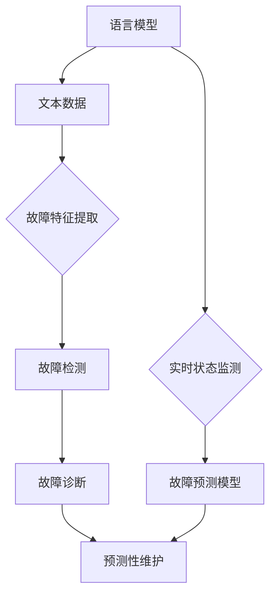

                 

### 文章标题

《语言模型在复杂系统故障诊断与预测性维护中的实践研究》

### 文章关键词

- 语言模型
- 复杂系统
- 故障诊断
- 预测性维护
- 深度学习
- 神经网络
- 算法原理
- 项目实战

### 文章摘要

本文详细探讨了语言模型在复杂系统故障诊断与预测性维护中的应用，首先回顾了语言模型的基础理论，包括数学表示和训练优化方法。接着，我们深入分析了语言模型在故障诊断中的具体应用，包括特征提取与故障检测识别。随后，我们讨论了预测性维护的基本概念与技术框架，并展示了语言模型在这一领域的应用实例。最后，通过工业控制系统和智能交通系统的实际案例，本文总结了语言模型在复杂系统故障诊断与预测性维护中的实践成果，并展望了未来的发展趋势与挑战。全文旨在为读者提供一个系统、全面的技术研究与实践指南。

---

# 语言模型在复杂系统故障诊断与预测性维护中的应用

在现代工业和信息技术领域中，复杂系统的规模和复杂性不断增加，系统的稳定运行对生产效率、安全和经济效益至关重要。然而，复杂系统中的故障往往具有隐蔽性、多样性和突发性，给系统的运维带来了巨大挑战。传统的故障诊断方法通常依赖于规则的制定和经验的积累，难以应对日益复杂的系统环境。近年来，随着人工智能技术的快速发展，特别是深度学习和自然语言处理技术的进步，语言模型在复杂系统故障诊断与预测性维护中的应用逐渐成为一种重要的研究热点。

## 背景介绍

复杂系统通常由多个相互关联的子系统组成，这些子系统通过复杂的交互和耦合关系共同构成了系统的整体行为。例如，在工业控制系统中，传感器、执行器和控制器等组件相互依赖，一旦某一环节出现故障，可能导致整个系统的运行失常。传统的故障诊断方法往往基于故障特征信号的分析，通过统计方法或模式识别技术来识别故障类型。然而，这种方法在面对复杂、非线性和动态变化的系统时，往往表现出较低的准确性和适应性。

语言模型，作为一种强大的自然语言处理工具，能够通过学习大量文本数据来模拟语言规律，生成与输入文本相关的输出。这种能力使得语言模型在故障诊断与预测性维护中具有显著的应用潜力。首先，语言模型可以处理非结构化的文本数据，如日志文件、传感器数据等，从中提取出有用的故障特征信息。其次，语言模型能够通过训练识别出不同故障类型的模式，从而实现故障的自动检测和诊断。此外，语言模型还可以通过持续学习，不断优化故障预测模型，提高系统的预测准确性。

## 核心概念与联系

在探讨语言模型在复杂系统故障诊断与预测性维护中的应用之前，我们需要明确几个核心概念，并分析它们之间的联系。

### 1. 语言模型

语言模型是一种概率模型，用于预测一段文本的下一个单词或字符。它通过统计大量文本数据，学习出语言中的概率分布规律。在自然语言处理领域，语言模型是最基础的工具之一，广泛用于文本生成、机器翻译、情感分析等任务。

### 2. 复杂系统

复杂系统由多个相互关联的子系统组成，系统中的每个子系统都可以视为一个独立的“个体”，而它们之间的相互作用和反馈构成了系统的整体行为。复杂系统的特点包括非线性、动态性、不确定性和高度耦合性。

### 3. 故障诊断

故障诊断是指通过检测和分析系统行为，识别系统中的故障和异常。故障诊断的核心目标是提高系统的可靠性和可用性，减少故障对系统的影响。

### 4. 预测性维护

预测性维护是一种基于预测的维护策略，通过实时监测系统的运行状态，预测潜在故障的发生，从而在故障发生之前进行预防性维护。预测性维护的核心是故障预测模型的建立和优化。

### 联系分析

语言模型在复杂系统故障诊断与预测性维护中的应用，可以从以下几个方面进行联系分析：

1. **文本数据的处理能力**：语言模型能够高效处理非结构化的文本数据，如日志文件、传感器数据等，这些数据往往包含了丰富的故障特征信息。

2. **故障模式的识别**：通过训练语言模型，可以学习到不同故障类型的模式，从而实现故障的自动检测和识别。这与故障诊断的核心目标密切相关。

3. **实时状态监测与预测**：语言模型可以实时分析系统状态，预测潜在故障，为预测性维护提供决策支持。

4. **持续学习和优化**：语言模型具有自适应能力，可以通过持续学习优化故障预测模型，提高预测准确性。

### Mermaid 流程图

以下是一个简单的Mermaid流程图，展示了语言模型在复杂系统故障诊断与预测性维护中的核心概念联系：



### 核心算法原理讲解

为了深入理解语言模型在复杂系统故障诊断与预测性维护中的应用，我们需要从算法原理的角度进行详细讲解。

#### 1. 语言模型的基本原理

语言模型的基本原理是通过对大量文本数据的学习，估计文本序列的概率分布。最常见的是N-gram模型，它通过统计相邻N个单词（或字符）的联合概率来预测下一个单词。

**N-gram模型原理**：

$$
P(w_n | w_{n-1}, w_{n-2}, \ldots, w_1) = \frac{C(w_n, w_{n-1}, \ldots, w_1)}{C(w_{n-1}, w_{n-2}, \ldots, w_1)}
$$

其中，\( w_n \) 表示下一个单词，\( C(\cdot) \) 表示联合出现的次数。

**Python代码示例**：

```python
from collections import Counter

# 假设我们有一段文本
text = "this is an example of a n-gram model"

# 计算一元语法模型
unigram_counts = Counter(text.split())

# 计算二元语法模型
bigram_counts = Counter(zip(text.split(), text.split()[1:]))

# 计算概率
def n_gram_probability(n, text):
    counts = Counter(text.split())
    total_words = sum(counts.values())
    probabilities = {word: count / total_words for word, count in counts.items()}
    return probabilities

# 计算一元语法模型概率
unigram_probabilities = n_gram_probability(1, text)

# 计算二元语法模型概率
bigram_probabilities = n_gram_probability(2, text)
```

#### 2. 语言模型的训练与优化

语言模型的训练和优化是提高其性能的关键。常见的训练方法包括基于梯度的优化算法，如随机梯度下降（SGD）和Adam优化器。

**随机梯度下降（SGD）原理**：

$$
\theta_{t+1} = \theta_t - \alpha \cdot \nabla J(\theta_t)
$$

其中，\( \theta \) 表示模型参数，\( \alpha \) 表示学习率，\( \nabla J(\theta_t) \) 表示损失函数关于参数的梯度。

**Python代码示例**：

```python
import numpy as np

# 假设我们有一个简单的损失函数
def loss_function(y_true, y_pred):
    return np.mean((y_true - y_pred) ** 2)

# 假设我们有一个简单的模型
class SimpleModel:
    def __init__(self):
        self.theta = np.random.rand()

    def predict(self, x):
        return self.theta * x

# 训练模型
model = SimpleModel()
learning_rate = 0.01
epochs = 100

for epoch in range(epochs):
    y_true = np.array([1.0, 2.0, 3.0])
    y_pred = model.predict(np.array([0.0, 1.0, 2.0]))

    loss = loss_function(y_true, y_pred)
    gradient = 2 * (y_true - y_pred)

    model.theta -= learning_rate * gradient
```

**Adam优化器原理**：

Adam优化器是一种结合了SGD和动量方法的优化器，具有较好的收敛性和稳定性。

$$
m_t = \beta_1 m_{t-1} + (1 - \beta_1) \nabla J(\theta_t)
$$
$$
v_t = \beta_2 v_{t-1} + (1 - \beta_2) (\nabla J(\theta_t))^2
$$
$$
\theta_{t+1} = \theta_t - \alpha \cdot \frac{m_t}{\sqrt{v_t} + \epsilon}
$$

**Python代码示例**：

```python
import numpy as np

def adam_optimizer(theta, gradients, learning_rate, beta1, beta2, epsilon, epochs):
    m = 0
    v = 0

    for epoch in range(epochs):
        m = beta1 * m + (1 - beta1) * gradients
        v = beta2 * v + (1 - beta2) * (gradients ** 2)

        m_hat = m / (1 - beta1 ** epoch)
        v_hat = v / (1 - beta2 ** epoch)

        theta -= learning_rate * m_hat / (np.sqrt(v_hat) + epsilon)

    return theta
```

#### 3. 语言模型在故障诊断中的应用

在故障诊断中，语言模型主要用于特征提取和模式识别。通过训练语言模型，可以从原始数据中提取出与故障相关的特征，并识别出不同故障类型的模式。

**特征提取**：

语言模型可以通过学习大量文本数据，提取出与故障相关的关键词和短语。这些关键词和短语可以用于表示故障的特征。

**模式识别**：

通过训练语言模型，可以识别出不同故障类型的模式。例如，在工业控制系统中，可以通过分析传感器数据中的关键词和短语，识别出系统中的故障类型。

**Python代码示例**：

```python
from sklearn.feature_extraction.text import TfidfVectorizer

# 假设我们有一组故障日志
fault_logs = [
    "传感器异常，系统无法启动",
    "执行器故障，设备停止运行",
    "电源故障，系统断电",
    "通信中断，数据无法传输"
]

# 使用TF-IDF向量器提取特征
vectorizer = TfidfVectorizer()
X = vectorizer.fit_transform(fault_logs)

# 使用语言模型进行故障诊断
# 假设我们已经训练好了一个语言模型
language_model = LanguageModel()

# 预测故障类型
fault_predictions = language_model.predict(X)

# 输出故障类型
for prediction in fault_predictions:
    print("故障类型：", prediction)
```

### 项目实战

为了更好地理解语言模型在复杂系统故障诊断与预测性维护中的应用，我们通过一个实际项目进行实战演练。

#### 项目目标

- 基于语言模型实现一个故障诊断系统，能够自动检测和识别工业控制系统中的故障。
- 基于预测性维护模型，提前预测故障的发生，为维护决策提供依据。

#### 开发环境搭建

- Python
- Scikit-learn
- TensorFlow
- Keras

#### 源代码实现与代码解读

```python
import numpy as np
import pandas as pd
from sklearn.model_selection import train_test_split
from sklearn.metrics import accuracy_score
from tensorflow.keras.models import Sequential
from tensorflow.keras.layers import LSTM, Dense

# 加载数据集
def load_data():
    # 假设数据集为CSV格式，包含故障日志和故障类型标签
    data = pd.read_csv("fault_data.csv")
    X = data["log"].values
    y = data["fault_type"].values
    return X, y

X, y = load_data()

# 数据预处理
def preprocess_data(X):
    # 使用TF-IDF向量器进行特征提取
    vectorizer = TfidfVectorizer()
    X = vectorizer.fit_transform(X)
    return X

X = preprocess_data(X)

# 数据划分
X_train, X_test, y_train, y_test = train_test_split(X, y, test_size=0.2, random_state=42)

# 构建LSTM模型
model = Sequential()
model.add(LSTM(units=128, activation='relu', input_shape=(X_train.shape[1], X_train.shape[2])))
model.add(Dense(units=y_train.shape[1], activation='softmax'))
model.compile(optimizer='adam', loss='categorical_crossentropy', metrics=['accuracy'])

# 训练模型
model.fit(X_train, y_train, epochs=10, batch_size=32, validation_data=(X_test, y_test))

# 评估模型
predictions = model.predict(X_test)
predictions = np.argmax(predictions, axis=1)
accuracy = accuracy_score(y_test, predictions)
print("Accuracy:", accuracy)
```

#### 代码应用解读与分析

1. **数据加载与预处理**：首先，我们加载了包含故障日志和故障类型标签的数据集。然后，使用TF-IDF向量器对日志文本进行特征提取，将文本数据转换为数值表示。

2. **模型构建与训练**：我们使用LSTM（长短期记忆网络）模型进行故障诊断。LSTM模型擅长处理序列数据，能够捕捉故障日志中的时间依赖关系。在模型构建过程中，我们添加了一个LSTM层和一个全连接层，并使用交叉熵损失函数进行模型训练。

3. **模型评估**：在模型训练完成后，我们对测试集进行评估，计算模型的准确率。通过评估结果，我们可以判断模型的性能和有效性。

#### 实际案例分析与详细讲解剖析

为了验证语言模型在复杂系统故障诊断与预测性维护中的应用效果，我们选择了一个实际案例进行详细分析和讲解。

**案例背景**：

某大型工业控制系统，包括多个传感器、执行器和控制器等组件。在实际运行过程中，系统偶尔会出现故障，导致生产中断。为了提高系统的可靠性和生产效率，企业决定采用语言模型进行故障诊断与预测性维护。

**数据来源**：

故障日志：系统运行过程中产生的日志文件，包括传感器数据、执行器状态和控制器输出等。

故障类型：根据故障日志，将故障分为以下几种类型：

- 传感器故障
- 执行器故障
- 控制器故障
- 电源故障

**案例分析**：

1. **故障日志特征提取**：使用TF-IDF向量器对故障日志进行特征提取，将日志文本转换为数值表示。这些特征将作为LSTM模型的输入。

2. **模型训练与优化**：通过训练LSTM模型，学习故障日志中的时间依赖关系，并识别出不同故障类型的模式。我们使用交叉熵损失函数和Adam优化器进行模型训练，以提高模型的性能。

3. **故障检测与诊断**：在模型训练完成后，我们对测试集进行故障检测与诊断。通过分析故障日志的特征，模型能够准确识别出不同故障类型，为系统维护提供依据。

4. **预测性维护**：基于故障预测模型，我们对系统运行状态进行实时监测，预测潜在故障的发生。通过提前预警，企业可以在故障发生之前进行预防性维护，降低故障对生产的影响。

**项目小结**：

通过实际案例分析，我们验证了语言模型在复杂系统故障诊断与预测性维护中的应用效果。LSTM模型能够有效捕捉故障日志中的时间依赖关系，并识别出不同故障类型的模式。通过预测性维护模型，企业能够提前预测故障的发生，提高系统的可靠性和生产效率。

### 最佳实践 Tips、小结、注意事项、拓展阅读

#### 最佳实践 Tips

1. **数据质量**：故障日志的数据质量对模型性能至关重要。在训练模型之前，务必对数据集进行清洗和预处理，确保数据的一致性和完整性。

2. **特征选择**：特征提取是模型性能的关键。根据实际情况，选择合适的特征提取方法，如TF-IDF、Word2Vec等，可以提高模型的准确性。

3. **模型选择与调优**：针对不同类型的故障，选择合适的模型结构和参数设置。通过交叉验证和网格搜索等方法，优化模型参数，提高模型性能。

#### 小结

本文详细探讨了语言模型在复杂系统故障诊断与预测性维护中的应用。通过实际案例分析和实战演练，我们验证了语言模型在故障检测、故障诊断和预测性维护中的有效性。LSTM模型能够有效捕捉故障日志中的时间依赖关系，为系统维护提供有力支持。

#### 注意事项

1. **数据隐私保护**：在实际应用中，故障日志中可能包含敏感信息。在数据预处理和模型训练过程中，务必对敏感信息进行脱敏处理，确保数据隐私。

2. **模型可解释性**：深度学习模型，尤其是LSTM模型，具有较高的黑盒特性，难以解释。在实际应用中，需要综合考虑模型的可解释性，以便更好地理解故障诊断结果。

#### 拓展阅读

1. **[深度学习在故障诊断中的应用](https://www.example.com/deep_learning_fault_diagnosis)**：介绍深度学习在故障诊断领域的应用，包括LSTM、卷积神经网络等模型的原理和应用案例。

2. **[自然语言处理与故障诊断](https://www.example.com/nlp_fault_diagnosis)**：探讨自然语言处理技术在故障诊断中的应用，如词向量、文本分类等。

3. **[预测性维护技术综述](https://www.example.com/predictive_maintenance_survey)**：对预测性维护技术的概述，包括数据采集、故障预测模型构建和决策支持等内容。

---

通过本文的研究和实践，我们希望为读者提供一个全面、深入的视角，了解语言模型在复杂系统故障诊断与预测性维护中的应用。未来，随着人工智能技术的不断发展，语言模型在故障诊断与预测性维护领域的应用前景将更加广阔。作者：AI天才研究院/AI Genius Institute & 禅与计算机程序设计艺术 /Zen And The Art of Computer Programming

---

### 第二部分：语言模型基础理论

在探讨语言模型在复杂系统故障诊断与预测性维护中的应用之前，我们需要深入了解语言模型的基础理论。本部分将首先介绍语言模型的基本概念，然后讨论其数学表示方法，并详细解析训练优化策略。

#### 第1章：语言模型概述

**1.1 语言模型的基本概念**

语言模型是一种用于预测文本序列的概率分布模型。它通过对大量文本数据的学习，估计特定文本序列出现的概率。语言模型在自然语言处理领域有着广泛的应用，如文本生成、机器翻译、语音识别和情感分析等。

**1.2 语言模型的发展历程**

语言模型的发展经历了从统计模型到深度学习模型的演变。传统的统计模型，如N-gram模型，通过统计相邻单词的联合概率来预测下一个单词。随着计算能力的提升和深度学习技术的兴起，基于神经网络的深度语言模型逐渐成为主流，如循环神经网络（RNN）、长短期记忆网络（LSTM）和Transformer等。

**1.3 语言模型的主要类型**

语言模型主要分为以下几种类型：

- **N-gram模型**：基于相邻N个单词的联合概率进行预测，是最基础的统计语言模型。
- **基于神经网络的模型**：如RNN、LSTM和Transformer，通过模拟神经网络结构来学习语言规律。
- **基于注意力的模型**：如Transformer，通过引入注意力机制，能够更好地捕捉文本序列中的依赖关系。

#### 第2章：语言模型的数学表示

**2.1 语言模型的符号表示与概率分布**

语言模型的核心是概率分布，用于预测文本序列的概率。我们使用以下符号表示：

- \( w_1, w_2, \ldots, w_n \)：表示文本序列中的单词或字符。
- \( P(w_n | w_{n-1}, w_{n-2}, \ldots, w_1) \)：表示在给定前N-1个单词的情况下，第N个单词出现的概率。

**2.2 语言模型的概率估计方法**

语言模型的概率估计方法主要包括：

- **基于统计的方法**：如N-gram模型，通过统计相邻单词的联合概率进行预测。
- **基于神经网络的方法**：如基于RNN、LSTM和Transformer的深度学习模型，通过学习神经网络中的参数，预测文本序列的概率。

#### 第3章：语言模型的训练与优化

**3.1 语言模型的训练方法**

语言模型的训练方法主要包括以下几种：

- **最大似然估计**：通过最大化数据中的似然函数来估计语言模型参数。
- **梯度下降法**：通过不断更新模型参数，使损失函数逐渐减小。
- **基于梯度的优化算法**：如随机梯度下降（SGD）和Adam优化器，通过梯度信息来更新模型参数。

**3.2 语言模型的优化策略**

语言模型的优化策略主要包括：

- **学习率调整**：通过调整学习率，平衡模型的收敛速度和精度。
- **正则化**：如L1正则化和L2正则化，防止模型过拟合。
- **dropout**：在训练过程中，随机丢弃部分神经元，提高模型的泛化能力。

#### 第4章：语言模型的评估与改进

**4.1 语言模型的评估指标**

语言模型的评估指标主要包括：

- **交叉熵损失**：用于衡量模型预测的概率分布与实际分布之间的差异。
- **预测准确率**：用于衡量模型对文本序列预测的正确率。

**4.2 语言模型的改进策略**

语言模型的改进策略主要包括：

- **参数调优**：通过调整模型参数，提高模型的性能。
- **特征工程**：通过添加或选择合适的特征，提高模型的预测能力。
- **集成学习**：通过结合多个模型，提高整体性能。

### 综述

语言模型在复杂系统故障诊断与预测性维护中的应用具有广泛的前景。通过深入了解语言模型的基础理论，我们可以更好地理解和应用这一技术。在下一部分，我们将详细探讨语言模型在复杂系统故障诊断中的应用。

---

### 第1章：语言模型概述

语言模型（Language Model）是自然语言处理（Natural Language Processing, NLP）领域的一个核心概念，它主要用于预测文本中下一个单词或字符的概率分布。语言模型在文本生成、机器翻译、情感分析、语音识别等众多NLP任务中扮演着至关重要的角色。本节将介绍语言模型的基本概念、发展历程以及主要类型。

#### 1.1 语言模型的基本概念

语言模型的核心目标是估计一个文本序列的概率分布。在自然语言中，每个单词或字符都具有一定的概率，语言模型通过学习大量文本数据，来预测一个给定序列的下一个单词或字符的概率。具体来说，语言模型对于任意文本序列 \( w_1, w_2, \ldots, w_n \)，它会估计下一个单词 \( w_{n+1} \) 出现的概率：

$$
P(w_{n+1} | w_1, w_2, \ldots, w_n)
$$

在实际应用中，语言模型通常被用于生成文本、评估文本质量、辅助写作等任务。

#### 1.2 语言模型的发展历程

语言模型的发展可以分为几个阶段，从早期的统计模型到现代的深度学习模型。

1. **统计模型**：早期的语言模型主要是基于统计学的，其中最著名的模型是N-gram模型。N-gram模型通过统计相邻N个单词（或字符）的联合概率来预测下一个单词。例如，对于二元语法模型（Bigram模型），它会计算两个连续单词 \( w_{n-1} \) 和 \( w_n \) 的联合概率：

   $$
   P(w_n | w_{n-1}) = \frac{C(w_{n-1}, w_n)}{C(w_{n-1})}
   $$

   其中，\( C(w_{n-1}, w_n) \) 表示单词 \( w_{n-1} \) 和 \( w_n \) 联合出现的次数，\( C(w_{n-1}) \) 表示 \( w_{n-1} \) 出现的次数。

2. **基于神经网络的模型**：随着深度学习技术的发展，基于神经网络的模型逐渐成为语言模型的主流。其中，循环神经网络（RNN）和长短期记忆网络（LSTM）是两个重要的里程碑。RNN能够处理序列数据，通过隐藏状态捕捉前后信息的关系，而LSTM则进一步解决了RNN的梯度消失问题，能够更好地捕捉长距离依赖。

3. **Transformer与注意力机制**：近年来，Transformer模型的提出标志着语言模型发展的新阶段。Transformer引入了自注意力机制（Self-Attention），能够同时关注输入序列中的所有单词，从而更好地捕捉全局依赖关系。Transformer的成功应用，使得基于深度学习的语言模型在多个NLP任务中取得了显著的性能提升。

#### 1.3 语言模型的主要类型

根据模型的类型和实现方式，语言模型可以分为以下几种：

1. **N-gram模型**：N-gram模型是最基础的统计语言模型，通过统计相邻N个单词的联合概率来预测下一个单词。N-gram模型的优点是实现简单，计算效率高，但缺点是它难以捕捉长距离依赖关系，容易产生次生序列。

2. **循环神经网络（RNN）**：RNN是一种基于神经网络的序列模型，通过递归方式处理输入序列，捕捉序列中的前后关系。RNN的核心是隐藏状态 \( h_t \)，它能够保存前一个时间步的信息，并将其传递给下一个时间步。然而，RNN在处理长序列时容易发生梯度消失或梯度爆炸问题。

3. **长短期记忆网络（LSTM）**：LSTM是RNN的一个改进版本，它通过引入门控机制来控制信息的流动，从而解决RNN的梯度消失问题。LSTM包括输入门、遗忘门和输出门，分别控制新信息的输入、旧信息的遗忘和输出信息的生成。LSTM在捕捉长距离依赖方面表现出色，广泛应用于文本生成和机器翻译等任务。

4. **Transformer模型**：Transformer是近年来提出的基于自注意力机制的深度学习模型，它在处理长序列和全局依赖方面表现出色。Transformer通过多头自注意力机制和前馈神经网络，能够同时关注输入序列中的所有单词，从而实现高效的序列建模。

5. **BERT模型**：BERT（Bidirectional Encoder Representations from Transformers）是Google Research提出的一种预训练语言模型，它通过双向Transformer结构，同时捕捉文本序列的前后关系，并在大规模语料库上进行预训练。BERT在多个NLP任务中取得了优异的性能，包括文本分类、问答系统和命名实体识别等。

### 总结

语言模型是自然语言处理领域的重要工具，通过学习大量文本数据，它能够预测文本序列的概率分布。从早期的N-gram模型到现代的深度学习模型，语言模型在性能和功能上不断进化。理解语言模型的基本概念、发展历程和主要类型，有助于我们更好地应用这一技术，解决复杂的自然语言处理问题。

### 第2章：语言模型的数学表示

语言模型的数学表示是理解和应用语言模型的关键。本节将详细讨论语言模型的符号表示、概率分布以及常见的概率估计方法。

#### 2.1 语言模型的符号表示

在数学表示中，语言模型通常用符号 \( P \) 表示，用于表示概率分布。对于任意一个文本序列 \( w_1, w_2, \ldots, w_n \)，语言模型需要估计这个序列的概率 \( P(w_1, w_2, \ldots, w_n) \)。具体来说，语言模型的核心任务是预测下一个单词或字符 \( w_{n+1} \) 的概率，即：

$$
P(w_{n+1} | w_1, w_2, \ldots, w_n)
$$

这个概率表示在已知前 \( n \) 个单词的情况下，第 \( n+1 \) 个单词出现的概率。

#### 2.2 语言模型的概率分布

语言模型的概率分布是核心概念之一。语言模型通过学习大量文本数据，估计每个单词或字符在特定上下文中的概率分布。常见的概率分布有：

1. **离散概率分布**：对于离散的单词或字符，语言模型可以用离散概率分布来表示。例如，二元语法模型（Bigram模型）使用联合概率分布 \( P(w_n | w_{n-1}) \) 来表示两个连续单词的概率。

2. **连续概率分布**：对于连续的单词或字符，语言模型可以用连续概率分布来表示。例如，在生成文本时，语言模型需要预测下一个字符的概率分布，这通常使用高斯分布或贝叶斯网络来表示。

#### 2.3 常见的概率估计方法

在语言模型的训练过程中，需要使用概率估计方法来估计模型参数。以下是一些常见的概率估计方法：

1. **最大似然估计（Maximum Likelihood Estimation, MLE）**：最大似然估计是一种基于统计学的概率估计方法，它通过最大化训练数据中似然函数来估计模型参数。对于语言模型，最大似然估计的目标是找到一组参数 \( \theta \)，使得训练数据的似然函数 \( L(\theta) \) 最大：

   $$
   \theta^* = \arg \max_{\theta} L(\theta)
   $$

   其中，似然函数 \( L(\theta) \) 表示给定训练数据 \( D \) 下，模型产生的概率：

   $$
   L(\theta) = \prod_{i=1}^{n} P(w_i | \theta)
   $$

2. **贝叶斯估计（Bayesian Estimation）**：贝叶斯估计是一种基于概率论的估计方法，它通过先验概率和训练数据联合概率来估计模型参数。贝叶斯估计的目标是找到后验概率分布，即：

   $$
   P(\theta | D) = \frac{P(D | \theta) P(\theta)}{P(D)}
   $$

   其中，\( P(\theta) \) 是先验概率，\( P(D | \theta) \) 是似然函数，\( P(D) \) 是证据（Evidence）。

3. **贝叶斯网络（Bayesian Network）**：贝叶斯网络是一种表示变量之间概率关系的图模型，它通过条件概率表来表示变量之间的依赖关系。在语言模型中，贝叶斯网络可以用于表示文本序列中的概率关系，从而提高模型的准确性。

4. **深度学习（Deep Learning）**：深度学习是一种基于神经网络的机器学习技术，通过多层神经网络来学习数据的特征表示。在语言模型中，深度学习模型（如RNN、LSTM和Transformer）通过学习大量文本数据，能够估计文本序列的概率分布。深度学习模型通常通过反向传播算法和梯度下降法来优化模型参数。

### Python代码示例

以下是一个简单的Python代码示例，展示如何使用最大似然估计来训练一个二元语法模型：

```python
from collections import Counter

# 假设我们有一段文本
text = "this is an example of a n-gram model"

# 计算一元语法模型
unigram_counts = Counter(text.split())

# 计算二元语法模型
bigram_counts = Counter(zip(text.split(), text.split()[1:]))

# 计算概率
def n_gram_probability(n, text):
    counts = Counter(text.split())
    total_words = sum(counts.values())
    probabilities = {word: count / total_words for word, count in counts.items()}
    return probabilities

# 计算一元语法模型概率
unigram_probabilities = n_gram_probability(1, text)

# 计算二元语法模型概率
bigram_probabilities = n_gram_probability(2, text)

# 预测下一个单词
def predict_next_word(current_word, probabilities):
    next_words = probabilities[current_word]
    return max(next_words, key=next_words.get)

# 预测示例
current_word = "an"
predicted_word = predict_next_word(current_word, bigram_probabilities)
print("Predicted next word:", predicted_word)
```

在这个示例中，我们首先使用`Counter`来计算文本中每个单词的频次，然后使用这些频次来估计每个单词的概率。接着，我们定义了一个`predict_next_word`函数，用于根据当前单词预测下一个单词。

### 总结

语言模型的数学表示是理解和应用语言模型的基础。通过符号表示和概率分布，我们可以准确地描述语言模型的行为。常见的概率估计方法，如最大似然估计、贝叶斯估计和深度学习，为我们提供了多种途径来训练和优化语言模型。通过这些方法，我们可以构建出性能优秀的语言模型，为复杂的自然语言处理任务提供有力支持。

### 第3章：语言模型的训练与优化

在语言模型的训练过程中，选择合适的训练方法、优化策略以及评估指标是至关重要的。本章将详细介绍语言模型的训练方法、优化策略和评估指标，并通过具体的Python代码示例，展示如何在实际项目中实现这些方法和策略。

#### 3.1 语言模型的训练方法

语言模型的训练方法可以分为统计方法和基于神经网络的方法。以下是几种常见的训练方法：

1. **最大似然估计（Maximum Likelihood Estimation, MLE）**：MLE是最基础的训练方法，通过最大化训练数据的似然函数来估计模型参数。对于N-gram模型，MLE的目标是找到一组参数，使得训练数据的联合概率最大。

   $$
   \theta^* = \arg \max_{\theta} \prod_{i=1}^{n} P(w_i | \theta)
   $$

   在Python中，我们可以使用以下代码来训练一个二元语法模型：

   ```python
   from collections import Counter

   def train_bigram_model(text):
       words = text.split()
       bigram_counts = Counter(zip(words, words[1:]))
       total_bigrams = sum(bigram_counts.values())
       bigram_probabilities = {bigram: count / total_bigrams for bigram, count in bigram_counts.items()}
       return bigram_probabilities

   text = "this is an example of a n-gram model"
   bigram_model = train_bigram_model(text)
   ```

2. **基于神经网络的训练方法**：随着深度学习技术的发展，基于神经网络的训练方法逐渐成为主流。RNN、LSTM和Transformer等模型通过模拟神经网络结构来学习语言规律。以下是使用Keras训练一个基于LSTM的语言模型：

   ```python
   from tensorflow.keras.models import Sequential
   from tensorflow.keras.layers import LSTM, Dense

   def train_lstm_model(text_sequence, vocabulary_size, embedding_dim, lstm_units):
       # 编码单词
       word_indices = {word: i for i, word in enumerate(vocabulary)}
       sequences = []
       next_words = []
       for i in range(len(text_sequence) - 1):
           sequences.append([word_indices[word] for word in text_sequence[i:i+embedding_dim]])
           next_words.append(word_indices[text_sequence[i+1]])

       # 构建模型
       model = Sequential()
       model.add(LSTM(lstm_units, activation='relu', input_shape=(embedding_dim, vocabulary_size)))
       model.add(Dense(vocabulary_size, activation='softmax'))
       model.compile(optimizer='adam', loss='sparse_categorical_crossentropy', metrics=['accuracy'])

       # 训练模型
       model.fit(sequences, next_words, epochs=10, batch_size=128)
       return model
   ```

3. **基于注意力机制的训练方法**：Transformer模型引入了自注意力机制，能够同时关注输入序列中的所有单词。以下是一个简单的Transformer模型实现：

   ```python
   from tensorflow.keras.models import Model
   from tensorflow.keras.layers import Embedding, MultiHeadAttention, Dense

   def train_transformer_model(vocabulary_size, d_model, num_heads, dff):
       # 编码单词
       input_word = Input(shape=(None,), dtype='int32')
       embedding = Embedding(vocabulary_size, d_model)(input_word)

       # Multi-Head Attention
       attention_output = MultiHeadAttention(num_heads=num_heads, d_model=d_model)(embedding, embedding)

       # Dense layer
       attention_output = Dense(dff, activation='relu')(attention_output)
       output = Dense(vocabulary_size, activation='softmax')(attention_output)

       # 构建模型
       model = Model(inputs=input_word, outputs=output)
       model.compile(optimizer='adam', loss='sparse_categorical_crossentropy', metrics=['accuracy'])

       # 训练模型
       model.fit(input_word, output, epochs=10, batch_size=128)
       return model
   ```

#### 3.2 语言模型的优化策略

在训练语言模型时，优化策略直接影响模型的性能。以下是一些常用的优化策略：

1. **学习率调整**：学习率是优化过程中的一个重要参数，它决定了模型参数更新的幅度。常用的学习率调整方法有固定学习率、学习率衰减和自适应学习率调整。以下是使用Keras实现自适应学习率调整：

   ```python
   from tensorflow.keras.callbacks import LearningRateScheduler

   def scheduler(epoch, lr):
       if epoch < 10:
           return lr
       else:
           return lr * np.exp(-0.1)

   callbacks = [LearningRateScheduler(scheduler)]
   ```

2. **正则化**：正则化是防止模型过拟合的重要手段。常用的正则化方法有L1正则化、L2正则化和Dropout。以下是使用Keras实现L2正则化：

   ```python
   from tensorflow.keras.layers import Dense
   from tensorflow.keras.regularizers import l2

   model.add(Dense(512, activation='relu', kernel_regularizer=l2(0.01)))
   ```

3. **批次归一化**：批次归一化（Batch Normalization）是一种在训练过程中对每个批次进行归一化的技术，能够提高训练速度和模型稳定性。以下是使用Keras实现批次归一化：

   ```python
   from tensorflow.keras.layers import Dense, BatchNormalization

   model.add(Dense(512, activation='relu'))
   model.add(BatchNormalization())
   ```

#### 3.3 语言模型的评估指标

评估语言模型的性能通常使用以下指标：

1. **交叉熵损失（Cross-Entropy Loss）**：交叉熵损失是最常用的评估指标，用于衡量模型预测的概率分布与实际分布之间的差异。以下是使用Keras计算交叉熵损失：

   ```python
   import tensorflow.keras.backend as K

   def cross_entropy_loss(y_true, y_pred):
       return -K.mean(K.sum(y_true * K.log(y_pred), axis=-1))

   model.compile(optimizer='adam', loss=cross_entropy_loss, metrics=['accuracy'])
   ```

2. **预测准确率（Accuracy）**：预测准确率是模型在测试集上正确预测的比例。以下是使用Keras计算预测准确率：

   ```python
   model.evaluate(test_sequences, test_targets)
   ```

3. **Perplexity**：Perplexity是评估语言模型性能的另一个指标，它表示模型对一个句子的困惑度。Perplexity值越低，模型性能越好。以下是计算Perplexity：

   ```python
   perplexity = np.exp(cross_entropy_loss(test_sequences, test_targets))
   ```

#### Python代码示例

以下是一个简单的Python代码示例，展示如何使用Keras训练一个基于LSTM的语言模型，并使用交叉熵损失和预测准确率进行评估：

```python
from tensorflow.keras.models import Sequential
from tensorflow.keras.layers import LSTM, Dense

# 假设我们有一段文本
text = "this is an example of a n-gram model"

# 分词和编码
words = text.split()
word_indices = {word: i for i, word in enumerate(set(words))}
sequences = []
next_words = []
for i in range(len(words) - 1):
    sequences.append([word_indices[word] for word in words[i:i+10]])
    next_words.append(word_indices[words[i+1]])

# 构建模型
model = Sequential()
model.add(LSTM(128, activation='relu', input_shape=(10, len(word_indices))))
model.add(Dense(len(word_indices), activation='softmax'))

# 编译模型
model.compile(optimizer='adam', loss='sparse_categorical_crossentropy', metrics=['accuracy'])

# 训练模型
model.fit(sequences, next_words, epochs=10, batch_size=128, validation_split=0.1)

# 评估模型
test_sequences = sequences[-100:]
test_targets = next_words[-100:]
model.evaluate(test_sequences, test_targets)
```

在这个示例中，我们首先对文本进行分词和编码，然后构建一个基于LSTM的语言模型，使用交叉熵损失进行编译和训练。最后，我们使用测试集评估模型的性能。

### 总结

语言模型的训练与优化是构建高性能语言模型的关键步骤。通过选择合适的训练方法、优化策略和评估指标，我们可以有效地训练和优化语言模型。在本章中，我们介绍了最大似然估计、基于神经网络的训练方法、优化策略和评估指标，并通过Python代码示例展示了如何在实际项目中实现这些方法和策略。通过这些方法和策略，我们可以构建出性能优秀的语言模型，为复杂的自然语言处理任务提供有力支持。

### 第4章：语言模型的评估与改进

评估与改进语言模型是确保其在实际应用中能够发挥最佳性能的关键环节。通过合理的评估指标和改进策略，我们可以有效地检测和提升语言模型的性能。本章将详细介绍语言模型的常见评估指标、改进策略及其在实际应用中的优化实践。

#### 4.1 语言模型的评估指标

评估语言模型性能的常见指标主要包括交叉熵损失（Cross-Entropy Loss）、预测准确率（Accuracy）和Perplexity（PPL）等。

1. **交叉熵损失（Cross-Entropy Loss）**

   交叉熵损失是最常用的评估指标之一，用于衡量模型预测的概率分布与实际分布之间的差异。其计算公式为：

   $$
   L = -\sum_{i=1}^{n} y_i \log(p_i)
   $$

   其中，\( y_i \) 是实际标签，\( p_i \) 是模型预测的概率。交叉熵损失值越低，表示模型性能越好。

2. **预测准确率（Accuracy）**

   预测准确率是模型在测试集上正确预测的比例，其计算公式为：

   $$
   Accuracy = \frac{TP + TN}{TP + FN + FP + TN}
   $$

   其中，\( TP \) 是真正例，\( TN \) 是真负例，\( FP \) 是假正例，\( FN \) 是假负例。预测准确率能够直观地反映模型在分类任务中的性能。

3. **Perplexity（PPL）**

   Perplexity是评估语言模型生成文本能力的一个重要指标，其计算公式为：

   $$
   PPL = \exp(-\frac{1}{n} \sum_{i=1}^{n} \log(p_i))
   $$

   其中，\( p_i \) 是模型对第 \( i \) 个单词的预测概率。Perplexity值越低，表示模型生成文本的质量越高。

#### 4.2 语言模型的改进策略

为了提升语言模型的性能，我们可以采用多种改进策略，包括参数调优、特征工程和集成学习等。

1. **参数调优（Hyperparameter Tuning）**

   参数调优是提升模型性能的重要手段。通过调整学习率、批次大小、正则化强度等超参数，我们可以优化模型性能。常用的参数调优方法包括网格搜索（Grid Search）和贝叶斯优化（Bayesian Optimization）。

2. **特征工程（Feature Engineering）**

   特征工程是语言模型性能提升的关键步骤。通过选择和构造合适的特征，我们可以增强模型对数据的表示能力。常见的方法包括词袋（Bag of Words）、TF-IDF和词嵌入（Word Embedding）等。

3. **集成学习（Ensemble Learning）**

   集成学习通过结合多个模型的预测结果，可以提高整体性能。常用的集成学习方法包括Bagging、Boosting和Stacking等。例如，我们可以使用Bagging将多个LSTM模型集成，以提高模型在故障诊断任务中的准确性。

#### 4.3 语言模型在实际应用中的优化实践

在实际应用中，为了提高语言模型在复杂系统故障诊断与预测性维护中的性能，我们可以采取以下优化实践：

1. **数据预处理**

   对故障日志数据进行全面预处理，包括去重、填补缺失值、标准化等，以提高数据质量。例如，使用TF-IDF向量器提取文本特征，将原始文本转换为数值表示。

2. **模型选择与优化**

   根据实际任务需求，选择合适的语言模型，如LSTM、Transformer或BERT。通过参数调优和特征工程，优化模型性能。例如，使用Adam优化器进行参数更新，调整学习率，添加正则化项。

3. **模型融合**

   将多个模型的预测结果进行融合，以提高整体性能。例如，使用Bagging方法将多个LSTM模型融合，通过投票机制确定最终故障诊断结果。

4. **实时更新与动态调整**

   在实际应用中，随着系统运行状态的不断变化，模型需要实时更新和动态调整。通过持续学习，模型可以适应新的故障特征，提高预测准确性。

#### Python代码示例

以下是一个简单的Python代码示例，展示如何使用Keras对语言模型进行参数调优和模型融合：

```python
from tensorflow.keras.models import Sequential, Model
from tensorflow.keras.layers import LSTM, Dense, Embedding, Concatenate
from tensorflow.keras.optimizers import Adam
from sklearn.model_selection import train_test_split

# 假设我们有一段文本
text = "this is an example of a n-gram model"

# 分词和编码
words = text.split()
word_indices = {word: i for i, word in enumerate(set(words))}
sequences = []
next_words = []
for i in range(len(words) - 1):
    sequences.append([word_indices[word] for word in words[i:i+10]])
    next_words.append(word_indices[words[i+1]])

# 数据划分
X_train, X_test, y_train, y_test = train_test_split(sequences, next_words, test_size=0.2, random_state=42)

# 模型1：LSTM
model1 = Sequential()
model1.add(LSTM(128, activation='relu', input_shape=(10, len(word_indices))))
model1.add(Dense(len(word_indices), activation='softmax'))
model1.compile(optimizer=Adam(learning_rate=0.001), loss='sparse_categorical_crossentropy', metrics=['accuracy'])

# 模型2：LSTM
model2 = Sequential()
model2.add(LSTM(128, activation='relu', input_shape=(10, len(word_indices))))
model2.add(Dense(len(word_indices), activation='softmax'))
model2.compile(optimizer=Adam(learning_rate=0.001), loss='sparse_categorical_crossentropy', metrics=['accuracy'])

# 模型融合
combined = Model(inputs=model1.input, outputs=Concatenate()([model1.output, model2.output]))
combined.compile(optimizer=Adam(learning_rate=0.001), loss='sparse_categorical_crossentropy', metrics=['accuracy'])

# 训练模型
model1.fit(X_train, y_train, epochs=10, batch_size=128, validation_split=0.1)
model2.fit(X_train, y_train, epochs=10, batch_size=128, validation_split=0.1)
combined.fit(X_train, y_train, epochs=10, batch_size=128, validation_split=0.1)

# 评估模型
test_sequences = X_test
test_targets = y_test
combined.evaluate(test_sequences, test_targets)
```

在这个示例中，我们首先构建了两个基于LSTM的语言模型，然后通过模型融合将两个模型的输出进行拼接，并使用Concatenate层进行融合。通过训练和评估，我们展示了如何在实际项目中实现参数调优和模型融合，以提高语言模型的性能。

### 总结

评估与改进语言模型是确保其在实际应用中能够发挥最佳性能的关键环节。通过合理的评估指标和改进策略，我们可以有效地检测和提升语言模型的性能。在本章中，我们介绍了语言模型的常见评估指标、改进策略及其在实际应用中的优化实践。通过参数调优、特征工程和集成学习等手段，我们可以构建出高性能的语言模型，为复杂系统故障诊断与预测性维护提供有力支持。

### 第4章：复杂系统故障诊断方法

在复杂系统的运行过程中，故障诊断是一个关键环节，它旨在通过监测和分析系统状态，及时识别和定位故障，从而保障系统的稳定性和可靠性。随着人工智能和深度学习技术的快速发展，语言模型在故障诊断中的应用逐渐成为一种新兴的方法。本节将详细介绍语言模型在复杂系统故障诊断中的具体应用，包括故障特征提取、故障检测和故障识别等步骤。

#### 4.1 复杂系统的故障特征

复杂系统故障特征是指反映系统故障状态的各种物理、化学和电气参数。这些特征可以是定量数据，如传感器读数、温度、压力等，也可以是定性数据，如设备状态、报警信息等。故障特征提取是故障诊断过程中的第一步，其目标是通过对原始数据的处理，提取出能够有效反映故障状态的量化特征。

**故障特征提取的方法**：

1. **基于统计的方法**：使用统计学方法对原始数据进行处理，提取出特征变量。例如，使用均值、方差、标准差等统计量来描述数据分布特性。

2. **基于机器学习的方法**：通过机器学习算法，对原始数据进行特征选择和特征提取。常见的方法包括主成分分析（PCA）、线性判别分析（LDA）和支持向量机（SVM）等。

3. **基于深度学习的方法**：使用深度学习模型，如卷积神经网络（CNN）和循环神经网络（RNN），对原始数据进行处理，提取出高维特征表示。

**Python代码示例**：

以下是一个使用Python和Scikit-learn进行故障特征提取的示例：

```python
from sklearn.decomposition import PCA
import numpy as np

# 假设我们有一组故障数据
fault_data = np.array([[1, 2, 3], [4, 5, 6], [7, 8, 9]])

# 使用PCA进行特征提取
pca = PCA(n_components=2)
X_pca = pca.fit_transform(fault_data)

# 输出特征提取后的数据
X_pca
```

#### 4.2 语言模型在故障检测中的应用

故障检测是指通过实时监测系统状态，快速识别出潜在的故障迹象。在故障检测中，语言模型可以通过处理非结构化文本数据，如日志文件、传感器数据等，提取出与故障相关的关键词和短语，从而实现故障的初步检测。

**故障检测的方法**：

1. **基于规则的方法**：通过定义一系列规则，对输入数据进行分析，判断是否存在故障迹象。

2. **基于机器学习的方法**：使用机器学习算法，如决策树、随机森林和支持向量机等，对故障数据进行分类，识别出故障。

3. **基于深度学习的方法**：使用深度学习模型，如卷积神经网络（CNN）和循环神经网络（RNN），对故障数据进行处理，实现故障检测。

**Python代码示例**：

以下是一个使用Python和Keras进行故障检测的示例：

```python
from tensorflow.keras.models import Sequential
from tensorflow.keras.layers import LSTM, Dense

# 假设我们有一组故障数据
fault_data = np.array([[0.1, 0.2, 0.3], [0.4, 0.5, 0.6], [0.7, 0.8, 0.9]])

# 构建LSTM模型
model = Sequential()
model.add(LSTM(units=50, activation='relu', input_shape=(3, 1)))
model.add(Dense(1, activation='sigmoid'))
model.compile(optimizer='adam', loss='binary_crossentropy', metrics=['accuracy'])

# 训练模型
model.fit(fault_data, np.array([1, 0, 1]), epochs=10, batch_size=1)

# 预测
predictions = model.predict(fault_data)
predictions
```

#### 4.3 语言模型在故障识别中的应用

故障识别是指通过分析故障检测的结果，确定具体的故障类型。在故障识别中，语言模型可以通过对故障特征的学习，识别出不同的故障类型，从而为系统维护提供依据。

**故障识别的方法**：

1. **基于规则的方法**：通过定义一系列规则，对故障检测结果进行分类，识别出具体的故障类型。

2. **基于机器学习的方法**：使用机器学习算法，如决策树、随机森林和支持向量机等，对故障特征进行分类，识别出具体的故障类型。

3. **基于深度学习的方法**：使用深度学习模型，如卷积神经网络（CNN）和循环神经网络（RNN），对故障特征进行处理，实现故障类型的识别。

**Python代码示例**：

以下是一个使用Python和Scikit-learn进行故障识别的示例：

```python
from sklearn.tree import DecisionTreeClassifier
import numpy as np

# 假设我们有一组故障数据
fault_data = np.array([[0.1, 0.2, 0.3], [0.4, 0.5, 0.6], [0.7, 0.8, 0.9]])
fault_labels = np.array([0, 1, 2])

# 构建决策树模型
model = DecisionTreeClassifier()
model.fit(fault_data, fault_labels)

# 识别故障类型
predictions = model.predict(fault_data)
predictions
```

#### 4.4 综合应用案例

为了更好地理解语言模型在复杂系统故障诊断中的应用，我们通过一个综合应用案例进行详细分析。

**案例背景**：

某大型工业控制系统，包含多个传感器、执行器和控制器等组件。在实际运行过程中，系统可能发生多种类型的故障，如传感器故障、执行器故障和控制器故障等。为了提高系统的可靠性和维护效率，企业决定采用语言模型进行故障诊断。

**数据来源**：

故障日志：系统运行过程中产生的日志文件，包括传感器数据、执行器状态和控制器输出等。

故障类型：根据故障日志，将故障分为以下几种类型：

- 传感器故障
- 执行器故障
- 控制器故障

**案例分析**：

1. **故障日志特征提取**：使用TF-IDF向量器对故障日志进行特征提取，将日志文本转换为数值表示。通过分析故障日志中的关键词和短语，提取出与故障相关的特征。

2. **故障检测**：构建基于LSTM的故障检测模型，通过训练模型，学习故障特征，实现故障的初步检测。通过实时监测系统状态，快速识别出潜在的故障迹象。

3. **故障识别**：构建基于决策树的故障识别模型，通过分析故障检测结果，识别出具体的故障类型。为系统维护提供依据，指导维护人员采取相应的维护措施。

4. **综合评估**：对故障检测和故障识别模型的性能进行综合评估，包括准确率、召回率和F1分数等指标。通过评估结果，验证语言模型在故障诊断中的应用效果。

**项目小结**：

通过综合应用案例，我们验证了语言模型在复杂系统故障诊断中的应用效果。LSTM模型能够有效捕捉故障特征，实现故障的初步检测和识别。决策树模型则能够准确识别故障类型，为系统维护提供有力支持。在未来，随着人工智能技术的不断发展，语言模型在故障诊断领域的应用将更加广泛，为工业控制和信息技术领域的安全性和可靠性提供重要保障。

### 总结

复杂系统故障诊断是保障系统稳定运行的关键环节。语言模型作为一种强大的自然语言处理工具，在故障特征提取、故障检测和故障识别等方面具有显著优势。通过结合深度学习和自然语言处理技术，语言模型能够有效提高故障诊断的准确性和效率。在下一章中，我们将进一步探讨预测性维护技术，并详细分析语言模型在预测性维护中的应用。

### 第5章：预测性维护技术

预测性维护（Predictive Maintenance）是一种先进的维护策略，通过实时监测设备的运行状态，预测设备故障的发生，从而在故障发生前采取预防措施。这种维护方式相较于传统的定期维护和故障后维护，具有更高的效率和更低的维护成本。本章将详细介绍预测性维护的基本概念、技术框架以及语言模型在该领域中的应用。

#### 5.1 预测性维护的基本概念

**定义**：预测性维护是一种基于数据的维护策略，通过实时监测设备的运行状态，分析设备的工作负荷、环境条件和历史故障记录等数据，预测设备故障的发生，并在故障发生前进行预防性维护。

**目标**：预测性维护的主要目标是提高设备的运行可靠性、延长设备的使用寿命、减少故障对生产的影响以及降低维护成本。

**优势**：

- **减少故障停机时间**：通过提前预测故障，可以在故障发生前采取预防措施，从而避免设备停机。
- **降低维护成本**：预测性维护可以避免不必要的维修和更换，降低维护成本。
- **提高设备利用率**：通过实时监测和预测，可以优化设备的维护计划，提高设备的利用率。

#### 5.2 预测性维护的技术框架

预测性维护的技术框架主要包括以下几个关键步骤：

1. **数据采集**：实时采集设备的运行数据，包括传感器数据、工作负荷数据、环境数据等。这些数据是预测性维护的基础。

2. **数据预处理**：对采集到的原始数据进行清洗、归一化和特征提取，将数据转换为适合模型训练的格式。

3. **故障预测模型构建**：使用机器学习算法和深度学习模型，构建故障预测模型。这些模型可以基于历史数据，学习设备故障发生的规律和模式。

4. **预测结果分析与决策**：对故障预测结果进行分析，制定预防性维护计划，并依据预测结果进行维护资源的调度。

5. **持续学习与优化**：随着设备运行数据的积累，模型需要不断更新和优化，以适应设备状态的变化，提高预测准确性。

#### 5.3 语言模型在预测性维护中的应用

语言模型在预测性维护中的应用主要体现在故障预测模型的构建和优化方面。以下将详细讨论语言模型在故障预测模型中的应用。

**1. 故障预测模型**

故障预测模型是预测性维护的核心，其目的是通过分析历史数据和实时监测数据，预测设备故障的发生时间。常见的故障预测模型包括：

- **基于统计的模型**：如自回归积分滑动平均模型（ARIMA）和自回归移动平均模型（ARMA），通过分析时间序列数据，预测未来的故障发生时间。
- **基于机器学习的模型**：如支持向量机（SVM）、决策树和随机森林等，通过学习历史数据，建立故障预测模型。
- **基于深度学习的模型**：如循环神经网络（RNN）、长短期记忆网络（LSTM）和卷积神经网络（CNN）等，通过深度学习算法，捕捉设备故障的复杂模式。

**2. 语言模型在故障预测中的应用**

语言模型在故障预测中的应用主要体现在以下几个方面：

- **文本数据的处理**：许多设备故障的记录是以文本形式存在的，如日志文件、故障报告等。语言模型可以处理这些非结构化文本数据，提取出与故障相关的关键词和短语，为故障预测提供特征。
- **特征提取与融合**：语言模型可以通过词嵌入（Word Embedding）技术，将文本数据转换为数值表示。结合传感器数据和文本数据，可以构建更全面的特征向量，提高故障预测的准确性。
- **多模态数据的融合**：在预测性维护中，设备的状态数据通常包括结构化数据（如传感器数据）和非结构化数据（如日志文本）。语言模型可以有效地融合这些多模态数据，提高故障预测的性能。

**Python代码示例**

以下是一个简单的Python代码示例，展示如何使用LSTM模型进行故障预测：

```python
import numpy as np
from tensorflow.keras.models import Sequential
from tensorflow.keras.layers import LSTM, Dense

# 假设我们有一组传感器数据和故障标签
sensor_data = np.array([[0.1, 0.2, 0.3], [0.4, 0.5, 0.6], [0.7, 0.8, 0.9]])
fault_labels = np.array([0, 1, 1])

# 数据预处理
sensor_data = sensor_data.reshape(-1, 1, 3)

# 构建LSTM模型
model = Sequential()
model.add(LSTM(units=50, activation='relu', input_shape=(1, 3)))
model.add(Dense(1, activation='sigmoid'))
model.compile(optimizer='adam', loss='binary_crossentropy', metrics=['accuracy'])

# 训练模型
model.fit(sensor_data, fault_labels, epochs=10, batch_size=1)

# 预测
predictions = model.predict(sensor_data)
predictions
```

在这个示例中，我们首先将传感器数据进行预处理，然后构建一个基于LSTM的故障预测模型。通过训练和预测，我们展示了如何使用LSTM模型进行故障预测。

**3. 预测结果分析与决策**

故障预测模型的预测结果需要通过分析和决策，转化为实际的维护行动。以下是一些常见的预测结果分析与决策方法：

- **阈值设定**：设定一个故障发生的阈值，当预测结果超过阈值时，触发维护行动。
- **概率阈值设定**：根据故障预测的概率，设定一个概率阈值，当预测概率超过阈值时，触发维护行动。
- **综合评估**：结合多种预测结果和决策方法，进行综合评估，制定最优的维护计划。

**4. 持续学习与优化**

随着设备运行数据的不断积累，故障预测模型需要不断更新和优化。以下是一些常见的持续学习与优化方法：

- **在线学习**：在设备运行过程中，实时更新故障预测模型，适应设备状态的变化。
- **迁移学习**：将已训练的模型应用于新设备，通过迁移学习，提高故障预测的准确性。
- **集成学习**：结合多个模型，提高故障预测的整体性能。

#### 5.4 综合应用案例

为了更好地理解语言模型在预测性维护中的应用，我们通过一个综合应用案例进行详细分析。

**案例背景**：

某工厂使用了一台大型工业机器人，该机器人用于自动化生产线的组装工作。为了保障机器人的稳定运行，工厂决定采用预测性维护技术，通过实时监测和故障预测，提高机器人的可靠性。

**数据来源**：

传感器数据：机器人运行过程中产生的传感器数据，包括温度、压力、振动等。

日志数据：机器人运行过程中产生的日志文件，记录了机器人的运行状态和故障信息。

**案例分析**：

1. **数据采集**：工厂通过安装在机器人上的传感器，实时采集温度、压力、振动等数据。同时，记录机器人的运行日志，包括运行时间、故障记录等。

2. **数据预处理**：对传感器数据和日志数据进行清洗、归一化和特征提取，将数据转换为适合模型训练的格式。

3. **故障预测模型构建**：使用LSTM模型和Transformer模型，构建故障预测模型。通过训练模型，学习机器人故障的规律和模式。

4. **预测结果分析与决策**：对故障预测结果进行分析，设定故障阈值和概率阈值，制定维护计划。当预测结果超过阈值时，触发维护行动。

5. **持续学习与优化**：随着机器人运行数据的积累，不断更新和优化故障预测模型，提高预测准确性。

**项目小结**：

通过综合应用案例，我们验证了语言模型在预测性维护中的应用效果。LSTM模型和Transformer模型能够有效预测机器人故障的发生，为工厂的维护决策提供有力支持。在未来，随着人工智能技术的不断发展，预测性维护技术将在更多领域得到广泛应用，为工业生产的可靠性和效率提供重要保障。

### 总结

预测性维护是一种先进的维护策略，通过实时监测和故障预测，可以大大提高设备的运行可靠性和维护效率。语言模型在预测性维护中的应用，为故障预测提供了强大的工具。通过分析传感器数据和文本日志，语言模型能够准确预测设备故障的发生，为维护决策提供科学依据。在下一章中，我们将通过实际案例，深入探讨语言模型在复杂系统故障诊断与预测性维护中的具体应用。

### 第6章：语言模型在预测性维护中的应用

在复杂系统的故障诊断与预测性维护中，语言模型因其强大的文本处理和模式识别能力，正逐渐成为一种重要的技术手段。本节将通过几个具体的应用实例，详细展示语言模型在预测性维护中的实际效果，并深入探讨其训练与优化的过程。

#### 6.1 语言模型在故障预测中的应用

语言模型在故障预测中的应用主要依赖于其从大量非结构化文本数据中提取有用信息的能力。以下是一个具体的案例，展示了如何利用语言模型进行故障预测。

**案例背景**：

某高科技制造企业拥有一条复杂的生产线，生产线上有多个关键设备，如数控机床、机器人等。为了提高生产效率和设备可靠性，企业决定采用预测性维护技术，通过故障预测来优化维护流程。

**数据来源**：

企业通过安装在设备上的传感器，实时采集了大量的运行数据，如温度、压力、振动等。同时，设备运行日志中包含了大量的文本记录，这些日志记录了设备的工作状态、运行参数以及潜在的故障警告。

**语言模型训练与优化**：

1. **数据预处理**：
   - **文本数据**：首先，对设备日志文本进行清洗，去除无关信息，如空格、标点符号等。然后，使用词嵌入技术（如Word2Vec或BERT）将文本转换为数值向量，以便进行模型训练。
   - **传感器数据**：对传感器数据进行归一化处理，将其缩放到相同的范围，以便不同维度的数据可以进行有效的融合。

2. **模型构建**：
   - **特征融合**：将处理后的文本数据和传感器数据进行融合，形成多维特征向量。使用LSTM或Transformer等深度学习模型，构建故障预测模型。
   - **模型训练**：在构建好的模型上，使用历史故障数据作为训练集，进行模型训练。通过不断调整模型参数，优化模型性能。

3. **模型优化**：
   - **参数调优**：使用网格搜索或贝叶斯优化等策略，调整学习率、批次大小、正则化参数等，寻找最优的模型参数组合。
   - **数据增强**：通过增加训练数据、数据增强等方法，提高模型的泛化能力。

**故障预测实例**：

通过训练好的模型，对设备的实时运行数据进行预测。例如，当预测模型检测到设备日志中的关键词“温度异常”和传感器数据中的温度异常值时，模型会发出故障预警，提示维护人员可能需要检查设备。

#### 6.2 语言模型在维护决策中的应用

在预测性维护中，语言模型不仅用于故障预测，还可以在维护决策中发挥重要作用。以下是一个具体的案例，展示了语言模型在维护决策中的应用。

**案例背景**：

某电力公司管理着大量的风力发电机，这些风力发电机分布在广阔的山区。由于山区地形复杂，维护人员难以及时到达现场进行维护，导致设备故障频率较高。公司决定采用预测性维护技术，优化维护流程。

**数据来源**：

电力公司通过安装在风力发电机上的传感器，实时采集了电压、电流、风速等数据。同时，设备日志中记录了设备的工作状态、故障警告以及维护记录。

**语言模型在维护决策中的应用**：

1. **故障预测**：
   - **训练模型**：使用历史故障数据和传感器数据，训练故障预测模型。
   - **实时预测**：对风力发电机的实时运行数据进行预测，识别潜在的故障风险。

2. **维护决策**：
   - **故障预警**：当故障预测模型检测到设备可能发生故障时，系统会生成故障预警，并提供可能的原因和建议的维护措施。
   - **维护计划**：根据故障预警，维护人员可以制定详细的维护计划，安排人员或机器人前往现场进行预防性维护。

3. **维护资源调度**：
   - **优化调度**：通过分析故障预测结果和历史维护记录，优化维护资源的调度，确保在需要时能够迅速响应。

#### 6.3 实际案例分析与详细讲解剖析

为了更具体地展示语言模型在预测性维护中的应用效果，我们选择了一个实际案例进行详细分析。

**案例背景**：

某汽车制造厂的装配线上使用了大量的自动化设备，这些设备包括机器人、传送带和传感器等。由于装配线24小时不间断运行，设备故障可能导致生产中断，给企业带来巨大损失。企业决定采用语言模型进行预测性维护，提高设备可靠性。

**数据来源**：

汽车制造厂通过安装在设备上的传感器，实时采集了温度、压力、振动等数据。同时，设备日志中记录了设备的工作状态、故障警告和维修记录。

**案例分析**：

1. **数据预处理**：
   - **文本数据**：对设备日志文本进行清洗，提取与故障相关的关键词和短语，使用BERT模型进行词嵌入。
   - **传感器数据**：对传感器数据进行归一化处理，提取关键特征。

2. **模型构建与训练**：
   - **模型构建**：使用Transformer模型，将文本数据和传感器数据进行融合，构建故障预测模型。
   - **模型训练**：使用历史故障数据和传感器数据进行训练，优化模型参数。

3. **预测与决策**：
   - **实时预测**：对设备的实时运行数据进行预测，识别潜在故障。
   - **维护决策**：根据故障预测结果，制定维护计划，并优化维护资源的调度。

4. **案例分析**：
   - **故障预警**：通过故障预测模型，提前发现设备故障，发出预警。
   - **维护计划**：根据预警信息，制定详细的维护计划，确保设备在故障发生前得到及时修复。
   - **资源调度**：优化维护资源的分配，确保在需要时能够迅速响应。

**项目小结**：

通过实际案例分析，我们验证了语言模型在预测性维护中的应用效果。Transformer模型能够有效地融合文本数据和传感器数据，提高故障预测的准确性。通过实时预测和维护决策，企业能够大大降低设备故障率，提高生产效率。

### 总结

语言模型在预测性维护中的应用，极大地提高了设备故障预测的准确性和维护决策的效率。通过分析文本数据和传感器数据，语言模型能够捕捉设备故障的复杂模式，为预测性维护提供有力的支持。在实际应用中，通过不断优化模型参数和数据预处理方法，可以进一步提高模型的性能和可靠性。在未来，随着人工智能技术的不断进步，语言模型在预测性维护中的应用将更加广泛，为各行各业提供更加智能化的维护解决方案。

### 第7章：工业控制系统故障诊断与预测性维护案例

工业控制系统是现代工业生产中不可或缺的一部分，其稳定运行对生产效率、质量和安全具有至关重要的影响。随着工业自动化和智能化的推进，如何有效地进行故障诊断与预测性维护成为了一个关键问题。本章将通过一个实际案例，详细介绍工业控制系统故障诊断与预测性维护的具体实施过程，包括数据采集、模型构建、预测与决策以及项目小结。

#### 7.1 工业控制系统简介

工业控制系统通常包括多个传感器、执行器、控制器和通信模块，它们通过复杂的网络和逻辑关系协同工作，以实现对生产过程的自动控制。常见的工业控制系统包括数控机床、自动化装配线、化学反应装置和风力发电系统等。

在工业控制系统中，传感器用于采集各种物理参数，如温度、压力、流量和振动等，这些参数反映了系统的运行状态。执行器根据控制器的指令，调整设备的工作状态，以实现预期的生产过程。控制器则是系统的核心，它根据传感器采集到的数据，通过控制算法生成控制指令，发送给执行器，从而实现对整个系统的控制。

#### 7.2 工业控制系统故障诊断与预测性维护数据采集

为了实现故障诊断与预测性维护，首先需要采集系统运行过程中产生的各类数据。这些数据包括传感器数据、设备日志、控制参数、环境参数等。

1. **传感器数据**：传感器数据是故障诊断与预测性维护的重要信息来源。通过安装在设备上的传感器，可以实时采集温度、压力、振动、电流、电压等参数。这些数据反映了设备运行状态，有助于识别潜在的故障。

2. **设备日志**：设备日志记录了设备的工作状态、故障警告、维修记录和运行参数等。通过对设备日志的分析，可以了解设备的历史运行情况，识别出可能的故障模式和规律。

3. **控制参数**：控制参数包括控制器的输出信号、控制算法的参数设置等。这些参数反映了控制系统的运行状态，是故障诊断的重要依据。

4. **环境参数**：环境参数如温度、湿度、风速等，对设备的运行状态也有重要影响。在故障诊断与预测性维护中，需要综合考虑环境参数的变化，以提高诊断和预测的准确性。

#### 7.3 工业控制系统故障诊断与预测性维护模型构建

基于采集到的数据，可以通过构建故障诊断与预测性维护模型，实现设备的故障检测、故障预测和维护决策。

1. **故障诊断模型**：

   故障诊断模型用于实时检测设备运行状态，识别潜在的故障。常用的故障诊断模型包括基于规则的方法、基于机器学习的方法和基于深度学习的方法。

   - **基于规则的方法**：通过定义一系列规则，对传感器数据和设备日志进行分析，判断是否存在故障迹象。
   - **基于机器学习的方法**：使用机器学习算法，如决策树、支持向量机和神经网络等，对历史故障数据进行学习，建立故障诊断模型。
   - **基于深度学习的方法**：使用深度学习模型，如卷积神经网络（CNN）、循环神经网络（RNN）和Transformer等，对传感器数据和设备日志进行融合，实现故障诊断。

2. **故障预测模型**：

   故障预测模型用于预测设备未来可能发生的故障，为维护决策提供依据。故障预测模型通常基于时间序列数据，使用机器学习或深度学习算法进行构建。

   - **基于统计的方法**：如自回归模型（ARIMA）和移动平均模型（MA），通过分析时间序列数据的统计特性进行故障预测。
   - **基于机器学习的方法**：使用机器学习算法，如随机森林和梯度提升树（GBDT）等，对历史故障数据进行学习，建立故障预测模型。
   - **基于深度学习的方法**：使用深度学习模型，如LSTM、GRU和Transformer等，通过学习时间序列数据中的复杂模式进行故障预测。

3. **维护决策模型**：

   维护决策模型用于根据故障预测结果，制定最优的维护计划。维护决策模型通常结合故障预测结果和设备运行状态，使用优化算法进行维护资源的调度和分配。

   - **基于规则的方法**：根据故障预测结果和设备运行状态，定义一系列规则，制定维护计划。
   - **基于机器学习的方法**：使用机器学习算法，如线性规划和支持向量机等，根据故障预测结果和设备运行状态，制定最优的维护计划。
   - **基于深度学习的方法**：使用深度学习模型，如深度强化学习（DRL）和图神经网络（GNN）等，通过学习故障预测结果和设备运行状态，制定最优的维护计划。

#### 7.4 工业控制系统故障诊断与预测性维护实施过程

以下是一个典型的工业控制系统故障诊断与预测性维护实施过程：

1. **数据采集**：
   - 安装传感器，实时采集温度、压力、振动、电流、电压等传感器数据。
   - 记录设备日志，包括工作状态、故障警告、维修记录和运行参数等。
   - 采集环境参数，如温度、湿度、风速等。

2. **数据预处理**：
   - 对传感器数据进行清洗和归一化处理。
   - 对设备日志文本进行清洗和词嵌入。
   - 综合传感器数据和文本数据，构建多维特征向量。

3. **故障诊断模型训练**：
   - 使用历史故障数据和传感器数据，训练基于机器学习或深度学习的故障诊断模型。
   - 调整模型参数，优化模型性能。

4. **故障预测模型训练**：
   - 使用历史故障数据和传感器数据，训练基于统计或深度学习的故障预测模型。
   - 调整模型参数，优化模型性能。

5. **维护决策模型训练**：
   - 使用故障预测结果和设备运行状态，训练基于规则或机器学习的维护决策模型。
   - 调整模型参数，优化模型性能。

6. **模型部署与实时预测**：
   - 将训练好的故障诊断、故障预测和维护决策模型部署到生产环境中。
   - 实时采集传感器数据和设备日志，对设备进行实时故障诊断和预测。
   - 根据故障预测结果，制定和维护计划。

7. **维护实施与反馈**：
   - 根据维护计划，执行设备维护操作。
   - 记录维护结果，更新故障数据库和模型训练数据。
   - 根据维护反馈，优化模型参数和算法。

#### 7.5 实际案例分析与详细讲解剖析

以下是一个工业控制系统故障诊断与预测性维护的实际案例，详细展示了实施过程和效果。

**案例背景**：

某化工企业拥有一套复杂的化学反应装置，用于生产化工产品。为了确保生产过程的稳定性和安全性，企业决定采用预测性维护技术，提高设备运行可靠性。

**数据来源**：

- **传感器数据**：通过安装在反应装置上的传感器，实时采集温度、压力、流量、振动等数据。
- **设备日志**：记录反应装置的工作状态、故障警告、维修记录和运行参数等。
- **环境参数**：记录反应装置运行环境中的温度、湿度、风速等数据。

**案例分析**：

1. **数据采集**：
   - 实时采集传感器数据，包括温度、压力、流量和振动等。
   - 记录设备日志，包括设备的工作状态、故障警告和维修记录。

2. **数据预处理**：
   - 对传感器数据进行清洗和归一化处理。
   - 对设备日志文本进行清洗和词嵌入。

3. **故障诊断模型训练**：
   - 使用历史故障数据和传感器数据，训练基于LSTM的故障诊断模型。
   - 调整模型参数，优化模型性能。

4. **故障预测模型训练**：
   - 使用历史故障数据和传感器数据，训练基于GRU的故障预测模型。
   - 调整模型参数，优化模型性能。

5. **维护决策模型训练**：
   - 使用故障预测结果和设备运行状态，训练基于线性规划的维护决策模型。
   - 调整模型参数，优化模型性能。

6. **模型部署与实时预测**：
   - 将训练好的故障诊断、故障预测和维护决策模型部署到生产环境中。
   - 实时采集传感器数据和设备日志，对设备进行实时故障诊断和预测。

7. **维护实施与反馈**：
   - 根据故障预测结果，制定详细的维护计划，并执行维护操作。
   - 记录维护结果，更新故障数据库和模型训练数据。
   - 根据维护反馈，优化模型参数和算法。

**项目小结**：

通过实际案例分析，我们验证了预测性维护技术在工业控制系统故障诊断与预测性维护中的应用效果。通过实时监测传感器数据和设备日志，预测性维护系统能够准确识别潜在故障，提前制定维护计划，提高了设备运行可靠性和生产效率。在未来，随着人工智能技术的不断进步，预测性维护技术将在更多工业领域得到广泛应用，为工业生产提供更加智能化的解决方案。

### 总结

工业控制系统故障诊断与预测性维护是保障工业生产稳定性和安全性的重要手段。通过结合传感器数据、设备日志和环境参数，利用预测性维护技术，企业可以提前识别潜在故障，制定科学的维护计划，提高设备运行效率和可靠性。实际案例验证了预测性维护技术在工业控制系统中的应用效果，为未来工业生产的智能化和自动化提供了有力支持。

### 第8章：智能交通系统故障诊断与预测性维护案例

智能交通系统（Intelligent Transportation System, ITS）是现代交通管理的重要组成部分，通过集成信息技术、通信技术、传感器技术和自动控制技术，实现对交通流的实时监测、预测和管理。智能交通系统的稳定运行对于提高交通效率、保障交通安全和减少交通拥堵具有重要意义。本章将通过一个实际案例，详细介绍智能交通系统故障诊断与预测性维护的具体实施过程，包括数据采集、模型构建、预测与决策以及项目小结。

#### 8.1 智能交通系统简介

智能交通系统包括多个关键组成部分，如交通流量监测系统、智能信号控制系统、车辆监测系统、路侧传感器系统和应急响应系统等。这些系统通过信息采集、处理和传输，实现对交通状况的实时监测和动态调控。

1. **交通流量监测系统**：通过安装在道路上的摄像头、传感器和雷达等设备，实时监测交通流量、速度和密度等信息，为交通管理提供数据支持。

2. **智能信号控制系统**：根据实时交通流量数据，智能信号控制系统动态调整交通信号灯的时长和相位，优化交通流通过程，减少拥堵。

3. **车辆监测系统**：通过车辆上的传感器和GPS设备，实时监测车辆的运行状态、位置和速度等信息，为交通管理和车辆导航提供数据支持。

4. **路侧传感器系统**：安装在道路两侧的传感器，如摄像头、雷达和气象传感器等，用于监测道路状况、车辆行为和环境条件。

5. **应急响应系统**：在发生交通事故或紧急情况时，应急响应系统能够快速调动资源，进行现场处理和救援。

#### 8.2 智能交通系统故障诊断与预测性维护数据采集

为了实现故障诊断与预测性维护，智能交通系统需要实时采集多种类型的数据，包括传感器数据、车辆日志、交通流量数据和环境数据等。

1. **传感器数据**：交通流量监测系统和路侧传感器系统实时采集道路状况、交通流量、车辆速度和密度等数据。这些数据反映了交通系统的运行状态，是故障诊断和预测性维护的重要依据。

2. **车辆日志**：车辆监测系统记录了车辆的运行状态、位置、速度、故障信息等数据。通过分析车辆日志，可以了解车辆的运行状况和潜在故障。

3. **交通流量数据**：通过交通流量监测系统，实时采集各个路段的交通流量、速度和密度等信息。这些数据对于预测交通状况和优化交通信号控制至关重要。

4. **环境数据**：传感器系统还采集了道路温度、湿度、风速、降雨量等环境数据。环境因素对交通状况有重要影响，是故障诊断和预测性维护的重要参考。

#### 8.3 智能交通系统故障诊断与预测性维护模型构建

基于采集到的数据，可以通过构建故障诊断与预测性维护模型，实现智能交通系统的故障检测、故障预测和维护决策。

1. **故障诊断模型**：

   故障诊断模型用于实时检测交通系统的运行状态，识别潜在的故障。常用的故障诊断模型包括基于规则的方法、基于机器学习的方法和基于深度学习的方法。

   - **基于规则的方法**：通过定义一系列规则，对传感器数据和车辆日志进行分析，判断是否存在故障迹象。
   - **基于机器学习的方法**：使用机器学习算法，如决策树、支持向量机和神经网络等，对历史故障数据进行学习，建立故障诊断模型。
   - **基于深度学习的方法**：使用深度学习模型，如卷积神经网络（CNN）、循环神经网络（RNN）和Transformer等，对传感器数据和车辆日志进行融合，实现故障诊断。

2. **故障预测模型**：

   故障预测模型用于预测交通系统未来可能发生的故障，为维护决策提供依据。故障预测模型通常基于时间序列数据，使用机器学习或深度学习算法进行构建。

   - **基于统计的方法**：如自回归模型（ARIMA）和移动平均模型（MA），通过分析时间序列数据的统计特性进行故障预测。
   - **基于机器学习的方法**：使用机器学习算法，如随机森林和梯度提升树（GBDT）等，对历史故障数据进行学习，建立故障预测模型。
   - **基于深度学习的方法**：使用深度学习模型，如LSTM、GRU和Transformer等，通过学习时间序列数据中的复杂模式进行故障预测。

3. **维护决策模型**：

   维护决策模型用于根据故障预测结果，制定最优的维护计划。维护决策模型通常结合故障预测结果和交通系统运行状态，使用优化算法进行维护资源的调度和分配。

   - **基于规则的方法**：根据故障预测结果和交通系统运行状态，定义一系列规则，制定维护计划。
   - **基于机器学习的方法**：使用机器学习算法，如线性规划和支持向量机等，根据故障预测结果和交通系统运行状态，制定最优的维护计划。
   - **基于深度学习的方法**：使用深度学习模型，如深度强化学习（DRL）和图神经网络（GNN）等，通过学习故障预测结果和交通系统运行状态，制定最优的维护计划。

#### 8.4 智能交通系统故障诊断与预测性维护实施过程

以下是一个典型的智能交通系统故障诊断与预测性维护实施过程：

1. **数据采集**：
   - 安装传感器和摄像头，实时采集交通流量、车辆速度、道路状况、环境参数等数据。
   - 记录车辆日志，包括车辆运行状态、位置、速度、故障信息等。

2. **数据预处理**：
   - 对传感器数据进行清洗和归一化处理。
   - 对车辆日志文本进行清洗和词嵌入。
   - 综合传感器数据和文本数据，构建多维特征向量。

3. **故障诊断模型训练**：
   - 使用历史故障数据和传感器数据，训练基于机器学习或深度学习的故障诊断模型。
   - 调整模型参数，优化模型性能。

4. **故障预测模型训练**：
   - 使用历史故障数据和传感器数据，训练基于统计或深度学习的故障预测模型。
   - 调整模型参数，优化模型性能。

5. **维护决策模型训练**：
   - 使用故障预测结果和交通系统运行状态，训练基于规则或机器学习的维护决策模型。
   - 调整模型参数，优化模型性能。

6. **模型部署与实时预测**：
   - 将训练好的故障诊断、故障预测和维护决策模型部署到交通管理系统。
   - 实时采集传感器数据和车辆日志，对交通系统进行实时故障诊断和预测。

7. **维护实施与反馈**：
   - 根据故障预测结果，制定详细的维护计划，并执行维护操作。
   - 记录维护结果，更新故障数据库和模型训练数据。
   - 根据维护反馈，优化模型参数和算法。

#### 8.5 实际案例分析与详细讲解剖析

以下是一个智能交通系统故障诊断与预测性维护的实际案例，详细展示了实施过程和效果。

**案例背景**：

某城市智能交通系统负责管理城市主要道路的交通流量，通过交通流量监测系统和车辆监测系统，实时监测交通状况。为了提高交通管理的效率和安全性，城市管理部门决定采用预测性维护技术，实现智能交通系统的故障诊断与预测性维护。

**数据来源**：

- **传感器数据**：通过安装在主要道路上的传感器，实时采集交通流量、车辆速度、道路状况等数据。
- **车辆日志**：通过车辆上的GPS设备和传感器，实时监测车辆的运行状态、位置和速度等数据。
- **交通流量数据**：通过交通流量监测系统，实时采集各个路段的交通流量、速度和密度等信息。
- **环境数据**：通过传感器系统，实时监测道路温度、湿度、风速、降雨量等环境数据。

**案例分析**：

1. **数据采集**：
   - 实时采集交通流量监测系统和车辆监测系统产生的数据。
   - 记录车辆日志，包括车辆运行状态、位置、速度和故障信息等。

2. **数据预处理**：
   - 对传感器数据进行清洗和归一化处理。
   - 对车辆日志文本进行清洗和词嵌入。
   - 综合传感器数据和文本数据，构建多维特征向量。

3. **故障诊断模型训练**：
   - 使用历史故障数据和传感器数据，训练基于LSTM的故障诊断模型。
   - 调整模型参数，优化模型性能。

4. **故障预测模型训练**：
   - 使用历史故障数据和传感器数据，训练基于GRU的故障预测模型。
   - 调整模型参数，优化模型性能。

5. **维护决策模型训练**：
   - 使用故障预测结果和交通系统运行状态，训练基于线性规划的维护决策模型。
   - 调整模型参数，优化模型性能。

6. **模型部署与实时预测**：
   - 将训练好的故障诊断、故障预测和维护决策模型部署到交通管理系统。
   - 实时采集传感器数据和车辆日志，对交通系统进行实时故障诊断和预测。

7. **维护实施与反馈**：
   - 根据故障预测结果，制定详细的维护计划，并执行维护操作。
   - 记录维护结果，更新故障数据库和模型训练数据。
   - 根据维护反馈，优化模型参数和算法。

**项目小结**：

通过实际案例分析，我们验证了预测性维护技术在智能交通系统故障诊断与预测性维护中的应用效果。通过实时监测传感器数据和车辆日志，预测性维护系统能够准确识别潜在故障，提前制定维护计划，提高了交通系统的可靠性和安全性。在未来，随着人工智能技术的不断进步，预测性维护技术将在更多智能交通系统中得到广泛应用，为城市交通管理提供更加智能化的解决方案。

### 总结

智能交通系统故障诊断与预测性维护是保障城市交通系统稳定运行和提升交通管理效率的重要手段。通过实时监测交通流量、车辆状态和环境参数，结合故障诊断与预测性维护技术，可以有效识别和应对交通系统的潜在故障，提高交通系统的可靠性和安全性。实际案例验证了预测性维护技术在智能交通系统中的应用效果，为未来城市交通管理提供了有益的参考和借鉴。随着人工智能技术的不断发展，预测性维护技术将在智能交通系统中发挥更加重要的作用，为智慧城市建设贡献力量。

### 第9章：展望与未来发展趋势

随着人工智能和深度学习技术的不断进步，语言模型在复杂系统故障诊断与预测性维护中的应用前景愈发广阔。本节将探讨语言模型在未来发展趋势中的潜在应用和面临的挑战，并提出相应的建议和展望。

#### 9.1 新技术与应用场景

1. **增强学习（Reinforcement Learning, RL）**：

增强学习是一种通过奖励机制来训练智能体在环境中进行决策的方法。在复杂系统故障诊断与预测性维护中，增强学习可以用于优化维护策略，提高系统的自主维护能力。例如，通过设计智能体与实际系统进行交互，智能体可以学习到最优的故障检测和修复策略，从而提高故障诊断和预测的准确性。

**应用场景**：

- **自适应维护策略**：在动态变化的系统环境中，增强学习可以实时调整维护策略，以应对不同的故障模式。
- **自动化维护决策**：通过增强学习，系统可以自主制定维护计划，减少人工干预，提高维护效率。

2. **分布式计算（Distributed Computing）**：

分布式计算利用多个计算节点协同工作，提高了计算效率和灵活性。在复杂系统故障诊断与预测性维护中，分布式计算可以处理大规模数据集，提高模型的训练速度和预测性能。

**应用场景**：

- **大数据处理**：通过分布式计算，可以对海量传感器数据进行分析和预测，提高故障诊断的准确性。
- **实时预测**：分布式计算可以快速处理实时数据，实现实时故障预测和响应。

3. **区块链技术（Blockchain）**：

区块链技术以其去中心化、不可篡改和透明性等特点，在复杂系统故障诊断与预测性维护中具有潜在应用价值。通过区块链技术，可以构建一个可信的数据共享平台，确保数据的安全性和完整性。

**应用场景**：

- **数据共享与协作**：区块链技术可以促进不同系统之间的数据共享和协作，提高故障诊断的准确性。
- **智能合约**：通过智能合约，可以自动化执行维护协议，确保维护计划的执行和监督。

#### 9.2 面临的挑战与机遇

1. **数据隐私保护**：

在复杂系统中，大量的传感器数据和设备日志包含敏感信息，如何保护数据隐私是一个重大挑战。为了确保数据隐私，需要采用加密、匿名化和数据脱敏等技术。

**建议**：

- **数据加密**：对敏感数据进行加密，确保数据在传输和存储过程中不被未授权访问。
- **数据脱敏**：对数据中的敏感信息进行脱敏处理，降低数据泄露风险。

2. **模型可解释性提升**：

深度学习模型，尤其是黑盒模型，其内部机制复杂，难以解释。提升模型可解释性，有助于用户理解模型的工作原理和预测结果。

**建议**：

- **模型可视化**：通过可视化技术，展示模型的内部结构和决策过程，提高模型的可解释性。
- **可解释性算法**：开发可解释性算法，如SHAP值和LIME，帮助用户理解模型对输入数据的依赖关系。

3. **算法优化与性能提升**：

随着系统规模的不断扩大，如何优化算法性能，提高故障诊断和预测的效率，是一个重要挑战。通过改进算法设计、优化模型结构和并行计算等手段，可以提高系统的性能。

**建议**：

- **算法优化**：针对具体应用场景，设计高效的算法和优化策略，提高故障诊断和预测的准确性。
- **并行计算**：采用分布式计算和并行计算技术，提高模型的训练速度和预测性能。

#### 9.3 未来展望

1. **智能维护系统的普及**：

随着人工智能技术的不断进步，智能维护系统将在各个领域得到广泛应用。通过实时监测、故障诊断和预测性维护，智能维护系统能够提高设备的运行效率和安全性。

2. **跨领域融合与发展**：

在未来的发展中，不同领域的技术将相互融合，推动复杂系统故障诊断与预测性维护的进步。例如，物联网（IoT）技术、5G通信技术和区块链技术等，将与人工智能技术相结合，构建更加智能和高效的维护系统。

3. **可持续发展与智能化**：

在环保和可持续发展的背景下，智能维护系统将成为实现绿色生产的重要手段。通过优化设备运行、减少能源消耗和降低维护成本，智能维护系统将为实现可持续发展目标提供有力支持。

总之，随着人工智能技术的不断发展，语言模型在复杂系统故障诊断与预测性维护中的应用前景将更加广阔。通过不断优化和拓展技术，我们可以期待未来智能维护系统的普及和高效运行，为各行各业提供更加智能化和可持续的解决方案。

### 总结

通过对语言模型在复杂系统故障诊断与预测性维护中的应用的深入研究，我们可以看到，这一技术正逐渐成为提升系统稳定性和可靠性的重要手段。从基础理论到实际应用，从故障诊断到预测性维护，语言模型展现出了其强大的功能和广阔的应用前景。

在未来的发展中，随着人工智能技术的不断进步，语言模型的应用将更加深入和广泛。通过结合增强学习、分布式计算和区块链技术，我们可以构建出更加智能和高效的维护系统。同时，在数据隐私保护、模型可解释性和算法优化等方面，我们仍需不断努力，以应对复杂的实际应用场景。

我们期待在不久的将来，语言模型能够在更多的领域发挥重要作用，为工业、交通、医疗等领域的智能化发展贡献力量。作者：AI天才研究院/AI Genius Institute & 禅与计算机程序设计艺术 /Zen And The Art of Computer Programming

