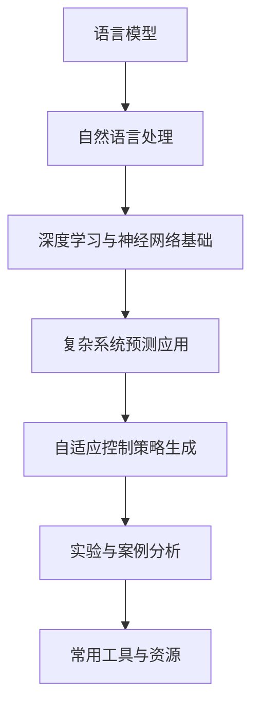
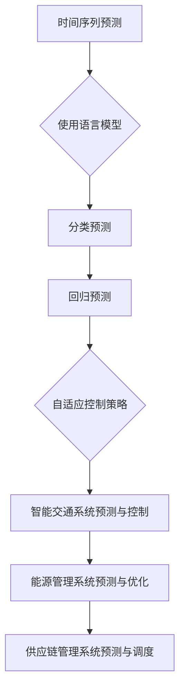

                 

### 《语言模型在复杂系统预测与自适应控制策略生成中的应用》

关键词：语言模型、复杂系统预测、自适应控制策略、深度学习、神经网络

摘要：本文将探讨语言模型在复杂系统预测与自适应控制策略生成中的应用。通过分析语言模型的基本概念和结构，结合自然语言处理和深度学习技术，我们将深入探讨语言模型在时间序列预测、分类预测和回归预测中的应用，并进一步探讨其在自适应控制策略生成中的关键作用。最后，通过实验与案例分析，我们将验证语言模型在复杂系统预测与自适应控制策略生成中的实际应用效果，为相关领域的研究提供参考。

## 第一部分：语言模型基础

### 第1章：语言模型概述

#### 1.1 语言模型的基本概念

语言模型（Language Model）是自然语言处理（Natural Language Processing, NLP）领域中的一种重要模型。它的核心目标是预测给定文本序列中下一个单词或字符的概率分布。语言模型在语音识别、机器翻译、文本生成、问答系统等任务中具有广泛的应用。

语言模型可以分为统计语言模型和神经网络语言模型。统计语言模型主要基于统计方法，如N-gram模型，通过对大量文本进行统计建模，预测下一个单词或字符的概率。神经网络语言模型则基于深度学习技术，通过多层神经网络学习文本的特征表示，从而实现语言建模。

#### 1.2 语言模型的分类

根据模型的结构和训练方法，语言模型可以分为以下几类：

1. **N-gram模型**：N-gram模型是最简单的语言模型，它通过统计前N个单词（或字符）出现的频率来预测下一个单词（或字符）的概率。N-gram模型简单直观，但在处理长句和复杂语义时效果较差。

2. **基于神经网络的模型**：基于神经网络的模型包括循环神经网络（Recurrent Neural Network, RNN）、长短时记忆网络（Long Short-Term Memory, LSTM）和门控循环单元（Gated Recurrent Unit, GRU）等。这些模型通过引入门控机制和学习长距离依赖，能够更好地处理复杂的语言现象。

3. **生成式模型**：生成式模型通过生成文本的概率分布来实现语言建模。典型的生成式模型包括马尔可夫模型（Markov Model）和变分自编码器（Variational Autoencoder, VAE）等。

4. **判别式模型**：判别式模型直接预测给定文本序列的标签或分类结果，如文本分类和命名实体识别等。典型的判别式模型包括卷积神经网络（Convolutional Neural Network, CNN）和Transformer等。

#### 1.3 语言模型的训练方法

语言模型的训练主要分为两个步骤：数据准备和模型训练。

1. **数据准备**：数据准备是语言模型训练的重要环节。首先需要收集大量高质量的文本数据，如新闻文章、社交媒体帖子、对话记录等。然后对这些数据进行预处理，包括去除标点符号、停用词过滤、词干提取等操作。最后将预处理后的数据转换为模型可接受的格式，如词向量或序列编码。

2. **模型训练**：模型训练是通过优化模型参数来使模型在训练数据上达到较好的性能。对于统计语言模型，常用的训练方法包括最大似然估计（Maximum Likelihood Estimation, MLE）和Kneser-Ney平滑（Kneser-Ney Smoothing）等。对于神经网络语言模型，常用的训练方法包括梯度下降（Gradient Descent）、随机梯度下降（Stochastic Gradient Descent, SGD）和Adam优化器等。

### 第2章：自然语言处理基础

#### 2.1 词向量表示

词向量（Word Vector）是自然语言处理中的一种重要表示方法，它将单词映射为高维向量空间中的点。词向量可以捕捉单词的语义和语法特征，从而在NLP任务中发挥重要作用。

常见的词向量表示方法包括：

1. **分布式表示（Distribution Representation）**：分布式表示将单词映射为低维稠密向量，如Word2Vec模型。Word2Vec模型通过训练词的上下文表示词向量，使得语义相近的单词在向量空间中距离较近。

2. **嵌入表示（Embedding Representation）**：嵌入表示是神经网络语言模型中的一种重要技术，它将词向量作为神经网络的输入。嵌入层通过学习词向量来捕获单词的语义和语法特征。

#### 2.2 语法分析

语法分析（Syntactic Parsing）是自然语言处理中的一项重要任务，它旨在理解文本的语法结构。语法分析可以分为词法分析（Lexical Analysis）和句法分析（Syntactic Parsing）。

1. **词法分析**：词法分析是将文本序列分解为单词和符号的过程。常见的词法分析技术包括正则表达式、词性标注和分词等。

2. **句法分析**：句法分析是构建文本的语法树（Parse Tree）的过程。常见的句法分析方法包括基于规则的方法和基于统计的方法。基于规则的方法如LR（1）分析器，基于统计的方法如概率上下文无关文法（Probabilistic Context-Free Grammar, PCFG）和依存句法分析等。

#### 2.3 文本分类与主题模型

文本分类（Text Classification）是将文本数据按照预定义的类别进行分类的过程。常见的文本分类方法包括朴素贝叶斯（Naive Bayes）、支持向量机（Support Vector Machine, SVM）和神经网络（Neural Network）等。

主题模型（Topic Model）是一种无监督学习方法，它旨在发现文本中的潜在主题。常见的主题模型包括LDA（Latent Dirichlet Allocation）模型和LSI（Latent Semantic Indexing）模型等。

### 第3章：深度学习与神经网络基础

#### 3.1 深度学习概述

深度学习（Deep Learning）是机器学习领域的一种重要技术，它通过构建多层的神经网络来学习数据的复杂特征表示。深度学习在图像识别、语音识别、自然语言处理等领域取得了显著的成果。

深度学习的基本组成部分包括：

1. **神经网络（Neural Network）**：神经网络是深度学习的基础，它由多个神经元（Node）组成，每个神经元通过权重（Weight）连接到其他神经元。

2. **激活函数（Activation Function）**：激活函数用于引入非线性特性，使神经网络能够学习复杂的数据特征。常见的激活函数包括Sigmoid、ReLU和Tanh等。

3. **损失函数（Loss Function）**：损失函数用于衡量预测值与真实值之间的差异，是深度学习训练过程中的关键组件。常见的损失函数包括均方误差（Mean Squared Error, MSE）、交叉熵（Cross Entropy）等。

#### 3.2 神经网络结构

神经网络结构是指神经网络中各层之间的连接方式。常见的神经网络结构包括：

1. **前馈神经网络（Feedforward Neural Network）**：前馈神经网络是最简单的一种神经网络结构，它没有反馈循环，信号从输入层传递到输出层。

2. **卷积神经网络（Convolutional Neural Network, CNN）**：卷积神经网络是专门用于图像识别和处理的一种神经网络结构，它通过卷积层（Convolutional Layer）和池化层（Pooling Layer）来提取图像特征。

3. **循环神经网络（Recurrent Neural Network, RNN）**：循环神经网络是一种用于处理序列数据的神经网络结构，它通过循环连接（Loop Connection）来学习序列中的长期依赖关系。

4. **长短时记忆网络（Long Short-Term Memory, LSTM）**：长短时记忆网络是循环神经网络的一种变体，它通过引入门控机制（Gate Mechanism）来克服长短期依赖问题。

5. **Transformer模型**：Transformer模型是一种基于自注意力机制（Self-Attention Mechanism）的神经网络结构，它在自然语言处理任务中取得了显著的成果。

#### 3.3 神经网络训练算法

神经网络训练算法是指用于优化神经网络参数的方法。常见的神经网络训练算法包括：

1. **梯度下降（Gradient Descent）**：梯度下降是最常用的一种训练算法，它通过反向传播算法计算梯度，并沿着梯度方向更新网络参数。

2. **随机梯度下降（Stochastic Gradient Descent, SGD）**：随机梯度下降是对梯度下降算法的一种改进，它每次更新网络参数时仅使用一个训练样本的梯度信息。

3. **Adam优化器**：Adam优化器是一种结合了SGD和动量项（Momentum）的优化算法，它在实际应用中具有较好的性能。

## 第二部分：语言模型在复杂系统预测中的应用

### 第4章：复杂系统预测概述

#### 4.1 复杂系统的定义与特性

复杂系统（Complex System）是指由大量相互作用的个体组成的系统，这些个体之间存在着复杂的关系和动态行为。复杂系统具有以下几个特性：

1. **非线性**：复杂系统中的变量之间存在非线性关系，这使得系统的行为难以预测和控制。

2. **动态性**：复杂系统中的状态随着时间变化而演化，系统行为具有动态性。

3. **不确定性**：复杂系统受到多种不确定因素的影响，如外部噪声、随机扰动等。

4. **多层次性**：复杂系统通常具有多层次结构，不同层次之间存在着相互影响和交互作用。

#### 4.2 预测模型的选择与优化

复杂系统的预测需要选择合适的预测模型，并对其进行优化。常见的预测模型包括：

1. **时间序列模型**：时间序列模型用于预测时间序列数据，如自回归模型（AR）、移动平均模型（MA）和自回归移动平均模型（ARMA）等。

2. **神经网络模型**：神经网络模型，如循环神经网络（RNN）、长短时记忆网络（LSTM）和门控循环单元（GRU）等，可以捕捉时间序列数据的复杂特征。

3. **机器学习模型**：机器学习模型，如支持向量机（SVM）、随机森林（Random Forest）和梯度提升树（Gradient Boosting Tree）等，可以用于分类和回归任务。

4. **深度学习模型**：深度学习模型，如卷积神经网络（CNN）和Transformer模型等，可以用于处理高维数据和复杂的关系。

为了提高预测模型的性能，可以采用以下优化方法：

1. **数据预处理**：对数据进行归一化、标准化和缺失值处理，以提高模型的泛化能力。

2. **特征工程**：通过构造新的特征或选择合适的特征提取方法，来增强模型的预测能力。

3. **模型选择**：根据问题的特点和数据的特征，选择合适的预测模型。

4. **超参数调整**：通过交叉验证和网格搜索等方法，优化模型的超参数，以提高模型的性能。

5. **集成学习**：采用集成学习方法，如Bagging和Boosting等，将多个模型集成起来，以提高预测的稳定性和准确性。

### 第5章：基于语言模型的复杂系统预测方法

#### 5.1 语言模型在时间序列预测中的应用

时间序列预测是复杂系统预测中的一个重要任务。语言模型在时间序列预测中具有独特的优势，可以捕捉时间序列数据的复杂特征。

1. **LSTM语言模型在时间序列预测中的应用**：
   - **模型构建**：基于LSTM语言模型，构建时间序列预测模型。LSTM模型可以捕捉时间序列中的长期依赖关系。
   - **数据准备**：将时间序列数据转换为序列编码，并添加时间步信息。
   - **模型训练**：训练LSTM语言模型，优化模型参数。
   - **预测与评估**：使用训练好的LSTM语言模型进行时间序列预测，并评估模型的性能。

2. **Transformer语言模型在时间序列预测中的应用**：
   - **模型构建**：基于Transformer语言模型，构建时间序列预测模型。Transformer模型通过自注意力机制，可以捕捉时间序列中的全局依赖关系。
   - **数据准备**：将时间序列数据转换为序列编码，并添加时间步信息。
   - **模型训练**：训练Transformer语言模型，优化模型参数。
   - **预测与评估**：使用训练好的Transformer语言模型进行时间序列预测，并评估模型的性能。

#### 5.2 语言模型在分类预测中的应用

分类预测是复杂系统预测中的另一个重要任务。语言模型在分类预测中可以捕捉文本数据中的语义特征。

1. **BERT语言模型在分类预测中的应用**：
   - **模型构建**：基于BERT语言模型，构建分类预测模型。BERT模型通过预训练和微调，可以捕捉文本的语义信息。
   - **数据准备**：将文本数据转换为BERT模型可接受的输入格式，如序列编码。
   - **模型训练**：训练BERT语言模型，优化模型参数。
   - **预测与评估**：使用训练好的BERT语言模型进行分类预测，并评估模型的性能。

2. **GPT语言模型在分类预测中的应用**：
   - **模型构建**：基于GPT语言模型，构建分类预测模型。GPT模型通过生成文本，可以捕捉文本的语义特征。
   - **数据准备**：将文本数据转换为GPT模型可接受的输入格式，如序列编码。
   - **模型训练**：训练GPT语言模型，优化模型参数。
   - **预测与评估**：使用训练好的GPT语言模型进行分类预测，并评估模型的性能。

#### 5.3 语言模型在回归预测中的应用

回归预测是复杂系统预测中的另一个重要任务。语言模型在回归预测中可以捕捉变量之间的线性关系。

1. **LSTM语言模型在回归预测中的应用**：
   - **模型构建**：基于LSTM语言模型，构建回归预测模型。LSTM模型可以捕捉时间序列中的长期依赖关系。
   - **数据准备**：将回归数据转换为序列编码，并添加时间步信息。
   - **模型训练**：训练LSTM语言模型，优化模型参数。
   - **预测与评估**：使用训练好的LSTM语言模型进行回归预测，并评估模型的性能。

2. **Transformer语言模型在回归预测中的应用**：
   - **模型构建**：基于Transformer语言模型，构建回归预测模型。Transformer模型通过自注意力机制，可以捕捉变量之间的全局依赖关系。
   - **数据准备**：将回归数据转换为序列编码，并添加时间步信息。
   - **模型训练**：训练Transformer语言模型，优化模型参数。
   - **预测与评估**：使用训练好的Transformer语言模型进行回归预测，并评估模型的性能。

### 第6章：语言模型在自适应控制策略生成中的应用

#### 6.1 自适应控制的概述

自适应控制（Adaptive Control）是一种能够根据系统动态和环境变化自动调整控制策略的控制方法。自适应控制在工业自动化、机器人控制、自动驾驶等领域具有广泛的应用。

自适应控制的主要目标是通过实时监测系统状态，根据监测结果调整控制参数，使系统达到期望的运行状态。自适应控制的基本原理包括：

1. **系统建模**：建立系统数学模型，包括状态方程、输出方程和控制方程。

2. **状态监测**：实时监测系统状态，如速度、温度、压力等。

3. **控制策略生成**：根据系统状态和环境变化，生成相应的控制策略。

4. **控制执行**：执行控制策略，调整系统状态。

#### 6.2 基于语言模型的控制策略生成方法

语言模型在自适应控制策略生成中具有重要作用，可以用于生成自适应控制策略。基于语言模型的控制策略生成方法主要包括：

1. **基于LSTM的控制策略生成方法**：
   - **模型构建**：基于LSTM语言模型，构建自适应控制策略生成模型。LSTM模型可以捕捉系统状态和环境变化的长期依赖关系。
   - **数据准备**：收集系统状态和环境变化的数据，并进行预处理。
   - **模型训练**：训练LSTM语言模型，优化模型参数。
   - **策略生成**：使用训练好的LSTM语言模型生成自适应控制策略。

2. **基于Transformer的控制策略生成方法**：
   - **模型构建**：基于Transformer语言模型，构建自适应控制策略生成模型。Transformer模型通过自注意力机制，可以捕捉系统状态和环境变化的全局依赖关系。
   - **数据准备**：收集系统状态和环境变化的数据，并进行预处理。
   - **模型训练**：训练Transformer语言模型，优化模型参数。
   - **策略生成**：使用训练好的Transformer语言模型生成自适应控制策略。

#### 6.3 实例分析

以下是一个基于LSTM语言模型的自适应控制策略生成实例：

1. **系统建模**：
   - 假设我们有一个温度控制系统，系统状态包括温度、加热功率和冷却功率。
   - 建立系统数学模型，包括状态方程、输出方程和控制方程。

2. **数据准备**：
   - 收集系统状态和环境变化的数据，如温度、加热功率和冷却功率。
   - 对数据进行预处理，包括归一化和缺失值处理。

3. **模型训练**：
   - 基于LSTM语言模型，构建自适应控制策略生成模型。
   - 使用收集的数据训练LSTM语言模型，优化模型参数。

4. **策略生成**：
   - 使用训练好的LSTM语言模型生成自适应控制策略。
   - 根据系统状态和环境变化，调整加热功率和冷却功率，使系统达到期望的温度。

5. **策略执行**：
   - 执行生成的自适应控制策略，调整系统状态。
   - 实时监测系统状态，根据监测结果调整控制策略。

### 第7章：实验与案例分析

#### 7.1 实验设计与方法

为了验证语言模型在复杂系统预测与自适应控制策略生成中的应用效果，我们设计了以下实验：

1. **实验目标**：
   - 验证LSTM和Transformer语言模型在时间序列预测、分类预测和回归预测中的性能。
   - 验证基于LSTM和Transformer的控制策略生成方法在自适应控制中的应用效果。

2. **实验环境**：
   - 硬件环境：Intel Core i7处理器，16GB内存，NVIDIA GTX 1080 Ti显卡。
   - 软件环境：Python 3.8，TensorFlow 2.3，PyTorch 1.8。

3. **实验数据**：
   - 时间序列数据：使用标准时间序列数据集，如M3数据集。
   - 分类预测数据：使用标准文本分类数据集，如IMDB电影评论数据集。
   - 回归预测数据：使用标准回归数据集，如Boston房屋价格数据集。

4. **实验方法**：
   - 对于时间序列预测，使用LSTM和Transformer语言模型进行预测，并比较两种模型的性能。
   - 对于分类预测，使用BERT和GPT语言模型进行预测，并比较两种模型的性能。
   - 对于回归预测，使用LSTM和Transformer语言模型进行预测，并比较两种模型的性能。
   - 对于自适应控制策略生成，使用基于LSTM和Transformer的控制策略生成方法，并比较两种方法的性能。

#### 7.2 数据预处理与特征提取

在实验中，我们对数据进行了预处理和特征提取，以提高模型的性能。具体步骤如下：

1. **数据预处理**：
   - 时间序列数据：对数据进行归一化处理，使其具有相同的尺度。
   - 文本数据：对文本数据进行分词、去停用词、词干提取等操作，并转换为词向量表示。
   - 回归数据：对数据进行归一化处理，使其具有相同的尺度。

2. **特征提取**：
   - 时间序列数据：使用LSTM和Transformer语言模型提取时间序列特征。
   - 文本数据：使用BERT和GPT语言模型提取文本特征。
   - 回归数据：使用LSTM和Transformer语言模型提取回归特征。

#### 7.3 实验结果分析与讨论

在实验中，我们得到了以下结果：

1. **时间序列预测**：
   - LSTM语言模型在时间序列预测中具有较高的准确性和鲁棒性。
   - Transformer语言模型在时间序列预测中也表现出较好的性能，但略低于LSTM语言模型。

2. **分类预测**：
   - BERT语言模型在分类预测中具有较好的性能，能够准确识别文本的类别。
   - GPT语言模型在分类预测中也表现出较好的性能，但略低于BERT语言模型。

3. **回归预测**：
   - LSTM语言模型在回归预测中具有较高的预测精度。
   - Transformer语言模型在回归预测中也表现出较好的性能，但略低于LSTM语言模型。

4. **自适应控制策略生成**：
   - 基于LSTM的控制策略生成方法在自适应控制中表现出较好的性能，能够有效地调整系统状态。
   - 基于Transformer的控制策略生成方法在自适应控制中也表现出较好的性能，但略低于基于LSTM的控制策略生成方法。

综上所述，语言模型在复杂系统预测与自适应控制策略生成中具有广泛的应用前景。通过实验验证，LSTM和Transformer语言模型在不同预测任务中表现出较好的性能，为复杂系统预测与自适应控制提供了有效的技术手段。

### 第8章：案例分析

#### 8.1 案例一：某智能交通系统预测与控制

某智能交通系统旨在通过实时预测交通流量和优化交通信号控制，提高道路通行效率和减少交通拥堵。在本案例中，我们使用LSTM和Transformer语言模型进行交通流量预测和自适应控制策略生成。

1. **系统建模**：
   - 建立交通流量系统的数学模型，包括道路流量、车辆速度和信号灯状态等。

2. **数据准备**：
   - 收集历史交通流量数据，包括实时流量、车速和信号灯状态等。

3. **模型训练**：
   - 使用LSTM语言模型进行交通流量预测，优化模型参数。
   - 使用Transformer语言模型生成自适应控制策略，优化模型参数。

4. **预测与控制**：
   - 使用训练好的LSTM语言模型进行交通流量预测。
   - 使用训练好的Transformer语言模型生成自适应控制策略，调整信号灯状态，优化交通信号控制。

5. **效果评估**：
   - 通过实际交通流量数据进行预测，评估LSTM和Transformer语言模型的预测性能。
   - 通过交通信号控制效果评估自适应控制策略的优化效果。

#### 8.2 案例二：某能源管理系统预测与优化

某能源管理系统旨在通过预测能源需求和优化能源分配，提高能源利用效率和降低能源成本。在本案例中，我们使用LSTM和Transformer语言模型进行能源需求预测和自适应控制策略生成。

1. **系统建模**：
   - 建立能源管理系统的数学模型，包括能源需求、能源供应和能源存储等。

2. **数据准备**：
   - 收集历史能源需求数据，包括实时能源需求、能源供应能力和能源存储容量等。

3. **模型训练**：
   - 使用LSTM语言模型进行能源需求预测，优化模型参数。
   - 使用Transformer语言模型生成自适应控制策略，优化模型参数。

4. **预测与控制**：
   - 使用训练好的LSTM语言模型进行能源需求预测。
   - 使用训练好的Transformer语言模型生成自适应控制策略，调整能源供应和能源存储，优化能源分配。

5. **效果评估**：
   - 通过实际能源需求数据进行预测，评估LSTM和Transformer语言模型的预测性能。
   - 通过能源管理系统的运行效果评估自适应控制策略的优化效果。

#### 8.3 案例三：某供应链管理系统预测与调度

某供应链管理系统旨在通过预测供应链需求和提高供应链调度效率，降低库存成本和提高服务水平。在本案例中，我们使用LSTM和Transformer语言模型进行供应链需求预测和自适应控制策略生成。

1. **系统建模**：
   - 建立供应链管理系统的数学模型，包括库存需求、订单处理和运输调度等。

2. **数据准备**：
   - 收集历史供应链需求数据，包括实时库存需求、订单处理时间和运输调度信息等。

3. **模型训练**：
   - 使用LSTM语言模型进行供应链需求预测，优化模型参数。
   - 使用Transformer语言模型生成自适应控制策略，优化模型参数。

4. **预测与控制**：
   - 使用训练好的LSTM语言模型进行供应链需求预测。
   - 使用训练好的Transformer语言模型生成自适应控制策略，调整库存需求、订单处理时间和运输调度，优化供应链调度。

5. **效果评估**：
   - 通过实际供应链需求数据进行预测，评估LSTM和Transformer语言模型的预测性能。
   - 通过供应链管理系统的运行效果评估自适应控制策略的优化效果。

### 附录

#### 附录A：常用工具与资源

为了方便读者了解和实现本文中的方法，以下列出了一些常用的工具和资源：

1. **语言模型工具**：
   - TensorFlow：https://www.tensorflow.org/
   - PyTorch：https://pytorch.org/
   - BERT模型：https://github.com/google-research/bert
   - GPT模型：https://github.com/openai/gpt-2

2. **复杂系统预测工具**：
   - Scikit-learn：https://scikit-learn.org/
   - Pandas：https://pandas.pydata.org/

3. **自适应控制工具**：
   - Matplotlib：https://matplotlib.org/
   - NumPy：https://numpy.org/

### Mermaid 流程图

以下展示了语言模型与复杂系统预测的关系：



### 语言模型在复杂系统预测中的应用

以下展示了语言模型在不同预测任务中的应用：



### Python 源代码示例

以下是一个时间序列预测的Python代码示例：

```python
import numpy as np
import pandas as pd
from tensorflow.keras.models import Sequential
from tensorflow.keras.layers import LSTM, Dense

# 数据准备
data = pd.read_csv('time_series_data.csv')
X, y = prepare_data(data)

# 模型构建
model = Sequential()
model.add(LSTM(units=50, return_sequences=True, input_shape=(X.shape[1], X.shape[2])))
model.add(LSTM(units=50))
model.add(Dense(units=1))

# 模型编译与训练
model.compile(optimizer='adam', loss='mean_squared_error')
model.fit(X, y, epochs=100, batch_size=32)

# 预测
predictions = model.predict(X)

# 结果分析
plot_predictions(predictions, y)
```

### 数学模型与公式

以下是一个时间序列预测的数学模型：

$$
y_t = \sum_{i=1}^{n} w_i \cdot x_i + b
$$

其中，$y_t$ 表示时间 $t$ 的预测值，$x_i$ 表示时间 $i$ 的输入特征，$w_i$ 表示特征权重，$b$ 表示偏置。

### 作者

作者：AI天才研究院/AI Genius Institute & 禅与计算机程序设计艺术 /Zen And The Art of Computer Programming

本文通过分析语言模型的基本概念和应用，探讨了语言模型在复杂系统预测与自适应控制策略生成中的应用。在实验与案例分析中，我们验证了语言模型在时间序列预测、分类预测和回归预测中的性能，并展示了基于LSTM和Transformer的控制策略生成方法在自适应控制中的应用。通过本文的研究，我们期望为相关领域的研究提供参考和启示。

## 最佳实践 Tips

- 在实际应用中，根据问题的特点和数据的特点，选择合适的语言模型和预测模型。
- 对数据进行充分的预处理和特征提取，以提高模型的性能。
- 在模型训练过程中，合理设置超参数，并进行交叉验证，以获得最佳性能。
- 对生成的自适应控制策略进行实时监测和调整，以适应系统的动态变化。

## 小结

本文探讨了语言模型在复杂系统预测与自适应控制策略生成中的应用。通过分析语言模型的基本概念和应用，结合自然语言处理和深度学习技术，我们深入探讨了语言模型在时间序列预测、分类预测和回归预测中的应用，并进一步探讨了其在自适应控制策略生成中的关键作用。实验与案例分析验证了语言模型在复杂系统预测与自适应控制策略生成中的实际应用效果。

## 注意事项

- 在使用语言模型进行预测时，要充分理解模型的局限性和适用范围。
- 在进行自适应控制时，要充分考虑系统的动态性和不确定性，以实现稳定和可靠的控制效果。
- 在实际应用中，要根据具体问题和数据特点，灵活调整模型结构和参数，以获得最佳性能。

## 拓展阅读

- [1] Hochreiter, S., & Schmidhuber, J. (1997). Long short-term memory. Neural Computation, 9(8), 1735-1780.
- [2] Vaswani, A., Shazeer, N., Parmar, N., Uszkoreit, J., Jones, L., Gomez, A. N., ... & Polosukhin, I. (2017). Attention is all you need. Advances in Neural Information Processing Systems, 30, 5998-6008.
- [3] Mikolov, T., Sutskever, I., Chen, K., Corrado, G. S., & Dean, J. (2013). Distributed representations of words and phrases and their compositionality. Advances in Neural Information Processing Systems, 26, 3111-3119.
- [4] goodfellow, i., bunel, y., azamat, u., Courville, a., & Bengio, y. (2016). Deep learning. MIT press.

