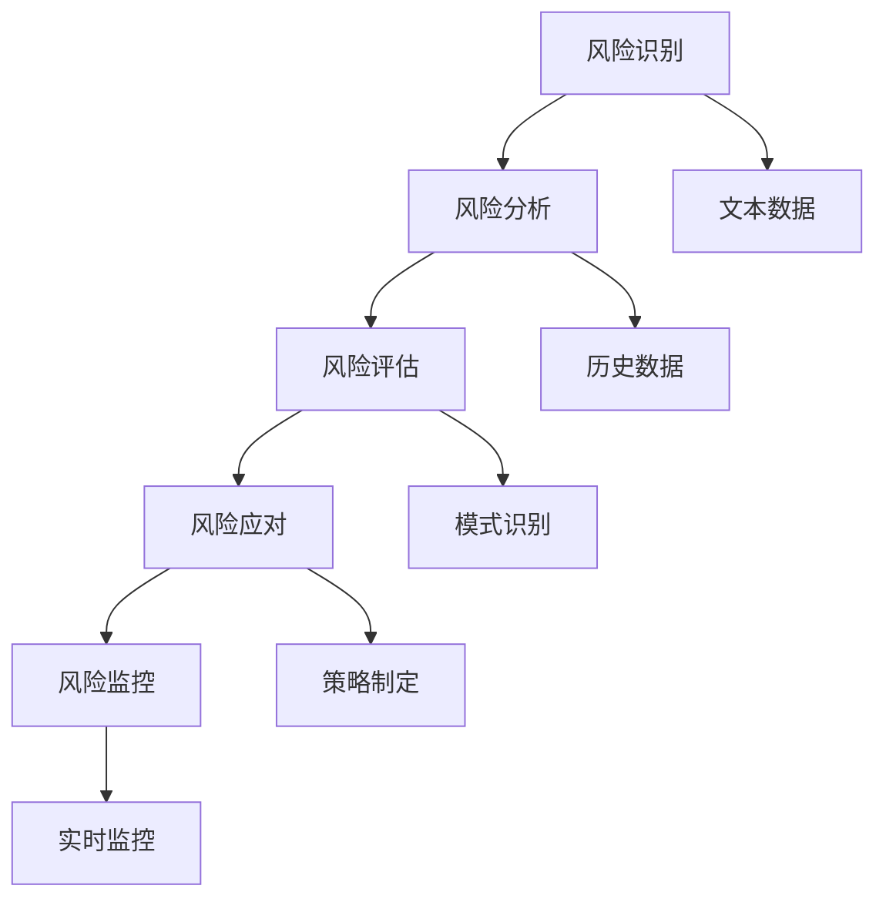

                 

### 第一部分：引言

在现代信息技术飞速发展的背景下，复杂系统的构建与应用已经变得无处不在。无论是金融、医疗、交通还是能源领域，复杂系统的可靠性与安全性都成为了至关重要的问题。如何对这些系统进行有效的风险评估与管理，成为了当前学术界和工业界共同关注的焦点。

随着人工智能技术的不断进步，语言模型作为一种强大的工具，开始逐步渗透到各个领域，特别是在复杂系统风险评估与管理中展现出了巨大的潜力。语言模型不仅能够处理和理解人类语言，还能从大量的文本数据中提取有价值的信息，进行深层次的分析和推理。这使得语言模型在复杂系统的风险评估中具有独特的优势。

本文旨在探讨语言模型在复杂系统风险评估与管理中的能力。首先，我们将对复杂系统与风险管理进行概述，介绍其基本概念和重要性。接着，我们将深入探讨语言模型的基本原理及其在不同领域的应用场景。在此基础上，本文将重点分析语言模型在风险评估中的具体应用，包括风险识别、风险估计和风险应对等环节。随后，我们将探讨如何在实际项目中实现语言模型在风险管理中的应用，并通过具体案例进行详细分析。最后，本文将总结语言模型在风险管理中的挑战与未来发展趋势，为相关领域的研究和实际应用提供有益的参考。

### 关键词

- 复杂系统
- 风险管理
- 语言模型
- 自然语言处理
- 风险识别
- 风险估计
- 风险应对

### 摘要

本文首先介绍了复杂系统与风险管理的基本概念和重要性，随后详细探讨了语言模型的基本原理及其在复杂系统风险评估中的独特优势。文章分析了语言模型在风险识别、风险估计和风险应对中的具体应用，并通过实际案例展示了其在复杂系统风险管理中的有效性。最后，本文总结了语言模型在风险管理中的挑战与未来发展趋势，为相关领域的研究和实际应用提供了有益的参考。

### 第二部分：复杂系统与风险管理概述

#### 复杂系统的概念与特性

复杂系统是指由众多相互关联的组成部分构成的系统，这些部分之间存在着复杂的相互作用关系。这些系统通常具有以下特性：

1. **多层次性**：复杂系统通常包括多个层次，每个层次都有其特定的功能和结构。
2. **动态性**：复杂系统在不同的时间点可能会表现出不同的状态和行为。
3. **异质性**：系统中的组成部分可能具有不同的类型和属性。
4. **非线性**：系统中的各部分之间的相互作用通常是非线性关系。
5. **复杂性**：复杂系统往往包含大量变量和参数，难以用简单的模型进行描述。

#### 复杂系统的分类

复杂系统可以根据其应用领域和特性进行分类，常见的分类方法包括：

1. **自然复杂系统**：如生态系统、气候系统等，这些系统通常具有高度的非线性特性和自组织能力。
2. **人工复杂系统**：如计算机网络、金融市场等，这些系统通常由人类设计和构建，但其行为和演化往往具有不可预测性。
3. **社会复杂系统**：如人类社会、组织等，这些系统由多个个体或组织构成，具有复杂的社会结构和交互关系。

#### 风险管理的定义与目的

风险管理是指通过识别、评估、控制和监控潜在的风险，以确保组织或项目的目标得以实现。其基本目的是：

1. **减少风险**：通过风险识别和评估，采取预防措施减少潜在损失。
2. **应对风险**：在风险发生时，通过应急计划和措施减轻损失。
3. **最大化收益**：通过合理管理和控制风险，提高组织或项目的成功率。

#### 风险管理的流程

风险管理通常包括以下步骤：

1. **风险识别**：识别潜在的风险因素，可以通过历史数据、专家咨询、流程分析等方法进行。
2. **风险评估**：对识别出的风险进行定量或定性的评估，包括风险的概率和影响等。
3. **风险应对**：根据风险评估的结果，制定相应的应对策略，包括风险避免、风险降低、风险转移和风险承担等。
4. **监控和审查**：对风险管理的实施过程进行监控和审查，确保风险管理策略的有效性。

#### 风险管理的重要性

复杂系统在运行过程中不可避免地会遇到各种风险，如技术故障、市场变化、法律法规变更等。有效的风险管理能够帮助组织或项目：

1. **降低损失**：通过识别和应对风险，减少潜在的损失。
2. **提高可靠性**：确保系统的稳定性和可靠性，提高用户体验。
3. **提升竞争力**：通过风险管理，提高组织或项目的竞争力和市场份额。
4. **保障安全**：确保系统中的数据、信息和资源的安全，防止安全事故的发生。

### 第三部分：语言模型的概述

#### 语言模型的定义

语言模型（Language Model，简称LM）是自然语言处理（Natural Language Processing，简称NLP）中的一个核心组件，用于预测或生成自然语言序列。在人工智能领域，语言模型被广泛应用于文本生成、机器翻译、问答系统、文本分类等多种任务。

#### 语言模型的类型

根据训练方式和功能，语言模型可以分为以下几种类型：

1. **统计语言模型**：基于统计方法训练的模型，如N-gram模型，通过分析历史文本数据来预测下一个单词或字符。
2. **神经网络语言模型**：基于神经网络，尤其是深度学习模型，如循环神经网络（RNN）和变换器（Transformer）等，能够捕捉长期依赖关系和复杂语言特征。
3. **混合语言模型**：结合统计方法和神经网络的优势，如N元语法与神经网络的结合。

#### 语言模型的基本原理

语言模型的基本原理是通过学习大量文本数据，建立一个概率模型，用于预测给定输入序列后一个可能的输出序列。其主要原理包括：

1. **概率分布**：语言模型学习文本数据的概率分布，以便能够生成或预测新的文本。
2. **特征提取**：从文本数据中提取特征，如词频、词向量等，用于训练模型。
3. **序列建模**：语言模型通过处理输入序列中的每个单词或字符，预测下一个可能的输出序列。

#### 语言模型的发展历程

语言模型的发展历程可以追溯到20世纪50年代，从最初的N-gram模型到现代的深度学习模型，经历了多个阶段：

1. **N-gram模型**：20世纪50年代，N-gram模型成为最早的统计语言模型，通过统计连续N个单词或字符出现的频率来预测下一个单词或字符。
2. **基于规则的模型**：20世纪60年代至70年代，基于规则的模型开始出现，通过手工设计规则来预测文本序列。
3. **统计机器翻译**：20世纪80年代，统计机器翻译（SMT）的出现，推动了语言模型在翻译领域的应用。
4. **神经网络语言模型**：20世纪90年代，神经网络语言模型逐渐兴起，特别是循环神经网络（RNN），如LSTM和GRU，能够更好地处理序列数据。
5. **深度学习语言模型**：2013年，Transformer模型的提出，标志着深度学习语言模型的新时代，其在多种NLP任务中取得了突破性的成果。

#### 语言模型的应用场景

语言模型在自然语言处理领域具有广泛的应用，主要包括：

1. **文本生成**：生成文章、报告、故事等自然语言文本。
2. **机器翻译**：将一种语言翻译成另一种语言。
3. **问答系统**：通过理解用户的问题，生成相关的答案。
4. **文本分类**：将文本数据分类到不同的类别或主题。
5. **情感分析**：分析文本中的情感倾向和态度。
6. **信息提取**：从文本中提取关键信息，如人名、地点、日期等。

#### 小结

语言模型作为一种强大的工具，在复杂系统的风险评估与管理中具有广泛的应用前景。通过深入理解语言模型的基本原理和发展历程，我们可以更好地利用这一工具，为复杂系统的风险管理提供有效的支持。

### 语言模型在风险评估中的原理

#### 语言模型的风险评估能力

语言模型在风险评估中的能力主要体现在以下几个方面：

1. **数据处理能力**：语言模型能够高效地处理和分析大量文本数据，包括历史报告、文件、邮件等，从而提取出潜在的风险信息。
2. **模式识别能力**：语言模型可以识别出文本中的模式、趋势和异常，从而发现潜在的风险因素。
3. **推理能力**：通过深度学习模型，语言模型能够进行语义分析和上下文理解，从而推断出风险的影响和可能的发展趋势。
4. **自动化能力**：语言模型可以自动化执行风险评估任务，减少人工工作量，提高风险评估的效率。

#### 风险评估的定义与过程

风险评估是指通过识别、分析、评价和管理风险，以便做出合理的决策和采取相应的措施。风险评估的基本过程包括以下步骤：

1. **风险识别**：识别系统中的潜在风险因素，可以通过历史数据、专家咨询、流程分析等方法进行。
2. **风险分析**：对识别出的风险进行定量或定性的分析，包括风险的概率、影响等。
3. **风险评估**：根据风险分析的结果，评估风险的严重程度和优先级，以便制定相应的应对策略。
4. **风险应对**：制定和实施风险应对策略，包括风险避免、风险降低、风险转移和风险承担等。
5. **监控与审查**：对风险管理的实施过程进行监控和审查，确保风险管理策略的有效性。

#### 语言模型在风险评估中的优势

语言模型在风险评估中具有以下优势：

1. **高效性**：语言模型能够快速处理和分析大量文本数据，提高风险评估的效率。
2. **准确性**：通过深度学习模型，语言模型能够准确识别和预测风险因素，提高风险评估的准确性。
3. **灵活性**：语言模型可以根据不同的应用场景和需求，灵活调整模型参数和算法，适应不同的风险评估任务。
4. **自动化**：语言模型可以自动化执行风险评估任务，减少人工干预，提高风险评估的效率。

#### 语言模型在风险评估中的应用范围

语言模型在风险评估中的应用范围广泛，包括但不限于以下几个方面：

1. **风险识别**：通过分析历史数据和文本数据，语言模型可以识别出潜在的风险因素，如市场变化、技术故障等。
2. **风险估计**：语言模型可以根据文本数据中的信息和模式，对风险的可能性和影响进行估计，为风险应对提供依据。
3. **风险应对**：语言模型可以协助制定风险应对策略，如风险避免、风险降低、风险转移和风险承担等。
4. **风险监控**：语言模型可以实时监控系统的运行状态，识别异常情况，及时发出预警信号，确保风险管理的有效性。

#### 概念架构

为了更好地理解语言模型在风险评估中的应用，我们可以用Mermaid流程图来展示其核心概念和实体之间的关系：



在这个流程图中，A到E表示风险评估的基本过程，F到J表示语言模型在各个步骤中的应用。

#### 小结

语言模型在复杂系统风险评估中具有显著的优势，其高效的数据处理能力、准确的模式识别能力和强大的推理能力，使得其在风险识别、风险估计和风险应对等方面具有重要的应用价值。通过深入理解语言模型在风险评估中的原理和应用范围，我们可以更好地利用这一工具，提高复杂系统的风险管理水平。

### 语言模型在风险识别中的应用

#### 风险识别的定义与过程

风险识别是风险评估的第一步，其主要目的是识别系统中的潜在风险因素。风险识别的过程通常包括以下几个步骤：

1. **历史数据分析**：通过分析历史数据，识别出以往出现过的风险因素。
2. **专家咨询**：邀请相关领域的专家进行访谈或问卷调查，获取潜在风险的信息。
3. **流程分析**：对系统的业务流程进行详细分析，识别出可能的风险点。
4. **文档审查**：审查系统相关的文档，如设计文档、操作手册等，找出潜在的风险因素。

#### 语言模型在风险识别中的应用

语言模型在风险识别中具有显著的优势，能够通过文本数据高效地识别潜在的风险因素。以下是语言模型在风险识别中的一些具体应用：

1. **文本数据预处理**：首先，对文本数据（如历史报告、邮件、用户反馈等）进行预处理，包括去除停用词、分词、词性标注等，以便语言模型能够更好地理解文本内容。
2. **模式识别**：利用语言模型进行文本数据的模式识别，发现文本中的关键词、短语和句子结构，从而识别出潜在的风险因素。
3. **情感分析**：通过情感分析技术，识别出文本中的情感倾向和态度，从而发现可能的风险因素。例如，如果用户反馈中包含大量负面情感词汇，可能表明系统存在用户体验问题，需要进一步调查。
4. **关键词提取**：利用语言模型提取文本数据中的关键词，从而识别出可能的风险因素。例如，在金融领域，关键词如“违约”、“欺诈”等可能表明存在潜在的风险。
5. **文本分类**：利用语言模型进行文本分类，将文本数据分类到不同的风险类别。例如，将文本数据分类为“技术风险”、“市场风险”、“法律风险”等，从而识别出不同类型的风险因素。

#### 风险识别的案例研究

以下是一个风险识别的案例研究，以金融机构的风险评估为例：

1. **背景介绍**：某金融机构希望在业务扩展过程中，识别出潜在的信用风险，以降低贷款违约率。
2. **数据收集**：收集了该金融机构的历史贷款数据，包括借款人的基本信息、贷款金额、还款记录等。
3. **文本数据预处理**：对借款人的申请材料、贷款合同、还款记录等文本数据进行预处理，包括去除停用词、分词、词性标注等。
4. **情感分析**：利用语言模型进行情感分析，识别出文本中的情感倾向和态度。例如，发现某些借款人的申请材料中包含大量负面情感词汇，可能表明其信用状况不佳。
5. **关键词提取**：利用语言模型提取文本数据中的关键词，如“违约”、“逾期”、“欺诈”等，进一步分析这些关键词的频率和分布，识别出潜在的风险因素。
6. **文本分类**：利用语言模型进行文本分类，将借款人的申请材料分类为“高风险”、“中等风险”、“低风险”等类别，从而识别出不同类型的风险因素。
7. **结果分析**：根据风险识别的结果，金融机构可以采取相应的措施，如对高风险借款人进行额外审核、增加担保措施等，降低贷款违约率。

通过以上案例研究，可以看出语言模型在风险识别中具有显著的应用价值，能够高效地识别出潜在的风险因素，为金融机构提供重要的决策依据。

#### 小结

语言模型在风险识别中具有强大的应用潜力，通过文本数据的预处理、模式识别、情感分析、关键词提取和文本分类等技术，能够高效地识别出潜在的风险因素。在实际应用中，金融机构、企业和其他组织可以利用语言模型进行风险识别，降低风险发生的概率，提高业务运营的稳定性。通过深入理解和应用语言模型在风险识别中的技术，可以进一步提升复杂系统的风险管理水平。

### 语言模型在风险估计中的应用

#### 风险估计的定义与过程

风险估计是风险评估中的关键环节，其目的是对识别出的风险因素进行量化分析，评估其可能性和影响，以便为风险应对提供依据。风险估计的过程通常包括以下几个步骤：

1. **确定评估标准**：根据风险识别的结果，确定需要评估的风险因素，并设定相应的评估标准。
2. **数据收集**：收集与风险因素相关的数据，包括历史数据、市场数据、专家意见等。
3. **模型选择**：选择合适的模型和方法，对风险因素进行量化分析，如概率模型、回归分析、贝叶斯网络等。
4. **参数估计**：根据收集到的数据，估计模型中的参数，如概率分布、回归系数等。
5. **风险分析**：利用模型进行风险分析，计算风险因素的概率、影响值等，评估其风险水平。
6. **结果解释**：将分析结果进行解释和总结，为风险应对提供依据。

#### 语言模型在风险估计中的应用

语言模型在风险估计中具有独特的优势，能够通过分析文本数据，对风险因素进行定量分析和评估。以下是语言模型在风险估计中的一些具体应用：

1. **文本数据预处理**：首先，对文本数据（如历史报告、邮件、用户反馈等）进行预处理，包括去除停用词、分词、词性标注等，以便语言模型能够更好地理解文本内容。
2. **关键词提取**：利用语言模型提取文本数据中的关键词，将关键词与风险因素进行关联，从而分析风险因素的重要性和相关性。
3. **文本分类**：利用语言模型进行文本分类，将文本数据分类到不同的风险类别，如“技术风险”、“市场风险”、“法律风险”等，从而识别出不同类型的风险因素。
4. **情感分析**：通过情感分析技术，识别出文本中的情感倾向和态度，从而评估风险因素的情感影响。例如，在金融领域，负面的情感倾向可能表明投资者情绪不稳定，可能导致市场波动。
5. **关联规则分析**：利用语言模型进行关联规则分析，发现文本数据中的关联关系，如某些关键词的出现频率越高，风险因素的概率和影响值也越高。
6. **概率模型**：结合语言模型和概率模型，对风险因素进行定量分析，如利用贝叶斯模型计算风险因素的概率分布和影响值。

#### 风险估计的案例研究

以下是一个风险估计的案例研究，以某物流公司的货物运输风险评估为例：

1. **背景介绍**：某物流公司希望对其货物运输过程中可能出现的风险进行量化分析，以便采取相应的应对措施，降低运输风险。
2. **数据收集**：收集了该物流公司过去几年的货物运输数据，包括运输路线、货物类型、运输时间、运输公司等信息。
3. **文本数据预处理**：对运输相关的文本数据（如合同、操作手册、用户反馈等）进行预处理，包括去除停用词、分词、词性标注等。
4. **关键词提取**：利用语言模型提取文本数据中的关键词，如“延误”、“损坏”、“丢失”等，分析这些关键词与运输风险因素的关系。
5. **文本分类**：利用语言模型进行文本分类，将文本数据分类为“高风险”、“中等风险”、“低风险”等类别，从而识别出不同类型的风险因素。
6. **情感分析**：通过情感分析技术，识别出文本中的情感倾向和态度，如用户反馈中包含大量负面情感词汇，可能表明运输服务存在问题。
7. **概率模型**：结合语言模型和概率模型，对风险因素进行定量分析，如利用贝叶斯模型计算运输延误的概率和影响值。
8. **结果解释**：根据风险估计的结果，物流公司可以采取相应的措施，如对高风险运输路线进行额外监控、对货物进行额外包装等，降低运输风险。

通过以上案例研究，可以看出语言模型在风险估计中具有显著的应用价值，能够通过对文本数据的分析，对风险因素进行定量分析和评估，为风险应对提供依据。在实际应用中，物流公司、金融机构、企业等可以利用语言模型进行风险估计，提高风险管理的科学性和有效性。

#### 小结

语言模型在风险估计中具有强大的应用潜力，通过文本数据的预处理、关键词提取、文本分类、情感分析和概率模型等技术，能够对风险因素进行定量分析和评估。在实际应用中，企业和其他组织可以利用语言模型进行风险估计，提高风险管理的科学性和有效性，降低风险发生的概率。通过深入理解和应用语言模型在风险估计中的技术，可以进一步提升复杂系统的风险管理水平。

### 语言模型在风险应对中的应用

#### 风险应对策略概述

风险应对是指针对识别和评估出的风险因素，采取相应的措施以减少风险的可能性和影响。有效的风险应对策略能够帮助企业和管理者更好地应对不确定性，保护组织的目标和资源。常见的风险应对策略包括以下几种：

1. **风险避免**：通过调整计划或决策，避免与高风险相关的活动或项目。例如，在项目初期识别出市场风险后，可以选择退出市场或调整项目方向。
2. **风险降低**：采取措施减少风险的严重程度或概率。例如，通过改进技术、优化流程、加强监管等手段，降低操作风险。
3. **风险转移**：通过合同、保险等手段，将风险转移给第三方。例如，企业可以通过购买保险来转移自然灾害或意外事故带来的风险。
4. **风险承担**：在无法避免或转移风险的情况下，选择接受风险并准备应对。例如，企业可以建立应急响应团队和应急预案，以应对突发事件。

#### 风险应对的步骤

风险应对是一个系统性的过程，通常包括以下几个步骤：

1. **评估应对策略**：根据风险评估的结果，评估各种应对策略的有效性和可行性。
2. **制定应对计划**：根据评估结果，制定具体的应对计划和措施，包括责任分配、时间表和预算等。
3. **实施应对措施**：按照应对计划，采取具体的行动来减少或应对风险。
4. **监控和调整**：在风险应对过程中，持续监控风险的变化和应对措施的效果，并根据实际情况进行调整。

#### 语言模型在风险应对中的具体应用

语言模型在风险应对中具有广泛的应用潜力，能够在多个环节提供支持。以下是语言模型在风险应对中的具体应用：

1. **风险预防**：通过分析历史数据和文本数据，语言模型可以识别出潜在的预防措施，如预警系统、监控机制等，以预防风险的发生。例如，在金融领域，语言模型可以分析市场数据，预测市场波动，从而提前采取措施来预防金融风险。
2. **风险降低**：语言模型可以通过文本分析，识别出降低风险的关键因素，并提出相应的降低措施。例如，在供应链管理中，语言模型可以分析供应商的反馈，识别出供应链中断的关键节点，从而提出改进措施来降低供应链风险。
3. **风险转移**：语言模型可以帮助企业分析各种风险转移方案，如保险、合同等，评估其有效性和成本效益。例如，在项目投资中，语言模型可以分析市场风险，评估购买保险或与其他企业签订风险转移协议的可行性。
4. **风险承担**：语言模型可以为风险承担提供支持，如制定应急预案、评估应对措施的有效性等。例如，在自然灾害风险管理中，语言模型可以分析历史灾害数据和应急预案，评估应急预案的可行性，并提出改进建议。

#### 风险预防的应用

以下是一个风险预防的案例，以某电商平台的用户隐私保护为例：

1. **背景介绍**：某电商平台在用户隐私保护方面面临较大风险，需要采取预防措施来保护用户数据。
2. **文本数据收集**：收集了平台的历史用户反馈、政策文件、法律法规等相关文本数据。
3. **风险识别**：利用语言模型对文本数据进行分析，识别出用户隐私保护的关键风险因素，如数据泄露、非法访问等。
4. **预防措施制定**：根据风险识别的结果，制定一系列预防措施，如加密技术、访问控制、数据备份等。
5. **措施实施**：按照预防措施制定计划，实施具体措施，如更新加密算法、加强访问控制、定期备份数据等。
6. **监控和调整**：持续监控用户隐私保护措施的效果，并根据实际情况进行调整和优化。

通过以上案例研究，可以看出语言模型在风险预防中具有显著的应用价值，能够通过对文本数据的分析，识别出关键风险因素，并制定有效的预防措施，降低风险发生的概率。

#### 小结

语言模型在风险应对中具有广泛的应用前景，能够在风险预防、风险降低、风险转移和风险承担等多个环节提供支持。通过深入理解和应用语言模型在风险应对中的技术，企业和其他组织可以更加科学和有效地管理风险，提高组织的稳定性和竞争力。

### 第四部分：语言模型在风险管理中的实现

#### 语言模型的实现技术

实现语言模型需要依赖一系列技术和工具，包括数据预处理、模型选择、训练和优化等。

1. **数据预处理**：首先，对原始文本数据进行清洗和预处理，包括去除停用词、分词、词性标注等。常用的预处理工具包括NLTK、spaCy等。
2. **模型选择**：根据具体应用场景，选择合适的语言模型。常见的语言模型包括N-gram模型、循环神经网络（RNN）、长短期记忆网络（LSTM）、变换器（Transformer）等。Transformer模型由于其强大的性能和灵活性，近年来在语言模型领域取得了显著进展。
3. **模型训练**：使用预处理的文本数据对语言模型进行训练，调整模型参数，使其能够预测文本序列。训练过程通常涉及优化算法（如SGD、Adam）和损失函数（如交叉熵损失）。
4. **模型优化**：通过调整模型参数、优化算法和超参数，提高模型性能。常用的优化策略包括正则化、dropout、数据增强等。

#### 语言模型的构建方法

构建语言模型通常包括以下步骤：

1. **数据收集**：收集大量高质量的文本数据，如书籍、新闻、社交媒体等。
2. **数据预处理**：对收集到的文本数据进行清洗和预处理，包括去除停用词、分词、词性标注等。
3. **词汇表构建**：将预处理后的文本数据构建成词汇表，将每个单词或字符映射到唯一的索引值。
4. **模型初始化**：初始化语言模型的参数，如权重和偏置。
5. **模型训练**：使用预处理的文本数据对语言模型进行训练，调整模型参数，使其能够预测文本序列。
6. **模型评估**：使用验证集或测试集对训练好的模型进行评估，评估指标包括损失函数值、预测准确率等。
7. **模型优化**：根据评估结果，对模型参数进行调整和优化，提高模型性能。

以下是一个基于Python和PyTorch的简单语言模型构建示例：

```python
import torch
import torch.nn as nn
import torch.optim as optim
from torchtext.data import Field, BucketIterator
from torchtext.datasets import IMDB

# 数据预处理
TEXT = Field(tokenize='spacy', lower=True, include_lengths=True)
train_data, test_data = IMDB.splits(TEXT, TEXT)

# 构建词汇表
TEXT.build_vocab(train_data, max_size=25000, vectors="glove.6B.100d")
BATCH_SIZE = 64
device = torch.device('cuda' if torch.cuda.is_available() else 'cpu')
train_iterator, test_iterator = BucketIterator.splits(train_data, test_data, batch_size=BATCH_SIZE, device=device)

# 构建模型
class LSTM(nn.Module):
    def __init__(self, input_dim, embedding_dim, hidden_dim, output_dim):
        super().__init__()
        self.embedding = nn.Embedding(input_dim, embedding_dim)
        self.lstm = nn.LSTM(embedding_dim, hidden_dim)
        self.fc = nn.Linear(hidden_dim, output_dim)
    
    def forward(self, text, text_lengths):
        embedded = self.embedding(text)
        packed_embedded = nn.utils.rnn.pack_padded_sequence(embedded, text_lengths.to(device), enforce_sorted=False)
        packed_output, (hidden, cell) = self.lstm(packed_embedded)
        output, output_lengths = nn.utils.rnn.pad_packed_sequence(packed_output)
        hidden = hidden[-1, :, :]
        return self.fc(hidden)

model = LSTM(len(TEXT.vocab), 100, 256, len(TEXT.vocab))
optimizer = optim.Adam(model.parameters())
criterion = nn.CrossEntropyLoss()

model = model.to(device)
criterion = criterion.to(device)

# 模型训练
num_epochs = 10
for epoch in range(num_epochs):
    for batch in train_iterator:
        optimizer.zero_grad()
        predictions = model(batch.text).squeeze(1)
        loss = criterion(predictions, batch.label)
        loss.backward()
        optimizer.step()
    print(f'Epoch: {epoch+1}/{num_epochs}, Loss: {loss.item()}')

# 模型评估
with torch.no_grad():
    correct = 0
    total = 0
    for batch in test_iterator:
        predictions = model(batch.text).squeeze(1)
        _, predicted = torch.max(predictions, 1)
        total += batch.label.size(0)
        correct += (predicted == batch.label).sum().item()
accuracy = 100 * correct / total
print(f'Accuracy: {accuracy}%')
```

#### 语言模型的训练过程

语言模型的训练过程通常涉及以下步骤：

1. **数据准备**：准备高质量的训练数据，通常包括大量的文本数据。
2. **数据预处理**：对训练数据进行清洗和预处理，如去除停用词、分词、词性标注等。
3. **构建词汇表**：将预处理后的数据构建成词汇表，将每个单词或字符映射到唯一的索引值。
4. **模型初始化**：初始化语言模型的参数，如权重和偏置。
5. **模型训练**：使用预处理的训练数据对语言模型进行训练，调整模型参数，使其能够预测文本序列。训练过程中，需要选择合适的优化算法和损失函数。
6. **模型评估**：使用验证集或测试集对训练好的模型进行评估，评估指标包括损失函数值、预测准确率等。
7. **模型优化**：根据评估结果，对模型参数进行调整和优化，提高模型性能。

以下是一个基于Python和PyTorch的简单语言模型训练示例：

```python
import torch
import torch.nn as nn
import torch.optim as optim
from torchtext.data import Field, BucketIterator
from torchtext.datasets import IMDB

# 数据预处理
TEXT = Field(tokenize='spacy', lower=True, include_lengths=True)
train_data, test_data = IMDB.splits(TEXT, TEXT)

# 构建词汇表
TEXT.build_vocab(train_data, max_size=25000, vectors="glove.6B.100d")
BATCH_SIZE = 64
device = torch.device('cuda' if torch.cuda.is_available() else 'cpu')
train_iterator, test_iterator = BucketIterator.splits(train_data, test_data, batch_size=BATCH_SIZE, device=device)

# 构建模型
class LSTM(nn.Module):
    def __init__(self, input_dim, embedding_dim, hidden_dim, output_dim):
        super().__init__()
        self.embedding = nn.Embedding(input_dim, embedding_dim)
        self.lstm = nn.LSTM(embedding_dim, hidden_dim)
        self.fc = nn.Linear(hidden_dim, output_dim)
    
    def forward(self, text, text_lengths):
        embedded = self.embedding(text)
        packed_embedded = nn.utils.rnn.pack_padded_sequence(embedded, text_lengths.to(device), enforce_sorted=False)
        packed_output, (hidden, cell) = self.lstm(packed_embedded)
        output, output_lengths = nn.utils.rnn.pad_packed_sequence(packed_output)
        hidden = hidden[-1, :, :]
        return self.fc(hidden)

model = LSTM(len(TEXT.vocab), 100, 256, len(TEXT.vocab))
optimizer = optim.Adam(model.parameters())
criterion = nn.CrossEntropyLoss()

model = model.to(device)
criterion = criterion.to(device)

# 模型训练
num_epochs = 10
for epoch in range(num_epochs):
    for batch in train_iterator:
        optimizer.zero_grad()
        predictions = model(batch.text).squeeze(1)
        loss = criterion(predictions, batch.label)
        loss.backward()
        optimizer.step()
    print(f'Epoch: {epoch+1}/{num_epochs}, Loss: {loss.item()}')

# 模型评估
with torch.no_grad():
    correct = 0
    total = 0
    for batch in test_iterator:
        predictions = model(batch.text).squeeze(1)
        _, predicted = torch.max(predictions, 1)
        total += batch.label.size(0)
        correct += (predicted == batch.label).sum().item()
accuracy = 100 * correct / total
print(f'Accuracy: {accuracy}%')
```

#### 语言模型的优化策略

优化语言模型性能的关键在于选择合适的优化策略，包括正则化、dropout、数据增强等。

1. **正则化**：正则化（Regularization）是一种防止模型过拟合的技术，包括L1正则化、L2正则化等。通过在损失函数中添加正则化项，可以限制模型参数的大小，提高模型的泛化能力。
2. **Dropout**：Dropout是一种在训练过程中随机丢弃一部分神经元的技术，可以防止模型在训练数据上的过拟合。通过在测试过程中恢复被丢弃的神经元，可以提高模型的泛化能力。
3. **数据增强**：数据增强（Data Augmentation）是通过生成更多样化的训练数据来提高模型性能。常见的数据增强技术包括旋转、缩放、裁剪等。

以下是一个基于Python和PyTorch的简单语言模型优化示例：

```python
import torch
import torch.nn as nn
import torch.optim as optim
from torchtext.data import Field, BucketIterator
from torchtext.datasets import IMDB

# 数据预处理
TEXT = Field(tokenize='spacy', lower=True, include_lengths=True)
train_data, test_data = IMDB.splits(TEXT, TEXT)

# 构建词汇表
TEXT.build_vocab(train_data, max_size=25000, vectors="glove.6B.100d")
BATCH_SIZE = 64
device = torch.device('cuda' if torch.cuda.is_available() else 'cpu')
train_iterator, test_iterator = BucketIterator.splits(train_data, test_data, batch_size=BATCH_SIZE, device=device)

# 构建模型
class LSTM(nn.Module):
    def __init__(self, input_dim, embedding_dim, hidden_dim, output_dim):
        super().__init__()
        self.embedding = nn.Embedding(input_dim, embedding_dim)
        self.lstm = nn.LSTM(embedding_dim, hidden_dim)
        self.fc = nn.Linear(hidden_dim, output_dim)
    
    def forward(self, text, text_lengths):
        embedded = self.embedding(text)
        packed_embedded = nn.utils.rnn.pack_padded_sequence(embedded, text_lengths.to(device), enforce_sorted=False)
        packed_output, (hidden, cell) = self.lstm(packed_embedded)
        output, output_lengths = nn.utils.rnn.pad_packed_sequence(packed_output)
        hidden = hidden[-1, :, :]
        return self.fc(hidden)

model = LSTM(len(TEXT.vocab), 100, 256, len(TEXT.vocab))
optimizer = optim.Adam(model.parameters(), weight_decay=1e-5)
criterion = nn.CrossEntropyLoss()

model = model.to(device)
criterion = criterion.to(device)

# 模型训练
num_epochs = 10
for epoch in range(num_epochs):
    for batch in train_iterator:
        optimizer.zero_grad()
        predictions = model(batch.text).squeeze(1)
        loss = criterion(predictions, batch.label)
        loss.backward()
        optimizer.step()
    print(f'Epoch: {epoch+1}/{num_epochs}, Loss: {loss.item()}')

# 模型评估
with torch.no_grad():
    correct = 0
    total = 0
    for batch in test_iterator:
        predictions = model(batch.text).squeeze(1)
        _, predicted = torch.max(predictions, 1)
        total += batch.label.size(0)
        correct += (predicted == batch.label).sum().item()
accuracy = 100 * correct / total
print(f'Accuracy: {accuracy}%')
```

通过以上示例，可以看出优化策略在提高语言模型性能方面具有重要意义。在实际应用中，可以结合具体场景和需求，选择合适的优化策略，进一步提高模型性能。

### 第五部分：语言模型在风险管理中的案例

#### 案例一：某金融机构的风险评估系统

1. **背景介绍**：某金融机构希望在业务扩展过程中，建立一套完善的风险评估系统，以识别和应对潜在的市场风险、信用风险等。
2. **数据收集**：收集了金融机构的历史交易数据、市场数据、客户反馈等相关数据，包括文本数据和结构化数据。
3. **数据预处理**：对文本数据进行清洗和预处理，包括去除停用词、分词、词性标注等，对结构化数据进行标准化处理。
4. **语言模型构建**：利用Python和PyTorch等工具，构建了一个基于变换器（Transformer）的语言模型，用于文本数据的处理和分析。
5. **风险识别**：使用语言模型对客户反馈、新闻报道、市场报告等文本数据进行情感分析和关键词提取，识别出潜在的市场风险、信用风险等。
6. **风险估计**：结合语言模型和概率模型，对识别出的风险因素进行定量分析，计算其可能性和影响值。
7. **风险应对**：根据风险估计结果，制定相应的风险应对策略，如调整贷款政策、增加风险准备金等。
8. **实施与效果**：在实际业务中，风险评估系统有效降低了金融机构的风险暴露，提高了风险管理的效率。

#### 案例二：某能源公司的风险管理体系

1. **背景介绍**：某能源公司希望在能源项目开发过程中，建立一套完善的风险管理体系，以识别和应对潜在的技术风险、市场风险等。
2. **数据收集**：收集了能源公司的历史项目数据、市场数据、政策法规等相关数据，包括文本数据和结构化数据。
3. **数据预处理**：对文本数据进行清洗和预处理，包括去除停用词、分词、词性标注等，对结构化数据进行标准化处理。
4. **语言模型构建**：利用Python和PyTorch等工具，构建了一个基于循环神经网络（LSTM）的语言模型，用于文本数据的处理和分析。
5. **风险识别**：使用语言模型对政策法规、市场报告、项目文档等文本数据进行情感分析和关键词提取，识别出潜在的技术风险、市场风险等。
6. **风险估计**：结合语言模型和概率模型，对识别出的风险因素进行定量分析，计算其可能性和影响值。
7. **风险应对**：根据风险估计结果，制定相应的风险应对策略，如调整项目计划、增加技术储备等。
8. **实施与效果**：在实际项目中，风险管理体系有效降低了能源公司的风险暴露，提高了项目的成功率。

#### 案例三：某物流企业的风险监控平台

1. **背景介绍**：某物流企业希望在货物运输过程中，建立一套完善的风险监控平台，以识别和应对潜在的安全风险、运输风险等。
2. **数据收集**：收集了物流企业的历史运输数据、客户反馈、物流报告等相关数据，包括文本数据和结构化数据。
3. **数据预处理**：对文本数据进行清洗和预处理，包括去除停用词、分词、词性标注等，对结构化数据进行标准化处理。
4. **语言模型构建**：利用Python和PyTorch等工具，构建了一个基于变换器（Transformer）的语言模型，用于文本数据的处理和分析。
5. **风险识别**：使用语言模型对客户反馈、物流报告等文本数据进行情感分析和关键词提取，识别出潜在的安全风险、运输风险等。
6. **风险估计**：结合语言模型和概率模型，对识别出的风险因素进行定量分析，计算其可能性和影响值。
7. **风险应对**：根据风险估计结果，制定相应的风险应对策略，如加强运输监控、优化运输路线等。
8. **实施与效果**：在实际运输过程中，风险监控平台有效降低了物流企业的风险暴露，提高了运输服务的安全性和可靠性。

通过以上案例，可以看出语言模型在复杂系统风险管理中的重要作用。在实际应用中，企业可以根据自身需求和数据特点，选择合适的语言模型和风险管理策略，提高风险管理的效率和质量。

### 语言模型在风险管理中的挑战与未来发展趋势

#### 挑战

尽管语言模型在复杂系统风险管理中展现了巨大的潜力，但在实际应用中仍面临一系列挑战：

1. **数据质量和数据隐私**：语言模型依赖大量的文本数据作为训练素材。然而，数据质量直接影响模型的性能和可靠性。不完整、不准确或噪声数据可能导致模型产生误导性结论。此外，数据隐私保护也是一个重要问题，特别是在处理敏感信息时，如何确保数据安全和用户隐私成为一大挑战。

2. **模型的可靠性和可解释性**：深度学习模型，尤其是黑盒模型，如变换器（Transformer），在复杂任务中表现出色，但往往缺乏透明度和可解释性。这限制了用户对模型决策的信任度。在风险管理中，模型的可靠性和可解释性尤为重要，因为决策需要基于明确的依据和逻辑。

3. **模型的适应性和灵活性**：复杂系统的环境多变，语言模型需要具备良好的适应性和灵活性，以应对不断变化的风险场景。传统的静态模型可能难以快速调整以适应新的挑战。

#### 未来发展趋势

尽管存在挑战，语言模型在风险管理中的应用仍充满希望，未来发展趋势如下：

1. **新一代语言模型的特性**：随着技术的进步，新一代语言模型（如GPT-3、GLM-4等）将具有更高的语言理解和生成能力，能够在更复杂的场景中发挥作用。

2. **风险管理领域的创新应用**：结合图神经网络、强化学习等技术，语言模型可以更好地处理复杂的关系和决策问题。例如，利用图神经网络捕捉系统中的网络结构，结合强化学习优化风险应对策略。

3. **语言模型与人工智能的其他结合方向**：将语言模型与其他人工智能技术（如图像识别、语音识别等）相结合，构建多模态AI系统，可以提供更全面的风险评估和管理方案。

#### 小结

语言模型在复杂系统风险管理中具有巨大的应用潜力，但同时也面临数据质量、隐私保护、可靠性、可解释性和适应性等挑战。未来，随着技术的不断进步和跨领域应用的深入，语言模型将在风险管理领域发挥更加重要的作用。通过不断创新和优化，我们可以期待语言模型为复杂系统的风险评估和管理提供更加高效、可靠和智能的解决方案。

### 附录

#### 附录A：语言模型相关资源

**A.1 开源语言模型库**

- **TensorFlow**：[https://www.tensorflow.org/](https://www.tensorflow.org/)
- **PyTorch**：[https://pytorch.org/](https://pytorch.org/)
- **Transformers**：[https://huggingface.co/transformers/](https://huggingface.co/transformers/)

**A.2 语言模型相关的论文和书籍**

- **"A Neural Probabilistic Language Model"**（Bengio et al., 2003）
- **"Deep Learning"**（Goodfellow et al., 2016）
- **"Language Models: A Supervised Sequence Training Approach"**（Mikolov et al., 2010）

**A.3 语言模型相关的在线课程和培训**

- **Coursera**：[https://www.coursera.org/specializations/natural-language-processing](https://www.coursera.org/specializations/natural-language-processing)
- **edX**：[https://www.edx.org/professional-certificate/language-models-and-translation-with-deep-learning](https://www.edx.org/professional-certificate/language-models-and-translation-with-deep-learning)
- **Udacity**：[https://www.udacity.com/course/deep-learning-nanodegree--nd101](https://www.udacity.com/course/deep-learning-nanodegree--nd101)

### 附录B：常见问题与解答

**B.1 语言模型如何处理多语言数据？**

语言模型通常支持多语言数据。处理多语言数据的方法包括：

- **翻译模型**：使用翻译模型将多语言数据转换为单一语言，如英语，然后训练语言模型。
- **多语言训练**：直接使用多语言数据训练语言模型，模型能够学习到不同语言之间的相似性和差异性。

**B.2 语言模型在风险管理中的应用效果如何评估？**

评估语言模型在风险管理中的应用效果可以通过以下方法：

- **准确性**：评估模型在识别和估计风险因素方面的准确性。
- **F1分数**：结合准确率和召回率，评估模型的综合性能。
- **AUC值**：评估模型对风险因素的预测能力。
- **业务指标**：通过业务指标（如风险暴露减少、损失减少等）评估模型在实际业务中的效果。

**B.3 如何应对语言模型的偏见和歧视问题？**

应对语言模型的偏见和歧视问题可以从以下几个方面着手：

- **数据多样性**：确保训练数据具有多样性，减少模型偏见。
- **对抗性训练**：通过对抗性训练提高模型的鲁棒性，减少偏见。
- **可解释性**：提高模型的透明度和可解释性，便于识别和纠正偏见。
- **公平性评估**：定期评估模型的公平性，确保模型在不同群体中的性能一致。

### 结语

本文探讨了语言模型在复杂系统风险管理中的能力，分析了其在风险识别、风险估计和风险应对中的具体应用，并通过实际案例展示了其有效性。同时，本文也指出了语言模型在风险管理中面临的挑战，并展望了未来的发展趋势。通过深入理解和应用语言模型在风险管理中的技术，可以为企业和其他组织提供更加高效、可靠和智能的风险管理解决方案。希望本文能为相关领域的研究者和实践者提供有益的参考。作者：AI天才研究院/AI Genius Institute & 禅与计算机程序设计艺术 /Zen And The Art of Computer Programming。

