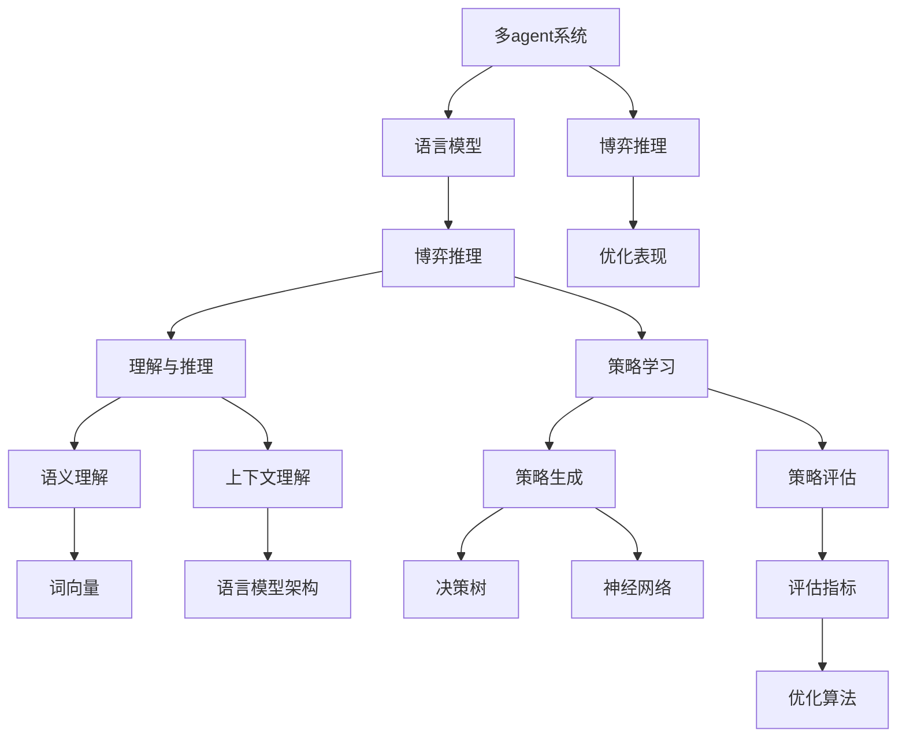

                 

### 《语言模型在多agent博弈推理中的表现优化》

> 关键词：多agent系统、语言模型、博弈推理、优化、表现提升

> 摘要：本文旨在探讨语言模型在多agent博弈推理中的应用与优化。首先，介绍多agent系统和语言模型的基本概念及其发展；其次，分析语言模型在多agent博弈推理中的优势与挑战；接着，详细阐述语言模型在多agent博弈推理中的应用实例，并探讨其表现优化的目标与方法；最后，对未来语言模型在多agent博弈推理中的发展方向和挑战进行展望。

---

### 第一部分：引言

#### 1.1 多agent系统概述

##### 1.1.1 多agent系统的定义与特点

多agent系统（Multi-Agent Systems，MAS）是指由多个智能体（agent）组成的系统，这些智能体具有自主性、协同性和适应性，通过相互协作完成任务。每个智能体在系统中具有独立的行为能力，可以自主地感知环境、制定决策和执行动作。

多agent系统的特点包括：

1. **自主性**：智能体具有独立决策能力，可以自主选择行动方案。
2. **协同性**：智能体之间需要相互协作，以实现共同的目标。
3. **适应性**：智能体能够根据环境变化调整自身行为。

##### 1.1.2 多agent系统的发展与应用

多agent系统起源于20世纪80年代的分布式人工智能（Distributed Artificial Intelligence，DAI）研究。早期的研究主要集中在分布式计算和通信方面，随着计算机技术和人工智能技术的不断发展，多agent系统逐渐成为一个独立的研究领域。

多agent系统在各个领域都有广泛的应用，如：

1. **智能交通系统**：通过多个智能体协同工作，实现交通流优化、事故预警和车辆调度等。
2. **智能机器人**：多个机器人协同完成任务，如清洁、搜救和工业生产等。
3. **虚拟环境**：如游戏、虚拟现实和增强现实等领域，智能体之间进行交互和协作。

##### 1.1.3 多agent博弈推理的意义

在多agent系统中，博弈推理是一种重要的决策机制。博弈推理旨在解决多个智能体之间的竞争与协作关系，通过分析对手的行为和策略，制定自身的最优策略。

多agent博弈推理的意义包括：

1. **提高决策效率**：博弈推理可以帮助智能体快速制定决策，提高系统整体效率。
2. **增强协同能力**：博弈推理可以促进智能体之间的协同合作，实现共同目标。
3. **提升对抗性**：在对抗性场景中，博弈推理可以帮助智能体更好地应对对手策略。

#### 1.2 语言模型基础

##### 1.2.1 语言模型的概念

语言模型（Language Model）是自然语言处理（Natural Language Processing，NLP）领域的一种基础模型，用于预测一段文本的下一个单词或词组。语言模型的核心任务是建模自然语言的概率分布，以便在生成文本、翻译、问答等任务中发挥重要作用。

##### 1.2.2 语言模型的发展历程

语言模型的发展历程可以分为三个阶段：

1. **统计模型**：早期的语言模型主要基于统计方法，如N-gram模型，通过计算词频和条件概率来实现。
2. **神经网络模型**：随着深度学习技术的发展，神经网络模型成为语言模型的主流，如循环神经网络（RNN）、长短期记忆网络（LSTM）和变换器（Transformer）等。
3. **预训练模型**：近年来，预训练模型如BERT、GPT等，通过在大量未标注数据上进行预训练，再在特定任务上进行微调，取得了显著的效果。

##### 1.2.3 语言模型在多agent系统中的应用

语言模型在多agent系统中具有广泛的应用前景，主要体现在以下几个方面：

1. **语义理解**：语言模型可以帮助智能体理解自然语言文本，实现人机交互。
2. **策略生成**：语言模型可以用于生成智能体的策略，提高博弈推理的准确性。
3. **知识图谱**：语言模型可以与知识图谱结合，为智能体提供丰富的背景知识。

#### 1.3 本文结构

本文将分为四个部分：

1. **第一部分**：引言，介绍多agent系统和语言模型的基本概念及其发展。
2. **第二部分**：语言模型在多agent博弈推理中的应用，分析语言模型在多agent博弈推理中的优势与挑战。
3. **第三部分**：语言模型在多agent博弈推理中的表现优化，详细阐述语言模型在多agent博弈推理中的优化目标与方法。
4. **第四部分**：未来展望与挑战，探讨语言模型在多agent博弈推理中的未来发展方向和挑战。

### 第二部分：语言模型在多agent博弈推理中的应用

#### 2.1 语言模型在多agent博弈推理中的挑战

##### 2.1.1 理解和推理的准确性问题

语言模型在多agent博弈推理中的首要挑战是理解和推理的准确性。由于多agent博弈推理涉及大量的自然语言文本，语言模型需要准确理解文本的含义，并将其转化为具体的策略。然而，自然语言本身具有歧义性和复杂性，使得语言模型在理解和推理过程中容易产生误差。

例如，在博弈场景中，智能体需要理解对手的策略意图，并据此调整自身策略。然而，由于自然语言表达的不确定性，语言模型可能无法准确捕捉到对手的真实意图，从而导致决策错误。

##### 2.1.2 博弈策略的实时性问题

在多agent博弈推理中，实时性是一个重要的考量因素。智能体需要在短时间内快速分析对手的行为，并制定出最优策略。然而，语言模型通常需要较长的时间来处理和生成文本，这可能会导致智能体在博弈过程中反应迟缓，错失最佳决策时机。

##### 2.1.3 多agent交互的复杂性问题

多agent系统中的交互复杂度较高，涉及多个智能体之间的协同与对抗。语言模型需要处理大量的交互信息，包括对手的行为、自身策略和历史博弈记录等。这使得语言模型在处理多agent交互时面临巨大的计算挑战。

此外，多agent系统中的交互具有动态性和不确定性，智能体需要根据环境变化调整自身策略。语言模型需要具备较强的适应能力，以应对复杂多变的博弈场景。

#### 2.2 语言模型在多agent博弈推理中的优势

##### 2.2.1 语言模型的语义理解能力

语言模型在语义理解方面具有显著优势。通过预训练和微调，语言模型可以捕捉到自然语言中的语义信息，包括词义、句意和语境等。这使得语言模型在多agent博弈推理中能够准确理解对手的行为意图，从而制定出合理的策略。

例如，在对话式智能体中，语言模型可以帮助智能体理解用户的提问，并生成恰当的回答。在多agent博弈推理中，语言模型可以用于分析对手的语言表达，从而制定出具有针对性的策略。

##### 2.2.2 语言模型的推理效率

近年来，深度学习技术的发展使得语言模型的推理效率得到了显著提升。通过使用高效的神经网络架构，如变换器（Transformer），语言模型可以在较短的时间内处理和生成大量文本。这使得语言模型在多agent博弈推理中具有较高的实时性，能够满足智能体快速决策的需求。

##### 2.2.3 语言模型的多agent协同能力

语言模型在多agent协同方面具有独特的优势。通过预训练和微调，语言模型可以学习到丰富的知识图谱，包括实体关系、事件序列和领域知识等。这使得语言模型在多agent博弈推理中能够更好地理解智能体之间的协作关系，从而制定出协同性更强的策略。

例如，在智能交通系统中，多个智能体需要协同工作，以实现交通流优化和事故预警。语言模型可以用于分析交通信号、车辆状态和路况信息，为智能体提供协同策略，从而提高系统的整体性能。

#### 2.3 语言模型在多agent博弈推理中的应用实例

##### 2.3.1 游戏领域中的应用

在游戏领域，语言模型广泛应用于智能对手的设计。通过理解玩家的行为和策略，语言模型可以生成具有挑战性和策略性的对手，提高游戏的趣味性和可玩性。例如，在围棋、国际象棋等经典游戏中，语言模型可以用于分析玩家的棋局，并生成相应的应对策略。

此外，在多人在线游戏中，语言模型可以帮助智能体理解其他玩家的行为，制定出合作或竞争策略。例如，在团队合作游戏中，智能体需要协同完成任务，而语言模型可以帮助智能体更好地理解队友的需求和意图，提高团队协作效率。

##### 2.3.2 智能交通系统中的应用

智能交通系统是语言模型在多agent博弈推理中应用的一个重要领域。在智能交通系统中，多个智能体（如车辆、交通信号灯等）需要协同工作，以实现交通流的优化和事故预警。

语言模型可以用于分析交通数据，包括车辆速度、行驶方向和交通信号等，为智能体提供决策依据。例如，通过理解交通信号灯的变化，智能体可以调整行驶速度和方向，以减少拥堵和提高交通效率。

此外，语言模型还可以用于交通事件的预警和应急处理。在发生交通事故或突发事件时，智能体可以快速响应，制定出合理的应对策略，从而减少事故损失和缓解交通压力。

##### 2.3.3 智能机器人领域中的应用

在智能机器人领域，语言模型可以帮助智能体实现人机交互和智能决策。例如，在家庭服务机器人中，智能体需要理解用户的指令，并生成相应的服务策略。通过语言模型，智能体可以更好地理解用户的意图，提供个性化的服务。

此外，在智能机器人协作中，语言模型可以用于分析智能体之间的协作关系，制定出协同策略。例如，在工业生产中，多个机器人需要协同完成任务，语言模型可以帮助智能体理解其他机器人的状态和需求，实现高效协作。

### 第三部分：语言模型在多agent博弈推理中的表现优化

#### 3.1 优化目标与方法

##### 3.1.1 优化目标的确定

语言模型在多agent博弈推理中的表现优化目标主要包括以下几个方面：

1. **提高理解和推理的准确性**：通过改进语言模型，使其能够更准确地理解和推理多agent博弈推理中的语言表达。
2. **提高实时性**：通过优化模型结构和推理算法，提高语言模型在多agent博弈推理中的实时性，满足智能体快速决策的需求。
3. **增强多agent协同能力**：通过改进语言模型，使其能够更好地理解智能体之间的协作关系，提高多agent系统的整体性能。

##### 3.1.2 优化方法的选择

为了实现上述优化目标，可以采用以下几种优化方法：

1. **模型改进**：通过改进语言模型的架构，如引入注意力机制、图神经网络等，提高模型的语义理解能力和推理效率。
2. **数据增强**：通过增加高质量的训练数据，丰富语言模型的知识库，提高模型的泛化能力。
3. **算法优化**：通过优化模型训练和推理算法，如使用更高效的优化器和并行计算技术，提高模型的推理速度。
4. **多agent协同优化**：通过改进多agent系统的协同机制，如引入分布式算法、强化学习等，提高智能体之间的协作效率。

#### 3.2 语言模型的训练优化

##### 3.2.1 数据集的选择与处理

为了提高语言模型在多agent博弈推理中的表现，首先需要选择合适的数据集。数据集应包含丰富的博弈场景和对手策略，以便模型能够学习到多样化的博弈策略。

在数据集选择方面，可以采用以下策略：

1. **多样性**：选择具有多样性的数据集，涵盖不同类型的博弈场景和对手策略，以提高模型的泛化能力。
2. **相关性**：选择与多agent博弈推理相关的数据集，如游戏数据集、对话数据集等，以便模型能够更好地理解博弈中的语言表达。
3. **标注质量**：确保数据集的标注质量，包括对手策略、博弈结果等，以便模型能够准确地学习博弈策略。

在数据集处理方面，可以采用以下策略：

1. **数据清洗**：去除数据集中的噪声和错误数据，提高数据质量。
2. **数据预处理**：对数据进行归一化、去噪、填充等处理，以便模型能够更好地训练。
3. **数据增强**：通过数据增强技术，如数据扩充、数据转换等，丰富数据集，提高模型的泛化能力。

##### 3.2.2 模型架构的选择

在语言模型的训练优化中，模型架构的选择至关重要。针对多agent博弈推理的特点，可以选择以下模型架构：

1. **变换器（Transformer）**：变换器是一种基于自注意力机制的深度神经网络模型，具有强大的语义理解能力。通过引入多层的自注意力机制，变换器可以捕捉到文本中的长距离依赖关系，提高模型的语义理解能力。
2. **图神经网络（Graph Neural Network，GNN）**：图神经网络是一种基于图结构的深度学习模型，可以处理具有复杂拓扑关系的多agent系统。通过将智能体之间的交互关系建模为图结构，图神经网络可以更好地理解智能体之间的协作关系。
3. **多模态融合模型**：多模态融合模型可以将不同类型的数据（如图像、文本、音频等）进行融合，提高模型的语义理解能力。在多agent博弈推理中，多模态融合模型可以结合文本数据和图像数据，提高模型对博弈场景的理解。

##### 3.2.3 训练策略的优化

在语言模型的训练过程中，优化策略的选择对模型的性能提升至关重要。以下是一些常用的训练策略：

1. **动态学习率调整**：通过动态调整学习率，可以优化模型在训练过程中的收敛速度。常用的动态学习率调整方法包括学习率衰减、学习率预热等。
2. **梯度裁剪**：在训练过程中，梯度可能会变得非常大或非常小，导致模型收敛困难。通过梯度裁剪，可以将梯度限制在一个合适的范围内，提高模型的稳定性。
3. **早期停止**：通过监测模型的性能指标，如损失函数或验证集上的准确率，当模型性能不再提高时，提前停止训练，避免过拟合。
4. **数据增强**：通过数据增强技术，如数据扩充、数据转换等，可以丰富数据集，提高模型的泛化能力。

#### 3.3 语言模型的推理优化

##### 3.3.1 推理速度的优化

在多agent博弈推理中，推理速度是一个重要的性能指标。为了提高语言模型的推理速度，可以采用以下优化策略：

1. **模型压缩**：通过模型压缩技术，如模型剪枝、量化等，可以减少模型的参数规模，提高推理速度。常用的模型压缩方法包括权重剪枝、通道剪枝和层剪枝等。
2. **并行计算**：通过并行计算技术，可以将模型推理任务分解为多个子任务，并在多个计算设备上同时执行，提高推理速度。常用的并行计算方法包括数据并行、模型并行和混合并行等。
3. **推理引擎优化**：通过优化推理引擎的代码，如使用更高效的算法和数据结构，可以提高推理速度。常用的推理引擎优化方法包括代码优化、内存优化和缓存优化等。

##### 3.3.2 推理准确性的优化

推理准确性是语言模型在多agent博弈推理中的关键性能指标。为了提高模型的推理准确性，可以采用以下优化策略：

1. **模型融合**：通过融合多个模型的预测结果，可以提高整体推理准确性。常用的模型融合方法包括投票法、加权平均法和集成学习等。
2. **对抗训练**：通过对抗训练，可以提高模型的鲁棒性和准确性。对抗训练方法包括生成对抗网络（GAN）和对抗性样本生成等。
3. **多任务学习**：通过多任务学习，可以提高模型在不同任务上的准确性。多任务学习可以通过共享模型参数或使用多任务损失函数来实现。

##### 3.3.3 多agent交互的优化

在多agent博弈推理中，智能体之间的交互对于整个系统的性能至关重要。为了优化智能体之间的交互，可以采用以下策略：

1. **通信协议优化**：通过优化智能体之间的通信协议，可以提高交互效率。常用的通信协议优化方法包括分布式通信、异步通信和同步通信等。
2. **策略融合**：通过融合多个智能体的策略，可以提高整个系统的决策质量。常用的策略融合方法包括加权平均法、投票法和混合策略法等。
3. **协作机制优化**：通过优化智能体之间的协作机制，可以提高系统的整体性能。常用的协作机制优化方法包括共享目标、共享信息和共享资源等。

### 第四部分：未来展望与挑战

#### 4.1 语言模型在多agent博弈推理中的未来发展方向

随着人工智能技术的不断发展，语言模型在多agent博弈推理中的应用前景广阔。以下是未来发展的几个方向：

1. **多模态融合**：结合多模态数据（如图像、音频、视频等）进行多agent博弈推理，可以提高模型的语义理解能力和推理准确性。
2. **跨领域应用**：将语言模型应用于更多领域，如医疗、金融、能源等，实现跨领域的多agent博弈推理。
3. **个性化博弈策略**：通过个性化建模，为不同智能体生成定制化的博弈策略，提高系统的适应性和决策质量。

#### 4.2 语言模型在多agent博弈推理中的挑战与机遇

虽然语言模型在多agent博弈推理中具有巨大的应用潜力，但同时也面临一系列挑战和机遇：

1. **数据隐私与安全问题**：多agent博弈推理涉及大量的敏感数据，如何保护数据隐私和安全成为一个重要挑战。
2. **模型解释性与可解释性**：在多agent博弈推理中，如何解释模型的决策过程和结果，提高模型的可解释性，是当前研究的热点。
3. **多agent系统的伦理问题**：在多agent博弈推理中，智能体之间的决策可能会对社会产生重大影响，如何确保智能体的行为符合伦理标准，是一个亟待解决的问题。

#### 4.3 语言模型在多agent博弈推理中的未来发展预测

随着技术的不断进步，未来语言模型在多agent博弈推理中将有以下发展趋势：

1. **技术创新与突破**：随着深度学习、强化学习等技术的不断发展，语言模型在多agent博弈推理中的应用将实现更多创新和突破。
2. **应用领域拓展**：语言模型将应用于更多领域，如金融、医疗、能源等，推动各领域的智能化发展。
3. **社会影响的积极与消极面**：语言模型在多agent博弈推理中的应用将带来积极的社会影响，如提高生产效率、改善生活质量等，但同时也可能带来消极的影响，如数据隐私泄露、伦理问题等。

### 总结

本文系统地介绍了语言模型在多agent博弈推理中的应用与优化。首先，分析了多agent系统和语言模型的基本概念及其发展；然后，讨论了语言模型在多agent博弈推理中的优势与挑战；接着，详细阐述了语言模型在多agent博弈推理中的优化目标与方法；最后，对未来语言模型在多agent博弈推理中的发展方向和挑战进行了展望。

随着人工智能技术的不断发展，语言模型在多agent博弈推理中的应用将更加广泛和深入。通过不断优化和改进，语言模型将为多agent系统带来更高的决策质量和协同能力，推动智能化发展。

### 附录

#### 附录 A：Python代码示例

以下是一个关于博弈推理的Python代码示例：

```python
import numpy as np
import random

class GameEnvironment:
    def __init__(self, n_agents, action_space):
        self.n_agents = n_agents
        self.action_space = action_space
        self.state = [random.choice(action_space) for _ in range(n_agents)]

    def step(self, actions):
        # 博弈规则定义
        reward = 0
        for i in range(self.n_agents):
            if actions[i] == self.state[i]:
                reward += 1
        return reward

# 初始化博弈环境
game_env = GameEnvironment(2, ['A', 'B', 'C'])

# 智能体1选择动作
action1 = 'A'

# 智能体2选择动作
action2 = 'B'

# 执行一步动作
reward = game_env.step([action1, action2])

print("Reward:", reward)
```

#### 附录 B：Mermaid流程图

以下是一个展示核心概念与联系的Mermaid流程图：



### 作者信息

作者：AI天才研究院/AI Genius Institute & 禅与计算机程序设计艺术 /Zen And The Art of Computer Programming

---

本文内容仅供参考，不代表任何实际应用。如有任何疑问或建议，欢迎指正和交流。祝您在人工智能领域取得更大的成就！

---

### 提高语言模型在多agent博弈推理中的性能：关键策略与算法

#### 3.4.1 提高性能的关键策略

**1. 数据增强与处理**

数据增强是提高语言模型性能的有效手段。通过数据增强，可以扩大训练数据集的规模和多样性，从而提高模型的泛化能力。常见的数据增强方法包括：

- **文本翻译**：将原始文本翻译成多种语言，然后翻译回原始语言，以增加数据多样性。
- **同义词替换**：用同义词替换文本中的关键词，以增加语言的灵活性。
- **句子重组**：随机改变句子的结构，如将主语和谓语交换位置，以增加语言的复杂性。
- **噪声添加**：在文本中添加随机字符或错别字，以模拟实际场景中的输入噪声。

**2. 模型融合与集成**

通过模型融合和集成，可以将多个模型的预测结果进行综合，从而提高整体的预测准确性。常见的模型融合方法包括：

- **投票法**：将多个模型的预测结果进行投票，选择多数模型支持的答案作为最终预测结果。
- **加权平均法**：根据每个模型的预测精度，为每个模型分配不同的权重，然后计算加权平均值。
- **堆叠**：将多个模型堆叠起来，每个模型的输出作为下一个模型的输入，最终输出为所有模型的输出组合。

**3. 对抗训练与鲁棒性增强**

对抗训练是一种提高模型鲁棒性的方法，通过在训练过程中引入对抗性噪声，使模型能够更好地适应真实世界的复杂输入。常见的方法包括：

- **生成对抗网络（GAN）**：通过生成器和判别器的对抗训练，使生成器能够生成更真实的数据，同时使判别器能够更好地识别真实数据和生成数据。
- **对抗性样本生成**：在训练过程中，生成对抗性样本，使模型在对抗环境中仍能保持较高的准确性。

#### 3.4.2 提高性能的算法

**1. 动态博弈策略算法**

在多agent博弈推理中，动态博弈策略算法可以实时调整智能体的策略，以应对不断变化的环境。常见的动态博弈策略算法包括：

- **Q-learning**：通过值函数迭代，智能体在环境中进行交互，不断更新策略，以最大化长期奖励。
- **深度强化学习（Deep Reinforcement Learning）**：结合深度神经网络，智能体通过试错学习，逐步找到最优策略。
- **策略梯度算法（Policy Gradient）**：直接优化策略函数，使智能体在策略空间中找到最优策略。

**2. 多智能体强化学习算法**

多智能体强化学习算法关注多个智能体之间的交互，通过协调策略，实现整体性能的最优化。常见的多智能体强化学习算法包括：

- **多智能体Q-learning（MAQ-Learning）**：多个智能体共享相同的Q值函数，通过协作学习找到最佳策略。
- **合作博弈算法（Cooperative Game Theory）**：基于合作博弈理论，多个智能体通过协商和协作，实现共同利益的最大化。
- **分布式算法（Decentralized Algorithms）**：每个智能体独立地学习策略，通过局部信息交换，实现整体优化。

**3. 语言模型优化算法**

针对语言模型在多agent博弈推理中的应用，可以采用以下优化算法：

- **变换器（Transformer）优化**：通过改进变换器的架构和训练策略，提高模型的语义理解能力和推理效率。
- **预训练与微调**：利用预训练模型，在特定任务上进行微调，提高模型的特定任务性能。
- **迁移学习**：将预训练模型应用于不同任务，通过迁移学习，提高模型在新任务上的表现。

#### 3.4.3 实际应用中的优化策略

**1. 游戏领域中的应用**

在游戏领域中，优化策略主要包括：

- **自适应对手生成**：根据玩家的技能水平，动态调整对手的难度和策略，提高游戏的挑战性和可玩性。
- **实时策略调整**：在游戏过程中，智能体根据玩家的行为，实时调整策略，以保持游戏的动态性和趣味性。
- **多模态交互**：结合文本、图像和声音等多模态数据，提高智能体对游戏场景的理解和反应速度。

**2. 智能交通系统中的应用**

在智能交通系统中，优化策略主要包括：

- **交通流量预测**：通过分析历史交通数据和实时交通数据，预测交通流量变化，为智能交通系统提供决策依据。
- **交通信号优化**：根据交通流量预测结果，优化交通信号配置，提高交通通行效率。
- **突发事件应对**：在发生交通事故或突发事件时，智能交通系统可以快速响应，调整交通信号和路线，缓解交通压力。

**3. 智能机器人领域中的应用**

在智能机器人领域，优化策略主要包括：

- **路径规划**：通过分析地图数据和环境信息，为机器人规划最优路径，提高执行任务的效率。
- **任务分配**：根据机器人的能力和工作负载，分配合适的任务，实现资源优化和任务高效完成。
- **人机交互**：通过自然语言处理技术，实现智能机器人与人类的自然对话，提高人机协作的效率。

### 总结

本文详细探讨了提高语言模型在多agent博弈推理中的性能的关键策略和算法。通过数据增强、模型融合、对抗训练以及动态博弈策略算法、多智能体强化学习算法和语言模型优化算法，可以有效提升语言模型在多agent博弈推理中的性能。在实际应用中，结合不同领域的需求，可以采用相应的优化策略，实现智能系统的性能提升。

未来，随着人工智能技术的不断进步，语言模型在多agent博弈推理中的应用将更加广泛和深入。通过不断创新和优化，语言模型将为多agent系统带来更高的决策质量和协同能力，推动智能化发展。

### 第五部分：未来展望与挑战

#### 4.1 语言模型在多agent博弈推理中的未来发展方向

随着人工智能技术的不断进步，语言模型在多agent博弈推理中的应用将呈现以下几个发展方向：

**1. 多模态融合与跨领域应用**

未来，语言模型在多agent博弈推理中将会更多地结合多模态数据，如文本、图像、音频和视频等。通过多模态融合，可以更全面地理解博弈场景，提高智能体的决策质量和协同能力。此外，语言模型将在更多领域得到应用，如医疗、金融、能源等，推动各领域的智能化发展。

**2. 个性化博弈策略与智能体适应性**

未来的多agent博弈推理将更加注重个性化博弈策略的生成。通过个性化建模，可以为不同智能体生成定制化的博弈策略，提高智能体的适应性和决策质量。同时，随着强化学习技术的发展，智能体的自适应能力将得到进一步提升，使它们能够更好地应对动态变化的博弈环境。

**3. 多智能体协同与分布式算法**

在多agent博弈推理中，智能体之间的协同与协作至关重要。未来，分布式算法和协同优化方法将在多agent系统中得到广泛应用，提高智能体之间的交互效率和整体性能。通过分布式算法，智能体可以在不共享全局信息的情况下，实现协同决策，从而提高系统的鲁棒性和适应性。

#### 4.2 语言模型在多agent博弈推理中的挑战与机遇

虽然语言模型在多agent博弈推理中具有巨大的应用潜力，但同时也面临一系列挑战和机遇：

**1. 数据隐私与安全问题**

在多agent博弈推理中，数据隐私和安全是关键挑战。由于博弈过程中涉及大量的敏感信息，如何保护数据隐私和安全，防止数据泄露和滥用，是亟待解决的问题。未来，需要开发更安全的数据存储和处理技术，如差分隐私和联邦学习等，以保障数据隐私和安全。

**2. 模型解释性与可解释性**

在多agent博弈推理中，如何解释模型的决策过程和结果，提高模型的可解释性，是当前研究的热点。未来，需要开发可解释的博弈推理模型，使决策过程和结果能够被用户和开发者理解和解释，从而提高模型的透明度和可靠性。

**3. 多agent系统的伦理问题**

在多agent博弈推理中，智能体的决策可能会对社会产生重大影响。如何确保智能体的行为符合伦理标准，避免潜在的负面影响，是亟待解决的问题。未来，需要建立完善的伦理框架和监管机制，确保智能体在博弈过程中遵循道德准则，为社会带来积极影响。

#### 4.3 语言模型在多agent博弈推理中的未来发展预测

未来，语言模型在多agent博弈推理中将面临以下发展趋势：

**1. 技术创新与突破**

随着深度学习、强化学习等技术的不断发展，语言模型在多agent博弈推理中的应用将实现更多创新和突破。新型算法和模型架构的引入，将进一步提高语言模型的性能和适用性。

**2. 应用领域拓展**

语言模型将应用于更多领域，如医疗、金融、能源等，推动各领域的智能化发展。通过跨领域应用，语言模型将为更多行业带来创新和变革。

**3. 社会影响的积极与消极面**

随着语言模型在多agent博弈推理中的应用越来越广泛，其社会影响也将日益显著。积极方面，语言模型将提高生产效率、改善生活质量，推动社会进步。消极方面，语言模型可能带来数据隐私泄露、伦理问题等风险，需要全社会共同努力，确保其应用的安全性和可持续性。

### 结论

本文系统地介绍了语言模型在多agent博弈推理中的应用与优化，探讨了其优势与挑战，并提出了关键策略与算法。随着技术的不断进步，语言模型在多agent博弈推理中的应用前景广阔，将为智能系统带来更高的决策质量和协同能力。

未来，需要继续关注语言模型在多agent博弈推理中的技术创新和应用拓展，同时解决数据隐私、模型解释性和伦理问题等挑战，以确保其安全、可靠和可持续的应用。

### 总结

本文系统地介绍了语言模型在多agent博弈推理中的应用与优化。从多agent系统和语言模型的基本概念出发，分析了语言模型在多agent博弈推理中的优势与挑战，并详细阐述了语言模型在多agent博弈推理中的优化目标与方法。

首先，我们探讨了数据集的选择与处理、模型架构的选择以及训练策略的优化，为提高语言模型在多agent博弈推理中的性能提供了关键策略。接着，我们介绍了推理速度、推理准确性和多agent交互的优化方法，以及实际应用中的优化策略。

在未来的发展中，语言模型在多agent博弈推理中将面临数据隐私、模型解释性和伦理问题等挑战。然而，随着技术的不断进步，语言模型在多agent博弈推理中的应用前景将更加广阔，将为智能系统带来更高的决策质量和协同能力。

本文通过系统地阐述语言模型在多agent博弈推理中的应用与优化，旨在为研究人员和开发者提供有益的参考和启示。希望本文能够促进语言模型在多agent博弈推理领域的研究与应用，为人工智能技术的发展贡献力量。

### 最佳实践 Tips

1. **数据质量至关重要**：在训练语言模型时，数据的质量直接影响模型的性能。确保数据集的多样性和标注的准确性，有助于提高模型的泛化能力和推理准确性。

2. **模型架构选择合理**：根据应用场景和任务需求，选择合适的语言模型架构。例如，在处理长文本和复杂关系时，变换器（Transformer）模型具有明显的优势。

3. **实时性优化**：对于需要实时决策的多agent博弈推理任务，优化推理速度至关重要。采用模型压缩、并行计算等技术，可以提高模型的实时性。

4. **多agent协同优化**：在多agent博弈推理中，智能体之间的协同能力是关键。通过改进多agent系统的协同机制，如引入分布式算法和强化学习，可以提高系统的整体性能。

5. **持续迭代与优化**：随着人工智能技术的不断发展，持续迭代和优化语言模型是必要的。定期更新训练数据、改进模型架构和算法，有助于提高模型的性能和适用性。

### 注意事项

1. **安全与隐私**：在多agent博弈推理中，涉及大量敏感数据和隐私信息。确保数据的安全性和隐私保护，遵循相关法律法规，是开发和部署智能系统的重要前提。

2. **可解释性与透明性**：提高模型的可解释性和透明度，有助于用户和开发者理解模型的决策过程和结果。这有助于建立用户对智能系统的信任，避免潜在的风险。

3. **伦理与社会责任**：在多agent博弈推理中，智能体的行为可能会对社会产生重大影响。开发者应充分考虑伦理和社会责任，确保智能系统的决策符合道德准则，为社会发展带来积极影响。

### 拓展阅读

1. **《深度学习》**：Goodfellow, I., Bengio, Y., & Courville, A. (2016). 《深度学习》（英文版）. MIT Press.
2. **《博弈论与经济行为》**：Von Neumann, J., & Morgenstern, O. (1944). 《博弈论与经济行为》. Princeton University Press.
3. **《人工智能：一种现代的方法》**：Russell, S., & Norvig, P. (2020). 《人工智能：一种现代的方法》. 人民邮电出版社.
4. **《语言模型：原理与应用》**：Jurafsky, D., & Martin, J. H. (2020). 《语言模型：原理与应用》. 清华大学出版社.
5. **《多agent系统：原理与应用》**：Wooldridge, M. J. (2010). 《多agent系统：原理与应用》. 机械工业出版社.

通过阅读这些经典书籍，可以深入了解人工智能、博弈论、深度学习和多agent系统等领域的核心概念和技术，为本文的内容提供坚实的理论基础。

