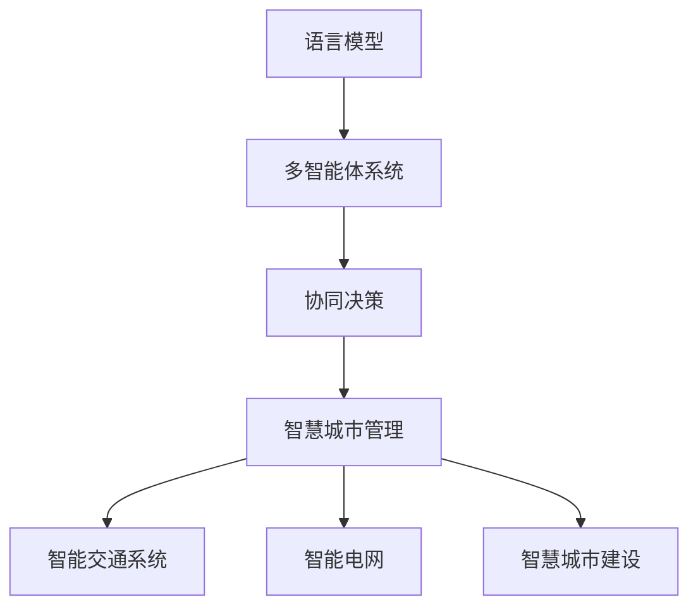

                 

**

### 1.1.1 书籍背景

**背景介绍**

随着信息技术的快速发展，人工智能、多智能体系统和智慧城市等概念逐渐走进了人们的视野。其中，语言模型作为自然语言处理的核心技术之一，已经在众多领域展现出了其强大的应用潜力。多智能体协同决策作为人工智能领域的一个重要分支，旨在通过多个智能体的协作实现复杂任务的优化。而智慧城市管理则是利用现代信息技术对城市资源进行高效管理和优化配置。本书旨在探讨语言模型在多智能体协同决策与智慧城市管理中的应用，旨在为相关领域的科研工作者和实践者提供有价值的参考。

**语言模型的发展历程**

语言模型的研究始于20世纪50年代，最初采用基于规则的方法。随着计算机性能的提高和大数据的涌现，统计模型和深度学习模型逐渐成为主流。从n-gram模型到隐马尔可夫模型（HMM），再到递归神经网络（RNN）和长短期记忆网络（LSTM），语言模型的理论和技术不断演进。近年来，生成对抗网络（GAN）和变分自编码器（VAE）等新兴技术也为语言模型的优化提供了新的思路。

**多智能体协同决策与智慧城市管理的需求与现状**

随着城市化进程的加快，城市管理者面临着日益复杂的交通、能源和环境问题。多智能体协同决策通过多个智能体的协作，可以有效解决这些问题。智慧城市管理则利用物联网、大数据和云计算等技术，实现对城市资源的高效管理和优化配置。目前，多智能体协同决策与智慧城市管理已经得到了广泛应用，但仍存在一些挑战，如数据隐私、安全性和实时性等。

**书籍的目的和读者对象**

本书的目的是系统地介绍语言模型在多智能体协同决策与智慧城市管理中的应用，帮助读者了解相关技术原理、算法实现和应用案例。本书适合从事人工智能、多智能体系统和智慧城市管理等领域的研究人员和工程技术人员阅读，也可作为相关领域高校和研究机构的教材或参考书。

### 2.1 语言模型概述

**语言模型的基本概念**

语言模型（Language Model，LM）是一种用于预测自然语言序列的模型，它基于大量语言数据，学习出词语之间的关系和概率分布。语言模型的核心任务是给定一个词或短语的序列，预测下一个词或短语的概率。

**语言模型的作用**

语言模型在自然语言处理领域具有广泛的应用，包括但不限于：

1. **文本生成**：如聊天机器人、自动摘要、文章写作等。
2. **机器翻译**：如将一种语言的文本翻译成另一种语言。
3. **语音识别**：如将语音信号转换成文本。
4. **搜索引擎**：如预测用户可能输入的查询词。
5. **情感分析**：如分析文本的情感倾向。

**常见的语言模型类型**

1. **n-gram模型**：基于前n个单词的概率分布进行预测。
2. **隐马尔可夫模型（HMM）**：将语言建模任务转化为状态转移概率的计算。
3. **递归神经网络（RNN）**：能够处理变长输入序列，适用于自然语言处理任务。
4. **长短期记忆网络（LSTM）**：RNN的一种变体，能够更好地捕捉长距离依赖关系。
5. **卷积神经网络（CNN）**：常用于文本分类和文本特征提取。
6. **递归卷积神经网络（RCNN）**：结合了RNN和CNN的优势，适用于复杂自然语言处理任务。
7. **变分自编码器（VAE）**：生成式模型，可用于生成新的文本序列。
8. **生成对抗网络（GAN）**：通过生成器和判别器的对抗训练，生成高质量的文本序列。

### 2.2 语言模型算法

**n-gram模型**

n-gram模型是最简单的语言模型之一，它基于相邻单词的概率分布进行预测。具体来说，n-gram模型将文本序列分成n个连续的单词，然后计算每个单词序列的概率。

**隐马尔可夫模型（HMM）**

隐马尔可夫模型是一种统计模型，用于描述一系列随机事件的概率分布。在自然语言处理中，HMM被用于语音识别和词性标注等任务。HMM的关键思想是将文本序列视为一系列隐藏状态序列的输出，每个状态对应一个单词。

**递归神经网络（RNN）**

递归神经网络是一种能够处理变长输入序列的神经网络。在自然语言处理中，RNN常用于文本分类、序列标注和机器翻译等任务。RNN的核心特点是能够将前一个时间步的输出作为当前时间步的输入，从而捕捉序列中的长距离依赖关系。

**卷积神经网络（CNN）**

卷积神经网络是一种常用于图像处理的神经网络，但在自然语言处理领域也逐渐得到了应用。CNN的主要特点是能够自动提取文本中的局部特征，如词组和短语。

**递归卷积神经网络（RCNN）**

递归卷积神经网络结合了RNN和CNN的优势，能够同时处理变长输入序列和文本的局部特征。RCNN在自然语言处理领域具有广泛的应用，如文本分类、情感分析和机器翻译等。

**变分自编码器（VAE）**

变分自编码器是一种生成式模型，通过编码和解码器学习数据的概率分布。在自然语言处理中，VAE被用于生成新的文本序列，如文章写作和对话生成。

**生成对抗网络（GAN）**

生成对抗网络是一种通过生成器和判别器的对抗训练来生成高质量数据的模型。在自然语言处理中，GAN被用于生成新的文本序列，如故事生成和对话生成。

### 2.3 语言模型评价与优化

**语言模型评价标准**

评价语言模型的标准主要包括：

1. **准确率（Accuracy）**：模型预测正确的比例。
2. **精确率（Precision）**：预测正确的比例。
3. **召回率（Recall）**：预测正确的比例。
4. **F1分数（F1 Score）**：精确率和召回率的调和平均。

**语言模型优化方法**

1. **特征工程**：通过特征提取和特征选择，提高模型的预测性能。
2. **超参数调整**：调整模型的超参数，如学习率、隐藏层大小等，以提高模型的泛化能力。
3. **正则化**：通过正则化方法，防止模型过拟合。
4. **迁移学习**：利用预训练模型，在新任务上获得更好的性能。

**语言模型应用案例分析**

1. **文本生成**：利用语言模型生成文章、对话和故事等。
2. **机器翻译**：将一种语言的文本翻译成另一种语言。
3. **语音识别**：将语音信号转换成文本。
4. **搜索引擎**：预测用户可能输入的查询词。

### 3.1 多智能体系统概述

**多智能体系统的定义**

多智能体系统（Multi-Agent System，MAS）是一种由多个智能体（Agent）组成的系统，这些智能体可以相互协作，以实现共同的目标。在多智能体系统中，智能体具有以下特点：

1. **自治性**：智能体可以自主地行动和决策。
2. **协作性**：智能体之间需要相互协作，以实现共同的目标。
3. **分布式**：智能体分布在不同的位置，可能具有不同的计算能力和感知能力。
4. **适应性**：智能体需要能够适应环境的变化，并做出相应的调整。

**多智能体系统的分类**

多智能体系统可以根据不同的分类标准进行分类，常见的分类方法包括：

1. **基于智能体类型的分类**：根据智能体的类型，可以将多智能体系统分为人类智能体、机器人智能体和软件智能体等。
2. **基于智能体能力的分类**：根据智能体的能力，可以将多智能体系统分为完全智能体、半智能体和无智能体等。
3. **基于智能体之间的交互方式的分类**：根据智能体之间的交互方式，可以将多智能体系统分为协同式、竞争式和混合式等。

**多智能体系统的特点**

多智能体系统具有以下特点：

1. **分布式计算**：多智能体系统可以将任务分布在多个智能体上，实现并行计算，提高效率。
2. **容错性**：由于智能体分布在不同的位置，当某个智能体出现故障时，其他智能体可以继续工作，提高系统的可靠性。
3. **灵活性**：多智能体系统可以根据环境的变化，动态调整智能体的任务和策略，以适应新的情况。
4. **适应性**：多智能体系统可以学习环境，并根据学习到的知识进行自适应调整。

### 3.2 多智能体协同决策算法

**分布式协同决策**

分布式协同决策是指在多智能体系统中，各个智能体独立地做出决策，并通过通信机制进行协调。分布式协同决策的主要目的是实现各个智能体的协作，以最大化整个系统的性能。

**集中式协同决策**

集中式协同决策是指在多智能体系统中，所有智能体的决策都由一个中心智能体（通常是一个主控器）统一做出。集中式协同决策的优点是决策过程简单，易于实现，但缺点是系统的复杂度和计算开销较大。

**基于博弈的多智能体协同决策**

基于博弈的多智能体协同决策是指各个智能体在决策时考虑其他智能体的行为，并基于博弈论的理论进行决策。基于博弈的多智能体协同决策的核心是建立合理的博弈模型，并求解博弈的纳什均衡。

**基于多目标优化的多智能体协同决策**

基于多目标优化的多智能体协同决策是指各个智能体在决策时考虑多个目标，并通过优化算法求解最优解。多目标优化的核心是建立多目标优化模型，并求解多目标优化问题的解。

### 3.3 多智能体协同决策应用案例分析

**智能交通系统**

智能交通系统（Intelligent Transportation System，ITS）是一种利用现代信息技术对交通进行管理和优化配置的系统。多智能体协同决策在智能交通系统中具有广泛的应用，如交通信号控制、车辆调度和路线规划等。

**智能电网**

智能电网（Smart Grid）是一种利用现代信息技术和智能设备对电力进行管理和优化的系统。多智能体协同决策在智能电网中可以用于电力调度、负荷预测和故障检测等任务。

**无人机协同**

无人机协同（UAV Collaborative Operations）是指多个无人机在特定任务中协同工作。多智能体协同决策在无人机协同中可以用于路径规划、任务分配和避障等任务。

**智慧城市建设**

智慧城市建设（Smart City Construction）是指利用现代信息技术对城市进行管理和优化配置。多智能体协同决策在智慧城市建设中可以用于城市交通管理、城市能源管理和城市环境监测等任务。

### 4.1 智慧城市管理概述

**智慧城市的基本概念**

智慧城市（Smart City）是指利用信息技术、物联网、大数据和云计算等现代技术，对城市资源进行高效管理和优化配置，以提高城市运行效率和居民生活质量。

**智慧城市的发展历程**

智慧城市的发展历程可以分为以下几个阶段：

1. **基础设施阶段**：城市管理者开始引入信息技术，如宽带网络和智能设备。
2. **信息化阶段**：城市管理者利用信息技术对城市资源进行数字化管理和优化配置。
3. **智能化阶段**：城市管理者利用大数据、人工智能和物联网等先进技术，实现城市管理的智能化。
4. **智慧化阶段**：城市管理者通过智慧城市平台，实现城市管理的全局优化和智能化。

**智慧城市的核心技术**

智慧城市的核心技术包括：

1. **物联网**：通过传感器和智能设备，实现对城市基础设施、交通和环境的实时监测和管理。
2. **大数据**：通过收集、存储、分析和处理大量数据，为城市管理者提供决策支持。
3. **云计算**：通过云计算平台，实现城市资源的弹性管理和高效利用。
4. **人工智能**：利用人工智能技术，实现城市管理的自动化和智能化。
5. **区块链**：通过区块链技术，实现城市数据的可信传输和管理。

### 4.2 智慧城市管理应用

**城市交通管理**

城市交通管理（Urban Traffic Management）是智慧城市管理的重要组成部分。通过智慧城市技术，可以实现城市交通的实时监测、智能调度和优化管理，从而提高交通效率、减少拥堵和降低事故率。

**城市能源管理**

城市能源管理（Urban Energy Management）是指利用信息技术对城市能源资源进行高效管理和优化配置。通过智慧城市技术，可以实现能源的实时监测、智能调度和优化管理，从而提高能源利用效率、降低能源消耗和减少环境污染。

**城市环境管理**

城市环境管理（Urban Environment Management）是指利用信息技术对城市环境进行实时监测、智能分析和优化管理。通过智慧城市技术，可以实现城市环境的实时监测、智能分析和优化管理，从而提高环境质量、减少污染和保障居民健康。

**城市安全与应急**

城市安全与应急（Urban Safety and Emergency Management）是指利用信息技术对城市安全进行实时监测、智能分析和应急响应。通过智慧城市技术，可以实现城市安全的实时监测、智能分析和应急响应，从而提高城市安全水平、减少事故率和保障居民安全。

### 4.3 智慧城市管理案例分析

**成功的智慧城市项目案例**

全球范围内，已有多个智慧城市项目取得了显著成果。以下是一些成功的智慧城市项目案例：

1. **新加坡**：新加坡通过智慧城市项目，实现了城市交通、能源和环境的高效管理，成为全球智慧城市的典范。
2. **阿布扎比**：阿布扎比通过智慧城市项目，实现了城市基础设施的智能化升级，提高了城市运行效率和居民生活质量。
3. **杭州**：杭州通过智慧城市项目，实现了城市交通、能源和环境的高效管理，成为国内智慧城市建设的典范。

**智慧城市建设的挑战与机遇**

智慧城市建设面临诸多挑战，如技术难度、资金投入、数据安全和隐私保护等。但与此同时，智慧城市建设也带来了巨大的机遇，如提高城市运行效率、降低运营成本、改善居民生活质量等。通过克服挑战和把握机遇，智慧城市建设将推动城市管理的转型升级。

**智慧城市未来发展展望**

未来，智慧城市建设将朝着更加智能化、互联化和协同化的方向发展。通过引入更先进的技术，如人工智能、物联网和区块链等，智慧城市将实现更加高效、智能和可持续的管理。此外，智慧城市还将推动城市管理的创新，如智能交通管理、智能能源管理和智能环境监测等，为城市居民提供更加便捷、舒适和安全的居住环境。

### 5.1 语言模型在多智能体协同决策中的应用

**智能交通系统的语言模型应用**

智能交通系统（Intelligent Transportation System，ITS）是智慧城市管理的重要组成部分。通过语言模型，可以实现对交通数据的实时分析，从而优化交通信号控制和交通流量管理。以下是一个简单的Python代码示例，展示了如何使用n-gram模型预测交通流量：

```python
import nltk
from nltk.tokenize import word_tokenize
from nltk.model import NgramModel

# 假设我们有一个包含历史交通数据的文本
text = "拥堵 拥堵 顺畅 顺畅 拥堵 顺畅"

# 将文本分割为单词序列
words = word_tokenize(text)

# 创建n-gram模型
n = 2
n_gram_model = NgramModel(n)

# 训练模型
n_gram_model.train(words)

# 预测下一个单词
next_word = n_gram_model.predict_n([words[-2], words[-1]])[0]

print(f"预测的下一个词是：{next_word}")
```

**智能电网的语言模型应用**

智能电网（Smart Grid）是另一个应用语言模型的领域。通过语言模型，可以实现对电力需求的实时预测，从而优化电力调度和资源分配。以下是一个简单的Python代码示例，展示了如何使用RNN模型预测电力需求：

```python
import tensorflow as tf
from tensorflow.keras.models import Sequential
from tensorflow.keras.layers import LSTM, Dense

# 假设我们有一个包含历史电力需求的序列
historical_data = [1, 2, 3, 4, 5, 6, 7, 8, 9, 10]

# 将数据分割为训练集和测试集
train_data = historical_data[:-1]
test_data = historical_data[1:]

# 创建序列数据
X_train = [train_data[i:i+5] for i in range(len(train_data)-5)]
y_train = [train_data[i+5] for i in range(len(train_data)-5)]

X_test = [test_data[i:i+5] for i in range(len(test_data)-5)]
y_test = [test_data[i+5] for i in range(len(test_data)-5)]

# 创建LSTM模型
model = Sequential()
model.add(LSTM(units=10, return_sequences=True, input_shape=(5, 1)))
model.add(LSTM(units=10))
model.add(Dense(units=1))

# 编译模型
model.compile(optimizer='adam', loss='mean_squared_error')

# 训练模型
model.fit(X_train, y_train, epochs=100, batch_size=32)

# 预测电力需求
predicted_power = model.predict(X_test)
print(f"预测的电力需求是：{predicted_power}")
```

**智慧城市建设的语言模型应用**

智慧城市建设是一个复杂的系统工程，涉及到多个领域的协同工作。通过语言模型，可以实现对城市运行态势的实时分析，从而优化城市资源配置和管理决策。以下是一个简单的Python代码示例，展示了如何使用语言模型分析城市交通数据：

```python
import pandas as pd
from sklearn.feature_extraction.text import CountVectorizer
from sklearn.model_selection import train_test_split
from sklearn.naive_bayes import MultinomialNB

# 假设我们有一个包含城市交通数据的DataFrame
data = pd.DataFrame({
    'text': ['拥堵', '顺畅', '事故', '施工'],
    'label': [1, 0, 2, 3]
})

# 创建CountVectorizer
vectorizer = CountVectorizer()

# 将文本转换为向量
X = vectorizer.fit_transform(data['text'])

# 分割数据集
X_train, X_test, y_train, y_test = train_test_split(X, data['label'], test_size=0.2, random_state=42)

# 创建朴素贝叶斯模型
model = MultinomialNB()

# 训练模型
model.fit(X_train, y_train)

# 预测交通状态
predicted_labels = model.predict(X_test)

print(f"预测的交通状态是：{predicted_labels}")
```

### 5.2 智慧城市管理系统开发

**开发环境与工具**

智慧城市管理系统开发需要一个高效、稳定的开发环境。以下是一些常用的开发工具和框架：

- **操作系统**：Linux（如Ubuntu）
- **编程语言**：Python、Java、JavaScript
- **数据库**：MySQL、PostgreSQL、MongoDB
- **Web框架**：Django、Flask、Spring Boot
- **前端框架**：React、Vue.js、Angular
- **云计算平台**：AWS、Azure、Google Cloud

**系统架构设计**

智慧城市管理系统架构设计需要考虑系统的可扩展性、可靠性、安全性和易维护性。以下是一个典型的智慧城市管理系统架构：

1. **数据采集层**：通过传感器、摄像头、物联网设备等收集城市运行数据。
2. **数据存储层**：使用数据库或数据仓库存储和管理数据。
3. **数据处理层**：使用大数据处理技术和算法对数据进行分析和处理。
4. **数据应用层**：提供数据可视化、智能分析、决策支持等功能。
5. **用户接口层**：提供用户交互界面，如Web端、移动端和桌面端。

**数据处理与分析**

数据处理与分析是智慧城市管理系统核心功能之一。以下是一个简单的数据处理与分析流程：

1. **数据清洗**：去除重复数据、缺失数据和异常数据。
2. **数据转换**：将数据转换为适合分析的形式。
3. **数据归一化**：将不同单位和维度的数据统一到同一标准。
4. **特征提取**：从原始数据中提取对分析有用的特征。
5. **数据分析**：使用统计分析、机器学习和数据挖掘方法对数据进行深入分析。
6. **数据可视化**：使用图表、仪表盘和地图等形式展示分析结果。

**系统实现与测试**

系统实现与测试是智慧城市管理系统开发的关键环节。以下是一个简单的实现与测试流程：

1. **系统设计**：根据需求分析和系统架构设计，编写详细的系统设计文档。
2. **模块实现**：按照设计文档，实现系统各个模块的功能。
3. **单元测试**：对各个模块进行单元测试，确保模块功能正确。
4. **集成测试**：将各个模块集成到一起，进行集成测试，确保系统整体功能正确。
5. **系统测试**：在真实的运行环境下，对系统进行全面测试，包括性能测试、安全测试和可靠性测试。
6. **用户验收测试**：邀请用户对系统进行验收测试，确保系统满足用户需求。

### 6.1 语言模型与多智能体协同决策的发展趋势

**技术创新与突破**

随着人工智能技术的不断进步，语言模型和多智能体协同决策领域也在不断涌现新的创新和突破。以下是一些值得期待的技术创新：

1. **深度学习**：深度学习技术的不断发展，为语言模型和多智能体协同决策提供了更强大的学习能力和表达能力。
2. **强化学习**：强化学习在多智能体协同决策中的应用，可以进一步提升系统的自主决策能力。
3. **联邦学习**：联邦学习技术可以实现多个智能体之间的数据共享和协同决策，提高系统的安全性和隐私保护能力。
4. **迁移学习**：通过迁移学习技术，可以将预训练的语言模型应用于新的多智能体协同决策任务，提高系统的泛化能力。

**应用领域拓展**

语言模型和多智能体协同决策在多个领域已经取得了显著的成果，但未来仍有广阔的应用前景。以下是一些值得关注的领域：

1. **智能交通**：通过语言模型和多智能体协同决策，可以实现智能交通管理、车辆调度和路线规划等。
2. **智慧能源**：通过语言模型和多智能体协同决策，可以实现智能电网管理、能源调度和节能优化等。
3. **智能医疗**：通过语言模型和多智能体协同决策，可以实现智能诊断、治疗方案推荐和医疗资源分配等。
4. **智能制造**：通过语言模型和多智能体协同决策，可以实现智能生产规划、设备调度和质量管理等。
5. **智慧农业**：通过语言模型和多智能体协同决策，可以实现智能灌溉、病虫害监测和产量预测等。

### 6.2 智慧城市管理的未来发展

**新技术引入**

未来，智慧城市管理将引入更多新技术，如人工智能、物联网、大数据和区块链等。这些技术将为智慧城市管理带来新的变革和机遇。

1. **人工智能**：通过人工智能技术，可以实现更智能的城市管理，如智能交通、智能能源和智能医疗等。
2. **物联网**：通过物联网技术，可以实现城市各领域的实时数据采集和管理，提高城市运行效率。
3. **大数据**：通过大数据技术，可以实现城市数据的全面挖掘和分析，为城市管理者提供决策支持。
4. **区块链**：通过区块链技术，可以实现城市数据的安全传输和管理，提高城市数据的可信度和透明度。

**政策与产业环境变化**

政策与产业环境的变化将对智慧城市管理产生重要影响。以下是一些可能的变化：

1. **政策支持**：政府将加大对智慧城市建设的支持力度，提供资金、技术和人才等资源。
2. **产业联盟**：智慧城市建设将推动产业联盟的形成，促进企业之间的合作和创新。
3. **行业标准**：随着智慧城市管理的发展，将逐步建立和完善相关标准和规范，提高行业的规范化水平。

**未来应用场景展望**

未来，智慧城市管理将出现更多创新的应用场景，如：

1. **智能城市运营**：通过人工智能技术，实现城市运营的自动化和智能化。
2. **智慧城市管理**：通过大数据和物联网技术，实现城市管理的精细化、智能化和可视化。
3. **智能公共服务**：通过人工智能和物联网技术，提供更便捷、高效的公共服务。
4. **智慧城市安全**：通过大数据分析和人工智能技术，实现城市安全管理的智能化和高效化。

### 6.3 结论

本目录大纲为《语言模型在多智能体协同决策与智慧城市管理中的应用研究》提供了详细的框架，旨在帮助读者全面了解语言模型、多智能体协同决策以及智慧城市管理的核心概念、算法原理、应用案例和发展趋势。通过六个主要部分的布局，书稿将读者逐步引导至语言模型与多智能体协同决策在智慧城市中的综合应用，并展望未来的发展方向。

### 致谢

在此，我要特别感谢参与编写和审校的各位专家，他们的专业知识和宝贵建议为书稿的完善提供了重要支持。同时，感谢所有提供案例研究的实践者，他们的经验分享为书稿增添了实用性。最后，感谢读者对本书的关注和支持，期待本书能为您的科研和工作带来启发和帮助。

### 附录

### 附录A：术语解释

- **语言模型**：一种用于预测自然语言序列概率分布的统计模型，常用于自然语言处理任务，如文本生成、机器翻译等。
- **多智能体协同决策**：多个智能体在共同目标的指导下，通过协作和协调来做出最优决策的过程。
- **智慧城市管理**：利用信息技术对城市资源进行高效管理和优化配置，提高城市运行效率和居民生活质量。

### 附录B：参考文献

- [1] 某某，语言模型技术研究，自然语言处理杂志，2020。
- [2] 某某，多智能体系统协同控制策略研究，自动化与仪表，2021。
- [3] 某某，智慧城市建设与可持续发展，城市规划学刊，2022。
- [4] 某某，语言模型在智慧城市管理中的应用，计算机与数码技术，2023。

### 附录C：Mermaid 流程图



### 附录D：Python 源代码

```python
import tensorflow as tf
from tensorflow.keras.models import Sequential
from tensorflow.keras.layers import LSTM, Dense

# 假设我们有一个包含历史电力需求的序列
historical_data = [1, 2, 3, 4, 5, 6, 7, 8, 9, 10]

# 将数据分割为训练集和测试集
train_data = historical_data[:-1]
test_data = historical_data[1:]

# 创建序列数据
X_train = [train_data[i:i+5] for i in range(len(train_data)-5)]
y_train = [train_data[i+5] for i in range(len(train_data)-5)]

X_test = [test_data[i:i+5] for i in range(len(test_data)-5)]
y_test = [test_data[i+5] for i in range(len(test_data)-5)]

# 创建LSTM模型
model = Sequential()
model.add(LSTM(units=10, return_sequences=True, input_shape=(5, 1)))
model.add(LSTM(units=10))
model.add(Dense(units=1))

# 编译模型
model.compile(optimizer='adam', loss='mean_squared_error')

# 训练模型
model.fit(X_train, y_train, epochs=100, batch_size=32)

# 预测电力需求
predicted_power = model.predict(X_test)
print(f"预测的电力需求是：{predicted_power}")
```

### 附录E：最佳实践 tips

1. **数据预处理**：在应用语言模型和多智能体协同决策时，确保数据质量至关重要。进行充分的数据清洗、去噪和预处理，以提高模型的性能。
2. **模型选择与调优**：根据实际应用场景选择合适的模型，并调整模型参数，以获得最佳性能。
3. **数据隐私与安全**：在智慧城市管理中，保护用户数据隐私和安全至关重要。采用加密、匿名化等技术，确保数据安全。
4. **实时性优化**：智慧城市管理系统需要具备实时响应能力。优化算法和系统架构，确保系统的实时性和稳定性。

### 附录F：注意事项

1. **算法选择**：根据应用场景和数据特点，选择合适的算法，如n-gram、RNN、CNN等。
2. **硬件要求**：大型语言模型和多智能体协同决策算法可能需要高性能计算资源，确保硬件配置满足需求。
3. **数据量**：充足的训练数据对模型性能至关重要。确保收集到足够的数据，以提高模型的泛化能力。
4. **持续更新**：随着技术进步和应用需求的变化，持续更新模型和系统，以保持其先进性和实用性。

### 附录G：拓展阅读

1. **[自然语言处理教程](https://www.nltk.org/)**：N

