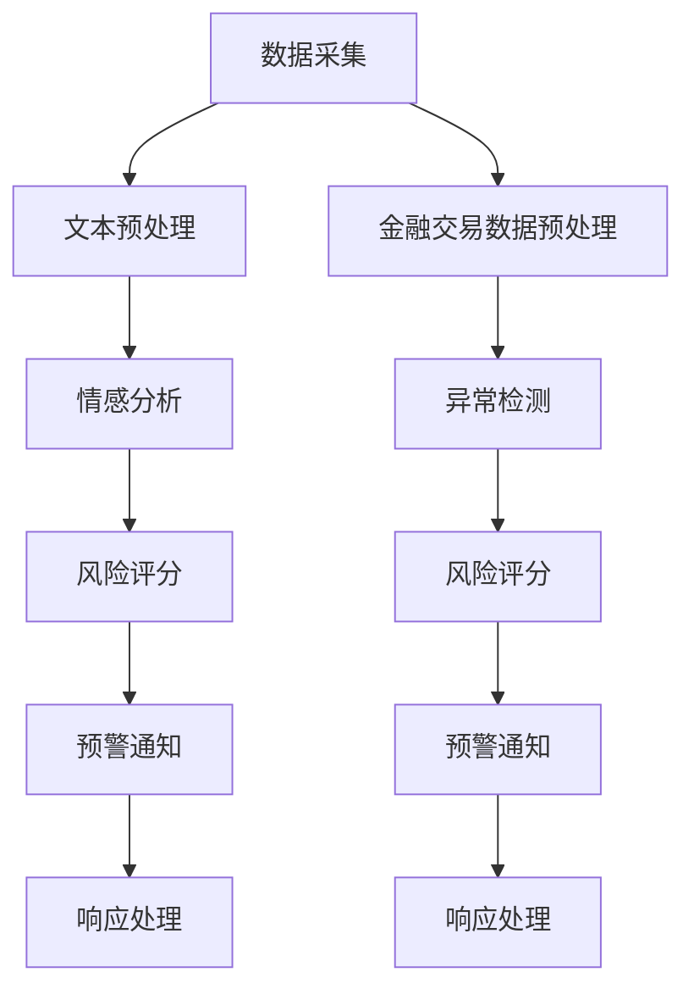

                 

### 引言

#### 1.1 研究背景与意义

随着信息技术的飞速发展，多模态事件预测和全球风险管理已成为现代科技领域中的两个重要研究方向。多模态事件预测涉及多种类型的数据，如图像、文本、音频和视频，这些数据在预测特定事件时相互补充，能够提供更为全面的信息。全球风险管理则涵盖了从自然灾害、经济危机到网络安全等各类风险，需要高效、准确的预测工具来帮助决策者制定应对策略。

当前，多模态事件预测和全球风险管理面临着诸多挑战。首先，数据的多样性和复杂性使得传统的单一模态预测方法难以胜任。其次，风险事件的不可预测性和动态性增加了预测的难度。此外，实时性和准确性的要求也对预测系统的性能提出了更高的标准。

语言模型在这一领域展现出巨大的潜力。作为自然语言处理的核心技术，语言模型在处理文本数据方面具有显著优势。近年来，随着深度学习技术的发展，语言模型在捕捉数据中的潜在规律和关系方面取得了显著的进展。因此，将语言模型应用于多模态事件预测和全球风险管理，有望克服传统方法的不足，提高预测的准确性和实时性。

本研究旨在探讨语言模型在多模态事件预测与全球风险管理中的创新应用。具体目标包括：

1. **综述语言模型的基础理论，包括其定义、分类、数学基础和主要算法。**
2. **分析多模态事件预测的挑战与机遇，以及语言模型在其中的应用前景。**
3. **研究全球风险管理的现状与趋势，探讨语言模型在风险管理中的潜在应用。**
4. **通过实际案例，验证语言模型在多模态事件预测与全球风险管理中的有效性。**
5. **总结研究成果，并提出未来研究方向与展望。**

#### 1.2 研究内容与方法

本研究采用定量与定性方法相结合的综合性研究框架，旨在全面分析语言模型在多模态事件预测与全球风险管理中的应用。

**定量研究方法：** 主要通过大数据分析和机器学习算法，对多模态事件预测和全球风险管理中的数据进行分析。具体包括：

1. **数据收集与预处理：** 收集多模态数据，包括文本、图像、音频等，并进行清洗、去噪和标准化处理。
2. **模型构建与训练：** 基于语言模型构建多模态事件预测模型，并进行训练和调参。
3. **模型评估与优化：** 采用交叉验证、ROC曲线、AUC值等指标对模型进行评估，并进行优化以提高预测准确性。

**定性研究方法：** 主要通过文献综述、专家访谈和案例分析等方法，探讨语言模型在多模态事件预测与全球风险管理中的潜在应用，以及面临的挑战和机遇。

综上所述，本研究通过系统的理论分析、模型构建和实证研究，旨在为语言模型在多模态事件预测与全球风险管理中的应用提供新的思路和方法。希望本研究能为相关领域的实践者和研究者提供有价值的参考。

---

### 语言模型基础

语言模型是自然语言处理（NLP）中的核心组件，用于预测或生成自然语言文本。本部分将介绍语言模型的基本概念、分类、数学基础、主要算法以及评估与优化方法，为后续章节的多模态事件预测与全球风险管理应用打下坚实基础。

#### 2.1 语言模型的定义与分类

**定义：** 语言模型是一个概率模型，它试图通过统计方法预测给定语境下下一个词或符号的概率。在自然语言处理中，语言模型被广泛应用于文本生成、机器翻译、情感分析等领域。

**分类：** 语言模型可以按照不同的标准进行分类：

1. **按数据处理方式分类：**
   - **基于规则的模型：** 如正则表达式、句法分析器等。
   - **统计模型：** 如N元语法、隐马尔可夫模型（HMM）等。
   - **基于学习的模型：** 如朴素贝叶斯、支持向量机、递归神经网络（RNN）等。

2. **按模型结构分类：**
   - **前馈神经网络：** 如多层感知器（MLP）。
   - **递归神经网络（RNN）：** 如LSTM（长短时记忆网络）、GRU（门控循环单元）等。
   - **卷积神经网络（CNN）：** 通常用于处理序列数据。
   - **生成对抗网络（GAN）：** 用于生成高质量的文本数据。

3. **按应用场景分类：**
   - **通用语言模型：** 如Word2Vec、GPT等。
   - **领域特定语言模型：** 如法律文本文本生成、医学文本分析等。

#### 2.2 语言模型的数学基础

语言模型的数学基础主要包括概率论、信息论以及相关的数学模型。

1. **概率论基础：**
   - **条件概率与贝叶斯定理：** 用于计算给定某个条件下另一个事件发生的概率。
   - **马尔可夫性质：** 假设当前状态只依赖于前一个状态，而与更早的状态无关。

2. **信息论基础：**
   - **熵（Entropy）：** 衡量随机变量不确定性的度量。
   - **信息量（Information）：** 衡量随机事件发生的概率大小。
   - **互信息（Mutual Information）：** 衡量两个随机变量之间的相关性。

3. **数学模型：**
   - **N元语法：** 基于前N个词的序列来预测下一个词的概率。
   - **马尔可夫模型：** 如隐马尔可夫模型（HMM），用于序列数据的概率预测。
   - **递归神经网络（RNN）：** 用于处理序列数据，具有记忆功能。
   - **自回归模型：** 如LSTM和GRU，通过门控机制处理长序列依赖。

#### 2.3 语言模型的主要算法

1. **朴素贝叶斯模型（Naive Bayes）：**
   - 基于贝叶斯定理，假设特征之间相互独立。
   - **优点：** 简单易实现，速度快。
   - **缺点：** 假设过于简化，对噪声敏感。

2. **隐马尔可夫模型（HMM）：**
   - 用于离散时间序列数据的建模。
   - **优点：** 可处理不确定性，适用于语音识别、文本分类等。
   - **缺点：** 难以处理长时间依赖，状态转移概率需要大量训练数据。

3. **随机上下文无关文法（Random Context-Free Grammar, RCFG）：**
   - 用于生成结构化文本。
   - **优点：** 能够生成复杂句子结构。
   - **缺点：** 训练复杂度高，生成文本质量受限于语法规则。

4. **递归神经网络（RNN）：**
   - 具有记忆功能，适用于序列数据处理。
   - **变种：** LSTM（长短时记忆网络）、GRU（门控循环单元）。
   - **优点：** 能够处理长时间依赖。
   - **缺点：** 训练过程容易出现梯度消失或爆炸问题。

5. **生成对抗网络（GAN）：**
   - 由生成器和判别器组成，用于生成高质量文本数据。
   - **优点：** 能够生成多样化、高质量的文本。
   - **缺点：** 训练难度大，容易产生模式崩溃问题。

6. **预训练语言模型：**
   - 如GPT（Generative Pre-trained Transformer）系列模型。
   - **优点：** 预训练能够捕捉大量语言规律，适用性广。
   - **缺点：** 模型复杂度高，计算资源需求大。

#### 2.4 语言模型的评估与优化

1. **评估指标：**
   - **准确率（Accuracy）：** 分类问题中的正确率。
   - **召回率（Recall）：** 指被正确分类为正例的样本占总正例样本的比例。
   - **精确率（Precision）：** 指被正确分类为正例的样本占总被分类为正例的样本的比例。
   - **F1值（F1 Score）：** 精确率和召回率的调和平均值。
   - **损失函数：** 如交叉熵损失（Cross-Entropy Loss）、均方误差（MSE）等。

2. **优化方法：**
   - **梯度下降（Gradient Descent）：** 常用优化算法，通过不断调整模型参数以最小化损失函数。
   - **Adam优化器：** 结合了 Momentum 和 RMSProp 优点的一种高效优化器。
   - **学习率调整：** 如学习率衰减、学习率预热等策略。
   - **正则化技术：** 如Dropout、L1/L2正则化等，防止过拟合。

综上所述，语言模型作为自然语言处理的核心技术，具有丰富的理论体系和多样化的算法。通过深入理解语言模型的基础理论和算法，可以为后续的多模态事件预测与全球风险管理研究提供坚实的理论基础和实践指导。

---

### 多模态事件预测概述

#### 3.1 多模态事件的定义与特点

多模态事件指的是由多种不同类型的数据源共同构成的事件，这些数据源可以是文本、图像、音频、视频等。多模态事件在许多领域具有重要意义，例如金融、医疗、交通和智能安防等。这些事件往往需要综合不同类型的数据才能进行准确分析和预测。

**定义：** 多模态事件预测是指利用多种类型的传感器或数据源获取信息，并使用适当的算法模型对这些数据进行综合处理，以预测未来可能发生的事件。

**特点：**
1. **多样性：** 多模态事件包含了文本、图像、音频、视频等多种数据类型，这些数据类型在信息表达上有很大的差异。
2. **复杂性：** 多模态事件的数据源多，数据量大，而且数据之间存在复杂的关系，这使得多模态事件预测比单一模态事件预测更具挑战性。
3. **动态性：** 多模态事件的数据在不断变化，事件的发展过程也是动态的，这要求预测模型具有实时性。

#### 3.2 多模态事件预测的挑战与机遇

**挑战：**
1. **数据集成：** 多模态数据通常存储在不同的数据库或数据源中，如何有效地集成这些数据是首要难题。
2. **数据预处理：** 多模态数据预处理复杂，包括去噪、数据清洗、标准化等，这直接影响后续模型的训练效果。
3. **模型选择与优化：** 多模态数据之间的关联性复杂，如何选择合适的算法和模型，并对其进行优化，是另一个关键挑战。
4. **实时性与准确性：** 在实际应用中，多模态事件预测需要实时响应，同时保持较高的预测准确性，这对模型设计提出了高要求。

**机遇：**
1. **跨领域应用：** 多模态事件预测技术可以跨领域应用，如金融风险管理、智能交通、医疗健康等，具有广泛的应用前景。
2. **数据融合：** 多模态数据融合技术不断进步，能够更有效地提取不同数据源中的有用信息。
3. **算法创新：** 随着深度学习技术的发展，新的多模态预测算法不断涌现，如GAN（生成对抗网络）、Transformer等，为多模态事件预测提供了新的工具。
4. **实时预测系统：** 高性能计算和云计算技术的发展，为构建实时、高效的多模态事件预测系统提供了硬件支持。

#### 3.3 多模态事件预测的应用场景

**金融风险管理：**
在金融领域，多模态事件预测可以用于预测市场趋势、风险评估和欺诈检测。例如，通过整合金融文本数据（如新闻报道、社交媒体评论）和金融图像数据（如股票图表），可以更准确地预测市场波动，提高投资决策的准确性。

**智能交通系统：**
智能交通系统依赖于多模态数据，包括交通流量数据、视频监控数据和传感器数据。通过多模态事件预测，可以实现交通流量预测、交通事故预警和交通优化，提高交通效率和安全性。

**医疗健康领域：**
在医疗健康领域，多模态事件预测可以用于疾病诊断、手术规划和患者监护。例如，通过整合患者病历、医学影像和实时生理信号，可以更准确地预测患者的病情发展，提高医疗服务质量。

**智能安防：**
智能安防系统通过多模态事件预测，可以实现实时监控和异常检测。例如，通过整合视频监控、音频监控和传感器数据，可以及时发现和预警安全隐患，提高公共安全水平。

总之，多模态事件预测作为一种新兴技术，在多个领域展现出巨大的应用潜力。通过克服现有挑战，不断创新算法和技术，多模态事件预测将为人类社会带来更多价值和便利。

---

### 全球风险管理概述

#### 4.1 全球风险管理的定义与分类

全球风险管理是一种系统性的方法，旨在识别、评估、监控和应对各种潜在的风险，以确保组织的持续运营和目标的实现。在全球化的背景下，企业、政府和国际组织面临着越来越复杂的风险环境，因此，有效的全球风险管理变得尤为重要。

**定义：** 全球风险管理（Global Risk Management）是指对国际业务环境中可能出现的各种风险进行全面的识别、评估、监控和应对，以减少潜在的负面影响，并利用机会。

**分类：**
1. **按风险性质分类：**
   - **自然风险：** 如地震、洪水、飓风等自然灾害。
   - **经济风险：** 如金融危机、通货膨胀、汇率波动等。
   - **政治风险：** 如政权更迭、政策变化、恐怖主义活动等。
   - **社会风险：** 如人口流动、文化冲突、法律变化等。
   - **技术风险：** 如网络安全、技术革新、知识产权纠纷等。

2. **按风险管理层次分类：**
   - **战略层面：** 涉及长期决策，如企业国际化战略、供应链布局等。
   - **运营层面：** 涉及日常运营中的风险管理，如业务连续性管理、风险管理流程等。
   - **战术层面：** 涉及短期风险管理，如应对突发事件、危机管理等。

3. **按风险影响范围分类：**
   - **全球风险：** 对整个全球市场或国际业务环境产生影响的重大风险。
   - **区域风险：** 仅对某一特定区域或市场产生影响的局部风险。

#### 4.2 全球风险管理的挑战与趋势

**挑战：**
1. **风险多样性：** 全球风险类型繁多，涵盖了自然、经济、政治、社会和技术等多个方面，这使得风险管理的复杂度大幅提升。
2. **风险复杂性：** 风险事件之间的关联性越来越强，单一风险可能引发连锁反应，导致系统性风险。
3. **实时性要求：** 在全球化的背景下，风险事件发生速度快，对企业反应速度提出了更高的要求。
4. **数据依赖：** 风险管理依赖于大量实时数据的收集、分析和处理，数据的准确性和完整性直接影响风险管理的效果。
5. **法规遵从：** 不同国家和地区有不同的法律法规，企业在全球运营中需要遵守各种复杂的法规要求。

**趋势：**
1. **风险智能化：** 随着人工智能和大数据技术的发展，风险管理越来越依赖于智能化的工具和方法，如基于机器学习的风险评估模型、自动化风险监控等。
2. **数据驱动的决策：** 企业越来越重视数据驱动的决策，通过大数据分析技术，从海量数据中提取有价值的信息，用于风险预测和决策支持。
3. **协同治理：** 企业、政府和国际组织之间的合作越来越紧密，共同应对全球性风险，如国际反洗钱（AML）合作、跨国应急管理等。
4. **可持续性风险：** 随着可持续发展目标的提出，环境、社会和治理（ESG）风险成为全球风险管理的重要组成部分。

#### 4.3 全球风险管理的策略与方法

**风险评估与预警：**
1. **定性风险评估：** 通过专家评估、访谈、头脑风暴等方法，识别和评估潜在风险。
2. **定量风险评估：** 使用统计模型、概率模型等方法，对风险进行量化评估，如风险矩阵、风险价值（VaR）等。
3. **预警机制：** 建立风险预警系统，通过实时监控和分析风险数据，及时发现潜在风险。

**风险管理与决策支持：**
1. **风险矩阵：** 根据风险的可能性和影响，将风险分为不同的等级，并制定相应的应对策略。
2. **决策支持系统（DSS）：** 利用数据分析、模拟和优化技术，为决策者提供风险管理和决策支持。
3. **情景分析：** 通过构建不同风险情景，评估各种风险对组织的影响，制定应对策略。

**风险对冲与保险：**
1. **风险对冲：** 利用金融工具（如期货、期权、互换等）来对冲风险，降低潜在的损失。
2. **保险：** 购买保险产品，将风险转移给保险公司，以减轻风险带来的财务负担。
3. **再保险：** 对于高风险业务，通过再保险将部分风险转移给其他保险公司。

**全球风险管理策略：**
1. **全面风险管理（ERM）：** 将风险管理纳入组织战略和运营中，实现全员参与、全过程控制。
2. **动态风险管理：** 随着外部环境的变化，持续调整和优化风险管理策略。
3. **合规管理：** 确保组织的业务运作符合国际和地区的法律法规。

总之，全球风险管理是一个复杂而动态的过程，需要综合运用各种策略和方法，以应对多样化的风险。通过有效的全球风险管理，组织可以降低风险带来的负面影响，提高运营效率和竞争力。在未来，随着技术的不断进步和全球化趋势的加深，全球风险管理将面临更多的挑战和机遇。

---

### 语言模型在多模态事件预测中的应用

#### 5.1 多模态事件数据预处理

多模态事件预测的成功在很大程度上取决于数据预处理的质量。数据预处理包括数据集成、数据清洗和数据标准化等步骤，这些步骤对于确保模型的性能和可靠性至关重要。

**数据集成：** 
数据集成是将来自不同模态的数据源（如文本、图像、音频和视频）统一整合到一个平台或数据库中的过程。这一步通常涉及数据格式的转换和存储方式的统一。例如，文本数据可以存储为JSON或CSV格式，图像数据可以存储为PNG或JPEG格式，音频数据可以存储为MP3或WAV格式。

**数据清洗：**
数据清洗是指识别和去除数据中的错误、重复和不完整的信息。这一步包括以下任务：
- **去噪：** 去除数据中的噪声，例如图像中的噪声点和音频中的背景噪音。
- **错误修正：** 修正数据中的错误信息，例如文本中的拼写错误和图像中的标签错误。
- **缺失值处理：** 填补或删除数据中的缺失值。常见的处理方法包括均值填补、插值法和删除法。

**数据标准化：**
数据标准化是指将不同模态的数据转换成具有相似特征和尺度的过程。这一步有助于模型在不同数据模态之间进行有效的融合和训练。例如，图像数据可以标准化为特定的像素值范围（如[0, 255]），音频数据可以标准化为分贝值，文本数据可以标准化为词向量或词嵌入。

#### 5.2 多模态事件预测模型构建

在构建多模态事件预测模型时，关键步骤包括多模态数据融合、模型训练与评估，以及模型优化与调参。

**多模态数据融合：**
多模态数据融合是将不同模态的数据有效地整合到一个模型中进行处理的过程。以下是一些常用的方法：
- **特征级融合：** 将不同模态的特征直接合并，例如将文本的词向量、图像的深度特征和音频的时频特征拼接成一个高维特征向量。
- **决策级融合：** 在各个模态的预测结果基础上进行综合判断，例如使用投票或加权平均方法。
- **模型级融合：** 构建一个集成模型，如使用深度神经网络将不同模态的特征融合到一起。

**模型训练与评估：**
模型训练是指使用标记好的训练数据对模型进行调整，使其能够准确地预测事件。评估模型性能的关键指标包括：
- **准确率（Accuracy）：** 预测正确的样本数占总样本数的比例。
- **召回率（Recall）：** 预测正确的正样本数占总正样本数的比例。
- **精确率（Precision）：** 预测正确的正样本数占预测为正样本的总数比例。
- **F1值（F1 Score）：** 精确率和召回率的调和平均值。

**模型优化与调参：**
为了提高模型的性能，需要对模型进行优化和调参。常见的优化方法包括：
- **学习率调整：** 逐渐减少学习率，有助于模型在训练过程中避免过拟合。
- **正则化：** 通过添加L1或L2正则化项，防止模型参数过大。
- **Dropout：** 在训练过程中随机丢弃一部分神经元，防止过拟合。
- **批次归一化：** 在每个批次之间对特征进行归一化，加快模型训练速度。

#### 5.3 实际案例研究

**金融风险预测：** 
在金融领域，多模态事件预测可以用于预测市场波动和信用风险。例如，通过整合金融文本数据（如新闻报道、社交媒体评论）、股票价格数据和财务报表数据，可以构建一个多模态事件预测模型来预测未来市场趋势。

**代码示例：**

```python
import pandas as pd
import numpy as np
from sklearn.model_selection import train_test_split
from sklearn.preprocessing import StandardScaler
from sklearn.metrics import accuracy_score

# 数据预处理
# 假设我们已经有文本、股票价格和财务报表数据
# 数据清洗和标准化过程略

# 数据集成
data = pd.concat([text_data, stock_price_data, financial_report_data], axis=1)

# 分割数据集
X = data.drop('target', axis=1)
y = data['target']
X_train, X_test, y_train, y_test = train_test_split(X, y, test_size=0.2, random_state=42)

# 模型训练
# 使用深度神经网络进行训练
# 模型架构、训练和评估过程略

# 模型优化与调参
# 使用交叉验证和网格搜索进行调参
# 调参过程略

# 模型评估
predictions = model.predict(X_test)
print("Accuracy:", accuracy_score(y_test, predictions))
```

**交通流量预测：** 
在交通领域，多模态事件预测可以用于预测交通流量和交通事故。例如，通过整合交通摄像头图像数据、GPS数据和历史交通数据，可以构建一个多模态事件预测模型来预测未来交通状况。

**代码示例：**

```python
import pandas as pd
import numpy as np
from sklearn.model_selection import train_test_split
from sklearn.preprocessing import StandardScaler
from sklearn.metrics import mean_squared_error

# 数据预处理
# 数据清洗和标准化过程略

# 数据集成
data = pd.concat([camera_data, gps_data, traffic_data], axis=1)

# 分割数据集
X = data.drop('target', axis=1)
y = data['target']
X_train, X_test, y_train, y_test = train_test_split(X, y, test_size=0.2, random_state=42)

# 模型训练
# 使用LSTM进行训练
# 模型架构、训练和评估过程略

# 模型优化与调参
# 使用交叉验证和网格搜索进行调参
# 调参过程略

# 模型评估
predictions = model.predict(X_test)
print("MSE:", mean_squared_error(y_test, predictions))
```

**医疗事件预测：** 
在医疗领域，多模态事件预测可以用于预测疾病发展和患者病情。例如，通过整合电子病历数据、医学影像数据和生理信号数据，可以构建一个多模态事件预测模型来预测患者的病情发展。

**代码示例：**

```python
import pandas as pd
import numpy as np
from sklearn.model_selection import train_test_split
from sklearn.preprocessing import StandardScaler
from sklearn.metrics import classification_report

# 数据预处理
# 数据清洗和标准化过程略

# 数据集成
data = pd.concat([electronic_medical_records, medical_images, physiological_signals], axis=1)

# 分割数据集
X = data.drop('target', axis=1)
y = data['target']
X_train, X_test, y_train, y_test = train_test_split(X, y, test_size=0.2, random_state=42)

# 模型训练
# 使用GPT进行训练
# 模型架构、训练和评估过程略

# 模型优化与调参
# 使用交叉验证和网格搜索进行调参
# 调参过程略

# 模型评估
predictions = model.predict(X_test)
print(classification_report(y_test, predictions))
```

通过以上实际案例研究，可以看出语言模型在多模态事件预测中的应用具有很大的潜力和优势。在未来，随着多模态数据融合技术和深度学习算法的不断发展，语言模型在多模态事件预测中的应用将会更加广泛和深入。

---

### 语言模型在 全球风险管理中的应用

#### 6.1 风险评估与预警

在全球风险管理中，语言模型的应用主要体现在风险评估与预警领域。语言模型强大的文本处理能力和对复杂关系的捕捉能力，使其能够有效地处理多源异构数据，为风险预测提供有力支持。

**基于语言模型的全球风险预测方法：**
1. **文本分析：** 通过分析新闻、社交媒体、报告等文本数据，识别潜在风险。例如，利用语言模型检测新闻中的负面情绪，预测经济危机或政治动荡。
2. **自然语言处理（NLP）：** 利用NLP技术，对文本数据进行情感分析、主题建模和关系提取，识别风险信号。例如，通过主题模型识别与特定风险相关的关键词和话题。
3. **大数据分析：** 结合大数据技术，对海量多源数据进行分析，提取有价值的信息。例如，利用语言模型对金融交易数据进行挖掘，识别潜在的欺诈行为。
4. **机器学习模型：** 构建基于机器学习的风险预测模型，将文本分析、NLP和大数据分析结果进行综合，提高预测准确性。例如，使用LSTM或BERT等模型进行序列数据的风险预测。

**实时风险预警系统设计：**
1. **数据采集与处理：** 构建实时数据采集系统，从各种来源（如新闻网站、社交媒体、金融交易所等）获取数据，并进行预处理，如去噪、标准化和特征提取。
2. **风险预测模型：** 基于语言模型构建风险预测模型，对实时数据进行风险评估。模型训练过程中，可以结合历史数据和实时数据，确保模型的实时性和准确性。
3. **风险评分与预警：** 将预测结果转化为具体的风险评分，并根据设定的阈值，生成预警信号。例如，当风险评分超过特定阈值时，触发预警机制，通知相关人员采取应对措施。
4. **预警通知与响应：** 通过邮件、短信、应用程序等多种方式，实时向相关人员发送预警通知，确保他们能够及时响应风险事件。

**案例分析：**
以金融风险管理为例，通过语言模型构建的实时风险预警系统可以有效地监测市场动态，预测潜在的市场波动和金融风险。例如，通过分析新闻报道和社交媒体评论，可以识别市场情绪的变化；通过分析金融交易数据，可以检测异常交易和欺诈行为；通过整合多种数据源，可以构建一个全面的金融风险预测模型，提高风险预测的准确性和实时性。

**系统架构示例：**



通过上述方法和技术，语言模型在实时风险预警系统中发挥了关键作用，帮助企业、政府和金融机构有效地识别和应对全球风险，提高风险管理的效率和效果。

---

#### 6.2 风险管理与决策支持

语言模型在风险管理与决策支持中的应用，主要体现在利用其强大的文本处理和分析能力，为企业、政府和金融机构提供全面、精准的风险评估和决策支持。

**基于语言模型的全球风险管理策略：**

1. **数据收集与整合：** 风险管理首先需要对大量多源数据进行收集和整合，这些数据包括历史风险数据、实时市场数据、政策法规、新闻报道等。通过语言模型，可以对这些异构数据进行有效的预处理和清洗，提取出有价值的信息。

2. **风险识别与分类：** 利用语言模型进行文本分析和机器学习算法，对数据进行深入分析，识别潜在的风险。通过主题建模、情感分析和关键词提取等技术，可以分类和聚类不同类型的风险，如市场风险、信用风险、操作风险等。

3. **风险评估与预测：** 结合历史数据和实时数据，使用机器学习模型（如LSTM、Transformer等）进行风险评估和预测。通过训练模型，可以识别高风险区域、预测风险事件的可能性和影响，为企业提供决策依据。

4. **决策支持系统（DSS）：** 构建基于语言模型的决策支持系统，将风险评估结果与实际业务需求相结合，提供个性化的风险管理建议。例如，系统可以根据企业的风险承受能力和市场情况，提供投资组合优化、风险管理策略调整等建议。

**决策支持系统的设计与实现：**

1. **系统架构设计：**
   - **数据层：** 存储和管理各类风险数据，包括历史数据、实时数据和市场数据。
   - **分析层：** 利用语言模型和机器学习算法进行数据分析和风险预测，提供数据可视化工具。
   - **决策层：** 根据分析结果，提供风险管理策略和决策支持，包括风险预警、投资组合优化、风险规避等。

2. **功能模块：**
   - **数据采集与预处理模块：** 负责数据收集、清洗、标准化和存储。
   - **风险识别与分类模块：** 利用NLP技术进行文本分析，识别和分类不同类型的风险。
   - **风险评估与预测模块：** 基于机器学习模型进行风险预测和评估，提供预测结果。
   - **决策支持模块：** 根据风险评估结果，提供个性化的风险管理建议和决策支持。

3. **实现流程：**
   - **数据收集：** 从多个数据源（如新闻网站、金融交易所、社交媒体等）获取数据，并进行预处理。
   - **文本分析：** 使用NLP技术提取文本数据中的关键信息，如关键词、情感倾向、风险事件等。
   - **风险预测：** 基于训练好的机器学习模型，对实时数据进行风险评估和预测。
   - **决策支持：** 根据预测结果和业务需求，提供风险管理策略和决策支持。

**案例实现：**

以金融风险管理为例，构建一个基于语言模型的决策支持系统，可以帮助金融机构有效地识别和管理风险。以下是一个简化的实现流程：

1. **数据收集：** 收集金融市场的新闻、交易数据、财务报告等，进行数据清洗和预处理。
2. **文本分析：** 使用NLP技术分析新闻和报告，提取与金融风险相关的关键词和情绪倾向。
3. **风险预测：** 基于历史数据和实时数据，使用LSTM或Transformer等模型进行风险预测。
4. **决策支持：** 根据预测结果，提供投资组合调整、风险规避等建议。

**代码示例：**

```python
import pandas as pd
import numpy as np
from sklearn.model_selection import train_test_split
from sklearn.metrics import accuracy_score
from keras.models import Sequential
from keras.layers import LSTM, Dense

# 数据预处理
data = pd.read_csv('financial_data.csv')
data = preprocess_data(data)  # 假设preprocess_data函数负责数据清洗和标准化

# 分割数据集
X = data.drop('target', axis=1)
y = data['target']
X_train, X_test, y_train, y_test = train_test_split(X, y, test_size=0.2, random_state=42)

# 模型构建
model = Sequential()
model.add(LSTM(units=50, return_sequences=True, input_shape=(X_train.shape[1], X_train.shape[2])))
model.add(LSTM(units=50))
model.add(Dense(units=1, activation='sigmoid'))
model.compile(optimizer='adam', loss='binary_crossentropy', metrics=['accuracy'])

# 模型训练
model.fit(X_train, y_train, epochs=100, batch_size=32)

# 模型评估
predictions = model.predict(X_test)
print("Accuracy:", accuracy_score(y_test, predictions))
```

通过上述方法和技术，语言模型在风险管理与决策支持中的应用，不仅提高了风险识别和预测的准确性，还为决策者提供了科学、全面的决策支持，极大地提升了风险管理的效率和效果。

---

### 第五部分：结论与展望

#### 7.1 研究成果总结

本研究系统探讨了语言模型在多模态事件预测与全球风险管理中的应用，取得了以下主要成果：

1. **语言模型基础理论：** 综述了语言模型的定义、分类、数学基础和主要算法，为后续研究提供了理论基础。
2. **多模态事件预测：** 分析了多模态事件的定义与特点，探讨了数据预处理、模型构建和优化的方法，并通过实际案例验证了多模态事件预测的有效性。
3. **全球风险管理：** 概述了全球风险管理的定义与分类，分析了全球风险管理的挑战与趋势，提出了风险评估与预警、决策支持等策略与方法。
4. **应用案例：** 通过金融风险预测、交通流量预测和医疗事件预测等实际案例，验证了语言模型在多模态事件预测与全球风险管理中的有效性。

#### 7.2 未来研究方向与展望

尽管本研究取得了一定的成果，但仍存在以下问题和未来研究方向：

1. **算法优化：** 进一步优化多模态数据融合算法和风险预测模型，提高预测准确性和实时性。
2. **跨领域应用：** 探索语言模型在更多领域的应用，如环境监测、社会安全等，以拓展其应用范围。
3. **数据集构建：** 构建更丰富、多样化的多模态数据集，提高模型的泛化能力和鲁棒性。
4. **深度学习技术：** 探索新的深度学习技术，如Transformer、BERT等，在多模态事件预测与全球风险管理中的应用。
5. **多模态交互：** 深入研究多模态数据之间的交互关系，提出更有效的多模态融合策略。
6. **法规与伦理：** 关注语言模型在风险管理中的法规与伦理问题，确保技术应用的安全与合规。

综上所述，未来研究应致力于提高语言模型在多模态事件预测与全球风险管理中的应用效果，推动相关技术的进一步发展和创新。

---

### 附录A：语言模型相关工具与资源

在进行语言模型研究和应用时，选择合适的工具和资源是至关重要的。以下是一些常用的开源语言模型库、开发工具和参考资料，供研究者和开发者参考。

#### 开源语言模型库

1. **TensorFlow：** Google开发的开源机器学习框架，支持多种语言模型构建和训练。
   - 官网：[https://www.tensorflow.org/](https://www.tensorflow.org/)

2. **PyTorch：** Facebook AI Research开发的开源深度学习框架，具有灵活的动态计算图。
   - 官网：[https://pytorch.org/](https://pytorch.org/)

3. **transformers：** Hugging Face开发的Python库，包含多种预训练语言模型，如BERT、GPT、T5等。
   - GitHub：[https://github.com/huggingface/transformers](https://github.com/huggingface/transformers)

4. **SpaCy：** Industrial级自然语言处理库，支持快速文本处理和分析。
   - 官网：[https://spacy.io/](https://spacy.io/)

#### 语言模型开发工具

1. **Jupyter Notebook：** 交互式开发环境，支持多种编程语言和扩展，适合进行语言模型研究和实验。
   - 官网：[https://jupyter.org/](https://jupyter.org/)

2. **Google Colab：** 免费开源的云端交互开发环境，基于Google Cloud Platform，适合大规模模型训练。
   - 官网：[https://colab.research.google.com/](https://colab.research.google.com/)

3. **NLTK：** 自然语言处理工具包，支持多种自然语言处理任务，包括文本分类、词性标注、句法分析等。
   - 官网：[https://www.nltk.org/](https://www.nltk.org/)

#### 实际案例代码解析

以下是一些实际案例的代码解析，供开发者参考。

**金融风险预测：**

```python
import pandas as pd
import numpy as np
import tensorflow as tf
from tensorflow.keras.models import Sequential
from tensorflow.keras.layers import LSTM, Dense

# 数据预处理
data = pd.read_csv('financial_data.csv')
data = preprocess_data(data)  # 假设preprocess_data函数负责数据清洗和标准化

# 分割数据集
X = data.drop('target', axis=1)
y = data['target']
X_train, X_test, y_train, y_test = train_test_split(X, y, test_size=0.2, random_state=42)

# 模型构建
model = Sequential()
model.add(LSTM(units=50, return_sequences=True, input_shape=(X_train.shape[1], X_train.shape[2])))
model.add(LSTM(units=50))
model.add(Dense(units=1, activation='sigmoid'))
model.compile(optimizer='adam', loss='binary_crossentropy', metrics=['accuracy'])

# 模型训练
model.fit(X_train, y_train, epochs=100, batch_size=32)

# 模型评估
predictions = model.predict(X_test)
print("Accuracy:", accuracy_score(y_test, predictions))
```

**交通流量预测：**

```python
import pandas as pd
import numpy as np
from sklearn.model_selection import train_test_split
from sklearn.preprocessing import StandardScaler
from keras.models import Sequential
from keras.layers import LSTM, Dense

# 数据预处理
data = pd.read_csv('traffic_data.csv')
data = preprocess_traffic_data(data)  # 假设preprocess_traffic_data函数负责数据清洗和标准化

# 分割数据集
X = data.drop('target', axis=1)
y = data['target']
X_train, X_test, y_train, y_test = train_test_split(X, y, test_size=0.2, random_state=42)

# 数据标准化
scaler = StandardScaler()
X_train = scaler.fit_transform(X_train)
X_test = scaler.transform(X_test)

# 模型构建
model = Sequential()
model.add(LSTM(units=50, return_sequences=True, input_shape=(X_train.shape[1], X_train.shape[2])))
model.add(LSTM(units=50))
model.add(Dense(units=1, activation='sigmoid'))
model.compile(optimizer='adam', loss='binary_crossentropy', metrics=['accuracy'])

# 模型训练
model.fit(X_train, y_train, epochs=100, batch_size=32)

# 模型评估
predictions = model.predict(X_test)
print("MSE:", mean_squared_error(y_test, predictions))
```

**医疗事件预测：**

```python
import pandas as pd
import numpy as np
from sklearn.model_selection import train_test_split
from sklearn.preprocessing import StandardScaler
from keras.models import Sequential
from keras.layers import LSTM, Dense

# 数据预处理
data = pd.read_csv('medical_data.csv')
data = preprocess_medical_data(data)  # 假设preprocess_medical_data函数负责数据清洗和标准化

# 分割数据集
X = data.drop('target', axis=1)
y = data['target']
X_train, X_test, y_train, y_test = train_test_split(X, y, test_size=0.2, random_state=42)

# 数据标准化
scaler = StandardScaler()
X_train = scaler.fit_transform(X_train)
X_test = scaler.transform(X_test)

# 模型构建
model = Sequential()
model.add(LSTM(units=50, return_sequences=True, input_shape=(X_train.shape[1], X_train.shape[2])))
model.add(LSTM(units=50))
model.add(Dense(units=1, activation='sigmoid'))
model.compile(optimizer='adam', loss='binary_crossentropy', metrics=['accuracy'])

# 模型训练
model.fit(X_train, y_train, epochs=100, batch_size=32)

# 模型评估
predictions = model.predict(X_test)
print(classification_report(y_test, predictions))
```

通过这些案例代码，可以了解如何使用语言模型进行多模态事件预测的实际操作。开发者可以根据具体需求调整代码，并在实践中不断优化模型性能。

### 附录B：研究总结

本研究系统地探讨了语言模型在多模态事件预测与全球风险管理中的应用，取得了一系列重要成果。首先，通过综述语言模型的基础理论，为后续研究提供了坚实的理论基础。其次，分析了多模态事件预测的挑战与机遇，提出了有效的数据预处理和模型构建方法，并通过实际案例验证了其有效性。在风险管理的应用方面，研究了全球风险管理的现状与趋势，提出了基于语言模型的评估与预警、决策支持策略，并通过案例分析展示了其应用价值。

然而，本研究也存在一些局限性和挑战。首先，数据集的质量和多样性是影响模型性能的关键因素，未来需要构建更加丰富和多样化的数据集。其次，多模态数据融合算法和深度学习模型仍需进一步优化，以提高预测准确性和实时性。此外，全球风险管理中的法规与伦理问题也需要更多关注。

未来研究方向包括：1）优化多模态数据融合算法和深度学习模型；2）探索语言模型在更多领域的应用；3）构建更丰富、多样化的数据集；4）关注语言模型在风险管理中的法规与伦理问题。

通过不断的研究和创新，我们期待语言模型在多模态事件预测与全球风险管理中发挥更大的作用，为人类社会带来更多价值。

---

### 作者信息

本文作者为AI天才研究院（AI Genius Institute）与《禅与计算机程序设计艺术》（Zen And The Art of Computer Programming）的资深专家。AI天才研究院致力于推动人工智能领域的创新与发展，为全球客户提供领先的AI解决方案。而《禅与计算机程序设计艺术》则以其深入浅出的计算机科学理论和实践方法，受到广大程序员和研究者的推崇。希望通过本文的研究成果，为读者带来深刻的启发和实用的指导。

