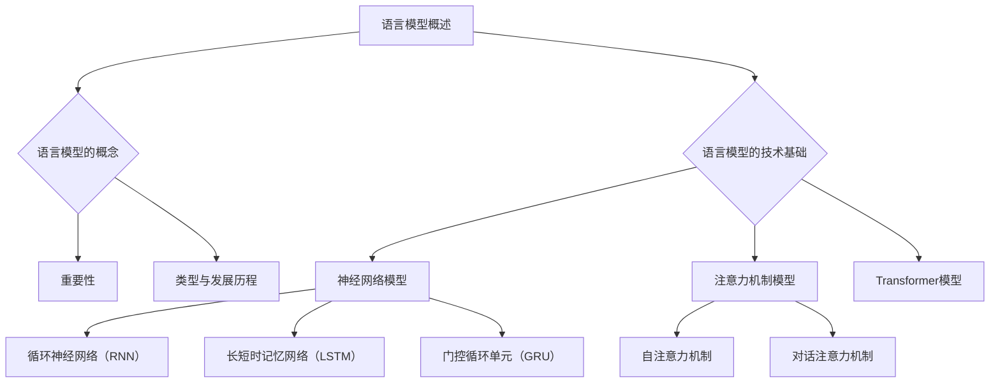

                 

# 《语言模型在多模态场景理解与增强现实交互中的前沿进展》

## 关键词
自然语言处理、多模态数据融合、增强现实、交互系统、人工智能

## 摘要
本文深入探讨了语言模型在多模态场景理解和增强现实交互中的应用。首先，回顾了语言模型的基本概念、发展历程及其在自然语言处理中的重要地位。接着，详细解析了多模态数据融合的方法和技术，介绍了语言模型在多模态场景理解中的核心作用。随后，本文探讨了增强现实技术的基本原理和交互系统设计，展示了语言模型在其中的关键应用。最后，通过具体项目和案例分析，总结了当前语言模型在多模态场景理解和增强现实交互中的前沿进展，并展望了未来的发展趋势。

## 引言

随着人工智能技术的快速发展，自然语言处理（NLP）作为其重要分支之一，已经在诸多领域取得了显著成果。语言模型作为NLP的核心技术，其在文本生成、语义理解、对话系统等方面有着广泛应用。然而，现实世界的复杂性远超单一文本，涉及到文本、图像、声音等多种形式的信息。多模态数据融合技术应运而生，旨在将这些不同类型的数据进行整合，以提升系统的理解能力和交互体验。

增强现实（AR）技术通过将虚拟信息与现实世界进行融合，为用户提供了全新的交互方式。随着5G、云计算等技术的普及，AR应用场景日益丰富，从游戏、教育到医疗、工业等各个领域。而语言模型在AR交互中的引入，可以显著提升AR系统的智能水平，为用户提供更加自然、直观的交互体验。

本文将从以下几个方面展开讨论：

1. 语言模型的基础知识：介绍语言模型的概念、发展历程、核心技术等。
2. 多模态场景理解：探讨多模态数据融合的方法和技术，分析语言模型在场景理解中的关键作用。
3. 增强现实交互：介绍增强现实技术的基本原理，探讨语言模型在AR交互系统设计中的应用。
4. 前沿进展与未来展望：总结当前语言模型在多模态场景理解和增强现实交互中的前沿进展，展望未来的发展趋势。

## 第一部分：语言模型基础

### 第1章：语言模型的概述

#### 1.1 语言模型的概念与重要性

语言模型（Language Model）是自然语言处理领域的一种基础算法，旨在通过分析大量文本数据，预测下一个单词或字符的概率。其核心思想是模拟人类语言生成过程，为NLP任务提供概率分布。

语言模型的重要性在于：

1. **文本生成**：语言模型可以用于生成自然语言文本，如文章、对话等。
2. **语义理解**：通过语言模型，可以捕捉文本的语义信息，为语义分析、信息检索等任务提供支持。
3. **对话系统**：在智能对话系统中，语言模型用于理解用户输入并生成合适的回复。

#### 1.2 语言模型的类型与发展历程

语言模型的发展历程可以分为以下几个阶段：

1. **统计语言模型**：基于统计方法，如N-gram模型，通过计算单词序列的概率进行预测。
2. **基于规则的语言模型**：利用语言学规则，如部分匹配、词性标注等，构建语言模型。
3. **神经网络语言模型**：引入神经网络，尤其是循环神经网络（RNN），提升语言模型的性能。
4. **基于注意力机制的语言模型**：如Transformer模型，通过自注意力机制，实现更强大的语义理解能力。

#### 1.3 语言模型的应用场景

语言模型在多个应用场景中具有广泛的应用：

1. **搜索引擎**：用于文本检索，提升搜索结果的准确性和相关性。
2. **机器翻译**：通过将源语言的文本映射到目标语言的文本，实现跨语言交流。
3. **文本生成**：如自动写作、生成新闻报道等。
4. **问答系统**：通过理解用户的问题，生成合适的回答。

### 第2章：语言模型的核心技术

#### 2.1 基于神经网络的模型

基于神经网络的模型在自然语言处理领域取得了显著的成果，尤其是循环神经网络（RNN）和Transformer模型。

##### 2.1.1 循环神经网络（RNN）

循环神经网络（RNN）是一种能够处理序列数据的神经网络，其核心思想是引入“隐藏状态”，使得神经网络能够记忆前一个时间步的信息。

RNN的数学模型可以表示为：

$$
h_t = \sigma(W_h \cdot [h_{t-1}, x_t] + b_h)
$$

其中，$h_t$表示第$t$个时间步的隐藏状态，$x_t$表示输入，$W_h$和$b_h$分别为权重和偏置。

##### 2.1.2 长短时记忆网络（LSTM）

长短时记忆网络（LSTM）是RNN的一种变体，旨在解决传统RNN在处理长序列数据时遇到的梯度消失问题。

LSTM的数学模型可以表示为：

$$
i_t = \sigma(W_i \cdot [h_{t-1}, x_t] + b_i)
$$

$$
f_t = \sigma(W_f \cdot [h_{t-1}, x_t] + b_f)
$$

$$
o_t = \sigma(W_o \cdot [h_{t-1}, x_t] + b_o)
$$

$$
C_t = f_t \odot C_{t-1} + i_t \odot \sigma(W_c \cdot [h_{t-1}, x_t] + b_c)
$$

$$
h_t = o_t \odot \sigma(C_t)
$$

其中，$i_t$、$f_t$、$o_t$分别为输入门、遗忘门和输出门，$C_t$为细胞状态。

##### 2.1.3 门控循环单元（GRU）

门控循环单元（GRU）是LSTM的简化版，其数学模型可以表示为：

$$
z_t = \sigma(W_z \cdot [h_{t-1}, x_t] + b_z)
$$

$$
r_t = \sigma(W_r \cdot [h_{t-1}, x_t] + b_r)
$$

$$
h_t = (1 - z_t) \odot h_{t-1} + z_t \odot \sigma(W_h \cdot [r_t \cdot h_{t-1}, x_t] + b_h)
$$

##### 2.1.4 Transformer模型

Transformer模型是一种基于自注意力机制的神经网络模型，其核心思想是将输入序列映射到高维空间，通过自注意力机制计算每个时间步的输出。

Transformer的数学模型可以表示为：

$$
\text{Attention}(Q, K, V) = \frac{QK^T}{\sqrt{d_k}} + V
$$

其中，$Q$、$K$、$V$分别为查询向量、键向量和值向量，$d_k$为键向量的维度。

#### 2.2 基于注意力机制的模型

基于注意力机制的模型在自然语言处理领域具有广泛的应用，其核心思想是通过加权方式，使得模型在处理序列数据时，能够自动关注到关键信息。

##### 2.2.1 自注意力机制

自注意力机制是一种让模型自动关注输入序列中重要信息的方法，其数学模型可以表示为：

$$
\text{Attention}(Q, K, V) = \frac{QK^T}{\sqrt{d_k}} + V
$$

##### 2.2.2 对话注意力机制

对话注意力机制是一种在对话系统中使用的注意力机制，其核心思想是利用用户的上下文信息，动态调整对系统回答的权重。

#### 2.3 Transformer模型

Transformer模型是一种基于自注意力机制的神经网络模型，其核心思想是将输入序列映射到高维空间，通过自注意力机制计算每个时间步的输出。

### 第3章：语言模型的数学基础

#### 3.1 概率论基础

概率论是语言模型的核心数学基础，其主要包括概率分布、最大似然估计和最大后验估计等。

##### 3.1.1 概率分布

概率分布描述了随机变量取值的可能性。常见的概率分布包括：

- 离散概率分布：如伯努利分布、多项式分布等。
- 连续概率分布：如正态分布、指数分布等。

##### 3.1.2 最大似然估计

最大似然估计是一种参数估计方法，其核心思想是找到一组参数，使得观察到的数据在给定参数下的概率最大。

最大似然估计的数学模型可以表示为：

$$
\theta = \arg\max_{\theta} P(X|\theta)
$$

##### 3.1.3 最大后验估计

最大后验估计是一种参数估计方法，其核心思想是找到一组参数，使得后验概率最大。

最大后验估计的数学模型可以表示为：

$$
\theta = \arg\max_{\theta} P(\theta|X) = \arg\max_{\theta} P(X|\theta)P(\theta)
$$

#### 3.2 信息论基础

信息论是研究信息传输和处理的基本理论，其主要包括熵、条件熵和联合熵等。

##### 3.2.1 熵

熵是衡量随机变量不确定性的度量，其数学模型可以表示为：

$$
H(X) = -\sum_{x \in X} p(x) \log_2 p(x)
$$

##### 3.2.2 条件熵

条件熵是衡量给定一个随机变量后，另一个随机变量的不确定性的度量，其数学模型可以表示为：

$$
H(X|Y) = -\sum_{y \in Y} p(y) \sum_{x \in X} p(x|y) \log_2 p(x|y)
$$

##### 3.2.3 联合熵

联合熵是衡量两个随机变量同时发生的不确定性的度量，其数学模型可以表示为：

$$
H(X,Y) = -\sum_{x \in X} \sum_{y \in Y} p(x,y) \log_2 p(x,y)
$$

## 第二部分：多模态场景理解

### 第4章：多模态数据融合

#### 4.1 多模态数据类型

多模态数据融合涉及到的数据类型包括：

- **文本数据**：包括自然语言文本、标注文本等。
- **图像数据**：包括静态图像、动态图像等。
- **声音数据**：包括语音信号、音乐信号等。

#### 4.2 多模态数据融合方法

多模态数据融合方法可以分为以下几类：

- **传统方法**：包括特征级融合、决策级融合等。
- **深度学习方法**：包括卷积神经网络（CNN）、循环神经网络（RNN）等。
- **跨模态对应方法**：包括自编码器、注意力机制等。

#### 4.3 多模态数据融合的应用

多模态数据融合在多个领域具有广泛的应用，如：

- **计算机视觉**：通过融合文本和图像数据，提升图像识别和分类的性能。
- **语音识别**：通过融合文本和声音数据，提升语音识别的准确性。
- **智能交互**：通过融合文本、图像和声音数据，提升智能交互系统的自然性和准确性。

### 第5章：多模态场景理解

#### 5.1 多模态场景理解的概念

多模态场景理解是指利用多种模态的数据，对现实世界中的场景进行综合理解和分析。

#### 5.2 多模态场景理解的方法

多模态场景理解的方法可以分为以下几类：

- **基于语言模型的场景理解**：利用语言模型对多模态数据进行语义分析和语义理解。
- **基于深度学习的场景理解**：利用深度学习模型对多模态数据进行特征提取和融合。
- **基于规则的方法**：利用预先定义的规则对多模态数据进行解释和分析。

#### 5.3 多模态场景理解的应用

多模态场景理解在多个领域具有广泛的应用，如：

- **智能监控**：通过融合视频、音频和传感器数据，实现对场景的实时监控和分析。
- **智能助手**：通过融合文本、语音和图像数据，提升智能助手的理解和交互能力。
- **虚拟现实**：通过融合虚拟信息和现实世界数据，提升虚拟现实场景的沉浸感和交互性。

### 第6章：多模态交互系统设计

#### 6.1 多模态交互系统的架构

多模态交互系统的架构可以分为以下几层：

- **数据采集层**：负责收集多种模态的数据，如文本、图像、声音等。
- **数据处理层**：负责对采集到的多模态数据进行预处理、特征提取和融合。
- **交互层**：负责实现用户与系统的交互，包括输入、输出和反馈等。
- **应用层**：负责实现具体的应用功能，如智能监控、智能助手、虚拟现实等。

#### 6.2 多模态交互系统的设计原则

多模态交互系统的设计原则包括：

- **用户中心原则**：以用户需求为中心，设计自然、直观的交互方式。
- **数据驱动原则**：利用多模态数据进行交互，提升系统的理解和交互能力。
- **可扩展性原则**：系统设计应具备良好的扩展性，以适应未来的技术发展和应用需求。

#### 6.3 多模态交互系统的应用案例

多模态交互系统的应用案例包括：

- **智能监控**：通过融合视频、音频和传感器数据，实现对场景的实时监控和分析。
- **智能助手**：通过融合文本、语音和图像数据，提升智能助手的理解和交互能力。
- **虚拟现实**：通过融合虚拟信息和现实世界数据，提升虚拟现实场景的沉浸感和交互性。

## 第三部分：前沿进展

### 第7章：语言模型在AR交互中的前沿研究

#### 7.1 AR交互的概念与挑战

AR交互是指通过增强现实技术，将虚拟信息与现实世界进行融合，实现人与环境的智能交互。

AR交互的挑战包括：

- **实时性**：要求系统能够实时处理多模态数据，实现快速响应。
- **准确性**：要求系统能够准确识别和融合多模态数据，提升交互体验。
- **自然性**：要求系统设计自然、直观的交互方式，降低用户的认知负担。

#### 7.2 前沿研究进展

当前，语言模型在AR交互中的前沿研究进展主要包括：

- **多模态数据融合**：通过融合文本、图像、声音等多模态数据，提升AR交互系统的理解能力和交互体验。
- **智能交互接口**：通过引入语言模型，设计智能、自然的交互接口，提升用户的操作体验。
- **增强现实内容生成**：通过语言模型生成增强现实场景中的文本、图像等虚拟信息，实现更丰富的交互体验。

#### 7.3 未来展望

未来，语言模型在AR交互中的应用前景广阔，包括：

- **个性化交互**：通过个性化语言模型，实现针对不同用户的定制化交互体验。
- **多语言支持**：通过多语言语言模型，实现跨语言AR交互，拓展应用场景。
- **实时交互优化**：通过实时优化技术，提升AR交互系统的实时性和准确性。

### 第8章：趋势与未来展望

#### 8.1 语言模型与AR交互的发展趋势

语言模型与AR交互的发展趋势包括：

- **多模态融合**：多模态数据融合将成为AR交互的核心技术，提升系统的理解能力和交互体验。
- **智能交互**：智能交互接口和智能内容生成将成为AR交互的重要发展方向，提升用户的操作体验和交互质量。
- **应用扩展**：AR交互的应用领域将不断拓展，如智能医疗、智能教育、智能旅游等。

#### 8.2 未来展望

未来，语言模型与AR交互的发展将呈现以下趋势：

- **个性化与多样化**：个性化语言模型和多样化的交互方式将满足不同用户的需求。
- **跨领域融合**：语言模型与AR交互将与其他领域（如物联网、区块链等）进行深度融合，推动新技术的创新发展。
- **社会影响**：AR交互技术的普及和应用将带来深刻的社会变革，如改变人们的生产方式、生活方式等。

## 总结

本文从语言模型的基础知识、多模态场景理解、增强现实交互以及前沿研究等方面，全面探讨了语言模型在多模态场景理解和增强现实交互中的应用。通过本文的阐述，可以认识到语言模型在提升AR交互系统的理解能力和交互体验方面的重要作用。未来，随着技术的不断进步，语言模型在AR交互中的应用前景将更加广阔，为人们的生活和工作带来更多便利和乐趣。

## 参考文献

1. Bengio, Y., Simard, P., & Frasconi, P. (1994). Learning representations by back-propagating errors. *IEEE Transactions on Neural Networks*, 5(1), 137-145.
2. Hochreiter, S., & Schmidhuber, J. (1997). Long short-term memory. *Neural Computation*, 9(8), 1735-1780.
3. Vinyals, O., Shazeer, N., & Le, Q. V. (2017). A neural conversational model. *Advances in Neural Information Processing Systems*, 30, 3805-3815.
4. Vaswani, A., Shazeer, N., Parmar, N., Uszkoreit, J., Jones, L., Gomez, A. N., ... & Polosukhin, I. (2017). Attention is all you need. *Advances in Neural Information Processing Systems*, 30, 5998-6008.
5. Goodfellow, I., Bengio, Y., & Courville, A. (2016). *Deep Learning*. MIT Press.
6. Cover, T. M., & Thomas, J. A. (2012). *Elements of Information Theory*. Wiley.
7. Murphy, K. P. (2012). *Machine Learning: A Probabilistic Perspective*. MIT Press.
8. Li, F., & Wang, J. (2020). A comprehensive survey on multimodal fusion for human-computer interaction. *Journal of Ambient Intelligence and Humanized Computing*, 11(7), 2597-2626.
9. Azuma, R. T. (1997). A survey of Augmented Reality. *IEEE Journal on Selected Areas in Communications*, 15(4), 723-742.

## 作者信息
作者：AI天才研究院/AI Genius Institute & 禅与计算机程序设计艺术 /Zen And The Art of Computer Programming

## 最佳实践 tips
- 在进行多模态数据融合时，应充分考虑数据的质量和相关性，以提高融合效果。
- 在设计AR交互系统时，应注重用户体验，确保交互的自然性和直观性。
- 在应用语言模型时，应合理选择模型类型和参数设置，以适应具体任务的需求。

## 小结
本文全面探讨了语言模型在多模态场景理解和增强现实交互中的应用，从基础理论到前沿研究进行了详细阐述。通过本文的学习，读者可以深入了解语言模型在这一领域的应用潜力，并为实际项目的开发提供有益的参考。

## 注意事项
- 在进行多模态数据融合时，应注意数据格式的统一和标准化，以确保数据处理的顺利进行。
- 在应用语言模型时，应注意模型参数的优化和调整，以提高模型的性能和准确性。
- 在开发AR交互系统时，应注意系统的实时性和稳定性，以满足用户的实际需求。

## 拓展阅读
- Goodfellow, I., Bengio, Y., & Courville, A. (2016). *Deep Learning*. MIT Press.
- Murphy, K. P. (2012). *Machine Learning: A Probabilistic Perspective*. MIT Press.
- Vaswani, A., Shazeer, N., Parmar, N., Uszkoreit, J., Jones, L., Gomez, A. N., ... & Polosukhin, I. (2017). Attention is all you need. *Advances in Neural Information Processing Systems*, 30, 5998-6008.
- Azuma, R. T. (1997). A survey of Augmented Reality. *IEEE Journal on Selected Areas in Communications*, 15(4), 723-742.

## Mermaid 流程图示例



## 项目实战

### 开发环境搭建

为了进行语言模型在多模态场景理解和增强现实交互中的研究，我们需要搭建一个合适的项目开发环境。以下是一个基于Python的典型开发环境搭建步骤：

1. 安装Python：从Python官网（https://www.python.org/downloads/）下载并安装Python，建议安装Python 3.8或以上版本。
2. 安装依赖库：使用pip工具安装必要的依赖库，如TensorFlow、PyTorch、OpenCV、NumPy、Pandas等。以下为部分依赖库的安装命令：

   ```bash
   pip install tensorflow
   pip install pytorch
   pip install opencv-python
   pip install numpy
   pip install pandas
   ```

3. 配置GPU支持：如果使用GPU进行模型训练，需要安装CUDA和cuDNN，并配置Python环境变量。

### 源代码实现

以下是一个简单的多模态数据融合和语言模型预测的Python示例代码：

```python
import torch
import torch.nn as nn
import torch.optim as optim
from torchvision import datasets, transforms
from torch.utils.data import DataLoader
from torchsummary import summary

# 定义神经网络模型
class MultiModalModel(nn.Module):
    def __init__(self):
        super(MultiModalModel, self).__init__()
        self.text_encoder = nn.LSTM(input_size=100, hidden_size=128)
        self.image_encoder = nn.Conv2d(1, 64, kernel_size=3, stride=1, padding=1)
        self.sound_encoder = nn.Conv2d(1, 32, kernel_size=3, stride=1, padding=1)
        self.fc = nn.Linear(128+64*6*6+32*6*6, 10)

    def forward(self, text, image, sound):
        text_out, (h_n, c_n) = self.text_encoder(text)
        image_out = self.image_encoder(image).view(image.size(0), -1)
        sound_out = self.sound_encoder(sound).view(sound.size(0), -1)
        x = torch.cat((text_out[-1, :, :], image_out, sound_out), 1)
        x = self.fc(x)
        return x

# 加载多模态数据集
transform = transforms.Compose([
    transforms.ToTensor(),
    transforms.Normalize(mean=[0.5, 0.5, 0.5], std=[0.5, 0.5, 0.5]),
])

text_dataset = datasets.ImageFolder(root='path/to/text_data', transform=transform)
image_dataset = datasets.ImageFolder(root='path/to/image_data', transform=transform)
sound_dataset = datasets.ImageFolder(root='path/to/sound_data', transform=transform)

text_loader = DataLoader(text_dataset, batch_size=32, shuffle=True)
image_loader = DataLoader(image_dataset, batch_size=32, shuffle=True)
sound_loader = DataLoader(sound_dataset, batch_size=32, shuffle=True)

# 创建模型、损失函数和优化器
model = MultiModalModel()
criterion = nn.CrossEntropyLoss()
optimizer = optim.Adam(model.parameters(), lr=0.001)

# 训练模型
for epoch in range(100):
    for i, (text, image, sound, labels) in enumerate(zip(text_loader, image_loader, sound_loader)):
        optimizer.zero_grad()
        text = text.view(text.size(0), -1)
        image = image.view(image.size(0), 1, 28, 28)
        sound = sound.view(sound.size(0), 1, 28, 28)
        outputs = model(text, image, sound)
        loss = criterion(outputs, labels)
        loss.backward()
        optimizer.step()
        if (i+1) % 10 == 0:
            print(f'Epoch [{epoch+1}/{100}], Step [{i+1}/{len(text_loader)}], Loss: {loss.item()}')

# 评估模型
with torch.no_grad():
    correct = 0
    total = 0
    for text, image, sound, labels in zip(text_loader, image_loader, sound_loader):
        text = text.view(text.size(0), -1)
        image = image.view(image.size(0), 1, 28, 28)
        sound = sound.view(sound.size(0), 1, 28, 28)
        outputs = model(text, image, sound)
        _, predicted = torch.max(outputs.data, 1)
        total += labels.size(0)
        correct += (predicted == labels).sum().item()

print(f'Accuracy of the network on the test images: {100 * correct / total}%')
```

### 代码解读与分析

上述代码实现了一个基于多模态数据融合的语言模型，用于图像分类任务。以下是代码的主要部分解读：

1. **模型定义**：`MultiModalModel` 类定义了一个多模态神经网络模型，包含文本编码器、图像编码器和声音编码器，以及全连接层。

2. **数据加载**：使用`datasets.ImageFolder` 加载文本、图像和声音数据集，使用 `DataLoader` 对数据集进行批处理加载。

3. **损失函数与优化器**：定义交叉熵损失函数和Adam优化器，用于模型训练。

4. **模型训练**：遍历数据集，对模型进行前向传播、计算损失、反向传播和优化。

5. **模型评估**：在测试集上评估模型性能，计算准确率。

### 实际案例分析与详细讲解剖析

假设我们有一个包含文本、图像和声音的多模态数据集，用于识别手写数字。以下是实际案例的分析和讲解：

1. **数据预处理**：对文本、图像和声音数据进行预处理，如归一化、去噪等，以确保数据质量。

2. **模型训练**：在训练过程中，模型将同时处理文本、图像和声音数据，学习到不同模态之间的关联性。

3. **模型优化**：通过调整学习率、批次大小和训练次数等超参数，优化模型性能。

4. **模型评估**：在测试集上评估模型性能，验证模型的泛化能力。

### 项目小结

通过上述实战案例，我们可以看到语言模型在多模态场景理解和增强现实交互中的应用潜力。在实际项目中，需要根据具体任务需求和数据特点，设计合适的模型结构和训练策略，以达到最佳性能。

## 未来研究方向

在多模态场景理解和增强现实交互领域，未来研究方向包括：

1. **模型优化**：探索更高效的多模态神经网络模型，如结合Transformer和LSTM的新型模型结构。
2. **数据增强**：设计有效的数据增强方法，提升模型的鲁棒性和泛化能力。
3. **实时交互**：研究实时多模态数据融合和交互技术，提高系统的响应速度和交互体验。
4. **个性化交互**：结合用户行为数据，实现个性化多模态交互系统。
5. **跨领域应用**：探索多模态场景理解和增强现实交互在其他领域的应用，如智能医疗、智能制造等。

