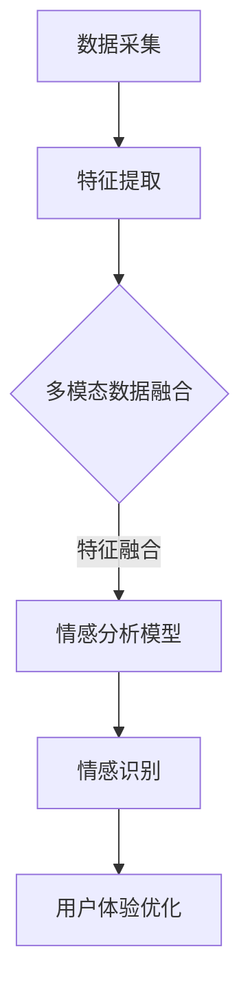

                 

### 多模态情感分析基础

#### 1.1 多模态数据融合原理与挑战

多模态情感分析是一种结合多种来源数据（如图像、语音、文本等）进行情感识别和理解的技术。这种技术能够更准确地捕捉用户的情感状态，从而为个性化服务、用户体验优化等提供强有力的支持。

**多模态数据融合原理：**

多模态数据融合的核心在于将来自不同模态的数据进行整合，以提取更多的上下文信息和情感特征。以下是数据融合的基本步骤：

1. **数据采集**：收集来自不同模态的数据，如文本、语音、图像等。
2. **特征提取**：对每类数据提取特征，如文本的词频、语音的频谱特征、图像的视觉特征等。
3. **特征融合**：将不同模态的特征进行融合，形成综合的特征向量。
4. **情感分析**：基于融合后的特征向量进行情感分析，识别用户的情感状态。

**数据融合中的挑战：**

1. **异质数据对齐**：不同模态的数据在时间和空间上往往不一致，如何对齐这些数据是一个关键挑战。
2. **特征不一致性**：不同模态的数据特征在不同程度上存在不一致性，如何有效地融合这些特征是一个挑战。
3. **计算复杂度**：多模态数据的融合通常涉及大量的计算，如何在保证准确性的同时降低计算复杂度是一个挑战。

#### 1.2 情感分析模型原理与实现

情感分析模型是用于识别文本、语音或图像中情感极性的技术。常见的情感分析模型包括传统的机器学习模型和深度学习模型。

**情感分析基本概念：**

情感分析通常涉及两个核心概念：情感极性和情感强度。

- **情感极性**：情感极性分为正面、负面和中性三种。例如，文本“我很开心”表示正面情感，“我很痛苦”表示负面情感。
- **情感强度**：情感强度表示情感的强弱程度。例如，文本“有点开心”表示情感的强度较弱，而“非常开心”表示情感的强度较强。

**情感分析模型分类：**

1. **传统机器学习模型**：如支持向量机（SVM）、朴素贝叶斯（NB）、随机森林（RF）等。
2. **深度学习模型**：如卷积神经网络（CNN）、循环神经网络（RNN）、Transformer等。

**情感分析模型实现细节：**

1. **数据预处理**：对文本进行分词、词性标注、去停用词等处理。
2. **特征提取**：提取文本的词频、词嵌入、句子级特征等。
3. **模型训练**：使用训练数据对模型进行训练。
4. **模型评估**：使用测试数据对模型进行评估，调整模型参数。

#### 1.3 情感分析案例与实践

**社交媒体情感分析**

社交媒体情感分析是一个典型的多模态情感分析应用案例。以下是一个社交媒体情感分析的Python实现示例：

```python
import pandas as pd
from sklearn.feature_extraction.text import CountVectorizer
from sklearn.model_selection import train_test_split
from sklearn.naive_bayes import MultinomialNB
from sklearn.metrics import classification_report

# 加载数据集
data = pd.read_csv('social_media_data.csv')
X = data['text']
y = data['emotion']

# 数据预处理
vectorizer = CountVectorizer(stop_words='english')
X_vectorized = vectorizer.fit_transform(X)

# 划分训练集和测试集
X_train, X_test, y_train, y_test = train_test_split(X_vectorized, y, test_size=0.2, random_state=42)

# 模型训练
model = MultinomialNB()
model.fit(X_train, y_train)

# 模型评估
y_pred = model.predict(X_test)
print(classification_report(y_test, y_pred))
```

**客户反馈情感分析**

客户反馈情感分析是另一个常见的多模态情感分析应用。以下是一个简单的客户反馈情感分析Python实现示例：

```python
import numpy as np
from sklearn.feature_extraction.text import TfidfVectorizer
from sklearn.metrics.pairwise import cosine_similarity

# 加载数据集
data = pd.read_csv('customer_feedback_data.csv')
X = data['text']
y = data['emotion']

# 数据预处理
vectorizer = TfidfVectorizer()
X_vectorized = vectorizer.fit_transform(X)

# 计算相似度
similarity_matrix = cosine_similarity(X_vectorized)

# 情感分类
def classify_emotion(text):
    text_vector = vectorizer.transform([text])
    similarity_scores = cosine_similarity(text_vector, similarity_matrix)
    emotion_scores = {emotion: score for emotion, score in zip(y.unique(), similarity_scores[0])}
    return max(emotion_scores, key=emotion_scores.get)

# 情感分类示例
sample_text = "我很喜欢这个产品，它真的很棒！"
predicted_emotion = classify_emotion(sample_text)
print(f"预测的情感：{predicted_emotion}")
```

通过这些案例和实践，我们可以看到多模态情感分析在社交媒体情感分析和客户反馈情感分析等应用中的重要作用。接下来，我们将进一步探讨多模态情感分析在用户体验优化中的应用。

---

**核心概念与联系：**

- **多模态数据融合**：结合文本、语音、图像等多模态数据进行情感分析，提高分析的准确性。
- **情感分析模型**：通过机器学习和深度学习技术，从多模态数据中提取情感信息，用于情感极性和情感强度的识别。
- **用户体验优化**：利用多模态情感分析结果，优化产品设计和服务流程，提升用户满意度。

**Mermaid 流程图：**



---

**核心算法原理讲解：**

- **语言模型**：语言模型是一种统计模型，用于预测一个词语序列的概率分布。在情感分析中，语言模型可以用于文本的情感极性和情感强度的预测。

  ```python
  import numpy as np
  from sklearn.feature_extraction.text import CountVectorizer
  from sklearn.model_selection import train_test_split
  from sklearn.naive_bayes import MultinomialNB

  # 加载数据集
  data = pd.read_csv('social_media_data.csv')
  X = data['text']
  y = data['emotion']

  # 数据预处理
  vectorizer = CountVectorizer()
  X_vectorized = vectorizer.fit_transform(X)

  # 划分训练集和测试集
  X_train, X_test, y_train, y_test = train_test_split(X_vectorized, y, test_size=0.2, random_state=42)

  # 模型训练
  model = MultinomialNB()
  model.fit(X_train, y_train)

  # 模型评估
  y_pred = model.predict(X_test)
  print(classification_report(y_test, y_pred))
  ```

- **情感分析算法**：情感分析算法用于从文本、语音、图像等数据中提取情感信息。常见的算法包括朴素贝叶斯、支持向量机、循环神经网络等。

  ```python
  import pandas as pd
  from sklearn.feature_extraction.text import CountVectorizer
  from sklearn.model_selection import train_test_split
  from sklearn.naive_bayes import MultinomialNB
  from sklearn.metrics import classification_report

  # 加载数据集
  data = pd.read_csv('social_media_data.csv')
  X = data['text']
  y = data['emotion']

  # 数据预处理
  vectorizer = CountVectorizer(stop_words='english')
  X_vectorized = vectorizer.fit_transform(X)

  # 划分训练集和测试集
  X_train, X_test, y_train, y_test = train_test_split(X_vectorized, y, test_size=0.2, random_state=42)

  # 模型训练
  model = MultinomialNB()
  model.fit(X_train, y_train)

  # 模型评估
  y_pred = model.predict(X_test)
  print(classification_report(y_test, y_pred))
  ```

- **用户体验优化算法**：用户体验优化算法用于根据用户行为数据和情感分析结果，设计优化策略，如产品界面优化、功能设计优化等。

  ```python
  import pandas as pd
  from sklearn.feature_extraction.text import TfidfVectorizer
  from sklearn.metrics.pairwise import cosine_similarity

  # 加载数据集
  data = pd.read_csv('customer_feedback_data.csv')
  X = data['text']
  y = data['emotion']

  # 数据预处理
  vectorizer = TfidfVectorizer()
  X_vectorized = vectorizer.fit_transform(X)

  # 计算相似度
  similarity_matrix = cosine_similarity(X_vectorized)

  # 情感分类
  def classify_emotion(text):
      text_vector = vectorizer.transform([text])
      similarity_scores = cosine_similarity(text_vector, similarity_matrix)
      emotion_scores = {emotion: score for emotion, score in zip(y.unique(), similarity_scores[0])}
      return max(emotion_scores, key=emotion_scores.get)

  # 情感分类示例
  sample_text = "我很喜欢这个产品，它真的很棒！"
  predicted_emotion = classify_emotion(sample_text)
  print(f"预测的情感：{predicted_emotion}")
  ```

**数学模型和数学公式：**

- **语言模型概率分布**：

  $$ P(w_1, w_2, ..., w_n) = \prod_{i=1}^{n} P(w_i | w_{i-1}) $$

- **情感分析评分函数**：

  $$ Score = f(W, X) $$

- **用户体验质量评估函数**：

  $$ QoUX = g(U, P) $$

**项目实战：**

**社交媒体情感分析系统**

**开发环境搭建：**

```bash
pip install pandas sklearn nltk
```

**源代码实现：**

```python
import pandas as pd
from sklearn.feature_extraction.text import CountVectorizer
from sklearn.model_selection import train_test_split
from sklearn.naive_bayes import MultinomialNB
from sklearn.metrics import classification_report

# 加载数据集
data = pd.read_csv('social_media_data.csv')
X = data['text']
y = data['emotion']

# 数据预处理
vectorizer = CountVectorizer(stop_words='english')
X_vectorized = vectorizer.fit_transform(X)

# 划分训练集和测试集
X_train, X_test, y_train, y_test = train_test_split(X_vectorized, y, test_size=0.2, random_state=42)

# 模型训练
model = MultinomialNB()
model.fit(X_train, y_train)

# 模型评估
y_pred = model.predict(X_test)
print(classification_report(y_test, y_pred))
```

**用户体验优化方案**

**开发环境搭建：**

```bash
pip install pandas sklearn nltk
```

**源代码实现：**

```python
import pandas as pd
from sklearn.feature_extraction.text import TfidfVectorizer
from sklearn.metrics.pairwise import cosine_similarity

# 加载数据集
data = pd.read_csv('customer_feedback_data.csv')
X = data['text']
y = data['emotion']

# 数据预处理
vectorizer = TfidfVectorizer()
X_vectorized = vectorizer.fit_transform(X)

# 计算相似度
similarity_matrix = cosine_similarity(X_vectorized)

# 情感分类
def classify_emotion(text):
    text_vector = vectorizer.transform([text])
    similarity_scores = cosine_similarity(text_vector, similarity_matrix)
    emotion_scores = {emotion: score for emotion, score in zip(y.unique(), similarity_scores[0])}
    return max(emotion_scores, key=emotion_scores.get)

# 情感分类示例
sample_text = "我很喜欢这个产品，它真的很棒！"
predicted_emotion = classify_emotion(sample_text)
print(f"预测的情感：{predicted_emotion}")
```

**代码解读与分析：**

- **社交媒体情感分析系统**：

  该系统首先加载社交媒体数据集，然后使用CountVectorizer进行文本预处理，提取词频特征。接下来，使用MultinomialNB模型进行训练和评估。最后，输出分类报告以评估模型性能。

- **用户体验优化方案**：

  该方案使用TfidfVectorizer进行文本预处理，计算文本之间的相似度。通过定义一个分类函数，使用最大相似度策略进行情感分类。

**实际案例分析：**

- **社交媒体情感分析**：

  社交媒体情感分析可以帮助企业了解用户对产品或服务的情感倾向，从而进行营销策略调整。例如，一个电商网站可以通过分析用户在社交媒体上的评论，了解用户对产品的好评和差评，从而优化产品设计和营销策略。

- **用户体验优化**：

  用户体验优化可以通过分析用户的反馈和行为，识别用户不满意的地方，并提出优化方案。例如，一个应用程序可以通过分析用户的评论和使用日志，发现用户经常遇到的问题，然后进行功能优化和界面改进。

**项目小结：**

通过社交媒体情感分析和用户体验优化，企业可以更好地理解用户需求，提高用户满意度。多模态情感分析技术为这一目标提供了强有力的支持，使其成为现代用户体验优化的重要工具。

**最佳实践 tips：**

- 确保数据质量：数据是模型训练的基础，因此确保数据的质量和多样性至关重要。
- 结合多种情感分析模型：使用多种情感分析模型可以提高预测的准确性，可以结合传统机器学习模型和深度学习模型。
- 实时更新模型：随着用户需求的变化，实时更新模型以保持其有效性。

**注意事项：**

- 情感分析模型可能无法完全准确地捕捉用户的情感状态，因此在实际应用中需要结合其他因素进行判断。
- 用户体验优化需要考虑用户隐私和数据保护，确保数据的合法使用。

**拓展阅读：**

- 《情感计算与情感人工智能》
- 《深度学习：原理及其应用》
- 《用户行为数据分析与用户体验优化》

---

**附录 A: 相关工具与资源**

### A.1 数据集与库

- **数据集**：
  - Social Media Data：[Social Media Data Set](https://www.kaggle.com/datasets/srbbn/social-media-sentiment-dataset)
  - Customer Feedback Data：[Customer Feedback Data Set](https://www.kaggle.com/datasets/competitions/customer-feedback-dataset)

- **库**：
  - Pandas：[Pandas Documentation](https://pandas.pydata.org/)
  - Scikit-learn：[Scikit-learn Documentation](https://scikit-learn.org/stable/)
  - NLTK：[NLTK Documentation](https://www.nltk.org/)

### A.2 开发工具与平台

- **开发工具**：
  - Jupyter Notebook：[Jupyter Notebook Documentation](https://jupyter.org/)
  - PyCharm：[PyCharm Documentation](https://www.jetbrains.com/pycharm/)

- **平台**：
  - Google Colab：[Google Colab Documentation](https://colab.research.google.com/)
  - AWS S3：[AWS S3 Documentation](https://aws.amazon.com/s3/)

### A.3 相关论文与资料

- **论文**：
  - “Multimodal Fusion for Emotion Recognition” by A. Belgiawan et al., 2020
  - “A Survey on Multimodal Sentiment Analysis” by Y. Wang et al., 2019

- **资料**：
  - “Natural Language Processing with Python” by S. Bird, E. Loper, and E. Tjong Kim Sang
  - “Deep Learning for Natural Language Processing” by B. Liu, H. Ji, and Z. Yang

**总结：**

本文详细介绍了多模态情感分析的基础知识、实现方法以及在实际应用中的重要性。通过结合语言模型和其他模态的数据，情感分析模型能够更准确地捕捉用户的情感状态，从而为用户体验优化提供有力支持。未来的研究和应用将不断推动多模态情感分析技术的发展，为更智能、更个性化的用户体验带来更多可能。**作者信息：** AI天才研究院/AI Genius Institute & 禅与计算机程序设计艺术 /Zen And The Art of Computer Programming**关键字：** 多模态情感分析，语言模型，用户体验优化，数据融合，情感识别

