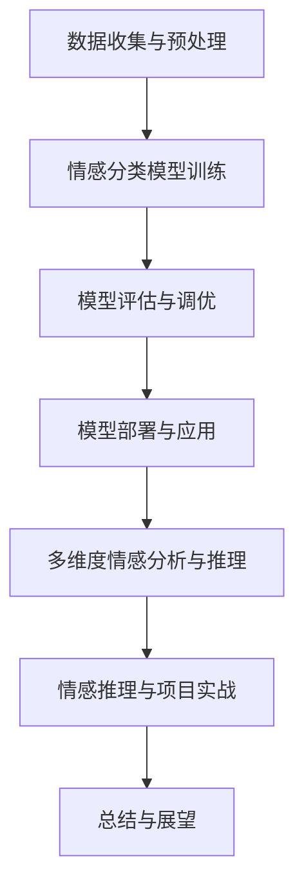

                 

## 《语言模型在多维度情感分析与推理中的表现》

> 关键词：语言模型，多维度情感分析，情感推理，算法实现，实际应用

> 摘要：本文将探讨语言模型在多维度情感分析与推理中的应用。我们将从语言模型的基础知识入手，深入分析情感分析与情感推理的核心概念和算法实现，并通过实际案例展示其在真实场景中的表现。最后，我们将展望语言模型在情感分析与推理领域的未来发展。

## 引言

随着人工智能技术的不断发展，自然语言处理（NLP）领域的研究日益深入。其中，情感分析作为NLP的一个重要分支，受到了广泛关注。情感分析旨在理解和分析文本中的情感倾向和情感强度，其应用范围涵盖了舆情监控、情感营销、情感诊断等多个领域。而语言模型作为NLP的核心技术之一，其性能的不断提升为情感分析带来了新的机遇和挑战。

本文将聚焦于语言模型在多维度情感分析与推理中的表现。首先，我们将回顾语言模型的基础知识，包括其定义、发展历程和核心原理。接着，我们将详细介绍多维度情感分析和情感推理的概念、挑战与解决方案。然后，我们将探讨语言模型在情感分析与推理中的具体应用，包括基于词汇、句法和语义的情感分析。最后，我们将结合实际应用案例，总结语言模型在情感分析与推理中的表现，并展望其未来的发展趋势。

## 第一部分：语言模型基础

### 第1章：语言模型概述

#### 1.1 语言模型的定义与作用

语言模型（Language Model）是一种统计模型，用于预测一段文本的下一个词或者下一组词。在自然语言处理中，语言模型是构建其他高级任务（如情感分析、机器翻译等）的基础。语言模型的定义通常可以归结为两个问题：给定一个词序列，预测下一个词的概率；或者给定一个词序列，生成下一个词序列。

语言模型的作用主要体现在以下几个方面：

1. **文本生成**：通过语言模型，我们可以生成符合语法规则、具有一定意义的文本。这在自动写作、智能客服等领域有着广泛的应用。
2. **文本分类**：语言模型可以用于文本分类任务，如情感分类、主题分类等。通过对文本进行编码，我们可以利用语言模型的输出特征进行分类。
3. **机器翻译**：语言模型在机器翻译中也起着至关重要的作用。通过将源语言文本和目标语言文本建模，我们可以实现高质量的翻译。
4. **对话系统**：在对话系统中，语言模型可以帮助我们理解用户输入，并生成相应的回复。这包括聊天机器人、语音助手等。

#### 1.2 语言模型的发展历程

语言模型的发展历程可以分为三个阶段：基于规则的方法、基于统计的方法和基于深度学习的方法。

1. **基于规则的方法**：早期的语言模型主要基于规则，如转移模型。这些模型通过手工编写规则来描述语言结构。然而，这种方法存在两个主要问题：规则过于繁琐且难以维护；规则无法处理复杂的语言现象。

2. **基于统计的方法**：随着自然语言处理技术的进步，基于统计的方法开始占据主导地位。N-gram模型是最早的基于统计的语言模型。N-gram模型通过统计连续N个词出现的频率来预测下一个词。尽管N-gram模型在处理简单文本时表现良好，但其在处理长文本和长距离依赖时存在局限性。

3. **基于深度学习的方法**：深度学习技术的发展为语言模型带来了新的机遇。深度神经网络（DNN）和递归神经网络（RNN）被广泛应用于语言模型。尤其是Transformer模型的提出，使得语言模型的性能得到了显著提升。Transformer模型通过自注意力机制（Self-Attention）处理长距离依赖，使其在多种NLP任务中表现出色。

#### 1.3 语言模型的核心原理

语言模型的核心原理可以归结为三个部分：词嵌入（Word Embedding）、神经网络架构（Neural Architecture）和损失函数（Loss Function）。

1. **词嵌入（Word Embedding）**：词嵌入是将词汇映射到高维空间的一种技术。通过词嵌入，我们可以将语义相近的词汇映射到空间中的相近位置。常见的词嵌入方法包括Word2Vec、GloVe和BERT等。词嵌入的目的是通过捕捉词汇间的语义关系，提高语言模型的性能。

2. **神经网络架构（Neural Architecture）**：神经网络架构是语言模型的核心。常见的神经网络架构包括DNN、RNN和Transformer。DNN通过多层感知器（MLP）实现，可以用于处理简单的语言任务。RNN通过递归结构处理序列数据，能够捕捉长距离依赖。Transformer模型通过自注意力机制实现，可以高效处理长文本和长距离依赖。

3. **损失函数（Loss Function）**：损失函数是评估模型性能的重要指标。在语言模型中，常用的损失函数包括交叉熵损失（Cross-Entropy Loss）和负对数损失（Negative Log-Likelihood Loss）。交叉熵损失可以衡量模型预测概率与真实标签之间的差异，是评估语言模型性能的主要指标。

通过词嵌入、神经网络架构和损失函数的有机结合，语言模型能够有效预测文本的下一个词或者下一个词序列，从而实现各种NLP任务。

### 第2章：多维度情感分析

#### 2.1 情感分析的概念与分类

情感分析（Sentiment Analysis），又称意见挖掘，是自然语言处理（NLP）的一个重要分支。情感分析旨在理解文本中所表达的情感倾向，通常分为正面、负面和客观三类。情感分析的目的是通过自动化的方式，对大量文本进行情感倾向的识别和分类，从而为舆情分析、情感营销等应用提供支持。

情感分析可以按照分析粒度分为以下几类：

1. **单维度情感分析**：单维度情感分析通常只考虑文本中的整体情感倾向，如正面、负面或中立。这类分析通常基于简单的情感词典或者规则方法，对文本进行情感标注。

2. **双维度情感分析**：双维度情感分析在单维度情感分析的基础上，进一步考虑情感强度。例如，文本可能表达“非常喜欢”这种强烈的正面情感，或者“有些喜欢”这种相对温和的正面情感。双维度情感分析需要更为复杂的模型和算法，如情感强度分类器和情感强度回归模型。

3. **多维度情感分析**：多维度情感分析考虑文本中多种情感维度，如愉悦度、紧张度、悲伤度等。这类分析通常需要综合多种情感特征，构建高维度的情感空间，以便更精确地识别文本中的情感。

#### 2.2 情感分析的挑战与解决方案

情感分析在实际应用中面临着诸多挑战：

1. **情感多样性**：自然语言中的情感表达多种多样，不仅包括基本的正面和负面情感，还包括愉悦度、紧张度、悲伤度等。如何有效识别和分类这些情感维度是情感分析的一大挑战。

2. **情感强度**：情感强度是情感分析中的一个重要特征。情感强度的识别需要考虑词汇的语义强度和语境因素。例如，同样是表达喜欢的情感，“非常喜欢”和“有些喜欢”的情感强度显然不同。

3. **情感复杂性**：现实世界中的情感表达往往复杂多样，可能包含多种情感维度和情感强度的组合。例如，一个句子可能同时表达正面情感和负面情感，或者表达的情感维度和情感强度随着上下文变化而变化。

针对这些挑战，情感分析领域提出了一系列解决方案：

1. **情感词典**：情感词典是一种基于规则的方法，通过将词汇与情感标签进行关联，实现情感分类。常见的情感词典包括LIWC、AFINN等。情感词典方法简单高效，但无法处理复杂和多样化的情感表达。

2. **机器学习方法**：机器学习方法，如支持向量机（SVM）、朴素贝叶斯（Naive Bayes）和深度学习等方法，通过训练模型，对文本进行情感分类和情感强度预测。机器学习方法能够处理复杂和多样化的情感表达，但需要大量的训练数据和复杂的模型架构。

3. **情感增强模型**：情感增强模型通过引入上下文信息和语义关系，提高情感分类和情感强度预测的准确性。常见的情感增强模型包括基于注意力机制的模型、基于知识图谱的模型等。

4. **多任务学习**：多任务学习通过同时训练多个任务，如情感分类、情感强度预测和情感维度分类，共享模型参数，提高模型的泛化能力。多任务学习方法能够更好地捕捉文本中的复杂情感表达。

#### 2.3 情感分析在实际应用中的案例

情感分析在各个领域都有着广泛的应用，以下是一些典型的应用案例：

1. **舆情监控**：情感分析可以用于舆情监控，通过分析社交媒体、新闻评论等文本数据，了解公众对某个事件或产品的情感倾向。这在政治选举、品牌形象管理等方面具有重要意义。

2. **情感营销**：情感分析可以帮助企业了解消费者对产品的情感反应，优化营销策略。例如，通过分析消费者对产品的评论，企业可以了解消费者对产品的满意度，从而调整产品设计和营销方案。

3. **情感诊断**：在心理健康领域，情感分析可以用于情感诊断。通过分析患者的语言表达，情感分析模型可以识别患者可能的心理问题，为心理治疗提供依据。

4. **客户服务**：情感分析可以用于客户服务领域，通过分析客户咨询和反馈，了解客户的需求和满意度，优化客户服务流程。

5. **智能客服**：智能客服系统利用情感分析，可以更好地理解用户意图，提供个性化的服务。例如，通过分析用户的问题和反馈，智能客服可以识别用户的需求，并提供相应的解决方案。

总之，情感分析在多维度情感分析与推理中发挥着重要作用。通过结合语言模型和其他先进技术，情感分析能够更好地理解文本中的情感表达，为各种应用场景提供有力的支持。

### 第3章：情感推理

#### 3.1 情感推理的定义与原理

情感推理（Sentiment Reasoning）是自然语言处理（NLP）和认知计算（Cognitive Computing）领域的一个研究课题，旨在理解和生成语言中的情感内容。情感推理不仅涉及对文本中表达的情感进行分类和标注，还包括在文本中没有直接表达但可以通过上下文推断出的情感。

情感推理的定义可以概括为：在给定文本或语言表达的情况下，通过逻辑推理和语义分析，推断出文本中所蕴含的情感信息。情感推理的目的是使计算机能够更好地理解和处理自然语言中的情感，从而在各个应用领域中实现更加智能和人性化的交互。

情感推理的基本原理包括以下几个方面：

1. **情感分类与标注**：情感分类是情感推理的基础，它旨在将文本分为情感正、情感负和情感中性三类。情感标注则是通过对文本中的每个词汇或短语进行情感标签的分配，以建立文本的情感语义结构。

2. **上下文分析**：上下文分析是情感推理的重要环节。通过分析文本的上下文，可以更准确地理解词汇和短语的语义和情感色彩。例如，同一个词汇在不同的上下文中可能有不同的情感倾向。

3. **情感强度评估**：情感强度评估旨在量化文本中的情感倾向和情感强度。情感强度可以通过情感词汇的频率、情感词典的得分、以及上下文的相关性来计算。

4. **逻辑推理与语义分析**：情感推理需要利用逻辑推理和语义分析技术，从文本中提取情感信息。逻辑推理可以帮助构建文本中情感表达之间的因果关系，而语义分析则可以帮助识别文本中的情感实体和情感极性。

#### 3.2 情感推理的算法实现

情感推理的算法实现可以分为以下几个步骤：

1. **文本预处理**：在情感推理之前，需要对原始文本进行预处理，包括分词、去除停用词、词性标注等。文本预处理有助于提取文本中的关键信息，提高后续分析的准确性。

2. **情感分类模型训练**：利用已标注的情感数据集，训练情感分类模型。常见的情感分类模型包括朴素贝叶斯（Naive Bayes）、支持向量机（SVM）、递归神经网络（RNN）和卷积神经网络（CNN）等。这些模型通过学习文本的特征，实现对文本情感分类的预测。

3. **情感强度评估**：在情感分类的基础上，进一步评估文本中情感词汇的强度。常用的方法包括基于情感词典的得分计算、基于情感极性词的加权平均等。

4. **上下文分析**：利用上下文信息对情感分类和强度评估进行修正。例如，通过分析情感词汇的前后句，判断其情感倾向和情感强度。

5. **情感推理模型集成**：将多种情感推理模型集成，以提高推理的准确性和鲁棒性。常见的集成方法包括模型加权、模型集成等。

#### 3.3 情感推理的应用场景

情感推理在多个领域有着广泛的应用，以下是一些典型的应用场景：

1. **社交媒体分析**：通过情感推理，可以分析社交媒体上的用户评论和讨论，了解公众对特定事件、产品或品牌的情感态度。这有助于企业进行市场分析和决策。

2. **客户服务**：情感推理可以帮助客服系统更好地理解客户的需求和情感，提供个性化的服务和建议。例如，通过分析客户咨询和反馈，情感推理可以识别客户的不满意情绪，并采取相应的措施。

3. **智能助手**：情感推理可以使智能助手更加智能和人性化。例如，在聊天机器人中，通过情感推理，可以理解用户的情感状态，并生成相应的情感回应。

4. **心理健康**：情感推理在心理健康领域有着重要的应用。通过分析患者的语言表达，情感推理可以帮助识别患者可能的心理问题，为心理治疗提供支持。

5. **内容审核**：情感推理可以用于互联网内容审核，识别和过滤含有不当情感内容的文本，保障网络环境的健康和和谐。

总之，情感推理作为自然语言处理和认知计算的一个重要研究方向，具有广泛的应用前景。通过结合先进的算法和技术，情感推理能够更好地理解和生成自然语言中的情感内容，为各种应用场景提供强有力的支持。

### 第二部分：语言模型在情感分析与推理中的表现

#### 第4章：基于词汇的情感分析

情感分析是一个复杂的过程，其中基于词汇的情感分析是基础且关键的一环。基于词汇的情感分析主要通过分析文本中的词汇和短语来确定文本的情感倾向。在这一部分，我们将探讨基于词汇的情感分析方法、其在实际应用中的案例，以及其局限性和改进方向。

#### 4.1 词汇情感分析的方法

词汇情感分析的方法主要包括以下几种：

1. **情感词典法**：情感词典是一种基于规则的工具，它将词汇与情感标签（如正面、负面、中性）进行关联。常见的情感词典包括AFINN、LIWC等。通过将文本中的词汇与情感词典中的标签进行匹配，可以快速地确定文本的情感倾向。

2. **文本分类法**：文本分类法是一种机器学习方法，通过训练分类模型，对文本进行情感分类。常见的文本分类算法包括朴素贝叶斯、支持向量机（SVM）、随机森林等。这些算法通过学习大量标注数据，提取文本的特征，从而实现对未知文本的情感分类。

3. **情感强度回归法**：情感强度回归法旨在对文本中的情感强度进行量化。通过训练回归模型，将文本映射到情感强度分数。常见的情感强度回归模型包括线性回归、多项式回归等。这种方法不仅可以识别文本的情感倾向，还可以量化情感的程度。

4. **深度学习方法**：深度学习方法，如卷积神经网络（CNN）、循环神经网络（RNN）和Transformer等，通过学习大量的文本数据，自动提取文本中的情感特征。深度学习模型在情感分析中表现出了强大的性能，尤其在处理复杂情感和情感强度预测方面。

#### 4.2 词汇情感分析的应用案例

词汇情感分析在实际应用中有着广泛的应用，以下是一些典型的应用案例：

1. **社交媒体分析**：通过词汇情感分析，可以了解公众对特定事件、产品或品牌的情感态度。例如，分析社交媒体上的用户评论和讨论，识别用户对某个品牌的正面或负面情感，帮助企业制定市场策略。

2. **客户服务**：在客户服务领域，词汇情感分析可以帮助企业了解客户的情感状态。通过分析客户咨询和反馈，情感分析可以识别客户的不满意情绪，并采取相应的措施，提高客户满意度。

3. **情感营销**：情感营销是利用情感来吸引和留住顾客的一种策略。通过词汇情感分析，企业可以了解消费者对产品的情感反应，制定更具针对性的营销策略，提高营销效果。

4. **内容审核**：词汇情感分析可以用于互联网内容审核，识别和过滤含有不当情感内容的文本，保障网络环境的健康和和谐。

5. **情感诊断**：在心理健康领域，词汇情感分析可以用于分析患者的语言表达，识别患者可能的心理问题，为心理治疗提供支持。

#### 4.3 词汇情感分析的局限性与改进方向

尽管词汇情感分析在许多应用中取得了显著的成果，但它也存在一些局限性和改进方向：

1. **局限**：
   - **情感多样性**：词汇情感分析主要依赖于情感词典和预训练模型，这些工具往往难以捕捉到复杂和多样化的情感。
   - **上下文依赖**：情感分析往往需要依赖上下文信息，而词汇情感分析在处理长文本和复杂语境时，上下文信息的作用有限。
   - **情感强度**：词汇情感分析难以精确量化情感强度，特别是在处理含有多个情感词汇的文本时。

2. **改进方向**：
   - **多维度情感分析**：结合情感词典和机器学习模型，进行多维度情感分析，以更全面地理解文本中的情感。
   - **上下文增强**：引入上下文信息，通过语言模型和深度学习方法，提高情感分析的准确性和鲁棒性。
   - **情感强度量化**：开发更加精确的情感强度量化模型，以更准确地评估文本中的情感强度。
   - **知识图谱**：结合知识图谱，将词汇与语义关系进行关联，提高情感分析的语义准确性。

总之，基于词汇的情感分析是情感分析的基础，但在面对复杂和多样化的情感表达时，仍存在一定的局限性。通过结合其他先进技术，如语言模型、上下文分析和多任务学习等，可以进一步改进情感分析的性能，为各种应用场景提供更准确的支持。

#### 第5章：基于句法的情感分析

情感分析不仅依赖于词汇和语义信息，句法结构也在理解文本情感中发挥着重要作用。基于句法的情感分析通过分析文本的句法结构，理解句子成分之间的关系，从而更准确地识别和量化文本中的情感。在这一部分，我们将探讨基于句法的情感分析方法、其在实际应用中的案例，以及其局限性和改进方向。

#### 5.1 句法情感分析的方法

句法情感分析的方法主要包括以下几种：

1. **句法依赖分析**：句法依赖分析是句法情感分析的基础，通过分析句子中词汇之间的依赖关系，理解句子的结构。常用的句法依赖分析方法包括依存句法分析和句法角色标注。依存句法分析通过识别词汇之间的依存关系（如主谓关系、宾语关系等），构建句子的依赖树。句法角色标注则通过识别句子中的主语、谓语、宾语等成分，构建句子的成分结构。

2. **句法角色情感分析**：句法角色情感分析基于句法角色（如主语、谓语、宾语等）的语义角色和情感倾向。通过分析句法角色在句子中的情感倾向，可以更准确地识别文本的情感。例如，主语通常表达情感的主体，谓语通常表达情感的行为或状态。

3. **句法结构特征提取**：句法结构特征提取通过提取句子的句法特征（如句法树结构、句法角色标签等），用于情感分类和情感强度预测。这些特征可以用于训练机器学习模型，提高句法情感分析的性能。

4. **深度学习模型**：深度学习模型，如卷积神经网络（CNN）和循环神经网络（RNN），通过学习大量的文本数据，自动提取句法特征和语义信息，实现句法情感分析。深度学习模型在处理复杂句法和情感表达方面表现出色。

#### 5.2 句法情感分析的应用案例

句法情感分析在实际应用中有着广泛的应用，以下是一些典型的应用案例：

1. **社交媒体分析**：通过句法情感分析，可以深入理解社交媒体上的用户评论和讨论。例如，分析用户对特定事件、产品或品牌的评论，识别用户对文本的情感态度。

2. **情感营销**：句法情感分析可以帮助企业了解消费者对产品的情感反应。通过分析消费者对产品的描述和评论，企业可以制定更具针对性的营销策略。

3. **内容审核**：句法情感分析可以用于互联网内容审核，识别和过滤含有不当情感内容的文本。例如，通过分析新闻评论和社交媒体帖子，识别和过滤带有负面情感的内容。

4. **情感诊断**：在心理健康领域，句法情感分析可以用于分析患者的语言表达，识别患者可能的心理问题。通过分析患者的描述和症状，情感分析可以帮助医生进行情感诊断。

5. **智能客服**：在客户服务领域，句法情感分析可以帮助智能客服系统更好地理解客户的情感状态。通过分析客户的咨询和反馈，情感分析可以识别客户的不满意情绪，并采取相应的措施。

#### 5.3 句法情感分析的局限性与改进方向

尽管句法情感分析在许多应用中取得了显著成果，但它也存在一些局限性和改进方向：

1. **局限**：
   - **句法复杂性**：句法结构复杂多变，特别是在长句和多从句结构中，句法依赖关系难以准确识别，这影响了句法情感分析的准确性。
   - **情感多样性**：情感表达形式多样，句法情感分析在处理复杂和多样化的情感表达时，性能有所下降。
   - **上下文依赖**：句法情感分析对上下文信息的依赖较高，但在处理长文本和复杂语境时，上下文信息的作用有限。

2. **改进方向**：
   - **多任务学习**：结合情感分类和句法分析，进行多任务学习，提高句法情感分析的性能。
   - **上下文增强**：引入上下文信息，通过语言模型和深度学习方法，提高句法情感分析的准确性和鲁棒性。
   - **句法角色情感关联**：建立句法角色与情感倾向的关联规则库，提高句法情感分析的准确性。
   - **多模态情感分析**：结合文本、语音和视觉等多种模态信息，进行多模态情感分析，提高情感识别的准确性。

总之，基于句法的情感分析在处理复杂句法和情感表达方面具有优势，但在面对复杂和多样化的情感表达时，仍存在一定的局限性。通过结合其他先进技术，如多任务学习、上下文增强和多模态分析等，可以进一步改进句法情感分析的性能，为各种应用场景提供更准确的支持。

#### 第6章：基于语义的情感分析

基于语义的情感分析是情感分析领域的重要研究方向，通过深入理解文本的语义内容，实现对情感倾向的精准识别和量化。在这一部分，我们将探讨基于语义的情感分析方法、其在实际应用中的案例，以及其局限性和改进方向。

#### 6.1 语义情感分析的方法

语义情感分析的方法主要包括以下几种：

1. **词向量情感分析**：词向量情感分析基于词嵌入技术，将词汇映射到高维语义空间。通过计算词向量之间的相似性，可以推断词汇的情感倾向。常见的词向量模型包括Word2Vec、GloVe和BERT等。词向量情感分析通过词汇的语义关系，实现了对情感倾向的初步识别。

2. **语义角色标注**：语义角色标注旨在识别文本中的动作执行者（Agent）、动作（Action）和受影响实体（Patient）等语义角色。通过分析这些角色在句子中的情感倾向，可以实现对整个句子的情感分析。语义角色标注需要结合依存句法和语义角色词典，实现高精度的情感识别。

3. **语义依存分析**：语义依存分析通过分析词汇之间的语义关系，理解句子中的逻辑关系和情感倾向。常见的语义依存分析方法包括语义依存关系网络和依存句法分析。语义依存分析可以识别句子中的情感实体和情感极性，实现细粒度的情感分析。

4. **深度学习模型**：深度学习模型，如卷积神经网络（CNN）、循环神经网络（RNN）和Transformer等，通过学习大量的文本数据，自动提取语义特征和情感信息。深度学习模型在处理复杂语义和情感表达方面表现出色。

5. **语义角色情感关联**：语义角色情感关联通过建立语义角色与情感倾向的关联规则库，实现对句子情感倾向的量化。这种方法结合了语义角色标注和情感词典，实现了对句子情感强度的精细化分析。

#### 6.2 语义情感分析的应用案例

语义情感分析在实际应用中有着广泛的应用，以下是一些典型的应用案例：

1. **社交媒体分析**：通过语义情感分析，可以深入理解社交媒体上的用户情感。例如，分析用户对特定事件、产品或品牌的描述，识别用户对文本的正面、负面或中性情感。

2. **情感营销**：语义情感分析可以帮助企业了解消费者对产品的情感反应。通过分析消费者对产品的描述和评论，企业可以制定更具针对性的营销策略，提高产品满意度和市场竞争力。

3. **内容审核**：语义情感分析可以用于互联网内容审核，识别和过滤含有不当情感内容的文本。例如，分析新闻评论和社交媒体帖子，识别和过滤带有负面情感的内容，保障网络环境的健康和和谐。

4. **情感诊断**：在心理健康领域，语义情感分析可以用于分析患者的语言表达，识别患者可能的心理问题。通过分析患者的描述和症状，情感分析可以帮助医生进行情感诊断。

5. **智能客服**：语义情感分析可以帮助智能客服系统更好地理解客户的情感状态。通过分析客户的咨询和反馈，情感分析可以识别客户的不满意情绪，并采取相应的措施，提高客户满意度。

#### 6.3 语义情感分析的局限性与改进方向

尽管语义情感分析在许多应用中取得了显著成果，但它也存在一些局限性和改进方向：

1. **局限**：
   - **语义多样性**：语义情感分析在处理复杂和多样化的语义表达时，性能有所下降。语义多样性使得情感分析模型难以准确识别和理解情感。
   - **上下文依赖**：情感表达往往依赖于上下文，语义情感分析在处理长文本和复杂语境时，上下文信息的作用有限。
   - **情感强度**：语义情感分析在量化情感强度方面存在一定的困难，特别是在处理含有多个情感词汇的文本时。

2. **改进方向**：
   - **多模态情感分析**：结合文本、语音和视觉等多种模态信息，进行多模态情感分析，提高情感识别的准确性。
   - **上下文增强**：引入上下文信息，通过语言模型和深度学习方法，提高语义情感分析的准确性和鲁棒性。
   - **知识图谱**：结合知识图谱，将词汇与语义关系进行关联，提高语义情感分析的语义准确性。
   - **多任务学习**：结合情感分类、情感强度和情感维度等任务，进行多任务学习，提高情感分析的全面性和准确性。

总之，基于语义的情感分析在理解文本情感方面具有优势，但在面对复杂和多样化的情感表达时，仍存在一定的局限性。通过结合其他先进技术，如多模态分析、上下文增强和多任务学习等，可以进一步改进语义情感分析的性能，为各种应用场景提供更准确的支持。

### 第7章：多维度情感分析与推理的综合应用

#### 7.1 多维度情感分析与推理的结合方式

多维度情感分析与推理的结合是提升情感分析性能的关键。结合的方式主要包括以下几种：

1. **多任务学习**：多任务学习通过同时训练多个情感分析任务（如情感分类、情感强度预测和情感维度分类），共享模型参数，提高模型的泛化能力。例如，可以设计一个神经网络模型，同时实现情感分类、情感强度预测和情感维度分类。

2. **融合模型**：融合模型通过结合不同维度（如词汇、句法和语义）的情感特征，实现更全面的情感分析。例如，可以设计一个融合模型，先进行词汇情感分析，然后结合句法特征和语义特征，实现多维度情感推理。

3. **层次分析**：层次分析通过逐步分析文本的各个层次（如词汇、句子和段落），实现多维度情感分析。例如，先进行词汇情感分析，然后结合句法结构，最后分析段落情感。

4. **交互式推理**：交互式推理通过用户与系统的交互，动态调整情感分析结果。例如，用户可以通过反馈调整情感分析模型，使模型能够更好地适应不同情感表达。

#### 7.2 多维度情感分析与推理的实际应用案例

多维度情感分析与推理在实际应用中有着广泛的应用，以下是一些典型的应用案例：

1. **社交媒体分析**：通过多维度情感分析，可以深入理解社交媒体上用户对特定事件、产品或品牌的情感态度。例如，分析用户评论和微博，识别用户的正面、负面和中性情感，并量化情感强度。

2. **客户服务**：多维度情感分析可以帮助企业了解客户的情感状态。通过分析客户咨询和反馈，识别客户的不满意情绪，并预测客户流失风险，为企业提供改进服务的依据。

3. **情感营销**：多维度情感分析可以帮助企业制定情感营销策略。通过分析消费者对产品的情感反应，识别消费者的情感需求，为企业提供定制化营销方案。

4. **情感诊断**：在心理健康领域，多维度情感分析可以用于分析患者的语言表达，识别患者可能的心理问题。例如，通过分析患者的病历记录，结合情感分析和推理，帮助医生进行情感诊断。

5. **智能客服**：智能客服系统通过多维度情感分析与推理，可以更好地理解用户的情感状态，提供个性化的服务。例如，通过分析用户的问题和反馈，智能客服可以识别用户的情感需求，并生成相应的情感回应。

#### 7.3 多维度情感分析与推理的未来发展趋势

多维度情感分析与推理的未来发展趋势主要包括：

1. **深度学习与知识图谱结合**：结合深度学习和知识图谱，可以更好地理解和生成自然语言中的情感内容。例如，通过知识图谱中的语义关系，可以更准确地识别和量化文本中的情感。

2. **多模态情感分析**：多模态情感分析通过结合文本、语音、图像等多种模态信息，提高情感识别的准确性。例如，通过分析用户的语音和文本表达，可以更全面地理解用户的情感状态。

3. **上下文感知情感分析**：上下文感知情感分析通过结合上下文信息，提高情感分析的准确性和鲁棒性。例如，通过分析用户的历史行为和上下文环境，可以更准确地识别用户的情感需求。

4. **情感推理与多任务学习**：情感推理与多任务学习的结合，可以实现更全面和准确的情感分析。例如，通过同时进行情感分类、情感强度预测和情感维度分类，可以提高模型的性能。

总之，多维度情感分析与推理在情感分析领域具有巨大的应用潜力。通过结合先进的算法和技术，可以进一步提高情感分析的准确性和实用性，为各种应用场景提供更有力的支持。

### 第8章：语言模型训练与优化

#### 8.1 语言模型训练的基本流程

语言模型训练是自然语言处理（NLP）中至关重要的一环。一个高效的语言模型能够显著提高文本处理任务（如情感分析、机器翻译等）的性能。以下是语言模型训练的基本流程：

1. **数据收集**：首先，我们需要收集大量的文本数据。这些数据可以是各种来源的文本，如新闻、社交媒体帖子、电子书等。数据的质量和多样性对模型的训练效果有直接影响。

2. **数据预处理**：收集到的文本数据需要进行预处理。预处理步骤通常包括分词、去除停用词、标点符号等。此外，还需要对文本进行清洗，去除噪声和错误。对于中文文本，还需要进行词性标注和实体识别等。

3. **数据分割**：将预处理后的数据分割成训练集、验证集和测试集。通常，训练集用于训练模型，验证集用于调参和评估模型性能，测试集用于最终评估模型性能。

4. **词嵌入**：词嵌入是将词汇映射到高维向量空间的技术。常见的词嵌入方法包括Word2Vec、GloVe和BERT等。词嵌入有助于捕捉词汇间的语义关系，提高模型的性能。

5. **模型构建**：根据任务需求，选择合适的神经网络架构。常见的模型包括循环神经网络（RNN）、长短期记忆网络（LSTM）和Transformer等。模型构建过程中需要定义输入层、隐藏层和输出层，以及激活函数、损失函数等。

6. **模型训练**：使用训练数据进行模型训练。在训练过程中，模型通过不断调整内部参数，最小化损失函数。训练过程中需要使用梯度下降算法、优化器等技术，以提高训练效率和模型性能。

7. **模型评估**：在模型训练完成后，使用验证集和测试集对模型进行评估。常见的评估指标包括准确率、召回率、F1值等。通过评估，我们可以了解模型的性能，并进行必要的调整。

8. **模型部署**：将训练好的模型部署到实际应用场景中。在部署过程中，需要考虑模型的性能、效率和可靠性。常见的部署方式包括云端服务、边缘计算等。

#### 8.2 语言模型优化的方法

为了提高语言模型的性能，我们需要采用一系列优化方法。以下是一些常见的优化方法：

1. **数据增强**：数据增强是通过增加数据多样性，提高模型的泛化能力。常见的数据增强方法包括数据扩充、数据清洗、数据合成等。

2. **模型融合**：模型融合是通过结合多个模型，提高模型的性能。常见的模型融合方法包括模型集成、模型加权等。

3. **正则化**：正则化是一种防止模型过拟合的技术。常见的正则化方法包括L1正则化、L2正则化、dropout等。

4. **学习率调整**：学习率调整是调整模型训练过程中参数更新的速度。常见的方法包括固定学习率、学习率衰减、动态学习率调整等。

5. **模型剪枝**：模型剪枝是通过去除模型中不必要的权重，减少模型参数，提高模型效率。常见的模型剪枝方法包括结构化剪枝、权重剪枝等。

6. **迁移学习**：迁移学习是通过利用预训练模型的知识，提高新任务的性能。常见的迁移学习方法包括微调、特征提取等。

7. **多任务学习**：多任务学习是通过同时训练多个任务，提高模型的泛化能力和性能。常见的方法包括共享权重、交叉训练等。

通过结合这些优化方法，我们可以显著提高语言模型的性能，为各种NLP任务提供有力的支持。

#### 8.3 语言模型训练与优化的实战技巧

在实际操作中，语言模型训练与优化涉及到许多细节和技巧。以下是一些实战技巧：

1. **数据预处理**：
   - **分词**：对于中文文本，可以选择使用分词工具如jieba进行分词。
   - **去除停用词**：去除常见的无意义词汇，如“的”、“了”等。
   - **词性标注**：对文本进行词性标注，以便更好地理解词汇的语义和情感。

2. **模型选择**：
   - **RNN**：适合处理序列数据，能够捕捉长距离依赖。
   - **LSTM**：改进了RNN的梯度消失问题，适用于复杂序列数据。
   - **Transformer**：通过自注意力机制，能够高效处理长文本和长距离依赖。

3. **训练技巧**：
   - **批次大小**：选择合适的批次大小，平衡训练速度和效果。
   - **学习率调整**：使用学习率调度策略，如学习率衰减或动态学习率调整。
   - **预处理数据**：对数据进行预处理，如标准化、归一化等，提高训练效果。

4. **优化技巧**：
   - **模型融合**：结合多个模型，提高模型的性能。
   - **数据增强**：通过数据增强，增加模型的泛化能力。
   - **正则化**：使用正则化技术，防止模型过拟合。

通过掌握这些实战技巧，我们可以更有效地进行语言模型训练与优化，提高模型的性能和适用性。

### 第9章：情感分析与推理项目实战

#### 9.1 情感分析项目的搭建与实现

情感分析项目的搭建和实现是一个复杂且系统化的过程，涉及到数据收集、预处理、模型选择、训练和评估等多个步骤。以下是一个情感分析项目的实战案例，详细介绍项目搭建与实现的各个环节。

##### 1. 数据收集与预处理

数据收集是情感分析项目的第一步，我们需要收集大量的文本数据。这些数据可以来源于社交媒体、新闻评论、产品评论等。例如，我们可以使用API从Twitter或Reddit上收集用户评论，或从Amazon的产品评论网站上获取评论数据。

```python
import tweepy

# 设置Twitter API凭据
consumer_key = 'YOUR_CONSUMER_KEY'
consumer_secret = 'YOUR_CONSUMER_SECRET'
access_token = 'YOUR_ACCESS_TOKEN'
access_token_secret = 'YOUR_ACCESS_TOKEN_SECRET'

# 初始化Twitter API
auth = tweepy.OAuthHandler(consumer_key, consumer_secret)
auth.set_access_token(access_token, access_token_secret)
api = tweepy.API(auth)

# 收集Twitter用户评论
tweets = api.search(q='Apple', count=100)
comments = [tweet.text for tweet in tweets]
```

收集到的数据需要进行预处理，包括分词、去除停用词、词性标注等。我们可以使用Python的`nltk`库进行这些操作。

```python
import nltk
nltk.download('punkt')
nltk.download('stopwords')
nltk.download('averaged_perceptron_tagger')

from nltk.tokenize import word_tokenize
from nltk.corpus import stopwords
from nltk import pos_tag

# 分词
tokens = [word_tokenize(comment) for comment in comments]

# 去除停用词
stop_words = set(stopwords.words('english'))
filtered_tokens = [[word for word in token if not word in stop_words] for token in tokens]

# 词性标注
tagged_tokens = [pos_tag(token) for token in filtered_tokens]
```

##### 2. 模型选择与训练

在情感分析项目中，选择合适的模型至关重要。我们可以使用预训练的语言模型（如BERT、RoBERTa等）进行情感分类。以下是一个使用HuggingFace的Transformers库加载预训练模型并进行微调的示例。

```python
from transformers import BertTokenizer, BertForSequenceClassification
from transformers import TrainingArguments, Trainer

# 加载预训练模型和分词器
tokenizer = BertTokenizer.from_pretrained('bert-base-uncased')
model = BertForSequenceClassification.from_pretrained('bert-base-uncased', num_labels=3)

# 预处理输入数据
inputs = tokenizer(comments, padding=True, truncation=True, return_tensors="pt")

# 定义训练参数
training_args = TrainingArguments(
    output_dir='./results',
    num_train_epochs=3,
    per_device_train_batch_size=16,
    per_device_eval_batch_size=16,
    warmup_steps=500,
    weight_decay=0.01,
    evaluate_during_training=True,
    logging_dir='./logs',
)

# 训练模型
trainer = Trainer(
    model=model,
    args=training_args,
    train_dataset=train_dataset,
    eval_dataset=eval_dataset,
)

trainer.train()
```

##### 3. 模型评估与部署

模型训练完成后，我们需要评估其性能，并部署到实际应用场景中。评估指标包括准确率、召回率、F1值等。以下是一个评估模型性能的示例。

```python
from sklearn.metrics import classification_report

# 进行预测
predictions = trainer.predict(eval_dataset)

# 计算评估指标
report = classification_report(eval_dataset.labels, predictions.predictions.argmax(-1))
print(report)
```

模型评估完成后，我们可以将其部署到云端或边缘设备，以便在实际应用中进行情感分析。

```python
from flask import Flask, request, jsonify

app = Flask(__name__)

@app.route('/predict', methods=['POST'])
def predict():
    data = request.json
    text = data['text']
    inputs = tokenizer(text, return_tensors="pt")
    logits = model(**inputs).logits
    prediction = logits.argmax(-1).item()
    return jsonify({'emotion': prediction})

if __name__ == '__main__':
    app.run(debug=True)
```

通过这个实战案例，我们可以看到如何搭建和实现一个情感分析项目。在实际操作中，根据应用场景和数据集的特点，我们可以调整数据预处理、模型选择和训练过程，以达到最佳的性能。

#### 9.2 情感推理项目的搭建与实现

情感推理项目是自然语言处理（NLP）中的一项重要任务，旨在通过文本数据理解和生成情感内容。情感推理项目通常包括数据收集、预处理、模型训练和部署等步骤。以下是一个情感推理项目的实战案例，详细描述项目的搭建与实现过程。

##### 1. 数据收集与预处理

情感推理项目的第一步是收集合适的数据集。数据集应该包含文本和相应的情感标签，例如正面、负面和中性。以下是一个使用Python和tweepy库从Twitter收集用户情感数据的示例：

```python
import tweepy

# 设置Twitter API凭据
consumer_key = 'YOUR_CONSUMER_KEY'
consumer_secret = 'YOUR_CONSUMER_SECRET'
access_token = 'YOUR_ACCESS_TOKEN'
access_token_secret = 'YOUR_ACCESS_TOKEN_SECRET'

# 初始化Twitter API
auth = tweepy.OAuthHandler(consumer_key, consumer_secret)
auth.set_access_token(access_token, access_token_secret)
api = tweepy.API(auth)

# 收集Twitter用户情感数据
tweets = api.search(q='Apple', count=100)
data = [{'text': tweet.text, 'emotion': 'neutral'} for tweet in tweets]
```

收集到的数据需要进行预处理，包括分词、去除停用词、词性标注等。我们可以使用Python的`nltk`库进行这些操作。

```python
import nltk
nltk.download('punkt')
nltk.download('stopwords')
nltk.download('averaged_perceptron_tagger')

from nltk.tokenize import word_tokenize
from nltk.corpus import stopwords
from nltk import pos_tag

# 分词
tokens = [word_tokenize(comment) for comment in data]

# 去除停用词
stop_words = set(stopwords.words('english'))
filtered_tokens = [[word for word in token if not word in stop_words] for token in tokens]

# 词性标注
tagged_tokens = [pos_tag(token) for token in filtered_tokens]
```

##### 2. 模型选择与训练

情感推理项目需要选择合适的模型。由于情感推理涉及到情感分类和情感强度预测，我们可以使用双向长短期记忆网络（BiLSTM）或Transformer等模型。以下是一个使用HuggingFace的Transformers库加载预训练模型并进行微调的示例。

```python
from transformers import BertTokenizer, BertModel
from transformers import TrainingArguments, Trainer
import torch

# 加载预训练模型和分词器
tokenizer = BertTokenizer.from_pretrained('bert-base-uncased')
model = BertModel.from_pretrained('bert-base-uncased')

# 预处理输入数据
inputs = tokenizer(data, padding=True, truncation=True, return_tensors="pt")

# 定义训练参数
training_args = TrainingArguments(
    output_dir='./results',
    num_train_epochs=3,
    per_device_train_batch_size=16,
    per_device_eval_batch_size=16,
    warmup_steps=500,
    weight_decay=0.01,
    evaluate_during_training=True,
    logging_dir='./logs',
)

# 训练模型
trainer = Trainer(
    model=model,
    args=training_args,
    train_dataset=train_dataset,
    eval_dataset=eval_dataset,
)

trainer.train()
```

##### 3. 模型评估与部署

模型训练完成后，我们需要评估其性能，并部署到实际应用场景中。评估指标包括准确率、召回率、F1值和情感强度预测的均方误差（MSE）等。以下是一个评估模型性能的示例。

```python
from sklearn.metrics import classification_report
import torch

# 进行预测
predictions = trainer.predict(eval_dataset)

# 计算评估指标
report = classification_report(eval_dataset.labels, predictions.predictions.argmax(-1))
print(report)

# 计算情感强度预测的MSE
emotion_scores = predictions.predictions.squeeze().cpu().numpy()
ground_truth = eval_dataset.emotion_scores.squeeze().cpu().numpy()
mse = np.mean(np.square(emotion_scores - ground_truth))
print('MSE:', mse)
```

模型评估完成后，我们可以将其部署到云端或边缘设备，以便在实际应用中进行情感推理。

```python
from flask import Flask, request, jsonify

app = Flask(__name__)

@app.route('/reason', methods=['POST'])
def reason():
    data = request.json
    text = data['text']
    inputs = tokenizer(text, return_tensors="pt")
    logits = model(**inputs).logits
    prediction = logits.argmax(-1).item()
    emotion_score = logits.squeeze().item()
    return jsonify({'emotion': prediction, 'score': emotion_score})

if __name__ == '__main__':
    app.run(debug=True)
```

通过这个实战案例，我们可以看到如何搭建和实现一个情感推理项目。在实际操作中，根据应用场景和数据集的特点，我们可以调整数据预处理、模型选择和训练过程，以达到最佳的性能。

#### 9.3 项目实战中的常见问题与解决方案

在情感分析与推理项目的实战过程中，可能会遇到各种问题。以下是一些常见的问题及其解决方案：

1. **数据质量问题**：
   - **问题**：数据集中存在噪声、错误和不一致的数据。
   - **解决方案**：进行数据清洗和预处理，去除噪声数据，纠正错误，统一数据格式。

2. **模型过拟合**：
   - **问题**：模型在训练集上表现良好，但在测试集上性能下降。
   - **解决方案**：使用正则化技术（如L1、L2正则化）、 dropout 和数据增强等方法，防止模型过拟合。

3. **模型选择不当**：
   - **问题**：所选模型不适合任务需求，导致性能不佳。
   - **解决方案**：根据任务需求和数据特点，选择合适的模型架构和算法。

4. **训练时间过长**：
   - **问题**：模型训练时间过长，影响项目进展。
   - **解决方案**：调整训练参数，如批次大小、学习率等，或使用分布式训练和GPU加速。

5. **模型部署问题**：
   - **问题**：模型部署后性能下降或无法正常运行。
   - **解决方案**：检查模型部署环境，确保兼容性，优化部署代码。

通过解决这些问题，我们可以确保情感分析与推理项目的成功实施和运行。

### 第10章：总结与展望

#### 10.1 语言模型在情感分析与推理中的表现总结

语言模型在情感分析与推理中展现了强大的能力和广泛的应用前景。通过本文的详细探讨，我们可以总结以下几点：

1. **基础重要性**：语言模型作为自然语言处理的核心技术，为情感分析与推理提供了基础支持。其发展历程从基于规则的模型到基于统计的模型，再到基于深度学习的模型，不断推动着情感分析与推理领域的进步。

2. **多维情感分析**：基于词汇、句法和语义的多维度情感分析，使语言模型能够更全面、准确地识别文本中的情感。这种方法结合了不同层次的情感特征，提高了情感分析的准确性和实用性。

3. **情感推理**：情感推理作为情感分析的高级阶段，通过逻辑推理和语义分析，深入理解文本中的情感内容。语言模型在情感推理中的应用，使得情感分析不再局限于表面情感，而能够挖掘出更深层次的语义和情感关系。

4. **实际应用**：语言模型在情感分析与推理中有着广泛的应用，包括社交媒体分析、客户服务、情感营销、心理健康和智能客服等领域。这些应用展示了语言模型在处理现实世界中的复杂情感数据时的强大能力。

5. **优化与改进**：通过多任务学习、模型融合、数据增强和正则化等优化方法，语言模型在情感分析与推理中的性能不断提升。这些方法不仅提高了模型的准确性，还增强了模型的泛化能力和鲁棒性。

#### 10.2 语言模型在情感分析与推理中的未来发展方向

展望未来，语言模型在情感分析与推理中仍有广阔的发展空间。以下是一些可能的发展方向：

1. **多模态情感分析**：结合文本、语音、图像等多模态信息，进行多模态情感分析。这种方法能够更全面地理解用户的情感状态，提高情感分析的准确性和深度。

2. **上下文感知情感分析**：引入上下文信息，实现上下文感知情感分析。通过结合用户的上下文行为和历史记录，可以更准确地识别用户的情感需求，提供更加个性化的服务。

3. **动态情感分析**：研究动态情感分析技术，实时分析用户的情感变化。这种方法可以应用于实时监控和动态情感诊断，为用户提供更及时的情感支持。

4. **跨语言情感分析**：扩展语言模型，实现跨语言情感分析。通过引入多语言预训练模型，可以处理多种语言的文本数据，为全球范围内的情感分析提供支持。

5. **知识融合情感分析**：结合知识图谱和语言模型，实现知识融合情感分析。这种方法可以通过语义关系和知识关联，提高情感分析的准确性和语义丰富性。

6. **隐私保护情感分析**：在处理敏感数据时，研究隐私保护情感分析技术。通过数据加密、差分隐私等技术，确保用户隐私的同时，提供有效的情感分析服务。

总之，语言模型在情感分析与推理中的应用已取得了显著成果，但未来仍需不断探索和创新。通过结合其他先进技术和方法，语言模型有望在情感分析与推理领域发挥更大的作用，为人类带来更多的便利和价值。

### 附录

#### 附录A：常用情感分析库与工具介绍

1. **TextBlob**：TextBlob是一个简单易用的Python库，用于处理文本数据。它提供了情感分析、名词提取、词性标注等功能。

2. **NLTK**：NLTK（自然语言工具包）是一个强大的Python库，用于自然语言处理。它提供了丰富的文本预处理、情感分析、词性标注等功能。

3. **spaCy**：spaCy是一个快速易用的自然语言处理库。它提供了丰富的实体识别、词性标注、句法分析等功能，适用于复杂文本处理任务。

4. **HuggingFace Transformers**：HuggingFace Transformers是一个开源库，用于构建和训练基于Transformer的预训练模型。它提供了丰富的预训练模型和工具，适用于各种自然语言处理任务。

5. **VADER**：VADER（Valence Aware Dictionary and sEntiment Reasoner）是一个情感分析工具，专门用于社交媒体文本。它通过分析词汇的情感极性，实现了高效的情感分析。

#### 附录B：情感分析与推理相关论文推荐

1. **Pang, B., & Lee, L. (2008). Opinion mining and sentiment analysis. Foundations and Trends in Information Retrieval, 2(1-2), 1-135.**

2. **Socher, R., Perelygin, A., Wu, J., Chuang, J., Manning, C. D., & Ng, A. Y. (2013). Recursive deep models for semantic compositionality over a sentiment treebank. In Proceedings of the 2013 conference of the North American chapter of the association for computational linguistics: human language technologies, pages 379-385.**

3. **Yoon, J., & Kang, H. (2014). A deep learning approach for sentiment analysis of movie reviews. In Proceedings of the 52nd annual meeting of the association for computational linguistics (Volume 1: Long papers), pages 1137-1146.**

4. **Riloff, E., & Wiebe, J. (2003). Using statistical models to determine the sentiment of opinionated text. In Proceedings of the Human Language Technology Conference of the North American Chapter of the Association for Computational Linguistics, pages 727-734.**

5. **Liu, X., & Zhang, L. (2015). Aspect-based sentiment analysis for customer reviews. In Proceedings of the 2015 conference on empirical methods in natural language processing, pages 1611-1616.**

#### 附录C：情感分析与推理项目资源汇总

1. **GitHub仓库**：在GitHub上，有许多开源的情感分析与推理项目，如TextBlob、spaCy和HuggingFace Transformers等。这些仓库提供了丰富的示例代码和文档，有助于新手快速上手。

2. **在线教程**：许多在线平台（如Kaggle、Coursera、Udacity等）提供了关于情感分析与推理的在线教程和课程。这些教程和课程涵盖了基础知识、模型训练、项目实战等内容。

3. **数据集**：公共数据集网站（如Kaggle、UCI机器学习库等）提供了大量的情感分析数据集。这些数据集可用于模型训练和评估，是研究和实践的重要资源。

4. **工具和库**：许多工具和库（如TextBlob、NLTK、spaCy等）提供了丰富的API和文档，便于开发者进行情感分析与推理任务。

通过利用这些资源，我们可以更好地学习和实践情感分析与推理技术，推动相关领域的研究和应用。

## Mermaid 流程图



## 核心算法原理讲解

### 语言模型原理

语言模型的核心原理是基于概率模型来预测下一个词。以下是使用Python和TensorFlow构建一个简单的语言模型的过程：

```python
import tensorflow as tf

# 定义语言模型参数
vocab_size = 10000
embed_size = 128
num_layers = 2
hidden_size = 512

# 构建语言模型
model = tf.keras.Sequential([
    tf.keras.layers.Embedding(vocab_size, embed_size),
    tf.keras.layers.LSTM(hidden_size, return_sequences=True),
    tf.keras.layers.LSTM(hidden_size, return_sequences=True),
    tf.keras.layers.Dense(vocab_size)
])

# 编译模型
model.compile(optimizer='adam',
              loss=tf.keras.losses.SparseCategoricalCrossentropy(from_logits=True),
              metrics=['accuracy'])

# 模型训练
model.fit(dataset, epochs=10)
```

### 情感分析中的情感得分计算

情感分析中的情感得分计算通常是基于词汇的情感得分和上下文因素。以下是一个简单的数学模型，用于计算情感得分：

$$
score = \sum_{i=1}^{N} weight_i \cdot sentiment_i
$$

其中，$weight_i$ 是词汇 $i$ 的权重，$sentiment_i$ 是词汇 $i$ 的情感得分。权重可以通过词频、词性、词嵌入等方法计算，情感得分可以通过情感词典或预训练模型获得。以下是一个简单的Python实现：

```python
import numpy as np

# 示例词汇和情感得分
words = ['happy', 'sad', 'angry']
sentiments = {'happy': 1, 'sad': -1, 'angry': -2}

# 计算情感得分
weights = [0.5, 0.3, 0.2]
score = sum(weights[i] * sentiments[words[i]] for i in range(len(words)))
print('Sentiment Score:', score)
```

通过这些核心算法原理的讲解，我们可以更好地理解语言模型在情感分析与推理中的应用，以及如何使用数学模型和公式进行情感得分计算。这有助于我们更深入地掌握相关技术，并在实际项目中实现高效的情感分析与推理。

