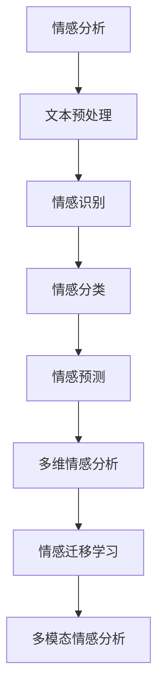

                 

### 文章标题

# 语言模型在多维情感分析与预测中的进展

## 关键词

- 语言模型
- 情感分析
- 多维情感
- 预测模型
- 情感预测
- 多任务学习
- 跨语言情感分析

### 摘要

本文详细探讨了语言模型在多维情感分析与预测中的应用进展。首先，介绍了情感分析与预测的基础概念，包括情感分析的定义、多维情感的概念及其在预测中的应用。接着，阐述了语言模型的基本原理及其分类，包括生成对抗网络（GAN）和强化学习在情感分析中的应用。然后，深入探讨了多维情感分析模型和情感预测模型，包括基于规则的、机器学习的和深度学习的预测方法。此外，还介绍了融合模型、多模态情感分析以及情感分析与预测的实践应用，如社交媒体情感分析、消费者行为预测和智能客服系统。最后，对情感分析与预测的未来发展趋势进行了展望，并提供了相关的工具与资源。

## 目录

### 第一部分：多维情感分析与预测基础

### 第1章：情感分析与预测概述

### 第2章：语言模型基础

### 第3章：多维情感分析模型

### 第4章：情感预测模型

### 第5章：情感分析与预测的融合模型

### 第6章：情感分析与预测的应用场景

### 第7章：情感分析与预测的实验与评估

### 第二部分：语言模型在多维情感分析与预测中的最新进展

### 第8章：语言模型在情感分析中的新方法

### 第9章：多模态情感分析中的语言模型

### 第10章：情感分析与预测的实践应用

### 第11章：情感分析与预测的未来发展趋势

### 附录

### 附录A：情感分析与预测工具与资源

### 附录B：常用情感分析数据集

### 附录C：数学公式与算法实现参考

### 核心概念与联系

#### 情感分析、多维情感、情感预测

**情感分析**是指使用自然语言处理技术对文本数据中的情感倾向进行识别和分析的过程。其核心目的是从大量的文本中提取出情感信息，帮助用户了解文本内容的情感倾向。

**多维情感**是指文本数据中包含多种情感维度，如积极情感、消极情感、惊喜等。这些情感维度可以同时存在于一个文本中，形成多维度的情感结构。

**情感预测**是指根据历史数据或当前数据预测未来情感状态的过程。情感预测可以帮助企业在营销、产品设计等方面做出更为精准的决策。

### Mermaid 流�程图



### 核心算法原理讲解

#### Python 源代码

```python
import torch
import torch.nn as nn
import torch.optim as optim

# 情感分类模型
class SentimentClassifier(nn.Module):
    def __init__(self, embedding_dim, hidden_dim, vocab_size, label_size):
        super(SentimentClassifier, self).__init__()
        self.embedding = nn.Embedding(vocab_size, embedding_dim)
        self.lstm = nn.LSTM(embedding_dim, hidden_dim, batch_first=True)
        self.fc = nn.Linear(hidden_dim, label_size)
    
    def forward(self, x):
        embedded = self.embedding(x)
        lstm_output, (hidden, cell) = self.lstm(embedded)
        hidden = hidden.squeeze(0)
        out = self.fc(hidden)
        return out

# 情感预测模型
class SentimentPredictor(nn.Module):
    def __init__(self, embedding_dim, hidden_dim, vocab_size, label_size):
        super(SentimentPredictor, self).__init__()
        self.classifier = SentimentClassifier(embedding_dim, hidden_dim, vocab_size, label_size)
        self.sigmoid = nn.Sigmoid()
    
    def forward(self, x):
        out = self.classifier(x)
        pred = self.sigmoid(out)
        return pred
```

#### 数学公式

$$
\text{Polarity} = \frac{\sum_{i=1}^{n} \text{word}_i \cdot \text{weight}_i}{\sum_{i=1}^{n} \text{weight}_i}
$$

其中，$ \text{word}_i $表示第i个单词，$ \text{weight}_i $表示第i个单词的情感权重，$ \text{Polarity} $表示文本的情感极性。

## 第1章 情感分析与预测概述

### 1.1 情感分析的定义与重要性

**情感分析**，又称意见挖掘，是一种利用自然语言处理技术对文本数据中的情感倾向进行识别和分析的过程。它旨在从大量的文本数据中提取出情感信息，帮助用户了解文本内容的情感倾向，进而为决策提供依据。

情感分析的重要性主要体现在以下几个方面：

1. **市场研究**：通过情感分析，企业可以了解消费者对其产品或服务的反馈，从而优化产品和服务。

2. **舆情监测**：政府机构或企业可以使用情感分析技术对社交媒体、新闻报道等公开信息进行监测，及时了解公众对某一事件的看法，为政策制定或市场策略提供参考。

3. **情感识别与分类**：情感分析可以帮助企业对客户评论、产品评价等进行分类，识别出正面、负面或中性的情感，从而更好地理解客户需求。

4. **情感预测**：通过分析历史数据和当前数据，情感分析可以预测未来情感状态，为企业在营销、产品设计等方面提供决策支持。

### 1.2 多维情感的概念

**多维情感**指的是文本数据中包含多种情感维度，如积极情感、消极情感、惊喜等。这些情感维度可以同时存在于一个文本中，形成多维度的情感结构。

多维情感的概念具有以下几个特点：

1. **复杂性**：多维情感分析需要对多个情感维度进行识别和分析，这增加了分析的复杂性。

2. **关联性**：多维情感之间存在关联性，一个文本中的情感维度可能会相互影响，如积极情感可能伴随着惊喜情感，消极情感可能伴随着负面情感。

3. **动态性**：多维情感是一个动态的过程，文本中的情感维度可能会随着文本的上下文或时间变化而发生变化。

4. **实用性**：多维情感分析可以更全面、准确地了解文本数据的情感信息，为应用提供更丰富的数据支持。

### 1.3 情感分析在预测中的应用

情感分析在预测中的应用主要体现在以下几个方面：

1. **消费者行为预测**：通过对消费者的评论、反馈等进行情感分析，可以预测消费者的购买意愿、满意度等，为企业的营销策略提供支持。

2. **市场趋势预测**：通过对社交媒体、新闻报道等公开信息进行情感分析，可以预测市场趋势，帮助企业在产品研发、市场定位等方面做出决策。

3. **舆情预测**：通过对公众对某一事件的评论、反馈等进行情感分析，可以预测公众对该事件的看法，为政府或企业制定相关政策提供参考。

4. **金融预测**：通过对金融市场的评论、新闻报道等进行情感分析，可以预测市场情绪，为投资者提供决策支持。

### 1.4 情感分析与预测的挑战与机遇

情感分析与预测面临着一系列的挑战和机遇：

1. **挑战**：

   - **数据质量**：情感分析与预测依赖于大量的文本数据，数据质量直接影响到分析的准确性。

   - **情感复杂性**：情感具有复杂性，多维情感分析需要同时考虑多个情感维度，增加了分析的难度。

   - **上下文依赖**：情感分析需要考虑上下文，文本的上下文信息可能会影响情感分析的结果。

   - **实时性**：情感分析与预测需要实时处理大量数据，对系统的实时性和计算性能提出了要求。

2. **机遇**：

   - **技术进步**：随着自然语言处理技术的不断发展，情感分析与预测的方法和工具越来越丰富，提高了分析的准确性。

   - **数据可用性**：互联网的普及使得大量的文本数据变得可用，为情感分析与预测提供了丰富的数据支持。

   - **应用需求**：情感分析与预测在多个领域具有广泛的应用需求，如市场研究、舆情监测、金融预测等，为技术发展提供了动力。

### 小结

情感分析与预测是一个复杂而富有挑战的领域，但同时也充满机遇。通过不断的技术创新和应用，我们有望在情感分析与预测方面取得更多的突破，为各行业提供更有价值的服务。

## 第2章 语言模型基础

### 2.1 语言模型概述

语言模型（Language Model，LM）是自然语言处理（Natural Language Processing，NLP）中的一项基础技术。它旨在模拟人类语言生成过程，对自然语言进行建模，从而预测下一个词语或字符的概率。语言模型在许多NLP任务中起着关键作用，如文本生成、机器翻译、语音识别和情感分析等。

### 2.2 语言模型的原理与分类

#### 原理

语言模型的原理基于概率论和统计学。其核心思想是通过对大量语料库的学习，统计出词语或字符之间的概率分布，从而预测下一个词语或字符。

语言模型可以分为以下几种：

1. **基于N-gram的语言模型**：N-gram模型是一种简单而常用的语言模型，它假设当前词语的概率仅与其前N个词语有关。N-gram模型通过统计词频来估计概率，具有较高的计算效率和较低的复杂性。

2. **基于神经网络的语言模型**：神经网络语言模型（Neural Network Language Model，NNLM）通过构建神经网络模型来学习语言特征，能够更好地捕捉长距离依赖关系。其中，最常见的是循环神经网络（Recurrent Neural Network，RNN）和长短期记忆网络（Long Short-Term Memory，LSTM）。

3. **基于生成对抗网络的语言模型**：生成对抗网络（Generative Adversarial Network，GAN）是一种由两个神经网络组成的框架，一个是生成器，另一个是判别器。生成器试图生成与真实数据相似的样本，而判别器则试图区分真实数据和生成数据。通过这种对抗训练，生成器能够生成更逼真的语言样本。

4. **基于强化学习的语言模型**：强化学习（Reinforcement Learning，RL）是一种通过试错和反馈来学习最优策略的方法。在语言模型中，强化学习可以用于优化文本生成的策略，提高生成文本的质量。

#### 分类

根据训练数据和模型结构，语言模型可以分为以下几种：

1. **统计语言模型**：基于统计方法，如N-gram模型，通过统计语料库中的词频来估计词语之间的概率分布。

2. **神经网络语言模型**：基于神经网络，如RNN、LSTM和Transformer等，通过学习输入序列的表示来预测下一个词语。

3. **深度学习语言模型**：基于深度神经网络，如深度神经网络（Deep Neural Network，DNN）、卷积神经网络（Convolutional Neural Network，CNN）等，通过多层神经网络来学习复杂的语言特征。

4. **生成对抗网络语言模型**：基于生成对抗网络（GAN），通过生成器和判别器的对抗训练来生成高质量的语言样本。

5. **强化学习语言模型**：基于强化学习，通过试错和反馈来优化文本生成的策略。

### 2.3 常见的语言模型

以下是几种常见的语言模型：

1. **N-gram模型**：N-gram模型是最早的语言模型之一，通过统计相邻N个词语的概率来预测下一个词语。例如，三元组模型（Trigram Model）考虑了前两个词语对当前词语的影响。

2. **循环神经网络（RNN）模型**：RNN模型是一种基于神经网络的模型，能够处理序列数据。通过循环结构，RNN能够记住历史信息，从而更好地预测下一个词语。

3. **长短期记忆网络（LSTM）模型**：LSTM是RNN的一种变体，通过引入门控机制来避免长期依赖问题。LSTM能够更好地记住长期信息，从而提高预测的准确性。

4. **Transformer模型**：Transformer是一种基于自注意力机制的深度学习模型，通过多头自注意力机制和前馈神经网络来学习序列间的依赖关系。Transformer在许多NLP任务中取得了显著的效果。

5. **生成对抗网络（GAN）模型**：GAN是一种生成模型，由生成器和判别器组成。生成器试图生成与真实数据相似的语言样本，而判别器则试图区分真实数据和生成数据。GAN在文本生成任务中表现出色。

### 小结

语言模型是自然语言处理的基础技术，通过模拟人类语言生成过程，为各种NLP任务提供支持。常见的语言模型包括N-gram模型、RNN模型、LSTM模型、Transformer模型和GAN模型。每种模型都有其独特的原理和应用场景，通过不断的研究和优化，语言模型在NLP任务中的表现越来越出色。

## 第3章 多维情感分析模型

### 3.1 多维情感分析模型概述

多维情感分析（Multidimensional Sentiment Analysis）是一种通过识别和分析文本中的多个情感维度，从而全面了解文本情感信息的方法。与传统的单维情感分析不同，多维情感分析能够同时考虑文本中的积极情感、消极情感、惊喜、愤怒等多种情感维度，为更全面地理解文本情感提供了可能。

### 3.2 基于情感词典的方法

基于情感词典的方法是进行多维情感分析的一种常见手段。情感词典是一种包含词语及其对应情感极性（如积极、消极）和情感强度（如强烈、中等、轻微）的工具。这种方法的核心思想是通过匹配文本中的词语与情感词典中的词语，计算文本的情感极性和强度。

#### 工作原理

1. **情感词典构建**：首先需要构建一个包含大量词语及其情感属性的词典。这个词典可以是手动构建的，也可以是自动生成的。

2. **词语匹配**：对文本进行分词，将分词后的词语与情感词典进行匹配，计算每个词语的情感极性和强度。

3. **情感极性计算**：通过统计文本中积极和消极词语的数量及其强度，计算文本的总情感极性。常用的计算方法包括：

   - **简单求和法**：将每个词语的强度直接相加，得到总情感极性。
   - **加权求和方法**：根据词语在文本中的重要程度（如词频、词性等）对情感强度进行加权，然后求和。

4. **情感强度计算**：根据情感极性和文本长度，计算文本的情感强度。常用的计算方法包括：

   - **归一化方法**：将总情感极性除以文本长度，得到文本的情感强度。
   - **阈值方法**：设定一个阈值，如果总情感极性超过阈值，则认为文本具有较高情感强度。

#### 优点与局限

**优点**：

- **简单易实现**：基于情感词典的方法相对简单，易于理解和实现。
- **高效性**：通过匹配词典中的词语，可以快速计算文本的情感极性和强度。

**局限**：

- **准确性受限**：情感词典的准确性直接影响到分析结果的准确性。手工构建的情感词典可能存在偏差，自动生成的词典可能无法覆盖所有情感词汇。
- **上下文依赖不足**：基于情感词典的方法无法充分考虑文本上下文对情感的影响。

### 3.3 基于机器学习方法的多维情感分析

基于机器学习方法的多维情感分析利用机器学习算法，从大量文本数据中学习情感特征，从而对文本进行情感分析。这种方法能够更好地捕捉文本中的复杂情感信息，提高情感分析的准确性。

#### 常见算法

1. **朴素贝叶斯（Naive Bayes）**：朴素贝叶斯是一种基于概率论的分类算法，通过计算文本中词语的条件概率来预测文本的情感极性。

2. **支持向量机（Support Vector Machine，SVM）**：SVM是一种基于优化理论的分类算法，通过寻找最优超平面来分隔不同情感类别的文本。

3. **随机森林（Random Forest）**：随机森林是一种基于决策树的集成学习方法，通过构建多棵决策树并投票来预测文本的情感极性。

4. **深度学习（Deep Learning）**：深度学习是一种基于多层神经网络的模型，通过学习输入数据的特征表示，从而实现对文本的情感分类。常见的深度学习模型包括卷积神经网络（CNN）、循环神经网络（RNN）和变换器（Transformer）等。

#### 工作原理

1. **数据预处理**：对文本进行分词、去停用词、词向量化等预处理操作，将文本转换为机器学习模型可接受的输入格式。

2. **特征提取**：通过机器学习算法从预处理的文本中提取情感特征。这些特征可以是词语的频率、词性、词嵌入向量等。

3. **模型训练**：使用预处理的文本和对应的情感标签，训练机器学习模型。训练过程包括模型的初始化、参数优化和模型评估。

4. **情感预测**：使用训练好的模型对新的文本进行情感预测，输出文本的情感极性。

#### 优点与局限

**优点**：

- **高准确性**：基于机器学习方法的多维情感分析能够更好地捕捉文本中的复杂情感信息，提高情感分析的准确性。
- **适应性**：机器学习方法可以针对不同的应用场景进行调整，提高模型在特定领域的表现。

**局限**：

- **数据需求**：机器学习方法需要大量的训练数据，对数据的质量和数量有一定要求。
- **复杂性**：机器学习方法相对复杂，需要一定的专业知识和经验来设计和调参。

### 3.4 基于深度学习的方法

基于深度学习的方法在多维情感分析中得到了广泛应用。深度学习模型具有强大的特征提取和表示能力，能够更好地捕捉文本中的复杂情感信息。

#### 常见模型

1. **卷积神经网络（CNN）**：CNN是一种基于卷积运算的神经网络，能够有效地提取文本的局部特征。

2. **循环神经网络（RNN）**：RNN是一种基于循环结构的神经网络，能够处理序列数据，捕捉文本中的长距离依赖关系。

3. **长短期记忆网络（LSTM）**：LSTM是RNN的一种变体，通过引入门控机制来避免长期依赖问题。

4. **变换器（Transformer）**：Transformer是一种基于自注意力机制的深度学习模型，通过多头自注意力机制和前馈神经网络来学习序列间的依赖关系。

#### 工作原理

1. **文本表示**：将文本转换为词嵌入向量，将每个词语映射为一个固定维度的向量表示。

2. **特征提取**：通过神经网络模型对词嵌入向量进行特征提取。不同的模型有不同的特征提取方法，如卷积操作、循环操作和自注意力机制。

3. **情感分类**：将提取出的特征输入到分类层，通过分类器输出文本的情感极性。

#### 优点与局限

**优点**：

- **强大的特征提取能力**：深度学习模型能够自动学习文本的特征表示，提高情感分析的准确性。
- **自适应性强**：深度学习模型可以根据不同的任务和数据特点进行自适应调整。

**局限**：

- **计算资源需求**：深度学习模型通常需要大量的计算资源和时间来训练和推理。
- **数据依赖性**：深度学习模型对数据的质量和数量有一定依赖，数据不足或质量差可能导致模型性能下降。

### 小结

多维情感分析模型是进行情感分析的重要工具。基于情感词典的方法简单易实现，但准确性有限；基于机器学习方法的多维情感分析能够提高准确性，但需要大量的数据；基于深度学习的方法具有强大的特征提取和表示能力，能够更好地捕捉文本中的复杂情感信息。选择合适的情感分析模型，需要根据具体任务和应用场景进行权衡和优化。

## 第4章 情感预测模型

### 4.1 情感预测的定义与目的

情感预测（Sentiment Prediction）是指利用历史数据或当前数据，通过算法模型预测文本或事件的情感状态。其核心目的是从大量的文本数据中提取出有价值的信息，为企业在市场研究、消费者行为分析、舆情监测等领域提供决策支持。

情感预测的主要目标包括：

1. **情感极性分类**：将文本的情感极性划分为正面、负面或中性。例如，在社交媒体分析中，预测用户评论是正面、负面还是中性。
2. **情感强度评估**：对文本的情感强度进行量化评估，通常使用0到1的数值表示。例如，在产品评价分析中，预测用户对产品的满意度程度。
3. **情感变化趋势预测**：预测文本或事件在一段时间内的情感变化趋势，为企业在市场策略制定和产品优化提供参考。

### 4.2 基于规则的预测方法

基于规则的预测方法（Rule-Based Prediction Method）是一种传统的情感预测方法，通过预设的规则来对文本进行情感分析。这种方法通常包含以下几个步骤：

1. **规则定义**：根据业务需求，定义一系列规则。例如，如果文本中包含“很好”、“优秀”等正面词汇，则预测该文本为正面情感。
2. **规则匹配**：对输入的文本进行分词和词性标注，然后根据定义的规则进行匹配。如果文本中的词语与规则中的关键词匹配，则根据规则进行情感分类。
3. **结果输出**：根据规则匹配的结果，输出文本的情感极性和强度。

#### 优点与局限

**优点**：

- **简单易实现**：基于规则的预测方法相对简单，易于理解和实现。
- **解释性强**：规则明确，便于理解和解释。

**局限**：

- **规则覆盖不足**：情感分析是一个复杂的过程，基于规则的预测方法可能无法覆盖所有的情感表达。
- **上下文依赖不足**：规则方法通常无法充分考虑文本上下文对情感的影响。

### 4.3 基于机器学习的预测方法

基于机器学习的预测方法（Machine Learning Prediction Method）利用机器学习算法，从大量文本数据中学习情感特征，从而进行情感预测。这种方法主要包括以下几个步骤：

1. **数据预处理**：对文本进行分词、去停用词、词性标注等预处理操作，将文本转换为机器学习模型可接受的输入格式。
2. **特征提取**：通过机器学习算法提取文本的特征。这些特征可以是词语的频率、词性、词嵌入向量等。
3. **模型训练**：使用预处理的文本和对应的情感标签，训练机器学习模型。训练过程包括模型的初始化、参数优化和模型评估。
4. **情感预测**：使用训练好的模型对新的文本进行情感预测，输出文本的情感极性。

#### 常见算法

1. **朴素贝叶斯（Naive Bayes）**：朴素贝叶斯是一种基于概率论的分类算法，通过计算文本中词语的条件概率来预测文本的情感极性。
2. **支持向量机（Support Vector Machine，SVM）**：SVM是一种基于优化理论的分类算法，通过寻找最优超平面来分隔不同情感类别的文本。
3. **随机森林（Random Forest）**：随机森林是一种基于决策树的集成学习方法，通过构建多棵决策树并投票来预测文本的情感极性。
4. **深度学习（Deep Learning）**：深度学习是一种基于多层神经网络的模型，通过学习输入数据的特征表示，从而实现对文本的情感分类。常见的深度学习模型包括卷积神经网络（CNN）、循环神经网络（RNN）和变换器（Transformer）等。

#### 优点与局限

**优点**：

- **高准确性**：基于机器学习的预测方法能够更好地捕捉文本中的复杂情感信息，提高情感预测的准确性。
- **适应性**：机器学习方法可以针对不同的应用场景进行调整，提高模型在特定领域的表现。

**局限**：

- **数据需求**：机器学习方法需要大量的训练数据，对数据的质量和数量有一定要求。
- **复杂性**：机器学习模型相对复杂，需要一定的专业知识和经验来设计和调参。

### 4.4 基于深度学习的预测方法

基于深度学习的预测方法（Deep Learning Prediction Method）利用深度学习模型，从大量文本数据中学习情感特征，从而进行情感预测。这种方法主要包括以下几个步骤：

1. **文本表示**：将文本转换为词嵌入向量，将每个词语映射为一个固定维度的向量表示。
2. **特征提取**：通过神经网络模型对词嵌入向量进行特征提取。不同的模型有不同的特征提取方法，如卷积操作、循环操作和自注意力机制。
3. **情感分类**：将提取出的特征输入到分类层，通过分类器输出文本的情感极性。

#### 常见模型

1. **卷积神经网络（CNN）**：CNN是一种基于卷积运算的神经网络，能够有效地提取文本的局部特征。
2. **循环神经网络（RNN）**：RNN是一种基于循环结构的神经网络，能够处理序列数据，捕捉文本中的长距离依赖关系。
3. **长短期记忆网络（LSTM）**：LSTM是RNN的一种变体，通过引入门控机制来避免长期依赖问题。
4. **变换器（Transformer）**：Transformer是一种基于自注意力机制的深度学习模型，通过多头自注意力机制和前馈神经网络来学习序列间的依赖关系。

#### 优点与局限

**优点**：

- **强大的特征提取能力**：深度学习模型能够自动学习文本的特征表示，提高情感预测的准确性。
- **自适应性强**：深度学习模型可以根据不同的任务和数据特点进行自适应调整。

**局限**：

- **计算资源需求**：深度学习模型通常需要大量的计算资源和时间来训练和推理。
- **数据依赖性**：深度学习模型对数据的质量和数量有一定依赖，数据不足或质量差可能导致模型性能下降。

### 小结

情感预测模型在自然语言处理中具有重要应用价值。基于规则的预测方法简单易实现，但准确性有限；基于机器学习的预测方法能够提高准确性，但需要大量数据；基于深度学习的预测方法具有强大的特征提取和表示能力，能够更好地捕捉文本中的复杂情感信息。选择合适的情感预测模型，需要根据具体任务和应用场景进行权衡和优化。

## 第5章 情感分析与预测的融合模型

### 5.1 融合模型概述

情感分析与预测的融合模型旨在通过结合情感分析和情感预测的方法，提高情感识别和预测的准确性和效率。这种融合模型能够利用不同模型的优势，克服单一模型的局限性，从而在复杂情感分析和预测任务中表现出色。

### 5.2 多任务学习

多任务学习（Multi-Task Learning，MTL）是一种将多个相关任务整合到一个共同模型中进行训练的方法。在情感分析与预测中，多任务学习可以通过同时训练多个任务（如情感极性分类和情感强度评估），共享特征提取和参数优化的过程，提高模型的整体性能。

#### 工作原理

1. **任务定义**：定义多个相关任务，如情感极性分类、情感强度评估等。
2. **模型架构**：设计一个能够同时处理多个任务的神经网络架构，如多个输出层的深度神经网络。
3. **共享网络**：设计共享网络部分，用于提取通用的特征表示，这些特征可以被多个任务共享。
4. **任务特定网络**：为每个任务设计特定的网络结构，用于处理特定任务的信息。
5. **联合训练**：使用联合训练策略，同时优化多个任务的目标函数，通过共享参数和梯度更新来提高模型性能。

#### 优点与局限

**优点**：

- **提高性能**：多任务学习可以通过共享特征提取器，提高模型在不同任务上的性能。
- **资源利用**：共享网络部分可以减少模型参数数量，降低计算和存储需求。

**局限**：

- **任务依赖**：任务之间存在依赖关系，一个任务的性能可能会影响其他任务的性能。
- **数据分布**：如果任务之间的数据分布不一致，可能会影响模型的泛化能力。

### 5.3 情感迁移学习

情感迁移学习（Sentiment Transfer Learning，STL）是一种利用预训练模型进行情感分析和预测的方法。迁移学习通过将一个任务（如图像分类）的预训练模型应用于另一个任务（如情感分析），可以有效地利用预训练模型的知识，提高情感分析的准确性。

#### 工作原理

1. **预训练模型**：使用大量数据预训练一个通用的情感分析模型，如使用大规模语料库训练的词嵌入模型或变换器模型。
2. **微调**：在预训练模型的基础上，使用特定领域的情感分析数据集进行微调，使其适应特定的情感分析和预测任务。
3. **特征提取**：使用微调后的模型提取文本的特征表示，这些特征可以用于情感分类和预测。
4. **融合策略**：将特征表示与其他方法（如规则方法、机器学习方法等）进行融合，以提高预测性能。

#### 优点与局限

**优点**：

- **提高泛化能力**：通过迁移学习，模型可以从大量通用数据中学习到通用的情感特征，提高模型的泛化能力。
- **减少数据需求**：使用预训练模型可以减少特定领域数据的依赖，降低数据收集和标注的成本。

**局限**：

- **模型适应能力**：预训练模型的性能可能在不同领域有所差异，需要针对特定领域进行适当的调整。
- **数据质量**：预训练模型的效果受到数据质量的影响，数据中的噪声和偏差可能会影响模型性能。

### 5.4 多模态情感分析

多模态情感分析（Multi-Modal Sentiment Analysis）是一种结合文本、图像、声音等多种数据源进行情感分析和预测的方法。通过整合不同模态的数据，可以更全面、准确地理解情感信息。

#### 工作原理

1. **数据收集**：收集包含文本、图像、声音等多种模态的数据，如社交媒体评论、图像、音频等。
2. **特征提取**：使用不同的模态特征提取方法，从文本、图像、声音等数据中提取特征表示。例如，使用词嵌入模型提取文本特征，使用卷积神经网络提取图像特征，使用循环神经网络提取声音特征。
3. **特征融合**：将不同模态的特征进行融合，可以使用简单拼接、加权融合或深度学习融合方法。融合策略可以根据具体任务进行优化。
4. **情感分析**：使用融合后的特征进行情感分类和预测。可以结合单一模态的情感分析方法，如基于规则的、机器学习的和深度学习的方法。

#### 优点与局限

**优点**：

- **全面性**：多模态情感分析可以同时考虑文本、图像、声音等多种数据源，提供更全面的情感分析结果。
- **互补性**：不同模态的数据可以互补，弥补单一模态数据的不足，提高情感分析的准确性。

**局限**：

- **复杂性**：多模态情感分析需要处理多种数据源，增加了算法的复杂性和计算成本。
- **数据一致性**：不同模态的数据可能存在不一致性，如文本和图像的情感表达可能存在差异，需要适当的处理方法。

### 小结

情感分析与预测的融合模型通过结合不同方法的优势，提高情感识别和预测的准确性和效率。多任务学习、情感迁移学习和多模态情感分析是三种常见的融合模型。多任务学习通过共享特征提取器提高模型性能；情感迁移学习利用预训练模型的知识进行任务适应；多模态情感分析整合文本、图像、声音等多种数据源，提供更全面的情感分析结果。这些融合模型在不同应用场景中具有广泛的应用前景。

## 第6章 情感分析与预测的应用场景

### 6.1 社交媒体情感分析

社交媒体情感分析是情感分析与预测的重要应用场景之一。随着社交媒体的普及，大量用户评论、帖子、评论等数据不断产生，通过对这些数据进行情感分析，可以提取出用户的情感倾向，帮助企业更好地了解用户需求，优化产品和服务。

#### 应用案例

1. **用户反馈分析**：企业可以通过对社交媒体上的用户评论进行分析，了解用户对产品或服务的满意度。例如，通过对用户评论的情感极性进行分类，可以识别出正面评论和负面评论，从而发现产品存在的问题，及时进行改进。

2. **市场趋势预测**：通过分析社交媒体上的情感趋势，企业可以预测市场动态，为营销策略提供支持。例如，通过监测特定关键词的情感极性变化，可以预测产品的销售趋势，从而调整库存和生产计划。

3. **品牌监控**：企业可以通过情感分析技术，实时监控社交媒体上的品牌声誉。例如，通过监测用户对品牌的评论，可以识别出品牌的正面和负面情感，及时发现和处理潜在的危机。

#### 技术实现

1. **文本预处理**：对社交媒体数据进行分词、去停用词、词性标注等预处理操作，将原始文本转换为机器学习模型可接受的输入格式。

2. **情感极性分类**：使用基于规则的、机器学习的和深度学习的方法对预处理后的文本进行情感极性分类，识别出正面、负面或中性的情感。

3. **情感强度评估**：使用情感强度评估模型，对文本的情感强度进行量化评估，通常使用0到1的数值表示。

4. **情感趋势分析**：通过时间序列分析方法，分析社交媒体上情感极性随时间的变化趋势，预测未来情感状态。

### 6.2 消费者行为预测

消费者行为预测是情感分析与预测在商业领域的另一个重要应用。通过分析消费者的情感状态，企业可以更精准地预测消费者的购买意愿和满意度，从而优化产品和服务。

#### 应用案例

1. **个性化推荐**：通过分析消费者的情感状态，企业可以为消费者提供个性化的产品推荐。例如，通过分析消费者在社交媒体上的评论情感，可以为消费者推荐感兴趣的产品或服务。

2. **市场细分**：通过情感分析，企业可以将消费者分为不同的情感群体，针对不同的情感群体制定相应的营销策略。例如，针对情感积极的消费者，可以推出优惠活动，以增强他们的购买意愿。

3. **客户满意度预测**：通过分析消费者的情感状态，企业可以预测客户的满意度，从而及时发现潜在的问题，并提供解决方案。

#### 技术实现

1. **情感分析**：对消费者的文本评论、反馈等进行情感分析，识别出消费者的情感倾向和情感强度。

2. **行为预测模型**：使用机器学习和深度学习算法，构建消费者行为预测模型，通过分析消费者的情感状态，预测其购买意愿和满意度。

3. **决策支持系统**：将情感分析和行为预测模型集成到决策支持系统中，为企业的营销、产品设计和客户服务提供支持。

### 6.3 健康医疗情感分析

健康医疗情感分析是情感分析与预测在医疗领域的应用，通过对患者文本数据进行分析，提取出患者的情感状态，为医疗决策提供支持。

#### 应用案例

1. **患者满意度分析**：通过分析患者的评论和反馈，医疗机构可以了解患者的满意度，及时发现医疗服务的不足，并进行改进。

2. **心理健康评估**：通过分析患者的文本数据，如病历记录、社交媒体评论等，可以评估患者的心理健康状况，为心理干预提供依据。

3. **疾病预测**：通过分析患者的情感状态，可以预测患者可能患有的疾病，如抑郁症、焦虑症等，为早期干预提供支持。

#### 技术实现

1. **文本预处理**：对患者的文本数据（如病历记录、社交媒体评论等）进行分词、去停用词、词性标注等预处理操作。

2. **情感极性分类**：使用情感分析模型对预处理后的文本进行情感极性分类，识别出患者的情感倾向。

3. **情感强度评估**：使用情感强度评估模型，对患者的情感强度进行量化评估，为医疗决策提供支持。

4. **疾病预测模型**：结合患者的情感状态和其他医疗数据，使用机器学习和深度学习算法，构建疾病预测模型，预测患者可能患有的疾病。

### 6.4 智能客服系统

智能客服系统是情感分析与预测在客户服务领域的应用，通过分析客户对话，提供情感识别和预测功能，提升客户服务质量和用户体验。

#### 应用案例

1. **情感识别与分类**：智能客服系统可以实时分析客户的情感状态，识别出客户的情感倾向，从而提供更针对性的服务。

2. **情感预测**：通过分析历史客户对话数据，智能客服系统可以预测客户可能的情感变化，提前采取措施，避免负面情感的产生。

3. **情感反馈**：智能客服系统可以收集客户的情感反馈，为产品和服务优化提供参考。

#### 技术实现

1. **文本预处理**：对客户对话文本进行分词、去停用词、词性标注等预处理操作。

2. **情感分析模型**：使用情感分析模型对预处理后的文本进行情感极性分类和情感强度评估。

3. **情感预测模型**：结合历史客户对话数据，使用机器学习和深度学习算法，构建情感预测模型，预测客户可能的情感变化。

4. **智能对话管理**：将情感识别和预测结果应用于智能客服系统，根据客户的情感状态提供个性化的服务。

### 小结

情感分析与预测在社交媒体、消费者行为、健康医疗和智能客服等领域具有广泛的应用。通过分析用户的情感状态，企业可以更好地了解用户需求，优化产品和服务，提升用户体验。同时，情感分析与预测也为医疗决策和客户服务提供了新的手段，有助于提高服务质量和医疗效果。

## 第7章 情感分析与预测的实验与评估

### 7.1 数据集与评价指标

在进行情感分析与预测的实验与评估时，选择合适的数据集和评价指标是至关重要的。以下是一些常用的数据集和评价指标：

#### 数据集

1. **Stanford Sentiment Treebank (SST)**：这是一个包含近11,000个句子及其情感极性的数据集，分为正面、负面和中性三种情感标签。

2. **Twitter Sentiment**：这是一个包含大量Twitter评论的数据集，分为正面、负面和中性三种情感标签。

3. **Amazon Reviews**：这是一个包含用户对商品评论的数据集，分为一星到五星的评分，可以用来进行情感极性和情感强度的分析。

#### 评价指标

1. **准确率（Accuracy）**：准确率是指模型预测正确的样本数量占总样本数量的比例。它是评估分类模型最常用的指标之一。

   $$
   \text{Accuracy} = \frac{\text{预测正确的样本数量}}{\text{总样本数量}}
   $$

2. **精确率（Precision）**：精确率是指预测为正类的样本中，实际为正类的样本数量与预测为正类的样本总数量的比例。

   $$
   \text{Precision} = \frac{\text{预测为正类且实际为正类的样本数量}}{\text{预测为正类的样本总数量}}
   $$

3. **召回率（Recall）**：召回率是指实际为正类的样本中，被预测为正类的样本数量与实际为正类的样本总数量的比例。

   $$
   \text{Recall} = \frac{\text{预测为正类且实际为正类的样本数量}}{\text{实际为正类的样本总数量}}
   $$

4. **F1分数（F1 Score）**：F1分数是精确率和召回率的调和平均值，用于综合评估模型的分类性能。

   $$
   \text{F1 Score} = 2 \times \frac{\text{Precision} \times \text{Recall}}{\text{Precision} + \text{Recall}}
   $$

5. **情感强度误差（Sentiment Strength Error）**：情感强度误差用于评估模型在情感强度评估任务中的性能。它计算的是预测情感强度与实际情感强度之间的平均绝对误差。

   $$
   \text{Sentiment Strength Error} = \frac{1}{N} \sum_{i=1}^{N} |\text{predicted\_sentiment}_{i} - \text{actual\_sentiment}_{i}|
   $$

### 7.2 实验设计与实现

在进行情感分析与预测的实验时，需要设计合理的实验流程，确保实验结果的可靠性和有效性。以下是一个典型的实验设计流程：

1. **数据预处理**：对收集的数据集进行清洗、分词、去停用词、词性标注等预处理操作。将文本数据转换为机器学习模型可接受的格式，如词嵌入向量。

2. **数据集划分**：将数据集划分为训练集、验证集和测试集。通常，训练集用于模型训练，验证集用于模型调参和评估，测试集用于最终模型评估。

3. **模型训练**：使用训练集对模型进行训练。选择合适的模型架构和参数，通过优化算法（如梯度下降）更新模型参数，使模型在训练集上的性能达到最佳。

4. **模型评估**：使用验证集对模型进行评估，根据评价指标（如准确率、精确率、召回率、F1分数等）选择最优模型。

5. **模型测试**：使用测试集对最优模型进行最终评估，验证模型在未见数据上的表现。

### 7.3 实验结果分析与讨论

通过对实验结果的详细分析，可以了解模型在情感分析与预测任务中的性能和不足之处。以下是一些可能的实验结果分析与讨论：

1. **模型性能评估**：根据验证集和测试集的评估结果，分析模型的准确率、精确率、召回率和F1分数等指标，了解模型在情感分析任务中的表现。

2. **模型参数调优**：通过分析模型在不同参数设置下的性能，找到最优的参数组合，以提高模型的预测性能。

3. **情感强度误差分析**：分析模型在情感强度评估任务中的情感强度误差，了解模型在情感强度预测方面的准确性。

4. **模型泛化能力评估**：通过在测试集上的表现，评估模型的泛化能力，确保模型在未见数据上仍能保持较高的性能。

5. **对比实验**：与基准模型进行对比实验，分析新模型在情感分析与预测任务中的优势与不足，为进一步优化模型提供参考。

6. **实验结果可视化**：使用图表和可视化工具，将实验结果进行直观展示，帮助读者更好地理解模型的性能和效果。

### 小结

情感分析与预测的实验与评估是确保模型性能和可靠性的关键环节。通过合理的数据集选择、评价指标设定和实验设计，可以全面评估模型在情感分析与预测任务中的表现。实验结果的分析与讨论有助于发现模型的不足之处，为进一步优化模型提供依据。同时，实验结果也为情感分析与预测领域的理论研究提供了实证支持。

## 第二部分：语言模型在多维情感分析与预测中的最新进展

### 第8章：语言模型在情感分析中的新方法

随着自然语言处理技术的不断进步，语言模型在情感分析中的应用也不断涌现出新的方法和进展。本章将介绍几种前沿的、具有代表性的方法，包括生成对抗网络（GAN）在情感分析中的应用、强化学习在情感预测中的应用，以及跨语言情感分析的发展。

### 8.1 生成对抗网络（GAN）在情感分析中的应用

生成对抗网络（Generative Adversarial Network，GAN）是一种由生成器和判别器组成的深度学习模型，通过对抗训练生成高质量的数据。在情感分析中，GAN被广泛应用于文本生成和情感分类任务。

#### 工作原理

GAN由生成器（Generator）和判别器（Discriminator）两个神经网络组成。生成器的目标是生成与真实文本相似的数据，而判别器的目标是区分真实文本和生成文本。通过这种对抗训练，生成器能够不断提高生成文本的质量，判别器则不断学习区分真实和生成文本。

1. **生成器**：生成器的输入是一个随机噪声向量，通过多个隐层生成伪文本。生成器的目标是使生成的文本在语义上与真实文本相近，从而欺骗判别器。

2. **判别器**：判别器的输入是真实文本和生成文本，其目标是判断输入文本是真实文本还是生成文本。判别器的输出是概率值，越接近0.5表示判别能力越强。

3. **对抗训练**：生成器和判别器通过对抗训练进行优化。生成器通过不断调整生成策略，使判别器无法准确判断生成文本的真实性；判别器通过不断优化判断策略，提高对生成文本的识别能力。

#### 应用案例

1. **文本生成**：使用GAN生成与给定情感极性相关的文本。例如，给定正面情感极性，生成器可以生成一系列具有正面情感的文本。

2. **情感分类**：通过训练GAN，使生成器能够生成与情感极性相关的文本，然后使用这些生成的文本进行情感分类任务，提高分类模型的泛化能力。

3. **情感增强**：在已有的情感分析模型中，使用GAN生成的文本数据进行增强，提高模型在情感分类和情感强度评估任务中的性能。

### 8.2 强化学习在情感预测中的应用

强化学习（Reinforcement Learning，RL）是一种通过试错和反馈来学习最优策略的方法。在情感预测中，强化学习被应用于优化情感分类和情感强度评估策略。

#### 工作原理

强化学习的基本概念包括：

1. **环境（Environment）**：环境是模型所处的现实世界，它提供状态（State）和奖励（Reward）。
2. **策略（Policy）**：策略是模型根据当前状态选择行动的规则。
3. **价值函数（Value Function）**：价值函数评估状态和策略的优劣。
4. **模型**：模型是策略的学习过程，通过不断调整策略，使最终策略能够最大化长期奖励。

在情感预测中，强化学习的应用主要包括：

1. **状态表示**：将文本数据转换为状态表示，例如使用词嵌入向量或变换器编码器输出的隐藏状态。
2. **行动空间**：行动空间包括情感分类（如正面、负面、中性）和情感强度评估（如0到1的数值）。
3. **奖励设计**：设计奖励函数，根据预测结果与真实结果的匹配程度给予奖励。
4. **策略优化**：使用策略优化算法（如策略梯度算法、Q-learning等）调整策略，使其在长期内最大化累积奖励。

#### 应用案例

1. **情感强度评估**：使用强化学习优化情感强度评估策略，使模型能够更准确地预测情感强度。
2. **多步情感预测**：使用强化学习预测文本序列中的情感变化，例如预测用户评论的情感波动。
3. **动态情感预测**：结合实时数据和上下文信息，使用强化学习进行动态情感预测，例如在社交媒体监控中预测用户情绪变化。

### 8.3 跨语言情感分析

跨语言情感分析（Cross-Lingual Sentiment Analysis）是情感分析领域的一个重要研究方向，旨在实现跨语言的情感识别和预测。随着全球化和多语言交流的日益增多，跨语言情感分析在社交媒体、电子商务、国际市场调研等领域具有广泛的应用前景。

#### 工作原理

1. **多语言数据集**：收集包含多种语言的情感分析数据集，例如多语言社交媒体评论、多语言产品评价等。
2. **跨语言表示**：使用跨语言词嵌入模型（如FastText、Multilingual BERT等）将多语言文本转换为统一的跨语言表示。
3. **跨语言情感词典**：构建跨语言的情感词典，将不同语言的情感词汇映射到统一的情感极性。
4. **迁移学习**：使用迁移学习方法，将预训练的多语言情感分析模型应用于新语言的数据集，提高新语言数据集的情感分析性能。

#### 应用案例

1. **社交媒体情感分析**：对多语言社交媒体评论进行情感分析，了解不同语言社区的情感倾向。
2. **电子商务产品评价**：对多语言电子商务产品评价进行情感分析，优化产品和服务。
3. **国际市场调研**：通过跨语言情感分析，了解不同国家和地区消费者对产品的情感反应，制定更有效的市场策略。

### 小结

语言模型在多维情感分析与预测中的最新进展，展现了其在文本生成、情感分类、情感预测和跨语言情感分析等多个方面的广泛应用。生成对抗网络（GAN）通过对抗训练提高文本生成的质量和情感分类的准确性；强化学习通过优化策略提高情感强度评估和多步情感预测的性能；跨语言情感分析通过多语言数据集和跨语言表示，实现多语言的情感识别和预测。这些最新进展为情感分析与预测领域带来了新的机遇和挑战，推动了自然语言处理技术的不断发展和创新。

### 第9章：多模态情感分析中的语言模型

多模态情感分析是一种结合多种数据来源（如文本、图像、声音等）的方法，旨在更全面、准确地理解情感信息。语言模型在多模态情感分析中发挥着重要作用，能够有效地融合不同模态的数据，提高情感分析的准确性和鲁棒性。本章将详细介绍文本与视觉数据融合、声音情感分析和视频情感分析中的语言模型。

#### 9.1 文本与视觉数据的融合

文本与视觉数据的融合是多模态情感分析中最常见的方式之一。这种方法通过结合文本和图像信息，可以更全面地理解情感表达。

**工作原理**

1. **文本表示**：使用语言模型（如BERT、GPT等）对文本数据进行编码，生成文本嵌入向量。

2. **图像表示**：使用卷积神经网络（如VGG、ResNet等）对图像数据进行编码，生成图像特征向量。

3. **特征融合**：将文本嵌入向量和图像特征向量进行融合。常见的融合方法包括：

   - **拼接**：将文本嵌入向量和图像特征向量进行拼接，形成新的特征向量。
   - **融合层**：在神经网络中引入融合层，通过神经网络学习如何融合不同模态的数据。
   - **多模态变换器**：使用多模态变换器（如Multi-modal Transformer）同时处理文本和图像数据，自动学习如何融合不同模态的信息。

**应用案例**

1. **社交媒体情感分析**：结合用户评论和社交媒体上的图片，分析用户对某一事件的情感反应。

2. **电子商务产品评价**：结合用户评论和产品图片，分析消费者对产品的情感倾向。

3. **新闻情感分析**：结合新闻文本和图片，分析新闻报道中的情感色彩。

**优点与局限**

- **优点**：

  - **信息丰富**：结合文本和视觉信息，可以更全面地理解情感表达。

  - **增强准确性**：不同模态的数据可以互补，提高情感分析的准确性。

- **局限**：

  - **计算成本高**：多模态数据融合需要大量的计算资源。

  - **数据不一致性**：文本和图像的情感表达可能存在差异，需要适当的处理方法。

#### 9.2 声音情感分析

声音情感分析是一种通过分析语音信号中的情感信息来进行情感识别的方法。语言模型在声音情感分析中可以通过语音识别和文本情感分析两个步骤，实现情感信息的提取和识别。

**工作原理**

1. **语音识别**：使用语音识别模型（如CTC、WaveNet等）将语音信号转换为文本。

2. **文本情感分析**：使用语言模型（如BERT、GPT等）对转换后的文本进行情感分析，提取情感信息。

3. **声音特征提取**：使用声音特征提取方法（如梅尔频率倒谱系数（MFCC）、短时傅里叶变换（STFT）等）从原始语音信号中提取声音特征。

**应用案例**

1. **语音助手情感识别**：通过分析用户语音中的情感信息，优化语音助手的交互体验。

2. **情绪诊断**：结合医疗数据和声音情感分析，帮助医生诊断情绪障碍。

3. **心理学研究**：通过分析录音数据中的情感信息，研究人类情绪和行为之间的关系。

**优点与局限**

- **优点**：

  - **非侵入性**：通过语音信号分析情感，不需要直接与用户互动，具有一定的非侵入性。

  - **实时性**：可以实时监测用户的情感状态。

- **局限**：

  - **准确性**：语音信号中包含的情感信息有限，情感分析准确性可能受到影响。

  - **噪声干扰**：噪声和口音等因素可能会影响语音识别和情感分析的准确性。

#### 9.3 视频情感分析

视频情感分析是一种通过分析视频中的情感信息来进行情感识别的方法。语言模型在视频情感分析中可以通过文本分析和图像分析两个步骤，结合视频中的文本和视觉信息，实现情感信息的提取和识别。

**工作原理**

1. **文本分析**：使用语言模型对视频中的文本数据进行情感分析，提取文本情感信息。

2. **图像分析**：使用卷积神经网络对视频中的图像帧进行编码，提取图像特征。

3. **特征融合**：将文本情感信息和图像特征进行融合，使用多模态模型（如Multi-modal Transformer）处理融合后的特征，实现情感识别。

**应用案例**

1. **社交媒体情感分析**：分析视频内容中的情感信息，了解用户对视频内容的情感反应。

2. **影视作品情感分析**：分析影视作品中的情感信息，帮助导演和编剧优化剧情和角色表现。

3. **教育视频情感分析**：通过分析教育视频中的情感信息，了解学生对课程的反应，优化教学方法。

**优点与局限**

- **优点**：

  - **全面性**：结合文本和视觉信息，可以更全面地理解情感表达。

  - **直观性**：通过视觉信息，可以更直观地传达情感。

- **局限**：

  - **计算成本高**：视频数据量大，处理和融合需要大量的计算资源。

  - **数据复杂性**：视频数据包含多种模态信息，处理和融合方法复杂。

### 小结

多模态情感分析中的语言模型通过融合文本、图像、声音等多种数据来源，提高了情感分析的准确性和鲁棒性。文本与视觉数据的融合、声音情感分析和视频情感分析是当前多模态情感分析中的热门研究方向，展现了语言模型在多模态情感分析中的重要应用价值。随着技术的不断进步，未来多模态情感分析将取得更多突破，为各行业提供更丰富的情感分析解决方案。

### 第10章：情感分析与预测的实践应用

情感分析与预测在多个领域有着广泛的应用，通过分析文本数据中的情感信息，企业可以更好地了解用户需求，优化产品和服务，提高用户满意度。本章将详细探讨情感分析在新闻领域、电子商务领域、社交媒体监控领域以及心理健康领域的应用案例。

#### 10.1 情感分析在新闻领域中的应用

新闻领域的情感分析旨在了解公众对某一新闻事件或话题的情感反应，为企业、政府机构和媒体提供舆情监测和新闻分析支持。

**应用案例**

1. **新闻分类**：通过对新闻报道的情感分析，将新闻内容自动分类为正面、负面或中性。这有助于媒体平台对新闻内容进行标签化管理和推荐。

2. **舆情监测**：实时监测社交媒体、新闻报道等渠道中的情感变化，了解公众对某一事件或政策的看法，为政府和企业提供舆情应对策略。

3. **新闻质量评估**：通过情感分析评估新闻报道的质量，识别具有误导性或煽动性的新闻，提高新闻内容的可信度和公正性。

**技术实现**

1. **数据预处理**：对新闻文本进行分词、去停用词、词性标注等预处理操作。

2. **情感分类模型**：使用基于规则的、机器学习的和深度学习的情感分类模型，对新闻文本进行情感极性分类。

3. **情感强度评估**：使用情感强度评估模型，对新闻文本的情感强度进行量化。

4. **实时监控与预警**：构建实时监控系统，对新闻事件进行情感分析，并及时发出预警。

#### 10.2 情感预测在电子商务领域中的应用

电子商务领域的情感预测有助于企业了解消费者对产品的情感倾向，优化营销策略和产品设计。

**应用案例**

1. **个性化推荐**：通过对消费者评论的情感预测，为消费者推荐感兴趣的产品，提高销售转化率。

2. **产品评价分析**：预测消费者对产品的情感倾向，识别优质产品和潜在问题，为企业提供改进建议。

3. **客户满意度预测**：通过情感预测分析客户反馈，预测客户满意度，为客服和售后服务提供依据。

**技术实现**

1. **文本预处理**：对消费者评论进行分词、去停用词、词性标注等预处理操作。

2. **情感分类模型**：使用机器学习和深度学习模型，对消费者评论进行情感极性分类。

3. **情感强度评估模型**：使用情感强度评估模型，对消费者评论的情感强度进行量化。

4. **个性化推荐系统**：结合情感预测结果，构建个性化推荐系统，提高用户体验。

5. **客户满意度预测模型**：使用历史数据，构建客户满意度预测模型，预测未来客户满意度。

#### 10.3 情感分析与预测在社交媒体监控中的应用

社交媒体监控领域的情感分析与预测可以帮助企业了解公众对品牌、产品或服务的看法，为企业制定市场策略提供支持。

**应用案例**

1. **品牌声誉监控**：通过情感分析监控社交媒体上的品牌评论，了解品牌声誉，及时识别和处理负面情感。

2. **市场趋势分析**：分析社交媒体上的情感变化，预测市场趋势，为产品研发和市场推广提供依据。

3. **危机管理**：通过情感预测预警系统，及时发现和处理社交媒体上的负面情感，防止危机蔓延。

**技术实现**

1. **社交媒体数据收集**：从社交媒体平台收集品牌相关的评论、帖子等数据。

2. **文本预处理**：对社交媒体数据进行分析，进行分词、去停用词、词性标注等预处理操作。

3. **情感分类模型**：使用机器学习和深度学习模型，对社交媒体数据进行情感分类。

4. **情感强度评估模型**：使用情感强度评估模型，对社交媒体数据的情感强度进行量化。

5. **实时监控与预警**：构建实时监控系统，对社交媒体上的情感变化进行监控，并及时发出预警。

#### 10.4 情感分析与预测在心理健康领域的应用

心理健康领域的情感分析与预测可以帮助临床医生和心理治疗师更好地了解患者情绪和行为，提高治疗效果。

**应用案例**

1. **情绪监测**：通过情感分析对患者日常交流、日记等文本数据进行分析，了解患者情绪状态，为治疗提供依据。

2. **心理健康评估**：分析患者症状描述和病情报告，预测患者心理健康状况，帮助医生制定个性化的治疗方案。

3. **疗效评估**：通过情感分析评估治疗效果，了解患者在接受治疗后情绪的变化，为后续治疗提供参考。

**技术实现**

1. **文本数据收集**：收集患者的病历记录、日记、交流记录等文本数据。

2. **文本预处理**：对文本数据进行分词、去停用词、词性标注等预处理操作。

3. **情感分类模型**：使用机器学习和深度学习模型，对文本数据中的情感进行分类。

4. **情感强度评估模型**：使用情感强度评估模型，对文本数据中的情感强度进行量化。

5. **实时监测与预警**：构建实时监测系统，对患者的情感状态进行监控，并及时发出预警。

6. **个性化治疗方案**：结合情感分析结果，为患者制定个性化的治疗方案，提高治疗效果。

### 小结

情感分析与预测在新闻领域、电子商务领域、社交媒体监控领域以及心理健康领域具有广泛的应用价值。通过分析文本数据中的情感信息，企业可以更好地了解用户需求，优化产品和服务，提高用户满意度。同时，情感分析与预测也为医疗、舆情监测等领域提供了新的手段，有助于提高行业服务质量和治疗效果。随着技术的不断进步，情感分析与预测将在更多领域得到广泛应用，为社会发展带来更多积极影响。

### 第11章：情感分析与预测的未来发展趋势

随着人工智能和自然语言处理技术的不断进步，情感分析与预测在未来有望取得更多的突破和进展。本节将探讨情感分析与预测的未来发展趋势，包括技术发展趋势、应用前景以及面临的挑战和机遇。

#### 技术发展趋势

1. **深度学习和变换器技术的应用**：深度学习和变换器技术将在情感分析与预测中发挥重要作用。变换器模型，如BERT、GPT等，具有强大的语义理解和生成能力，能够更好地捕捉文本中的复杂情感信息。未来，这些模型将在情感分析与预测中发挥更大的作用，提高分析的准确性和效率。

2. **跨语言情感分析的发展**：随着全球化和多语言交流的日益增多，跨语言情感分析将成为一个重要研究方向。未来，研究者将致力于开发更高效、准确的跨语言情感分析模型，实现多语言情感信息的提取和预测。

3. **多模态情感分析的提升**：多模态情感分析通过结合文本、图像、声音等多种数据源，提供更全面、准确的情感分析结果。未来，研究者将探索更先进的多模态融合方法，提高多模态情感分析的准确性和鲁棒性。

4. **情感预测的实时性和动态性**：情感预测的实时性和动态性是未来的重要发展方向。通过利用实时数据流和动态模型，情感预测可以在短时间内快速响应，为企业提供更及时、精准的情感分析结果。

5. **个性化情感分析**：随着用户数据的积累，个性化情感分析将成为一个重要趋势。通过分析用户历史行为和偏好，个性化情感分析可以提供更符合用户需求的情感预测和推荐。

#### 应用前景

1. **社交媒体和舆情监测**：情感分析与预测在社交媒体和舆情监测中的应用前景广阔。通过实时分析社交媒体上的情感变化，企业可以及时了解公众对品牌、产品或事件的看法，制定更有效的市场策略。

2. **消费者行为分析**：情感分析与预测可以帮助企业更好地了解消费者需求，优化产品和服务，提高用户体验。在电子商务、金融、医疗等领域，情感分析与预测将发挥重要作用，提升业务效率。

3. **心理健康和医疗服务**：情感分析与预测在心理健康和医疗服务中的应用前景巨大。通过分析患者的情感状态，医生可以更好地了解患者病情，制定个性化治疗方案，提高治疗效果。

4. **智能客服和语音交互**：情感分析与预测在智能客服和语音交互中的应用将越来越广泛。通过分析用户情感，智能客服系统可以提供更人性化的服务，提高用户满意度。

#### 挑战与机遇

1. **数据质量和多样性**：情感分析与预测依赖于高质量、多样化的数据。未来，研究者需要解决数据质量和多样性问题，确保模型的准确性和可靠性。

2. **上下文理解和解释性**：情感分析与预测需要更好地理解上下文信息，提高解释性。未来，研究者将探索更先进的算法和模型，提高情感分析的上下文理解能力。

3. **隐私保护和伦理问题**：情感分析与预测涉及用户隐私，需要解决隐私保护和伦理问题。未来，研究者将关注如何平衡隐私保护和情感分析的需求，确保用户隐私安全。

4. **计算资源和硬件需求**：随着情感分析与预测模型的复杂性和数据量的增加，计算资源和硬件需求也将增加。未来，研究者需要探索更高效的算法和硬件解决方案，降低计算成本。

#### 小结

情感分析与预测在未来将取得更多突破，为各行业提供更丰富的应用场景。技术发展趋势、应用前景以及面临的挑战和机遇共同推动了情感分析与预测的发展。通过不断创新和优化，情感分析与预测将在更多领域发挥重要作用，为社会带来更多价值。

### 附录

#### 附录A：情感分析与预测工具与资源

1. **Python库**：
   - **NLTK**：用于自然语言处理的Python库，提供词频统计、词性标注、文本分类等功能。
   - **TextBlob**：用于文本分析的工具包，提供情感分析、文本分类等功能。
   - **spaCy**：用于自然语言处理的Python库，提供快速的词性标注、命名实体识别等功能。

2. **深度学习框架**：
   - **TensorFlow**：用于构建和训练深度学习模型的框架。
   - **PyTorch**：用于构建和训练深度学习模型的框架，具有高度的灵活性和简洁性。
   - **Transformers**：用于构建和训练变换器模型的库，支持BERT、GPT等预训练模型。

3. **开源数据集**：
   - **IMDB电影评论数据集**：用于情感分类的常用数据集，包含正面和负面电影评论。
   - **Twitter情感分析数据集**：包含Twitter用户评论，用于情感分析和趋势预测。
   - **SST-2数据集**：用于情感分类的数据集，包含正面和负面文本评论。

4. **在线工具**：
   - **Sentiment140**：用于情感分析的在线工具，提供情感极性分类功能。
   - **Google Trends**：用于分析关键词在Google上的搜索趋势，帮助了解公众对某一话题的情感变化。

#### 附录B：常用情感分析数据集

1. **IMDB电影评论数据集**：
   - 数据来源：包含25,000条电影评论，分为正面和负面两个类别。
   - 标签：正面（1）和负面（0）。

2. **Twitter情感分析数据集**：
   - 数据来源：包含数百万条Twitter用户评论，分为正面、负面和中性三个类别。
   - 标签：正面（1）、负面（0）和中性（-1）。

3. **SST-2数据集**：
   - 数据来源：包含11,000条文本评论，分为正面和负面两个类别。
   - 标签：正面（1）和负面（0）。

4. **Amazon Reviews数据集**：
   - 数据来源：包含数十万条产品评论，分为一星到五星的评分。
   - 标签：一星（0）、二星（1）、三星（2）、四星（3）、五星（4）。

#### 附录C：数学公式与算法实现参考

1. **情感极性分类的SVM模型**：
   - **公式**：
     $$
     \text{w}^* = \arg\max_w \frac{1}{||w||} \left( \sum_{i=1}^{n} y_i \cdot \langle w, x_i \rangle - \frac{1}{2} ||w||^2 \right)
     $$
   - **Python代码**：
     ```python
     from sklearn.svm import SVC
     model = SVC(kernel='linear')
     model.fit(X_train, y_train)
     predictions = model.predict(X_test)
     ```

2. **情感强度评估的LSTM模型**：
   - **公式**：
     $$
     \text{h_t} = \sigma(\text{W_h h_{t-1}} + \text{W_x x_t} + \text{b_h})
     $$
   - **Python代码**：
     ```python
     import torch
     import torch.nn as nn
     class LSTM(nn.Module):
         def __init__(self, input_dim, hidden_dim, output_dim):
             super(LSTM, self).__init__()
             self.lstm = nn.LSTM(input_dim, hidden_dim, batch_first=True)
             self.fc = nn.Linear(hidden_dim, output_dim)
         
         def forward(self, x):
             lstm_output, (hidden, cell) = self.lstm(x)
             out = self.fc(hidden.squeeze(0))
             return out
     model = LSTM(input_dim, hidden_dim, output_dim)
     model.train()
     optimizer = optim.Adam(model.parameters(), lr=0.001)
     for epoch in range(num_epochs):
         optimizer.zero_grad()
         outputs = model(inputs)
         loss = criterion(outputs, labels)
         loss.backward()
         optimizer.step()
     ```

这些附录提供了情感分析与预测的工具、数据集和算法实现的参考，有助于读者更好地理解和实践情感分析与预测技术。通过使用这些工具和资源，读者可以快速搭建实验环境，实现情感分析与预测模型，并进行实际应用。同时，附录中的代码和公式也为读者提供了技术实现的参考，有助于深入理解情感分析与预测的原理和方法。

