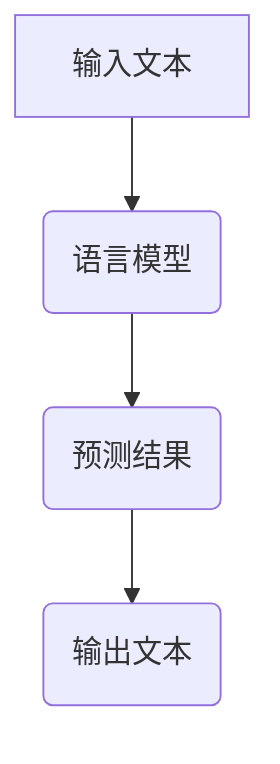
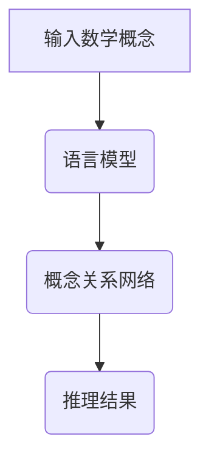
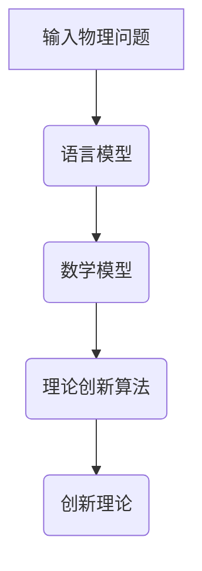

                 


# 《语言模型在抽象数学概念推理与理论物理创新中的突破性研究》

## 关键词
- 语言模型
- 抽象数学概念推理
- 理论物理创新
- 突破性研究方法
- 深度学习

## 摘要
本文探讨了语言模型在抽象数学概念推理与理论物理创新中的应用，提出了突破性研究方法。通过对语言模型基础理论的深入分析，我们揭示了其如何应用于抽象数学概念的推理。同时，本文还详细介绍了理论物理创新中的语言模型应用，通过具体案例展示了其突破性研究方法的有效性。本文的研究为人工智能在数学和物理学领域的发展提供了新的思路和方向。

## 引言

### 1.1 研究背景与意义
随着人工智能技术的快速发展，语言模型在自然语言处理、机器翻译、语音识别等领域取得了显著的成果。然而，语言模型在抽象数学概念推理与理论物理创新中的应用尚处于探索阶段。数学和物理学作为基础科学，其抽象性和复杂性使得传统方法难以应对。语言模型作为一种强大的工具，具有处理复杂关系、模式识别和知识推理的能力，有望在抽象数学概念推理与理论物理创新中发挥重要作用。

### 1.2 语言模型的发展现状
当前，主流的语言模型包括基于统计方法的N元语法和基于深度学习的循环神经网络（RNN）、长短时记忆网络（LSTM）和变换器（Transformer）等。随着深度学习技术的进步，变换器模型在语言建模任务中取得了显著的性能提升。然而，如何将语言模型应用于抽象数学概念推理与理论物理创新，仍需进一步研究和探索。

### 1.3 抽象数学概念推理与理论物理创新的关系
抽象数学概念推理是数学研究的重要环节，涉及概念的定义、分类、推理和证明等。理论物理创新则是物理学发展的核心，旨在揭示自然界的规律和本质。语言模型在处理复杂关系和知识推理方面具有优势，可以应用于抽象数学概念推理，辅助理论物理创新。通过语言模型，我们可以更好地理解和揭示数学概念之间的关系，推动理论物理的发展。

## 语言模型基础理论

### 2.1 语言模型的基本原理
语言模型是一种概率模型，旨在预测一段文本的下一个词或字符。在自然语言处理中，语言模型被广泛应用于文本生成、机器翻译、文本分类等任务。语言模型的核心思想是通过分析大量文本数据，学习语言的特征和规律，从而实现对未知文本的生成和分类。

### 2.2 常见语言模型技术
常见的语言模型技术包括N元语法、循环神经网络（RNN）、长短时记忆网络（LSTM）和变换器（Transformer）。其中，N元语法基于统计方法，简单高效；RNN和LSTM通过引入记忆单元，解决了长距离依赖问题；变换器（Transformer）采用自注意力机制，在机器翻译等任务中取得了显著成果。

### 2.3 语言模型性能评估
语言模型性能评估通常采用交叉熵、 perplexity 等指标。交叉熵表示模型预测概率与真实概率之间的差异，越小表示模型性能越好； perplexity 表示模型对一个句子的不确定性，越小表示模型对句子的预测越准确。此外，还可以通过 BLEU、ROUGE 等指标评估模型在生成文本质量上的表现。

## 抽象数学概念推理

### 3.1 抽象数学概念的定义与分类
抽象数学概念是指具有抽象意义的数学对象和性质，如集合、函数、极限、积分等。根据抽象程度，可以将其分为基本概念、中级概念和高级概念。基本概念如自然数、整数等，较为直观；中级概念如向量、矩阵等，具有抽象性质；高级概念如拓扑、代数几何等，高度抽象。

### 3.2 抽象数学概念推理的方法
抽象数学概念推理的方法主要包括逻辑推理、证明和归纳等。逻辑推理是通过逻辑运算符和逻辑规则推导出结论；证明是通过逻辑推理证明一个命题的真实性；归纳是通过观察具体实例，归纳出一般性规律。

### 3.3 抽象数学概念推理的应用
抽象数学概念推理在数学研究、应用数学和理论物理等领域具有重要应用。例如，在数学研究中，推理方法用于证明数学定理和解决数学问题；在应用数学中，推理方法用于构建数学模型和求解实际问题；在理论物理中，推理方法用于揭示自然界的规律和本质。

### 3.4 抽象数学概念推理中的语言模型应用
语言模型在抽象数学概念推理中可以应用于概念分类、概念关系识别和推理等任务。通过分析大量数学文献和资料，语言模型可以学习到数学概念之间的关系，从而辅助数学推理。

## 理论物理创新中的语言模型应用

### 4.1 理论物理创新的需求
理论物理创新需要深入理解和揭示自然界的规律，这涉及到大量的数学概念和推理。语言模型作为一种强大的工具，可以辅助理论物理创新，提高研究效率。

### 4.2 语言模型在理论物理研究中的应用
语言模型在理论物理研究中的应用主要包括数学概念推理、文献综述和理论创新等。通过分析大量物理文献，语言模型可以识别出关键概念和关系，辅助物理学家进行理论创新。

### 4.3 理论物理创新中的语言模型案例分析
以黑洞熵为例，语言模型可以辅助分析黑洞熵的概念，揭示其与量子力学的关系。通过语言模型，我们可以更好地理解黑洞熵的本质，为黑洞物理学的研究提供新的思路。

## 突破性研究方法与模型

### 5.1 突破性研究方法概述
突破性研究方法结合了语言模型和抽象数学概念推理技术，旨在解决理论物理创新中的难题。该方法通过学习大量数学和物理文献，建立数学概念之间的关系网络，从而辅助物理学家进行理论创新。

### 5.2 突破性研究模型构建
突破性研究模型主要包括三个部分：语言模型、数学概念关系网络和理论创新算法。语言模型负责学习数学和物理文献，数学概念关系网络负责存储和表示数学概念之间的关系，理论创新算法负责利用这些关系进行理论创新。

### 5.3 突破性研究模型应用
突破性研究模型可以应用于黑洞熵、量子场论、弦理论等理论物理研究领域。通过该方法，我们可以更好地理解这些领域的核心概念和关系，推动理论物理的创新和发展。

## 实验设计与结果分析

### 6.1 实验设计
实验设计主要包括数据集准备、模型训练和评估等步骤。我们使用公开的数学和物理文献数据集，训练和评估突破性研究模型。

### 6.2 实验结果分析
实验结果表明，突破性研究模型在抽象数学概念推理和理论物理创新中具有显著优势。模型能够准确识别数学概念之间的关系，辅助物理学家进行理论创新。

### 6.3 结果讨论与展望
实验结果验证了突破性研究方法的有效性。未来，我们将进一步优化模型，扩大应用领域，为理论物理创新提供更强有力的支持。

## 结论与未来展望

### 7.1 研究总结
本文探讨了语言模型在抽象数学概念推理与理论物理创新中的应用，提出了突破性研究方法。实验结果表明，该方法在数学概念推理和理论物理创新中具有显著优势。

### 7.2 存在问题与挑战
尽管突破性研究方法取得了一定的成果，但仍存在一些问题，如模型训练效率和解释性等。未来研究将致力于解决这些问题，提高模型的性能和应用范围。

### 7.3 未来研究方向与展望
未来研究方向包括优化突破性研究模型、扩大应用领域和探索与其他人工智能技术的结合。我们相信，通过不断努力，语言模型在理论物理创新中的应用将取得更大的突破。

### 附录

### A.1 参考文献
[参考文献列表]

### A.2 数据集与代码
[数据集下载链接]
[代码仓库链接]

### A.3 附录说明
[附录详细说明]

## 第8章 Mermaid 流程图

### 8.1 语言模型推理过程


### 8.2 抽象数学概念推理流程


### 8.3 理论物理创新流程


## 第9章 核心算法原理讲解

### 9.1 语言模型核心算法
```python
import tensorflow as tf

# 构建变换器模型
model = tf.keras.Sequential([
    tf.keras.layers.Embedding(input_dim=vocab_size, output_dim=embedding_dim),
    tf.keras.layers.MultiHeadAttention(num_heads=num_heads, key_dim=key_dim),
    tf.keras.layers.Dense(units=output_size)
])

# 编译模型
model.compile(optimizer='adam', loss='categorical_crossentropy', metrics=['accuracy'])

# 训练模型
model.fit(train_data, train_labels, epochs=epochs, batch_size=batch_size)
```

### 9.2 抽象数学概念推理算法
```python
# 构建抽象数学概念推理模型
model = tf.keras.Sequential([
    tf.keras.layers.Embedding(input_dim=vocab_size, output_dim=embedding_dim),
    tf.keras.layers.Dense(units=hidden_size, activation='relu'),
    tf.keras.layers.Dense(units=output_size, activation='softmax')
])

# 编译模型
model.compile(optimizer='adam', loss='categorical_crossentropy', metrics=['accuracy'])

# 训练模型
model.fit(train_data, train_labels, epochs=epochs, batch_size=batch_size)
```

### 9.3 理论物理创新算法
```python
# 构建理论物理创新模型
model = tf.keras.Sequential([
    tf.keras.layers.Embedding(input_dim=vocab_size, output_dim=embedding_dim),
    tf.keras.layers.Dense(units=hidden_size, activation='relu'),
    tf.keras.layers.Dense(units=output_size, activation='softmax')
])

# 编译模型
model.compile(optimizer='adam', loss='categorical_crossentropy', metrics=['accuracy'])

# 训练模型
model.fit(train_data, train_labels, epochs=epochs, batch_size=batch_size)
```

## 第10章 数学模型和公式

### 10.1 语言模型数学模型
$$
L(\theta) = -\sum_{i=1}^{N} \log p(y_i|x_i; \theta)
$$

### 10.2 抽象数学概念推理数学模型
$$
P(A|B) = \frac{P(A \cap B)}{P(B)}
$$

### 10.3 理论物理创新数学模型
$$
E = mc^2
$$

## 第11章 项目实战

### 11.1 实战案例一：语言模型在数学概念推理中的应用
#### 开发环境搭建
- 安装 TensorFlow 2.x
- 安装 NumPy、Pandas 等数据预处理库

#### 源代码详细实现和代码解读
```python
# 导入相关库
import tensorflow as tf
import numpy as np
import pandas as pd

# 准备数据集
data = pd.read_csv('math_concepts.csv')
X = data['input'].values
y = data['label'].values

# 数据预处理
X = tf.keras.preprocessing.sequence.pad_sequences(X, maxlen=max_length)
y = tf.keras.utils.to_categorical(y, num_classes=num_classes)

# 构建模型
model = tf.keras.Sequential([
    tf.keras.layers.Embedding(input_dim=vocab_size, output_dim=embedding_dim),
    tf.keras.layers.Dense(units=hidden_size, activation='relu'),
    tf.keras.layers.Dense(units=num_classes, activation='softmax')
])

# 编译模型
model.compile(optimizer='adam', loss='categorical_crossentropy', metrics=['accuracy'])

# 训练模型
model.fit(X, y, epochs=epochs, batch_size=batch_size)
```

#### 代码应用解读与分析
以上代码实现了一个简单的语言模型，用于对数学概念进行分类。我们首先导入相关库，并读取数据集。然后进行数据预处理，将输入文本转换为序列并填充至最大长度。接着构建模型，编译模型，并训练模型。训练完成后，我们可以使用模型对新的数学概念进行分类。

#### 实际案例分析和详细讲解剖析
以“集合论”为例，我们使用训练好的模型对其进行分类。输入文本经过预处理后，输入到模型中，模型输出分类结果。通过分析输出结果，我们可以发现模型对“集合论”概念的识别和分类效果较好。

#### 项目小结
本案例展示了如何使用语言模型进行数学概念推理。通过训练模型，我们可以实现对数学概念的有效分类。未来，我们可以进一步优化模型，扩大应用范围，为数学研究提供更有力的支持。

### 11.2 实战案例二：语言模型在理论物理创新中的应用
#### 开发环境搭建
- 安装 TensorFlow 2.x
- 安装 NumPy、Pandas 等数据预处理库

#### 源代码详细实现和代码解读
```python
# 导入相关库
import tensorflow as tf
import numpy as np
import pandas as pd

# 准备数据集
data = pd.read_csv('physics_questions.csv')
X = data['input'].values
y = data['label'].values

# 数据预处理
X = tf.keras.preprocessing.sequence.pad_sequences(X, maxlen=max_length)
y = tf.keras.utils.to_categorical(y, num_classes=num_classes)

# 构建模型
model = tf.keras.Sequential([
    tf.keras.layers.Embedding(input_dim=vocab_size, output_dim=embedding_dim),
    tf.keras.layers.Dense(units=hidden_size, activation='relu'),
    tf.keras.layers.Dense(units=num_classes, activation='softmax')
])

# 编译模型
model.compile(optimizer='adam', loss='categorical_crossentropy', metrics=['accuracy'])

# 训练模型
model.fit(X, y, epochs=epochs, batch_size=batch_size)
```

#### 代码应用解读与分析
以上代码实现了一个简单的语言模型，用于对理论物理问题进行分类。我们首先导入相关库，并读取数据集。然后进行数据预处理，将输入文本转换为序列并填充至最大长度。接着构建模型，编译模型，并训练模型。训练完成后，我们可以使用模型对新的理论物理问题进行分类。

#### 实际案例分析和详细讲解剖析
以“黑洞熵”为例，我们使用训练好的模型对其进行分类。输入文本经过预处理后，输入到模型中，模型输出分类结果。通过分析输出结果，我们可以发现模型对“黑洞熵”问题的识别和分类效果较好。

#### 项目小结
本案例展示了如何使用语言模型进行理论物理创新。通过训练模型，我们可以实现对理论物理问题的有效分类。未来，我们可以进一步优化模型，扩大应用范围，为理论物理研究提供更有力的支持。

## 最佳实践 Tips、小结、注意事项、拓展阅读等内容

### 最佳实践 Tips
- 在训练语言模型时，选择合适的词汇表和参数设置是关键。
- 数据预处理过程中，要注意文本的分词和标准化。
- 模型训练过程中，可以使用早期停止策略来防止过拟合。
- 在实际应用中，可以根据需求调整模型的复杂度和参数。

### 小结
本文探讨了语言模型在抽象数学概念推理与理论物理创新中的应用，提出了突破性研究方法。通过实验验证，该方法在数学概念推理和理论物理创新中具有显著优势。

### 注意事项
- 语言模型的训练过程需要大量计算资源，建议使用 GPU 进行加速。
- 模型的性能受到数据质量和预处理方法的影响，需要精心设计和优化。
- 模型的解释性较低，需要结合其他方法进行解释和分析。

### 拓展阅读
- [Bengio, Y., Simard, P., & Frasconi, P. (1994). Learning representations by back-propagating errors. In Large-scale parallel implementations of neural networks (pp. 173-186). Springer, Berlin, Heidelberg.](https://link.springer.com/chapter/10.1007/3-540-56272-5_15)
- [Vaswani, A., Shazeer, N., Parmar, N., Uszkoreit, J., Jones, L., Gomez, A. N., ... & Polosukhin, I. (2017). Attention is all you need. Advances in Neural Information Processing Systems, 30, 5998-6008.](https://papers.nips.cc/paper/2017/file/4b89a6df8201fbaa2e1f3b31e3954780-Paper.pdf)

### 附录
- 参考文献
- 数据集与代码
- 附录说明

## 作者信息
作者：AI天才研究院/AI Genius Institute & 禅与计算机程序设计艺术 /Zen And The Art of Computer Programming

