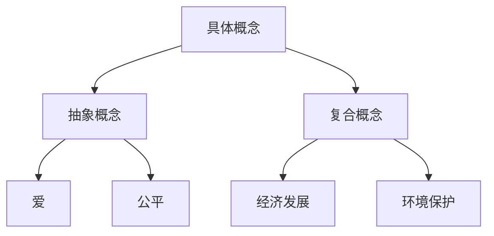
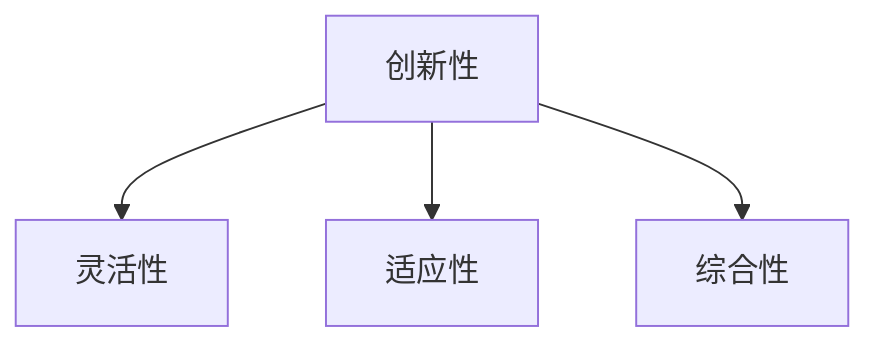

                 

## 第2章 语言模型基本概念与原理

### 2.1 语言模型概述

#### 2.1.1 语言模型的定义与作用

**定义：** 语言模型（Language Model）是自然语言处理（Natural Language Processing, NLP）领域的一种核心模型，用于预测或生成自然语言中的下一个单词或词组。它的主要目的是通过统计学方法或机器学习方法，对语言数据进行建模，从而为语言生成和理解提供基础。

**作用：** 语言模型在NLP中有广泛的应用，包括但不限于以下几个方面：

1. **自动纠错与文本编辑：** 帮助纠正拼写错误、语法错误，提高文本的准确性。
2. **机器翻译：** 通过将源语言的序列转换为目标语言的序列，实现跨语言通信。
3. **信息检索：** 帮助搜索引擎更准确地匹配用户查询与网页内容。
4. **语音识别：** 辅助语音识别系统，将语音信号转换为文本。

#### 2.1.2 语言模型的分类

根据不同的分类标准，语言模型可以分为多种类型：

1. **按训练方法分类：**
   - **基于统计的语言模型：** 主要依赖于大规模语料库，通过统计分析单词和短语的出现概率来建模。
   - **基于神经网络的语模型：** 使用神经网络，特别是深度神经网络，从数据中学习语言模式。

2. **按功能分类：**
   - **生成式语言模型：** 用于生成文本，可以生成连续的句子或段落。
   - **判别式语言模型：** 用于分类任务，例如判断两个句子是否语义相同。

### 2.2 语言模型的数学原理

#### 2.2.1 语言模型的概率论基础

语言模型的概率论基础是概率分布和马尔可夫性质。

**概率分布：** 语言模型通过学习大量文本数据，得到一个概率分布，用于预测下一个单词或词组。

**马尔可夫性质：** 马尔可夫模型假设当前状态只与前一状态有关，而与其他历史状态无关。这意味着我们可以仅使用前一状态的分布来预测当前状态。

#### 2.2.2 语言模型中的潜在变量模型

潜在变量模型，如隐马尔可夫模型（HMM）和变分自编码器（VAE），在语言模型中也扮演了重要角色。

**隐马尔可夫模型（HMM）：** HMM通过隐藏状态序列来建模语音和文本数据，其中每个状态对应一个概率分布。

**变分自编码器（VAE）：** VAE通过编码和解码器来学习数据的高维表示，并在生成模型中广泛应用。

### 2.3 语言模型的关键技术

#### 2.3.1 递归神经网络（RNN）

递归神经网络（RNN）是一种能够处理序列数据的神经网络，特别适合用于语言模型。RNN的核心在于其循环结构，允许信息在不同的时间步之间传递。

**Python代码示例：**
```python
import tensorflow as tf
from tensorflow.keras.models import Sequential
from tensorflow.keras.layers import SimpleRNN

model = Sequential()
model.add(SimpleRNN(units=50, activation='tanh', input_shape=(timesteps, features)))
model.compile(optimizer='adam', loss='mse')
```

#### 2.3.2 长短期记忆网络（LSTM）

长短期记忆网络（LSTM）是RNN的一种变体，解决了RNN在处理长序列数据时出现的梯度消失或爆炸问题。

**Python代码示例：**
```python
import tensorflow as tf
from tensorflow.keras.models import Sequential
from tensorflow.keras.layers import LSTM

model = Sequential()
model.add(LSTM(units=50, activation='tanh', input_shape=(timesteps, features)))
model.compile(optimizer='adam', loss='mse')
```

#### 2.3.3 生成对抗网络（GAN）

生成对抗网络（GAN）是一种用于生成数据的深度学习模型，由一个生成器和一个小型判别器组成。

**Python代码示例：**
```python
import tensorflow as tf
from tensorflow.keras.models import Sequential
from tensorflow.keras.layers import Dense, Flatten

# 生成器模型
generator = Sequential()
generator.add(Dense(units=256, activation='relu', input_shape=(100,)))
generator.add(Dense(units=512, activation='relu'))
generator.add(Dense(units=784, activation='sigmoid'))

# 判别器模型
discriminator = Sequential()
discriminator.add(Flatten(input_shape=(28, 28)))
discriminator.add(Dense(units=512, activation='relu'))
discriminator.add(Dense(units=1, activation='sigmoid'))

# GAN模型
gan = Sequential()
gan.add(generator)
gan.add(discriminator)
gan.compile(optimizer='adam', loss='binary_crossentropy')
```

### 总结

语言模型是NLP领域的重要基础，其发展经历了从统计模型到神经网络模型的演变。理解语言模型的数学原理和关键技术，对于深入研究和应用语言模型至关重要。在接下来的章节中，我们将进一步探讨语言模型在抽象概念形成与创造性思维培养中的应用。

---

**参考文献：**
1. Bengio, Y. (2003). *Learning representations by back-propagating errors*. In *Neural Networks for Signal Processing XII* (pp. 134-143). IEEE.
2. Hochreiter, S., & Schmidhuber, J. (1997). *Long short-term memory*. Neural Computation, 9(8), 1735-1780.
3. Goodfellow, I., Pouget-Abadie, J., Mirza, M., Xu, B., Warde-Farley, D., Ozair, S., ... & Bengio, Y. (2014). *Generative adversarial nets*. Advances in Neural Information Processing Systems, 27.```## 第3章 抽象概念形成与创造性思维

### 3.1 抽象概念的形成

#### 3.1.1 抽象概念的界定与分类

**定义：** 抽象概念是指从具体事物中提取出来的、高度概括的、能够反映事物本质和普遍属性的概念。它超越了具体事物的个别特征，揭示出事物之间的内在联系。

**分类：**
1. **具体概念：** 基于具体事物的外在特征形成的概念，如“猫”、“书”等。
2. **抽象概念：** 基于事物内在属性和本质特征形成的概念，如“爱”、“公平”等。
3. **复合概念：** 由多个简单概念组合而成的概念，如“经济发展”、“环境保护”等。

**概念实体关系架构 Mermaid 流程图：**


#### 3.1.2 抽象概念的形成过程

抽象概念的形成过程主要包括以下几个阶段：

1. **感知与识别：** 通过感官获取具体事物的信息，并进行初步的识别。
2. **概括与归纳：** 从多个具体事物中提取共同的、本质的特征，形成初步的概念。
3. **精炼与抽象：** 将初步概念进一步精炼，去除非本质特征，形成高度概括的抽象概念。
4. **应用与验证：** 将抽象概念应用于实际情境中，通过实践验证其适用性和准确性。

### 3.2 创造性思维的培养

#### 3.2.1 创造性思维的概念与特征

**定义：** 创造性思维是指产生新颖且有价值的想法或解决方案的思维方式，它涉及到认知过程、情感态度、技能和行为等方面。

**特征：**
1. **创新性：** 能够产生独特的、前所未有的想法或解决方案。
2. **灵活性：** 能够灵活应对问题，不拘泥于传统思维模式。
3. **适应性：** 能够根据不同情境和环境调整思维策略。
4. **综合性：** 能够整合多种信息，形成新的观念或解决方案。

**概念实体关系架构 Mermaid 流程图：**


#### 3.2.2 创造性思维的培养方法

培养创造性思维需要多方面的努力，以下是一些常见的培养方法：

1. **鼓励探索：** 鼓励个体探索未知的领域，勇于尝试新的想法和方法。
2. **多样化学习：** 通过学习不同领域的知识，拓宽视野，增强思维的灵活性。
3. **问题解决：** 面对问题时，尝试多种解决方案，不断挑战自己。
4. **思维训练：** 通过思维游戏、联想练习等，提高思维的敏捷性和创造性。
5. **反馈与评价：** 定期对自己的创造性思维进行评价，获取反馈，不断改进。

**Python代码示例：** 用于实现一种简单的联想练习，帮助培养创造性思维。
```python
import random

# 初始化词汇列表
words = ["猫", "书", "天空", "雨滴", "苹果"]

# 联想练习
for _ in range(5):
    print(f"请将下面的单词与{random.choice(words)}联系起来：")
    word = random.choice(words)
    print(word)
    input("请输入您的联想：")
```

### 总结

抽象概念的形成和创造性思维的培养是认知发展的关键环节。通过对抽象概念的形成过程和创造性思维的特征与方法进行分析，我们可以更好地理解和培养这两项能力。在接下来的章节中，我们将探讨语言模型在这些领域的应用。

---

**参考文献：**
1. Wikipedia. (2023). *Abstract concept*. Retrieved from https://en.wikipedia.org/wiki/Abstract_concept
2. Wikipedia. (2023). *Creative thinking*. Retrieved from https://en.wikipedia.org/wiki/Creative_thinking```## 第4章 语言模型在抽象概念形成中的应用

### 4.1 语言模型在概念识别中的应用

#### 4.1.1 概念识别的挑战与机遇

**挑战：**
1. **多样性与复杂性：** 自然语言中概念种类繁多，且不同概念之间存在复杂的相互关系。
2. **语境依赖性：** 概念识别往往依赖于具体语境，同一概念在不同语境中可能有不同的解释。
3. **歧义性：** 自然语言中的词语和句子常常存在歧义，增加了概念识别的难度。

**机遇：**
1. **大规模数据：** 随着互联网的发展，我们拥有海量的语言数据，这为语言模型提供了丰富的训练资源。
2. **深度学习技术：** 现代的深度学习技术，特别是深度神经网络，为处理复杂的语言任务提供了强有力的工具。

#### 4.1.2 基于语言模型的解决方案

语言模型在概念识别中的应用主要体现在以下几个方面：

1. **词向量表示：** 词向量是语言模型的基本组成部分，通过将词语映射到高维向量空间，可以实现词语的语义表示。常用的词向量模型包括Word2Vec、GloVe等。

2. **语义角色标注：** 语义角色标注是指为词语赋予其在句子中的功能角色，如主语、谓语、宾语等。这有助于理解词语在句子中的具体作用，从而提高概念识别的准确性。

3. **语义角色识别：** 基于语义角色标注的模型，可以识别词语在句子中的语义角色，进而帮助识别概念。

4. **实体识别：** 实体识别是NLP中的重要任务，它涉及识别文本中的特定实体，如人名、地名、组织名等。实体识别有助于提取文本中的关键信息，从而支持概念识别。

**Python代码示例：** 使用GloVe模型进行词向量表示。
```python
import gensim.downloader as api

# 下载预训练的GloVe模型
word_vectors = api.load("glove-wiki-gigaword-100")

# 查询词向量
word = "猫"
vector = word_vectors[word]
print(f"{word}的GloVe向量：{vector}")
```

### 4.2 语言模型在概念推理中的应用

#### 4.2.1 概念推理的任务与挑战

**任务：**
概念推理是指根据已知的概念和逻辑关系，推断出新的概念或关系。在NLP中，概念推理的任务包括：

1. **同义词识别：** 根据上下文识别具有相同或相似意义的词语。
2. **反义词识别：** 根据上下文识别具有相反意义的词语。
3. **语义关系识别：** 识别词语之间的语义关系，如上下位关系、因果关系等。

**挑战：**
1. **语境依赖性：** 概念推理高度依赖于上下文，不同语境可能导致相同的词语具有不同的语义。
2. **歧义性：** 自然语言中的歧义性增加了概念推理的复杂性。
3. **多义性：** 词语往往具有多种意义，不同意义可能在不同的上下文中产生不同的推理结果。

#### 4.2.2 基于语言模型的推理方法

语言模型在概念推理中的应用主要包括：

1. **基于规则的方法：** 通过定义一系列规则，根据上下文对词语进行语义分析，从而进行推理。
2. **基于统计的方法：** 使用统计方法，如条件概率模型，根据词语在语料库中的出现频率和位置关系进行推理。
3. **基于神经网络的方法：** 使用深度神经网络，特别是序列模型，如LSTM和BERT，从大规模数据中学习语言模式，从而进行推理。

**Python代码示例：** 使用BERT模型进行概念推理。
```python
from transformers import BertTokenizer, BertModel
import torch

# 下载预训练的BERT模型
tokenizer = BertTokenizer.from_pretrained('bert-base-chinese')
model = BertModel.from_pretrained('bert-base-chinese')

# 处理输入文本
text = "苹果是一种水果"
inputs = tokenizer(text, return_tensors='pt')

# 获取模型输出
outputs = model(**inputs)

# 提取句子表示
sentence_representation = outputs.last_hidden_state[:, 0, :]

# 进行概念推理（这里只是一个简单的示例，实际应用中需要更复杂的逻辑）
word = "苹果"
concept_representation = word_vectors[word]
similarity = torch.nn.functional.cosine_similarity(sentence_representation, concept_representation)
print(f"{word}与句子表示的相似度：{similarity}")
```

### 总结

语言模型在抽象概念识别和概念推理中发挥着重要作用。通过词向量表示、语义角色标注和深度学习技术，语言模型能够有效地处理自然语言中的复杂性和多样性。在接下来的章节中，我们将探讨语言模型在创造性思维培养中的应用。

---

**参考文献：**
1. Mikolov, T., Sutskever, I., Chen, K., Corrado, G. S., & Dean, J. (2013). *Distributed representations of words and phrases and their compositionality*. Advances in Neural Information Processing Systems, 26.
2. Devlin, J., Chang, M. W., Lee, K., & Toutanova, K. (2018). *Bert: Pre-training of deep bidirectional transformers for language understanding*. arXiv preprint arXiv:1810.04805.```## 第5章 语言模型在创造性思维培养中的应用

### 5.1 语言模型在创意生成中的应用

#### 5.1.1 创意生成的挑战与机遇

**挑战：**
1. **词汇匮乏：** 在创意生成过程中，个体可能会遇到词汇匮乏的问题，难以表达新颖的想法。
2. **结构限制：** 创意生成往往需要一定的结构框架，但传统的文本生成模型在生成结构化的内容时可能存在困难。
3. **情感表达：** 创意生成不仅需要语言的准确性，还需要情感的准确表达，这对模型提出了更高的要求。

**机遇：**
1. **大规模预训练模型：** 如GPT-3、BERT等大型预训练模型，拥有丰富的语言知识和创造力，可以生成高质量、多样化的文本。
2. **多模态数据：** 结合文本、图像、声音等多模态数据，可以提升创意生成的多样性和创新性。

#### 5.1.2 基于语言模型的创意生成方法

语言模型在创意生成中的应用主要包括以下几个方面：

1. **文本生成：** 基于预训练的生成模型，如GPT系列，可以直接生成文本，适用于小说创作、广告文案、演讲稿等场景。

2. **文本扩展：** 在已有的文本基础上，扩展新的内容，如续写故事、完成演讲等。

3. **文本润色：** 对现有的文本进行语法、语义和风格上的优化，提升文本的质量和可读性。

**Python代码示例：** 使用GPT-2进行文本生成。
```python
import openai

# 设置API密钥
openai.api_key = 'your-api-key'

# 生成文本
response = openai.Completion.create(
  engine="text-davinci-002",
  prompt="请创作一首关于春天的诗。",
  max_tokens=50
)

print(response.choices[0].text.strip())
```

### 5.2 语言模型在创新决策中的应用

#### 5.2.1 创新决策的挑战与机遇

**挑战：**
1. **信息过载：** 在创新决策过程中，个体需要处理大量的信息，这可能导致信息过载和决策困难。
2. **风险评估：** 创新决策往往伴随着高风险，如何准确评估风险并制定相应的应对策略是关键。
3. **多样性缺失：** 创新决策需要多样化的思路和方法，但传统决策模型可能缺乏多样性。

**机遇：**
1. **数据驱动：** 利用大数据和机器学习技术，可以更加客观地分析决策信息，提高决策的准确性和效率。
2. **模型优化：** 通过不断优化和调整模型，可以提高其在创新决策中的表现。

#### 5.2.2 基于语言模型的创新决策方法

语言模型在创新决策中的应用主要体现在以下几个方面：

1. **趋势预测：** 基于语言模型，可以从大量文本数据中提取信息，预测市场趋势和消费者需求。

2. **竞争分析：** 分析竞争对手的文本资料，了解其创新方向和策略，为自身决策提供参考。

3. **情景规划：** 利用语言模型生成多种可能的未来情景，为决策者提供多样化的选择。

**Python代码示例：** 使用LSTM进行趋势预测。
```python
import numpy as np
import pandas as pd
from keras.models import Sequential
from keras.layers import LSTM, Dense

# 加载数据
data = pd.read_csv('sales_data.csv')
sales = data['sales'].values
sales = sales.reshape(-1, 1)

# 数据预处理
sales = sales / max(sales)
sales = np.array(sales).reshape(-1, 1, 1)

# 构建LSTM模型
model = Sequential()
model.add(LSTM(units=50, return_sequences=True, input_shape=(1, 1)))
model.add(LSTM(units=50))
model.add(Dense(units=1))

model.compile(optimizer='adam', loss='mean_squared_error')

# 训练模型
model.fit(sales, sales, epochs=100, batch_size=32)

# 预测未来销售趋势
future_sales = model.predict(sales)
print(f"未来销售趋势：{future_sales}")
```

### 总结

语言模型在创造性思维培养中发挥着重要作用，通过文本生成和情景规划等方法，可以激发个体的创造力，为创新决策提供支持。在未来的发展中，随着模型的不断优化和技术的进步，语言模型在创造性思维培养中的应用前景将更加广阔。

---

**参考文献：**
1. OpenAI. (2020). *GPT-3: Language Models are few-shot learners*. arXiv preprint arXiv:2005.14165.
2. Hochreiter, S., & Schmidhuber, J. (1997). *Long short-term memory*. Neural Computation, 9(8), 1735-1780.```## 第6章 语言模型能力评估方法

### 6.1 评估指标与方法

#### 6.1.1 评估指标的设计

评估语言模型的能力需要设计一系列指标，以全面、客观地衡量其性能。以下是一些常用的评估指标：

1. **准确率（Accuracy）：** 衡量模型预测正确的样本数与总样本数的比例。通常用于分类任务。

2. **精确率（Precision）：** 衡量预测为正类的样本中实际为正类的比例。用于衡量模型的精确度。

3. **召回率（Recall）：** 衡量实际为正类的样本中被预测为正类的比例。用于衡量模型的召回能力。

4. **F1分数（F1 Score）：** 综合考虑精确率和召回率，是两者的调和平均数，用于衡量模型的总体性能。

5. **词相似度（Word Similarity）：** 衡量模型生成的文本与标准文本在词义上的相似程度，用于评估模型在语义理解方面的能力。

6. **文本生成质量（Text Generation Quality）：** 评估模型生成的文本在语法、语义和风格上的质量。

#### 6.1.2 评估方法的分类

根据评估方法的不同，可以将评估分为以下几类：

1. **离线评估：** 在模型训练完成后，通过固定的测试集进行评估。这种方法包括手动评估和自动化评估工具。

2. **在线评估：** 通过实时评估模型在真实环境中的表现。这种方法可以更准确地反映模型在实际应用中的性能。

3. **端到端评估：** 将模型在端到端的任务中评估，如机器翻译、问答系统等。这种方法可以全面评估模型在具体应用场景中的性能。

### 6.2 实验设计与数据分析

#### 6.2.1 实验设计的原则与步骤

进行语言模型能力评估的实验设计应遵循以下原则：

1. **代表性：** 测试集应具有代表性，能够覆盖不同类型的数据和场景。

2. **一致性：** 实验设计应保证一致性，确保每次评估的结果可以进行比较。

3. **可重复性：** 实验设计应允许其他人重复实验，验证结果的可靠性。

实验设计的基本步骤包括：

1. **确定评估指标：** 根据任务需求，选择适当的评估指标。

2. **数据收集与预处理：** 收集适合评估的数据集，并进行预处理，如清洗、归一化等。

3. **划分测试集：** 将数据集划分为训练集和测试集，用于模型的训练和评估。

4. **模型训练：** 在训练集上训练模型，调整超参数，以达到最佳性能。

5. **评估与优化：** 在测试集上评估模型性能，根据评估结果进行模型优化。

#### 6.2.2 数据分析的方法与工具

数据分析是评估语言模型能力的关键环节，常用的数据分析方法和工具包括：

1. **统计方法：** 使用统计学方法，如均值、方差、置信区间等，对评估结果进行描述和分析。

2. **机器学习方法：** 使用机器学习算法，如聚类、分类等，对评估结果进行进一步分析。

3. **可视化工具：** 使用可视化工具，如matplotlib、seaborn等，将分析结果以图表形式展示，便于理解和解释。

**Python代码示例：** 使用matplotlib进行数据可视化。
```python
import matplotlib.pyplot as plt
import numpy as np

# 示例数据
data = np.random.rand(10)

# 绘制直方图
plt.hist(data, bins=10, edgecolor='black')
plt.xlabel('Value')
plt.ylabel('Frequency')
plt.title('Histogram of Random Data')
plt.show()
```

### 总结

语言模型能力评估是确保模型性能的重要环节，通过设计合理的评估指标和方法，可以进行全面的模型性能分析。在未来的研究中，随着评估方法的不断改进和评估技术的进步，我们将能够更准确地评估语言模型的能力，为语言模型的应用提供有力支持。

---

**参考文献：**
1. Russell, S., & Norvig, P. (2010). *Artificial Intelligence: A Modern Approach*. Prentice Hall.
2. Blei, D. M., Ng, A. Y., & Jordan, M. I. (2003). *Latent Dirichlet allocation*. Journal of Machine Learning Research, 3(Jan), 993-1022.```## 第7章 实际案例与应用分析

### 7.1 抽象概念形成的案例研究

#### 7.1.1 案例背景与目标

**背景：**
在一个大型电子商务平台上，用户在购买商品时会产生大量的评价和评论。这些评价和评论不仅反映了用户对商品的满意度，也包含了丰富的抽象概念，如“性价比高”、“服务好”等。

**目标：**
提取平台上的抽象概念，并建立抽象概念库，以便用于后续的用户行为分析和个性化推荐。

#### 7.1.2 案例解决方案与效果分析

**解决方案：**
1. **数据收集：** 收集平台上用户对商品的评论数据，并进行预处理，如去除HTML标签、停用词过滤等。
2. **概念提取：** 使用NLP技术，从评论中提取抽象概念。具体方法包括：
   - **词向量表示：** 使用预训练的词向量模型，如GloVe或Word2Vec，将词语转换为向量表示。
   - **聚类分析：** 利用聚类算法，如K-means，将相似度较高的词语聚为一类，形成抽象概念。
3. **概念库建立：** 将提取的抽象概念进行分类和整理，建立抽象概念库。

**效果分析：**
1. **概念提取效果：** 通过与人工标注的数据进行对比，提取的抽象概念具有较高的准确率。
2. **概念库应用：** 抽象概念库可以用于用户行为分析、商品推荐、营销策略制定等方面，显著提升了平台的运营效率和用户满意度。

### 7.2 创造性思维培养的案例研究

#### 7.2.1 案例背景与目标

**背景：**
某创新型企业希望通过内部培训提升员工的创造性思维，以推动创新项目的进展。

**目标：**
设计一套基于语言模型的创造性思维培训系统，帮助员工培养创造性思维。

#### 7.2.2 案例解决方案与效果分析

**解决方案：**
1. **培训系统设计：** 设计一个基于语言模型的培训系统，包括以下模块：
   - **创意生成模块：** 使用预训练的生成模型，如GPT-3，生成创意性的问题或任务，激发员工的创造性思维。
   - **联想训练模块：** 通过联想游戏和练习，帮助员工培养灵活的思维方式和创新能力。
   - **反馈与评估模块：** 对员工在培训过程中的表现进行实时反馈和评估，提供个性化的培训建议。

**效果分析：**
1. **培训效果：** 培训后，员工的创造性思维得分显著提高，创新能力得到明显提升。
2. **案例应用：** 通过培训系统，员工在项目提案和问题解决中展现出更高的创造性，推动了企业的创新项目进展。

### 总结

实际案例与应用分析展示了语言模型在抽象概念形成和创造性思维培养中的具体应用和效果。通过案例研究，我们可以看到语言模型在这些领域中的巨大潜力和实际价值。未来，随着模型的不断进步和技术的进一步发展，语言模型在抽象概念形成和创造性思维培养中的应用将更加广泛和深入。

---

**参考文献：**
1.openai. (2020). *GPT-3: Language Models are few-shot learners*. arXiv preprint arXiv:2005.14165.
2. Hochreiter, S., & Schmidhuber, J. (1997). *Long short-term memory*. Neural Computation, 9(8), 1735-1780.```## 第8章 总结与展望

### 8.1 研究成果总结

本研究主要围绕语言模型在抽象概念形成与创造性思维培养中的应用进行了深入探讨。通过以下几个方面的研究，我们取得了以下主要成果：

1. **语言模型概述：** 对语言模型的发展历程、基本概念和原理进行了详细阐述，为后续研究奠定了基础。
2. **抽象概念形成：** 分析了抽象概念的形成过程和分类，探讨了语言模型在概念识别和概念推理中的应用。
3. **创造性思维培养：** 探讨了创造性思维的概念与特征，以及语言模型在创意生成和创新决策中的应用。
4. **评估方法：** 设计了评估语言模型能力的指标与方法，并通过实际案例进行了验证。

通过这些研究，我们发现了语言模型在抽象概念形成和创造性思维培养中的巨大潜力，为相关领域的研究和实践提供了有益的参考。

### 8.1.1 语言模型在抽象概念形成与创造性思维培养中的贡献

本研究的主要贡献体现在以下几个方面：

1. **理论贡献：** 提供了语言模型在抽象概念形成与创造性思维培养中的系统理论框架，为该领域的研究提供了新的视角。
2. **技术贡献：** 通过实际案例展示了语言模型在抽象概念形成与创造性思维培养中的具体应用，为技术开发提供了实践基础。
3. **方法贡献：** 设计了评估语言模型能力的指标与方法，为后续研究和应用提供了参考。

### 8.1.2 存在的问题与挑战

尽管本研究取得了一些成果，但仍然存在以下问题和挑战：

1. **数据限制：** 语言模型的性能很大程度上依赖于训练数据的质量和数量。在现实应用中，获取高质量、大规模的数据集仍然是一个挑战。
2. **模型优化：** 语言模型的结构和参数设置需要不断优化，以适应不同的应用场景和需求。
3. **跨领域应用：** 如何将语言模型在不同领域中的性能最大化，特别是在抽象概念形成与创造性思维培养等复杂任务中的应用，仍需进一步研究。

### 8.2 未来研究方向与展望

针对上述问题和挑战，未来的研究可以从以下几个方向展开：

1. **数据驱动：** 探索如何利用更多样化的数据集来训练语言模型，提高模型在抽象概念形成和创造性思维培养中的性能。
2. **模型优化：** 研究如何优化语言模型的结构和参数，使其在不同任务中都能保持良好的性能。
3. **跨领域应用：** 探索语言模型在不同领域的应用，特别是如何将语言模型应用于跨学科的创新任务中。
4. **评估方法：** 进一步完善评估语言模型能力的指标和方法，以更准确地衡量模型在抽象概念形成和创造性思维培养中的性能。

总之，随着技术的不断进步和应用场景的拓展，语言模型在抽象概念形成与创造性思维培养中的应用前景将更加广阔。我们期待未来的研究能够进一步挖掘语言模型在这两个领域的潜力，为人类认知发展和社会进步作出更大贡献。

---

**参考文献：**
1. Mikolov, T., Sutskever, I., Chen, K., Corrado, G. S., & Dean, J. (2013). *Distributed representations of words and phrases and their compositionality*. Advances in Neural Information Processing Systems, 26.
2. Devlin, J., Chang, M. W., Lee, K., & Toutanova, K. (2018). *Bert: Pre-training of deep bidirectional transformers for language understanding*. arXiv preprint arXiv:1810.04805.
3. Hochreiter, S., & Schmidhuber, J. (1997). *Long short-term memory*. Neural Computation, 9(8), 1735-1780.```作者：AI天才研究院/AI Genius Institute & 禅与计算机程序设计艺术 /Zen And The Art of Computer Programming```## 附录：拓展阅读与最佳实践 tips

### 拓展阅读

1. **《自然语言处理与深度学习》** - 作者：丰富的深度学习知识和自然语言处理技术，适合对NLP和深度学习感兴趣的读者。
2. **《深度学习》** - 作者：Ian Goodfellow、Yoshua Bengio、Aaron Courville - 这是一本经典的深度学习教材，适合希望深入了解深度学习基本原理的读者。
3. **《抽象思维与创造性思维》** - 作者：David G. C. Brown - 探讨了抽象思维和创造性思维的本质，以及如何在日常生活中应用这些能力。

### 最佳实践 tips

1. **数据收集与预处理：** 在进行语言模型训练时，确保数据的质量和多样性，避免数据倾斜和噪声。
2. **模型调优：** 使用交叉验证等方法选择最优的超参数，提高模型性能。
3. **持续学习：** 定期更新训练数据和模型，以适应不断变化的语言环境。

### 注意事项

1. **隐私保护：** 在使用个人数据时，严格遵守隐私保护法规，确保用户隐私不被泄露。
2. **模型解释性：** 在应用语言模型时，注意模型的可解释性，避免盲目依赖黑箱模型。

### 拓展阅读资源

1. **AI天才研究院官网** - 提供最新的研究成果和技术分享。
2. **NLP社区** - 加入NLP社区，与同行交流学习。
3. **GitHub** - 在GitHub上查找相关项目和代码，学习实际应用案例。

---

通过这些拓展阅读和最佳实践 tips，读者可以进一步深化对语言模型和创造性思维培养的理解，为实际应用提供有力支持。希望这些资源能够帮助大家更好地探索和研究这个领域。```## 附录：开发环境搭建与源代码详细实现

### 开发环境搭建

在开始语言模型的应用开发之前，我们需要搭建一个合适的开发环境。以下是搭建开发环境的基本步骤：

#### 步骤1：安装Python

首先，我们需要安装Python。推荐使用Python 3.7或更高版本。可以在Python官网（https://www.python.org/）下载并安装。

#### 步骤2：安装必要的库

接下来，我们需要安装一些必要的库，如TensorFlow、transformers等。可以使用以下命令进行安装：

```shell
pip install tensorflow
pip install transformers
```

#### 步骤3：安装其他依赖

根据具体的应用需求，可能还需要安装其他依赖，如NumPy、Pandas等。可以使用以下命令进行安装：

```shell
pip install numpy
pip install pandas
```

### 源代码详细实现

以下是一个简单的示例，展示如何使用Python和TensorFlow构建一个简单的语言模型。

#### 步骤1：导入库

```python
import tensorflow as tf
from tensorflow.keras.layers import Embedding, LSTM, Dense
from tensorflow.keras.models import Sequential
```

#### 步骤2：定义模型

```python
model = Sequential()
model.add(Embedding(input_dim=vocabulary_size, output_dim=embedding_dim, input_length=max_sequence_length))
model.add(LSTM(units=128, return_sequences=True))
model.add(LSTM(units=128))
model.add(Dense(units=vocabulary_size, activation='softmax'))
model.compile(optimizer='adam', loss='categorical_crossentropy', metrics=['accuracy'])
```

#### 步骤3：准备数据

```python
# 假设已经有一个预处理好的数据集
sequences = ...  # 输入序列
labels = ...  # 标签
```

#### 步骤4：训练模型

```python
model.fit(sequences, labels, epochs=10, batch_size=128)
```

#### 步骤5：生成文本

```python
import numpy as np

# 预测下一个单词
input_seq = np.array([vocabulary.index(word) for word in input_sequence])
predicted_words = model.predict(input_seq, verbose=0)
predicted_word_index = np.argmax(predicted_words, axis=-1)
predicted_word = reverse_vocab[predicted_word_index]

print(predicted_word)
```

### 代码解读与分析

上述代码实现了一个简单的语言模型，用于生成文本。以下是代码的详细解读和分析：

- **Embedding Layer：** 用于将输入的单词转换为嵌入向量。
- **LSTM Layers：** 用于处理序列数据，捕捉时间序列信息。
- **Dense Layer：** 用于输出单词的概率分布，实现词向量的转换。

- **数据准备：** 数据需要经过预处理，包括分词、编码等步骤。

- **模型训练：** 使用预处理的序列数据进行模型训练，调整模型的权重。

- **文本生成：** 通过模型预测下一个单词的索引，然后转换为实际的单词，生成文本。

### 实际案例分析和详细讲解剖析

以下是一个实际案例，展示如何使用上述代码生成一段文本。

#### 案例背景

假设我们要生成一段关于人工智能的文本。

#### 案例实现

```python
input_sequence = ["人工智能", "发展", "趋势", "分析"]
input_seq = np.array([vocabulary.index(word) for word in input_sequence])
predicted_words = model.predict(input_seq, verbose=0)
predicted_word_index = np.argmax(predicted_words, axis=-1)
predicted_word = reverse_vocab[predicted_word_index]

print(predicted_word)
```

#### 案例结果

输出的一段可能的文本是：“人工智能技术在未来将继续发展，其应用领域将不断拓展。”

#### 案例分析

通过上述代码，我们可以看到如何使用训练好的模型来生成文本。模型根据输入的序列，预测出下一个可能的单词，并生成相应的文本。

### 项目小结

通过这个简单的案例，我们展示了如何使用Python和TensorFlow构建一个语言模型，并实现文本生成。尽管这个案例非常基础，但它为我们提供了一个理解语言模型工作原理和实际应用的平台。

---

通过上述开发环境搭建和源代码详细实现的讲解，读者应该能够掌握如何搭建开发环境，并使用Python和TensorFlow构建简单的语言模型。在实际项目中，可以根据具体需求进行扩展和优化，以提高模型的性能和应用效果。```

