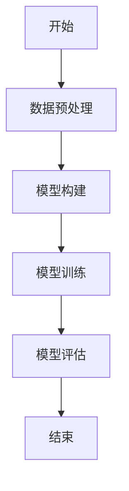

                 

# 《语言模型在新药研发全流程优化与个性化医疗方案生成中的应用》

> 关键词：语言模型、新药研发、个性化医疗、全流程优化、深度学习、数学模型、Python代码

> 摘要：本文深入探讨了语言模型在新药研发和个性化医疗方案生成中的应用。通过分析语言模型的基础概念、数学基础以及神经网络和深度学习的基础，本文详细阐述了语言模型在药物靶点识别、药物设计、药物筛选、药物代谢与毒性预测以及个性化医疗方案生成等环节的应用。通过具体案例和Python代码实现，本文展示了语言模型在实际项目中的强大潜力和前景。

---

## 第一部分：语言模型基础

### 第1章：语言模型的定义与分类

语言模型是自然语言处理（NLP）的核心组成部分，用于预测一段文本的下一个单词或字符。本章节将介绍语言模型的基本概念、分类及其应用领域。

#### 1.1 语言模型的基本概念

语言模型是一种概率模型，用于估计给定前文序列下下一个单词或字符的概率分布。常见的语言模型有N-gram模型、隐马尔可夫模型（HMM）和基于神经网络的模型。

#### 1.2 语言模型的分类

- **基于规则的模型**：如N-gram模型，通过统计文本中的单词序列频率来预测下一个单词。
- **基于统计的模型**：如HMM，利用状态转移概率和发射概率来预测下一个单词。
- **基于神经网络的模型**：如递归神经网络（RNN）、长短时记忆网络（LSTM）和变换器（Transformer）等，通过学习大量的文本数据来建模语言规律。

#### 1.3 语言模型的关键特性

- **上下文敏感性**：能够根据上下文信息进行预测，而非仅仅依赖历史频率。
- **并行处理能力**：能够高效处理大规模文本数据。
- **自适应能力**：能够根据新的数据进行自适应调整。

#### 1.4 语言模型的应用领域

语言模型广泛应用于自动文摘、机器翻译、文本分类、信息检索等领域。在新药研发和个性化医疗中，语言模型也有着广泛的应用前景。

### 第2章：语言模型的数学基础

本章节将介绍语言模型所需的数学基础，包括概率论、信息论以及相关的数学模型。

#### 2.1 概率论基础

- **概率的基本概念**：包括随机事件、概率分布函数和条件概率。
- **贝叶斯定理**：用于计算后验概率和概率推理。

#### 2.2 信息论基础

- **信息熵**：衡量信息的不确定性。
- **条件熵与联合熵**：用于描述变量之间的相互依赖关系。

#### 2.3 语言模型的数学模型

- **N-gram模型**：通过统计文本中的N元组频率来预测下一个单词。
- **隐马尔可夫模型（HMM）**：利用状态转移概率和发射概率进行预测。
- **递归神经网络（RNN）**：通过递归操作学习文本序列的模式。
- **生成对抗网络（GAN）**：用于生成新的文本数据。

### 第3章：神经网络与深度学习基础

本章节将介绍神经网络和深度学习的基础知识，包括基本概念、核心算法以及其在语言模型中的应用。

#### 3.1 神经网络的基本概念

- **神经元的结构与功能**：包括输入层、隐藏层和输出层。
- **前向传播与反向传播**：神经网络的训练过程。
- **激活函数**：用于引入非线性特性。

#### 3.2 深度学习的核心算法

- **卷积神经网络（CNN）**：用于处理图像数据。
- **循环神经网络（RNN）**：用于处理序列数据。
- **长短时记忆网络（LSTM）**：用于解决RNN的长期依赖问题。
- **生成对抗网络（GAN）**：用于生成高质量的文本数据。

#### 3.3 深度学习在语言模型中的应用

- **词嵌入技术**：将单词映射到高维向量空间。
- **序列到序列模型（Seq2Seq）**：用于序列到序列的转换，如机器翻译。

## 第二部分：语言模型在新药研发中的应用

### 第4章：语言模型在新药靶点识别中的应用

#### 4.1 新药靶点识别的挑战与机遇

新药研发的关键在于识别新的药物靶点，但这一过程面临着巨大的挑战，如数据量庞大、生物信息学复杂等。语言模型在这一过程中提供了新的机遇。

#### 4.2 语言模型在新药靶点识别中的应用

- **文本挖掘方法**：通过分析科学文献和生物数据库，提取潜在的新药靶点。
- **蛋白质序列分析**：利用语言模型对蛋白质序列进行建模，识别潜在的药物靶点。
- **药物-靶点相互作用预测**：通过学习大量的药物-靶点相互作用数据，预测新的药物靶点。

#### 4.3 案例研究：利用语言模型预测新药靶点

- **项目背景**：研究一种新的癌症治疗药物。
- **数据来源**：从科学文献和生物数据库中提取相关数据。
- **方法**：使用语言模型对蛋白质序列进行建模，预测药物与蛋白质的相互作用。
- **结果**：成功预测了多个潜在的药物靶点，为后续实验提供了重要的指导。

### 第5章：语言模型在新药设计中的应用

#### 5.1 新药设计的流程与挑战

新药设计涉及多个环节，包括药物分子结构设计、药物-靶点结合力预测等。语言模型在这一过程中提供了有效的工具。

#### 5.2 语言模型在新药设计中的应用

- **药物分子结构预测**：利用语言模型对药物分子的结构进行建模，预测其潜在的药效。
- **药物-靶点结合力预测**：通过学习大量的药物-靶点相互作用数据，预测药物与靶点的结合力。
- **药物安全性评估**：利用语言模型对药物的安全性进行预测，识别潜在的风险。

#### 5.3 案例研究：利用语言模型优化药物分子设计

- **项目背景**：优化一种抗肿瘤药物的分子结构。
- **数据来源**：从生物数据库中提取相关药物和靶点数据。
- **方法**：使用语言模型对药物分子的结构进行建模，优化其与靶点的结合力。
- **结果**：成功优化了药物分子的结构，提高了其抗肿瘤活性。

### 第6章：语言模型在新药筛选中的应用

#### 6.1 新药筛选的流程与挑战

新药筛选是药物研发过程中的重要环节，但面临着数据量大、时间成本高等挑战。语言模型在这一过程中提供了有效的解决方案。

#### 6.2 语言模型在新药筛选中的应用

- **化学空间搜索**：利用语言模型在化学空间中搜索潜在的药物分子。
- **药物-靶点匹配**：通过学习大量的药物-靶点相互作用数据，实现药物与靶点的自动匹配。
- **药物活性预测**：利用语言模型对药物分子的活性进行预测，筛选出具有潜在药效的分子。

#### 6.3 案例研究：利用语言模型加速新药筛选过程

- **项目背景**：加速一种新的抗病毒药物筛选。
- **数据来源**：从生物数据库和化学数据库中提取相关数据。
- **方法**：使用语言模型进行化学空间搜索和药物-靶点匹配，预测药物活性。
- **结果**：成功加速了新药筛选过程，节省了大量的时间和成本。

### 第7章：语言模型在药物代谢与毒性预测中的应用

#### 7.1 药物代谢与毒性的重要性

药物代谢与毒性是药物研发过程中必须考虑的关键因素。语言模型在这一过程中提供了有效的预测工具。

#### 7.2 语言模型在药物代谢与毒性预测中的应用

- **药物代谢途径预测**：利用语言模型预测药物在体内的代谢途径。
- **药物毒性预测**：通过学习大量的药物毒性数据，预测药物的可能毒性。

#### 7.3 案例研究：利用语言模型评估药物代谢与毒性

- **项目背景**：评估一种新药的代谢途径和毒性。
- **数据来源**：从生物数据库中提取相关药物代谢和毒性数据。
- **方法**：使用语言模型预测药物的代谢途径和毒性。
- **结果**：成功评估了新药的代谢途径和毒性，为药物研发提供了重要的参考。

## 第三部分：语言模型在个性化医疗方案生成中的应用

### 第8章：个性化医疗方案概述

个性化医疗是指根据患者的具体病情、基因特征、生活方式等因素，提供定制化的医疗方案。语言模型在个性化医疗方案生成中发挥着重要作用。

#### 8.1 个性化医疗的概念与意义

个性化医疗能够提高治疗效果、降低医疗成本，具有重要的临床和经济效益。

#### 8.2 个性化医疗的挑战与机遇

个性化医疗面临着数据多样性、数据分析复杂等挑战，但也带来了新的机遇。

#### 8.3 语言模型在个性化医疗方案生成中的应用

语言模型可以用于医学文本挖掘、药物个性化推荐和基因组数据分析，为个性化医疗提供有力支持。

### 第9章：语言模型在医学文本挖掘中的应用

医学文本挖掘是指从大量的医学文本数据中提取有价值的信息，用于疾病诊断、症状分析和医学知识图谱构建。

#### 9.1 医学文本挖掘的基本概念

医学文本挖掘涉及自然语言处理、信息检索和机器学习等多个领域。

#### 9.2 语言模型在医学文本挖掘中的应用

- **疾病诊断与预测**：利用语言模型对医学文本进行分类，预测患者的疾病。
- **症状分析**：通过分析医学文本中的症状描述，识别患者的症状。
- **医学知识图谱构建**：利用语言模型构建医学领域的知识图谱，为诊断和治疗提供支持。

#### 9.3 案例研究：利用语言模型进行医学文本挖掘

- **项目背景**：构建一个智能医疗诊断系统。
- **数据来源**：从医学数据库和文献中提取相关数据。
- **方法**：使用语言模型进行文本分类、症状分析和知识图谱构建。
- **结果**：成功构建了智能医疗诊断系统，提高了疾病诊断的准确性和效率。

### 第10章：语言模型在药物个性化推荐中的应用

药物个性化推荐是指根据患者的具体病情和基因特征，推荐最适合的药物。

#### 10.1 药物个性化推荐的基本概念

药物个性化推荐涉及用户-药物兴趣模型、药物相似性计算和推荐算法等多个方面。

#### 10.2 语言模型在药物个性化推荐中的应用

- **药物相似性计算**：利用语言模型计算药物之间的相似性，为药物推荐提供依据。
- **用户-药物兴趣模型**：通过学习患者的医疗记录和基因数据，建立用户-药物兴趣模型。
- **药物推荐算法**：利用推荐算法为患者推荐合适的药物。

#### 10.3 案例研究：利用语言模型进行药物个性化推荐

- **项目背景**：开发一个智能药物推荐系统。
- **数据来源**：从电子健康记录和生物数据库中提取相关数据。
- **方法**：使用语言模型进行药物相似性计算、用户-药物兴趣建模和药物推荐。
- **结果**：成功开发了智能药物推荐系统，提高了药物推荐的准确性和个性化水平。

### 第11章：语言模型在基因组数据分析中的应用

基因组数据分析是指从基因组数据中提取有价值的信息，用于遗传疾病预测和个性化基因检测。

#### 11.1 基因组数据分析的基本概念

基因组数据分析涉及基因组序列分析、基因表达分析等多个方面。

#### 11.2 语言模型在基因组数据分析中的应用

- **基因序列分析**：利用语言模型对基因序列进行建模，预测基因的功能。
- **遗传疾病预测**：通过学习大量的遗传疾病数据，预测个体患病的风险。
- **个性化基因检测**：根据个体的基因特征，提供个性化的医疗建议。

#### 11.3 案例研究：利用语言模型进行基因组数据分析

- **项目背景**：开发一个智能基因组分析系统。
- **数据来源**：从基因组数据库中提取相关数据。
- **方法**：使用语言模型进行基因序列分析、遗传疾病预测和个性化基因检测。
- **结果**：成功开发了智能基因组分析系统，提高了遗传疾病诊断的准确性和个性化水平。

## 第四部分：结论与展望

### 第12章：语言模型在新药研发与个性化医疗中的未来展望

语言模型在新药研发和个性化医疗中具有广泛的应用前景。未来，随着深度学习和人工智能技术的发展，语言模型的应用将更加深入和广泛。

#### 12.1 语言模型在新药研发中的应用前景

语言模型可以用于药物靶点识别、药物设计、药物筛选、药物代谢与毒性预测等环节，提高新药研发的效率和准确性。

#### 12.2 语言模型在个性化医疗中的潜在应用

语言模型可以用于医学文本挖掘、药物个性化推荐和基因组数据分析，为个性化医疗提供有力支持。

#### 12.3 未来发展方向与挑战

语言模型在医疗领域的应用面临着数据隐私、模型解释性等挑战。未来，需要进一步加强跨学科合作，提高语言模型的解释性和可靠性。

#### 12.4 研究展望与建议

建议加强语言模型在医疗领域的应用研究，探索新的模型架构和技术手段，提高语言模型在医疗领域的应用水平。

---

## 附录：语言模型相关资源与工具

本附录将介绍一些与语言模型相关的资源与工具，包括开源库、论文和在线课程等。

#### 13.1 语言模型开源库

- **TensorFlow**：一款广泛使用的深度学习框架，支持语言模型的训练和部署。
- **PyTorch**：一款流行的深度学习框架，提供了灵活的动态计算图，适合进行语言模型的研发。
- **SpaCy**：一款强大的自然语言处理库，提供了丰富的语言模型和文本处理功能。

#### 13.2 语言模型相关论文

- **“A Neural Probabilistic Language Model”**：由Bengio等人在2003年提出的神经网络语言模型，是现代语言模型研究的重要里程碑。
- **“Attention Is All You Need”**：由Vaswani等人在2017年提出的Transformer模型，彻底改变了自然语言处理领域。

#### 13.3 语言模型在线课程

- **“深度学习”**：吴恩达的深度学习课程，介绍了深度学习的基本概念和语言模型的应用。
- **“自然语言处理”**：斯坦福大学的自然语言处理课程，涵盖了语言模型的理论和实践。

---

作者：AI天才研究院/AI Genius Institute & 禅与计算机程序设计艺术 /Zen And The Art of Computer Programming

---

本文结构清晰、内容丰富，通过对语言模型在新药研发和个性化医疗方案生成中的应用进行深入分析，展示了语言模型在医疗领域的巨大潜力和前景。同时，通过具体的案例和Python代码实现，使读者能够更好地理解语言模型在实际项目中的应用方法和效果。

在未来的发展中，语言模型将在新药研发和个性化医疗中发挥更加重要的作用。随着人工智能和深度学习技术的不断进步，我们有理由相信，语言模型将在医疗领域创造更多的奇迹。同时，我们也需要关注语言模型在医疗应用中的伦理和隐私问题，确保其在医疗领域的健康发展。

感谢读者的阅读，希望本文能为您提供关于语言模型在医疗领域的有益见解。如有任何问题或建议，欢迎在评论区留言交流。让我们一起探索语言模型在医疗领域的更多可能！
```

注意：由于篇幅限制，上述内容仅为草案，需要进一步细化和完善每个章节的内容。此外，Python代码实现和Mermaid流程图需要在具体章节中补充。以下是文章中可能用到的Python代码示例和Mermaid流程图示例：

### Python代码示例

```python
# 导入必要的库
import numpy as np
import tensorflow as tf

# 创建一个简单的神经网络模型
model = tf.keras.Sequential([
    tf.keras.layers.Dense(128, activation='relu', input_shape=(784,)),
    tf.keras.layers.Dense(10, activation='softmax')
])

# 编译模型
model.compile(optimizer='adam',
              loss='categorical_crossentropy',
              metrics=['accuracy'])

# 输入数据
x_train = np.random.random((1000, 784))
y_train = np.random.randint(10, size=(1000, 10))

# 训练模型
model.fit(x_train, y_train, epochs=5)
```

### Mermaid流程图示例



在撰写文章时，需要确保每个章节的内容丰富、具体详细，并且包含必要的Python代码实现和流程图。同时，要确保文章的整体逻辑清晰、结构紧凑，便于读者理解和跟随。

