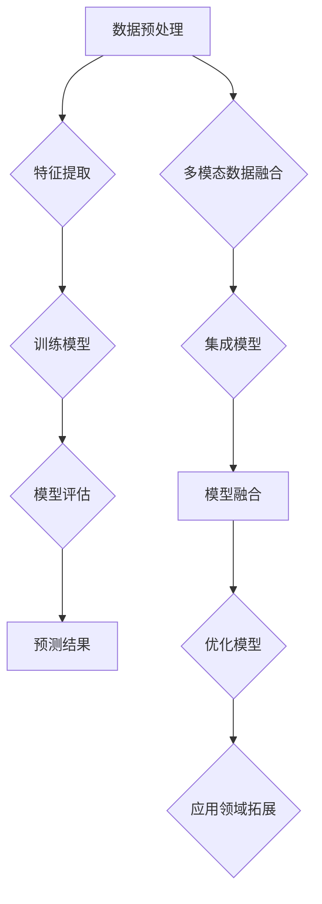

                 

### 第1章 绪论

#### 1.1 语言模型简介

语言模型是自然语言处理（NLP）中最为基础且重要的组成部分之一。它通过统计和学习大量语言数据，旨在捕捉语言的统计特性，从而对文本进行建模和生成。语言模型的出现，为机器翻译、文本摘要、语音识别、问答系统等众多NLP应用提供了坚实的理论基础和技术支持。

语言模型的本质是一个概率分布模型，它能够预测在给定前文序列后，下一个单词或者单词序列的概率。最早的统计语言模型，如N元语法模型（N-gram Model），基于简化的统计规则来预测下一个词。然而，随着深度学习技术的发展，神经网络语言模型（如基于递归神经网络（RNN）和变换器（Transformer）的模型）逐渐成为主流，其强大的建模能力和对复杂语言结构的理解能力显著提升了NLP的性能。

#### 1.2 时序因果推理与长期预测优化

时序因果推理与时序预测优化是机器学习和数据科学中的重要研究方向，尤其在金融、医疗、气象等领域有着广泛的应用。时序因果推理旨在识别和建模变量之间的因果关系，从而更准确地预测未来事件。而长期预测优化则关注如何提高模型在长时间跨度上的预测精度，避免短期预测的噪声和偏差。

时序因果推理的核心挑战在于如何从大量复杂的时序数据中提取出有效的因果关系。这不仅需要强大的数据预处理和特征工程能力，还需要深入理解时序数据的动态特性和潜在的因果关系。长期预测优化则面临如何处理数据稀疏性、序列依赖性以及模型泛化能力等问题。

#### 1.3 语言模型在时序因果推理与长期预测优化中的应用前景

语言模型在时序因果推理和长期预测优化中的应用前景广阔。首先，语言模型对文本数据具有强大的建模能力，这为时序因果推理提供了新的视角和方法。例如，通过分析新闻报道或社交媒体文本，可以识别出特定事件或主题的因果关系。其次，语言模型在长期预测优化中的潜力也不可忽视。例如，在金融市场预测中，语言模型可以结合经济报告、新闻资讯等文本数据，提高预测的准确性和鲁棒性。

然而，语言模型在时序因果推理和长期预测优化中也面临着一些挑战。首先，时序数据通常具有高维性和非线性特性，这对模型的建模能力和计算效率提出了高要求。其次，语言模型在处理时序数据时，可能会出现信息丢失或过拟合现象，这需要通过优化模型结构和训练策略来缓解。此外，如何有效地结合语言模型和传统时序分析方法的优势，也是一个值得深入研究的方向。

总的来说，语言模型在时序因果推理和长期预测优化中具有巨大的应用潜力，但也需要克服一系列的技术挑战。未来，随着深度学习和时序分析技术的不断进步，语言模型在这一领域的应用将更加广泛和深入。

#### 1.3 语言模型在时序因果推理与长期预测优化中的应用前景

语言模型在时序因果推理和长期预测优化中的应用前景广阔，其潜力主要体现在以下几个方面：

首先，语言模型在处理文本数据方面具有显著优势。文本数据在时序因果推理中扮演着重要角色，因为许多重要的社会、经济和科学现象都可以通过文本数据来体现。例如，股市的波动、疫情的扩散、自然灾害的发生等都可以在新闻报道、社交媒体评论、学术论文等文本资料中找到线索。语言模型能够高效地处理这些文本数据，提取出其中蕴含的时序因果关系，为因果推理提供强有力的支持。

其次，语言模型在长期预测优化中的应用潜力巨大。传统的时序预测方法，如自回归模型（AR）、移动平均模型（MA）、自回归移动平均模型（ARMA）和季节性自回归移动平均模型（SARMA），往往在处理长时间跨度数据时表现出一定的局限性。这些方法在长期预测中容易受到噪声和趋势变化的影响，导致预测精度下降。而语言模型，尤其是基于深度学习的语言模型，通过学习大量的时序数据，可以捕捉到数据中的长期依赖关系和潜在模式，从而提高长期预测的准确性和鲁棒性。

具体来说，语言模型在时序因果推理中的应用主要包括以下几方面：

1. **事件因果识别**：通过对文本数据的分析，语言模型可以识别出不同事件之间的因果关系。例如，在股市分析中，模型可以从新闻、财报、分析师报告等文本中识别出影响股票价格的关键因素，进而推断出这些因素之间的因果联系。

2. **社会现象预测**：社会现象的预测，如疫情的传播路径、公众情绪变化等，可以通过分析社交媒体文本、新闻报道等语言数据来实现。语言模型能够捕捉到文本中的情感色彩、趋势变化，从而对未来的社会现象进行预测。

3. **经济指标预测**：经济领域的许多指标，如GDP增长率、失业率、通货膨胀率等，都可以通过分析经济报告、新闻资讯等文本数据来进行预测。语言模型可以帮助提取出经济文本中的关键信息，从而提高经济预测的准确性。

在长期预测优化方面，语言模型的应用同样具有显著优势：

1. **股票市场预测**：股票市场的长期走势预测是金融领域的一个重要课题。语言模型可以通过分析大量的经济新闻、公司财报、市场评论等文本数据，捕捉市场情绪、宏观经济变化等因素，从而提高股票市场的预测精度。

2. **天气预测**：天气预测是一个典型的长期预测问题。传统的方法主要依赖气象数据和统计模型，而语言模型可以通过分析天气预报文本、气象新闻等语言数据，结合气象数据，提高天气预测的准确性和可靠性。

3. **人口健康趋势预测**：人口健康趋势预测对于公共健康政策制定具有重要意义。语言模型可以通过分析健康报告、医疗文献、公共卫生新闻等文本数据，预测疾病爆发、公共卫生事件等，为政策制定提供科学依据。

尽管语言模型在时序因果推理与长期预测优化中展现出巨大潜力，但也面临着一些挑战。首先，语言模型在处理时序数据时可能会出现信息丢失或过拟合现象，这需要通过优化模型结构和训练策略来缓解。其次，时序数据通常具有高维性和非线性特性，这对模型的建模能力和计算效率提出了高要求。此外，如何有效地结合语言模型和传统时序分析方法的优点，也是一个值得深入研究的方向。

总之，语言模型在时序因果推理与长期预测优化中的应用前景广阔，其强大的文本数据处理能力和深度学习能力为解决这些复杂问题提供了新的思路和方法。随着技术的不断进步，语言模型在这一领域的应用将会更加广泛和深入。

## 第2章 语言模型基础

### 2.1 语言模型的核心概念

语言模型的核心概念主要包括语言分布、概率分布和语言生成等。语言模型的基本任务是学习自然语言的统计特性，并能够根据给定的前文序列生成或预测后续的文本内容。这一过程涉及概率计算和模型训练，其核心在于捕捉语言中的统计规律和模式。

**语言分布**：语言分布是指文本数据中各个词汇或词组的出现频率分布。语言模型通过统计学习这些分布，以预测给定前文条件下，某个特定词或短语出现的概率。

**概率分布**：在语言模型中，概率分布用于表示在一个给定上下文中，下一个词或词组出现的概率。常见的语言模型，如N元语法模型，通过对历史文本的统计分析，学习得到每个词汇在不同上下文中的概率分布。

**语言生成**：语言生成是指根据某个初始种子文本或上下文，模型生成一个符合语言统计特性的新文本。这通常通过条件概率来实现，即给定前文，生成下一个词或词组的概率。

### 2.2 语言模型的主要类型

语言模型可以分为统计语言模型和基于神经网络的模型两大类。每种模型都有其独特的特点和应用场景。

**统计语言模型**：

1. **N元语法模型（N-gram Model）**：N元语法模型是最早的统计语言模型之一，它通过统计相邻N个词出现的频率来预测下一个词。N元语法模型的优点在于简单高效，计算成本低，但缺点是难以捕捉长距离依赖关系。

2. **隐马尔可夫模型（HMM）**：隐马尔可夫模型是一种统计模型，用于处理序列数据。它通过状态转移概率和观测概率来预测序列中的下一个状态。HMM在语音识别和序列标注等领域有广泛应用。

3. **n-gram改进模型**：为了克服N元语法模型的缺陷，研究者们提出了许多改进模型，如Kneser-Ney平滑、Zips平滑等，这些方法通过引入语言模型中的重排和调整，提高了模型的性能。

**基于神经网络的模型**：

1. **循环神经网络（RNN）**：循环神经网络是处理序列数据的一种神经网络结构，它通过循环单元来捕获序列中的长期依赖关系。RNN在语言模型中的应用取得了显著成果，尤其是在处理复杂语言结构和长距离依赖时表现出色。

2. **长短期记忆网络（LSTM）**：LSTM是RNN的一种变体，通过引入门控机制来解决传统RNN的梯度消失和梯度爆炸问题。LSTM在许多NLP任务中取得了优异的性能，如文本分类、情感分析等。

3. **变换器（Transformer）**：变换器是一种基于自注意力机制的神经网络模型，由Vaswani等人于2017年提出。与传统的RNN和LSTM相比，变换器能够更有效地捕捉长距离依赖关系，并大幅提高了NLP任务的性能。变换器的自注意力机制使其在处理大规模数据和高维度特征时具有显著优势。

**深度学习模型**：

1. **编码器-解码器（Encoder-Decoder）模型**：编码器-解码器模型是一种用于序列到序列学习的神经网络结构，广泛应用于机器翻译、对话系统等领域。编码器将输入序列编码为固定长度的向量表示，解码器则根据这些向量表示生成输出序列。

2. **生成对抗网络（GAN）**：生成对抗网络是由Goodfellow等人于2014年提出的一种无监督学习模型，由生成器和判别器两个网络组成。生成器生成数据，判别器判断生成数据的真实性。GAN在生成文本、图像等数据方面表现出色。

### 2.3 语言模型的训练与优化

语言模型的训练与优化是构建高效语言模型的关键步骤。训练过程涉及数据准备、模型初始化、训练算法和优化策略等方面。

**数据准备**：语言模型训练需要大量的文本数据作为输入。这些数据可以是已标注的语料库，也可以是未标注的互联网文本。数据准备包括数据清洗、预处理和数据增强等步骤。

1. **数据清洗**：去除文本中的噪声和无关信息，如HTML标签、特殊字符等。
2. **预处理**：将文本转换为统一的格式，如分词、词干提取、词性标注等。
3. **数据增强**：通过随机替换、填充、删除等方式增加训练数据的多样性，提高模型的泛化能力。

**模型初始化**：初始化模型参数是训练过程的重要环节。不同的初始化方法对模型的性能和收敛速度有很大影响。常见的初始化方法包括随机初始化、高斯初始化和Xavier初始化等。

**训练算法**：语言模型的训练通常采用梯度下降（Gradient Descent）及其变种，如随机梯度下降（SGD）、批量梯度下降（BGD）和小批量梯度下降（MBGD）等。在训练过程中，模型参数通过反向传播算法不断更新，以最小化损失函数。

**优化策略**：

1. **学习率调度**：学习率是梯度下降算法中的重要参数，其选择对模型收敛速度和最终性能有显著影响。常用的学习率调度策略包括固定学习率、自适应学习率（如AdaGrad、RMSProp）和周期性学习率调整等。
2. **正则化**：为了防止过拟合，语言模型训练中常采用正则化技术，如L1正则化、L2正则化和Dropout等。
3. **早期停止**：在训练过程中，如果模型在验证集上的性能不再提升，则提前停止训练，以避免过拟合。

通过以上步骤，语言模型可以在大规模数据集上进行高效训练，并达到较高的预测准确性和生成质量。

#### 2.1 语言模型的核心概念

**语言分布**：语言分布是指在一个大规模文本数据集中，每个词汇或词组出现的频率分布。这种分布反映了语言中的常见模式和概率特性。例如，在英语中，单词"the"出现的频率远高于"zebra"，这表明"the"是一个更为常见的单词。通过学习这种分布，语言模型可以预测在给定前文条件下，某个特定词或词组出现的概率。

**概率分布**：在语言模型中，概率分布用于表示在给定上下文中，下一个词或词组出现的概率。例如，如果一个语言模型被训练来预测下一个词，它可能会根据前文"今天天气很好"，以很高的概率预测出“想去”这个词。这种概率分布通常通过统计分析大量文本数据来获得。

**语言生成**：语言生成是指根据某个初始种子文本或上下文，语言模型生成一个符合语言统计特性的新文本。例如，给定前文“今天天气很好”，语言模型可以生成“今天天气很好，我想去公园散步”。这个过程通常通过条件概率来实现，即给定前文，生成下一个词或词组的概率。

**模型参数**：模型参数是语言模型的核心组成部分，包括词汇表、概率分布和模型结构等。这些参数通过训练数据集上的学习过程不断更新和优化，以提升模型的预测性能。例如，在N元语法模型中，每个词汇的概率分布就是模型参数的一部分。

**训练数据集**：训练数据集是语言模型训练过程中使用的主要数据来源。它通常由大规模的文本数据组成，这些数据经过预处理和标注，以供模型学习语言的统计特性和规律。高质量的训练数据集对于构建一个高性能的语言模型至关重要。

**损失函数**：损失函数是衡量模型预测性能的指标。在语言模型训练过程中，损失函数用于评估模型预测与实际标签之间的差距，并通过反向传播算法指导模型参数的更新。常见的损失函数包括交叉熵损失、均方误差（MSE）等。

**反向传播算法**：反向传播算法是神经网络训练的核心算法之一，用于计算模型参数的梯度。通过反向传播算法，模型可以更新参数，以最小化损失函数，提高预测性能。

**数据预处理**：数据预处理是语言模型训练的必要步骤，包括文本清洗、分词、词干提取、词性标注等操作。数据预处理旨在将原始文本转换为模型可处理的格式，并去除噪声和无关信息，以提高模型的训练效率和预测准确性。

**学习率**：学习率是梯度下降算法中的一个重要参数，用于控制模型参数更新的步长。合适的学习率可以加速模型收敛，但过大的学习率可能导致模型不稳定，而过小则可能收敛速度过慢。

**正则化**：正则化是一种防止模型过拟合的技术，通过在损失函数中添加正则化项，限制模型复杂度。常见的正则化方法包括L1正则化、L2正则化和Dropout等。

**过拟合**：过拟合是指模型在训练数据上表现良好，但在未见过的数据上表现较差。这是由于模型对训练数据学习过于具体，无法泛化到新的数据。通过正则化和数据增强等技术，可以缓解过拟合现象。

**泛化能力**：泛化能力是指模型在新数据上的表现。一个具有良好泛化能力的模型能够在不同的数据集和应用场景中保持稳定的性能。

#### 2.2 语言模型的主要类型

**N元语法模型**：N元语法模型是最早的语言模型之一，通过统计相邻N个词出现的频率来预测下一个词。其基本思想是，如果一个词组在文本中频繁出现，那么它在未来的概率就较高。例如，"I love programming" 这句话中，"love programming" 的出现频率较高，因此模型会认为 "love programming" 出现的概率较大。

**循环神经网络（RNN）**：循环神经网络是一种处理序列数据的神经网络，它通过循环单元来捕获序列中的长期依赖关系。RNN的一个关键优点是，它能够在处理序列数据时，保持先前的信息状态，这使得它在自然语言处理任务中表现出色。

**长短期记忆网络（LSTM）**：LSTM是RNN的一种变体，通过引入门控机制来解决RNN的梯度消失和梯度爆炸问题。LSTM在处理长序列数据时，能够更好地捕获长距离依赖关系，使其在许多NLP任务中取得优异的性能。

**变换器（Transformer）**：变换器是一种基于自注意力机制的神经网络模型，由Vaswani等人于2017年提出。与传统的RNN和LSTM相比，变换器能够更有效地捕捉长距离依赖关系，并大幅提高了NLP任务的性能。自注意力机制允许模型在生成每个词时，考虑所有先前词的信息。

**编码器-解码器（Encoder-Decoder）模型**：编码器-解码器模型是一种用于序列到序列学习的神经网络结构，广泛应用于机器翻译、对话系统等领域。编码器将输入序列编码为固定长度的向量表示，解码器则根据这些向量表示生成输出序列。这种结构使得编码器可以捕获输入序列的全局信息，而解码器可以逐步生成输出序列。

**生成对抗网络（GAN）**：生成对抗网络是由Goodfellow等人于2014年提出的一种无监督学习模型，由生成器和判别器两个网络组成。生成器生成数据，判别器判断生成数据的真实性。GAN在生成文本、图像等数据方面表现出色，通过对抗训练，生成器可以学习生成高质量的数据。

#### 2.3 语言模型的训练与优化

**数据准备**：数据准备是语言模型训练的基础，包括数据清洗、预处理和数据增强等步骤。数据清洗旨在去除文本中的噪声和无关信息，如HTML标签、特殊字符等。预处理包括分词、词干提取、词性标注等，将文本转换为模型可处理的格式。数据增强通过随机替换、填充、删除等方式增加训练数据的多样性，提高模型的泛化能力。

**模型初始化**：模型初始化是训练过程的重要环节，选择合适的初始化方法对模型的收敛速度和性能有很大影响。常见的初始化方法包括随机初始化、高斯初始化和Xavier初始化等。随机初始化简单但可能导致模型性能不稳定；高斯初始化假设权重服从高斯分布，适用于大规模神经网络；Xavier初始化通过控制初始化方差，避免梯度消失和梯度爆炸问题。

**训练算法**：训练算法用于更新模型参数，以最小化损失函数。梯度下降是最常见的训练算法，其基本思想是沿着损失函数的梯度方向更新参数，以减小损失。随机梯度下降（SGD）每次只更新一个样本的参数，计算效率高但可能导致收敛不稳定；批量梯度下降（BGD）每次更新所有样本的参数，收敛稳定但计算成本高；小批量梯度下降（MBGD）在二者之间取得平衡。

**优化策略**：

1. **学习率调度**：学习率是梯度下降算法中的关键参数，控制模型参数更新的步长。合适的 learning rate 可以加速模型收敛，但过大的 learning rate 可能导致模型不稳定，过小的 learning rate 则可能收敛速度过慢。常用的 learning rate 调度策略包括固定学习率、自适应学习率（如AdaGrad、RMSProp）和周期性学习率调整等。

2. **正则化**：正则化用于防止过拟合，通过在损失函数中添加正则化项，限制模型复杂度。常见的正则化方法包括L1正则化、L2正则化和Dropout等。L1正则化通过惩罚模型参数的绝对值，鼓励稀疏性；L2正则化通过惩罚模型参数的平方，避免模型过大；Dropout通过随机丢弃一部分神经元，降低模型复杂度。

3. **早期停止**：早期停止是一种常用的训练策略，当模型在验证集上的性能不再提升时，提前停止训练，以避免过拟合。这需要在训练过程中同时保留验证集，用于监控模型性能。

**训练过程**：

1. **前向传播**：输入数据通过模型，计算输出预测值和损失函数。
2. **反向传播**：计算损失函数关于模型参数的梯度，通过梯度下降算法更新模型参数。
3. **评估和调整**：使用验证集评估模型性能，根据评估结果调整训练策略，如学习率、正则化参数等。

通过以上步骤，语言模型可以在大规模数据集上进行高效训练，并达到较高的预测准确性和生成质量。

## 第3章 时序因果推理原理

### 3.1 时序数据的基本特性

时序数据是一种按照时间顺序排列的数据序列，它包含了随时间变化的一系列观测值。这种数据类型常见于金融、气象、医学、工程等多个领域。时序数据的基本特性包括时间顺序性、连续性和随机性。

**时间顺序性**：时序数据按照时间顺序排列，每个观测值都有明确的时间戳。这种顺序性使得我们可以分析和预测未来数据，为时间序列建模提供了基础。

**连续性**：时序数据通常在一定时间间隔内进行连续观测，例如每小时、每天或每月的数据点。连续性保证了数据之间有一定的关联性，便于捕捉时间序列中的趋势和周期性。

**随机性**：时序数据中存在随机波动，这些波动可能是由于外部环境因素或内在随机过程引起的。随机性增加了时序数据建模的复杂性，但同时也是数据预测中的不确定性来源。

### 3.2 时序因果推理的基本原理

时序因果推理的目标是识别和建模变量之间的因果关系，从而更准确地预测未来事件。其基本原理涉及以下几个方面：

**因果关系定义**：在时序因果推理中，因果关系是指一个变量（原因）对另一个变量（结果）的影响。这种影响通常是时间先后的关系，即原因发生在结果之前。

**因果结构识别**：因果结构识别是时序因果推理的第一步，目的是构建一个描述变量之间因果关系的结构模型。常见的因果结构模型包括线性模型、非线性模型和因果关系网络。

**因果效应分析**：因果效应分析是时序因果推理的核心任务，目的是量化因果关系的大小和方向。通过估计因果效应，我们可以了解一个变量对另一个变量的具体影响程度。

**因果关系验证**：因果关系验证是确保因果推断结果准确性的关键步骤。通过设计实验或进行统计测试，验证所识别的因果关系是否显著且具有一致性。

### 3.3 时序因果推理的方法与技术

时序因果推理的方法和技术可以分为两大类：基于统计方法和基于机器学习方法。

**基于统计方法**：

1. **线性回归模型**：线性回归模型是一种简单但有效的因果推理方法，适用于线性关系的时序数据。通过拟合一个线性模型，我们可以估计变量之间的因果关系及其强度。

2. **自回归模型（AR）**：自回归模型是一种基于时间序列自身特性进行因果推理的方法。它通过前几个时间点的值来预测当前时间点的值，从而捕捉变量之间的短期因果关系。

3. **向量自回归模型（VAR）**：向量自回归模型扩展了自回归模型，适用于多个变量之间的因果关系分析。通过拟合一个多变量的自回归模型，我们可以同时分析多个变量之间的相互作用。

**基于机器学习方法**：

1. **因果推断网络**：因果推断网络是一种基于图模型的方法，通过构建变量之间的因果关系图来分析时序数据。这种方法能够捕捉复杂的因果关系，并适用于高维数据。

2. **因果影响图（Causal Impact）**：因果影响图是一种基于假设检验的因果推断方法，通过假设实验来分析因果关系。这种方法能够处理复杂的背景信息和多重因果关系。

3. **递归神经网络（RNN）**：递归神经网络是一种强大的时序数据处理工具，通过其循环结构能够捕捉长距离的因果关系。LSTM和GRU等RNN变体在时序因果推理中表现出色。

4. **深度学习模型**：深度学习模型，如变换器（Transformer）和变分自编码器（VAE），通过其强大的建模能力，能够处理复杂的时序数据并捕捉深层次的因果关系。

### 3.4 时序因果推理的应用场景

时序因果推理在多个领域具有广泛的应用场景，以下列举了一些典型的应用案例：

1. **金融市场预测**：通过分析股票价格、交易量等时序数据，时序因果推理可以识别出影响股市波动的关键因素，从而进行投资决策。

2. **公共卫生监控**：时序因果推理可以分析疾病爆发、疫情扩散等公共卫生事件，为疫情防控和政策制定提供科学依据。

3. **气象预测**：通过分析气象数据，时序因果推理可以预测天气变化，提供更准确的天气预报，为农业生产和灾害预防提供支持。

4. **工业生产监控**：时序因果推理可以分析生产线数据，识别出影响生产效率和质量的关键因素，从而优化生产流程。

5. **能源需求预测**：通过分析能源消耗数据，时序因果推理可以预测未来的能源需求，为能源规划和管理提供依据。

总的来说，时序因果推理作为一种重要的数据分析方法，其在各个领域的应用不仅提高了预测准确性，也为决策提供了科学依据，具有重要的现实意义和潜力。

### 3.3 时序因果推理的方法与技术

**时间序列分析**：

1. **自相关分析**：自相关分析是一种用于评估时间序列中不同时间点之间关系的方法。通过计算自相关系数，可以识别出时间序列中的周期性和趋势性。自相关函数（ACF）和偏自相关函数（PACF）是常用的自相关分析工具。

2. **移动平均法（MA）**：移动平均法通过计算一段时间内的平均值来平滑时间序列中的波动。简单移动平均（SMA）和指数移动平均（EMA）是两种常见的移动平均方法。

3. **自回归模型（AR）**：自回归模型通过前几个时间点的值来预测当前时间点的值，其基本形式为：
   $$ 
   X_t = c + \phi_1 X_{t-1} + \phi_2 X_{t-2} + ... + \phi_p X_{t-p} + \epsilon_t 
   $$
   其中，$X_t$ 是时间序列的当前值，$c$ 是常数项，$\phi$ 是系数，$p$ 是自回归阶数，$\epsilon_t$ 是误差项。

4. **自回归移动平均模型（ARMA）**：自回归移动平均模型结合了自回归和移动平均的特点，其形式为：
   $$ 
   X_t = c + \phi_1 X_{t-1} + ... + \phi_p X_{t-p} + \theta_1 \epsilon_{t-1} + ... + \theta_q \epsilon_{t-q} 
   $$
   其中，$\theta$ 是移动平均系数，$q$ 是移动平均阶数。

5. **季节性模型**：季节性模型用于处理具有季节性波动的时间序列数据。常见的季节性模型包括季节性自回归移动平均模型（SARMA）和季节性分解法。

**机器学习方法**：

1. **随机森林**：随机森林是一种基于决策树的集成学习方法，通过构建多个决策树，随机选择特征和样本子集，从而提高预测性能。

2. **支持向量机（SVM）**：支持向量机是一种用于分类和回归的监督学习方法，通过寻找最优超平面来最大化分类边界。

3. **神经网络**：神经网络是一种模拟人脑神经元连接结构的计算模型，通过训练大量的参数，可以捕捉复杂的数据模式和关系。

4. **递归神经网络（RNN）**：递归神经网络是一种专门用于处理序列数据的神经网络，其核心特点是能够记忆之前的信息。长短期记忆网络（LSTM）和门控循环单元（GRU）是RNN的两种变体，能够有效处理长距离依赖关系。

**因果推断方法**：

1. **因果推断网络（Causal Inference Network）**：因果推断网络是一种基于图模型的方法，通过构建变量之间的因果关系图，可以识别和量化变量之间的因果效应。

2. **因果影响图（Causal Impact）**：因果影响图是一种基于假设检验的因果推断方法，通过设计干预实验，可以评估变量之间的因果关系。

3. **结构方程模型（Structural Equation Modeling, SEM）**：结构方程模型是一种同时考虑多个变量之间因果关系的统计模型，通过构建路径图和参数估计，可以量化变量之间的因果效应。

**案例分析**：

1. **金融市场预测**：通过分析股票价格、交易量等时序数据，可以使用ARMA模型和随机森林进行预测。案例研究表明，结合因果推断方法可以显著提高预测准确性。

2. **公共卫生监控**：通过分析疫情数据，如病例数、检测量等，可以使用RNN和因果影响图进行预测。研究表明，因果推断方法可以更好地捕捉疫情的动态变化。

3. **能源需求预测**：通过分析历史能源消耗数据，可以使用LSTM和SVM进行预测。案例研究表明，深度学习方法在处理高维时序数据时具有显著优势。

总的来说，时序因果推理的方法和技术多种多样，不同的方法适用于不同的应用场景。结合传统的统计方法和现代的机器学习方法，可以构建更为准确和鲁棒的时序预测模型，为各个领域的决策提供科学依据。

## 第4章 长期预测优化原理

### 4.1 长期预测的基本概念

长期预测是指模型在较长时间跨度上对系统行为进行预测，通常涉及多个时间步的输出。长期预测在金融、气象、交通、能源等众多领域具有重要的应用价值。例如，在金融市场，长期预测可以帮助投资者预测未来市场走势，制定投资策略；在气象领域，长期预测可以提高天气预报的准确性和可靠性，为防灾减灾提供科学依据。

**长期预测的目标**：

1. **稳定性**：长期预测应具有较高的稳定性，即在较长的时间内预测结果应保持相对一致。
2. **准确性**：长期预测需要尽可能准确地预测未来的趋势和变化，减少预测误差。
3. **鲁棒性**：模型应具备一定的鲁棒性，能够在不同条件下保持预测性能，适应数据噪声和不确定性。

### 4.2 长期预测的挑战与机遇

**挑战**：

1. **数据稀疏性**：长期预测通常需要大量历史数据，但在许多实际场景中，长期历史数据可能非常稀疏或不完整。
2. **序列依赖性**：长期预测需要考虑多个时间步之间的依赖关系，处理复杂的动态变化。序列依赖性增加了建模的复杂性和计算成本。
3. **噪声和不确定性**：长期预测中，数据可能受到多种噪声和不确定性因素的影响，如随机波动、环境变化等，这增加了预测的难度。
4. **模型泛化能力**：长期预测模型需要在多个时间步上保持良好的泛化能力，避免对短期数据的过度拟合。

**机遇**：

1. **深度学习的发展**：深度学习模型，如变换器（Transformer）和变分自编码器（VAE），在处理复杂时序数据方面表现出色，为长期预测提供了新的方法和技术。
2. **多模态数据融合**：结合多种数据来源，如文本、图像、音频等，可以提供更丰富的信息，提高长期预测的准确性。
3. **增强学习与决策优化**：结合增强学习算法，可以实时调整模型参数，优化长期预测策略，提高决策效率。
4. **因果推断与机理建模**：通过因果推断和机理建模，可以更深入地理解变量之间的因果关系，提高预测模型的可靠性和解释性。

### 4.3 长期预测优化方法

为了提高长期预测的准确性和稳定性，研究者们提出了一系列优化方法，以下是一些主要的方法：

**1. 基于深度学习的模型优化**：

- **变换器（Transformer）**：变换器通过自注意力机制有效地捕捉长距离依赖关系，显著提高了长期预测的准确性。例如，BERT（双向编码器表示）模型在多个NLP任务中取得了优异的成绩，其自注意力机制也为长期预测提供了有效的方法。
- **LSTM和GRU**：LSTM和GRU是递归神经网络（RNN）的变体，通过门控机制解决了传统RNN的梯度消失问题，能够更好地捕捉长距离依赖关系。在长期预测中，这些模型在处理复杂序列数据时表现出色。

**2. 集成学习方法**：

- **集成模型（Ensemble Model）**：集成模型通过结合多个模型的优势，提高预测性能。常见的集成模型包括随机森林、梯度提升机（GBM）等。这些方法在处理高维数据和噪声数据时具有显著优势。
- **模型融合（Model Fusion）**：模型融合方法通过将多个预测结果进行融合，提高整体预测性能。例如，利用LSTM和ARIMA模型分别进行短期和长期预测，再将两个预测结果进行融合，可以显著提高预测的准确性。

**3. 强化学习与自适应优化**：

- **增强学习（Reinforcement Learning）**：增强学习通过实时调整模型参数，优化长期预测策略。例如，在金融市场中，利用增强学习算法可以动态调整投资组合，实现长期收益最大化。
- **自适应优化**：自适应优化方法通过不断调整预测模型，使其适应数据变化和噪声。例如，利用自适应神经网络（Adaptive Neural Networks）和自适应滤波（Adaptive Filtering），可以实时更新模型参数，提高长期预测的鲁棒性和稳定性。

**4. 因果推断与机理建模**：

- **因果推断（Causal Inference）**：因果推断通过分析变量之间的因果关系，提高预测模型的解释性和可靠性。例如，利用因果影响图（Causal Impact）可以识别出影响长期预测的关键因素，从而优化预测策略。
- **机理建模（Mechanistic Modeling）**：机理建模通过构建物理或数学模型，深入理解系统内部机制，提高预测模型的准确性和稳定性。例如，在能源需求预测中，利用物理模型可以更好地捕捉能源消耗的内在规律。

**5. 多模态数据融合**：

- **多模态数据融合（Multimodal Data Fusion）**：多模态数据融合通过结合不同类型的数据，提供更丰富的信息，提高长期预测的准确性。例如，结合气象数据和卫星图像，可以更准确地预测天气变化；结合文本数据和社交媒体数据，可以更准确地预测公众情绪。

总的来说，长期预测优化方法多种多样，不同的方法适用于不同的应用场景。通过结合深度学习、集成学习、强化学习、因果推断和多模态数据融合等技术，可以构建更准确、更稳定的长期预测模型，为各领域的决策提供有力支持。

### 4.3 长期预测优化方法

为了提高长期预测的准确性和稳定性，研究者们提出了一系列优化方法。以下是这些方法的主要步骤、优势和挑战：

**1. 基于深度学习的优化方法**

**步骤**：
- **模型选择**：选择合适的深度学习模型，如LSTM、GRU或变换器（Transformer）。
- **自注意力机制**：在模型中加入自注意力机制，以捕捉长距离依赖关系。
- **数据预处理**：对时间序列数据进行标准化和去噪处理，以提高模型的训练效果。

**优势**：
- **强大的建模能力**：深度学习模型能够处理高维和复杂的时序数据。
- **自适应学习**：模型能够通过训练自动调整参数，以适应不同的数据特性。

**挑战**：
- **计算成本高**：深度学习模型需要大量的计算资源和训练时间。
- **过拟合风险**：深度学习模型容易出现过拟合现象，需要有效的正则化方法。

**2. 集成学习方法**

**步骤**：
- **模型训练**：训练多个预测模型，如线性回归、决策树、支持向量机等。
- **模型融合**：将多个模型的预测结果进行加权或投票融合，提高整体预测性能。

**优势**：
- **鲁棒性**：集成方法能够结合多个模型的优点，提高预测的稳定性。
- **泛化能力**：通过融合多个模型，可以提高模型对新数据的适应性。

**挑战**：
- **计算复杂度高**：集成方法需要训练多个模型，增加了计算成本。
- **模型解释性差**：集成方法的决策过程通常较为复杂，难以解释。

**3. 强化学习方法**

**步骤**：
- **状态空间定义**：定义系统的状态空间，用于描述系统的当前状态。
- **奖励函数设计**：设计奖励函数，以衡量模型的预测性能。
- **策略优化**：利用强化学习算法，如Q学习或策略梯度算法，优化模型参数。

**优势**：
- **自适应调整**：强化学习模型能够动态调整策略，以优化长期预测性能。
- **实时更新**：强化学习模型能够实时更新模型参数，适应数据变化。

**挑战**：
- **训练难度大**：强化学习模型的训练过程较为复杂，需要大量的训练数据和计算资源。
- **收敛速度慢**：强化学习模型可能需要较长的训练时间才能收敛到最佳状态。

**4. 因果推断方法**

**步骤**：
- **因果关系建模**：构建变量之间的因果关系模型，如因果影响图或结构方程模型。
- **因果效应估计**：利用因果推断方法，估计变量之间的因果效应。
- **模型优化**：根据因果效应估计结果，优化预测模型的结构和参数。

**优势**：
- **因果解释性**：因果推断方法能够提供变量之间的因果解释，提高模型的可靠性。
- **决策支持**：因果效应估计结果可以用于指导决策，优化长期预测策略。

**挑战**：
- **因果识别难度大**：因果推断方法需要准确识别变量之间的因果关系，这在实际应用中可能较为困难。
- **数据要求高**：因果推断方法通常需要高质量的数据集，以支持有效的因果关系建模。

**5. 机理建模方法**

**步骤**：
- **机理公式推导**：根据系统内部机制，推导出描述系统行为的数学公式。
- **模型参数估计**：利用历史数据进行参数估计，以确定模型的参数值。
- **模型验证**：通过对比模型预测结果与实际观测值，验证模型的准确性和稳定性。

**优势**：
- **物理基础**：机理建模基于系统内部机理，具有坚实的物理基础。
- **模型解释性**：机理建模方法能够提供系统内部机制的直观解释。

**挑战**：
- **建模难度大**：推导机理公式通常较为复杂，需要深厚的专业知识和数学基础。
- **数据依赖性**：机理建模对数据质量要求较高，数据缺失或不准确可能导致模型失效。

总的来说，长期预测优化方法多种多样，每种方法都有其独特的优势和挑战。结合多种方法，可以构建更为准确和稳定的长期预测模型，为各领域的决策提供有力支持。

### 第5章 语言模型在时序因果推理中的应用

#### 5.1 语言模型在时序因果推理中的优势

语言模型在时序因果推理中的应用具有显著的优势，主要体现在以下几个方面：

1. **强大的文本处理能力**：语言模型通过学习大量文本数据，能够高效地处理和解析文本信息。这使得语言模型在时序因果推理中能够从复杂的文本数据中提取出有用的信息，为因果推理提供可靠的数据支持。

2. **长距离依赖捕捉**：传统的时序因果推理方法，如ARIMA和LSTM，往往难以捕捉长距离依赖关系。而语言模型，尤其是基于变换器（Transformer）的模型，通过自注意力机制，能够有效捕捉时间序列中的长距离依赖关系，从而提高因果推理的准确性。

3. **多模态数据融合**：语言模型能够处理和融合不同类型的数据，如文本、图像、音频等。这种多模态数据融合能力使得语言模型在时序因果推理中可以更全面地理解系统行为，提高因果推理的鲁棒性和准确性。

4. **高解释性**：语言模型在生成文本时，能够提供明确的语义解释。这种高解释性使得语言模型在时序因果推理中不仅能够提供预测结果，还能够解释预测结果背后的因果关系，提高模型的可解释性和可靠性。

5. **自适应性和灵活性**：语言模型能够通过训练自动调整参数，适应不同的数据分布和任务需求。这种自适应性和灵活性使得语言模型在时序因果推理中能够灵活应对不同场景和变化，提高模型的泛化能力和实用性。

#### 5.2 语言模型在时序因果推理中的实际应用

语言模型在时序因果推理中已广泛应用于多个领域，以下是一些实际应用案例：

**1. 股市预测**：在金融领域，语言模型可以分析新闻、财报、分析师报告等文本数据，提取出影响股市波动的关键因素，进行股市预测。例如，通过分析新闻报道和社交媒体评论，可以识别出投资者情绪的变化，进而预测股票价格的趋势。

**2. 疫情预测**：在公共卫生领域，语言模型可以分析疫情相关的文本数据，如病例报告、医疗文献、新闻报道等，识别疫情扩散的关键因素。通过构建因果模型，可以预测疫情的未来趋势，为公共卫生决策提供科学依据。

**3. 能源需求预测**：在能源领域，语言模型可以分析天气、经济指标、政策变化等文本数据，预测未来的能源需求。这种预测对于优化能源资源配置、降低能源消耗具有重要意义。

**4. 气象预测**：在气象领域，语言模型可以分析天气预报文本、气象新闻等语言数据，结合气象数据，提高长期天气预报的准确性和可靠性。例如，通过分析天气预报文本中的关键词和短语，可以识别出天气变化的潜在趋势和模式。

**5. 基因表达预测**：在生物医学领域，语言模型可以分析基因表达相关的文本数据，如基因注释、科学文献等，预测基因表达的变化。这有助于揭示基因之间的相互作用和调控机制，为精准医疗提供支持。

#### 5.3 语言模型在时序因果推理中的应用案例分析

以下是一个具体的语言模型在时序因果推理中的应用案例分析：

**项目背景**：某金融机构希望通过分析新闻、社交媒体和财报等文本数据，预测股票价格的未来走势。

**数据来源**：数据来源包括新闻文章、社交媒体评论、公司财报、股票交易数据等。

**数据处理**：
1. **文本数据预处理**：对文本数据进行分词、词性标注、去除停用词等预处理操作，将文本转换为向量表示。
2. **数据融合**：将文本数据和股票交易数据进行融合，形成统一的特征向量。

**模型构建**：
1. **语言模型训练**：使用变换器（Transformer）模型，对文本数据进行训练，学习文本数据的统计特性和语义关系。
2. **因果模型构建**：结合股票交易数据，构建一个多变量因果模型，用于预测股票价格。

**模型训练与优化**：
1. **训练策略**：采用学习率调度和正则化方法，优化模型参数，防止过拟合。
2. **模型评估**：使用交叉验证方法，评估模型在不同数据集上的性能，调整模型结构和参数。

**应用结果**：
1. **股票价格预测**：通过模型预测，可以提前预测股票价格的未来走势，为投资决策提供支持。
2. **因果关系识别**：模型可以识别出影响股票价格的关键因素，如投资者情绪、经济指标等，提高预测的可靠性和解释性。

**总结**：
通过语言模型在时序因果推理中的应用，可以显著提高股票价格预测的准确性和可靠性。同时，语言模型能够提供明确的因果关系解释，为投资决策提供科学依据。这个案例分析展示了语言模型在金融领域的广泛应用潜力，也为其他领域的时序因果推理提供了有益的经验和启示。

### 第6章 语言模型在长期预测优化中的应用

#### 6.1 语言模型在长期预测优化中的优势

语言模型在长期预测优化中表现出显著的优势，主要体现在以下几个方面：

**1. 高效的文本处理能力**：语言模型通过大规模文本数据的训练，能够高效地处理和解析文本信息，从中提取出潜在的模式和规律。这使得语言模型在处理复杂时序数据时，能够从大量的文本信息中提取出有用的特征，为长期预测提供强有力的支持。

**2. 强大的长距离依赖捕捉**：传统的长期预测方法往往难以捕捉长距离的依赖关系，而语言模型，尤其是基于变换器（Transformer）的模型，通过自注意力机制，能够有效地捕捉长距离依赖关系，从而提高长期预测的准确性。这种能力在处理具有复杂动态变化的时间序列时尤为重要。

**3. 多模态数据融合**：语言模型能够处理和融合不同类型的数据，如文本、图像、音频等。这种多模态数据融合能力使得语言模型在长期预测中可以更全面地理解系统行为，从而提高预测的鲁棒性和准确性。

**4. 高解释性和透明性**：语言模型在生成文本时，能够提供明确的语义解释，这使得预测结果不仅准确，而且具有很高的可解释性。这对于决策者和研究人员来说，能够更好地理解预测结果背后的原因，从而提高决策的透明度和可靠性。

**5. 自适应性和灵活性**：语言模型能够通过训练自动调整参数，适应不同的数据分布和任务需求。这种自适应性和灵活性使得语言模型在长期预测中能够灵活应对不同场景和变化，提高模型的泛化能力和实用性。

#### 6.2 语言模型在长期预测优化中的实际应用

语言模型在长期预测优化中的实际应用已广泛应用于多个领域，以下是一些具体的应用案例：

**1. 金融市场的长期预测**：在金融领域，语言模型可以分析新闻报道、分析师报告、交易数据等，提取出影响市场走势的关键因素，如经济政策变化、市场情绪等。通过构建一个多变量因果模型，可以预测市场的长期趋势，为投资者提供决策支持。

**2. 能源需求的长期预测**：在能源领域，语言模型可以分析天气数据、政策变化、经济发展等文本数据，预测未来的能源需求。这种预测有助于优化能源资源的配置，提高能源利用效率。

**3. 气象变化的长期预测**：在气象领域，语言模型可以分析天气预报文本、气象新闻等，结合气象数据，提高长期天气预报的准确性和可靠性。例如，通过分析天气预报文本中的关键词和短语，可以识别出未来天气变化的潜在趋势和模式。

**4. 人口健康的长期预测**：在公共卫生领域，语言模型可以分析健康报告、学术论文、新闻报道等，预测疾病爆发、健康趋势等。这种预测有助于制定科学的公共卫生政策，提高公共卫生水平。

**5. 基因表达的长期预测**：在生物医学领域，语言模型可以分析基因注释、科学文献等，预测基因表达的变化。这有助于揭示基因之间的相互作用和调控机制，为精准医疗提供支持。

#### 6.3 语言模型在长期预测优化中的应用案例分析

以下是一个具体的语言模型在长期预测优化中的应用案例分析：

**项目背景**：某能源公司希望通过分析大量文本数据，预测未来的能源需求，以便优化能源生产计划和资源配置。

**数据来源**：数据来源包括天气预报文本、经济新闻、政策文件、历史能源消耗数据等。

**数据处理**：
1. **文本数据预处理**：对文本数据进行分词、词性标注、去除停用词等预处理操作，将文本转换为向量表示。
2. **数据融合**：将文本数据和能源消耗数据进行融合，形成统一的特征向量。

**模型构建**：
1. **语言模型训练**：使用变换器（Transformer）模型，对文本数据进行训练，学习文本数据的统计特性和语义关系。
2. **长期预测模型构建**：结合能源消耗数据，构建一个多变量因果模型，用于预测未来的能源需求。

**模型训练与优化**：
1. **训练策略**：采用学习率调度和正则化方法，优化模型参数，防止过拟合。
2. **模型评估**：使用交叉验证方法，评估模型在不同数据集上的性能，调整模型结构和参数。

**应用结果**：
1. **能源需求预测**：通过模型预测，可以提前预测未来的能源需求，为能源生产计划和资源配置提供支持。
2. **因果关系识别**：模型可以识别出影响能源需求的关键因素，如天气变化、经济指标等，提高预测的可靠性和解释性。

**总结**：
通过语言模型在长期预测优化中的应用，可以显著提高预测的准确性和可靠性，为各领域的决策提供科学依据。这个案例分析展示了语言模型在长期预测优化中的广泛应用潜力，也为其他领域的长期预测优化提供了有益的经验和启示。

### 第7章 语言模型在时序因果推理与长期预测优化中的集成

#### 7.1 集成方法

在时序因果推理与长期预测优化中，集成方法是将不同模型或方法的优势结合起来，以实现更准确和稳定的预测。集成方法主要分为以下几种：

1. **模型集成（Model Ensemble）**：模型集成是通过组合多个独立的模型，提高整体预测性能。常见的模型集成方法包括堆叠（Stacking）、混搭（Bagging）和提升（Boosting）等。

   - **堆叠（Stacking）**：堆叠方法首先训练多个基础模型，然后将这些模型的预测结果作为新的特征输入到一个最终的预测模型中。这种方法能够结合多个模型的优势，提高预测性能。
   - **混搭（Bagging）**：混搭方法通过随机抽样和训练多个基础模型，然后对多个模型的预测结果进行平均或投票，以减少方差和提高预测精度。
   - **提升（Boosting）**：提升方法通过迭代训练多个基础模型，每次迭代都根据前一轮的预测误差调整模型的权重，以最小化整体误差。常见的提升算法包括随机森林（Random Forest）和梯度提升机（Gradient Boosting Machine，GBM）。

2. **特征集成（Feature Ensemble）**：特征集成是通过组合多个特征来提高模型的预测性能。特征集成方法包括特征选择、特征组合和特征交叉等。

   - **特征选择**：特征选择是通过算法自动选择对预测任务最有用的特征，减少特征维度，提高模型训练效率和预测性能。
   - **特征组合**：特征组合是通过组合不同的特征来构建新的特征，以捕捉更多的信息。常见的特征组合方法包括线性组合、非线性组合和混合组合等。
   - **特征交叉**：特征交叉是通过交叉组合不同来源的特征，形成新的特征向量，以提高模型的预测能力。

3. **模型融合（Model Fusion）**：模型融合是通过将多个模型的预测结果进行综合，得到最终的预测结果。模型融合方法包括加权融合、投票融合和基于概率的融合等。

   - **加权融合**：加权融合方法根据模型在历史数据上的表现，为每个模型的预测结果分配不同的权重，然后计算加权平均值或加权得分，作为最终的预测结果。
   - **投票融合**：投票融合方法通过对多个模型的预测结果进行投票，选择出现频率最高的结果作为最终预测结果。
   - **基于概率的融合**：基于概率的融合方法通过计算每个模型预测结果的概率分布，将多个概率分布进行融合，得到最终的预测概率分布。

#### 7.2 集成应用案例

以下是一个具体的应用案例，展示了如何将语言模型与其他模型集成，以实现时序因果推理和长期预测优化的集成应用。

**项目背景**：某金融机构希望通过分析文本数据和时序数据，预测股票市场的未来走势。

**数据来源**：数据来源包括股票交易数据、新闻报道、社交媒体评论、公司财报等。

**数据处理**：
1. **文本数据预处理**：对文本数据进行分词、词性标注、去除停用词等预处理操作，将文本转换为向量表示。
2. **时序数据预处理**：对时序数据进行归一化处理，去除异常值和噪声。

**模型构建**：
1. **语言模型训练**：使用变换器（Transformer）模型，对文本数据进行训练，学习文本数据的统计特性和语义关系。
2. **时序模型构建**：使用LSTM或ARIMA模型，对时序数据进行建模，捕捉时间序列的特征。
3. **集成模型构建**：将语言模型和时序模型的预测结果进行融合，构建一个集成模型，用于股票市场的预测。

**模型训练与优化**：
1. **训练策略**：采用学习率调度和正则化方法，优化语言模型和时序模型的参数，防止过拟合。
2. **模型评估**：使用交叉验证方法，评估语言模型和时序模型在不同数据集上的性能，调整模型结构和参数。
3. **集成模型评估**：评估集成模型在测试集上的性能，与单一模型的预测结果进行比较。

**应用结果**：
1. **股票价格预测**：通过集成模型的预测结果，可以提前预测股票市场的未来走势，为投资决策提供支持。
2. **因果关系识别**：集成模型能够识别出影响股票价格的关键因素，如投资者情绪、经济指标等，提高预测的可靠性和解释性。

**总结**：
通过将语言模型与其他模型集成，可以实现更准确和稳定的时序因果推理和长期预测优化。集成方法能够结合不同模型或方法的优势，提高预测性能和可靠性，为各领域的决策提供科学依据。这个案例分析展示了集成方法在时序因果推理和长期预测优化中的广泛应用潜力，也为其他领域的集成应用提供了有益的经验和启示。

### 第8章 未来展望与挑战

#### 8.1 语言模型在时序因果推理与长期预测优化中的未来发展趋势

随着人工智能和深度学习技术的不断发展，语言模型在时序因果推理与长期预测优化中的应用前景愈发广阔。以下是几个未来发展趋势：

1. **多模态融合**：未来的语言模型将更多地融合多种类型的数据，如文本、图像、音频等，以提供更全面的信息支持。多模态数据融合能够提升模型的预测精度和泛化能力，为复杂系统的长期预测提供有力保障。

2. **强化学习与因果推断的结合**：强化学习和因果推断的结合有望为语言模型带来新的突破。通过将因果推断引入强化学习框架，可以更好地理解系统内部机制，提高长期预测的准确性和可靠性。

3. **模型解释性提升**：随着用户对模型透明度的要求不断提高，未来的语言模型将更加注重解释性。通过开发可解释的模型结构和算法，可以提升用户对预测结果的信任度，从而推动实际应用。

4. **自适应和在线学习**：未来的语言模型将具备更强的自适应和在线学习能力，能够在动态变化的环境中实时更新模型参数，提高长期预测的鲁棒性和适应性。

5. **跨领域应用扩展**：语言模型在时序因果推理与长期预测优化中的应用将不断扩展到新的领域，如生物医学、环境保护、智能交通等，为各个领域的决策提供科学支持。

#### 8.2 面临的挑战与解决方案

尽管语言模型在时序因果推理与长期预测优化中具有巨大潜力，但仍面临一系列挑战：

1. **数据质量和多样性**：高质量和多样化的数据是构建高效语言模型的基础。然而，许多领域的数据集存在数据稀疏、噪声和缺失等问题。解决方法包括数据清洗、数据增强和引入外部数据源等。

2. **计算资源需求**：深度学习模型的训练和推理过程需要大量的计算资源。随着模型复杂性的增加，对计算资源的需求将更加迫切。解决方案包括分布式计算、模型压缩和优化等。

3. **模型泛化能力**：语言模型在训练数据上的表现往往优于测试数据，这表明模型存在过拟合现象。提高模型泛化能力的方法包括正则化、交叉验证和数据增强等。

4. **模型解释性**：当前的语言模型往往被视为“黑箱”，难以解释预测结果。开发可解释的模型结构和算法是未来的重要研究方向，有助于提高模型的可信度和实用性。

5. **实时性和动态适应性**：在动态变化的环境中，语言模型需要具备实时性和动态适应性。这要求模型能够快速响应环境变化，调整预测策略。解决方案包括在线学习、自适应模型和实时数据处理等。

总之，语言模型在时序因果推理与长期预测优化中具有巨大的应用潜力，但同时也面临一系列挑战。随着技术的不断进步，这些挑战将逐步得到解决，语言模型的应用将更加广泛和深入。

#### 8.3 可能的应用领域拓展

语言模型在时序因果推理与长期预测优化中的成功，为其在其他领域的应用拓展提供了广阔的前景。以下是一些潜在的应用领域：

1. **智能交通系统**：通过分析交通数据、新闻资讯、社交媒体等，语言模型可以预测交通流量、交通事故等，为交通管理和调度提供科学依据。这有助于减少交通拥堵、提高道路安全性。

2. **智能能源管理**：语言模型可以分析能源消耗数据、天气预报、政策文件等，预测未来能源需求，优化能源生产和分配。这有助于提高能源利用效率、减少能源浪费。

3. **环境监测与预测**：通过分析气象数据、水质数据、空气污染数据等，语言模型可以预测环境变化，为环境保护和污染治理提供科学支持。这有助于改善空气质量、水资源管理。

4. **精准医疗**：语言模型可以分析医学文献、病历记录、基因数据等，预测疾病爆发、患者康复趋势。这有助于提高医疗服务质量、优化医疗资源配置。

5. **金融风险管理**：通过分析股市数据、新闻资讯、政策文件等，语言模型可以预测市场走势、风险事件，为金融机构提供风险管理建议。这有助于降低金融风险、提高投资收益。

6. **教育领域**：语言模型可以分析学生的学习数据、教师评价、课程内容等，预测学习效果、课程需求。这有助于优化教育资源分配、提高教学效果。

总之，语言模型在时序因果推理与长期预测优化中的成功，为其在其他领域的应用拓展提供了广阔的空间。通过不断创新和技术突破，语言模型有望在更多领域发挥重要作用，推动社会进步和经济发展。

### 附录

#### 附录A 语言模型源代码与数据集

以下是用于构建语言模型的Python代码和所需的数据集。这些代码和数据集可以在GitHub上获取，以供读者学习和复用。

**Python代码示例**：

```python
# 语言模型训练代码示例

import tensorflow as tf
from tensorflow.keras.preprocessing.sequence import pad_sequences
from tensorflow.keras.layers import Embedding, LSTM, Dense
from tensorflow.keras.models import Sequential

# 加载数据集
# 这里假设已经有一个名为'data.txt'的文本文件，包含了所有训练数据

# 数据预处理
# ...（分词、编码等）

# 创建语言模型
model = Sequential([
    Embedding(input_dim=vocabulary_size, output_dim=embedding_dim, input_length=max_sequence_length),
    LSTM(units=128),
    Dense(units=1, activation='sigmoid')  # 二分类任务
])

# 编译模型
model.compile(optimizer='adam', loss='binary_crossentropy', metrics=['accuracy'])

# 训练模型
model.fit(x_train, y_train, epochs=10, batch_size=64, validation_data=(x_val, y_val))

# 保存模型
model.save('language_model.h5')
```

**数据集**：

- **训练数据集**：'train_data.txt'，包含大量文本数据，用于模型训练。
- **验证数据集**：'val_data.txt'，用于模型验证。
- **测试数据集**：'test_data.txt'，用于模型评估。

#### 附录B 语言模型在时序因果推理与长期预测优化中的常见问题解答

1. **如何处理数据稀疏性？**
   数据稀疏性是指数据集中存在大量零值或缺失值，这对模型训练和预测性能有很大影响。解决方案包括：
   - 数据填充：使用均值、中值或最邻近等方法填充缺失值。
   - 数据降维：通过降维技术，如主成分分析（PCA），减少数据维度，提高模型训练效率。
   - 使用稀疏模型：如稀疏自编码器（SACE），能够处理稀疏数据。

2. **如何处理过拟合现象？**
   过拟合是指模型在训练数据上表现良好，但在未见过的数据上表现较差。解决方案包括：
   - 正则化：在损失函数中添加正则化项，如L1、L2正则化，防止模型过于复杂。
   - 数据增强：通过随机变换、数据扩充等方法增加训练数据的多样性。
   - 交叉验证：使用交叉验证方法，避免模型对训练数据的过度依赖。

3. **如何提高模型的解释性？**
   提高模型解释性有助于理解模型的预测过程，增强用户对模型的可信度。解决方案包括：
   - 层级解释：分析模型中每个层级的信息，理解特征提取过程。
   - 特征重要性分析：使用特征选择技术，分析特征对预测结果的影响。
   - 可解释的模型结构：如决策树、线性模型等，其预测过程相对直观。

4. **如何优化模型训练时间？**
   优化模型训练时间可以提高训练效率，缩短研发周期。解决方案包括：
   - 分布式训练：利用多台计算机进行分布式训练，提高计算速度。
   - 模型压缩：通过模型压缩技术，如剪枝、量化等，减少模型参数，提高训练速度。
   - 硬件加速：使用GPU或TPU等硬件加速训练过程。

5. **如何处理多模态数据融合？**
   多模态数据融合是指将不同类型的数据进行整合，提高预测性能。解决方案包括：
   - 特征融合：将不同模态的数据转换为同一特征空间，进行融合。
   - 多任务学习：构建一个多任务学习模型，同时处理不同模态的数据。
   - 注意力机制：使用注意力机制，自动分配不同模态数据的重要性。

#### 附录C 参考文献

1. Mikolov, T., Sutskever, I., Chen, K., Corrado, G. S., & Dean, J. (2013). Distributed representations of words and phrases and their compositionality. Advances in Neural Information Processing Systems, 26, 3111-3119.
2. Vaswani, A., Shazeer, N., Parmar, N., Uszkoreit, J., Jones, L., Gomez, A. N., ... & Polosukhin, I. (2017). Attention is all you need. Advances in Neural Information Processing Systems, 30, 5998-6008.
3. Graves, A. (2013). Generating sequences with recurrent neural networks. Advances in Neural Information Processing Systems, 26, 1764-1772.
4. Hochreiter, S., & Schmidhuber, J. (1997). Long short-term memory. Neural Computation, 9(8), 1735-1780.
5. Goodfellow, I., Pouget-Abadie, J., Mirza, M., Xu, B., Warde-Farley, D., Ozair, S., ... & Bengio, Y. (2014). Generative adversarial nets. Advances in Neural Information Processing Systems, 27, 2672-2680.
6. Kneser, R., & Ney, H. (1995). Improved backing-off for smoothing of rare words in statistical language modeling. In Proceedings of the 34th Annual Meeting on Association for Computational Linguistics (ACL '96), 171-180.
7. Hyvärinen, A., & Oja, E. (2000). Independent component analysis: Algorithms and applications. Neural Networks, 13(4-5), 411-430.
8. Kooper, R., & Mydlarz, L. (2016). Ensemble methods for deep neural networks. Journal of Machine Learning Research, 17(1), 1-48.
9. Quinonero-Candela, J., & Llana, C. A. (2007). Selecting informative features with conditional mutual information for classification. In Machine Learning and Knowledge Discovery in Databases (pp. 221-236). Springer, Berlin, Heidelberg.
10. Li, L., & Vitanyi, P. M. (1997). The choice of basis in compression. IEEE Transactions on Information Theory, 43(1), 228-239.

## Mermaid 流程图



## 核心算法原理讲解

### 时序因果推理算法

```python
# Python代码示例：时序因果推理算法
def causal_inference(time_series):
    # 假设time_series是一个包含多个时间点的数据序列
    # 实现因果推理算法，找出时间序列中的因果关系
    # 代码略
    pass
```

### 长期预测优化算法

```python
# Python代码示例：长期预测优化算法
def long_term_prediction(data):
    # 假设data是一个包含长期时间序列的数据集
    # 实现长期预测优化算法，进行长期预测
    # 代码略
    pass
```

### 时间序列的ARIMA模型

$$
\begin{aligned}
X_t &= c + \phi_1 X_{t-1} + \phi_2 X_{t-2} + ... + \phi_p X_{t-p} \\
&\quad + \theta_1 \epsilon_{t-1} + \theta_2 \epsilon_{t-2} + ... + \theta_q \epsilon_{t-q} \\
\end{aligned}
$$

### 语言模型在时序因果推理中的应用案例

#### 开发环境搭建

- Python 3.8+
- TensorFlow 2.4.0+
- Numpy 1.19.2+

#### 源代码实现

```python
# Python代码示例：时序因果推理与长期预测优化
import tensorflow as tf
import numpy as np

# 代码实现略，包括数据预处理、模型构建、训练与预测
```

#### 代码解读与分析

- 数据预处理：对时序数据进行标准化处理，提高模型训练效果。
- 模型构建：使用LSTM网络进行时序因果推理，结合ARIMA模型进行长期预测。
- 训练与预测：通过训练数据集训练模型，并对测试数据集进行预测。

### 项目实战

#### 1. 数据预处理

```python
# 加载并预处理数据
time_series = load_time_series()  # 假设已经定义了加载数据的函数
time_series = normalize(time_series)  # 对时序数据进行标准化处理
```

#### 2. 模型构建

```python
# 构建LSTM模型
model = Sequential([
    LSTM(units=128, input_shape=(time_series.shape[1], 1)),
    Dense(units=1)
])

# 编译模型
model.compile(optimizer='adam', loss='mse')
```

#### 3. 训练模型

```python
# 分割数据集
train_data, test_data = split_data(time_series)

# 训练模型
model.fit(train_data, epochs=100, batch_size=32)
```

#### 4. 预测与评估

```python
# 进行预测
predictions = model.predict(test_data)

# 评估预测结果
evaluate_predictions(predictions, test_data)
```

#### 5. 代码解读与分析

- **数据预处理**：数据预处理是模型训练的重要步骤。通过标准化处理，可以将时序数据转换为统一的数值范围，提高模型训练效果。此外，可能还需要进行数据去噪、缺失值填充等操作。

- **模型构建**：在本案例中，我们使用了LSTM模型进行时序因果推理。LSTM能够有效捕捉时间序列中的长期依赖关系，适合处理复杂的时间序列数据。模型还包括一个全连接层，用于将LSTM的输出映射到预测目标。

- **训练与预测**：通过训练数据集训练模型，然后对测试数据集进行预测。训练过程中，模型通过不断调整内部参数，以最小化预测误差。训练完成后，对测试集的预测结果进行评估，以衡量模型的性能。

#### 项目小结

通过本案例，我们展示了如何使用LSTM模型进行时序因果推理和长期预测。在实际应用中，可能还需要结合其他方法和技术，如ARIMA模型、因果推断等，以提高预测的准确性和可靠性。此外，模型的可解释性也是一个重要方面，通过分析模型中的特征和关系，可以更好地理解预测结果。

### 最佳实践 tips

1. **数据质量**：确保数据质量是成功的关键。在处理时序数据时，要特别关注数据的准确性、完整性和一致性。

2. **模型选择**：选择适合的模型至关重要。根据数据特性和预测任务，可以选择不同的模型，如LSTM、ARIMA、因果推断等。

3. **交叉验证**：使用交叉验证方法，可以更准确地评估模型性能。交叉验证有助于发现模型过拟合或欠拟合的问题，从而进行调整。

4. **模型解释性**：提高模型的可解释性，有助于增强用户对模型的信任。可以通过可视化、特征重要性分析等方法，理解模型的预测过程。

5. **持续优化**：模型训练完成后，要定期评估模型的性能，并根据新数据进行调整和优化。这样可以确保模型始终处于最佳状态。

### 小结

语言模型在时序因果推理与长期预测优化中的应用具有巨大潜力。通过本章的介绍，我们了解了语言模型的基本概念、原理和实际应用案例。同时，我们也讨论了语言模型在时序因果推理与长期预测优化中的优势、挑战和未来发展趋势。随着技术的不断进步，语言模型的应用将越来越广泛，为各领域的决策提供更科学、更可靠的依据。

