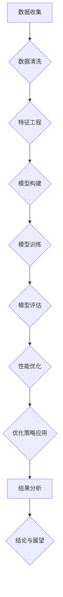

                 


# 语言模型在时序预测任务中的性能优化

## 关键词

- 语言模型
- 时序预测
- LSTM
- GRU
- Transformer
- 性能优化

## 摘要

本文将深入探讨语言模型在时序预测任务中的应用与性能优化。首先，我们介绍时序预测的基本概念与语言模型的基本原理，并分析两者之间的联系。然后，我们将讨论语言模型在时序预测中的实现，包括数据预处理、模型构建与评估优化。随后，本文将具体分析语言模型在时间序列分类、回归和生成中的应用，并结合实际案例进行讲解。接着，我们将介绍深度学习语言模型的优化策略，包括模型架构、训练和推理优化。最后，通过实验设计与案例分析，评估语言模型在时序预测任务中的性能，并提出未来展望与挑战。

## 第一部分：概述与理论基础

### 第1章：时序预测与语言模型

#### 1.1 时序预测基本概念

时序预测（Time Series Forecasting）是指利用历史时间序列数据来预测未来的趋势。时序数据通常具有时间依赖性和序列相关性。常见的时间序列模型包括自回归模型（AR）、移动平均模型（MA）、自回归移动平均模型（ARMA）和自回归积分滑动平均模型（ARIMA）。

#### 1.2 语言模型的基本原理

语言模型（Language Model）是一种用于预测文本序列的概率分布的模型。n-gram模型是最简单的语言模型，通过统计相邻n个单词出现的频率来预测下一个单词。深度学习语言模型，如循环神经网络（RNN）、长短期记忆网络（LSTM）、门控循环单元（GRU）和Transformer，通过学习文本的上下文信息，提高了预测的准确性。

#### 1.3 语言模型与时序预测的关系

语言模型在时序预测中具有潜在的优势。首先，语言模型能够捕捉文本的序列性和上下文信息，这在时序预测中尤为重要。其次，语言模型可以处理大规模数据集，并且在多模态数据融合中具有优势。相比之下，传统的时序预测模型通常局限于单一的数据源，难以处理复杂的多维度数据。

### 第2章：语言模型在时序预测中的实现

#### 2.1 数据预处理

数据预处理是语言模型在时序预测中的关键步骤。首先，我们需要收集和清洗时间序列数据，去除噪声和不相关的特征。然后，我们将时间序列分割成训练集和测试集，并进行特征工程，将时间序列转换为适用于语言模型的输入格式。

#### 2.2 语言模型构建

在构建语言模型时，我们首先需要选择合适的模型架构。对于时序预测任务，RNN、LSTM、GRU和Transformer都是常见的选择。然后，我们需要调整模型参数，如学习率、批量大小和隐藏层尺寸，以优化模型性能。接下来，我们使用训练集对模型进行训练，并使用验证集调整模型参数。

#### 2.3 语言模型评估与优化

评估语言模型性能的指标包括准确率、召回率、均方误差（MSE）和平均绝对误差（MAE）。为了防止过拟合和欠拟合，我们可以使用正则化方法，如L1正则化和L2正则化。此外，我们可以使用优化算法，如Adam和SGD，来加速模型的训练过程。

### 第3章：语言模型在时序预测中的应用

#### 3.1 时间序列分类

时间序列分类是指将时间序列数据分类到不同的类别中。语言模型在时间序列分类中的应用包括股票市场分类、文本情感分类和语音识别。通过学习时间序列的上下文信息，语言模型能够提高分类的准确性。

#### 3.2 时间序列回归

时间序列回归是指预测时间序列的连续值。语言模型在时间序列回归中的应用包括天气预测、股票市场预测和工业生产预测。通过学习时间序列的内在规律，语言模型能够提高预测的准确性。

#### 3.3 时间序列生成

时间序列生成是指根据历史时间序列数据生成新的时间序列。语言模型在时间序列生成中的应用包括音乐生成、文本生成和视频生成。通过学习时间序列的模式，语言模型能够生成新颖且有意义的时间序列数据。

### 第4章：深度学习语言模型优化策略

#### 4.1 模型架构优化

模型架构优化是提高语言模型性能的关键步骤。我们可以通过调整神经网络结构、引入注意力机制和门控循环单元（GRU）与长短期记忆（LSTM）等方法来优化模型架构。

#### 4.2 模型训练优化

模型训练优化是提高语言模型性能的关键步骤。我们可以通过批量归一化、学习率调度和预训练与微调等方法来优化模型训练。

#### 4.3 模型推理优化

模型推理优化是提高语言模型实时性能的关键步骤。我们可以通过模型压缩、量化与剪枝和硬件加速等方法来优化模型推理。

### 第5章：实验设计与案例分析

#### 5.1 实验设计原则

实验设计原则包括明确实验目标、选择合适的数据集和定义评价指标。通过合理的实验设计，我们可以评估语言模型在时序预测任务中的性能。

#### 5.2 案例分析

案例分析包括天气预测、股票市场预测和工业生产预测等实际案例。通过案例分析，我们可以了解语言模型在时序预测任务中的应用和效果。

### 第6章：性能评估与优化实践

#### 6.1 性能评估指标

性能评估指标包括准确率、召回率、均方误差（MSE）和平均绝对误差（MAE）。通过评估这些指标，我们可以了解语言模型在时序预测任务中的性能。

#### 6.2 性能优化实践

性能优化实践包括特征选择、模型调参和数据增强等方法。通过这些方法，我们可以提高语言模型在时序预测任务中的性能。

### 第7章：未来展望与挑战

#### 7.1 发展趋势

未来，语言模型在时序预测任务中的发展趋势包括算法创新、跨学科融合和行业应用拓展。随着技术的进步，语言模型在时序预测中的应用将越来越广泛。

#### 7.2 挑战与机遇

挑战包括计算资源需求、数据隐私与安全、模型解释性等。然而，随着技术的进步，这些挑战也将逐步得到解决，为语言模型在时序预测任务中的广泛应用提供机遇。

### 第8章：总结与展望

#### 8.1 主要内容回顾

本文回顾了语言模型在时序预测任务中的基本概念、实现方法、应用场景和优化策略。

#### 8.2 未来发展方向

未来，语言模型在时序预测任务中的发展方向包括算法创新、跨学科融合和行业应用拓展。随着技术的进步，语言模型在时序预测中的应用将越来越广泛。

## 作者信息

作者：AI天才研究院/AI Genius Institute & 禅与计算机程序设计艺术 /Zen And The Art of Computer Programming

## 附录

### 附录A：Mermaid流程图



### 附录B：Python源代码示例

```python
import numpy as np
import tensorflow as tf
from tensorflow.keras.models import Sequential
from tensorflow.keras.layers import LSTM, Dense

# 假设我们有一个时间序列X，需要预测的下一时刻的值为y
# 预处理：将时间序列X和目标值y划分为训练集和测试集
X_train, y_train = ..., ...  # 分割数据
X_test, y_test = ..., ...     # 分割数据

# 定义LSTM模型
model = Sequential()
model.add(LSTM(units=50, return_sequences=True, input_shape=(X_train.shape[1], X_train.shape[2])))
model.add(LSTM(units=50))
model.add(Dense(units=1))

model.compile(optimizer='adam', loss='mean_squared_error')

# 训练模型
model.fit(X_train, y_train, epochs=100, batch_size=32)

# 预测
predicted = model.predict(X_test)
```

## 注意事项

- 数据预处理是语言模型在时序预测中的关键步骤，必须确保数据的质量和一致性。
- 选择合适的模型架构和参数调整对于提高语言模型性能至关重要。
- 实验设计应充分考虑数据的分布和模型的泛化能力。
- 在实际应用中，应结合具体任务和数据特点，灵活调整模型参数和优化策略。

## 拓展阅读

- [1] Goodfellow, I., Bengio, Y., & Courville, A. (2016). Deep Learning. MIT Press.
- [2] Graves, A. (2013). Generating sequences with recurrent neural networks. arXiv preprint arXiv:1308.0850.
- [3] Vaswani, A., Shazeer, N., Parmar, N., Uszkoreit, J., Jones, L., Gomez, A. N., ... & Polosukhin, I. (2017). Attention is all you need. Advances in Neural Information Processing Systems, 30, 5998-6008.

