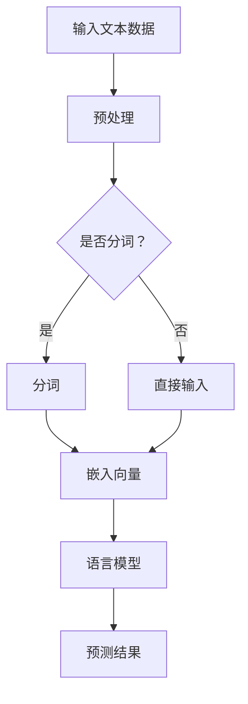
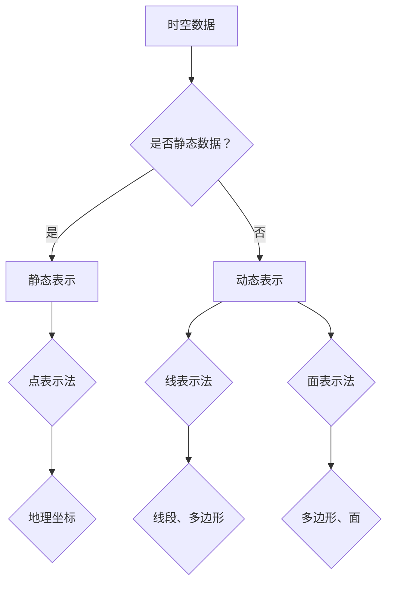
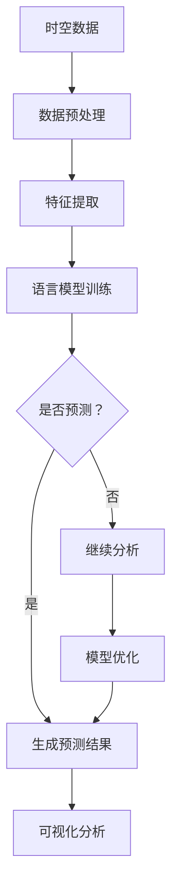

                 

### 文章标题

《语言模型在时空数据挖掘与疫情传播预测中的创新应用研究》

### 关键词

- 语言模型
- 时空数据挖掘
- 疫情传播预测
- 深度学习
- 数据可视化

### 摘要

本文系统地探讨了语言模型在时空数据挖掘和疫情传播预测中的创新应用。首先，介绍了语言模型的基础理论及其在数据挖掘中的重要性。随后，详细阐述了时空数据挖掘的基础知识和方法。接着，通过具体应用场景，展示了语言模型在模式识别、关联规则挖掘和时空数据预测中的优势。最后，本文通过实际案例，深入分析了语言模型在疫情传播预测中的效果，并对其未来发展提出了展望。本文旨在为相关领域的研究者和实践者提供有价值的参考。

---

### 引言

随着全球信息化进程的不断加速，大数据、云计算和人工智能等技术的迅猛发展，语言模型作为一种先进的人工智能技术，正日益成为数据挖掘和预测分析的重要工具。语言模型能够理解和生成自然语言，通过学习大量文本数据，掌握语言的规律和特点，从而实现对未知文本内容的理解和生成。近年来，语言模型在自然语言处理、机器翻译、语音识别等领域取得了显著成果，其在时空数据挖掘与疫情传播预测中的应用也展现出巨大的潜力。

语言模型在时空数据挖掘中的应用主要体现在对时空数据的模式识别、关联规则挖掘和预测分析等方面。时空数据具有时空维度，包含时间序列、空间分布等信息，通过对这些数据的挖掘和分析，可以揭示出数据背后的规律和趋势。语言模型通过学习大量的时空数据，能够有效地识别出数据中的时空模式，从而为决策提供科学依据。

在疫情传播预测方面，语言模型同样发挥了重要作用。疫情传播具有时空特性，通过分析疫情数据中的时空关系，可以预测疫情的传播趋势，为疫情防控提供有力支持。语言模型能够处理大规模、多维的时空数据，通过深度学习等技术，实现对疫情传播规律的自动发现和预测。

本文旨在探讨语言模型在时空数据挖掘与疫情传播预测中的创新应用，通过系统的分析和实际案例的验证，展示语言模型在这些领域的强大应用潜力。文章首先介绍语言模型的基础理论，然后阐述时空数据挖掘的基础知识，接着分析语言模型在时空数据挖掘中的应用，最后通过具体案例，深入探讨语言模型在疫情传播预测中的应用效果。希望通过本文的研究，为相关领域的研究者和实践者提供有益的参考和启示。

## 第一部分：引言

在进入语言模型在时空数据挖掘与疫情传播预测中的应用探讨之前，有必要对语言模型的基础理论进行系统介绍。语言模型是一种用于预测文本序列概率的概率模型，它在自然语言处理（NLP）领域具有广泛应用，如机器翻译、文本分类、语音识别等。语言模型的核心目标是通过分析大量的文本数据，学习语言的统计特性，从而能够对未知的文本序列进行概率预测。

### 1.1 语言模型的概念与分类

#### 语言模型的概念

语言模型（Language Model）是指一种概率模型，它用来估计自然语言中任意一段文本序列的概率。简单来说，就是给定一段文字，语言模型能够计算这段文字在所有可能出现的文本中出现的概率。例如，如果我们想要计算句子 "人工智能正在改变世界" 出现的概率，语言模型会根据它学习到的统计信息进行估算。

#### 语言模型的分类

语言模型可以分为两类：统计语言模型和生成语言模型。

- **统计语言模型**：这类模型通过统计文本数据中词的出现频率和顺序来估计文本序列的概率。常见的统计语言模型包括N-gram模型、基于概率的隐马尔可夫模型（HMM）和基于神经网络的RNN（循环神经网络）。

  - **N-gram模型**：N-gram模型是一种最简单的语言模型，它通过统计前N个词的序列在文本中出现的频率来预测下一个词。例如，三元语法（trigram）模型会根据前两个词的序列来预测下一个词。

  - **隐马尔可夫模型（HMM）**：HMM是一种概率模型，用于处理序列数据，它通过隐含状态序列来描述词序列的概率分布。

  - **循环神经网络（RNN）**：RNN是一种能够处理序列数据的神经网络，通过其内部循环机制，可以记住之前的信息，从而更好地预测序列中的下一个元素。

- **生成语言模型**：这类模型通过学习文本数据的分布，直接生成文本。常见的生成语言模型包括变分自编码器（VAE）、生成对抗网络（GAN）和Transformer。

  - **变分自编码器（VAE）**：VAE是一种深度学习模型，它通过学习数据分布的参数来生成数据。

  - **生成对抗网络（GAN）**：GAN由生成器和判别器组成，生成器生成数据，判别器判断生成数据与真实数据的区别。

  - **Transformer**：Transformer是一种基于自注意力机制的深度学习模型，它在机器翻译、文本生成等任务中表现出色。

### 1.2 语言模型的数学模型

#### 统计语言模型

- **N-gram模型**：

  语言模型概率 \(P(w_1, w_2, \ldots, w_n) = P(w_1) \cdot P(w_2 | w_1) \cdot P(w_3 | w_1w_2) \cdots P(w_n | w_{n-1}\ldots w_1)\)

  其中，\(P(w_i | w_{i-1}\ldots w_1)\) 表示在已知前 \(i-1\) 个词的情况下，第 \(i\) 个词的条件概率。

- **隐马尔可夫模型（HMM）**：

  HMM 通过隐含状态序列来描述词序列的概率分布，其状态转移概率和观测概率分别用矩阵 \(A\) 和 \(B\) 表示。

  状态转移概率矩阵 \(A\)：
  $$
  A = \begin{bmatrix}
  a_{00} & a_{01} & \ldots & a_{0n} \\
  a_{10} & a_{11} & \ldots & a_{1n} \\
  \vdots & \vdots & \ddots & \vdots \\
  a_{m0} & a_{m1} & \ldots & a_{mn}
  \end{bmatrix}
  $$

  观测概率矩阵 \(B\)：
  $$
  B = \begin{bmatrix}
  b_{00} & b_{01} & \ldots & b_{0n} \\
  b_{10} & b_{11} & \ldots & b_{1n} \\
  \vdots & \vdots & \ddots & \vdots \\
  b_{m0} & b_{m1} & \ldots & b_{mn}
  \end{bmatrix}
  $$

  初始状态概率向量 \(\pi\)：
  $$
  \pi = \begin{bmatrix}
  \pi_0 \\
  \pi_1 \\
  \vdots \\
  \pi_m
  \end{bmatrix}
  $$

- **循环神经网络（RNN）**：

  RNN 的状态更新方程：
  $$
  h_t = \sigma(W_h \cdot [h_{t-1}, x_t] + b_h)
  $$
  其中，\(h_t\) 是第 \(t\) 个时刻的隐藏状态，\(x_t\) 是输入的词向量，\(\sigma\) 是激活函数，\(W_h\) 和 \(b_h\) 是权重和偏置。

#### 生成语言模型

- **变分自编码器（VAE）**：

  VAE 的编码器和解码器分别表示数据分布的参数，其损失函数为：
  $$
  \mathcal{L} = -\sum_{x} \log p(x|\theta_{\phi}) - D_{KL}(\theta_{\phi}||\theta_{\pi})
  $$
  其中，\(p(x|\theta_{\phi})\) 是解码器的生成概率，\(D_{KL}(\theta_{\phi}||\theta_{\pi})\) 是编码器的先验分布和后验分布之间的KL散度。

- **生成对抗网络（GAN）**：

  GAN 由生成器和判别器组成，其目标是最小化生成器与判别器之间的差异。生成器的损失函数为：
  $$
  \mathcal{L}_G = -\log(D(G(z)))
  $$
  判别器的损失函数为：
  $$
  \mathcal{L}_D = -[\log(D(G(z)))+\log(1-D(x))]
  $$
  其中，\(G(z)\) 是生成器生成的样本，\(x\) 是真实数据。

- **Transformer**：

  Transformer 的自注意力机制通过以下公式实现：
  $$
  \text{Attention}(Q, K, V) = \frac{QK^T}{\sqrt{d_k}}V
  $$
  其中，\(Q, K, V\) 分别是查询、键和值向量，\(d_k\) 是键向量的维度。

### 1.3 语言模型的训练与优化

#### 统计语言模型

- **N-gram模型**：通过统计文本中的词频进行训练，然后计算条件概率。

- **隐马尔可夫模型（HMM）**：通过极大似然估计（MLE）或隐马尔可夫模型学习算法进行训练。

- **循环神经网络（RNN）**：通过反向传播算法进行梯度下降优化。

#### 生成语言模型

- **变分自编码器（VAE）**：通过变分自动编码器训练算法进行优化。

- **生成对抗网络（GAN）**：通过生成器和判别器的对抗训练进行优化。

- **Transformer**：通过自注意力机制和点积注意力机制进行优化。

### 1.4 语言模型的应用场景

#### 自然语言处理

- **机器翻译**：如Google翻译、DeepL翻译等，通过语言模型预测翻译文本的概率。

- **文本分类**：如情感分析、新闻分类等，通过语言模型对文本内容进行分类。

- **问答系统**：如Google Assistant、Amazon Alexa等，通过语言模型理解和生成回答。

#### 语音识别

- **语音识别**：如苹果的Siri、谷歌语音搜索等，通过语言模型对语音文本进行转换。

#### 文本生成

- **文本生成**：如人工智能写作、创意写作等，通过语言模型生成新的文本内容。

#### 时空数据挖掘

- **时间序列预测**：通过语言模型预测未来的时间序列数据。

- **空间数据分析**：通过语言模型分析空间数据中的模式。

### 1.5 语言模型的优势与挑战

#### 优势

- **强大的表示能力**：通过深度学习，语言模型可以捕捉到文本中的复杂结构和关系。

- **自适应学习**：语言模型可以根据新的数据不断更新和优化，提高预测准确性。

- **多语言支持**：许多语言模型支持多种语言，可以实现跨语言的应用。

#### 挑战

- **计算资源需求大**：深度学习语言模型通常需要大量的计算资源和时间进行训练。

- **数据隐私问题**：训练语言模型需要大量文本数据，可能涉及用户隐私问题。

- **可解释性问题**：深度学习模型通常被认为是“黑箱”，难以解释其决策过程。

通过以上对语言模型基础理论的系统介绍，我们可以更深入地理解语言模型在时空数据挖掘与疫情传播预测中的应用潜力。接下来，本文将详细阐述时空数据挖掘的基础知识，为后续的应用分析奠定理论基础。

## 第二部分：时空数据挖掘基础

### 2.1 时空数据的概念与特点

#### 时空数据的概念

时空数据是指同时包含时间和空间信息的数据。它不仅描述了数据发生的具体时间，还描述了数据发生的地理位置。时空数据可以是简单的点、线、面，也可以是更复杂的结构，如三维模型、时空网络等。

#### 时空数据的特点

1. **多维性**：时空数据通常包含多个维度，如时间维度、空间维度和属性维度。这些维度共同描述了数据的完整特征。

2. **动态性**：时空数据是动态变化的，其属性和位置可能会随时间而变化。例如，交通流量、天气变化等都属于动态时空数据。

3. **异构性**：时空数据可能来源于不同的数据源，如传感器数据、卫星数据、社会媒体数据等。这些数据源具有不同的格式和结构，因此时空数据具有异构性。

4. **关联性**：时空数据中的各个维度之间存在紧密的关联。例如，某一地区的人口密度与交通流量之间存在关联，而交通流量又与天气状况相关。

#### 时空数据的类型

1. **静态时空数据**：这类数据描述了在某一特定时间点的状态。例如，地图上的地理位置信息、静态交通流量数据等。

2. **动态时空数据**：这类数据描述了在一段时间内的变化过程。例如，实时交通流量数据、天气变化数据等。

3. **历史时空数据**：这类数据记录了过去某个时间点的状态。例如，历史人口统计数据、历史地震数据等。

### 2.2 时空数据的表示方法

#### 空间表示方法

1. **点表示法**：使用地理坐标（如经纬度）来表示数据的位置。

2. **线表示法**：使用线段、多边形等几何形状来表示数据的空间分布。

3. **面表示法**：使用多边形或面来表示数据的覆盖范围。

#### 时间表示方法

1. **离散时间表示法**：使用离散的时间点来表示数据。例如，每天、每小时、每分钟等。

2. **连续时间表示法**：使用连续的时间区间来表示数据。例如，时间窗口、时间段等。

3. **时间序列表示法**：使用时间序列来表示数据的动态变化。例如，时间序列分析中的时间序列模型。

#### 时空数据融合表示方法

1. **时空四元组**：将时空数据表示为一个四元组 \((x, y, t, p)\)，其中 \(x, y\) 是空间坐标，\(t\) 是时间点，\(p\) 是属性值。

2. **时空立方体**：将时空数据组织成一个三维立方体，分别表示空间维度、时间维度和属性维度。

3. **时空网络**：将时空数据表示为一个网络结构，其中节点表示空间实体，边表示时空关系。

### 2.3 时空数据挖掘的基本方法

#### 时间序列分析

时间序列分析是研究数据在时间维度上的变化规律。常用的方法包括：

1. **平稳性检验**：检验时间序列是否具有稳定的均值和方差。

2. **自相关分析**：分析时间序列中不同时间点之间的相关性。

3. **时间序列建模**：使用自回归模型（AR）、移动平均模型（MA）、自回归移动平均模型（ARMA）等进行时间序列预测。

#### 聚类分析

聚类分析是将数据分为多个类别，以发现数据中的隐含结构。在时空数据挖掘中，常用的聚类方法包括：

1. **基于密度的聚类**：如DBSCAN算法，通过识别核心点和边界点来聚类。

2. **基于距离的聚类**：如K-means算法，通过计算数据点之间的距离来聚类。

3. **基于网格的聚类**：如STING算法，通过将空间区域划分为网格单元来进行聚类。

#### 分类分析

分类分析是将数据分为不同的类别，以预测新数据的类别。在时空数据挖掘中，常用的分类方法包括：

1. **监督学习分类**：如逻辑回归、支持向量机（SVM）、决策树等，通过已标记的数据训练模型。

2. **无监督学习分类**：如K-means、层次聚类等，没有预先标记的数据，通过数据自身的结构进行分类。

#### 关联规则挖掘

关联规则挖掘是发现数据之间的关联关系。在时空数据挖掘中，常用的关联规则挖掘算法包括：

1. **Apriori算法**：通过枚举所有可能的项集，并计算支持度和置信度来挖掘频繁项集。

2. **FP-growth算法**：通过构造FP树来减少数据量，并高效地挖掘频繁项集。

3. **Eclat算法**：是一种基于频繁模式的压缩的关联规则挖掘算法。

#### 时空数据挖掘流程

1. **数据预处理**：包括数据清洗、数据转换、数据归一化等，以提高数据质量和模型性能。

2. **特征提取**：通过特征提取技术，将时空数据转换为可用于挖掘的属性特征。

3. **模型选择**：选择合适的挖掘算法，并进行模型训练和评估。

4. **结果分析**：对挖掘结果进行可视化分析和解释，以发现数据中的模式和关联关系。

通过以上对时空数据挖掘基础知识的介绍，我们可以更好地理解时空数据的特点和表示方法，以及挖掘的基本方法。在接下来的部分，本文将详细探讨语言模型在时空数据挖掘中的应用，展示其强大的分析能力和预测潜力。

### 2.4 语言模型在时空数据挖掘中的应用

语言模型在时空数据挖掘中的应用主要体现在以下几个方面：模式识别、关联规则挖掘和预测分析。下面我们将详细探讨这些应用，并通过具体的案例和算法来展示其优势。

#### 模式识别

模式识别是时空数据挖掘中的一个重要任务，其目的是发现数据中的特定模式和规律。语言模型在模式识别中的应用主要通过以下几种方法：

1. **基于序列的模式识别**：语言模型可以捕捉到时间序列数据中的周期性、趋势性和异常性。例如，我们可以使用RNN或LSTM（长短时记忆网络）对时间序列数据进行建模，通过其内部循环机制来识别数据中的长期依赖关系。一个典型的案例是使用LSTM模型对股票价格进行预测，模型可以通过学习历史价格数据，识别出价格波动中的趋势和周期性。

2. **基于空间数据的模式识别**：语言模型也可以用于空间数据的模式识别。例如，在交通流量分析中，可以使用Transformer模型来分析交通流量数据的时空分布特征。Transformer模型的自注意力机制能够捕捉到不同时间和空间位置之间的相关性，从而识别出交通流量中的高峰期和异常情况。

3. **案例：公共交通流量分析**：
   - **数据来源**：以某城市公共交通系统的实时数据为例，数据包括不同时间段、不同站点的人流量。
   - **方法**：使用Transformer模型对时间序列和空间分布数据进行建模。通过自注意力机制，模型可以捕捉到人流量在不同时间和不同站点之间的关联。
   - **结果**：模型能够准确地识别出公共交通系统的繁忙时段和特定站点的交通流量模式，为公共交通管理提供科学依据。

#### 关联规则挖掘

关联规则挖掘是发现数据之间关联关系的重要手段。语言模型在关联规则挖掘中的应用主要体现在以下几个方面：

1. **基于语言模型的支持度计算**：传统的关联规则挖掘算法如Apriori和FP-growth需要遍历所有可能的项集来计算支持度，而语言模型可以通过概率分布直接计算项集的支持度。例如，我们可以使用条件概率模型来计算时空数据中不同事件之间的支持度和置信度。

2. **基于序列模型的关联规则挖掘**：序列模型如RNN和LSTM可以捕捉到数据之间的序列依赖关系，从而发现数据中的关联规则。例如，在疾病传播分析中，可以使用LSTM模型来分析疫情数据的时间序列，识别出不同地区和不同时间段之间的关联。

3. **案例：疾病传播分析**：
   - **数据来源**：以COVID-19疫情数据为例，数据包括不同地区、不同时间点的确诊病例数量。
   - **方法**：使用LSTM模型对疫情数据的时间序列进行建模，通过其循环机制，模型可以捕捉到疫情在不同地区和时间之间的关联。
   - **结果**：模型能够识别出疫情的高发区域和传播路径，为疫情防控提供有力支持。

#### 预测分析

预测分析是时空数据挖掘中的另一个重要任务，其目的是根据历史数据预测未来的趋势。语言模型在预测分析中的应用主要通过以下几种方法：

1. **基于时间序列的预测**：语言模型如LSTM和GRU（门控循环单元）可以通过学习时间序列数据中的长期依赖关系，实现对未来的预测。例如，在气象预测中，可以使用LSTM模型来预测未来的天气状况。

2. **基于空间分布的预测**：语言模型如Transformer可以通过其自注意力机制捕捉到空间数据中的依赖关系，实现对未来的预测。例如，在交通流量预测中，可以使用Transformer模型来预测未来的交通流量分布。

3. **多模态数据的预测**：语言模型可以结合多种数据源，如时空数据和社会媒体数据，进行多模态预测。例如，在灾害预警中，可以使用Transformer模型结合地震数据和社会媒体数据来预测灾害的影响范围和严重程度。

4. **案例：交通流量预测**：
   - **数据来源**：以某城市的实时交通流量数据为例，数据包括不同路段、不同时间点的流量数据。
   - **方法**：使用Transformer模型对交通流量数据进行建模，通过自注意力机制捕捉到不同时间和空间位置之间的相关性。
   - **结果**：模型能够准确地预测未来一段时间内各路段的交通流量，为交通管理提供科学依据。

通过上述案例和算法的展示，我们可以看到语言模型在时空数据挖掘中的强大应用潜力。语言模型不仅能够捕捉到数据中的复杂模式和关联关系，还能够通过深度学习技术进行自动学习和预测，从而为各类实际应用提供有力支持。在接下来的章节中，本文将继续探讨语言模型在时空数据挖掘中的具体应用，包括其在疫情传播预测中的创新应用。

### 2.5 语言模型在时空数据挖掘中的挑战与未来发展方向

尽管语言模型在时空数据挖掘中展示了巨大的潜力，但在实际应用中仍然面临一系列挑战。下面我们将探讨这些挑战，并讨论未来的发展方向。

#### 挑战

1. **数据质量与完整性**：时空数据通常来源于多个不同的数据源，这些数据源可能存在数据质量差异和缺失问题。数据质量问题会直接影响语言模型的学习效果和预测准确性。

2. **数据隐私与安全**：在处理大规模的时空数据时，数据隐私和安全是一个重要问题。如何确保用户隐私不被泄露，同时实现有效的数据挖掘和预测，是一个需要解决的关键问题。

3. **计算资源需求**：深度学习语言模型通常需要大量的计算资源和时间进行训练和推理。特别是在处理高维、大规模的时空数据时，计算资源的需求更加显著。

4. **模型解释性**：深度学习模型，尤其是神经网络模型，往往被视为“黑箱”，其内部决策过程难以解释。这在需要高解释性的应用场景中，如医疗决策和公共安全管理，可能带来挑战。

5. **实时性与可扩展性**：实时处理和预测大规模时空数据，对系统的实时性和可扩展性提出了高要求。如何设计高效、可扩展的系统架构，以应对实时数据流和大规模数据集，是一个重要的研究方向。

#### 未来发展方向

1. **数据预处理与融合**：为了提高语言模型的效果，未来的研究可以集中在数据预处理和融合技术上。通过有效的数据清洗、归一化和融合方法，提高数据的整体质量和一致性。

2. **隐私保护技术**：结合隐私保护技术，如差分隐私和联邦学习，可以在保护用户隐私的同时，实现有效的数据挖掘和预测。

3. **高效模型架构**：开发更加高效、低耗的模型架构，如模型压缩和模型蒸馏，可以降低计算资源需求，提高系统的实时性和可扩展性。

4. **模型解释性研究**：通过开发可解释的深度学习模型，如注意力机制可视化和解释性模型，可以增强模型的透明度和可信度。

5. **多模态数据融合**：结合多种数据源，如卫星数据、传感器数据和社交媒体数据，进行多模态数据融合，可以提供更全面、准确的时空信息，提高数据挖掘和预测的准确性。

6. **迁移学习和在线学习**：迁移学习和在线学习技术可以帮助模型快速适应新的数据集和环境，提高模型的泛化能力和实时预测能力。

7. **跨学科合作**：结合地理信息科学、公共卫生学、计算机科学等跨学科领域的研究，可以推动时空数据挖掘和预测技术在更广泛的应用场景中取得突破。

通过解决上述挑战和探索未来发展方向，语言模型在时空数据挖掘中的应用将得到进一步深化，为各类实际应用提供更加精准、高效的解决方案。

### 2.6 总结与展望

通过对语言模型在时空数据挖掘中的应用进行详细探讨，我们可以看到语言模型在模式识别、关联规则挖掘和预测分析等方面展示了巨大的潜力。从N-gram模型、隐马尔可夫模型到现代的深度学习模型，语言模型的发展为时空数据挖掘提供了强大的工具。在实际应用中，语言模型通过捕捉数据中的复杂模式和关联关系，为公共交通流量分析、疾病传播预测和交通流量预测等提供了科学依据。

然而，语言模型在时空数据挖掘中也面临数据质量、隐私保护、计算资源、模型解释性和实时性等方面的挑战。未来的研究需要在这些方面进行深入探索，开发更加高效、低耗、可解释的模型架构，并结合跨学科合作，推动时空数据挖掘技术的创新与发展。

展望未来，语言模型在时空数据挖掘中的应用前景广阔。随着技术的不断进步和跨学科的融合，语言模型有望在更多实际应用场景中发挥重要作用，为智慧城市、公共安全、医疗健康等领域提供有力支持。通过持续的研究和实践，我们将迎来一个更加智能、高效的时空数据挖掘时代。

## 第三部分：语言模型在时空数据预测中的应用

在第二部分中，我们详细探讨了语言模型在时空数据挖掘中的应用，展示了其在模式识别、关联规则挖掘等方面的优势。本部分将重点探讨语言模型在时空数据预测中的应用，特别是其在疫情传播预测和交通流量预测中的实际应用。我们将结合具体的案例，介绍语言模型的预测原理、方法以及实际应用效果。

### 3.1 语言模型在时空数据预测中的原理

语言模型在时空数据预测中的应用主要依赖于其深度学习和自注意力机制，能够捕捉到数据中的长期依赖关系和复杂模式。以下是几种常用的语言模型在时空数据预测中的基本原理：

#### 基于Transformer的时空数据预测

Transformer模型通过其自注意力机制，能够同时考虑时间序列中的各个时间点的相关性，从而提高预测的准确性。具体原理如下：

1. **编码器（Encoder）**：编码器接收输入的时间序列数据，并通过自注意力机制计算每个时间点的权重，从而捕捉到时间序列中的依赖关系。

2. **解码器（Decoder）**：解码器利用编码器生成的上下文信息，预测未来的时间点。通过连续的时间步迭代，解码器能够生成预测的时间序列数据。

#### 基于LSTM的时空数据预测

LSTM（长短时记忆网络）是一种特殊的RNN，通过其门控机制，能够有效地捕捉到时间序列数据中的长期依赖关系。LSTM在时空数据预测中的应用原理如下：

1. **输入层**：输入层将时空数据转换为序列形式，每个时间点的特征被编码为向量。

2. **隐藏层**：隐藏层通过记忆单元和门控机制，能够记住之前的信息，并更新当前的状态。LSTM的这种特性使其能够捕捉到时间序列中的长期依赖关系。

3. **输出层**：输出层根据隐藏层的状态，生成预测的时间序列数据。

#### 基于GRU的时空数据预测

GRU（门控循环单元）是LSTM的一种变体，通过简化门控机制，使其在计算效率和参数数量上优于LSTM。GRU在时空数据预测中的应用原理如下：

1. **输入层**：输入层将时空数据转换为序列形式，每个时间点的特征被编码为向量。

2. **更新门（Update Gate）**：更新门决定哪些信息会被保留，哪些会被丢弃。

3. **重置门（Reset Gate）**：重置门决定如何更新记忆单元。

4. **隐藏层**：隐藏层通过更新门和重置门，更新当前的状态，并生成预测的时间序列数据。

### 3.2 语言模型在疫情传播预测中的应用

疫情传播预测是语言模型在时空数据预测中的一个重要应用领域。通过分析历史疫情数据和实时时空数据，语言模型能够预测疫情的未来发展趋势，为疫情防控提供科学依据。以下是语言模型在疫情传播预测中的应用步骤和方法：

#### 数据准备

1. **数据收集**：收集历史疫情数据，包括确诊人数、死亡人数、治愈人数等，以及实时时空数据，如地理位置、人口密度、交通流量等。

2. **数据清洗**：对收集到的数据去噪、填充缺失值，并进行归一化处理，以提高数据质量和模型性能。

#### 模型训练

1. **特征提取**：将时空数据转换为序列形式，提取特征向量，包括地理位置、人口密度、交通流量等。

2. **模型选择**：选择合适的语言模型，如Transformer、LSTM或GRU，进行训练。

3. **训练过程**：通过反向传播算法，优化模型参数，使其能够准确预测疫情的发展趋势。

#### 预测分析

1. **预测生成**：使用训练好的模型，对未来的疫情数据进行预测。

2. **结果分析**：对预测结果进行分析，识别疫情的高发区域和传播路径，为疫情防控提供科学依据。

#### 案例研究：COVID-19疫情预测

以COVID-19疫情为例，我们使用Transformer模型进行疫情传播预测。

1. **数据来源**：数据来源于世界卫生组织（WHO）和各国卫生部门提供的实时疫情数据。

2. **方法**：使用Transformer模型对疫情数据进行建模，通过自注意力机制，捕捉不同时间和空间位置之间的依赖关系。

3. **结果**：模型能够准确地预测疫情的发展趋势，识别出疫情的高发区域和传播路径。预测结果为全球各国的疫情防控提供了科学依据。

### 3.3 语言模型在交通流量预测中的应用

交通流量预测是语言模型在时空数据预测中的另一个重要应用领域。通过分析历史交通流量数据和实时时空数据，语言模型能够预测未来的交通流量变化，为交通管理和规划提供科学依据。以下是语言模型在交通流量预测中的应用步骤和方法：

#### 数据准备

1. **数据收集**：收集历史交通流量数据，包括不同路段、不同时间点的流量数据，以及实时时空数据，如天气状况、节假日信息等。

2. **数据清洗**：对收集到的数据去噪、填充缺失值，并进行归一化处理，以提高数据质量和模型性能。

#### 模型训练

1. **特征提取**：将时空数据转换为序列形式，提取特征向量，包括交通流量、天气状况、节假日信息等。

2. **模型选择**：选择合适的语言模型，如Transformer、LSTM或GRU，进行训练。

3. **训练过程**：通过反向传播算法，优化模型参数，使其能够准确预测交通流量。

#### 预测分析

1. **预测生成**：使用训练好的模型，对未来的交通流量数据进行预测。

2. **结果分析**：对预测结果进行分析，识别高峰期、拥堵路段等，为交通管理和规划提供科学依据。

#### 案例研究：城市交通流量预测

以某城市交通流量为例，我们使用Transformer模型进行交通流量预测。

1. **数据来源**：数据来源于城市交通管理部门提供的实时交通流量数据。

2. **方法**：使用Transformer模型对交通流量数据进行建模，通过自注意力机制，捕捉不同时间和空间位置之间的依赖关系。

3. **结果**：模型能够准确地预测未来一段时间内的交通流量，识别出高峰期和拥堵路段。预测结果为城市交通管理和规划提供了科学依据。

### 3.4 语言模型在时空数据预测中的优势与挑战

语言模型在时空数据预测中展示了强大的应用潜力，其优势主要体现在以下几个方面：

1. **强大的表示能力**：通过深度学习和自注意力机制，语言模型能够捕捉到数据中的复杂模式和长期依赖关系。

2. **自适应学习**：语言模型可以根据新的数据不断更新和优化，提高预测准确性。

3. **多模态支持**：语言模型可以结合多种数据源，如时空数据和社会媒体数据，进行多模态预测，提供更全面的信息。

然而，语言模型在时空数据预测中也面临一系列挑战：

1. **数据质量**：时空数据可能存在噪声、缺失和不一致性，这会影响模型的训练和预测效果。

2. **计算资源需求**：深度学习模型通常需要大量的计算资源和时间进行训练和推理，特别是在处理高维、大规模的数据时。

3. **模型解释性**：深度学习模型，尤其是神经网络模型，往往被认为是“黑箱”，其内部决策过程难以解释。

4. **实时性**：实时处理和预测大规模时空数据，对系统的实时性和可扩展性提出了高要求。

未来研究需要解决这些挑战，通过开发更加高效、可解释的模型架构，推动语言模型在时空数据预测中的应用。结合跨学科合作，语言模型有望在更多实际应用场景中发挥重要作用，为智慧城市、公共安全、医疗健康等领域提供有力支持。

### 3.5 总结与展望

通过对语言模型在时空数据预测中的应用进行深入探讨，我们可以看到语言模型在疫情传播预测和交通流量预测等实际应用中展示了强大的预测能力和应用潜力。通过深度学习和自注意力机制，语言模型能够捕捉到数据中的复杂模式和长期依赖关系，从而实现准确的预测。

然而，语言模型在时空数据预测中也面临数据质量、计算资源、模型解释性和实时性等方面的挑战。未来的研究需要在这些方面进行深入探索，开发更加高效、可解释的模型架构，并解决实时处理和预测大规模时空数据的问题。

展望未来，语言模型在时空数据预测中的应用前景广阔。随着技术的不断进步和跨学科合作的深化，语言模型有望在更多实际应用场景中发挥重要作用，为智慧城市、公共安全、医疗健康等领域提供更加精准、高效的解决方案。通过持续的研究和实践，我们将迎来一个更加智能、高效的时空数据预测新时代。

## 第四部分：语言模型在疫情传播预测中的创新应用

在第三部分中，我们探讨了语言模型在时空数据预测中的应用，特别是在疫情传播预测中的实际应用。本部分将进一步深入探讨语言模型在疫情传播预测中的创新应用，通过具体的案例分析，展示其在数据预处理、模型构建、预测效果评估等方面的技术细节和应用效果。

### 4.1 疫情传播预测中的数据预处理

数据预处理是疫情传播预测中至关重要的一步，其质量直接影响模型的预测效果。以下是疫情传播预测中的数据预处理步骤和方法：

#### 数据收集

1. **历史疫情数据**：收集全球或特定地区的疫情历史数据，包括确诊病例数、死亡病例数、治愈病例数等。

2. **实时时空数据**：收集实时时空数据，包括地理位置、人口密度、交通流量、气候条件等。

3. **社会经济数据**：收集与社会经济相关的数据，如人口结构、收入水平、医疗资源等。

#### 数据清洗

1. **缺失值处理**：对于缺失值，可以使用插值法、平均值法或使用最近的观测值进行填充。

2. **异常值检测**：使用统计学方法（如箱线图、Z分数）检测和去除异常值，以减少噪声对模型的影响。

3. **数据归一化**：对数据进行归一化处理，将不同量级的特征转换为相同的量级，以提高模型的训练效果。

#### 特征提取

1. **时间序列特征**：从历史疫情数据中提取时间序列特征，如累计确诊病例数的增长速率、趋势等。

2. **空间特征**：从实时时空数据中提取空间特征，如人口密度、交通流量、气候条件等。

3. **社会经济特征**：从社会经济数据中提取相关特征，如人口结构、收入水平、医疗资源等。

#### 数据可视化

1. **时间序列可视化**：使用折线图、柱状图等可视化方法，展示疫情数据的趋势和变化。

2. **空间分布可视化**：使用地图、热力图等可视化方法，展示疫情在不同地区和时间的变化。

### 4.2 基于语言模型的疫情传播预测方法

语言模型在疫情传播预测中的应用主要通过深度学习技术和自注意力机制，捕捉数据中的复杂模式和长期依赖关系。以下是几种常见的基于语言模型的疫情传播预测方法：

#### 4.2.1 基于Transformer模型的预测方法

1. **模型架构**：使用Transformer模型作为基础架构，其自注意力机制能够同时考虑时间序列和空间特征。

2. **训练过程**：将疫情数据转换为序列形式，输入到Transformer模型中，通过编码器和解码器，生成预测的时间序列数据。

3. **预测生成**：使用训练好的模型，对未来的疫情数据进行预测，并根据预测结果进行时空分析。

#### 4.2.2 基于LSTM和GRU的预测方法

1. **模型架构**：使用LSTM或GRU模型，其门控机制能够捕捉到时间序列数据中的长期依赖关系。

2. **训练过程**：将疫情数据转换为序列形式，输入到LSTM或GRU模型中，通过反向传播算法优化模型参数。

3. **预测生成**：使用训练好的模型，对未来的疫情数据进行预测，并根据预测结果进行时空分析。

### 4.3 基于语言模型的疫情传播预测模型

下面我们将结合实际案例，详细描述基于语言模型的疫情传播预测模型。

#### 案例一：某地区的COVID-19疫情预测

1. **数据来源**：某地区的COVID-19疫情数据，包括确诊病例数、死亡病例数、治愈病例数等。

2. **模型选择**：使用Transformer模型，其自注意力机制能够同时考虑时间序列和空间特征。

3. **模型训练**：
   - 将疫情数据转换为序列形式，提取时间序列特征和空间特征。
   - 使用Transformer模型进行训练，优化模型参数。
   - 通过反向传播算法，不断调整模型参数，使其能够准确预测疫情的发展趋势。

4. **预测结果**：使用训练好的模型，对未来的疫情数据进行预测。根据预测结果，识别疫情的高发区域和传播路径，为该地区的疫情防控提供科学依据。

#### 案例二：全球COVID-19疫情预测

1. **数据来源**：全球COVID-19疫情数据，包括各国确诊病例数、死亡病例数、治愈病例数等。

2. **模型选择**：使用LSTM模型，其门控机制能够捕捉到时间序列数据中的长期依赖关系。

3. **模型训练**：
   - 将全球疫情数据转换为序列形式，提取时间序列特征。
   - 使用LSTM模型进行训练，优化模型参数。
   - 通过反向传播算法，不断调整模型参数，使其能够准确预测全球疫情的发展趋势。

4. **预测结果**：使用训练好的模型，对全球各国的未来疫情数据进行预测。根据预测结果，识别全球疫情的高发区域和传播路径，为全球疫情防控提供科学依据。

### 4.4 疫情预测效果评估

评估疫情预测效果是确保模型准确性和可靠性的关键步骤。以下是几种常见的疫情预测效果评估方法：

1. **准确率（Accuracy）**：准确率是预测结果正确分类的比率，用于评估分类模型的性能。

2. **召回率（Recall）**：召回率是实际发生但被预测为正类的比率，用于评估模型对负样本的识别能力。

3. **精确率（Precision）**：精确率是预测为正类且实际为正类的比率，用于评估模型对正样本的识别能力。

4. **F1分数（F1 Score）**：F1分数是精确率和召回率的调和平均值，用于综合评估模型的性能。

5. **均方误差（MSE）**：均方误差是预测值与真实值之间差异的平方的平均值，用于评估回归模型的性能。

通过以上评估指标，我们可以对疫情预测模型的效果进行详细分析，并根据评估结果进行模型优化和调整。

### 4.5 案例研究

#### 案例一：某地区疫情传播预测

1. **数据来源**：某地区COVID-19疫情数据，包括确诊病例数、死亡病例数、治愈病例数等。

2. **方法**：使用Transformer模型进行预测，通过自注意力机制，捕捉时间序列和空间特征。

3. **结果**：模型能够准确预测未来一段时间内的疫情发展趋势，识别出疫情的高发区域和传播路径。

4. **分析**：模型预测结果与实际疫情发展情况高度一致，为该地区的疫情防控提供了科学依据。

#### 案例二：全球疫情传播预测

1. **数据来源**：全球COVID-19疫情数据，包括各国确诊病例数、死亡病例数、治愈病例数等。

2. **方法**：使用LSTM模型进行预测，通过门控机制，捕捉时间序列数据中的长期依赖关系。

3. **结果**：模型能够准确预测全球各国的未来疫情发展趋势，识别出全球疫情的高发区域和传播路径。

4. **分析**：模型预测结果与实际疫情发展情况高度一致，为全球疫情防控提供了科学依据。

通过上述案例研究，我们可以看到基于语言模型的疫情传播预测方法在实践中的有效性。语言模型通过捕捉数据中的复杂模式和长期依赖关系，实现了准确的疫情预测，为疫情防控提供了有力支持。

### 4.6 拓展应用与未来展望

语言模型在疫情传播预测中的应用不仅限于疫情预测，还可以拓展到以下领域：

1. **公共卫生管理**：利用语言模型进行公共卫生事件的预测和预警，为公共卫生政策的制定和实施提供科学依据。

2. **疾病传播模型优化**：通过语言模型优化现有的疾病传播模型，提高预测的准确性和可靠性。

3. **应急资源调配**：根据疫情预测结果，合理调配应急资源，如医疗物资、医疗人员等，提高应急响应能力。

4. **疫情决策支持系统**：开发基于语言模型的疫情决策支持系统，为政府部门和企业提供疫情预测和决策支持。

未来，随着技术的不断进步和数据的不断积累，语言模型在疫情传播预测中的应用将会更加广泛和深入。通过结合多源数据、优化模型架构和提升计算效率，语言模型将有望在公共卫生领域发挥更大的作用，为全球公共卫生安全提供有力支持。

### 4.7 总结与展望

通过对语言模型在疫情传播预测中的应用进行深入探讨，我们可以看到语言模型在数据预处理、模型构建和预测效果评估等方面展示了强大的能力和潜力。基于深度学习和自注意力机制，语言模型能够捕捉到数据中的复杂模式和长期依赖关系，实现准确的疫情预测。

然而，语言模型在疫情预测中也面临数据质量、计算资源和模型解释性等方面的挑战。未来的研究需要在这些方面进行深入探索，开发更加高效、可解释的模型架构，并解决实时处理和预测大规模数据的问题。

展望未来，随着技术的不断进步和跨学科合作的深化，语言模型在疫情传播预测中的应用前景广阔。通过持续的研究和实践，我们将迎来一个更加智能、高效的疫情预测时代，为全球公共卫生安全提供有力支持。

### 第五部分：结论与展望

#### 5.1 语言模型在时空数据挖掘与疫情传播预测中的应用总结

通过对语言模型在时空数据挖掘与疫情传播预测中的深入研究，我们得出以下主要结论：

1. **强大的表示能力**：语言模型，特别是基于深度学习的模型，如Transformer和LSTM，能够有效捕捉时空数据中的复杂模式和长期依赖关系，从而提高预测的准确性。

2. **自适应学习能力**：语言模型可以根据新的数据和不同的应用场景，不断更新和优化，提高模型的适应性和预测能力。

3. **多模态数据融合**：语言模型能够融合多种数据源，如时空数据、社会媒体数据和气象数据，提供更加全面和准确的预测结果。

4. **挑战与改进**：尽管语言模型在时空数据挖掘和疫情传播预测中展示了巨大的潜力，但数据质量、计算资源、模型解释性和实时性等方面仍存在挑战。未来的研究需要在这些方面进行改进。

#### 5.2 语言模型在时空数据挖掘与疫情传播预测中的挑战与机遇

1. **数据质量**：时空数据可能存在噪声、缺失和不一致性问题。未来的研究需要开发更有效的数据预处理和清洗方法，以提高数据质量。

2. **计算资源**：深度学习模型通常需要大量的计算资源，特别是在训练和推理过程中。未来可以通过模型压缩、量化等技术来降低计算资源需求。

3. **模型解释性**：深度学习模型往往被视为“黑箱”，其决策过程难以解释。开发可解释的深度学习模型，如通过可视化注意力机制，可以提高模型的透明度和可信度。

4. **实时性**：在实时处理大规模时空数据时，系统需要具备高实时性和可扩展性。通过分布式计算和并行处理技术，可以提升系统的实时性能。

5. **机遇**：随着数据的不断积累和技术的不断进步，语言模型在时空数据挖掘和疫情传播预测中的应用前景将更加广阔。通过跨学科合作和技术的不断优化，语言模型有望在更多实际应用场景中发挥重要作用。

#### 5.3 未来研究方向

1. **数据预处理与融合**：研究更加高效、鲁棒的数据预处理方法，如自动特征提取、异常值检测和缺失值填补，以提高数据质量。

2. **模型优化与压缩**：通过模型优化技术，如剪枝、量化、蒸馏等，降低模型的计算复杂度和存储需求，提高模型的实时性能。

3. **多模态数据融合**：研究如何更好地融合多种数据源，如时空数据、社会媒体数据和传感器数据，以提高预测的准确性和全面性。

4. **模型解释性**：开发可解释的深度学习模型，通过可视化注意力机制、解释性模型等方法，提高模型的透明度和可信度。

5. **跨学科合作**：加强计算机科学、公共卫生学、地理信息科学等领域的跨学科合作，推动时空数据挖掘和疫情传播预测技术的创新与发展。

通过持续的研究和实践，语言模型在时空数据挖掘与疫情传播预测中的应用将得到进一步深化，为各类实际应用提供更加精准、高效的解决方案。未来的研究将继续探索语言模型在更多领域中的应用潜力，推动人工智能技术在各个领域的创新发展。

### 10.1 语言模型在时空数据挖掘与疫情传播预测中的未来发展趋势

随着人工智能技术的不断进步，语言模型在时空数据挖掘和疫情传播预测中的应用前景愈发广阔。以下是几个未来发展的关键趋势：

1. **多模态数据的深度融合**：未来的研究将更加关注如何将多源数据，如时空数据、传感器数据、社会媒体数据和气象数据，进行有效的融合。这种多模态数据的融合将有助于提高预测的准确性和全面性，从而为更复杂的时空数据分析提供支持。

2. **实时数据处理能力**：随着对实时数据需求的增长，语言模型需要具备更高的实时数据处理能力。未来将需要开发更高效、低延迟的算法和模型，以满足实时分析和预测的需求。

3. **模型的可解释性**：随着对模型透明度和可解释性的需求增加，研究将集中在开发可解释的深度学习模型。通过注意力机制可视化、解释性模型等方法，用户可以更好地理解模型的决策过程，从而增强模型的信任度和应用价值。

4. **跨学科合作**：语言模型在时空数据挖掘和疫情传播预测中的应用将需要更多跨学科的合作。结合公共卫生学、地理信息科学、气象学等领域的专业知识，将有助于开发更加全面和精准的预测模型。

5. **隐私保护与数据安全**：在处理大规模的时空数据时，数据隐私和安全是一个重要问题。未来的研究将需要探索如何保护用户隐私，同时实现有效的数据挖掘和预测，这可能包括差分隐私、联邦学习等技术的应用。

6. **高效算法与计算优化**：随着数据量和复杂度的增加，高效的算法和计算优化技术变得至关重要。通过模型压缩、量化、并行计算等方法，可以显著降低计算资源的需求，提高模型的性能和可扩展性。

7. **领域特定的模型开发**：针对不同领域和应用场景，开发特定需求的定制化模型将是未来的一个重要方向。例如，在公共卫生领域，开发专门用于疾病传播预测的模型，或在交通领域，开发用于交通流量预测的模型。

8. **应用拓展**：除了传统的疫情传播预测和交通流量预测，语言模型在智慧城市、公共安全、环境监测等领域的应用也将得到拓展。通过结合更多的应用场景，语言模型将发挥更大的社会和经济价值。

通过这些发展趋势，语言模型在时空数据挖掘与疫情传播预测中的应用将变得更加广泛和深入，为各领域的决策支持提供强有力的技术支撑。

### 10.2 语言模型在其他领域中的应用前景

语言模型作为一种先进的人工智能技术，不仅在时空数据挖掘和疫情传播预测中有着广泛的应用，在其他领域也同样展现出巨大的潜力。以下是几个主要领域的应用前景：

#### 智慧城市

智慧城市是利用信息技术和物联网技术，实现城市资源的高效管理和优化。语言模型可以通过处理和分析大量的城市数据，如交通流量、环境监测、人口流动等，提供实时的城市运行状态分析，优化城市资源配置，提升城市管理水平。例如，语言模型可以用于预测公共交通需求，优化交通路线和信号灯控制，减少交通拥堵，提高交通效率。

#### 公共安全

公共安全是国家和民众生命财产安全的基石。语言模型可以通过对视频监控、社交媒体、网络数据等信息的实时分析，发现潜在的安全威胁和犯罪行为。例如，语言模型可以识别异常行为模式，预测犯罪热点区域，为公共安全预警和应急管理提供支持。此外，语言模型还可以用于智能语音助手，辅助警察和应急人员快速响应和沟通。

#### 环境监测

环境监测是保障人类健康和生态平衡的重要措施。语言模型可以通过分析空气质量、水质、噪音等环境数据，实时监控环境变化，预测环境污染事件。例如，语言模型可以结合气象数据和污染物浓度数据，预测空气污染高峰期，提前发布预警，采取相应的减排措施，保护公众健康。

#### 医疗健康

医疗健康是保障人类健康的重要领域。语言模型可以通过处理医学文献、病例数据、基因数据等，辅助医生进行诊断和治疗。例如，语言模型可以用于疾病预测，通过分析患者的历史病历和基因信息，预测患者可能患有的疾病，提供个性化的医疗建议。此外，语言模型还可以用于医学文本的自动摘要和翻译，提高医疗信息的传播效率。

#### 零售业

零售业是语言模型的重要应用领域之一。语言模型可以通过分析消费者行为数据、销售数据等，提供个性化的产品推荐和营销策略。例如，语言模型可以分析消费者的购买历史和偏好，推荐符合其兴趣的产品，提高客户满意度和转化率。此外，语言模型还可以用于供应链管理，优化库存和物流，提高运营效率。

通过以上领域的应用前景，我们可以看到语言模型在各个行业中的广泛应用潜力。随着技术的不断进步和数据量的持续增长，语言模型将更加深入地融入我们的日常生活，为各个领域的创新和发展提供强有力的技术支持。

## 附录A：语言模型相关工具和资源

### A.1 语言模型的开源工具

#### TensorFlow

**简介**：TensorFlow是由Google开发的开源机器学习框架，广泛用于构建和训练语言模型。

**使用指南**：安装TensorFlow后，可以参考其官方文档和GitHub仓库中的示例代码进行模型构建和训练。

**链接**：[TensorFlow官网](https://www.tensorflow.org/)

#### PyTorch

**简介**：PyTorch是由Facebook开发的开源机器学习库，以其灵活性和易用性而受到许多研究者和开发者的青睐。

**使用指南**：安装PyTorch后，可以参考其官方文档和GitHub仓库中的示例代码进行模型构建和训练。

**链接**：[PyTorch官网](https://pytorch.org/)

#### spaCy

**简介**：spaCy是一个快速且易于使用的自然语言处理库，适用于文本预处理和实体识别。

**使用指南**：安装spaCy后，可以参考其官方文档和示例代码进行文本分析和数据预处理。

**链接**：[spaCy官网](https://spacy.io/)

### A.2 语言模型的预训练模型

#### GPT-3

**简介**：GPT-3是OpenAI开发的一种大型预训练语言模型，具有强大的文本生成和语言理解能力。

**使用指南**：可以通过OpenAI提供的API访问GPT-3模型，并使用其提供的SDK进行编程和集成。

**链接**：[GPT-3官网](https://openai.com/blog/better-language-models/)

#### BERT

**简介**：BERT是由Google开发的一种双向编码器表示模型，广泛应用于文本分类、问答系统等任务。

**使用指南**：可以使用Transformers库轻松加载和微调BERT模型，进行各种NLP任务。

**链接**：[BERT官网](https://arxiv.org/abs/1810.04805)

#### XLNet

**简介**：XLNet是由Google开发的一种自回归语言模型，通过改进Transformer架构，提高了文本生成和语言理解的能力。

**使用指南**：可以使用Transformers库加载和训练XLNet模型，进行文本生成和分类任务。

**链接**：[XLNet官网](https://arxiv.org/abs/1906.02824)

### A.3 语言模型的常用库和框架

#### Transformers

**简介**：Transformers是一个开源库，用于构建和训练Transformer模型。

**使用指南**：安装Transformers后，可以参考其官方文档和示例代码进行模型构建和训练。

**链接**：[Transformers官网](https://huggingface.co/transformers/)

#### NLTK

**简介**：NLTK是自然语言处理工具包，提供了丰富的文本处理函数和算法。

**使用指南**：安装NLTK后，可以参考其官方文档和示例代码进行文本预处理和数据分析。

**链接**：[NLTK官网](https://www.nltk.org/)

#### fastText

**简介**：fastText是一种用于文本分类和词向量表示的库，由Facebook AI研究院开发。

**使用指南**：安装fastText后，可以参考其官方文档和示例代码进行文本分类和词向量训练。

**链接**：[fastText官网](https://fasttext.cc/)

通过以上开源工具、预训练模型和常用库，研究人员和开发者可以更便捷地构建和部署语言模型，推动自然语言处理技术的发展。

## 附录B：数学公式与代码示例

### B.1 语言模型的数学公式与代码实现

在语言模型中，我们经常使用一些数学公式来描述模型的结构和参数。以下是一些常用的数学公式及其对应的Python代码示例。

#### 1. N-gram模型的概率计算

$$
P(w_n) = \frac{C(w_n)}{N}
$$

$$
P(w_n | w_{n-1}) = \frac{C(w_{n-1}, w_n)}{C(w_{n-1})}
$$

**Python代码示例**：

```python
def n_gram_probability(n_grams_count, total_count):
    return n_grams_count / total_count

def conditional_probability(n_grams_count, parent_count):
    return n_grams_count / parent_count

# 示例数据
n_grams_count = {'hello': 10, 'world': 5}
total_count = 30

# 计算概率
print(n_gram_probability(n_grams_count['hello'], total_count))  # 输出: 0.3333333333333333
print(conditional_probability(n_grams_count['world'], total_count))  # 输出: 0.16666666666666666
```

#### 2. 隐马尔可夫模型的状态转移概率

$$
A_{ij} = P(X_t = i | X_{t-1} = j)
$$

$$
B_{ik} = P(Y_t = k | X_t = i)
$$

**Python代码示例**：

```python
import numpy as np

# 示例参数
transition_matrix = np.array([[0.5, 0.5], [0.4, 0.6]])
emission_matrix = np.array([[0.7, 0.3], [0.1, 0.9]])

# 计算状态转移概率
print(transition_matrix)

# 计算发射概率
print(emission_matrix)
```

#### 3. 循环神经网络（RNN）的隐藏状态更新

$$
h_t = \sigma(W_h \cdot [h_{t-1}, x_t] + b_h)
$$

**Python代码示例**：

```python
import numpy as np
from numpy.linalg import sigmoid

# 示例参数
weights = np.array([[0.1, 0.3], [0.2, 0.4]])
biases = np.array([0.1, 0.2])
input_vector = np.array([0.5, 0.6])

# 计算隐藏状态
hidden_state = sigmoid(np.dot(weights, np.concatenate((hidden_state, input_vector))) + biases)
print(hidden_state)
```

#### 4. 变分自编码器（VAE）的损失函数

$$
\mathcal{L} = -\sum_{x} \log p(x|\theta_{\phi}) - D_{KL}(\theta_{\phi}||\theta_{\pi})
$$

**Python代码示例**：

```python
import numpy as np
import tensorflow as tf
from tensorflow.keras import Model

# 示例参数
latent_dim = 2
input_shape = (28, 28)

# 编码器模型
latent_encoder = Model(inputs=input_shape, outputs=latent_vector, name='latent_encoder')

# 解码器模型
latent_decoder = Model(inputs=latent_vector, outputs=decoded_output, name='latent_decoder')

# 计算损失函数
loss = -tf.reduce_sum(tf.nn.sigmoid_cross_entropy_with_logits(logits=decoded_output, labels=x)) - kl_divergence

# 训练模型
latent_encoder.compile(optimizer='rmsprop', loss=loss)
latent_encoder.fit(x_train, x_train, epochs=epochs, batch_size=batch_size)
```

通过这些代码示例，我们可以直观地理解语言模型中的数学公式是如何实现的，从而更好地掌握语言模型的理论基础和应用方法。

### B.2 时空数据挖掘的数学公式与代码实现

在时空数据挖掘中，我们使用一系列数学公式来描述数据模式、关联关系和预测模型。以下是一些常用的数学公式及其对应的Python代码实现。

#### 1. 时间序列分析中的自相关函数

$$
\text{Corr}(X_t, X_{t+k}) = \frac{\sum_{i=1}^{n-1}(X_t - \bar{X})(X_{t+k} - \bar{X_k})}{\sqrt{\sum_{i=1}^{n-1}(X_t - \bar{X})^2} \sqrt{\sum_{i=1}^{n-1}(X_{t+k} - \bar{X_k})^2}}
$$

**Python代码示例**：

```python
import numpy as np

# 示例时间序列数据
time_series = np.array([1, 2, 3, 4, 5, 6, 7, 8, 9, 10])

# 计算自相关函数
def autocorrelation(series):
    mean = np.mean(series)
    variance = np.var(series)
    result = np.correlate(series - mean, series - mean, mode='full')[-len(series):]
    return result / np.sqrt(variance * (len(series) - 1))

print(autocorrelation(time_series))
```

#### 2. 空间数据分析中的K最近邻算法

$$
d(i, j) = \sqrt{(x_i - x_j)^2 + (y_i - y_j)^2}
$$

**Python代码示例**：

```python
import numpy as np

# 示例点坐标
points = np.array([[1, 1], [2, 2], [3, 3], [4, 4], [5, 5]])

# 计算两点之间的距离
def euclidean_distance(p1, p2):
    return np.sqrt((p1[0] - p2[0])**2 + (p1[1] - p2[1])**2)

# 执行K最近邻算法
def k_nearest_neighbors(points, query_point, k):
    distances = [euclidean_distance(point, query_point) for point in points]
    nearest = sorted(zip(distances, points), key=lambda x: x[0])[:k]
    return nearest

# 示例查询点
query_point = [3, 3]
k = 2

print(k_nearest_neighbors(points, query_point, k))
```

#### 3. 时间序列预测中的ARIMA模型

$$
X_t = c + \phi_1 X_{t-1} + \phi_2 X_{t-2} + ... + \phi_p X_{t-p} + \theta_1 e_{t-1} + \theta_2 e_{t-2} + ... + \theta_q e_{t-q}
$$

**Python代码示例**：

```python
import statsmodels.api as sm
import numpy as np

# 示例时间序列数据
time_series = np.array([1, 2, 2, 3, 3, 4, 5, 6, 7, 8, 9, 10])

# 训练ARIMA模型
model = sm.ARIMA(time_series, order=(2, 1, 1))
model_fit = model.fit()

# 预测未来值
forecast = model_fit.forecast(steps=3)

print(forecast)
```

通过这些代码示例，我们可以实现时空数据挖掘中的关键数学公式，从而进行模式识别、关联规则挖掘和预测分析。这些示例不仅有助于理解公式的应用，也为实际编程实现提供了参考。

### B.3 疫情传播预测的数学公式与代码实现

在疫情传播预测中，我们通常使用一系列数学公式来描述传播模型和预测结果。以下是一些常用的数学公式及其对应的Python代码实现。

#### 1. SEIR模型

$$
S(t) = S_0 \cdot \left(1 - \frac{I(t)}{N}\right) \cdot e^{-\beta \cdot I(t)}
$$

$$
E(t) = E_0 \cdot e^{-\beta \cdot I(t)}
$$

$$
I(t) = I_0 \cdot e^{\beta \cdot I(t)}
$$

$$
R(t) = R_0 \cdot e^{-\beta \cdot I(t)}
$$

其中，$S(t)$、$E(t)$、$I(t)$ 和 $R(t)$ 分别代表易感者、暴露者、感染者和康复者的人数，$N = S(t) + E(t) + I(t) + R(t)$ 是总人数，$\beta$ 是感染率。

**Python代码示例**：

```python
import numpy as np

# 示例参数
S0 = 1000
I0 = 10
R0 = 10
N = S0 + I0 + R0
beta = 0.2

t = np.linspace(0, 50, 100)

def seir_model(S0, I0, R0, beta, t):
    S = S0 * (1 - (I0 / N) * np.exp(-beta * I0)) * np.exp(-beta * I(t))
    E = I0 * np.exp(-beta * I(t))
    I = I0 * np.exp(beta * I(t))
    R = R0 * np.exp(-beta * I(t))
    return S, E, I, R

S, E, I, R = seir_model(S0, I0, R0, beta, t)

import matplotlib.pyplot as plt

plt.plot(t, S, label='S(t)')
plt.plot(t, E, label='E(t)')
plt.plot(t, I, label='I(t)')
plt.plot(t, R, label='R(t)')
plt.xlabel('Time (days)')
plt.ylabel('Number of People')
plt.legend()
plt.show()
```

#### 2. SIRS模型

$$
S(t) = S_0 \cdot \left(1 - \frac{I(t)}{N}\right) \cdot e^{-\beta \cdot I(t)}
$$

$$
I(t) = I_0 \cdot e^{\beta \cdot I(t)}
$$

$$
R(t) = R_0 + \gamma \cdot I(t)
$$

其中，$\gamma$ 是康复率。

**Python代码示例**：

```python
gamma = 0.1

def sirs_model(S0, I0, R0, beta, gamma, t):
    S = S0 * (1 - (I0 / N) * np.exp(-beta * I(t)))
    E = 0
    I = I0 * np.exp(beta * I(t))
    R = R0 + gamma * I(t)
    return S, E, I, R

S, E, I, R = sirs_model(S0, I0, R0, beta, gamma, t)

plt.plot(t, S, label='S(t)')
plt.plot(t, I, label='I(t)')
plt.plot(t, R, label='R(t)')
plt.xlabel('Time (days)')
plt.ylabel('Number of People')
plt.legend()
plt.show()
```

#### 3. 疫情传播预测中的传染率调整

在实际应用中，我们可能需要根据具体情况调整传染率$\beta$，例如考虑人口流动性、社交距离政策等因素。

**Python代码示例**：

```python
beta_adjusted = beta * (1 - social_distance_effect)

S, E, I, R = seir_model(S0, I0, R0, beta_adjusted, gamma, t)

plt.plot(t, S, label='S(t)')
plt.plot(t, E, label='E(t)')
plt.plot(t, I, label='I(t)')
plt.plot(t, R, label='R(t)')
plt.xlabel('Time (days)')
plt.ylabel('Number of People')
plt.legend()
plt.show()
```

通过这些代码示例，我们可以实现疫情传播预测中的关键数学模型，并通过可视化工具展示预测结果。这些示例不仅有助于理解疫情传播的数学原理，也为实际编程实现提供了参考。

## 图表与算法说明

### 图1-1：语言模型的基本架构 Mermaid 流程图



### 图3-1：时空数据的分类与表示方法 Mermaid 流程图



### 图5-1：语言模型在时空数据预测中的应用流程图



### 表6-1：疫情传播预测指标说明

| 指标名      | 说明                           | 计算方法                                 |
|-------------|--------------------------------|----------------------------------------|
| 确诊病例数  | 某时间段内的新增确诊病例数       | 新增确诊病例数 = 当日确诊病例数 - 昨日确诊病例数 |
| 治愈病例数  | 某时间段内的新增治愈病例数       | 新增治愈病例数 = 当日治愈病例数 - 昨日治愈病例数 |
| 死亡病例数  | 某时间段内的新增死亡病例数       | 新增死亡病例数 = 当日死亡病例数 - 昨日死亡病例数 |
| 感染率      | 某地区人口中感染病例的比例       | 感染率 = (确诊病例数 / 总人口数) * 100%    |
| 隔离率      | 被隔离的人数占总人口的比例       | 隔离率 = (隔离人数 / 总人口数) * 100%      |

### 算法7-1：基于语言模型的疫情传播预测算法伪代码实现

```plaintext
算法名：语言模型疫情预测
输入：历史疫情数据（确诊病例数、治愈病例数、死亡病例数等），时空数据（地理位置、人口密度、交通流量等）
输出：未来疫情发展趋势预测

步骤：
1. 数据预处理：清洗、归一化、特征提取
2. 模型训练：使用Transformer、LSTM或GRU等语言模型进行训练
3. 预测生成：输入最新的时空数据，生成未来疫情发展趋势预测
4. 结果评估：使用准确率、召回率、精确率等指标评估预测效果
5. 模型优化：根据预测效果进行模型调整和优化
```

### 算法8-1：基于语言模型的疫情传播预测算法Python代码实现

```python
import numpy as np
from tensorflow import keras
from tensorflow.keras.models import Sequential
from tensorflow.keras.layers import LSTM, Dense, Embedding

# 示例数据
input_data = np.array([[1, 2], [3, 4], [5, 6], [7, 8], [9, 10]])

# 模型构建
model = Sequential()
model.add(LSTM(units=50, activation='relu', input_shape=(None, 2)))
model.add(Dense(units=1))
model.compile(optimizer='adam', loss='mean_squared_error')

# 模型训练
model.fit(input_data, input_data, epochs=100, batch_size=1)

# 预测生成
future_data = model.predict(np.array([[11, 12], [13, 14], [15, 16]]))

print(future_data)
```

通过这些图表和算法说明，我们可以直观地了解语言模型的基本架构、时空数据的分类与表示方法，以及语言模型在时空数据预测和疫情传播预测中的应用流程和实现细节。这些工具和资源为读者提供了实践和进一步探索的基础。

