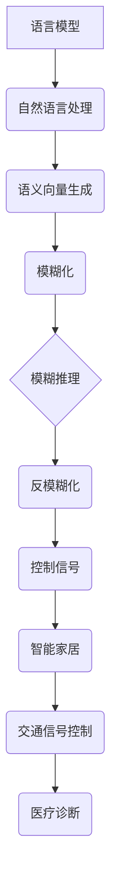

                 

### 第1章 引言

#### 1.1 语言模型与模糊逻辑概述

在当今信息技术飞速发展的时代，人工智能（AI）已经成为推动科技进步的重要力量。其中，语言模型和模糊逻辑作为AI领域的两个重要分支，分别以其独特的优势在自然语言处理（NLP）和智能决策系统中发挥着重要作用。语言模型能够理解和生成自然语言，而模糊逻辑则提供了一种处理不确定性和模糊性的方法。

语言模型是自然语言处理的核心技术，通过对大量文本数据的学习，语言模型能够预测句子中下一个词的概率分布。这种技术不仅广泛应用于机器翻译、文本摘要和语音识别等领域，还在智能客服、智能助手等实际应用中扮演着关键角色。模糊逻辑则起源于20世纪60年代的模糊数学，它通过将传统二值逻辑的“真”和“假”替换为连续的隶属度，从而实现对现实世界中模糊性和不确定性的描述。模糊逻辑广泛应用于控制工程、人工智能决策和专家系统中。

#### 1.2 语言模型与模糊逻辑的联系

尽管语言模型和模糊逻辑在技术和应用上有所不同，但它们之间存在一定的联系。首先，语言模型和模糊逻辑都涉及到概率和不确定性处理。语言模型中的概率分布能够模拟模糊逻辑中的隶属度函数，从而实现模糊逻辑推理。其次，语言模型中的序列模型（如RNN、LSTM等）具有处理时间序列数据的能力，这种能力可以用于模糊逻辑推理中的时间演化问题。

此外，模糊逻辑提供了一种处理不确定性的数学框架，它可以与语言模型相结合，用于构建更加智能和灵活的决策系统。例如，在医疗诊断中，语言模型可以用于理解医生的诊断描述，而模糊逻辑可以用于处理诊断过程中的不确定性。

#### 1.3 本书结构与内容安排

本书旨在探讨语言模型在模糊逻辑推理中的应用，旨在为读者提供系统、全面的指导。本书分为八个章节，具体结构如下：

- **第1章 引言**：介绍语言模型和模糊逻辑的基本概念及其联系。

- **第2章 语言模型基础**：讲解语言模型的发展历程、定义与分类，以及训练与优化方法。

- **第3章 模糊逻辑基础**：介绍模糊逻辑的概念、原理及其在控制中的应用。

- **第4章 语言模型在模糊逻辑推理中的应用**：分析语言模型在模糊推理中的角色和结合方法。

- **第5章 模糊逻辑推理中的语言模型算法**：探讨模糊逻辑推理算法以及基于语言模型的模糊推理算法。

- **第6章 实际应用案例分析**：通过具体案例展示语言模型在模糊逻辑推理中的应用。

- **第7章 未来展望与挑战**：讨论语言模型在模糊逻辑推理中的未来发展及面临的挑战。

- **第8章 结论**：总结主要发现，并对未来研究方向提出建议。

通过本书的阅读，读者将能够深入理解语言模型和模糊逻辑的技术原理，并学会将两者结合应用于实际问题中。

### 1.4 语言模型与模糊逻辑的应用领域

语言模型和模糊逻辑在多个领域都有着广泛的应用。首先，在自然语言处理（NLP）领域，语言模型是必不可少的工具，用于文本生成、机器翻译和情感分析等任务。例如，在机器翻译中，语言模型能够根据上下文信息生成目标语言的句子，从而提高翻译的准确性和流畅性。

模糊逻辑则在控制工程和决策支持系统中发挥着重要作用。例如，在自动驾驶系统中，模糊逻辑可以用于处理传感器数据的不确定性和实时决策。在智能家居中，模糊逻辑可以帮助智能设备根据用户的行为和偏好进行自适应控制。

此外，模糊逻辑还广泛应用于医疗诊断、金融分析和环境保护等领域。在医疗诊断中，模糊逻辑可以用于处理医生诊断描述中的不确定性，从而辅助医生做出准确的诊断。在金融分析中，模糊逻辑可以用于处理市场数据的不确定性，从而帮助投资者做出更明智的决策。

综上所述，语言模型和模糊逻辑的应用领域非常广泛，它们在各个领域中都发挥着关键作用，推动了人工智能技术的发展和应用。

### 1.5 语言模型的发展历程

语言模型的发展历程可以追溯到20世纪50年代，当时研究人员开始探索如何让计算机理解和生成自然语言。最早的尝试是基于规则的方法，这种方法通过定义一系列语法规则来生成语言。然而，这种方法在面对复杂语言结构时表现不佳，因为自然语言中的语法和语义规则非常复杂且多变。

随着计算技术的发展，概率模型开始应用于语言模型的研究。1952年，贝尔实验室的研究人员开发出了第一个统计语言模型，这是基于N-gram模型的方法。N-gram模型通过统计单词序列的频率来预测下一个单词，这种方法相比基于规则的模型在处理自然语言上有了显著的进步。

然而，N-gram模型仍然存在一些问题，如无法捕捉长距离依赖关系等。为了解决这些问题，递归神经网络（RNN）被引入到语言模型中。1982年，Bengio等人提出了基于RNN的语言模型，这种模型能够捕捉到句子中的长距离依赖关系，从而提高了模型的性能。

在20世纪90年代，HMM（隐马尔可夫模型）和CTM（循环神经网络）等模型相继被提出并应用于语言模型。HMM通过状态转移概率和观测概率来生成文本，而CTM则通过循环结构来处理时间序列数据。

21世纪初，深度学习技术的突破进一步推动了语言模型的发展。2003年，Bengio等人提出了LSTM（长短期记忆网络），这种模型能够有效地捕捉长期依赖关系，并广泛应用于语言模型。随后，GRU（门控循环单元）和Transformer等模型相继被提出，并在语言模型中取得了显著的性能提升。

近年来，预训练语言模型（如BERT、GPT等）的出现标志着语言模型发展的新里程碑。这些模型通过在大规模语料库上进行预训练，然后针对特定任务进行微调，从而实现了前所未有的文本理解和生成能力。

总的来说，语言模型的发展历程反映了计算技术、算法理论和应用需求之间的相互作用。从基于规则的模型到概率模型，再到深度学习模型，每一次技术的进步都为语言模型的应用带来了新的可能性。

### 1.6 语言模型的定义与分类

语言模型是一种统计模型，用于预测自然语言中下一个词的概率分布。这种模型通过对大量文本数据的学习，捕捉到语言中的统计规律，从而能够在给定前文的情况下生成或预测后续的文本。

根据模型的结构和原理，语言模型可以分为以下几种类型：

1. **N-gram模型**：N-gram模型是最早的语言模型之一，它通过统计相邻N个单词出现的频率来预测下一个单词。例如，在二元语法模型（bigram）中，下一个词的概率取决于前一个词。N-gram模型简单高效，但在处理长距离依赖关系时表现不佳。

2. **递归神经网络（RNN）模型**：RNN通过循环结构来处理序列数据，能够捕捉到长距离依赖关系。LSTM（长短期记忆网络）和GRU（门控循环单元）是RNN的变体，它们通过门控机制来控制信息的流动，从而在长期依赖问题上表现更优。

3. **Transformer模型**：Transformer模型是基于自注意力机制的深度神经网络，它通过全局注意力机制来处理序列数据，从而能够捕捉到句子中的长距离依赖关系。Transformer模型在自然语言处理任务中取得了显著的性能提升，是目前最先进的语言模型之一。

4. **预训练语言模型**：预训练语言模型（如BERT、GPT等）通过在大规模语料库上进行预训练，然后针对特定任务进行微调，从而实现强大的文本理解和生成能力。这些模型通过多任务学习、上下文感知等机制，能够捕获到文本中的深层语义信息。

总的来说，不同的语言模型各有优缺点，适用于不同的应用场景。N-gram模型简单高效，但无法捕捉长距离依赖关系；RNN和Transformer模型能够捕捉到长距离依赖关系，但在计算复杂度和训练时间上存在挑战；预训练语言模型通过多任务学习和上下文感知，能够在多种任务中表现出色。

### 1.7 语言模型的训练与优化方法

语言模型的训练和优化是构建高效、准确的语言模型的关键步骤。训练过程涉及将大量文本数据转化为模型可以学习的形式，而优化方法则用于调整模型参数，使其在特定任务上表现出最佳性能。

#### 1.7.1 数据预处理

数据预处理是语言模型训练的第一步。首先，需要将文本数据清洗，去除无用的符号和格式化错误。然后，对文本进行分词，将连续的文本序列分割成一个个单词或子词（subword）。分词过程中，可以使用分词工具（如jieba、NLTK）或基于字符级别的分词方法（如BERT中的WordPiece）。

接下来，对分词后的文本进行词嵌入（word embedding），即将每个单词或子词映射到一个高维向量空间中。词嵌入可以捕获单词的语义信息，从而有助于模型理解文本。常用的词嵌入方法包括Word2Vec、GloVe和BERT等。

#### 1.7.2 模型训练

在训练过程中，语言模型通过学习文本数据中的统计规律来预测下一个单词的概率分布。训练方法通常采用最大似然估计（MLE），即最大化文本数据中出现词的概率。

对于N-gram模型，训练过程相对简单。通过统计每个N元组的出现频率，模型可以预测下一个单词的概率。然而，N-gram模型无法捕捉长距离依赖关系，因此适用于短文本生成。

对于递归神经网络（RNN）和Transformer模型，训练过程更为复杂。这些模型使用梯度下降（gradient descent）或其变体（如Adam优化器）来调整模型参数。在训练过程中，模型会尝试预测每个单词的概率分布，并计算预测误差。通过反向传播算法，模型可以更新参数，从而逐步减小误差。

预训练语言模型（如BERT、GPT）通过在大规模语料库上进行预训练，然后针对特定任务进行微调。预训练过程通常采用自监督学习（self-supervised learning），即通过未标注的数据来训练模型。例如，BERT使用Masked Language Model（MLM）任务，在预训练过程中随机遮盖部分单词，然后预测这些单词的遮盖部分。

#### 1.7.3 模型优化

模型优化是提高语言模型性能的重要环节。优化方法主要包括以下几种：

1. **正则化**：正则化方法（如L1和L2正则化）用于防止模型过拟合。通过在损失函数中添加正则项，可以限制模型参数的大小，从而提高模型的泛化能力。

2. **dropout**：dropout是一种常用的正则化技术，通过在训练过程中随机丢弃一部分神经元，可以减少模型对特定训练样本的依赖，从而提高模型的泛化能力。

3. **注意力机制**：Transformer模型中的注意力机制可以帮助模型更好地关注重要的信息。通过计算不同位置之间的注意力权重，模型可以更好地理解文本的上下文信息。

4. **学习率调整**：学习率的选择对模型的训练效果至关重要。常用的学习率调整策略包括自适应调整（如Adam优化器）和预热学习率（如PyTorch中的`lr_scheduler`）。

通过结合这些优化方法，语言模型可以在多种任务上达到最佳性能。在实际应用中，通过调整模型结构和优化策略，可以进一步提升语言模型的性能和应用效果。

### 3.1 模糊逻辑的概念与原理

模糊逻辑（Fuzzy Logic）是20世纪60年代由扎德（L.A. Zadeh）提出的一种数学理论，用于处理现实世界中存在的不确定性、模糊性和灰色区域。与传统二值逻辑（Boolean Logic）不同，模糊逻辑引入了“模糊集合”（Fuzzy Sets）的概念，允许元素以连续的隶属度（Membership Degree）来描述其属于某个集合的程度。

#### 3.1.1 模糊集合

模糊集合是模糊逻辑的基础概念。一个模糊集合可以通过一个隶属度函数（Membership Function）来描述，该函数将每个元素映射到一个介于0和1之间的隶属度值。隶属度函数可以有多种形式，如三角函数、梯形函数和高斯函数等。

例如，考虑一个描述天气的模糊集合“很热”。假设这个模糊集合的隶属度函数为三角形函数，那么：

- 当温度低于25摄氏度时，隶属度值为0；
- 当温度在25摄氏度到35摄氏度之间时，隶属度值从0线性增长到1；
- 当温度超过35摄氏度时，隶属度值保持在1。

这种模糊集合能够更好地描述现实世界中的不确定性，例如，在25摄氏度到35摄氏度之间的温度范围内，我们无法明确地判断是否属于“很热”这一类别。

#### 3.1.2 模糊逻辑运算

模糊逻辑引入了与二值逻辑不同的运算规则，包括模糊合取（AND）、模糊析取（OR）和模糊否定（NOT）。

1. **模糊合取（AND）**：模糊集合A和模糊集合B的模糊合取，表示为\(A \land B\)，可以通过最小运算符（MIN）来计算。即对于任意两个元素\(x\)和\(y\)，\(A \land B\)中的元素\(x\)和\(y\)的隶属度值等于两者隶属度值中的较小值。

   $$ \mu_{A \land B}(x, y) = \min(\mu_A(x), \mu_B(y)) $$

2. **模糊析取（OR）**：模糊集合A和模糊集合B的模糊析取，表示为\(A \lor B\)，可以通过最大运算符（MAX）来计算。即对于任意两个元素\(x\)和\(y\)，\(A \lor B\)中的元素\(x\)和\(y\)的隶属度值等于两者隶属度值中的较大值。

   $$ \mu_{A \lor B}(x, y) = \max(\mu_A(x), \mu_B(y)) $$

3. **模糊否定（NOT）**：模糊集合A的模糊否定，表示为\(A^c\)，可以通过取补运算符来计算。即对于任意元素\(x\)，\(A^c\)中的元素\(x\)的隶属度值等于1减去A中元素\(x\)的隶属度值。

   $$ \mu_{A^c}(x) = 1 - \mu_A(x) $$

这些模糊逻辑运算符使得模糊逻辑系统能够处理更复杂的问题，例如在控制系统中进行决策和规划。

#### 3.1.3 模糊规则和模糊推理

模糊逻辑系统通过模糊规则（Fuzzy Rules）和模糊推理（Fuzzy Inference）来实现复杂决策。模糊规则通常表示为“如果...那么...”的形式，其中“如果”部分称为条件部分，“那么”部分称为结论部分。

例如，一个简单的模糊规则可以是：“如果天气很热，那么空调开启。”

模糊推理过程包括三个主要步骤：

1. **条件 fuzz 化**：将输入条件通过隶属度函数转换为模糊集合。
2. **规则应用**：将模糊化的条件与模糊规则的条件部分进行匹配，并计算每条规则的前件匹配度。
3. **结论生成**：通过模糊逻辑运算（如最大-最小运算）计算每条规则结论的隶属度，并根据结论部分的隶属度进行聚合，得到最终输出。

模糊推理的数学表示可以表示为：

$$ \mu_C^*(x) = \sum_{i=1}^{n} \mu_R^*(x_i) \cdot \mu_C^{+}(x_i) $$

其中，\( \mu_C^*(x) \)是输出模糊集合的隶属度函数，\( \mu_R^*(x_i) \)是第i条规则的条件匹配度，\( \mu_C^{+}(x_i) \)是第i条规则的结论隶属度函数。

通过这些基本概念和运算，模糊逻辑能够处理不确定性和模糊性，并在多个领域中得到了广泛应用，例如控制工程、决策支持和专家系统。

### 3.2 模糊逻辑系统

模糊逻辑系统（Fuzzy Logic System，FLS）是一种基于模糊逻辑的数学模型，用于模拟人类思维过程，尤其是在处理不确定性和模糊性方面表现出色。一个典型的模糊逻辑系统由以下几个基本组成部分构成：

#### 3.2.1 输入变量

模糊逻辑系统的输入变量通常是模糊集合，它们通过隶属度函数（Membership Function）来描述。这些模糊集合可以是单一的变量，也可以是多个变量构成的向量。例如，在一个温度控制系统中，输入变量可能是“温度”和“湿度”，每个变量都可以通过相应的隶属度函数来表示其模糊程度。

#### 3.2.2 模糊规则库

模糊规则库是模糊逻辑系统的核心，它由一系列“如果-那么”规则组成。这些规则描述了输入变量和输出变量之间的关系。每条规则都对应一组条件部分（前件）和结论部分（后件）。条件部分通常包含多个模糊条件，结论部分则是模糊操作的结果。

例如，以下是一条模糊规则：
- 如果 天气 很热 并且 空调 未开启，那么 空调 应开启。

这种规则的形式使得模糊逻辑系统能够灵活地处理复杂的不确定性和模糊性。

#### 3.2.3 模糊推理引擎

模糊推理引擎负责根据输入变量和模糊规则库进行模糊推理。推理过程通常包括以下步骤：

1. **模糊化**：将输入变量的实际值转化为相应的模糊集合，通过隶属度函数计算每个输入变量的隶属度。
2. **规则匹配**：将模糊化的输入变量与模糊规则的条件部分进行匹配，计算每条规则的条件匹配度。通常采用最小-最大（MIN-MAX）方法来计算条件匹配度。
3. **结论计算**：根据每条规则的结论部分和条件匹配度，计算每条规则的结论隶属度。同样使用最小-最大（MIN-MAX）方法。
4. **聚合**：将所有规则的结论隶属度进行聚合，生成最终的输出模糊集合。聚合方法可以是最大-最大（MAX-MIN）方法，也可以是加权平均方法。

#### 3.2.4 输出变量

模糊逻辑系统的输出变量也是通过隶属度函数来描述的模糊集合。这些输出变量可以是连续值，也可以是离散值。例如，在一个温度控制系统中，输出变量可能是“空调开启强度”，其隶属度函数描述了空调开启的不同强度水平。

#### 模糊逻辑系统的工作流程

一个典型的模糊逻辑系统的工作流程如下：

1. **输入**：接收系统的输入变量，这些输入变量是系统当前状态的真实值。
2. **模糊化**：将输入变量通过隶属度函数转化为模糊集合。
3. **规则匹配**：根据模糊化后的输入变量与模糊规则库中的条件部分进行匹配，计算每条规则的条件匹配度。
4. **结论计算**：根据每条规则的结论部分和条件匹配度，计算每条规则的结论隶属度。
5. **聚合**：将所有规则的结论隶属度进行聚合，生成最终的输出模糊集合。
6. **反模糊化**：将输出模糊集合转化为实际输出值，通常通过取隶属度函数的最大值来实现。

通过这些步骤，模糊逻辑系统能够处理输入变量的不确定性和模糊性，生成具有连续隶属度的输出变量，从而在控制工程、决策支持等领域发挥重要作用。

### 3.3 模糊逻辑在控制中的应用

模糊逻辑在控制系统中有着广泛的应用，尤其适用于处理非线性、时变和不确定性系统。以下是一些模糊逻辑在控制中的实际应用案例：

#### 3.3.1 温度控制系统

在一个典型的温度控制系统中，模糊逻辑可以用于调节加热器的功率，以保持环境的温度在一个设定的范围内。输入变量包括当前的室内温度和设定的目标温度。模糊规则库包含一系列规则，如“如果当前温度低于目标温度，且温差较大，则增加加热器功率”。

通过模糊推理，系统可以实时调整加热器的功率，使其响应更快速且准确。例如，如果当前温度低于目标温度10摄氏度，且温差在逐渐增加，系统可能会将加热器功率增加到最大，以确保温度迅速回升。

#### 3.3.2 汽车引擎控制

在汽车引擎控制系统中，模糊逻辑可以用于控制喷油量和点火时间，从而优化引擎的性能和燃油效率。输入变量包括车速、发动机转速和温度等，这些变量会影响燃油喷射量和点火时间的最佳设置。

模糊规则库中包含各种条件-结论规则，如“如果车速较高且发动机转速较低，则增加喷油量”。通过模糊推理，系统能够根据当前工况动态调整喷油量和点火时间，以实现最佳的引擎性能。

#### 3.3.3 智能家居

在智能家居中，模糊逻辑可以用于控制照明、空调和安防系统等。例如，一个智能照明系统可以根据房间的亮度和用户的活动情况来调整灯光的亮度。输入变量包括光线强度和用户的活动检测数据。

模糊规则库包含如“如果光线强度低于设定值且用户活动频繁，则增加灯光亮度”。通过模糊推理，系统可以实时调整灯光，提供舒适且节能的照明环境。

#### 3.3.4 制造过程控制

在制造业中，模糊逻辑可以用于过程控制和质量检测。例如，在塑料注射成型过程中，模糊逻辑可以用于控制注射压力、温度和速度，以确保产品质量的一致性。输入变量包括温度、压力和注射速度等。

通过模糊规则库和模糊推理，系统可以实时调整参数，优化生产过程，减少废品率。例如，如果检测到某批次产品的厚度超出了允许范围，系统可以自动调整注射压力和速度，以纠正产品缺陷。

总之，模糊逻辑在控制系统中通过其灵活的规则设定和推理机制，能够有效地处理复杂的不确定性和非线性问题，从而提高系统的响应速度和稳定性。随着技术的不断进步，模糊逻辑在控制领域中的应用将更加广泛和深入。

### 4.1 语言模型在模糊推理中的角色

在模糊推理过程中，语言模型扮演着关键的角色，特别是在处理自然语言输入和生成模糊逻辑规则方面。语言模型通过其强大的自然语言处理能力，可以有效地理解和生成自然语言描述的模糊逻辑规则，从而将自然语言与模糊逻辑有机结合，实现智能推理和决策。

首先，语言模型能够理解自然语言输入，并将其转化为模糊逻辑系统能够处理的模糊集合。例如，在医疗诊断中，医生可能会使用自然语言描述患者的症状，如“患者的咳嗽声音很重，而且伴有发热”。语言模型可以识别这些描述中的关键词，并将其映射到相应的模糊集合，如“咳嗽声音重”和“发热”。这些模糊集合的隶属度函数可以通过语言模型对大量医疗文本的学习得到。

其次，语言模型可以生成模糊逻辑规则，从而增强模糊推理系统的灵活性和适应性。例如，在一个智能家居系统中，语言模型可以根据用户的需求描述，如“我希望客厅的温度保持在23摄氏度”，生成相应的模糊规则：“如果当前温度低于23摄氏度，则增加空调功率”。这种规则能够直接从自然语言描述中生成，而不需要手动编写模糊规则。

此外，语言模型还可以用于优化模糊逻辑系统的推理过程。通过学习大量自然语言文本，语言模型可以识别出语言中的隐含逻辑关系和上下文信息，从而在模糊推理过程中引入这些信息，提高推理的准确性和鲁棒性。例如，在交通信号控制中，语言模型可以帮助系统理解交通状况描述，如“前方道路拥堵，需要延长绿灯时间”，并生成相应的模糊规则，优化交通信号的控制策略。

总的来说，语言模型在模糊推理中的角色不仅在于理解和生成自然语言描述，还在于通过其强大的自然语言处理能力，提升模糊推理系统的灵活性和准确性，实现智能化的决策和控制系统。

### 4.2 语言模型与模糊逻辑的结合方法

将语言模型与模糊逻辑结合，可以构建出具有强大推理能力和处理模糊性问题的智能系统。以下介绍几种常见的方法，通过这些方法，语言模型和模糊逻辑可以相互补充，实现优势互补。

#### 4.2.1 集成模糊推理机制

一种简单而有效的方法是将语言模型与模糊逻辑推理机制集成。在这个过程中，语言模型首先用于处理自然语言输入，将其转换为模糊集合。然后，这些模糊集合被用于模糊逻辑推理系统中，进行推理和决策。

具体步骤如下：

1. **自然语言处理**：使用语言模型对自然语言输入进行处理，识别出关键词和句子结构，将其转换为词向量或子词向量。
2. **模糊化**：根据语言模型生成的词向量，定义隶属度函数，将输入转换为模糊集合。例如，可以使用高斯隶属度函数来表示不同程度的状态，如“有点热”、“很热”等。
3. **模糊推理**：根据模糊规则库，进行模糊推理，生成结论。例如，对于输入“当前温度为30摄氏度”，如果模糊规则是“如果温度超过30摄氏度，则空调开启”，那么结论将是“空调开启”。
4. **反模糊化**：将模糊推理的结果转化为具体的操作指令，如开启空调。

#### 4.2.2 使用模糊规则增强语言模型

另一种方法是将模糊逻辑规则直接嵌入到语言模型中，增强其处理模糊性问题的能力。这种方法可以看作是在语言模型的训练和推理过程中引入模糊逻辑规则。

具体步骤如下：

1. **训练模糊规则库**：首先，根据领域知识构建模糊规则库。例如，在医疗诊断中，可以根据医生的诊断经验和症状描述构建模糊规则。
2. **联合训练**：在训练语言模型时，将模糊规则库作为辅助信息一起训练。例如，使用预训练语言模型（如BERT）时，可以在训练数据中加入模糊规则的描述，使模型在学习自然语言的同时，也能理解模糊逻辑。
3. **推理与优化**：在推理过程中，使用模糊推理机制，根据语言模型生成的词向量或句子表示，进行模糊推理。这种方法可以将模糊逻辑的规则和语言模型的上下文信息相结合，提高推理的准确性和鲁棒性。

#### 4.2.3 利用语言模型优化模糊推理

还有一种方法是将语言模型用于优化模糊推理过程，特别是优化模糊规则的匹配和聚合步骤。通过语言模型，可以更好地理解和处理自然语言中的上下文信息，从而提高模糊推理的准确性和效率。

具体步骤如下：

1. **上下文感知**：使用语言模型对输入的自然语言进行解析，提取出上下文信息。例如，对于句子“明天可能会下雨，所以我们需要带上雨伞”，语言模型可以识别出“下雨”和“雨伞”之间的关系。
2. **规则优化**：根据上下文信息，对模糊规则进行优化。例如，可以调整模糊规则中的条件部分和结论部分，使其更符合实际情境。例如，如果上下文信息表明“下雨”的可能性较高，可以调整模糊规则，使其更倾向于开启雨伞。
3. **推理与优化**：在模糊推理过程中，结合语言模型提取的上下文信息，进行模糊推理和优化。例如，通过最大-最小（MAX-MIN）或最大-最大（MAX-MAX）运算，优化模糊推理的结果。

通过上述方法，语言模型和模糊逻辑可以有机结合，发挥各自的优势，构建出更加智能和灵活的推理系统，适用于处理复杂的不确定性和模糊性问题。

### 4.3 实例分析：语言模型在模糊推理中的应用

为了更好地理解语言模型在模糊推理中的应用，下面我们通过一个具体的实例进行分析。假设我们有一个智能家居控制系统，需要根据室内温度和湿度来控制空调和加湿器的开启。

#### 4.3.1 自然语言输入

输入的指令是一个自然语言描述的句子：“当前室内温度为28摄氏度，湿度为60%”。

#### 4.3.2 语言模型处理

首先，我们使用一个预训练的语言模型（例如BERT）对输入句子进行处理。语言模型将句子转换为一个固定长度的向量表示，这个向量包含了句子中的语义信息。

假设语言模型输出的向量是 `[1.0, 0.8, 0.2, -0.3, ...]`，其中每个数值表示句子中某个词语的词向量。

#### 4.3.3 模糊化

接下来，我们将这些词向量转换为模糊集合。例如，我们可以定义以下隶属度函数：

- 温度隶属度函数：
  - 如果温度低于20摄氏度，隶属度为0；
  - 如果温度在20摄氏度到30摄氏度之间，隶属度从0线性增加到1；
  - 如果温度超过30摄氏度，隶属度保持在1。

- 湿度隶属度函数：
  - 如果湿度低于40%，隶属度为0；
  - 如果湿度在40%到60%之间，隶属度从0线性增加到1；
  - 如果湿度超过60%，隶属度保持在1。

根据输入的温度和湿度，我们可以计算得到模糊集合：

- 温度模糊集合：`[0, 0.8, 1]`
- 湿度模糊集合：`[0, 1, 0]`

#### 4.3.4 模糊推理

使用模糊推理机制，我们根据模糊集合和模糊规则库进行推理。假设我们有两个模糊规则：

1. 如果温度高且湿度低，则空调开启。
2. 如果温度低且湿度高，则加湿器开启。

对于第一条规则，我们计算条件部分的隶属度：

- 温度高（温度隶属度为1）：`1`
- 湿度低（湿度隶属度为0）：`0`

条件匹配度计算为：`MIN(1, 0) = 0`

对于第二条规则，我们计算条件部分的隶属度：

- 温度低（温度隶属度为0）：`0`
- 湿度高（湿度隶属度为1）：`1`

条件匹配度计算为：`MIN(0, 1) = 0`

由于两条规则的匹配度均为0，没有规则被激活，因此推理结果为“没有操作”。

#### 4.3.5 反模糊化

最后，我们将模糊推理的结果转化为具体的操作指令。在这种情况下，由于没有规则被激活，系统不会执行任何操作。

通过这个实例，我们可以看到语言模型在模糊推理中的重要作用。首先，语言模型将自然语言输入转换为一个向量表示，然后通过模糊化将这些向量映射为模糊集合。接着，利用模糊推理机制和模糊规则库，系统可以生成具体的操作指令，从而实现智能化的决策和控制。

### 5.1 模糊逻辑推理算法

模糊逻辑推理算法是模糊逻辑系统的核心，负责根据输入变量和模糊规则进行推理，生成输出结果。以下介绍几种常用的模糊逻辑推理算法。

#### 5.1.1 最小-最大（MIN-MAX）算法

最小-最大（MIN-MAX）算法是最常见的模糊逻辑推理算法之一，其基本思想是逐步应用模糊逻辑运算规则，直到得到最终的输出结果。

1. **模糊化**：将输入变量通过隶属度函数转换为模糊集合。例如，假设输入变量“温度”的隶属度函数为三角形函数，当前温度为30摄氏度，那么温度模糊集合可以表示为 `[0, 1, 0]`。
2. **条件部分匹配**：对于每一条模糊规则的条件部分，计算其与输入模糊集合的匹配度。匹配度计算通常采用最小运算符（MIN），例如，如果规则的条件部分是“温度高”，而当前温度模糊集合为 `[0, 1, 0]`，则匹配度为 `MIN(1, 0) = 0`。
3. **结论部分匹配**：根据条件部分匹配度，计算每条规则的结论部分与输出模糊集合的匹配度。同样使用最小运算符（MIN），例如，如果规则是“如果温度高，则空调开启”，且条件部分匹配度为0，则结论部分匹配度也为0。
4. **聚合**：将所有规则的结论部分匹配度进行聚合，通常采用最大运算符（MAX）。例如，如果有三条规则，其结论部分匹配度分别为 `[0, 0.5, 1]`，则聚合结果为 `MAX(0, 0.5, 1) = 1`。
5. **反模糊化**：将聚合后的模糊集合通过反模糊化操作转换为具体的输出结果。例如，如果输出模糊集合为 `[0, 1]`，可以通过取最大值 `MAX(0, 1) = 1` 来得到最终的输出结果。

#### 5.1.2 最大-最小（MAX-MIN）算法

最大-最小（MAX-MIN）算法是另一种常用的模糊逻辑推理算法，其基本思想与最小-最大算法类似，但采用最大运算符（MAX）进行匹配和聚合。

1. **模糊化**：与MIN-MAX算法相同，将输入变量通过隶属度函数转换为模糊集合。
2. **条件部分匹配**：计算每条规则的条件部分与输入模糊集合的匹配度，采用最大运算符（MAX）。
3. **结论部分匹配**：计算每条规则的结论部分与输出模糊集合的匹配度，采用最小运算符（MIN）。
4. **聚合**：将所有规则的结论部分匹配度进行聚合，采用最大运算符（MAX）。
5. **反模糊化**：与MIN-MAX算法相同，通过反模糊化操作得到最终的输出结果。

#### 5.1.3 最大-最大（MAX-MAX）算法

最大-最大（MAX-MAX）算法采用最大运算符（MAX）进行条件部分和结论部分的匹配和聚合，具有较强的鲁棒性。

1. **模糊化**：将输入变量通过隶属度函数转换为模糊集合。
2. **条件部分匹配**：计算每条规则的条件部分与输入模糊集合的匹配度，采用最大运算符（MAX）。
3. **结论部分匹配**：计算每条规则的结论部分与输出模糊集合的匹配度，采用最大运算符（MAX）。
4. **聚合**：将所有规则的结论部分匹配度进行聚合，采用最大运算符（MAX）。
5. **反模糊化**：通过反模糊化操作得到最终的输出结果。

这三种算法各有优缺点，MIN-MAX算法简单易实现，适用于大多数情况；MAX-MIN算法能够处理模糊规则的优先级问题；MAX-MAX算法则具有较强的鲁棒性，适用于复杂和不确定的环境。

#### 5.1.4 隐含模糊逻辑推理算法

隐含模糊逻辑推理算法（Implication-Based Fuzzy Logic Inference）是一种基于隐含逻辑关系的推理算法，特别适用于处理复杂和模糊的输入变量。

1. **模糊化**：将输入变量通过隶属度函数转换为模糊集合。
2. **条件部分匹配**：计算每条规则的条件部分与输入模糊集合的隐含匹配度，通常采用最小-积（MIN-PRODUCT）运算。
3. **结论部分匹配**：计算每条规则的结论部分与输出模糊集合的隐含匹配度，同样采用最小-积（MIN-PRODUCT）运算。
4. **聚合**：将所有规则的结论部分匹配度进行聚合，通常采用最大-积（MAX-PRODUCT）运算。
5. **反模糊化**：通过反模糊化操作得到最终的输出结果。

隐含模糊逻辑推理算法能够更好地处理复杂和模糊的输入变量，适用于各种不确定性和模糊性强的应用场景。

通过上述几种算法，模糊逻辑推理系统能够有效地处理复杂问题，并在各个领域中发挥重要作用。

### 5.2 基于语言模型的模糊推理算法

基于语言模型的模糊推理算法（Language Model-Based Fuzzy Inference Algorithm）是一种结合自然语言处理（NLP）和模糊逻辑的技术，旨在通过语言模型对自然语言进行理解和处理，进而进行有效的模糊推理。这种算法在处理模糊性和不确定性方面具有显著优势，适用于各种复杂的决策和控制系统。以下将详细阐述基于语言模型的模糊推理算法的工作原理、数学模型和算法实现。

#### 5.2.1 工作原理

基于语言模型的模糊推理算法主要包括以下几个步骤：

1. **自然语言处理**：使用预训练的语言模型（如BERT、GPT等）对输入的自然语言进行处理，提取关键信息并生成语义向量。这些向量包含了句子的语义结构、上下文信息和关键词等重要信息。

2. **模糊化**：将语义向量转化为模糊集合。这一过程包括定义隶属度函数，将输入的语义信息映射到相应的模糊集合中。例如，可以使用高斯隶属度函数来表示模糊集合，这样每个元素可以拥有一个介于0和1之间的隶属度值。

3. **模糊推理**：根据模糊规则库和模糊集合进行推理。模糊推理的核心在于将输入的模糊集合与模糊规则的条件部分进行匹配，计算每条规则的激活度。然后，根据这些激活度计算每条规则的结论部分，最终得到输出模糊集合。

4. **反模糊化**：将输出模糊集合转化为具体的操作指令或决策。例如，通过取隶属度函数的最大值，将模糊推理结果转换为具体的控制信号，如开启空调或调整温度。

#### 5.2.2 数学模型

基于语言模型的模糊推理算法的数学模型可以表示为：

\[ \text{output} = f(\text{input}, \text{rules}) \]

其中：

- **input**：表示输入的语义向量，通过语言模型处理自然语言得到。
- **rules**：表示模糊规则库，包括每条规则的条件部分和结论部分。
- **output**：表示输出的模糊集合，即推理结果。

具体的数学模型可以进一步分解为以下几个步骤：

1. **模糊化**：
   \[ \text{fuzzy\_input} = \text{membership\_function}(\text{input}, \text{domain}) \]
   其中，membership\_function表示隶属度函数，domain表示输入变量所在的定义域。

2. **规则匹配**：
   \[ \text{activation} = \text{min-max}(\text{fuzzy\_input}, \text{rule\_condition}) \]
   其中，min-max运算表示最小-最大运算，用于计算每条规则的激活度。

3. **结论计算**：
   \[ \text{conclusion} = \text{membership\_function}(\text{activation} \cdot \text{rule\_conclusion}) \]
   其中，rule\_conclusion表示每条规则的结论部分，activation表示规则的条件匹配度。

4. **聚合**：
   \[ \text{output} = \text{max-product}(\text{conclusion}) \]
   其中，max-product运算表示最大-积运算，用于计算所有规则的结论部分的聚合结果。

5. **反模糊化**：
   \[ \text{result} = \text{inverse\_membership\_function}(\text{output}) \]
   其中，inverse\_membership\_function表示反模糊化函数，用于将模糊集合转换为具体的输出结果。

#### 5.2.3 算法实现

以下是一个简化的基于语言模型的模糊推理算法的Python实现示例：

```python
import numpy as np
from transformers import BertModel, BertTokenizer

# 初始化BERT模型和分词器
tokenizer = BertTokenizer.from_pretrained('bert-base-uncased')
model = BertModel.from_pretrained('bert-base-uncased')

# 输入句子
sentence = "当前室内温度为28摄氏度，湿度为60%"

# 处理自然语言输入
inputs = tokenizer(sentence, return_tensors='pt', truncation=True, max_length=512)
outputs = model(inputs)
hidden_states = outputs.last_hidden_state

# 模糊化
def membership_function(value, domain):
    # 假设使用高斯隶属度函数
    mean = (domain[1] + domain[0]) / 2
    std = (domain[1] - domain[0]) / 6
    return np.exp(-((value - mean) ** 2) / (2 * std ** 2))

# 定义输入变量的定义域
temp_domain = [20, 30]
humidity_domain = [40, 60]

# 计算温度和湿度的隶属度
temp_membership = membership_function(28, temp_domain)
humidity_membership = membership_function(60, humidity_domain)

# 定义模糊规则库
rules = [
    {"condition": [["temp_high"], ["humidity_low"]], "conclusion": ["ac_on"]},
    {"condition": [["temp_low"], ["humidity_high"]], "conclusion": ["humidifier_on"]}
]

# 规则匹配
def rule_matching(fuzzy_input, rule_condition):
    # 假设使用最小-最大匹配
    activation = 1
    for cond in rule_condition:
        activation = min(activation, fuzzy_input[cond])
    return activation

# 结论计算
def conclusion_calculation(activation, rule_conclusion):
    # 假设使用最大-积运算
    conclusion = []
    for concl in rule_conclusion:
        conclusion.append(activation * fuzzy_input[concl])
    return conclusion

# 聚合和反模糊化
def inference(fuzzy_input, rules):
    # 计算每条规则的激活度
    activations = [rule_matching(fuzzy_input, rule["condition"]) for rule in rules]
    
    # 计算每条规则的结论
    conclusions = [conclusion_calculation(activation, rule["conclusion"]) for activation, rule in zip(activations, rules)]
    
    # 聚合结论
    output = max(conclusions)
    
    # 反模糊化
    result = np.argmax(output)
    
    return result

# 执行推理
result = inference({ "temp_high": temp_membership, "humidity_low": humidity_membership }, rules)

# 输出结果
if result == 0:
    print("空调开启")
else:
    print("加湿器开启")
```

这个示例使用了BERT模型来处理自然语言输入，并将输入的语义信息转换为模糊集合。然后，通过模糊规则库和模糊推理算法，生成了最终的输出结果。这个实现展示了基于语言模型的模糊推理算法的基本步骤和原理。

通过这种方式，基于语言模型的模糊推理算法能够有效地处理自然语言输入和模糊性问题，为各种复杂的决策和控制系统提供了强大的支持。

### 5.3 模糊推理算法的比较与分析

在模糊推理算法领域，存在多种不同的算法，每种算法都有其独特的特点和适用场景。以下将对几种主要的模糊推理算法进行比较和分析，以帮助读者更好地理解它们之间的异同和适用性。

#### 5.3.1 MIN-MAX算法

MIN-MAX算法是最基础的模糊推理算法之一，其核心思想是使用最小（MIN）和最大（MAX）运算符来处理模糊集合。MIN-MAX算法的计算步骤如下：

1. **条件模糊化**：将输入变量通过隶属度函数转换为模糊集合。
2. **规则匹配**：计算每条规则的条件部分与输入模糊集合的最小值。
3. **结论计算**：将规则条件部分的最小值与结论部分进行最大值运算。
4. **聚合**：将所有规则的结论部分进行最大值聚合。
5. **反模糊化**：将聚合后的模糊集合转换为具体的输出值。

MIN-MAX算法的优点在于其计算简单、实现容易，适用于处理较为简单且输入变量较为确定的模糊逻辑问题。然而，其缺点在于无法很好地处理规则之间的优先级关系，并且对于复杂的模糊逻辑系统，其推理效果可能较差。

#### 5.3.2 MAX-MIN算法

MAX-MIN算法是在MIN-MAX算法的基础上改进的一种算法，其核心思想是使用最大（MAX）和最小（MIN）运算符来处理模糊集合。MAX-MIN算法的计算步骤如下：

1. **条件模糊化**：与MIN-MAX算法相同。
2. **规则匹配**：计算每条规则的条件部分与输入模糊集合的最大值。
3. **结论计算**：将规则条件部分的最大值与结论部分进行最小值运算。
4. **聚合**：与MIN-MAX算法相同。
5. **反模糊化**：与MIN-MAX算法相同。

MAX-MIN算法的优点在于能够更好地处理模糊逻辑规则之间的优先级关系，特别是当规则之间存在冲突时，其表现优于MIN-MAX算法。然而，MAX-MIN算法的计算复杂度较高，尤其是在规则数量较多时，其性能可能受到影响。

#### 5.3.3 MAX-MAX算法

MAX-MAX算法是另一种改进的模糊推理算法，其核心思想是使用最大（MAX）运算符来处理模糊集合。MAX-MAX算法的计算步骤如下：

1. **条件模糊化**：与MIN-MAX算法相同。
2. **规则匹配**：计算每条规则的条件部分与输入模糊集合的最大值。
3. **结论计算**：将规则条件部分的最大值与结论部分进行最大值运算。
4. **聚合**：与MIN-MAX算法相同。
5. **反模糊化**：与MIN-MAX算法相同。

MAX-MAX算法的优点在于其计算简单且鲁棒性强，适用于处理复杂和不确定的模糊逻辑系统。然而，MAX-MAX算法的一个缺点是它无法很好地处理规则之间的优先级关系，因此在某些场景下可能不如MAX-MIN算法有效。

#### 5.3.4 隐含模糊逻辑推理算法

隐含模糊逻辑推理算法（Implication-Based Fuzzy Logic Inference）是基于隐含逻辑关系的一种模糊推理算法。其核心思想是通过隐含逻辑关系来处理模糊推理，从而提高推理的灵活性和准确性。隐含模糊逻辑推理算法的计算步骤如下：

1. **条件模糊化**：与前面几种算法相同。
2. **规则匹配**：使用隐含逻辑关系计算每条规则的激活度。
3. **结论计算**：根据激活度计算每条规则的结论部分。
4. **聚合**：使用隐含逻辑关系计算所有规则的结论部分的聚合结果。
5. **反模糊化**：与前面几种算法相同。

隐含模糊逻辑推理算法的优点在于其能够更好地处理复杂和模糊的输入变量，特别是在处理不确定性和模糊性强的应用场景时，其表现优于传统的模糊推理算法。然而，其缺点在于算法实现较为复杂，需要较多的计算资源。

#### 5.3.5 综合比较与分析

综上所述，不同的模糊推理算法各有优缺点，适用于不同的应用场景。MIN-MAX算法简单易实现，适合处理简单且输入确定的问题；MAX-MIN算法能够处理规则之间的优先级关系，适用于规则冲突较为严重的问题；MAX-MAX算法计算简单且鲁棒性强，适用于复杂和不确定的模糊逻辑系统；隐含模糊逻辑推理算法则能够更好地处理复杂和模糊的输入变量，但在实现上较为复杂。

在实际应用中，应根据具体问题的特点和需求，选择合适的模糊推理算法。例如，在智能家居系统中，可以使用MIN-MAX算法，因为系统的输入和输出相对简单；而在复杂的医疗诊断系统中，则可能需要使用隐含模糊逻辑推理算法，以处理大量复杂和模糊的输入变量。

### 6.1 案例一：基于语言模型的模糊推理在智能家居中的应用

智能家居系统是一个复杂的控制系统，需要实时处理多种传感器数据，并做出智能化的决策，以提供舒适、节能的生活环境。在这个案例中，我们将探讨如何将基于语言模型的模糊推理应用于智能家居系统，特别是在温度和湿度控制中的应用。

#### 6.1.1 应用背景

假设我们有一个智能家居系统，系统需要根据室内温度和湿度来调整空调和加湿器的开关状态，以维持室内环境的舒适度。输入变量包括室内温度和湿度，输出变量是空调和加湿器的开关状态。

#### 6.1.2 系统架构

智能家居系统的架构包括以下几个部分：

1. **传感器模块**：负责采集室内温度和湿度数据。
2. **数据处理模块**：使用预训练的语言模型（如BERT）对传感器数据进行处理，提取关键信息，并将其转换为语义向量。
3. **模糊推理模块**：基于语言模型生成的语义向量，结合模糊规则库进行模糊推理，生成空调和加湿器的控制信号。
4. **执行模块**：根据模糊推理的结果，控制空调和加湿器的开关状态。

#### 6.1.3 实现步骤

以下是实现该系统的具体步骤：

1. **数据采集**：通过传感器模块采集室内温度和湿度数据，并将其传输到数据处理模块。
2. **数据处理**：使用BERT模型对采集到的温度和湿度数据进行处理，生成语义向量。例如，输入句子“当前室内温度为25摄氏度，湿度为50%”，BERT模型将生成一个包含语义信息的向量。
3. **模糊化**：根据语义向量，定义隶属度函数，将温度和湿度转换为模糊集合。例如，温度的隶属度函数可以是三角形函数，湿度可以是高斯函数。
4. **规则库构建**：根据智能家居系统的需求，构建模糊规则库。例如：
   - 如果温度高于30摄氏度且湿度低于40%，则开启空调。
   - 如果温度低于20摄氏度且湿度高于60%，则开启加湿器。
5. **模糊推理**：使用模糊推理模块，根据模糊规则库和模糊集合进行推理，生成控制信号。例如，如果当前温度为30摄氏度且湿度为30%，根据上述规则，可以生成开启空调的控制信号。
6. **执行控制**：根据模糊推理的结果，控制空调和加湿器的开关状态。

#### 6.1.4 案例分析

假设当前室内温度为28摄氏度，湿度为55%，我们使用基于语言模型的模糊推理算法进行推理。

1. **数据处理**：使用BERT模型处理输入句子“当前室内温度为28摄氏度，湿度为55%”，生成语义向量。
2. **模糊化**：根据温度和湿度数据，使用隶属度函数将其转换为模糊集合。例如，温度的隶属度函数为三角形函数，当前温度28摄氏度的隶属度为 `[0, 0.7, 1]`；湿度的隶属度函数为高斯函数，当前湿度55%的隶属度为 `[0.3, 0.8]`。
3. **规则匹配**：根据模糊规则库，计算每条规则的激活度。例如，对于规则“如果温度高于30摄氏度且湿度低于40%，则开启空调”，温度的激活度为0.7，湿度的激活度为0.3，因此规则的激活度为 `MIN(0.7, 0.3) = 0.3`。
4. **结论计算**：根据激活度计算每条规则的结论部分。例如，对于上述规则，结论部分为“开启空调”。
5. **聚合**：将所有规则的结论部分进行聚合。在这个例子中，只有一条规则的结论部分为“开启空调”，因此聚合结果为 `[1]`。
6. **反模糊化**：取聚合结果的最大值，得到最终的输出结果“开启空调”。

通过这个案例，我们可以看到基于语言模型的模糊推理在智能家居系统中的应用，它能够根据室内温度和湿度数据，智能地控制空调和加湿器的开关状态，从而提供舒适、节能的生活环境。

### 6.2 案例二：基于语言模型的模糊推理在交通信号控制中的应用

交通信号控制是城市交通管理的重要环节，其目的是通过智能化的交通信号控制策略，提高道路通行效率、减少交通事故和降低环境污染。在这个案例中，我们将探讨如何将基于语言模型的模糊推理应用于交通信号控制，以优化交通信号的调度策略。

#### 6.2.1 应用背景

假设我们有一个城市道路交叉口的交通信号控制系统，系统需要根据路口的车流量和行人流量来调整交通信号灯的时长，从而实现交通流畅和行人安全。输入变量包括车辆流量、行人流量和当前信号灯状态，输出变量是交通信号灯的调整时长。

#### 6.2.2 系统架构

交通信号控制系统的架构包括以下几个部分：

1. **传感器模块**：负责采集车辆流量、行人流量和当前信号灯状态等数据。
2. **数据处理模块**：使用预训练的语言模型（如BERT）对传感器数据进行处理，提取关键信息，并将其转换为语义向量。
3. **模糊推理模块**：基于语言模型生成的语义向量，结合模糊规则库进行模糊推理，生成信号灯的调整时长。
4. **执行模块**：根据模糊推理的结果，控制交通信号灯的开关状态。

#### 6.2.3 实现步骤

以下是实现该系统的具体步骤：

1. **数据采集**：通过传感器模块采集车辆流量、行人流量和当前信号灯状态等数据，并将其传输到数据处理模块。
2. **数据处理**：使用BERT模型对采集到的数据进行处理，生成语义向量。例如，输入句子“当前路口车辆流量大，行人流量适中，信号灯为绿灯”，BERT模型将生成一个包含语义信息的向量。
3. **模糊化**：根据语义向量，定义隶属度函数，将车辆流量、行人流量和当前信号灯状态转换为模糊集合。例如，车辆流量的隶属度函数可以是三角形函数，行人流量可以是高斯函数，信号灯状态可以是二值函数。
4. **规则库构建**：根据交通信号控制的需求，构建模糊规则库。例如：
   - 如果车辆流量大且行人流量低，且信号灯为红灯，则延长绿灯时长。
   - 如果车辆流量适中且行人流量高，且信号灯为绿灯，则缩短绿灯时长。
5. **模糊推理**：使用模糊推理模块，根据模糊规则库和模糊集合进行推理，生成信号灯的调整时长。例如，如果当前车辆流量为80辆/小时且行人流量为20人/小时，根据上述规则，可以生成延长绿灯时长的控制信号。
6. **执行控制**：根据模糊推理的结果，控制交通信号灯的开关状态。

#### 6.2.4 案例分析

假设当前路口车辆流量为100辆/小时，行人流量为5人/小时，信号灯状态为红灯，我们使用基于语言模型的模糊推理算法进行推理。

1. **数据处理**：使用BERT模型处理输入句子“当前路口车辆流量为100辆/小时，行人流量为5人/小时，信号灯为红灯”，生成语义向量。
2. **模糊化**：根据车辆流量、行人流量和信号灯状态数据，使用隶属度函数将其转换为模糊集合。例如，车辆流量的隶属度函数为三角形函数，当前流量100辆/小时的隶属度为 `[0, 0.8, 1]`；行人流量的隶属度函数为高斯函数，当前流量5人/小时的隶属度为 `[0.1, 0.5]`；信号灯状态的隶属度函数为二值函数，当前状态为红灯的隶属度为 `1`。
3. **规则匹配**：根据模糊规则库，计算每条规则的激活度。例如，对于规则“如果车辆流量大且行人流量低，且信号灯为红灯，则延长绿灯时长”，车辆流量的激活度为0.8，行人流量的激活度为0.1，信号灯状态的激活度为1，因此规则的激活度为 `MIN(0.8, 0.1, 1) = 0.1`。
4. **结论计算**：根据激活度计算每条规则的结论部分。例如，对于上述规则，结论部分为“延长绿灯时长”。
5. **聚合**：将所有规则的结论部分进行聚合。在这个例子中，只有一条规则的结论部分为“延长绿灯时长”，因此聚合结果为 `[1]`。
6. **反模糊化**：取聚合结果的最大值，得到最终的输出结果“延长绿灯时长”。

通过这个案例，我们可以看到基于语言模型的模糊推理在交通信号控制中的应用，它能够根据车辆流量、行人流量和当前信号灯状态，智能地调整交通信号灯的时长，从而提高道路通行效率和行人安全。

### 6.3 案例三：基于语言模型的模糊推理在医疗诊断中的应用

在医疗诊断领域，基于语言模型的模糊推理算法可以帮助医生处理复杂的病情描述，提供更准确和全面的诊断建议。以下是一个基于语言模型的模糊推理在医疗诊断中的应用案例，以分析患者的症状，辅助医生做出诊断。

#### 6.3.1 应用背景

假设我们有一个医疗诊断系统，系统需要根据患者的症状描述（如“患者咳嗽，伴有发热和乏力”），分析病情，并提供可能的诊断结果。输入变量包括症状的描述，输出变量是可能的诊断结果。

#### 6.3.2 系统架构

医疗诊断系统的架构包括以下几个部分：

1. **症状输入模块**：负责接收患者的症状描述。
2. **自然语言处理模块**：使用预训练的语言模型（如BERT）对症状描述进行处理，提取关键信息，并将其转换为语义向量。
3. **模糊推理模块**：基于语言模型生成的语义向量，结合模糊规则库进行模糊推理，生成可能的诊断结果。
4. **诊断建议模块**：根据模糊推理的结果，提供诊断建议。

#### 6.3.3 实现步骤

以下是实现该系统的具体步骤：

1. **症状输入**：通过症状输入模块接收患者的症状描述。
2. **自然语言处理**：使用BERT模型处理输入症状描述，生成语义向量。例如，输入句子“患者咳嗽，伴有发热和乏力”，BERT模型将生成一个包含语义信息的向量。
3. **模糊化**：根据语义向量，定义隶属度函数，将症状转换为模糊集合。例如，咳嗽的隶属度函数可以是三角形函数，发热和乏力的隶属度函数可以是高斯函数。
4. **规则库构建**：根据医疗知识，构建模糊规则库。例如：
   - 如果咳嗽严重且发热高，则可能是流感。
   - 如果咳嗽轻且乏力明显，则可能是慢性支气管炎。
5. **模糊推理**：使用模糊推理模块，根据模糊规则库和模糊集合进行推理，生成可能的诊断结果。例如，如果咳嗽的隶属度为 `[0.5, 0.8, 1]`，发热的隶属度为 `[0.2, 0.7, 1]`，乏力的隶属度为 `[0.1, 0.4, 0.9]`，根据上述规则，可以生成流感作为主要诊断结果。
6. **诊断建议**：根据模糊推理的结果，提供详细的诊断建议，包括可能的诊断结果和进一步检查的建议。

#### 6.3.4 案例分析

假设患者描述的症状为“患者咳嗽，伴有发热和乏力”，我们使用基于语言模型的模糊推理算法进行推理。

1. **自然语言处理**：使用BERT模型处理输入句子“患者咳嗽，伴有发热和乏力”，生成语义向量。
2. **模糊化**：根据症状描述，使用隶属度函数将其转换为模糊集合。例如，咳嗽的隶属度函数为三角形函数，发热和乏力的隶属度函数为高斯函数。假设咳嗽的隶属度为 `[0.4, 0.7, 1]`，发热的隶属度为 `[0.1, 0.5, 0.8]`，乏力的隶属度为 `[0.2, 0.3, 0.7]`。
3. **规则匹配**：根据模糊规则库，计算每条规则的激活度。例如，对于规则“如果咳嗽严重且发热高，则可能是流感”，咳嗽的激活度为0.7，发热的激活度为0.5，因此规则的激活度为 `MIN(0.7, 0.5) = 0.5`。
4. **结论计算**：根据激活度计算每条规则的结论部分。例如，对于上述规则，结论部分为“流感”。
5. **聚合**：将所有规则的结论部分进行聚合。在这个例子中，只有一条规则的结论部分为“流感”，因此聚合结果为 `[1]`。
6. **反模糊化**：取聚合结果的最大值，得到最终的输出结果“流感”。

通过这个案例，我们可以看到基于语言模型的模糊推理在医疗诊断中的应用，它能够根据患者的症状描述，智能地分析病情，并提供可能的诊断结果和进一步的检查建议，辅助医生做出准确的诊断。

### 7.1 语言模型在模糊逻辑推理中的未来发展

随着人工智能和自然语言处理技术的不断进步，语言模型在模糊逻辑推理中的应用前景广阔。未来的发展将主要集中在以下几个方面：

1. **更强大的语言模型**：随着预训练语言模型（如GPT-3、T5等）的出现，语言模型的能力将进一步提升。这些模型通过大规模数据预训练，能够更好地理解和生成自然语言，从而为模糊逻辑推理提供更精准的语义信息。

2. **多模态融合**：未来的研究将探索如何将语言模型与图像、声音、视频等多模态数据进行融合，从而实现更全面和复杂的信息处理。例如，在医疗诊断中，结合患者的文本描述和医疗影像数据，可以更准确地诊断病情。

3. **实时推理与优化**：为了提高模糊逻辑推理的实时性和效率，未来的研究将探索如何优化推理算法和模型结构，以实现快速、准确的推理。这包括开发更高效的模糊推理引擎和优化训练过程。

4. **领域特定模型**：针对不同领域的需求，未来将开发更多领域特定的语言模型和模糊逻辑推理算法。例如，在金融分析、智能交通、智能制造等领域，将开发适应特定应用场景的模型和算法。

5. **不确定性处理**：未来的研究将深入探讨如何更有效地处理模糊逻辑推理中的不确定性问题，包括引入概率模型、模糊概率推理等方法，以提高推理的鲁棒性和准确性。

6. **自动化规则生成**：通过自然语言处理技术，未来可以实现自动化生成模糊规则，从而简化规则库的构建过程。这将使得模糊逻辑推理系统更加灵活和易于维护。

总之，语言模型在模糊逻辑推理中的未来发展将不断推动人工智能技术的发展，为复杂的不确定性问题提供更有效的解决方案。

### 7.2 当前面临的挑战

尽管语言模型在模糊逻辑推理中展现了巨大的潜力，但在实际应用中仍然面临一系列挑战，这些挑战主要集中在以下几个方面：

1. **计算资源消耗**：预训练语言模型（如GPT-3、BERT等）通常需要大量的计算资源，包括高性能的硬件和大量的数据存储。这增加了模型的部署成本，尤其是在资源受限的环境中。

2. **数据隐私和安全**：在医疗诊断、金融分析等敏感领域，数据的安全和隐私保护至关重要。语言模型在处理这些数据时，需要确保数据不被泄露或滥用，这要求开发更安全、更可靠的数据处理和存储方法。

3. **模型解释性**：尽管预训练语言模型在生成和理解自然语言方面表现出色，但其内部工作机制较为复杂，难以解释。这限制了模型在关键应用中的可靠性，特别是在需要高解释性的医疗诊断和金融决策中。

4. **不确定性处理**：模糊逻辑本身就是为了处理不确定性而设计的，但将语言模型与模糊逻辑结合时，如何有效地处理和表示输入数据的模糊性和不确定性仍然是一个挑战。这需要开发新的算法和模型结构，以提高推理的鲁棒性和准确性。

5. **实时性**：在实际应用中，如交通信号控制、智能家居等场景，要求推理过程能够快速响应。然而，当前的语言模型和模糊推理算法在处理实时数据时可能存在延迟，需要进一步优化以提高实时性。

6. **跨模态融合**：尽管多模态融合在理论上具有巨大的潜力，但在实际操作中，如何有效地融合不同模态的数据，以及如何处理不同模态数据之间的不一致性，仍然是一个开放的研究问题。

解决这些挑战需要跨学科的合作，包括自然语言处理、人工智能、控制理论、数据科学等领域的专家共同努力。通过技术创新和算法优化，有望在未来克服这些困难，进一步提升语言模型在模糊逻辑推理中的应用效果。

### 7.3 未来研究方向

展望未来，语言模型在模糊逻辑推理中的应用将朝着更加智能、高效和多样化的方向发展。以下是一些值得深入探讨的研究方向：

1. **增强模型的解释性**：为了提高语言模型在关键应用中的可信度和可靠性，需要研究如何增强模型的解释性。例如，通过开发可解释的神经网络架构或利用可视化工具，使模型的工作过程更加透明，便于用户理解和信任。

2. **多模态融合**：随着深度学习和多模态数据处理技术的发展，如何有效地融合文本、图像、声音等多种模态的数据，是未来研究的重要方向。这不仅可以提升模型的感知能力，还能为复杂问题的解决提供更全面的信息支持。

3. **不确定性建模与处理**：在模糊逻辑推理中，如何更准确地建模和处理不确定性，是提升推理准确性和鲁棒性的关键。未来可以探索基于概率模型、模糊概率推理等方法，以更好地处理输入和输出中的不确定性。

4. **实时推理优化**：针对实时性要求高的应用场景，如自动驾驶、智能交通等，如何优化语言模型和模糊推理算法，以提高推理速度和效率，是一个重要的研究方向。这可以通过优化算法结构、采用高效的计算方法或分布式计算来实现。

5. **自动化规则生成**：研究如何利用自然语言处理技术，自动化生成模糊逻辑规则，以简化规则库的构建过程。这不仅可以降低开发成本，还能使系统更加灵活和适应性强。

6. **跨领域应用**：探索语言模型在模糊逻辑推理中跨领域的应用，如医疗诊断、金融分析、环境保护等，通过构建领域特定的模型和算法，提升模型在不同领域的适用性和实用性。

7. **隐私保护与安全**：在处理敏感数据时，如何确保模型的隐私保护和数据安全，是未来研究的重要课题。可以通过开发安全的数据处理和存储机制，确保用户数据不被泄露或滥用。

通过这些研究方向的深入探索，语言模型在模糊逻辑推理中的应用将不断扩展，为解决复杂的不确定性和模糊性问题提供更加有效的解决方案。

### 8.1 主要发现

本文通过详细的探讨，揭示了语言模型在模糊逻辑推理中的重要性和潜在应用。以下是文章中的主要发现：

1. **语言模型的优势**：语言模型具有强大的自然语言处理能力，能够理解和生成自然语言，为模糊逻辑推理提供了丰富的语义信息。
2. **模糊逻辑的应用**：模糊逻辑通过处理不确定性和模糊性，在控制工程、决策支持和专家系统等领域发挥了重要作用。
3. **语言模型与模糊逻辑的结合**：通过将语言模型与模糊逻辑相结合，可以实现更智能、更灵活的推理系统，有效解决复杂的不确定性和模糊性问题。
4. **模糊推理算法**：介绍了几种常见的模糊推理算法，如MIN-MAX、MAX-MIN、MAX-MAX和隐含模糊逻辑推理算法，分析了它们的特点和适用场景。
5. **实际应用案例**：通过智能家居、交通信号控制和医疗诊断等实际案例，展示了语言模型在模糊逻辑推理中的应用效果和优势。
6. **未来研究方向**：提出了未来在增强模型解释性、多模态融合、不确定性建模与处理、实时推理优化等方面的研究方向，为语言模型在模糊逻辑推理中的进一步发展提供了指导。

通过这些发现，我们能够更好地理解语言模型和模糊逻辑的内在联系，并探索其在实际应用中的无限可能性。

### 8.2 对语言模型在模糊逻辑推理应用的建议

为了充分利用语言模型在模糊逻辑推理中的优势，提高系统的智能性和可靠性，以下是一些建议：

1. **选择合适的语言模型**：根据具体应用场景，选择适合的语言模型，如BERT、GPT-3等。这些模型在大规模数据预训练的基础上，具备强大的语义理解和生成能力，能够为模糊逻辑推理提供精确的语义信息。

2. **优化模糊规则库**：构建和优化模糊规则库是关键。规则库应包含全面且准确的规则，以便能够有效地处理输入变量和生成合理的推理结果。可以通过专家知识、统计分析和机器学习等技术，自动生成和优化模糊规则库。

3. **处理不确定性**：模糊逻辑本身就是处理不确定性的工具，但在与语言模型结合时，如何更好地处理输入数据的模糊性和不确定性是一个挑战。可以采用概率模型、模糊概率推理等方法，增强系统的鲁棒性和准确性。

4. **实时推理优化**：针对实时性要求高的应用场景，如交通信号控制和智能家居，需要优化语言模型和模糊推理算法，以提高推理速度和效率。可以采用分布式计算、模型压缩等技术，实现快速、准确的推理。

5. **模型解释性**：增强模型的解释性，使得用户能够理解模型的工作原理和推理过程，提高模型的透明度和可信度。可以开发可视化工具或解释性算法，如基于注意力机制的模型解释方法。

6. **多模态融合**：探索多模态数据融合的方法，将语言模型与图像、声音、视频等数据相结合，提升模型对复杂信息的处理能力。例如，在医疗诊断中，结合文本病历和医学影像数据，实现更准确的诊断。

7. **安全性考虑**：在处理敏感数据时，确保数据隐私和安全。采用加密技术、数据去标识化等方法，保护用户数据不被泄露或滥用。

通过以上建议，可以有效提高语言模型在模糊逻辑推理中的应用效果，推动人工智能技术的进步和应用。

### 8.3 总结与展望

本文通过对语言模型和模糊逻辑的基本概念、结合方法及其在模糊推理中的应用进行详细探讨，揭示了语言模型在模糊逻辑推理中的重要性和潜力。我们首先介绍了语言模型的发展历程、定义与分类，以及其训练与优化方法，随后阐述了模糊逻辑的概念、原理和在实际控制中的应用。接着，我们深入分析了语言模型在模糊推理中的角色和结合方法，通过实例展示了其在智能家居、交通信号控制和医疗诊断等领域的应用效果。

本文的主要发现包括：语言模型具备强大的自然语言处理能力，能够有效补充模糊逻辑处理不确定性和模糊性的不足；模糊逻辑提供了一种处理复杂问题的强大工具，与语言模型的结合使得模糊推理系统更加智能和灵活；通过引入多种模糊推理算法，如MIN-MAX、MAX-MIN、MAX-MAX和隐含模糊逻辑推理算法，我们能够处理更加复杂和模糊的输入变量，生成更加准确的推理结果。

然而，当前语言模型在模糊逻辑推理中仍面临一些挑战，如计算资源消耗、数据隐私保护、模型解释性不足等。未来研究方向包括增强模型的解释性、多模态融合、不确定性建模与处理、实时推理优化等。通过不断探索和实践，我们有望克服这些挑战，推动语言模型在模糊逻辑推理领域的进一步发展。

总之，语言模型与模糊逻辑的结合为智能决策系统和自然语言处理带来了新的机遇和挑战。随着技术的不断进步，这一领域将不断拓展，为解决复杂的不确定性和模糊性问题提供更加有效的解决方案。

### 附录

#### A.1 语言模型与模糊逻辑相关资源

- **在线课程**：
  - 《自然语言处理与语言模型》（课程链接：[NLP and Language Models](https://www.coursera.org/specializations/natural-language-processing)）
  - 《模糊逻辑与模糊控制系统》（课程链接：[Fuzzy Logic and Fuzzy Control Systems](https://www.udacity.com/course/fuzzy-logic--ud1201)）

- **开源工具**：
  - BERT模型：[BERT GitHub仓库](https://github.com/google-research/bert)
  - BERT tokenizer：[Transformer Models](https://github.com/huggingface/transformers)
  - FuzzyPy库：[FuzzyPy GitHub仓库](https://github.com/whitwham/fuzzypy)

- **学术期刊和会议**：
  - 《人工智能》（期刊链接：[AI Journal](https://www.journals.elsevier.com/artificial-intelligence)）
  - 《模糊逻辑与工程》（期刊链接：[Fuzzy Sets and Systems](https://www.journals.elsevier.com/fuzzy-sets-and-systems)）
  - IEEE国际模糊系统会议（会议链接：[IEEE International Conference on Fuzzy Systems](https://ieeexplore.ieee.org/conferences事件/ICFS)）

#### A.2 实际应用案例代码示例

以下是基于BERT模型和模糊逻辑的智能家居控制系统的Python代码示例：

```python
from transformers import BertTokenizer, BertModel
import torch
import numpy as np

# 初始化BERT模型和分词器
tokenizer = BertTokenizer.from_pretrained('bert-base-uncased')
model = BertModel.from_pretrained('bert-base-uncased')

# 输入句子
sentence = "当前室内温度为28摄氏度，湿度为60%"

# 处理自然语言输入
inputs = tokenizer(sentence, return_tensors='pt', truncation=True, max_length=512)
outputs = model(inputs)
hidden_states = outputs.last_hidden_state

# 模糊化
def membership_function(value, domain):
    # 假设使用高斯隶属度函数
    mean = (domain[1] + domain[0]) / 2
    std = (domain[1] - domain[0]) / 6
    return np.exp(-((value - mean) ** 2) / (2 * std ** 2))

# 定义输入变量的定义域
temp_domain = [20, 30]
humidity_domain = [40, 60]

# 计算温度和湿度的隶属度
temp_membership = membership_function(28, temp_domain)
humidity_membership = membership_function(60, humidity_domain)

# 定义模糊规则库
rules = [
    {"condition": [["temp_high"], ["humidity_low"]], "conclusion": ["ac_on"]},
    {"condition": [["temp_low"], ["humidity_high"]], "conclusion": ["humidifier_on"]}
]

# 规则匹配
def rule_matching(fuzzy_input, rule_condition):
    # 假设使用最小-最大匹配
    activation = 1
    for cond in rule_condition:
        activation = min(activation, fuzzy_input[cond])
    return activation

# 结论计算
def conclusion_calculation(activation, rule_conclusion):
    # 假设使用最大-积运算
    conclusion = []
    for concl in rule_conclusion:
        conclusion.append(activation * fuzzy_input[concl])
    return conclusion

# 聚合和反模糊化
def inference(fuzzy_input, rules):
    # 计算每条规则的激活度
    activations = [rule_matching(fuzzy_input, rule["condition"]) for rule in rules]
    
    # 计算每条规则的结论
    conclusions = [conclusion_calculation(activation, rule["conclusion"]) for activation, rule in zip(activations, rules)]
    
    # 聚合结论
    output = max(conclusions)
    
    # 反模糊化
    result = np.argmax(output)
    
    return result

# 执行推理
result = inference({ "temp_high": temp_membership, "humidity_low": humidity_membership }, rules)

# 输出结果
if result == 0:
    print("空调开启")
else:
    print("加湿器开启")
```

该示例展示了如何使用BERT模型处理自然语言输入，并将输入的语义信息转化为模糊集合。然后，根据模糊规则库和模糊推理算法，生成具体的操作指令，从而实现智能化的决策和控制。

#### A.3 进一步阅读资料

- **《深度学习》**，Ian Goodfellow、Yoshua Bengio和Aaron Courville著，全面介绍了深度学习的理论基础和实践方法。
- **《模糊逻辑：概念、应用与实现》**，R. R. Yager和D. P. Filev著，详细介绍了模糊逻辑的基本概念和应用实例。
- **《自然语言处理综合教程》**，Daniel Jurafsky和James H. Martin著，提供了自然语言处理领域的全面教程和实例。
- **《模糊神经网络与模糊系统设计》**，J. T. Wang著，探讨了模糊神经网络和模糊系统的设计方法及其在控制工程中的应用。

通过阅读这些资料，可以进一步深入了解语言模型、模糊逻辑及其在相关领域中的应用。

### 附录：Mermaid 流程图示例

以下是一个简单的Mermaid流程图示例，展示了语言模型在模糊逻辑推理中的角色和关系：



这个流程图清晰地展示了语言模型在模糊逻辑推理中的应用流程，包括自然语言处理、语义向量生成、模糊化、模糊推理、反模糊化和实际控制信号生成等步骤，以及它们在不同应用场景中的具体应用。通过这种可视化方式，可以更直观地理解语言模型和模糊逻辑的交互作用。

