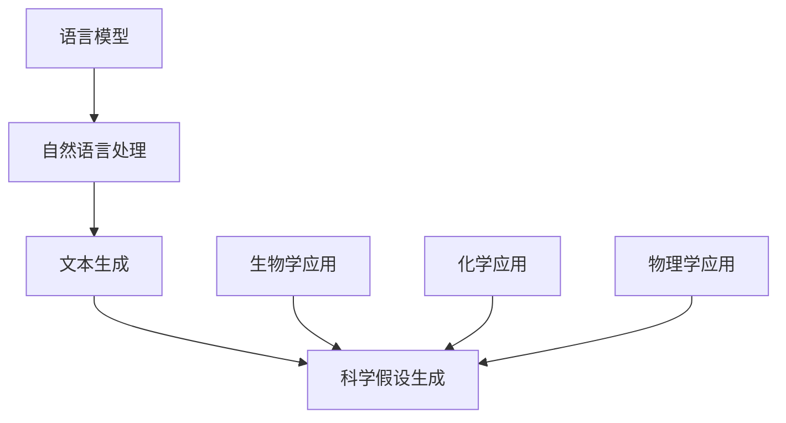

                 

# 《语言模型在科学假设生成中的能力培养》

关键词：语言模型、自然语言处理、文本生成、科学假设生成、人工智能

摘要：本文深入探讨了语言模型在科学假设生成中的能力培养。通过阐述语言模型的基础理论、科学假设生成的原理以及具体应用案例分析，本文旨在为科学研究和人工智能领域的从业者提供实用的指导和建议，进一步推动语言模型在科学假设生成中的应用与发展。

---

# 《语言模型在科学假设生成中的能力培养》目录大纲

## 第一部分：语言模型概述

### 第1章：语言模型基础

#### 1.1 语言模型的概念与历史发展

#### 1.2 语言模型的分类与特点

#### 1.3 语言模型在自然语言处理中的应用

### 第2章：科学假设生成原理

#### 2.1 科学假设的定义与作用

#### 2.2 科学假设生成的理论基础

#### 2.3 语言模型在科学假设生成中的应用

### 第3章：语言模型在科学假设生成中的应用案例分析

#### 3.1 语言模型在生物学领域的应用

#### 3.2 语言模型在化学领域的应用

#### 3.3 语言模型在物理学领域的应用

## 第二部分：语言模型在科学假设生成中的能力培养

### 第4章：语言模型在科学假设生成中的能力培养概述

#### 4.1 语言模型能力培养的重要性

#### 4.2 语言模型能力培养的方法与策略

#### 4.3 语言模型能力培养的评估与优化

### 第5章：语言模型能力培养实例分析

#### 5.1 案例一：基于语言模型的生物信息学分析

#### 5.2 案例二：基于语言模型的化学合成路线规划

#### 5.3 案例三：基于语言模型的物理学问题求解

### 第6章：语言模型能力培养实践指南

#### 6.1 语言模型训练环境搭建

#### 6.2 语言模型参数调整与优化

#### 6.3 语言模型在科学假设生成中的实际应用案例

### 第7章：未来展望与挑战

#### 7.1 语言模型在科学假设生成中的发展趋势

#### 7.2 语言模型能力培养面临的挑战

#### 7.3 未来研究方向与建议

## 附录

### 附录A：语言模型常用工具与资源

#### A.1 语言模型开源工具介绍

#### A.2 语言模型相关论文与书籍推荐

#### A.3 语言模型社区与交流平台

---

**核心概念与联系：**


**核心算法原理讲解：**
```python
import torch
import torch.nn as nn
import torch.optim as optim

class LanguageModel(nn.Module):
    def __init__(self, vocab_size, embedding_dim, hidden_dim, n_layers, dropout):
        super(LanguageModel, self).__init__()
        
        self.embedding = nn.Embedding(vocab_size, embedding_dim)
        self.hidden_dim = hidden_dim
        
        self.gru = nn.GRU(embedding_dim, hidden_dim, n_layers, dropout=dropout, bidirectional=True)
        self.fc = nn.Linear(hidden_dim * 2, vocab_size)
        
        self.dropout = nn.Dropout(dropout)
        
    def forward(self, input_seq, hidden):
        embedded = self.dropout(self.embedding(input_seq))
        output, hidden = self.gru(embedded, hidden)
        assert (output.size() == torch.Size([input_seq.size(0), 1, self.hidden_dim * 2]))
        
        output = self.fc(output[0])
        return output, hidden
```

**数学模型和数学公式详细讲解与举例说明：**
```latex
\section{语言模型中的数学模型}
在语言模型中，数学模型主要涉及到自然语言处理的统计模型和神经网络模型。

\subsection{神经网络模型}
神经网络模型是语言模型中最常用的模型之一，它包括多个层次，每个层次都有不同的功能。

$$
\text{神经网络模型} = \text{输入层} + \text{隐藏层} + \text{输出层}
$$

其中，输入层负责接收输入数据，隐藏层负责对数据进行处理和提取特征，输出层负责生成输出结果。

例如，一个简单的神经网络模型可以表示为：
$$
\text{神经网络模型} = \text{输入} \xrightarrow{\text{激活函数}} \text{隐藏层} \xrightarrow{\text{激活函数}} \text{输出}
$$

其中，激活函数可以是 sigmoid 函数、ReLU 函数等。

\subsection{自然语言处理模型}
自然语言处理模型是一种特殊的神经网络模型，用于处理自然语言数据。它主要包括以下部分：

1. 词向量编码：将自然语言数据转换为词向量表示，以便于神经网络处理。
2. 层次化模型：对词向量进行层次化处理，提取更高层次的语言特征。
3. 分类器：根据提取的语言特征，对输入数据进行分类。

例如，一个简单的自然语言处理模型可以表示为：
$$
\text{自然语言处理模型} = \text{词向量编码} + \text{层次化模型} + \text{分类器}
$$
```

## 第一部分：语言模型概述

### 第1章：语言模型基础

#### 1.1 语言模型的概念与历史发展

语言模型（Language Model）是自然语言处理（Natural Language Processing，NLP）领域中的一种基础模型，用于预测文本序列中下一个单词或字符的概率。其核心思想是通过学习大量文本数据，建立单词或字符之间的统计关系，从而实现自动文

