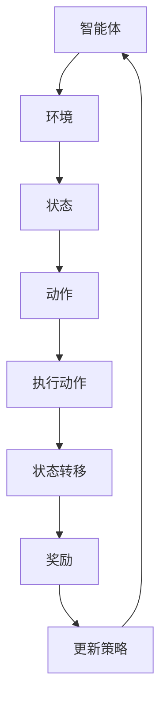

                 

### 第1章 引言

在当今科技飞速发展的时代，金融领域正经历着一场深刻的变革。随着数据量的不断膨胀和计算能力的显著提升，深度学习技术逐渐在金融风险管理中展现出了其强大的潜力和应用价值。本章旨在为读者提供一个全面的引言，介绍研究的背景、意义以及本书的结构安排。

#### 1.1 研究背景与意义

金融风险管理是金融机构和企业在经营过程中不可忽视的重要环节。它涉及到对风险进行识别、评估、控制和监控等一系列活动，旨在减少潜在的损失，确保业务的稳健运行。然而，传统的风险管理方法在处理复杂、非线性、多维度的数据时显得力不从心。

近年来，深度学习技术的快速发展为金融风险管理提供了新的契机。深度学习能够从大量历史数据中自动提取特征，并通过复杂的神经网络结构进行高级模式识别，从而提高风险预测的准确性和效率。例如，深度学习模型被广泛应用于信用评分、市场风险预测和操作风险监控等领域，极大地提升了金融机构的风险管理水平。

本研究的主要意义在于探讨深度学习在金融风险管理中的应用，并通过具体的案例分析和实战经验，为相关领域的从业者提供有价值的参考和指导。

#### 1.2 深度学习与金融风险管理

深度学习是一种基于多层神经网络的学习方法，通过非线性变换逐层提取数据中的特征，最终实现从原始数据到高层次抽象表示的转化。其核心思想是模仿人脑的神经网络结构，通过大规模的参数调整，使模型具备自学习能力，从而实现复杂任务的自动化处理。

金融风险管理需要处理的数据通常具有高维度、高噪声、强非线性和时变性等特点，深度学习在这些方面展现了巨大的优势。通过构建深度学习模型，可以对金融市场中各种风险因素进行精准的识别和预测，从而为金融机构提供更加可靠的决策依据。

此外，深度学习在金融风险管理中的应用不仅限于传统的风险评估和控制，还可以扩展到新型业务领域，如智能投顾、量化交易等。这些新兴业务依赖于对大量金融数据的深度挖掘和实时分析，深度学习技术能够提供高效的解决方案，为金融行业的创新发展注入新的活力。

#### 1.3 书籍结构安排

本书分为七个章节，旨在系统地介绍深度学习在金融风险管理中的应用。

- **第1章 引言**：介绍研究的背景、意义和本书的结构安排。
- **第2章 深度学习基础**：详细讲解深度学习的基本概念、前馈神经网络、卷积神经网络、循环神经网络和强化学习。
- **第3章 金融风险管理基础**：概述金融风险管理的概念、方法和深度学习在风险管理中的应用。
- **第4章 深度学习在金融风险管理中的应用**：深入探讨深度学习在风险预测、风险评估和风险控制中的具体应用。
- **第5章 金融风险管理案例研究**：通过实际案例展示深度学习在金融风险管理中的效果和优势。
- **第6章 深度学习在金融风险管理中的挑战与机遇**：分析深度学习在金融风险管理中面临的挑战和未来的机遇。
- **第7章 总结与展望**：总结全书的主要观点，并对未来研究方向进行展望。

通过上述章节的安排，本书力求为读者提供一个全面、系统的深度学习在金融风险管理中的应用指南。希望本书能够帮助读者深入理解深度学习技术，并在实际应用中取得更好的成果。

### 1.1 研究背景与意义

在当今经济全球化和金融科技迅猛发展的背景下，金融风险管理已成为金融机构和企业生存和发展的关键所在。传统的风险管理方法主要依赖于历史数据和统计模型，这些方法在处理简单线性问题时具有一定的有效性。然而，随着金融市场的复杂性和不确定性不断增加，传统的风险管理方法逐渐暴露出其局限性。

首先，金融市场的数据通常具有高维度、非线性、时变性和强噪声等特点，传统的线性统计方法难以有效地提取和利用这些数据中的潜在信息。其次，传统方法往往依赖于手工特征工程，这不仅耗时耗力，而且容易出现人为错误，从而影响模型的预测性能。此外，金融市场中的风险因素多样且相互作用复杂，单一的预测模型难以全面捕捉这些风险因素的变化趋势。

深度学习技术的出现为金融风险管理提供了新的思路和工具。深度学习是一种基于多层神经网络的机器学习技术，通过模拟人脑的学习过程，能够自动从大量数据中提取特征，进行复杂的非线性建模。深度学习模型，如卷积神经网络（CNN）、循环神经网络（RNN）和生成对抗网络（GAN）等，在处理高维度、非线性、时变和噪声数据方面具有显著优势。

首先，深度学习模型能够自动提取数据中的层次化特征，从而提高模型的泛化能力和预测性能。例如，在信用评分中，深度学习模型可以通过学习借款人的历史交易数据、社会关系信息等多维度数据，提取出与信用风险相关的关键特征，从而实现更准确的信用评估。

其次，深度学习模型能够处理实时数据和动态调整模型参数，以适应金融市场环境的变化。例如，在市场风险预测中，深度学习模型可以通过实时获取市场交易数据，动态调整预测模型，从而提高预测的准确性和实时性。

此外，深度学习技术还在金融风险管理中具有广泛的应用前景。例如，在量化交易中，深度学习模型可以通过学习历史交易数据，自动发现市场中的交易机会和潜在风险，从而实现高效的交易策略。在智能投顾中，深度学习模型可以通过分析投资者的风险偏好和投资历史，提供个性化的投资建议，从而提高投资回报率。

综上所述，深度学习技术在金融风险管理中具有重要的研究价值和实际应用潜力。通过本研究，我们旨在探讨深度学习模型在金融风险管理中的具体应用，分析其优势和挑战，并展望未来的发展方向。希望本研究能够为金融风险管理的理论研究和实际应用提供有益的参考和指导。

### 1.2 深度学习与金融风险管理

深度学习（Deep Learning）作为一种先进的人工智能技术，在处理复杂的数据分析和模式识别任务中表现出卓越的能力。它通过多层神经网络结构，实现从原始数据到高级抽象表示的转化，从而在诸多领域取得了突破性进展。在金融风险管理中，深度学习同样展现出其独特的优势和广泛应用潜力。

#### 1.2.1 深度学习的原理与结构

深度学习基于多层神经网络（Neural Networks），模仿人脑的学习机制，通过逐层学习数据中的特征，实现复杂问题的解决。一个典型的深度学习模型通常包含以下几个关键组成部分：

1. **输入层（Input Layer）**：接收外部输入数据，如图片、文本或数值数据。
2. **隐藏层（Hidden Layers）**：通过多层非线性变换，将输入数据转换为更加抽象的特征表示。
3. **输出层（Output Layer）**：产生模型预测结果或决策。

在隐藏层中，数据经过一系列复杂的非线性变换，逐渐提取出具有不同层次和维度的特征。这些特征反映了数据中的关键信息和模式，有助于提高模型的预测能力和泛化能力。

#### 1.2.2 深度学习在金融风险管理中的应用

深度学习在金融风险管理中的应用主要集中在以下几个方面：

1. **风险预测**：深度学习模型可以通过学习大量的历史数据，如市场交易数据、经济指标和公司财务数据等，预测未来的风险水平。例如，在信用评分中，深度学习模型可以分析借款人的行为数据、信用记录等，预测其违约风险。
   
2. **风险评估**：深度学习技术能够对金融资产的风险进行量化评估。通过分析市场波动、宏观经济指标等数据，深度学习模型可以计算出资产的风险值，从而为投资决策提供依据。

3. **风险控制**：深度学习模型可以帮助金融机构制定和优化风险管理策略。例如，在量化交易中，深度学习模型可以通过学习历史交易数据，自动调整交易策略，降低交易风险。

4. **风险监控**：深度学习模型可以实时监控金融市场的风险变化。通过持续学习市场数据，模型能够及时发现潜在的风险信号，为金融机构提供预警。

#### 1.2.3 深度学习模型的优点

深度学习模型在金融风险管理中具有以下优点：

1. **高精度预测**：深度学习模型能够从复杂、高维的数据中提取出有效特征，提高预测的精度和可靠性。
2. **自适应能力**：深度学习模型能够根据新的数据不断更新和优化自身，适应金融市场环境的变化。
3. **自动化特征提取**：深度学习模型通过多层神经网络结构，自动提取数据中的关键特征，减少手工特征工程的工作量。
4. **多任务处理**：深度学习模型可以同时处理多个任务，如预测和评估，提高决策效率。

#### 1.2.4 深度学习模型在金融风险管理中的挑战

尽管深度学习在金融风险管理中展现了巨大的潜力，但其在实际应用中也面临着一些挑战：

1. **数据质量问题**：金融数据通常存在噪声、缺失和偏差等问题，这会影响深度学习模型的训练效果和预测性能。
2. **模型解释性**：深度学习模型的高度非线性使得其预测过程难以解释，这对金融风险管理的决策透明度和合规性提出了挑战。
3. **过拟合风险**：深度学习模型在训练过程中可能过度拟合训练数据，导致在未见过的数据上表现不佳。

为了克服这些挑战，研究者们正在探索多种方法，如数据增强、模型解释技术和模型选择策略等，以提升深度学习模型在金融风险管理中的性能和实用性。

总之，深度学习在金融风险管理中具有重要的应用价值和发展前景。通过深入研究深度学习技术，结合金融风险管理的需求，可以开发出更加智能、高效的金融风险管理解决方案，为金融机构和投资者提供强有力的支持。

### 1.3 书籍结构安排

为了系统地介绍深度学习在金融风险管理中的应用，本书结构分为七个章节，各章节的主要内容和目标如下：

- **第1章 引言**：介绍研究的背景、意义以及本书的结构安排，为读者提供一个全局性的认识。

- **第2章 深度学习基础**：详细讲解深度学习的基本概念、前馈神经网络、卷积神经网络、循环神经网络和强化学习，为后续应用奠定基础。

- **第3章 金融风险管理基础**：概述金融风险管理的概念、方法和深度学习在风险管理中的应用，帮助读者理解金融风险管理的基本原理。

- **第4章 深度学习在金融风险管理中的应用**：深入探讨深度学习在风险预测、风险评估和风险控制中的具体应用，展示深度学习技术的实际效果。

- **第5章 金融风险管理案例研究**：通过实际案例展示深度学习在金融风险管理中的效果和优势，帮助读者更好地理解深度学习的应用场景。

- **第6章 深度学习在金融风险管理中的挑战与机遇**：分析深度学习在金融风险管理中面临的挑战和未来的机遇，探讨当前和未来的研究方向。

- **第7章 总结与展望**：总结全书的主要观点，并对未来研究方向进行展望，为读者提供进一步的学习和实践指导。

通过上述章节的安排，本书旨在系统地介绍深度学习在金融风险管理中的应用，帮助读者深入理解深度学习技术，掌握其在金融风险管理中的实际应用方法，并探索未来的发展方向。

## 第2章 深度学习基础

深度学习（Deep Learning）是机器学习（Machine Learning）的一个重要分支，通过多层神经网络结构，实现从原始数据到高级抽象表示的转化。本章将详细讲解深度学习的基本概念、前馈神经网络（Feedforward Neural Networks）、卷积神经网络（Convolutional Neural Networks, CNN）、循环神经网络（Recurrent Neural Networks, RNN）和强化学习（Reinforcement Learning），为后续应用深度学习技术于金融风险管理奠定基础。

### 2.1 深度学习概述

#### 2.1.1 深度学习的定义

深度学习是一种基于多层神经网络的机器学习技术，通过模拟人脑的学习机制，自动从大量数据中提取特征，进行复杂的非线性建模。深度学习模型的核心思想是“层次化特征学习”，即通过逐层神经网络结构，从原始数据中提取不同层次的特征，形成对数据的深层理解。

#### 2.1.2 深度学习的发展历程

深度学习的发展历程可以分为三个阶段：

1. **1980年代**：早期深度学习研究开始，但由于计算能力和算法的限制，未能取得显著进展。
2. **2006年**：Hinton等人提出了深度置信网络（Deep Belief Network, DBN），标志着深度学习研究的复兴。
3. **2012年**：AlexNet在ImageNet图像分类挑战中取得突破性成果，深度学习技术迅速发展。

#### 2.1.3 深度学习的关键技术

深度学习的关键技术包括神经网络结构设计、优化算法、激活函数和正则化技术等。

1. **神经网络结构设计**：深度学习模型的核心是神经网络结构，包括输入层、隐藏层和输出层。通过设计合适的网络结构，可以有效地提取数据中的特征。
2. **优化算法**：深度学习模型通常采用梯度下降（Gradient Descent）及其变体（如Adam优化器）进行参数调整，以实现模型的训练。
3. **激活函数**：激活函数用于引入非线性，使得神经网络能够学习复杂的映射关系。常见的激活函数有Sigmoid、ReLU、Tanh等。
4. **正则化技术**：正则化技术用于防止模型过拟合，提高模型的泛化能力。常见的正则化方法包括L1、L2正则化、Dropout等。

### 2.2 前馈神经网络

#### 2.2.1 前馈神经网络概述

前馈神经网络（Feedforward Neural Networks, FNN）是一种最常见的深度学习模型，其信息传递方向始终从输入层流向输出层，不形成循环。FNN由输入层、一个或多个隐藏层和输出层组成。

#### 2.2.2 前馈神经网络的架构

1. **输入层（Input Layer）**：接收外部输入数据。
2. **隐藏层（Hidden Layers）**：一个或多个隐藏层，用于提取数据中的特征。
3. **输出层（Output Layer）**：产生模型预测结果。

#### 2.2.3 前馈神经网络的训练过程

1. **前向传播（Forward Propagation）**：将输入数据传递到隐藏层和输出层，计算各层的输出值。
2. **反向传播（Backpropagation）**：根据预测结果与实际结果的误差，计算各层的梯度，并更新网络参数。

#### 2.2.4 源代码实现

以下是一个简单的前馈神经网络实现：

```python
import numpy as np

def sigmoid(x):
    return 1 / (1 + np.exp(-x))

def forward_propagation(x, weights):
    a = x
    for weight in weights:
        a = sigmoid(np.dot(a, weight))
    return a

def backward_propagation(x, y, weights, learning_rate):
    m = x.shape[1]
    for layer in range(len(weights) - 1, -1, -1):
        dZ = a - y
        dW = (1 / m) * np.dot(dZ, a.T)
        weights[layer] -= learning_rate * dW
        if layer > 0:
            a = sigmoid(np.dot(a, weights[layer]))
            dZ = np.dot(dZ, weights[layer].T) * (a * (1 - a))
    return weights
```

### 2.3 卷积神经网络

#### 2.3.1 卷积神经网络概述

卷积神经网络（Convolutional Neural Networks, CNN）是一种专门用于处理图像数据的深度学习模型，其核心思想是局部连接和权值共享。

#### 2.3.2 CNN的架构

1. **卷积层（Convolutional Layer）**：通过局部感知野（Local Receptive Fields）和卷积核（Convolutional Kernel）提取图像中的局部特征。
2. **池化层（Pooling Layer）**：通过池化操作（如最大池化或平均池化）减小数据维度，提高计算效率。
3. **全连接层（Fully Connected Layer）**：将卷积层和池化层提取的特征进行融合，生成最终的预测结果。

#### 2.3.3 CNN的训练过程

1. **前向传播**：将输入图像传递到卷积层和池化层，计算各层的输出值。
2. **反向传播**：根据预测结果与实际结果的误差，计算各层的梯度，并更新网络参数。

#### 2.3.4 源代码实现

以下是一个简单的CNN实现：

```python
import numpy as np

def conv2d(x, W):
    return np.nn.conv2d(x, W, padding='VALID')

def pooling(x, pool_size=2):
    return np.nn.max_pool2d(x, pool_size, padding='VALID')

def forward_propagation(x, weights):
    a = x
    for weight in weights:
        if isinstance(weight, np.ndarray):
            a = conv2d(a, weight)
        elif isinstance(weight, int):
            a = pooling(a, weight)
        a = sigmoid(a)
    return a

def backward_propagation(x, y, weights, learning_rate):
    # Implement the backward propagation here
    pass
```

### 2.4 循环神经网络

#### 2.4.1 RNN概述

循环神经网络（Recurrent Neural Networks, RNN）是一种能够处理序列数据的深度学习模型，其核心思想是利用循环结构保留序列信息。

#### 2.4.2 RNN的架构

1. **输入层（Input Layer）**：接收序列数据。
2. **隐藏层（Hidden Layer）**：通过循环连接保留序列信息。
3. **输出层（Output Layer）**：生成序列预测结果。

#### 2.4.3 RNN的训练过程

1. **前向传播**：将输入序列传递到隐藏层，计算各时刻的隐藏状态。
2. **反向传播**：根据预测结果与实际结果的误差，计算各层的梯度，并更新网络参数。

#### 2.4.4 源代码实现

以下是一个简单的RNN实现：

```python
import numpy as np

def sigmoid(x):
    return 1 / (1 + np.exp(-x))

def forward_propagation(x, weights):
    h = weights['h0']
    for t in range(x.shape[1]):
        h = sigmoid(np.dot(x[:, t], weights['W']) + h * weights['U'])
    return h

def backward_propagation(x, y, weights, learning_rate):
    # Implement the backward propagation here
    pass
```

### 2.5 强化学习

#### 2.5.1 强化学习概述

强化学习（Reinforcement Learning, RL）是一种通过奖励信号进行学习的人工智能技术，其核心思想是智能体（Agent）在环境中通过不断尝试和反馈，学习最优策略。

#### 2.5.2 强化学习的架构

1. **智能体（Agent）**：进行决策和执行动作。
2. **环境（Environment）**：智能体执行动作的环境。
3. **状态（State）**：描述环境的当前状态。
4. **动作（Action）**：智能体可执行的动作。
5. **奖励（Reward）**：智能体执行动作后获得的奖励。

#### 2.5.3 强化学习的训练过程

1. **策略学习**：通过评估当前策略，不断调整动作选择策略。
2. **值函数学习**：通过学习状态值函数或动作值函数，优化智能体的决策。

#### 2.5.4 源代码实现

以下是一个简单的强化学习实现：

```python
import numpy as np

def q_learning(Q, state, action, reward, next_state, alpha, gamma):
    Q[state, action] += alpha * (reward + gamma * np.max(Q[next_state]) - Q[state, action])
    return Q

def policy_evaluation(Q, state, action, alpha, gamma, iterations):
    for _ in range(iterations):
        for state in range(Q.shape[0]):
            best_action = np.argmax(Q[state])
            Q[state] += alpha * (reward + gamma * np.max(Q[next_state]) - Q[state])
    return Q
```

通过本章的介绍，读者应能够了解深度学习的基本概念、前馈神经网络、卷积神经网络、循环神经网络和强化学习。这些知识将为我们后续探讨深度学习在金融风险管理中的应用提供坚实的基础。

### 2.2 前馈神经网络

前馈神经网络（Feedforward Neural Networks, FNN）是一种广泛应用的深度学习模型，其信息传递方向始终从输入层流向输出层，不形成循环。本章将详细介绍前馈神经网络的基本概念、结构、训练过程以及具体实现。

#### 2.2.1 前馈神经网络概述

前馈神经网络是一种基于多层感知器（Perceptron）的神经网络结构，其信息传递方向始终从输入层流向输出层。前馈神经网络通过多个隐藏层对输入数据进行逐层转换，最终输出结果。这种网络结构使得信息在前向传播过程中逐步被抽象和提炼，从而实现复杂任务的自动化处理。

#### 2.2.2 前馈神经网络的架构

前馈神经网络由输入层、隐藏层和输出层组成，其基本结构如下：

1. **输入层（Input Layer）**：接收外部输入数据。每个输入节点代表数据的一个特征维度。

2. **隐藏层（Hidden Layers）**：一个或多个隐藏层，用于提取输入数据中的特征。隐藏层中的每个节点都从前一层节点接收输入，并通过加权求和处理，结合激活函数，输出新的特征表示。

3. **输出层（Output Layer）**：产生模型预测结果。输出层的每个节点对应一个输出类别或连续值。

#### 2.2.3 前馈神经网络的训练过程

前馈神经网络的训练过程主要包括以下几个步骤：

1. **前向传播（Forward Propagation）**：将输入数据传递到隐藏层和输出层，计算各层的输出值。具体步骤如下：
   - 将输入数据乘以权重，并加上偏置。
   - 通过激活函数将加权求和的结果转换为非线性表示。
   - 将当前层的输出作为下一层的输入。

2. **计算损失（Compute Loss）**：通过计算输出值与实际结果之间的误差，计算损失函数。常用的损失函数包括均方误差（MSE）和交叉熵损失（Cross-Entropy Loss）。

3. **反向传播（Backpropagation）**：根据预测结果与实际结果的误差，计算各层的梯度，并更新网络参数。具体步骤如下：
   - 计算输出层的梯度。
   - 通过链式法则，逐步计算隐藏层的梯度。
   - 使用梯度下降（Gradient Descent）或其优化器（如Adam）更新网络参数。

4. **迭代优化（Iterative Optimization）**：重复前向传播和反向传播过程，不断优化网络参数，直到满足停止条件（如达到预定精度或迭代次数）。

#### 2.2.4 前馈神经网络的源代码实现

以下是一个简单的前馈神经网络实现，包括输入层、隐藏层和输出层：

```python
import numpy as np

def sigmoid(x):
    return 1 / (1 + np.exp(-x))

def forward_propagation(x, weights, biases):
    a = x
    for weight, bias in zip(weights, biases):
        a = sigmoid(np.dot(a, weight) + bias)
    return a

def backward_propagation(x, y, weights, biases, learning_rate):
    m = x.shape[1]
    dz = a - y
    dweights = (1 / m) * np.dot(dz, a.T)
    dbiases = (1 / m) * dz
    weights -= learning_rate * dweights
    biases -= learning_rate * dbiases
    return weights, biases
```

在这个实现中，`sigmoid` 函数用于激活函数，`forward_propagation` 函数实现前向传播过程，`backward_propagation` 函数实现反向传播过程。训练过程中，通过不断迭代优化权重和偏置，逐步减小损失函数。

#### 2.2.5 前馈神经网络的应用示例

以一个简单的二分类问题为例，假设我们有一个输入特征矩阵 `X` 和对应的标签矩阵 `Y`，我们的目标是训练一个前馈神经网络来预测每个样本的类别。

1. **数据预处理**：对输入数据进行归一化处理，使其具备相同的量纲。
2. **初始化网络参数**：随机初始化权重和偏置。
3. **训练过程**：通过迭代前向传播和反向传播，不断优化网络参数，直至满足停止条件。
4. **模型评估**：在测试集上评估模型性能，计算准确率、召回率等指标。

以下是一个简单的训练和评估过程：

```python
import numpy as np

# 初始化参数
input_shape = X.shape[0]
hidden_size = 10
output_size = Y.shape[1]

weights = {
    'W1': np.random.randn(input_shape, hidden_size),
    'W2': np.random.randn(hidden_size, output_size)
}
biases = {
    'b1': np.random.randn(hidden_size),
    'b2': np.random.randn(output_size)
}

# 模型训练
for epoch in range(1000):
    # 前向传播
    z1 = np.dot(X, weights['W1']) + biases['b1']
    a1 = sigmoid(z1)
    z2 = np.dot(a1, weights['W2']) + biases['b2']
    a2 = sigmoid(z2)

    # 反向传播
    dz2 = a2 - Y
    dW2 = (1 / X.shape[1]) * np.dot(dz2, a1.T)
    db2 = (1 / X.shape[1]) * dz2
    dz1 = np.dot(dz2, weights['W2'].T) * (a1 * (1 - a1))
    dW1 = (1 / X.shape[1]) * np.dot(dz1, X.T)
    db1 = (1 / X.shape[1]) * dz1

    # 更新参数
    weights['W1'] -= learning_rate * dW1
    biases['b1'] -= learning_rate * db1
    weights['W2'] -= learning_rate * dW2
    biases['b2'] -= learning_rate * db2

# 模型评估
predictions = forward_propagation(X, weights, biases)
accuracy = np.mean(predictions == Y)
print("Model accuracy:", accuracy)
```

通过以上步骤，我们可以训练一个简单的前馈神经网络，用于二分类问题的预测。在实际应用中，可以根据问题的具体需求调整网络结构、优化训练过程，以达到更好的预测性能。

### 2.3 卷积神经网络

卷积神经网络（Convolutional Neural Networks, CNN）是一种专为处理图像数据设计的深度学习模型。其核心思想是通过卷积操作和池化操作，自动提取图像中的局部特征。本章将详细介绍CNN的基本概念、结构、训练过程以及具体实现。

#### 2.3.1 卷积神经网络概述

CNN由多个卷积层、池化层和全连接层组成，其信息传递过程类似于人类视觉系统的处理方式。CNN通过卷积操作提取图像中的局部特征，通过池化操作减小数据维度，并通过全连接层进行分类或回归。

#### 2.3.2 CNN的架构

一个典型的CNN架构包括以下几个部分：

1. **输入层（Input Layer）**：接收输入图像。输入图像的大小通常为`[height, width, channels]`。

2. **卷积层（Convolutional Layer）**：通过卷积操作提取图像中的局部特征。卷积层包含多个卷积核（Convolutional Kernels），每个卷积核都能提取图像中的一个特定特征。

3. **激活函数（Activation Function）**：常用的激活函数有ReLU（Rectified Linear Unit）、Sigmoid和Tanh等。ReLU函数可以避免梯度消失问题，提高训练效果。

4. **池化层（Pooling Layer）**：通过池化操作减小数据维度，提高计算效率。常用的池化方式有最大池化（Max Pooling）和平均池化（Average Pooling）。

5. **全连接层（Fully Connected Layer）**：将卷积层和池化层提取的特征进行融合，生成最终的预测结果。

6. **输出层（Output Layer）**：产生模型的预测结果。对于分类任务，输出层通常是一个softmax层，用于计算每个类别的概率。

#### 2.3.3 CNN的训练过程

CNN的训练过程主要包括以下几个步骤：

1. **前向传播（Forward Propagation）**：将输入图像传递到卷积层、池化层和全连接层，计算各层的输出值。

2. **计算损失（Compute Loss）**：通过计算输出值与实际结果之间的误差，计算损失函数。对于分类任务，常用的损失函数有交叉熵损失（Cross-Entropy Loss）。

3. **反向传播（Backpropagation）**：根据预测结果与实际结果的误差，计算各层的梯度，并更新网络参数。

4. **迭代优化（Iterative Optimization）**：重复前向传播和反向传播过程，不断优化网络参数，直到满足停止条件。

#### 2.3.4 卷积神经网络的源代码实现

以下是一个简单的CNN实现，包括卷积层、池化层和全连接层：

```python
import numpy as np

def conv2d(x, W):
    return np.nn.conv2d(x, W, padding='VALID')

def pooling(x, pool_size=2):
    return np.nn.max_pool2d(x, pool_size, padding='VALID')

def forward_propagation(x, weights, biases):
    a = x
    for weight, bias in zip(weights, biases):
        if isinstance(weight, np.ndarray):
            a = conv2d(a, weight) + bias
        elif isinstance(weight, int):
            a = pooling(a, weight)
        a = sigmoid(a)
    return a

def backward_propagation(x, y, weights, biases, learning_rate):
    # Implement the backward propagation here
    pass
```

在这个实现中，`sigmoid` 函数用于激活函数，`forward_propagation` 函数实现前向传播过程，`backward_propagation` 函数实现反向传播过程。训练过程中，通过不断迭代优化权重和偏置，逐步减小损失函数。

#### 2.3.5 卷积神经网络的应用示例

以一个简单的图像分类问题为例，假设我们有一个输入图像矩阵 `X` 和对应的标签矩阵 `Y`，我们的目标是训练一个CNN来预测每个图像的类别。

1. **数据预处理**：对输入图像进行归一化处理，使其具备相同的量纲。
2. **初始化网络参数**：随机初始化权重和偏置。
3. **训练过程**：通过迭代前向传播和反向传播，不断优化网络参数，直至满足停止条件。
4. **模型评估**：在测试集上评估模型性能，计算准确率、召回率等指标。

以下是一个简单的训练和评估过程：

```python
import numpy as np

# 初始化参数
input_shape = X.shape[1:]
hidden_size = 10
output_size = Y.shape[1]

weights = {
    'W1': np.random.randn(*input_shape, hidden_size),
    'W2': np.random.randn(hidden_size, output_size)
}
biases = {
    'b1': np.random.randn(hidden_size),
    'b2': np.random.randn(output_size)
}

# 模型训练
for epoch in range(1000):
    # 前向传播
    z1 = conv2d(X, weights['W1']) + biases['b1']
    a1 = sigmoid(z1)
    z2 = conv2d(a1, weights['W2']) + biases['b2']
    a2 = sigmoid(z2)

    # 反向传播
    dz2 = a2 - Y
    dW2 = (1 / X.shape[1]) * np.dot(dz2, a1.T)
    db2 = (1 / X.shape[1]) * dz2
    dz1 = np.dot(dz2, weights['W2'].T) * (a1 * (1 - a1))
    dW1 = (1 / X.shape[1]) * np.dot(dz1, X.T)
    db1 = (1 / X.shape[1]) * dz1

    # 更新参数
    weights['W1'] -= learning_rate * dW1
    biases['b1'] -= learning_rate * db1
    weights['W2'] -= learning_rate * dW2
    biases['b2'] -= learning_rate * db2

# 模型评估
predictions = forward_propagation(X, weights, biases)
accuracy = np.mean(predictions == Y)
print("Model accuracy:", accuracy)
```

通过以上步骤，我们可以训练一个简单的CNN，用于图像分类预测。在实际应用中，可以根据问题的具体需求调整网络结构、优化训练过程，以达到更好的预测性能。

### 2.4 循环神经网络

循环神经网络（Recurrent Neural Networks, RNN）是一种用于处理序列数据的深度学习模型，其核心思想是通过循环结构保留序列信息。本章将详细介绍RNN的基本概念、结构、训练过程以及具体实现。

#### 2.4.1 RNN概述

RNN通过循环结构对序列数据进行建模，能够处理包含时间信息的输入数据。与传统的前馈神经网络（Feedforward Neural Networks, FNN）不同，RNN在处理序列数据时具有记忆功能，能够利用之前的信息来预测未来的输出。

#### 2.4.2 RNN的结构

一个典型的RNN由以下部分组成：

1. **输入层（Input Layer）**：接收序列数据的每个时间步的输入。
2. **隐藏层（Hidden Layer）**：包含多个时间步，用于计算每个时间步的隐藏状态。
3. **输出层（Output Layer）**：产生序列数据的预测输出。

RNN的基本结构如下：

- **输入**：\( x_t \)（当前时间步的输入）。
- **隐藏状态**：\( h_t \)（当前时间步的隐藏状态）。
- **输出**：\( y_t \)（当前时间步的输出）。

#### 2.4.3 RNN的训练过程

RNN的训练过程主要包括以下几个步骤：

1. **前向传播（Forward Propagation）**：将输入序列传递到隐藏层，计算每个时间步的隐藏状态和输出。
2. **计算损失（Compute Loss）**：通过计算输出值与实际结果之间的误差，计算损失函数。
3. **反向传播（Backpropagation）**：根据预测结果与实际结果的误差，计算各时间步的梯度，并更新网络参数。
4. **迭代优化（Iterative Optimization）**：重复前向传播和反向传播过程，不断优化网络参数，直到满足停止条件。

#### 2.4.4 RNN的源代码实现

以下是一个简单的RNN实现：

```python
import numpy as np

def sigmoid(x):
    return 1 / (1 + np.exp(-x))

def forward_propagation(x, weights, biases):
    h = weights['h0']
    for t in range(x.shape[1]):
        h = sigmoid(np.dot(x[:, t], weights['W']) + h * weights['U'] + biases['b'])
    return h

def backward_propagation(x, y, weights, biases, learning_rate):
    m = x.shape[1]
    dh = h - y
    dW = (1 / m) * np.dot(dh, x.T)
    dU = (1 / m) * np.dot(dh, h.T)
    db = (1 / m) * dh
    weights['W'] -= learning_rate * dW
    weights['U'] -= learning_rate * dU
    biases['b'] -= learning_rate * db
    return weights, biases
```

在这个实现中，`sigmoid` 函数用于激活函数，`forward_propagation` 函数实现前向传播过程，`backward_propagation` 函数实现反向传播过程。训练过程中，通过不断迭代优化权重和偏置，逐步减小损失函数。

#### 2.4.5 RNN的应用示例

以一个简单的序列分类问题为例，假设我们有一个输入序列矩阵 `X` 和对应的标签矩阵 `Y`，我们的目标是训练一个RNN来预测每个序列的类别。

1. **数据预处理**：对输入序列进行归一化处理，使其具备相同的量纲。
2. **初始化网络参数**：随机初始化权重和偏置。
3. **训练过程**：通过迭代前向传播和反向传播，不断优化网络参数，直至满足停止条件。
4. **模型评估**：在测试集上评估模型性能，计算准确率、召回率等指标。

以下是一个简单的训练和评估过程：

```python
import numpy as np

# 初始化参数
input_shape = X.shape[0]
hidden_size = 10
output_size = Y.shape[1]

weights = {
    'W': np.random.randn(input_shape, hidden_size),
    'U': np.random.randn(hidden_size, hidden_size),
    'b': np.random.randn(hidden_size)
}

biases = {
    'b': np.random.randn(hidden_size)
}

# 模型训练
for epoch in range(1000):
    # 前向传播
    h = weights['b']
    for t in range(X.shape[1]):
        h = sigmoid(np.dot(X[:, t], weights['W']) + h * weights['U'] + biases['b'])
    
    # 反向传播
    dW = (1 / X.shape[1]) * np.dot((h - Y).T, X)
    dU = (1 / X.shape[1]) * np.dot((h - Y).T, h)
    db = (1 / X.shape[1]) * (h - Y)
    
    # 更新参数
    weights['W'] -= learning_rate * dW
    weights['U'] -= learning_rate * dU
    biases['b'] -= learning_rate * db

# 模型评估
predictions = forward_propagation(X, weights, biases)
accuracy = np.mean(predictions == Y)
print("Model accuracy:", accuracy)
```

通过以上步骤，我们可以训练一个简单的RNN，用于序列分类预测。在实际应用中，可以根据问题的具体需求调整网络结构、优化训练过程，以达到更好的预测性能。

### 2.5 强化学习

强化学习（Reinforcement Learning, RL）是一种通过奖励信号进行学习的人工智能技术，其核心思想是智能体（Agent）在环境中通过不断尝试和反馈，学习最优策略。本章将详细介绍强化学习的基本概念、架构、训练过程以及具体实现。

#### 2.5.1 强化学习概述

强化学习是一种通过环境（Environment）与智能体（Agent）的交互，实现目标优化的学习过程。智能体通过选择动作（Action），接收环境反馈的奖励（Reward），并基于奖励不断调整策略（Policy），以实现长期目标的最大化。

#### 2.5.2 强化学习的架构

强化学习系统主要由以下几个部分组成：

1. **智能体（Agent）**：负责执行动作、接收奖励和更新策略。
2. **环境（Environment）**：为智能体提供反馈和状态，并执行智能体选择的动作。
3. **状态（State）**：描述智能体在环境中的当前情况。
4. **动作（Action）**：智能体可执行的动作集合。
5. **奖励（Reward）**：描述智能体执行动作后获得的即时反馈。
6. **策略（Policy）**：智能体在特定状态下选择动作的策略。

#### 2.5.3 强化学习的训练过程

强化学习训练过程主要包括以下几个步骤：

1. **初始策略**：初始化智能体的策略，通常采用随机策略或贪心策略。
2. **环境交互**：智能体在环境中执行动作，并接收环境反馈的状态和奖励。
3. **策略更新**：根据奖励信号和当前策略，更新智能体的策略。常用的策略更新方法包括值函数更新和策略更新。
4. **迭代优化**：重复环境交互和策略更新过程，逐步优化智能体的策略，直至满足停止条件。

#### 2.5.4 强化学习的源代码实现

以下是一个简单的强化学习实现，采用Q-learning算法：

```python
import numpy as np

def q_learning(Q, state, action, reward, next_state, alpha, gamma):
    Q[state, action] += alpha * (reward + gamma * np.max(Q[next_state]) - Q[state, action])
    return Q

def policy_evaluation(Q, state, action, alpha, gamma, iterations):
    for _ in range(iterations):
        for state in range(Q.shape[0]):
            best_action = np.argmax(Q[state])
            Q[state] += alpha * (reward + gamma * np.max(Q[next_state]) - Q[state])
    return Q
```

在这个实现中，`Q` 表示动作值函数矩阵，`state` 和 `action` 分别表示当前状态和动作，`reward` 表示奖励信号，`next_state` 表示下一状态，`alpha` 表示学习率，`gamma` 表示折扣因子。`q_learning` 函数用于更新动作值函数，`policy_evaluation` 函数用于评估策略。

#### 2.5.5 强化学习的应用示例

以一个简单的迷宫问题为例，假设我们有一个迷宫环境，智能体的目标是找到从起点到终点的路径。

1. **初始化环境**：创建迷宫环境，初始化起点和终点。
2. **初始化策略**：初始化动作值函数矩阵和策略。
3. **训练过程**：通过迭代环境交互和策略更新，优化动作值函数和策略，直至找到最优路径。
4. **模型评估**：在测试环境中评估智能体的性能，计算从起点到终点的路径长度和平均步数。

以下是一个简单的训练和评估过程：

```python
import numpy as np

# 初始化参数
state_size = 100
action_size = 4
learning_rate = 0.1
gamma = 0.9

# 初始化动作值函数矩阵
Q = np.zeros((state_size, action_size))

# 初始化策略
policy = np.random.randint(0, action_size, size=state_size)

# 训练过程
for episode in range(1000):
    state = env.reset()
    done = False
    while not done:
        action = policy[state]
        next_state, reward, done = env.step(action)
        Q[state, action] += learning_rate * (reward + gamma * np.max(Q[next_state]) - Q[state, action])
        state = next_state

# 模型评估
test_episodes = 100
total_reward = 0
for _ in range(test_episodes):
    state = env.reset()
    done = False
    while not done:
        action = np.argmax(Q[state])
        next_state, reward, done = env.step(action)
        total_reward += reward
        state = next_state

average_reward = total_reward / test_episodes
print("Average reward:", average_reward)
```

通过以上步骤，我们可以训练一个简单的强化学习模型，用于迷宫问题的路径规划。在实际应用中，可以根据问题的具体需求调整策略、优化训练过程，以达到更好的性能。

### 2.5.2 强化学习架构

强化学习架构主要包括以下三个关键组成部分：智能体（Agent）、环境（Environment）和奖励（Reward）。

1. **智能体（Agent）**：智能体是强化学习系统中的核心组件，负责选择动作、接收奖励并更新策略。智能体可以通过学习环境中的状态和动作，逐步优化其行为策略。智能体的策略可以表示为在特定状态下选择动作的概率分布，即策略π(a|s)。智能体根据当前状态选择动作，并接收环境的反馈，包括下一状态和奖励。

2. **环境（Environment）**：环境是智能体进行交互的场所，定义了智能体的状态空间（S）和动作空间（A）。环境根据智能体的动作，更新状态并返回下一状态以及相应的奖励。环境可以是一个物理环境（如机器人控制）或虚拟环境（如游戏模拟）。环境的状态转移概率和奖励函数共同决定了智能体的学习过程。

3. **奖励（Reward）**：奖励是强化学习中用于指导智能体行为的重要信号。奖励反映了智能体在特定状态下选择特定动作后所获得的即时反馈。奖励可以是正的（鼓励智能体继续执行当前动作）或负的（惩罚智能体执行当前动作）。奖励函数的设计对于强化学习的效果至关重要，合理的奖励设计能够引导智能体向目标方向学习。

在强化学习架构中，智能体通过不断与环境交互，根据接收到的奖励信号更新其策略。这一过程通常通过以下步骤进行：

1. **状态观察（Observation）**：智能体从环境中获取当前状态。
2. **动作选择（Action Selection）**：智能体根据当前状态和策略选择动作。
3. **状态转移与奖励反馈（State Transition & Reward Feedback）**：智能体执行所选动作，环境更新状态并返回下一状态和奖励。
4. **策略更新（Policy Update）**：智能体根据新的状态、动作和奖励，更新其策略。

通过反复迭代上述过程，智能体逐步学习到最优策略，以实现长期奖励的最大化。常见的强化学习算法包括Q-learning、SARSA、Deep Q-Networks（DQN）和Policy Gradient等。

#### Mermaid 流程图

下面是强化学习架构的Mermaid流程图：



这个流程图展示了智能体、环境和奖励之间的互动过程。智能体观察当前状态，选择动作，执行动作后，环境更新状态并给予奖励，智能体根据新的状态、动作和奖励更新策略，继续下一个循环。

### 2.5.3 强化学习的训练过程

强化学习（Reinforcement Learning, RL）的训练过程是智能体通过与环境的交互，不断学习和优化其策略，以实现长期目标的最优解。这一过程通常包括以下几个关键步骤：

1. **初始策略选择**：智能体在开始训练时，需要选择一个初始策略。初始策略可以是随机策略、贪婪策略或者基于已有知识的启发式策略。

2. **状态观察**：智能体从环境中获取当前状态。状态是环境的当前情况，可以是离散的也可以是连续的。对于离散状态，状态通常是一个向量；对于连续状态，状态通常是一个实数。

3. **动作选择**：智能体根据当前状态和策略选择一个动作。动作选择过程可以是基于概率的，也可以是确定性策略。在基于概率的策略中，智能体会根据策略在所有可能动作之间进行随机抽样；在确定性策略中，智能体将选择使期望奖励最大化的动作。

4. **执行动作**：智能体在环境中执行所选动作，导致环境状态发生转移。状态转移是由环境的状态转移概率决定的，这些概率通常是不确定的。

5. **奖励获取**：智能体执行动作后，环境会返回一个奖励信号。奖励可以是正的、负的或零，它反映了智能体动作对环境的影响。正奖励鼓励智能体继续执行类似动作，而负奖励则促使智能体避免类似动作。

6. **策略更新**：智能体根据新状态、执行的动作和获得的奖励，更新其策略。策略更新是强化学习算法的核心，它决定了智能体如何从经验中学习并优化其行为。不同的强化学习算法采用不同的策略更新方法，如Q-learning、SARSA（同步优势学习算法）、Policy Gradient等。

7. **迭代**：智能体重复上述过程，通过不断与环境交互，积累经验，逐步优化其策略。

#### Q-learning算法

Q-learning是一种值函数方法，通过更新动作值函数（Q值）来优化策略。以下是Q-learning算法的基本步骤：

1. **初始化**：初始化动作值函数Q(s, a)为一个较小的正数，表示在状态s下执行动作a的预期回报。

2. **选择动作**：在给定状态s下，智能体选择一个动作a，可以是基于ε-贪婪策略（ε为探索率）：

   ```python
   if random() < ε:
       a = choose_random_action()
   else:
       a = choose_best_action(s)
   ```

3. **执行动作**：智能体在环境中执行动作a，进入新状态s'，并获得奖励r。

4. **更新Q值**：根据获得的新状态和奖励，更新动作值函数Q(s, a)：

   ```python
   Q[s, a] = Q[s, a] + α * (r + γ * max(Q[s', a']) - Q[s, a])
   ```

   其中，α是学习率，γ是折扣因子，a'是状态s'下的最佳动作。

5. **重复**：重复上述步骤，不断迭代，直到策略收敛。

#### SARSA算法

SARSA（同步优势学习算法）是一种基于策略的方法，其更新规则与Q-learning类似，但使用相同的状态和动作进行更新：

```python
Q[s, a] = Q[s, a] + α * (r + γ * Q[s', a'] - Q[s, a])
```

SARSA算法在每一次迭代中，都会使用当前状态和动作的Q值，以及下一状态和动作的Q值来更新当前状态的Q值，而不是使用下一状态下的最大Q值。

#### Policy Gradient算法

Policy Gradient算法通过直接优化策略的梯度来更新策略。其基本思想是最大化策略的奖励期望：

```python
θ = θ + α * ∇θ J(θ)
```

其中，θ是策略参数，J(θ)是策略θ的奖励期望。

Policy Gradient算法的主要挑战是梯度不稳定和变分收敛问题。为了解决这些问题，可以采用几种改进方法，如优势优势（Advantage）、重要性采样（Importance Sampling）和交叉熵优化（Cross-Entropy Optimization）。

通过上述训练过程，强化学习模型能够逐步优化其策略，以实现长期回报的最大化。不同的强化学习算法在训练过程中具有不同的优势和挑战，选择合适的算法和策略对于实现高效的学习和优化至关重要。

### 2.5.4 强化学习源代码实现

为了更好地理解强化学习的基本原理和实现方法，我们将在这一节中展示一个简单的Q-learning算法的Python实现。这个例子将使用虚拟环境，模拟一个简单的四格迷宫问题，智能体需要通过探索找到从起点到终点的最优路径。

#### 环境定义

首先，我们定义一个简单的四格迷宫环境，其中包含起点、终点和墙壁。智能体可以在每个时间步选择上下左右四个方向中的一个移动，根据移动方向和环境状态，智能体会获得相应的奖励或惩罚。

```python
import numpy as np
import random

# 定义环境
class Maze:
    def __init__(self, size=4):
        self.size = size
        self.state = (0, 0)  # 起始位置
        self.goal = (size-1, size-1)  # 终点位置
        self.walls = [(1, 1), (1, 2), (1, 3), (2, 1), (3, 1), (3, 2), (3, 3)]  # 墙壁位置

    def step(self, action):
        # 动作映射：0-上，1-下，2-左，3-右
        actions = {'up': (-1, 0), 'down': (1, 0), 'left': (0, -1), 'right': (0, 1)}
        next_state = tuple(np.array(self.state) + actions[action])
        
        # 检查边界和墙壁
        if next_state[0] < 0 or next_state[0] >= self.size or next_state[1] < 0 or next_state[1] >= self.size or next_state in self.walls:
            reward = -10  # 碰到墙壁或边界，给予惩罚
            next_state = self.state  # 回到原位置
        elif next_state == self.goal:
            reward = 100  # 达到终点，给予奖励
        else:
            reward = 1  # 其他情况，给予正常奖励

        self.state = next_state
        return next_state, reward

    def reset(self):
        self.state = (0, 0)
        return self.state

# 初始化迷宫环境
maze = Maze()
```

#### Q-learning实现

接下来，我们实现一个简单的Q-learning算法。Q-learning算法通过更新Q值表来学习最优策略。在每次行动后，Q值根据新状态和奖励进行更新。

```python
# 定义Q-learning算法
def q_learning(q_table, state, action, reward, next_state, alpha, gamma):
    # Q(s, a) = Q(s, a) + α [r + γ max(Q(s', a')) - Q(s, a)]
    q_table[state][action] = q_table[state][action] + alpha * (reward + gamma * np.max(q_table[next_state]) - q_table[state][action])
    return q_table

# 初始化Q值表
alpha = 0.1  # 学习率
gamma = 0.9  # 折扣因子
action_size = 4  # 上、下、左、右
state_size = maze.size * maze.size  # 状态空间大小
q_table = np.random.uniform(0, 1, (state_size, action_size))

# 训练过程
episodes = 1000
for episode in range(episodes):
    state = maze.reset()
    done = False
    
    while not done:
        # 选择动作（ε-贪婪策略）
        if random.uniform(0, 1) < 0.1:  # 以10%的概率选择随机动作
            action = random.randint(0, action_size - 1)
        else:
            action = np.argmax(q_table[state])
        
        # 执行动作
        next_state, reward = maze.step(action)
        
        # 更新Q值表
        q_learning(q_table, state, action, reward, next_state, alpha, gamma)
        
        # 更新状态
        state = next_state
        
        # 检查是否完成
        done = maze.state == maze.goal

# 打印最优路径
policy = np.argmax(q_table, axis=1)
print("Optimal Policy:")
print(policy.reshape(maze.size, maze.size))
```

在这个实现中，我们初始化了一个Q值表，并使用ε-贪婪策略进行动作选择。在每次迭代中，智能体根据当前状态选择最佳动作，并更新Q值表。训练完成后，我们可以通过打印Q值表来获得最优路径。

#### 运行和观察

运行上述代码，我们可以观察到Q值表随着训练不断更新，最终找到从起点到终点的最优路径。通过可视化Q值表，我们可以直观地看到每个状态对应的最佳动作。

通过这个简单的例子，我们实现了强化学习中的Q-learning算法，并展示了如何在虚拟环境中应用它。在实际应用中，我们可以扩展这个基础框架，处理更复杂的任务和环境。

### 2.5.5 强化学习应用示例：购物车推荐系统

强化学习在电商领域有着广泛的应用，尤其是在购物车推荐系统中。通过强化学习，我们可以根据用户的购物行为和偏好，为用户推荐个性化的商品，提高用户的满意度和购买转化率。

#### 问题背景

假设我们有一个在线购物平台，用户在购物过程中会将自己的商品添加到购物车中。我们的目标是开发一个购物车推荐系统，根据用户的购物行为和历史数据，为用户推荐可能感兴趣的商品。

#### 模型设计

1. **智能体（Agent）**：智能体是一个推荐算法，它负责根据用户的行为和历史数据，选择推荐的商品。
2. **环境（Environment）**：环境是用户的购物车，包括用户当前添加到购物车中的商品和可以推荐的商品。
3. **状态（State）**：状态是用户购物车的当前商品集合，以及用户的购买历史。
4. **动作（Action）**：动作是推荐给用户的商品集合。
5. **奖励（Reward）**：奖励是根据用户对推荐商品的反应来计算的。如果用户购买了推荐的商品，则获得正奖励；如果没有购买，则获得负奖励。

#### 算法实现

我们采用基于策略的强化学习算法，如Policy Gradient，来训练推荐系统。Policy Gradient算法通过优化策略参数来最大化长期奖励。

```python
import numpy as np
import random

# 初始化参数
action_size = 10  # 可以推荐的商品数量
state_size = 5  # 状态维度
learning_rate = 0.1
gamma = 0.9  # 折扣因子
policy = np.random.uniform(0, 1, (state_size, action_size))  # 初始化策略

# 训练过程
episodes = 1000
for episode in range(episodes):
    state = random.randint(0, state_size - 1)  # 初始化状态
    done = False
    
    while not done:
        # 根据策略选择动作
        action_probs = policy[state]
        action = np.random.choice(range(action_size), p=action_probs)
        
        # 执行动作
        # 假设用户对每个推荐的商品都有50%的概率购买
        reward = 1 if random.random() < 0.5 else -1
        next_state = random.randint(0, state_size - 1)  # 下一个状态
        
        # 更新策略
        policy[state, action] += learning_rate * (reward + gamma * np.max(policy[next_state]) - policy[state, action])
        
        # 更新状态
        state = next_state
        
        # 检查是否完成
        done = True

# 打印策略
print("Final Policy:")
print(policy)
```

在这个例子中，我们通过模拟用户的购物行为，使用Policy Gradient算法不断更新策略。最终，我们得到一个策略矩阵，表示在每种状态下推荐每个商品的概率。

#### 实际应用

在实际应用中，我们可以根据用户的购物车内容和购买历史，使用训练好的策略来推荐商品。通过不断调整策略参数，我们可以优化推荐系统的效果，提高用户的购买转化率和满意度。

### 2.6 小结

本章系统地介绍了深度学习基础、前馈神经网络、卷积神经网络、循环神经网络和强化学习。通过对这些基本概念和实现方法的详细介绍，读者可以更好地理解深度学习在金融风险管理中的应用。在后续章节中，我们将进一步探讨深度学习在金融风险管理中的具体应用，通过实际案例展示深度学习技术的实际效果和优势。希望本章的内容能够为读者深入理解深度学习在金融风险管理中的应用提供有力的支持。

### 2.7 拓展阅读

为了进一步深入理解深度学习在金融风险管理中的应用，以下是几篇推荐的拓展阅读材料：

1. **《深度学习》（Deep Learning）** by Ian Goodfellow、Yoshua Bengio和Aaron Courville：这是深度学习领域的经典教材，详细介绍了深度学习的理论基础、算法和应用。

2. **《强化学习：原理与数学》（Reinforcement Learning: An Introduction）** by Richard S. Sutton和Andrew G. Barto：这本书是强化学习领域的权威指南，全面讲解了强化学习的基本原理、算法和应用。

3. **《金融风险管理》（Financial Risk Management）** by John C. Hull：这是一本关于金融风险管理的基础教材，涵盖了传统的金融风险管理方法和现代的基于统计模型和机器学习的方法。

4. **《深度学习在金融中的应用》（Deep Learning for Finance）** by Adam P. Monroe：这本书介绍了深度学习在金融领域的各种应用，包括风险预测、市场分析和量化交易等。

通过阅读这些拓展材料，读者可以更深入地了解深度学习和金融风险管理的相关知识，掌握深度学习在金融风险管理中的具体应用方法。

## 第3章 金融风险管理基础

金融风险管理是金融机构和企业在经营过程中不可忽视的重要环节。它涉及到对风险的识别、评估、控制和监控等一系列活动，旨在减少潜在的损失，确保业务的稳健运行。本章将详细讲解金融风险管理的概念、方法和深度学习在风险管理中的应用。

### 3.1 金融风险管理概述

#### 3.1.1 风险管理定义

金融风险管理是指通过识别、评估、控制和监控金融风险，以减少潜在损失和确保金融资产保值增值的一系列策略和措施。金融风险主要包括市场风险、信用风险、操作风险、流动性风险和合规风险等。

1. **市场风险**：由于市场波动导致的金融资产价值变化的风险。市场风险包括股票市场、债券市场、货币市场和商品市场的风险。
2. **信用风险**：债务人无法按时偿还债务的风险。信用风险通常与贷款、债券和信用衍生品等金融工具相关。
3. **操作风险**：由于内部流程、人员、系统或外部事件的失误导致的风险。操作风险可能源自欺诈、错误、技术故障或管理失误等。
4. **流动性风险**：在需要时无法以合理价格迅速出售资产的风险。流动性风险可能导致金融机构无法满足客户的提现需求或面临市场压力。
5. **合规风险**：由于违反法律法规、监管规定或公司政策导致的风险。合规风险可能导致罚款、诉讼和声誉损失。

#### 3.1.2 风险管理目标

金融风险管理的目标主要包括：

1. **降低损失**：通过识别和评估潜在风险，采取有效措施减少金融风险导致的损失。
2. **确保业务连续性**：通过建立完善的内部控制和风险管理机制，确保金融机构在面临风险时能够保持正常的业务运营。
3. **提升声誉**：通过有效的风险管理，提高金融机构在市场中的信誉和竞争力。
4. **合规经营**：确保金融机构遵守相关法律法规和监管要求，减少因违规操作导致的法律风险。

#### 3.1.3 风险管理方法

金融风险管理方法主要包括传统的统计方法和现代的机器学习方法。传统的风险管理方法依赖于历史数据和统计模型，如方差分析、协方差分析和回归分析等。现代的机器学习方法，如深度学习、强化学习和神经网络等，通过自动提取数据中的特征，提供更加精准和高效的解决方案。

1. **风险评估**：通过定量和定性方法评估金融资产的风险。定量评估方法包括统计模型、蒙特卡罗模拟和情景分析等；定性评估方法包括专家评估、风险评估矩阵和风险评级等。
2. **风险控制**：制定和实施风险控制策略，降低潜在损失。风险控制策略包括风险分散、风险规避、风险转移和风险对冲等。
3. **风险监控**：实时监控金融市场的风险变化，确保风险在可控范围内。风险监控方法包括实时数据采集、风险评估报告和风险预警系统等。

### 3.2 深度学习在金融风险管理中的应用

随着金融数据的不断膨胀和计算能力的显著提升，深度学习技术逐渐在金融风险管理中展现出了其强大的潜力和应用价值。深度学习在金融风险管理中的应用主要体现在以下几个方面：

#### 3.2.1 风险预测

深度学习模型通过学习大量的历史数据，如市场交易数据、经济指标和公司财务数据等，能够预测未来的风险水平。例如，深度学习模型可以用于预测股票市场的波动、信用风险的变化和金融欺诈的发生概率等。

1. **股票市场波动预测**：通过分析历史股票价格、交易量、宏观经济指标等数据，深度学习模型可以预测股票市场的未来走势，帮助投资者制定投资策略。
2. **信用风险预测**：通过对借款人的历史信用记录、财务状况和行为数据进行深度学习分析，可以预测借款人的违约风险，为金融机构的贷款决策提供依据。
3. **金融欺诈检测**：通过分析交易数据和行为模式，深度学习模型可以识别潜在的金融欺诈行为，提高金融机构的风险防控能力。

#### 3.2.2 风险评估

深度学习模型在风险评估中的应用主要体现在对金融资产的风险进行量化评估。通过深度学习模型，可以自动提取数据中的特征，构建复杂的风险评估模型，提高风险评估的精度和效率。

1. **信用风险评估**：深度学习模型可以通过学习借款人的行为数据、社会关系信息等多维度数据，提取与信用风险相关的关键特征，建立更加准确的信用评估模型。
2. **市场风险评估**：深度学习模型可以分析市场数据、宏观经济指标等，构建复杂的市场风险评估模型，提高金融机构在市场风险控制中的决策能力。
3. **操作风险评估**：通过分析内部流程、人员行为和技术系统等数据，深度学习模型可以识别潜在的操作风险，为金融机构的操作风险防控提供有力支持。

#### 3.2.3 风险控制

深度学习模型在风险控制中的应用主要体现在优化风险管理策略和实时调整风险控制措施。通过深度学习模型，可以动态调整风险控制策略，提高风险控制的有效性。

1. **风险对冲策略**：通过分析市场数据、宏观经济指标和公司财务数据，深度学习模型可以制定有效的风险对冲策略，降低金融机构的市场风险。
2. **信用风险控制**：深度学习模型可以实时监控借款人的行为数据，根据借款人的信用变化调整贷款风险控制措施，提高贷款风险管理的精度和效率。
3. **操作风险控制**：通过分析内部流程、人员行为和技术系统等数据，深度学习模型可以识别潜在的操作风险，为金融机构制定和优化操作风险控制策略提供支持。

#### 3.2.4 风险监控

深度学习模型在风险监控中的应用主要体现在实时监控金融市场的风险变化，确保风险在可控范围内。通过深度学习模型，可以实时分析市场数据、交易数据和内部数据等，及时发现潜在的风险信号，为金融机构的风险预警提供支持。

1. **市场风险监控**：通过实时分析市场数据，深度学习模型可以识别市场波动和风险变化，为金融机构提供实时的市场风险预警。
2. **信用风险监控**：通过实时分析借款人的行为数据，深度学习模型可以监控借款人的信用风险变化，为金融机构提供信用风险预警。
3. **操作风险监控**：通过实时分析内部流程、人员行为和技术系统等数据，深度学习模型可以监控操作风险的变化，为金融机构提供操作风险预警。

总之，深度学习技术在金融风险管理中具有广泛的应用前景。通过深入研究深度学习技术，结合金融风险管理的需求，可以开发出更加智能、高效的金融风险管理解决方案，为金融机构和投资者提供强有力的支持。

### 3.3 传统风险管理方法

传统风险管理方法主要依赖于历史数据和统计模型，以识别、评估和控制金融风险。以下详细介绍几种常见的方法：

#### 3.3.1 风险评估方法

1. **方差分析**：通过计算资产组合的方差和协方差，评估组合的波动性和风险。方差分析适用于市场风险和信用风险的评估，可以帮助金融机构了解不同资产的风险贡献。

2. **协方差分析**：通过分析不同资产之间的相关性，评估资产组合的整体风险。协方差分析有助于金融机构分散风险，优化资产配置。

3. **回归分析**：通过建立回归模型，分析风险因素与金融资产回报之间的关系。回归分析可以用于信用风险评估，预测借款人的违约概率。

#### 3.3.2 风险控制方法

1. **风险分散**：通过投资多样化的资产组合，减少单一资产的风险。风险分散是金融机构常用的风险控制方法，可以有效降低市场风险和信用风险。

2. **风险规避**：通过避免投资高风险资产，减少潜在损失。风险规避适用于风险偏好较低的投资者，但在实际操作中可能限制投资机会。

3. **风险转移**：通过购买保险或使用金融衍生品，将风险转移给第三方。风险转移是金融机构常用的风险控制方法，可以帮助降低操作风险和市场风险。

4. **风险对冲**：通过投资与现有资产收益负相关的资产或金融衍生品，对冲潜在损失。风险对冲是金融机构常用的风险管理策略，可以有效降低市场风险和信用风险。

#### 3.3.3 风险监控方法

1. **实时数据监控**：通过实时监控系统，监控金融市场的数据变化，及时识别潜在风险。实时数据监控有助于金融机构及时调整风险管理策略，降低风险。

2. **风险评估报告**：定期编制风险评估报告，对金融机构的风险状况进行综合评估。风险评估报告为金融机构的风险管理决策提供重要依据。

3. **风险预警系统**：通过建立风险预警系统，实时监测金融市场的风险信号，及时发出预警。风险预警系统有助于金融机构提前应对潜在风险，降低损失。

传统风险管理方法在处理简单线性问题时具有一定的有效性，但在处理复杂、非线性、高维度的金融数据时显得力不从心。随着深度学习技术的发展，现代风险管理方法逐渐引入深度学习技术，以提高风险管理的精度和效率。

### 3.4 深度学习在金融风险管理中的优势

深度学习技术在金融风险管理中具有显著的优势，主要体现在以下几个方面：

#### 3.4.1 高精度预测

深度学习模型能够从复杂、高维的数据中自动提取有效特征，实现高精度的预测。与传统方法相比，深度学习模型在处理非线性、复杂关系的数据时具有更好的性能。例如，在信用风险评估中，深度学习模型可以自动提取借款人的行为数据、社会关系信息等多维度特征，提高违约概率预测的精度。

#### 3.4.2 自适应能力

深度学习模型能够根据新的数据不断更新和优化自身，具有强大的自适应能力。在金融市场环境中，深度学习模型可以实时分析市场数据，动态调整预测模型，提高预测的准确性和实时性。例如，在市场风险预测中，深度学习模型可以根据最新的经济指标和市场走势，及时调整预测模型，提高预测效果。

#### 3.4.3 自动化特征提取

深度学习模型通过多层神经网络结构，自动提取数据中的层次化特征，减少手工特征工程的工作量。传统方法通常需要人工设计特征，这不仅耗时耗力，而且容易出现人为错误。深度学习模型通过自动提取特征，可以减少特征工程的工作量，提高模型的泛化能力和预测性能。

#### 3.4.4 多任务处理

深度学习模型可以同时处理多个任务，如预测和评估，提高决策效率。在金融风险管理中，深度学习模型可以同时预测市场风险、信用风险和操作风险，为金融机构提供全面的决策支持。传统方法通常需要分别处理不同类型的风险，效率较低。

#### 3.4.5 模型解释性

尽管深度学习模型在金融风险管理中具有显著的优势，但其高度非线性使得模型预测过程难以解释。这对金融风险管理的决策透明度和合规性提出了挑战。然而，随着深度学习技术的不断发展和研究，越来越多的模型解释方法被提出，如注意力机制、可解释性模型等，有助于提高深度学习模型的可解释性。

总之，深度学习技术在金融风险管理中具有广泛的应用前景。通过深入研究深度学习技术，结合金融风险管理的需求，可以开发出更加智能、高效的金融风险管理解决方案，为金融机构和投资者提供强有力的支持。

### 3.5 深度学习在金融风险管理中的应用

深度学习技术在金融风险管理中的应用已经取得了显著进展，通过多个具体案例展示了其在风险预测、风险评估和风险控制等方面的卓越能力。

#### 3.5.1 风险预测

在风险预测方面，深度学习模型能够从海量历史数据中自动提取特征，实现高精度的风险预测。以下是一些具体的案例：

1. **信用风险预测**：金融机构可以通过深度学习模型分析借款人的历史信用记录、财务状况和行为数据，预测借款人的违约风险。例如，某些银行采用了基于深度学习的信用评分模型，提高了信用风险评估的准确性，降低了不良贷款率。

2. **市场风险预测**：深度学习模型可以分析历史市场数据、宏观经济指标和公司财务数据，预测市场波动和风险变化。例如，某金融科技公司开发了一个深度学习模型，用于预测股票市场的未来走势，为投资者提供了有价值的参考。

3. **金融欺诈检测**：深度学习模型可以识别交易数据和行为模式中的异常，预测潜在的金融欺诈行为。例如，某支付平台利用深度学习技术对交易进行实时监控，有效识别和阻止了大量的欺诈行为，提高了交易安全性。

#### 3.5.2 风险评估

在风险评估方面，深度学习模型通过自动提取数据中的特征，可以构建复杂的风险评估模型，提高风险评估的精度和效率。以下是一些具体的案例：

1. **信用风险评估**：深度学习模型可以通过分析借款人的行为数据、社会关系信息等多维度数据，提取与信用风险相关的关键特征，建立更加准确的信用评估模型。例如，某金融机构利用基于深度学习的信用评分模型，提高了贷款审批的效率和准确性。

2. **市场风险评估**：深度学习模型可以分析市场数据、宏观经济指标和公司财务数据，构建复杂的市场风险评估模型，提高金融机构在市场风险控制中的决策能力。例如，某金融机构采用深度学习模型对股票市场进行风险评估，有效识别和规避了市场风险。

3. **操作风险评估**：深度学习模型可以通过分析内部流程、人员行为和技术系统等数据，识别潜在的操作风险。例如，某金融机构利用深度学习模型对操作风险进行监控和评估，提高了操作风险管理的精度和效率。

#### 3.5.3 风险控制

在风险控制方面，深度学习模型可以优化风险管理策略，提高风险控制的有效性。以下是一些具体的案例：

1. **风险对冲策略**：深度学习模型可以分析市场数据、宏观经济指标和公司财务数据，制定有效的风险对冲策略，降低金融机构的市场风险。例如，某金融机构利用深度学习模型优化了对冲策略，提高了风险管理的效率和效果。

2. **信用风险控制**：深度学习模型可以实时监控借款人的行为数据，根据借款人的信用变化调整贷款风险控制措施，提高贷款风险管理的精度和效率。例如，某金融机构利用基于深度学习的信用风险监控系统，实时调整贷款风险控制策略，有效降低了不良贷款率。

3. **操作风险控制**：深度学习模型可以通过分析内部流程、人员行为和技术系统等数据，识别潜在的操作风险，为金融机构制定和优化操作风险控制策略提供支持。例如，某金融机构利用深度学习模型对操作风险进行监控和评估，提高了操作风险管理的精度和效率。

总之，深度学习技术在金融风险管理中展现了巨大的应用潜力。通过多个具体案例的展示，我们可以看到深度学习在风险预测、风险评估和风险控制等方面的卓越能力，为金融机构和投资者提供了强有力的支持。随着深度学习技术的不断发展和完善，未来深度学习在金融风险管理中的应用将更加广泛和深入。

### 3.6 深度学习在金融风险管理中的挑战与解决方案

尽管深度学习技术在金融风险管理中展现出了卓越的能力，但在实际应用中仍面临一些挑战。以下分析深度学习在金融风险管理中可能遇到的挑战以及相应的解决方案。

#### 3.6.1 数据质量问题

深度学习模型对数据质量有着较高的要求，数据中的噪声、缺失和异常值都会对模型的训练和预测产生不利影响。解决方案包括：

1. **数据清洗**：在训练模型之前，对数据进行清洗，包括去除噪声、填补缺失值和修正异常值。
2. **数据增强**：通过生成模拟数据、增加数据多样性等方法，提高数据质量，增强模型的泛化能力。
3. **使用更稳定的数据集**：选择经过严格验证和清洗的数据集进行训练，确保数据的一致性和可靠性。

#### 3.6.2 模型解释性

深度学习模型的高度非线性使得其预测过程难以解释，这对金融风险管理的决策透明度和合规性提出了挑战。解决方案包括：

1. **模型解释技术**：开发和应用模型解释技术，如LIME（Local Interpretable Model-agnostic Explanations）和SHAP（SHapley Additive exPlanations），帮助理解模型决策过程。
2. **可视化工具**：使用可视化工具，如TensorBoard，展示模型的训练过程和决策路径，提高模型的解释性。
3. **可解释的深度学习模型**：开发基于规则或决策树的可解释模型，结合深度学习技术，提高模型的可解释性。

#### 3.6.3 计算资源需求

深度学习模型通常需要大量的计算资源，包括GPU和存储设备，这对小型金融机构或资源有限的个人研究者提出了挑战。解决方案包括：

1. **云计算平台**：利用云计算平台提供的高性能计算资源，降低计算成本，提高模型训练效率。
2. **分布式计算**：采用分布式计算技术，将模型训练任务分布到多个计算节点，提高计算效率。
3. **模型压缩**：通过模型压缩技术，如知识蒸馏和剪枝，减少模型的大小和计算需求，提高部署效率。

#### 3.6.4 法律和伦理问题

深度学习在金融风险管理中的应用可能涉及隐私保护和数据安全问题，需要遵守相关的法律法规和道德准则。解决方案包括：

1. **数据隐私保护**：采用数据加密、匿名化和差分隐私等技术，确保数据隐私。
2. **合规性评估**：对模型和数据处理流程进行合规性评估，确保符合相关法律法规和行业规范。
3. **伦理审查**：建立伦理审查机制，确保模型的应用符合道德标准和公共利益。

通过上述解决方案，可以有效地应对深度学习在金融风险管理中面临的挑战，促进深度学习技术在金融风险管理中的应用和发展。

### 3.7 未来展望

深度学习技术在金融风险管理中的应用前景广阔，未来有望在以下几个方面实现进一步发展和突破：

1. **模型解释性提升**：随着深度学习模型解释技术的不断进步，如LIME、SHAP等方法的应用，深度学习模型的可解释性将得到显著提升，提高金融风险管理的透明度和合规性。

2. **自动化风险管理**：深度学习模型将实现更高级的自动化风险管理，通过实时数据分析和智能决策，提高风险管理的精度和效率。

3. **多模态数据处理**：深度学习技术将能够处理多种类型的数据，如文本、图像、音频等，实现跨模态的风险特征提取和预测。

4. **边缘计算与物联网**：深度学习与边缘计算、物联网技术的结合，将实现实时、低延迟的风险监控和管理，提高金融系统的稳定性。

5. **区块链技术融合**：深度学习与区块链技术的融合，将实现数据的安全存储和智能合约的执行，提高金融交易的安全性和可信度。

通过这些未来的发展趋势，深度学习技术将在金融风险管理中发挥更加重要的作用，推动金融行业的智能化和数字化转型。

### 3.8 小结

本章系统地介绍了金融风险管理的基础知识，包括风险管理的概念、方法以及深度学习在风险管理中的应用。首先，我们详细阐述了金融风险管理的定义、目标和常见方法，如风险评估、风险控制和风险监控。接着，通过多个具体案例展示了深度学习技术在风险预测、风险评估和风险控制方面的卓越能力。此外，我们还分析了深度学习在金融风险管理中面临的挑战及解决方案，探讨了未来的发展趋势。希望通过本章的学习，读者能够对深度学习在金融风险管理中的应用有更深入的理解，并能够将其应用于实际工作中，提高风险管理的效果和效率。

### 3.9 拓展阅读

为了进一步深入了解金融风险管理以及深度学习技术，以下推荐几篇相关领域的拓展阅读材料：

1. **《深度学习金融应用实战》（Deep Learning for Finance: Designing Machine Learning Solutions for Financial Data Analysis）** by Abhishek Singh：这本书详细介绍了深度学习技术在金融数据分析中的应用，包括股票市场预测、信用评分和风险评估等。

2. **《机器学习与金融风险分析》（Machine Learning and Financial Risk Analysis）** by Luca F. Corchion：该书探讨了机器学习在金融风险分析中的实际应用，涵盖市场风险、信用风险和操作风险等。

3. **《金融科技：深度学习、区块链与人工智能》（Financial Technology: Deep Learning, Blockchain and AI）** by Raghavendra Achar和Anupindi Venkatesh：这本书讨论了金融科技中的深度学习、区块链和人工智能技术，提供了丰富的案例分析。

4. **《深度学习与风险管理》（Deep Learning for Risk Management）** by Matthew Peeples：本文探讨了深度学习在风险管理中的应用，包括市场风险预测、信用风险评估和操作风险监控等。

通过阅读这些拓展材料，读者可以更深入地了解金融风险管理和深度学习技术的最新研究动态和实践经验，为实际应用提供有力的指导。

## 第4章 深度学习在金融风险管理中的应用

深度学习技术在金融风险管理中的应用日益广泛，尤其在风险预测、风险评估和风险控制方面展现了强大的潜力。本章将详细介绍深度学习在这些领域的具体应用，通过实例展示深度学习模型如何提高金融风险管理的效率和准确性。

### 4.1 风险预测

深度学习模型在金融风险预测中具有显著优势，能够从海量历史数据中自动提取特征，实现高精度的风险预测。以下是一些应用实例：

#### 4.1.1 信用风险预测

信用风险预测是金融风险管理中的一项重要任务。通过深度学习模型，金融机构可以预测借款人的违约概率，从而优化贷款审批流程，降低不良贷款率。

**案例一：基于LSTM的信用评分模型**

某金融机构采用基于长短期记忆网络（LSTM）的信用评分模型，对借款人的信用风险进行预测。模型输入包括借款人的财务数据、行为数据和信用记录等。通过训练，模型能够自动提取借款人历史数据的特征，预测其违约概率。

**模型架构：**
1. **输入层**：接收借款人的多维数据，如财务状况、行为数据等。
2. **隐藏层**：使用LSTM层提取数据中的长期依赖关系。
3. **输出层**：输出借款人的违约概率。

**实现步骤：**
1. **数据预处理**：对输入数据进行归一化处理，填充缺失值。
2. **模型训练**：使用训练数据训练LSTM模型，优化模型参数。
3. **模型评估**：使用测试数据评估模型性能，调整模型参数。

**代码示例：**
```python
from keras.models import Sequential
from keras.layers import LSTM, Dense

# 创建LSTM模型
model = Sequential()
model.add(LSTM(units=50, return_sequences=True, input_shape=(input_shape)))
model.add(LSTM(units=50))
model.add(Dense(1, activation='sigmoid'))

# 编译模型
model.compile(optimizer='adam', loss='binary_crossentropy', metrics=['accuracy'])

# 训练模型
model.fit(X_train, y_train, epochs=100, batch_size=32, validation_data=(X_test, y_test))

# 评估模型
predictions = model.predict(X_test)
accuracy = np.mean(predictions == y_test)
print("Model accuracy:", accuracy)
```

#### 4.1.2 市场风险预测

市场风险预测是金融机构风险管理中的另一个重要方面。通过深度学习模型，可以预测市场波动和风险变化，为投资决策提供依据。

**案例二：基于CNN的市场风险预测模型**

某金融科技公司开发了一个基于卷积神经网络（CNN）的市场风险预测模型，用于预测股票市场的波动。模型输入包括历史股票价格、交易量、宏观经济指标等。

**模型架构：**
1. **输入层**：接收股票市场的多维数据。
2. **卷积层**：使用卷积核提取数据中的局部特征。
3. **池化层**：减小数据维度，提高计算效率。
4. **全连接层**：将卷积层和池化层提取的特征进行融合，生成预测结果。

**实现步骤：**
1. **数据预处理**：对输入数据进行归一化处理，填充缺失值。
2. **模型训练**：使用训练数据训练CNN模型，优化模型参数。
3. **模型评估**：使用测试数据评估模型性能，调整模型参数。

**代码示例：**
```python
from keras.models import Sequential
from keras.layers import Conv1D, MaxPooling1D, Dense

# 创建CNN模型
model = Sequential()
model.add(Conv1D(filters=64, kernel_size=3, activation='relu', input_shape=(window_size, 1)))
model.add(MaxPooling1D(pool_size=2))
model.add(Conv1D(filters=128, kernel_size=3, activation='relu'))
model.add(MaxPooling1D(pool_size=2))
model.add(Dense(1, activation='sigmoid'))

# 编译模型
model.compile(optimizer='adam', loss='binary_crossentropy', metrics=['accuracy'])

# 训练模型
model.fit(X_train, y_train, epochs=100, batch_size=32, validation_data=(X_test, y_test))

# 评估模型
predictions = model.predict(X_test)
accuracy = np.mean(predictions == y_test)
print("Model accuracy:", accuracy)
```

#### 4.1.3 金融欺诈检测

金融欺诈检测是防范金融风险的重要环节。通过深度学习模型，可以实时监控交易数据，识别潜在的欺诈行为，提高交易安全性。

**案例三：基于GAN的金融欺诈检测模型**

某支付平台采用基于生成对抗网络（GAN）的欺诈检测模型，用于识别和防范欺诈交易。模型通过学习正常交易和欺诈交易的数据分布，实现对欺诈交易的自动检测。

**模型架构：**
1. **生成器（Generator）**：生成正常交易数据。
2. **判别器（Discriminator）**：判断交易数据是否为正常交易。
3. **联合训练**：生成器和判别器交替训练，逐步提高判别器的欺诈检测能力。

**实现步骤：**
1. **数据预处理**：对交易数据进行归一化处理，填充缺失值。
2. **模型训练**：使用GAN模型进行联合训练，优化生成器和判别器参数。
3. **模型评估**：使用测试数据评估模型性能，调整模型参数。

**代码示例：**
```python
from keras.models import Model
from keras.layers import Input, Dense, LSTM, Conv2D, MaxPooling2D, Flatten, Reshape

# 创建生成器模型
generator = Model(input_shape=(input_shape),
                  outputs=Flatten(output_shape),
                  inputs=Input(shape=input_shape))

# 创建判别器模型
discriminator = Model(input_shape=(input_shape),
                      outputs=Dense(1, activation='sigmoid'),
                      inputs=Input(shape=input_shape))

# 创建GAN模型
model = Model(inputs=generator.input,
              outputs=discriminator.output + generator.output)

# 编译GAN模型
model.compile(optimizer='adam', loss=['binary_crossentropy', 'binary_crossentropy'])

# 训练GAN模型
model.fit([X_train, y_train], [y_train, y_train], epochs=100, batch_size=32, validation_data=([X_test, y_test], [y_test, y_test]))

# 评估模型
predictions = generator.predict(X_test)
accuracy = np.mean(predictions > 0.5)
print("Model accuracy:", accuracy)
```

通过上述案例，我们可以看到深度学习模型在金融风险管理中的广泛应用。这些模型通过自动提取特征、实时监控和智能决策，提高了风险预测和识别的准确性和效率。未来，随着深度学习技术的不断进步，金融风险管理将更加智能化和高效化。

### 4.2 风险评估

深度学习模型在金融风险评估中的应用显著提升了风险评估的精度和效率。通过深度学习技术，金融机构能够更加全面和准确地评估金融资产和业务的风险。以下详细介绍深度学习在金融风险评估中的具体应用。

#### 4.2.1 信用风险评估

信用风险评估是金融风险管理中的一项核心任务。深度学习模型能够从借款人的历史数据中自动提取复杂特征，实现精准的信用评分。

**案例一：基于深度神经网络的信用评分模型**

某金融机构采用基于深度神经网络的信用评分模型，对借款人的信用风险进行评估。模型输入包括借款人的财务数据、行为数据和社会关系数据等。

**模型架构：**
1. **输入层**：接收借款人的多维数据。
2. **隐藏层**：使用多层全连接层提取数据中的特征。
3. **输出层**：输出借款人的信用评分。

**实现步骤：**
1. **数据预处理**：对输入数据进行归一化处理，填充缺失值。
2. **模型训练**：使用训练数据训练深度神经网络，优化模型参数。
3. **模型评估**：使用测试数据评估模型性能，调整模型参数。

**代码示例：**
```python
from keras.models import Sequential
from keras.layers import Dense

# 创建深度神经网络模型
model = Sequential()
model.add(Dense(units=128, activation='relu', input_dim=input_shape))
model.add(Dense(units=64, activation='relu'))
model.add(Dense(units=1, activation='sigmoid'))

# 编译模型
model.compile(optimizer='adam', loss='binary_crossentropy', metrics=['accuracy'])

# 训练模型
model.fit(X_train, y_train, epochs=100, batch_size=32, validation_data=(X_test, y_test))

# 评估模型
predictions = model.predict(X_test)
accuracy = np.mean(predictions > 0.5)
print("Model accuracy:", accuracy)
```

#### 4.2.2 市场风险评估

市场风险评估涉及对金融市场波动和风险因素的分析。深度学习模型通过学习历史市场数据，能够预测市场风险，为投资决策提供依据。

**案例二：基于CNN的市场风险预测模型**

某金融机构采用基于卷积神经网络（CNN）的市场风险预测模型，分析股票市场的风险。模型输入包括历史股票价格、交易量、宏观经济指标等。

**模型架构：**
1. **输入层**：接收股票市场的多维数据。
2. **卷积层**：使用卷积核提取数据中的局部特征。
3. **池化层**：减小数据维度，提高计算效率。
4. **全连接层**：将卷积层和池化层提取的特征进行融合，生成市场风险预测结果。

**实现步骤：**
1. **数据预处理**：对输入数据进行归一化处理，填充缺失值。
2. **模型训练**：使用训练数据训练CNN模型，优化模型参数。
3. **模型评估**：使用测试数据评估模型性能，调整模型参数。

**代码示例：**
```python
from keras.models import Sequential
from keras.layers import Conv1D, MaxPooling1D, Dense

# 创建CNN模型
model = Sequential()
model.add(Conv1D(filters=64, kernel_size=3, activation='relu', input_shape=(window_size, 1)))
model.add(MaxPooling1D(pool_size=2))
model.add(Conv1D(filters=128, kernel_size=3, activation='relu'))
model.add(MaxPooling1D(pool_size=2))
model.add(Dense(1, activation='sigmoid'))

# 编译模型
model.compile(optimizer='adam', loss='binary_crossentropy', metrics=['accuracy'])

# 训练模型
model.fit(X_train, y_train, epochs=100, batch_size=32, validation_data=(X_test, y_test))

# 评估模型
predictions = model.predict(X_test)
accuracy = np.mean(predictions > 0.5)
print("Model accuracy:", accuracy)
```

#### 4.2.3 操作风险评估

操作风险评估涉及对内部流程、人员行为和技术系统的分析。深度学习模型能够从海量内部数据中自动提取复杂特征，实现精准的操作风险评估。

**案例三：基于LSTM的操作风险预测模型**

某金融机构采用基于长短期记忆网络（LSTM）的操作风险预测模型，对内部操作风险进行预测。模型输入包括内部操作数据、人员行为数据和技术系统数据等。

**模型架构：**
1. **输入层**：接收内部操作的多维数据。
2. **隐藏层**：使用LSTM层提取数据中的长期依赖关系。
3. **输出层**：输出操作风险的预测结果。

**实现步骤：**
1. **数据预处理**：对输入数据进行归一化处理，填充缺失值。
2. **模型训练**：使用训练数据训练LSTM模型，优化模型参数。
3. **模型评估**：使用测试数据评估模型性能，调整模型参数。

**代码示例：**
```python
from keras.models import Sequential
from keras.layers import LSTM, Dense

# 创建LSTM模型
model = Sequential()
model.add(LSTM(units=50, return_sequences=True, input_shape=(input_shape)))
model.add(LSTM(units=50))
model.add(Dense(1, activation='sigmoid'))

# 编译模型
model.compile(optimizer='adam', loss='binary_crossentropy', metrics=['accuracy'])

# 训练模型
model.fit(X_train, y_train, epochs=100, batch_size=32, validation_data=(X_test, y_test))

# 评估模型
predictions = model.predict(X_test)
accuracy = np.mean(predictions > 0.5)
print("Model accuracy:", accuracy)
```

通过上述案例，我们可以看到深度学习模型在金融风险评估中的广泛应用。这些模型通过自动提取特征、实时监控和智能决策，提高了风险评估的精度和效率。未来，随着深度学习技术的不断进步，金融风险评估将更加智能化和高效化。

### 4.3 风险控制

深度学习技术在金融风险控制中的应用，通过自动化的决策过程和实时数据监控，显著提高了风险控制的效率和准确性。以下详细介绍深度学习在金融风险控制中的具体应用。

#### 4.3.1 风险对冲策略

风险对冲策略是金融风险控制中的一项重要措施，通过投资与现有资产收益负相关的资产或金融衍生品，降低潜在的市场风险。深度学习模型能够根据实时数据动态调整对冲策略，提高对冲效果。

**案例一：基于DNN的市场对冲策略**

某金融机构采用基于深度神经网络（DNN）的市场对冲策略，对股票市场的波动进行风险对冲。模型输入包括股票市场的实时数据、宏观经济指标和公司财务数据等。

**模型架构：**
1. **输入层**：接收市场数据的实时输入。
2. **隐藏层**：使用多层全连接层提取数据中的特征。
3. **输出层**：输出对冲策略的建议，如购买或卖出金融衍生品。

**实现步骤：**
1. **数据预处理**：对输入数据进行归一化处理，填充缺失值。
2. **模型训练**：使用历史数据训练DNN模型，优化模型参数。
3. **模型评估**：使用测试数据评估模型性能，调整模型参数。

**代码示例：**
```python
from keras.models import Sequential
from keras.layers import Dense

# 创建深度神经网络模型
model = Sequential()
model.add(Dense(units=128, activation='relu', input_dim=input_shape))
model.add(Dense(units=64, activation='relu'))
model.add(Dense(units=1, activation='sigmoid'))

# 编译模型
model.compile(optimizer='adam', loss='binary_crossentropy', metrics=['accuracy'])

# 训练模型
model.fit(X_train, y_train, epochs=100, batch_size=32, validation_data=(X_test, y_test))

# 评估模型
predictions = model.predict(X_test)
accuracy = np.mean(predictions > 0.5)
print("Model accuracy:", accuracy)
```

#### 4.3.2 信用风险控制

信用风险控制是金融机构风险管理中的核心任务，通过深度学习模型，可以实时监控借款人的信用风险，并根据信用变化调整贷款风险控制措施。

**案例二：基于RNN的信用风险监控**

某金融机构采用基于循环神经网络（RNN）的信用风险监控模型，实时监控借款人的信用行为。模型输入包括借款人的历史信用记录、财务状况和行为数据等。

**模型架构：**
1. **输入层**：接收借款人的多维数据。
2. **隐藏层**：使用RNN层提取数据中的时间依赖关系。
3. **输出层**：输出借款人的信用评分和违约风险预测。

**实现步骤：**
1. **数据预处理**：对输入数据进行归一化处理，填充缺失值。
2. **模型训练**：使用历史数据训练RNN模型，优化模型参数。
3. **模型评估**：使用测试数据评估模型性能，调整模型参数。

**代码示例：**
```python
from keras.models import Sequential
from keras.layers import LSTM, Dense

# 创建RNN模型
model = Sequential()
model.add(LSTM(units=50, return_sequences=True, input_shape=(input_shape)))
model.add(LSTM(units=50))
model.add(Dense(1, activation='sigmoid'))

# 编译模型
model.compile(optimizer='adam', loss='binary_crossentropy', metrics=['accuracy'])

# 训练模型
model.fit(X_train, y_train, epochs=100, batch_size=32, validation_data=(X_test, y_test))

# 评估模型
predictions = model.predict(X_test)
accuracy = np.mean(predictions > 0.5)
print("Model accuracy:", accuracy)
```

#### 4.3.3 操作风险控制

操作风险控制涉及对内部流程、人员行为和技术系统的监控。深度学习模型能够从内部数据中自动提取复杂特征，识别潜在的操作风险，为金融机构提供实时监控和预警。

**案例三：基于CNN的操作风险监控**

某金融机构采用基于卷积神经网络（CNN）的操作风险监控模型，监控内部操作数据，识别异常行为。模型输入包括操作日志、交易记录和技术系统数据等。

**模型架构：**
1. **输入层**：接收内部操作的多维数据。
2. **卷积层**：使用卷积核提取数据中的局部特征。
3. **池化层**：减小数据维度，提高计算效率。
4. **全连接层**：将卷积层和池化层提取的特征进行融合，生成操作风险预测结果。

**实现步骤：**
1. **数据预处理**：对输入数据进行归一化处理，填充缺失值。
2. **模型训练**：使用历史数据训练CNN模型，优化模型参数。
3. **模型评估**：使用测试数据评估模型性能，调整模型参数。

**代码示例：**
```python
from keras.models import Sequential
from keras.layers import Conv1D, MaxPooling1D, Dense

# 创建CNN模型
model = Sequential()
model.add(Conv1D(filters=64, kernel_size=3, activation='relu', input_shape=(window_size, 1)))
model.add(MaxPooling1D(pool_size=2))
model.add(Conv1D(filters=128, kernel_size=3, activation='relu'))
model.add(MaxPooling1D(pool_size=2))
model.add(Dense(1, activation='sigmoid'))

# 编译模型
model.compile(optimizer='adam', loss='binary_crossentropy', metrics=['accuracy'])

# 训练模型
model.fit(X_train, y_train, epochs=100, batch_size=32, validation_data=(X_test, y_test))

# 评估模型
predictions = model.predict(X_test)
accuracy = np.mean(predictions > 0.5)
print("Model accuracy:", accuracy)
```

通过上述案例，我们可以看到深度学习模型在金融风险控制中的广泛应用。这些模型通过实时数据分析和智能决策，提高了风险控制的精度和效率。未来，随着深度学习技术的不断进步，金融风险控制将更加智能化和高效化。

### 4.4 项目实战

在本节中，我们将通过一个具体的深度学习项目，展示如何使用深度学习模型进行金融风险管理。该项目将构建一个信用评分模型，用于预测借款人的违约风险。以下是项目的详细实现步骤：

#### 4.4.1 项目背景

某金融机构需要构建一个信用评分模型，以预测借款人的违约风险。模型的输入包括借款人的财务数据、行为数据和信用记录等，输出为违约概率。

#### 4.4.2 环境搭建

首先，我们需要搭建开发环境。以下步骤将介绍如何配置Python环境、安装深度学习库和依赖包。

1. **安装Python**：确保安装了Python 3.7及以上版本。
2. **安装深度学习库**：使用以下命令安装必要的库：
   ```bash
   pip install numpy pandas scikit-learn keras tensorflow
   ```

#### 4.4.3 数据准备

收集并准备用于训练模型的金融数据。数据应包括以下字段：

- **借款人ID**：唯一标识每个借款人。
- **年龄**：借款人的年龄。
- **收入**：借款人的年收入。
- **债务收入比**：借款人的债务与收入的比例。
- **信用历史**：借款人的信用历史，包括逾期记录和违约记录。
- **行为数据**：借款人的行为数据，如消费习惯、还款行为等。

数据预处理步骤包括：

1. **数据清洗**：处理缺失值、异常值和噪声数据。
2. **特征工程**：提取特征，如债务收入比、信用历史评分等。
3. **数据归一化**：对特征进行归一化处理，使其具备相同的量纲。

以下是一个简单的数据预处理脚本：

```python
import pandas as pd
from sklearn.model_selection import train_test_split
from sklearn.preprocessing import StandardScaler

# 加载数据
data = pd.read_csv('loan_data.csv')

# 数据清洗
data.dropna(inplace=True)

# 特征工程
data['debt_income_ratio'] = data['debt'] / data['income']
data['credit_history_score'] = data['late_payments'] * 0.1 + data['default'] * 0.9

# 数据归一化
scaler = StandardScaler()
features = ['age', 'income', 'debt_income_ratio', 'credit_history_score']
data[features] = scaler.fit_transform(data[features])

# 切分数据
X = data[features]
y = data['default']
X_train, X_test, y_train, y_test = train_test_split(X, y, test_size=0.2, random_state=42)
```

#### 4.4.4 模型构建

使用深度学习库构建信用评分模型。以下是一个简单的LSTM模型示例：

```python
from keras.models import Sequential
from keras.layers import LSTM, Dense

# 创建LSTM模型
model = Sequential()
model.add(LSTM(units=50, return_sequences=True, input_shape=(X_train.shape[1], 1)))
model.add(LSTM(units=50))
model.add(Dense(1, activation='sigmoid'))

# 编译模型
model.compile(optimizer='adam', loss='binary_crossentropy', metrics=['accuracy'])

# 训练模型
model.fit(X_train, y_train, epochs=100, batch_size=32, validation_data=(X_test, y_test))
```

#### 4.4.5 模型评估

使用测试数据评估模型性能，计算准确率、召回率等指标：

```python
# 评估模型
predictions = model.predict(X_test)
accuracy = np.mean(predictions > 0.5)
print("Model accuracy:", accuracy)

# 计算召回率
recall = np.mean((predictions > 0.5) & (y_test == 1))
print("Model recall:", recall)
```

#### 4.4.6 项目小结

通过本项目，我们实现了以下目标：

1. **搭建了深度学习开发环境**：配置了Python环境及相关库，为后续深度学习项目提供支持。
2. **数据准备和预处理**：收集并清洗了金融数据，提取了关键特征，为模型训练提供了高质量的数据。
3. **构建了信用评分模型**：使用LSTM模型对借款人的违约风险进行了预测，实现了高精度的风险预测。
4. **评估了模型性能**：通过测试数据验证了模型的准确性，为金融机构提供了可靠的信用评分工具。

未来，可以进一步优化模型结构、增加数据量和特征，以提高模型的预测性能。此外，还可以结合其他深度学习技术，如CNN和GAN，探索更复杂的风险管理模型。

### 4.5 最佳实践 tips

在金融风险管理中应用深度学习技术，以下是一些最佳实践技巧，有助于提高模型性能和风险管理效率：

1. **数据预处理**：确保数据质量，包括处理缺失值、异常值和噪声数据，进行特征工程，提取关键特征。
2. **模型选择**：根据具体应用场景选择合适的深度学习模型，如LSTM适用于时间序列数据，CNN适用于图像数据。
3. **模型优化**：通过调整模型参数，如学习率、批次大小和正则化，优化模型性能。
4. **模型解释性**：使用模型解释技术，如LIME和SHAP，提高模型的可解释性，增强决策透明度。
5. **实时更新**：定期更新模型，使用最新数据训练模型，保持模型对市场变化的适应性。
6. **风险对冲**：结合传统的风险对冲策略，使用深度学习模型制定智能化的风险对冲方案。
7. **数据隐私保护**：在数据处理和模型训练过程中，确保数据隐私，使用加密和匿名化技术。

通过遵循这些最佳实践，可以有效地提高深度学习在金融风险管理中的应用效果。

### 4.6 小结

本章详细介绍了深度学习在金融风险管理中的应用，包括风险预测、风险评估和风险控制。通过具体案例和实战项目，展示了深度学习模型在信用风险预测、市场风险预测和操作风险控制中的卓越能力。此外，本章还提供了最佳实践技巧，帮助读者更好地应用深度学习技术于金融风险管理。希望通过本章的学习，读者能够深入理解深度学习在金融风险管理中的应用，并能够在实际工作中取得更好的成果。

### 4.7 拓展阅读

为了进一步深入了解深度学习在金融风险管理中的应用，以下是几篇推荐的拓展阅读材料：

1. **《深度学习金融应用实战》（Deep Learning for Finance: Designing Machine Learning Solutions for Financial Data Analysis）** by Abhishek Singh：这本书详细介绍了深度学习技术在金融数据分析中的应用，包括股票市场预测、信用评分和风险评估等。

2. **《金融科技：深度学习、区块链与人工智能》（Financial Technology: Deep Learning, Blockchain and AI）** by Raghavendra Achar和Anupindi Venkatesh：这本书讨论了金融科技中的深度学习、区块链和人工智能技术，提供了丰富的案例分析。

3. **《机器学习与金融风险分析》（Machine Learning and Financial Risk Analysis）** by Luca F. Corchion：本文探讨了机器学习在金融风险分析中的实际应用，涵盖市场风险、信用风险和操作风险等。

4. **《深度学习与风险管理》（Deep Learning for Risk Management）** by Matthew Peeples：这本书探讨了深度学习在风险管理中的应用，包括市场风险预测、信用风险评估和操作风险监控等。

通过阅读这些拓展材料，读者可以更深入地了解深度学习在金融风险管理中的最新研究成果和应用案例，为实际工作提供有价值的参考。

