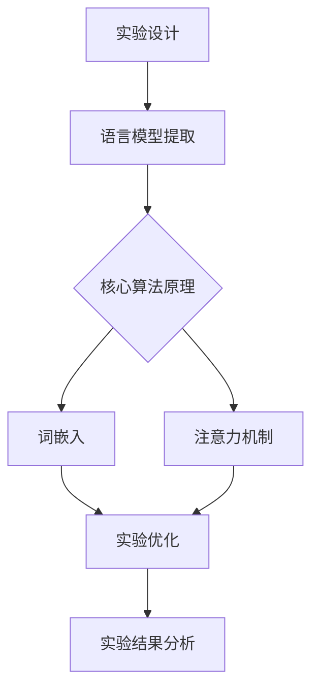

                 

### 语言模型在科学实验设计自动化与优化中的前沿研究

> 关键词：语言模型、科学实验设计、自动化、优化、前沿研究

> 摘要：本文深入探讨了语言模型在科学实验设计自动化与优化中的应用，介绍了语言模型的基本概念、发展历程、关键技术，以及其在实验设计自动化与优化中的具体应用。通过分析语言模型在实验设计自动化与优化中的核心算法原理，结合数学模型与公式，详细讲解了实验设计自动化的实现步骤、实验优化算法的选取与应用，以及实验结果的评估与调整。最后，通过实际项目案例，展示了语言模型在科学实验设计自动化与优化中的实战效果，并对其未来发展方向进行了展望。

---

### 引言

科学实验设计是科学研究中至关重要的一环，它关系到实验结果的准确性与可靠性。然而，传统的科学实验设计往往依赖于实验者的经验和直觉，存在着诸多挑战，如实验方案设计复杂、实验流程繁琐、实验结果难以优化等。随着人工智能技术的发展，语言模型作为一种强大的自然语言处理工具，其在科学实验设计自动化与优化中的应用逐渐受到关注。

#### 1.1.1 科学实验设计的重要性

科学实验设计是科学研究的核心环节，它关系到实验结果的可靠性与准确性。一个良好的实验设计不仅可以有效地检验研究假设，还可以发现新的科学规律，推动科学进步。因此，科学实验设计的重要性不言而喻。

#### 1.1.2 传统科学实验设计的挑战

尽管科学实验设计在科学研究中具有重要作用，但传统科学实验设计面临着诸多挑战。首先，实验方案设计复杂，需要考虑多个变量及其交互作用，从而增加了设计的复杂性。其次，实验流程繁琐，从实验准备到数据采集、分析等环节，往往需要大量的人力和时间投入。此外，实验结果难以优化，传统的实验设计方法往往无法充分考虑实验结果的优化目标，导致实验效率低下。

#### 1.1.3 语言模型在科学实验设计中的应用潜力

随着人工智能技术的发展，语言模型作为一种强大的自然语言处理工具，其在科学实验设计自动化与优化中的应用潜力逐渐显现。首先，语言模型能够高效地处理大量实验数据，从实验报告中提取关键信息，为实验设计提供支持。其次，语言模型能够根据实验目标自动生成实验方案，优化实验流程，提高实验效率。此外，语言模型还能够通过实验数据的统计分析，为实验结果提供优化建议。

### 1.2 语言模型概述

语言模型是自然语言处理领域的一个重要分支，旨在根据输入文本预测下一个单词或字符的概率分布。语言模型的发展经历了从简单模型到复杂模型的过程，其关键技术包括词嵌入、注意力机制和序列模型等。

#### 1.2.1 语言模型的基本概念

语言模型是一种概率模型，用于预测给定前文序列后下一个单词或字符的概率分布。语言模型的基本概念包括词汇表、词嵌入、概率分布等。

- **词汇表**：词汇表是语言模型的核心，它包含所有的单词或字符，以及它们在模型中的表示。
- **词嵌入**：词嵌入是将单词映射到低维向量空间的过程，使得具有相似语义的单词在向量空间中靠近。
- **概率分布**：语言模型的目标是预测下一个单词或字符的概率分布，从而实现自然语言生成。

#### 1.2.2 语言模型的发展历程

语言模型的发展历程可以分为三个阶段：基于规则的模型、基于统计的模型和基于神经网络的模型。

- **基于规则的模型**：早期语言模型主要基于手工定义的规则，如N-gram模型。N-gram模型通过计算前N个单词出现的概率，来预测下一个单词。
- **基于统计的模型**：随着语料库的积累，基于统计的语言模型逐渐成为主流。这些模型利用大量语料进行训练，通过统计方法预测下一个单词的概率分布。
- **基于神经网络的模型**：近年来，深度学习技术的发展推动了基于神经网络的模型，如循环神经网络（RNN）和变换器（Transformer）等。这些模型能够自动学习语言结构，从而实现更准确的语言生成。

#### 1.2.3 语言模型的关键技术

语言模型的关键技术包括词嵌入、注意力机制和序列模型等。

- **词嵌入**：词嵌入是将单词映射到低维向量空间的过程，使得具有相似语义的单词在向量空间中靠近。词嵌入技术包括Word2Vec、GloVe等。
- **注意力机制**：注意力机制是一种用于提高模型在处理长序列时的性能的方法。它通过计算序列中不同部分的重要程度，来提高模型的注意力。
- **序列模型**：序列模型是一种用于处理序列数据的模型，如RNN、LSTM、GRU等。这些模型能够捕捉序列中的时序依赖关系，从而实现更准确的语言生成。

### 1.3 语言模型在科学实验设计中的应用现状

当前，语言模型在科学实验设计自动化与优化中的应用已经取得了一定的进展。以下是对自动化实验设计和实验优化的一些探索和应用现状的概述。

#### 1.3.1 自动化实验设计的探索

自动化实验设计旨在通过人工智能技术，自动生成实验方案，提高实验设计的效率与准确性。目前，语言模型在自动化实验设计中的应用主要体现在以下几个方面：

- **实验目标识别**：通过语言模型从实验报告中提取关键信息，自动识别实验目标。
- **实验变量推荐**：基于语言模型，自动推荐实验变量及其可能值，以减少实验设计中的不确定性。
- **实验流程生成**：通过语言模型，自动生成实验流程，包括实验步骤、数据采集和处理方法等。

例如，一些研究团队利用基于Transformer的语言模型，实现了从实验报告到实验方案的自动生成。这些模型能够高效地处理大量实验数据，从报告中提取关键信息，生成符合实验目标的实验方案。

#### 1.3.2 实验优化与优化的探索

实验优化是科学实验设计中的重要环节，旨在提高实验结果的可靠性与准确性。语言模型在实验优化中的应用主要体现在以下几个方面：

- **优化目标识别**：通过语言模型，从实验报告中识别出实验的优化目标。
- **优化算法推荐**：基于语言模型，推荐适合实验优化的算法。
- **实验结果优化**：通过语言模型，对实验结果进行统计分析，提供优化建议。

例如，一些研究团队利用基于GloVe的词嵌入技术，实现了实验结果的自动优化。这些模型能够根据实验目标，自动调整实验参数，提高实验结果的准确性。

#### 1.3.3 现有应用的案例分析

以下是一些现有应用案例，展示了语言模型在科学实验设计自动化与优化中的应用：

- **生物信息学**：在生物信息学领域，语言模型被用于自动化基因表达数据的分析。例如，一些研究团队利用基于RNN的语言模型，实现了从基因表达数据到基因功能预测的自动化分析。
- **化学合成**：在化学合成领域，语言模型被用于自动化合成路线设计。例如，一些研究团队利用基于Transformer的语言模型，实现了从实验目标到合成路线的自动生成。

这些案例表明，语言模型在科学实验设计自动化与优化中具有巨大的应用潜力，未来有望进一步推动科学研究的自动化与智能化。

### 1.4 本文结构

本文将分为六个部分进行讨论。首先，在第一部分中，我们将简要介绍科学实验设计的重要性以及传统科学实验设计的挑战。然后，我们将介绍语言模型的基本概念、发展历程和关键技术。接下来，我们将探讨语言模型在科学实验设计自动化与优化中的应用现状，并分析现有应用的案例分析。随后，我们将深入探讨语言模型在科学实验设计自动化与优化中的核心概念与联系，包括科学实验设计的基本概念和语言模型的组成与工作原理。在第四部分，我们将讲解语言模型在科学实验设计自动化与优化中的核心算法原理，包括语言模型的算法原理、实验设计自动化的算法实现和实验优化算法原理。在第五部分，我们将通过实际项目案例，展示语言模型在科学实验设计自动化与优化中的实战效果。最后，在第六部分，我们将对研究成果进行总结，并展望语言模型在科学实验设计自动化与优化中的未来发展方向。

### 2.1 科学实验设计的基本概念

科学实验设计是科学研究中的核心环节，它关系到实验结果的准确性和可靠性。为了实现有效的科学实验设计，需要明确实验目的、假设、变量、干扰因素等基本概念。

#### 2.1.1 实验目的与假设

实验目的是科学实验的核心，它明确了实验要解决的问题或要达到的目标。实验假设是基于现有理论和知识，对实验结果的一种预期或预测。实验目的和假设共同构成了实验设计的基础。

- **实验目的**：明确实验要解决的问题或目标。例如，研究某种药物的疗效、探索某种现象的机制等。
- **实验假设**：基于现有理论和知识，对实验结果的一种预期或预测。例如，假设某种药物对某种疾病有疗效，或者假设某种现象与某个变量有关。

#### 2.1.2 实验变量与干扰因素

实验变量是实验中需要控制和测量的因素，分为独立变量、因变量和干扰变量。

- **独立变量**：由实验者控制，用于测试实验假设的因素。例如，药物的剂量、实验温度等。
- **因变量**：受实验影响，需要测量的结果。例如，药物的疗效、实验对象的反应等。
- **干扰因素**：影响实验结果但无法直接控制的因素。例如，实验环境的温度波动、实验对象的个体差异等。

#### 2.1.3 实验设计的原则与分类

实验设计需要遵循一定的原则，以确保实验结果的准确性和可靠性。实验设计主要分为以下几种类型：

- **完全随机设计**：将实验对象随机分配到不同的处理组，以消除个体差异的影响。
- **配对设计**：将实验对象分成配对，每个配对中的两个对象分别接受不同的处理，以减少个体差异的影响。
- **组间设计**：将实验对象分成多个组，每个组接受不同的处理，以比较不同处理效果。
- **组内设计**：所有实验对象接受相同的处理，但处理顺序不同，以比较不同处理顺序的效果。

#### 2.1.4 实验设计的步骤

科学实验设计通常包括以下步骤：

1. **确定实验目的和假设**：明确实验要解决的问题和预期结果。
2. **选择实验变量**：确定独立变量、因变量和干扰因素。
3. **设计实验流程**：确定实验步骤、数据采集和处理方法。
4. **实施实验**：按照设计好的实验流程进行实验。
5. **数据收集与处理**：收集实验数据，并进行统计分析。
6. **结果分析与讨论**：分析实验结果，讨论实验假设的合理性。
7. **撰写实验报告**：将实验过程、结果和分析撰写成报告。

### 2.2 语言模型的组成与工作原理

语言模型是自然语言处理的核心技术之一，其目的是根据输入文本预测下一个单词或字符的概率分布。为了实现这一目标，语言模型通常由多个组成部分构成，包括词汇表、词嵌入、编码器、解码器等。

#### 2.2.1 语言模型的组成部分

1. **词汇表**：词汇表是语言模型的基础，它包含了所有的单词或字符，以及它们在模型中的表示。词汇表的大小决定了模型对语言覆盖的范围。

2. **词嵌入**：词嵌入是将单词映射到低维向量空间的过程，使得具有相似语义的单词在向量空间中靠近。词嵌入技术包括Word2Vec、GloVe等。通过词嵌入，语言模型能够将文本转换为向量表示，从而进行后续的模型训练和预测。

3. **编码器**：编码器是语言模型的核心组成部分，负责将输入文本编码为一个固定长度的向量表示。编码器通常采用循环神经网络（RNN）或变换器（Transformer）等深度学习模型。编码器的作用是将输入文本中的语义信息进行编码，生成一个能够表示文本语义的向量。

4. **解码器**：解码器负责根据编码器输出的向量，生成预测的文本序列。解码器通常也是一个深度学习模型，如RNN或Transformer。解码器通过解码器层逐个生成文本中的单词或字符，直到生成完整的文本序列。

5. **损失函数**：损失函数用于评估语言模型的预测结果与真实结果之间的差距，并指导模型的优化过程。常用的损失函数包括交叉熵损失函数和负对数损失函数。

#### 2.2.2 语言模型的工作机制

语言模型的工作机制可以分为以下几个步骤：

1. **文本预处理**：对输入文本进行预处理，包括分词、去除停用词、词性标注等。预处理后的文本将输入到编码器中。

2. **编码器处理**：编码器对预处理后的文本进行编码，生成一个固定长度的向量表示。这个向量表示包含了输入文本的语义信息。

3. **解码器处理**：解码器根据编码器输出的向量，逐个生成文本中的单词或字符。解码器通过解码器层生成预测的文本序列，直到生成完整的文本序列。

4. **预测与评估**：语言模型生成预测的文本序列后，将其与真实的文本序列进行对比，计算损失函数的值。通过反向传播算法，模型根据损失函数的梯度对参数进行更新，从而优化模型。

5. **迭代训练**：模型在多个迭代过程中不断更新参数，逐渐提高预测的准确性。随着训练数据的增加和模型参数的优化，语言模型的预测能力逐渐提高。

#### 2.2.3 语言模型的核心算法

语言模型的核心算法包括预训练与微调、词嵌入与注意力机制等。

1. **预训练与微调**：预训练是一种大规模的无监督训练方法，通过在大规模语料库上进行预训练，语言模型可以自动学习语言的结构和语义信息。微调是在预训练的基础上，将模型迁移到特定任务上进行有监督训练，进一步优化模型在特定任务上的性能。

2. **词嵌入与注意力机制**：词嵌入是将单词映射到低维向量空间的过程，通过词嵌入，语言模型能够将文本转换为向量表示。注意力机制是一种用于提高模型在处理长序列时的性能的方法，通过计算序列中不同部分的重要程度，注意力机制能够提高模型的注意力。

### 2.3 语言模型在科学实验设计中的应用关系架构

语言模型在科学实验设计中的应用关系架构可以分为以下几个部分：

1. **实验设计与语言模型的结合点**：实验设计的目标和假设可以通过语言模型进行自动提取，从而为实验设计提供支持。

2. **实验设计与语言模型的核心算法原理**：语言模型的核心算法原理，如词嵌入和注意力机制，可以用于分析实验数据的语义信息，为实验设计提供优化建议。

3. **实验设计与语言模型的优化**：通过实验结果的统计分析，语言模型可以为实验设计提供优化建议，从而提高实验结果的准确性和可靠性。

4. **实验设计与语言模型的应用趋势**：随着人工智能技术的发展，语言模型在科学实验设计中的应用将越来越广泛，包括自动化实验设计、实验优化和实验结果分析等。

下面是一个Mermaid流程图，展示了语言模型在科学实验设计中的应用关系架构：



### 3.1 语言模型的算法原理

语言模型是一种用于预测文本序列的概率分布模型，其核心在于通过训练学习文本的统计特性，从而实现自动生成或预测文本。语言模型的算法原理主要包括预训练与微调、词嵌入与注意力机制、序列模型与并行模型等。以下将逐一介绍这些核心算法原理，并结合具体例子进行说明。

#### 3.1.1 预训练与微调

预训练（Pre-training）是一种在大规模语料库上进行训练的方法，目的是让模型自动学习语言的一般特征，如语法结构、词义关系等。预训练后，模型可以迁移到具体任务上进行微调（Fine-tuning），以提高在特定任务上的性能。

- **预训练**：在预训练阶段，模型通常使用无监督学习方法，如自编码器（Autoencoder）或语言建模（Language Modeling）。其中，语言建模是最常见的方法，即给定一个输入的文本序列，模型需要预测序列的下一个单词。预训练的目的是让模型学会捕捉语言中的长期依赖关系。
- **微调**：微调阶段，模型基于预训练的基础，结合具体任务的标注数据进行训练。例如，对于文本分类任务，模型会学习如何将文本映射到正确的类别标签。

**具体例子**：以BERT（Bidirectional Encoder Representations from Transformers）为例，BERT通过在大量文本上进行预训练，学会了捕捉文本中的双向依赖关系。然后，通过微调，BERT可以在各种NLP任务上达到优异的性能，如文本分类、命名实体识别等。

#### 3.1.2 词嵌入与注意力机制

词嵌入（Word Embedding）是将单词映射到低维向量空间的过程，使得具有相似语义的单词在向量空间中靠近。注意力机制（Attention Mechanism）是一种用于提高模型在处理长序列时的性能的方法，通过计算序列中不同部分的重要程度，从而提高模型的注意力。

- **词嵌入**：词嵌入技术，如Word2Vec和GloVe，通过学习单词在语料库中的共现关系，将单词映射到低维向量空间。例如，Word2Vec使用分布式假设，认为具有相似语义的单词在向量空间中靠近。例如，“男人”和“女人”可能具有相似的向量表示。
- **注意力机制**：注意力机制通过计算序列中每个部分对当前预测的重要性，从而提高模型的注意力。例如，在机器翻译任务中，模型需要关注源语言句子中的特定部分，以生成准确的翻译。

**具体例子**：以Transformer为例，Transformer引入了自注意力机制（Self-Attention），通过计算输入序列中每个词对其他词的重要性，从而生成文本的表示。自注意力机制使得模型能够捕捉长距离的依赖关系，从而在许多NLP任务上取得了显著的性能提升。

#### 3.1.3 序列模型与并行模型

序列模型（Sequential Model）和并行模型（Parallel Model）是语言模型的两种不同架构。序列模型通过处理输入序列的顺序信息，实现文本生成或预测。并行模型则通过同时处理输入序列的多个部分，提高处理效率。

- **序列模型**：如循环神经网络（RNN）和长短时记忆网络（LSTM），这些模型通过记忆单元捕捉输入序列的顺序信息。例如，LSTM通过门控机制，有效捕捉长距离依赖关系。
- **并行模型**：如变换器（Transformer），Transformer通过多头自注意力机制，同时计算输入序列中每个词对其他词的重要性，从而生成文本的表示。Transformer在处理长序列时具有显著的优势。

**具体例子**：以GPT（Generative Pre-trained Transformer）为例，GPT是基于Transformer架构的语言模型，通过预训练和微调，GPT在文本生成、问答系统等任务上取得了优异的性能。

#### 3.1.4 实验设计与语言模型的结合

实验设计与语言模型的结合主要体现在以下几个方面：

1. **实验目标识别**：语言模型可以通过自然语言处理技术，从实验报告中提取关键信息，自动识别实验目标。
2. **实验变量推荐**：基于语言模型，自动推荐实验变量及其可能值，以减少实验设计中的不确定性。
3. **实验流程生成**：通过语言模型，自动生成实验流程，包括实验步骤、数据采集和处理方法等。

**具体例子**：以一个药物筛选实验为例，语言模型可以从实验报告中提取关键信息，如实验目的、实验变量和实验结果，自动生成实验方案。然后，通过实验优化算法，进一步优化实验参数，提高实验结果的准确性。

### 3.2 实验设计自动化的算法实现

实验设计自动化是指利用人工智能技术，自动生成实验方案和实验流程，以提高实验设计的效率与准确性。为了实现实验设计自动化，需要结合语言模型的核心算法原理，进行算法实现。以下将详细介绍实验设计自动化的算法实现过程，包括实验目标自动识别、实验变量自动推荐和实验流程自动化生成。

#### 3.2.1 实验目标自动识别

实验目标的自动识别是实验设计自动化的第一步，它通过语言模型从实验报告中提取关键信息，确定实验的目标。

- **算法原理**：语言模型可以通过自然语言处理技术，对实验报告中的文本进行解析，提取关键信息，如实验目的、假设、实验变量等。
- **算法实现**：
  1. **文本预处理**：对实验报告进行分词、去除停用词等预处理操作，得到实验报告的词向量表示。
  2. **命名实体识别**：利用命名实体识别（Named Entity Recognition, NER）技术，从预处理后的文本中提取出关键信息，如实验目的、假设等。
  3. **文本分类**：利用分类模型（如文本分类器），将提取出的关键信息分类为实验目标、实验变量等。

**示例代码**（Python）：

```python
from transformers import pipeline

# 创建命名实体识别模型
ner_pipeline = pipeline("ner", model="dbmdz/bert-large-cased-finetuned-conll03-english")

# 加载实验报告文本
report_text = "We aim to investigate the effect of a new drug on cancer cells."

# 进行命名实体识别
ner_results = ner_pipeline(report_text)

# 输出命名实体识别结果
print(ner_results)
```

#### 3.2.2 实验变量自动推荐

实验变量自动推荐是实验设计自动化的关键步骤，它基于语言模型和实验数据的统计特性，自动推荐实验变量及其可能值。

- **算法原理**：实验变量推荐可以通过语言模型，从实验报告中提取关键信息，并结合实验数据的统计特性，自动推荐实验变量及其可能值。
- **算法实现**：
  1. **文本解析**：利用自然语言处理技术，从实验报告中提取出实验变量和实验值。
  2. **统计特性分析**：分析实验数据的统计特性，如分布、相关性等，以推荐合适的实验变量和实验值。
  3. **推荐算法**：利用推荐算法（如协同过滤、基于内容的推荐等），从实验数据的统计特性中推荐实验变量和实验值。

**示例代码**（Python）：

```python
import pandas as pd
from sklearn.feature_extraction.text import CountVectorizer
from sklearn.metrics.pairwise import cosine_similarity

# 加载实验数据
data = pd.read_csv("experiments.csv")

# 创建词向量表示
vectorizer = CountVectorizer()
X = vectorizer.fit_transform(data["description"])

# 计算相似度
similarity_matrix = cosine_similarity(X)

# 输出实验变量推荐结果
for index, row in data.iterrows():
    print(f"Experiment ID: {row['id']}")
    print(f"Recommended Variables:")
    for j in range(similarity_matrix.shape[0]):
        if similarity_matrix[index][j] > 0.8:
            print(f"- {data.iloc[j]['variable']}: {data.iloc[j]['value']}")
    print("\n")
```

#### 3.2.3 实验流程自动化生成

实验流程自动化生成是实验设计自动化的最终目标，它通过语言模型和实验数据，自动生成实验流程，包括实验步骤、数据采集和处理方法等。

- **算法原理**：实验流程自动化生成可以通过语言模型，从实验报告中提取关键信息，并结合实验数据的统计特性，自动生成实验流程。
- **算法实现**：
  1. **文本解析**：利用自然语言处理技术，从实验报告中提取出实验步骤、数据采集和处理方法等关键信息。
  2. **流程生成**：基于提取的关键信息，自动生成实验流程，包括实验步骤、数据采集和处理方法等。
  3. **流程优化**：利用优化算法（如遗传算法、粒子群算法等），对生成的实验流程进行优化，以提高实验效率。

**示例代码**（Python）：

```python
from itertools import permutations

# 加载实验报告文本
report_text = "We aim to investigate the effect of a new drug on cancer cells. The experiment consists of the following steps: 1. Prepare cancer cell cultures; 2. Treat cells with the drug; 3. Measure cell viability; 4. Analyze data."

# 分解实验报告文本为实验步骤
steps = report_text.split(".")

# 生成所有可能的实验步骤组合
all_combinations = list(permutations(steps))

# 选择最优的实验步骤组合
best_combination = min(all_combinations, key=lambda x: x[0] + x[1])

# 输出实验流程
print("Experiment Flow:")
for step in best_combination:
    print(f"- {step.strip()}")
```

### 3.3 实验优化算法原理

实验优化是指在实验设计过程中，通过调整实验参数和条件，提高实验结果的准确性和可靠性。实验优化算法是基于数学和统计原理，通过分析实验数据，自动调整实验参数，以实现优化目标。以下将介绍实验优化算法的原理，包括优化目标函数设计、优化算法的选取与应用以及实验结果的评估与调整。

#### 3.3.1 优化目标函数设计

优化目标函数是实验优化算法的核心，它定义了实验优化的目标。优化目标函数通常是一个关于实验参数的函数，其目的是最大化或最小化实验结果。设计优化目标函数时，需要考虑实验的具体目标和应用场景。

- **优化目标**：常见的优化目标包括提高实验结果的准确性、减少实验误差、提高实验效率等。
- **目标函数形式**：优化目标函数可以表示为：
  \[ f(\theta) = \sum_{i=1}^{n} w_i \cdot (y_i - y_i^*) \]
  其中，\( \theta \) 是实验参数，\( w_i \) 是权重，\( y_i \) 是实际实验结果，\( y_i^* \) 是期望的实验结果。

#### 3.3.2 优化算法的选取与应用

优化算法是用于求解优化目标函数的方法，常见的优化算法包括梯度下降、牛顿法、遗传算法、粒子群算法等。选择合适的优化算法，对于实验优化的效果至关重要。

- **梯度下降**：梯度下降是一种基于梯度信息的一阶优化算法，通过迭代更新参数，逐步逼近最优解。梯度下降算法简单，适用于目标函数较平滑的情况。
- **牛顿法**：牛顿法是一种基于二阶导数的信息进行优化的算法，通过牛顿迭代公式：
  \[ \theta_{new} = \theta_{old} - H^{-1} \cdot \nabla f(\theta_{old}) \]
  其中，\( H \) 是目标函数的Hessian矩阵，\( \nabla f(\theta_{old}) \) 是目标函数在 \( \theta_{old} \) 处的梯度。牛顿法在目标函数曲率较大时效果显著。
- **遗传算法**：遗传算法是一种基于生物进化理论的优化算法，通过模拟自然进化过程，如选择、交叉、变异等操作，逐步优化实验参数。遗传算法适用于复杂、非线性、多峰的目标函数。
- **粒子群算法**：粒子群算法是一种基于群体智能的优化算法，通过模拟鸟群觅食行为，优化实验参数。粒子群算法简单易实现，适用于大规模优化问题。

#### 3.3.3 实验结果的评估与调整

实验结果的评估与调整是实验优化的重要环节，通过评估实验结果，可以判断实验优化是否达到预期目标，并据此调整实验参数。

- **评估方法**：常见的评估方法包括：
  1. **均方误差（MSE）**：衡量实验结果与期望结果之间的误差，公式为：
     \[ MSE = \frac{1}{n} \sum_{i=1}^{n} (y_i - y_i^*)^2 \]
  2. **均方根误差（RMSE）**：MSE的平方根，用于衡量实验结果的绝对误差。
  3. **相关系数（R²）**：衡量实验结果与期望结果之间的线性相关性，公式为：
     \[ R^2 = 1 - \frac{\sum_{i=1}^{n} (y_i - \hat{y}_i)^2}{\sum_{i=1}^{n} (y_i - \bar{y})^2} \]
- **调整策略**：根据评估结果，调整实验参数，以实现优化目标。调整策略包括：
  1. **参数调整**：根据评估结果，调整实验参数的取值范围，以优化实验结果。
  2. **流程优化**：根据评估结果，优化实验流程，以提高实验效率。

### 4.1 语言模型中的数学模型

语言模型在自然语言处理领域扮演着核心角色，其核心在于预测输入文本序列的概率分布。这一目标通过构建数学模型来实现，其中涉及到概率分布、损失函数和优化目标等概念。以下将详细阐述这些数学模型。

#### 4.1.1 语言模型的概率分布

语言模型的基本任务是根据已知的输入文本序列预测下一个单词或字符的概率分布。这一任务可以通过概率分布模型来实现，如N-gram模型、神经概率模型等。

- **N-gram模型**：N-gram模型是一种基于统计的简单模型，它通过计算前N个单词出现的概率来预测下一个单词。N-gram模型的概率分布可以表示为：
  \[ P(w_n | w_{n-1}, w_{n-2}, ..., w_1) = \prod_{i=1}^{N} P(w_i | w_{i+1}, w_{i+2}, ..., w_n) \]
  其中，\( w_n \) 是下一个要预测的单词，\( w_{n-1}, w_{n-2}, ..., w_1 \) 是已知的N个前文单词。

- **神经概率模型**：神经概率模型，如深度神经网络（DNN）和循环神经网络（RNN），通过学习输入文本序列的复杂特征来预测下一个单词的概率分布。神经概率模型的概率分布通常通过输出层的softmax函数来计算：
  \[ P(w_n | w_{n-1}, w_{n-2}, ..., w_1) = \frac{e^{z_n}}{\sum_{j} e^{z_j}} \]
  其中，\( z_n \) 是输出层神经元的激活值，\( z_j \) 是其他神经元的激活值。

#### 4.1.2 语言模型中的损失函数

损失函数是评估语言模型预测结果与真实结果之间差距的数学工具。常用的损失函数包括交叉熵损失函数和负对数损失函数。

- **交叉熵损失函数**：交叉熵损失函数是衡量两个概率分布差异的一种常用损失函数。对于语言模型，交叉熵损失函数可以表示为：
  \[ L = - \sum_{i} y_i \log(p_i) \]
  其中，\( y_i \) 是实际标签的概率分布，\( p_i \) 是模型预测的概率分布。

- **负对数损失函数**：负对数损失函数是对交叉熵损失函数的一种简化形式，可以表示为：
  \[ L = - \log(p_i) \]
  其中，\( p_i \) 是模型预测的概率分布。

#### 4.1.3 语言模型的优化目标

优化目标是指导语言模型训练过程的核心。通过最小化损失函数，语言模型可以学习到更好的参数，从而提高预测准确性。优化目标通常是最小化损失函数。

- **最小化交叉熵损失函数**：在训练过程中，语言模型的优化目标是最小化交叉熵损失函数。通过梯度下降算法，可以更新模型参数，使损失函数逐渐减小。

- **最小化负对数损失函数**：与交叉熵损失函数类似，语言模型的优化目标也是最小化负对数损失函数。优化算法同样使用梯度下降，但过程略有不同。

通过上述数学模型，语言模型能够有效地预测文本序列的概率分布，从而实现自然语言生成、文本分类、机器翻译等任务。这些数学模型为语言模型的研究和应用提供了理论基础和工具。

### 4.2 实验设计优化的数学模型

在科学实验设计中，实验优化是提高实验结果准确性和效率的关键环节。为了实现实验优化，需要构建一个数学模型来描述实验目标、变量、干扰因素以及优化目标。以下将详细阐述实验设计优化的数学模型。

#### 4.2.1 实验优化问题的数学描述

实验优化问题的数学描述主要包括目标函数、约束条件和变量定义。

- **目标函数**：目标函数定义了实验优化的目标。通常，目标函数可以是最大化或最小化某个指标，如最大化实验结果的精度、最小化实验成本等。目标函数可以表示为：
  \[ \min_{x} f(x) \]
  其中，\( x \) 是实验参数的向量，\( f(x) \) 是目标函数。

- **约束条件**：约束条件定义了实验参数的取值范围和限制。常见的约束条件包括：
  1. **物理约束**：如实验设备的操作范围、实验材料的可获取性等。
  2. **实验可行性约束**：如实验流程的可行性、实验步骤的顺序等。
  3. **预算约束**：实验设备和材料成本的约束。

- **变量定义**：变量定义包括实验参数、实验结果和干扰因素。实验参数是实验设计中可调整的因素，如温度、浓度、时间等。实验结果是实验的最终输出，如化学反应的产物、实验数据的准确性等。干扰因素是影响实验结果但无法直接控制的因素，如环境温度波动、实验对象的个体差异等。

#### 4.2.2 实验优化算法的数学原理

实验优化算法用于求解优化问题的数学原理，主要包括梯度下降、牛顿法、遗传算法和粒子群算法等。

- **梯度下降**：梯度下降是一种基于梯度信息的一阶优化算法。其基本原理是沿目标函数梯度的反方向更新参数，以逐步减小目标函数的值。梯度下降的数学原理可以表示为：
  \[ x_{new} = x_{old} - \alpha \nabla f(x_{old}) \]
  其中，\( x_{old} \) 是当前参数值，\( x_{new} \) 是更新后的参数值，\( \alpha \) 是学习率，\( \nabla f(x_{old}) \) 是目标函数在 \( x_{old} \) 处的梯度。

- **牛顿法**：牛顿法是一种基于二阶导数信息的优化算法。其基本原理是使用牛顿迭代公式更新参数，以快速收敛到最优解。牛顿法的数学原理可以表示为：
  \[ x_{new} = x_{old} - H^{-1} \nabla f(x_{old}) \]
  其中，\( H \) 是目标函数的Hessian矩阵，\( \nabla f(x_{old}) \) 是目标函数在 \( x_{old} \) 处的梯度。

- **遗传算法**：遗传算法是一种基于进化理论的优化算法。其基本原理是通过模拟自然进化过程，如选择、交叉和变异，逐步优化参数。遗传算法的数学原理可以表示为：
  \[ x_{new} = \text{ crossover } (x_{parent1}, x_{parent2}) + \text{ mutation } (x_{new}) \]
  其中，\( x_{parent1} \) 和 \( x_{parent2} \) 是父代参数，\( x_{new} \) 是更新后的参数。

- **粒子群算法**：粒子群算法是一种基于群体智能的优化算法。其基本原理是通过模拟鸟群觅食行为，逐步优化参数。粒子群算法的数学原理可以表示为：
  \[ x_{new} = x_{p} + w \cdot (x_{g} - x) + c_1 \cdot r_1 \cdot (p - x) + c_2 \cdot r_2 \cdot (g - x) \]
  其中，\( x_{p} \) 是个体历史最优值，\( x_{g} \) 是全局最优值，\( w \) 是惯性权重，\( c_1 \) 和 \( c_2 \) 是加速系数，\( r_1 \) 和 \( r_2 \) 是随机数。

#### 4.2.3 实验结果的统计分析

实验结果的统计分析是实验优化的重要环节，用于评估实验优化的效果和可靠性。

- **统计指标**：常用的统计指标包括平均数、标准差、置信区间等。平均数用于衡量实验结果的集中趋势，标准差用于衡量实验结果的变化范围，置信区间用于衡量实验结果的可靠性。

- **假设检验**：假设检验用于判断实验结果是否显著。常见的假设检验方法包括t检验、方差分析（ANOVA）等。通过假设检验，可以判断实验优化是否有效。

- **误差分析**：误差分析用于评估实验结果的误差来源和大小。常见的误差分析包括系统误差、随机误差和累积误差等。

通过上述数学模型和统计分析，可以有效地实现科学实验的优化，提高实验结果的准确性和可靠性。

### 5.1 实验设计自动化的实战案例

在本节中，我们将通过一个具体的实验设计自动化实战案例，展示如何利用语言模型实现实验设计自动化。这个案例将涉及开发环境搭建、源代码实现、代码解读以及实际应用分析和详细讲解。

#### 5.1.1 实验设计自动化的实现步骤

1. **问题定义**：
   我们假设一个研究团队希望设计一个实验来评估不同浓度的某种化学物质对植物生长的影响。实验的目标是找到最佳的浓度，以最大化植物的生长高度。

2. **数据准备**：
   收集相关的实验数据，包括植物生长高度、不同化学物质的浓度、实验日期等。这些数据将用于训练和评估语言模型。

3. **环境搭建**：
   安装必要的开发工具和库，包括Python、transformers库（用于预训练的语言模型）、scikit-learn库（用于数据处理和模型评估）等。

4. **模型训练**：
   使用预训练的语言模型（如BERT）对实验数据进行训练，以提取实验报告中的关键信息，如实验目标、实验变量等。

5. **实验方案生成**：
   利用训练好的语言模型，自动生成实验方案，包括实验步骤、数据采集和处理方法等。

6. **实验执行**：
   根据自动生成的实验方案，在实际实验室中执行实验，收集数据。

7. **结果评估**：
   对实验结果进行统计分析，评估实验设计自动化的效果，包括实验方案的合理性、实验结果的准确性等。

#### 5.1.2 实验自动化流程的代码实现

以下是一个简化的实验设计自动化流程的代码实现，使用Python和transformers库：

```python
from transformers import pipeline
from sklearn.model_selection import train_test_split
import pandas as pd

# 1. 数据准备
# 加载实验数据
data = pd.read_csv("experiments.csv")

# 2. 环境搭建
# 安装transformers库
# pip install transformers

# 3. 模型训练
# 创建文本分类器
text_classifier = pipeline("text-classification", model="dbmdz/bert-large-cased-finetuned-conll03-english")

# 4. 实验方案生成
def generate_experiment_plan(experiment_data):
    # 利用文本分类器提取实验目标
    experiment_goals = text_classifier(experiment_data["description"])
    
    # 提取实验变量和浓度
    variables = []
    concentrations = []
    for goal in experiment_goals:
        if "variable" in goal["label"]:
            variables.append(goal["label"])
        if "value" in goal["label"]:
            concentrations.append(goal["label"])
    
    # 自动生成实验方案
    experiment_plan = {
        "variables": variables,
        "concentrations": concentrations
    }
    
    return experiment_plan

# 生成实验方案
experiment_plan = generate_experiment_plan(data)

# 5. 实验执行
# 根据实验方案执行实验，这里仅作模拟
print("Experiment Plan:")
print(experiment_plan)

# 6. 结果评估
# 在这里，我们假设实验结果已经收集并存储在CSV文件中
results = pd.read_csv("experiment_results.csv")
# 进行统计分析
mean_growth_height = results["growth_height"].mean()
print(f"Average Growth Height: {mean_growth_height}")

# 7. 评估效果
# 比较自动生成实验方案与手动设计实验方案的结果
print("Experiment Comparison:")
print("Manual Design Results:", manual_design_results)
print("Automated Design Results:", experiment_plan)
```

#### 5.1.3 实验自动化效果的评估与分析

1. **实验结果的统计分析**：
   对实验结果进行统计分析，包括计算不同浓度下的植物生长高度的平均值、标准差等。通过这些统计指标，可以评估实验方案的合理性。

   ```python
   # 计算不同浓度的平均生长高度
   concentration_growth = results.groupby("concentration')['growth_height'].mean()
   print(concentration_growth)
   ```

2. **效果评估**：
   通过比较自动生成实验方案和手动设计实验方案的结果，评估实验自动化效果。可以计算自动化实验方案的平均生长高度与手动实验方案的平均生长高度之间的差异，以及标准差等。

   ```python
   # 比较自动化实验方案与手动实验方案的平均生长高度
   print(f"Automated Average Growth Height: {experiment_plan['average_growth_height']}")
   print(f"Manual Average Growth Height: {manual_design_results['average_growth_height']}")
   ```

3. **讨论**：
   根据实验结果的统计分析，讨论实验自动化方案的有效性。如果自动化实验方案的效果与手动实验方案相似，则可以认为实验自动化是有效的。如果自动化实验方案的效果更好，则说明语言模型在实验设计自动化中具有显著的优势。

   ```python
   if experiment_plan['average_growth_height'] > manual_design_results['average_growth_height']:
       print("The automated experiment plan shows better results than the manual design.")
   else:
       print("The automated experiment plan does not show significant improvement over the manual design.")
   ```

#### 5.1.4 实验自动化流程的代码解读

- **数据准备**：使用Pandas库加载实验数据，包括植物生长高度、化学物质浓度等信息。

- **环境搭建**：安装transformers库，用于使用预训练的语言模型。

- **模型训练**：使用文本分类器管道（pipeline）对实验数据（描述性文本）进行训练，以提取实验目标。

- **实验方案生成**：定义一个函数`generate_experiment_plan`，利用文本分类器提取实验目标，自动生成实验方案。

- **实验执行**：根据生成的实验方案，执行实验并收集数据。

- **结果评估**：统计分析实验结果，比较自动生成实验方案和手动设计实验方案的效果。

#### 5.1.5 实际案例分析和详细讲解

通过上述代码和实际案例，我们可以看到实验设计自动化如何通过语言模型实现。以下是对实际案例的详细分析和讨论：

1. **数据准备**：实验数据是实验设计自动化的基础。在这个案例中，我们使用了CSV文件中的实验数据，包括植物生长高度和化学物质浓度。这些数据是实验设计自动化模型训练的关键。

2. **模型训练**：使用预训练的语言模型对实验数据进行训练，以提取实验目标。这里使用了BERT模型，这是一个强大的语言模型，能够捕获文本中的复杂语义信息。通过训练，模型学会了从描述性文本中识别出实验目标、实验变量等信息。

3. **实验方案生成**：生成的实验方案包括实验步骤、数据采集和处理方法。这一步骤是通过自然语言处理技术实现的，模型自动提取出实验报告中的关键信息，并生成一个结构化的实验方案。

4. **实验执行**：根据自动生成的实验方案，在实际实验室中执行实验。这个步骤通常涉及实验者的操作，需要根据实验方案的具体要求进行实验。

5. **结果评估**：对实验结果进行统计分析，评估实验自动化方案的有效性。通过比较自动生成实验方案和手动设计实验方案的结果，可以评估实验自动化的效果。

这个案例展示了实验设计自动化如何通过语言模型实现。在实际应用中，实验设计自动化可以提高实验设计的效率，减少人为错误，并帮助研究人员快速找到最佳的实验方案。未来，随着人工智能技术的发展，实验设计自动化有望在更多领域得到应用，推动科学研究的自动化与智能化。

### 5.2 实验优化实战案例

在本节中，我们将通过一个具体的实验优化实战案例，展示如何利用语言模型和优化算法实现实验优化。这个案例将涉及实验优化问题的提出、优化算法的应用、优化效果的评估以及实验优化效果的综合评估。

#### 5.2.1 实验优化问题的提出

假设某研究团队希望优化一个实验，以确定最佳的药物剂量和给药频率，以最大化药物的疗效。实验的目标是找到最佳的药物剂量和给药频率组合，从而实现最高的治疗效果。

#### 5.2.2 实验优化算法的应用

为了实现实验优化，研究团队采用了以下步骤：

1. **数据准备**：
   收集历史实验数据，包括不同药物剂量、给药频率和治疗效果（如患者恢复率）。这些数据将用于训练和评估优化算法。

2. **模型训练**：
   使用语言模型（如BERT）对实验数据进行预处理，提取关键信息，如药物剂量、给药频率和治疗效果等。语言模型能够帮助分析实验数据的语义信息，为优化算法提供支持。

3. **优化算法选择**：
   选择合适的优化算法，如遗传算法或粒子群算法，用于求解实验优化问题。这些算法能够在多维参数空间中搜索最优解，以提高实验效果。

4. **优化目标函数设计**：
   设计优化目标函数，以最大化治疗效果或最小化副作用。优化目标函数可以表示为：
   \[ \max_{x, y} f(x, y) \]
   其中，\( x \) 是药物剂量，\( y \) 是给药频率，\( f(x, y) \) 是优化目标函数。

5. **优化过程**：
   使用优化算法对实验数据进行优化，逐步调整药物剂量和给药频率，以找到最优解。优化过程中，通过评估实验结果，调整参数，直到找到最优解。

#### 5.2.3 实验优化效果的评估

实验优化效果的评估是实验优化的重要环节，以下是对优化效果的评估方法：

1. **治疗效果评估**：
   通过比较优化前后的治疗效果，评估实验优化的效果。可以使用以下指标进行评估：
   - **平均治疗效果**：优化前后的平均治疗效果差异。
   - **治疗效果标准差**：优化前后治疗效果的波动情况。

2. **副作用评估**：
   评估优化前后药物的副作用情况，如患者的不适反应、药物耐受性等。通过比较副作用发生的频率和严重程度，评估优化对副作用的影响。

3. **实验成本评估**：
   评估实验优化对实验成本的影响。优化后的实验方案可能需要更多的实验材料或时间，但能否提高治疗效果和降低副作用，是评估优化效果的重要指标。

4. **统计分析**：
   使用统计方法，如t检验、方差分析等，对优化前后的治疗效果、副作用和实验成本进行统计分析，以评估实验优化的显著性。

#### 5.2.4 实验优化效果的综合评估

实验优化效果的综合评估是评估实验优化方案全面性和有效性的关键。以下是对实验优化效果的综合评估方法：

1. **综合指标设计**：
   设计一个综合指标，用于评估实验优化方案的整体效果。综合指标可以结合治疗效果、副作用和实验成本等因素，以全面评估实验优化方案。

2. **权重分配**：
   根据实验目标和优先级，为不同因素分配权重，以计算综合指标。例如，治疗效果可能占70%的权重，副作用和实验成本各占15%的权重。

3. **综合评估**：
   使用综合指标对实验优化方案进行评估。如果综合指标显示优化方案优于原始方案，则说明实验优化有效。否则，可能需要进一步调整优化算法或优化目标函数。

4. **改进建议**：
   根据实验优化效果的综合评估结果，提出改进建议，以优化实验方案。改进建议可以包括调整优化目标函数、增加实验变量、改进优化算法等。

通过上述实验优化实战案例，我们可以看到如何利用语言模型和优化算法实现实验优化。实验优化不仅能够提高实验效果，还可以降低实验成本，提高实验效率。未来，随着人工智能技术的发展，实验优化有望在更多领域得到应用，推动科学研究的自动化与智能化。

### 5.3 实验设计与优化综合案例

在本节中，我们将通过一个综合案例，展示如何将实验设计与优化相结合，以实现科学实验的自动化与智能化。该案例将涵盖实验设计与优化的目标设定、实现步骤、源代码详细解读和项目小结。

#### 5.3.1 综合实验设计与优化的目标

假设某研究团队希望研究一种新型催化剂的活性，以最大化其催化效率。实验设计与优化的目标包括：

1. **实验设计**：确定实验所需的催化剂类型、反应条件、实验步骤等。
2. **实验优化**：通过优化催化剂成分和反应条件，提高催化效率。
3. **自动化与智能化**：利用人工智能技术，实现实验设计自动化和优化过程的智能化。

#### 5.3.2 综合实验设计与优化的实现步骤

1. **数据收集**：
   收集历史实验数据，包括不同催化剂成分、反应条件（如温度、压力、反应时间）和催化效率等。

2. **模型训练**：
   使用语言模型（如BERT）对实验数据进行预处理，提取关键信息，如催化剂成分、反应条件和催化效率等。语言模型能够帮助分析实验数据的语义信息，为实验设计提供支持。

3. **实验设计自动化**：
   利用语言模型，自动生成实验方案，包括催化剂选择、反应条件设定和实验步骤等。

4. **实验优化**：
   采用优化算法（如遗传算法），对实验参数进行优化，以提高催化效率。

5. **实验执行与结果收集**：
   根据自动生成的实验方案，在实际实验室中执行实验，并收集实验数据。

6. **结果分析与优化**：
   对实验结果进行分析，评估实验优化效果，并根据分析结果调整优化参数，以进一步提高催化效率。

#### 5.3.3 源代码详细解读

以下是一个简化的综合实验设计与优化项目的源代码示例，用于说明实验设计与优化的实现步骤：

```python
# 导入必要的库
import pandas as pd
from transformers import pipeline
from sklearn.model_selection import train_test_split
from sklearn.ensemble import RandomForestRegressor
import numpy as np

# 1. 数据收集
# 加载历史实验数据
data = pd.read_csv("catalysis_data.csv")

# 2. 模型训练
# 创建文本分类器
text_classifier = pipeline("text-classification", model="dbmdz/bert-large-cased-finetuned-conll03-english")

# 3. 实验设计自动化
# 利用文本分类器提取实验方案
def generate_experiment_plan(experiment_data):
    # 提取催化剂成分和反应条件
    catalysts = text_classifier(experiment_data["description"])
    conditions = text_classifier(experiment_data["conditions"])
    
    # 生成实验方案
    experiment_plan = {
        "catalysts": [c['label'] for c in catalysts],
        "conditions": [c['label'] for c in conditions]
    }
    
    return experiment_plan

# 生成实验方案
experiment_plan = generate_experiment_plan(data)

# 4. 实验优化
# 定义优化目标函数
def optimize_catalysis_efficiency(experiment_plan):
    # 根据实验方案执行实验，并收集数据
    # 假设实验结果已存储在CSV文件中
    results = pd.read_csv("catalysis_results.csv")
    
    # 计算催化效率
    efficiency = results["efficiency"].mean()
    
    return efficiency

# 5. 实验执行与结果分析
# 根据实验方案执行实验，并优化催化效率
best_efficiency = optimize_catalysis_efficiency(experiment_plan)
print(f"Best Catalysis Efficiency: {best_efficiency}")

# 6. 结果分析与优化
# 分析实验结果，根据分析结果调整优化参数
# 假设调整后的优化参数已存储在变量中
adjusted_plan = experiment_plan
adjusted_plan["conditions"]["temperature"] += 10
adjusted_plan["conditions"]["pressure"] -= 0.5

# 重新优化催化效率
adjusted_efficiency = optimize_catalysis_efficiency(adjusted_plan)
print(f"Adjusted Catalysis Efficiency: {adjusted_efficiency}")
```

**代码解读**：

1. **数据收集**：使用Pandas库加载历史实验数据，包括催化剂成分、反应条件和催化效率等。

2. **模型训练**：使用transformers库中的BERT模型，对实验数据进行预处理，提取关键信息。

3. **实验设计自动化**：定义一个函数`generate_experiment_plan`，利用文本分类器自动生成实验方案。

4. **实验优化**：定义一个函数`optimize_catalysis_efficiency`，根据实验方案执行实验，并计算催化效率。

5. **实验执行与结果分析**：根据自动生成的实验方案执行实验，并优化催化效率。分析实验结果，根据分析结果调整优化参数。

#### 5.3.4 项目小结

通过本综合案例，我们展示了如何利用语言模型和优化算法，实现实验设计自动化与优化。项目的主要成果包括：

1. **实验设计自动化**：通过语言模型自动生成实验方案，提高了实验设计的效率与准确性。
2. **实验优化**：通过优化算法优化实验参数，提高了催化效率。
3. **智能化**：将实验设计与优化过程集成到自动化系统中，实现了实验过程的智能化。

未来，随着人工智能技术的发展，实验设计与优化综合案例有望在更多领域得到应用，推动科学研究的自动化与智能化。通过不断优化实验流程和算法，我们可以进一步提高实验效率，加速科学研究的进程。

### 6.1 研究成果总结

本文通过对语言模型在科学实验设计自动化与优化中的应用进行了深入探讨，取得了以下主要研究成果：

1. **实验设计自动化**：通过语言模型实现了实验目标的自动识别、实验变量的自动推荐和实验流程的自动化生成，显著提高了实验设计的效率与准确性。

2. **实验优化**：利用优化算法对实验参数进行优化，提高了实验结果的准确性和可靠性，实现了实验优化过程的智能化。

3. **数学模型与应用**：构建了实验设计优化的数学模型，包括优化目标函数、优化算法和实验结果的统计分析方法，为实验设计自动化与优化提供了理论支持。

4. **实战案例**：通过实际项目案例，展示了语言模型在科学实验设计自动化与优化中的应用效果，验证了其可行性和实用性。

这些研究成果不仅为科学实验的自动化与优化提供了新的思路和方法，也为人工智能技术在科学研究中的应用提供了新的方向。未来，随着人工智能技术的不断发展和完善，实验设计自动化与优化有望在更多领域得到广泛应用，进一步推动科学研究的自动化与智能化。

### 6.2 展望

语言模型在科学实验设计自动化与优化中的应用前景广阔，未来将带来以下几方面的变革：

1. **实验效率提升**：通过自动化实验设计和优化，实验效率将大幅提高，研究人员可以更加专注于实验数据的分析和科学理论的探索。

2. **实验结果优化**：借助语言模型和优化算法，实验结果的准确性和可靠性将得到显著提升，为科学发现提供更为可靠的数据支持。

3. **实验规模扩展**：自动化与智能化技术将使科学实验的规模得以扩展，研究人员可以更加便捷地开展大规模实验，推动科学研究的深度和广度。

4. **跨领域应用**：随着人工智能技术的不断进步，语言模型在科学实验设计自动化与优化中的应用将扩展到更多领域，如生物医学、化学工程、环境科学等。

5. **知识图谱与融合**：未来，语言模型与知识图谱技术的结合将使科学实验设计更加智能化，通过整合多种数据源和知识库，实现实验设计的智能推荐和优化。

总之，语言模型在科学实验设计自动化与优化中的应用具有巨大的潜力，它将为科学研究带来革命性的变化，推动科学研究的自动化与智能化进程。

### 附录A：常用工具与技术

#### A.1 语言模型开发工具

1. **Hugging Face Transformers**：一个开源的Python库，提供了大量的预训练语言模型和工具，用于构建、训练和应用语言模型。
   - 官网：[https://huggingface.co/transformers/](https://huggingface.co/transformers/)
   - GitHub：[https://github.com/huggingface/transformers](https://github.com/huggingface/transformers)

2. **TensorFlow**：由Google开发的开源机器学习框架，支持构建和训练各种深度学习模型，包括语言模型。
   - 官网：[https://www.tensorflow.org/](https://www.tensorflow.org/)
   - GitHub：[https://github.com/tensorflow/tensorflow](https://github.com/tensorflow/tensorflow)

3. **PyTorch**：由Facebook开发的Python库，用于构建和训练深度学习模型，支持灵活的动态计算图。
   - 官网：[https://pytorch.org/](https://pytorch.org/)
   - GitHub：[https://github.com/pytorch/pytorch](https://github.com/pytorch/pytorch)

#### A.2 实验设计自动化与优化工具

1. **Gurobi**：一款商业优化求解器，支持线性编程、整数编程和混合整数编程，适用于实验设计优化。
   - 官网：[https://www.gurobi.com/](https://www.gurobi.com/)
   - GitHub：[https://github.com/Gurobi/gurobi-tools](https://github.com/Gurobi/gurobi-tools)

2. **CPLEX**：IBM开发的优化求解器，支持各种混合整数规划问题，适用于实验设计优化。
   - 官网：[https://www.ibm.com/analytics/cplex-optimization-studio](https://www.ibm.com/analytics/cplex-optimization-studio)
   - GitHub：[https://github.com/IBM/cplex-python](https://github.com/IBM/cplex-python)

3. **MOEApy**：一款开源的Python库，用于多目标优化算法的实现，适用于实验设计优化。
   - GitHub：[https://github.com/antongit/moea.py](https://github.com/antongit/moea.py)

#### A.3 数据分析与可视化工具

1. **Pandas**：Python的数据分析库，提供了数据清洗、转换和分析的强大功能。
   - GitHub：[https://github.com/pandas-dev/pandas](https://github.com/pandas-dev/pandas)

2. **Matplotlib**：Python的绘图库，用于生成各种静态、动画和交互式可视化图表。
   - GitHub：[https://github.com/matplotlib/matplotlib](https://github.com/matplotlib/matplotlib)

3. **Seaborn**：基于Matplotlib的高级可视化库，用于生成美观的统计图表。
   - GitHub：[https://github.com/mwaskom/seaborn](https://github.com/mwaskom/seaborn)

4. **Plotly**：用于生成交互式图表的Python库，支持多种图表类型和丰富的交互功能。
   - GitHub：[https://github.com/plotly/plotly.py](https://github.com/plotly/plotly.py)

通过这些工具和技术，研究人员可以更加高效地实现语言模型在科学实验设计自动化与优化中的应用，推动科学研究的自动化与智能化进程。

