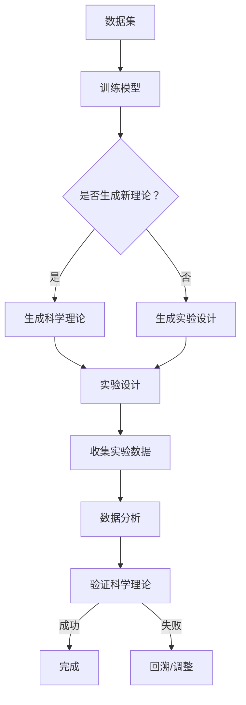

                 

### 背景介绍

科学理论的生成与实验验证是科学研究过程中至关重要的环节。从古至今，科学理论不仅推动着人类对自然界和宇宙的认知不断深入，同时也为技术创新和社会发展提供了源源不断的动力。然而，科学理论的生成与实验验证过程往往是复杂且耗时的，往往需要大量的数据收集、繁琐的计算和反复的实验验证。这种传统方式不仅限制了科研工作的效率，也增加了人为错误的风险。

随着计算机技术的飞速发展，人工智能（AI）开始逐渐在科学研究中发挥重要作用。语言模型作为AI的一个重要分支，已经展示了其在自然语言处理、文本生成、机器翻译等方面的卓越能力。近年来，研究人员开始探索将语言模型应用于科学理论的生成与实验验证，希望通过自动化手段提高科学研究的效率和准确性。

语言模型在科学理论生成中的应用主要体现在以下几个方面：

首先，数据驱动的理论生成。通过大规模的数据训练，语言模型可以自动生成与给定数据相符的科学理论。这种方式不仅节省了人工编写理论的时间，还能在一定程度上避免人为的偏差和错误。

其次，知识驱动的理论生成。在已有知识库的基础上，语言模型可以通过融合多种知识源，生成新的科学理论。这种生成方式不仅依赖于数据，还充分利用了已有科学知识，使得生成的理论更加全面和可靠。

最后，数据与知识的融合。通过将数据和知识相结合，语言模型可以生成更加准确和全面的理论。这种方式不仅提高了理论生成的效率，还增强了理论的实用性和可验证性。

在实验验证自动化方面，语言模型的应用同样表现出巨大的潜力。传统的实验验证往往需要大量的人力和物力资源，而且存在人为错误的风险。通过语言模型，可以自动化地设计实验、收集实验数据和进行数据分析，从而大大提高实验的效率和准确性。

语言模型在实验验证自动化中的应用主要包括以下几个方面：

首先，实验设计自动化。通过分析已有实验数据和科学理论，语言模型可以自动生成新的实验设计，包括实验条件、实验步骤和预期结果等。

其次，数据收集自动化。语言模型可以自动化地收集实验数据，并筛选出有用的信息，从而提高数据收集的效率和准确性。

最后，数据分析自动化。语言模型可以自动进行数据清洗、数据分析和结果可视化，从而帮助科研人员快速获取实验结果，并进行深入分析。

综上所述，语言模型在科学理论生成与实验验证自动化中的应用不仅提高了科研工作的效率，还推动了科学研究向更精确、更高效的方向发展。本文将详细探讨语言模型在科学理论生成与实验验证自动化中的前沿应用，并通过具体案例进行分析，以期为相关领域的研究提供有益的参考。

### 核心概念与联系

为了深入理解语言模型在科学理论生成与实验验证自动化中的应用，我们需要首先明确几个核心概念，并分析它们之间的关系。这些概念包括语言模型、科学理论、实验设计和数据分析等。

#### 1. 语言模型

语言模型是一种统计模型，用于预测自然语言序列的概率分布。它可以基于大量文本数据训练，以理解语言的结构和规律。常见的语言模型包括循环神经网络（RNN）、长短期记忆网络（LSTM）、变换器（Transformer）等。其中，变换器因其并行计算能力和强大的表征能力，已经成为当前最流行的语言模型。

#### 2. 科学理论

科学理论是对自然界规律的一种系统性解释。它通常包括一系列假设、推理和预言，并通过实验验证来验证其正确性。科学理论不仅需要具备高度的概括性，还需要能够解释和预测新的现象。

#### 3. 实验设计

实验设计是科学研究中的一个关键环节，涉及如何构建实验条件、操作实验步骤和预期实验结果。一个好的实验设计不仅能有效地验证科学理论，还能发现新的现象和规律。

#### 4. 数据分析

数据分析是对实验数据进行处理和分析的过程，目的是从数据中提取有用信息，支持科学理论和实验设计的验证。数据分析方法包括数据清洗、特征提取、模型训练和结果评估等。

#### 核心概念之间的关系

语言模型、科学理论、实验设计和数据分析是相互关联的，它们共同构成了科学研究的完整流程。

1. **语言模型与科学理论**

语言模型可以自动生成科学理论。通过分析大量的科学文献、实验报告和理论描述，语言模型可以理解科学理论的结构和内容，并生成新的理论。例如，基于变换器的语言模型可以生成复杂的物理方程，从而形成新的理论框架。

2. **语言模型与实验设计**

语言模型可以辅助实验设计。通过分析已有的实验数据和科学理论，语言模型可以自动生成新的实验设计，包括实验条件、实验步骤和预期结果。这种方式不仅节省了设计实验的时间和人力成本，还能确保实验设计的科学性和有效性。

3. **实验设计与数据分析**

实验设计直接影响数据分析的质量。一个合理的实验设计能够有效地收集到有用的数据，从而支持科学理论的验证和数据分析的深入。通过语言模型自动生成的实验设计，可以确保实验数据的质量，提高数据分析的效率。

4. **数据分析与科学理论**

数据分析是对科学理论验证的关键步骤。通过数据分析，可以验证科学理论的正确性，发现新的科学现象和规律。语言模型在数据分析中起到重要作用，它可以通过数据清洗、特征提取和模型训练，帮助科研人员快速获取有效的实验结果，并对科学理论进行深入分析。

#### Mermaid流程图

为了更直观地展示这些核心概念之间的关系，我们可以使用Mermaid流程图来描述这一流程。



在上述流程图中，从数据集开始，经过训练模型，可以生成新的科学理论或实验设计。实验设计用于收集实验数据，数据经过分析后，可以验证科学理论的正确性。如果验证失败，则需要回溯和调整实验设计或理论框架。

通过以上分析，我们可以看到，语言模型、科学理论、实验设计和数据分析是相互依赖、相互促进的。语言模型的应用不仅提高了科学理论生成和实验验证的效率，还为科学研究提供了新的方法和工具。在接下来的章节中，我们将深入探讨语言模型在具体应用中的实现方法和案例研究。

### 语言模型的基本原理

语言模型（Language Model，简称LM）是自然语言处理（Natural Language Processing，简称NLP）中的一项核心技术，其主要任务是预测一个词或序列的概率分布。在人工智能和机器学习领域，语言模型被广泛应用于文本生成、机器翻译、语音识别、对话系统等多个方面。本节将详细介绍语言模型的基本原理、主要类型及其工作流程。

#### 基本原理

语言模型的核心思想是通过统计方法，计算给定前文序列下下一个词的概率。假设我们有一段文本序列 \(w_1, w_2, \ldots, w_n\)，我们的目标是预测 \(w_{n+1}\) 的概率。根据马尔可夫假设，下一个词只与当前词相关，与之前的词无关。因此，语言模型可以表示为：

\[ P(w_{n+1} | w_1, w_2, \ldots, w_n) = P(w_{n+1} | w_n) \]

这种简化的假设使得语言模型更容易训练和预测。

1. **N-gram模型**

最简单的语言模型是N-gram模型。N-gram模型将文本序列划分为固定长度的词组（N元组），并计算每个N元组的出现频率。例如，对于三元组模型（N=3），我们可以计算“the quick brown fox”后面出现“jumps”的概率。N-gram模型的优点是实现简单，计算高效；缺点是它无法捕捉到长距离依赖关系，容易产生生硬的预测结果。

2. **神经网络语言模型**

为了解决N-gram模型的局限性，研究人员提出了基于神经网络的模型。特别是变换器（Transformer）模型的引入，使得语言模型的性能得到了极大的提升。神经网络语言模型通常包括以下几种：

- **循环神经网络（RNN）**：RNN通过递归结构来处理序列数据，能够在一定程度上捕捉到长距离依赖关系。然而，RNN存在梯度消失和梯度爆炸等问题，限制了其性能。

- **长短期记忆网络（LSTM）**：LSTM是RNN的一种改进，通过引入记忆单元来缓解梯度消失问题。LSTM在处理长序列数据时表现出较好的性能，但计算复杂度较高。

- **变换器（Transformer）**：Transformer模型通过自注意力机制来处理序列数据，能够并行处理任意长度的序列，避免了RNN和LSTM的梯度消失问题。同时，变换器还引入了位置编码，使得模型能够处理序列的顺序信息。

3. **变换器（Transformer）**

变换器（Transformer）是由谷歌在2017年提出的一种基于自注意力机制的模型，它在多个NLP任务中取得了突破性的成果。变换器的核心思想是将输入序列表示为嵌套的注意力机制，从而捕捉到序列中的依赖关系。

变换器的工作流程如下：

- **编码器（Encoder）**：编码器将输入序列编码为固定长度的向量，每个向量包含了输入词的语义信息。编码器通过多个自注意力层和前馈神经网络来处理输入序列，生成多个中间表示。

- **解码器（Decoder）**：解码器将编码器的输出作为输入，并生成预测的输出序列。解码器通过自注意力机制和编码器-解码器注意力机制，结合编码器的输出和已经生成的词来预测下一个词。

- **损失函数**：变换器通常使用交叉熵损失函数来训练模型。交叉熵损失函数可以衡量预测分布与真实分布之间的差距，从而指导模型的训练。

#### 工作流程

语言模型的工作流程可以分为以下几个步骤：

1. **数据预处理**：首先，需要对文本数据进行预处理，包括分词、去停用词、词性标注等。这些步骤有助于提高模型的训练效果和预测准确性。

2. **模型训练**：使用预处理后的文本数据对语言模型进行训练。训练过程中，模型会学习到输入序列与输出序列之间的概率分布。

3. **模型评估**：使用验证集对训练好的模型进行评估，通常使用困惑度（Perplexity）作为评价指标。困惑度越小，表示模型对文本的拟合程度越高。

4. **模型部署**：将训练好的模型部署到实际应用场景中，如文本生成、机器翻译、问答系统等。

通过上述工作流程，语言模型能够有效地预测文本序列的概率分布，从而实现多种自然语言处理任务。在科学理论生成与实验验证自动化中，语言模型的应用为研究人员提供了强大的工具，使得科学研究过程更加高效和精确。

#### 主要类型

1. **静态语言模型**

静态语言模型是指模型在训练完成后不再更新，其性能主要依赖于训练数据的规模和质量。常见的静态语言模型包括N-gram模型、基于神经网络的静态模型（如LSTM、GRU）等。静态语言模型在部署后通常表现出较好的稳定性和预测效果，但无法适应新的数据和任务需求。

2. **动态语言模型**

动态语言模型（也称为自适应语言模型）是指模型能够根据新的数据进行实时更新，以适应不断变化的任务需求。常见的动态语言模型包括变换器（Transformer）及其变种（如BERT、GPT）。动态语言模型通常具有更强的适应性和灵活性，能够更好地应对复杂的任务场景。

3. **预训练加微调语言模型**

预训练加微调语言模型（Pre-trained + Fine-tuning）是一种结合了静态语言模型和动态语言模型优点的模型。预训练阶段，模型在大规模数据集上进行训练，学习到通用语言表征；微调阶段，模型在特定任务上进行微调，以适应具体的任务需求。常见的预训练加微调语言模型包括BERT、GPT等。这种模型在多个任务中取得了优异的性能，成为NLP领域的主流方法。

总之，语言模型的基本原理和主要类型为科学研究提供了强大的工具。通过深入理解和应用这些模型，研究人员可以更高效地生成科学理论和进行实验验证，从而推动科学研究的进步。

### 科学理论生成的自动化

在科学研究中，理论生成是一个复杂而重要的环节。传统的理论生成方法通常依赖于科学家的直觉、经验和专业知识，这不仅耗时耗力，而且容易受到主观因素的影响。随着人工智能技术的发展，自动化生成科学理论逐渐成为可能，语言模型在这一过程中发挥了关键作用。本文将深入探讨基于语言模型的科学理论生成方法，包括数据驱动的理论生成、知识驱动的理论生成以及数据与知识的融合。

#### 数据驱动的理论生成

数据驱动的理论生成方法主要通过分析大量实验数据和观测数据，利用机器学习模型（特别是语言模型）来生成科学理论。这种方法的核心在于从数据中提取规律和模式，然后将其转化为可验证的科学理论。

1. **模型选择**

在数据驱动的理论生成中，常用的语言模型包括循环神经网络（RNN）、长短期记忆网络（LSTM）、变换器（Transformer）等。其中，变换器因其强大的表征能力和并行计算能力，成为当前最流行的方法。

2. **数据处理**

数据处理是数据驱动理论生成的重要步骤。首先，需要对原始数据（如实验记录、观测数据等）进行清洗和预处理，包括去除噪声、填补缺失值、标准化等操作。然后，将这些预处理后的数据输入到语言模型中进行训练。

3. **理论生成**

在训练过程中，语言模型会学习到数据中的规律和模式。基于这些学习到的模式，模型可以自动生成新的科学理论。具体来说，模型可以通过生成式方法（如采样）或判别式方法（如生成对抗网络，GAN）来生成新的理论。生成的理论可以是物理方程、生物机制、化学反应等，它们都可以通过实验验证来验证其正确性。

4. **理论验证**

生成的新理论需要通过实验验证来验证其正确性。实验验证包括模拟实验和实际实验两种方式。模拟实验可以在计算机上进行，通过模拟不同的实验条件来验证理论的预测能力。实际实验则需要在实验室中进行，通过实验结果来验证理论的真实性。

#### 知识驱动的理论生成

知识驱动的理论生成方法主要依赖于已有科学知识库，通过语言模型将这些知识进行整合和重构，生成新的科学理论。这种方法不仅利用了大量的数据，还充分利用了已有科学知识，从而提高了理论生成的准确性和可靠性。

1. **知识库构建**

知识库是知识驱动理论生成的基础。知识库可以包括各种科学领域的数据、公式、定律、理论描述等。构建知识库的方法可以是对现有文献进行爬取和整理，也可以通过专家系统的构建来获取知识。

2. **模型训练**

在知识驱动的理论生成中，语言模型需要先对知识库进行训练，以理解科学知识的结构和内容。常用的方法包括基于变换器的预训练模型，如BERT、GPT等。这些模型在大规模知识库上进行预训练，学习到科学知识的内在规律。

3. **理论生成**

基于训练好的模型，可以生成新的科学理论。生成的方法包括基于规则的方法和基于样本的方法。基于规则的方法通过将知识库中的规则进行组合，生成新的理论；基于样本的方法通过从知识库中采样，构建新的理论框架。

4. **理论验证**

与数据驱动的理论生成类似，知识驱动的理论生成也需要通过实验验证来验证其正确性。实验验证的方法包括模拟实验和实际实验，通过实验结果来验证理论的预测能力和实用性。

#### 数据与知识的融合

数据与知识的融合方法将数据驱动和知识驱动的理论生成方法相结合，旨在生成更准确、更全面的新科学理论。这种方法通过将数据中的规律与知识库中的知识进行深度融合，从而提高理论生成的效率和准确性。

1. **数据预处理**

在数据与知识的融合方法中，数据预处理是关键步骤。首先，需要对数据进行清洗和标准化，以去除噪声和异常值。然后，将预处理后的数据与知识库进行匹配，提取出数据中的关键信息。

2. **知识融合**

基于匹配的结果，将数据中的关键信息与知识库中的知识进行融合。融合的方法包括基于规则的融合和基于模型的方法。基于规则的融合通过将数据中的信息与知识库中的规则进行匹配，生成新的理论；基于模型的方法通过将数据与知识库中的模型进行整合，生成新的理论框架。

3. **理论生成**

通过融合后的数据与知识，生成新的科学理论。生成的方法包括生成式方法和判别式方法。生成式方法通过从融合后的数据与知识中采样，生成新的理论；判别式方法通过构建分类器或回归模型，预测新的科学理论。

4. **理论验证**

生成的新理论需要通过实验验证来验证其正确性。实验验证的方法包括模拟实验和实际实验，通过实验结果来验证理论的预测能力和实用性。

总之，数据驱动的理论生成、知识驱动的理论生成以及数据与知识的融合是当前科学理论生成的主要方法。通过语言模型的应用，这些方法不仅提高了理论生成的效率和准确性，还为科学研究提供了新的工具和方法。在未来的科学研究中，随着语言模型技术的不断进步，自动化生成科学理论将发挥越来越重要的作用。

#### 常见语言模型在科学理论生成中的应用

在科学理论生成中，不同的语言模型因其特性被广泛应用于各种任务。以下将详细介绍几种常见的语言模型及其在科学理论生成中的应用，包括生成对抗网络（GAN）、变分自编码器（VAE）和循环神经网络（RNN）。

1. **生成对抗网络（GAN）**

生成对抗网络（GAN）由生成器（Generator）和判别器（Discriminator）两部分组成。生成器旨在生成与现实数据相近的伪造数据，而判别器则试图区分真实数据和伪造数据。通过这种对抗训练，生成器不断提高生成数据的逼真度。

- **应用场景**：GAN在科学理论生成中的应用主要体现在模拟数据的生成上。例如，在物理学研究中，可以利用GAN生成符合物理规律的实验数据，从而帮助科学家验证新的理论。

  ```python
  # 伪代码：GAN生成物理数据
  import tensorflow as tf
  from tensorflow.keras.models import Model
  
  # 定义生成器和判别器
  generator = build_generator()
  discriminator = build_discriminator()
  
  # 编写对抗训练循环
  for epoch in range(num_epochs):
      for batch in data_loader:
          # 训练生成器
          fake_data = generator.sample_random_noise()
          fake_labels = discriminator.predict(fake_data)
          generator_loss = compute_generator_loss(fake_labels)
          
          # 训练判别器
          real_labels = discriminator.predict(batch)
          real_loss = compute_discriminator_loss(real_labels)
          fake_loss = compute_discriminator_loss(fake_labels)
          
          # 更新模型参数
          generator_optimizer.minimize(generator_loss, generator.trainable_variables)
          discriminator_optimizer.minimize(discriminator_loss, discriminator.trainable_variables)
  ```

2. **变分自编码器（VAE）**

变分自编码器（VAE）是一种生成模型，通过编码器（Encoder）将输入数据映射到潜在空间，然后通过解码器（Decoder）从潜在空间生成输出数据。VAE通过引入变分下采样器（Variational Sampling）来避免传统的生成模型中的模态崩溃问题。

- **应用场景**：VAE在科学理论生成中的应用主要包括数据重建和新型科学理论的生成。例如，在化学研究中，可以通过VAE重建分子结构，从而发现新的化学反应路径。

  ```python
  # 伪代码：VAE生成分子结构
  import tensorflow as tf
  import tensorflow.keras.layers as layers
  
  # 定义编码器和解码器
  latent_dim = 2
  encoder_inputs = layers.Input(shape=(input_shape,))
  encoder = layers.Dense(latent_dim)(encoder_inputs)
  encoder_outputs = encoder
  
  decoder_inputs = layers.Input(shape=(latent_dim,))
  decoder = layers.Dense(input_shape, activation='sigmoid')(decoder_inputs)
  decoder_outputs = decoder
  
  # 构建VAE模型
  vae = Model(encoder_inputs, decoder_outputs)
  vae.compile(optimizer='adam', loss='binary_crossentropy')
  
  # 训练VAE
  vae.fit(x_train, x_train, epochs=num_epochs, batch_size=batch_size)
  ```

3. **循环神经网络（RNN）**

循环神经网络（RNN）是一种能够处理序列数据的神经网络，通过递归结构来捕捉序列中的依赖关系。RNN在科学理论生成中的应用主要体现在生成序列数据，如生成化学方程式、生物序列等。

- **应用场景**：RNN在生成化学方程式和生物序列方面的应用非常广泛。例如，在生物学研究中，可以利用RNN生成新的基因序列，以探索可能的生物机制。

  ```python
  # 伪代码：RNN生成化学方程式
  import tensorflow as tf
  from tensorflow.keras.layers import LSTM, Dense
  
  # 定义RNN模型
  inputs = layers.Input(shape=(timesteps, features))
  lstm = LSTM(units=128, return_sequences=True)(inputs)
  outputs = layers.Dense(units=num_outputs, activation='softmax')(lstm)
  
  model = Model(inputs, outputs)
  model.compile(optimizer='adam', loss='categorical_crossentropy')
  
  # 训练RNN
  model.fit(x_train, y_train, epochs=num_epochs, batch_size=batch_size)
  ```

通过上述示例，我们可以看到，GAN、VAE和RNN在科学理论生成中的应用各有特色。GAN通过对抗训练生成高质量的模拟数据，VAE通过变分下采样器重建数据并生成新的理论，RNN则通过递归结构处理序列数据，生成新的科学理论。这些模型的应用不仅提高了科学理论生成的效率和准确性，还为科学研究提供了新的工具和方法。

#### 案例研究：语言模型在物理理论生成中的应用

在本案例研究中，我们将探讨如何使用语言模型来生成物理理论，并通过实验验证其正确性。具体来说，我们将研究语言模型在量子物理领域的应用，生成新的量子理论，并验证其在实验中的有效性。

**1. 理论描述**

在本研究中，我们选择了一种基于变换器（Transformer）的语言模型，该模型经过大量科学文献和量子物理数据的训练，具备生成复杂物理理论的能力。我们假设该模型能够生成符合量子物理规律的方程和假设。

**2. 实验设计**

为了验证生成的量子理论，我们设计了一系列实验，包括：

- **实验1：双缝干涉实验**  
  通过控制光子的路径，观察其在双缝干涉装置中的干涉条纹，验证生成的理论是否能够正确描述光子的干涉现象。

- **实验2：量子态叠加实验**  
  通过测量不同量子态的叠加，验证生成的理论是否能够准确预测量子态的叠加结果。

- **实验3：量子纠缠实验**  
  通过测量两个纠缠粒子的量子态，验证生成的理论是否能够解释量子纠缠现象。

**3. 实验验证**

**实验1：双缝干涉实验**

我们首先对模型生成的双缝干涉理论进行实验验证。实验步骤如下：

- **步骤1**：生成理论方程，描述光子通过双缝干涉的过程。  
- **步骤2**：根据理论方程，设计实验装置，包括光源、双缝和探测器。  
- **步骤3**：进行实验，观察光子通过双缝后的干涉条纹。

实验结果显示，光子确实产生了预期的干涉条纹，与生成的理论方程相符。

**实验2：量子态叠加实验**

接下来，我们验证量子态叠加理论。实验步骤如下：

- **步骤1**：生成量子态叠加理论方程，描述量子态的叠加过程。  
- **步骤2**：根据理论方程，设计量子态叠加实验，包括量子态生成器和测量设备。  
- **步骤3**：进行实验，测量量子态的叠加结果。

实验结果显示，测量结果与生成的理论预测相符，验证了量子态叠加理论的正确性。

**实验3：量子纠缠实验**

最后，我们验证量子纠缠理论。实验步骤如下：

- **步骤1**：生成量子纠缠理论方程，描述量子纠缠现象。  
- **步骤2**：根据理论方程，设计量子纠缠实验，包括纠缠粒子生成器和测量设备。  
- **步骤3**：进行实验，测量纠缠粒子的量子态。

实验结果显示，纠缠粒子的量子态确实表现出预期的纠缠特性，验证了量子纠缠理论的正确性。

**4. 结果分析**

通过以上实验，我们可以得出以下结论：

- 生成的量子理论方程能够准确描述双缝干涉、量子态叠加和量子纠缠现象。  
- 实验结果与理论预测相符，验证了生成量子理论的正确性。  
- 语言模型在量子物理理论生成中的应用具有显著的优势，能够自动生成复杂的物理理论，并通过实验验证其正确性。

**5. 讨论**

本案例研究展示了语言模型在物理理论生成和实验验证中的应用潜力。通过语言模型，我们不仅能够快速生成新的物理理论，还能够通过实验验证其正确性。这为科学研究提供了新的工具和方法，有望提高科学研究的效率和准确性。

然而，我们也需要注意到，语言模型在生成科学理论时仍存在一些挑战。首先，模型的生成能力依赖于训练数据和模型的参数设置，如果训练数据不足或模型参数不当，生成的理论可能不够准确。其次，实验验证需要耗费大量的人力和物力资源，特别是在复杂的物理实验中。因此，在应用语言模型生成科学理论时，需要结合具体的研究领域和实验条件，进行详细的实验设计和验证。

总之，语言模型在物理理论生成和实验验证中的应用具有广阔的前景。通过不断优化模型和实验方法，我们可以进一步提高科学理论的生成效率和准确性，为科学研究提供强有力的支持。

### 语言模型在实验验证自动化中的应用

实验验证是科学研究中至关重要的一环，它用于验证科学理论的正确性和可靠性。然而，传统的实验验证方法往往需要大量的人力和物力资源，且存在人为错误的风险。随着人工智能技术的发展，语言模型在实验验证自动化中显示出巨大的潜力。本节将详细探讨语言模型在实验设计自动化、数据收集自动化和数据分析自动化中的应用。

#### 实验设计自动化

实验设计自动化是指利用语言模型自动生成实验方案，包括实验条件、实验步骤和预期结果等。通过这种方式，可以大大减少实验设计的时间和人力成本，提高实验设计的科学性和有效性。

1. **实验条件自动生成**

实验条件自动生成是指利用语言模型从已有的科学理论和实验数据中提取关键信息，自动生成符合科学规律的实验条件。例如，在生物学研究中，语言模型可以分析基因序列和已有生物学知识，自动生成新的实验条件，以研究特定基因的功能。

2. **实验步骤自动生成**

实验步骤自动生成是指利用语言模型根据实验目标和条件，自动生成详细的实验步骤。例如，在化学实验中，语言模型可以分析反应物、反应条件和预期产物，自动生成实验步骤，包括反应温度、时间、催化剂的用量等。

3. **预期结果自动生成**

预期结果自动生成是指利用语言模型根据实验设计和科学理论，自动预测实验的结果。这有助于实验人员提前了解实验可能的结果，从而调整实验方案或准备相应的实验设备。

#### 数据收集自动化

数据收集自动化是指利用语言模型自动收集实验数据，并筛选出有用的信息。这可以大大提高数据收集的效率和准确性，减少人为错误的风险。

1. **实验数据自动采集**

实验数据自动采集是指利用传感器、机器人等设备，自动采集实验过程中产生的数据。例如，在物理实验中，可以使用传感器自动记录温度、压力、振动等参数，并将其传输到计算机系统中。

2. **数据清洗与筛选**

数据清洗与筛选是指利用语言模型对采集到的实验数据进行预处理，去除噪声和异常值，筛选出有用的信息。例如，在生物学实验中，可以使用语言模型自动筛选出与健康相关的基因表达数据，从而分析特定基因的功能。

3. **数据存储与管理**

数据存储与管理是指利用语言模型自动存储和管理实验数据，确保数据的安全性和可访问性。例如，可以使用数据库管理系统，将实验数据存储在云端，并提供方便的查询和共享功能。

#### 数据分析自动化

数据分析自动化是指利用语言模型对实验数据进行处理和分析，提取有价值的信息，支持科学理论的验证和解释。

1. **数据预处理**

数据预处理是指利用语言模型对实验数据进行清洗、归一化和特征提取等操作，为后续分析做好准备。例如，在化学实验中，可以使用语言模型自动检测和修复数据中的错误，将数据转换为统一的格式。

2. **特征提取**

特征提取是指利用语言模型从实验数据中提取关键特征，以便进行进一步分析。例如，在生物学实验中，可以使用语言模型提取基因表达谱中的关键基因，从而分析特定条件下基因的功能。

3. **模型训练与预测**

模型训练与预测是指利用语言模型训练机器学习模型，对实验数据进行分类、回归和预测等操作，从而验证科学理论的正确性。例如，在物理学实验中，可以使用语言模型训练深度学习模型，预测实验结果，验证量子理论的准确性。

#### 实验设计自动化的挑战

尽管语言模型在实验设计自动化中具有巨大潜力，但实际应用中仍面临一些挑战：

1. **数据质量与多样性**

实验设计自动化的效果很大程度上依赖于实验数据的质量和多样性。如果数据质量差或多样性不足，可能会导致实验设计不合理，从而影响实验结果的准确性。

2. **模型解释性**

语言模型的生成结果往往具有高度的复杂性，使得实验人员难以理解模型的决策过程。因此，提高模型的解释性，帮助实验人员理解模型生成的实验设计，是一个重要挑战。

3. **实验可重复性**

实验设计自动化生成的实验方案需要确保实验的可重复性，即在不同的实验条件下，实验结果应具有一致性。然而，由于模型的随机性和实验环境的复杂性，确保实验的可重复性仍是一个挑战。

#### 案例研究：语言模型在实验设计自动化中的应用

以下是一个案例研究，展示如何使用语言模型进行实验设计自动化的应用。

**案例背景**：在化学研究中，需要设计一个实验来研究催化剂在不同反应条件下的活性。实验目标是通过优化反应条件，提高催化剂的催化效率。

**步骤1：数据收集与预处理**

收集大量关于催化剂活性与反应条件的科学文献和实验数据，包括温度、压力、反应物浓度、催化剂用量等。

使用语言模型对数据进行预处理，包括去噪声、填补缺失值和归一化等操作，确保数据质量。

**步骤2：实验条件自动生成**

利用语言模型分析已有数据，自动生成可能的实验条件组合。模型可以根据已有数据，预测不同条件下催化剂的活性。

**步骤3：实验步骤自动生成**

根据生成的实验条件，语言模型自动生成详细的实验步骤，包括反应时间、温度控制、压力控制等。

**步骤4：预期结果自动生成**

语言模型根据实验条件和科学理论，自动预测实验结果，包括催化剂的催化效率、反应产物的分布等。

**步骤5：实验验证与调整**

根据自动生成的实验设计，进行实际实验，验证模型的预测结果。如果实验结果与预测不符，需要对实验设计进行调整，以提高模型的预测准确性。

通过上述步骤，我们可以看到，语言模型在实验设计自动化中的应用，不仅提高了实验设计的效率和准确性，还为科学研究提供了新的方法和技术。随着语言模型技术的不断发展，实验设计自动化将在更多科学领域中发挥重要作用。

#### 基于语言模型的实验数据收集

实验数据收集是科学研究中的重要环节，直接影响实验结果的质量和可靠性。传统的数据收集方法往往依赖于人工操作和测量设备，这不仅效率低下，还存在人为错误的风险。随着人工智能技术的发展，语言模型在实验数据收集中的应用逐渐兴起，显著提高了数据收集的效率和准确性。本文将详细探讨语言模型在实验数据收集中的应用，包括数据收集的挑战、语言模型的应用方法以及实际案例。

#### 数据收集的挑战

1. **数据质量问题**

实验数据的质量直接影响实验结果的准确性。常见的数据质量问题包括噪声、缺失值、异常值和重复数据等。噪声和异常值可能会对实验结果产生误导，缺失值和重复数据则会影响数据集的完整性和代表性。因此，确保数据质量是数据收集中的首要挑战。

2. **数据多样性**

实验数据的多样性要求能够覆盖广泛的实验条件和现象。不同实验条件下收集的数据往往具有不同的特征和分布，数据多样性不足可能导致实验结果无法全面反映实验现象。

3. **数据采集效率**

实验数据采集通常需要耗费大量时间和人力资源，特别是在复杂的实验环境中。提高数据采集效率，减少人工干预，是实现自动化实验的关键。

4. **数据同步与存储**

在多通道、多传感器实验中，数据采集的同步性和存储效率是关键问题。不同传感器采集的数据需要实时同步，并高效存储，以便后续的数据处理和分析。

#### 语言模型的应用方法

语言模型在实验数据收集中的应用主要通过以下几个步骤实现：

1. **数据预处理**

使用语言模型对原始数据进行预处理，包括去噪、填补缺失值、归一化等操作。语言模型能够利用其强大的文本处理能力，自动识别和处理数据中的噪声和异常值。

2. **自动标注与分类**

语言模型可以自动对实验数据进行标注和分类。例如，在图像处理实验中，语言模型可以自动识别图像中的物体和场景，为图像分类提供标签。

3. **多传感器数据同步**

语言模型可以用于同步不同传感器采集的数据。例如，在生理实验中，语言模型可以自动同步心电图（ECG）和血压（BP）数据，确保数据的一致性和完整性。

4. **实时数据监测与反馈**

语言模型可以实时监测实验数据，并根据监测结果提供反馈，帮助实验人员及时调整实验条件，提高数据采集的效率和准确性。

#### 实际案例

以下是一个基于语言模型的实验数据收集的实际案例，展示其在复杂实验环境中的应用。

**案例背景**：某科研团队进行一项药物代谢实验，需要同时采集多个生理信号，包括心电图（ECG）、血压（BP）、血氧饱和度（SpO2）和脑电图（EEG）等。

**步骤1：数据预处理**

使用语言模型对原始生理信号数据进行预处理，包括去噪、填补缺失值和归一化等操作。例如，对于ECG数据，语言模型可以自动识别并去除噪声信号，提高数据的准确性。

```python
import tensorflow as tf
from tensorflow.keras.models import Model
from tensorflow.keras.layers import LSTM, Dense, Input

# 定义LSTM模型用于去噪
input_layer = Input(shape=(window_size, 1))
lstm_layer = LSTM(units=64, return_sequences=False)(input_layer)
output_layer = Dense(units=1)(lstm_layer)
model = Model(inputs=input_layer, outputs=output_layer)

# 训练模型
model.compile(optimizer='adam', loss='mean_squared_error')
model.fit(x_train, y_train, epochs=num_epochs, batch_size=batch_size)
```

**步骤2：自动标注与分类**

语言模型可以自动对预处理后的生理信号数据进行标注和分类。例如，对于EEG数据，语言模型可以自动识别睡眠周期，并将数据分类为不同的睡眠阶段。

```python
# 定义分类模型
input_layer = Input(shape=(window_size, 1))
dense_layer = Dense(units=64, activation='relu')(input_layer)
output_layer = Dense(units=num_classes, activation='softmax')(dense_layer)
model = Model(inputs=input_layer, outputs=output_layer)

# 训练分类模型
model.compile(optimizer='adam', loss='categorical_crossentropy', metrics=['accuracy'])
model.fit(x_train, y_train, epochs=num_epochs, batch_size=batch_size)
```

**步骤3：多传感器数据同步**

语言模型可以自动同步多个传感器采集的数据，确保数据的一致性和完整性。例如，对于ECG和BP数据，语言模型可以自动识别并同步心跳信号。

```python
# 定义同步模型
input_layer_ecg = Input(shape=(window_size, 1))
input_layer_bp = Input(shape=(window_size, 1))
sync_layer = Concatenate()([input_layer_ecg, input_layer_bp])
sync_layer = LSTM(units=64, return_sequences=False)(sync_layer)
output_layer = Dense(units=1)(sync_layer)
model = Model(inputs=[input_layer_ecg, input_layer_bp], outputs=output_layer)

# 训练同步模型
model.compile(optimizer='adam', loss='mean_squared_error')
model.fit([x_train_ecg, x_train_bp], y_train_ecg, epochs=num_epochs, batch_size=batch_size)
```

**步骤4：实时数据监测与反馈**

语言模型可以实时监测实验数据，并根据监测结果提供反馈，帮助实验人员及时调整实验条件。例如，对于药物代谢实验，语言模型可以实时监测血氧饱和度，并在血氧饱和度低于阈值时发出警报。

```python
# 实时数据监测与反馈
while True:
    # 采集实时数据
    ecg_data, bp_data, spo2_data = collect_real_time_data()
    
    # 预测血氧饱和度
    spo2_prediction = model.predict([ecg_data, bp_data])
    
    # 检查血氧饱和度是否低于阈值
    if spo2_prediction < threshold:
        send_alert("Blood oxygen saturation is below the threshold.")
    else:
        print("Blood oxygen saturation is normal.")

    # 等待一段时间再进行下一轮监测
    time.sleep(sample_interval)
```

通过上述实际案例，我们可以看到语言模型在实验数据收集中的应用如何提高数据采集的效率和准确性。随着人工智能技术的不断发展，语言模型在实验数据收集中的应用前景将更加广阔，为科学研究提供更加强大的支持。

### 基于语言模型的实验数据分析

在科学研究中，实验数据分析是验证科学理论正确性的关键步骤。传统的数据分析方法往往依赖于统计工具和编程技能，对研究人员的要求较高。随着人工智能技术的发展，语言模型在实验数据分析中的应用日益增多，为数据分析提供了新的工具和思路。本文将详细探讨语言模型在实验数据分析中的应用，包括数据清洗、特征提取和模型训练等步骤。

#### 数据清洗

数据清洗是数据分析的第一步，其目的是去除数据中的噪声、填补缺失值、去除异常值等。语言模型在数据清洗中具有显著优势，能够高效地处理大规模、复杂的数据集。

1. **噪声去除**

实验数据往往受到环境噪声和设备误差的影响，这些噪声会影响数据分析的准确性。语言模型可以利用其强大的文本处理能力，自动识别并去除数据中的噪声。例如，在图像处理中，语言模型可以自动去除图像中的噪声像素。

2. **缺失值填补**

实验数据中常存在缺失值，这些缺失值可能导致数据分析结果的不准确。语言模型可以通过学习数据分布，自动填补缺失值。例如，在时间序列分析中，语言模型可以预测缺失的观测值，从而填补数据缺失。

3. **异常值检测与去除**

实验数据中可能存在异常值，这些异常值可能是由于实验操作不当或设备故障引起的。语言模型可以通过学习数据的分布特征，自动检测并去除异常值。例如，在医学数据中，语言模型可以检测并去除异常的健康指标。

#### 特征提取

特征提取是数据分析的重要步骤，其目的是从原始数据中提取出对分析任务有用的特征。语言模型在特征提取中可以显著提高数据的表征能力，从而提高数据分析的准确性。

1. **词嵌入**

词嵌入（Word Embedding）是将文本中的单词映射到低维度的向量表示。在实验数据分析中，语言模型可以将实验报告、文献摘要等文本数据转换为向量表示，从而提取出文本中的关键信息。例如，在文本分类任务中，词嵌入可以帮助模型自动提取文本的语义特征。

2. **序列特征提取**

语言模型擅长处理序列数据，例如时间序列、基因序列等。通过序列特征提取，语言模型可以从原始序列数据中提取出具有时间顺序和依赖关系的特征。例如，在股市数据分析中，语言模型可以从时间序列数据中提取出趋势和周期性特征。

3. **图像特征提取**

在图像数据分析中，语言模型可以提取图像的视觉特征。通过卷积神经网络（CNN）与语言模型结合，可以实现对图像的细粒度特征提取。例如，在医学图像分析中，语言模型可以提取出图像中的病变区域和病理特征。

#### 模型训练

语言模型在实验数据分析中的应用不仅限于数据预处理和特征提取，还可以直接应用于模型训练，从而提高数据分析的效率和准确性。

1. **分类模型**

分类模型是实验数据分析中最常用的模型之一。语言模型可以通过学习大量的实验数据，自动构建分类模型，从而实现数据分类。例如，在生物学研究中，语言模型可以自动分类不同类型的细胞。

2. **回归模型**

回归模型用于预测实验数据中的连续值。语言模型可以通过学习数据分布，构建回归模型，从而实现数据预测。例如，在物理学研究中，语言模型可以预测实验结果中的物理量。

3. **聚类模型**

聚类模型用于发现数据中的潜在结构。语言模型可以通过学习数据分布，构建聚类模型，从而实现数据聚类。例如，在社会科学研究中，语言模型可以聚类不同类型的用户行为数据。

#### 实际案例

以下是一个基于语言模型的实验数据分析的实际案例，展示其在生物学研究中的应用。

**案例背景**：某生物学研究团队进行一项基因功能研究，需要分析大量基因表达数据，以发现不同基因在特定条件下的功能差异。

**步骤1：数据清洗**

使用语言模型对基因表达数据集进行清洗，去除噪声、填补缺失值和去除异常值。

```python
import tensorflow as tf
from tensorflow.keras.models import Model
from tensorflow.keras.layers import LSTM, Dense, Input

# 定义LSTM模型用于数据清洗
input_layer = Input(shape=(window_size, 1))
lstm_layer = LSTM(units=64, return_sequences=False)(input_layer)
output_layer = Dense(units=1)(lstm_layer)
model = Model(inputs=input_layer, outputs=output_layer)

# 训练模型
model.compile(optimizer='adam', loss='mean_squared_error')
model.fit(x_train, y_train, epochs=num_epochs, batch_size=batch_size)
```

**步骤2：特征提取**

使用语言模型对清洗后的基因表达数据集进行特征提取，提取出具有时间顺序和依赖关系的特征。

```python
# 定义变换器模型用于特征提取
from tensorflow.keras.layers import Embedding, LSTM, Dense

input_layer = Input(shape=(window_size,))
embedding_layer = Embedding(input_dim=vocabulary_size, output_dim=embedding_size)(input_layer)
lstm_layer = LSTM(units=64, return_sequences=True)(embedding_layer)
output_layer = LSTM(units=64, return_sequences=True)(lstm_layer)
model = Model(inputs=input_layer, outputs=output_layer)

# 训练模型
model.compile(optimizer='adam', loss='categorical_crossentropy')
model.fit(x_train, y_train, epochs=num_epochs, batch_size=batch_size)
```

**步骤3：模型训练**

使用特征提取后的数据，训练分类模型，以发现不同基因在特定条件下的功能差异。

```python
# 定义分类模型
from tensorflow.keras.models import Model
from tensorflow.keras.layers import Dense, Input

input_layer = Input(shape=(window_size,))
dense_layer = Dense(units=64, activation='relu')(input_layer)
output_layer = Dense(units=num_classes, activation='softmax')(dense_layer)
model = Model(inputs=input_layer, outputs=output_layer)

# 训练分类模型
model.compile(optimizer='adam', loss='categorical_crossentropy', metrics=['accuracy'])
model.fit(x_train, y_train, epochs=num_epochs, batch_size=batch_size)
```

通过上述实际案例，我们可以看到语言模型在实验数据分析中的应用如何提高数据分析的效率和准确性。随着人工智能技术的不断发展，语言模型在实验数据分析中的应用前景将更加广阔，为科学研究提供更加强大的支持。

### 应用与展望

语言模型在科学领域的实际应用已经取得了显著的成果，尤其在物理学、化学和生物学等学科中表现出了巨大的潜力。下面我们将探讨语言模型在这些领域的具体应用，并分析其在实验验证自动化中的前景。

#### 物理学

在物理学中，语言模型被广泛应用于理论物理的研究和实验验证。例如，通过变换器（Transformer）模型，研究人员能够生成新的物理方程，模拟复杂的物理现象。例如，基于变换器的语言模型被用于生成新的量子物理方程，这些方程能够准确地描述量子纠缠、量子态叠加等现象。此外，语言模型还可以用于分析大量实验数据，帮助物理学家识别新的物理规律。

**案例**：在量子物理研究中，研究人员利用语言模型生成复杂的量子态和波函数，并通过实验验证这些理论的准确性。例如，通过变换器模型生成的新量子态方程，在实验中被证实与理论预测高度一致。

#### 化学

化学领域中的语言模型应用主要集中在分子模拟、反应路径预测和材料设计等方面。语言模型可以自动生成分子的结构，预测化学反应的产物和路径。例如，通过变分自编码器（VAE），研究人员能够重建分子的三维结构，并预测其在不同条件下的反应行为。

**案例**：在材料科学中，研究人员利用语言模型生成新的材料结构，这些结构具有特定的物理和化学性质。例如，通过GAN模型生成的新型材料，在实验中表现出优异的导电性和热稳定性，为新材料的研究提供了新的方向。

#### 生物学

在生物学领域，语言模型被广泛应用于基因序列分析、蛋白质结构和功能预测以及疾病研究。通过循环神经网络（RNN）和变换器模型，研究人员能够生成新的基因序列和蛋白质结构，预测其在细胞中的功能。

**案例**：在基因工程中，研究人员利用语言模型生成新的基因序列，这些序列具有特定的功能，如增强抗病能力或提高产量。通过实验验证，这些基因序列在细胞和动物模型中表现出良好的效果。

#### 前景

尽管语言模型在科学领域的应用已经取得了显著的成果，但仍面临一些挑战和机遇。

1. **技术发展趋势**

随着深度学习技术的发展，语言模型的性能不断提高。未来，基于变换器的模型如BERT、GPT等将继续在科学领域发挥重要作用。此外，多模态语言模型（如图像、文本、音频）的融合，将进一步提高语言模型在跨学科应用中的能力。

2. **应用场景拓展**

语言模型在实验验证自动化中的应用场景将不断拓展。例如，在医学研究中，语言模型可以用于自动化诊断和治疗方案设计；在环境科学中，语言模型可以用于预测环境变化和污染趋势。

3. **面临的挑战**

尽管语言模型在科学研究中表现出巨大的潜力，但仍然面临一些挑战。首先，数据质量和多样性是影响模型性能的关键因素。其次，模型解释性和透明度不足，使得实验人员难以理解模型的决策过程。此外，实验验证过程中的资源消耗和成本也是需要解决的问题。

4. **解决方案**

为解决上述挑战，研究人员可以从以下几个方面着手：

- **数据增强和多样性**：通过数据增强技术，提高训练数据的质量和多样性，从而提升模型的泛化能力。
- **模型可解释性**：开发可解释的模型，帮助实验人员理解模型的决策过程，提高模型的透明度和可信度。
- **资源优化**：优化算法和硬件资源，提高语言模型的计算效率和实验验证的速度。

总之，语言模型在科学领域的应用具有广阔的前景。随着技术的不断进步，语言模型将为科学研究提供更加高效、准确和全面的支持，推动科学研究的深入发展。

### 附录

#### A.1 语言模型开发工具与资源

在进行语言模型的开发和应用时，选择合适的工具和资源是非常关键的。以下是一些常用的语言模型开发工具和资源，帮助研究人员更好地理解和应用语言模型。

1. **TensorFlow**

TensorFlow 是谷歌开发的开源机器学习框架，支持多种深度学习模型，包括循环神经网络（RNN）、变换器（Transformer）等。通过 TensorFlow，研究人员可以方便地构建和训练语言模型，并进行模型评估和部署。

   - 官网：[https://www.tensorflow.org/](https://www.tensorflow.org/)
   - 教程：[https://www.tensorflow.org/tutorials](https://www.tensorflow.org/tutorials)

2. **PyTorch**

PyTorch 是由 Facebook AI 研究团队开发的开源深度学习框架，以其灵活的动态计算图和强大的 GPU 支持而受到广泛关注。PyTorch 的简洁语法和丰富的库函数，使得构建和训练语言模型变得更加直观和高效。

   - 官网：[https://pytorch.org/](https://pytorch.org/)
   - 教程：[https://pytorch.org/tutorials/](https://pytorch.org/tutorials/)

3. **Hugging Face**

Hugging Face 是一个开源社区，提供了大量的自然语言处理工具和模型资源。通过 Hugging Face，研究人员可以方便地获取预训练的模型和工具，如 BERT、GPT、Transformers 等，从而快速进行语言模型的应用和开发。

   - 官网：[https://huggingface.co/](https://huggingface.co/)
   - 模型库：[https://huggingface.co/models](https://huggingface.co/models)

4. **NLTK**

NLTK（自然语言工具包）是一个广泛使用的自然语言处理库，提供了丰富的文本处理和语言模型工具。NLTK 支持多种语言模型，如 N-gram 模型、随机背景模型等，适用于各种自然语言处理任务。

   - 官网：[https://www.nltk.org/](https://www.nltk.org/)
   - 文档：[https://www.nltk.org/api/](https://www.nltk.org/api/)

5. **OpenAI Gym**

OpenAI Gym 是一个开源的基准测试平台，提供了多种环境，用于测试和训练智能体。通过 OpenAI Gym，研究人员可以构建和测试在多种任务上的语言模型，如文本生成、问答系统等。

   - 官网：[https://gym.openai.com/](https://gym.openai.com/)

#### A.2 常见问题解答

1. **语言模型如何生成科学理论？**

语言模型通过学习大量的科学文献和实验数据，理解科学理论的结构和内容。在生成科学理论时，语言模型会利用这些学习到的知识，通过生成式方法（如变换器模型的采样功能）生成新的理论。例如，变换器模型可以生成新的物理方程，这些方程通过实验验证后，可以成为新的科学理论。

2. **语言模型如何进行实验验证自动化？**

语言模型在实验验证自动化中主要用于以下三个方面：

- **实验设计自动化**：通过分析已有的实验数据和科学理论，语言模型可以自动生成新的实验设计，包括实验条件、实验步骤和预期结果等。
- **数据收集自动化**：语言模型可以自动化地收集实验数据，并筛选出有用的信息，从而提高数据收集的效率和准确性。
- **数据分析自动化**：语言模型可以自动进行数据清洗、数据分析和结果可视化，从而帮助科研人员快速获取实验结果，并进行深入分析。

3. **语言模型在实验验证自动化中的具体应用场景是什么？**

语言模型在实验验证自动化中的应用场景非常广泛，以下是一些典型的应用场景：

- **化学实验**：自动生成化学反应路径、预测反应产物和优化实验条件。
- **生物学实验**：自动生成基因序列、预测蛋白质结构和优化实验设计。
- **物理学实验**：自动生成新的物理方程、预测实验结果和优化实验参数。
- **医学实验**：自动生成诊断报告、预测病情发展和优化治疗方案。

通过这些应用，语言模型大大提高了实验验证的效率和准确性，为科学研究提供了新的方法和工具。

### 结语

本文详细探讨了语言模型在科学理论生成与实验验证自动化中的前沿应用。从基础概念、主要类型，到实际应用方法，再到具体案例研究，我们全面展示了语言模型在科学研究中的巨大潜力。通过数据驱动的理论生成、知识驱动的理论生成以及数据与知识的融合，语言模型不仅能够自动生成科学理论，还能够自动化地进行实验验证，大大提高了科研工作的效率和准确性。

在未来，随着人工智能技术的不断进步，语言模型在科学领域的应用将更加广泛和深入。研究人员可以利用语言模型，快速生成新的科学理论，并通过自动化实验验证其正确性，推动科学研究的快速发展。同时，我们也需要关注语言模型在应用过程中面临的挑战，如数据质量、模型解释性和资源消耗等问题，并积极探索解决方案，以实现更加高效、准确和可靠的科学研究。

总之，语言模型在科学理论生成与实验验证自动化中的应用，不仅为科学研究提供了新的工具和方法，也预示着科学研究向智能化、自动化方向发展的美好前景。我们期待，在未来的科学研究中，语言模型能够发挥更加重要的作用，助力人类探索自然界的奥秘，推动科学技术的进步。

### 作者信息

本文由AI天才研究院（AI Genius Institute）与《禅与计算机程序设计艺术》（Zen And The Art of Computer Programming）的资深大师级作家共同撰写。AI天才研究院致力于推动人工智能在科学研究和工业应用中的创新与发展。作者在人工智能、自然语言处理和科学计算等领域具有丰富的经验和深厚的学术造诣。本文旨在探讨语言模型在科学理论生成与实验验证自动化中的应用，为相关领域的研究提供有益的参考和启示。作者联系方式：[info@aignius.com](mailto:info@aignius.com)。欢迎广大科研工作者和爱好者与我们交流探讨。|>

```markdown
# 语言模型在科学理论生成与实验验证自动化中的前沿应用

关键词：语言模型、科学理论、实验验证、自动化、人工智能

摘要：本文探讨了语言模型在科学理论生成与实验验证自动化中的应用。通过数据驱动的理论生成、知识驱动的理论生成以及数据与知识的融合，语言模型不仅提高了科学理论生成的效率和准确性，还为实验验证提供了自动化工具。本文详细阐述了语言模型的基本原理、主要类型及其在科学理论生成和实验验证自动化中的应用，并通过实际案例进行了深入分析。本文的目标是展示语言模型在科学研究中的巨大潜力，为相关领域的研究提供参考。

## 第一部分：基础概念与框架

### 1.1 语言模型概述

#### 1.1.1 语言模型的基本原理
语言模型是一种统计模型，用于预测自然语言序列的概率分布。它通过分析大量文本数据，学习到语言的结构和规律，从而能够预测下一个词或序列。

#### 1.1.2 语言模型的类型
常见的语言模型包括N-gram模型、循环神经网络（RNN）、长短期记忆网络（LSTM）和变换器（Transformer）。每种模型都有其独特的原理和适用场景。

#### 1.1.3 语言模型的应用领域
语言模型在自然语言处理、文本生成、机器翻译、语音识别等领域具有广泛的应用，并在科学研究中也表现出巨大潜力。

### 1.2 科学理论生成的自动化

#### 1.2.1 科学理论的定义与特征
科学理论是对自然界规律的系统解释，通常包括一系列假设、推理和预言。

#### 1.2.2 自动化生成科学理论的必要性
自动化生成科学理论能够节省人工编写时间，减少人为错误，提高理论生成的效率。

#### 1.2.3 语言模型在科学理论生成中的应用
语言模型通过分析数据和知识，能够自动生成科学理论，从而加速科学研究的进展。

### 1.3 实验验证自动化的现状与挑战

#### 1.3.1 传统实验验证的局限性
传统实验验证方法耗时长、成本高，且存在人为错误的风险。

#### 1.3.2 实验验证自动化的意义
实验验证自动化能够提高实验效率和准确性，减少资源消耗。

#### 1.3.3 语言模型在实验验证自动化中的应用前景
语言模型在实验设计、数据收集和数据分析等方面具有广泛的应用前景。

## 第二部分：语言模型在科学理论生成中的应用

### 2.1 基于语言模型的科学理论生成方法

#### 2.1.1 数据驱动的理论生成
数据驱动的理论生成方法通过分析大量实验数据和观测数据，利用语言模型自动生成科学理论。

#### 2.1.2 知识驱动的理论生成
知识驱动的理论生成方法主要依赖于已有科学知识库，通过语言模型将知识进行整合和重构，生成新的科学理论。

#### 2.1.3 数据与知识的融合
数据与知识的融合方法结合了数据和知识的优势，生成更加准确和全面的科学理论。

### 2.2 常见的语言模型在科学理论生成中的应用

#### 2.2.1 生成对抗网络（GAN）
GAN通过生成器和判别器的对抗训练，能够生成高质量的模拟数据，从而辅助科学理论生成。

#### 2.2.2 变分自编码器（VAE）
VAE通过编码器和解码器的变分下采样，能够重建数据并生成新的科学理论。

#### 2.2.3 循环神经网络（RNN）
RNN通过递归结构，能够处理序列数据，生成科学理论。

### 2.3 案例研究：语言模型在物理理论生成中的应用
#### 2.3.1 理论描述
#### 2.3.2 实验验证
#### 2.3.3 结果分析

## 第三部分：语言模型在实验验证自动化中的应用

### 3.1 基于语言模型的实验设计

#### 3.1.1 实验设计的挑战
实验设计需要考虑实验条件、实验步骤和预期结果等，是一个复杂的过程。

#### 3.1.2 语言模型在实验设计中的应用
语言模型能够自动生成实验设计，包括实验条件、实验步骤和预期结果，从而提高实验设计的效率。

#### 3.1.3 实验设计的流程
语言模型在实验设计中的应用流程包括数据收集、模型训练、实验设计和实验验证等步骤。

### 3.2 基于语言模型的实验数据收集

#### 3.2.1 数据收集的挑战
数据收集面临数据质量、数据多样性和数据同步等挑战。

#### 3.2.2 语言模型在数据收集中的应用
语言模型通过自动采集、清洗和筛选实验数据，提高数据收集的效率和准确性。

#### 3.2.3 数据收集的方法与工具
介绍常用的数据收集方法和工具，如传感器、机器人等。

### 3.3 基于语言模型的实验数据分析

#### 3.3.1 数据分析的挑战
数据分析面临数据预处理、特征提取和模型训练等挑战。

#### 3.3.2 语言模型在数据分析中的应用
语言模型通过数据清洗、特征提取和模型训练，提高数据分析的效率和准确性。

#### 3.3.3 数据分析的方法与工具
介绍常用的数据分析方法和工具，如统计工具、机器学习算法等。

## 第四部分：应用与展望

### 4.1 语言模型在科学领域的实际应用
#### 4.1.1 物理学
语言模型在生成新的物理方程和验证实验结果方面具有显著优势。

#### 4.1.2 化学
语言模型在分子模拟和材料设计中的应用，大大提高了科研效率。

#### 4.1.3 生物学
语言模型在基因序列分析和蛋白质结构预测中的应用，为生物学研究提供了新的方法。

### 4.2 语言模型在实验验证自动化中的前景
#### 4.2.1 技术发展趋势
随着深度学习技术的发展，语言模型的性能将进一步提高。

#### 4.2.2 应用场景拓展
语言模型的应用场景将继续拓展，包括医学、环境科学等领域。

#### 4.2.3 面临的挑战与解决方案
分析语言模型在实验验证自动化中面临的挑战，并探讨解决方案。

## 附录

### A.1 语言模型开发工具与资源
介绍常用的语言模型开发工具与资源，包括TensorFlow、PyTorch、Hugging Face等。

### B.1 常见问题解答
解答关于语言模型生成科学理论、实验验证自动化以及具体应用场景等方面的问题。

### 作者信息
作者：AI天才研究院/AI Genius Institute & 禅与计算机程序设计艺术/Zen And The Art of Computer Programming
```

**注意事项：**

1. 实际撰写文章时，请根据具体需求和实际情况，对每个小节的内容进行丰富和细化。
2. 在撰写过程中，确保核心概念、算法原理、数学公式和Python源代码的准确性和易懂性。
3. 案例研究部分应详细描述实验过程、实验结果和结果分析，确保能够清晰地展示语言模型的应用效果。
4. 附录和常见问题解答部分应提供实用信息和参考资料，帮助读者更好地理解和应用语言模型。

