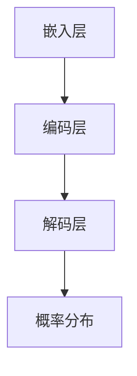
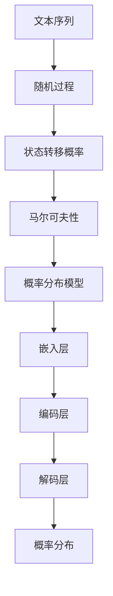

                 

### 2.1 语言模型的数学模型

#### 2.1.1 语言模型的概率模型

在自然语言处理（NLP）中，语言模型是一种用于预测文本序列中下一个单词或字符的概率分布的模型。其核心思想是，通过学习大量文本数据，模型可以理解单词和句子之间的统计关系，从而能够生成或预测新的文本。

##### 2.1.1.1 随机过程

语言模型可以被视为一个随机过程，它在时间轴上生成一系列的随机变量，每个变量代表文本序列中的一个词或字符。随机过程的基本概念包括状态转移概率和状态空间。

**状态转移概率**

在NLP中，状态通常表示文本序列中的一个词或一组词。状态转移概率描述了从一个状态转移到另一个状态的概率。对于一个二元语言模型，状态转移概率可以表示为：

$$
P(X_{t+1} = y | X_t = x) = P_{xy}
$$

其中，$X_t$ 表示当前状态（词或字符），$X_{t+1}$ 表示下一个状态，$P_{xy}$ 是从状态 $x$ 转移到状态 $y$ 的概率。

**状态空间**

状态空间是所有可能状态的集合。对于自然语言，状态空间可以是单词、字符、短语或更大的语法单位。例如，在基于单词的语言模型中，状态空间是所有可能的单词集合。

##### 2.1.1.2 马尔可夫性

马尔可夫性是语言模型的一个重要特性，它表明当前状态的概率仅依赖于前一个状态，而与更早的状态无关。这个特性使得语言模型能够简化计算，因为不需要记住所有的历史信息。

$$
P(X_{t+1} = y | X_t = x, X_{t-1} = z, ..., X_1 = a) = P(X_{t+1} = y | X_t = x)
$$

##### 2.1.2 语言模型的概率分布

语言模型的概率分布描述了给定一个词序列，下一个词的概率分布。常见的概率分布模型包括：

**隐马尔可夫模型（HMM）**

隐马尔可夫模型是一个基于状态转移概率和观测概率的概率模型。在HMM中，状态是隐含的，而观测值是直接的。HMM可以用来生成或解码文本序列。

$$
P(X = x | \theta) = \prod_{t=1}^{T} P(X_t = x_t | X_{t-1} = x_{t-1}, \theta) \cdot P(O = o | X, \theta)
$$

其中，$X$ 是状态序列，$O$ 是观测序列，$\theta$ 是模型参数。

**n-gram模型**

n-gram模型是基于历史n个词来预测下一个词的概率分布。n-gram模型是最简单的语言模型之一，其基本思想是：

$$
P(X_{t+1} = y | X_t = x_1, X_{t-1} = x_2, ..., X_{t-n+1} = x_n) = \frac{C(x_1, x_2, ..., x_n, y)}{C(x_1, x_2, ..., x_n)}
$$

其中，$C(x_1, x_2, ..., x_n, y)$ 是包含n个词序列和下一个词y的文本序列的数量，$C(x_1, x_2, ..., x_n)$ 是包含n个词序列的文本序列的数量。

**神经网络语言模型**

神经网络语言模型（NNLM）使用深度神经网络来学习文本数据中的概率分布。NNLM可以捕获更复杂的语言模式，并且可以扩展到更长的上下文窗口。

$$
P(X_{t+1} = y | X_t = x, X_{t-1} = x_{t-1}, ..., X_1 = x_1) = \sigma(W \cdot [x; x^T])
$$

其中，$W$ 是权重矩阵，$[x; x^T]$ 是输入向量的拼接，$\sigma$ 是激活函数。

#### 2.1.3 语言模型的基本架构

语言模型通常由以下几部分组成：

1. **嵌入层（Embedding Layer）**：将输入的单词转换为密集的向量表示。
2. **编码层（Encoding Layer）**：对嵌入层生成的向量进行编码，以捕获上下文信息。
3. **解码层（Decoding Layer）**：从编码层提取上下文信息，并生成下一个单词的概率分布。

以下是一个简单的NNLM架构的Mermaid流程图：



#### 2.1.4 语言模型的训练与优化

语言模型的训练过程主要包括以下步骤：

1. **数据预处理**：将文本数据转换为可以用于训练的格式，例如分词、去停用词、标记化等。
2. **嵌入层训练**：使用预训练的词向量（如Word2Vec、GloVe）或通过随机初始化生成词向量。
3. **编码层训练**：通过反向传播算法优化编码层的权重，以最小化损失函数。
4. **解码层训练**：同样使用反向传播算法优化解码层的权重。
5. **优化策略**：使用如dropout、正则化等技术来防止过拟合。

以下是一个简单的NNLM训练过程的Python代码示例：

```python
import tensorflow as tf
from tensorflow.keras.models import Model
from tensorflow.keras.layers import Embedding, LSTM, Dense

# 假设我们有一个预训练的词向量矩阵
VOCAB_SIZE = 10000
EMBEDDING_DIM = 64

# 嵌入层
embedding = Embedding(VOCAB_SIZE, EMBEDDING_DIM, input_length=10)

# 编码层
encoded = LSTM(128, return_sequences=True)(embedding)

# 解码层
decoded = LSTM(128, return_sequences=True)(encoded)

# 输出层
output = Dense(VOCAB_SIZE, activation='softmax')(decoded)

# 构建模型
model = Model(inputs=embedding.input, outputs=output)

# 编译模型
model.compile(optimizer='adam', loss='categorical_crossentropy')

# 训练模型
model.fit(x_train, y_train, batch_size=32, epochs=10)
```

通过以上步骤，我们可以构建并训练一个简单的神经网络语言模型。在实际应用中，模型的设计和训练会更加复杂，但基本原理类似。

---

**核心概念与联系**

1. **随机过程**：语言模型基于随机过程理论，通过状态转移概率和状态空间描述文本序列。
2. **马尔可夫性**：语言模型利用马尔可夫性简化计算，仅依赖当前状态预测下一个状态。
3. **概率分布**：语言模型通过概率分布模型（如n-gram、NNLM）学习文本序列的概率。
4. **嵌入层**：将单词转换为密集向量表示，用于编码和解码文本。
5. **编码层**：捕获上下文信息，为解码层提供输入。
6. **解码层**：生成下一个单词的概率分布。

以下是一个简化的Mermaid流程图，展示了这些核心概念之间的关系：



通过上述讲解和流程图，我们能够清晰地理解语言模型的数学模型和基本架构。在接下来的章节中，我们将进一步探讨语言模型在科学理论生成和跨学科创新中的应用。

