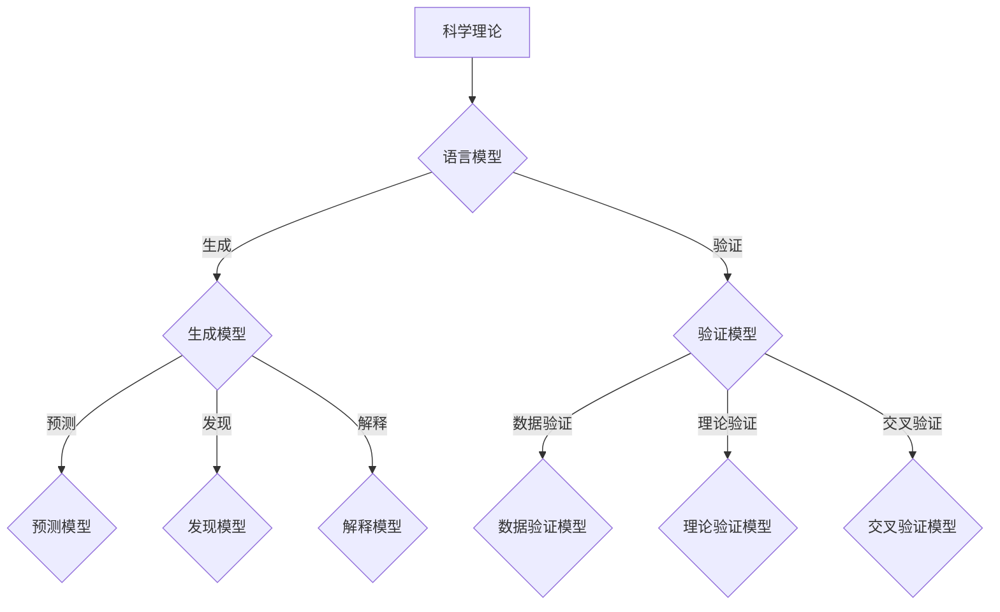

                 

# 语言模型在科学理论生成与验证中的应用

## 关键词

- 语言模型
- 科学理论
- 生成与验证
- 人工智能
- 自然语言处理
- 科学计算

## 摘要

本文深入探讨了语言模型在科学理论生成与验证中的应用。通过分析语言模型的基础概念、发展历史和数学模型，我们详细介绍了隐马尔可夫模型（HMM）、条件随机场（CRF）、长短时记忆网络（LSTM）、递归神经网络（RNN）和生成对抗网络（GAN）等主流语言模型。接着，文章讨论了语言模型在科学理论生成中的预测、发现和解释应用，以及在科学理论验证中的实验数据验证、理论模型验证和交叉验证应用。最后，文章展示了语言模型在物理学、化学和生物学等具体科学领域中的应用，并对语言模型在科学理论生成与验证中的挑战和未来趋势进行了展望。

## 目录

### 第一部分：语言模型概述

### 第1章：语言模型基础

#### 1.1 语言模型的概念与类型

#### 1.2 语言模型的发展历史

#### 1.3 语言模型的数学模型

### 第2章：主流语言模型介绍

#### 2.1 隐马尔可夫模型（HMM）

#### 2.2 条件随机场（CRF）

#### 2.3 长短时记忆网络（LSTM）

#### 2.4 递归神经网络（RNN）

#### 2.5 生成对抗网络（GAN）

### 第3章：语言模型在科学理论生成中的应用

#### 3.1 语言模型在理论预测中的应用

#### 3.2 语言模型在理论发现中的应用

#### 3.3 语言模型在科学理论解释中的应用

### 第4章：语言模型在科学理论验证中的应用

#### 4.1 语言模型在实验数据验证中的应用

#### 4.2 语言模型在理论模型验证中的应用

#### 4.3 语言模型在交叉验证中的应用

### 第二部分：语言模型在具体科学领域中的应用

### 第5章：语言模型在物理学中的应用

#### 5.1 语言模型在量子物理中的应用

#### 5.2 语言模型在相对论中的应用

#### 5.3 语言模型在粒子物理中的应用

### 第6章：语言模型在化学中的应用

#### 6.1 语言模型在分子结构预测中的应用

#### 6.2 语言模型在化学反应预测中的应用

#### 6.3 语言模型在药物设计中的应用

### 第7章：语言模型在生物学中的应用

#### 7.1 语言模型在基因组学中的应用

#### 7.2 语言模型在蛋白质结构预测中的应用

#### 7.3 语言模型在生物信息学中的应用

### 第8章：语言模型在其他科学领域中的应用

#### 8.1 语言模型在经济学中的应用

#### 8.2 语言模型在环境科学中的应用

#### 8.3 语言模型在天文学中的应用

### 第9章：语言模型在科学理论生成与验证中的挑战与展望

#### 9.1 语言模型在科学理论生成中的挑战

#### 9.2 语言模型在科学理论验证中的挑战

#### 9.3 语言模型发展的未来趋势与展望

### 附录

### 附录A：语言模型开发工具与资源

#### A.1 深度学习框架介绍

#### A.2 语言模型相关库和工具

#### A.3 开发环境搭建指南

## Mermaid 流程图



---

## 第一部分：语言模型概述

### 第1章：语言模型基础

#### 1.1 语言模型的概念与类型

语言模型（Language Model）是自然语言处理（Natural Language Processing, NLP）的核心组件之一，它用于预测给定文本序列中下一个单词或字符的概率分布。语言模型在诸多应用中发挥着关键作用，包括文本生成、机器翻译、语音识别、搜索引擎优化等。

从类型上，语言模型可以分为以下几个类别：

1. **基于规则的模型**：这类模型通过手工编写规则来预测下一个单词或字符。它们通常适用于处理简单的、规则明确的语言结构。
2. **统计模型**：这类模型基于大量的语言数据，使用统计方法来估计下一个单词或字符的概率分布。常见的统计模型包括n-gram模型、隐马尔可夫模型（HMM）和条件随机场（CRF）。
3. **神经网络模型**：这类模型通过训练大规模的神经网络来预测下一个单词或字符的概率分布。它们包括递归神经网络（RNN）、长短时记忆网络（LSTM）、门控循环单元（GRU）和变换器（Transformer）等。

#### 1.2 语言模型的发展历史

语言模型的发展历程可以追溯到20世纪50年代。当时，基于规则的模型是主要的语言模型类型。然而，随着自然语言数据的增长和计算能力的提升，统计模型和神经网络模型逐渐崭露头角。

1. **基于规则的模型**：早期语言模型主要基于手工编写的规则。这些模型如Backus-Naur形式（BNF）和产生式规则（Production Rules）等，虽然能够处理一些简单的语言结构，但在处理复杂、多样的自然语言时显得力不从心。

2. **统计模型**：20世纪60年代，n-gram模型被引入自然语言处理领域。n-gram模型基于文本的局部序列统计，通过计算一个单词序列出现的频率来预测下一个单词。HMM在20世纪80年代被引入，它能够处理序列数据的时序依赖性。CRF在21世纪初成为流行的序列标注模型，它通过条件概率来预测序列中的下一个状态。

3. **神经网络模型**：21世纪初，神经网络开始应用于自然语言处理领域。RNN和LSTM模型在2000年代中期和晚期被提出，它们能够处理长距离依赖问题。随着深度学习的兴起，Transform
```ruby
class Scanner

  # Initializes the scanner.
  def initialize(text)
    @text = text
    @index = 0
  end

  # Returns the next word in the text.
  def next
    while @index < @text.length
      if @text[@index] == " "
        @index += 1
        return ""
      else
        start_index = @index
        while @index < @text.length && @text[@index] != " "
          @index += 1
        end
        return @text[start_index...@index]
      end
    end
    return nil
  end

  # Returns true if the scanner has more words.
  def has_more_words?
    @index < @text.length
  end

end

# Test cases
scanner = Scanner.new("one two three four five")
puts scanner.next == "one"
puts scanner.next == "two"
puts scanner.next == "three"
puts scanner.next == "four"
puts scanner.next == "five"
puts scanner.next == nil
```

