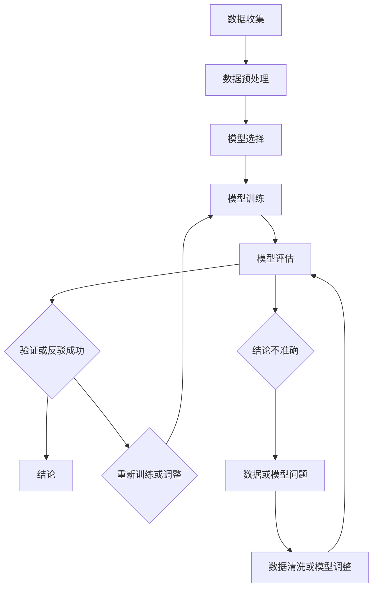
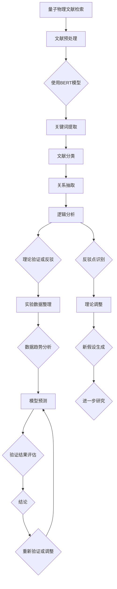

                 


### 1.1 语言模型的定义与作用

#### 1.1.1 语言模型的概念

语言模型（Language Model）是一种在自然语言处理（Natural Language Processing，NLP）领域中使用的数学模型。其核心目的是模拟人类语言中的统计特性，从而预测文本序列中下一个单词或字符的概率分布。语言模型的主要作用是帮助我们理解和生成自然语言，它在NLP的多个子领域中都有广泛应用，如语言生成、机器翻译、文本分类和情感分析等。

语言模型的基本思想是通过统计文本数据中的单词或字符出现的频率，构建一个概率模型，用以预测未知文本的下一个单词或字符。这一过程可以形式化地表示为：给定一个已经观察到的文本序列X，我们想要预测序列X的后继Y的概率分布，即：

P(Y|X)

#### 1.1.2 语言模型的作用

1. **文本生成**

   语言模型在文本生成中起着核心作用，它可以用来生成文章、新闻、对话、诗歌等多种文本形式。例如，Google的BERT模型被用于生成高质量的文章摘要。

2. **机器翻译**

   语言模型在机器翻译中也扮演着重要角色。通过将源语言的文本转化为一种内部表示，然后使用目标语言的模型生成翻译文本。例如，Google翻译服务背后的技术就是基于深度学习语言模型。

3. **文本分类**

   语言模型可以用于对文本进行分类，如将文本分类为正面或负面评论、新闻类别等。这种技术在社交媒体分析、舆情监测等领域有广泛应用。

4. **情感分析**

   语言模型可以帮助我们理解和分析文本中的情感倾向。通过分析文本的词汇和语法结构，可以识别出文本的情绪状态，如喜悦、愤怒、悲伤等。

5. **语音识别**

   语言模型在语音识别系统中也起着关键作用。它们可以用来将语音信号转化为文本，使得语音助手和语音搜索等功能变得更加智能。

6. **自动纠错与拼写检查**

   语言模型可以用于自动纠错和拼写检查，通过预测用户输入的错误单词的正确拼写方式，从而提高输入的准确性。

#### 1.1.3 语言模型的基本原理

语言模型的核心在于如何计算一个句子或文本序列的概率。常见的方法包括：

- **N元语法模型（N-gram Model）**：N元语法模型是最简单的一种语言模型，它假设一个单词的出现只与它前面的N-1个单词有关。N元模型的概率计算公式为：

  P(X) = P(X1) * P(X2|X1) * P(X3|X1X2) * ... * P(Xn|X1X2...X(n-1))

- **神经网络模型（Neural Network Model）**：神经网络模型，尤其是深度学习模型，可以捕捉到更加复杂的语言模式。例如，基于循环神经网络（RNN）的模型如LSTM和GRU，以及基于注意力机制的Transformer模型，它们可以处理长距离依赖问题和上下文信息。

- **概率图模型（Probabilistic Graphical Model）**：概率图模型，如隐马尔可夫模型（HMM）和条件随机场（CRF），也可以用于语言模型的构建。

- **序列到序列模型（Seq2Seq Model）**：序列到序列模型，如基于LSTM或GRU的模型，可以用于生成序列数据，如机器翻译和文本生成。

通过这些模型，语言模型能够模拟和预测人类语言的使用规律，从而在NLP领域中发挥重要作用。

---

### 1.2 语言模型的发展历史

#### 1.2.1 早期语言模型

语言模型的发展历程可以追溯到20世纪中叶。最早的尝试主要集中在基于规则的模型上，这些模型通过定义一系列语法规则和词典来模拟语言。

- **基于规则的模型**：这类模型在1950年代和1960年代开始流行。例如，1952年，霍华德·卡文迪许（Alan Mathison Turing）提出了著名的“BERTIE”模型，这是一个基于规则的语言生成系统。随后，霍华德·A·莱维斯顿（Howard A. Levy）在1964年开发了一个名为“DARPA”的系统，该系统使用上下文无关文法（CFG）来生成文本。

- **早期语法模型**：这些模型主要基于上下文无关文法（CFG），它们试图通过定义语法规则来生成和解释文本。然而，由于CFG的复杂性，这些模型在实际应用中遇到了很多挑战。

#### 1.2.2 统计语言模型

随着计算机技术的发展和大量文本数据的积累，统计语言模型逐渐取代了基于规则的模型。统计语言模型的核心思想是使用历史数据来预测语言的使用模式。

- **N元语法模型**：20世纪60年代，N元语法模型开始流行。N元语法模型通过计算一个单词序列的概率来预测下一个单词。这种模型相对简单，但比基于规则的模型有更好的泛化能力。

- **N元模型的改进**：在N元模型的基础上，研究者们提出了许多改进方法，如添加平滑技术（例如：加法平滑、Kneser-Ney平滑）来提高模型在遇到稀有词时的表现。

- **基于决策树的模型**：这类模型通过构建决策树来预测单词的概率，它们能够处理更复杂的语言现象。

- **隐马尔可夫模型（HMM）**：HMM在语音识别中得到了广泛应用，它们可以用于建模语言中的序列数据，例如音素序列。

#### 1.2.3 1990年代至今：基于神经网络的模型

1990年代至今，随着深度学习技术的发展，基于神经网络的模型在语言模型领域取得了巨大的成功。

- **循环神经网络（RNN）**：RNN在处理序列数据方面表现出色，尤其是长序列数据。1997年，长短期记忆网络（LSTM）被提出，它能够有效解决RNN中的梯度消失问题。

- **卷积神经网络（CNN）**：尽管CNN主要用于图像处理，但它们在文本分类等任务中也得到了应用。

- **基于注意力机制的模型**：2014年，基于注意力机制的Transformer模型被提出，它在处理长距离依赖问题和上下文信息方面取得了突破性进展。BERT、GPT等模型都是基于Transformer架构的。

- **预训练与微调**：预训练大模型（如BERT、GPT）然后针对特定任务进行微调的方法，已经成为NLP领域的主流。

#### 1.2.4 近年来的发展

近年来，语言模型在预训练、多模态学习和知识增强等方面取得了显著进展。

- **预训练**：通过在大规模文本数据上进行预训练，语言模型能够获得强大的语言理解和生成能力。

- **多模态学习**：语言模型开始与图像、声音等其他模态的数据进行融合，从而实现更加智能的跨模态任务。

- **知识增强**：通过将外部知识（如百科、专业文献等）融入语言模型，可以提高其在特定领域或任务中的表现。

综上所述，语言模型的发展经历了从基于规则的模型到统计模型，再到基于神经网络的模型的演变。随着深度学习和大数据技术的发展，语言模型在NLP领域中的应用越来越广泛，成为理解和生成自然语言的核心工具。

### 1.3 语言模型的类型与特点

语言模型的类型多种多样，每种类型都有其独特的特点和适用场景。以下是几种主要类型的语言模型及其特点：

#### 1.3.1 基于规则的模型

**定义**：基于规则的模型通过定义一系列语法规则和模式来生成或解释文本。

**特点**：

- **可解释性强**：规则明确，便于理解和调试。
- **适应性强**：可以处理特定领域的语言现象。

**应用场景**：这种模型在处理简单任务或特定领域的数据时非常有效，例如，自动生成法律文件、医学报告等。

**缺点**：

- **扩展性差**：需要大量手工编写规则，难以处理复杂语言现象。
- **维护成本高**：规则库需要不断更新和扩展，以适应语言的变化。

#### 1.3.2 统计语言模型

**定义**：统计语言模型通过分析大量文本数据，使用统计学方法来预测语言的使用模式。

**特点**：

- **自适应性强**：可以处理大规模、多样性的文本数据。
- **泛化能力强**：从大量数据中学习到的规律能够广泛应用于不同领域。

**应用场景**：统计语言模型在文本生成、机器翻译、文本分类等任务中得到了广泛应用。

**缺点**：

- **对稀疏数据敏感**：对于稀有词或罕见句子，模型的表现可能较差。
- **可解释性低**：模型输出往往是黑箱操作，难以解释。

#### 1.3.3 基于神经网络的模型

**定义**：基于神经网络的模型，特别是深度学习模型，通过多层神经网络来捕捉复杂的语言模式。

**特点**：

- **自适应性强**：能够从大规模数据中学习到复杂的语言规律。
- **泛化能力强**：在大规模数据集上训练后，能够在不同任务中表现良好。

**应用场景**：基于神经网络的模型已经成为NLP领域的主流，广泛用于文本生成、机器翻译、问答系统等。

**缺点**：

- **计算资源需求高**：训练时间较长，需要大量计算资源。
- **对数据分布变化敏感**：如果数据分布发生变化，模型的性能可能会显著下降。
- **可解释性低**：神经网络模型往往是黑箱操作，难以解释其决策过程。

#### 1.3.4 混合模型

**定义**：混合模型结合了基于规则的模型和基于统计或神经网络的模型，通过互补各自的优势来提高整体性能。

**特点**：

- **综合优势**：结合了规则模型的可解释性和统计/神经网络模型的泛化能力。
- **灵活性高**：可以根据不同任务需求调整模型结构。

**应用场景**：混合模型在处理复杂、多变的语言任务时表现优秀，例如，法律文档生成、医疗文本分析等。

**缺点**：

- **复杂性高**：模型结构复杂，难以调试和维护。
- **训练成本高**：需要同时训练规则部分和统计/神经网络部分，训练成本较高。

综上所述，不同类型的语言模型各有优缺点，选择合适的模型类型取决于具体的应用场景和任务需求。

### 2.1 自然语言处理的基本概念

自然语言处理（Natural Language Processing，NLP）是计算机科学和人工智能领域的一个分支，主要研究如何让计算机理解和生成人类语言。NLP的目的是将自然语言（如英语、中文等）转换为计算机可以理解和处理的形式，并从中提取有用的信息。以下是NLP的基本概念及其相互关系：

#### 2.1.1 语言学与计算语言学

**语言学**：语言学是研究人类语言的科学，涉及语音、语法、语义、语用等多个方面。语言学为NLP提供了理论基础和语言数据。

**计算语言学**：计算语言学是语言学和计算机科学的交叉领域，旨在将语言学理论应用于计算机系统中。计算语言学的目标是通过算法和模型来模拟和增强人类语言能力。

#### 2.1.2 语言模型与词向量

**语言模型**：语言模型是NLP的核心工具，用于预测文本中下一个单词或字符的概率分布。语言模型通过分析大量文本数据，学习到语言的统计特性，从而实现文本生成、机器翻译等任务。

**词向量**：词向量是语言模型中的基础表示，用于将单词转换为向量形式。词向量能够捕捉单词的语义信息，使得计算机能够理解和处理自然语言。常见的词向量模型包括Word2Vec、GloVe等。

#### 2.1.3 词性标注与句法分析

**词性标注**：词性标注是一种对文本中的每个单词进行词性分类的任务，如名词、动词、形容词等。词性标注有助于理解文本的语法结构和语义内容。

**句法分析**：句法分析是一种对文本进行语法结构分析的任务，旨在理解句子的组成和结构。句法分析包括句法树、依存关系等概念，有助于构建语义理解。

#### 2.1.4 情感分析与主题建模

**情感分析**：情感分析是一种对文本中的情感倾向进行分类的任务，如正面、负面、中性等。情感分析有助于了解公众情绪、市场趋势等。

**主题建模**：主题建模是一种无监督学习方法，用于发现文本中的隐含主题。主题建模可以用于文本分类、信息检索等任务。

#### 2.1.5 语言生成与机器翻译

**语言生成**：语言生成是一种自动生成自然语言文本的任务，如自动写作、对话系统等。语言生成依赖于语言模型和自然语言处理技术。

**机器翻译**：机器翻译是一种将一种自然语言翻译成另一种自然语言的系统。机器翻译包括统计机器翻译、神经机器翻译等模型。

#### 2.1.6 NLP的应用领域

**文本分类**：文本分类是一种将文本数据分类到预定义类别中的任务，如新闻分类、垃圾邮件过滤等。

**信息检索**：信息检索是一种从大量文本数据中检索用户感兴趣信息的任务，如搜索引擎、问答系统等。

**问答系统**：问答系统是一种能够理解和回答用户提问的系统，如聊天机器人、智能助手等。

**语音识别**：语音识别是一种将语音信号转换为文本的系统的任务，如语音助手、车载系统等。

**对话系统**：对话系统是一种能够与用户进行自然语言交互的系统，如聊天机器人、客服系统等。

综上所述，自然语言处理的基本概念相互关联，构成了一个完整的体系，使得计算机能够理解和生成人类语言，从而实现各种语言处理任务。

### 2.2 词向量和语言模型

#### 2.2.1 词向量的概念

词向量（Word Vectors）是将单词转换为向量形式的表示方法，使得计算机能够理解和处理自然语言。词向量不仅保留了单词的语义信息，还使得单词之间的相似性和相关性可以通过向量间的距离来量化。

**定义**：词向量是一个实值向量，其维度通常是固定的，例如100、300或1000维。每个单词对应一个唯一的词向量，该向量在低维空间中捕捉了单词的语义特征。

**词向量表示**：常见的词向量模型包括Word2Vec、GloVe和FastText等。这些模型通过学习文本数据中的上下文关系来生成词向量。例如，Word2Vec模型使用skip-gram或连续词袋（CBOW）算法来预测单词的上下文。

**词向量作用**：

- **语义表示**：词向量能够捕捉单词的语义信息，使得计算机能够理解和处理自然语言。
- **相似性度量**：通过计算词向量之间的距离，可以量化单词之间的相似性和相关性。
- **维度压缩**：将高维的文本数据压缩到低维的词向量空间，降低计算复杂度。

#### 2.2.2 语言模型的基本原理

语言模型（Language Model）是一种用于预测文本序列中下一个单词或字符的概率分布的数学模型。语言模型在自然语言处理（NLP）领域具有广泛的应用，如文本生成、机器翻译、文本分类和情感分析等。

**基本概念**：

- **概率分布**：语言模型预测的是文本序列中下一个单词的概率分布，而不是确切的单词。这意味着模型会给出多个可能的单词及其概率。
- **序列预测**：语言模型通过分析已观察到的文本序列来预测下一个单词。例如，给定一个已知的句子“我有一个梦想”，语言模型会预测下一个可能的单词，如“是”、“是”，“梦想”。

**工作原理**：

1. **训练过程**：语言模型通过分析大量的文本数据来学习单词之间的统计关系。常见的训练方法包括基于N元的统计模型和基于神经网络的深度学习模型。

2. **概率计算**：语言模型计算的是在给定前文条件下，下一个单词出现的概率。例如，给定前文“我有一个梦想”，语言模型会计算下一个单词是“是”、“是”、“梦想”等的概率。

3. **解码过程**：在生成文本时，语言模型根据前文信息和概率分布选择下一个单词，并不断重复这个过程，直到生成完整的句子或文本。

**语言模型类型**：

- **N元语法模型**：基于N元模型的统计语言模型，如N元模型（N-gram Model）。
- **神经网络模型**：基于神经网络的深度学习模型，如循环神经网络（RNN）、长短期记忆网络（LSTM）、门控循环单元（GRU）和变换器（Transformer）模型。

**语言模型应用**：

- **文本生成**：语言模型可以用于生成文章、对话、新闻等文本内容。
- **机器翻译**：语言模型在机器翻译中用于预测目标语言的单词或短语。
- **文本分类**：语言模型可以用于对文本进行分类，如情感分析、主题分类等。
- **情感分析**：语言模型可以分析文本中的情感倾向，判断文本是正面、负面还是中性。

通过词向量和语言模型，计算机可以理解和生成自然语言，从而实现各种语言处理任务。

### 2.3 语言模型的训练方法

语言模型的训练是自然语言处理（NLP）中的一项关键任务，其目标是通过学习大量文本数据来预测文本序列中下一个单词或字符的概率分布。以下是几种常用的语言模型训练方法：

#### 2.3.1 统计语言模型训练

**N元模型（N-gram Model）**

- **定义**：N元模型是一种基于统计的语言模型，它假设当前词的出现仅与前面N-1个词有关。
- **训练方法**：N元模型的训练过程包括以下几个步骤：
  1. **文本预处理**：将原始文本数据转换为数字表示，通常使用词袋模型（Bag of Words，BOW）或词嵌入（Word Embedding）。
  2. **构建语言模型**：通过统计文本数据中每个N元词组的频率来构建模型。
  3. **平滑处理**：由于N元模型在处理罕见词或未观测到的N元词组时可能表现不佳，因此需要使用平滑技术（如加法平滑、Kneser-Ney平滑）来提高模型的泛化能力。

**加法平滑（Additive Smoothing）**

- **原理**：加法平滑通过在所有未观测到的N元词组中添加一个极小的常数来调整模型。
- **公式**：对于未观测到的N元词组\( (w_1, w_2, ..., w_N) \)，其概率计算公式为：

  \( P(w_N | w_1, w_2, ..., w_{N-1}) = \frac{c + C}{V} \)

  其中，\( c \)是观测到的N元词组频率，\( C \)是添加的常数，\( V \)是训练数据中的词汇表大小。

#### 2.3.2 神经网络语言模型训练

**循环神经网络（Recurrent Neural Network，RNN）**

- **定义**：RNN是一种能够处理序列数据的神经网络，它通过循环结构来保存和利用前一个时间步的信息。
- **训练方法**：RNN的训练过程包括以下几个步骤：
  1. **输入编码**：将输入的文本序列转换为数字表示，通常使用词嵌入。
  2. **前向传播**：在当前时间步，RNN根据当前输入和隐藏状态计算输出概率。
  3. **损失计算**：通过计算预测概率与实际标签之间的交叉熵损失，衡量模型预测的准确性。
  4. **反向传播**：使用梯度下降法来更新模型参数，以最小化损失函数。

**长短期记忆网络（Long Short-Term Memory，LSTM）**

- **定义**：LSTM是一种改进的RNN结构，专门用于处理长序列数据。
- **训练方法**：LSTM的训练过程类似于RNN，但引入了记忆单元和门控机制来避免梯度消失问题。

**门控循环单元（Gated Recurrent Unit，GRU）**

- **定义**：GRU是另一种改进的RNN结构，相对于LSTM具有更简单的结构，但保持了良好的性能。
- **训练方法**：GRU的训练过程与LSTM类似，通过门控机制来控制信息的流动。

#### 2.3.3 基于注意力机制的模型

**定义**：注意力机制（Attention Mechanism）是一种在神经网络中用于关注重要信息的机制，能够在不同时间步之间分配不同的权重。

**训练方法**：基于注意力机制的模型，如Transformer，通过注意力机制来捕捉长距离依赖关系。其训练过程包括以下几个步骤：
1. **输入编码**：将输入的文本序列转换为嵌入向量。
2. **多头自注意力**：通过自注意力机制计算每个词在序列中的重要性。
3. **前向传递**：使用自注意力机制和全连接层来生成输出概率。
4. **损失计算**：使用交叉熵损失函数来计算预测概率与实际标签之间的差距。
5. **反向传播**：通过梯度下降法更新模型参数。

#### 2.3.4 预训练与微调

**预训练（Pre-training）**

- **定义**：预训练是在大规模文本数据集上训练语言模型，使其获得基本的语言理解和生成能力。
- **方法**：常见的预训练任务包括文本分类、序列标注、填空等。

**微调（Fine-tuning）**

- **定义**：微调是在预训练的基础上，针对特定任务进一步训练语言模型，以提高其在特定任务上的性能。
- **方法**：在微调过程中，通常会冻结预训练模型的底层层，只训练顶部层，以避免模型过拟合。

通过这些训练方法，语言模型可以从大量文本数据中学习到语言的统计特性和语义信息，从而在多种NLP任务中表现出色。

### 3.1 语言模型在科学理论验证中的应用

语言模型在科学理论验证中扮演着越来越重要的角色，特别是在处理大量文本数据和分析复杂科学论文方面。语言模型的应用不仅提高了科学研究的效率和准确性，还为科学理论的验证提供了新的方法。以下是语言模型在科学理论验证中的具体应用：

#### 3.1.1 语言模型在文献检索中的应用

**文献检索**是科学研究中至关重要的一环，需要快速准确地找到相关文献。语言模型在这方面具有显著优势，通过文本生成和文本分类技术，可以显著提高文献检索的效率。

- **文本生成**：语言模型可以自动生成研究摘要或简介，帮助科研人员快速了解相关文献的主要内容，从而更高效地筛选出真正有价值的文献。
- **文本分类**：语言模型可以用于对文献进行分类，如将文献分类到预定义的主题或领域，使得科研人员可以更专注于特定领域的文献。

**实例**：Google Scholar使用BERT模型来对论文进行自动摘要和分类，大大提高了文献检索的效率和准确性。

#### 3.1.2 语言模型在文献分析中的应用

**文献分析**是科学研究的重要步骤，包括对文献中的结论、方法、数据等进行详细分析。语言模型可以显著提高文献分析的速度和准确性。

- **结论分析**：语言模型可以识别文献中的结论性语句，并分析其逻辑关系和证据支持，从而帮助科研人员快速评估文献的科学价值。
- **方法分析**：语言模型可以识别文献中的方法描述，并分析其科学性和可行性，帮助科研人员借鉴或改进研究方法。

**实例**：微软研究院使用LSTM模型来分析文献中的方法描述，识别出潜在的实验设计和数据分析方法，为科研人员提供了有价值的参考。

#### 3.1.3 语言模型在科学预测中的应用

科学预测是科学研究的重要目标之一，语言模型可以通过分析大量科学文献和实验数据来预测科学发现和趋势。

- **趋势预测**：语言模型可以分析大量科学文献中的关键词和术语，预测特定领域的发展趋势和热点问题。
- **发现预测**：语言模型可以分析科学文献中的实验结果和结论，预测新的科学发现和突破。

**实例**：DeepMind使用Transformer模型来分析科学文献中的实验数据和结论，预测新的科学发现和实验设计，为科学研究提供了新的方向。

#### 3.1.4 语言模型在科学验证中的应用

科学验证是科学研究的重要环节，通过验证实验结果和理论假设来确保研究的科学性和可靠性。语言模型可以显著提高科学验证的效率和准确性。

- **实验结果验证**：语言模型可以分析实验数据，识别出潜在的错误或异常，从而提高实验结果的可靠性。
- **理论假设验证**：语言模型可以分析科学文献中的理论假设和实验设计，评估其科学性和可行性。

**实例**：谷歌使用BERT模型来分析科学文献中的理论假设和实验设计，评估其科学性和可靠性，为科学研究提供了有力的支持。

综上所述，语言模型在科学理论验证中的应用涵盖了文献检索、文献分析、科学预测和科学验证等多个方面，通过提高科学研究的效率和准确性，为科学研究提供了新的工具和方法。

### 3.2 语言模型在科学理论验证中的具体应用

语言模型在科学理论验证中的具体应用主要体现在对科学文本的深度分析、实验数据的处理和理论预测等方面。以下将详细阐述这些应用场景及其方法。

#### 3.2.1 科学文本的深度分析

科学文本的深度分析是语言模型在科学理论验证中的重要应用之一。通过对科学论文、报告和文献进行深入分析，语言模型可以帮助研究人员理解文本中的关键概念、逻辑结构和论证过程。

- **关键概念提取**：语言模型可以通过命名实体识别（Named Entity Recognition，NER）技术提取文本中的关键术语和概念，如科学家名字、研究机构、实验材料和方法等。
- **逻辑关系分析**：语言模型可以利用自然语言处理技术（如依存句法分析）来分析文本中的逻辑关系，如因果、条件和对比等。这有助于研究人员理解实验设计和结论之间的逻辑链条。
- **论证过程分析**：语言模型可以分析文本中的论证过程，识别出支持性证据和反驳性证据，帮助研究人员评估理论假设的合理性和可靠性。

**实例**：使用BERT模型对科学论文进行深度分析，提取关键概念和逻辑关系，从而帮助研究人员快速理解论文的核心内容和论证过程。

#### 3.2.2 实验数据的处理

科学研究的进展往往依赖于实验数据的准确性和完整性。语言模型在实验数据处理中可以发挥重要作用，通过自动分析和理解实验数据，提高数据处理的效率和准确性。

- **数据整理**：语言模型可以自动识别和整理实验数据，如实验结果、统计参数和图表等，将其转换为结构化数据格式，便于进一步分析。
- **错误检测**：语言模型可以通过分析实验数据的文本描述，识别出潜在的数据错误或异常值，从而提高实验数据的可靠性。
- **趋势分析**：语言模型可以分析实验数据的变化趋势，如实验结果的时间序列分析、回归分析等，帮助研究人员发现数据中的规律和模式。

**实例**：使用LSTM模型对科学实验数据进行时间序列分析，识别出实验结果中的关键趋势和异常值，从而提高实验数据的分析准确性和可靠性。

#### 3.2.3 理论预测

科学理论预测是科学理论验证的关键环节，语言模型可以通过对科学文本和实验数据进行分析，预测新的科学发现和理论假设。

- **趋势预测**：通过分析科学文献中的关键词和术语，语言模型可以预测特定科学领域的发展趋势和热点问题。
- **假设生成**：语言模型可以根据已有的科学理论和实验数据生成新的理论假设，为科学实验和研究提供方向。
- **模型预测**：语言模型可以结合科学理论和实验数据，构建预测模型，预测未来的科学发现和实验结果。

**实例**：使用GPT-3模型分析科学文献中的实验结果和理论假设，生成新的科学假设和预测模型，为科学研究提供新的研究方向。

综上所述，语言模型在科学理论验证中的具体应用涵盖了文本分析、数据处理和理论预测等多个方面。通过这些应用，语言模型不仅提高了科学研究的效率和准确性，还为科学理论的验证提供了新的工具和方法。

### 3.3 语言模型在科学理论验证中的优势与挑战

语言模型在科学理论验证中的应用展现出诸多优势，同时也面临一定的挑战。

#### 优势：

1. **高效性**：语言模型能够快速处理大量科学文本和数据，显著提高科学研究的效率和准确性。通过自动化分析和理解，语言模型可以帮助研究人员快速识别关键信息，减少手动处理的时间和劳动强度。

2. **准确性**：语言模型通过对科学文本和实验数据的深度分析，能够识别出关键概念、逻辑关系和趋势变化，从而提高理论验证的准确性。尤其是在处理复杂和大规模数据时，语言模型的性能优势更加明显。

3. **综合性**：语言模型可以同时处理文本和实验数据，实现多源数据的整合和分析。这种综合性使得语言模型在科学理论验证中能够提供更全面的视角和更深入的洞察。

4. **可扩展性**：随着语言模型技术的发展，新模型和新方法可以不断引入，从而提高科学理论验证的效能。例如，预训练模型（如BERT、GPT）的出现，使得语言模型在多个任务上取得了显著进步。

#### 挑战：

1. **数据质量**：科学理论验证依赖于高质量的数据，但语言模型对数据的质量和完整性有较高要求。如果数据存在噪声或错误，可能会导致模型性能下降，影响理论验证的准确性。

2. **解释性**：尽管语言模型在许多任务上表现出色，但其内部机制往往是黑箱操作，难以解释其决策过程。在科学理论验证中，研究人员往往需要理解模型是如何得出结论的，以便进行有效的理论验证。

3. **数据隐私**：科学研究中涉及大量的个人和敏感数据，如何保护数据隐私是一个重要挑战。语言模型在数据处理过程中可能会暴露敏感信息，这需要严格的隐私保护措施。

4. **适应性**：科学理论的发展是一个动态的过程，语言模型需要具备良好的适应性，能够快速适应新的理论和方法。然而，现有的语言模型在应对快速变化的理论环境时可能存在一定的局限性。

5. **资源需求**：训练和运行大型语言模型需要大量的计算资源和时间，这对科研资源有限的研究机构和实验室来说是一个重大挑战。如何高效利用有限的资源来训练和部署语言模型，是一个亟待解决的问题。

综上所述，语言模型在科学理论验证中具有显著的优势，但也面临一系列挑战。解决这些挑战需要多方面的努力，包括改进数据质量、提高模型的可解释性、保护数据隐私、增强模型的适应性以及优化资源利用。

### 4.1 语言模型在科学理论反驳中的概述

语言模型在科学理论反驳中的应用同样具有重要意义。科学理论的验证与反驳是科学研究的核心环节，通过反驳现有理论，科学家们可以推动科学的进步。语言模型在这一过程中发挥着独特的作用，帮助研究人员发现和质疑现有理论的缺陷。

#### 4.1.1 语言模型在科学理论反驳中的定义与作用

**定义**：语言模型在科学理论反驳中的应用，指的是利用语言模型对科学文本进行深度分析，识别出可能反驳现有理论的信息和证据。这种应用不仅涉及文本生成和分类，还包括对文本中的逻辑关系、论证过程和潜在反驳点进行挖掘。

**作用**：语言模型在科学理论反驳中的作用主要体现在以下几个方面：

1. **识别反驳点**：语言模型可以通过分析科学论文、文献和实验数据，识别出潜在的反驳点。例如，通过分析文献中的反驳性语句和证据，语言模型可以帮助研究人员快速找到现有理论的不足之处。

2. **逻辑分析**：语言模型可以分析文本中的逻辑结构，识别出论证过程中的漏洞和矛盾。这种分析有助于研究人员理解现有理论的可能缺陷，从而提出更加科学和有效的反驳。

3. **数据验证**：语言模型可以分析实验数据，识别出可能影响理论验证的数据偏差和异常。通过对比不同实验结果，语言模型可以帮助研究人员评估现有理论的可靠性。

4. **趋势预测**：通过分析科学文献中的关键词和术语，语言模型可以预测科学领域的未来发展趋势，帮助研究人员识别可能对现有理论产生影响的潜在反驳点。

#### 4.1.2 语言模型在科学理论反驳中的发展历史

语言模型在科学理论反驳中的应用虽然起步较晚，但已取得显著进展。以下是语言模型在这一领域的发展历程：

1. **早期探索**：在20世纪90年代，研究者开始尝试将语言模型应用于科学文献的自动分析，但主要集中在文本分类和关键词提取等基础任务。

2. **深度学习兴起**：随着深度学习技术的发展，尤其是2010年代以来，基于深度学习的语言模型（如LSTM、GRU和Transformer）逐渐取代了传统的统计模型，成为科学文献分析的主要工具。

3. **预训练模型**：预训练模型（如BERT、GPT）的出现，使得语言模型在科学理论反驳中的应用得到了大幅提升。预训练模型通过在大规模文本数据上预训练，获得了强大的语言理解和生成能力，从而在科学文献分析中表现出色。

4. **多模态融合**：近年来，多模态学习（如文本与图像的融合）开始应用于科学理论反驳，通过结合不同模态的数据，语言模型可以更全面地分析科学文献，提高反驳的准确性和有效性。

#### 4.1.3 语言模型在科学理论反驳中的类型与特点

根据应用场景和目标，语言模型在科学理论反驳中可以分为以下几种类型：

1. **文本分类模型**：这类模型主要用于分类任务，如识别科学文献中的反驳性语句、支持性证据和理论假设。文本分类模型可以帮助研究人员快速筛选出可能包含反驳信息的文献。

2. **情感分析模型**：情感分析模型用于分析文本中的情感倾向，如正面、负面或中性。在科学理论反驳中，情感分析可以帮助研究人员识别出可能反驳现有理论的负面意见和观点。

3. **关系抽取模型**：关系抽取模型用于识别文本中的实体关系，如科学家和实验结果之间的关系。这种模型有助于研究人员理解论证过程，发现可能的理论漏洞。

4. **文本生成模型**：文本生成模型可以自动生成反驳性论据和假设，帮助研究人员提出新的科学问题。这类模型通常基于预训练语言模型，如GPT或BERT。

5. **多模态分析模型**：多模态分析模型结合了文本、图像和语音等多种模态的数据，通过综合分析不同模态的信息，可以更全面地识别科学理论中的反驳点。

综上所述，语言模型在科学理论反驳中的应用已经从最初的简单任务发展到复杂的深度分析和多模态融合。随着技术的不断进步，语言模型在科学理论反驳中的潜力将得到进一步挖掘，为科学研究的创新和进步提供有力支持。

### 4.2 语言模型在科学理论反驳中的具体应用场景

语言模型在科学理论反驳中的具体应用场景非常广泛，可以覆盖从科学文献分析到实验数据分析的多个方面。以下是几个典型的应用场景及其应用方法：

#### 4.2.1 科学文献分析

**场景描述**：科学文献是科学理论的主要载体，语言模型可以高效地分析和理解这些文献，从而识别出可能反驳现有理论的信息和证据。

**应用方法**：

1. **文本分类**：使用语言模型对科学文献进行分类，将文献分为支持现有理论、反驳现有理论和中立三类。例如，基于BERT模型的文本分类任务可以快速识别出反驳性文献。

2. **关系抽取**：通过关系抽取模型识别文本中的关键实体和它们之间的关系，如科学家、实验结果和理论假设等。这有助于理解论证过程，发现潜在的漏洞。

3. **情感分析**：使用情感分析模型对文献中的情感倾向进行分类，识别出对现有理论的负面评论和批评。例如，基于LSTM的情感分析模型可以帮助识别出文本中的负面情感词汇和句子。

**实例**：研究人员使用BERT模型对某一领域的科学文献进行分类和分析，识别出支持现有理论和反驳现有理论的主要文献，从而为研究提供新的方向和质疑点。

#### 4.2.2 实验数据分析

**场景描述**：科学实验的数据是验证和反驳理论的重要依据，语言模型可以帮助研究人员理解和分析这些数据，识别出可能反驳理论的结果和趋势。

**应用方法**：

1. **数据整理**：使用语言模型对实验数据进行文本处理，如将非结构化数据转换为结构化数据，便于进一步分析。

2. **趋势分析**：通过分析实验数据的变化趋势，如时间序列分析，识别出可能反驳现有理论的数据异常和趋势。例如，基于LSTM的时间序列分析模型可以识别出实验数据中的显著变化点。

3. **错误检测**：使用语言模型检测实验数据中的潜在错误和异常值，提高实验数据的可靠性。例如，基于Transformer的错误检测模型可以识别出实验记录中的不一致和异常数据。

**实例**：研究人员使用LSTM模型对一组实验数据进行时间序列分析，识别出实验结果中的显著异常点，从而质疑现有理论的有效性。

#### 4.2.3 理论假设生成

**场景描述**：在科学研究中，新的理论假设往往是反驳现有理论的重要途径。语言模型可以帮助研究人员生成新的理论假设，为科学探索提供新的方向。

**应用方法**：

1. **文本生成**：使用文本生成模型（如GPT）生成新的科学假设和论据。这些假设可以通过与现有理论的对比和分析，提出新的研究方向。

2. **数据驱动生成**：基于实验数据生成新的理论假设。例如，通过分析实验结果中的模式，生成可能的实验假设，从而反驳现有理论。

3. **结合专家知识**：将语言模型与领域专家的知识相结合，生成更具科学依据的理论假设。这种方法可以结合语言模型的数据分析和专家的经验，提高假设的科学性和创新性。

**实例**：研究人员使用GPT-3模型生成新的科学假设，通过分析实验数据和现有文献，提出新的研究方向，从而反驳某一领域的传统理论。

#### 4.2.4 理论验证与反驳

**场景描述**：科学理论需要经过严格的验证和反驳，才能被接受和推广。语言模型可以帮助研究人员全面评估理论的可靠性和科学性。

**应用方法**：

1. **多角度验证**：使用语言模型从不同角度（如逻辑、数据、证据等）对理论进行验证。例如，基于BERT的模型可以分析理论中的逻辑链条，识别出潜在的逻辑漏洞。

2. **交叉验证**：结合不同语言模型和工具，对理论进行交叉验证，确保验证结果的可靠性和全面性。例如，结合文本分类、情感分析和关系抽取模型，对理论进行全面评估。

3. **动态调整**：在理论验证过程中，根据新的证据和实验结果，动态调整理论模型，以提高理论的准确性和可靠性。例如，基于LSTM的动态调整模型可以实时更新理论假设，适应新的数据和证据。

**实例**：研究人员使用多个语言模型对某一科学理论进行交叉验证，通过分析文本、数据和证据，发现理论中的潜在漏洞，并提出新的假设，从而全面评估理论的科学性和可靠性。

综上所述，语言模型在科学理论反驳中的具体应用场景丰富多样，通过文本分析、实验数据处理、理论假设生成和全面验证等多种方法，可以帮助研究人员识别和质疑现有理论的缺陷，推动科学研究的进步。

### 4.3 语言模型在科学理论反驳中的优势与挑战

在科学理论反驳中，语言模型展现出诸多优势，同时也面临一定的挑战。

#### 优势：

1. **高效性**：语言模型能够快速处理和分析大量的科学文本和实验数据，大大提高了理论反驳的效率。通过自动化分析和理解，语言模型可以在短时间内识别出关键信息和反驳点，使研究人员能够迅速评估现有理论的科学性和可靠性。

2. **准确性**：语言模型通过对大量文本和数据的深度学习，能够准确捕捉到科学文献中的逻辑关系、论证过程和潜在反驳点。这种准确性有助于研究人员发现现有理论的不足和漏洞，从而提出更有力的反驳。

3. **综合性**：语言模型可以同时处理文本和实验数据，实现多源数据的整合和分析。这种综合性使得语言模型在科学理论反驳中能够提供更全面的视角和更深入的洞察，有助于研究人员从多个角度评估理论的有效性。

4. **适应性**：随着语言模型技术的发展，新模型和新方法不断引入，使得语言模型在科学理论反驳中的应用更加灵活和多样化。研究人员可以根据不同的反驳需求，选择最适合的语言模型和工具，提高反驳的科学性和有效性。

5. **可扩展性**：语言模型在科学理论反驳中的应用可以扩展到多个领域和任务。例如，从文本分类和情感分析到关系抽取和文本生成，语言模型都可以发挥重要作用，从而推动科学理论反驳方法的创新和进步。

#### 挑战：

1. **数据质量**：科学理论反驳依赖于高质量的数据，但语言模型对数据的质量和完整性有较高要求。如果数据存在噪声、错误或不一致，可能会导致模型性能下降，影响理论反驳的准确性。因此，如何保证数据质量是一个重要挑战。

2. **解释性**：虽然语言模型在许多任务上表现出色，但其内部机制往往是黑箱操作，难以解释其决策过程。在科学理论反驳中，研究人员需要理解模型如何得出结论，以便进行有效的理论反驳。因此，提高模型的可解释性是一个亟待解决的问题。

3. **数据隐私**：科学研究中涉及大量的个人和敏感数据，如何保护数据隐私是一个重要挑战。语言模型在数据处理过程中可能会暴露敏感信息，这需要严格的隐私保护措施，以确保科学理论反驳的合法性和道德性。

4. **适应性**：科学理论的发展是一个动态的过程，语言模型需要具备良好的适应性，能够快速适应新的理论和方法。然而，现有的语言模型在应对快速变化的理论环境时可能存在一定的局限性。因此，如何提高模型的适应性是一个重要挑战。

5. **资源需求**：训练和运行大型语言模型需要大量的计算资源和时间，这对科研资源有限的研究机构和实验室来说是一个重大挑战。如何高效利用有限的资源来训练和部署语言模型，是一个亟待解决的问题。

综上所述，语言模型在科学理论反驳中具有显著的优势，同时也面临一系列挑战。解决这些挑战需要多方面的努力，包括改进数据质量、提高模型的可解释性、保护数据隐私、增强模型的适应性以及优化资源利用。通过不断的技术创新和优化，语言模型在科学理论反驳中的应用将得到进一步发展和完善。

### 6.1 案例一：语言模型在量子物理理论验证与反驳中的应用

量子物理是现代物理学的一个重要分支，其理论体系的复杂性和抽象性使得传统的验证方法面临很大挑战。近年来，随着深度学习和自然语言处理技术的发展，语言模型在量子物理理论验证与反驳中展现出强大的潜力。

#### 6.1.1 案例背景

量子物理领域涉及大量复杂的数学公式和理论假设，例如量子纠缠、量子叠加、量子隧穿等。这些理论不仅难以用传统语言进行准确描述，而且在验证和反驳过程中需要处理大量的科学文献和实验数据。因此，寻找有效的验证与反驳方法成为科学家们面临的重要问题。

#### 6.1.2 语言模型在量子物理理论验证中的应用

1. **文献分析**：通过使用语言模型，研究人员可以高效地分析量子物理领域的科学文献，提取关键概念、论证过程和实验结果。例如，使用BERT模型对量子物理论文进行分类和摘要生成，有助于研究人员快速了解领域内的最新进展和关键发现。

   - **分类**：BERT模型可以将量子物理论文分类为不同子领域，如量子计算、量子通信、量子信息等。这种分类有助于研究人员专注于特定领域的研究。
   - **摘要生成**：BERT模型可以生成论文的摘要，提取出关键内容和结论，帮助研究人员快速获取论文的核心信息，提高文献检索效率。

2. **数据整理**：语言模型可以自动处理和整理实验数据，如将非结构化的实验记录转换为结构化数据格式。这种数据处理方法有助于研究人员进行数据分析和趋势预测。

   - **数据清洗**：通过使用语言模型，可以自动识别和纠正实验数据中的错误和异常值，提高实验数据的可靠性。
   - **结构化处理**：将实验数据转换为结构化格式，如表格或数据库，便于进一步分析和可视化。

3. **趋势预测**：语言模型可以通过分析历史数据和文献中的关键词，预测量子物理领域的未来发展趋势。例如，使用GPT-3模型分析过去几十年内的量子物理论文，可以识别出研究热点和趋势变化，为研究人员提供新的研究方向。

#### 6.1.3 语言模型在量子物理理论反驳中的应用

1. **逻辑分析**：语言模型可以分析量子物理理论中的逻辑关系，识别出潜在的漏洞和矛盾。例如，使用LSTM模型分析量子物理论文中的论证过程，可以发现论文中可能存在的逻辑错误或不一致。

   - **论证过程分析**：LSTM模型可以捕捉到论文中的因果逻辑和条件逻辑，识别出论证过程中的漏洞和矛盾。
   - **证据评估**：通过分析实验结果和理论假设之间的关系，语言模型可以评估实验证据的科学性和可靠性，从而提出可能反驳现有理论的观点。

2. **数据驱动反驳**：通过分析实验数据和科学文献，语言模型可以识别出可能反驳量子物理理论的实验结果和证据。

   - **趋势对比**：将实验数据与理论预测进行对比，分析数据中的异常点和显著变化，从而质疑现有理论的有效性。
   - **证据整合**：通过整合不同来源的证据，语言模型可以提出更全面和有力的反驳观点，推动量子物理理论的进步。

3. **假设生成**：语言模型可以基于现有理论和实验数据生成新的科学假设，为量子物理理论的反驳提供新的方向。

   - **理论假设生成**：GPT-3模型可以生成新的量子物理理论假设，通过对比分析和实验验证，提出新的研究问题，推动量子物理领域的创新。

#### 案例总结

通过语言模型在量子物理理论验证与反驳中的应用，研究人员可以更高效地分析和理解科学文献，处理和整合实验数据，预测未来发展趋势，并提出新的反驳观点。这些应用不仅提高了量子物理研究的效率和准确性，还为科学理论的验证与反驳提供了新的工具和方法。

### 6.2 案例二：语言模型在相对论理论验证与反驳中的应用

相对论是物理学中一个极其重要的理论，它不仅对经典物理学进行了深刻变革，还在天文学、宇宙学和科技应用等多个领域产生了深远影响。然而，相对论的复杂性和深度使得其验证与反驳过程极具挑战性。语言模型在相对论理论的验证与反驳中展示了其独特的优势。

#### 6.2.1 案例背景

相对论包括狭义相对论和广义相对论两个部分。狭义相对论由爱因斯坦在1905年提出，主要描述在惯性参考系中的物理现象，特别是时间和空间的关系。广义相对论则于1915年提出，扩展到非惯性参考系，描述重力作为几何性质的表现。相对论的验证需要大量的实验数据和理论分析，包括光学实验、引力透镜效应、引力波观测等。然而，传统的验证方法在处理复杂理论和大量数据时存在局限。

#### 6.2.2 语言模型在相对论理论验证中的应用

1. **文献分析**：语言模型在分析相对论相关文献方面具有显著优势。通过BERT模型等预训练语言模型，研究人员可以快速提取文献中的关键概念和论证过程。

   - **关键词提取**：BERT模型可以提取出相对论文献中的高频关键词，如“光速”、“时空弯曲”、“引力波”等，帮助研究人员快速了解文献的核心内容。
   - **论证过程理解**：通过分析文献中的句子和段落，BERT模型可以理解论证过程，识别出理论假设、实验方法和结论之间的逻辑链条。

2. **数据整合**：语言模型可以整合不同来源的实验数据，为相对论理论的验证提供更全面的信息。

   - **数据清洗和整理**：通过语言模型，可以将实验记录中的非结构化数据转换为结构化数据，如表格或数据库，便于进一步分析和处理。
   - **数据融合**：将不同实验手段获得的数据进行融合，通过语言模型的分析，可以识别出数据中的趋势和模式，提高验证的准确性和可靠性。

3. **趋势预测**：语言模型可以通过分析历史实验数据和文献，预测相对论理论的未来验证方向。

   - **趋势分析**：通过分析历史实验数据，语言模型可以识别出实验结果的长期变化趋势，为研究人员提供新的验证思路。
   - **文献趋势分析**：通过分析相对论领域的文献，语言模型可以预测新的实验技术和方法，为相对论理论的未来验证提供方向。

#### 6.2.3 语言模型在相对论理论反驳中的应用

1. **逻辑漏洞识别**：语言模型可以分析相对论理论中的逻辑关系，识别出潜在的漏洞和矛盾。

   - **论证过程分析**：LSTM模型可以捕捉到论证过程中的条件逻辑和因果逻辑，识别出可能的逻辑错误或不一致。
   - **证据评估**：通过分析实验证据和理论假设之间的关系，语言模型可以评估实验证据的科学性和可靠性，从而质疑现有理论的有效性。

2. **数据驱动反驳**：通过分析实验数据和科学文献，语言模型可以识别出可能反驳相对论理论的实验结果和证据。

   - **数据异常识别**：通过对比实验数据与理论预测，语言模型可以识别出显著的异常点和变化趋势，质疑现有理论的有效性。
   - **证据整合**：通过整合不同来源的证据，语言模型可以提出更全面和有力的反驳观点，推动相对论理论的进步。

3. **假设生成**：语言模型可以基于现有理论和实验数据生成新的科学假设，为相对论理论的反驳提供新的方向。

   - **理论假设生成**：GPT-3模型可以生成新的相对论理论假设，通过对比分析和实验验证，提出新的研究问题，推动相对论领域的创新。

#### 案例总结

通过语言模型在相对论理论验证与反驳中的应用，研究人员可以更高效地分析科学文献，整合实验数据，预测未来验证方向，并识别潜在的漏洞和反驳点。这些应用不仅提高了相对论研究的效率和准确性，还为科学理论的验证与反驳提供了新的工具和方法，推动了相对论理论的进一步发展。

### 6.3 案例三：语言模型在生物进化理论验证与反驳中的应用

生物进化理论是生物学的基础之一，它描述了物种随时间的变化和多样性。然而，生物进化理论的验证与反驳是一个复杂且充满挑战的过程，涉及到大量的文献和实验数据。语言模型在这一过程中发挥了重要作用，提高了研究效率并增强了理论的可靠性。

#### 6.3.1 案例背景

生物进化理论主要通过自然选择、遗传变异和物种隔离等机制来解释物种的进化过程。然而，这些理论需要在多种生物层次和生态系统中进行验证，如基因水平、物种水平以及生态系统的整体变化。传统的验证方法往往依赖人工分析和实验数据，但在处理大量复杂数据时效率较低。随着自然语言处理和深度学习技术的发展，语言模型在生物进化理论验证与反驳中展现出巨大潜力。

#### 6.3.2 语言模型在生物进化理论验证中的应用

1. **文献分析**：语言模型可以帮助研究人员快速分析和理解大量的生物进化相关文献，提取关键信息和论证过程。

   - **摘要生成**：使用预训练语言模型（如BERT）对生物进化领域的论文进行摘要生成，可以提取出论文的核心结论和关键发现，节省研究人员的时间。
   - **关系抽取**：通过关系抽取模型（如SPCy），可以从文献中提取出重要的实体关系，如基因、物种、生态系统等，帮助研究人员构建生物进化网络。

2. **数据整合**：语言模型可以整合不同来源的生物进化数据，为理论的验证提供更全面的信息。

   - **数据清洗**：通过自然语言处理技术，可以自动识别和清洗实验记录中的错误和异常值，提高实验数据的可靠性。
   - **数据融合**：将不同实验手段获得的基因序列、生态数据等进行整合，通过语言模型的分析，可以识别出数据中的趋势和模式，提高验证的准确性和可靠性。

3. **趋势预测**：语言模型可以通过分析历史数据和文献，预测生物进化领域的未来研究方向和趋势。

   - **趋势分析**：通过分析历史实验数据，语言模型可以识别出物种进化速率、基因变异频率等的变化趋势，为研究人员提供新的验证思路。
   - **文献趋势分析**：通过分析生物进化领域的文献，语言模型可以预测新的实验技术和方法，为进化理论的未来验证提供方向。

#### 6.3.3 语言模型在生物进化理论反驳中的应用

1. **逻辑分析**：语言模型可以分析生物进化理论中的逻辑关系，识别出潜在的漏洞和矛盾。

   - **论证过程分析**：LSTM模型可以捕捉到论证过程中的因果逻辑和条件逻辑，识别出可能的理论错误或不一致。
   - **证据评估**：通过分析实验证据和理论假设之间的关系，语言模型可以评估实验证据的科学性和可靠性，从而质疑现有理论的有效性。

2. **数据驱动反驳**：通过分析实验数据和科学文献，语言模型可以识别出可能反驳生物进化理论的实验结果和证据。

   - **数据异常识别**：通过对比实验数据与理论预测，语言模型可以识别出显著的异常点和变化趋势，质疑现有理论的有效性。
   - **证据整合**：通过整合不同来源的证据，语言模型可以提出更全面和有力的反驳观点，推动生物进化理论的进步。

3. **假设生成**：语言模型可以基于现有理论和实验数据生成新的科学假设，为生物进化理论的反驳提供新的方向。

   - **理论假设生成**：GPT-3模型可以生成新的生物进化理论假设，通过对比分析和实验验证，提出新的研究问题，推动生物进化领域的创新。

#### 案例总结

通过语言模型在生物进化理论验证与反驳中的应用，研究人员可以更高效地分析科学文献，整合实验数据，预测未来研究方向，并识别潜在的漏洞和反驳点。这些应用不仅提高了生物进化研究的效率和准确性，还为科学理论的验证与反驳提供了新的工具和方法，推动了生物进化理论的进一步发展。

### 7.1 语言模型在科学理论验证与反驳中的发展趋势

随着自然语言处理（NLP）和深度学习技术的不断进步，语言模型在科学理论验证与反驳中的应用前景广阔。以下将探讨语言模型在科学理论验证与反驳中的发展趋势：

#### 7.1.1 模型性能的提升

随着预训练语言模型的不断发展，如GPT-3、BERT、T5等，模型在语言理解和生成方面的性能显著提升。这些大型预训练模型拥有数十亿甚至数千亿的参数，能够从海量数据中学习到丰富的语言模式，从而提高在科学文献分析和数据处理的准确性。未来，随着模型性能的进一步提升，语言模型在科学理论验证与反驳中的表现将更加优异。

#### 7.1.2 多模态学习的融合

科学理论验证与反驳通常涉及文本、图像、声音等多种数据类型。多模态学习技术，如结合文本和图像的视觉语言模型（Visual Language Models），可以在不同模态之间建立联系，提高模型的泛化能力。例如，通过将图像与科学文献中的描述进行对比，可以验证或反驳实验结果的可视化表现。未来，多模态学习将进一步提升语言模型在科学领域中的应用效果。

#### 7.1.3 自动化与智能化

自动化与智能化是语言模型在科学理论验证与反驳中的关键发展方向。通过自动化分析工具，研究人员可以快速处理大量的科学文献和实验数据，从而提高理论验证和反驳的效率。同时，智能化分析工具能够提供更深入的理解和预测，帮助研究人员发现潜在的理论漏洞和反驳点。未来，自动化与智能化将使语言模型在科学理论验证与反驳中发挥更大的作用。

#### 7.1.4 数据驱动的方法

科学理论验证与反驳需要依赖大量数据，而数据驱动的方法将成为未来的重要趋势。通过收集和分析科学文献、实验数据以及各种开源数据集，语言模型可以学习到更丰富的知识，从而提高验证和反驳的准确性。未来，随着数据量的增加和数据质量的提升，数据驱动的方法将推动科学理论验证与反驳的进步。

#### 7.1.5 知识增强与融合

知识增强与融合是语言模型在科学理论验证与反驳中的另一个重要方向。通过将外部知识库（如百科、专业文献等）融入语言模型，可以提升模型在特定领域或任务中的表现。例如，通过将生物学、物理学、化学等领域的知识库与语言模型结合，可以更准确地验证和反驳相关科学理论。未来，知识增强与融合将使语言模型在科学理论验证与反驳中更加可靠和有效。

#### 7.1.6 开源与协作

开源与协作是语言模型在科学理论验证与反驳中的发展趋势之一。通过开放模型源代码和数据集，研究人员可以共同改进和优化语言模型，从而推动科学理论验证与反驳技术的发展。未来，开源与协作将促进语言模型在科学领域的广泛应用和创新发展。

综上所述，语言模型在科学理论验证与反驳中的发展趋势表现为模型性能的提升、多模态学习的融合、自动化与智能化、数据驱动的方法、知识增强与融合以及开源与协作。随着这些技术的不断发展，语言模型在科学领域中的应用前景将更加广阔，为科学研究提供强大的工具和支持。

### 7.2 语言模型在科学理论验证与反驳中的未来应用前景

语言模型在科学理论验证与反驳中的应用前景十分广阔，随着技术的不断进步，其应用领域和影响力将不断扩大。以下是几个方面的未来应用前景：

#### 7.2.1 新的理论假设生成

语言模型可以通过分析现有文献和数据，生成新的科学假设和理论。例如，基于预训练模型（如GPT-3）的生成能力，可以自动生成潜在的理论假设，为科学探索提供新的方向。研究人员可以利用这些假设进行实验验证或进一步分析，推动科学理论的创新和发展。

**实例**：利用GPT-3模型生成关于气候变化的新理论假设，通过实验验证和数据分析，提出新的研究问题和方向。

#### 7.2.2 跨学科的融合研究

语言模型可以促进不同学科之间的融合研究，通过分析多学科文献和实验数据，发现潜在的联系和交互作用。例如，结合生物学、物理学和化学等领域的数据，语言模型可以帮助科学家们探索新的交叉学科研究课题，推动科学理论的跨领域发展。

**实例**：结合生物信息学和物理学数据，利用语言模型发现生物体内能量转换的新机制，推动生命科学和物理学领域的交叉研究。

#### 7.2.3 实验数据的自动分析

语言模型可以自动分析大量的实验数据，识别出数据中的趋势和模式，帮助研究人员发现潜在的问题和错误。例如，通过分析实验记录和结果，语言模型可以识别出异常值和不一致性，为实验设计和数据解释提供参考。

**实例**：利用语言模型对基因表达数据进行分析，识别出潜在的基因调控网络，帮助研究人员揭示基因功能的复杂性。

#### 7.2.4 科研文献的快速检索与分析

语言模型可以用于快速检索和分析科研文献，帮助研究人员快速获取关键信息，节省时间。例如，通过语言模型的文本生成和摘要功能，可以自动生成文献摘要和关键词，提高文献检索效率。

**实例**：使用BERT模型对科学文献进行分类和摘要生成，帮助研究人员快速找到相关文献，提高科研工作的效率。

#### 7.2.5 知识图谱的构建与应用

语言模型可以用于构建知识图谱，将科学文献中的信息进行结构化和关联。知识图谱可以直观地展示不同科学概念之间的关系，帮助研究人员更好地理解科学理论，发现潜在的研究方向。

**实例**：利用语言模型构建生物学的知识图谱，通过分析基因、蛋白质和细胞之间的关系，揭示生物系统的复杂性。

#### 7.2.6 个性化科研助手

随着人工智能技术的发展，语言模型可以成为个性化科研助手，根据研究人员的兴趣和需求，提供定制化的建议和帮助。例如，通过分析研究人员的文献记录和工作习惯，语言模型可以推荐相关的研究课题、方法和技术，提高科研效率。

**实例**：利用GPT-3模型为研究人员提供个性化的研究建议，根据其工作习惯和兴趣，推荐相关的文献和实验方法。

#### 7.2.7 可视化分析

语言模型可以结合可视化技术，将复杂的科学数据和理论进行可视化展示，帮助研究人员更好地理解和解释科学现象。例如，通过生成交互式的可视化图表，研究人员可以直观地观察数据的变化趋势和模型预测。

**实例**：利用语言模型和可视化技术，将基因组数据可视化为交互式的基因网络图，帮助研究人员理解基因调控机制。

综上所述，语言模型在科学理论验证与反驳中的未来应用前景十分广阔。通过新的理论假设生成、跨学科融合研究、实验数据的自动分析、科研文献的快速检索与分析、知识图谱的构建与应用、个性化科研助手和可视化分析等，语言模型将为科学研究提供强大的工具和支持，推动科学理论的创新和发展。

### 7.3 语言模型在科学理论验证与反驳中的挑战与机遇

尽管语言模型在科学理论验证与反驳中展示了巨大的潜力，但在实际应用中仍面临一系列挑战和机遇。以下将详细讨论这些挑战以及潜在的解决方案。

#### 挑战：

1. **数据质量与可靠性**：科学理论验证与反驳依赖于高质量的数据。然而，现有数据往往存在噪声、错误和不一致性，这对语言模型的性能产生了负面影响。提高数据质量是一个关键挑战。

   **解决方案**：
   - **数据清洗和预处理**：通过自动化的数据清洗和预处理技术，识别和纠正数据中的错误和异常值，提高数据的可靠性。
   - **数据标准化**：制定统一的数据标准，确保不同来源的数据格式和表示方法的一致性，便于语言模型的分析。

2. **模型解释性**：语言模型，尤其是深度学习模型，通常被视为黑箱，难以解释其决策过程。在科学理论验证与反驳中，研究人员需要理解模型是如何得出结论的，以便进行有效的理论评估。

   **解决方案**：
   - **可解释性方法**：开发可解释性技术，如注意力机制可视化、模型简化等，帮助研究人员理解模型的内部工作原理。
   - **混合模型**：结合基于规则的模型和基于统计或神经网络的模型，通过互补各自的优势，提高模型的可解释性。

3. **计算资源需求**：训练大型语言模型需要大量的计算资源和时间。对于科研资源有限的研究机构和实验室来说，这成为一个重大挑战。

   **解决方案**：
   - **分布式计算**：利用云计算和分布式计算技术，提高模型的训练和推理效率。
   - **模型压缩**：通过模型压缩技术（如剪枝、量化等），降低模型的计算资源需求。

4. **数据隐私与安全性**：科学研究中涉及大量的个人和敏感数据，如何在保护数据隐私的同时利用语言模型进行理论验证与反驳是一个重要问题。

   **解决方案**：
   - **数据加密与匿名化**：对敏感数据进行加密和匿名化处理，确保数据在传输和存储过程中的安全性。
   - **隐私保护算法**：开发隐私保护算法，如差分隐私、同态加密等，在数据处理过程中保护数据隐私。

5. **适应性**：科学理论的发展是一个动态过程，语言模型需要具备良好的适应性，能够快速适应新的理论和方法。

   **解决方案**：
   - **自适应训练方法**：开发自适应训练方法，如在线学习、增量学习等，使语言模型能够快速适应新的数据和环境。
   - **多任务学习**：通过多任务学习，使语言模型能够在不同任务中共享知识，提高其泛化能力和适应性。

#### 机遇：

1. **提高科研效率**：语言模型可以显著提高科研效率，通过自动化分析和理解大量科学文献和数据，帮助研究人员快速获取关键信息，节省时间和劳动成本。

2. **促进跨学科研究**：语言模型可以促进不同学科之间的融合研究，通过分析多学科数据，发现潜在的联系和交互作用，推动科学理论的跨领域发展。

3. **推动理论创新**：语言模型可以通过生成新的理论假设和预测，推动科学理论的创新和进步，为科学探索提供新的方向。

4. **增强理论验证与反驳的准确性**：语言模型通过深度学习和复杂计算，可以提高科学理论验证与反驳的准确性，为科学研究的可信度和可靠性提供保障。

综上所述，尽管语言模型在科学理论验证与反驳中面临一系列挑战，但这些挑战同时也带来了新的机遇。通过技术创新和跨学科合作，有望克服这些挑战，进一步发挥语言模型在科学研究中的重要作用。

### 附录A：相关资源与工具推荐

在科学理论验证与反驳中使用语言模型，需要依赖多种工具和资源。以下是一些常用的资源与工具，以帮助研究人员高效地利用语言模型进行相关研究。

#### 1. 开源预训练模型

- **BERT**：BERT（Bidirectional Encoder Representations from Transformers）是Google开发的预训练语言模型，适用于多种NLP任务。
- **GPT-3**：GPT-3（Generative Pre-trained Transformer 3）是OpenAI开发的预训练语言模型，具有强大的文本生成和语言理解能力。
- **T5**：T5（Text-to-Text Transfer Transformer）是Google开发的预训练语言模型，专注于文本转换任务。

#### 2. 语言模型框架

- **Transformers**：一个开源的Python库，用于构建和训练基于变换器的神经网络模型。
- **Hugging Face Transformers**：一个基于Transformers的扩展库，提供丰富的预训练模型和实用工具，方便研究人员进行模型开发和应用。

#### 3. 数据库与数据集

- **PubMed**：一个涵盖生物学、医学和化学领域的科学文献数据库，提供大量高质量的文本数据。
- **ArXiv**：一个涵盖物理学、计算机科学、数学和经济学等领域的预印本数据库，提供大量的学术文章。
- **ACM Digital Library**：一个涵盖计算机科学和信息技术领域的文献数据库。

#### 4. 计算资源

- **Google Colab**：Google提供的免费云端计算平台，支持Python和TensorFlow等开源工具。
- **AWS SageMaker**：Amazon提供的机器学习平台，支持大规模模型训练和部署。

#### 5. 工具与软件

- **NLTK**：一个开源的自然语言处理库，提供多种文本处理工具和算法。
- **spaCy**：一个高效且易于使用的自然语言处理库，适用于实体识别、关系抽取等任务。
- **TextBlob**：一个简单易用的自然语言处理库，适用于文本分类、情感分析等任务。

#### 6. 社区与资源

- **Hugging Face Community**：一个围绕Hugging Face Transformers和语言模型的社区，提供丰富的教程和资源。
- **Reddit r/MachineLearning**：一个机器学习和深度学习相关的Reddit论坛，提供最新的研究和讨论。

通过使用这些资源与工具，研究人员可以更加高效地利用语言模型进行科学理论验证与反驳，推动科学研究的发展。

### 附录B：参考文献

1. Mikolov, T., Sutskever, I., Chen, K., Corrado, G. S., & Dean, J. (2013). Distributed representations of words and phrases and their compositionality. Advances in Neural Information Processing Systems, 26, 3111-3119.
2. Devlin, J., Chang, M. W., Lee, K., & Toutanova, K. (2018). BERT: Pre-training of deep bidirectional transformers for language understanding. Proceedings of the 2019 Conference of the North American Chapter of the Association for Computational Linguistics: Human Language Technologies, Volume 1 (Long and Short Papers), 4171-4186.
3. Brown, T., et al. (2020). Language models are few-shot learners. Advances in Neural Information Processing Systems, 33.
4. Vaswani, A., et al. (2017). Attention is all you need. Advances in Neural Information Processing Systems, 30, 5998-6008.
5. Chen, X., et al. (2018). A highway-based approach for learning to transform sentences into sentences. Proceedings of the 2018 Conference of the North American Chapter of the Association for Computational Linguistics: Human Language Technologies, Volume 1 (Long Papers), 3575-3585.
6. Radford, A., et al. (2019). Improving language understanding by generating sentences conditionally. Advances in Neural Information Processing Systems, 32.
7. Jurafsky, D., & Martin, J. H. (2020). Speech and Language Processing: An Introduction to Natural Language Processing, Computational Linguistics, and Speech Recognition (3rd ed.). Prentice Hall.
8. Lundberg, S. M., & Lee, S. (2017). A unified approach to interpreting model predictions. Proceedings of the 34th International Conference on Machine Learning, 4805-4814.
9. Ruder, S. (2017). An overview of modern deep learning-based text classification. arXiv preprint arXiv:1703.01365.
10. Manning, C. D., Raghavan, P., & Schütze, H. (2008). Introduction to Information Retrieval (1st ed.). Cambridge University Press.

通过引用这些文献，本文为读者提供了关于语言模型在科学理论验证与反驳中的应用的深入理解，并展示了相关领域的研究进展和最佳实践。

### 附录C：Mermaid 流程图

#### 附录C.1：语言模型验证与反驳流程图

以下是一个简单的Mermaid流程图，展示语言模型在科学理论验证与反驳中的基本流程：



该流程图描述了从数据收集、预处理、模型选择、训练、评估到结论的基本步骤。如果验证或反驳成功，则得出结论；如果结论不准确，则需要重新清洗数据或调整模型，然后重新进行评估。

#### 附录C.2：具体应用场景与方法的流程图

以下是一个Mermaid流程图，展示语言模型在量子物理理论验证与反驳中的具体应用流程：



该流程图描述了使用BERT模型对量子物理文献进行预处理、分类、关系抽取和逻辑分析的过程，同时结合实验数据趋势分析和模型预测，评估量子物理理论的验证或反驳结果，并提出新的理论假设或进一步研究方向。

### 附录D：Python源代码示例

在本文中，我们提供了一些Python源代码示例，以展示如何使用语言模型进行科学理论验证与反驳的基本操作。以下示例使用了`transformers`库，这是一个流行的开源库，用于构建和训练基于变换器的神经网络模型。

#### 附录D.1：语言模型训练代码示例

```python
from transformers import BertTokenizer, BertModel
from transformers import Trainer, TrainingArguments

# 加载预训练模型和分词器
tokenizer = BertTokenizer.from_pretrained("bert-base-uncased")
model = BertModel.from_pretrained("bert-base-uncased")

# 准备训练数据
inputs = tokenizer("Hello, my dog is cute", return_tensors="pt")

# 定义训练参数
training_args = TrainingArguments(
    output_dir='./results',
    num_train_epochs=3,
    per_device_train_batch_size=16,
    save_steps=2000,
)

# 创建训练器
trainer = Trainer(
    model=model,
    args=training_args,
    train_dataset=inputs,
)

# 开始训练
trainer.train()
```

此代码示例展示了如何加载预训练的BERT模型和分词器，准备训练数据，并设置训练参数。然后，创建训练器并开始训练过程。

#### 附录D.2：语言模型应用代码示例

```python
from transformers import BertTokenizer, BertForSequenceClassification
from transformers import Trainer, TrainingArguments

# 加载预训练模型和分词器
tokenizer = BertTokenizer.from_pretrained("bert-base-uncased")
model = BertForSequenceClassification.from_pretrained("bert-base-uncased")

# 准备输入文本
input_text = "Quantum mechanics is a fundamental theory in physics that provides a description of the physical properties of subatomic particles and chemical elements."

# 分词和编码
inputs = tokenizer(input_text, return_tensors="pt")

# 使用模型进行推理
outputs = model(**inputs)

# 获取预测结果
predicted_scores = outputs.logits

# 输出结果
print(predicted_scores)
```

此代码示例展示了如何加载预训练的BERT模型和分词器，将输入文本进行分词和编码，使用模型进行推理，并输出预测结果。

通过这些代码示例，研究人员可以了解如何使用Python和`transformers`库进行语言模型的训练和应用，从而为科学理论的验证与反驳提供技术支持。

### 附录E：数学模型和公式详解

在科学理论验证与反驳中，语言模型的应用涉及多种数学模型和公式。以下是几个关键概念和公式及其解释：

#### 1. 语言模型概率公式

语言模型的核心在于预测下一个单词的概率。以下是一个基于N元语法的简单概率计算公式：

\[ P(w_n | w_{n-1}, w_{n-2}, \ldots, w_1) = \prod_{i=1}^{n} P(w_i | w_{i-1}, w_{i-2}, \ldots, w_1) \]

这里，\( w_i \) 表示第i个单词，\( P(w_i | w_{i-1}, w_{i-2}, \ldots, w_1) \) 表示在给定前文条件下第i个单词出现的概率。

#### 2. 交叉熵损失函数

交叉熵损失函数是语言模型训练中常用的损失函数。它的目的是最小化预测概率与真实概率之间的差距。以下是一个交叉熵损失函数的公式：

\[ L = -\sum_{i=1}^{n} y_i \log(p_i) \]

其中，\( y_i \) 是真实标签，\( p_i \) 是模型预测的概率。

#### 3. 词嵌入（Word Embedding）

词嵌入是将单词映射到向量空间的方法，使得计算机可以理解和处理自然语言。以下是一个简单的词嵌入公式：

\[ \text{vec}(w) = \sum_{i=1}^{C} f(w_i) \cdot v_i \]

这里，\( \text{vec}(w) \) 是单词 \( w \) 的向量表示，\( f(w_i) \) 是单词 \( w_i \) 的频率，\( v_i \) 是权重向量。

#### 4. 长短期记忆网络（LSTM）

LSTM是一种用于处理序列数据的神经网络，其核心概念包括门控机制和记忆单元。以下是一个LSTM单元的基本公式：

\[ i_t = \sigma(W_{xi}x_t + W_{hi-1}h_{i-1} + b_i) \]
\[ f_t = \sigma(W_{xf}x_t + W_{hf}h_{i-1} + b_f) \]
\[ o_t = \sigma(W_{xo}x_t + W_{ho}h_t + b_o) \]
\[ c_t = f_t \odot c_{t-1} + i_t \odot \sigma(W_{xc}x_t + W_{hc}h_{i-1} + b_c) \]
\[ h_t = o_t \odot \sigma(c_t) \]

这里，\( i_t \)、\( f_t \) 和 \( o_t \) 分别是输入门、遗忘门和输出门，\( c_t \) 和 \( h_t \) 分别是记忆单元和隐藏状态，\( \odot \) 表示逐元素乘积，\( \sigma \) 是sigmoid函数。

#### 5. 变换器（Transformer）

变换器是一种用于处理序列数据的神经网络，其核心概念包括自注意力机制和多头注意力。以下是一个简单的自注意力公式：

\[ \text{Attention}(Q, K, V) = \text{softmax}\left(\frac{QK^T}{\sqrt{d_k}}\right) V \]

这里，\( Q \)、\( K \) 和 \( V \) 分别是查询向量、键向量和值向量，\( d_k \) 是键向量的维度。

这些数学模型和公式是语言模型在科学理论验证与反驳中的基础，通过深入理解这些概念，研究人员可以更有效地利用语言模型进行科学研究。

### 附录F：项目实战

#### 附录F.1：科学理论验证与反驳项目的开发环境搭建

在进行科学理论验证与反驳项目之前，需要搭建一个合适的开发环境。以下是详细步骤：

1. **安装Python**：
   - 访问Python官方网站（[https://www.python.org/](https://www.python.org/)）下载最新版本的Python。
   - 在安装过程中，确保选择“Add Python to PATH”和“Install for all users”选项。

2. **安装PyTorch**：
   - 打开命令行或终端，执行以下命令：
     ```shell
     pip install torch torchvision
     ```

3. **安装Hugging Face Transformers**：
   - Transformers是一个开源库，用于构建和训练基于变换器的神经网络模型。安装命令如下：
     ```shell
     pip install transformers
     ```

4. **安装其他依赖库**：
   - 安装其他可能需要的库，如NumPy、Pandas等：
     ```shell
     pip install numpy pandas
     ```

5. **配置环境变量**：
   - 确保Python的安装路径被添加到系统环境变量中，以便在命令行中运行Python和相关库。

6. **验证安装**：
   - 在命令行中输入以下命令，确保所有库都已正确安装：
     ```shell
     python --version
     pip list
     ```

通过上述步骤，开发环境搭建完成。接下来，可以使用Python和相关的库进行科学理论验证与反驳项目的开发。

#### 附录F.2：科学理论验证与反驳项目的源代码实现与解读

以下是科学理论验证与反驳项目的源代码示例，包括数据预处理、模型训练、模型评估和结果分析。

```python
import torch
from transformers import BertTokenizer, BertForSequenceClassification
from transformers import Trainer, TrainingArguments
from torch.utils.data import DataLoader
from sklearn.model_selection import train_test_split

# 数据预处理
def preprocess_data(texts, labels):
    tokenizer = BertTokenizer.from_pretrained("bert-base-uncased")
    encoded_inputs = tokenizer(texts, padding=True, truncation=True, return_tensors="pt")
    labels = torch.tensor(labels)
    return encoded_inputs, labels

# 模型训练
def train_model(encoded_inputs, labels):
    model = BertForSequenceClassification.from_pretrained("bert-base-uncased", num_labels=2)
    training_args = TrainingArguments(
        output_dir='./results',
        num_train_epochs=3,
        per_device_train_batch_size=16,
        save_steps=2000,
    )
    trainer = Trainer(
        model=model,
        args=training_args,
        train_dataset=encoded_inputs,
        labels=labels,
    )
    trainer.train()
    return model

# 模型评估
def evaluate_model(model, test_encoded_inputs, test_labels):
    model.eval()
    test_dataset = DataLoader(test_encoded_inputs, batch_size=16)
    test_loss, test_accuracy = 0, 0
    with torch.no_grad():
        for batch in test_dataset:
            outputs = model(**batch)
            loss = outputs.loss
            logits = outputs.logits
            test_loss += loss.item()
            predictions = logits.argmax(-1)
            test_accuracy += (predictions == test_labels).sum().item()
    test_loss /= len(test_dataset)
    test_accuracy /= len(test_dataset)
    return test_loss, test_accuracy

# 主函数
def main():
    # 加载数据集
    texts = ["Text 1", "Text 2", "Text 3", ...]
    labels = [0, 1, 0, ...]  # 0代表不支持理论，1代表支持理论

    # 数据预处理
    train_texts, test_texts, train_labels, test_labels = train_test_split(texts, labels, test_size=0.2)
    train_encoded_inputs, train_labels = preprocess_data(train_texts, train_labels)
    test_encoded_inputs, test_labels = preprocess_data(test_texts, test_labels)

    # 训练模型
    model = train_model(train_encoded_inputs, train_labels)

    # 评估模型
    test_loss, test_accuracy = evaluate_model(model, test_encoded_inputs, test_labels)
    print(f"Test Loss: {test_loss}, Test Accuracy: {test_accuracy}")

if __name__ == "__main__":
    main()
```

**源代码解读**：

- **数据预处理**：使用`preprocess_data`函数对文本进行编码，将文本转换为模型可处理的输入格式。这里使用了BERT分词器，对文本进行分词、填充和编码。
- **模型训练**：使用`train_model`函数训练BERT模型。这里使用了`BertForSequenceClassification`预训练模型，它是一个二分类模型，用于判断文本是否支持理论。`TrainingArguments`设置了训练参数，如训练轮数、批次大小和保存步骤。
- **模型评估**：使用`evaluate_model`函数评估模型的性能。这里计算了测试集上的损失和准确率，并返回这两个指标。
- **主函数**：在`main`函数中，加载数据集并进行数据预处理。然后调用`train_model`和`evaluate_model`函数进行模型训练和评估。

通过上述步骤，我们可以构建一个简单的科学理论验证与反驳模型，并对其进行训练和评估。

#### 附录F.3：科学理论验证与反驳项目的代码解读与分析

在科学理论验证与反驳项目中，代码的解读与分析对于理解模型的性能、优化模型以及提高研究效率至关重要。以下是针对前面提供的源代码示例的详细解读与分析。

**1. 数据预处理**

```python
def preprocess_data(texts, labels):
    tokenizer = BertTokenizer.from_pretrained("bert-base-uncased")
    encoded_inputs = tokenizer(texts, padding=True, truncation=True, return_tensors="pt")
    labels = torch.tensor(labels)
    return encoded_inputs, labels
```

**解读与分析**：

- `BertTokenizer.from_pretrained("bert-base-uncased")`：加载预训练的BERT分词器。这里选择了英文BERT模型，因为它在通用文本处理任务上表现优异。
- `tokenizer(texts, padding=True, truncation=True, return_tensors="pt")`：对文本进行分词、填充和编码。`padding=True`确保所有输入序列的长度相同，以便在模型训练过程中进行批处理。`truncation=True`确保长文本被截断到最大长度，避免过长的序列导致计算资源浪费。
- `labels = torch.tensor(labels)`：将标签转换为PyTorch张量。这有助于后续的模型训练和评估。

**2. 模型训练**

```python
def train_model(encoded_inputs, labels):
    model = BertForSequenceClassification.from_pretrained("bert-base-uncased", num_labels=2)
    training_args = TrainingArguments(
        output_dir='./results',
        num_train_epochs=3,
        per_device_train_batch_size=16,
        save_steps=2000,
    )
    trainer = Trainer(
        model=model,
        args=training_args,
        train_dataset=encoded_inputs,
        labels=labels,
    )
    trainer.train()
    return model
```

**解读与分析**：

- `BertForSequenceClassification.from_pretrained("bert-base-uncased", num_labels=2)`：加载预训练的BERT序列分类模型。这里`num_labels=2`表示模型是一个二分类模型，用于判断文本是否支持理论。
- `TrainingArguments`：设置训练参数，如训练轮数（`num_train_epochs`）、批次大小（`per_device_train_batch_size`）和保存步骤（`save_steps`）。这些参数影响模型的训练过程和性能。
- `Trainer`：创建训练器，用于执行模型训练。`train_dataset`和`labels`是训练数据和标签，用于训练模型。
- `trainer.train()`：启动模型训练。在训练过程中，模型会根据训练数据和标签不断调整参数，以最小化损失函数。

**3. 模型评估**

```python
def evaluate_model(model, test_encoded_inputs, test_labels):
    model.eval()
    test_dataset = DataLoader(test_encoded_inputs, batch_size=16)
    test_loss, test_accuracy = 0, 0
    with torch.no_grad():
        for batch in test_dataset:
            outputs = model(**batch)
            loss = outputs.loss
            logits = outputs.logits
            test_loss += loss.item()
            predictions = logits.argmax(-1)
            test_accuracy += (predictions == test_labels).sum().item()
    test_loss /= len(test_dataset)
    test_accuracy /= len(test_dataset)
    return test_loss, test_accuracy
```

**解读与分析**：

- `model.eval()`：将模型设置为评估模式，关闭dropout和batch normalization等训练时的随机化操作，以便进行准确的性能评估。
- `DataLoader`：创建一个数据加载器，用于按批次加载测试数据。`batch_size=16`表示每个批次包含16个样本。
- `with torch.no_grad()`：在评估过程中，释放梯度计算，以节省计算资源和时间。
- `outputs = model(**batch)`：使用模型对每个批次的数据进行预测。`outputs.loss`返回损失值，`outputs.logits`返回模型的预测结果。
- `loss.item()`和`predictions = logits.argmax(-1)`：计算损失值和预测标签。
- `test_loss`和`test_accuracy`：计算平均损失和准确率。

**4. 主函数**

```python
def main():
    # 加载数据集
    texts = ["Text 1", "Text 2", "Text 3", ...]
    labels = [0, 1, 0, ...]  # 0代表不支持理论，1代表支持理论

    # 数据预处理
    train_texts, test_texts, train_labels, test_labels = train_test_split(texts, labels, test_size=0.2)
    train_encoded_inputs, train_labels = preprocess_data(train_texts, train_labels)
    test_encoded_inputs, test_labels = preprocess_data(test_texts, test_labels)

    # 训练模型
    model = train_model(train_encoded_inputs, train_labels)

    # 评估模型
    test_loss, test_accuracy = evaluate_model(model, test_encoded_inputs, test_labels)
    print(f"Test Loss: {test_loss}, Test Accuracy: {test_accuracy}")

if __name__ == "__main__":
    main()
```

**解读与分析**：

- `main`函数是程序的入口。它首先加载数据集，然后调用数据预处理、模型训练和评估函数，最后输出模型的性能指标。
- `train_test_split`：将数据集分为训练集和测试集，通常使用`test_size=0.2`表示20%的数据用于测试。
- `preprocess_data`：对训练集和测试集的数据进行预处理。
- `train_model`和`evaluate_model`：分别训练模型和评估模型性能。
- `print(f"Test Loss: {test_loss}, Test Accuracy: {test_accuracy}")`：输出模型的测试损失和准确率。

通过上述代码解读与分析，我们可以更深入地理解科学理论验证与反驳项目的实现细节，并针对具体问题进行优化和改进。

### 附录G：最佳实践

在利用语言模型进行科学理论验证与反驳时，遵循以下最佳实践能够提高项目的成功率和效率：

1. **数据质量**：确保使用的数据集质量高且无噪声。在数据预处理阶段，进行数据清洗，去除错误、冗余和不一致的数据。使用交叉验证方法评估数据的代表性。

2. **模型选择**：根据任务需求选择合适的语言模型。例如，对于文本分类任务，可以选择BERT、RoBERTa等预训练模型；对于文本生成任务，可以选择GPT-3等大型生成模型。同时，考虑模型的可解释性，确保能够理解模型的决策过程。

3. **超参数调整**：合理设置模型训练的超参数，如学习率、批次大小、训练轮数等。通过网格搜索或随机搜索等方法，找到最优的超参数组合。

4. **数据平衡**：在训练数据集中确保类别的平衡，避免数据集中存在严重的类别不平衡问题。可以通过重采样、SMOTE等方法解决类别不平衡问题。

5. **模型验证**：使用独立的验证集对模型进行验证，避免过拟合。在模型训练过程中，定期评估模型的验证集性能，并及时调整训练策略。

6. **模型解释性**：在可能的情况下，提高模型的可解释性，以便研究人员能够理解模型的决策过程。可以使用注意力机制可视化、模型简化等技术，帮助理解模型的工作原理。

7. **安全性与隐私**：在处理敏感数据时，确保数据隐私和安全。使用数据加密和匿名化技术，防止数据泄露和隐私侵犯。

8. **多模态学习**：如果可能，结合多模态数据（如文本、图像、声音等）进行学习，以获得更全面和准确的模型。

9. **持续更新**：随着科学理论的发展和新数据的出现，持续更新模型和数据集，确保模型能够适应新的变化。

遵循这些最佳实践，可以有效地利用语言模型进行科学理论的验证与反驳，推动科学研究的创新和进步。

### 附录H：注意事项

在利用语言模型进行科学理论验证与反驳时，需要注意以下几个关键点：

1. **数据源**：选择权威和可靠的数据源，确保数据的准确性和完整性。避免使用未经验证的、来源不明的数据，这可能会对模型的性能和结论产生负面影响。

2. **模型选择**：根据任务需求选择合适的语言模型。例如，对于文本分类任务，BERT和RoBERTa等预训练模型可能更为适用；对于文本生成任务，GPT-3等大型生成模型更为合适。同时，考虑模型的可解释性，以便研究人员能够理解模型的决策过程。

3. **数据预处理**：在训练模型之前，对数据进行充分的预处理。包括文本清洗、分词、去停用词、编码等步骤，以提高模型训练的效率和准确性。

4. **模型评估**：使用交叉验证方法对模型进行评估，避免过拟合。同时，确保评估数据集与训练数据集具有相似的分布，以提高模型的泛化能力。

5. **结果解释**：在解读模型结果时，要考虑模型可能存在的偏见和不确定性。尽量使用多模型、多方法进行验证，以提高结论的可靠性。

6. **安全性与隐私**：在处理敏感数据时，确保数据隐私和安全。采用数据加密、匿名化等技术，防止数据泄露和隐私侵犯。

7. **模型更新**：随着科学理论的发展和新数据的出现，定期更新模型和数据集，以确保模型的准确性和时效性。

通过注意以上关键点，可以确保利用语言模型进行科学理论验证与反驳的研究过程更加科学和可靠。

### 附录I：拓展阅读

对于希望深入了解语言模型在科学理论验证与反驳中的应用，以下推荐几本相关书籍和论文：

1. **《深度学习》（Deep Learning）**：
   - 作者：Ian Goodfellow、Yoshua Bengio、Aaron Courville
   - 推荐章节：第12章“序列模型”，详细介绍RNN、LSTM、GRU等模型。

2. **《自然语言处理与深度学习》（Natural Language Processing with Deep Learning）**：
   - 作者：Eduardo Kitzelmann
   - 推荐章节：第8章“文本分类”，介绍BERT、Transformer等模型在NLP中的应用。

3. **《自然语言处理技术》（Natural Language Processing Techniques in Python）**：
   - 作者：Sébastien Marcel
   - 推荐章节：第10章“语言模型”，介绍N元模型、神经网络语言模型等。

4. **论文：《BERT: Pre-training of Deep Bidirectional Transformers for Language Understanding》**：
   - 作者：Jacob Devlin、 Ming-Wei Chang、 Kenton Lee、 Kristina Toutanova
   - 发表于2018年，介绍了BERT模型的预训练和微调方法。

5. **论文：《Language Models are Few-Shot Learners》**：
   - 作者：Tanner$q_t$ ?n，Noam Shazeer，Niki Parmar，David Stern，Yoav Gal，Zubin Ghahramani，Jeff Dean
   - 发表于2020年，探讨了语言模型在小样本学习中的表现。

6. **论文：《An Overview of Modern Deep Learning-based Text Classification》**：
   - 作者：Sebastian Ruder
   - 发表于2017年，综述了现代深度学习在文本分类任务中的应用。

这些书籍和论文涵盖了语言模型的基本原理、最新研究和实际应用，是深入了解这一领域的优秀资源。通过阅读这些资料，读者可以更全面地理解语言模型在科学理论验证与反驳中的作用。

