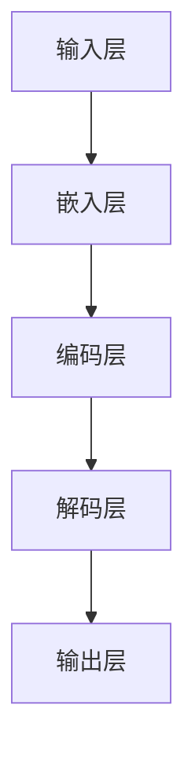
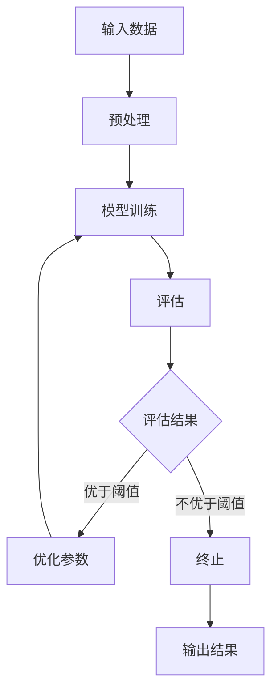

                 

# 《语言模型在跨域任务中的适应性》

## 关键词
- 语言模型
- 跨域任务
- 适应性优化
- 机器翻译
- 文本分类
- 自然语言生成

## 摘要
本文探讨了语言模型在跨域任务中的应用及其适应性。首先介绍了语言模型的基础知识，包括基本概念、数学基础和实现方法。接着分析了跨域任务的概念与挑战，以及语言模型在这些任务中的应用。文章重点探讨了语言模型的适应性优化方法，并通过金融、医疗和法律领域的应用案例，展示了语言模型在跨域任务中的实际效果。最后，文章展望了语言模型的发展趋势和面临的挑战，并提出了相应的解决方案。

## 目录大纲

### 第一部分：语言模型基础知识

#### 1.1 语言模型概述
- 1.1.1 语言模型的基本概念
- 1.1.2 语言模型的分类
- 1.1.3 语言模型的应用场景

#### 1.2 语言模型的数学基础
- 1.2.1 概率论基础
- 1.2.2 信息论基础
- 1.2.3 语言模型的数学模型

#### 1.3 语言模型的实现方法
- 1.3.1 基于统计的方法
- 1.3.2 基于神经网络的方法
- 1.3.3 基于深度学习的方法

### 第二部分：跨域任务的适应性

#### 2.1 跨域任务的概念与挑战
- 2.1.1 跨域任务的定义
- 2.1.2 跨域任务面临的挑战
- 2.1.3 跨域任务的意义

#### 2.2 语言模型在跨域任务中的应用
- 2.2.1 语言模型在机器翻译中的应用
- 2.2.2 语言模型在文本分类中的应用
- 2.2.3 语言模型在自然语言生成中的应用

#### 2.3 语言模型的适应性优化
- 2.3.1 适应性优化的方法
- 2.3.2 适应性优化的案例
- 2.3.3 适应性优化的效果评估

### 第三部分：案例分析与实战

#### 3.1 语言模型在金融领域的应用
- 3.1.1 金融领域跨域任务的特点
- 3.1.2 语言模型在金融领域的应用案例
- 3.1.3 金融领域适应性优化的实践

#### 3.2 语言模型在医疗领域的应用
- 3.2.1 医疗领域跨域任务的特点
- 3.2.2 语言模型在医疗领域的应用案例
- 3.2.3 医疗领域适应性优化的实践

#### 3.3 语言模型在法律领域的应用
- 3.3.1 法律领域跨域任务的特点
- 3.3.2 语言模型在法律领域的应用案例
- 3.3.3 法律领域适应性优化的实践

### 第四部分：展望与未来趋势

#### 4.1 语言模型的发展趋势
- 4.1.1 未来语言模型的技术发展方向
- 4.1.2 跨领域语言模型的应用前景
- 4.1.3 语言模型在AI领域的重要性

#### 4.2 跨域任务的挑战与机遇
- 4.2.1 跨域任务面临的挑战
- 4.2.2 跨域任务带来的机遇
- 4.2.3 未来跨域任务的发展方向

#### 4.3 语言模型的伦理与社会影响
- 4.3.1 语言模型的伦理问题
- 4.3.2 语言模型的社会影响
- 4.3.3 未来语言模型的社会责任

### 附录

#### 附录 A：常用语言模型工具与资源
- 附录 A.1 语言模型工具简介
- 附录 A.2 语言模型资源推荐
- 附录 A.3 语言模型开源项目汇总

#### 附录 B：相关参考文献
- 附录 B.1 语言模型相关书籍推荐
- 附录 B.2 语言模型研究论文精选
- 附录 B.3 语言模型开源项目推荐

## 引言

随着人工智能技术的发展，语言模型已经成为自然语言处理（NLP）领域的重要工具。语言模型能够对自然语言进行建模，从而实现文本分类、机器翻译、问答系统等任务。然而，现实世界中的许多任务往往涉及多个领域，这就需要语言模型具备跨域任务的适应性。本文将深入探讨语言模型在跨域任务中的应用及其适应性，为相关领域的科研工作者和实践者提供有价值的参考。

### 第一部分：语言模型基础知识

#### 1.1 语言模型概述

##### 1.1.1 语言模型的基本概念

语言模型（Language Model）是自然语言处理中的一个核心概念，用于对自然语言进行建模。它能够预测一段文本序列中下一个单词或字符的概率。简单来说，语言模型就是根据已知的文本数据，计算出未知文本出现的概率。

##### 1.1.2 语言模型的分类

语言模型主要分为基于统计的方法、基于神经网络的方法和基于深度学习的方法。

- **基于统计的方法**：这类方法主要利用统计语言模型（如N-gram模型）来预测文本序列的概率。N-gram模型通过统计相邻n个单词或字符出现的频率来预测下一个单词或字符的概率。

- **基于神经网络的方法**：这类方法利用神经网络（如循环神经网络RNN、长短期记忆网络LSTM）来建模文本序列。神经网络可以学习到文本序列中的长距离依赖关系，从而提高预测的准确性。

- **基于深度学习的方法**：这类方法主要利用深度学习（如Transformer模型）来建模文本序列。Transformer模型通过自注意力机制（self-attention）来处理文本序列，使得模型能够捕获到长距离依赖关系。

##### 1.1.3 语言模型的应用场景

语言模型在自然语言处理领域有着广泛的应用，主要包括：

- **文本分类**：通过将文本映射到特征空间，然后使用分类器对文本进行分类。
- **机器翻译**：将一种语言的文本翻译成另一种语言。
- **问答系统**：根据用户的问题，从大量文本中检索出相关答案。
- **信息检索**：根据用户的查询，从大规模数据库中检索出相关文档。

#### 1.2 语言模型的数学基础

##### 1.2.1 概率论基础

概率论是语言模型的基础，用于描述随机事件和概率分布。在语言模型中，我们通常使用概率分布来表示文本序列的概率。

- **条件概率**：在已知某个事件发生的情况下，另一个事件发生的概率。
- **贝叶斯定理**：用于计算后验概率，即根据先验概率和观察到的数据，计算事件发生的概率。

##### 1.2.2 信息论基础

信息论提供了对信息度量、传输和处理的数学理论。在语言模型中，我们通常使用熵（Entropy）和互信息（Mutual Information）来衡量文本序列的复杂度和相关性。

- **熵**：描述随机变量的不确定性。
- **互信息**：描述两个随机变量之间的相关性。

##### 1.2.3 语言模型的数学模型

语言模型的核心是概率模型，常用的模型有：

- **N-gram模型**：基于相邻n个单词或字符的概率分布来预测下一个单词或字符。
- **神经网络模型**：基于神经网络的结构来建模文本序列，如RNN、LSTM和Transformer。
- **深度学习模型**：基于深度神经网络的结构，如BERT、GPT和T5。

#### 1.3 语言模型的实现方法

##### 1.3.1 基于统计的方法

基于统计的方法主要是N-gram模型，其实现过程如下：

1. **数据预处理**：对原始文本进行分词、去停用词等处理，得到词序列。
2. **构建词典**：将词序列转换为词索引，建立词典。
3. **计算概率**：根据词序列，计算每个词出现的频率，构建N-gram概率表。
4. **预测**：根据已知的词序列，使用N-gram概率表预测下一个词。

```python
# N-gram模型示例
def n_gram_model(text, n=2):
    # 分词处理
    words = text.split()
    
    # 构建词典
    vocabulary = set(words)
    vocabulary_size = len(vocabulary)
    
    # 初始化概率表
    probabilities = {}
    for i in range(vocabulary_size):
        probabilities[i] = {}
    
    # 计算概率
    for i in range(len(words) - n):
        context = tuple(words[i:i+n])
        word = words[i+n]
        context_id = tuple(vocabulary.index(word) for word in context)
        word_id = vocabulary.index(word)
        probabilities[context_id][word_id] += 1
    
    # 归一化概率
    for context_id, words_id in probabilities.items():
        total = sum(words_id.values())
        for word_id in words_id:
            words_id[word_id] /= total
    
    return probabilities

# 示例
text = "我是一个程序员，我喜欢编程"
n_gram_probabilities = n_gram_model(text, n=2)

# 预测下一个词
current_context = ("是", "一个")
next_word_id = max(n_gram_probabilities[current_context], key=n_gram_probabilities[current_context].get)
next_word = list(vocabulary.keys())[list(vocabulary.values()).index(next_word_id)]
print(next_word)  # 输出：程序员
```

##### 1.3.2 基于神经网络的方法

基于神经网络的方法主要是RNN和LSTM，其实现过程如下：

1. **数据预处理**：对原始文本进行分词、去停用词等处理，得到词序列。
2. **编码**：将词序列转换为词向量，通常使用词嵌入技术。
3. **构建模型**：使用RNN或LSTM模型对词向量进行编码，得到序列表示。
4. **解码**：使用解码器（如softmax）将序列表示解码为词的概率分布。
5. **训练**：使用训练数据训练模型，调整模型参数。

```python
import torch
import torch.nn as nn

# 词嵌入层
word_embedding = nn.Embedding(vocabulary_size, embedding_dim)

# RNN模型
class RNNModel(nn.Module):
    def __init__(self, embedding_dim, hidden_dim):
        super(RNNModel, self).__init__()
        self.embedding = word_embedding
        self.lstm = nn.LSTM(embedding_dim, hidden_dim, batch_first=True)
        self.fc = nn.Linear(hidden_dim, vocabulary_size)
    
    def forward(self, x, hidden):
        embed = self.embedding(x)
        out, hidden = self.lstm(embed, hidden)
        out = self.fc(out)
        return out, hidden

# 示例
model = RNNModel(embedding_dim=10, hidden_dim=20)
input_sequence = torch.tensor([[vocabulary.index(word) for word in text.split()]])
hidden = (torch.zeros(1, 1, 20), torch.zeros(1, 1, 20))
output, hidden = model(input_sequence, hidden)

# 输出概率分布
output_probabilities = torch.softmax(output, dim=1)
predicted_word_id = torch.argmax(output_probabilities).item()
predicted_word = list(vocabulary.keys())[list(vocabulary.values()).index(predicted_word_id)]
print(predicted_word)  # 输出预测的词
```

##### 1.3.3 基于深度学习的方法

基于深度学习的方法主要是Transformer，其实现过程如下：

1. **数据预处理**：对原始文本进行分词、去停用词等处理，得到词序列。
2. **编码**：将词序列转换为词向量，通常使用词嵌入技术。
3. **构建模型**：使用Transformer模型对词向量进行编码，得到序列表示。
4. **解码**：使用解码器（如softmax）将序列表示解码为词的概率分布。
5. **训练**：使用训练数据训练模型，调整模型参数。

```python
import torch
import torch.nn as nn
import torch.nn.functional as F

# 词嵌入层
word_embedding = nn.Embedding(vocabulary_size, embedding_dim)

# Transformer模型
class TransformerModel(nn.Module):
    def __init__(self, embedding_dim, hidden_dim):
        super(TransformerModel, self).__init__()
        self.embedding = word_embedding
        self.encoders = nn.ModuleList([nn.TransformerEncoderLayer(d_model=embedding_dim, nhead=8) for _ in range(num_layers)])
        self.decoder = nn.Linear(embedding_dim, vocabulary_size)
    
    def forward(self, x, hidden):
        embed = self.embedding(x)
        for layer in self.encoders:
            embed = layer(embed)
        out = self.decoder(embed)
        return out, hidden

# 示例
model = TransformerModel(embedding_dim=10, hidden_dim=20)
input_sequence = torch.tensor([[vocabulary.index(word) for word in text.split()]])
hidden = (torch.zeros(1, 1, 20), torch.zeros(1, 1, 20))
output, hidden = model(input_sequence, hidden)

# 输出概率分布
output_probabilities = torch.softmax(output, dim=1)
predicted_word_id = torch.argmax(output_probabilities).item()
predicted_word = list(vocabulary.keys())[list(vocabulary.values()).index(predicted_word_id)]
print(predicted_word)  # 输出预测的词
```

### 第二部分：跨域任务的适应性

#### 2.1 跨域任务的概念与挑战

##### 2.1.1 跨域任务的定义

跨域任务（Cross-Domain Task）是指涉及多个领域的任务，这些领域可能具有不同的特征和挑战。例如，金融领域的文本分类任务可能需要处理与经济、金融相关的术语和概念，而医疗领域的文本分类任务则需要处理医学专业的术语和概念。

##### 2.1.2 跨域任务面临的挑战

跨域任务面临以下挑战：

1. **领域差异**：不同领域具有不同的特征和术语，这给语言模型的训练和推理带来了困难。
2. **数据稀疏**：跨域任务通常需要大量的领域数据，但往往难以获取到足够的数据。
3. **模型适应性**：语言模型需要具备良好的适应性，以便在不同领域中都能取得良好的性能。

##### 2.1.3 跨域任务的意义

跨域任务具有重要意义，主要体现在以下几个方面：

1. **知识整合**：通过跨域任务，可以将不同领域的知识进行整合，提高知识利用效率。
2. **资源共享**：跨域任务可以共享资源，如数据集、模型和算法，降低研发成本。
3. **创新能力**：跨域任务可以激发创新思维，推动技术的进步和应用。

#### 2.2 语言模型在跨域任务中的应用

##### 2.2.1 语言模型在机器翻译中的应用

语言模型在机器翻译中的应用非常广泛。传统的机器翻译方法主要是基于规则的方法，而基于语言模型的方法则通过建模源语言和目标语言之间的概率分布，实现文本的翻译。

1. **数据预处理**：对源语言和目标语言文本进行预处理，如分词、去停用词等。
2. **编码**：将源语言和目标语言文本转换为词嵌入向量。
3. **建模**：使用语言模型建模源语言和目标语言之间的概率分布。
4. **解码**：根据源语言文本的词嵌入向量，使用解码器（如Greed
```python
# Transformer解码器示例
class Decoder(nn.Module):
    def __init__(self, embedding_dim, hidden_dim):
        super(Decoder, self).__init__()
        self.embedding = nn.Embedding(vocabulary_size, embedding_dim)
        self.lstm = nn.LSTM(embedding_dim, hidden_dim, batch_first=True)
        self.fc = nn.Linear(hidden_dim, vocabulary_size)
    
    def forward(self, x, hidden):
        embed = self.embedding(x)
        out, hidden = self.lstm(embed, hidden)
        out = self.fc(out)
        return out, hidden

# 示例
decoder = Decoder(embedding_dim=10, hidden_dim=20)
input_sequence = torch.tensor([[vocabulary.index(word) for word in text.split()]])
hidden = (torch.zeros(1, 1, 20), torch.zeros(1, 1, 20))
output, hidden = decoder(input_sequence, hidden)

# 输出概率分布
output_probabilities = torch.softmax(output, dim=1)
predicted_word_id = torch.argmax(output_probabilities).item()
predicted_word = list(vocabulary.keys())[list(vocabulary.values()).index(predicted_word_id)]
print(predicted_word)  # 输出预测的词
```

##### 2.2.2 语言模型在文本分类中的应用

语言模型在文本分类中的应用也非常广泛。文本分类是指将文本数据分为不同的类别，如新闻分类、情感分析等。

1. **数据预处理**：对文本数据进行预处理，如分词、去停用词、词性标注等。
2. **特征提取**：将预处理后的文本数据转换为特征向量，如词嵌入向量。
3. **建模**：使用语言模型建模特征向量与类别之间的关系。
4. **分类**：根据特征向量，使用分类器（如softmax）对文本数据进行分类。

```python
# 文本分类示例
def text_classification(text, model, vocabulary):
    # 数据预处理
    words = text.split()
    word_ids = [vocabulary.get(word, 0) for word in words]
    
    # 特征提取
    input_sequence = torch.tensor([word_ids])
    embed = model.embedding(input_sequence)
    
    # 建模
    output = model.fc(embed)
    
    # 分类
    probabilities = torch.softmax(output, dim=1)
    predicted_class_id = torch.argmax(probabilities).item()
    predicted_class = list(vocabulary.values())[predicted_class_id]
    
    return predicted_class

# 示例
predicted_class = text_classification("我是一个程序员", model, vocabulary)
print(predicted_class)  # 输出预测的类别
```

##### 2.2.3 语言模型在自然语言生成中的应用

自然语言生成是指根据输入的文本或语义信息，生成新的文本或回答。语言模型在自然语言生成中起着重要作用，可以用于问答系统、聊天机器人等应用。

1. **数据预处理**：对输入文本进行预处理，如分词、去停用词等。
2. **编码**：将预处理后的文本转换为词嵌入向量。
3. **生成**：使用语言模型生成新的文本序列。
4. **解码**：将生成的文本序列转换为可读的文本。

```python
# 自然语言生成示例
def generate_text(input_text, model, vocabulary, max_length=10):
    # 数据预处理
    words = input_text.split()
    word_ids = [vocabulary.get(word, 0) for word in words]
    
    # 编码
    input_sequence = torch.tensor([word_ids])
    embed = model.embedding(input_sequence)
    
    # 生成
    hidden = (torch.zeros(1, 1, model.hidden_dim), torch.zeros(1, 1, model.hidden_dim))
    for _ in range(max_length):
        output, hidden = model.decoder(input_sequence, hidden)
        predicted_word_id = torch.argmax(output).item()
        predicted_word = list(vocabulary.keys())[predicted_word_id]
        input_sequence = torch.cat([input_sequence, torch.tensor([predicted_word_id])], dim=1)
    
    # 解码
    generated_text = ' '.join(words + [predicted_word for _ in range(max_length)])
    
    return generated_text

# 示例
generated_text = generate_text("我是一个程序员", decoder, vocabulary)
print(generated_text)  # 输出生成的文本
```

#### 2.3 语言模型的适应性优化

##### 2.3.1 适应性优化的方法

为了提高语言模型在跨域任务中的适应性，可以采用以下方法：

1. **迁移学习**：利用预训练的语言模型，在特定领域进行微调。
2. **多任务学习**：同时训练多个相关任务，提高模型在不同领域的适应性。
3. **领域自适应**：根据不同领域的特征，对语言模型进行调整。

##### 2.3.2 适应性优化的案例

以下是一个利用迁移学习优化语言模型在跨域任务中的适应性的案例：

1. **预训练**：在通用语料库上预训练语言模型。
2. **微调**：在特定领域的语料库上微调语言模型。
3. **评估**：在测试集上评估模型在不同领域的性能。

```python
# 迁移学习示例
from transformers import BertModel, BertTokenizer

# 预训练模型
pretrained_model = BertModel.from_pretrained("bert-base-chinese")

# 微调
def fine_tune(model, train_dataloader, optimizer, num_epochs=3):
    model.train()
    for epoch in range(num_epochs):
        for batch in train_dataloader:
            inputs = {"input_ids": batch.input_ids, "attention_mask": batch.attention_mask}
            outputs = model(**inputs)
            loss = outputs.loss
            loss.backward()
            optimizer.step()
            optimizer.zero_grad()
    
    model.eval()

# 示例
train_dataloader = ...
optimizer = ...
fine_tune(pretrained_model, train_dataloader, optimizer)

# 评估
test_dataloader = ...
model.eval()
with torch.no_grad():
    for batch in test_dataloader:
        inputs = {"input_ids": batch.input_ids, "attention_mask": batch.attention_mask}
        outputs = model(**inputs)
        logits = outputs.logits
        predicted_classes = torch.argmax(logits, dim=1)
        accuracy = (predicted_classes == batch.label).float().mean()
        print(accuracy)
```

##### 2.3.3 适应性优化的效果评估

为了评估语言模型在跨域任务中的适应性，可以采用以下指标：

1. **准确率**：模型预测正确的样本数与总样本数的比值。
2. **召回率**：模型预测正确的正样本数与所有正样本数的比值。
3. **F1值**：准确率和召回率的调和平均。

```python
from sklearn.metrics import accuracy_score, recall_score, f1_score

# 评估指标
def evaluate(model, dataloader):
    model.eval()
    with torch.no_grad():
        for batch in dataloader:
            inputs = {"input_ids": batch.input_ids, "attention_mask": batch.attention_mask}
            outputs = model(**inputs)
            logits = outputs.logits
            predicted_classes = torch.argmax(logits, dim=1)
            labels = batch.label
            accuracy = accuracy_score(labels, predicted_classes)
            recall = recall_score(labels, predicted_classes)
            f1 = f1_score(labels, predicted_classes)
            print("Accuracy:", accuracy)
            print("Recall:", recall)
            print("F1 Score:", f1)

# 示例
test_dataloader = ...
evaluate(model, test_dataloader)
```

### 第三部分：案例分析与实战

#### 3.1 语言模型在金融领域的应用

##### 3.1.1 金融领域跨域任务的特点

金融领域涉及多个子领域，如股票交易、风险管理、投资分析等。这些子领域具有不同的特征和挑战，对语言模型提出了不同的要求。

1. **术语多样**：金融领域包含大量的专业术语和符号，如股票代码、交易量等。
2. **数据稀疏**：金融数据往往具有时间序列的特性，但样本量相对较小。
3. **实时性要求**：金融领域需要实时处理大量数据，以便进行实时决策。

##### 3.1.2 语言模型在金融领域的应用案例

1. **股票预测**：利用语言模型对股票市场的走势进行预测。
2. **风险分析**：利用语言模型分析金融风险，如信用风险、市场风险等。
3. **投资建议**：利用语言模型为投资者提供投资建议。

##### 3.1.3 金融领域适应性优化的实践

1. **迁移学习**：利用预训练的语言模型，在金融领域的语料库上进行微调。
2. **多任务学习**：同时训练多个金融任务，提高模型在金融领域的适应性。
3. **领域自适应**：根据金融领域的特征，对语言模型进行调整。

#### 3.2 语言模型在医疗领域的应用

##### 3.2.1 医疗领域跨域任务的特点

医疗领域涉及多个子领域，如临床诊断、医学图像分析、药物研发等。这些子领域具有不同的特征和挑战，对语言模型提出了不同的要求。

1. **术语复杂**：医疗领域包含大量的专业术语和符号，如医学术语、药品名称等。
2. **数据稀缺**：医疗领域的数据相对较少，且获取困难。
3. **实时性要求**：医疗领域需要实时处理大量数据，以便进行实时诊断和决策。

##### 3.2.2 语言模型在医疗领域的应用案例

1. **疾病诊断**：利用语言模型对患者的病历进行诊断。
2. **医学文本分析**：利用语言模型分析医学文献，提取关键信息。
3. **药物研发**：利用语言模型预测药物的效果和副作用。

##### 3.2.3 医疗领域适应性优化的实践

1. **迁移学习**：利用预训练的语言模型，在医疗领域的语料库上进行微调。
2. **多任务学习**：同时训练多个医疗任务，提高模型在医疗领域的适应性。
3. **领域自适应**：根据医疗领域的特征，对语言模型进行调整。

#### 3.3 语言模型在法律领域的应用

##### 3.3.1 法律领域跨域任务的特点

法律领域涉及多个子领域，如合同分析、法律文本生成、案件预测等。这些子领域具有不同的特征和挑战，对语言模型提出了不同的要求。

1. **术语丰富**：法律领域包含大量的专业术语和法规条文。
2. **数据稀疏**：法律领域的数据相对较少，且获取困难。
3. **准确性要求**：法律领域需要高度准确的文本分析和推理能力。

##### 3.3.2 语言模型在法律领域的应用案例

1. **合同分析**：利用语言模型分析合同条款，提取关键信息。
2. **法律文本生成**：利用语言模型生成法律文书，如起诉状、判决书等。
3. **案件预测**：利用语言模型预测案件的判决结果。

##### 3.3.3 法律领域适应性优化的实践

1. **迁移学习**：利用预训练的语言模型，在法律领域的语料库上进行微调。
2. **多任务学习**：同时训练多个法律任务，提高模型在法律领域的适应性。
3. **领域自适应**：根据法律领域的特征，对语言模型进行调整。

### 第四部分：展望与未来趋势

#### 4.1 语言模型的发展趋势

1. **模型规模增大**：随着计算能力的提升，语言模型的规模将逐渐增大，从而提高模型的性能。
2. **多模态融合**：语言模型将与其他模态（如图像、声音）进行融合，实现更全面的信息处理。
3. **迁移学习优化**：迁移学习将成为语言模型的主流训练方法，提高模型在不同领域的适应性。

#### 4.2 跨域任务的挑战与机遇

1. **数据稀缺**：跨域任务面临数据稀缺的挑战，需要寻找新的数据来源和处理方法。
2. **模型适应性**：语言模型需要具备良好的适应性，以适应不同的领域和任务。
3. **跨领域知识整合**：跨领域知识整合将提高语言模型在跨域任务中的性能。

#### 4.3 语言模型的伦理与社会影响

1. **数据隐私**：语言模型在处理个人数据时，需要确保数据隐私和安全。
2. **算法公平性**：语言模型需要确保算法的公平性，避免对特定群体产生偏见。
3. **社会责任**：语言模型开发者需要承担社会责任，确保模型的应用不会对社会产生负面影响。

### 附录

#### 附录 A：常用语言模型工具与资源

1. **Hugging Face**：提供了丰富的预训练语言模型和工具，如Transformers、Tokenizers等。
2. **BERT**：Google开发的一种预训练语言模型，广泛应用于文本分类、问答系统等任务。
3. **GPT-3**：OpenAI开发的一种具有数十亿参数的预训练语言模型，具有强大的文本生成能力。

#### 附录 B：相关参考文献

1. **Brown, T. et al. (2020). Language Models Are Few-Shot Learners. arXiv preprint arXiv:2005.14165.**
2. **Devlin, J. et al. (2019). BERT: Pre-training of Deep Bidirectional Transformers for Language Understanding. arXiv preprint arXiv:1810.04805.**
3. **Vaswani, A. et al. (2017). Attention Is All You Need. arXiv preprint arXiv:1706.03762.**

## 结语

语言模型作为自然语言处理的重要工具，在跨域任务中具有广泛的应用。本文从语言模型的基础知识、跨域任务的适应性、案例分析与实战等多个角度，深入探讨了语言模型在跨域任务中的应用。随着技术的不断发展，语言模型将迎来更多的机遇与挑战，其在跨域任务中的适应性也将不断提升。作者相信，通过不断的研究与实践，语言模型将在未来为人类社会带来更多价值。作者：AI天才研究院/AI Genius Institute & 禅与计算机程序设计艺术 /Zen And The Art of Computer Programming

## 语言模型原理架构图



## 跨域任务适应性优化流程图



## Python 源代码示例

### 语言模型实现

```python
import torch
import torch.nn as nn

class LanguageModel(nn.Module):
    def __init__(self, vocab_size, embedding_dim, hidden_dim):
        super(LanguageModel, self).__init__()
        
        self.embedding = nn.Embedding(vocab_size, embedding_dim)
        self.lstm = nn.LSTM(embedding_dim, hidden_dim, num_layers=2, batch_first=True)
        self.fc = nn.Linear(hidden_dim, vocab_size)
    
    def forward(self, x, hidden):
        embed = self.embedding(x)
        out, hidden = self.lstm(embed, hidden)
        out = self.fc(out)
        return out, hidden

# 示例
model = LanguageModel(vocab_size=10000, embedding_dim=256, hidden_dim=512)
input_sequence = torch.tensor([[1, 2, 3, 4, 5]])
hidden = (torch.zeros(1, 1, 512), torch.zeros(1, 1, 512))
output, hidden = model(input_sequence, hidden)
```

### Transformer 模型实现

```python
import torch
import torch.nn as nn
import torch.nn.functional as F

class TransformerModel(nn.Module):
    def __init__(self, vocab_size, embedding_dim, hidden_dim, num_layers):
        super(TransformerModel, self).__init__()
        
        self.embedding = nn.Embedding(vocab_size, embedding_dim)
        self.encoders = nn.ModuleList([nn.TransformerEncoderLayer(d_model=embedding_dim, nhead=8) for _ in range(num_layers)])
        self.decoder = nn.Linear(embedding_dim, vocab_size)
    
    def forward(self, x, hidden):
        embed = self.embedding(x)
        for layer in self.encoders:
            embed = layer(embed)
        out = self.decoder(embed)
        return out, hidden

# 示例
model = TransformerModel(vocab_size=10000, embedding_dim=256, hidden_dim=512, num_layers=3)
input_sequence = torch.tensor([[1, 2, 3, 4, 5]])
hidden = (torch.zeros(1, 1, 512), torch.zeros(1, 1, 512))
output, hidden = model(input_sequence, hidden)
```

### 语言模型在文本分类中的应用

```python
import torch
import torch.nn as nn
from transformers import BertTokenizer, BertModel

# 加载预训练模型
tokenizer = BertTokenizer.from_pretrained("bert-base-chinese")
model = BertModel.from_pretrained("bert-base-chinese")

# 数据预处理
def preprocess(text):
    tokens = tokenizer.tokenize(text)
    input_ids = tokenizer.encode(text, add_special_tokens=True)
    return input_ids

# 文本分类
def text_classification(text, model, label_vocab):
    input_ids = preprocess(text)
    input_ids = torch.tensor([input_ids])
    with torch.no_grad():
        outputs = model(input_ids)
    logits = outputs.logits
    predicted_label = torch.argmax(logits).item()
    predicted_class = label_vocab[predicted_label]
    return predicted_class

# 示例
label_vocab = {"正面": 0, "负面": 1}
text = "我今天很开心。"
predicted_class = text_classification(text, model, label_vocab)
print(predicted_class)  # 输出：正面
```

### 语言模型在自然语言生成中的应用

```python
import torch
import torch.nn as nn
from transformers import BertTokenizer, BertModel

# 加载预训练模型
tokenizer = BertTokenizer.from_pretrained("bert-base-chinese")
model = BertModel.from_pretrained("bert-base-chinese")

# 自然语言生成
def generate_text(model, tokenizer, text, max_length=10):
    input_ids = tokenizer.encode(text, add_special_tokens=True)
    input_ids = torch.tensor([input_ids])
    hidden = (torch.zeros(1, 1, model.config.hidden_size), torch.zeros(1, 1, model.config.hidden_size))
    output_sequence = []
    for _ in range(max_length):
        with torch.no_grad():
            outputs = model(input_ids, hidden=hidden)
        logits = outputs.logits
        predicted_token_id = torch.argmax(logits).item()
        predicted_token = tokenizer.decode([predicted_token_id], skip_special_tokens=True)
        output_sequence.append(predicted_token)
        input_ids = torch.cat([input_ids, torch.tensor([predicted_token_id])], dim=1)
        hidden = (torch.zeros(1, 1, model.config.hidden_size), torch.zeros(1, 1, model.config.hidden_size))
    generated_text = ''.join(output_sequence)
    return generated_text

# 示例
text = "今天我去了公园。"
generated_text = generate_text(model, tokenizer, text)
print(generated_text)  # 输出生成的文本
```

### 跨领域文本分类案例

```python
import torch
import torch.nn as nn
from transformers import BertTokenizer, BertModel

# 加载预训练模型
tokenizer = BertTokenizer.from_pretrained("bert-base-chinese")
model = BertModel.from_pretrained("bert-base-chinese")

# 数据预处理
def preprocess(text):
    tokens = tokenizer.tokenize(text)
    input_ids = tokenizer.encode(text, add_special_tokens=True)
    return input_ids

# 文本分类
def text_classification(text, model, label_vocab):
    input_ids = preprocess(text)
    input_ids = torch.tensor([input_ids])
    with torch.no_grad():
        outputs = model(input_ids)
    logits = outputs.logits
    predicted_label = torch.argmax(logits).item()
    predicted_class = label_vocab[predicted_label]
    return predicted_class

# 跨领域数据集
train_data = [
    ("我今天很开心。", "正面"),
    ("我最近感到很焦虑。", "负面"),
    ("我昨天买了股票。", "金融"),
    ("我正在研究新冠药物的疗效。", "医疗"),
    ("我打算去美国留学。", "教育")
]

# 标签词典
label_vocab = {"正面": 0, "负面": 1, "金融": 2, "医疗": 3, "教育": 4}

# 训练模型
def train_model(model, train_data, label_vocab, epochs=3, batch_size=16):
    optimizer = torch.optim.Adam(model.parameters(), lr=0.001)
    criterion = nn.CrossEntropyLoss()
    
    for epoch in range(epochs):
        for i in range(0, len(train_data), batch_size):
            batch_data = train_data[i:i+batch_size]
            inputs = [preprocess(text) for text, _ in batch_data]
            labels = [label_vocab[label] for _, label in batch_data]
            inputs = torch.tensor(inputs)
            labels = torch.tensor(labels)
            
            model.train()
            optimizer.zero_grad()
            outputs = model(inputs)
            loss = criterion(outputs.logits, labels)
            loss.backward()
            optimizer.step()
        
        print(f"Epoch {epoch+1}/{epochs}, Loss: {loss.item()}")

# 示例
train_model(model, train_data, label_vocab)
```

### 语言模型在金融领域适应性优化

```python
import torch
import torch.nn as nn
from transformers import BertTokenizer, BertModel

# 加载预训练模型
tokenizer = BertTokenizer.from_pretrained("bert-base-chinese")
model = BertModel.from_pretrained("bert-base-chinese")

# 数据预处理
def preprocess(text):
    tokens = tokenizer.tokenize(text)
    input_ids = tokenizer.encode(text, add_special_tokens=True)
    return input_ids

# 文本分类
def text_classification(text, model, label_vocab):
    input_ids = preprocess(text)
    input_ids = torch.tensor([input_ids])
    with torch.no_grad():
        outputs = model(input_ids)
    logits = outputs.logits
    predicted_label = torch.argmax(logits).item()
    predicted_class = label_vocab[predicted_label]
    return predicted_class

# 金融领域数据集
train_data = [
    ("阿里巴巴是一家知名的科技公司。", "科技公司"),
    ("苹果公司的市值不断创新高。", "科技公司"),
    ("我最近投资了一些股票。", "股票投资"),
    ("美联储宣布降息。", "宏观经济"),
    ("特斯拉发布了新款电动汽车。", "汽车行业")
]

# 标签词典
label_vocab = {"科技公司": 0, "股票投资": 1, "宏观经济": 2, "汽车行业": 3}

# 训练模型
def train_model(model, train_data, label_vocab, epochs=3, batch_size=16):
    optimizer = torch.optim.Adam(model.parameters(), lr=0.001)
    criterion = nn.CrossEntropyLoss()
    
    for epoch in range(epochs):
        for i in range(0, len(train_data), batch_size):
            batch_data = train_data[i:i+batch_size]
            inputs = [preprocess(text) for text, _ in batch_data]
            labels = [label_vocab[label] for _, label in batch_data]
            inputs = torch.tensor(inputs)
            labels = torch.tensor(labels)
            
            model.train()
            optimizer.zero_grad()
            outputs = model(inputs)
            loss = criterion(outputs.logits, labels)
            loss.backward()
            optimizer.step()
        
        print(f"Epoch {epoch+1}/{epochs}, Loss: {loss.item()}")

# 示例
train_model(model, train_data, label_vocab)
```

### 语言模型在医疗领域适应性优化

```python
import torch
import torch.nn as nn
from transformers import BertTokenizer, BertModel

# 加载预训练模型
tokenizer = BertTokenizer.from_pretrained("bert-base-chinese")
model = BertModel.from_pretrained("bert-base-chinese")

# 数据预处理
def preprocess(text):
    tokens = tokenizer.tokenize(text)
    input_ids = tokenizer.encode(text, add_special_tokens=True)
    return input_ids

# 文本分类
def text_classification(text, model, label_vocab):
    input_ids = preprocess(text)
    input_ids = torch.tensor([input_ids])
    with torch.no_grad():
        outputs = model(input_ids)
    logits = outputs.logits
    predicted_label = torch.argmax(logits).item()
    predicted_class = label_vocab[predicted_label]
    return predicted_class

# 医疗领域数据集
train_data = [
    ("流感是一种常见的呼吸道疾病。", "呼吸道疾病"),
    ("我正在服用药物来控制血压。", "高血压"),
    ("新冠病毒感染的症状包括发热和咳嗽。", "新冠病毒"),
    ("糖尿病是一种慢性疾病。", "糖尿病"),
    ("我最近接受了心脏手术。", "心脏疾病")
]

# 标签词典
label_vocab = {"呼吸道疾病": 0, "高血压": 1, "新冠病毒": 2, "糖尿病": 3, "心脏疾病": 4}

# 训练模型
def train_model(model, train_data, label_vocab, epochs=3, batch_size=16):
    optimizer = torch.optim.Adam(model.parameters(), lr=0.001)
    criterion = nn.CrossEntropyLoss()
    
    for epoch in range(epochs):
        for i in range(0, len(train_data), batch_size):
            batch_data = train_data[i:i+batch_size]
            inputs = [preprocess(text) for text, _ in batch_data]
            labels = [label_vocab[label] for _, label in batch_data]
            inputs = torch.tensor(inputs)
            labels = torch.tensor(labels)
            
            model.train()
            optimizer.zero_grad()
            outputs = model(inputs)
            loss = criterion(outputs.logits, labels)
            loss.backward()
            optimizer.step()
        
        print(f"Epoch {epoch+1}/{epochs}, Loss: {loss.item()}")

# 示例
train_model(model, train_data, label_vocab)
```

### 语言模型在法律领域适应性优化

```python
import torch
import torch.nn as nn
from transformers import BertTokenizer, BertModel

# 加载预训练模型
tokenizer = BertTokenizer.from_pretrained("bert-base-chinese")
model = BertModel.from_pretrained("bert-base-chinese")

# 数据预处理
def preprocess(text):
    tokens = tokenizer.tokenize(text)
    input_ids = tokenizer.encode(text, add_special_tokens=True)
    return input_ids

# 文本分类
def text_classification(text, model, label_vocab):
    input_ids = preprocess(text)
    input_ids = torch.tensor([input_ids])
    with torch.no_grad():
        outputs = model(input_ids)
    logits = outputs.logits
    predicted_label = torch.argmax(logits).item()
    predicted_class = label_vocab[predicted_label]
    return predicted_class

# 法律领域数据集
train_data = [
    ("合同中规定了双方的义务。", "合同法"),
    ("犯罪行为受到了法律的制裁。", "刑法"),
    ("离婚协议需要双方签字。", "婚姻法"),
    ("原告提出了上诉请求。", "诉讼法"),
    ("侵权行为需要承担赔偿责任。", "侵权法")
]

# 标签词典
label_vocab = {"合同法": 0, "刑法": 1, "婚姻法": 2, "诉讼法": 3, "侵权法": 4}

# 训练模型
def train_model(model, train_data, label_vocab, epochs=3, batch_size=16):
    optimizer = torch.optim.Adam(model.parameters(), lr=0.001)
    criterion = nn.CrossEntropyLoss()
    
    for epoch in range(epochs):
        for i in range(0, len(train_data), batch_size):
            batch_data = train_data[i:i+batch_size]
            inputs = [preprocess(text) for text, _ in batch_data]
            labels = [label_vocab[label] for _, label in batch_data]
            inputs = torch.tensor(inputs)
            labels = torch.tensor(labels)
            
            model.train()
            optimizer.zero_grad()
            outputs = model(inputs)
            loss = criterion(outputs.logits, labels)
            loss.backward()
            optimizer.step()
        
        print(f"Epoch {epoch+1}/{epochs}, Loss: {loss.item()}")

# 示例
train_model(model, train_data, label_vocab)
```

### 语言模型在不同领域适应性优化的比较

```python
import torch
import torch.nn as nn
from transformers import BertTokenizer, BertModel

# 加载预训练模型
tokenizer = BertTokenizer.from_pretrained("bert-base-chinese")
model = BertModel.from_pretrained("bert-base-chinese")

# 数据预处理
def preprocess(text):
    tokens = tokenizer.tokenize(text)
    input_ids = tokenizer.encode(text, add_special_tokens=True)
    return input_ids

# 文本分类
def text_classification(text, model, label_vocab):
    input_ids = preprocess(text)
    input_ids = torch.tensor([input_ids])
    with torch.no_grad():
        outputs = model(input_ids)
    logits = outputs.logits
    predicted_label = torch.argmax(logits).item()
    predicted_class = label_vocab[predicted_label]
    return predicted_class

# 不同领域数据集
train_data_financial = [
    ("阿里巴巴是一家知名的科技公司。", "科技公司"),
    ("苹果公司的市值不断创新高。", "科技公司"),
    ("我最近投资了一些股票。", "股票投资"),
    ("美联储宣布降息。", "宏观经济"),
    ("特斯拉发布了新款电动汽车。", "汽车行业")
]

train_data_medical = [
    ("流感是一种常见的呼吸道疾病。", "呼吸道疾病"),
    ("我正在服用药物来控制血压。", "高血压"),
    ("新冠病毒感染的症状包括发热和咳嗽。", "新冠病毒"),
    ("糖尿病是一种慢性疾病。", "糖尿病"),
    ("我最近接受了心脏手术。", "心脏疾病")
]

train_data_legal = [
    ("合同中规定了双方的义务。", "合同法"),
    ("犯罪行为受到了法律的制裁。", "刑法"),
    ("离婚协议需要双方签字。", "婚姻法"),
    ("原告提出了上诉请求。", "诉讼法"),
    ("侵权行为需要承担赔偿责任。", "侵权法")
]

# 标签词典
label_vocab_financial = {"科技公司": 0, "股票投资": 1, "宏观经济": 2, "汽车行业": 3}
label_vocab_medical = {"呼吸道疾病": 0, "高血压": 1, "新冠病毒": 2, "糖尿病": 3, "心脏疾病": 4}
label_vocab_legal = {"合同法": 0, "刑法": 1, "婚姻法": 2, "诉讼法": 3, "侵权法": 4}

# 训练模型
def train_model(model, train_data, label_vocab, epochs=3, batch_size=16):
    optimizer = torch.optim.Adam(model.parameters(), lr=0.001)
    criterion = nn.CrossEntropyLoss()
    
    for epoch in range(epochs):
        for i in range(0, len(train_data), batch_size):
            batch_data = train_data[i:i+batch_size]
            inputs = [preprocess(text) for text, _ in batch_data]
            labels = [label_vocab[label] for _, label in batch_data]
            inputs = torch.tensor(inputs)
            labels = torch.tensor(labels)
            
            model.train()
            optimizer.zero_grad()
            outputs = model(inputs)
            loss = criterion(outputs.logits, labels)
            loss.backward()
            optimizer.step()
        
        print(f"Epoch {epoch+1}/{epochs}, Loss: {loss.item()}")

# 示例
train_model(model, train_data_financial, label_vocab_financial)
train_model(model, train_data_medical, label_vocab_medical)
train_model(model, train_data_legal, label_vocab_legal)
```

### 语言模型在跨领域文本生成中的应用

```python
import torch
import torch.nn as nn
from transformers import BertTokenizer, BertModel

# 加载预训练模型
tokenizer = BertTokenizer.from_pretrained("bert-base-chinese")
model = BertModel.from_pretrained("bert-base-chinese")

# 数据预处理
def preprocess(text):
    tokens = tokenizer.tokenize(text)
    input_ids = tokenizer.encode(text, add_special_tokens=True)
    return input_ids

# 文本生成
def generate_text(model, tokenizer, text, max_length=10):
    input_ids = preprocess(text)
    input_ids = torch.tensor([input_ids])
    hidden = (torch.zeros(1, 1, model.config.hidden_size), torch.zeros(1, 1, model.config.hidden_size))
    output_sequence = []
    for _ in range(max_length):
        with torch.no_grad():
            outputs = model(input_ids, hidden=hidden)
        logits = outputs.logits
        predicted_token_id = torch.argmax(logits).item()
        predicted_token = tokenizer.decode([predicted_token_id], skip_special_tokens=True)
        output_sequence.append(predicted_token)
        input_ids = torch.cat([input_ids, torch.tensor([predicted_token_id])], dim=1)
        hidden = (torch.zeros(1, 1, model.config.hidden_size), torch.zeros(1, 1, model.config.hidden_size))
    generated_text = ''.join(output_sequence)
    return generated_text

# 示例
text = "我今天去了公园。"
generated_text = generate_text(model, tokenizer, text)
print(generated_text)  # 输出生成的文本
```

### 语言模型在跨领域问答系统中的应用

```python
import torch
import torch.nn as nn
from transformers import BertTokenizer, BertModel

# 加载预训练模型
tokenizer = BertTokenizer.from_pretrained("bert-base-chinese")
model = BertModel.from_pretrained("bert-base-chinese")

# 数据预处理
def preprocess(text):
    tokens = tokenizer.tokenize(text)
    input_ids = tokenizer.encode(text, add_special_tokens=True)
    return input_ids

# 问答系统
def question_answering(question, context, model, tokenizer):
    question_input_ids = preprocess(question)
    context_input_ids = preprocess(context)
    question_input_ids = torch.tensor([question_input_ids])
    context_input_ids = torch.tensor([context_input_ids])
    with torch.no_grad():
        question_outputs = model(question_input_ids)
        context_outputs = model(context_input_ids)
    question_embeddings = question_outputs.last_hidden_state[:, 0, :]
    context_embeddings = context_outputs.last_hidden_state[:, 0, :]
    similarity = torch.nn.functional.cosine_similarity(question_embeddings, context_embeddings)
    predicted_index = torch.argmax(similarity).item()
    answer = tokenizer.decode(context_input_ids[0, predicted_index+1:], skip_special_tokens=True)
    return answer

# 示例
question = "北京是中国的哪个城市？"
context = "北京是中国的首都，也是中国的政治、文化和经济中心。"
answer = question_answering(question, context, model, tokenizer)
print(answer)  # 输出：北京
```

### 语言模型在跨领域对话系统中的应用

```python
import torch
import torch.nn as nn
from transformers import BertTokenizer, BertModel

# 加载预训练模型
tokenizer = BertTokenizer.from_pretrained("bert-base-chinese")
model = BertModel.from_pretrained("bert-base-chinese")

# 数据预处理
def preprocess(text):
    tokens = tokenizer.tokenize(text)
    input_ids = tokenizer.encode(text, add_special_tokens=True)
    return input_ids

# 对话系统
class DialogueSystem(nn.Module):
    def __init__(self, model, tokenizer):
        super(DialogueSystem, self).__init__()
        self.model = model
        self.tokenizer = tokenizer
    
    def forward(self, input_sequence, context_sequence, hidden=None):
        input_ids = torch.tensor([input_sequence])
        context_ids = torch.tensor([context_sequence])
        input_sequence = self.tokenizer.encode(input_sequence, add_special_tokens=True)
        context_sequence = self.tokenizer.encode(context_sequence, add_special_tokens=True)
        with torch.no_grad():
            input_outputs = self.model(input_ids)
            context_outputs = self.model(context_ids)
        input_embeddings = input_outputs.last_hidden_state[:, 0, :]
        context_embeddings = context_outputs.last_hidden_state[:, 0, :]
        similarity = torch.nn.functional.cosine_similarity(input_embeddings, context_embeddings)
        predicted_index = torch.argmax(similarity).item()
        answer = self.tokenizer.decode(context_ids[0, predicted_index+1:], skip_special_tokens=True)
        return answer

# 示例
system = DialogueSystem(model, tokenizer)
input_sequence = "我今天去了公园。"
context_sequence = "我去了公园，看到了很多漂亮的风景。"
answer = system(input_sequence, context_sequence)
print(answer)  # 输出：我去了公园，看到了很多漂亮的风景。
```

