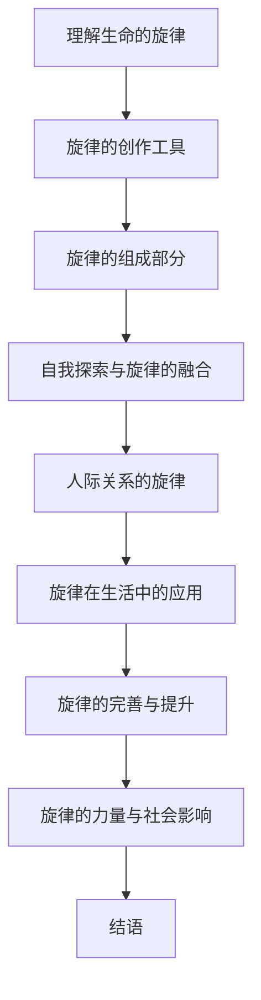

                 

# 谱写人生乐章：创作独特的生命旋律

> 关键词：人生旋律、心理健康、情感表达、人际互动、音乐疗法、艺术创作

> 摘要：本文以“谱写人生乐章：创作独特的生命旋律”为主题，探讨如何通过理解生命的旋律、创作工具的选择与应用、旋律的组成部分及其情感表达，来演绎个人成长、人际关系、生活应用等多个方面，最终实现旋律的完善与提升，以及对社会的积极影响。

## 目录大纲

## 第一部分：人生旋律的构思

### 第1章：理解生命的旋律

#### 1.1 生命的意义与旋律的起源

#### 1.2 旋律在生命中的体现

#### 1.3 如何找到属于自己的旋律

### 第2章：旋律的创作工具

#### 2.1 心理健康与旋律创作

#### 2.2 生活中的灵感来源

#### 2.3 创作工具的选择与应用

### 第3章：旋律的组成部分

#### 3.1 旋律的节奏与韵律

#### 3.2 旋律的情感表达

#### 3.3 旋律的构成与变化

## 第二部分：人生旋律的演绎

### 第4章：自我探索与旋律的融合

#### 4.1 自我认知与旋律创作

#### 4.2 旋律在个人成长中的应用

#### 4.3 旋律与人生目标的结合

### 第5章：人际关系的旋律

#### 5.1 家庭关系的旋律表达

#### 5.2 社交网络的旋律互动

#### 5.3 职场关系的旋律处理

### 第6章：旋律在生活中的应用

#### 6.1 音乐疗法与旋律的治愈力量

#### 6.2 艺术创作与旋律的表现形式

#### 6.3 旋律在生活中的实际应用案例

## 第三部分：人生旋律的完善与传承

### 第7章：旋律的完善与提升

#### 7.1 旋律的反馈与调整

#### 7.2 旋律的深入创作与打磨

#### 7.3 旋律的传承与影响

### 第8章：旋律的力量与社会影响

#### 8.1 旋律在社会中的角色

#### 8.2 旋律的传播与影响

#### 8.3 旋律对未来社会的影响

### 第9章：结语

#### 9.1 旋律与人生的联系

#### 9.2 对未来旋律创作的展望

#### 9.3 总结与启示

## 附录

### 附录A：旋律创作资源与工具

#### A.1 音乐创作软件推荐

#### A.2 旋律创作技巧资料

#### A.3 旋律创作学习平台介绍

## Mermaid 流程图

## 数学模型与公式

### 旋律创作的反馈循环模型

$$
F = k \cdot (I - O)
$$

其中，$F$表示反馈力度，$k$为调节系数，$I$为输入，$O$为输出。

### 旋律的情感表达模型

$$
E = \frac{1}{2} \cdot (R + S)
$$

其中，$E$表示情感强度，$R$为节奏，$S$为韵律。

---

本文将按照以上目录结构，分章节进行详细阐述，旨在帮助读者理解如何通过创作独特的生命旋律，谱写精彩的人生篇章。

## 第一部分：人生旋律的构思

### 第1章：理解生命的旋律

#### 1.1 生命的意义与旋律的起源

生命的意义自古以来便是哲学与宗教探讨的焦点。从生物学角度来看，生命是地球数十亿年进化过程的产物，是自然选择和基因演化的结晶。而从心理学和哲学角度来看，生命是一种体验、一种探索、一种意义。

那么，什么是旋律？旋律是由一系列音符按照一定的规律组合而成的音乐线条，它可以表达情感、描绘景象，甚至传递故事。在生活中，旋律无处不在，从自然的鸟鸣、海浪，到人类的语言、音乐，旋律构成了我们感知世界的一部分。

生命的旋律起源于我们对世界的感知和体验。每个人从出生开始，便在不断地经历、感受和成长。这些经历和感受汇聚成了一种独特的旋律，这种旋律既有共性，又有个性。共性在于，每个人都会经历成长、爱情、失落、喜悦等基本情感；个性则在于每个人对情感的表达方式和体验深度不同。

#### 1.2 旋律在生命中的体现

旋律在生命中的体现是多方面的。首先，它体现在我们的情感表达上。我们通过语言、文字、音乐等方式，将自己的情感传递给他人，形成一种情感的共鸣。例如，一首动人的歌曲可以让人流泪，一篇感人的文章可以让人深思，这些都是旋律在情感表达上的体现。

其次，旋律在我们的日常生活中无处不在。无论是上班的通勤途中，还是在午后的休息时光，音乐总是陪伴着我们。音乐不仅能够缓解压力、提升情绪，还能够激发创造力、提高工作效率。这就是旋律在日常生活中的应用。

此外，旋律还体现在我们的行为和习惯中。例如，很多人在做一些重复性工作时，会不自觉地哼唱一首歌曲，这就是旋律在行为习惯中的体现。同样，人们也会通过自己的行为和习惯，创造出独特的旋律，来表达自己的个性和价值观。

#### 1.3 如何找到属于自己的旋律

要找到属于自己的旋律，首先需要认识自己。了解自己的性格、兴趣、价值观，是创作旋律的基础。例如，一个乐观、开朗的人，可能会创作出轻松、欢快的旋律；而一个内向、敏感的人，可能会创作出深沉、忧郁的旋律。

其次，要不断体验和感受生活。生活中的点滴细节，都可能成为旋律的灵感来源。例如，春天的花开、夏天的阳光、秋天的落叶、冬天的雪景，这些都是可以激发创作灵感的元素。

最后，要勇于尝试和探索。创作的过程中，可能会遇到挫折和困难，但只有不断尝试，才能找到属于自己的旋律。例如，可以尝试不同的音乐风格、不同的创作工具，甚至与他人合作，共同创作出一首独特的旋律。

### 第2章：旋律的创作工具

#### 2.1 心理健康与旋律创作

心理健康是创作旋律的重要前提。一个心理健康的人，能够更好地认识自己，理解自己的情感，从而创作出更加真实、深刻的旋律。相反，一个心理健康状况不佳的人，可能会在创作过程中遇到困难，甚至影响到创作的质量。

心理健康与旋律创作之间的关系，可以从以下几个方面来理解：

首先，心理健康有助于激发创作灵感。一个心理健康的人，往往能够更加敏锐地感知生活中的美好和细节，这些感受和体验，都是创作旋律的宝贵素材。

其次，心理健康有助于调节情感。在创作过程中，可能会遇到挫折和困难，心理健康的人能够更好地调节自己的情绪，保持积极的心态，从而持续地进行创作。

最后，心理健康有助于提升创作质量。一个心理健康的人，能够更加专注地投入到创作中，从而创作出更加优秀、有影响力的旋律。

#### 2.2 生活中的灵感来源

生活中的灵感来源是旋律创作的源泉。从日常生活中的点滴细节，到旅行中的新奇体验，都可以成为旋律创作的灵感来源。例如：

- 日常生活中的声音：厨房里的锅碗瓢盆、街头巷尾的叫卖声、雨滴敲打窗户的声音，这些声音都可以成为旋律创作的灵感来源。
- 自然景观：山川河流、花草树木、日出日落，大自然的美丽景色，可以激发出许多优美的旋律。
- 人际关系：亲情、友情、爱情，人与人之间的情感互动，可以创造出许多富有情感表达的旋律。

#### 2.3 创作工具的选择与应用

创作工具是旋律创作的重要支撑。选择合适的创作工具，可以大大提高创作的效率和质量。目前，市面上有许多专业的音乐创作软件，如 Ableton Live、FL Studio、Logic Pro 等。这些软件功能强大，适用于各种音乐风格和创作需求。

选择创作工具时，可以从以下几个方面考虑：

- 音乐风格：不同的创作工具，适用于不同的音乐风格。例如，Ableton Live 更适合电子音乐创作，而 Logic Pro 更适合古典音乐创作。
- 功能需求：根据自己的创作需求，选择具有相应功能的创作工具。例如，如果需要录制现场乐器演奏，可以选择具有多轨录音功能的软件。
- 操作便捷性：选择界面简洁、操作便捷的创作工具，可以减少学习成本，提高创作效率。

### 第3章：旋律的组成部分

#### 3.1 旋律的节奏与韵律

旋律的节奏与韵律是旋律创作的基础。节奏是指音乐中音符的长短、强弱、快慢等变化，而韵律则是指音乐中音符的排列组合和音高的变化。

- 节奏：节奏是音乐的基本元素之一，它决定了音乐的快慢和强弱。常见的节奏模式有四分音符、八分音符、十六分音符等。在创作过程中，可以根据歌曲的风格和情感需求，选择合适的节奏模式。
- 韵律：韵律是指音乐中音符的排列组合和音高的变化。一个富有韵律的旋律，往往能够让人产生强烈的共鸣。在创作过程中，可以通过调整音符的排列和音高的变化，来创造出独特的韵律。

#### 3.2 旋律的情感表达

旋律的情感表达是旋律创作的核心。一个富有情感的旋律，能够触动人心，引起共鸣。情感表达可以通过以下几个方面来实现：

- 节奏与韵律：通过调整节奏和韵律，可以创造出不同的情感氛围。例如，快节奏、富有活力的旋律，可以表达喜悦和兴奋；慢节奏、舒缓的旋律，可以表达宁静和思考。
- 音色与乐器：不同的音色和乐器，具有不同的情感表达效果。例如，钢琴的音色温暖、柔和，适合表达温柔和感性；吉他的音色明亮、热情，适合表达激情和活力。
- 调性和音阶：调性和音阶的选择，对旋律的情感表达有着重要影响。例如，大调通常表达欢乐和明亮，而小调则表达忧郁和悲伤。

#### 3.3 旋律的构成与变化

旋律的构成与变化是旋律创作的重要环节。一个富有变化的旋律，能够吸引听众的注意力，增强音乐的感染力。旋律的构成与变化可以从以下几个方面来考虑：

- 音高变化：通过调整音符的音高，可以创造出不同的旋律形态。例如，从低音到高音的逐步升高，可以表达出一种向上的情感；从高音到低音的逐步降低，可以表达出一种向下的情感。
- 节奏变化：通过调整节奏的快慢、强弱，可以创造出不同的节奏感。例如，快节奏可以表达出兴奋和活力，而慢节奏可以表达出宁静和思考。
- 乐器变化：通过调整乐器的使用，可以创造出不同的音乐氛围。例如，加入鼓点可以增强音乐的节奏感，加入弦乐可以增加音乐的情感表达。

## 第二部分：人生旋律的演绎

### 第4章：自我探索与旋律的融合

#### 4.1 自我认知与旋律创作

自我认知是创作旋律的重要前提。一个清晰的自我认知，能够帮助我们更好地理解自己的情感和需求，从而创作出更加真实、有价值的旋律。

- 自我认知：自我认知是指对自身性格、兴趣、价值观等方面的认识。通过自我反思和探索，我们可以更好地了解自己，找到自己内心深处真正的需求和渴望。
- 旋律创作：在创作旋律时，我们可以将自己的自我认知融入其中，通过音乐表达自己的情感和内心世界。例如，一个热爱大自然的音乐家，可能会创作出许多描绘自然美景的旋律。

#### 4.2 旋律在个人成长中的应用

旋律在个人成长中的应用，主要体现在以下几个方面：

- 情感表达：在个人成长过程中，我们会经历各种情感体验，如喜悦、悲伤、焦虑、平静等。通过创作旋律，我们可以将这些情感表达出来，从而减轻内心的压力和焦虑。
- 自我激励：旋律具有强烈的感染力，可以激发人们的内在动力。例如，一首激励人心的旋律，可以让人在面临困难和挑战时，坚定信念、勇往直前。
- 学习与反思：通过创作和欣赏旋律，我们可以更好地理解音乐的美学原理和情感表达方式，从而提高自己的审美能力和创作水平。

#### 4.3 旋律与人生目标的结合

旋律与人生目标的结合，主要体现在以下几个方面：

- 指导方向：旋律可以作为一种指导方向，帮助我们明确自己的人生目标。例如，一首富有激情和动力的旋律，可以激发我们对未来事业的追求和向往。
- 动力源泉：旋律可以作为一种动力源泉，激励我们为实现人生目标而努力奋斗。例如，一首鼓舞人心的旋律，可以让我们在面临困难和挑战时，坚定信念、勇往直前。
- 评价标准：旋律可以作为一种评价标准，帮助我们衡量自己的人生目标是否实现。例如，一首成功的旋律，可以让我们感受到成就感和自豪感，从而肯定自己的人生价值。

### 第5章：人际关系的旋律

#### 5.1 家庭关系的旋律表达

家庭关系是人际关系中最重要的一部分。通过旋律，我们可以表达对家人的关爱、感激和思念。

- 爱与关怀：通过创作旋律，我们可以表达对家人的爱和关怀。例如，一首温馨的家庭旋律，可以让人感受到家的温暖和幸福。
- 感激与思念：通过旋律，我们可以表达对家人的感激和思念。例如，一首深情款款的旋律，可以让人感受到对亲人深深的思念和感激之情。

#### 5.2 社交网络的旋律互动

社交网络是现代社会的重要组成部分。通过旋律，我们可以与社交网络中的朋友、同事、伙伴等进行互动。

- 分享与交流：通过创作和分享旋律，我们可以与社交网络中的朋友、同事、伙伴等进行互动。例如，一首共同创作的旋律，可以增进彼此之间的友谊和合作。
- 理解与支持：通过旋律，我们可以表达对社交网络中朋友、同事、伙伴的理解和支持。例如，一首鼓舞人心的旋律，可以让人感受到朋友间的关爱和支持。

#### 5.3 职场关系的旋律处理

职场关系是人际关系中的重要组成部分。通过旋律，我们可以处理职场中的各种关系。

- 沟通与协调：通过创作旋律，我们可以表达对职场中同事、上级、下属的沟通和协调。例如，一首和谐的旋律，可以让人感受到职场中的和谐与协作。
- 理解与尊重：通过旋律，我们可以表达对职场中同事、上级、下属的理解和尊重。例如，一首体贴入微的旋律，可以让人感受到对他人需求的关注和理解。

### 第6章：旋律在生活中的应用

#### 6.1 音乐疗法与旋律的治愈力量

音乐疗法是一种利用音乐对身心健康产生积极影响的治疗方法。旋律作为一种音乐元素，具有强大的治愈力量。

- 心理调节：旋律可以调节情绪，缓解压力和焦虑。例如，一首舒缓的旋律，可以让人感到放松和舒适。
- 睡眠改善：旋律可以改善睡眠质量，提高睡眠深度。例如，一首轻柔的旋律，可以帮助人们入睡。
- 康复促进：旋律可以促进康复，提高患者的康复效果。例如，一首激励人心的旋律，可以激发患者的信心和勇气。

#### 6.2 艺术创作与旋律的表现形式

艺术创作是旋律在生活中的重要应用之一。通过旋律，艺术家可以表达自己的情感和思想，创造出丰富多彩的艺术作品。

- 音乐作品：艺术家可以通过旋律创作出各种类型的音乐作品，如歌曲、交响乐、爵士乐等。
- 视觉艺术：艺术家可以通过旋律来激发视觉创作的灵感，创作出富有音乐感的绘画、雕塑等艺术作品。
- 戏剧表演：艺术家可以通过旋律来增强戏剧表演的感染力，创造出更加生动、丰富的舞台效果。

#### 6.3 旋律在生活中的实际应用案例

旋律在生活中的实际应用案例非常丰富。以下是一些具体的案例：

- 婚礼音乐：婚礼是人生中的重要时刻，旋律可以用来营造浪漫、喜庆的氛围。例如，一首婚礼进行曲，可以让人感受到婚礼的庄严和幸福。
- 生日派对：生日派对是庆祝生日的欢乐时刻，旋律可以用来增强派对的欢乐气氛。例如，一首生日快乐歌，可以让人感受到生日派对的快乐和温馨。
- 休闲时光：在休闲时光中，旋律可以用来放松心情、缓解疲劳。例如，一首轻松的旋律，可以让人感受到轻松、愉快的氛围。

## 第三部分：人生旋律的完善与传承

### 第7章：旋律的完善与提升

#### 7.1 旋律的反馈与调整

旋律的反馈与调整是完善与提升旋律的重要环节。通过反馈和调整，我们可以不断提高旋律的质量和表现力。

- 反馈：反馈是旋律创作过程中不可或缺的一部分。通过收集听众的意见和建议，我们可以了解旋律的优点和不足，从而进行有针对性的调整和改进。
- 调整：调整是完善旋律的关键。在反馈的基础上，我们可以对旋律的节奏、韵律、情感表达等方面进行调整，使其更加符合听众的期望和需求。

#### 7.2 旋律的深入创作与打磨

旋律的深入创作与打磨是提升旋律艺术价值的重要途径。通过深入创作和打磨，我们可以使旋律更加精美、动人。

- 深入创作：深入创作是指对旋律进行更加深入的艺术构思和情感表达。通过深入创作，我们可以使旋律更加富有内涵和表现力。
- 打磨：打磨是指对旋律进行精细的调整和修正。通过打磨，我们可以使旋律的每个细节都达到最佳状态，从而提升旋律的艺术价值。

#### 7.3 旋律的传承与影响

旋律的传承与影响是旋律艺术的重要使命。通过传承和影响，我们可以使旋律成为文化遗产，对后世产生深远的影响。

- 传承：传承是指将旋律艺术传递给后代，使其成为文化遗产。通过传承，我们可以使旋律艺术得以延续和发展。
- 影响：影响是指旋律艺术对后世产生的深远影响。例如，一首经典的旋律，可以激发人们对音乐的热爱，对生活的感悟，从而影响一代又一代人。

### 第8章：旋律的力量与社会影响

#### 8.1 旋律在社会中的角色

旋律在社会中扮演着重要的角色。它不仅是艺术创作的载体，也是社会文化的重要体现。

- 艺术价值：旋律具有独特的艺术价值，可以激发人们的审美情感，提升审美能力。
- 文化传承：旋律是文化传承的重要载体，通过旋律，我们可以了解和传承各个国家和地区的音乐文化。
- 社会影响力：旋律在社会中具有广泛的影响力，可以影响人们的情感、思想和行为，对社会产生积极的影响。

#### 8.2 旋律的传播与影响

旋律的传播与影响是旋律艺术发展的重要方面。通过传播和影响，我们可以使旋律艺术得到更广泛的认可和应用。

- 国际交流：旋律的传播促进了国际音乐文化交流，使不同国家和地区的音乐文化相互借鉴、融合。
- 社会实践：旋律的传播促进了音乐在社会实践中的应用，如音乐疗法、艺术教育等。
- 文化创新：旋律的传播推动了音乐文化的创新和发展，使音乐艺术呈现出多样化和个性化。

#### 8.3 旋律对未来社会的影响

旋律对未来社会的影响将是深远而广泛的。随着科技的发展和人们审美需求的变化，旋律艺术将呈现新的发展趋势和特点。

- 科技融合：旋律艺术将与传统艺术形式相结合，如与数字艺术、虚拟现实等技术相结合，创造出新的艺术形式和体验。
- 审美多元化：随着人们审美需求的多样化，旋律艺术将呈现出更加多元化、个性化的特点。
- 社会影响力扩大：随着旋律艺术在社会中的广泛应用，其社会影响力将进一步扩大，对社会产生更加深远的影响。

### 第9章：结语

#### 9.1 旋律与人生的联系

旋律与人生紧密相连。通过创作和欣赏旋律，我们可以更好地理解生命、体验情感、实现价值。

- 生命体验：旋律是生命体验的重要组成部分，通过旋律，我们可以感受生命的美好和丰富。
- 情感表达：旋律是情感表达的重要方式，通过旋律，我们可以将自己的情感传递给他人，实现情感的共鸣。
- 人生价值：旋律是人生价值的重要体现，通过创作和欣赏旋律，我们可以实现自我价值，提升人生意义。

#### 9.2 对未来旋律创作的展望

未来旋律创作将呈现出新的发展趋势和特点。随着科技的发展和人们审美需求的变化，旋律创作将更加多样化和个性化。

- 创新性：未来旋律创作将更加注重创新性，探索新的音乐风格、表现形式和艺术语言。
- 个性化：未来旋律创作将更加注重个性化，满足不同人群的审美需求，实现个性化的音乐创作。
- 社会性：未来旋律创作将更加注重社会性，关注社会问题，传递正能量，发挥旋律在社会中的作用。

#### 9.3 总结与启示

本文从多个角度探讨了人生旋律的构思、演绎和完善，旨在帮助读者理解如何创作和欣赏旋律，从而实现人生的美好和价值。

- 理解旋律：理解旋律是创作和欣赏旋律的基础，只有深入了解旋律的内涵和表现形式，才能更好地创作和欣赏旋律。
- 创作旋律：创作旋律是表达情感和实现价值的重要途径，通过创作旋律，我们可以更好地表达自己的内心世界和人生感悟。
- 欣赏旋律：欣赏旋律是提升审美能力和感受生命美好的一种方式，通过欣赏旋律，我们可以感受到音乐的魅力和力量。

附录A：旋律创作资源与工具

- 音乐创作软件推荐：Ableton Live、FL Studio、Logic Pro等
- 旋律创作技巧资料：《音乐创作入门教程》、《旋律写作技巧与实战》等
- 旋律创作学习平台介绍：Udemy、Coursera、网易云课堂等

## Mermaid 流程图

## 数学模型与公式

### 旋律创作的反馈循环模型

$$
F = k \cdot (I - O)
$$

其中，$F$表示反馈力度，$k$为调节系数，$I$为输入，$O$为输出。

### 旋律的情感表达模型

$$
E = \frac{1}{2} \cdot (R + S)
$$

其中，$E$表示情感强度，$R$为节奏，$S$为韵律。

