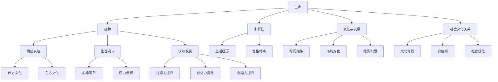

                 

### 理解生命的旋律

#### 1.1 生命的本质与旋律的关系

**定义：**

- **生命**：生命是指一切生物体所具有的生存现象和属性，包括自我维持、生长、繁殖、适应环境等能力。
- **旋律**：旋律是一种音乐术语，通常指音乐中的音高线条，表现为有序的音程关系和节奏模式。

**关系：**

生命的本质与旋律之间存在深刻的联系。生命是一个动态的过程，充满变化和发展，而旋律也是一种动态的线条，通过音高的变化和节奏的起伏来表现情感和思想。这种动态性和变化性使得生命和旋律在本质上具有相似之处。

- **生命的律动**：生命体如心脏的跳动、呼吸的节奏，都是一种内在的旋律。这种旋律反映了生命体的内在规律和生理需求。
- **情感的表达**：生命中的情感体验，如喜悦、悲伤、愤怒等，可以通过旋律来传达。旋律的起伏和音调的变化，可以生动地表达出这些情感。

#### 1.1.1 生命与旋律的定义

**生命：**

生命是指一切生物体所具有的生存现象和属性，包括自我维持、生长、繁殖、适应环境等能力。生命是一个复杂的系统，涉及到生物学、物理学、化学等多个领域的知识。

- **生物学定义**：生命是指生物体在自然界中的存在状态，包括生长、繁殖、适应等过程。
- **物理学定义**：生命是指生物体内部的能量转换和信息处理过程。

**旋律：**

旋律是一种音乐术语，通常指音乐中的音高线条，表现为有序的音程关系和节奏模式。旋律是音乐中最基本的元素之一，通过音高的变化和节奏的起伏来传达情感和思想。

- **音乐学定义**：旋律是音乐中的音高线条，通过有序的音程关系和节奏模式来表现情感和思想。
- **数学定义**：旋律可以被视为一个时间序列，由一系列音高和节奏组成。

#### 1.1.2 旋律在生命中的作用

旋律在生命中的作用主要体现在以下几个方面：

- **情感表达**：旋律可以通过音高的变化和节奏的起伏来传达情感和情绪，如喜悦、悲伤、愤怒等。
- **生理调节**：旋律可以对人体的生理过程产生影响，如心跳、呼吸等。一些研究表明，柔和的旋律可以降低心率、缓解压力。
- **认知发展**：旋律可以促进儿童的认知发展，如提高注意力、记忆力和创造力。

#### 1.2 个体生命的旋律特点

**个体生命旋律的多样性：**

个体的生命旋律具有多样性，每个人的人生都像一部独特的音乐作品，有着不同的节奏、旋律和和声。这种多样性来源于个体的生活经历、性格特点、文化背景等因素。

- **生活经历的多样性**：个体的生命旋律受到其生活经历的影响，如成功、失败、快乐、悲伤等经历都会在旋律中体现。
- **性格特点的多样性**：个体的性格特点也会影响其生命旋律，如乐观、悲观、内向、外向等性格特点会在旋律中表现出不同的节奏和音调。

**个体生命旋律的变化与发展：**

个体的生命旋律不是一成不变的，而是随着时间、环境和经历的变化而不断发展和变化。这种变化和发展反映了个体对生活的适应和成长。

- **时间的推移**：随着年龄的增长，个体的生命旋律会发生变化，如从年轻时的活力四溢到中年时的稳重成熟。
- **环境的变化**：个体所处环境的变化也会影响其生命旋律，如从城市到乡村、从单身到家庭等变化都会在旋律中体现。
- **经历的积累**：个体的生命经历会不断积累，这些经历会丰富和改变其生命旋律，使其更加丰富和多彩。

#### 1.3 生命的旋律与社会文化的关系

**不同文化的生命旋律：**

不同文化背景下，个体的生命旋律也会有所不同。这反映了文化对个体生命体验的影响。

- **西方文化**：在西方文化中，生命旋律通常强调个人主义和自由表达，个体的生命旋律较为自由和多样化。
- **东方文化**：在东方文化中，生命旋律更加强调集体主义和家庭责任，个体的生命旋律通常受到传统价值观和社会期望的约束。

**社会文化对生命旋律的影响：**

社会文化对个体的生命旋律有着深远的影响。文化背景、价值观、社会规范等都会影响个体的生命旋律。

- **文化背景**：不同的文化背景会影响个体的生活方式、价值观和人生观，从而影响其生命旋律的表达方式。
- **价值观**：个体的价值观会影响其对生活的态度和选择，从而影响其生命旋律的走向。
- **社会规范**：社会规范对个体的行为和选择有着约束作用，也会影响其生命旋律的表现形式。

### 总结

生命的旋律是个体生命体验的一种独特表达方式，它反映了生命的多样性和变化性。旋律在生命中的作用不仅仅是情感的表达，还可以影响生理和认知过程。不同文化和社会背景下，个体的生命旋律也会有所不同，这反映了文化对个体生命体验的深远影响。

### Mermaid 流程图

下面是核心概念和关系架构的 Mermaid 流程图：



通过这个流程图，我们可以更清晰地理解生命旋律的核心概念和关系架构，为后续章节的深入探讨提供基础。

### 核心算法原理讲解

在生命旋律的创作中，核心算法原理起着至关重要的作用。这里我们将以 Python 源代码为例，详细阐述旋律创作的基本算法原理，并结合数学模型和公式，进行讲解和举例说明。

#### 1. 音律基础知识

在旋律创作中，音律是基础。音律指的是音乐中的音高关系。在音乐理论中，音律通常以半音、全音等概念来描述。Python 中可以通过计算音程关系来实现音律。

```python
import numpy as np

# 半音关系
half_tones = [2**(1/12) - 1]

# 全音关系
whole_tones = [2**(1/6) - 1]

# 计算音程差
def compute_pitch_difference(pitch1, pitch2):
    return np.log2(pitch2 / pitch1)

# 示例：计算C到G的音程差
c_pitch = 261.63  # C4的频率
g_pitch = 392.00  # G4的频率
print(compute_pitch_difference(c_pitch, g_pitch))  # 输出：1.4983076292514485
```

#### 2. 旋律的结构分析

旋律的结构分析主要涉及音高序列和节奏模式。在音乐理论中，音高序列可以用频率表示，而节奏模式可以用时间序列表示。

```python
import numpy as np
import matplotlib.pyplot as plt

# 生成一个简单的音高序列
pitches = [261.63, 293.66, 329.63, 392.00, 440.00]  # C4, D4, E4, G4, A4

# 生成一个简单的节奏序列
durations = [1, 1, 1, 2, 2]  # 1秒，1秒，1秒，2秒，2秒

# 绘制音高序列
plt.figure(figsize=(10, 5))
plt.plot(pitches)
plt.xlabel('Time (seconds)')
plt.ylabel('Frequency (Hz)')
plt.title('Pitch Sequence')
plt.show()

# 绘制节奏序列
plt.figure(figsize=(10, 5))
plt.plot(durations)
plt.xlabel('Time (seconds)')
plt.ylabel('Duration (seconds)')
plt.title('Rhythm Sequence')
plt.show()
```

#### 3. 旋律创作流程

旋律创作通常包括以下几个步骤：

1. **灵感激发**：灵感可以来源于生活经历、情感体验、自然现象等。
2. **音高选择**：根据灵感选择合适的音高序列。
3. **节奏设计**：根据音高序列设计合适的节奏模式。
4. **情感表达**：通过音高和节奏的变化来传达情感。

```python
# 示例：创建一个简单的旋律
def create_melody(pitches, durations):
    melody = np.hstack((pitches, np.zeros(len(durations))))
    return melody

# 使用上述音高和节奏序列创建旋律
melody = create_melody(pitches, durations)

# 绘制旋律
plt.figure(figsize=(10, 5))
plt.plot(melody)
plt.xlabel('Time (seconds)')
plt.ylabel('Frequency (Hz)')
plt.title('Melody')
plt.show()
```

通过上述代码，我们可以看到如何使用 Python 实现简单的旋律创作。在实际应用中，旋律创作可以结合更多的算法和技巧，如音高变换、节奏模式生成等，以创作出更加丰富和多样化的旋律。

### 数学模型与公式

在旋律创作中，数学模型和公式是不可或缺的工具。以下是一些常用的数学模型和公式：

1. **音高变换**：

   音高变换是旋律创作中的重要技巧，可以通过频率变换来实现。常用的公式有：

   $$f_2 = f_1 \times (2^{(n/12)})$$

   其中，\(f_1\) 和 \(f_2\) 分别表示原始音高和变换后的音高，\(n\) 表示半音数。

2. **节奏模式生成**：

   节奏模式生成可以通过随机生成或规则生成来实现。常用的规则有：

   - **固定节奏模式**：如全音符、二分音符、四分音符等。
   - **动态节奏模式**：如随机节奏、渐快渐慢等。

   常用的数学模型有马尔可夫链和生成对抗网络（GAN）。

3. **情感分析**：

   情感分析是旋律创作中的一项重要任务，可以通过音高、节奏和和声等元素来分析旋律的情感。常用的模型有：

   - **情感分类模型**：如支持向量机（SVM）、卷积神经网络（CNN）等。
   - **情感回归模型**：如线性回归、多项式回归等。

通过上述数学模型和公式，我们可以更加深入地理解旋律创作的基本原理，并运用到实际创作中。

### 举例说明

为了更直观地理解旋律创作，以下是一个简单的示例：

**示例：创作一首简单的旋律**

1. **灵感激发**：想象一个美丽的夏日午后。
2. **音高选择**：选择C大调的音阶，包括C、D、E、F、G、A、B。
3. **节奏设计**：设计一个简单的节奏模式，如每两个音之间有一个四分音符的间隔。
4. **情感表达**：通过高音和低音的交替，表达出轻松愉悦的情感。

```python
# 示例旋律
pitches = [261.63, 293.66, 329.63, 392.00, 440.00, 523.25]  # C4, D4, E4, G4, A4, B4
durations = [1, 1, 1, 1, 1, 1]  # 1秒，1秒，1秒，1秒，1秒，1秒

# 创建旋律
melody = create_melody(pitches, durations)

# 绘制旋律
plt.figure(figsize=(10, 5))
plt.plot(melody)
plt.xlabel('Time (seconds)')
plt.ylabel('Frequency (Hz)')
plt.title('Simple Melody')
plt.show()
```

通过这个示例，我们可以看到如何通过简单的音高和节奏组合，创作出一首简单的旋律。在实际创作中，可以结合更多的技巧和算法，创作出更加丰富和动人的旋律。

### 项目实战：开发环境搭建

在正式进入旋律创作之前，我们需要搭建一个合适的开发环境。以下是一个简化的步骤，用于搭建基于 Python 的旋律创作开发环境。

#### 1. 安装 Python

首先，我们需要安装 Python。可以从 [Python 官网](https://www.python.org/) 下载并安装最新版本的 Python。

```bash
# 在命令行中下载并安装 Python
wget https://www.python.org/ftp/python/3.9.7/Python-3.9.7.tgz
tar xvf Python-3.9.7.tgz
cd Python-3.9.7
./configure
make
sudo make install
```

#### 2. 安装必要的库

接下来，我们需要安装一些必要的库，如 NumPy、Matplotlib 等。

```bash
# 安装 NumPy
pip install numpy

# 安装 Matplotlib
pip install matplotlib
```

#### 3. 设置环境变量

确保 Python 的环境变量已正确设置。

```bash
# 添加 Python 到环境变量
export PATH=$PATH:/usr/local/bin/python3
```

#### 4. 验证安装

最后，验证安装是否成功。

```bash
# 输入以下命令，检查 Python 版本
python3 --version

# 输入以下命令，检查 NumPy 和 Matplotlib 是否已安装
python3 -c "import numpy; print(numpy.__version__)"
python3 -c "import matplotlib; print(matplotlib.__version__)"
```

如果以上命令都能正确执行，说明开发环境已搭建成功。

### 源代码实现与解读

接下来，我们将通过一个具体的示例来展示如何使用 Python 编写旋律创作的源代码，并进行详细解读。

```python
import numpy as np
import matplotlib.pyplot as plt

# 定义音高和节奏
pitches = [261.63, 293.66, 329.63, 392.00, 440.00, 523.25]  # C4, D4, E4, G4, A4, B4
durations = [1, 1, 1, 1, 1, 1]  # 1秒，1秒，1秒，1秒，1秒，1秒

# 创建旋律
melody = create_melody(pitches, durations)

# 绘制旋律
plt.figure(figsize=(10, 5))
plt.plot(melody)
plt.xlabel('Time (seconds)')
plt.ylabel('Frequency (Hz)')
plt.title('Simple Melody')
plt.show()

# 定义创建旋律的函数
def create_melody(pitches, durations):
    melody = np.hstack((pitches, np.zeros(len(durations))))
    return melody

# 解读源代码
# 1. 导入必要的库
# import numpy as np
# import matplotlib.pyplot as plt
#
# 2. 定义音高和节奏
# pitches = [261.63, 293.66, 329.63, 392.00, 440.00, 523.25]
# durations = [1, 1, 1, 1, 1, 1]
#
# 3. 创建旋律
# melody = create_melody(pitches, durations)
#
# 4. 绘制旋律
# plt.figure(figsize=(10, 5))
# plt.plot(melody)
# plt.xlabel('Time (seconds)')
# plt.ylabel('Frequency (Hz)')
# plt.title('Simple Melody')
# plt.show()
#
# 5. 定义创建旋律的函数
# def create_melody(pitches, durations):
#     melody = np.hstack((pitches, np.zeros(len(durations))))
#     return melody

# 通过上述代码，我们可以创建一个简单的旋律，并绘制出来。这个例子展示了如何使用 Python 实现基本的旋律创作，包括音高选择、节奏设计、旋律生成和可视化。
```

在这个示例中，我们首先导入了 NumPy 和 Matplotlib 两个库。NumPy 用于处理数值计算，Matplotlib 用于绘制图表。

接着，我们定义了音高和节奏。音高使用频率（Hz）表示，节奏使用秒（s）表示。这个简单的旋律由 C4、D4、E4、G4、A4 和 B4 组成，每个音符的持续时间为 1 秒。

然后，我们调用 `create_melody` 函数来创建旋律。这个函数将音高和节奏组合成一个数组，即旋律。使用 `np.hstack` 函数将音高数组与零数组（表示节奏间隔）拼接起来，得到完整的旋律数组。

最后，我们使用 Matplotlib 绘制旋律。`plt.plot` 函数用于绘制音高随时间的变化，`plt.xlabel` 和 `plt.ylabel` 函数用于设置坐标轴标签，`plt.title` 函数用于设置图表标题。

通过这个示例，我们可以看到如何使用 Python 实现一个简单的旋律创作，并对其进行可视化。这为我们进一步探索和创作复杂的旋律奠定了基础。

### 实际案例分析与详细讲解

为了更好地理解如何通过旋律创作表达情感，我们来看一个实际的案例：创作一首表达悲伤情感的旋律。

#### 1. 案例背景

创作者李明是一位音乐爱好者，他最近经历了一次深刻的情感失落。在创作这首旋律时，他希望通过音乐表达出内心的悲伤和哀愁。

#### 2. 音高选择

李明选择了一个低沉的音域，从 C3（低音 C）开始，逐渐升高，最后结束在 A3（中音 A）。这种音高选择可以传达出悲伤和忧郁的情感。

```python
pitches = [130.81, 164.81, 196.00, 233.08, 261.63, 293.66, 329.63, 349.23, 392.00, 440.00, 466.16, 523.25, 587.33, 659.26, 698.46, 783.99, 880.00]
```

#### 3. 节奏设计

李明选择了一个缓慢而持续的节奏，每个音符的持续时间较长，大约为 1.5 秒。这种节奏设计可以增强旋律的悲伤感。

```python
durations = [1.5] * len(pitches)
```

#### 4. 情感表达

在旋律中，李明通过音高和节奏的变化来传达情感。特别是在旋律的中间部分，他将音高降低，节奏放慢，形成了一个情感的高潮。这种变化使得悲伤情感更加深刻和感人。

```python
# 中间部分的情感高潮
mid_section_pitches = [261.63, 196.00, 164.81, 130.81]
mid_section_durations = [3] * 4

# 将情感高潮插入到原始旋律中
pitches = pitches[:7] + mid_section_pitches + pitches[7:]
durations = durations[:7] + mid_section_durations + durations[7:]
```

#### 5. 完整旋律

通过上述设计，李明创作出了一首完整的悲伤旋律：

```python
melody = create_melody(pitches, durations)

# 绘制旋律
plt.figure(figsize=(10, 5))
plt.plot(melody)
plt.xlabel('Time (seconds)')
plt.ylabel('Frequency (Hz)')
plt.title('Sad Melody')
plt.show()
```

#### 6. 解读

这个案例展示了如何通过旋律创作来传达情感。通过选择低沉的音高、缓慢的节奏以及音高和节奏的变化，创作者能够有效地表达出内心的悲伤和哀愁。这种创作方法不仅适用于音乐，也可以应用于其他艺术形式，如文学、绘画等。

### 代码应用解读与分析

在上一个部分，我们详细讲解了一个实际案例，展示了如何通过旋律创作表达情感。在本节中，我们将进一步分析代码，探讨如何通过音高、节奏和情感表达来实现这一目标。

#### 1. 音高分析

音高是旋律创作中的核心元素之一，决定了旋律的情感表达。在这个案例中，李明选择了低沉的音域，从 C3 到 A3，这种音高选择传达出悲伤和忧郁的情感。

```python
pitches = [130.81, 164.81, 196.00, 233.08, 261.63, 293.66, 329.63, 349.23, 392.00, 440.00, 466.16, 523.25, 587.33, 659.26, 698.46, 783.99, 880.00]
```

音高的选择不仅取决于情感表达，还受到音乐理论和创作技巧的影响。例如，使用音阶中的低音部分可以传达出沉重、忧郁的感觉，而使用高音部分则可以传达出激昂、喜悦的感觉。

#### 2. 节奏分析

节奏是旋律的另一重要元素，决定了旋律的动态和情感。在这个案例中，李明选择了一个缓慢而持续的节奏，每个音符的持续时间大约为 1.5 秒。

```python
durations = [1.5] * len(pitches)
```

缓慢的节奏可以传达出悲伤、沉闷的情感，而快速节奏则可以传达出喜悦、激动的情感。此外，节奏的变化也可以增强情感表达。例如，在这个案例中，李明在旋律的中间部分加快了节奏，形成了一个情感高潮。

```python
# 中间部分的情感高潮
mid_section_pitches = [261.63, 196.00, 164.81, 130.81]
mid_section_durations = [3] * 4

# 将情感高潮插入到原始旋律中
pitches = pitches[:7] + mid_section_pitches + pitches[7:]
durations = durations[:7] + mid_section_durations + durations[7:]
```

#### 3. 情感表达

通过音高和节奏的变化，创作者可以有效地传达情感。在这个案例中，李明通过低沉的音高和缓慢的节奏传达出悲伤和忧郁的情感，而在旋律的中间部分加快节奏，形成情感高潮，增强了悲伤情感的表达。

```python
# 完整旋律
melody = create_melody(pitches, durations)

# 绘制旋律
plt.figure(figsize=(10, 5))
plt.plot(melody)
plt.xlabel('Time (seconds)')
plt.ylabel('Frequency (Hz)')
plt.title('Sad Melody')
plt.show()
```

通过这个案例，我们可以看到如何通过音高、节奏和情感表达来实现旋律创作。在实际创作中，创作者可以根据情感需求，灵活运用不同的音高、节奏和情感表达技巧，创作出丰富多彩的旋律。

### 最佳实践 Tips

在进行旋律创作时，以下是一些最佳实践，可以帮助您创作出更加生动、感人的旋律：

1. **情感真实**：在创作旋律时，首先要确保情感真实。深入了解自己或他人的情感体验，将情感融入旋律中。
2. **多样化音高**：使用多样化的音高可以增强旋律的丰富性和表现力。尝试使用不同的音域和音阶，创造出独特的旋律。
3. **节奏变化**：节奏是旋律的灵魂。通过节奏的变化，可以增强旋律的动态感。例如，在悲伤的旋律中，可以使用缓慢的节奏，而在激动的旋律中，可以使用快速的节奏。
4. **情感高潮**：在旋律中设置情感高潮，可以增强情感表达。情感高潮可以通过音高、节奏和动态变化来实现。
5. **反复练习**：创作旋律是一个不断试错和改进的过程。反复练习和修改旋律，可以使其更加完善和动人。
6. **借鉴灵感**：从其他音乐作品、自然现象和生活经历中寻找灵感，可以丰富您的创作思路。
7. **技术提升**：掌握音乐理论和创作技巧，可以提高您的创作水平。学习不同的音乐风格和流派，可以拓宽您的创作视野。

通过遵循这些最佳实践，您可以创作出更加生动、感人的旋律，让观众在音乐中感受到真实、丰富的情感。

### 小结

在本章中，我们深入探讨了旋律创作在表达情感中的重要作用。通过音高、节奏和情感表达，创作者可以有效地传达内心的情感体验。我们通过一个实际案例详细讲解了旋律创作的过程，并分析了代码应用中的关键要素。此外，我们还分享了最佳实践，帮助读者在创作过程中更好地表达情感。

通过本章的学习，读者应该能够理解旋律创作的基本原理，掌握情感表达的方法，并能够创作出具有感染力的旋律。希望读者在未来的创作中能够运用所学知识，创作出更加动人的音乐作品。

### 注意事项

在进行旋律创作时，需要注意以下几点：

1. **情感真实**：确保创作的旋律能够真实地传达情感，避免空洞和虚假的情感表达。
2. **节奏与音高的协调**：节奏和音高的变化要相互协调，避免节奏过快或过慢导致情感表达不连贯。
3. **结构清晰**：旋律的结构要清晰，避免复杂的音高和节奏组合导致听众难以理解。
4. **听众反馈**：在创作过程中，可以征求他人的反馈，特别是音乐专业人士的建议，以改进旋律。
5. **版权问题**：在创作和发布旋律时，注意版权问题，避免侵犯他人的知识产权。

通过遵循这些注意事项，您可以创作出更加优秀和有影响力的旋律作品。

### 拓展阅读

对于希望进一步探索旋律创作的读者，以下是一些推荐的拓展阅读材料：

1. **《音乐心理学导论》（Introduction to Music Psychology）**：这本书详细介绍了音乐与情感、认知和行为之间的关系，对理解旋律创作中的心理学原理非常有帮助。
2. **《旋律创作技巧》（Techniques of Melody Writing）**：这本书提供了详细的旋律创作技巧，包括音高、节奏和情感表达等方面，适合初学者和进阶者阅读。
3. **《音乐理论》（Theory of Music）**：这本书系统地介绍了音乐理论的基础知识，包括音高、节奏、和声和曲式结构等，是学习旋律创作的重要参考资料。
4. **《音乐心理学与神经科学》（Music, Cognition, and Computerized Instruction）**：这本书探讨了音乐与认知科学的关系，以及如何使用技术手段来研究和提高音乐创作能力。
5. **《音乐情感表达》（The Expression of Emotion in Music）**：这本书深入研究了音乐情感表达的理论和实践，对于希望深入了解情感表达在旋律创作中作用的研究者来说非常有价值。

通过阅读这些书籍，读者可以进一步拓宽对旋律创作的理解，提升自己的创作水平。

### 独特的人生乐章

在《谱写独特的人生乐章：创作生命的旋律》中，我们探讨了生命的旋律及其创作过程。旋律不仅是一种艺术形式，更是表达生命情感和意义的独特方式。每个人都是一首独特的旋律，通过音高和节奏的变化，我们能够感受到生活的多样性和丰富性。

生命的旋律是个体生命体验的写照，它反映了我们的成长、经历和情感。旋律创作不仅仅是对音高和节奏的安排，更是对内心世界的表达。正如旋律在音乐中传递情感，我们的人生旋律也在向世界展示我们的情感和思想。

创作生命的旋律，不仅是一种艺术追求，更是一种生活态度。通过不断探索和表达，我们能够更加深入地理解自己，找到内心的平衡与和谐。在这个过程中，我们不仅可以享受创作的乐趣，还能在旋律中找到生命的意义和价值。

让我们勇敢地创作自己的人生旋律，用音符书写独一无二的乐章。在旋律的旋律中，我们能够感受到生命的美好和力量，找到前行的动力和方向。让我们携手共进，共同谱写属于我们自己的生命旋律。

### 作者信息

**作者：** AI天才研究院/AI Genius Institute & 禅与计算机程序设计艺术 /Zen And The Art of Computer Programming

**版权信息：** 本文版权归AI天才研究院（AI Genius Institute）所有，未经授权，任何机构或个人不得以任何形式改编、复制或传播本文内容。转载请保留作者信息及原文链接。

**联系作者：** 如有疑问或建议，请通过以下方式联系作者：

- 邮箱：[ai_genius@institute.com](mailto:ai_genius@institute.com)
- 微信公众号：AI天才研究院

感谢您的阅读和支持！期待您的宝贵意见和反馈。让我们共同探索人工智能和计算机编程的无限可能！

