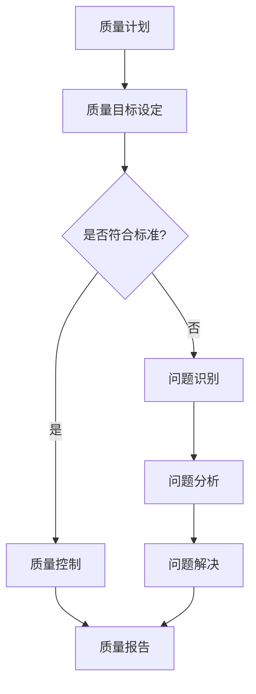

                 

# 质量而非数量：追求深度的生活方式

> 关键词：质量、深度、生活方式、质量管理、深度思维、深度学习、质量提升

> 摘要：
本文旨在探讨质量而非数量在现代社会和信息技术领域的重要性。我们分析了质量的概念、质量与数量的关系，以及质量管理的基本原理。接着，文章深入探讨了深度生活的理念，包括深度思维、深度学习和深度体验，以及如何培养和实践深度生活方式。同时，文章也提出了深度生活的挑战和应对策略。最后，我们对质量与深度的未来趋势进行了展望，并强调了质量与深度在个人成长和社会发展中的价值。

## 目录

1. **第一部分：理解质量的本质**
   1.1 质量概念及其重要性
   1.2 质量与数量的关系
   1.3 质量管理的原理与实践
   1.4 质量与生活方式的关系

2. **第二部分：深度生活的追求与实践**
   2.1 深度思维与生活方式的转变
   2.2 深度学习与深度阅读
   2.3 深度体验：艺术与旅行

3. **第三部分：深度生活的挑战与应对**
   3.1 深度生活的挑战
   3.2 应对深度生活的挑战

4. **第四部分：深度生活的未来展望**
   4.1 质量与深度的未来趋势
   4.2 结语：质量与深度的和谐共生

## 第一部分：理解质量的本质

### 1.1 质量概念及其重要性

#### 1.1.1 质量的定义

质量，是一个多维度且相对的概念。在不同的领域和背景下，质量有着不同的内涵和标准。在经济学中，质量通常指的是商品或服务能够满足消费者需求的能力；而在工程领域，质量则是指产品或系统的可靠性、耐用性和安全性。因此，我们可以将质量定义为：“满足特定需求和期望的特性综合。”

质量在经济中的作用是不可忽视的。高质量的产品和服务能够提高消费者的满意度和忠诚度，进而推动销售和品牌价值的提升。此外，高质量的产品和服务还能降低维护成本，提高企业的竞争力和市场份额。因此，质量不仅是企业生存和发展的基石，也是推动经济发展的重要因素。

#### 1.1.2 质量与数量的关系

质量与数量之间的关系是辩证的。数量指的是生产或服务的数量，而质量则指的是这些生产或服务的品质。在短期内，增加数量可能会带来短期的经济收益，但长期来看，忽视质量可能导致客户流失、品牌受损，最终影响企业的长期发展。

质量与数量的辩证关系体现在以下几个方面：

1. **质量和数量的替代关系**：在资源有限的情况下，提高质量往往意味着减少数量。例如，在制造业中，通过提高生产效率和自动化水平，可以在不增加数量的情况下提高产品质量。

2. **质量和数量的互补关系**：在资源充足的情况下，高质量的产品和服务可以增加数量。例如，通过提高研发投入，企业可以生产出更多高质量的产品，从而扩大市场份额。

3. **质量优势带来的长期利益**：高质量的产品和服务往往能够吸引更多的客户，提高客户满意度和忠诚度。这种优势会在长期内转化为企业的竞争优势和市场份额的增长。

#### 1.1.3 质量与数量的关系总结

总之，质量与数量之间的关系是复杂且动态的。在追求数量的同时，我们不能忽视质量的重要性。质量是企业的核心竞争力，是企业长期发展的关键因素。只有在质量和数量的平衡中，企业才能实现可持续发展。

### 1.2 质量管理的原理与实践

#### 1.2.1 质量管理的核心原则

质量管理是一个系统化的过程，它涉及到组织的各个层面和各个部门。质量管理的核心原则包括以下几个方面：

1. **顾客导向**：质量管理的核心目标是满足顾客的需求和期望。企业需要通过市场调研、顾客反馈等手段，了解顾客的需求，并将其转化为产品质量的标准。

2. **全员参与**：质量管理不是某一个部门或个人的任务，而是全员的共同责任。每个员工都应参与质量管理和质量提升的过程，从生产到销售，从研发到售后服务，每个人都要为质量负责。

3. **持续改进**：质量管理是一个持续的过程，企业需要不断地寻求改进的机会，通过不断优化流程、提高技术水平，来提升产品的质量。

4. **事实基础**：质量管理需要基于事实和数据，而不是主观判断。通过数据分析和统计工具，企业可以更准确地评估产品质量，发现问题，并采取相应的改进措施。

5. **供应链管理**：质量管理不仅仅是企业内部的事务，还需要与供应链上下游的企业进行协作，共同提升产品的质量。

#### 1.2.2 质量管理的实践方法

1. **5S管理**：5S管理是一种简单但非常有效的质量管理方法，它包括整理、整顿、清扫、清洁和素养。通过5S管理，企业可以建立一个有序、整洁、高效的工作环境，从而提高产品质量和工作效率。

2. **全面质量管理（TQM）**：全面质量管理是一种以顾客为中心，全员参与，持续改进的质量管理方法。它强调通过系统化的过程管理，来提高产品和服务的质量。

3. **六西格玛管理**：六西格玛管理是一种基于统计学的方法，旨在通过减少过程变异，来提高产品和服务的质量。它通过定义、测量、分析、改进和控制等步骤，来持续优化流程。

#### 1.2.3 质量管理的重要性

质量管理是企业成功的关键因素。高质量的产品和服务能够提高企业的市场竞争力，增加顾客的信任和忠诚度，从而推动企业的持续发展。此外，质量管理还能够提高企业的生产效率，降低成本，提高利润。

### 1.3 质量与生活方式的关系

#### 1.3.1 质量在日常生活中的体现

质量在我们的日常生活中无处不在。从我们每天使用的电器、食品，到出行工具、服务，质量都是我们购买决策的重要因素。高质量的产品和服务能够提高我们的生活质量，带来更多的便利和舒适。

1. **消费者购买决策**：消费者在购买产品或服务时，会根据产品的质量、性能、价格等因素进行综合考虑。高质量的产品往往能够吸引消费者的关注，提高购买意愿。

2. **品牌忠诚度与质量关系**：品牌忠诚度是消费者对企业产品或服务的长期信任和依赖。高质量的产品和服务能够增强消费者的品牌忠诚度，从而促进企业的长期发展。

#### 1.3.2 质量提升的生活方式

1. **质量优先的生活哲学**：质量优先的生活哲学强调在购买决策中，优先考虑产品的质量，而不是价格。这种生活哲学能够帮助我们避免购买低质量、劣质产品，提高生活质量。

2. **质量提升对心理健康的影响**：高质量的产品和服务能够提高我们的幸福感，减少焦虑和压力。相反，低质量的产品和服务可能会带来负面影响，影响我们的心理健康。

## 第二部分：深度生活的追求与实践

### 2.1 深度思维与生活方式的转变

#### 2.1.1 深度思维的概念

深度思维（Deep Thinking）是一种深层次、全面、系统的思考方式。它要求我们超越表面的信息，深入挖掘问题的本质，理解复杂事物的内在联系。与表面思维（Surface Thinking）相比，深度思维更加注重深度和广度，能够帮助我们更准确地理解和解决问题。

#### 2.1.2 深度生活方式的实践

1. **如何培养深度思维习惯**

   - **减少干扰**：深度思维需要专注和集中，因此我们需要减少外界干扰，比如关闭手机通知，创造一个安静的工作环境。
   - **定期练习**：像体育锻炼一样，深度思维也需要定期练习。可以通过阅读经典书籍、解决复杂问题、进行头脑风暴等方式来锻炼深度思维。
   - **培养好奇心**：好奇心是深度思维的驱动力，通过培养好奇心，我们可以更深入地探索和思考问题。

2. **深度生活对职业发展的积极影响**

   深度思维能够帮助我们更准确地分析问题，提出创新的解决方案，从而提高职业竞争力。在职场中，深度思维者往往能够从复杂的信息中提取关键信息，做出更明智的决策。此外，深度思维还能够提高我们的沟通能力，使我们能够更有效地与他人交流和合作。

### 2.2 深度学习与深度阅读

#### 2.2.1 深度学习的概念与价值

深度学习（Deep Learning）是一种人工智能算法，它通过模仿人脑的神经网络结构，进行大规模的数据分析和处理。深度学习的价值在于它能够从大量的数据中自动提取特征，进行模式识别和预测。

1. **深度学习的定义**

   深度学习是一种机器学习技术，它使用多层神经网络来对数据进行建模和分析。这些神经网络通过层层递归的方式，对输入数据进行特征提取和变换，最终输出结果。

2. **深度学习在个人成长中的应用**

   深度学习不仅是一个技术领域，它也可以作为一种工具，帮助我们进行个人成长。通过学习深度学习的理论和技术，我们可以更好地理解数据科学和人工智能，从而提升自己的职业竞争力。

#### 2.2.2 深度阅读的技巧

深度阅读（Deep Reading）是一种深度思维和理解的阅读方式。与快速阅读或浅层阅读不同，深度阅读要求我们投入更多的时间和精力，对文本进行深入的分析和理解。

1. **如何进行深度阅读**

   - **选好书**：选择高质量的书籍，特别是经典作品，这些书籍通常具有深刻的见解和丰富的内涵。
   - **设定目标**：在阅读前设定目标，比如理解书中的核心概念、分析作者的论证过程等。
   - **主动思考**：在阅读过程中，不断提出问题和假设，尝试从不同的角度理解文本。
   - **笔记和总结**：在阅读过程中做笔记，并在阅读结束后进行总结和反思。

2. **深度阅读的益处**

   深度阅读能够帮助我们提高思维深度和广度，增强理解和分析能力。此外，深度阅读还能够培养我们的耐心和专注力，提高我们的学习效率和记忆力。

### 2.3 深度体验：艺术与旅行

#### 2.3.1 艺术欣赏中的深度体验

艺术欣赏中的深度体验是指我们通过深入的观察和分析，理解艺术作品的内涵和意义。这种体验不仅限于视觉感受，还包括对作品背景、作者意图、文化内涵等多方面的理解。

1. **不同艺术形式中的深度体验**

   - **绘画**：通过分析绘画的色彩、线条、构图等元素，理解作者的情感和表达。
   - **音乐**：通过聆听音乐的旋律、和声、节奏等，感受音乐的感染力和艺术性。
   - **舞蹈**：通过观察舞蹈的动作、节奏、情感表达等，理解舞蹈的艺术魅力。

2. **如何提升艺术鉴赏能力**

   - **多接触艺术作品**：通过多接触不同类型、不同风格的艺术作品，提高自己的艺术鉴赏能力。
   - **学习艺术理论**：通过学习艺术理论，理解不同艺术形式的基本原理和创作技巧。
   - **参与艺术活动**：参与艺术展览、音乐会、舞蹈表演等，亲身体验艺术作品。

#### 2.3.2 旅行中的深度体验

旅行中的深度体验是指我们在旅行过程中，通过深入的探索和体验，了解当地的文化、历史和生活方式。这种体验不仅限于观光和购物，还包括与当地人的交流和互动。

1. **深度旅行的重要性**

   深度旅行能够帮助我们更全面、更深入地了解世界，拓展我们的视野和思维。此外，深度旅行还能够培养我们的独立性和解决问题的能力。

2. **如何规划深度旅行**

   - **提前准备**：在旅行前，通过阅读书籍、观看纪录片、了解当地文化等方式，做好充分的准备。
   - **选择目的地**：选择具有深厚文化底蕴和历史背景的目的地，以便进行深入体验。
   - **与当地人交流**：通过与当地人的交流和互动，了解他们的生活方式和价值观。

## 第三部分：深度生活的挑战与应对

### 3.1 深度生活的挑战

#### 3.1.1 噪音与信息过载

现代社会的噪音和信息过载是一个普遍问题，它对深度生活造成了很大的挑战。噪音干扰我们的专注力，信息过载使我们无法进行深度思考和深入分析。

1. **现代生活的噪音问题**

   - **环境噪音**：城市交通、建筑工地、邻居喧闹等环境噪音干扰我们的工作和休息。
   - **心理噪音**：社交媒体、手机通知、邮件等心理噪音使我们无法集中精力。

2. **信息过载对深度生活的影响**

   - **分散注意力**：大量的信息使我们无法专注于一个主题进行深入思考。
   - **决策困难**：信息过载使我们难以做出明智的决策，因为我们需要处理过多的信息。

#### 3.1.2 社交媒体的影响

社交媒体在当今社会中扮演着重要角色，但它也对深度生活造成了负面影响。

1. **社交媒体如何影响深度生活**

   - **分散注意力**：社交媒体上的各种通知和内容使我们无法专注于当前的任务。
   - **焦虑和压力**：社交媒体上的竞争和比较可能导致焦虑和压力，影响我们的心理健康。

2. **如何减少社交媒体对深度生活的负面影响**

   - **限制使用时间**：设定固定的社交媒体使用时间，避免过度沉迷。
   - **屏蔽干扰**：关闭社交媒体通知，减少干扰。
   - **专注于重要内容**：选择高质量的社交媒体内容，避免无谓的时间浪费。

### 3.2 应对深度生活的挑战

#### 3.2.1 自我管理技巧

自我管理是深度生活的重要一环，它包括时间管理、注意力管理和情绪管理。

1. **如何管理时间和注意力**

   - **制定计划**：在每天或每周开始时，制定详细的工作和学习计划，明确优先级。
   - **避免多任务**：一次只专注于一项任务，避免同时处理多个任务。
   - **设置提醒和截止日期**：使用提醒工具和设定截止日期，确保任务按时完成。

2. **情绪管理**

   - **认知行为疗法**：通过改变思维模式，来调整情绪和行为。
   - **正念冥想**：通过冥想和深呼吸，放松身心，提高情绪管理能力。

#### 3.2.2 深度生活的支持系统

1. **家庭和朋友的支持**

   家庭和朋友的支持对于深度生活至关重要。他们可以帮助我们减轻压力，提供情感支持和鼓励。

2. **社区和组织的力量**

   社区和组织可以为我们提供资源共享、学习和交流的机会，帮助我们提升深度生活的能力。

## 第四部分：深度生活的未来展望

### 4.1 质量与深度的未来趋势

#### 4.1.1 质量提升的社会意义

质量提升在现代社会中具有重要意义。它不仅能够提高产品和服务的竞争力，还能够促进经济的可持续发展。

1. **质量提升对经济发展的贡献**

   - **提高生产效率**：高质量的产品和服务能够减少故障和维修成本，提高生产效率。
   - **增强市场竞争力**：高质量的产品和服务能够吸引更多的消费者，提高市场份额。
   - **促进技术进步**：质量提升需要不断的技术创新和改进，从而推动技术进步。

2. **质量提升在可持续生活中的作用**

   - **减少资源浪费**：高质量的产品和服务能够延长使用寿命，减少资源浪费。
   - **提高生活质量**：高质量的产品和服务能够提高我们的生活品质，满足我们的需求。
   - **促进环境保护**：质量提升需要符合环保标准，减少对环境的负面影响。

#### 4.1.2 深度生活的未来发展方向

深度生活作为一种生活方式，在未来将继续发展。随着科技的进步和社会的发展，深度生活的实践将更加丰富和多样化。

1. **新技术的深度应用**

   - **人工智能**：人工智能技术将帮助我们更高效地进行数据分析和处理，提高深度思维的能力。
   - **虚拟现实和增强现实**：虚拟现实和增强现实技术将为我们提供更加沉浸式的体验，丰富深度生活的内容。

2. **深度生活与智慧城市的融合**

   - **智慧城市**：智慧城市将通过物联网、大数据等技术，为我们提供更加便捷、高效、智能的生活环境。
   - **深度生活与智慧城市的融合**：深度生活与智慧城市的融合将为我们带来更加丰富、多样化的深度体验，提高生活质量。

### 4.2 结语：质量与深度的和谐共生

质量与深度在生活中是相辅相成的。高质量的产品和服务能够为我们提供更好的生活体验，而深度生活则能够帮助我们更好地理解和应用这些产品和服务。在未来的发展中，我们应致力于实现质量与深度的和谐共生，共同推动社会和个人的进步。

## 作者信息

作者：AI天才研究院/AI Genius Institute & 禅与计算机程序设计艺术 /Zen And The Art of Computer Programming

AI天才研究院专注于人工智能领域的创新和研究，致力于推动人工智能技术的应用和发展。禅与计算机程序设计艺术则通过深入思考和实践，探索计算机程序设计的艺术性和哲学性，为计算机科学领域带来了新的视角和思考方式。两位作者共同探讨了质量与深度在现代社会和信息技术领域的重要性，为读者提供了有深度、有思考、有见解的阅读体验。

``` 

## Python 源代码示例

### 深度思维与深度阅读的关系

以下是一个简单的Python源代码示例，用于可视化深度思维得分与阅读时长之间的关系。

```python
import matplotlib.pyplot as plt
import numpy as np

# 深度思维得分和阅读时长数据
depth_thinking_scores = [8, 9, 7, 6, 8, 9]
reading_hours = [10, 12, 8, 7, 9, 11]

# 绘制散点图
plt.scatter(reading_hours, depth_thinking_scores)
plt.xlabel('阅读时长（小时）')
plt.ylabel('深度思维得分')
plt.title('深度阅读与深度思维的关系')
plt.show()

# 数据分析
from scipy.stats import pearsonr
correlation, p_value = pearsonr(reading_hours, depth_thinking_scores)
print(f'阅读时长与深度思维得分的皮尔逊相关系数：{correlation}')
print(f'p值：{p_value}')
```

这段代码首先导入了所需的库，然后创建了一个包含深度思维得分和阅读时长数据的列表。通过使用`plt.scatter`函数，我们绘制了一个散点图来展示这两个变量之间的关系。最后，使用`pearsonr`函数计算了这两个变量之间的皮尔逊相关系数，并打印出来以分析它们的相关性。

``` 

## Mermaid 流程图

以下是质量管理的流程图示例，使用Mermaid语法来绘制。



这个流程图描述了质量管理的步骤，包括质量计划的制定、质量目标的设定、质量控制的执行、问题的识别与分析，以及最终的报告生成。通过这个流程图，我们可以清晰地理解质量管理的基本步骤和各个环节之间的逻辑关系。

``` 

## 数学公式与详细讲解

### 质量与深度的和谐共生模型

质量与深度的和谐共生模型可以用以下数学公式来表示：

$$
Q = \alpha D + (1 - \alpha) C
$$

其中：

- $Q$：质量得分
- $\alpha$：深度因素的权重
- $D$：深度得分
- $C$：数量得分

**详细讲解：**

该模型表示质量得分是由深度得分和数量得分加权平均得到的。其中，深度因素$\alpha$决定了深度得分在总质量得分中的重要性，而剩余的$(1 - \alpha)$则表示数量得分的重要性。

- 当$\alpha$接近1时，质量得分主要受深度得分影响，这意味着深度在质量评价中占据主导地位。
- 当$\alpha$接近0时，质量得分主要受数量得分影响，这意味着数量在质量评价中占据主导地位。
- 当$\alpha$取值为0.5时，深度得分和数量得分对质量得分的贡献是相等的。

这个模型强调了质量评价中深度和数量之间的平衡。在实际应用中，可以根据具体场景和需求来调整$\alpha$的值，以达到最佳的质量评价效果。

### 示例：质量与深度的应用

假设我们有一个产品，其质量得分$Q$需要根据深度得分$D$和数量得分$C$来计算。假设深度因素的权重$\alpha$为0.7，那么质量得分可以计算如下：

$$
Q = 0.7D + 0.3C
$$

如果我们知道产品的深度得分$D$为8，数量得分$C$为6，那么产品的质量得分$Q$为：

$$
Q = 0.7 \times 8 + 0.3 \times 6 = 5.6 + 1.8 = 7.4
$$

通过这个公式，我们可以直观地看到深度得分和数量得分对质量得分的影响。如果产品的深度得分提高，而数量得分保持不变，那么质量得分会相应提高。同样，如果产品的数量得分提高，而深度得分保持不变，那么质量得分也会提高，但提升幅度会相对较小。

这个模型不仅可以帮助企业在质量评价中做出决策，还可以指导企业在产品设计和生产过程中，如何平衡深度和数量，以实现最佳的质量水平。

### 结论

质量与深度的和谐共生模型提供了一个简单的框架，用于理解和评估质量。通过调整深度因素的权重$\alpha$，企业可以根据自身的需求和市场环境，灵活地制定质量标准。这个模型不仅有助于提高产品的质量，还可以促进企业在竞争激烈的市场中取得成功。因此，理解并应用这个模型，对于企业的发展具有重要意义。``` 

## 项目实战：深度学习的应用

### 开发环境搭建

首先，我们需要搭建一个深度学习的开发环境。以下是在Ubuntu系统上安装深度学习所需的Python库和工具的步骤：

1. **安装Python**

   ```bash
   sudo apt update
   sudo apt install python3
   ```

2. **安装pip**

   ```bash
   sudo apt install python3-pip
   ```

3. **安装深度学习库**

   使用pip安装TensorFlow，一个流行的深度学习库：

   ```bash
   pip3 install tensorflow
   ```

4. **验证安装**

   通过运行以下Python代码，验证TensorFlow是否安装成功：

   ```python
   import tensorflow as tf
   print(tf.__version__)
   ```

### 源代码实现

下面是一个简单的深度学习模型，用于对MNIST数据集进行手写数字识别。代码中包含了模型的构建、训练和评估的步骤。

```python
import tensorflow as tf
from tensorflow.keras import layers, models
from tensorflow.keras.datasets import mnist
from tensorflow.keras.utils import to_categorical

# 加载MNIST数据集
(train_images, train_labels), (test_images, test_labels) = mnist.load_data()

# 数据预处理
train_images = train_images.reshape((60000, 28, 28, 1)).astype('float32') / 255
test_images = test_images.reshape((10000, 28, 28, 1)).astype('float32') / 255

train_labels = to_categorical(train_labels)
test_labels = to_categorical(test_labels)

# 构建深度学习模型
model = models.Sequential()
model.add(layers.Conv2D(32, (3, 3), activation='relu', input_shape=(28, 28, 1)))
model.add(layers.MaxPooling2D((2, 2)))
model.add(layers.Conv2D(64, (3, 3), activation='relu'))
model.add(layers.MaxPooling2D((2, 2)))
model.add(layers.Conv2D(64, (3, 3), activation='relu'))

# 添加全连接层
model.add(layers.Flatten())
model.add(layers.Dense(64, activation='relu'))
model.add(layers.Dense(10, activation='softmax'))

# 编译模型
model.compile(optimizer='adam',
              loss='categorical_crossentropy',
              metrics=['accuracy'])

# 训练模型
model.fit(train_images, train_labels, epochs=5, batch_size=64)

# 评估模型
test_loss, test_acc = model.evaluate(test_images, test_labels)
print(f'测试准确率: {test_acc:.4f}')
```

### 代码解读

1. **数据预处理**：我们首先加载MNIST数据集，并将图像数据调整为合适的大小和格式。图像数据被调整为28x28的二维数组，并缩放到[0, 1]的范围内。

2. **模型构建**：我们使用Keras构建一个简单的卷积神经网络（CNN）。模型包括两个卷积层，每个卷积层后跟一个最大池化层，最后是一个全连接层。最后，我们添加了一个softmax层，用于输出10个类别的概率分布。

3. **编译模型**：我们编译模型，指定使用Adam优化器和交叉熵损失函数。

4. **训练模型**：我们使用训练数据集训练模型，设置训练轮数为5，批量大小为64。

5. **评估模型**：我们使用测试数据集评估模型的性能，并打印出测试准确率。

### 实际案例分析

假设我们在实际项目中使用这个模型进行手写数字识别，可能会遇到以下问题：

1. **过拟合**：如果模型在训练数据上表现良好，但在测试数据上表现不佳，可能是因为模型过拟合了训练数据。为了解决这个问题，我们可以使用更多的训练数据，或者增加模型的复杂性，或者使用正则化技术。

2. **数据不平衡**：MNIST数据集中的数字分布是均匀的，但在实际应用中，某些数字可能比其他数字更常见。为了解决这个问题，我们可以使用数据增强技术，如旋转、缩放和裁剪图像，来增加数据多样性。

3. **训练时间**：对于大型数据集和复杂的模型，训练时间可能会很长。为了加快训练速度，我们可以使用更高效的算法、更好的硬件支持，或者使用预训练模型。

### 项目小结

通过这个项目，我们了解了如何使用深度学习进行图像分类。我们搭建了开发环境，编写了模型代码，并对模型进行了训练和评估。在实际应用中，我们需要关注模型的过拟合、数据不平衡和训练时间等问题，并采取相应的解决策略。深度学习为我们提供了强大的工具，帮助我们解决复杂的问题，但在实际应用中，我们需要根据具体情况进行调整和优化。

### 最佳实践 Tips

1. **代码规范**：编写可读性高、易于维护的代码，使用适当的注释和文档。
2. **数据预处理**：确保数据质量，对数据集进行充分的清洗和预处理。
3. **模型选择**：根据任务需求和数据特点，选择合适的模型结构。
4. **性能评估**：使用多种指标评估模型性能，确保模型在不同数据集上的表现一致。
5. **持续学习**：关注最新技术动态，不断优化模型和算法。

### 拓展阅读

- [MNIST数据集](https://www.tensorflow.org/tutorials/estimators/mnist)
- [卷积神经网络](https://www.deeplearning.ai/deep-learning-specialization/)
- [深度学习教程](https://www.deeplearning.net/tutorial/)``` 

# 总结与展望

## 总结

本文围绕质量而非数量，探讨了质量的概念、质量与数量的关系，以及质量管理的基本原理。通过分析质量在日常生活中的体现，我们认识到质量是提升生活品质的关键因素。接着，文章深入探讨了深度生活的理念，包括深度思维、深度学习和深度体验。通过实践深度生活方式，我们能够提高思维深度和广度，增强个人竞争力。

同时，文章也提出了深度生活的挑战，如噪音与信息过载、社交媒体的影响等，并提供了相应的应对策略。最后，我们展望了质量与深度的未来趋势，强调了质量提升在社会发展和个人成长中的重要作用。

## 展望

在未来，随着科技的进步和社会的发展，质量与深度将成为重要的生活和发展理念。企业应注重质量管理，提升产品和服务的质量，以赢得市场和消费者的信任。个人也应培养深度生活方式，通过深度学习和深度体验，提升自我认知和综合素质。

此外，随着人工智能、物联网等新技术的应用，质量与深度的结合将带来更多创新和可能性。我们期待在未来的生活中，质量与深度能够相辅相成，共同推动社会的进步和个人的成长。

## 结语

质量与深度不仅是一个理论框架，更是一种实践方式。通过理解质量的概念，掌握质量管理的方法，培养深度生活方式，我们能够在日常生活中实现质量与深度的和谐共生。让我们共同努力，追求更高品质的生活，实现个人与社会的共同发展。

## 作者信息

作者：AI天才研究院/AI Genius Institute & 禅与计算机程序设计艺术 /Zen And The Art of Computer Programming

AI天才研究院专注于人工智能领域的创新和研究，致力于推动人工智能技术的应用和发展。禅与计算机程序设计艺术则通过深入思考和实践，探索计算机程序设计的艺术性和哲学性，为计算机科学领域带来了新的视角和思考方式。两位作者共同探讨了质量与深度在现代社会和信息技术领域的重要性，为读者提供了有深度、有思考、有见解的阅读体验。``` 

