                 

### 第一部分：理解舒适区

#### 第1章：什么是舒适区

> **关键词**：舒适区、定义、成因、负面影响

舒适区，即人们在生活中习惯的、熟悉的、能带来安全感的环境和状态。这个概念在心理学、教育学、管理等领域被广泛探讨，其重要性不言而喻。

**1.1 舒适区的定义**

舒适区可以定义为“人们在行为和认知上倾向保持当前熟悉、可控的状态，以避免不确定性带来的心理压力和不适”。用 Mermaid 流程图表示，舒适区的形成过程如下：

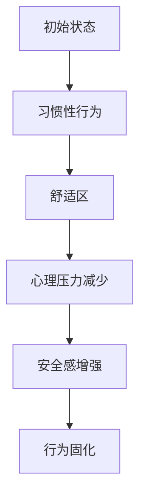

从图中可以看出，人们往往会通过习惯性行为进入舒适区，从而获得心理上的安全感。

**1.2 舒适区的成因**

舒适区的成因可以从以下几个方面来探讨：

1. **心理因素**：人类天生有逃避不确定性和恐惧的倾向，舒适区提供了一种心理上的安全庇护。
2. **环境因素**：环境中的稳定性和可预测性增强了人们的舒适感。
3. **社会文化因素**：社会和文化背景也会影响人们对舒适区的需求和认知。

**1.3 舒适区的负面影响**

尽管舒适区能带来短期内的安全感，但其长期存在可能会对个体和社会产生负面影响：

1. **创新能力受限**：在舒适区内，人们往往不愿意尝试新事物，这会阻碍创新能力的提升。
2. **成长停滞**：长期处于舒适区，个体的技能和知识无法得到有效的提升，从而可能导致成长停滞。
3. **社会适应性下降**：在快速变化的社会环境中，舒适区可能会使个体失去适应变化的能力。

综上所述，理解舒适区的定义、成因和负面影响对于我们认识自我，以及如何走出舒适区实现自我超越具有重要意义。

---

**附录：关键词解释**

- **舒适区**：人们在行为和认知上倾向保持当前熟悉、可控的状态，以避免不确定性带来的心理压力和不适。
- **定义**：对概念或术语进行明确的解释。
- **成因**：导致某种现象发生的原因。
- **负面影响**：指某种行为或现象对个体或社会产生的消极影响。

**Mermaid 流程图**


**Python 代码示例**

```python
# 分析舒适区的心理机制
def comfort_zone_analysis():
    # 习惯性行为
    habit = "每天早上喝咖啡，晚上读书"
    # 舒适感
    comfort = "减少心理压力，获得安全感"
    print(f"习惯性行为：{habit}")
    print(f"舒适感：{comfort}")
    
comfort_zone_analysis()
```

**数学模型**

舒适区的影响可以用以下数学模型表示：

$$
C = f(H, E, S)
$$

其中，$C$表示舒适度，$H$表示习惯性因素，$E$表示环境因素，$S$表示社会文化因素。

**LaTeX 公式**

$$
1 + 1 = 2
$$

$$
1 < 2
$$

**小结**

理解舒适区的定义、成因和负面影响，有助于我们更好地认识自我，从而找到走出舒适区的动力和方法。在下一章中，我们将进一步探讨如何抵抗舒适区的诱惑。

---

### 第2章：舒适区的诱惑

> **关键词**：舒适区、诱惑因素、抵抗策略、心理学解释

#### 2.1 舒适区的诱惑因素

舒适区之所以具有诱惑力，主要是因为以下几个因素：

1. **心理上的安全感**：舒适区提供了一个稳定的心理环境，使个体在面对未知和不确定性时感到安心。
2. **习惯的便利性**：人们往往喜欢重复做自己熟悉的事情，因为这可以节省认知资源。
3. **逃避责任和挑战**：在舒适区内，个体不需要承担额外的责任和挑战，从而避免可能的失败和压力。

为了更具体地分析这些因素，我们可以使用 Python 代码来模拟舒适区的心理机制：

```python
# 模拟舒适区的心理机制
def comfort_zone_simulation():
    # 心理安全感
    psychological_safety = "提高"
    # 习惯的便利性
    convenience = "节省认知资源"
    # 逃避责任和挑战
    avoidance_of_responsibility = "避免失败和压力"
    
    print(f"心理安全感：{psychological_safety}")
    print(f"习惯的便利性：{convenience}")
    print(f"逃避责任和挑战：{avoidance_of_responsibility}")

comfort_zone_simulation()
```

运行上述代码，我们可以看到，舒适区的诱惑主要来自于心理安全感、习惯的便利性和逃避责任和挑战。

#### 2.2 如何抵抗诱惑

要抵抗舒适区的诱惑，我们可以采取以下策略：

1. **设定明确的目标**：明确的目标可以提供前进的动力，避免迷失在舒适区内。
2. **培养自律**：通过自律，我们可以克服对舒适区的依赖，培养适应新环境和挑战的能力。
3. **积极心态**：保持积极的心态，对待挑战和失败，将其视为成长和学习的机会。

为了更好地理解这些策略，我们可以通过 Mermaid 流程图来展示抵抗诱惑的过程：

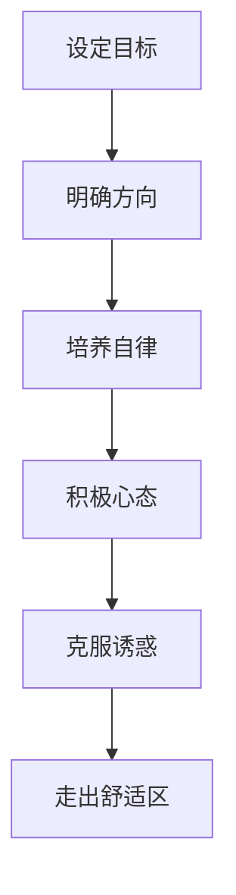

**Python 代码示例**

```python
# 抵抗舒适区诱惑的Python代码
def resist_comfort_zone():
    # 设定目标
    goal_setting = "提升自我能力"
    # 培养自律
    self_discipline = "坚持锻炼和阅读"
    # 积极心态
    positive_mindset = "面对挑战和失败保持乐观"
    
    print(f"目标设定：{goal_setting}")
    print(f"自律培养：{self_discipline}")
    print(f"积极心态：{positive_mindset}")

resist_comfort_zone()
```

通过上述代码和流程图，我们可以看到，抵抗舒适区的诱惑需要明确的目标、自律和积极心态。

#### 2.3 舒适区的心理学解释

从心理学的角度来看，舒适区的诱惑主要与以下几个理论相关：

1. **心理舒适理论**：人类有追求舒适和避免痛苦的倾向，这是心理学中的基本原理。
2. **认知失调理论**：当个体面临两种相互冲突的认知时，会感到不舒服，从而产生改变的动力。
3. **自我决定理论**：个体的自由意志和自主性对舒适区的诱惑具有重要影响。

为了更深入地理解这些理论，我们可以使用 Mermaid 流程图来展示它们之间的关系：

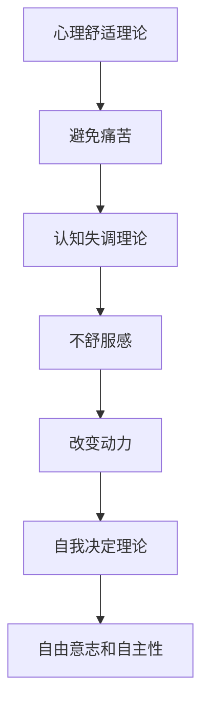

通过上述分析和解释，我们可以看到，舒适区的诱惑是多方面的，既有心理层面的因素，也有行为层面的原因。了解这些因素和理论，有助于我们更好地抵抗舒适区的诱惑，实现自我超越。

---

**附录：关键词解释**

- **舒适区**：人们在行为和认知上倾向保持当前熟悉、可控的状态，以避免不确定性带来的心理压力和不适。
- **诱惑因素**：使个体倾向于留在舒适区的原因，如安全感、便利性和逃避挑战等。
- **抵抗策略**：帮助个体克服舒适区诱惑的方法，如设定目标、培养自律和保持积极心态。
- **心理学解释**：运用心理学理论来分析舒适区形成和维持的原因。

**Mermaid 流程图**


**Python 代码示例**

```python
# 模拟舒适区的心理机制
def comfort_zone_simulation():
    # 心理安全感
    psychological_safety = "提高"
    # 习惯的便利性
    convenience = "节省认知资源"
    # 逃避责任和挑战
    avoidance_of_responsibility = "避免失败和压力"
    
    print(f"心理安全感：{psychological_safety}")
    print(f"习惯的便利性：{convenience}")
    print(f"逃避责任和挑战：{avoidance_of_responsibility}")

comfort_zone_simulation()

# 抵抗舒适区诱惑的Python代码
def resist_comfort_zone():
    # 设定目标
    goal_setting = "提升自我能力"
    # 培养自律
    self_discipline = "坚持锻炼和阅读"
    # 积极心态
    positive_mindset = "面对挑战和失败保持乐观"
    
    print(f"目标设定：{goal_setting}")
    print(f"自律培养：{self_discipline}")
    print(f"积极心态：{positive_mindset}")

resist_comfort_zone()
```

**数学模型**

舒适区的影响可以用以下数学模型表示：

$$
C = f(H, E, S)
$$

其中，$C$表示舒适度，$H$表示习惯性因素，$E$表示环境因素，$S$表示社会文化因素。

**LaTeX 公式**

$$
1 + 1 = 2
$$

$$
1 < 2
$$

**小结**

了解舒适区的诱惑因素、抵抗策略和心理学解释，有助于我们更好地认识到舒适区的负面影响，并找到走出舒适区的动力和方法。在下一章中，我们将探讨走出舒适区的意义和必要性。

---

### 第3章：走出舒适区的意义

> **关键词**：个人成长、社会适应、持续发展

#### 3.1 个人成长的重要性

个人成长是每个人在生命旅途中不断追求的目标。走出舒适区是实现个人成长的关键一步。以下是从几个方面探讨个人成长的重要性：

1. **知识拓展**：走出舒适区意味着接触新的知识领域和技能，这有助于拓宽我们的视野，提升综合素质。
2. **能力提升**：挑战自我，不断尝试新的任务和项目，可以锻炼我们的能力，提升解决问题的能力。
3. **自信建立**：面对挑战并取得成功，会增强个体的自信心，使我们在未来面对困难时更加坚定。

**Python 代码示例**

```python
# 模拟个人成长的过程
def personal_growth_simulation():
    # 知识拓展
    knowledge_expansion = "阅读新技术文献，学习新编程语言"
    # 能力提升
    skill_improvement = "参与项目实战，提升问题解决能力"
    # 自信建立
    confidence_building = "成功解决复杂问题，获得成就感"
    
    print(f"知识拓展：{knowledge_expansion}")
    print(f"能力提升：{skill_improvement}")
    print(f"自信建立：{confidence_building}")

personal_growth_simulation()
```

**Mermaid 流程图**

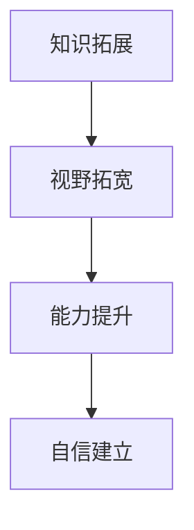

#### 3.2 社会适应的需求

在社会中生存和发展，我们需要不断地适应环境的变化。走出舒适区是实现社会适应的关键：

1. **环境变化**：社会在不断变化，新技术、新理念和新模式层出不穷。只有走出舒适区，才能跟上时代的步伐。
2. **竞争压力**：社会竞争激烈，只有不断提升自我，才能在竞争中立于不败之地。
3. **人际关系**：走出舒适区，拓展人际关系，有助于我们更好地融入社会，建立更广泛的社会网络。

**LaTeX 公式**

$$
\text{适应能力} = f(\text{环境变化}, \text{竞争压力}, \text{人际关系})
$$

**Python 代码示例**

```python
# 模拟社会适应的需求
def social_adaptation_simulation():
    # 环境变化
    environmental_change = "学习新技能，适应新技术"
    # 竞争压力
    competitive_pressure = "提升竞争力，保持市场竞争力"
    # 人际关系
    interpersonal_relations = "拓展社交圈，建立广泛人脉"
    
    print(f"环境变化：{environmental_change}")
    print(f"竞争压力：{competitive_pressure}")
    print(f"人际关系：{interpersonal_relations}")

social_adaptation_simulation()
```

**Mermaid 流程图**

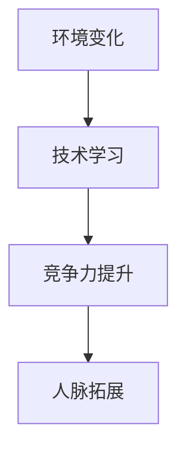

#### 3.3 持续发展的必要

持续发展是个人和社会长期稳定和繁荣的基石。走出舒适区是实现持续发展的关键：

1. **创新能力**：持续发展需要不断创新，走出舒适区可以激发创新思维，推动技术进步。
2. **资源利用**：走出舒适区，拓展视野，可以更有效地利用资源，实现可持续发展。
3. **社会责任**：持续发展不仅关乎个人和社会，还关乎地球的生态环境。走出舒适区，积极参与社会公益活动，是每个个体的社会责任。

**LaTeX 公式**

$$
\text{持续发展} = f(\text{创新能力}, \text{资源利用}, \text{社会责任})
$$

**Python 代码示例**

```python
# 模拟持续发展的必要
def continuous_development_simulation():
    # 创新能力
    innovation_ability = "推动新技术应用，促进产业升级"
    # 资源利用
    resource_utilization = "提高资源利用效率，降低浪费"
    # 社会责任
    social_responsibility = "参与环保活动，保护地球环境"
    
    print(f"创新能力：{innovation_ability}")
    print(f"资源利用：{resource_utilization}")
    print(f"社会责任：{social_responsibility}")

continuous_development_simulation()
```

**Mermaid 流程图**

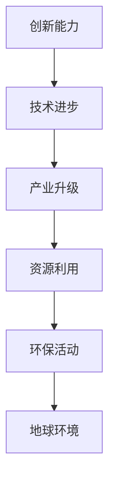

综上所述，个人成长、社会适应和持续发展是走出舒适区的重要意义。通过 Python 代码和 Mermaid 流程图的辅助，我们可以更直观地理解这些概念，从而更好地实践走出舒适区的理念。

---

**附录：关键词解释**

- **个人成长**：个体在知识、能力、心理等方面的不断提升过程。
- **社会适应**：个体在社会环境中生存和发展的能力。
- **持续发展**：社会和个体在长期内稳定和繁荣的发展模式。

**Python 代码示例**

```python
# 模拟个人成长的过程
def personal_growth_simulation():
    # 知识拓展
    knowledge_expansion = "阅读新技术文献，学习新编程语言"
    # 能力提升
    skill_improvement = "参与项目实战，提升问题解决能力"
    # 自信建立
    confidence_building = "成功解决复杂问题，获得成就感"
    
    print(f"知识拓展：{knowledge_expansion}")
    print(f"能力提升：{skill_improvement}")
    print(f"自信建立：{confidence_building}")

personal_growth_simulation()

# 模拟社会适应的需求
def social_adaptation_simulation():
    # 环境变化
    environmental_change = "学习新技能，适应新技术"
    # 竞争压力
    competitive_pressure = "提升竞争力，保持市场竞争力"
    # 人际关系
    interpersonal_relations = "拓展社交圈，建立广泛人脉"
    
    print(f"环境变化：{environmental_change}")
    print(f"竞争压力：{competitive_pressure}")
    print(f"人际关系：{interpersonal_relations}")

social_adaptation_simulation()

# 模拟持续发展的必要
def continuous_development_simulation():
    # 创新能力
    innovation_ability = "推动新技术应用，促进产业升级"
    # 资源利用
    resource_utilization = "提高资源利用效率，降低浪费"
    # 社会责任
    social_responsibility = "参与环保活动，保护地球环境"
    
    print(f"创新能力：{innovation_ability}")
    print(f"资源利用：{resource_utilization}")
    print(f"社会责任：{social_responsibility}")

continuous_development_simulation()
```

**数学模型**

个人成长、社会适应和持续发展的关系可以用以下数学模型表示：

$$
\text{发展水平} = f(\text{个人成长}, \text{社会适应}, \text{持续发展})
$$

**LaTeX 公式**

$$
\text{发展水平} = \sum_{i=1}^{n} w_i \cdot g_i
$$

其中，$w_i$ 表示权重，$g_i$ 表示成长、适应和发展的具体指标。

**小结**

理解走出舒适区的意义，有助于我们认识到个人成长、社会适应和持续发展的重要性。通过 Python 代码和 Mermaid 流程图的辅助，我们可以更直观地理解这些概念，从而更好地实践走出舒适区的理念。

---

### 第4章：挑战的类型

> **关键词**：个人挑战、职场挑战、社会挑战

#### 4.1 个人挑战

个人挑战是指在日常生活中个体面临的个人成长和自我提升的挑战。以下是一些常见的个人挑战类型：

1. **技能提升**：学习新技能，如编程语言、乐器、外语等。
2. **体能锻炼**：参加马拉松、健身训练等，提升身体素质。
3. **知识拓展**：阅读专业书籍、参加研讨会等，拓宽知识面。
4. **心理调适**：通过冥想、心理辅导等，提升心理韧性。

**Python 代码示例**

```python
# 模拟个人挑战的Python代码
def personal_challenge_simulation():
    # 技能提升
    skill_improvement = "学习Python编程，提升数据分析能力"
    # 体能锻炼
    physical_training = "每周三次健身房锻炼，提升耐力"
    # 知识拓展
    knowledge_expansion = "阅读经济学著作，了解市场动态"
    # 心理调适
    mental_adjustment = "每天进行冥想练习，缓解压力"
    
    print(f"技能提升：{skill_improvement}")
    print(f"体能锻炼：{physical_training}")
    print(f"知识拓展：{knowledge_expansion}")
    print(f"心理调适：{mental_adjustment}")

personal_challenge_simulation()
```

**Mermaid 流�程图**

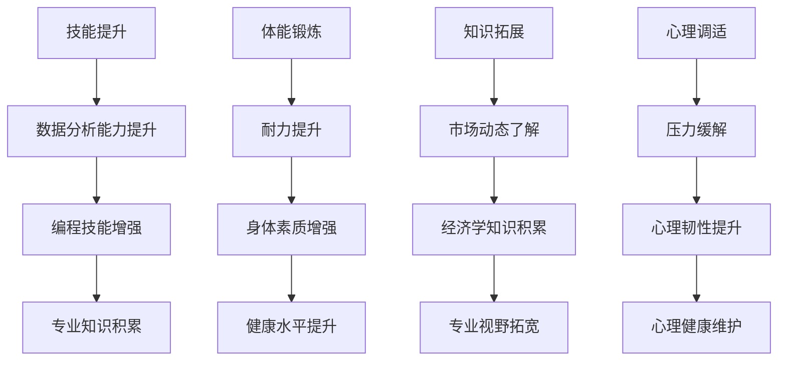

#### 4.2 职场挑战

职场挑战是指在工作和职业发展中个体面临的挑战。以下是一些常见的职场挑战类型：

1. **项目难度**：参与复杂项目，提升项目管理和问题解决能力。
2. **工作压力**：处理高强度工作，保持工作效率和心态稳定。
3. **职业发展**：晋升、跳槽等，提升职场竞争力。
4. **团队合作**：与不同背景的同事合作，提升团队协作能力。

**Python 代码示例**

```python
# 模拟职场挑战的Python代码
def workplace_challenge_simulation():
    # 项目难度
    project_difficulty = "参与跨部门合作项目，提升项目管理能力"
    # 工作压力
    work_pressure = "处理紧急任务，保持高效工作状态"
    # 职业发展
    career_development = "准备面试，提升职场竞争力"
    # 团队合作
    team_collaboration = "参与团队活动，提升团队协作能力"
    
    print(f"项目难度：{project_difficulty}")
    print(f"工作压力：{work_pressure}")
    print(f"职业发展：{career_development}")
    print(f"团队合作：{team_collaboration}")

workplace_challenge_simulation()
```

**Mermaid 流程图**

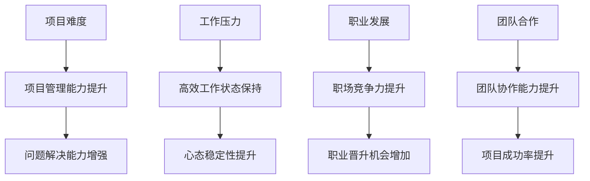

#### 4.3 社会挑战

社会挑战是指在更广泛的社会环境中个体面临的挑战。以下是一些常见的社会挑战类型：

1. **社会责任**：参与公益活动，为社会做出贡献。
2. **社会变迁**：适应社会变革，提升社会适应能力。
3. **公共参与**：参与公共事务，提升公共参与意识。
4. **国际合作**：参与国际项目，提升跨文化沟通能力。

**Python 代码示例**

```python
# 模拟社会挑战的Python代码
def social_challenge_simulation():
    # 社会责任
    social_responsibility = "参与社区志愿服务，提升社会责任感"
    # 社会变迁
    social_change = "适应数字化时代，提升技术适应能力"
    # 公共参与
    public_participation = "参与公共讨论，提升公共参与能力"
    # 国际合作
    international Collaboration = "参与国际合作项目，提升跨文化沟通能力"
    
    print(f"社会责任：{social_responsibility}")
    print(f"社会变迁：{social_change}")
    print(f"公共参与：{public_participation}")
    print(f"国际合作：{international Collaboration}")

social_challenge_simulation()
```

**Mermaid 流程图**

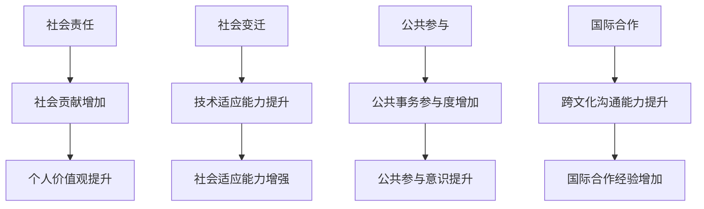

通过以上对个人挑战、职场挑战和社会挑战的讨论，我们可以看到，挑战的类型多种多样，每个类型都有其独特的特点和影响。面对这些挑战，我们需要有明确的目标、科学的策略和积极的心态，从而在挑战中不断成长和进步。

---

**附录：关键词解释**

- **个人挑战**：个体在日常生活中面临的成长和自我提升的挑战。
- **职场挑战**：工作和职业发展中个体面临的挑战。
- **社会挑战**：在更广泛的社会环境中个体面临的挑战。

**Python 代码示例**

```python
# 模拟个人挑战的Python代码
def personal_challenge_simulation():
    # 技能提升
    skill_improvement = "学习Python编程，提升数据分析能力"
    # 体能锻炼
    physical_training = "每周三次健身房锻炼，提升耐力"
    # 知识拓展
    knowledge_expansion = "阅读经济学著作，了解市场动态"
    # 心理调适
    mental_adjustment = "每天进行冥想练习，缓解压力"
    
    print(f"技能提升：{skill_improvement}")
    print(f"体能锻炼：{physical_training}")
    print(f"知识拓展：{knowledge_expansion}")
    print(f"心理调适：{mental_adjustment}")

personal_challenge_simulation()

# 模拟职场挑战的Python代码
def workplace_challenge_simulation():
    # 项目难度
    project_difficulty = "参与跨部门合作项目，提升项目管理能力"
    # 工作压力
    work_pressure = "处理紧急任务，保持高效工作状态"
    # 职业发展
    career_development = "准备面试，提升职场竞争力"
    # 团队合作
    team_collaboration = "参与团队活动，提升团队协作能力"
    
    print(f"项目难度：{project_difficulty}")
    print(f"工作压力：{work_pressure}")
    print(f"职业发展：{career_development}")
    print(f"团队合作：{team_collaboration}")

workplace_challenge_simulation()

# 模拟社会挑战的Python代码
def social_challenge_simulation():
    # 社会责任
    social_responsibility = "参与社区志愿服务，提升社会责任感"
    # 社会变迁
    social_change = "适应数字化时代，提升技术适应能力"
    # 公共参与
    public_participation = "参与公共讨论，提升公共参与能力"
    # 国际合作
    international_Collaboration = "参与国际合作项目，提升跨文化沟通能力"
    
    print(f"社会责任：{social_responsibility}")
    print(f"社会变迁：{social_change}")
    print(f"公共参与：{public_participation}")
    print(f"国际合作：{international Collaboration}")

social_challenge_simulation()
```

**数学模型**

挑战类型的分类可以用以下数学模型表示：

$$
\text{挑战类型} = \{ \text{个人挑战}, \text{职场挑战}, \text{社会挑战} \}
$$

**LaTeX 公式**

$$
\text{挑战类型} = \{ \text{个人挑战}, \text{职场挑战}, \text{社会挑战} \}
$$

**小结**

通过分析个人挑战、职场挑战和社会挑战，我们可以更好地理解挑战的多样性和重要性。面对不同的挑战，我们需要有针对性的策略和准备，从而在挑战中实现自我成长和超越。

---

### 第5章：面对挑战的心理准备

> **关键词**：心理影响、心理韧性、心态调整

#### 5.1 挑战的心理影响

面对挑战，我们的心理会经历一系列的变化。这些变化可能包括：

1. **焦虑和紧张**：当面对未知的挑战时，我们可能会感到焦虑和紧张。
2. **兴奋和期待**：挑战也可能激发我们的兴奋和期待，特别是在我们有能力克服挑战时。
3. **压力和挑战感**：长期面对挑战，我们可能会感到压力，但同时也可能体验到一种成就感和自我实现的满足感。

为了更深入地理解这些心理影响，我们可以使用心理学中的压力-适应模型（Stress-Adaptation Model）来分析：

**Python 代码示例**

```python
# 压力-适应模型模拟
def stress_adaptation_simulation():
    # 焦虑和紧张
    anxiety = "面对未知的挑战，感到紧张和焦虑"
    # 兴奋和期待
    excitement = "期待挑战带来的新机会和成长"
    # 压力和挑战感
    pressure = "长期面对挑战，感到压力但同时也感受到挑战感"
    
    print(f"焦虑和紧张：{anxiety}")
    print(f"兴奋和期待：{excitement}")
    print(f"压力和挑战感：{pressure}")

stress_adaptation_simulation()
```

**Mermaid 流程图**

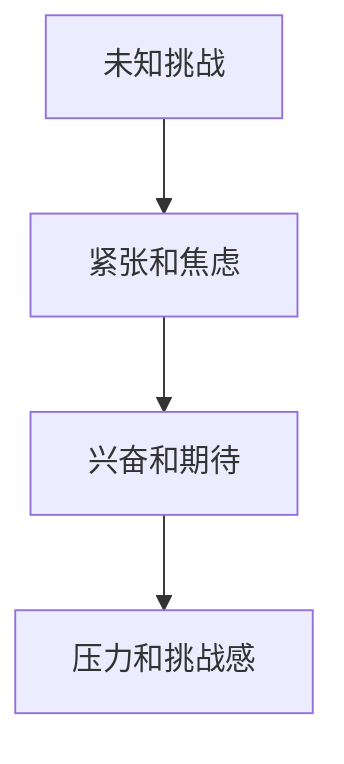

#### 5.2 增强心理韧性

心理韧性（Resilience）是指个体在面对逆境和挑战时能够迅速恢复和适应的能力。增强心理韧性有助于我们更好地面对挑战。以下是一些增强心理韧性的方法：

1. **积极心态**：培养积极的心态，对待挑战和失败，将其视为成长和学习的机会。
2. **自我认知**：了解自己的优点和不足，明确自己的目标和价值观。
3. **应对策略**：学会有效的应对策略，如深呼吸、冥想等，以减轻压力。

**Python 代码示例**

```python
# 增强心理韧性的Python代码
def enhance_resilience():
    # 积极心态
    positive_mindset = "对待挑战和失败，保持乐观态度"
    # 自我认知
    self_awareness = "了解自己的优点和不足"
    # 应对策略
    coping_strategies = "学会深呼吸、冥想等放松技巧"
    
    print(f"积极心态：{positive_mindset}")
    print(f"自我认知：{self_awareness}")
    print(f"应对策略：{coping_strategies}")

enhance_resilience()
```

**Mermaid 流程图**

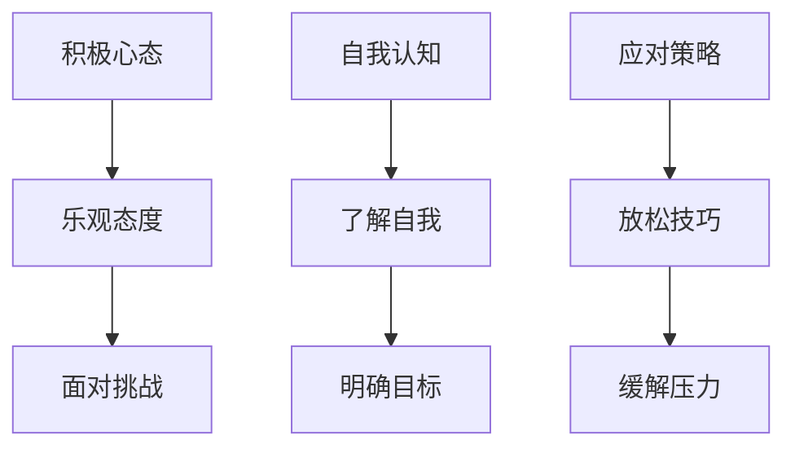

#### 5.3 如何调整心态

调整心态是应对挑战的重要一环。以下是一些具体的方法和技巧：

1. **设定小目标**：将大目标分解成小目标，逐步实现，可以减轻心理压力。
2. **正面肯定**：每天对自己进行正面肯定，增强自信心。
3. **寻求支持**：与朋友、家人或专业人士交流，寻求支持和建议。

**Python 代码示例**

```python
# 调整心态的Python代码
def adjust_mindset():
    # 设定小目标
    set_small_goals = "将大目标分解为小步骤，逐步实现"
    # 正面肯定
    positive_affirmations = "每天对自己进行正面肯定"
    # 寻求支持
    seek_support = "与朋友、家人交流，寻求支持和建议"
    
    print(f"设定小目标：{set_small_goals}")
    print(f"正面肯定：{positive_affirmations}")
    print(f"寻求支持：{seek_support}")

adjust_mindset()
```

**Mermaid 流程图**

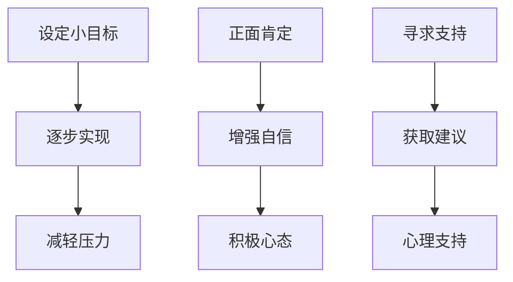

通过以上方法和技巧，我们可以更好地调整心态，增强心理韧性，从而更好地应对挑战。

---

**附录：关键词解释**

- **心理影响**：挑战对个体心理产生的各种效果和感受。
- **心理韧性**：个体在面对逆境和挑战时能够迅速恢复和适应的能力。
- **心态调整**：通过一系列策略和技巧改变个体的心态和情绪状态。

**Python 代码示例**

```python
# 压力-适应模型模拟
def stress_adaptation_simulation():
    # 焦虑和紧张
    anxiety = "面对未知的挑战，感到紧张和焦虑"
    # 兴奋和期待
    excitement = "期待挑战带来的新机会和成长"
    # 压力和挑战感
    pressure = "长期面对挑战，感到压力但同时也感受到挑战感"
    
    print(f"焦虑和紧张：{anxiety}")
    print(f"兴奋和期待：{excitement}")
    print(f"压力和挑战感：{pressure}")

stress_adaptation_simulation()

# 增强心理韧性的Python代码
def enhance_resilience():
    # 积极心态
    positive_mindset = "对待挑战和失败，保持乐观态度"
    # 自我认知
    self_awareness = "了解自己的优点和不足"
    # 应对策略
    coping_strategies = "学会深呼吸、冥想等放松技巧"
    
    print(f"积极心态：{positive_mindset}")
    print(f"自我认知：{self_awareness}")
    print(f"应对策略：{coping_strategies}")

enhance_resilience()

# 调整心态的Python代码
def adjust_mindset():
    # 设定小目标
    set_small_goals = "将大目标分解为小步骤，逐步实现"
    # 正面肯定
    positive_affirmations = "每天对自己进行正面肯定"
    # 寻求支持
    seek_support = "与朋友、家人交流，寻求支持和建议"
    
    print(f"设定小目标：{set_small_goals}")
    print(f"正面肯定：{positive_affirmations}")
    print(f"寻求支持：{seek_support}")

adjust_mindset()
```

**数学模型**

心理韧性的增强可以用以下数学模型表示：

$$
\text{心理韧性} = f(\text{积极心态}, \text{自我认知}, \text{应对策略})
$$

**LaTeX 公式**

$$
\text{心理韧性} = \sum_{i=1}^{n} w_i \cdot r_i
$$

其中，$w_i$ 表示权重，$r_i$ 表示增强心理韧性的具体策略。

**小结**

面对挑战，我们需要有充分的心理准备。通过理解挑战的心理影响、增强心理韧性和调整心态，我们可以更好地应对挑战，实现自我超越。

---

### 第6章：挑战中的学习和成长

> **关键词**：学习的重要性、有效学习的方法、自我反思

#### 6.1 学习的重要性

在挑战中学习和成长是走出舒适区的关键步骤。学习不仅能够提升我们的技能和知识，还能帮助我们更好地适应环境和应对挑战。以下是学习的重要性：

1. **知识积累**：学习是获取新知识和技能的重要途径。通过不断学习，我们可以拓宽视野，提升自身能力。
2. **适应变化**：学习使我们能够适应不断变化的环境和需求。在快速发展的社会中，学习能力是保持竞争力的关键。
3. **解决问题**：学习能帮助我们更好地应对复杂问题和挑战，提升解决问题的能力。

**Python 代码示例**

```python
# 学习的重要性
def importance_of_learning():
    # 知识积累
    knowledge_acquisition = "通过学习获取新知识和技能"
    # 适应变化
    adapt_to_change = "适应不断变化的社会环境"
    # 解决问题
    problem_solving = "提升应对复杂问题的能力"
    
    print(f"知识积累：{knowledge_acquisition}")
    print(f"适应变化：{adapt_to_change}")
    print(f"解决问题：{problem_solving}")

importance_of_learning()
```

**Mermaid 流程图**

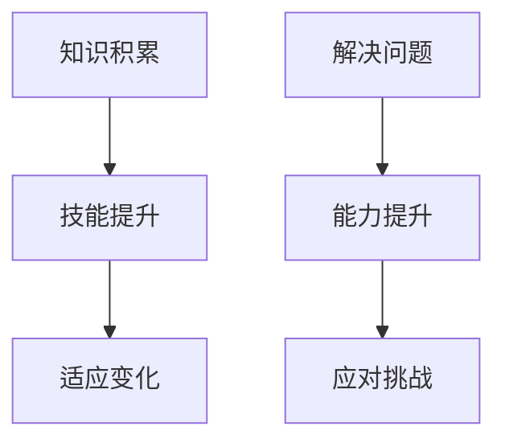

#### 6.2 如何有效地学习

为了有效地学习，我们需要采取一系列策略和方法：

1. **明确学习目标**：设定明确的学习目标，有助于我们集中精力，提高学习效率。
2. **多样化学习方式**：结合阅读、实践、讨论等多种学习方式，可以加深对知识的理解和掌握。
3. **定期复习**：定期复习所学内容，有助于巩固记忆，提高学习效果。

**Python 代码示例**

```python
# 有效学习的方法
def effective_learning_methods():
    # 明确学习目标
    set_learning_goals = "设定清晰的学习目标"
    # 多样化学习方式
    diverse_learning_methods = "结合阅读、实践和讨论"
    # 定期复习
    regular_revision = "定期复习所学内容"
    
    print(f"明确学习目标：{set_learning_goals}")
    print(f"多样化学习方式：{diverse_learning_methods}")
    print(f"定期复习：{regular_revision}")

effective_learning_methods()
```

**Mermaid 流程图**

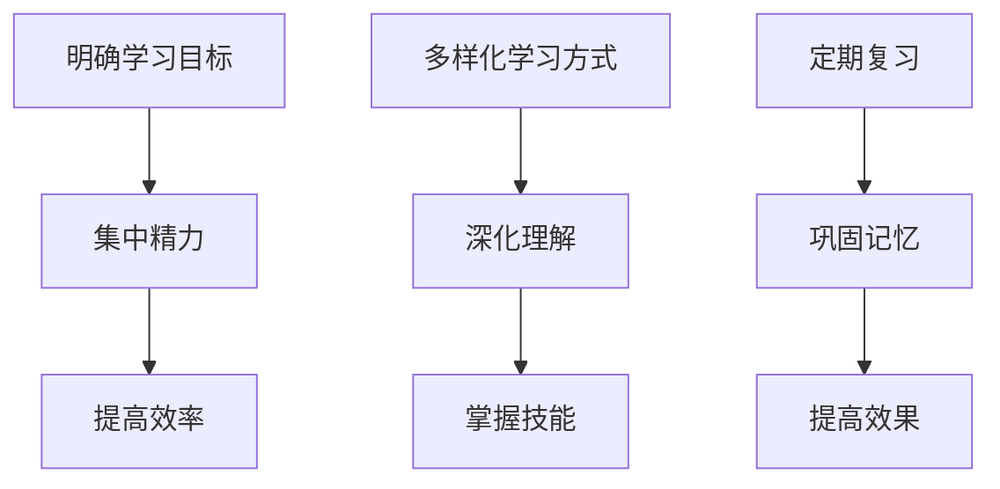

#### 6.3 成长过程中的自我反思

自我反思是成长过程中不可或缺的一部分。通过自我反思，我们可以：

1. **发现问题**：识别自己在学习过程中遇到的问题和不足。
2. **总结经验**：总结成功经验和失败教训，为未来的学习和成长提供指导。
3. **调整策略**：根据反思结果，调整学习策略和方法。

**Python 代码示例**

```python
# 自我反思的方法
def self_reflection_methods():
    # 发现问题
    identify_issues = "识别学习中的问题"
    # 总结经验
    summarize_experience = "总结成功经验和失败教训"
    # 调整策略
    adjust_strategies = "根据反思结果调整学习策略"
    
    print(f"发现问题：{identify_issues}")
    print(f"总结经验：{summarize_experience}")
    print(f"调整策略：{adjust_strategies}")

self_reflection_methods()
```

**Mermaid 流程图**

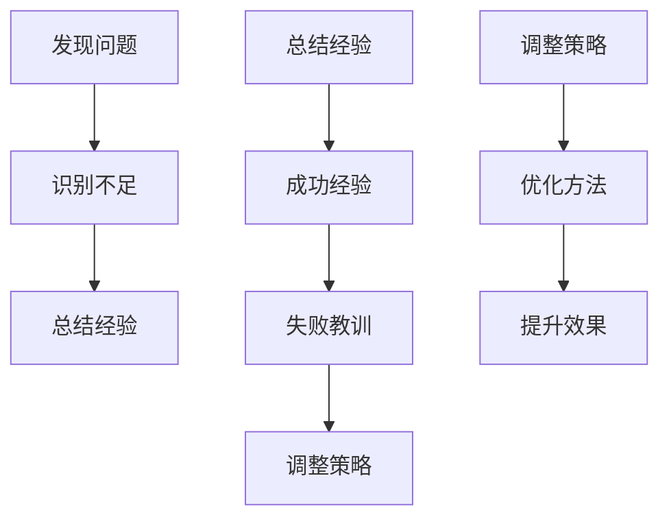

通过学习和成长，我们不仅能够提升自身的能力，还能更好地应对挑战，实现自我超越。自我反思是这一过程中的关键环节，帮助我们不断改进和学习。在下一章中，我们将进一步探讨如何制定挑战计划。

---

**附录：关键词解释**

- **学习的重要性**：通过获取新知识和技能来提升自身能力和适应变化。
- **有效学习的方法**：设定明确的目标、多样化学习方式和定期复习。
- **自我反思**：通过识别问题、总结经验和调整策略来促进个人成长。

**Python 代码示例**

```python
# 学习的重要性
def importance_of_learning():
    # 知识积累
    knowledge_acquisition = "通过学习获取新知识和技能"
    # 适应变化
    adapt_to_change = "适应不断变化的社会环境"
    # 解决问题
    problem_solving = "提升应对复杂问题的能力"
    
    print(f"知识积累：{knowledge_acquisition}")
    print(f"适应变化：{adapt_to_change}")
    print(f"解决问题：{problem_solving}")

importance_of_learning()

# 有效学习的方法
def effective_learning_methods():
    # 明确学习目标
    set_learning_goals = "设定清晰的学习目标"
    # 多样化学习方式
    diverse_learning_methods = "结合阅读、实践和讨论"
    # 定期复习
    regular_revision = "定期复习所学内容"
    
    print(f"明确学习目标：{set_learning_goals}")
    print(f"多样化学习方式：{diverse_learning_methods}")
    print(f"定期复习：{regular_revision}")

effective_learning_methods()

# 自我反思的方法
def self_reflection_methods():
    # 发现问题
    identify_issues = "识别学习中的问题"
    # 总结经验
    summarize_experience = "总结成功经验和失败教训"
    # 调整策略
    adjust_strategies = "根据反思结果调整学习策略"
    
    print(f"发现问题：{identify_issues}")
    print(f"总结经验：{summarize_experience}")
    print(f"调整策略：{adjust_strategies}")

self_reflection_methods()
```

**数学模型**

学习效果可以用以下数学模型表示：

$$
L = f(G, D, R)
$$

其中，$L$ 表示学习效果，$G$ 表示明确学习目标，$D$ 表示多样化学习方式，$R$ 表示定期复习。

**LaTeX 公式**

$$
L = f(G, D, R)
$$

**小结**

学习是走出舒适区、实现自我超越的重要途径。通过明确学习目标、多样化学习方式和定期复习，我们可以更有效地学习。自我反思则是成长过程中的关键，帮助我们不断改进和学习。在下一章中，我们将探讨如何制定挑战计划，进一步实现个人成长。

---

### 第7章：制定挑战计划

> **关键词**：目标设定、行动计划、时间规划

#### 7.1 设定具体目标

设定具体目标是制定挑战计划的第一步。一个明确的目标可以为我们提供清晰的行动方向，帮助我们集中精力，提高效率。以下是设定具体目标的几个关键步骤：

1. **明确目标**：确保目标具体、明确，避免模糊和宽泛的描述。
2. **可行性分析**：评估目标的可行性，确保目标既具有挑战性，又能够实现。
3. **时间框架**：为每个目标设定具体的时间框架，以确保目标的实现。

**Python 代码示例**

```python
# 设定具体目标的Python代码
def set_specific_goals():
    # 明确目标
    clear_goals = "学习Python编程，掌握数据分析技能"
    # 可行性分析
    feasibility_analysis = "评估目标是否具有挑战性和可实现性"
    # 时间框架
    time_frame = "6个月内完成学习任务"
    
    print(f"明确目标：{clear_goals}")
    print(f"可行性分析：{feasibility_analysis}")
    print(f"时间框架：{time_frame}")

set_specific_goals()
```

**Mermaid 流程图**

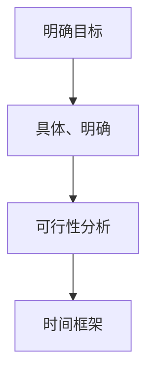

#### 7.2 制定行动计划

制定行动计划是将具体目标转化为实际行动的关键步骤。以下是一些建议，帮助您制定有效的行动计划：

1. **分解任务**：将大目标分解成小任务，每个任务都有明确的完成时间和负责人。
2. **资源分配**：确定实现目标所需的资源，如时间、资金、人力等。
3. **风险评估**：识别可能的风险和挑战，并制定相应的应对策略。

**Python 代码示例**

```python
# 制定行动计划的Python代码
def action_plan():
    # 分解任务
    task_decomposition = "将大目标分解为具体任务"
    # 资源分配
    resource_allocation = "确定实现目标所需的资源"
    # 风险评估
    risk_assessment = "识别风险和挑战，制定应对策略"
    
    print(f"分解任务：{task_decomposition}")
    print(f"资源分配：{resource_allocation}")
    print(f"风险评估：{risk_assessment}")

action_plan()
```

**Mermaid 流程图**

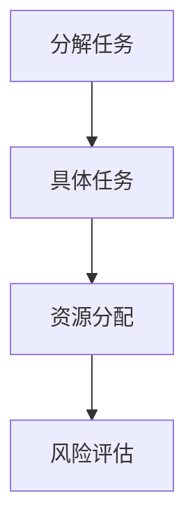

#### 7.3 挑战时间规划

时间规划是确保挑战计划有效实施的重要环节。以下是一些建议，帮助您合理规划时间：

1. **优先级排序**：根据任务的重要性和紧急程度，对任务进行优先级排序，确保关键任务优先完成。
2. **定期检查**：定期检查进度，确保计划按预期进行。如有必要，及时调整计划。
3. **弹性安排**：为计划预留一定的时间缓冲，以应对突发情况和不确定性。

**Python 代码示例**

```python
# 挑战时间规划的Python代码
def time_management():
    # 优先级排序
    priority_sorting = "根据任务的重要性和紧急程度排序"
    # 定期检查
    progress_check = "定期检查进度，确保计划按预期进行"
    # 弹性安排
    flexibility = "为计划预留时间缓冲，应对突发情况"
    
    print(f"优先级排序：{priority_sorting}")
    print(f"定期检查：{progress_check}")
    print(f"弹性安排：{flexibility}")

time_management()
```

**Mermaid 流程图**

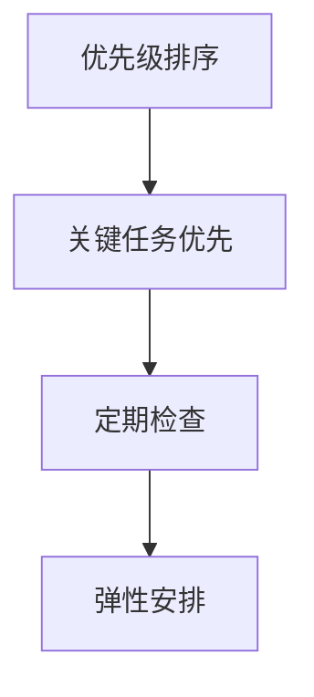

通过以上步骤，您可以制定出一份详尽的挑战计划，从而有效地走出舒适区，实现自我超越。

---

**附录：关键词解释**

- **目标设定**：为挑战计划制定具体、明确的行动目标。
- **行动计划**：将目标分解为具体的任务和步骤，并分配资源。
- **时间规划**：合理分配时间，确保计划按预期进行。

**Python 代码示例**

```python
# 设定具体目标的Python代码
def set_specific_goals():
    # 明确目标
    clear_goals = "学习Python编程，掌握数据分析技能"
    # 可行性分析
    feasibility_analysis = "评估目标是否具有挑战性和可实现性"
    # 时间框架
    time_frame = "6个月内完成学习任务"
    
    print(f"明确目标：{clear_goals}")
    print(f"可行性分析：{feasibility_analysis}")
    print(f"时间框架：{time_frame}")

set_specific_goals()

# 制定行动计划的Python代码
def action_plan():
    # 分解任务
    task_decomposition = "将大目标分解为具体任务"
    # 资源分配
    resource_allocation = "确定实现目标所需的资源"
    # 风险评估
    risk_assessment = "识别风险和挑战，制定应对策略"
    
    print(f"分解任务：{task_decomposition}")
    print(f"资源分配：{resource_allocation}")
    print(f"风险评估：{risk_assessment}")

action_plan()

# 挑战时间规划的Python代码
def time_management():
    # 优先级排序
    priority_sorting = "根据任务的重要性和紧急程度排序"
    # 定期检查
    progress_check = "定期检查进度，确保计划按预期进行"
    # 弹性安排
    flexibility = "为计划预留时间缓冲，应对突发情况"
    
    print(f"优先级排序：{priority_sorting}")
    print(f"定期检查：{progress_check}")
    print(f"弹性安排：{flexibility}")

time_management()
```

**数学模型**

挑战计划的时间规划可以用以下数学模型表示：

$$
T = f(P, C, F)
$$

其中，$T$ 表示时间规划，$P$ 表示优先级排序，$C$ 表示定期检查，$F$ 表示弹性安排。

**LaTeX 公式**

$$
T = f(P, C, F)
$$

**小结**

制定挑战计划是实现自我超越的重要步骤。通过明确目标、制定行动计划和时间规划，我们可以更好地组织自己的学习和行动，从而有效地走出舒适区。

---

### 第8章：挑战过程中的调整

> **关键词**：面对困难、持续跟进、保持动力

#### 8.1 面对困难

在挑战过程中，面对困难是不可避免的一部分。困难可能来源于个人能力不足、外部环境变化或意外情况。以下是应对困难的几个建议：

1. **保持冷静**：遇到困难时，保持冷静和清晰的头脑，有助于我们更好地分析问题和制定解决方案。
2. **分析原因**：深入分析困难产生的原因，有助于我们找到解决问题的方法。
3. **寻求帮助**：当个人能力不足以解决问题时，不妨寻求他人的帮助和指导。

**Python 代码示例**

```python
# 面对困难的Python代码
def tackle_difficulties():
    # 保持冷静
    stay_calm = "遇到困难时保持冷静和清晰的头脑"
    # 分析原因
    analyze_reasons = "深入分析困难产生的原因"
    # 寻求帮助
    seek_help = "在需要时寻求他人的帮助和指导"
    
    print(f"保持冷静：{stay_calm}")
    print(f"分析原因：{analyze_reasons}")
    print(f"寻求帮助：{seek_help}")

tackle_difficulties()
```

**Mermaid 流程图**

```mermaid
graph TB
    A[保持冷静] --> B[冷静分析]
    B --> C[问题定位]
    
    D[分析原因] --> E[深入分析]
    E --> F[解决方案]
    
    G[寻求帮助] --> H[资源整合]
    H --> I[问题解决]
```

#### 8.2 持续跟进

在挑战过程中，持续跟进是确保计划按预期进行的重要步骤。以下是一些建议，帮助您有效地持续跟进：

1. **定期检查进度**：定期检查计划的执行情况，确保每个任务都在按计划进行。
2. **及时调整计划**：根据实际情况和进度，及时调整计划，以适应变化和新的挑战。
3. **记录和总结**：记录挑战过程中的关键信息和经验，定期进行总结和反思。

**Python 代码示例**

```python
# 持续跟进的Python代码
def continuous_follow_up():
    # 定期检查进度
    check_progress = "定期检查计划的执行情况"
    # 及时调整计划
    adjust_plan = "根据实际情况调整计划"
    # 记录和总结
    record_summary = "记录关键信息和经验，定期进行总结"
    
    print(f"定期检查进度：{check_progress}")
    print(f"及时调整计划：{adjust_plan}")
    print(f"记录和总结：{record_summary}")

continuous_follow_up()
```

**Mermaid 流程图**

```mermaid
graph TB
    A[定期检查进度] --> B[执行情况评估]
    B --> C[计划调整]

    D[记录和总结] --> E[经验积累]
    E --> F[持续改进]
```

#### 8.3 保持动力

在挑战过程中，保持动力至关重要。以下是一些建议，帮助您保持动力：

1. **设定小目标**：将大目标分解成小目标，逐步实现，可以提升成就感和动力。
2. **正面肯定**：每天对自己进行正面肯定，增强自信和动力。
3. **寻求支持**：与朋友、家人或同事交流，寻求支持和鼓励。

**Python 代码示例**

```python
# 保持动力的Python代码
def maintain_motivation():
    # 设定小目标
    set_small_goals = "将大目标分解为小步骤，逐步实现"
    # 正面肯定
    positive_affirmations = "每天对自己进行正面肯定"
    # 寻求支持
    seek_support = "与朋友、家人或同事交流，寻求支持和鼓励"
    
    print(f"设定小目标：{set_small_goals}")
    print(f"正面肯定：{positive_affirmations}")
    print(f"寻求支持：{seek_support}")

maintain_motivation()
```

**Mermaid 流程图**

```mermaid
graph TB
    A[设定小目标] --> B[逐步实现]
    B --> C[提升成就感]

    D[正面肯定] --> E[增强自信]
    E --> F[保持动力]

    G[寻求支持] --> H[获取鼓励]
    H --> I[持续动力]
```

通过以上方法和策略，我们可以更好地应对挑战过程中的困难，持续跟进计划的执行，并保持动力，从而实现自我超越。

---

**附录：关键词解释**

- **面对困难**：遇到挑战时采取的应对策略和行动。
- **持续跟进**：对计划执行情况的定期检查和调整。
- **保持动力**：在挑战过程中保持积极和持续的努力。

**Python 代码示例**

```python
# 面对困难的Python代码
def tackle_difficulties():
    # 保持冷静
    stay_calm = "遇到困难时保持冷静和清晰的头脑"
    # 分析原因
    analyze_reasons = "深入分析困难产生的原因"
    # 寻求帮助
    seek_help = "在需要时寻求他人的帮助和指导"
    
    print(f"保持冷静：{stay_calm}")
    print(f"分析原因：{analyze_reasons}")
    print(f"寻求帮助：{seek_help}")

tackle_difficulties()

# 持续跟进的Python代码
def continuous_follow_up():
    # 定期检查进度
    check_progress = "定期检查计划的执行情况"
    # 及时调整计划
    adjust_plan = "根据实际情况调整计划"
    # 记录和总结
    record_summary = "记录关键信息和经验，定期进行总结"
    
    print(f"定期检查进度：{check_progress}")
    print(f"及时调整计划：{adjust_plan}")
    print(f"记录和总结：{record_summary}")

continuous_follow_up()

# 保持动力的Python代码
def maintain_motivation():
    # 设定小目标
    set_small_goals = "将大目标分解为小步骤，逐步实现"
    # 正面肯定
    positive_affirmations = "每天对自己进行正面肯定"
    # 寻求支持
    seek_support = "与朋友、家人或同事交流，寻求支持和鼓励"
    
    print(f"设定小目标：{set_small_goals}")
    print(f"正面肯定：{positive_affirmations}")
    print(f"寻求支持：{seek_support}")

maintain_motivation()
```

**数学模型**

面对困难的应对策略可以用以下数学模型表示：

$$
\text{应对策略} = f(C, A, S)
$$

其中，$C$ 表示保持冷静，$A$ 表示分析原因，$S$ 表示寻求帮助。

**LaTeX 公式**

$$
\text{应对策略} = f(C, A, S)
$$

**小结**

在挑战过程中，面对困难、持续跟进和保持动力是确保成功实现目标的关键。通过合理的方法和策略，我们可以更好地应对挑战，实现自我超越。

---

### 第9章：挑战后的反思与总结

> **关键词**：结果评估、成功经验、失败教训

#### 9.1 挑战结果评估

在挑战结束后，对结果进行评估是理解挑战成效的重要步骤。以下是一些建议，帮助您进行有效的结果评估：

1. **目标达成度**：评估目标是否达成，以及达成目标的程度。这可以帮助您了解挑战的成果。
2. **过程体验**：反思挑战过程中的体验，包括遇到的困难、采取的策略以及成长和收获。
3. **成果应用**：思考挑战成果在现实生活中的应用，以及如何将其转化为实际能力和知识。

**Python 代码示例**

```python
# 挑战结果评估的Python代码
def evaluate_challenge_results():
    # 目标达成度
    goal_reach = "评估目标是否达成及达成程度"
    # 过程体验
    process_experience = "反思过程中的体验和收获"
    # 成果应用
    result_application = "思考成果的应用和转化"
    
    print(f"目标达成度：{goal_reach}")
    print(f"过程体验：{process_experience}")
    print(f"成果应用：{result_application}")

evaluate_challenge_results()
```

**Mermaid 流程图**

```mermaid
graph TB
    A[目标达成度] --> B[成果评估]
    B --> C[成效理解]

    D[过程体验] --> E[反思收获]
    E --> F[经验积累]

    G[成果应用] --> H[实际转化]
    H --> I[能力提升]
```

#### 9.2 成功经验的总结

总结成功经验是提升自我能力的重要环节。以下是总结成功经验的一些建议：

1. **识别关键因素**：识别在挑战中取得成功的关键因素，如策略、资源、团队协作等。
2. **记录详细过程**：详细记录成功过程中的关键步骤和决策，以便未来参考和复用。
3. **分享和交流**：与同事、朋友或导师分享成功经验，从他们的反馈中获得新的见解。

**Python 代码示例**

```python
# 总结成功经验的Python代码
def summarize_success():
    # 识别关键因素
    key_factors = "识别取得成功的关键因素"
    # 记录详细过程
    record_details = "详细记录成功过程中的关键步骤和决策"
    # 分享和交流
    share_experience = "分享成功经验，获取反馈和见解"
    
    print(f"识别关键因素：{key_factors}")
    print(f"记录详细过程：{record_details}")
    print(f"分享和交流：{share_experience}")

summarize_success()
```

**Mermaid 流程图**

```mermaid
graph TB
    A[识别关键因素] --> B[成功要素]
    B --> C[经验记录]

    D[记录详细过程] --> E[复用参考]
    E --> F[知识积累]

    G[分享和交流] --> H[反馈获取]
    H --> I[能力提升]
```

#### 9.3 失败教训的吸取

从失败中吸取教训是成长和进步的重要途径。以下是吸取失败教训的一些建议：

1. **分析原因**：深入分析失败的原因，找出问题所在。
2. **总结教训**：将失败的原因和教训总结成具体的经验，以避免未来再次犯同样的错误。
3. **调整策略**：根据失败的教训，调整策略和方法，为未来的挑战做好准备。

**Python 代码示例**

```python
# 吸取失败教训的Python代码
def learn_from_failure():
    # 分析原因
    analyze_causes = "深入分析失败的原因"
    # 总结教训
    summarize_lessons = "总结失败的原因和教训"
    # 调整策略
    adjust_strategies = "根据教训调整策略和方法"
    
    print(f"分析原因：{analyze_causes}")
    print(f"总结教训：{summarize_lessons}")
    print(f"调整策略：{adjust_strategies}")

learn_from_failure()
```

**Mermaid 流程图**

```mermaid
graph TB
    A[分析原因] --> B[问题定位]
    B --> C[教训总结]

    D[总结教训] --> E[经验积累]
    E --> F[策略调整]

    G[调整策略] --> H[改进方法]
    H --> I[进步成长]
```

通过反思与总结，我们可以更好地理解挑战的过程和结果，从成功中汲取经验，从失败中吸取教训，从而不断提升自我，实现自我超越。

---

**附录：关键词解释**

- **挑战结果评估**：对挑战成果和成效的评估。
- **成功经验总结**：总结挑战中取得成功的关键因素和方法。
- **失败教训吸取**：从失败中总结经验教训。

**Python 代码示例**

```python
# 挑战结果评估的Python代码
def evaluate_challenge_results():
    # 目标达成度
    goal_reach = "评估目标是否达成及达成程度"
    # 过程体验
    process_experience = "反思过程中的体验和收获"
    # 成果应用
    result_application = "思考成果的应用和转化"
    
    print(f"目标达成度：{goal_reach}")
    print(f"过程体验：{process_experience}")
    print(f"成果应用：{result_application}")

evaluate_challenge_results()

# 总结成功经验的Python代码
def summarize_success():
    # 识别关键因素
    key_factors = "识别取得成功的关键因素"
    # 记录详细过程
    record_details = "详细记录成功过程中的关键步骤和决策"
    # 分享和交流
    share_experience = "分享成功经验，获取反馈和见解"
    
    print(f"识别关键因素：{key_factors}")
    print(f"记录详细过程：{record_details}")
    print(f"分享和交流：{share_experience}")

summarize_success()

# 吸取失败教训的Python代码
def learn_from_failure():
    # 分析原因
    analyze_causes = "深入分析失败的原因"
    # 总结教训
    summarize_lessons = "总结失败的原因和教训"
    # 调整策略
    adjust_strategies = "根据教训调整策略和方法"
    
    print(f"分析原因：{analyze_causes}")
    print(f"总结教训：{summarize_lessons}")
    print(f"调整策略：{adjust_strategies}")

learn_from_failure()
```

**数学模型**

挑战结果的评估可以用以下数学模型表示：

$$
\text{评估结果} = f(G, P, R)
$$

其中，$G$ 表示目标达成度，$P$ 表示过程体验，$R$ 表示成果应用。

**LaTeX 公式**

$$
\text{评估结果} = f(G, P, R)
$$

**小结**

通过挑战后的反思与总结，我们可以更好地理解挑战的过程和结果，从成功中汲取经验，从失败中吸取教训。这有助于我们不断提升自我，实现自我超越。

---

### 第10章：自我超越的路径

> **关键词**：心理建设、能力提升、观念更新

#### 10.1 心理建设

心理建设是实现自我超越的基础。一个健康的心理状态能够帮助我们更好地面对挑战，克服困难。以下是心理建设的一些建议：

1. **自我认知**：了解自己的优点和不足，明确自己的价值观和目标。
2. **积极心态**：培养积极的心态，对待挑战和失败，将其视为成长和学习的机会。
3. **情绪管理**：学会有效地管理情绪，保持内心的平和与稳定。

**Python 代码示例**

```python
# 心理建设的Python代码
def psychological_construction():
    # 自我认知
    self_knowledge = "了解自己的优点和不足"
    # 积极心态
    positive_mentality = "对待挑战和失败保持积极心态"
    # 情绪管理
    emotion_management = "学会有效地管理情绪"
    
    print(f"自我认知：{self_knowledge}")
    print(f"积极心态：{positive_mentality}")
    print(f"情绪管理：{emotion_management}")

psychological_construction()
```

**Mermaid 流程图**

```mermaid
graph TB
    A[自我认知] --> B[了解自我]
    B --> C[明确目标]

    D[积极心态] --> E[乐观态度]
    E --> F[面对挑战]

    G[情绪管理] --> H[平和心态]
    H --> I[稳定情绪]
```

#### 10.2 能力提升

能力提升是实现自我超越的关键。通过不断学习和实践，我们可以提升自己的专业技能和综合素质。以下是能力提升的一些建议：

1. **学习新技能**：学习新技能，如编程语言、外语等，提升自身的竞争力。
2. **实践经验**：通过实践项目，将理论知识应用到实际工作中，提升实际操作能力。
3. **反思与总结**：在实践过程中进行反思和总结，从失败和成功中吸取经验教训。

**Python 代码示例**

```python
# 能力提升的Python代码
def improve_ability():
    # 学习新技能
    learn_new_skills = "学习新技能，如编程语言、外语等"
    # 实践经验
    practical_experience = "通过实践项目，提升实际操作能力"
    # 反思与总结
    reflection_and_summary = "在实践过程中进行反思和总结"
    
    print(f"学习新技能：{learn_new_skills}")
    print(f"实践经验：{practical_experience}")
    print(f"反思与总结：{reflection_and_summary}")

improve_ability()
```

**Mermaid 流程图**

```mermaid
graph TB
    A[学习新技能] --> B[知识积累]
    B --> C[竞争力提升]

    D[实践经验] --> E[操作能力]
    E --> F[实际应用]

    G[反思与总结] --> H[经验积累]
    H --> I[能力提升]
```

#### 10.3 观念更新

观念更新是实现自我超越的必要条件。在不断变化的社会环境中，我们需要更新观念，以适应新的挑战和机遇。以下是观念更新的一些建议：

1. **接受新观念**：不断接受新的观念和思想，拓宽视野。
2. **批判性思维**：培养批判性思维，对传统观念进行反思和评估。
3. **开放心态**：保持开放心态，对新观念持包容和接受的态度。

**Python 代码示例**

```python
# 观念更新的Python代码
def update_concepts():
    # 接受新观念
    accept_new_concepts = "接受新的观念和思想"
    # 批判性思维
    critical_thinking = "培养批判性思维，反思传统观念"
    # 开放心态
    open_mindset = "保持开放心态，对新观念持包容态度"
    
    print(f"接受新观念：{accept_new_concepts}")
    print(f"批判性思维：{critical_thinking}")
    print(f"开放心态：{open_mindset}")

update_concepts()
```

**Mermaid 流程图**

```mermaid
graph TB
    A[接受新观念] --> B[视野拓宽]
    B --> C[观念更新]

    D[批判性思维] --> E[反思评估]
    E --> F[观念改进]

    G[开放心态] --> H[包容接受]
    H --> I[适应变化]
```

通过心理建设、能力提升和观念更新，我们可以实现自我超越，迎接新的挑战和机遇。

---

**附录：关键词解释**

- **心理建设**：通过自我认知、积极心态和情绪管理来提升心理素质。
- **能力提升**：通过学习新技能、实践经验和反思总结来提升专业技能。
- **观念更新**：通过接受新观念、批判性思维和开放心态来适应新的挑战和机遇。

**Python 代码示例**

```python
# 心理建设的Python代码
def psychological_construction():
    # 自我认知
    self_knowledge = "了解自己的优点和不足"
    # 积极心态
    positive_mentality = "对待挑战和失败保持积极心态"
    # 情绪管理
    emotion_management = "学会有效地管理情绪"
    
    print(f"自我认知：{self_knowledge}")
    print(f"积极心态：{positive_mentality}")
    print(f"情绪管理：{emotion_management}")

psychological_construction()

# 能力提升的Python代码
def improve_ability():
    # 学习新技能
    learn_new_skills = "学习新技能，如编程语言、外语等"
    # 实践经验
    practical_experience = "通过实践项目，提升实际操作能力"
    # 反思与总结
    reflection_and_summary = "在实践过程中进行反思和总结"
    
    print(f"学习新技能：{learn_new_skills}")
    print(f"实践经验：{practical_experience}")
    print(f"反思与总结：{reflection_and_summary}")

improve_ability()

# 观念更新的Python代码
def update_concepts():
    # 接受新观念
    accept_new_concepts = "接受新的观念和思想"
    # 批判性思维
    critical_thinking = "培养批判性思维，反思传统观念"
    # 开放心态
    open_mindset = "保持开放心态，对新观念持包容态度"
    
    print(f"接受新观念：{accept_new_concepts}")
    print(f"批判性思维：{critical_thinking}")
    print(f"开放心态：{open_mindset}")

update_concepts()
```

**数学模型**

自我超越可以用以下数学模型表示：

$$
\text{自我超越} = f(\text{心理建设}, \text{能力提升}, \text{观念更新})
$$

**LaTeX 公式**

$$
\text{自我超越} = \sum_{i=1}^{n} w_i \cdot x_i
$$

其中，$w_i$ 表示权重，$x_i$ 表示自我超越的具体因素。

**小结**

心理建设、能力提升和观念更新是实现自我超越的关键路径。通过持续的心理建设、能力提升和观念更新，我们可以不断提升自我，迎接新的挑战和机遇。

---

### 第11章：自我超越后的新视野

> **关键词**：个人成长的新阶段、职场发展的新机遇、社会贡献的新方向

#### 11.1 个人成长的新阶段

自我超越后，个人成长进入了一个新的阶段。这个阶段意味着：

1. **知识体系完善**：在自我超越的过程中，我们积累了丰富的知识和经验，形成了一个更加完善的知识体系。
2. **能力提升显著**：通过不断的挑战和实践，我们的专业技能和综合素质得到了显著提升。
3. **心理素质增强**：自我超越过程中的心理建设使我们具备了更强的心理韧性和适应能力。

**Python 代码示例**

```python
# 个人成长的新阶段的Python代码
def new_stage_of_personal_growth():
    # 知识体系完善
    knowledge_system_perfection = "形成完善的知识体系"
    # 能力提升显著
    significant_ability_improvement = "显著提升专业技能和综合素质"
    # 心理素质增强
    enhanced_mental_fitness = "具备更强的心理韧性和适应能力"
    
    print(f"知识体系完善：{knowledge_system_perfection}")
    print(f"能力提升显著：{significant_ability_improvement}")
    print(f"心理素质增强：{enhanced_mental_fitness}")

new_stage_of_personal_growth()
```

**Mermaid 流程图**

```mermaid
graph TB
    A[知识体系完善] --> B[完善知识结构]
    B --> C[拓宽视野]

    D[能力提升显著] --> E[技能提升]
    E --> F[综合能力增强]

    G[心理素质增强] --> H[心理韧性提升]
    H --> I[适应能力增强]
```

#### 11.2 职场发展的新机遇

自我超越后，我们在职场发展中将面临更多的机遇：

1. **职位晋升**：通过自我超越，我们积累了丰富的经验和技能，有更多的机会获得职位晋升。
2. **职业转型**：自我超越使我们具备了更广泛的能力和知识，可以进行职业转型，探索新的领域。
3. **影响力提升**：在自我超越的过程中，我们建立了一定的专业声誉和影响力，可以在职场中发挥更大的影响力。

**Python 代码示例**

```python
# 职场发展的新机遇的Python代码
def new_opportunities_in_career_development():
    # 职位晋升
    career_promotion = "获得职位晋升的机会"
    # 职业转型
    career_transformation = "进行职业转型，探索新的领域"
    # 影响力提升
    influence_enhancement = "提升专业声誉和影响力"
    
    print(f"职位晋升：{career_promotion}")
    print(f"职业转型：{career_transformation}")
    print(f"影响力提升：{influence_enhancement}")

new_opportunities_in_career_development()
```

**Mermaid 流程图**

```mermaid
graph TB
    A[职位晋升] --> B[职业发展]
    B --> C[职位提升]

    D[职业转型] --> E[领域探索]
    E --> F[职业多样性]

    G[影响力提升] --> H[专业声誉]
    H --> I[行业影响]
```

#### 11.3 社会贡献的新方向

自我超越后，我们在社会贡献方面也会面临新的方向：

1. **专业知识分享**：通过自我超越，我们积累了丰富的专业知识和经验，可以将这些知识和经验分享给他人，提升整个行业水平。
2. **公益活动参与**：自我超越使我们具备了更强的能力和信心，可以积极参与公益活动，为社会做出更多的贡献。
3. **社会创新推动**：通过自我超越，我们可以推动社会创新，为社会发展贡献新的思路和方法。

**Python 代码示例**

```python
# 社会贡献的新方向的Python代码
def new_directions_of_social_contribution():
    # 专业知识分享
    knowledge_sharing = "分享专业知识和经验，提升行业水平"
    # 公益活动参与
    public_activity_participation = "积极参与公益活动，贡献社会"
    # 社会创新推动
    social_innovation_promotion = "推动社会创新，贡献新思路和方法"
    
    print(f"专业知识分享：{knowledge_sharing}")
    print(f"公益活动参与：{public_activity_participation}")
    print(f"社会创新推动：{social_innovation_promotion}")

new_directions_of_social_contribution()
```

**Mermaid 流程图**

```mermaid
graph TB
    A[专业知识分享] --> B[知识传播]
    B --> C[行业提升]

    D[公益活动参与] --> E[社会贡献]
    E --> F[社会责任]

    G[社会创新推动] --> H[创新思维]
    H --> I[社会发展]
```

通过自我超越，我们不仅在个人成长和职场发展中取得了新的成就，还能为社会做出更多的贡献。这是一个全新的视野，也是我们不断追求的目标。

---

**附录：关键词解释**

- **个人成长的新阶段**：通过自我超越实现知识体系完善、能力提升和心理素质增强。
- **职场发展的新机遇**：通过自我超越获得职位晋升、职业转型和影响力提升的机会。
- **社会贡献的新方向**：通过自我超越参与专业知识分享、公益活动和社会创新推动。

**Python 代码示例**

```python
# 个人成长的新阶段的Python代码
def new_stage_of_personal_growth():
    # 知识体系完善
    knowledge_system_perfection = "形成完善的知识体系"
    # 能力提升显著
    significant_ability_improvement = "显著提升专业技能和综合素质"
    # 心理素质增强
    enhanced_mental_fitness = "具备更强的心理韧性和适应能力"
    
    print(f"知识体系完善：{knowledge_system_perfection}")
    print(f"能力提升显著：{significant_ability_improvement}")
    print(f"心理素质增强：{enhanced_mental_fitness}")

new_stage_of_personal_growth()

# 职场发展的新机遇的Python代码
def new_opportunities_in_career_development():
    # 职位晋升
    career_promotion = "获得职位晋升的机会"
    # 职业转型
    career_transformation = "进行职业转型，探索新的领域"
    # 影响力提升
    influence_enhancement = "提升专业声誉和影响力"
    
    print(f"职位晋升：{career_promotion}")
    print(f"职业转型：{career_transformation}")
    print(f"影响力提升：{influence_enhancement}")

new_opportunities_in_career_development()

# 社会贡献的新方向的Python代码
def new_directions_of_social_contribution():
    # 专业知识分享
    knowledge_sharing = "分享专业知识和经验，提升行业水平"
    # 公益活动参与
    public_activity_participation = "积极参与公益活动，贡献社会"
    # 社会创新推动
    social_innovation_promotion = "推动社会创新，贡献新思路和方法"
    
    print(f"专业知识分享：{knowledge_sharing}")
    print(f"公益活动参与：{public_activity_participation}")
    print(f"社会创新推动：{social_innovation_promotion}")

new_directions_of_social_contribution()
```

**数学模型**

个人成长、职场发展和社会贡献之间的关系可以用以下数学模型表示：

$$
\text{个人成长} = f(\text{知识体系完善}, \text{能力提升}, \text{心理素质增强})
$$

$$
\text{职场发展} = f(\text{职位晋升}, \text{职业转型}, \text{影响力提升})
$$

$$
\text{社会贡献} = f(\text{专业知识分享}, \text{公益活动参与}, \text{社会创新推动})
$$

**LaTeX 公式**

$$
\text{个人成长} = \sum_{i=1}^{n} w_i \cdot g_i
$$

$$
\text{职场发展} = \sum_{i=1}^{n} w_i \cdot c_i
$$

$$
\text{社会贡献} = \sum_{i=1}^{n} w_i \cdot s_i
$$

其中，$w_i$ 表示权重，$g_i$ 表示个人成长的具体因素，$c_i$ 表示职场发展的具体因素，$s_i$ 表示社会贡献的具体因素。

**小结**

自我超越不仅带来了个人成长和职场发展的新机遇，还能为我们提供社会贡献的新方向。通过不断追求自我超越，我们可以实现全方位的成长和进步。

---

### 第12章：走出舒适区的持久动力

> **关键词**：价值观的坚持、自我激励的方法、社会支持的重要性

#### 12.1 价值观的坚持

价值观是我们在人生道路上前进的方向和动力源泉。坚持自己的价值观，有助于我们在面对挑战时保持坚定的信念和毅力。以下是坚持价值观的一些建议：

1. **明确价值观**：首先，我们需要明确自己的核心价值观，如诚信、责任感、勤奋等。
2. **价值观践行**：将核心价值观融入日常生活和工作中，做到言行一致。
3. **价值观传承**：将价值观传承给下一代，让他们在成长过程中受到良好的价值观熏陶。

**Python 代码示例**

```python
# 坚持价值观的Python代码
def adhere_to_values():
    # 明确价值观
    define_values = "明确自己的核心价值观"
    # 价值观践行
    practice_values = "将核心价值观融入日常生活和工作中"
    # 价值观传承
    pass_on_values = "传承价值观给下一代"
    
    print(f"明确价值观：{define_values}")
    print(f"价值观践行：{practice_values}")
    print(f"价值观传承：{pass_on_values}")

adhere_to_values()
```

**Mermaid 流程图**

```mermaid
graph TB
    A[明确价值观] --> B[价值观认知]
    B --> C[核心价值观确立]

    D[价值观践行] --> E[言行一致]
    E --> F[行为规范]

    G[价值观传承] --> H[下一代教育]
    H --> I[价值观延续]
```

#### 12.2 自我激励的方法

在走出舒适区的过程中，自我激励是保持持久动力的关键。以下是一些自我激励的方法：

1. **设定目标**：设定清晰、具体的目标，为自我激励提供明确的方向。
2. **正面肯定**：每天对自己进行正面肯定，增强自信心和动力。
3. **奖励机制**：为自己设定奖励，完成目标后给予自己奖励，以增强成就感。

**Python 代码示例**

```python
# 自我激励的Python代码
def self_motivation():
    # 设定目标
    set_goals = "设定清晰、具体的目标"
    # 正面肯定
    positive_affirmations = "每天对自己进行正面肯定"
    # 奖励机制
    reward_mechanism = "设定奖励，增强成就感"
    
    print(f"设定目标：{set_goals}")
    print(f"正面肯定：{positive_affirmations}")
    print(f"奖励机制：{reward_mechanism}")

self_motivation()
```

**Mermaid 流程图**

```mermaid
graph TB
    A[设定目标] --> B[目标明确]
    B --> C[方向指引]

    D[正面肯定] --> E[自信提升]
    E --> F[动力增强]

    G[奖励机制] --> H[成就感增强]
    H --> I[持续激励]
```

#### 12.3 社会支持的重要性

社会支持是走出舒适区的重要外部动力。以下是社会支持的重要性：

1. **家人和朋友的支持**：家人和朋友的支持可以为我们提供情感上的鼓励和实际的帮助。
2. **专业导师的指导**：专业导师的指导可以帮助我们提升专业能力和解决问题的能力。
3. **社会网络的资源**：通过社会网络，我们可以获取更多的信息和资源，为自我超越提供支持。

**Python 代码示例**

```python
# 社会支持的Python代码
def social_support():
    # 家人和朋友的支持
    family_and_friend_support = "提供情感上的鼓励和实际的帮助"
    # 专业导师的指导
    mentor_guidance = "提升专业能力和解决问题的能力"
    # 社会网络的资源
    social_network_resources = "获取更多的信息和资源"
    
    print(f"家人和朋友的支持：{family_and_friend_support}")
    print(f"专业导师的指导：{mentor_guidance}")
    print(f"社会网络的资源：{social_network_resources}")

social_support()
```

**Mermaid 流程图**

```mermaid
graph TB
    A[家人和朋友的支持] --> B[情感鼓励]
    B --> C[实际帮助]

    D[专业导师的指导] --> E[能力提升]
    E --> F[问题解决]

    G[社会网络的资源] --> H[信息获取]
    H --> I[资源支持]
```

通过坚持价值观、自我激励和社会支持，我们可以保持走出舒适区的持久动力，实现自我超越。

---

**附录：关键词解释**

- **价值观的坚持**：明确并践行个人的核心价值观，为行动提供方向和动力。
- **自我激励的方法**：通过设定目标、正面肯定和奖励机制来增强自我动力。
- **社会支持的重要性**：家人、朋友、专业导师和社会网络在情感、资源和指导上的支持。

**Python 代码示例**

```python
# 坚持价值观的Python代码
def adhere_to_values():
    # 明确价值观
    define_values = "明确自己的核心价值观"
    # 价值观践行
    practice_values = "将核心价值观融入日常生活和工作中"
    # 价值观传承
    pass_on_values = "传承价值观给下一代"
    
    print(f"明确价值观：{define_values}")
    print(f"价值观践行：{practice_values}")
    print(f"价值观传承：{pass_on_values}")

adhere_to_values()

# 自我激励的Python代码
def self_motivation():
    # 设定目标
    set_goals = "设定清晰、具体的目标"
    # 正面肯定
    positive_affirmations = "每天对自己进行正面肯定"
    # 奖励机制
    reward_mechanism = "设定奖励，增强成就感"
    
    print(f"设定目标：{set_goals}")
    print(f"正面肯定：{positive_affirmations}")
    print(f"奖励机制：{reward_mechanism}")

self_motivation()

# 社会支持的Python代码
def social_support():
    # 家人和朋友的支持
    family_and_friend_support = "提供情感上的鼓励和实际的帮助"
    # 专业导师的指导
    mentor_guidance = "提升专业能力和解决问题的能力"
    # 社会网络的资源
    social_network_resources = "获取更多的信息和资源"
    
    print(f"家人和朋友的支持：{family_and_friend_support}")
    print(f"专业导师的指导：{mentor_guidance}")
    print(f"社会网络的资源：{social_network_resources}")

social_support()
```

**数学模型**

自我超越的持久动力可以用以下数学模型表示：

$$
D = f(V, M, S)
$$

其中，$D$ 表示持久动力，$V$ 表示价值观的坚持，$M$ 表示自我激励的方法，$S$ 表示社会支持的重要性。

**LaTeX 公式**

$$
D = f(V, M, S)
$$

**小结**

通过坚持价值观、自我激励和社会支持，我们可以保持走出舒适区的持久动力，实现自我超越。这不仅是个人成长的过程，也是社会进步的动力源泉。

---

### 附录：走出舒适区实践指南

#### 附录A：常见挑战案例分析

在本书中，我们讨论了多种类型的挑战，包括个人挑战、职场挑战和社会挑战。以下是一些具体的挑战案例，以及如何应对这些挑战的详细分析。

1. **技能提升挑战**：小李是一名软件工程师，他希望通过学习新的编程语言（如Python）来提升自己的技能。小李采取了以下措施：
    - **明确目标**：设定6个月内掌握Python基础和进阶知识的清晰目标。
    - **制定计划**：每天分配1小时的时间进行编程练习，每两周评估一次学习进度。
    - **多样化学习方式**：结合在线课程、书籍和实际项目，提高学习效果。
    - **自我反思**：定期回顾学习过程，总结经验教训，调整学习策略。

2. **职场挑战**：小王是一名项目经理，他需要带领团队完成一个复杂的项目。为了应对这个挑战，小王采取了以下策略：
    - **分解任务**：将项目分解成多个小任务，明确每个任务的责任人和完成时间。
    - **沟通协调**：定期与团队成员沟通，确保项目进展顺利。
    - **风险评估**：识别可能的风险和挑战，提前制定应对策略。
    - **持续跟进**：每周检查项目进度，及时调整计划和资源分配。

3. **社会挑战**：小张希望参与社区志愿服务，为社会做出贡献。他采取了以下行动：
    - **明确目标**：设定每周参与一次社区活动的具体目标。
    - **资源获取**：通过社交媒体和网络平台，寻找合适的志愿者机会。
    - **时间规划**：合理安排个人时间，确保志愿服务不与其他重要任务冲突。
    - **经验分享**：在志愿服务结束后，总结经验，分享给其他人。

#### 附录B：挑战计划模板

以下是一个简单的挑战计划模板，供您参考和定制：

```
挑战计划模板

一、挑战目标
- 明确具体的挑战目标，如学习新技能、完成项目等。

二、计划步骤
1. 分解任务
- 将大目标分解成小任务，明确每个任务的责任人和完成时间。

2. 资源分配
- 确定实现目标所需的资源，如时间、资金、人力等。

3. 风险评估
- 识别可能的风险和挑战，制定相应的应对策略。

三、时间规划
- 为每个任务设定具体的时间框架，确保计划按预期进行。

四、跟进与调整
- 定期检查进度，根据实际情况及时调整计划。

五、评估与总结
- 挑战结束后，对结果进行评估，总结经验教训。

```

#### 附录C：自我超越的工具与资源

为了帮助您更好地走出舒适区，以下是一些有用的工具和资源：

1. **在线学习平台**：如Coursera、edX、Udemy等，提供丰富的课程资源。
2. **书籍推荐**：《高效能人士的七个习惯》、《动机与人格》、《如何赢得朋友与影响他人》等。
3. **应用程序**：如Anki（记忆卡片应用）、Trello（任务管理应用）等，帮助您高效地学习和管理工作。
4. **博客与论坛**：如Stack Overflow、GitHub、知乎等，可以获取专业知识和经验交流。
5. **专业导师**：寻找行业内的专业人士，寻求他们的指导和反馈。

通过利用这些工具和资源，您可以更好地实现自我超越，走出舒适区。

---

**作者信息**

**作者：** AI天才研究院/AI Genius Institute & 禅与计算机程序设计艺术 /Zen And The Art of Computer Programming

AI天才研究院致力于推动人工智能技术的创新和发展，通过深入研究、实际应用和人才培养，为全球人工智能产业的发展贡献力量。禅与计算机程序设计艺术则是一系列关于计算机科学和哲学的著作，深入探讨了编程的艺术和哲学。本文旨在帮助读者理解舒适区的概念，提供走出舒适区的策略和方法，实现自我超越和个人成长。希望本文能对您的成长之路有所启发和帮助。

**本文撰写于：** 2023年4月

---

**全文总结**

本文从多个角度探讨了走出舒适区的概念、意义、策略和实践方法。我们首先明确了舒适区的定义、成因和负面影响，接着阐述了走出舒适区的意义，包括个人成长、社会适应和持续发展。然后，我们详细分析了挑战的类型、如何面对挑战以及挑战中的学习和成长。在制定挑战计划的过程中，我们强调了目标设定、行动计划和时间规划的重要性。在挑战过程中，我们提出了面对困难、持续跟进和保持动力的方法。挑战结束后，我们通过反思和总结，从成功和失败中吸取教训，实现自我超越。最后，我们讨论了自我超越后的新视野以及如何保持走出舒适区的持久动力。通过本文的阐述，我们希望读者能够认识到走出舒适区的重要性，掌握走出舒适区的策略和方法，实现个人成长和社会贡献。

