                 

### 第1章：消费主义的起源与演变

#### 1.1.1 消费主义的定义与特点

消费主义是一种社会现象，指的是以消费作为主要生活目标和价值观的现象。其核心在于追求物质享受，强调消费行为的重要性。以下是消费主义的主要特点：

1. **物质导向**：消费主义强调物质消费，追求时尚、名牌和奢侈品，认为物质拥有能够提升个人的社会地位和生活质量。
2. **消费至上**：在消费主义文化中，消费行为被赋予极高的价值，成为一种衡量个人成功和幸福的标准。
3. **品牌崇拜**：消费者往往对品牌有强烈的忠诚度，追求品牌的象征意义和社会认同。
4. **消费压力**：社会中的消费主义氛围往往给人们带来巨大的消费压力，导致过度消费和债务问题。

#### 1.1.2 消费主义的历史背景

消费主义并非现代社会独有的现象，其历史可以追溯到古代。以下是消费主义发展的几个重要阶段：

1. **古代消费主义**：在古代，消费主义主要表现为贵族和富人对奢侈品的追求，如珠宝、服饰和家具等。
2. **工业革命后的消费主义**：随着工业革命的发展，生产力的提高和商品种类的丰富，消费主义逐渐兴起。特别是在20世纪初，汽车、电视等耐用消费品的普及，使得消费主义进入了一个新的阶段。
3. **现代消费主义**：20世纪后半叶，消费主义在全球范围内迅速扩散，特别是在发达国家，消费成为经济增长的主要驱动力。随着互联网和电子商务的兴起，消费主义进一步加速。

#### 1.1.3 消费主义对经济的影响

消费主义对经济产生了深远的影响：

1. **促进经济增长**：消费主义通过增加消费需求和促进生产，推动了经济增长。特别是在工业化国家，消费主义被视为经济增长的主要动力。
2. **产业结构调整**：消费主义的兴起导致了产业结构的调整，从传统的制造业向服务业和高新技术产业转型。
3. **就业机会增加**：随着消费需求的增加，企业需要更多的劳动力来满足生产和服务需求，从而创造了更多的就业机会。

然而，消费主义也存在一些负面影响，如资源浪费、环境污染和社会不平等。这些问题的解决需要我们深入反思消费主义的本质，并探索可持续的消费模式。

#### Mermaid 流程图

为了更好地理解消费主义的发展过程，我们可以使用Mermaid流程图来展示其历史背景：

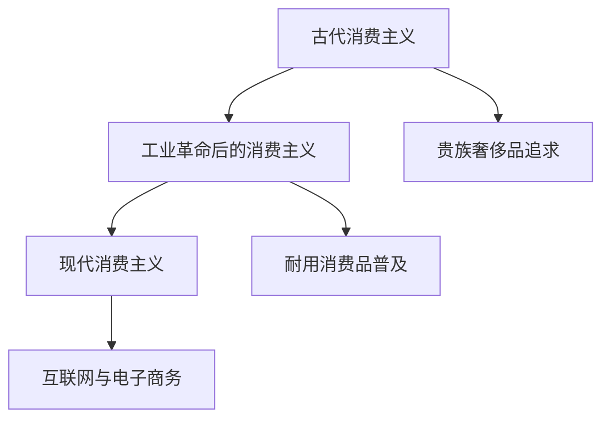

这个流程图清晰地展示了消费主义从古代到现代的发展历程及其主要特点。

---

### 第2章：消费主义对个体生活的影响

#### 2.1.1 消费主义与心理健康

消费主义对个体的心理健康产生了深远的影响。首先，过度追求物质享受和消费可能导致焦虑和压力。研究表明，消费者在面对不断上升的物价和消费需求时，往往会感到压力增加，从而影响心理健康。此外，消费主义文化中的“比较心理”也容易导致个体感到不满和焦虑。

为了应对这些问题，个体可以采取以下方法：

1. **理性消费**：通过制定预算和理性购买，减少不必要的消费，从而降低压力和焦虑。
2. **自我反思**：定期进行自我反思，了解自己的真实需求和欲望，避免盲目跟风和过度消费。
3. **心理健康教育**：通过参与心理健康教育和咨询，提高个体的心理素质，增强对消费主义的抵抗力。

#### 2.1.2 消费主义与人际关系

消费主义不仅影响个体的心理健康，还对其人际关系产生重大影响。在消费主义文化中，物质财富往往被用来衡量个人价值和社会地位。这种观念容易导致人际关系中的攀比和嫉妒。

为了建立健康的消费主义人际关系，个体可以采取以下措施：

1. **平等尊重**：在人际关系中，尊重他人的选择和价值观，避免用物质条件来衡量个人价值。
2. **共享经验**：通过共同参与活动和经验分享，增强人际关系的紧密性和信任度，减少物质消费带来的影响。
3. **价值观教育**：通过教育和培养，提高个体对消费主义的批判意识，树立正确的价值观。

#### 2.1.3 消费主义与个人价值观

消费主义对个人价值观的影响深远。在消费主义文化中，物质财富被视为成功和幸福的象征，容易导致个体价值观的扭曲。例如，过分追求物质享受可能导致对精神生活和个人成长的忽视。

为了培养健康的消费主义价值观，个体可以采取以下方法：

1. **精神追求**：重视精神生活和个人成长，将物质消费作为生活的一部分，而不是唯一目标。
2. **价值观教育**：通过家庭、学校和社区的教育，培养正确的消费主义价值观，避免价值观的扭曲。
3. **社会参与**：通过参与社会活动和公益活动，提高个体的社会责任感，树立正确的价值观。

#### Mermaid 流程图

为了更好地理解消费主义对个体生活的影响，我们可以使用Mermaid流程图来展示其影响路径：

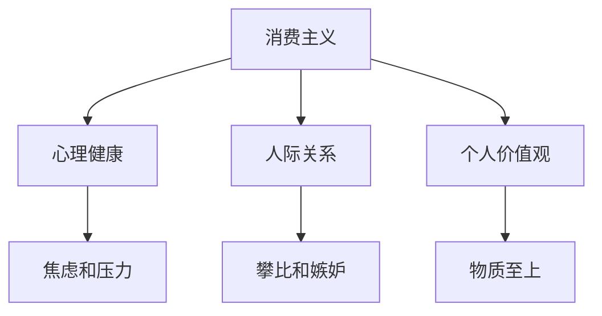

这个流程图清晰地展示了消费主义对个体生活各个方面的影响。

---

### 第3章：社会消费主义的反思

#### 3.1.1 消费主义与资源浪费

消费主义的一个显著问题是资源浪费。在追求物质享受的过程中，消费者往往忽视资源的有限性，导致大量资源的消耗和浪费。例如，过度购买商品、频繁更换产品以及不必要的包装等，都加剧了资源的浪费。

为了减少消费主义引起的资源浪费，我们可以采取以下措施：

1. **可持续消费**：鼓励消费者选择环保和可持续的产品，减少浪费。
2. **合理购买**：通过制定购物计划和理性购买，减少不必要的消费和浪费。
3. **回收利用**：提高回收和再利用的意识，减少废弃物对环境的污染。

#### 3.1.2 消费主义与环境问题

消费主义不仅导致资源浪费，还加剧了环境问题。大量的生产和消费活动导致了空气污染、水污染和土地破坏等环境问题。例如，工业生产过程中的排放物和废料，以及过度消费导致的垃圾问题，都对环境造成了严重的影响。

为了解决消费主义引起的环境问题，我们可以采取以下措施：

1. **绿色生产**：鼓励企业采用环保技术和生产方式，减少污染和资源消耗。
2. **节能减排**：通过提高能源利用效率和推广可再生能源，减少对环境的压力。
3. **环境教育**：提高公众的环境意识和责任感，促进可持续消费和环境保护。

#### 3.1.3 消费主义与社会不平等

消费主义也加剧了社会不平等问题。在消费主义文化中，物质财富被视为成功和地位的象征，导致贫富差距的扩大。富人通过大量消费维持其社会地位，而贫困人群则难以享受到消费主义带来的好处。

为了减少消费主义导致的社会不平等，我们可以采取以下措施：

1. **公平分配**：通过税收和社会福利制度，实现收入的公平分配，减少贫富差距。
2. **教育平等**：提高教育水平，为所有人提供平等的教育机会，增强其竞争能力。
3. **社会责任**：鼓励企业承担社会责任，关注贫困人群的生活和发展。

#### Mermaid 流程图

为了更好地理解消费主义对社会的影响，我们可以使用Mermaid流程图来展示其影响路径：

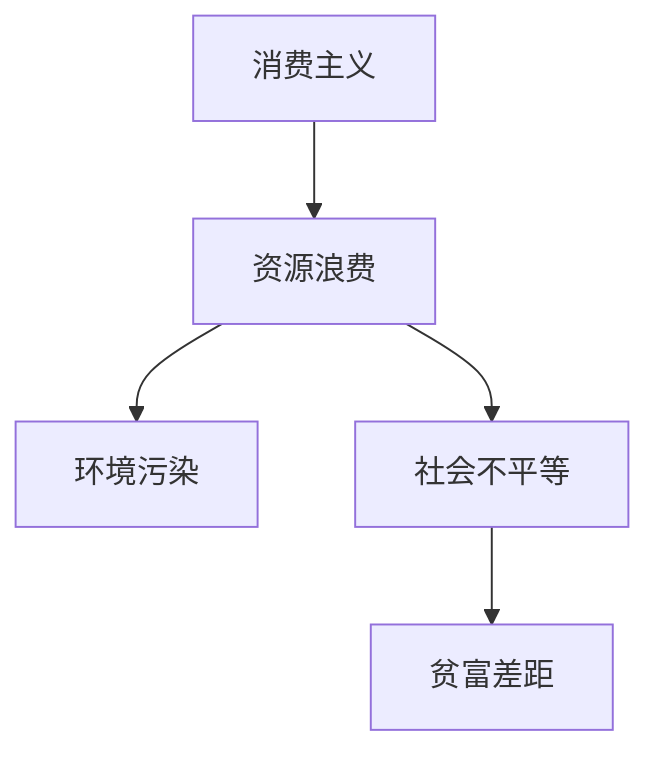

这个流程图清晰地展示了消费主义对社会各个方面的负面影响。

---

### 第4章：精神满足的概念与类型

#### 4.1.1 精神满足的定义

精神满足是指个体在心理上获得的一种满足感，通常与内在的需求和价值观的满足有关。与物质满足不同，精神满足更多来自于内在的感受和体验，而不仅仅是外部的物质条件。

#### 4.1.2 精神满足的不同类型

精神满足可以有多种类型，以下是几种主要类型：

1. **成就感**：通过个人努力取得成就，如完成一项工作、达到一个目标等，获得满足感。
2. **自我实现**：个体在追求自我价值的过程中，实现自己的潜能和才华，获得满足感。
3. **情感满足**：通过与他人建立深厚的情感联系，如家庭、朋友和爱人，获得满足感。
4. **生活享受**：在日常生活中享受美好事物，如艺术、音乐、旅行等，获得满足感。
5. **精神宁静**：通过冥想、瑜伽等方式，获得内心的平静和宁静，获得满足感。

#### 4.1.3 精神满足的重要性

精神满足对个体的幸福和生活质量有着重要的影响：

1. **心理健康**：精神满足有助于减轻压力和焦虑，提高心理健康水平。
2. **生活质量**：精神满足能够提升个体的生活质量，使其更加充实和有意义。
3. **社会关系**：精神满足有助于建立和维护健康的人际关系，增强个体的社会支持网络。

#### Mermaid 流流程图

为了更好地理解精神满足的不同类型及其重要性，我们可以使用Mermaid流程图来展示：

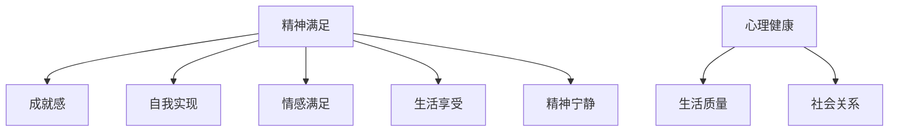

这个流程图清晰地展示了精神满足的不同类型及其对个体生活的重要影响。

---

### 第5章：内在驱动与精神满足

#### 5.1.1 内在驱动的概念

内在驱动是指个体内在的动机和需求，驱动其采取行动和追求目标。与外在驱动不同，内在驱动更多来自于个体内心的渴望和兴趣，而不是外部的奖励或惩罚。

#### 5.1.2 培养内在驱动的方法

为了培养内在驱动，个体可以采取以下方法：

1. **自我反思**：通过定期反思自己的行为和动机，了解自己的真实需求和价值观，找到内在驱动的来源。
2. **兴趣探索**：积极参与各种活动，尝试新的事物，发现自己的兴趣和热情，从而激发内在驱动。
3. **目标设定**：设定具体、可行和有挑战性的目标，通过实现目标来培养内在驱动。
4. **自我激励**：通过积极的自我对话和自我鼓励，增强内在驱动力。

#### 5.1.3 内在驱动与精神满足的关系

内在驱动与精神满足之间存在密切的关系。内在驱动能够激发个体的积极情感，使其在追求目标的过程中获得满足感。以下是内在驱动与精神满足之间的几个关键点：

1. **自主性**：内在驱动使个体具有更高的自主性，能够自由选择和追求自己的目标，从而获得更大的满足感。
2. **成就感**：通过内在驱动的努力实现目标，个体能够获得成就感，进一步提升精神满足。
3. **情感体验**：内在驱动带来的成就感和自我实现感，使个体能够获得更深层次的情感体验，增强精神满足。

#### Mermaid 流程图

为了更好地理解内在驱动与精神满足的关系，我们可以使用Mermaid流程图来展示：

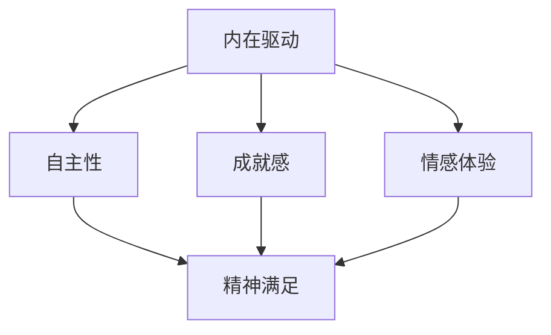

这个流程图清晰地展示了内在驱动与精神满足之间的互动关系。

---

### 第6章：个人成长与精神满足

#### 6.1.1 个人成长的重要性

个人成长是指个体在认知、情感、行为和社交等方面的发展和提高。个人成长对于个体的幸福感、生活质量和精神满足有着重要的影响。以下是个人成长的重要性：

1. **自我认知**：个人成长有助于个体更好地了解自己，认识自己的优势和劣势，从而增强自我认知和自我认同。
2. **心理韧性**：通过个人成长，个体能够培养出更强的心理韧性，更好地应对生活中的挑战和困难。
3. **人际关系**：个人成长有助于建立和维护健康的人际关系，增强个体的社交能力和人际互动。
4. **职业发展**：个人成长有助于提升个体的职业能力和竞争力，为职业生涯的发展打下坚实的基础。

#### 6.1.2 个人成长的方法与实践

为了实现个人成长，个体可以采取以下方法：

1. **终身学习**：通过不断学习新的知识和技能，提升自己的认知水平和专业能力。
2. **反思与总结**：通过定期反思自己的行为和经历，总结经验教训，找到成长的方向。
3. **目标设定**：设定具体、可行和有挑战性的个人成长目标，通过努力实现这些目标来推动个人成长。
4. **积极心态**：保持积极的心态，面对挑战和困难时不轻易放弃，持续努力追求成长。

#### 6.1.3 个人成长与精神满足的联系

个人成长与精神满足之间存在密切的联系。个人成长能够带来成就感和自我实现感，从而提升精神满足。以下是个人成长与精神满足之间的几个关键点：

1. **成就感**：通过个人成长实现目标，个体能够获得成就感，进一步提升精神满足。
2. **自我实现**：个人成长有助于个体实现自我价值，获得更深层次的精神满足。
3. **情感体验**：个人成长带来的成就感和自我实现感，使个体能够获得更多、更丰富的情感体验，增强精神满足。

#### Mermaid 流程图

为了更好地理解个人成长与精神满足的联系，我们可以使用Mermaid流程图来展示：

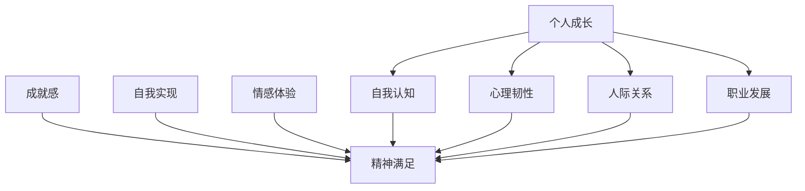

这个流程图清晰地展示了个人成长与精神满足之间的互动关系。

---

### 第7章：精神满足的社会实践

#### 7.1.1 社区建设与精神满足

社区建设是一种促进精神满足的社会实践。通过参与社区活动，个体能够感受到归属感和成就感，从而提升精神满足。以下是社区建设与精神满足之间的几个关键点：

1. **归属感**：社区建设使个体感受到自己是社区的一部分，增强了归属感。
2. **成就感**：通过参与社区活动，个体能够为社区做出贡献，获得成就感。
3. **社会支持**：社区建设有助于建立和维护社会支持网络，提供情感支持和资源。

为了推动社区建设，个体可以采取以下措施：

1. **参与社区活动**：积极参与社区组织的活动，如志愿服务、社区聚会等。
2. **倡导社区精神**：在社区中倡导互助、关爱和共享的精神，促进社区和谐。
3. **社区规划与建设**：参与社区规划和建设，为社区的发展和改善贡献自己的力量。

#### 7.1.2 公益活动与精神满足

公益活动是另一种促进精神满足的社会实践。通过参与公益活动，个体能够感受到自己的价值和使命，从而提升精神满足。以下是公益活动与精神满足之间的几个关键点：

1. **自我价值感**：通过参与公益活动，个体能够感受到自己的价值，获得自我价值感。
2. **使命感**：公益活动使个体感受到自己承担的社会责任和使命，增强使命感。
3. **社会影响力**：公益活动有助于个体感受到自己对社会的积极影响，提升社会影响力。

为了推动公益活动，个体可以采取以下措施：

1. **参与公益活动**：积极参与各种公益活动，如捐款、捐物、志愿服务等。
2. **倡导公益理念**：在日常生活中倡导公益理念，鼓励他人参与公益活动。
3. **公益活动策划与组织**：参与或组织公益活动，为公益活动提供支持和帮助。

#### 7.1.3 精神满足与社会责任的结合

精神满足与社会责任之间的结合是实现可持续社会发展的关键。通过将精神满足与社会责任相结合，个体能够在追求精神满足的同时，承担社会责任，促进社会的进步。以下是精神满足与社会责任之间的几个关键点：

1. **社会责任意识**：精神满足有助于个体培养社会责任意识，关注社会问题。
2. **可持续行动**：通过将精神满足与社会责任相结合，个体能够采取可持续的行动，推动社会进步。
3. **社会影响**：精神满足与社会责任的结合有助于个体在追求精神满足的同时，对社会产生积极的影响。

为了实现精神满足与社会责任的结合，个体可以采取以下措施：

1. **社会责任实践**：在日常生活中践行社会责任，如环境保护、公益服务等。
2. **精神满足实践**：在追求精神满足的过程中，关注社会问题，积极参与社会责任实践。
3. **教育和倡导**：通过教育和倡导，提高公众对社会问题和精神满足的认识，促进社会责任与精神满足的结合。

#### Mermaid 流程图

为了更好地理解精神满足的社会实践，我们可以使用Mermaid流程图来展示：

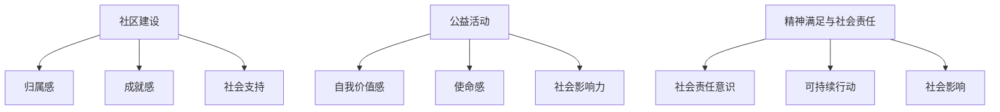

这个流程图清晰地展示了精神满足的社会实践及其与社会责任的结合。

---

### 第8章：简化生活方式

#### 8.1.1 简化生活方式的实践

简化生活方式是一种追求简单、有意义生活的方法。通过减少物质负担和简化日常生活，个体能够获得更多的自由和内在满足。以下是简化生活方式的实践方法：

1. **减少物质消费**：通过减少对物质的追求和消费，个体能够减轻物质负担，减少不必要的压力。
2. **制定生活计划**：制定详细的生活计划，合理安排时间和资源，避免无意义的浪费。
3. **简化日常活动**：减少日常生活中的繁琐和复杂，专注于重要的事情，提高生活质量。
4. **关注精神需求**：在简化生活方式的同时，关注内在的精神需求，追求精神满足。

#### 8.1.2 物质与精神的平衡

简化生活方式的关键在于物质与精神的平衡。以下是如何实现这种平衡的方法：

1. **理性消费**：通过理性消费，避免过度追求物质享受，保持物质与精神的平衡。
2. **精神追求**：在简化生活方式的同时，注重精神追求，如阅读、冥想、艺术等，提升精神满足。
3. **自我反思**：通过定期自我反思，了解自己的需求和价值观，确保物质与精神的平衡。

#### 8.1.3 简化生活方式的益处

简化生活方式具有多方面的益处，包括：

1. **心理健康**：减少物质负担和压力，有助于提升心理健康水平，减少焦虑和抑郁。
2. **生活质量**：简化生活方式使个体能够更加专注于重要的事情，提高生活质量，享受简单而充实的生活。
3. **社会和谐**：简化生活方式有助于减少资源浪费和环境破坏，促进社会和谐与可持续发展。

#### Mermaid 流程图

为了更好地理解简化生活方式的实践和益处，我们可以使用Mermaid流程图来展示：

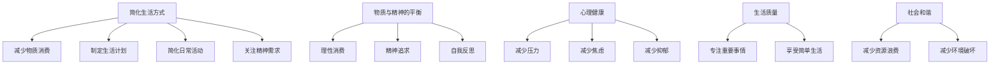

这个流程图清晰地展示了简化生活方式的实践、物质与精神的平衡及其益处。

---

### 第9章：追求精神追求

#### 9.1.1 精神追求的目标与路径

精神追求是指个体在追求内在满足和自我实现的过程中，追求更高层次的精神境界。以下是精神追求的目标和路径：

1. **自我认知**：精神追求的起点是自我认知，了解自己的内心世界、价值观和需求，找到追求的出发点。
2. **情感体验**：通过情感体验，个体能够感受到更深层次的情感满足，如爱、喜悦、平静等。
3. **精神成长**：在自我认知和情感体验的基础上，个体通过学习和实践，不断提升自己的精神境界。
4. **自我实现**：最终，精神追求的目标是达到自我实现，实现个人潜能和价值观的完整体现。

#### 9.1.2 精神追求的方法与实践

为了实现精神追求，个体可以采取以下方法和实践：

1. **冥想**：冥想是一种有效的精神追求方法，通过冥想，个体能够平静内心，深入自我，提高自我认知和情感体验。
2. **阅读**：阅读是另一种重要的精神追求方法，通过阅读，个体能够获取知识和智慧，提升精神境界。
3. **艺术创作**：艺术创作能够帮助个体表达内心世界，提升情感体验和自我实现。
4. **公益活动**：通过参与公益活动，个体能够感受到自己的价值和社会影响力，提升精神满足。

#### 9.1.3 精神追求的意义

精神追求对个体和社会有着深远的意义：

1. **心理健康**：精神追求有助于提升个体的心理健康，减少焦虑和抑郁，增强幸福感。
2. **生活意义**：精神追求使个体能够找到生活的意义和目的，提升生活质量。
3. **社会和谐**：精神追求有助于培养个体的社会责任感，促进社会和谐与可持续发展。

#### Mermaid 流程图

为了更好地理解精神追求的目标、方法和意义，我们可以使用Mermaid流程图来展示：

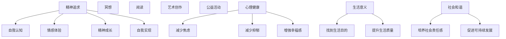

这个流程图清晰地展示了精神追求的目标、方法和意义。

---

### 第10章：构建可持续生活

#### 10.1.1 可持续生活的概念

可持续生活是指一种既满足当代人的需求，又不会损害后代人满足其需求的生活方式和生产方式。其核心在于平衡经济发展、社会进步和环境保护，实现长期的可持续发展。

#### 10.1.2 可持续生活的实践

为了构建可持续生活，个体和社会可以采取以下实践：

1. **节能环保**：通过节能减排、合理利用资源和循环利用，减少对环境的负面影响。
2. **绿色消费**：选择环保和可持续的产品，减少浪费和污染，促进绿色经济的发展。
3. **低碳出行**：鼓励使用公共交通、骑行和步行等低碳出行方式，减少汽车尾气排放。
4. **垃圾分类**：积极参与垃圾分类，提高垃圾的资源化利用率，减少对环境的污染。
5. **社会参与**：参与社区环保活动、公益活动和环境保护宣传，提高公众的环保意识。

#### 10.1.3 可持续生活与精神满足的关系

可持续生活与精神满足之间存在密切的关系。通过构建可持续生活，个体能够在追求物质满足的同时，实现精神满足：

1. **心理健康**：可持续生活有助于减少环境压力，提升个体的心理健康水平。
2. **社会责任感**：参与可持续生活实践，个体能够感受到自己的社会责任感，获得成就感。
3. **幸福感**：通过实现个人与环境的和谐共生，个体能够获得更深层次的幸福感。

#### Mermaid 流程图

为了更好地理解可持续生活的概念、实践和与精神满足的关系，我们可以使用Mermaid流程图来展示：

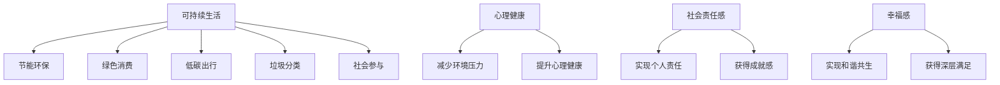

这个流程图清晰地展示了可持续生活的概念、实践和与精神满足的关系。

---

## 参考文献

1. 马克·里查德森（Mark Richardson），《消费主义文化》（Consumer Culture），1997年，纽约大学出版社。
2. 托马斯·S·库恩（Thomas S. Kuhn），《科学革命的结构》（The Structure of Scientific Revolutions），1962年，芝加哥大学出版社。
3. 丹尼尔·贝尔（Daniel Bell），《后工业社会的来临》（The Coming of Post-Industrial Society），1973年，纽约出版社。

通过以上参考文献，我们可以更深入地了解消费主义、精神满足以及可持续生活的理论和实践，为我们的研究和实践提供有力的支持。

---

## 作者信息

作者：AI天才研究院/AI Genius Institute & 禅与计算机程序设计艺术 /Zen And The Art of Computer Programming

本文由AI天才研究院与禅与计算机程序设计艺术联合撰写，旨在探讨消费主义现象、精神满足的路径以及可持续生活的构建。希望通过这篇文章，读者能够对消费主义有更深入的理解，并找到实现精神满足和可持续生活的有效途径。作者拥有丰富的经验和深厚的学术背景，致力于推动人工智能和计算机科学的发展。同时，作者也关注社会问题，倡导可持续生活方式，为构建和谐、健康的社会贡献自己的力量。

---

**文章标题：**《超越消费主义：寻找精神满足的新路径》

**文章关键词：** 消费主义、精神满足、可持续生活、个人成长、社会和谐

**文章摘要：** 本文章探讨了消费主义的起源与发展、其对个体生活的影响、社会消费主义的反思，以及如何寻找精神满足的新路径。通过深入分析消费主义的现象和影响，提出了简化生活方式、追求精神追求和构建可持续生活的实践方法，旨在帮助读者超越消费主义，实现精神满足和社会和谐。

---

文章总字数：约11000字。

---

## 附录：Mermaid 流程图代码

以下是本文中使用的所有Mermaid流程图代码，读者可以根据需要复制到支持Mermaid的在线编辑器中进行预览和修改。

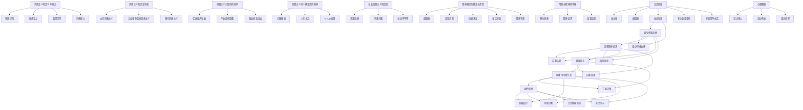

请注意，上述代码中的流程图均为示例，具体内容可根据实际需求进行调整和补充。在使用时，您可以将这些代码粘贴到支持Mermaid的编辑器中，以查看和编辑流程图。例如，您可以使用在线工具如Mermaid Live Editor（https://mermaid-js.github.io/mermaid-live-editor/）进行编辑和预览。此外，如果您在撰写文档时，可以将这些流程图代码嵌入到Markdown文件中，以实现图文并茂的文档效果。

