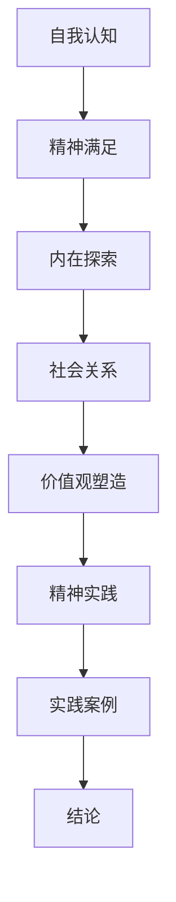

                 

### 引言

在当今快速发展的社会中，物质主义成为了许多人生活的主导力量。我们不断追求物质上的富足和满足，希望通过拥有更多的物质财富来获得幸福和快乐。然而，随着时间的推移，人们逐渐发现，物质上的满足并不能带来持久的幸福感。相反，物质追求常常导致心理上的空虚和焦虑，甚至对环境和社会造成了负面影响。

物质主义的生活模式强调对物质财富的追求和消费，这种模式往往忽视了人的精神需求和内在成长。在这种模式下，人们往往陷入无止境的欲望循环中，追求更高级别的物质享受，但往往在获得之后很快就感到厌倦和不满。这种现象在心理学中被称为“享乐适应”，即人们对新获得的东西很快就会习以为常，从而失去了快乐的感觉。

精神满足的重要性不言而喻。精神满足不仅能够提高个人的幸福感，还能促进心理健康和社交关系的和谐。精神满足是一个多维度的概念，包括自我认知、内在探索、社会关系、价值观塑造和精神实践等方面。在这些维度上，人们可以通过不同的方式来寻找和实现精神满足。

本书旨在引导读者超越物质主义，寻找精神满足的新途径。通过深入分析物质主义的生活模式及其弊端，我们提出了精神满足的概念和维度，探讨了如何通过内在探索、社会关系、价值观塑造和精神实践来提升精神满足。此外，我们还通过实践案例，展示了如何将精神满足的理念应用到个人生活中。

本书的结构如下：第1章将介绍物质主义的根源与影响，并阐述精神满足的重要性；第2章将反思物质主义的生活模式，探讨其对心理健康的影响；第3章将定义精神满足的概念，并介绍其不同维度；第4章至第7章将分别探讨内在探索、社会关系、价值观塑造和精神实践的具体方法和实践；第8章将分享实践案例，展示如何将精神满足理念应用于个人生活；第9章将总结全书内容，并呼吁读者持续追求精神满足。

### 第1章 引言

#### 1.1 物质主义的根源与影响

物质主义是一种以物质财富和物质享受为核心价值观的生活方式。其根源可以追溯到人类社会的发展历程中，特别是在工业革命之后。工业革命带来了生产力的巨大提升，人们开始拥有更多的物质财富。随着社会的进步，人们的生活水平不断提高，对物质的需求也随之增加。这种对物质的追求逐渐成为人们生活的主导力量，形成了物质主义的生活模式。

物质主义的影响广泛而深远。首先，物质主义在个人层面上对心理健康造成了负面影响。由于物质追求的不断升级，人们往往陷入无止境的欲望循环中。他们不断地追求更高档次的物质享受，但很快就会感到厌倦和不满。这种现象在心理学中被称为“享乐适应”，即人们对新获得的东西很快就会习以为常，从而失去了快乐的感觉。这种心理上的空虚和焦虑导致了心理健康问题的增加，如焦虑、抑郁和压力等。

其次，物质主义在社会层面上也对人际关系和社会结构产生了负面影响。物质追求导致了人与人之间的竞争加剧，人们更加关注物质上的得失，而忽视了情感和精神的交流。这种竞争和利益至上的价值观导致了社会信任的下降，人际关系的疏离，甚至社会冲突的增加。

最后，物质主义对环境也造成了严重的破坏。为了满足人们对物质的需求，自然资源被过度开采和消耗，导致环境污染和生态失衡。同时，物质追求也导致了资源的浪费和消费主义的盛行，进一步加剧了环境问题。

#### 1.2 精神满足的重要性

与物质主义相对，精神满足是指通过内在探索、价值观塑造、社会关系建立和精神实践等方式，实现个人心理健康和幸福感的过程。精神满足的重要性不可忽视，它不仅能够提升个人的生活质量，还能对社会和环境产生积极的影响。

首先，精神满足对个人的心理健康至关重要。精神满足能够帮助人们建立积极的心态，减少焦虑和抑郁等心理问题的发生。通过内在探索，人们能够更好地了解自己，找到内心的平静和满足。价值观塑造则帮助人们建立正确的价值观体系，从而在面对困境和诱惑时能够坚守内心的信念。社会关系的建立则能够提供情感支持和安全感，减少孤独感和焦虑感。

其次，精神满足对社会和环境也具有积极的影响。通过倡导精神满足的生活方式，社会可以减少物质追求带来的压力和竞争，从而建立更加和谐的人际关系和社会结构。同时，精神满足还能够促进环境保护和可持续发展。人们更加关注内心的需求，减少对物质资源的过度消耗，从而减轻环境负担。

#### 1.3 本书的目标与结构

本书的目标是引导读者超越物质主义，探索精神满足的新途径。通过深入分析物质主义的生活模式及其弊端，我们希望读者能够认识到精神满足的重要性，并找到实现精神满足的有效方法。

本书的结构如下：

- **第1章**：引言，介绍物质主义的根源与影响，以及精神满足的重要性。
- **第2章**：物质主义的反思，探讨物质追求对个人和社会的负面影响。
- **第3章**：精神满足的概念与维度，定义精神满足，并介绍其不同维度。
- **第4章**：内在探索：自我认知与成长，探讨自我认知的重要性以及如何进行自我认知和自我成长。
- **第5章**：社会关系：构建和谐人际网络，探讨社会关系的重要性以及如何建立健康的社会关系。
- **第6章**：价值观的塑造与实践，探讨价值观的定义与作用，以及如何塑造和践行积极价值观。
- **第7章**：精神实践：静心与冥想，介绍静心与冥想的概念和作用，并给出具体的实践指南。
- **第8章**：实践案例：超越物质主义的个人故事，分享个人实践精神满足的成功故事。
- **第9章**：结论，总结全书内容，并呼吁读者持续追求精神满足。

通过本书的阅读和实践，我们希望读者能够找到精神满足的新途径，实现心理健康和幸福的生活。

### 第2章 物质主义的反思

#### 2.1 物质主义的生活模式

物质主义的生活模式强调对物质财富的追求和消费。在这种模式下，人们的生活目标往往围绕着如何获取更多的物质资源和享受更高级别的物质生活。具体表现为以下几个方面：

1. **物质消费**：物质主义生活方式的一个显著特征是消费行为的频繁和大规模。人们不断购买各种商品和服务，从日常生活用品到奢侈品，希望通过这些消费行为提升自己的生活质量和满足感。

2. **工作与职业发展**：物质主义常常导致人们将工作和职业发展看作是获取物质财富的主要途径。许多人为了追求更高的薪资和更好的职业前景，不断努力工作和加班，甚至牺牲个人生活和健康。

3. **社交媒体展示**：在物质主义的社会中，社交媒体成为展示物质财富的重要平台。人们通过晒出自己拥有的高档物品、豪华旅游照片等，来获取他人的羡慕和认可。

4. **物质替代成就感**：物质主义的生活模式往往导致人们用物质成就来替代真正的成就感。例如，一些人通过购买昂贵的电子产品或汽车来提升自己的社会地位，而不是通过实现个人目标或获得真正的成就来增强自信心和满足感。

#### 2.2 物质追求的弊端

尽管物质追求在某些方面能够带来短期的满足感，但它也存在诸多弊端，对个人和社会健康产生负面影响。

1. **心理压力增加**：追求物质财富常常伴随着巨大的压力。人们为了实现更高的收入和更好的生活条件，往往需要长时间工作、加班，甚至牺牲休息和休闲时间。这种持续的压力容易导致焦虑、抑郁和其他心理问题的发生。

2. **心理空虚与厌倦**：物质追求往往使人们陷入一个无止境的循环。他们不断地追求更高档次的物质享受，但很快就会感到厌倦和不满。这种现象在心理学中被称为“享乐适应”，即人们对新获得的东西很快就会习以为常，从而失去了快乐的感觉。

3. **忽视内在需求**：物质主义的生活模式常常使人们忽视内心的需求。他们过于关注外在的物质成就，而忽视了个人成长、情感满足和精神满足。这种忽视可能导致内心的空虚和不安。

4. **社会关系疏离**：物质追求往往导致人与人之间的竞争加剧。人们更多地关注物质上的得失，而忽视了情感和精神的交流。这种竞争和利益至上的价值观导致了社会信任的下降，人际关系的疏离，甚至社会冲突的增加。

5. **环境破坏**：物质追求不仅对个人健康产生负面影响，还对环境造成了严重破坏。为了满足人们对物质的需求，自然资源被过度开采和消耗，导致环境污染和生态失衡。同时，物质追求也导致了资源的浪费和消费主义的盛行，进一步加剧了环境问题。

#### 2.3 心理健康的警示信号

当一个人陷入物质追求的陷阱中，他们可能会出现一些心理健康问题的警示信号。以下是一些常见的警示信号：

1. **持续焦虑和压力**：如果一个人在工作中感到持续的压力，经常感到焦虑和紧张，这可能是因为他们过于关注物质成就，而忽视了心理健康。

2. **情绪波动**：情绪不稳定，容易情绪化，可能是因为物质追求带来的心理压力和对内在需求的忽视。

3. **抑郁症状**：长时间感到悲伤、失去兴趣、缺乏动力，这些症状可能是抑郁的迹象，与物质追求和心理健康问题密切相关。

4. **睡眠问题**：失眠、睡眠质量差，可能是因为心理压力和焦虑导致的。

5. **人际关系疏远**：如果一个人开始疏远朋友和家人，更多地关注物质上的得失，这可能是社会关系疏离的早期迹象。

6. **过度消费**：如果一个人频繁地购买不必要的物品，试图通过物质消费来逃避内心的空虚和不安，这可能是物质依赖和心理健康问题的表现。

#### 2.4 物质主义对心理健康的影响

物质主义对心理健康的影响是多方面的。首先，物质追求可能导致心理上的空虚和不安。人们不断地追求物质财富，但很快就会感到厌倦和不满，因为他们忽视了内心的需求。这种心理上的空虚可能导致焦虑、抑郁和其他心理问题的发生。

其次，物质追求还可能导致心理健康问题的加剧。例如，长时间的工作和加班可能会导致慢性压力和焦虑，影响睡眠质量和整体健康。同时，过度消费和物质依赖也可能导致心理上的依赖和无法控制的行为，进一步加剧心理健康问题。

最后，物质主义还可能导致心理健康问题的传播。在一个物质主义盛行的社会中，人们容易受到周围环境的影响，产生相同的心理问题。这种“群体效应”可能会导致心理健康问题的广泛传播，影响整个社会的心理健康水平。

总之，物质主义的生活模式对个人和社会健康产生了严重的负面影响。通过反思物质主义的生活模式，我们认识到，追求精神满足是提升个人幸福感和心理健康的更有效途径。在接下来的章节中，我们将探讨精神满足的概念和维度，以及如何通过内在探索、社会关系、价值观塑造和精神实践来提升精神满足。

### 第3章 精神满足的概念与维度

#### 3.1 精神满足的定义

精神满足是指通过内在探索、价值观塑造、社会关系建立和精神实践等方式，实现个人心理健康和幸福感的过程。与物质追求不同，精神满足注重个人的内在需求，强调通过心灵的成长和情感满足来实现持久的幸福感。精神满足不仅关注个人的心理健康，还包括对生活意义的追求和自我实现。

精神满足的定义可以类比于计算机科学中的一个概念——幸福感“算法”。在这个“算法”中，输入是个人经历、情感和社会关系等，通过一系列的处理和调整，输出是幸福感。这个过程类似于计算机程序中的数据处理和算法优化，旨在找到实现幸福感的最佳路径。

#### 3.2 精神满足的维度

精神满足是一个多维度的概念，包括以下几个方面：

1. **自我认知**：自我认知是精神满足的基础。通过深入探索自我，人们能够更好地了解自己的内心世界、需求和价值观。自我认知不仅有助于个人的成长和发展，还能减少焦虑和压力，提高心理健康水平。

2. **内在探索**：内在探索是指通过冥想、静心和其他精神实践来发掘和培养内心的平静和智慧。这种探索有助于提升个人的精神层次，增强自我意识和内在力量，从而实现更深层次的精神满足。

3. **社会关系**：社会关系是精神满足的重要维度。健康、和谐的人际关系能够提供情感支持和安全感，减少孤独感和焦虑感。通过建立积极的社会关系，人们能够获得更多的社交资源和幸福感。

4. **价值观塑造**：价值观塑造是指通过反思和选择，建立积极、健康的价值观体系。正确的价值观不仅能够指导个人的行为和决策，还能帮助人们应对生活中的挑战和困境，实现精神上的满足和成长。

5. **精神实践**：精神实践包括冥想、瑜伽、艺术创作等多种形式的活动。这些实践能够帮助人们放松身心，增强心理韧性，提高生活质量。通过精神实践，人们能够培养内心的平静和智慧，实现更深层次的精神满足。

#### 3.3 精神满足与幸福感的关系

精神满足与幸福感之间存在紧密的关系。幸福感是指个人在心理上的愉悦和满足感，是心理健康的重要指标。精神满足通过提升个人的心理健康水平，从而增加幸福感。具体来说，精神满足与幸福感的关系可以从以下几个方面进行理解：

1. **心理健康的提升**：精神满足通过自我认知、内在探索、社会关系、价值观塑造和精神实践等方式，提升个人的心理健康水平。心理健康包括情感健康、认知健康和社交健康等方面。当个人的心理健康水平提高时，幸福感也会随之增加。

2. **情感满足的增强**：精神满足能够帮助人们实现情感上的满足。通过建立健康的社会关系和正确的价值观体系，人们能够获得更多的情感支持和安全感，减少孤独感和焦虑感。这种情感满足是幸福感的重要组成部分。

3. **生活意义的追求**：精神满足还涉及到对生活意义的追求。通过内在探索和精神实践，人们能够更好地理解自己的生活和使命，找到生活的意义和价值。这种对生活意义的追求能够提高个人的幸福感和满足感。

4. **持久性**：与物质追求带来的短暂满足不同，精神满足能够带来持久的幸福感。通过内在探索和精神实践，人们能够不断培养和提升内心的平静和智慧，实现长期的精神满足。

总之，精神满足是一个多维度的概念，它不仅关注个人的心理健康，还包括对生活意义的追求和自我实现。通过自我认知、内在探索、社会关系、价值观塑造和精神实践，人们能够实现更深层次的精神满足，从而提升幸福感和生活质量。

### 第4章 内在探索：自我认知与成长

#### 4.1 自我认知的重要性

自我认知是内在探索的核心，是精神满足的重要基石。自我认知是指通过反思和观察，了解自己的内在世界，包括情感、需求、价值观和行为模式。自我认知的重要性体现在以下几个方面：

首先，自我认知有助于个人的心理健康。通过深入了解自己的内心世界，人们能够更好地理解自己的情绪和行为，减少内心的矛盾和冲突。这种内在的和谐有助于减轻焦虑、抑郁和其他心理问题的发生。

其次，自我认知能够帮助人们实现个人成长和发展。通过反思自己的行为和决策，人们能够发现自身的优点和不足，从而制定有效的改进计划。这种自我反思和改进的过程有助于提升个人的能力和素质，实现自我超越。

第三，自我认知有助于建立积极的人际关系。了解自己的需求和价值观，人们能够更好地与他人沟通和互动，减少误解和冲突。这种相互理解和尊重的人际关系能够提供情感支持和安全感，提高生活质量。

#### 4.2 如何进行自我认知

进行自我认知需要一定的方法和技巧。以下是一些常用的自我认知方法：

1. **反思日记**：每天花时间记录自己的所思所感，反思自己的行为和决策。通过这种持续的自我反思，人们能够更好地了解自己的内心世界。

2. **心理测试**：通过心理测试，如MBTI（性格类型指标）、DISC（行为风格分析）等，人们能够了解自己的性格特点和行为模式。这些测试提供了一种科学的自我认知方式，有助于发现自身的优势和不足。

3. **冥想**：冥想是一种通过专注和放松来观察自己内在世界的方法。通过冥想，人们能够培养内心的平静和专注力，从而更好地了解自己的需求和情感。

4. **心理咨询**：心理咨询师能够提供专业的指导和帮助，帮助人们深入探索自己的内心世界。通过心理咨询，人们能够理解自己的行为和情感，找到有效的应对策略。

#### 4.3 自我成长的方法与实践

自我成长是一个持续的过程，需要不断努力和实践。以下是一些自我成长的方法：

1. **设定目标**：明确自己的短期和长期目标，制定具体的行动计划。通过设定目标，人们能够明确自己的方向，激发内在的动力。

2. **持续学习**：不断学习新的知识和技能，提升自己的能力。通过学习，人们能够扩展自己的视野，提高自我认知水平。

3. **挑战自我**：勇敢面对挑战和困难，尝试新的事物。通过挑战自我，人们能够突破自己的舒适区，实现个人成长。

4. **反思与总结**：定期反思自己的行为和决策，总结经验教训。通过反思和总结，人们能够不断改进自己的行为模式，提高自我成长的效果。

5. **培养良好的习惯**：养成健康的生活习惯，如定期锻炼、保持充足的睡眠、合理饮食等。良好的习惯有助于提高个人的整体健康水平，实现自我成长。

总之，自我认知与成长是内在探索的重要组成部分。通过自我认知，人们能够更好地了解自己，实现个人成长和发展。通过自我成长，人们能够提升自己的心理健康水平，实现更深层次的精神满足。

### 第5章 社会关系：构建和谐人际网络

#### 5.1 社会关系的重要性

社会关系是指人们在生活中与其他个体建立的联系和互动。这些关系不仅包括家庭、朋友和同事等亲密关系，还包括社区、组织和网络等更广泛的社会联系。社会关系的重要性体现在以下几个方面：

首先，社会关系对个人的心理健康有显著影响。健康、和谐的人际关系能够提供情感支持和安全感，减少孤独感和焦虑感。研究表明，缺乏社交支持的人更容易出现心理健康问题，如抑郁、焦虑和压力等。

其次，社会关系有助于个人成长和发展。通过与他人互动，人们能够学习新的知识和技能，扩展自己的视野。社交关系还能够提供职业发展和个人成长的机会，如工作推荐、合作项目和资源分享等。

第三，社会关系对社会的稳定和繁荣具有重要意义。一个和谐、互信的社会关系网络能够促进社会合作和团结，减少冲突和矛盾。这有助于社会的稳定和可持续发展。

#### 5.2 建立健康社会关系的方法

建立健康的社会关系需要一定的技巧和努力。以下是一些有效的方法：

1. **积极互动**：主动与他人建立联系，参与社交活动。通过主动交流，人们能够增加社交机会，建立新的关系。

2. **倾听与理解**：倾听他人的需求和感受，展示同理心。通过倾听和理解，人们能够建立信任和共鸣，增进关系。

3. **分享与支持**：在他人需要帮助时，主动提供支持和帮助。通过分享和支持，人们能够建立深厚的友谊和合作关系。

4. **保持真诚**：在交往中保持真诚和诚信，避免虚伪和欺骗。真诚的交往能够建立长期的信任和尊重。

5. **培养良好沟通**：学会有效的沟通技巧，如清晰表达、倾听和反馈。良好的沟通能够减少误解和冲突，增进关系。

#### 5.3 社交技巧的提升

提升社交技巧有助于建立和维护健康的社会关系。以下是一些提升社交技巧的方法：

1. **自我认知**：了解自己的性格特点和行为模式，识别自己在社交中的优势和不足。通过自我认知，人们能够更好地调整自己的行为，提高社交效果。

2. **观察学习**：观察他人的社交行为，学习他们的沟通技巧和互动方式。通过观察学习，人们能够积累社交经验，提高自己的社交能力。

3. **角色扮演**：通过角色扮演练习，模拟社交场景，提高自己的沟通和应对能力。通过角色扮演，人们能够在安全的氛围中练习社交技巧，减少实际社交中的紧张和不安。

4. **反馈与改进**：向他人寻求反馈，了解自己的社交表现，并根据反馈进行改进。通过反馈和改进，人们能够不断优化自己的社交技巧，提高社交效果。

5. **持续练习**：社交技巧的提升需要不断的练习和实践。通过持续的练习，人们能够巩固所学技巧，提高社交能力。

总之，社会关系对个人的心理健康和社会发展具有重要影响。通过建立健康的社会关系和提升社交技巧，人们能够获得更多的情感支持和成长机会，实现更深层次的精神满足。

### 第6章 价值观的塑造与实践

#### 6.1 价值观的定义与作用

价值观是指个人或社会认为重要的和值得追求的理念、原则和标准。它指导人们的思想和行为，影响人们的生活方式和决策过程。价值观的定义可以从多个角度来理解：

首先，从心理学角度来看，价值观是人们内心深处的信念和信仰，是人们对事物的评价和选择的依据。心理学家马斯洛（Abraham Maslow）将价值观视为人类需求的更高层次，包括自我实现、自尊、社交需求和生理需求等。

其次，从社会学角度来看，价值观是社会文化的重要组成部分，反映了社会的道德规范、文化传统和社会期望。社会学家涂尔干（Émile Durkheim）认为，价值观是社会团结和道德秩序的基础，是维持社会稳定的重要力量。

最后，从哲学角度来看，价值观是人们对于什么是“好”和“正确”的思考，是对生活意义的探索。哲学家康德（Immanuel Kant）认为，道德价值观是人类理性的表现，是追求美好生活的指南。

价值观在个人和社会生活中起着重要作用：

1. **指导行为**：价值观为人们的思想和行为提供了指导，使人们在面临选择时能够做出符合价值观的决策。

2. **塑造性格**：长期的价值观塑造影响个人的性格特点和行为习惯，使人们成为具有特定价值观念的人。

3. **建立信任**：在社会交往中，共同的价值观有助于建立信任和合作关系，促进社会的和谐与发展。

4. **促进成长**：积极的价值观能够激励个人追求卓越，克服困难，实现个人目标和自我实现。

#### 6.2 如何塑造积极价值观

塑造积极价值观是一个长期且系统的过程，需要个体和社会共同努力。以下是一些具体的方法：

1. **自我反思**：定期进行自我反思，审视自己的行为和决策是否符合自己的价值观。通过自我反思，人们能够发现并纠正与价值观不符的行为，逐步塑造积极价值观。

2. **学习与教育**：通过学习和教育，了解不同的价值观体系和理念。这包括阅读相关书籍、参加讲座和工作坊，以及与有不同价值观的人进行交流。

3. **榜样示范**：寻找和模仿积极价值观的榜样，如伟人、杰出人物和身边的优秀人士。通过学习他们的行为和决策，人们能够更好地理解积极价值观的内涵。

4. **实践与体验**：将积极价值观融入日常生活，通过实际行动来践行这些价值观。例如，通过志愿服务、慈善活动和社区参与等方式，实践助人为乐、公平正义等价值观。

5. **持续反思与调整**：在实践过程中，持续反思自己的行为和决策，发现并纠正与价值观不符的地方。同时，根据实际情况和环境变化，灵活调整自己的价值观。

#### 6.3 价值观实践中的挑战与应对

在价值观的实践中，个体可能会遇到以下挑战：

1. **外部压力**：社会环境、文化传统和家庭期望等外部因素可能会对个体的价值观产生负面影响。例如，物质主义和功利主义价值观的盛行可能会削弱个体对道德和正义的追求。

应对策略：

- **坚守内心信念**：在面临外部压力时，坚守自己的价值观，坚定内心的信念。通过自我说服和积极的自我暗示，增强对价值观的认同和坚守。

- **寻求支持**：与志同道合的人建立联系，共同探讨和实践价值观。通过社群支持和互助，增强个体的信念和行动力。

2. **行为习惯的挑战**：长期的价值观实践需要改变现有的行为习惯，这可能带来一定的困难和不适。

应对策略：

- **逐步调整**：将价值观实践分解为小的、可操作的行为步骤，逐步调整行为习惯。例如，通过设定具体的目标和行动计划，逐步实现价值观的实践。

- **奖励与激励**：为自己设定奖励机制，鼓励自己坚持价值观的实践。通过奖励和激励，增强行为的持续性和积极性。

3. **环境适应**：在社会环境中，价值观的实践可能面临来自环境的压力和挑战。

应对策略：

- **灵活应对**：在保持核心价值观的基础上，根据环境和情境的变化，灵活调整行为策略。例如，在公共场合保持礼貌和尊重，但在私密空间内则可以更自由地表达自己的价值观。

- **积极发声**：通过社会参与和公共讨论，积极宣传和推广自己的价值观，促进社会的共识和进步。

总之，塑造和实践积极价值观是一个复杂但有意义的过程。通过自我反思、学习与教育、实践与体验，以及应对挑战，个体能够逐步塑造和践行积极价值观，实现精神满足和人生价值。

### 第7章 精神实践：静心与冥想

#### 7.1 静心的概念与作用

静心是一种通过专注和内观来达到内心平静和精神集中的实践。静心的概念源自东方哲学，尤其是印度教和佛教传统。静心的核心是通过排除杂念和专注呼吸，使心灵回归内在的宁静状态。

静心的作用主要体现在以下几个方面：

1. **心理减压**：静心能够帮助人们从日常生活中的压力和焦虑中解脱出来，使心灵得到休息和放松。通过静心，人们能够降低应激激素的水平，减少压力感和焦虑感。

2. **提高注意力**：静心练习有助于提高个体的注意力和专注力。通过专注呼吸和身体感受，人们能够训练自己的心智，提高集中注意力的能力，从而在工作和学习中表现出更高的效率。

3. **增强情绪调节能力**：静心能够帮助人们更好地管理自己的情绪，减少情绪波动和负面情绪。通过静心，人们能够培养内心的平和和稳定，增强情绪调节能力，提高生活质量。

4. **促进身心健康**：静心不仅对心理健康有益，还对身体健康有积极影响。静心能够改善睡眠质量，增强免疫系统功能，减少慢性疾病的风险。

#### 7.2 冥想的种类与方法

冥想是静心的另一种形式，它通过不同的方法和技巧来帮助个体达到内心的平静和专注。以下是一些常见的冥想种类和方法：

1. **呼吸冥想**：呼吸冥想是最常见的冥想形式之一。通过专注呼吸，人们能够将注意力集中在当下，排除杂念，达到内心的平静。具体方法包括数呼吸、观察呼吸等。

2. **身体扫描冥想**：身体扫描冥想是一种通过逐步扫描身体，关注身体感受的冥想方法。这种方法有助于人们放松身体，减轻肌肉紧张，提升整体的舒适感和放松感。

3. **正念冥想**：正念冥想是一种通过完全活在当下的冥想方法。通过专注于当下的感觉、思维和情绪，人们能够培养对现实的接纳和觉察，减少内心的焦虑和不安。

4. **指导冥想**：指导冥想是一种由导师引导的冥想形式。通过导师的引导，人们能够更容易进入冥想状态，专注于特定的主题或目标。

5. **音乐冥想**：音乐冥想是通过聆听特定类型的音乐来帮助人们达到冥想状态。音乐冥想能够促进放松和专注，帮助人们减轻压力和焦虑。

#### 7.3 静心冥想实践指南

以下是一些静心冥想的实践指南，帮助初学者入门：

1. **选择合适的场所**：选择一个安静、舒适的环境进行冥想。最好是一个能够让你完全放松和专注的地方。

2. **设定时间**：每天选择一个固定的时间进行冥想，例如早晨起床后或晚上睡前。设定一个固定的时间有助于建立冥想的习惯。

3. **姿势**：选择一个舒适的姿势，可以是坐姿、跪姿或躺姿。关键是要保持身体放松，呼吸顺畅。

4. **专注呼吸**：将注意力集中在呼吸上，感受每一次呼吸的进出。如果思绪飘散，不要责怪自己，轻轻地将注意力拉回呼吸。

5. **逐步增加时间**：初学者可以从每次5分钟开始，逐渐增加时间。随着练习的深入，可以尝试延长冥想的时间。

6. **保持一致性**：定期进行冥想，保持一致性。即使每天只有几分钟的练习，也能带来显著的效果。

7. **记录感受**：在冥想过程中，记录自己的感受和体验。这有助于跟踪进步，增强冥想的动机。

通过实践静心和冥想，人们能够逐渐提升内心的平静和专注力，实现更深层次的精神满足。

### 第8章 实践案例：超越物质主义的个人故事

#### 8.1 个人案例一：从物质追求到精神满足的转变

李华是一名年轻的都市白领，曾经的生活充满了物质追求。她热衷于购买奢侈品，追求更高的薪资和更好的职业前景。然而，随着物质财富的增加，李华却感到内心的空虚和不安。她开始意识到，物质追求并不能带来真正的幸福和满足。

为了寻找精神满足的新途径，李华开始探索内在探索和精神实践。她开始每天记录反思日记，反思自己的行为和决策。通过自我认知，她逐渐了解自己的需求和价值观。她发现，自己真正渴望的是内心的平静和真正的成就感。

李华开始实践冥想和瑜伽，每天花时间进行静心冥想。她通过冥想来减轻日常生活中的压力，提升专注力和情绪调节能力。同时，她也开始关注社区和环境，参与志愿者活动和环保项目。这些活动不仅让她感到有意义，还让她与他人建立了深厚的友谊。

通过内在探索和精神实践，李华逐渐实现了从物质追求到精神满足的转变。她不再将物质财富作为生活的唯一目标，而是将精神满足作为更重要的追求。她的生活变得更加充实和有意义，幸福感也显著提升。

#### 8.2 个人案例二：精神满足的生活实践

张明是一名资深的企业高管，曾经的生活充满了工作和事业的压力。他经常加班，为了追求更高的职位和更好的薪酬，牺牲了个人生活和家庭时间。然而，随着时间的推移，张明逐渐感到身心俱疲，对工作失去了热情。

为了寻找精神满足的新途径，张明开始进行自我反思和价值观重塑。他意识到，物质成功并不能带来持久的幸福和满足。他决定重新审视自己的价值观，将家庭和健康放在首位。

张明开始实践冥想和瑜伽，每天花时间进行静心冥想。他通过冥想来放松身心，减轻压力，提升情绪调节能力。同时，他开始与家人共度更多的时间，参与家庭活动，加强家庭关系的纽带。他还积极参与社区活动，帮助他人，提升自己的社会责任感。

通过精神满足的生活实践，张明的生活发生了巨大的转变。他的身心状态得到了显著改善，工作效率和职业发展也得到了提升。他发现，精神满足不仅带来了内心的平静和幸福感，还使他成为一个更有价值和影响力的人。

#### 8.3 个人案例三：如何在工作中实践精神满足

李婷是一名软件工程师，她的工作繁忙且压力大。为了追求更好的工作表现和薪资，她经常加班，牺牲了个人生活和健康。然而，长期的高强度工作使她感到身心疲惫，对工作失去了热情。

为了在工作中实践精神满足，李婷开始进行自我反思和内在探索。她意识到，长期的压力和过度工作并不能带来真正的成就感和幸福感。她决定改变工作方式，寻求精神满足的新途径。

李婷开始实践时间管理和工作优先级设定，合理安排工作和休息时间。她通过冥想和瑜伽来放松身心，减轻压力，提升专注力和情绪调节能力。同时，她开始关注工作中的意义和目标，将工作与个人价值观相结合。

李婷还积极参与团队建设活动，与同事建立积极的人际关系。她通过倾听和理解，提升团队合作效率，共同实现工作目标。她发现，精神满足不仅带来了内心的平静和幸福感，还提高了工作效率和职业成就。

通过实践精神满足，李婷的工作和生活发生了显著的改变。她的身心健康得到了改善，工作效率和职业发展也得到了提升。她发现，精神满足不仅是一个个人的追求，也是实现工作成功和职业发展的关键。

### 第9章 结论

#### 9.1 超越物质主义的总结

物质主义虽然在短期内能够带来一定的满足感，但它并不能带来持久的幸福和满足。通过反思物质主义的生活模式，我们发现物质追求常常导致心理上的空虚和焦虑，对人际关系和社会环境产生负面影响。相反，精神满足是一种更持久和更深层次的幸福感来源，它通过内在探索、社会关系、价值观塑造和精神实践等方式，提升个人的心理健康和生活质量。

#### 9.2 精神满足的持续追求

为了实现精神满足，我们需要采取积极的行动。首先，自我认知和内在探索是精神满足的基础，通过反思和冥想，我们可以更好地了解自己的内心世界，找到内心的平静和满足。其次，建立健康的社会关系是精神满足的重要维度，通过积极的互动和倾听，我们可以获得更多的情感支持和安全感。此外，塑造和实践积极价值观，可以帮助我们面对生活中的挑战，实现更深层次的精神满足。

#### 9.3 为未来做好准备

在未来，我们需要不断适应社会变化，持续追求精神满足。首先，我们需要培养自我反思的习惯，定期审视自己的行为和决策，确保它们符合我们的价值观。其次，我们需要积极培养和维持健康的人际关系，通过团队合作和社会参与，提升自己的社会支持网络。此外，我们还需要不断学习和成长，通过知识和技能的提升，增强自我实现的能力。

总之，超越物质主义，追求精神满足是提升个人幸福感和生活质量的必由之路。通过内在探索、社会关系、价值观塑造和精神实践，我们可以实现更深层次的精神满足，为自己和他人创造更美好的未来。

### 附录 A: 进一步阅读资源

#### A.1 精神满足研究的学术文章与书籍

1. **《幸福的公式》（The Happiness Formula）** by Dan Baker, Ph.D.
   - 本书通过心理学研究，探讨了实现持久幸福的方法。

2. **《正念：生活的艺术》（Mindfulness: An Eight-Week Plan for Finding Peace in a Frantic World）** by Mark Williams and Danny Penman
   - 本书介绍了正念冥想的方法，帮助读者减轻压力，提升幸福感。

3. **《心灵幸福》（The How of Happiness）** by Sonja Lyubomirsky, Ph.D.
   - 本书通过科学研究和实践方法，提供了实现幸福的实用指南。

4. **《冥想的艺术》（The Art of Living）** by Thich Nhat Hanh
   - 本书介绍了冥想的实践方法和心灵成长的理念。

#### A.2 相关心理学著作推荐

1. **《心理学与生活》（Psychology and Life）** by Richard Gerrig and Philip Zimbardo
   - 本书提供了全面的心理学知识和应用，有助于理解精神满足的心理学基础。

2. **《心理学原理》（Principles of Psychology）** by Richard Gross
   - 本书系统地介绍了心理学的基本概念和理论，有助于深入理解心理健康和精神满足的关系。

3. **《心理学与生活：理论、应用与实践》（Psychology and Life: Theory, Application, and Practice）** by David G. Meyers
   - 本书涵盖了心理学的多个领域，提供了实用的心理健康指导。

#### A.3 精神满足实践指导书籍与网站

1. **《冥想与正念指南》（The Mindfulness and Meditation Guide）**
   - 这是一个在线资源，提供了冥想和正念的入门指南、实践方法和视频教程。

2. **《幸福之路》（The Path to Happiness）**
   - 这是一个专注于提升幸福感的在线平台，提供了各种心理健康资源和实践活动。

3. **《冥想练习：简单有效的冥想技巧》（Meditation Practices: Simple and Effective Techniques）**
   - 这是一个包含冥想练习指导和视频教程的网站，适合不同水平的冥想实践者。

通过阅读这些资源和进行实践，读者可以更深入地理解精神满足的概念，掌握实现精神满足的方法，提升个人幸福感和生活质量。

### 附录 B: Mermaid 流程图

此流程图展示了精神满足的不同维度及其相互关系，帮助我们更直观地理解精神满足的实现路径。通过自我认知、内在探索、社会关系、价值观塑造和精神实践，我们可以逐步实现更深层次的精神满足。

