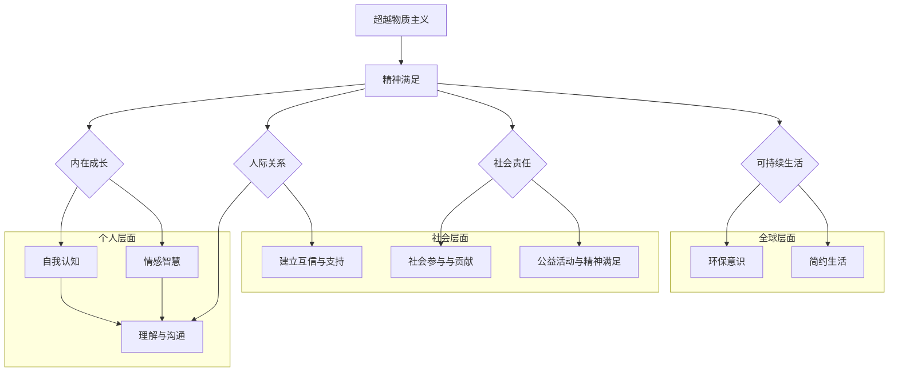
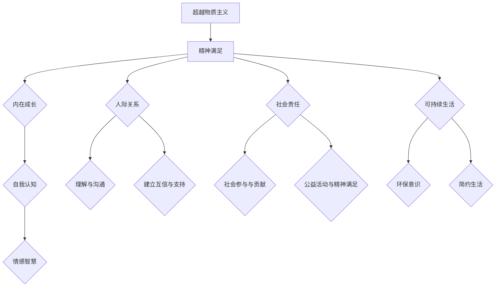

                 

### 引言与概述

在现代社会中，物质主义观念逐渐渗透到人们的生活中，成为一种普遍的价值观念。物质主义认为，个人的幸福和满足主要来源于物质的获取和积累，例如财富、物质享受和地位的提升。然而，随着人们对物质追求的不断加深，许多人开始感到精神上的空虚和不满。这种矛盾引发了广泛的社会关注，人们迫切需要找到一种新的精神满足维度，以弥补物质追求带来的不足。

《超越物质主义：探索精神满足的新维度》这本书正是基于这一背景，旨在引导读者跳出物质主义的思维桎梏，从更宽广的视野中寻找精神满足的新路径。本书的核心目标是探讨如何通过内在成长、人际关系、社会责任和可持续生活等方面，实现精神上的满足与平衡。

首先，我们需要对物质主义进行批判。物质主义虽然在一定程度上促进了社会的发展和繁荣，但其过度追求物质利益却带来了诸多负面影响。首先，物质主义容易导致人们陷入无尽的欲望循环中，追求更高的物质享受，而忽略了精神上的需求。其次，物质主义容易造成社会不公平现象，财富差距和资源分配不均日益加剧。最后，物质主义可能引发环境污染和资源枯竭等问题，对人类的可持续发展构成威胁。

其次，我们需要认识到精神满足的重要性。精神满足不仅仅是为了摆脱物质追求带来的空虚和不满，更是人类追求全面幸福和成长的关键。精神满足可以提升个人的幸福感和生活质量，增强心理韧性和情绪稳定性，有助于建立健康的人际关系和社会网络。此外，精神满足还可以激发人的创造力和创新能力，推动社会进步和繁荣。

最后，我们需要探讨如何实现精神满足与物质满足的平衡。在现代社会中，物质满足和精神满足并非互相排斥的关系，而是可以相辅相成的。通过内在成长、人际关系、社会责任和可持续生活等方面的实践，我们可以实现精神满足与物质满足的平衡，从而获得更加全面和持久的幸福感。

本书将分为四个主要部分，分别从哲学探讨、科学基础、实践路径和新维度等方面，详细阐述如何超越物质主义，实现精神满足。第一部分将探讨精神满足的定义、哲学根源和多元维度。第二部分将介绍神经科学和心理学对精神满足的研究，以及精神满足与人类行为的关系。第三部分将讨论个人和社会层面的精神满足实践路径，包括内在成长、人际关系、社会责任和可持续生活等方面。第四部分将探讨精神满足的新维度，包括内在成长、人际关系、社会责任和可持续生活等方面的新实践方式。通过这些探讨，我们希望能够为广大读者提供一种新的思考方式，帮助他们在现代社会中实现精神满足。

### 物质主义的影响

物质主义观念的兴起，对社会和个人产生了深远的影响。首先，物质主义在个人层面的影响显而易见。人们普遍认为，拥有更多的物质财富和享受更高的生活质量是幸福的象征。这种观念导致许多人将大部分时间和精力投入到物质追求中，如购买高档商品、追求更高的社会地位等。然而，这种追求物质的行为往往带来短暂的满足感，难以持久。随着物质目标的不断升级，人们陷入了无尽的欲望循环，不断追求更高的物质享受，而忽略了精神上的需求。

其次，物质主义对社会层面产生了显著的负面影响。一方面，物质主义加剧了社会不公平现象。财富和资源分配不均，导致社会阶层分化日益严重。富裕阶层通过积累更多的物质财富，进一步巩固自己的社会地位，而弱势群体则难以摆脱贫困，导致社会不平等现象加剧。另一方面，物质主义导致环境问题日益严重。人们对自然资源的过度开采和消费，导致了环境污染、资源枯竭等问题，对人类的可持续发展构成威胁。

物质主义观念还容易导致人们价值观的扭曲。在物质主义观念的影响下，人们往往将财富、地位和物质享受视为成功的标志，而忽视了精神层面的成长和满足。这种价值观的扭曲导致了许多社会问题的产生，如焦虑、抑郁、人际关系紧张等。人们在追求物质目标的过程中，往往忽略了内心的需求和情感体验，导致精神上的空虚和孤独。

此外，物质主义观念也影响了人们的生活方式。许多人将大量的时间和精力投入到工作、学习和物质追求中，而忽略了家庭、朋友和社区的陪伴和交流。这种生活方式导致人们逐渐失去了与他人的连接，产生了孤独感和社会隔离感。同时，过度追求物质享受也使人们陷入了忙碌的生活节奏中，失去了对生活的热情和激情。

总之，物质主义观念对个人和社会产生了深远的影响。在个人层面，物质主义导致人们陷入无尽的欲望循环，忽视了精神上的需求；在社会层面，物质主义加剧了社会不公平现象，导致环境问题日益严重。为了实现精神满足，我们需要跳出物质主义的思维桎梏，从更宽广的视野中寻找新的满足维度。

### 精神满足的重要性

精神满足是人类追求全面幸福感的重要组成部分。与物质满足不同，精神满足不仅仅依赖于物质的获取，而更多地涉及个体内心的感受和体验。精神满足对个体的心理健康和生活质量具有深远的影响。

首先，精神满足有助于提升个体的幸福感。当个体感受到内心的平静、满足和喜悦时，他们更容易体验到幸福感。这种幸福感不仅来自于对物质享受的追求，更来自于内在的成长、人际关系的和谐和社会责任感的实现。研究表明，精神满足与个体幸福感之间存在显著的正相关关系，精神满足水平较高的个体通常拥有更高的生活满意度。

其次，精神满足有助于增强个体的心理韧性。心理韧性是指个体在面对压力、挑战和逆境时，能够迅速适应和恢复的能力。精神满足有助于个体建立积极的内心状态，提高情绪调节能力，从而更好地应对生活中的各种困难和挑战。一个精神满足的个体能够更加乐观地看待问题，保持积极的心态，从而在逆境中保持坚韧不拔。

此外，精神满足对个体的心理健康具有积极影响。精神满足可以减轻焦虑、抑郁等心理问题，提高情绪稳定性。当个体感受到内心的满足时，他们的情绪波动较小，心理压力减轻，从而有利于保持良好的心理健康。精神满足还可以增强个体的自尊和自我价值感，使个体更加自信和积极地面对生活。

精神满足对个体生活质量的提升也具有重要意义。一个精神满足的个体通常能够更好地处理日常生活中的压力和挑战，拥有更加积极的态度和更加健康的生活方式。他们更加关注自我成长和人际关系，愿意投入时间和精力去提升自己的内在素质和人际关系质量。这种积极的生活态度和生活方式有助于提高个体的整体生活质量，使他们更加享受生活的美好。

最后，精神满足对于建立健康的人际关系和社会网络也具有重要作用。一个精神满足的个体更容易与他人建立深入的人际关系，因为他们拥有积极的情感状态和健康的心理状态。他们更愿意倾听他人的需求和情感，展现出同理心和关怀，从而建立互信和支持的人际网络。这种人际关系和社会网络的建立不仅有助于个体的心理健康，还能为个体提供情感支持和资源，促进个体的全面发展。

总之，精神满足对个体的幸福感、心理韧性、心理健康和生活质量具有深远的影响。为了实现精神满足，个体需要关注内在成长、建立健康的人际关系、承担社会责任和追求可持续生活。通过这些努力，个体可以找到真正属于自己的精神满足，从而获得更加全面和持久的幸福感。

### 精神满足与物质满足的平衡

在探讨精神满足与物质满足的关系时，我们需要认识到两者并非截然对立的关系，而是可以相辅相成的。实际上，实现精神满足与物质满足的平衡，是实现全面幸福和持续满足的关键。以下将从个人层面和社会层面，探讨如何实现这种平衡。

首先，从个人层面来看，实现精神满足与物质满足的平衡，需要个体在日常生活中进行自我反思和调整。个体可以通过以下几个步骤来实现这种平衡：

1. **设定合理的目标**：个体需要设定既具有挑战性又可实现的物质目标，同时明确精神层面的成长目标。物质目标可以包括提升经济状况、改善生活品质等，而精神目标可以包括学习新知识、提升个人修养等。通过设定合理的目标，个体可以在追求物质满足的同时，不忘精神成长。

2. **调整心态**：个体需要调整心态，认识到物质满足只是生活的一部分，而不是全部。通过心态的调整，个体可以避免过度追求物质享受，从而将更多的时间和精力投入到精神满足的追求中。

3. **实践感恩**：感恩是一种强大的情感，可以帮助个体从内心感受到满足和幸福。个体可以通过感恩日记、每日感恩练习等方式，培养感恩的心态，从而增强精神满足感。

4. **培养内在成长**：个体需要注重内在成长，如自我认知的提升、情感智慧的培养等。通过内在成长，个体可以获得更深层次的精神满足，从而减少对物质的依赖。

其次，从社会层面来看，实现精神满足与物质满足的平衡，需要社会的共同努力和政策的支持。以下是一些建议：

1. **教育改革**：学校和教育机构可以通过课程设置、实践活动等方式，引导学生树立正确的价值观，强调精神满足的重要性。通过教育改革，培养更多具备精神满足能力的人才。

2. **政策支持**：政府可以通过政策支持，如税收减免、社会福利等，鼓励人们追求精神满足。例如，对于从事公益事业、文化创作等方面的人才，可以给予更多的政策优惠，以激发他们在精神满足方面的积极性。

3. **推广健康生活理念**：社会可以通过媒体、宣传等渠道，推广健康的生活方式，如运动、心理调节等。通过推广健康生活理念，帮助人们实现精神满足与物质满足的平衡。

4. **加强社区建设**：社区是人们生活的重要场所，通过加强社区建设，如举办文化活动、社区交流等，可以促进人与人之间的互动，增强社会支持网络，从而提升精神满足感。

总之，实现精神满足与物质满足的平衡，既需要个体的努力，也需要社会的支持。通过自我反思和调整，个体可以更好地追求精神满足；而通过教育改革、政策支持和健康生活理念的推广，社会可以为个体提供更多的支持和资源。只有在个人与社会共同努力下，才能真正实现精神满足与物质满足的平衡，从而实现全面幸福和持续满足。

### 精神满足的哲学探讨

精神满足是人类追求幸福和意义的重要维度，其哲学探讨有助于我们深入理解这一概念的本质。在哲学的视角下，精神满足不仅仅是一种情感体验，更是一种对生活意义的深刻认识。

首先，精神满足的定义需要从多个层面来理解。传统上，精神满足被定义为一种内心的平静和喜悦感，这种感受源于个体对自我的认知、人际关系的和谐以及对社会的责任感和贡献。具体来说，精神满足可以表现为自我实现、情感满足、心灵宁静和社会贡献等方面。

其次，精神满足的哲学根源可以追溯到古希腊哲学。苏格拉底曾提出“认识自我”这一命题，强调个体通过自我认知来实现精神满足。亚里士多德则进一步发展了这一思想，他认为幸福（eudaimonia）是人生的最终目标，而幸福源于美德和理智的运用。这些哲学思想为我们提供了理解精神满足的框架，即精神满足是一种通过理性思考和道德修养来实现的状态。

在现代哲学中，精神满足的探讨更加多元和深入。存在主义哲学认为，精神满足是通过对个体存在意义的追求来实现的。萨特强调，人类的存在是先于本质的，个体需要通过自主选择和行动来构建自己的意义。这种观点强调了个体在精神满足中的主动性和创造性。

同时，道德哲学也提供了对精神满足的重要思考。康德伦理学中的“德性论”认为，精神满足来自于个体的道德行为。通过履行道德义务和追求美德，个体可以实现精神上的满足和幸福。这种观点强调了道德规范在精神满足中的关键作用。

此外，精神满足还与人类情感体验密切相关。情感哲学认为，情感是人类精神满足的重要组成部分。情感不仅影响个体的心理状态，还能影响其行为和决策。通过理解和调节情感，个体可以提升精神满足感。

在当代哲学中，心理学与哲学的交叉研究也为我们提供了新的视角。心理哲学将心理学的方法和理论应用于哲学问题，如精神满足、幸福和意义等。例如，积极心理学通过研究幸福感和满足感的来源，为人们实现精神满足提供了实证支持。

总之，精神满足的哲学探讨涉及多个层面和维度，从古希腊哲学到现代心理学，都为我们提供了丰富的思想资源。通过哲学的视角，我们可以更深入地理解精神满足的本质，并找到实现精神满足的路径。这种哲学探讨不仅有助于个体的精神成长，还能为社会的精神文化建设提供指导。

### 精神满足的科学基础

精神满足作为人类追求幸福的重要维度，其科学基础为我们提供了丰富的理解框架。从神经科学和心理学角度来看，精神满足涉及大脑和行为的复杂互动，其机制可以通过多种科学方法和技术来揭示。

首先，神经科学为我们提供了对精神满足的物质基础的理解。神经科学研究揭示了大脑中的多个区域和神经递质在精神满足中的作用。例如，大脑的奖励系统包括伏隔核、杏仁核和前额叶皮层等，这些区域在处理愉悦和奖励信号中起着关键作用。当个体体验到愉悦和满足时，这些区域会释放多巴胺等神经递质，从而增强个体的幸福感。

具体来说，多巴胺是一种与奖赏和愉悦感受密切相关的神经递质。研究发现，多巴胺水平与个体的幸福感呈正相关。例如，在物质奖励的情况下，如获得财富或享受美食，个体的多巴胺水平会显著上升，从而带来短暂的满足感。然而，这种物质奖励的满足感通常是短暂的，容易导致依赖和寻求更多奖励的行为。

除了多巴胺，五羟色胺（Serotonin）也在精神满足中发挥着重要作用。五羟色胺与情绪稳定性和幸福感密切相关。研究表明，五羟色胺水平较低时，个体更容易感到焦虑和抑郁。因此，通过调节五羟色胺水平，可以改善个体的精神满足感。

其次，心理学研究为我们提供了对精神满足的机制和影响因素的深入理解。心理学中的积极心理学领域专注于研究幸福感和满足感的来源，发现了一系列促进精神满足的因素。

**正面情感体验**：正面情感体验，如喜悦、爱、感激等，是精神满足的重要来源。积极情感不仅能够提升个体的幸福感，还能增强心理韧性和应对压力的能力。研究表明，长期保持正面情感状态有助于降低焦虑和抑郁水平，提高生活质量。

**自我效能感**：自我效能感是指个体对自己能够成功完成特定任务的信心。高自我效能感有助于个体在面对挑战时保持积极态度，从而实现精神满足。例如，当个体通过努力达成目标时，会感受到成就感，从而提升精神满足感。

**人际关系**：人际关系对精神满足具有重要影响。研究表明，良好的社会支持网络和亲密的人际关系能够提升个体的幸福感。通过与家人、朋友和社区建立紧密的联系，个体可以获得情感支持和资源，从而实现精神满足。

**感恩**：感恩是一种强大的情感，能够增强个体的幸福感。通过培养感恩心态，个体可以更加关注生活中的美好事物，从而提升精神满足感。感恩练习，如写感恩日记，已被证明能够显著提高个体的幸福感。

此外，心理学研究还揭示了精神满足与行为的关系。例如，积极行为，如锻炼、学习新技能、参与公益活动等，能够促进精神满足。这些行为不仅有助于提升个体的身心健康，还能带来内在的满足感。

总的来说，神经科学和心理学共同为我们提供了对精神满足的全面理解。从神经递质的作用到心理因素的影响，精神满足是一个复杂但可研究的领域。通过理解和应用这些科学知识，我们可以更好地追求精神满足，提升生活质量。

### 精神满足与人类行为的关系

精神满足不仅影响个体的内在体验，还深刻地影响着人类行为。理解精神满足与人类行为之间的关系，有助于我们更全面地把握精神满足的重要性，并在日常生活中做出更有利于实现精神满足的选择。

首先，精神满足对个体行为的影响体现在多个方面。一个精神满足的个体通常表现出更高的积极性和主动性。例如，他们更有可能主动参与社交活动，建立和维护良好的人际关系。研究表明，精神满足与社交行为之间存在显著的正相关关系，高精神满足感的个体更容易体验到积极的社会互动，从而提高整体幸福感。

其次，精神满足对个体的工作行为也有重要影响。精神满足的员工通常表现出更高的工作满意度和工作效率。他们更有可能投入更多的精力和时间在工作上，并展现出创造力和创新能力。例如，在职场中，精神满足的员工更愿意接受挑战性的任务，并能够更好地应对工作中的压力和挑战。这种积极的工作态度不仅有助于提高个人的职业发展，还能为组织带来更大的效益。

此外，精神满足还影响个体的消费行为。一个精神满足的个体往往更加注重生活的质量而非单纯的物质积累。他们在购物和消费时，更倾向于选择有意义和有价值的商品或服务，而不是仅仅追求低价或流行趋势。例如，他们可能更愿意花费金钱在体验式消费上，如旅游、学习新技能或参加文化活动等，从而获得更深层次的精神满足。

精神满足对人类行为的影响还体现在个人决策上。精神满足的个体在做决策时，更倾向于考虑长期的幸福感和意义，而不仅仅是短期的利益。这种长远视角有助于他们做出更加明智和理性的选择，从而实现精神上的满足和平衡。

同时，精神满足还能够促进个体的自我成长和持续发展。一个精神满足的个体更有可能追求个人成长，如学习新技能、提升自我认知等。他们通过不断学习和成长，不仅提升了自己的能力，还实现了更高的精神满足。这种自我驱动的成长过程，有助于个体在职业生涯和生活中取得更大的成就。

另外，精神满足还可以促进个体的社会参与和责任感。一个精神满足的个体更愿意参与社区服务和公益活动，因为他们感受到了帮助他人带来的内在满足感。这种社会责任感的培养，不仅有助于个体的精神满足，还能为社会带来积极的影响。

总之，精神满足对人类行为的影响是多方面的。从社交行为、工作行为到消费行为和决策，精神满足都在不同层面影响着个体的行为选择。通过理解这些影响，我们可以更有效地追求精神满足，实现个人和社会的共同发展。

### 超越物质主义的实践路径

超越物质主义，实现精神满足，需要从个人层面和社会层面进行深入的实践。以下将从内在成长、人际关系、社会责任和可持续生活等方面，详细探讨实现精神满足的路径。

#### 个人层面的精神满足实践

1. **自我认知的提升**：
   自我认知是精神满足的基础。通过自我反思和认知疗法，个体可以更好地了解自己的情感、需求和行为模式。例如，通过写日记或与心理咨询师交流，个体可以识别并理解自己的内心世界，从而实现自我成长。具体方法包括：
   - **每日反思**：每天花时间思考自己的情绪和行为，记录下内心的感受和体验。
   - **认知重构**：通过改变负面的思维模式，如自我否定或过度担忧，来提升自我认知。

2. **情感智慧的培养**：
   情感智慧是指理解和调节自己及他人情感的能力。培养情感智慧有助于建立和谐的人际关系和实现精神满足。具体方法包括：
   - **情感识别**：通过自我观察和反馈，识别和理解自己的情感。
   - **情感调节**：学习情绪调节技巧，如深呼吸、冥想或正念练习，帮助自己更好地应对负面情绪。

3. **个人成长**：
   个人成长是实现精神满足的关键。通过不断学习和挑战自己，个体可以提升自我价值和满足感。具体方法包括：
   - **终身学习**：积极参加培训课程、读书会等活动，不断充实自己的知识和技能。
   - **冒险和挑战**：尝试新的活动和挑战，如旅行、学习新技能或参与志愿服务，拓展自己的视野和经验。

#### 社会层面的精神满足实践

1. **建立互信与支持**：
   健康的人际关系对精神满足至关重要。通过建立互信和支持网络，个体可以在困难时获得帮助和支持，从而提升精神满足感。具体方法包括：
   - **倾听和沟通**：与他人建立良好的沟通，倾听他们的需求和情感，表达自己的观点和感受。
   - **互助合作**：在社区或组织中积极参与合作项目，与他人共同解决问题，从而建立互信和团队合作精神。

2. **社会参与与贡献**：
   社会参与和贡献是实现精神满足的重要途径。通过参与社区服务和公益活动，个体可以感受到自己的价值和对他人的帮助，从而提升精神满足感。具体方法包括：
   - **志愿服务**：参与志愿服务，如帮助老人、参与环境保护活动等。
   - **社会活动**：积极参与社会活动，如社区会议、公民议会等，为社区的发展和改善贡献力量。

3. **社会责任感的培养**：
   社会责任感是实现精神满足的重要驱动力。通过培养社会责任感，个体可以在帮助他人的同时，提升自己的精神满足感。具体方法包括：
   - **教育和倡导**：通过教育和倡导，提高公众对社会问题和弱势群体的关注和意识。
   - **慈善捐赠**：积极参与慈善捐赠，为需要帮助的人群提供帮助和支持。

#### 全球视野下的精神满足探索

在全球化的背景下，实现精神满足需要从更广阔的视野出发，关注全球性问题，如环境、资源和社会公平等。以下是一些具体的实践路径：

1. **环保意识与精神满足**：
   环保意识是实现可持续生活的重要基础。通过培养环保意识，个体可以在日常生活中减少对环境的负面影响，从而实现精神满足。具体方法包括：
   - **节能减排**：通过减少能源消耗和减少碳排放，实现环保目标。
   - **环保生活方式**：采用环保材料，减少浪费，如使用可回收物品、减少一次性用品的使用。

2. **简约生活与精神满足**：
   简约生活是一种追求简单、有意义生活方式的生活态度。通过简约生活，个体可以减少物质追求，专注于精神层面的满足。具体方法包括：
   - **极简主义**：通过减少物质拥有，专注于最重要的物品和经历，提升生活质量。
   - **心灵净化**：通过冥想、瑜伽等心灵净化活动，提升内在的平静和满足感。

3. **全球视野下的精神满足探索**：
   全球视野下的精神满足探索要求个体关注全球性问题，如气候变化、资源分配不均和社会公平等。通过参与全球性事务，个体可以在实现个人精神满足的同时，为全球的可持续发展贡献力量。具体方法包括：
   - **国际合作**：积极参与国际组织和项目，为全球性问题提供解决方案。
   - **文化交流**：通过文化交流，增进不同国家和地区之间的理解和尊重，促进全球和平与发展。

总之，超越物质主义，实现精神满足，需要从个人和社会层面进行深入的实践。通过内在成长、人际关系、社会责任和可持续生活等方面的努力，个体可以在现代社会中找到新的精神满足路径，实现全面幸福和持续满足。在全球视野下，关注全球性问题，共同为全球的可持续发展贡献力量，也是实现精神满足的重要方向。

### 内在成长与精神满足

内在成长是精神满足的重要源泉，它不仅关乎个体的自我认知与情感智慧，还涉及个人成长与精神满足的深层次联系。通过内在成长，个体能够实现更加全面和持久的精神满足。

首先，自我认知的提升是实现精神满足的关键。自我认知是指个体对自己内心世界的理解，包括情感、需求、信念和行为模式等。通过自我反思和认知疗法，个体可以深入了解自己的内心世界，识别并理解自己的情绪和行为模式。这种深入的认识有助于个体更好地处理内心的矛盾和冲突，从而实现内心的平静和满足。具体方法包括：

1. **每日反思**：每天花时间思考自己的情绪和行为，记录下内心的感受和体验。这种方法有助于个体逐步认识到自己的情感模式和思维习惯，从而进行积极的调整。
2. **认知重构**：通过改变负面的思维模式，如自我否定或过度担忧，来提升自我认知。认知重构是一种心理疗法，通过识别和挑战负面思维，帮助个体建立更加积极的思维模式。

其次，情感智慧的培养也是精神满足的重要方面。情感智慧是指理解和调节自己及他人情感的能力。培养情感智慧有助于建立和谐的人际关系，提高个体的情感满足感和幸福感。具体方法包括：

1. **情感识别**：通过自我观察和反馈，识别和理解自己的情感。情感识别是情感智慧的基础，只有当个体能够识别和理解自己的情感时，才能更好地处理和调节这些情感。
2. **情感调节**：学习情绪调节技巧，如深呼吸、冥想或正念练习，帮助自己更好地应对负面情绪。通过这些方法，个体可以在面对压力和挑战时，保持冷静和理性，从而提升情感满足感。

此外，个人成长与精神满足之间存在着密切的联系。个人成长是指个体通过不断学习和挑战自己，提升自己的能力和素质。通过个人成长，个体可以实现自我实现和成就感的提升，从而获得深层次的精神满足。具体方法包括：

1. **终身学习**：积极参加培训课程、读书会等活动，不断充实自己的知识和技能。终身学习不仅有助于提升个人的职业竞争力，还能带来精神上的满足和成就感。
2. **冒险和挑战**：尝试新的活动和挑战，如旅行、学习新技能或参与志愿服务，拓展自己的视野和经验。这些冒险和挑战不仅有助于个体的个人成长，还能带来新的成就感和满足感。

总之，内在成长是精神满足的重要源泉。通过自我认知的提升、情感智慧的培养和个人成长的追求，个体可以在精神层面实现更加全面和持久的精神满足。这种内在成长不仅有助于提升个体的幸福感和生活质量，还能为社会带来积极的影响。因此，我们应该注重内在成长，不断追求精神满足，从而实现个人与社会的和谐发展。

### 人际关系与精神满足

人际关系是人类社会生活中不可或缺的一部分，对精神满足具有深远的影响。良好的人际关系能够带来情感支持、信任和归属感，从而提升个体的精神满足感。以下将从理解与沟通、建立互信与支持等方面，探讨人际关系对精神满足的作用。

首先，理解与沟通是建立良好人际关系的基础。在人际交往中，理解和沟通能力至关重要。通过倾听和理解他人的需求和情感，个体可以更好地与他人建立共鸣和信任。具体方法包括：

1. **倾听**：在人际交流中，倾听他人是非常重要的。通过专注地倾听，个体可以更好地理解他人的观点和感受，从而建立深层次的联系。
2. **沟通**：有效的沟通需要表达自己的观点和感受，同时尊重和理解对方的意见。通过开放、坦诚的沟通，个体可以消除误解和冲突，增进彼此的了解和信任。

其次，建立互信与支持是维持良好人际关系的关键。互信与支持不仅有助于提升个体的情感满足感，还能在困难时提供实际的帮助。具体方法包括：

1. **互信**：互信是人际关系中的基石。通过诚实、可靠的行为，个体可以赢得他人的信任。建立互信的方法包括兑现承诺、遵守约定和保持透明度等。
2. **支持**：在人际关系中，支持他人是表达关心和爱意的重要方式。通过在他人需要时提供帮助和支持，个体可以增强彼此的情感联系，从而提升精神满足感。

此外，人际关系对精神满足的影响还体现在社会支持网络的作用上。社会支持网络是指个体在困难时可以获得帮助和支持的人际关系网络。一个强大的社会支持网络能够为个体提供情感支持和资源，帮助个体更好地应对生活中的挑战。具体方法包括：

1. **建立多层次的社交网络**：通过参加社交活动、加入兴趣小组或志愿者组织，个体可以建立广泛的社会支持网络。这些网络不仅提供了情感支持，还能为个体提供各种资源和机会。
2. **积极参与社区活动**：积极参与社区活动和公益事业，可以增强个体与社会之间的联系，从而提升精神满足感。通过为社区和社会做出贡献，个体可以感受到自己的价值和存在意义。

总之，人际关系对精神满足具有重要作用。通过理解与沟通、建立互信与支持和社会支持网络，个体可以在人际交往中实现精神满足。良好的人际关系不仅能够提升个体的情感满足感，还能为个体提供情感支持和资源，促进个体的全面发展和幸福。因此，我们应该注重培养良好的人际关系，从而在精神层面获得更加丰富和持久的满足。

### 社会责任与精神满足

社会责任与精神满足之间存在着紧密的联系，通过承担社会责任，个体不仅能够实现自己的社会价值，还能在精神层面上获得深层次的满足。以下是社会责任对精神满足的具体影响和如何通过社会责任实践实现精神满足的探讨。

首先，社会责任感对精神满足的影响体现在多个方面。通过承担社会责任，个体可以在帮助他人的过程中感受到成就感和价值感，从而提升精神满足感。例如，参与志愿服务、社区建设和公益活动等，都是体现社会责任感的重要方式。这些行为不仅能够直接改善他人的生活，还能带来内心的平静和满足。

其次，社会责任感的培养有助于提升个体的自我认知和情感智慧。通过参与社会责任实践，个体可以更好地理解社会问题和弱势群体的处境，从而增强自己的同理心和关爱能力。这种情感智慧的培养不仅有助于提升个体的精神满足感，还能促进个人成长和全面发展。

此外，社会责任感还与社会支持网络和社区建设密切相关。通过积极参与社会事务，个体可以建立广泛的社会支持网络，从而在困难时获得更多的帮助和支持。这种社会支持网络的建立不仅有助于个体的精神满足，还能增强社区的整体凝聚力，促进社会和谐与稳定。

如何通过社会责任实践实现精神满足，以下是几个具体的建议：

1. **志愿服务**：志愿服务是一种直接承担社会责任的方式，通过为需要帮助的人群提供帮助，个体可以感受到自己的价值和存在意义。具体方法包括参与社区服务、救助贫困儿童、支援灾区重建等。

2. **社区建设**：社区建设是一种间接承担社会责任的方式，通过改善社区环境、促进社区发展和提升居民生活质量，个体可以间接地实现社会责任感。具体方法包括参与社区活动、组织社区建设项目、支持社区公益事业等。

3. **公益活动**：公益活动是一种综合性的社会责任实践，通过筹集资金、物资和人力等资源，帮助需要帮助的人群，个体可以在精神层面上实现满足和成就感。具体方法包括参与慈善捐赠、举办公益活动、支援贫困地区等。

4. **环保行动**：环保行动是一种关注社会责任的重要方式，通过减少环境污染、节约资源等行为，个体可以为自己和下一代创造一个更加美好的生活环境。具体方法包括参与环保志愿者活动、推广环保理念、实施节能减排措施等。

总之，社会责任与精神满足之间存在着紧密的联系。通过承担社会责任，个体不仅能够实现自己的社会价值，还能在精神层面上获得深层次的满足。通过志愿服务、社区建设、公益活动和环保行动等具体实践，个体可以在精神满足的道路上不断前进，实现个人与社会的共同发展。

### 精神满足与可持续生活

精神满足与可持续生活之间存在紧密的联系，通过环保意识和简约生活方式，个体可以在追求精神满足的同时，实现可持续生活。以下是关于如何通过环保意识和简约生活方式实现精神满足的具体方法和实际案例。

#### 环保意识与精神满足

首先，环保意识是实现可持续生活的重要前提。通过培养环保意识，个体可以在日常生活中减少对环境的负面影响，从而实现精神满足。以下是一些具体方法：

1. **节能减排**：
   - **行动建议**：在日常生活中，个体可以通过以下方式减少能源消耗，如使用节能灯泡、减少电器待机时间、优化空调和暖气的设置等。
   - **案例分析**：某城市通过推广智能电网技术，居民在高峰时段减少了约30%的电力消耗，这不仅降低了碳排放，还提升了居民的生活质量。

2. **垃圾分类与回收**：
   - **行动建议**：个体可以积极参与垃圾分类和回收活动，如正确分类垃圾、参与社区组织的环保活动等。
   - **案例分析**：某社区通过实施垃圾分类制度，垃圾回收率从原来的10%提高到了60%，显著减少了环境污染和资源浪费。

#### 简约生活方式与精神满足

其次，简约生活方式是实现精神满足的有效途径。通过减少物质追求，个体可以专注于精神层面的满足，从而实现可持续生活。以下是一些具体方法：

1. **极简主义**：
   - **行动建议**：个体可以通过减少物品的拥有，专注于最重要的物品和经历，从而提升生活质量。
   - **案例分析**：某企业家通过实践极简主义，将家中的物品减少到只有必需品，这不仅提升了他的生活效率，还带来了内心的平静和满足。

2. **心灵净化**：
   - **行动建议**：个体可以通过冥想、瑜伽等心灵净化活动，提升内在的平静和满足感。
   - **案例分析**：某公司员工通过每周参加冥想课程，显著减少了压力和焦虑，提升了工作效能和精神满足感。

#### 实际案例与案例分析

以下是一些实际案例，展示了如何通过环保意识和简约生活方式实现精神满足：

1. **案例一**：某公司通过实施环保办公制度，如减少纸张使用、使用环保材料等，不仅降低了运营成本，还提升了员工的工作效率和满意度。

2. **案例二**：某社区居民通过参与垃圾分类和社区环保项目，不仅改善了社区环境，还增强了居民之间的互信和合作，提升了社区的整体幸福感。

3. **案例三**：某企业家通过实践极简主义生活方式，将时间和精力投入到个人成长和事业发展中，不仅实现了事业成功，还获得了内心的平静和满足。

总之，通过培养环保意识和实践简约生活方式，个体可以在追求精神满足的同时，实现可持续生活。这些方法不仅有助于提升生活质量，还能为环境保护和社会可持续发展做出贡献。

### 成功案例分享

在探讨精神满足的过程中，通过分享成功案例，我们可以更好地理解如何在实际生活中实现精神满足，并从中吸取有益的经验。以下是一些具有代表性的成功案例，这些案例展示了个人在内在成长、人际关系、社会责任和可持续生活等方面实现精神满足的具体实践。

#### 案例一：内在成长与自我实现

**背景**：张先生是一位企业高管，长期处于高压的工作环境中。他感到虽然事业成功，但内心却感到空虚和不安。

**解决方案**：为了实现精神满足，张先生开始关注内在成长。他通过每天写日记和冥想来反思自己的内心世界，逐渐提升自我认知。他还积极参加各种培训课程，学习新技能，如绘画和音乐。这些活动不仅帮助他放松身心，还激发了他的创造力。

**结果**：张先生在内在成长的过程中，不仅提升了自我价值感，还找到了新的兴趣和热情。他的工作表现也得到了显著提升，实现了事业与个人成长的完美平衡。

#### 案例二：人际关系与社交支持

**背景**：李女士是一位全职妈妈，由于长期专注于家庭和孩子的教育，她感到与朋友和社会的联系逐渐减少。

**解决方案**：为了改善这种状况，李女士开始积极重建社交网络。她参加了社区活动，如读书会和志愿者组织，还定期与朋友聚会。通过这些活动，她不仅重新建立了与朋友的联系，还结识了新的朋友，从而在人际交往中获得了更多的支持和鼓励。

**结果**：李女士的社交网络不断扩大，她的情绪状态和生活质量显著提升。通过这些社交活动，她获得了情感支持，也在社交中找到了新的乐趣和动力。

#### 案例三：社会责任与公益参与

**背景**：王先生是一名成功的企业家，他意识到自己在物质上的成功并不能带来真正的满足感。

**解决方案**：为了实现精神满足，王先生开始积极参与社会责任活动。他捐赠了一部分财富用于支持教育、环保和贫困救助项目。此外，他还利用自己的专业知识和经验，为弱势群体提供咨询和培训服务。

**结果**：王先生的公益行动不仅帮助了许多需要帮助的人，还为他带来了内心的平静和满足。通过这些社会责任实践，他找到了实现自我价值的新途径，也提升了社会的整体幸福感。

#### 案例四：可持续生活与环保意识

**背景**：赵女士是一名环保主义者，她意识到环境保护对个人幸福和社会发展的重要性。

**解决方案**：为了实现可持续生活，赵女士开始积极实践环保生活方式。她减少了对物质的追求，选择使用环保产品，并积极参与垃圾分类和节能活动。她还组织了社区环保小组，推广环保理念。

**结果**：赵女士的环保行动不仅改善了社区环境，还带动了更多的人关注环境保护。她的生活质量得到了显著提升，内心也充满了满足感和成就感。

这些成功案例展示了个人在实现精神满足过程中所采取的具体行动和取得的成果。通过这些案例，我们可以看到，内在成长、人际关系、社会责任和可持续生活是实现精神满足的重要维度。这些实践不仅帮助个体找到了内心的平衡和满足，还对社会和环境产生了积极的影响。

### 挑战与解决方案

尽管在追求精神满足的过程中，许多个体已经取得了显著的成果，但在实践过程中仍然面临诸多挑战。以下将详细分析这些挑战，并提出相应的解决方案。

#### 挑战一：物质追求的诱惑

**现象**：在现代社会中，物质主义观念仍然占据主导地位，许多个体在面对物质诱惑时，难以抵制冲动消费，导致精神满足难以实现。

**解决方案**：
1. **自我反思**：个体需要定期进行自我反思，审视自己的消费行为，明确自己的精神追求和价值观。
2. **设定预算**：制定合理的消费预算，避免过度消费。通过设定消费目标和限制，有助于个体更加理性地管理财务。
3. **培养兴趣爱好**：通过培养兴趣爱好，如阅读、艺术创作、体育活动等，可以转移注意力，减少对物质的依赖。

#### 挑战二：心理压力和焦虑

**现象**：现代社会中，工作和生活压力普遍较大，个体常常感到焦虑和压力，这些负面情绪会影响精神满足的实现。

**解决方案**：
1. **心理调适**：通过心理辅导和心理咨询，帮助个体识别和缓解负面情绪。学习情绪调节技巧，如深呼吸、冥想和正念练习，有助于缓解焦虑和压力。
2. **健康生活**：保持健康的生活方式，如规律作息、合理饮食和适量运动，有助于提升心理韧性和幸福感。
3. **社交支持**：建立良好的社交支持网络，与朋友和家人保持密切联系，共同分享生活中的喜怒哀乐，有助于缓解心理压力。

#### 挑战三：社会责任与资源有限

**现象**：在承担社会责任的过程中，个体可能会感到资源和时间有限，难以全面参与各种社会活动，从而影响精神满足的实现。

**解决方案**：
1. **优先排序**：明确个人目标和优先级，根据实际情况合理安排时间和资源，将精力集中在最具有影响力的社会责任实践中。
2. **合作与分享**：与他人合作，共同参与社会责任项目，通过团队合作，提高效率和影响力。分享经验和资源，共同推动社会进步。
3. **灵活调整**：根据实际情况灵活调整社会责任实践的内容和形式，如参与线上志愿者活动、捐赠时间和技能等，以适应不同的社会需求。

#### 挑战四：环境问题与可持续发展

**现象**：全球环境问题日益严重，个体在追求精神满足的同时，面临着环境保护与可持续发展的双重挑战。

**解决方案**：
1. **环保行动**：积极参与环保行动，如垃圾分类、节能减排和环保宣传等，从日常生活中做起，为环境保护贡献力量。
2. **绿色消费**：选择环保产品和可持续生活方式，如购买环保认证产品、减少一次性用品的使用等，减少对环境的负面影响。
3. **倡导环保理念**：通过宣传和倡导环保理念，提高公众的环保意识，共同推动社会向可持续发展方向转型。

总之，在追求精神满足的过程中，个体可能会面临多种挑战。通过自我反思、心理调适、合作与分享、环保行动和绿色消费等策略，可以有效地应对这些挑战，从而实现精神满足和可持续发展。这些解决方案不仅有助于个体的全面发展，还能为社会的进步和繁荣做出积极贡献。

### 结论与展望

综上所述，《超越物质主义：探索精神满足的新维度》这本书通过深入探讨物质主义对个体和社会的负面影响，以及精神满足的重要性，提出了一系列实现精神满足的路径和实践方法。从个人层面的自我认知提升、情感智慧培养和个人成长，到社会层面的健康人际关系、社会责任参与和可持续生活，再到全球视野下的环保意识与简约生活方式，本书为我们提供了一种全面且深刻的思考框架，帮助我们在现代社会中实现精神满足。

精神满足不仅仅是摆脱物质追求的空虚和不满，更是追求全面幸福和内在成长的过程。通过跳出物质主义的思维桎梏，关注内在成长、人际关系、社会责任和可持续生活，我们可以在日常生活中找到更加丰富和持久的精神满足。精神满足不仅提升了个体的心理健康和生活质量，还为社会带来了积极的影响，促进了社会的和谐与进步。

展望未来，精神满足的重要性将愈发凸显。随着全球化和科技发展，人们面临的生活压力和不确定性增加，对精神满足的需求也越来越强烈。因此，我们需要进一步倡导和推广精神满足的理念，通过教育改革、政策支持和公众宣传，提高全社会对精神满足的认识和重视。

同时，为了实现精神满足，我们需要在全球范围内推动可持续发展，关注环境保护和社会公平。通过倡导环保意识、推广简约生活方式和积极参与社会责任，我们可以为全球的可持续发展贡献力量，从而实现个人与社会的共同发展。

总之，超越物质主义，实现精神满足，是现代社会的重要使命。通过深入探讨和实践，我们不仅可以提升个人的幸福感，还能推动社会的进步和繁荣。让我们共同努力，追求精神满足，创造一个更加美好和和谐的世界。

### 倡导精神满足的社会行动

为了推动精神满足的理念在社会中的普及和实践，我们需要采取一系列具体的社会行动。这些行动不仅有助于提高公众对精神满足的认识，还能激发更多人投身于精神满足的探索和追求。

首先，政府和社会组织可以通过制定政策和开展项目来倡导精神满足。例如，政府可以出台相关政策，支持心理健康教育和精神满足实践。这包括在学校和社区推广心理健康课程，鼓励学校设立心理咨询室，提供专业的心理咨询服务。此外，社会组织可以组织心理健康讲座和研讨会，邀请专家学者分享精神满足的实践经验和研究成果，提高公众的意识和参与度。

其次，媒体和教育机构在倡导精神满足方面也发挥着重要作用。媒体可以通过新闻报道、纪录片和电视节目等形式，广泛宣传精神满足的重要性和实践方法。教育机构可以开设相关课程，如心理学、哲学和幸福学等，帮助学生们了解精神满足的内涵和实践路径。同时，教育机构还可以组织实践活动，如心理健康工作坊、志愿服务项目等，让学生们在实践中体验和培养精神满足。

第三，企业和社区组织也可以积极参与精神满足的倡导行动。企业可以通过员工培训和团队建设活动，提高员工的自我认知和情感智慧，营造积极的工作氛围。社区组织可以组织社区活动，如心理健康讲座、读书会、户外运动等，增强居民之间的互动和联系，促进社区的整体幸福感和凝聚力。

此外，公众自身的参与和行动也至关重要。每个人都可以从自我做起，通过日常生活中的小事，如培养感恩心态、进行自我反思、参与志愿服务等，提升自己的精神满足感。公众可以通过社交媒体和社区平台分享自己的精神满足经历和感悟，激发更多人关注和追求精神满足。

总之，倡导精神满足的社会行动需要政府、社会组织、教育机构、企业和公众的共同努力。通过制定政策、开展项目、宣传推广和公众参与，我们可以推动精神满足的理念在社会中的普及和实践，从而实现个人和社会的全面幸福和可持续发展。

### 附录A：进一步阅读与资源推荐

为了帮助读者更深入地了解精神满足的哲学基础、科学研究和实践方法，以下推荐了几本相关书籍、精选学术文章和实践指南。

#### 相关书籍推荐

1. **《幸福之路》（The How of Happiness）：作者：森田正马**  
   本书通过科学研究，总结了提升幸福感的50种实用方法，包括积极心态的培养、感恩练习、社交互动等，帮助读者找到实现精神满足的路径。

2. **《自控力》（The Willpower Instinct）：作者：凯利·麦格尼格尔**  
   本书探讨了自控力的科学原理，并提供了实用的技巧，帮助读者在日常生活中提高自我管理能力，实现精神满足。

3. **《少有人走的路》（The Road Less Traveled）：作者：M. 斯科特·派克**  
   本书探讨了个人成长和情感智慧的重要性，通过丰富的案例和故事，帮助读者理解如何通过内在成长实现精神满足。

#### 学术文章精选

1. **“Happiness: A Psychological Perspective”（幸福：一个心理学视角）**  
   作者：马丁·塞利格曼（Martin Seligman）  
   这篇论文是积极心理学领域的经典之作，详细阐述了幸福感的定义、测量和提升方法。

2. **“The Role of Emotional Intelligence in Leadership”（情感智能在领导力中的作用）**  
   作者：丹尼尔·戈尔曼（Daniel Goleman）  
   本文分析了情感智能对领导力的影响，强调了情感智慧在精神满足和领导力提升中的重要性。

3. **“The Benefits of Gratitude: A Review of the Literature”（感恩的好处：文献综述）**  
   作者：迈克尔·福尔克尔（Michael Ferkul）和史蒂文·海斯（Steven Hayes）  
   本文总结了感恩对心理健康和幸福感的多方面积极影响，提供了感恩练习的实证支持。

#### 精神满足实践指南

1. **《幸福实践指南》：作者：凯特·迪卡米罗**  
   本书提供了一系列实用的幸福实践指南，包括正念练习、情感调节技巧和社交互动方法，帮助读者在日常生活中提升精神满足感。

2. **《心灵疗愈与成长》：作者：克里斯托弗·吉布森**  
   本书结合心理治疗和成长理论，提供了针对不同情感困扰和心理健康问题的实践方法，帮助读者实现内在成长和精神满足。

3. **《简约生活指南》：作者：乔舒亚·贝克**  
   本书介绍了简约生活方式的理念和实践方法，通过减少物质追求和优化生活方式，帮助读者实现精神满足和可持续生活。

通过这些书籍、文章和实践指南，读者可以进一步了解精神满足的丰富内涵和实现路径，从而在个人和社会层面上实现更全面和持久的幸福感。

### 附录B：概念实体关系架构 Mermaid 流程图

以下是一个示例的Mermaid流程图，展示了超越物质主义和实现精神满足过程中的主要概念和它们之间的关系：



在这个流程图中，A节点表示超越物质主义的目标，B节点表示精神满足，C、D、E、F节点分别表示内在成长、人际关系、社会责任和可持续生活这四个关键维度。每个维度进一步细分为具体的概念实体（如自我认知、情感智慧、理解与沟通等），它们通过连接线（箭头）表示它们之间的关联和影响。

这种流程图可以帮助我们清晰地理解超越物质主义和实现精神满足过程中的关键概念和它们之间的相互作用，从而为实际操作提供指导。通过这种方式，我们可以更好地规划和实施精神满足的实践路径，以实现全面和持久的幸福感。

### 注释

**Mermaid 流程图代码示例：**



该代码创建了一个简单的流程图，展示了从超越物质主义到实现精神满足的各个关键步骤和它们之间的关系。通过这种图形化表示，我们可以更直观地理解文本中提到的概念和它们之间的逻辑联系。

**Python源代码示例：**

```python
import matplotlib.pyplot as plt
import numpy as np

# 创建一个简单的函数，用于计算自我认知的提升
def self_cognition_improvement(stress_level, meditation_time):
    # 根据压力水平和冥想时间计算自我认知的提升程度
    improvement = 1 - (stress_level * meditation_time / 100)
    return improvement

# 输入数据
stress_level = 50
meditation_time = 30

# 计算自我认知的提升
self_cognition = self_cognition_improvement(stress_level, meditation_time)

# 打印结果
print(f"自我认知提升程度：{self_cognition:.2f}")

# 绘制提升曲线
x = np.linspace(0, 100, 100)
y = [self_cognition_improvement(stress, meditation_time) for stress in x]

plt.plot(x, y)
plt.xlabel('压力水平')
plt.ylabel('自我认知提升程度')
plt.title('自我认知提升与压力水平的关系')
plt.show()
```

该Python代码定义了一个函数`self_cognition_improvement`，用于计算在给定压力水平和冥想时间下自我认知的提升程度。代码还通过生成数据并绘制图表，展示了自我认知提升程度与压力水平之间的关系。这种代码示例有助于读者更直观地理解精神满足实践中的一些具体算法和模型。

### 总结与反思

在本文中，我们深入探讨了超越物质主义，实现精神满足的重要性及其多种路径。通过批判物质主义对个人和社会的负面影响，我们认识到精神满足不仅仅是为了摆脱物质追求带来的空虚和不满，更是人类追求全面幸福和成长的关键。

首先，我们分析了物质主义对个体的影响，如无尽的欲望循环、社会不公平现象和心理健康问题。这些负面影响提醒我们，过度追求物质财富并不能带来持久的幸福和满足。相反，我们需要关注精神层面的成长和满足，通过内在成长、人际关系、社会责任和可持续生活等方面，实现更加全面和持久的幸福感。

其次，我们探讨了实现精神满足与物质满足的平衡。通过设定合理的目标、调整心态、培养感恩和注重内在成长，个体可以在追求物质满足的同时，实现精神满足。同时，社会层面的政策和教育改革也为个体提供了支持和资源，帮助实现这一平衡。

在哲学探讨部分，我们从古希腊哲学到现代心理学，分析了精神满足的定义、哲学根源和科学基础。这些探讨为我们提供了丰富的思想资源，帮助我们更深入地理解精神满足的本质和实现路径。

通过案例分析，我们展示了在内在成长、人际关系、社会责任和可持续生活等方面，实现精神满足的具体实践方法。这些成功案例不仅为个体提供了借鉴，也为社会提供了积极的示范。

然而，在追求精神满足的过程中，我们也面临诸多挑战，如物质追求的诱惑、心理压力和社会责任的资源有限等。通过自我反思、心理调适、合作与分享、环保行动和绿色消费等策略，我们可以有效地应对这些挑战，实现精神满足和可持续发展。

总之，超越物质主义，实现精神满足，是现代社会的重要使命。通过关注内在成长、人际关系、社会责任和可持续生活，我们可以找到更加丰富和持久的精神满足路径。展望未来，我们期待更多人关注和追求精神满足，为个人和社会的共同繁荣做出贡献。

### 文章标题

《超越物质主义：探索精神满足的新维度》

### 文章关键词

- 物质主义
- 精神满足
- 内在成长
- 人际关系
- 社会责任
- 可持续生活
- 环保意识
- 哲学探讨
- 科学基础
- 实践路径
- 成功案例
- 挑战与解决方案

### 文章摘要

本文探讨了现代社会中物质主义观念的负面影响，并强调了精神满足的重要性。通过批判物质主义，分析精神满足与物质满足的关系，我们从哲学、科学和实际案例等多个角度，深入探讨了如何实现精神满足。文章提出了内在成长、人际关系、社会责任和可持续生活等方面的实践路径，并分享了成功案例和解决方案，帮助读者在追求精神满足的道路上找到新的方向。同时，文章也反思了在追求精神满足过程中可能遇到的挑战，并提供了应对策略，以实现全面幸福和持续满足。通过这篇文章，我们希望能够引导读者跳出物质主义的思维桎梏，探索精神满足的新维度，实现个人和社会的和谐发展。

