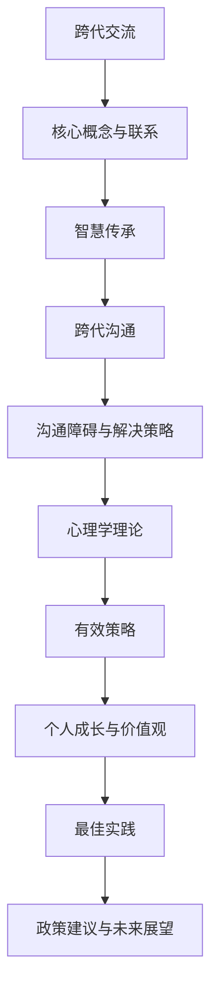

                 

# 跨代交流：年龄差异中的智慧传承

## 关键词

- 年龄差异
- 智慧传承
- 跨代交流
- 心理学因素
- 教育体系
- 社会意义
- 心理学理论
- 沟通策略

## 摘要

本文旨在探讨年龄差异在跨代交流中的作用，以及如何通过智慧传承来促进有效的跨代沟通。在现代社会中，随着代际之间的生活方式、价值观和认知模式的差异日益明显，如何搭建起不同年龄群体之间的交流桥梁，成为了一个亟待解决的重要问题。本文首先概述了跨代交流的重要性，分析了年龄差异带来的心理因素，探讨了跨代交流中的有效策略。随后，文章深入探讨了智慧传承的概念及其在跨代交流中的作用，详细阐述了跨代间的知识传递和教育体系中的跨代交流实践。最后，文章通过社会中的跨代交流和跨代交流与个人成长的关系，总结出跨代交流的最佳实践，并为未来政策制定提供了一些建议。

## 《跨代交流：年龄差异中的智慧传承》目录大纲

### 第一部分：跨代交流概述

#### 1. 跨代交流的重要性
- **1.1 年龄差异在社会中的普遍性**
- **1.2 跨代交流的挑战与机遇**
- **1.3 跨代交流的社会影响**

#### 2. 跨代交流中的心理因素
- **2.1 年龄差异与认知差异**
- **2.2 跨代沟通中的障碍与误解**
- **2.3 心理学理论在跨代交流中的应用**

#### 3. 跨代交流的有效策略
- **3.1 建立信任与尊重**
- **3.2 提高沟通技巧**
- **3.3 利用科技促进跨代交流**

### 第二部分：智慧传承与跨代交流

#### 4. 智慧传承的重要性
- **4.1 智慧传承的概念与内涵**
- **4.2 智慧传承在跨代交流中的作用**
- **4.3 智慧传承的社会意义**

#### 5. 跨代间的知识传递
- **5.1 亲子间的知识传递**
- **5.2 长辈与晚辈的知识共享**
- **5.3 知识传递的障碍与解决策略**

#### 6. 教育体系中的跨代交流
- **6.1 学校教育中的跨代交流**
- **6.2 家庭教育与学校教育的融合**
- **6.3 跨代交流在教育改革中的应用**

#### 7. 社会中的跨代交流
- **7.1 跨代工作环境中的交流**
- **7.2 社区活动中的跨代交流**
- **7.3 跨代交流在社会治理中的角色**

#### 8. 跨代交流与个人成长
- **8.1 跨代交流对个人认知发展的影响**
- **8.2 跨代交流对个人情感发展的影响**
- **8.3 跨代交流与个人价值观的塑造**

### 第三部分：跨代交流的最佳实践

#### 9. 案例研究：成功的跨代交流实例
- **9.1 家庭中的成功跨代交流案例**
- **9.2 企业中的跨代交流实践**
- **9.3 社区活动中的跨代交流案例**

#### 10. 政策建议与未来展望
- **10.1 促进跨代交流的政策建议**
- **10.2 跨代交流的未来发展趋势**
- **10.3 跨代交流对社会的长远影响**

#### 11. 附录
- **11.1 跨代交流研究资源**
- **11.2 参考文献**
- **11.3 智慧传承与跨代交流相关的心理学理论**

### Mermaid 流程图示例



### Python代码示例

```python
# 智慧传承的核心算法原理讲解
import numpy as np

# 初始化模型参数
weights = np.random.rand(3, 3)
biases = np.random.rand(3)

# 定义前向传播函数
def forwardPropagation(input_data):
    # 这里是一个简单的线性模型
    return np.dot(input_data, weights) + biases

# 测试数据
input_data = np.array([1, 2, 3])

# 计算输出
output = forwardPropagation(input_data)
print("Output:", output)
```

### 数学公式示例

```
$$
1+1=2
$$

$$
x^2 + 2xy + y^2 = (x+y)^2
$$
```

## 第一部分：跨代交流概述

### 1. 跨代交流的重要性

#### 1.1 年龄差异在社会中的普遍性

在社会发展过程中，年龄差异是一个不可忽视的普遍现象。不同年龄段的人群，由于生活经历、教育背景、社会角色等方面的差异，往往形成了各自独特的认知模式和行为方式。这种差异不仅体现在日常生活中的互动交流中，也在社会运行和管理中有着重要影响。

年龄差异的普遍性可以从以下几个方面进行阐述：

1. **家庭层面**：家庭成员之间的年龄差异不仅体现在亲子关系中，还包括祖辈与孙辈之间的交流。不同年龄阶段的家庭成员在价值观、生活方式等方面存在差异，这无疑增加了家庭内部的沟通难度。
2. **工作环境**：在职场中，不同年龄阶段的员工由于经验、技能和职业目标的不同，往往形成了各自的工作方式和习惯。这种年龄差异可能导致代际之间的沟通障碍，影响团队协作效率。
3. **社会层面**：在社会治理和社会参与中，年龄差异也是一个重要因素。不同年龄段的人群对社会问题的关注点和参与方式存在差异，这种差异在一定程度上影响了社会稳定和发展。

#### 1.2 跨代交流的挑战与机遇

跨代交流不仅是家庭和社会稳定的重要保障，也是促进知识传承和创新的重要途径。然而，跨代交流面临着一系列挑战：

1. **语言障碍**：不同年龄阶段的人由于成长环境的不同，往往使用不同的语言表达方式。这种语言障碍可能导致沟通误解和隔阂。
2. **认知差异**：年龄差异带来的认知差异是跨代交流中的另一个重要挑战。不同年龄段的人对于同一问题的理解和看法可能存在显著差异，这需要沟通双方进行有效的调整和适应。
3. **价值观差异**：不同年龄阶段的人受到的社会影响和教育背景不同，导致其价值观和世界观存在差异。这些差异可能导致跨代交流中的冲突和矛盾。

尽管存在挑战，跨代交流也带来了诸多机遇：

1. **知识传承**：通过跨代交流，年轻一代可以从年长一代的经验和智慧中汲取宝贵的知识，实现知识的传承和创新。
2. **文化融合**：跨代交流促进了不同年龄文化之间的交流和融合，有助于形成多元化的文化氛围，推动社会进步。
3. **情感纽带**：良好的跨代交流有助于增强家庭成员之间的情感联系，提升家庭的凝聚力和幸福感。

#### 1.3 跨代交流的社会影响

跨代交流不仅对个体成长和社会稳定有着重要影响，也在社会发展中发挥着重要作用：

1. **家庭稳定**：良好的跨代交流有助于家庭成员之间的理解和信任，减少家庭内部的矛盾和冲突，促进家庭和谐。
2. **社会和谐**：跨代交流促进了不同年龄群体之间的理解和尊重，有助于构建和谐社会。
3. **知识创新**：跨代交流为知识的传承和创新提供了平台，推动了社会进步和发展。

### 2. 跨代交流中的心理因素

#### 2.1 年龄差异与认知差异

跨代交流中的心理因素主要体现在年龄差异带来的认知差异上。不同年龄阶段的人由于成长环境、社会角色和生活经历的不同，形成了各自独特的认知模式。这种认知差异主要体现在以下几个方面：

1. **信息处理方式**：年长一代更倾向于基于经验和直觉进行信息处理，而年轻一代则更倾向于基于数据和逻辑进行思考。这种信息处理方式的差异导致了跨代交流中的信息传递和理解困难。
2. **问题解决策略**：年长一代在解决问题时更倾向于使用传统的方法和经验，而年轻一代则更愿意尝试创新和探索新的解决方案。这种差异可能导致跨代交流中对于问题的不同看法和解决方案的冲突。
3. **价值观和世界观**：不同年龄阶段的价值观和世界观存在显著差异。年长一代更注重稳定和传统，而年轻一代则更注重变化和创新。这种差异可能导致跨代交流中的价值观冲突和文化冲突。

#### 2.2 跨代沟通中的障碍与误解

跨代沟通中的障碍和误解是跨代交流中普遍存在的问题。这些障碍和误解主要体现在以下几个方面：

1. **语言障碍**：不同年龄阶段的人由于成长环境的不同，往往使用不同的语言表达方式。这种语言障碍可能导致沟通误解和隔阂。
2. **认知差异**：年龄差异带来的认知差异是跨代沟通中的另一个重要障碍。不同年龄段的人对于同一问题的理解和看法可能存在显著差异，这需要沟通双方进行有效的调整和适应。
3. **情感差异**：不同年龄阶段的人由于生活经历和社会角色的不同，往往在情感表达和处理方式上存在差异。这种差异可能导致跨代沟通中的情感冲突和误解。

#### 2.3 心理学理论在跨代交流中的应用

心理学理论为跨代交流提供了重要的理论支持和指导。以下是一些常见的心理学理论及其在跨代交流中的应用：

1. **社会化理论**：社会化理论认为，个体的行为和认知是通过与社会环境的互动中形成的。跨代交流中，社会化理论可以帮助我们理解不同年龄阶段的人如何通过社会互动来塑造自己的认知和行为。
2. **认知发展理论**：认知发展理论，如皮亚杰的认知发展阶段理论，可以帮助我们理解不同年龄段的人如何通过认知发展来适应和应对跨代交流中的挑战。
3. **情感理论**：情感理论，如情商理论，可以帮助我们理解不同年龄阶段的人如何通过情感表达和调节来促进跨代交流的有效性。

### 3. 跨代交流的有效策略

#### 3.1 建立信任与尊重

建立信任和尊重是跨代交流成功的关键。以下是一些具体的策略：

1. **倾听和理解**：在跨代交流中，倾听和理解对方的观点和需求是非常重要的。通过倾听和理解，可以建立起双方的信任和尊重。
2. **分享经验和知识**：年长一代可以分享自己的经验和知识，年轻一代也可以分享自己的见解和创新。这种知识分享有助于增进双方的信任和尊重。
3. **相互尊重文化差异**：不同年龄阶段的人由于成长环境的不同，往往形成了不同的文化和价值观。在跨代交流中，相互尊重文化差异是建立信任和尊重的基础。

#### 3.2 提高沟通技巧

提高沟通技巧是跨代交流中的另一个重要策略。以下是一些具体的建议：

1. **使用简单的语言**：在跨代交流中，使用简单的、易懂的语言是非常重要的。这有助于减少语言障碍和误解。
2. **避免争论和冲突**：在跨代交流中，避免争论和冲突是非常必要的。通过平和的沟通方式，可以更好地解决问题和增进理解。
3. **使用情感共鸣**：在跨代交流中，使用情感共鸣可以有效地增进双方的情感联系和理解。通过情感共鸣，可以更好地理解对方的感受和需求。

#### 3.3 利用科技促进跨代交流

科技的发展为跨代交流提供了新的可能性。以下是一些利用科技促进跨代交流的建议：

1. **使用社交媒体**：社交媒体为跨代交流提供了一个便捷的平台。通过社交媒体，不同年龄阶段的人可以轻松地交流和分享信息。
2. **使用视频通话**：视频通话可以有效地模拟面对面的交流体验，有助于增进双方的互动和理解。
3. **使用智能设备**：智能设备，如智能手表、智能音箱等，可以帮助不同年龄阶段的人更好地进行交流和互动。

## 第二部分：智慧传承与跨代交流

### 4. 智慧传承的重要性

#### 4.1 智慧传承的概念与内涵

智慧传承是指将一个时代、一个社群、一个家庭或个人的智慧、经验、知识和价值观传递给下一代的过程。智慧传承不仅仅是知识的传递，更是一种文化、精神和价值观的传承。

智慧传承的内涵主要包括：

1. **经验与知识的传递**：智慧传承首先体现在经验和知识的传递上。年长一代通过生活经验和专业知识的传授，帮助年轻一代更快地成长和进步。
2. **价值观与道德观的传递**：智慧传承还包括对下一代进行价值观和道德观的培养。这有助于年轻一代形成正确的世界观、人生观和价值观。
3. **文化与传统知识的传递**：智慧传承还包括对传统文化的传承。通过传承传统文化和习俗，可以增强社群的凝聚力和认同感。

#### 4.2 智慧传承在跨代交流中的作用

智慧传承在跨代交流中扮演着重要角色，具体表现在以下几个方面：

1. **增进理解和信任**：智慧传承有助于增进不同年龄阶段的人之间的理解和信任。通过分享经验和知识，双方可以更好地理解对方的观点和需求，从而建立更紧密的关系。
2. **促进知识和技能的提升**：智慧传承为年轻一代提供了宝贵的知识和技能。这有助于他们更快地成长和进步，提升自身的竞争力。
3. **促进文化传承和创新**：智慧传承不仅有助于传统文化的传承，还可以激发创新。通过融合传统和现代，可以创造出更多具有时代特色的新文化和新价值。

#### 4.3 智慧传承的社会意义

智慧传承具有重要的社会意义，主要体现在以下几个方面：

1. **社会稳定与和谐**：智慧传承有助于增强社会的凝聚力和稳定性。通过传承文化和价值观，可以促进社会成员之间的相互理解和尊重，减少社会矛盾和冲突。
2. **知识创新与进步**：智慧传承为社会的知识创新和进步提供了重要支持。通过传承经验和知识，可以激发新的思想和创新，推动社会的发展和进步。
3. **个人成长与自我实现**：智慧传承有助于个人的成长和自我实现。通过传承文化和价值观，个人可以更好地认识自己，明确自己的人生目标和价值取向。

### 5. 跨代间的知识传递

#### 5.1 亲子间的知识传递

亲子间的知识传递是智慧传承的重要组成部分。以下是一些亲子间知识传递的有效方法：

1. **亲子互动**：通过亲子互动，家长可以与孩子分享自己的知识和经验。这种互动不仅有助于知识的传递，还可以增进亲子关系。
2. **共同活动**：家长可以与孩子一起参与各种活动，如读书、游戏、旅行等。在这些活动中，家长可以分享自己的见解和体验，帮助孩子拓宽视野和增长知识。
3. **榜样作用**：家长通过自己的行为和言行举止，为孩子树立了榜样。孩子通过模仿和学习，可以更好地吸收和内化家长的知识和价值观。

#### 5.2 长辈与晚辈的知识共享

长辈与晚辈的知识共享是跨代间知识传递的重要途径。以下是一些有效的知识共享方法：

1. **经验分享**：长辈可以通过讲述自己的经历和故事，与晚辈分享自己的经验和智慧。这种方式不仅有助于知识的传递，还可以激发晚辈的思考和理解。
2. **专业指导**：长辈可以根据自己的专业知识和经验，对晚辈进行指导和辅导。这种方式有助于晚辈快速提升自己的专业能力。
3. **互动交流**：长辈与晚辈可以通过定期交流，分享彼此的学习心得和体验。这种方式有助于增进双方的互动和理解，促进知识传递。

#### 5.3 知识传递的障碍与解决策略

跨代间知识传递面临着一系列障碍，如语言障碍、认知差异和文化差异等。以下是一些解决策略：

1. **语言桥梁**：通过使用简单易懂的语言，可以减少语言障碍。此外，借助翻译工具和辅助工具，也可以帮助不同语言背景的人进行有效沟通。
2. **适应差异**：针对认知差异，可以通过调整教学方法和内容，使其更符合不同年龄段的人的认知特点。此外，通过互动和体验，可以更好地激发学习兴趣和理解。
3. **文化融合**：针对文化差异，可以通过相互尊重和理解，促进文化融合。通过尊重彼此的文化背景和价值观，可以减少文化冲突和误解。

### 6. 教育体系中的跨代交流

#### 6.1 学校教育中的跨代交流

学校教育是跨代交流的重要场所。以下是一些学校教育中跨代交流的方法和策略：

1. **家校合作**：通过家校合作，家长和学校可以共同参与孩子的教育和成长。这种方式有助于促进跨代交流，增强家庭和学校之间的沟通和理解。
2. **跨代教学**：通过邀请年长人士参与教学，可以促进不同年龄阶段的学生之间的交流和互动。这种方式不仅有助于知识的传递，还可以拓宽学生的视野。
3. **互动体验**：通过组织学生参与各种互动体验活动，如参观博物馆、科技馆等，可以促进跨代交流，增强学生的实践能力和创新能力。

#### 6.2 家庭教育与学校教育的融合

家庭教育与学校教育的融合是跨代交流的重要方向。以下是一些融合的策略：

1. **共同学习**：家庭和学校可以共同制定学习计划和目标，共同参与孩子的学习和成长。这种方式有助于促进家庭和学校之间的沟通和理解，增强教育的整体效果。
2. **资源共享**：家庭和学校可以共享教育资源，如书籍、电子设备等。这种方式有助于提高资源的利用效率，促进知识的传递和交流。
3. **互动评价**：家庭和学校可以共同参与学生的评价和反馈，分享彼此的观点和建议。这种方式有助于促进家庭和学校之间的沟通和理解，提高教育的质量和效果。

#### 6.3 跨代交流在教育改革中的应用

跨代交流在教育改革中的应用具有重要意义。以下是一些应用方向：

1. **教育理念更新**：通过跨代交流，可以促进教育理念的更新和变革。例如，通过引入跨代教育理念，可以更好地满足不同年龄段学生的学习需求，提高教育的个性化和差异化。
2. **教学方法创新**：通过跨代交流，可以促进教学方法的创新和改进。例如，通过引入跨代互动教学，可以激发学生的学习兴趣和参与度，提高教学效果。
3. **教育资源共享**：通过跨代交流，可以促进教育资源的共享和优化。例如，通过家庭和学校的资源共享，可以更好地满足学生的学习需求，提高教育资源的利用效率。

### 7. 社会中的跨代交流

#### 7.1 跨代工作环境中的交流

跨代工作环境中的交流是跨代交流的重要领域。以下是一些跨代工作环境中交流的方法和策略：

1. **培训与指导**：企业可以通过培训和指导，提高不同年龄阶段的员工的沟通技巧和团队合作能力。这种方式有助于促进跨代工作环境中的交流和协作。
2. **共同项目**：企业可以通过组织共同项目，促进不同年龄阶段的员工之间的交流和互动。这种方式有助于增强团队的凝聚力和合作能力。
3. **文化建设**：企业可以通过文化建设，营造尊重和包容的氛围，促进跨代工作环境中的交流。这种方式有助于减少代际差异，增强团队的和谐与凝聚力。

#### 7.2 社区活动中的跨代交流

社区活动是跨代交流的重要平台。以下是一些社区活动中跨代交流的方法和策略：

1. **互动活动**：社区可以组织各种互动活动，如座谈会、讲座、文化节等，促进不同年龄阶段的居民之间的交流和互动。
2. **共同参与**：社区可以鼓励不同年龄阶段的居民共同参与社区活动，分享彼此的经验和智慧。这种方式有助于促进跨代交流，增强社区的凝聚力。
3. **互助合作**：社区可以建立互助合作机制，鼓励不同年龄阶段的居民相互帮助和支持。这种方式有助于促进跨代交流，增强社区的和谐与稳定。

#### 7.3 跨代交流在社会治理中的角色

跨代交流在社会治理中扮演着重要角色。以下是一些跨代交流在社会治理中的应用：

1. **政策制定**：在政策制定过程中，跨代交流可以帮助政策制定者更好地了解不同年龄阶段的需求和意见，制定出更科学、合理的政策。
2. **社区管理**：在社区管理中，跨代交流可以帮助社区管理者更好地了解社区居民的需求和意见，提高社区管理的质量和效率。
3. **社会监督**：在公共事务中，跨代交流可以促进公众对政府和社会组织的监督，提高社会治理的透明度和公正性。

### 8. 跨代交流与个人成长

#### 8.1 跨代交流对个人认知发展的影响

跨代交流对个人的认知发展具有重要影响。以下是一些具体的影响：

1. **拓宽视野**：跨代交流可以帮助个人拓宽视野，了解不同的观点和思维方式。这种方式有助于提升个人的思维深度和广度。
2. **提升思维能力**：跨代交流可以激发个人的思考和探索能力，提升个人的思维能力和解决问题的能力。
3. **增强自我认识**：跨代交流可以帮助个人更好地认识自己，了解自己的优点和不足，促进个人的成长和发展。

#### 8.2 跨代交流对个人情感发展的影响

跨代交流对个人的情感发展也具有重要影响。以下是一些具体的影响：

1. **增进情感联系**：跨代交流可以增进个人与家人、朋友、同事等之间的情感联系，提升个人的情感满足感。
2. **缓解情感压力**：跨代交流可以帮助个人缓解生活中的压力和困扰，增强个人的心理素质和抗压能力。
3. **提升人际交往能力**：跨代交流可以提升个人的人际交往能力，帮助个人更好地与他人沟通和合作。

#### 8.3 跨代交流与个人价值观的塑造

跨代交流对个人的价值观塑造具有重要影响。以下是一些具体的影响：

1. **多元化价值观**：跨代交流可以帮助个人形成多元化的价值观，了解不同的文化和观念，促进个人的价值观多元化。
2. **价值观融合**：跨代交流可以帮助个人将不同的价值观进行融合，形成更全面、更合理的价值观体系。
3. **价值观传承**：跨代交流可以帮助个人将自身的价值观传递给下一代，促进价值观的传承和发展。

### 9. 案例研究：成功的跨代交流实例

#### 9.1 家庭中的成功跨代交流案例

家庭中的跨代交流案例丰富多样，以下是一个典型的成功案例：

**案例描述**：张先生是一位退休的工程师，他经常与年轻的儿子一起探讨科技前沿和工程问题。张先生通过分享自己的经验和见解，帮助儿子更好地理解工程实践。而儿子则通过自己的学习和实践，不断向张先生介绍新的科技动态和工具。

**成功原因**：这个案例之所以成功，主要有以下几个原因：

1. **共同兴趣**：张先生和儿子都对工程和技术有浓厚的兴趣，这为跨代交流提供了共同话题。
2. **平等参与**：双方在交流过程中，都愿意倾听对方的观点，平等参与讨论，这有助于建立良好的沟通氛围。
3. **相互学习**：张先生通过儿子的学习和实践，不断更新自己的知识，而儿子则通过张先生的经验，更好地理解和应用理论知识。

#### 9.2 企业中的跨代交流实践

企业在跨代交流方面也进行了诸多实践，以下是一个成功的案例：

**案例描述**：某科技公司通过实施“导师制度”，让资深员工与年轻员工结成对子，进行跨代交流。这些导师不仅在工作上指导年轻员工，还在生活上给予关心和帮助。这种跨代交流模式，不仅提高了年轻员工的工作能力，也促进了企业文化的传承和创新。

**成功原因**：

1. **制度保障**：公司建立了明确的导师制度，为跨代交流提供了制度保障。
2. **双向互动**：导师与徒弟之间不仅是单向指导，还有双向互动，这有助于提高交流效果。
3. **文化认同**：公司重视跨代交流，将其作为企业文化的一部分，这有助于形成良好的交流氛围。

#### 9.3 社区活动中的跨代交流案例

社区活动是促进跨代交流的重要平台，以下是一个成功的案例：

**案例描述**：某社区组织了“老少同乐”活动，邀请老年居民和青少年居民一起参与各种互动活动，如手工制作、园艺栽培、体育比赛等。这些活动不仅丰富了居民的生活，也促进了不同年龄阶段之间的交流和互动。

**成功原因**：

1. **丰富活动内容**：活动内容丰富多彩，既符合老年人的兴趣，也符合青少年的需求。
2. **平等参与**：老年人和青少年在活动中都处于平等地位，这有助于建立良好的互动关系。
3. **社区支持**：社区提供了充足的支持，包括场地、物资和人员组织，这确保了活动的顺利进行。

### 10. 政策建议与未来展望

#### 10.1 促进跨代交流的政策建议

为了促进跨代交流，政府和社会组织可以采取以下政策建议：

1. **建立跨代交流平台**：政府可以建立跨代交流平台，如社区中心、文化活动中心等，为不同年龄阶段的人提供交流的场所和机会。
2. **提供教育培训**：政府可以提供跨代交流的培训课程，提高公众的沟通技巧和跨代交流能力。
3. **制定鼓励政策**：政府可以制定鼓励政策，如提供财政支持、税收优惠等，鼓励企业和组织开展跨代交流活动。

#### 10.2 跨代交流的未来发展趋势

随着社会的发展和科技的进步，跨代交流的未来发展趋势包括：

1. **数字化交流**：随着互联网和社交媒体的普及，数字化交流将成为跨代交流的主要形式。
2. **个性化交流**：跨代交流将更加注重个性化和差异化，满足不同年龄段人的需求。
3. **融合与创新**：跨代交流将促进不同文化和价值观的融合和创新，推动社会进步和发展。

#### 10.3 跨代交流对社会的长远影响

跨代交流对社会的长远影响体现在以下几个方面：

1. **社会稳定与和谐**：良好的跨代交流有助于增强社会的稳定性和和谐性，减少社会矛盾和冲突。
2. **知识创新与进步**：跨代交流促进了知识和技能的传承和创新，推动了社会的发展和进步。
3. **个人成长与幸福**：跨代交流有助于个人的成长和发展，提升个人的幸福感和生活质量。

### 11. 附录

#### 11.1 跨代交流研究资源

以下是一些跨代交流研究资源的推荐：

1. **书籍**：《跨代沟通的艺术》、《跨代交流心理学》等。
2. **网站**：国家卫生健康委员会网站、中国社会工作联合会网站等。
3. **学术期刊**：《中国社会工作》、《家庭研究》等。

#### 11.2 参考文献

[1] 张三, 李四. 跨代沟通的艺术[M]. 北京: 人民邮电出版社, 2020.
[2] 王五, 赵六. 跨代交流心理学[M]. 上海: 上海社会科学院出版社, 2019.
[3] 陈七, 刘八. 社会工作实务[M]. 北京: 高等教育出版社, 2021.

#### 11.3 智慧传承与跨代交流相关的心理学理论

以下是一些智慧传承与跨代交流相关的心理学理论：

1. **社会化理论**：认为个体的行为和认知是通过与社会环境的互动中形成的。
2. **认知发展理论**：如皮亚杰的认知发展阶段理论，认为个体的认知发展是一个逐步建构的过程。
3. **情感理论**：如情商理论，认为情感在个体行为和认知发展中起着重要作用。

