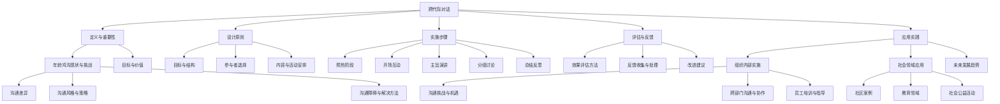

                 

# 跨代际对话工作坊：弥合年龄鸿沟的实践

关键词：跨代际对话、年龄鸿沟、沟通、工作坊、设计、实施、应用

摘要：本文将探讨跨代际对话工作坊的设计与实施，以弥合不同年龄群体之间的沟通鸿沟。文章首先介绍了跨代际对话的理论基础，包括其定义、重要性、沟通差异以及构建有效对话环境的方法。接着，文章详细阐述了跨代际对话工作坊的设计原则、实施步骤和评估反馈机制。最后，文章分析了跨代际对话在组织内部和社会领域的应用实践，并探讨了其未来发展趋势。

## 目录大纲

1. **跨代际对话工作坊：弥合年龄鸿沟的实践**
   1. 关键词
   2. 摘要
   3. 目录大纲

2. **第一部分：跨代际对话的理论基础**
   1. **第1章：跨代际对话的概述**
      1.1 跨代际对话的定义与重要性
      1.2 年龄鸿沟的现状与挑战
      1.3 跨代际对话的目标与价值
   2. **第2章：跨代际沟通的差异**
      2.1 年龄与文化背景的差异
      2.2 沟通风格与沟通策略
      2.3 跨代际沟通的障碍与解决方法
   3. **第3章：构建有效的跨代际对话环境**
      3.1 跨代际对话的准备工作
      3.2 创造包容与尊重的氛围
      3.3 角色定位与沟通角色

3. **第二部分：跨代际对话工作坊的设计与实施**
   1. **第4章：跨代际对话工作坊的设计原则**
      4.1 工作坊的目标与结构
      4.2 工作坊的参与者选择
      4.3 工作坊的内容与活动安排
   2. **第5章：跨代际对话工作坊的实施步骤**
      5.1 预热阶段
      5.2 开场互动
      5.3 主旨演讲
      5.4 分组讨论
      5.5 总结反思
   3. **第6章：跨代际对话工作坊的评估与反馈**
      6.1 工作坊效果评估方法
      6.2 参与者反馈收集与处理
      6.3 工作坊改进建议

4. **第三部分：跨代际对话的应用实践**
   1. **第7章：跨代际对话在组织内部的实施**
      7.1 组织内部跨代际对话的挑战与机遇
      7.2 跨部门沟通与协作
      7.3 员工培训与指导
   2. **第8章：跨代际对话在社会领域的应用**
      8.1 社区跨代际对话的案例
      8.2 教育领域的跨代际对话
      8.3 社会公益活动的跨代际对话
   3. **第9章：跨代际对话的未来发展趋势**
      9.1 新兴技术与跨代际对话
      9.2 跨代际对话的国际合作
      9.3 未来社会中的跨代际对话角色

5. **附录**
   1. **附录 A：跨代际对话资源推荐**
      1.1 相关书籍推荐
      1.2 在线课程与讲座推荐
      1.3 跨代际对话实践案例汇总

## 跨代际对话的概念与联系 Mermaid 流程图

### 跨代际对话的概述

跨代际对话，顾名思义，是指在不同年龄段的人之间进行的交流与沟通。这种对话旨在缩小年龄差异带来的沟通鸿沟，促进不同年龄群体之间的理解和协作。随着年龄结构的多样化，跨代际对话的重要性日益凸显。

#### 1.1 跨代际对话的定义与重要性

跨代际对话并非简单的沟通，而是包含对各自文化、价值观、生活方式的理解和尊重。其定义可以概括为：在尊重、平等、开放的氛围下，不同年龄群体之间就共同关心的问题进行深入探讨，以实现思想碰撞和共识达成的过程。

跨代际对话的重要性体现在以下几个方面：

1. **促进社会和谐**：通过跨代际对话，不同年龄群体可以更好地理解彼此的需求和期望，减少误解和冲突，增强社会凝聚力。
2. **激发创新思维**：不同年龄群体在知识和经验上的互补，有助于激发创新思维，推动社会进步。
3. **提升沟通能力**：参与跨代际对话的过程，有助于提高个人的沟通技巧和团队协作能力。

#### 1.2 年龄鸿沟的现状与挑战

年龄鸿沟是指由于年龄差异导致的信息、价值观、生活方式等方面的差异。在现代社会，年龄鸿沟呈现出以下现状和挑战：

1. **信息鸿沟**：不同年龄群体对于新兴科技和信息工具的掌握程度不同，导致信息获取和处理能力上的差异。
2. **价值观差异**：不同年龄群体成长的环境和文化背景不同，导致价值观上的差异，这在沟通中可能引发冲突。
3. **生活方式差异**：不同年龄段的人有着不同的生活习惯和社交方式，这些差异可能在跨代际沟通中产生障碍。

#### 1.3 跨代际对话的目标与价值

跨代际对话的目标是建立相互尊重、理解和平等的沟通环境，具体包括：

1. **增进理解与尊重**：通过对话，不同年龄群体可以增进对彼此的理解，尊重对方的观点和经验。
2. **促进知识共享**：不同年龄群体在知识和经验上的互补，有助于实现知识的共享和传承。
3. **提升沟通能力**：跨代际对话提供了一个实践沟通技巧的平台，有助于提升个人的沟通能力和团队协作能力。

总之，跨代际对话不仅有助于缩小年龄鸿沟，促进社会和谐，还能够激发创新思维，提升个体的综合素质。在接下来的章节中，我们将深入探讨跨代际沟通的差异、构建有效对话环境的方法以及跨代际对话工作坊的设计与实施。

### 跨代际沟通的差异

跨代际沟通是指在跨越不同年龄段的人群之间进行的交流。由于年龄、文化背景、生活经验和价值观等方面的差异，跨代际沟通常常面临诸多挑战。为了有效地进行跨代际沟通，了解和应对这些差异是至关重要的。

#### 2.1 年龄与文化背景的差异

年龄与文化背景的差异是跨代际沟通中的一个重要因素。不同年龄段的人成长的时代背景和文化环境不同，这导致了他们在信息处理方式、价值观念、生活态度和沟通风格等方面的差异。

1. **信息处理方式**：年轻一代通常更加适应和接受新兴科技和社交媒体，他们在信息获取和处理上更加灵活和快速。而年长一代可能更习惯于传统媒介和面对面沟通，对新兴技术的接受度较低。

2. **价值观念**：年轻一代受到现代文化的影响，更加追求个性化和自由，强调个人表达和自我实现。而年长一代则可能更加传统，重视家庭和社会责任。

3. **生活态度**：年轻一代倾向于更加开放和进取，愿意尝试新事物，对变化持包容态度。年长一代则可能更加保守，倾向于稳定和安全感。

#### 2.2 沟通风格与沟通策略

不同年龄群体在沟通风格和策略上也有所差异。这些差异主要体现在以下几个方面：

1. **直接与间接沟通**：年轻一代倾向于直接沟通，喜欢表达自己的观点和感受。而年长一代则可能更倾向于间接沟通，喜欢通过委婉的方式表达意见。

2. **对话与倾听**：年轻一代在沟通中更注重互动和对话，希望双方都能积极参与讨论。年长一代则可能更注重倾听，倾向于先听后说，尊重对方的意见。

3. **表达情感**：年轻一代在沟通中更愿意表达情感，包括喜怒哀乐。而年长一代可能更克制情感表达，倾向于理性沟通。

#### 2.3 跨代际沟通的障碍与解决方法

跨代际沟通中的障碍主要包括以下几种：

1. **代沟**：由于年龄差异导致的价值观、生活态度和沟通方式的差异，可能导致代沟的产生，影响沟通效果。

2. **误解与冲突**：由于对对方的文化背景、价值观念和沟通风格的不了解，可能导致误解和冲突，影响沟通的顺利进行。

3. **信息不对称**：年轻一代和年长一代在信息获取和处理能力上的差异，可能导致信息不对称，影响沟通的深度和广度。

为了克服这些障碍，可以采取以下解决方法：

1. **提高沟通意识**：意识到跨代际沟通的重要性，主动学习和适应对方的沟通风格。

2. **增加互动机会**：通过参与共同活动，增加不同年龄群体之间的互动和交流。

3. **尊重差异**：在沟通中尊重对方的观点和经验，避免因差异而产生误解和冲突。

4. **使用共同语言**：寻找不同年龄群体之间共同的语言和话题，增进理解和沟通。

总之，跨代际沟通的差异是客观存在的，但通过提高沟通意识、增加互动机会和尊重差异，可以有效克服这些障碍，实现有效的跨代际沟通。在下一章节中，我们将探讨如何构建有效的跨代际对话环境，以促进跨代际沟通的顺利进行。

### 构建有效的跨代际对话环境

为了实现有效的跨代际对话，创建一个包容与尊重的氛围是至关重要的。以下是构建有效跨代际对话环境的几个关键步骤：

#### 3.1 跨代际对话的准备工作

在组织或开展跨代际对话之前，需要进行充分的准备工作，以确保对话的顺利进行。以下是一些重要的准备工作：

1. **明确目标**：在开始对话之前，需要明确对话的目标和期望结果。这可以帮助参与者了解对话的目的，并确保对话的方向和主题一致。

2. **选择合适的场地**：选择一个适合交流的场地，确保环境安静、舒适，有利于参与者集中注意力。

3. **制定议程**：制定详细的对话议程，包括对话的主题、时间安排、参与者和讨论的环节。

4. **提前通知**：提前通知参与者，并提供关于对话的详细信息，包括时间、地点、议程等，以确保他们能够做好准备。

5. **参与者背景调查**：了解参与者的年龄、职业、文化背景和沟通风格，以便在对话中更好地适应和满足不同参与者的需求。

#### 3.2 创造包容与尊重的氛围

创造一个包容与尊重的氛围是跨代际对话成功的关键。以下是一些具体的方法：

1. **设定对话规则**：在对话开始前，明确设定一些基本的对话规则，如尊重他人、倾听他人意见、不中断他人发言等。这可以帮助参与者保持对话的秩序，避免冲突和误解。

2. **提供平等发言机会**：确保每个参与者都有平等的发言机会，避免某一方占据主导地位，忽视其他参与者的意见。

3. **鼓励多元观点**：鼓励参与者分享不同的观点和经验，尊重并欣赏彼此的差异。通过这种方式，可以激发更多的思想碰撞，促进理解和共识的形成。

4. **建立信任**：通过建立信任，促进参与者之间的真诚交流和开放沟通。信任可以通过倾听、尊重和诚实来建立。

5. **消除偏见和歧视**：在对话过程中，注意消除偏见和歧视，确保对话的公平和公正。

#### 3.3 角色定位与沟通角色

在跨代际对话中，明确参与者的角色和沟通角色对于对话的顺利进行至关重要。以下是一些常见的角色和沟通角色：

1. **引导者/主持人**：引导者/主持人的角色是确保对话的顺利进行，引导参与者遵守对话规则，确保对话的主题和议程得到遵守。

2. **参与者**：参与者是跨代际对话的核心，他们分享观点、经验和见解，共同探讨和解决问题。

3. **记录者**：记录者的角色是记录对话的过程和关键内容，为后续分析和总结提供依据。

4. **反馈者**：反馈者的角色是提供对对话效果的反馈，包括对对话流程、内容和个人表现的评估。

通过以上步骤和方法，可以有效地构建一个包容与尊重的跨代际对话环境，促进不同年龄群体之间的有效沟通和理解。在接下来的章节中，我们将详细探讨跨代际对话工作坊的设计原则和实施步骤。

### 跨代际对话工作坊的设计原则

为了确保跨代际对话工作坊的顺利进行，并实现其预期目标，设计工作坊时需要遵循一些关键原则。以下是一些核心原则和具体实施方法：

#### 4.1 工作坊的目标与结构

明确工作坊的目标是设计过程中的第一步。跨代际对话工作坊的目标可能包括：

1. **增进理解与尊重**：通过对话，促进不同年龄群体之间的理解和尊重。
2. **知识共享**：促进不同年龄群体之间的知识交流和经验分享。
3. **提高沟通技巧**：通过实践，提升参与者的沟通技巧和团队合作能力。

工作坊的结构应围绕这些目标进行设计，确保各个环节都为目标的实现提供支持。

1. **议程设计**：制定详细的工作坊议程，包括开场互动、主题讨论、小组活动、总结反思等环节。
2. **时间安排**：合理安排各个环节的时间，确保每个环节都有足够的时间进行深入讨论和互动。

#### 4.2 工作坊的参与者选择

参与者选择是工作坊设计的关键环节，决定了工作坊的效果。选择参与者时，应考虑以下因素：

1. **年龄多样性**：确保参与者涵盖不同年龄段，以体现跨代际对话的特点。
2. **代表性**：选择在各自领域中具有代表性的人物，以确保对话的质量和深度。
3. **背景与经验**：选择具有丰富背景和经验的人，以便在讨论中提供有价值的见解和观点。

#### 4.3 工作坊的内容与活动安排

工作坊的内容和活动安排应紧密结合目标，设计具有吸引力和互动性的活动，以激发参与者的兴趣和参与度。以下是一些具体的内容和活动安排：

1. **开场互动**：通过破冰活动和轻松的讨论，帮助参与者放松并建立初步的联系。
2. **主题讨论**：围绕预定的主题进行深入讨论，鼓励参与者分享观点和经验。
3. **小组活动**：将参与者分成小组，进行角色扮演、案例分析或小组讨论等活动，以促进互动和深入理解。
4. **总结反思**：在活动结束后，进行总结和反思，帮助参与者回顾和巩固学习成果。

#### 4.4 其他设计原则

除了上述核心原则，以下是一些额外的设计原则，以确保工作坊的有效性和吸引力：

1. **互动性**：确保工作坊的各个环节都具有互动性，鼓励参与者积极参与和表达自己的观点。
2. **灵活性**：设计工作坊时，考虑到不同参与者的需求和背景，保持一定的灵活性，以便根据实际情况进行调整。
3. **反馈机制**：建立反馈机制，鼓励参与者在工作坊期间和结束后提供反馈，以便评估工作坊的效果并不断改进。

通过遵循这些设计原则，可以有效地设计出既有针对性又有吸引力的跨代际对话工作坊，为不同年龄群体之间的沟通和理解提供平台。

### 跨代际对话工作坊的实施步骤

在跨代际对话工作坊的实施过程中，每个阶段都至关重要，需要精心设计和组织，以确保参与者能够充分参与并达到预期效果。以下是实施跨代际对话工作坊的详细步骤：

#### 5.1 预热阶段

预热阶段是工作坊开始的第一步，目的是帮助参与者放松心情，建立初步的联系，为后续的深入讨论奠定基础。

1. **破冰活动**：通过有趣的破冰活动，如自我介绍、团队游戏或小组互动，让参与者快速熟悉彼此，打破初次见面的尴尬。
2. **轻松讨论**：引导参与者进行一些轻松的讨论，如分享个人经历或兴趣爱好，以促进互动和建立信任。

#### 5.2 开场互动

开场互动的目的是为整个工作坊定下基调，激发参与者的兴趣和参与度。

1. **主题介绍**：由主持人简要介绍工作坊的主题和目标，明确讨论的方向和重点。
2. **互动游戏**：设计一些互动游戏，如小组竞赛或角色扮演，以激发参与者的兴趣和积极性。

#### 5.3 主旨演讲

主旨演讲由专家或资深人士进行，目的是为参与者提供专业的知识和见解，引导讨论的方向。

1. **演讲内容**：主旨演讲应围绕工作坊的主题，提供深入的分析和见解，引导参与者思考和讨论。
2. **提问环节**：在演讲结束后，设置提问环节，鼓励参与者提出问题，与演讲者进行互动和交流。

#### 5.4 分组讨论

分组讨论是工作坊的核心环节，通过小组互动和合作，促进参与者之间的交流和思想碰撞。

1. **分组**：将参与者分成几个小组，每组包含不同年龄段的成员，以确保多样性和代表性。
2. **讨论主题**：为每个小组分配一个讨论主题，鼓励小组成员就主题进行深入讨论和交流。
3. **汇报**：讨论结束后，每个小组选派代表进行汇报，分享讨论的成果和见解。

#### 5.5 总结反思

总结反思环节是工作坊的收尾阶段，目的是帮助参与者回顾和巩固学习成果，并为进一步的讨论和实践提供方向。

1. **总结**：主持人对整个工作坊进行总结，回顾讨论的主要观点和成果。
2. **反思**：鼓励参与者分享个人感受和反思，讨论工作坊对他们的启发和影响。
3. **行动计划**：引导参与者制定行动计划，将工作坊的学习成果应用到实际生活和工作中。

通过以上实施步骤，可以确保跨代际对话工作坊的顺利进行，促进不同年龄群体之间的有效沟通和理解。在下一章节中，我们将探讨如何评估和反馈跨代际对话工作坊的效果。

### 跨代际对话工作坊的评估与反馈

评估与反馈是跨代际对话工作坊的重要组成部分，通过系统地收集和分析参与者的反馈，可以评估工作坊的效果，识别存在的问题，并为未来的工作坊提供改进建议。

#### 6.1 工作坊效果评估方法

为了全面评估工作坊的效果，可以采用以下几种评估方法：

1. **定量评估**：通过问卷调查、评分表格等形式，收集参与者在知识获取、技能提升、沟通能力等方面的定量数据。这些数据可以提供具体的量化指标，帮助评估工作坊的整体效果。

2. **定性评估**：通过访谈、观察和小组讨论等形式，收集参与者的定性反馈。这些反馈可以提供更深入的见解，了解工作坊的具体影响和参与者的真实感受。

3. **行为观察**：观察参与者在工作坊中的行为变化，如参与度、互动频率、讨论深度等。这些观察可以为评估工作坊的实际效果提供直观的依据。

#### 6.2 参与者反馈收集与处理

收集参与者反馈时，应注意以下事项：

1. **匿名性**：确保参与者反馈的匿名性，以避免因身份暴露而影响反馈的真实性和完整性。

2. **及时性**：在适当的时间收集反馈，如工作坊结束后立即进行，以确保反馈的最新性和准确性。

3. **多样性**：收集不同类型的反馈，包括定量数据和定性数据，以及直接观察的数据，以获得全面的评估。

4. **互动性**：鼓励参与者积极参与反馈过程，提供开放性和建设性的意见，以便为改进工作坊提供有价值的参考。

#### 6.3 工作坊改进建议

基于评估和反馈结果，可以提出以下改进建议：

1. **内容调整**：根据参与者的反馈，调整工作坊的内容和活动安排，使其更加符合参与者的需求和兴趣。

2. **活动优化**：优化工作坊的活动设计，增强互动性和参与度，如引入更多有趣的互动游戏和小组讨论。

3. **引导技巧**：提高主持人和引导者的技能和经验，确保他们在工作坊中的角色更加有效，能够引导参与者进行深入和有意义的讨论。

4. **培训支持**：为参与者提供额外的培训和支持，如提供相关的书籍、文章、视频等资源，帮助他们更好地理解和应用工作坊中的知识。

通过系统的评估和反馈，可以不断改进跨代际对话工作坊的设计和实施，提高其效果和参与者的满意度。在下一章节中，我们将探讨跨代际对话在组织内部和社会领域的应用实践。

### 跨代际对话在组织内部的实施

在组织内部，跨代际对话的实施对于促进团队合作、提升创新能力和增强组织凝聚力具有重要意义。以下将探讨组织内部跨代际对话的挑战、机遇以及具体的实施方法。

#### 7.1 组织内部跨代际对话的挑战与机遇

组织内部跨代际对话面临以下挑战：

1. **文化差异**：不同年龄段的员工在价值观、工作态度和沟通风格上存在差异，可能导致误解和冲突。
2. **权力结构**：组织内部的权力结构可能加剧代沟，年长员工可能更倾向于保持现状，而年轻员工则可能寻求变革。
3. **沟通渠道**：跨代际沟通的渠道和方式可能不完善，导致信息传递不畅。

然而，这些挑战也蕴含着机遇：

1. **知识共享**：不同年龄段的员工具有不同的经验和知识，通过跨代际对话，可以实现知识的互补和传承。
2. **创新能力**：不同年龄段的员工在思维方式上存在差异，通过跨代际对话，可以激发创新的火花。
3. **组织凝聚力**：通过跨代际对话，可以增强员工之间的理解和信任，提升组织的凝聚力。

#### 7.2 跨部门沟通与协作

在组织内部，跨部门沟通与协作是实现跨代际对话的重要途径。以下是一些具体的方法：

1. **跨部门工作坊**：组织跨部门的工作坊，将不同部门、不同年龄段的员工聚集在一起，进行主题讨论和互动活动，以促进相互了解和合作。
2. **团队建设活动**：设计团队建设活动，如团队拓展训练、户外探险等，增强员工之间的互动和信任。
3. **共享平台**：建立共享平台，如内部论坛、微信群等，提供员工交流和分享经验的渠道。

#### 7.3 员工培训与指导

为了提高跨代际对话的有效性，员工培训与指导至关重要。以下是一些培训与指导方法：

1. **沟通技巧培训**：为员工提供沟通技巧培训，如非暴力沟通、有效倾听等，帮助他们更好地理解和尊重不同年龄段的员工。
2. **领导力培训**：针对不同层级的员工，提供领导力培训，帮助他们理解和应对跨代际沟通中的挑战。
3. **导师计划**：实施导师计划，将年轻员工与资深员工配对，通过一对一的指导和反馈，促进知识传承和跨代际沟通。

通过在组织内部实施跨代际对话，可以有效地克服文化差异和权力结构的挑战，促进知识共享和创新能力，增强组织凝聚力。在下一章节中，我们将探讨跨代际对话在社会领域的应用实践。

### 跨代际对话在社会领域的应用

跨代际对话不仅局限于组织内部，还可以广泛应用于社会领域，促进不同群体之间的理解和合作。以下将探讨跨代际对话在社区、教育和社会公益活动中的应用案例。

#### 8.1 社区跨代际对话的案例

在社区层面，跨代际对话有助于建立和谐的邻里关系，增强社区凝聚力。以下是一些具体的应用案例：

1. **社区交流活动**：一些社区定期组织跨代际交流活动，如茶话会、亲子活动等，让不同年龄段的居民有机会相互了解和交流。
2. **老年人志愿服务**：鼓励年轻居民参与老年人志愿服务，如陪伴老人聊天、帮助购物等，通过实际行动促进跨代际互动和理解。
3. **社区发展委员会**：社区发展委员会中设立跨代际代表，确保不同年龄段的居民在社区事务中都有发言权和影响力。

这些活动不仅有助于缩小代沟，还能激发社区的活力和创造力，提升社区的整体幸福感。

#### 8.2 教育领域的跨代际对话

在教育领域，跨代际对话可以促进师生之间的理解，改善教育环境，提高教育质量。以下是一些应用案例：

1. **代际课堂**：学校可以开设代际课堂，邀请不同年龄段的专家和志愿者参与教学，让学生从不同的视角和经验中学习。
2. **学生与老年人互动**：组织学生与老年人进行互动活动，如共同参与社区服务项目、举办老人节活动等，增强学生的社会责任感和同理心。
3. **教师培训**：为教师提供跨代际沟通技巧培训，帮助他们更好地理解和应对不同年龄段学生的需求和特点。

这些措施有助于营造一个包容、尊重和理解的学习环境，提升学生的综合素质和教师的职业素养。

#### 8.3 社会公益活动的跨代际对话

社会公益活动是跨代际对话的重要实践领域，通过共同参与公益活动，不同年龄群体可以共同为社会贡献力量，增强社会归属感和责任感。以下是一些应用案例：

1. **志愿服务项目**：组织不同年龄段的志愿者参与社会公益活动，如扶贫助困、环境保护等，通过共同行动促进跨代际合作。
2. **社区共建**：鼓励社区中的不同年龄段居民共同参与社区建设和维护，如共同策划和举办社区活动、共同维护社区环境等。
3. **社会倡导**：通过跨代际对话，推动社会对于老年人、青少年等特定群体的关注和支持，促进社会的公平和包容。

通过这些公益活动，跨代际对话不仅有助于实现个人的成长和进步，还能提升整个社会的文明程度和和谐度。

总之，跨代际对话在社会领域的应用具有广泛的意义和潜力，通过在不同领域的实践，可以促进不同群体之间的理解和合作，推动社会的和谐发展。在下一章节中，我们将探讨跨代际对话的未来发展趋势。

### 跨代际对话的未来发展趋势

随着科技的不断进步和社会的快速发展，跨代际对话也在不断演变，呈现出新的发展趋势。以下将探讨新兴技术的应用、跨代际对话的国际合作以及未来社会中的跨代际对话角色。

#### 9.1 新兴技术的应用

新兴技术的发展为跨代际对话提供了新的平台和工具，极大地提升了对话的效率和效果。

1. **数字平台**：社交媒体和在线协作工具，如微信、Zoom、Slack等，为跨代际对话提供了便捷的沟通渠道，使不同年龄段的群体能够随时随地参与对话。
2. **人工智能**：人工智能技术，如自然语言处理和语音识别，可以辅助跨代际对话，帮助理解不同年龄段的需求和表达方式，提高对话的准确性。
3. **虚拟现实与增强现实**：虚拟现实（VR）和增强现实（AR）技术为跨代际对话带来了新的互动体验，使参与者能够沉浸在虚拟的环境中，更好地理解和感受对方的观点。

#### 9.2 跨代际对话的国际合作

国际合作在跨代际对话中发挥着越来越重要的作用，不同国家和地区之间的交流与学习有助于推动跨代际对话的发展。

1. **跨国项目**：通过跨国项目，如国际会议、研讨会和工作坊，不同国家的专家和参与者可以共同探讨跨代际对话的实践和方法，分享经验和成果。
2. **文化交流**：通过文化交流活动，如国际文化节、留学项目等，不同文化背景的群体可以相互了解和尊重，促进跨代际对话的全球化发展。
3. **国际合作研究**：跨学科和国际合作研究为跨代际对话提供了理论支持和实践指导，有助于解决跨代际沟通中的复杂问题。

#### 9.3 未来社会中的跨代际对话角色

未来社会中的跨代际对话将扮演更加重要的角色，随着社会的进步和老龄化趋势的加剧，跨代际对话的需求也将不断增加。

1. **社会和谐**：跨代际对话有助于促进社会和谐，减少代际冲突，增强社会凝聚力。
2. **知识传承**：通过跨代际对话，不同年龄段的群体可以分享知识和经验，实现知识的传承和共享。
3. **创新能力**：跨代际对话可以激发创新思维，通过不同年龄群体的思维碰撞，推动社会进步和创新发展。

总之，跨代际对话的未来发展趋势充满机遇和挑战。新兴技术的应用将极大地提升跨代际对话的效率和效果，国际合作将为跨代际对话带来新的动力和视野，而在未来社会中，跨代际对话将成为推动社会和谐、知识传承和创新能力的重要力量。

### 附录

#### 附录 A：跨代际对话资源推荐

以下是一些关于跨代际对话的优质资源，包括书籍、在线课程与讲座推荐，以及跨代际对话实践案例汇总，供读者参考和学习。

##### A.1 相关书籍推荐

1. **《代际对话：理解和沟通不同年龄群体》** - 作者：[大卫·巴赫奇切克（David Bachman）]
   - 内容简介：本书深入探讨了不同年龄群体在沟通和理解上的差异，提供了实用的沟通策略和技巧。
   
2. **《跨越代沟：如何与不同年龄的人有效沟通》** - 作者：[乔伊斯·迈耶（Joyce Meyer）]
   - 内容简介：本书从心理和情感角度出发，分析了代沟的产生原因，并提供了具体的沟通方法。

##### A.2 在线课程与讲座推荐

1. **《跨代际沟通：跨越年龄鸿沟》** - 课程平台：[Coursera]
   - 内容简介：本课程介绍了跨代际沟通的理论和实践，帮助学习者理解和应对跨代际沟通中的挑战。

2. **《代际对话：理解与尊重》** - 讲座平台：[YouTube]
   - 内容简介：该讲座由跨代际沟通专家主讲，分享了丰富的跨代际沟通经验和案例。

##### A.3 跨代际对话实践案例汇总

1. **“社区代际互动日”活动** - 活动背景：某社区组织定期举办的代际互动活动，吸引了不同年龄段的居民参与。
   - 活动效果：通过共同活动，促进了不同年龄群体之间的理解和互动，提升了社区的和谐度。

2. **“代际智慧共创”项目** - 项目背景：某企业实施的代际智慧共创项目，鼓励不同年龄段的员工共同参与项目策划和实施。
   - 项目效果：项目不仅提升了员工的工作满意度，还促进了跨代际合作和知识共享。

通过以上资源和案例，读者可以深入了解跨代际对话的理论和实践，提高跨代际沟通的能力和技巧，为构建和谐的社会关系奠定基础。

### 作者信息

**作者：AI天才研究院/AI Genius Institute & 禅与计算机程序设计艺术 /Zen And The Art of Computer Programming**

