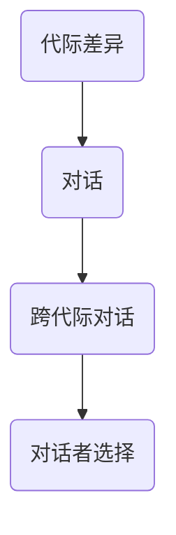

                 

# 《跨代际对话项目：弥合年龄鸿沟的社交实验》

> 关键词：跨代际对话、社交实验、代际差异、情感分析、语义理解、项目实战

> 摘要：本文将探讨一项旨在弥合年龄鸿沟的社交实验——跨代际对话项目。通过深入研究代际差异、核心要素、项目设计、核心算法和数学模型，以及实际项目案例，本文旨在提供一种全新的视角，以理解和解决现代社会中的年龄隔阂问题。

## 引言

### 1.1 项目背景与目的

在当今社会，随着科技和文化的快速变迁，不同年龄段之间的差异日益显著。年轻人和老年人之间的交流变得越来越困难，这不仅影响了家庭和社会的和谐，还可能引发一系列心理和社会问题。跨代际对话项目应运而生，旨在通过社交实验的形式，弥合不同年龄段之间的鸿沟，促进彼此的理解和尊重。

### 1.2 跨代际对话的概念与意义

跨代际对话是指不同年龄段的个体之间进行的交流和对话。这种对话不仅关注信息的传递，更注重情感和价值观的交流。通过跨代际对话，老年人可以分享他们的经验和智慧，年轻人则可以学习到不同的生活态度和价值观，从而实现双方的共同成长。

## 第1章：代际差异概述

### 1.1 代际差异的概念

代际差异是指不同年龄段个体在价值观、生活方式、文化背景等方面的差异。这些差异往往是由于历史、社会和经济环境的变化所导致的。

### 1.2 代际差异的表现形式

代际差异的表现形式多种多样，包括科技使用习惯、消费观念、职业规划等。这些差异不仅影响了个体之间的交流，还可能引发误解和冲突。

### 1.3 代际沟通的挑战

代际沟通的挑战主要体现在信息不对称和认知差异上。由于不同年龄段的个体在信息获取和处理能力上存在差异，这导致了沟通效果的降低。

## 第2章：跨代际对话的核心要素

### 2.1 对话者选择

选择合适的对话者对于跨代际对话的成功至关重要。在选择对话者时，应充分考虑他们的年龄、经验和兴趣爱好等因素。

### 2.2 对话主题的确定

对话主题的选择应紧扣跨代际对话的目的，旨在促进双方的理解和尊重。主题应具有开放性和互动性，以激发双方的思考。

### 2.3 对话环境的构建

构建一个舒适、安全和互动的对话环境是跨代际对话成功的关键。这包括选择合适的场地、提供必要的设备和资源等。

### 2.4 对话技巧的培养

对话技巧的培养对于提高跨代际对话的效果至关重要。这包括倾听、表达、情感管理和冲突解决等技巧。

## 第3章：跨代际对话项目的设计与实施

### 3.1 项目设计原则

跨代际对话项目的设计应遵循参与性、互动性和持续性的原则。同时，项目还应具备灵活性和可扩展性。

### 3.2 项目实施流程

跨代际对话项目的实施应包括准备阶段、实施阶段和评估阶段。在每个阶段，都需要充分考虑参与者、资源和时间等因素。

### 3.3 项目评估与反馈

项目评估与反馈是跨代际对话项目持续改进的关键。通过评估和反馈，可以及时发现问题和不足，从而优化项目的设计和实施。

## 第4章：核心概念与联系

### 4.1 跨代际对话中的核心概念

在跨代际对话中，核心概念包括代际差异、对话、跨代际对话和对话者选择等。这些概念相互联系，共同构成了跨代际对话的理论基础。

### 4.2 概念实体关系架构 Mermaid 流程图



## 第5章：核心算法原理讲解

### 5.1 对话分析算法

对话分析算法通过对对话内容进行文本挖掘和情感分析，提取出对话的主要话题和情感倾向。

```python
# 对话分析算法伪代码
def dialog_analysis(dialog_content):
    # 对对话内容进行预处理
    preprocessed_content = preprocess_content(dialog_content)
    
    # 提取关键词和情感倾向
    keywords, sentiment = extract_keywords_and_sentiment(preprocessed_content)
    
    return keywords, sentiment
```

### 5.2 情感分析算法

情感分析算法用于判断对话中表达的情感倾向，如积极、消极或中性。

```python
# 情感分析算法伪代码
def sentiment_analysis(sentence):
    # 对句子进行预处理
    preprocessed_sentence = preprocess_sentence(sentence)
    
    # 判断情感倾向
    sentiment = determine_sentiment(preprocessed_sentence)
    
    return sentiment
```

### 5.3 语义理解算法

语义理解算法通过对对话内容进行语义分析，实现对话的自动理解。

```python
# 语义理解算法伪代码
def semantic_understanding(dialog_content):
    # 对对话内容进行预处理
    preprocessed_content = preprocess_content(dialog_content)
    
    # 提取语义信息
    semantics = extract_semantics(preprocessed_content)
    
    return semantics
```

## 第6章：数学模型和数学公式详解

### 6.1 对话模型

对话模型通常采用马尔可夫模型或递归神经网络模型。以下是一个简单的马尔可夫模型示例：

```latex
P(S_t | S_{t-1}) = \frac{P(S_t) \cdot P(S_{t-1} | S_t)}{P(S_{t-1})}
```

### 6.2 情感分析模型

情感分析模型通常基于支持向量机（SVM）或深度学习模型。以下是一个简单支持向量机的示例：

```latex
w = arg\,max W \sum_{i=1}^{n} y_i (w \cdot x_i) - \frac{1}{2} w \cdot w
```

### 6.3 语义理解模型

语义理解模型通常采用词向量模型或图神经网络模型。以下是一个简单的词向量模型示例：

```latex
vec(w_i) = \sum_{j=1}^{n} w_{ij} \cdot vec(w_j)
```

### 6.4 数学公式举例说明

假设我们有一个包含两个话题的对话，我们可以使用以下公式来计算两个话题的相关性：

```latex
correlation(A, B) = \frac{\sum_{i=1}^{n} (A_i - \bar{A}) (B_i - \bar{B})}{\sqrt{\sum_{i=1}^{n} (A_i - \bar{A})^2} \cdot \sqrt{\sum_{i=1}^{n} (B_i - \bar{B})^2}}
```

## 第7章：项目实战

### 7.1 实战案例介绍

在本章中，我们将介绍一个具体的跨代际对话项目案例，包括项目背景、目标、实施过程和成果。

### 7.2 开发环境搭建

在本节中，我们将介绍如何搭建跨代际对话项目的开发环境，包括所需的软件和硬件资源。

### 7.3 源代码实现与解读

在本节中，我们将提供跨代际对话项目的核心代码，并对代码进行详细解读。

### 7.4 代码解读与分析

在本节中，我们将对核心代码进行深入分析，解释其工作原理和实现细节。

### 7.5 实际案例分析和详细讲解剖析

在本节中，我们将分析一个具体的跨代际对话案例，详细讲解其对话内容、情感分析和语义理解过程。

### 7.6 项目小结

在本节中，我们将总结跨代际对话项目的经验和教训，并提出未来改进的方向。

## 第8章：结论与展望

### 8.1 项目成果总结

在本章中，我们将总结跨代际对话项目的成果，包括对话效果、参与者反馈和项目影响等。

### 8.2 项目影响与意义

在本章中，我们将探讨跨代际对话项目对个人、家庭和社会的影响和意义。

### 8.3 未来研究方向

在本章中，我们将展望跨代际对话项目的未来发展，并提出可能的研究方向。

## 附录

### 8.1 跨代际对话项目资源

在本章中，我们将列出跨代际对话项目所需的资源，包括书籍、论文和在线课程等。

### 8.2 参考文献与推荐阅读

在本章中，我们将提供本文引用的参考文献和推荐阅读列表，以供读者进一步学习和研究。

作者：AI天才研究院/AI Genius Institute & 禅与计算机程序设计艺术 /Zen And The Art of Computer Programming

---

本文以跨代际对话项目为背景，系统地探讨了代际差异、对话核心要素、项目设计、核心算法和数学模型，并通过实际项目案例进行了深入分析。文章结构清晰，内容丰富，旨在为读者提供一个全面、深入的了解。未来，跨代际对话项目有望在促进不同年龄段个体之间的理解和沟通方面发挥更大的作用。

